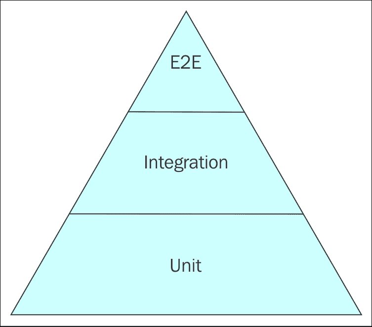
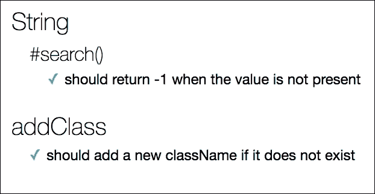

# 第十三章. 使用 Mocha、Karma 和更多进行测试

测试是软件开发的一个基本组成部分，尤其是在处理与最终用户和不同客户端交互的应用程序时，例如 JavaScript SPAs。由于可能消费应用程序的客户端种类繁多，因此网络应用程序代码的结果往往难以预测，因此应该考虑到所有可能的场景并进行适当的测试。

在本章中，我们将涵盖以下主题：

+   单元测试、集成测试和**端到端**（**E2E**）测试是什么？

+   如何使用 Mocha、Chai 和 Sinon.js 进行 JavaScript 单元测试

+   如何配置 Karma 使用 Jasmine 测试 AngularJS

+   如何使用 AngularJS 进行单元测试

+   如何使用 AngularJS 进行端到端测试

# 测试类型

软件行业中已知有许多种测试类型，但有三类测试被持续使用，尤其是在网络应用开发中。具体如下：

+   单元测试

+   集成测试

+   端到端测试，也称为*功能*测试

这三种测试类型构成了所谓的*软件测试金字塔*。金字塔可以分解为更细粒度的测试形式，但从高视角来看，它看起来是这样的：



## 单元测试

软件测试金字塔的底层是*单元测试*。单元测试针对应用中最小的部分，即单元，在*隔离*于应用其余部分的情况下进行。一个单元通常是一个单独的方法或对象实例。当你对单元进行隔离测试时，这意味着测试不应该与任何应用依赖项交互，例如网络访问、数据库访问、用户会话以及在实际应用环境中可能需要的任何其他依赖项。相反，单元测试应该只执行本地内存中的操作。

任何单元测试的目标应该是仅测试应用程序的一个功能，并且该功能应封装在单元中。如果该单元有任何依赖项，它们应该被*模拟*或模拟，而不是调用实际的依赖项。我们将在本章后面进一步讨论这一点。

知道你将进行单元测试将帮助你编写更小、更专注的方法，因为它们更容易测试。许多人会争论说，你应该在编写任何应用程序代码之前先编写测试。然而，这并不总是实用的，因为你可能被推入一个快速的开发周期，没有时间进行编写单元测试的繁琐过程。对现有代码编写单元测试也可能很繁琐，但这是可以接受的，并且比完全没有单元测试要好。

让我们看看一些知名的 JavaScript 单元测试框架，它们可以快速轻松地集成到新的或现有应用程序中。

### Mocha

*Mocha* 是一个流行的 JavaScript 单元测试框架，在 Node.js 社区中广泛使用。让我们回顾一下本书开头提到的 Node.js 示例项目，并安装 Mocha，以便我们可以尝试一些单元测试示例：

```js
$ npm install mocha -g

```

全局安装 `mocha`，这样你就可以轻松地从任何目录访问它。

现在，让我们在项目的根目录下创建一个 `test` 目录来存储测试相关文件：

```js
$ mkdir test

```

在 `test` 目录下创建一个名为 `test.js` 的文件，并打开它进行编辑。将以下代码放入文件并保存：

```js
var assert = require('assert'); 
describe('String', function() { 
    describe('#search()', function() { 
        it('should return -1 when the value is not present', function() { 
            assert.equal(-1, 'text'.search(/testing/)); 
        }); 
    }); 
}); 

```

要运行测试，请在 `test` 目录下的控制台输入以下命令：

```js
$ mocha test.js

```

你应该在控制台中看到以下输出：

```js
 String
 #search()
 should return -1 when the value is not present
 1 passing (8ms)

```

使用 Mocha 的 `describe` 方法，此单元测试对 `String` 构造函数的 `search` 方法执行简单的 **断言**。在测试中，断言简单地说就是评估某事是否为 `true`。在此示例中，我们正在测试当 `search` 方法的参数在搜索上下文中未找到时，它返回 `-1` 的断言。

#### 使用 Chai 进行断言

之前的例子使用了 Node.js 的 `assert` 模块，但使用 Mocha，你将希望使用一个完整的断言库来构建一个实质性的测试环境。Mocha 与多个 JavaScript 断言库兼容，包括以下内容：

+   Should.js

+   Expect.js

+   Chai

+   Better-assert

+   Unexpected

Chai 是一个流行的活跃的开源断言库，因此我们将在此章的 Mocha 断言示例中使用它。首先，在你的本地 Node.js 环境中安装 `chai`：

```js
$ npm install chai --save-dev

```

Chai 包含三种断言风格，`should`、`expect` 和 `assert`，允许你选择你最喜欢的风味。

**应该风格断言**

*应该风格断言* 在 Chai 中通过 `chai.should()` 访问。此接口允许使用许多 JavaScript 开发者熟悉的链式方法语法，特别是如果你与 jQuery 等库合作过。链式方法名称使用自然语言来使编写测试更加流畅。此外，Chai 的 `should` 方法扩展了 `Object.prototype`，这样你就可以直接将其链接到你要测试的变量，如下所示：

```js
var should = require('chai').should(); // Execute the should function 
var test = 'a string'; 
test.should.be.a('string'); 

```

此示例将执行一个简单的断言，检查给定的变量是否为字符串。

**期望风格断言**

*期望风格断言* 在 Chai 中通过 `chai.expect` 访问。此接口与 `should` 类似，因为它使用方法链，但它不扩展 `Object.prototype`，因此它以更传统的方式使用，如下所示：

```js
var expect = require('chai').expect; 
var test = 'a string'; 
expect(test).to.be.a('string); 

```

此示例执行与上一个示例相同的断言，但使用 Chai 的 `expect` 方法而不是 `should`。请注意，对 `expect` 方法的 `require` 调用不会执行它，就像 `should` 一样。

**断言风格断言**

*断言风格断言* 在 Chai 中通过 `chai.assert` 访问。此接口使用更传统的断言风格，类似于 Node.js 原生的 `assert` 模块：

```js
var assert = require('chai').assert; 
var test = 'a string'; 
assert.typeOf(test, 'string'); 

```

这个示例执行了与前面两个示例相同的断言，但使用的是 Chai 的 `assert` 方法。注意，这个示例调用了 `assert.typeOf` 方法，这与原生的 JavaScript `typeof` 操作符类似，而不是像 `should` 和 `expect` 那样使用自然语言方法名称。

使用 Mocha 和 Chai 进行测试并不偏袒 Chai 中可用的任何特定断言风格，但最好选择一种并坚持下去，以便建立测试模式。我们将在这个章节的其余示例中使用 `should` 断言风格。

**使用 Mocha 和 Chai 的 Should-style 断言**

现在，让我们回到我们的原始 Mocha 测试示例 `test.js`，并在其下方添加一个类似的测试，但使用 Chai 的 `should` 断言方法：

```js
var should = require('chai').should(); 
describe('String', function() { 
    describe('#search()', function() { 
        it('should return -1 when the value is not present', function() { 
            'text'.search(/testing/).should.equal(-1); 
        }); 
    }); 
}); 

```

这执行了前面展示的相同测试，但使用的是 Chai 的 `should` 方法。然而，在这个场景中使用 Chai 的优势在于，它提供了 Node.js 默认提供的额外测试，并且 Chai 测试也兼容浏览器。

在控制台，运行 Mocha 测试：

```js
$ mocha test.js

```

这应该从您的两个测试中产生以下输出：

```js
 String
 #search()
 should return -1 when the value is not present
 String
 #search()
 should return -1 when the value is not present
 2 passing (9ms)

```

现在，让我们编写一个更有趣的测试，它可能在现实世界的应用场景中使用。一个 JavaScript 单页应用（SPA）通常会处理 DOM，因此我们应该相应地测试这种交互。以下方法可以作为示例：

```js
module.exports = { 
    addClass: function(elem, newClass) { 
        if (elem.className.indexOf(newClass) !== -1) { 
            return; 
        } 
        if (elem.className !== '') { 
            newClass = ' ' + newClass; 
        } 
        elem.className += newClass; 
    } 
}; 

```

`addClass` 方法简单地将 `className` 添加到 DOM 元素上，如果该元素尚未具有该 `className`。我们通过 `module.exports` 定义它，以便它可以作为 Node.js 模块使用。为了测试这段代码，将其保存为名为 `addClass.js` 的新文件，位于您的 `test` 目录下。

现在，回到 `test.js` 文件，在其他两个测试代码下方添加以下单元测试代码：

```js
var addClass = require('./addClass').addClass; 
describe('addClass', function() { 
    it('should add a new className if it does not exist', function() { 
        var elem = { 
            className: 'existing-class' 
        }; 
        addClass(elem, 'new-class'); 
        elem.className.split(' ')[1].should.equal('new-class'); 
    }); 
}); 

```

由于单元测试的无依赖性约束，我们在这里通过定义一个简单的 JavaScript 对象 `elem` 并给它一个 `className` 属性来模拟或**模拟**一个 DOM 元素，就像一个真实的 DOM 对象一样。这个测试严格编写来断言，在元素上调用 `addClass` 并传入一个新且不存在的 `className` 时，实际上会向该元素添加该 `className`。

从命令行运行测试现在应该产生以下输出：

```js
 String
 #search()
 should return -1 when the value is not present
 String
 #search()
 should return -1 when the value is not present
 addClass
 should add a new className if it does not exist
 3 passing (10ms)

```

#### 在浏览器中运行 Mocha 测试

Mocha 从命令行运行起来足够简单，但它还附带了一些资产，允许您轻松地在浏览器中运行测试。由于我们目前正在处理前端 JavaScript 代码，最好在它实际运行的环境中进行测试。为此，让我们首先在项目根目录下创建一个名为 `test.html` 的文件，并向其中添加以下标记：

```js
<!doctype html> 
<html> 
    <head> 
        <title>Mocha Tests</title> 
        <link rel="stylesheet" href="node_modules/mocha/mocha.css"> 
    </head> 
    <body> 
        <div id="mocha"></div> 
        <script src="img/mocha.js"></script> 
        <script src="img/chai.js"></script> 
        <script>mocha.setup('bdd');</script> 
        <script src="img/addClass.js"></script> 
        <script src="img/test.js"></script> 
        <script> 
            mocha.run(); 
        </script> 
    </body> 
</html> 

```

Mocha 提供了 CSS 和 JavaScript 资产，以便在浏览器中查看测试。对于 DOM 结构的要求仅仅是定义一个带有 `mocha` ID 的 `<div>`。样式应包含在 `<head>` 中，而 JavaScript 应包含在 `<div id="mocha">` 之下。此外，调用 `mocha.setup('bdd')` 告诉 Mocha 框架使用其 **行为驱动开发**(**BDD**) 接口进行测试。

现在，请记住，我们的 JavaScript 文件是以 Node.js 模块编写的，因此我们必须修改它们的语法才能在浏览器环境中正确运行。对于我们的 `addClass.js` 文件，让我们将方法定义为全局 `window` 对象上的 `DOM`：

```js
window.DOM = { 
    addClass: function(elem, newClass) { 
        if (elem.className.indexOf(newClass) !== -1) { 
            return; 
        } 
        if (elem.className !== '') { 
            newClass = ' ' + newClass; 
        } 
        elem.className += newClass; 
    } 
}; 

```

接下来，修改 `test.js` 以从 `window` 上下文加载 `chai.should` 和 `DOM.addClass`，而不是作为 Node.js 模块，然后让我们继续删除我们创建的原始 Node.js `assert` 模块测试：

```js
// Chai.should assertion 
var should = chai.should(); 
describe('String', function() { 
    describe('#search()', function() { 
        it('should return -1 when the value is not present', function() { 
            'text'.search(/testing/).should.equal(-1); 
        }); 
    }); 
}); 

// Test the addClass method 
var addClass = DOM.addClass; 
describe('addClass', function() { 
    it('should add a new className if it does not exist', function() { 
        var elem = { 
            className: 'existing-class' 
        }; 
        addClass(elem, 'new-class'); 
        elem.className.split(' ')[1].should.equal('new-class'); 
    }); 
}); 

```

您现在应该在 `test.js` 中有两个测试。最后，从项目的根目录运行一个本地 Node.js 服务器，以便您可以在浏览器中查看 `test.html` 页面：

```js
$ http-server

```

使用全局的 `http-server` 模块，您的本地服务器将在 `localhost:8080` 上对浏览器可用，测试文件在 `localhost:8080/test.html`。在浏览器中访问该页面，您将看到测试自动运行。如果一切设置正确，您应该看到以下输出：



### Sinon.js

由于单元测试中隔离的要求，通常需要通过提供 `spies`、`stubs`、`mocks` 或模仿真实对象行为的对象来模拟依赖项。*Sinon.js* 是一个流行的 JavaScript 库，它为测试提供了这些工具，并且与任何单元测试框架兼容，包括 Mocha。

#### 间谍

测试间谍是可以在回调依赖项的位置使用的函数，也用于 *监视* 或记录参数、返回值以及任何其他与应用程序中使用的相关数据。间谍在 Sinon.js 中通过 `sinon.spy()` API 提供。它可以用来创建一个匿名函数，该函数在测试序列中的每次调用时都会记录数据：

```js
var spy = sinon.spy(); 

```

此示例的一个用例是测试在 `publish` 和 `subscribe` 设计模式中，从另一个函数正确调用回调函数，如下所示：

```js
it('should invoke the callback on publish', function() { 
    var spy = sinon.spy(); 
    Payload.subscribe('test-event', spy); 
    Payload.publish('test-event'); 
    spy.called.should.equal(true); 
}); 

```

在此示例中，使用 spy 来充当 `Payload.js` 自定义事件的回调。该回调通过 `Payload.subscribe` 方法注册，并预期在发布自定义事件 `test-event` 时被调用。`sinon.spy()` 函数将返回一个对象，该对象具有几个属性，可以提供有关返回函数的信息。在这种情况下，我们正在测试 `spy.called` 属性，如果函数至少被调用一次，则该属性将为 `true`。

`sinon.spy()` 函数还可以用来包装另一个函数并监视它，如下所示：

```js
var spy = sinon.spy(testFunc); 

```

此外，`sinon.spy()` 可以用来替换对象上的现有方法，并表现得与原始方法完全一样，但增加了通过 API 收集关于该方法数据的好处，如下所示：

```js
var spy = sinon.spy(object, 'method'); 

```

#### 存根

测试 `stubs` 是在 `spies` 的基础上构建的。它们是具有访问完整测试间谍 API 的间谍函数，但增加了改变其行为的方法。存根通常用于在测试运行时强制函数内部发生某些事情，以及当你想要防止某些事情发生时。

例如，假设我们有一个 `userRegister` 函数，该函数将新用户注册到数据库中。该函数有一个回调，当用户成功注册时返回，但如果保存用户失败，则在该回调中返回错误，如下所示：

```js
it('should pass the error into the callback if save fails', function() { 
    var error = new Error('this is an error'); 
    var save = sinon.stub().throws(error); 
    var spy = sinon.spy(); 

    registerUser({ name: 'Peebo' }, spy); 

    save.restore(); 
    sinon.assert.calledWith(spy, error); 
}); 

```

首先，我们将创建一个 `Error` 对象并将其传递给我们的回调。然后，我们将为实际的 `save` 方法创建一个存根，用其替换并抛出错误，将 `Error` 对象传递给回调。这取代了任何实际的数据库功能，因为我们不能依赖真实依赖项进行单元测试。最后，我们将 `callback` 函数定义为间谍。当我们为我们的测试调用 `registerUser` 方法时，我们将间谍作为其回调传递给它。在一个有真实 `save` 方法的场景中，`save.restore()` 将将其恢复到原始状态并移除存根行为。

Sinon.js 还内置了自己的断言库，以便在处理间谍和存根时提供额外的功能。在这种情况下，我们将调用 `sinon.assert.calledWith()` 来断言间谍被调用并传递了预期的错误。

#### 模拟

Sinon.js 中的模拟建立在间谍和存根的基础上。它们是像 `spies` 一样的假方法，具有添加额外行为的能力，就像 `stubs` 一样，但还允许你在实际运行测试之前定义 *期望*。

### 小贴士

模拟在每个单元测试中只应使用一次。如果你在一个单元测试中使用了多个模拟，那么你很可能没有按照预期使用它们。

为了演示模拟的使用，让我们考虑一个使用 Payload.js `localStorage` API 方法的例子。我们可以定义一个名为 `incrementDataByOne` 的方法，用于将 `localStorage` 的值从 **`0`** 增加到 `1`：

```js
describe('incrementDataByOne', function() { 
    it('should increment stored value by one', function() { 
        var mock = sinon.mock(Payload.storage); 
        mock.expects('get').withArgs('data').returns(0); 
        mock.expects('set').once().withArgs('data', 1); 

        incrementDataByOne(); 

        mock.restore(); 
        mock.verify(); 
    }); 
}); 

```

注意，在这里我们不会定义间谍或存根，而是定义一个模拟变量，它将 `Payload.storage` 对象 API 作为其唯一参数。然后，在对象上创建模拟以测试其方法是否符合期望。在这种情况下，我们将设置期望，即数据的初始值应该从 `Payload.storage.get` API 方法返回 `0`，然后调用 `Payload.storage.set` 并传递 `1` 后，它应该从原始值增加 `1`。

### Jasmine

*Jasmine* 是 Node.js 社区中另一个流行的单元测试框架，它也被用于大多数 AngularJS 应用程序，并在 AngularJS 核心文档中有所引用。Jasmine 在许多方面与 Mocha 相似，但它包含了自己的断言库。Jasmine 使用 `expect` 风格的断言，这与前面提到的 Chai `expect` 风格的断言类似：

```js
describe('sorting the list of users', function() { 
    it('sorts in ascending order by default', function() { 
        var users = ['Kerri', 'Jeff', 'Brenda']; 
        var sorted = sortUsers(users); 
        expect(sorted).toEqual(['Brenda', 'Jeff', 'Kerri']); 
    }); 
}); 

```

正如你在本例中看到的，Jasmine 使用 `describe` 和 `it` 方法调用进行测试，这与 Mocha 中使用的相同，因此从一种框架切换到另一种框架非常直接。了解 Mocha 和 Jasmine 都非常有用，因为它们在 JavaScript 社区中都被广泛使用。

### Karma 测试运行器

*Karma* 是一个允许你在浏览器中自动运行测试的 JavaScript *测试运行器*。我们已经演示了如何在浏览器中手动运行 Mocha 单元测试，但当你使用像 `Karma` 这样的测试运行器时，这个过程设置和操作起来要容易得多。

#### 使用 Karma、Mocha 和 Chai 进行测试

Karma 可以与多个单元测试框架一起使用，包括 Mocha。首先，让我们安装我们需要与 Karma、Mocha 和 Chai 一起工作的 Node.js 模块：

```js
$ npm install karma karma-mocha karma-chai --save-dev

```

这将在你的本地开发环境中安装 Karma 及其针对 Mocha 和 Chai 的 Node.js 插件，并将它们保存在你的 `package.json` 文件中。现在，为了使 Karma 在你的系统浏览器中启动测试，我们还需要安装相应的插件，如下所示：

```js
$ npm install karma-chrome-launcher karma-firefox-launcher --save-dev

```

这将安装 Chrome 和 Firefox 浏览器的 `launcher` 模块。如果你系统上没有这些浏览器或其中之一，那么安装你有的一个或两个浏览器的启动器。Karma 提供了所有主流浏览器的启动器插件。

接下来，我们需要为 Karma 创建一个配置文件来运行我们的测试并启动适当的浏览器。在项目根目录创建一个名为 `karma.conf.js` 的文件，并将以下代码添加到其中：

```js
module.exports = function(config) { 
    'use strict'; 
    config.set({ 
        frameworks: ['mocha', 'chai'], 
        files: ['test/*.js'], 
        browsers: ['Chrome', 'Firefox'], 
        singleRun: true 
    }); 
}; 

```

此配置只是告诉 Karma 我们正在使用 Mocha 和 Chai 测试框架，我们希望加载测试目录下的所有 JavaScript 文件，并且我们希望将测试启动到 Chrome 和 Firefox 浏览器中，或者你选择的浏览器中。`singleRun` 参数告诉 Karma 运行测试然后退出，而不是继续运行。

现在，我们只需要从 CLI 运行 Karma 来在定义的浏览器中运行我们的测试。由于 Karma 是本地安装的，你必须添加从项目根目录到模块的相对路径才能运行它，如下所示：

```js
$ ./node_modules/karma/bin/karma start karma.conf.js

```

你会注意到这个命令还指定了你想要为你的 Karma 实例使用的配置文件，但如果你在命令中省略了它，它将默认使用你在根目录中创建的 `karma.conf.js` 文件。

或者，如果您想从任何目录全局运行 Karma，您可以安装`karma-cli`模块，就像您在*第一章*，*使用 NPM、Bower 和 Grunt 进行组织*中做的那样：

```js
$ npm install karma-cli -g

```

### 提示

确保添加`-g`参数，以便`karma`作为一个全局 Node.js 模块可用。

现在，您可以从 CLI 简单地运行以下命令：

```js
$ karma start

```

运行此命令将自动打开指定的浏览器，并产生类似于以下命令的输出：

```js
28 08 2016 18:02:34.147:INFO [karma]: Karma v1.2.0 server started at
    http://localhost:9876/
28 08 2016 18:02:34.147:INFO [launcher]: Launching browsers Chrome, Firefox
    with unlimited concurrency
28 08 2016 18:02:34.157:INFO [launcher]: Starting browser Chrome
28 08 2016 18:02:34.163:INFO [launcher]: Starting browser Firefox
28 08 2016 18:02:35.301:INFO [Chrome 52.0.2743 (Mac OS X 10.11.6)]:
    Connected on socket /#TJZjs4nvaN-kNp3QAAAA with id 18074196
28 08 2016 18:02:36.761:INFO [Firefox 48.0.0 (Mac OS X 10.11.0)]:
    Connected on socket /#74pJ5Vl1sLPwySk4AAAB with id 24041937
Chrome 52.0.2743 (Mac OS X 10.11.6):
    Executed 2 of 2 SUCCESS (0.008 secs / 0.001 secs)
Firefox 48.0.0 (Mac OS X 10.11.0):
    Executed 2 of 2 SUCCESS (0.002 secs / 0.002 secs)
TOTAL: 4 SUCCESS

```

如果您从输出的开头开始跟随，您可以看到 Karma 会在`端口 9876`上启动自己的服务器，然后一旦启动，就会启动指定的浏览器。您的两个测试在每个浏览器中都会成功运行，因此输出最后的一行记录了总共`4 SUCCESS`。

进行此类测试的原因是让您的单元测试可以在多个浏览器中运行，并确保它们在所有浏览器中都能通过。在前端 JavaScript 中，总有可能一个浏览器的工作方式与另一个不同，因此应该尽可能多地测试各种场景，以确保您的应用程序在可能使用这些浏览器的任何最终用户中都不会出现错误。

这也是一种很好的方式来帮助您定义您想要支持的应用程序浏览器，以及您可能想要检测并通知用户不支持哪些浏览器。当您想要使用可能不被较老、过时的浏览器支持的现代 JavaScript 技术和方法时，这是一种常见的做法。

#### 使用 Karma 和 Jasmine 测试 AngularJS

AngularJS 社区已经接受 Jasmine 作为其首选的单元测试框架，并且它也可以与 Karma 一起使用。现在，让我们安装我们的依赖项以与 Karma 和 Jasmine 一起工作：

```js
$ npm install jasmine karma-jasmine --save-dev

```

这将安装 Jasmine 单元测试框架及其对应的 Karma 插件，并将其保存到您的`package.json`文件中。

现在，让我们将 AngularJS 安装到我们的示例项目中，只是为了测试示例代码，这样我们可以学习如何将单元测试应用到我们的实际 AngularJS 应用中。

AngularJS 可在 NPM 和 Bower 上使用。我们将使用 Bower 进行以下示例，因为这是针对前端代码的：

```js
$ bower install angular --save

```

将`angular`保存为依赖项。接下来，将`angular-mocks`库安装为开发依赖项：

```js
$ bower install angular-mocks --save-dev

```

`angular-mocks`库为您提供了`ngMock`模块，您可以在 AngularJS 应用程序中使用它来模拟服务。此外，您还可以使用它来扩展其他模块，使它们同步行为，从而为更直接的测试提供支持。

现在，让我们将`karma.conf.js`文件更改为反映使用 Jasmine 而不是 Mocha，并添加`angular-mocks`。您的配置应类似于以下代码块：

```js
module.exports = function(config) { 
    'use strict'; 
    config.set({ 
        frameworks: ['jasmine'], 
        files: [ 
            'bower_components/angular/angular.js', 
            'bower_components/angular-mocks/angular-mocks.js', 
            'test/angular-test.js' 
        ], 
        browsers: ['Chrome', 'Firefox'], 
        singleRun: true 
    }); 
}; 

```

这里，我们将 Karma 配置中的`frameworks`参数更改为仅使用 Jasmine。Jasmine 可以作为 Mocha 和 Chai 的替代品添加，因为 Jasmine 包含自己的断言方法。此外，我们已从`bower_components`目录将`angular.js`和`angular-mocks.js`添加到我们的`files`数组中，以便使用`ngMock`测试 AngularJS 代码。在测试目录下，我们将加载一个名为`angular-test.js`的新文件。

现在，让我们使用 Jasmine 和`ngMock`为`DashMainController`的简化版本编写一些测试，这是我们为礼物应用在*第十章*中编写的，*显示视图*。在测试目录下创建一个名为`angular-test.js`的文件，并添加以下代码：

```js
var giftappControllers = angular.module('giftappControllers', []); 
angular.module('giftappControllers') 
    .controller('DashMainController', ['$scope', function($scope, List) { 
        $scope.lists = [ 
            {'name': 'Christmas List'}, 
            {'name': 'Birthday List'} 
        ]; 
    }]); 

```

这将加载`giftappControllers`模块到内存中，并随后注册`DashMainController`。我们在这里排除了任何其他服务和工厂，以确保对控制器的隔离测试。接下来，让我们编写一个简单的 Jasmine 测试来断言`$scope.lists`数组的长度为`2`：

```js
describe('DashMainController', function() { 
    var $controller; 
    beforeEach(module('giftappControllers')); 
    beforeEach(inject(function(_$controller_) { 
        $controller = _$controller_; 
    })); 
    describe('$scope.lists', function() { 
        it('has a length of 2', function() { 
            var $scope = {}; 
            var testController = $controller('DashMainController', { 
                $scope: $scope 
            }); 
            expect($scope.lists.length).toEqual(2); 
        }); 
    }); 
}); 

```

在对`DashMainController`的初始`describe`调用中，我们将初始化一个`$controller`变量，该变量将用于表示 AngularJS 的`$controller`服务。此外，我们还将调用两次 Jasmine 的`beforeEach`方法。这允许在每次测试运行之前执行代码，并进行任何必要的设置。在这种情况下，我们需要在第一次调用`beforeEach`时初始化`giftappControllers`模块，然后必须将本地的`$controller`变量分配给 AngularJS 的`$controller`服务。

为了访问 AngularJS 的`$controller`服务，我们将使用 angular-mock 的`inject`方法，该方法将一个函数包装成一个可注入的函数，利用 Angular 的依赖注入器。此方法还包括一个约定，即在参数名两侧放置一个下划线，它将正确注入而不会与你的本地变量名冲突。在这里，我们将使用`_$controller_`参数，该参数被`inject`方法解释为 Angular 的`$controller`服务。这允许我们使用本地的`$controller`变量来替代它，并保持命名约定的一致性。

使用这段代码后，你就可以运行测试了，具体步骤如下：

```js
$ karma start

```

这将产生类似于以下命令的输出：

```js
03 09 2016 01:42:58.563:INFO [karma]: Karma v1.2.0 server started at
    http://localhost:9876/
03 09 2016 01:42:58.567:INFO [launcher]: Launching browsers Chrome, Firefox
    with unlimited concurrency
03 09 2016 01:42:58.574:INFO [launcher]: Starting browser Chrome
03 09 2016 01:42:58.580:INFO [launcher]: Starting browser Firefox
03 09 2016 01:42:59.657:INFO [Chrome 52.0.2743 (Mac OS X 10.11.6)]:
    Connected on socket /#sXw8Utn7qjVLwiqKAAAA with id 15753343
Chrome 52.0.2743 (Mac OS X 10.11.6):
    Executed 1 of 1 SUCCESS (0.038 secs / 0.03 secs)
Chrome 52.0.2743 (Mac OS X 10.11.6):
    Executed 1 of 1 SUCCESS (0.038 secs / 0.03 secs)
Firefox 48.0.0 (Mac OS X 10.11.0):
    Executed 1 of 1 SUCCESS (0.001 secs / 0.016 secs)
TOTAL: 2 SUCCESS

```

你应该看到测试在所有浏览器中都通过了，因为`$scope.lists`数组长度为`2`，正如 Jasmine 断言所测试的那样。

## 集成测试

软件测试金字塔的第二层是*集成测试*。集成测试涉及至少测试两个相互交互的代码单元，因此在其最简单形式中，集成测试将测试两个单元测试的结果，这样它们就能按照预期与你的应用程序*集成*。

集成测试背后的想法是通过测试更大的部分，或称为 *组件*，来构建在您的单元测试之上。所有单元测试可能都通过了，因为它们是在隔离状态下进行测试的，但当您开始测试这些单元之间的交互时，结果可能并非如您所预期。这就是为什么仅仅单元测试不足以充分测试一个单页应用程序（SPA）。集成测试允许您在进入端到端测试之前，测试应用程序各个组件中的关键功能。

## 端到端测试

软件测试金字塔的顶层是 *端到端测试*，缩写为 E2E，也称为 *功能测试*。端到端测试的目标是在整体上测试您应用程序功能的真实功能。例如，如果您在应用程序中有一个用户注册功能，端到端测试将确保用户能够通过用户界面正确注册，添加到数据库中，显示给用户一条成功注册的消息，以及可能发送给用户的电子邮件，或者应用程序可能需要的任何其他后续操作。

### angular-seed 项目

为了演示一个简单的 AngularJS 应用程序，其中包含单元测试和端到端测试的示例，AngularJS 创建了 `angular-seed` 项目。这是一个开源项目，可在 GitHub 上找到。现在让我们安装它，以便我们可以使用 AngularJS 运行一些简单的单元测试和端到端测试。

让我们将 angular-seed 仓库从 GitHub 克隆到一个新的、干净的工程目录中，如下所示：

```js
$ git clone https://github.com/angular/angular-seed.git
$ cd angular-seed

```

angular-seed 项目既有 NPM 依赖项，也有 Bower 依赖项，但您只需要运行 NPM install 命令，它将为您安装 Bower 依赖项：

```js
$ npm install

```

这将安装许多工具和库，其中一些您已经见过，包括 Jasmine、Karma、AngularJS 和 angular-mocks。接下来，您只需使用以下命令行启动 NPM 服务器：

```js
$ npm start

```

这将运行几个任务，然后为您启动一个 Node.js 服务器。您应该会看到以下输出：

```js
> angular-seed@0.0.0 prestart /angular-seed
> npm install
> angular-seed@0.0.0 postinstall /angular-seed
> bower install
> angular-seed@0.0.0 start /angular-seed
> http-server -a localhost -p 8000 -c-1 ./app
Starting up http-server, serving ./app
Available on:
 http://localhost:8000
Hit CTRL-C to stop the server

```

现在，在网页浏览器中转到 http://localhost:8000，您将看到一个简单的布局显示。它由两个视图标签 `view1` 和 `view2` 组成，`view1` 在页面加载后默认显示。每个视图在第一次查看时请求加载一个部分模板文件，然后将其缓存以供后续查看。

让我们先运行 angular-seed 单元测试，以便我们可以看到它们的设置。Karma 用于启动 Jasmine 单元测试，就像我们之前用示例控制器测试所做的那样；然而，默认情况下，它们在 `karma.conf.js` 中将 `singleRun` 属性设置为 false，这是为了持续集成。这允许 Karma 在你进行更改时监视你的代码，以便每次你保存文件时都运行单元测试。这样，你将立即从测试运行器获得反馈，并知道是否有任何测试失败，这将防止你走上一条错误的道路。

要在持续集成模式下运行 `angular-seed` 测试，只需从 CLI 运行以下 NPM `test` 命令：

```js
$ npm test

```

这将产生类似于以下输出的结果：

```js
> angular-seed@0.0.0 test /angular-seed
> karma start karma.conf.js
03 09 2016 13:02:57.418:WARN [karma]: No captured browser, open
    http://localhost:9876/
03 09 2016 13:02:57.431:INFO [karma]: Karma v0.13.22 server started at
    http://localhost:9876/
03 09 2016 13:02:57.447:INFO [launcher]: Starting browser Chrome
03 09 2016 13:02:58.549:INFO [Chrome 52.0.2743 (Mac OS X 10.11.6)]:
    Connected on socket /#A2XSbQWChmjkstjNAAAA with id 65182476
Chrome 52.0.2743 (Mac OS X 10.11.6):
    Executed 5 of 5 SUCCESS (0.078 secs / 0.069 secs)

```

这个输出显示，`5 of 5` 单元测试已成功执行。请注意，命令会继续运行，因为它处于持续集成模式。你还将打开一个等待文件更改以便重新运行测试的 Chrome 浏览器窗口，测试结果将立即打印回 CLI。

项目还包括一个命令，用于以 `singleRun` 模式运行 Karma，就像我们之前的 Karma 示例一样。为此，按 **Ctrl** + **C** 关闭当前运行的 Karma 实例。这将关闭 Chrome 浏览器窗口。

接下来，你将使用以下 NPM 运行命令一次性启动 Karma 并关闭：

```js
$ npm run test-single-run

```

你将看到与之前相同的输出，但浏览器窗口将打开和关闭，测试将成功运行，CLI 将带你回到命令提示符。

现在我们已经使用 angular-seed 项目进行了一些简单的单元测试，让我们继续进行端到端测试。

#### 使用 AngularJS 和 angular-seed 进行端到端测试

AngularJS 强调端到端测试的重要性，并且他们有自己的测试框架 **Protractor** 来实现这一点。Protractor 是一个基于 WebdriverJS（或简称 Webdriver，Selenium 项目的一个组件）的 Node.js 开源应用程序。

Selenium 已经存在很长时间，在 Web 开发社区中极为知名。它包含多个工具和库，允许进行网页浏览器自动化。WebdriverJS 是这些库之一，它被设计来测试 JavaScript 应用程序。

Protractor 与 Karma 类似，它也是一个测试运行器，但它被设计来运行端到端测试而不是单元测试。angular-seed 项目中的端到端测试是用 Jasmine 编写的，Protractor 用于启动和运行它们。

首先，我们需要安装 Webdriver，因为 Protractor 是建立在它之上的。项目附带以下脚本来完成此操作：

```js
$ npm run update-webdriver

```

这将产生类似于以下输出的结果，安装最新的 Webdriver 版本：

```js
Updating selenium standalone to version 2.52.0
downloading https://selenium-release.storage.googleapis.com/2.52/selenium-
    server-standalone-2.52.0.jar...
Updating chromedriver to version 2.21
downloading 
    https://chromedriver.storage.googleapis.com/2.21/chromedriver_mac32.zip...
chromedriver_2.21mac32.zip downloaded to /angular-
    seed/node_modules/protractor/selenium/chromedriver_2.21mac32.zip
selenium-server-standalone-2.52.0.jar downloaded to /angular-
    seed/node_modules/protractor/selenium/selenium-server-standalone-2.52.0.jar

```

一旦成功安装了 Webdriver，再次运行以下 NPM 服务器命令，同时 Karma 正在运行，以便 Protractor 可以与 Web 应用程序交互：

```js
$ npm start

```

接下来，由于 Protractor 默认设置为使用 Chrome 进行测试，我们需要绕过 Selenium 服务器，因为它使用的是 Chrome 的新版本不支持的一个 Java NPAPI 插件。幸运的是，Protractor 可以直接针对 Chrome 和 Firefox 进行测试，从而绕过这个问题。要使用 Chrome 或 Firefox 的直接服务器连接，打开 E2E-tests 目录中的`protractor.conf.js`文件，在底部添加一个名为`directConnect`的新配置属性，并将其设置为`true`。Protractor 配置文件现在应类似于以下代码块：

```js
//jshint strict: false 
exports.config = { 

  allScriptsTimeout: 11000, 

  specs: [ 
    '*.js' 
  ], 

  capabilities: { 
    'browserName': 'chrome' 
  }, 

  baseUrl: 'http://localhost:8000/', 

  framework: 'jasmine', 

  jasmineNodeOpts: { 
    defaultTimeoutInterval: 30000 
  }, 

  directConnect: true 

}; 

```

请记住，`directConnect`设置仅适用于 Chrome 和 Firefox。如果您决定在另一个浏览器中运行测试，您希望将其设置为`false`，或者从配置中删除该属性，否则将抛出错误。使用 Chrome 和 Firefox 通过`directConnect`运行测试还可以在运行测试时提高速度，因为 Selenium 服务器被绕过。

现在，随着服务器的运行，在 angular-seed 根目录中打开另一个 CLI 会话，并运行以下命令以使用 Protractor：

```js
$ npm run protractor

```

控制台输出将指示 ChromeDriver 正在直接使用，并且有一个 WebDriver 实例正在运行。您应该看到类似于以下命令的输出：

```js
> angular-seed@0.0.0 protractor /angular-seed
> protractor e2e-tests/protractor.conf.js
[14:04:58] I/direct - Using ChromeDriver directly...
[14:04:58] I/launcher - Running 1 instances of WebDriver
Started
...
3 specs, 0 failures
Finished in 1.174 seconds
[14:05:00] I/launcher - 0 instance(s) of WebDriver still running
[14:05:00] I/launcher - chrome #01 passed

```

注意输出中指示的`3 specs`吗？这表示运行了这三个端到端测试。让我们通过在编辑器中打开`e2e-tests/scenarios.js`文件来更仔细地查看这些测试。

在此文件的开始部分，您将看到一个用于描述您正在测试的应用程序的`describe`方法调用：

```js
describe('my app', function() { 
    ... 
}); 

```

这个`describe`块用于包含应用程序的所有端到端测试。现在，让我们检查第一个测试：

```js
it('should automatically redirect to /view1 when location hash/fragment is empty', function() { 
    browser.get('index.html'); 
    expect(browser.getLocationAbsUrl()).toMatch("/view1"); 
}); 

```

这个测试断言，当`#!`路由为空时，应用程序将重定向浏览器中的 URL 到`/#!/view1`。这是因为应用程序配置为在加载时自动加载`view111`部分，因此 URL 应该在加载时反映该部分的路径。您会注意到，当您在浏览器中加载应用程序到`http://localhost:8000`时，它确实会重定向到`http://localhost:8000/#!/view1`。这使用 WebDriver 直接连接到 Chrome 来运行应用程序并通过`browser` API 方法测试功能，并结合一个`expect`断言，断言 URL 与测试路径匹配。

`scenarios.js`中的第二个测试稍微详细一些，如下面的代码块所示：

```js
describe('view1', function() { 

    beforeEach(function() { 
        browser.get('index.html#!/view1'); 
    }); 

    it('should render view1 when user navigates to /view1', function() { 
        expect(element.all(by.css('[ng-view]
        p')).first().getText()).toMatch(/partial for view 1/); 
    }); 

}); 

```

此测试断言部分路由`/#!/view1`在视图中显示的文本确实是预期的。如果你在浏览器中加载应用程序时观察开发者控制台，你会注意到它自动发起一个 AJAX 请求以检索本地文件`view1.html`，该文件包含此视图的部分。从此视图中显示的后续文本正是端到端测试所寻找的内容。此测试再次使用`browser` API 方法，并额外使用`element` API 方法来访问 DOM 选择器，结合一个`expect`断言，以检查视图中的文本是否与测试字符串匹配。

`scenarios.js`中的第三个也是最后一个测试与第二个测试非常相似，但它用于测试在`/#!/view2`路径上渲染的部分路由显示的文本。要查看该文本，首先在浏览器中运行的 angular-seed 应用程序中点击**view2**链接。你会看到 URL 更新为 view2，控制台将显示发起了一个新的 AJAX 请求以检索本地文件 view2.html，并且渲染的视图已更新，显示了文本（**This is the partial for view 2**）。现在，让我们看一下测试，如下所示：

```js
describe('view2', function() { 

    beforeEach(function() { 
        browser.get('index.html#!/view2'); 
    }); 

    it('should render view2 when user navigates to /view2', function() { 
        expect(element.all(by.css('[ng-view] 
        p')).first().getText()).toMatch(/partial for view 2/); 
    }); 

}); 

```

为了使此测试生效，浏览器必须首先被引导到`/#!/view2`路由，以便显示相应的视图。这是通过在`it`方法调用之前运行的`beforeEach`方法实现的。如前所述，Jasmine 提供了`beforeEach`方法，用于在每次运行测试之前执行任何必要的设置。在这种情况下，它运行代码，指导`browser` API 方法执行一个`get`请求到`/#!/view2` URL，这将随后更新应用程序的视图以显示`view2`部分。只有在此完成后，才会运行测试。此测试还使用`element` API 方法访问 DOM 并找到它想要与`expect`断言匹配的文本（**This is the partial for view 2**）。

对于实际应用来说，端到端测试肯定应该更加彻底，但 angular-seed 项目是一个很好的起点，可以开始尝试对 AngularJS 应用程序进行单元测试和端到端测试。一旦你了解了所有的工作原理，熟悉了 Protractor 和 WebDriver API，并且能够自信地使用 Jasmine 和 Protractor，你就可以开始为你的 AngularJS 应用程序编写自定义测试了。

# 摘要

在本章中，你学习了单元测试、集成测试和端到端测试之间的区别，以及它们如何以及应该结合起来为 JavaScript SPA 提供全面测试。你了解了 Mocha 和 Jasmine 单元测试框架，以及如何使用它们编写单元测试，包括如何使用 Jasmine 编写 AngularJS 的单元测试。你还学习了如何使用 Karma 启动多个浏览器来测试单元测试的跨浏览器兼容性，以及可以添加到你的测试堆栈中的各种其他工具，包括 Chai 和 Sinon.js。

现在你已经拥有了构建和测试 JavaScript SPA 所需的所有工具，我们将带你进入最后一章，学习部署和扩展。
