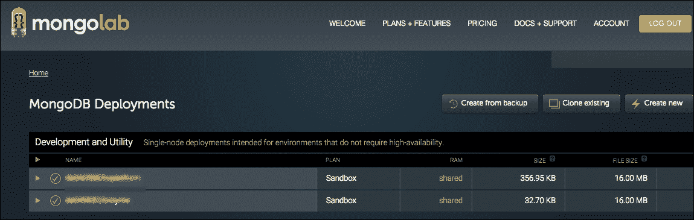
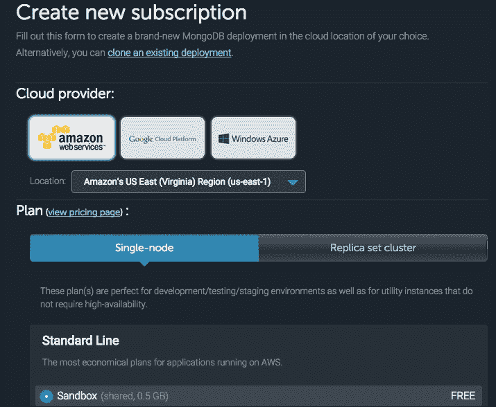
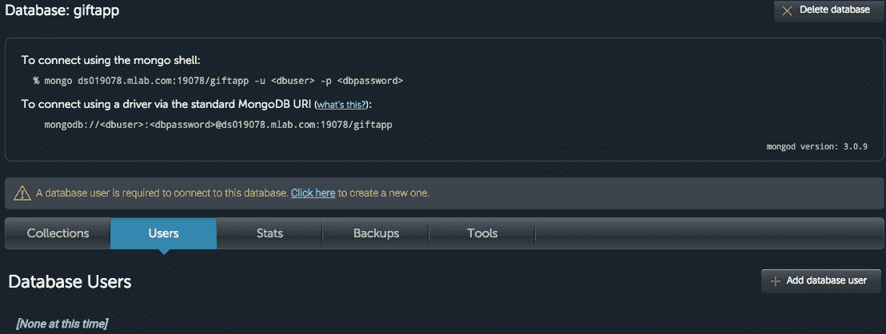
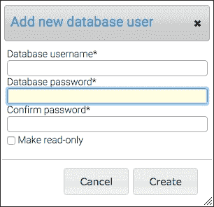
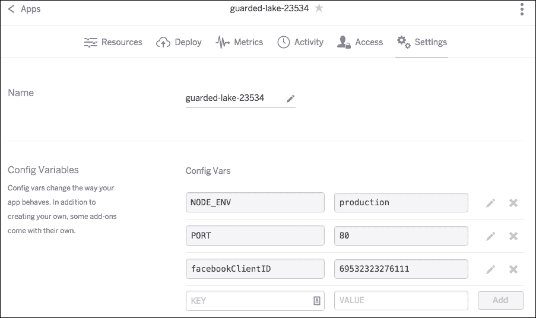

# 第十四章。部署和扩展 SPA

在构建了应用程序的核心功能之后，现在是将 SPA 移入一个类似生产环境，并且可以从互联网访问的环境中。为此，我们将使用 **平台即服务**（**PaaS**）。

PaaS 是一种基于云的服务，允许开发者在其管理的环境中启动应用程序。在 PaaS 之前，开发人员或运维工程师必须执行许多设置和维护任务，例如提供硬件、安装操作系统软件和确保正常运行时间。

有许多 PaaS 提供商，但我选择了 Heroku。一个原因是你可以免费在沙盒中启动一个应用程序，这将允许你在准备好时对应用程序进行实验和扩展。将应用程序部署到 Heroku 也相当简单，因为，正如你将看到的，Heroku 使用 Git 进行部署。

我们还将在云中设置一个生产数据库。我们将使用 MongoLab，它还提供了一个带有足够内存的免费沙盒层，可以开始使用。

我们将简要讨论以下扩展应用程序的关注点来结束本章：

+   使用 Grunt 任务运行器打包应用程序

+   在线设置生产数据库

+   将 SPA 移入云中

+   扩展时的考虑

# 部署打包

我们的应用程序仍然相当小且不复杂，但我们将首先设置一个自动化流程来打包我们的应用程序以便部署。

## 设置 Grunt 以进行部署

我们将使用 Grunt JavaScript 任务运行器设置一些自动化任务来打包我们的文件以便部署。这里我们不需要做很多事情，但你将了解可以做什么，并能够探索丰富的 Grunt 插件来进一步自定义你的自动化任务。

### 安装 Grunt

如果你还没有安装，请使用 NPM 安装 grunt CLI：

```js
$ npm install -g grunt-cli
grunt-cli@0.1.13 /usr/local/lib/node_modules/grunt-cli
|- resolve@0.3.1
|- nopt@1.0.10 (abbrev@1.0.7)
|_ findup-sync@0.1.3 (lodash@2.4.2, glob@3.2.11)

```

为了使 Grunt 正确运行，你需要在项目根目录中放置两个文件。第一个文件是一个 `package.json` 文件，用于声明依赖项。你已经在根目录中有一个了。下一个你需要的是 `Gruntfile.js` 文件，你将在其中加载 grunt 模块并配置 Grunt 可以运行的任务。请创建这个文件在你的根目录中，并添加以下代码：

```js
module.exports = function(grunt) { 

grunt.initConfig({ 
pkg: grunt.file.readJSON('package.json'), 

    }); 

}; 

```

这是 `Gruntfile` 的框架。我们导出一个函数，该函数期望接收一个对 grunt 对象的引用作为其参数。在这个函数内部，我们调用 `grunt.initConfig()` 函数，并传递一个配置对象。目前，这个配置对象只有一个属性，即对 `package.json` 文件的引用。

Grunt 的强大之处在于可以利用其活跃社区提供的成千上万的插件。在撰写本书时，[`gruntjs.com/plugins`](http://gruntjs.com/plugins) 上列出了超过 5,000 个 Grunt 插件。如果你想要运行某个自动化任务，很可能已经有某人创建了一个插件来支持它。

### 注意

官方维护的 Grunt 插件通常命名为 `grunt-contrib-X`。你可以一般地信任这些插件的质量，尽管有许多优秀的非官方维护插件。

### 安装 Grunt 插件

Grunt 的一个不错的特点是插件使用 NPM 安装。让我们安装一些我们将要使用的有用插件：

```js
$ npm install grunt-contrib-clean--save-dev
grunt-contrib-clean@1.0.0node_modules/grunt-contrib-clean
|- async@1.5.2
|_ rimraf@2.5.2 (glob@7.0.0)
$ sudonpm install grunt-contrib-uglify--save-dev
grunt-contrib-uglify@0.11.1node_modules/grunt-contrib-uglify
|- uri-path@1.0.0
|- maxmin@2.1.0 (figures@1.4.0, pretty-bytes@3.0.1, gzip-size@3.0.0)
|- chalk@1.1.1 (escape-string-regexp@1.0.5, supports-color@2.0.0, has-ansi@2.0.0, strip-ansi@3.0.1, ansi-styles@2.2.0)
|- uglify-js@2.6.2 (uglify-to-browserify@1.0.2, async@0.2.10, source-map@0.5.3, yargs@3.10.0)
|_ lodash@4.5.1
$ sudonpm install grunt-contrib-htmlmin--save-dev
grunt-contrib-htmlmin@0.6.0node_modules/grunt-contrib-htmlmin
|- chalk@1.1.1 (escape-string-regexp@1.0.5, supports-color@2.0.0, strip-ansi@3.0.1, has-ansi@2.0.0, ansi-styles@2.2.0)
|- pretty-bytes@2.0.1 (number-is-nan@1.0.0, get-stdin@4.0.1, meow@3.7.0)
|_ html-minifier@1.2.0 (relateurl@0.2.6, change-case@2.3.1, concat-stream@1.5.1, cli@0.11.1, clean-css@3.4.9, uglify-js@2.6.2)
$ sudonpm install grunt-contrib-copy--save-dev
grunt-contrib-copy@0.8.2node_modules/grunt-contrib-copy
|- file-sync-cmp@0.1.1
|_ chalk@1.1.1 (supports-color@2.0.0, escape-string-regexp@1.0.5, ansi-styles@2.2.0, strip-ansi@3.0.1, has-ansi@2.0.0)

```

我们为 `clean`、`uglify`、`htmlmin` 和 `copy` 任务安装了 Grunt 插件。Clean 会清理目录中的文件。Uglify 最小化 JavaScript 文件。`Htmlmin` 最小化 HTML 文件。`Copy` 任务复制文件。`--save-dev` 标志会将这些模块添加到你的 `package.json` 文件中作为 `devdependencies`。你只需要在开发环境中使用这些包，而不是在生产环境中。

在我们继续之前，让我们在我们的项目根目录中创建一个 `dist` 文件夹。我们的生产就绪资产将在这里找到。

### 配置 `Gruntfile`

现在，我们需要修改我们的 `Gruntfile` 以加载插件：

```js
module.exports = function(grunt) { 

grunt.initConfig({ 
pkg: grunt.file.readJSON('package.json'), 

    }); 

 //load the task plugins
grunt.loadNpmTasks('grunt-contrib-uglify');
grunt.loadNpmTasks('grunt-contrib-copy');
grunt.loadNpmTasks('grunt-contrib-htmlmin');
grunt.loadNpmTasks('grunt-contrib-clean'); 

}; 

```

在这里，我们为每个要加载的 Grunt 插件调用 `grunt.loadNPMTasks()`，并传递要加载的模块名称。

接下来，我们需要在我们的 `Gruntfile` 中配置每个任务。请注意，每个插件都将有自己的配置属性。请查阅你使用的每个插件的文档，以了解其配置方式。打开你的 `Gruntfile.js` 并进行以下编辑：

```js
module.exports = function(grunt) { 

grunt.initConfig({ 
pkg: grunt.file.readJSON('package.json'), 
 clean: ['dist/**'], 
 copy: { 
 main: { 
 files: [ 
 {expand: true, src: ['*'], dest: 'dist/',
                     filter: 'isFile'},
 {expand: true, src: ['bin/**'], dest:
                    'dist/', filter:
                     'isFile'}, 
 {expand: true, src: ['config/**'], dest:
                    'dist/', filter:  
                     'isFile'}, 
 {expand: true, src: ['models/**'], dest:
                    'dist/', filter:
                     'isFile'}, 
 {expand: true, src: ['passport/**'], dest:
                    'dist/', filter:'isFile'}, 
 {expand: true, src: ['public/**'], dest: 
                   'dist/', filter:'isFile'}, 
 {expand: true, src: ['routes/**'], dest:
                    'dist/', filter: 'isFile'}, 
 {expand: true, src: ['scripts/**'], dest:
                    'dist/', filter: 'isFile'}, 
 {expand: true, src: ['utils/**'], dest:
                    'dist/', filter:'isFile'}, 
 {expand: true, src: ['views/**'], dest: 
                     'dist/', filter: 
                     'isFile'} 
 ] 
 } 
 }, 
uglify: {
 options: { 
 mangle: false 
 }, 
my_target: { 
 files: { 
'dist/public/javascripts/giftapp.js': ['dist/public/javascripts/giftapp.js'], 
'dist/public/javascripts/controllers/dashMainController.js': ['dist/public/javascripts/controllers/dashMainController.js'], 
'dist/public/javascripts/controllers/giftappFormController.js': ['dist/public/javascripts/controllers/giftappFormController.js'], 
'dist/public/javascripts/services/giftlistFactory.js': ['dist/public/javascripts/services/giftlistFactory.js'] 
 } 
 } 
 }, 
htmlmin:{ 
 options: { 
removeComments: true, 
colapseWhitespace: true 
 }, 
dist: { 
 files: { 
'dist/public/templates/dash-add.tpl.html': 'dist/public/templates/dash-add.tpl.html', 
'dist/public/templates/dash-main.tpl.html': 'dist/public/templates/dash-main.tpl.html' 
 } 
 } 
 } 
    }); 

 //load the task plugins 
grunt.loadNpmTasks('grunt-contrib-uglify'); 
grunt.loadNpmTasks('grunt-contrib-copy'); 
grunt.loadNpmTasks('grunt-contrib-htmlmin'); 
grunt.loadNpmTasks('grunt-contrib-clean'); 
 //register the default task 
grunt.registerTask('default', ['clean','copy','uglify','htmlmin']); 

}; 

```

我们做的第一个更改是在 `grunt.InitConfig()` 函数内部添加了一些任务配置属性。当运行 grunt 时，这些属性会装饰 grunt 对象，并告诉各种任务如何执行。

第一个任务配置是为 `clean`。此任务配置为删除 `dist` 文件夹中的所有文件和文件夹。clean 配置接受路径数组；路径定义的语法对于 `grunt-contrib` 插件来说相当标准。有关 Grunt 的 URL 谓词的信息，请参阅 [`gruntjs.com/configuring-tasks#globbing-patterns`](http://gruntjs.com/configuring-tasks#globbing-patterns)。

其他任务配置类似，但接受对象，可以包括一些选项、一个目标和要操作文件的列表。有关 grunt 插件的配置选项，请访问 [`gruntjs.com/plugins`](http://gruntjs.com/plugins)，点击插件名称以获取文档。

配置之后，下一节是加载此 `Gruntfile` 将要使用的每个插件的地方。我们通过将插件名称作为参数传递给 `grunt.loadNPMTasks()` 函数来完成此操作。Grunt 将在我们的 `node_modules` 文件夹中查找这些插件。如果我们想使用自定义任务，例如我们自己编写的任务，我们可以通过传递路径的调用 `grunt.loadTasks()` 来加载它们。

我们最后做的事情是注册一个任务。我们通过调用 `grunt.registerTask()` 来完成这个操作。这需要两个参数。第一个是一个字符串，即任务的名称。在我们的例子中，这是默认任务。Grunt 要求所有 `Gruntfiles` 都必须注册一个默认任务。下一个参数是一个字符串数组，包含作为此任务一部分运行所需的任何任务和目标的名称。

现在，我们只是在运行任务而没有列出任何单独的目标。如果我们想在任务上运行目标，语法将是 `task:target`。例如，如果我们为我们的 `uglify` 任务定义了一个测试目标，我们将在数组中注册它为 `['uglify:test']`。

### 运行 Grunt

运行 `grunt` 简单得不能再简单了。

首先，确保已经安装了 grunt CLI，如下所示：

```js
$ npm install -g grunt-cli
Password:
/usr/local/bin/grunt -> /usr/local/lib/node_modules/grunt-cli/bin/grunt
grunt-cli@1.2.0 /usr/local/lib/node_modules/grunt-cli
|- grunt-known-options@1.1.0
|- nopt@3.0.6 (abbrev@1.0.9)
|- resolve@1.1.7
|_ findup-sync@0.3.0 (glob@5.0.15)

```

从存放你的 `Gruntfile` 的目录中，只需运行 `grunt` 后跟你要运行的任务的名称。要运行默认任务，你可以省略 `taskname`。现在，让我们尝试运行 `grunt`：

```js
$ grunt
Running "clean:0" (clean) task
>> 53 paths cleaned.
Running "copy:main" (copy) task
Copied 35 files
Running "uglify:my_target" (uglify) task
>> 4 files created.
Running "htmlmin:dist" (htmlmin) task
Minified 2 files

```

如果你现在查看你的 `dist` 文件夹，你会注意到它不再为空。Grunt 已经清理了它，移动了一些文件，并对一些内容进行了压缩。请注意，第一次你在空的 `dist` 文件夹中运行此操作时，清理任务会报告 0 个路径被清理。当你随后再次运行时，你应该会看到 `dist` 文件夹中实际被清理的文件数量。

你可能还会注意到，每个任务都在运行一个目标。复制正在运行 `main`，`uglify` 正在运行 `my_target`。默认情况下，如果没有指定目标，Grunt 将运行第一个定义的目标。

如果你打开你的 `dist/public/javascripts/giftapp.js` 文件，你应该会看到它已经被压缩：

```js
angular.module("giftapp",["ui.router","giftappControllers"]).config(["$stateProvider","$urlRouterProvider",function($stateProvider,$urlRouterProvider){$urlRouterProvider.otherwise("/dash"),$stateProvider.state("dash",{url:"/dash",templateUrl:"/templates/dash-main.tpl.html",controller:"DashMainController"}).state("add",{url:"/add",templateUrl:"/templates/dash-add.tpl.html",controller:"GiftappFormController"})}]); 

```

代码压缩使我们的文件更小，并且稍微难以阅读。它可以显著提高文件在网页上的性能。为了获得更显著的性能提升，我们可能需要考虑将脚本文件连接起来，并使用像 Closure compiler 这样的工具使它们更加高效。

### 注意

没有必要压缩服务器端 JavaScript 代码。压缩的主要原因是为了减少与客户端的数据传输。

## 设置我们的生产配置

当我们将应用程序迁移到生产环境时，我们将遇到一个问题，那就是我们的开发和生产环境之间会有所不同。目前，我们所有的数据库引用都指向我们的本地 MongoDB 数据库。

我们将使用 Git 将我们的文件推送到生产环境，我们也不想在 Git 仓库中存储配置变量。我们也不想在 Git 中存储 `node_modules` 或将其推送到生产环境，因为它们可以通过我们的 `package.json` 文件即时获取。

### 创建一个 .gitignore 文件

在你的项目根目录中创建一个名为 `.gitignore` 的文件。此文件包含一个列表，其中包含我们不希望 Git 存储或跟踪的文件和路径：

```js
node_modules 
config 
.idea 
dist/config 

```

我们一行一行地列出我们希望 Git 忽略的文件和文件夹。第一个是 `node_modules`。再次强调，没有理由存储这些文件。接下来，我想忽略 `config` 文件夹中的任何内容，其中包含敏感信息。

在这里，我忽略了 `.idea` 文件夹。你可能没有这个文件夹。这是一个由我的开发环境创建的文件夹，用于存储项目信息。我使用的是 `JetBrains` 的 JavaScript IDE Webstorm。无论你使用什么，你都会想要排除你的 IDE 文件，如果有的话。最后，我明确排除了 `dist/config`，它将是 `config` 的一个副本。

### 创建基于环境的配置模块

我们希望配置能够动态处理。如果你在开发环境中，使用你本地机器的配置。如果你在生产环境中，你将想要使用该环境的适当配置变量。

在生产环境设置中，最安全的方法是在应用程序中设置可读的环境变量。我们将在设置部署环境时设置它们，但现在我们可以设置阶段。

在你的根 `giftapp` 文件夹中，创建一个名为 `appconfig.js` 的新文件，使用以下代码：

```js
module.exports = function(){ 
    if(process.env.NODE_ENV&&process.env.NODE_ENV === 'production'){ 
        return{ 
db: process.env.DB, 
facebookAuth : { 
clientID: process.env.facebookClientID, 
clientSecret: process.env.facebookClientSecret, 
callbackURL: process.env.facebookCallbackURL, 
            }, 

twitterAuth : { 
'consumerKey': process.env.twitterConsumerKey, 
'consumerSecret': process.env.twitterConsumerSecret, 
'callbackURL': process.env.twitterCallbackURL 
            } 
        } 
    } else { 
varauth = require('./config/authorization'); 
        return { 
db: 'localhost:27017/giftapp', 
facebookAuth : { 
clientID: auth.facebookAuth.clientID, 
clientSecret: auth.facebookAuth.clientSecret, 
callbackURL: auth.facebookAuth.callbackURL 
            }, 

twitterAuth : { 
'consumerKey': auth.twitterAuth.consumerKey, 
'consumerSecret': auth.twitterAuth.consumerSecret, 
'callbackURL': auth.twitterAuth.callbackURL 
            } 
        } 
    } 

}; 

```

我们首先检查是否存在 `NODE_ENV` 环境变量以及它是否设置为 *production*。如果是，我们将不得不从环境变量中获取我们的数据库以及 Facebook 和 Twitter 的授权信息。我们将在设置部署环境时设置环境变量。

如果我们的测试失败，我们假设我们处于开发环境，然后手动设置我们的数据库。我们从 `config` 目录中获取 `authorization.js` 文件并使用它来设置 Twitter 和 Facebook 的授权变量。

### 使用新的配置文件

现在，我们需要使用我们的配置文件。打开你的主 `app.js` 文件并进行一些编辑：

```js
var express = require('express'); 
var path = require('path'); 
var favicon = require('serve-favicon'); 
var logger = require('morgan'); 
varcookieParser = require('cookie-parser'); 
varbodyParser = require('body-parser'); 
varisJSON = require('./utils/json'); 
var routing = require('resource-routing'); 
var controllers = path.resolve('./controllers'); 
var helmet = require('helmet'); 
varcsrf = require('csurf'); 
varappconfig = require('./appconfig');
varconfig = appconfig(); 

//Database stuff 
varmongodb = require('mongodb'); 
var monk = require('monk'); 
vardb = monk(config.db); 

var mongoose = require('mongoose'); 
mongoose.connect(config.db); 

var routes = require('./routes/index'); 
var users = require('./routes/users'); 
var dashboard = require('./routes/dashboard'); 
varauth = require('./routes/auth') 

var app = express(); 

// view engine setup 
app.set('views', path.join(__dirname, 'views')); 
app.set('view engine', 'ejs'); 

app.set('x-powered-by', false); 

app.locals.appName = "My Gift App"; 

// uncomment after placing your favicon in /public 
//app.use(favicon(path.join(__dirname, 'public', 'favicon.ico'))); 
app.use(logger('dev')); 
app.use(bodyParser.json()); 
app.use(bodyParser.urlencoded({ extended: false })); 
app.use(cookieParser()); 
app.use(express.static(path.join(__dirname, 'public'))); 
app.use(isJSON); 

var flash = require('connect-flash'); 
app.use(flash()); 

var passport = require('passport'); 
varexpressSession = require('express-session'); 
app.use(expressSession({secret: 'mySecretKey'})); 
app.use(passport.initialize()); 
app.use(passport.session()); 

varinitializePassport = require('./passport/init'); 
initializePassport(passport); 

//Database middleware 
app.use(function(req,res,next){ 
req.db = db; 
    next(); 
}); 

app.use(helmet()); 
app.use(csrf()); 

app.use('/', routes); 
app.use('/users', users); 
app.use('/dash', dashboard); 
app.use('/auth', auth); 

var login = require('./routes/login')(passport); 
app.use('/login', login); 

routing.resources(app, controllers, "giftlist"); 
routing.expose_routing_table(app, { at: "/my-routes" }); 

// catch 404 and forward to error handler 
app.use(function(req, res, next) { 
var err = new Error('Not Found'); 
err.status = 404; 
  next(err); 
}); 

// error handlers 

// development error handler 
// will print stacktrace 
if (app.get('env') === 'development') { 
app.use(function(err, req, res, next) { 
res.status(err.status || 500); 
res.render('error', { 
      message: err.message, 
      error: err 
    }); 
  }); 
} 

// production error handler 
// no stacktraces leaked to user 
app.use(function(err, req, res, next) { 
res.status(err.status || 500); 
res.render('error', { 
    message: err.message, 
    error: {} 
  }); 
}); 

module.exports = app; 

```

首先，我们加载我们的 `appconfig.js` 文件并将其分配给变量 `appconfig`。记住，我们的 `appconfig` 模块导出一个函数。我们需要调用这个函数来运行代码并访问动态设置的属性。因此，我们调用 `appconnfig()` 并将返回的对象分配给变量 `config`。

最后，我们在调用 `monk()` 时使用 `config.db` 来创建数据库对象。你现在应该能够启动你的数据库和服务器，并且功能上应该没有差异。

接下来，我们需要在我们的 passport `OAuth` 策略中使用 `appconfig`。让我们从 `passport`/`facebook.js` 开始：

```js
varFacebookStrategy = require('passport-facebook').Strategy; 
var User = require('../models/user'); 
varappconfig = require('../appconfig')
varauth = appconfig(); 

module.exports = function(passport){ 

passport.use('facebook', new FacebookStrategy({ 
clientID: auth.facebookAuth.clientID, 
clientSecret: auth.facebookAuth.clientSecret, 
callbackURL: auth.facebookAuth.callbackURL, 
profileFields: ['id', 'displayName', 'email'] 
        }, 
        function(accessToken, refreshToken, profile, cb) { 
User.findOne({ 'facebook.id': profile.id }, function (err, user) { 
                if(err){ 
                    return cb(err) 
                } else if (user) { 
                    return cb(null, user); 
                } else { 
                    for(key in profile){ 
                        if(profile.hasOwnProperty(key)){ 
console.log(key + " ->" + profile[key]); 
                        } 
                    } 
var newUser = new User(); 
newUser.facebook.id = profile.id; 
newUser.facebook.token = accessToken; 
newUser.facebook.name = profile.displayName; 
                    if(profile.emails){ 
newUser.email = profile.emails[0].value; 
                    } 

newUser.save(function(err){ 
                        if(err){ 
                            throw err; 
                        }else{ 
                            return cb(null, newUser); 
                        } 
                    }); 
                } 
            }); 
        } 
    )); 
} 

```

再次从我们应用程序的根目录中引入 `appconfig.js`。然后我们调用返回的函数并将其分配给变量 `auth`。我们不应该需要额外的更改，重启我们的服务器应该会显示我们的更改已经生效。

最后，让我们对 `passport/twitter.js` 文件做同样的事情：

```js
varTwitterStrategy = require('passport-twitter').Strategy; 
var User = require('../models/user'); 
varappconfig = require('../appconfig')
varauth = appconfig(); 

module.exports = function(passport){ 

passport.use('twitter', new TwitterStrategy({ 
consumerKey     : auth.twitterAuth.consumerKey, 
consumerSecret  : auth.twitterAuth.consumerSecret, 
callbackURL     : auth.twitterAuth.callbackURL 
        }, 
        function(token, tokenSecret, profile, cb) { 
User.findOne({ 'twitter.id': profile.id }, function (err, user) { 
                if(err){ 
                    return cb(err) 
                } else if (user) { 
                    return cb(null, user); 
                } else { 
                    // if there is no user, create them 
var newUser                 = new User(); 

                    // set all of the user data that we need 
newUser.twitter.id          = profile.id; 
newUser.twitter.token       = token; 
newUser.twitter.username    = profile.username; 
newUser.twitter.displayName = profile.displayName; 

newUser.save(function(err){ 
                        if(err){ 
                            throw err; 
                        }else{ 
                            return cb(null, newUser); 
                        } 
                    }); 
                } 
            }); 
        } 
    )); 
} 

```

正如你所见，我们对 Twitter 授权策略文件进行了完全相同的修改。再次测试，它应该会以完全相同的方式工作。

# 设置云数据库

我们的单页应用（SPA）很快就会在云端运行，并且需要连接到一个数据库。将我们的应用迁移到云端需要我们的数据库也能从网络上访问。在本地机器上运行数据库是行不通的。

虽然有众多基于云的数据库服务，但我发现 MongoLab 是最容易设置、使用和维护的之一。他们提供免费的沙盒数据库，非常适合开发和实验。对于生产级应用，你可能需要考虑更高的订阅率。

我们将用于部署应用的 PaaS 平台 Heroku 与 MongoLab 配合得非常好，甚至提供一键添加 Mongolab 的服务。现在我们先手动设置，这样你可以更好地了解事情是如何运作的。

## 创建 MongoLab 账户

你需要做的第一件事是在 MongoLab 上设置你的账户。这非常简单。访问 [`mongolab.com/signup/`](https://mongolab.com/signup/) 并填写表格。注册后，你将被带到如下所示的仪表板：



目前，在我的账户中，我配置了两个数据库。如果你刚刚注册，这里将不会显示任何内容。你可以从这个仪表板设置和管理数据库以及您的账户。

## 创建数据库

现在，你已经在 MongoLab 上有一个账户，但没有数据库。我们需要创建一个新的数据库。幸运的是，MongoLab 让我们做这件事变得非常简单。在您的仪表板上，点击标记为 **创建新** 的按钮：



在创建新订阅页面，有许多不同的选择来设置新的部署。我们想要设置一个沙盒部署，它是免费的，并且会给你 500 MB 的存储空间。我选择了美国东部地区的亚马逊云服务，并选择了 **单节点** | **沙盒**。

滚动到页面底部，命名您的数据库，然后点击标记为“创建新的 MongoDB 部署”的按钮。我命名为 `giftapp`。哇！你现在已经是这个闪亮的新云基础 MongoDB 部署的骄傲所有者了。

## 设置用户访问数据库

目前，我们还没有从我们的应用连接到数据库。要做到这一点，你需要为数据库访问设置用户名和密码。从您的仪表板，点击您的新数据库名称，然后在下一个屏幕上点击 **用户** 选项卡：



从这里，记下标准的 MongoDB URI，它将包括你即将设置的用户名和密码。点击 **添加数据库用户**：



你将看到前面的弹出窗口。填写它；不要勾选只读。现在，你有一个可以访问数据的数据库和用户。记下 URI；你将需要使用它来访问这个数据库。如果你想测试它，你可以将其插入到你的 `appconfig` 文件中，以替换你的本地数据库。

# 将应用程序部署到 Heroku

现在，我们已经为 Web 部署准备好了大部分组件。我们将把我们的应用程序部署到支持 Node 的 PaaS 平台 Heroku。

## 准备使用 Heroku

将你的应用程序部署到 Heroku 需要几个简单的步骤。你需要安装 Git、设置 Heroku 账户、在 Heroku 上创建一个新的项目，然后它就准备好部署了。

### 设置 Git

部署到 Heroku 使用 Git 完成，因此你需要安装它。如果你还没有安装 Git，请访问 [`git-scm.com/book/en/v2/Getting-Started-Installing-Git`](https://git-scm.com/book/en/v2/Getting-Started-Installing-Git) 并按照你操作系统的说明进行操作。

在安装 Git 之后，你需要在 `giftapp` 文件夹中初始化一个 Git 仓库。从根目录开始，在你的命令行中输入以下命令：

```js
$ gitinit

```

在初始化 Git 之后，你想要添加所有文件并将它们提交到你的仓库中：

```js
$ git add .
$ git commit -m "initil commit"

```

就到这里了。

### 注册 Heroku 账户

下一步你需要做的是注册一个 Heroku 账户，如果你还没有的话。就像 MongoLab 一样，这个过程很简单。访问 [`signup.heroku.com/login`](https://signup.heroku.com/login) 并填写以下截图所示的表单：


现在你已经拥有了一个免费的 Heroku 账户。

### 安装 HerokuToolbelt

Heroku 提供了一个名为 HerokuToolbelt 的 CLI 应用程序来管理应用程序。你需要安装这个工具来将你的应用程序部署到 Heroku。要为你的操作系统安装，请访问 [`toolbelt.heroku.com/`](https://toolbelt.heroku.com/) 并按照你操作系统的说明进行操作。

安装完成后，你可以从命令行登录 Heroku：

```js
$ heroku login
Enter your Heroku credentials.
Email: john@notreallymyemail.com
Password (typing will be hidden): 
Authentication successful.

```

现在，你可以开始了。

## 设置 Heroku 项目

现在我们需要实际设置你的 `giftapp` 项目以便部署到 Heroku。在你的终端中，确保你位于 `giftapp` 项目的根目录：

```js
$ heroku create
Creating app... done, stack is cedar-14
https://guarded-lake-23534.herokuapp.com/ https://git.heroku.com/guarded-lake-23534.git

```

创建命令为我们创建了一个 Heroku 应用程序。在这种情况下，应用程序将通过 [`guarded-lake-23534.herokuapp.com/`](https://guarded-lake-23534.herokuapp.com/) 访问。现在导航到该 URL 不会很有趣，因为我们还没有实际部署任何内容。

### 注意

Heroku 为你生成一个随机的应用程序名称。你可以在创建调用中传递你想要的应用程序名称，只要它是唯一的，你的应用程序就会在那里运行。你也可以将自定义域名指向你的 Heroku 应用程序，但前提是你有一个付费账户——请参考 Heroku 文档获取更多信息。

创建命令所做的第二件事是为我们创建了一个远程 Git 仓库。这就是我们将如何部署我们的文件。我们还需要执行几个额外的步骤来部署我们的应用。

## 部署到 Heroku

现在大部分设置工作已经完成，是时候采取最后一步将我们的应用上线了。

### 定义 Procfile

我们需要一个**Procfile**来告诉 Heroku 在部署时运行什么。Procfile 是一个文件，它告诉 Heroku 的 dynos 运行哪些命令。为了使 Heroku 能够读取此文件，你必须将文件命名为 Procfile（不带任何扩展名），并将其包含在项目的顶级目录中。

在你的`giftapp`项目根目录下创建一个名为`Procfile`的文件，并向其中添加以下行：

```js
web: node ./dist/bin/www 

```

这告诉 Heroku 在`dist`目录中运行 www 脚本。

### 应用环境变量

如果你记得，我们的应用程序需要使用一些环境变量才能正确运行。为了设置这些变量，登录到你的 Heroku 账户并导航到你的仪表板[`dashboard.heroku.com/login`](https://dashboard.heroku.com/login)。

点击你的应用名称以访问其仪表板。点击设置标签，然后会显示`config`变量。这就是我们将添加所有需要的环境变量的地方，如下面的截图所示：



你可以看到我已经添加了**NODE_ENV**、**PORT**和**facebookClientID**的变量。你将做同样的事情，并为`appconfig.js`文件中使用的每个环境变量添加一个，包括 DB。

确保调整你的 Facebook 和 Twitter 回调 ID 以使用你的新 Heroku 域名。如果你对此感到困惑，请滚动到设置页面的底部，它将会显示出来。

我将留给你做的另一个步骤是授权你的 Heroku 域名为你的 Facebook 和 Twitter 应用。只需进入你的应用设置并添加新域名。

### 部署

现在一切准备就绪，部署变得非常简单。我们将使用简单的 Gitpush。首先，让我们确保我们的`dist`文件已经准备好，并且通过运行以下代码确保所有内容都已正确提交到`git`：

```js
$ grunt
Running "clean:0" (clean) task
>> 53 paths cleaned.
Running "copy:main" (copy) task
Copied 39 files
Running "uglify:my_target" (uglify) task
>> 4 files created.
Running "htmlmin:dist" (htmlmin) task
Minified 2 files
Done, without errors.
$ git add .
$ git commit -m "heroku commit"
[master 42e6f79] heroku commit
 17 files changed, 451 insertions(+), 207 deletions(-)
 create mode 100644 Procfile
 create mode 100644 appconfig.js
 create mode 100644 dist/Procfile
 create mode 100644 dist/appconfig.js
 create mode 100644 dist/bin/www

```

太好了，一切都已经检查完毕。如果你想进行一次理智的检查，你可以始终尝试`git status`。

现在，让我们将我们刚刚提交的内容推送到 Heroku：

```js
$ git push heroku master
Counting objects: 234, done.
Delta compression using up to 4 threads.
Compressing objects: 100% (207/207), done.
Writing objects: 100% (234/234), 46.90 KiB | 0 bytes/s, done.
Total 234 (delta 95), reused 0 (delta 0)
remote: Compressing source files... done.
remote: Building source:
remote: 
remote: -----> Node.js app detected
remote: 
remote: -----> Creating runtime environment
remote: 
remote:        NPM_CONFIG_LOGLEVEL=error
remote:        NPM_CONFIG_PRODUCTION=true
remote:        NODE_ENV=production
remote:        NODE_MODULES_CACHE=true
remote: 
remote: -----> Installing binaries
remote:        engines.node (package.json):  unspecified
remote:        engines.npm (package.json):   unspecified (use default)
remote: 
remote:        Resolving node version (latest stable) via semver.io...
remote:        Downloading and installing node 5.6.0...
remote:        Using default npm version: 3.6.0
remote: 
remote: -----> Restoring cache
remote:        Skipping cache restore (new runtime signature)
remote: 
remote: -----> Building dependencies
remote:        Pruning any extraneous modules
remote:        Installing node modules (package.json)
remote:        giftapp@0.0.0 /tmp/build_4e2a4d5757c9fb2834a0950c5e35235f
remote: 
remote: -----> Discovering process types
remote:        Procfile declares types -> web
remote: 
remote: -----> Compressing...
remote:        Done: 14.2M
remote: -----> Launching...
remote:        Released v11
remote:        https://guarded-lake-23534.herokuapp.com/ deployed to Heroku
remote: 
remote: Verifying deploy.... done.
To https://git.heroku.com/guarded-lake-23534.git
 * [new branch]      master -> master

```

我们已经上线了！我省略了推送输出的很大一部分。它非常长。如果你查看这里的内容，你可以看到当我们将它推送到 Heroku 时**HerokuToolbelt**会做什么。你可以看到我们的应用正在启动。你可以看到部署是成功的。

# 扩展 SPA

我想以一些关于扩展应用的想法来结束。扩展应用是一种有点神秘的艺术，但如果你构建的应用变得非常受欢迎，你确实需要做好准备。

使用 PaaS 工具的好处之一是它们显著简化了扩展过程。

## 扩展数据库

在数据库扩展方面有许多选项和考虑因素。您只需看看 MongoLab 提供的不同套餐就可以看到这一点。MongoDB 本身支持分片和复制，因为它是为了扩展而构建的。

扩展的担忧包括数据库的大小——存储量有多少，以及性能——通常是一个 RAM 的因素或使用专用集群。

MongoLab 和其他提供商提供多种高存储和高性能计划的组合，以及几个步骤，允许您逐步增加扩展，而不会错过任何一步，或安装或配置新的硬件。

理解其使用情况很重要，这只有在应用程序运行一段时间后才会显现出来，以及这将如何影响存储。如果您的应用程序正在增长并对数据库进行大量访问，您将想要考虑其性能。随着数据库的填充，您将想要管理其存储。

## 服务器扩展

Heroku 使您能够非常容易地将应用程序扩展到所需的确切大小；这是他们建立业务的一部分。在 Heroku 上，应用程序在 dynos 中运行。将 dyno 想象为一个运行您的应用程序的轻量级容器。

Heroku 拥有多个不同性能级别的不同 dynos 运行，您可以从命令行或仪表板中添加和删除它们，甚至可以在不同的性能级别上进行操作。

Heroku 还提供了一些付费的附加功能，例如性能监控。

不想为 Heroku 做推销，其他 PaaS 提供商也提供类似的选择。Amazon Web Services 是 Node.js 的一个流行选择。还有其他选择，例如 Modulus 和 Digital Ocean。如果您正在部署一个现实世界的商业应用程序，寻找适合您的正确解决方案是值得的。

# 摘要

我们本章开始时使用 Grunt 将我们的应用程序打包到 dist 文件夹中。我们使用了通过 NPM 安装的 Grunt 插件，例如压缩我们的代码。我们花了一些时间探索 Grunt 插件生态系统，这是一个相当庞大且得到良好支持的生态系统。

我们随后准备将我们的应用程序部署到网络上，通过设置基于云的数据库来完成。我们在 MongoLab 上创建了一个账户，然后创建了一个新的数据库。接着，我们向数据库中添加了一个用户，以便我们能够从应用程序中访问它。

我们随后在 Heroku 上设置了一个账户，并准备将我们的应用程序部署出去。我们安装了 HerokuToolbelt，这使我们能够创建一个新的 Heroku 应用程序部署。我们通过 Heroku 仪表板访问我们的应用程序并添加了环境变量。最后，我们使用 Git 将我们的项目推送到 Heroku。

我们简要地涉及了诸如数据库和服务器扩展等主题。使用 PaaS 和基于网络的数据库管理系统，我们为当我们的应用程序像 Facebook 一样受欢迎时做好了准备。

感谢您阅读完整本书。如果您已经遵循了所有指示，您现在拥有了一个使用 JavaScript 编写的云部署、测试过的单页应用（SPA）。您现在拥有了从头到尾构建应用、从数据库到展示层的所有技能，使用的是现代 JavaScript。您应该对 SPA 架构、模块化代码和关注点分离有牢固的理解，并且应该与 MEAN 堆栈的各个方面都进行过合作。恭喜您，做得很好！
