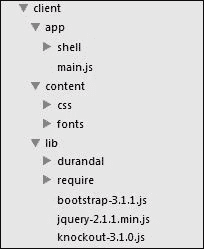
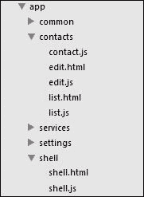
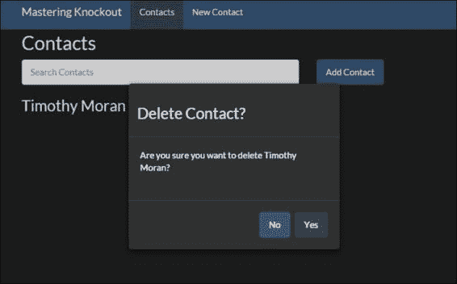
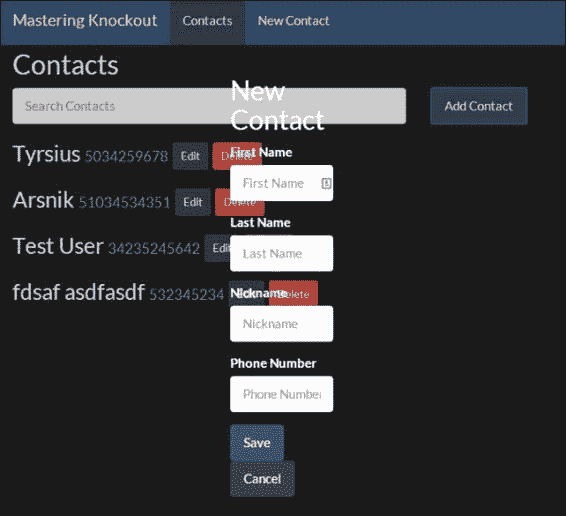
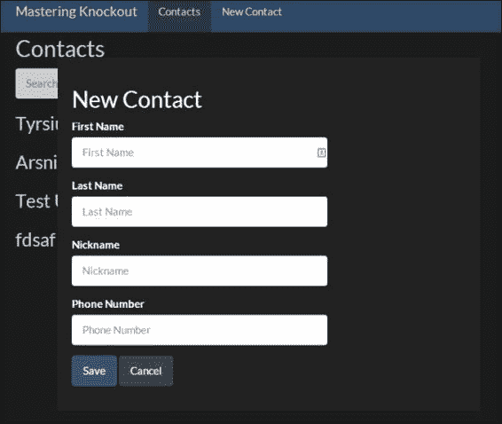
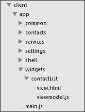

# 第五章. Durandal – Knockout 框架

在上一章中，我们探讨了如何使用 RequireJS 和 SammyJS 与 Knockout 结合，通过模块定义和客户端路由来为我们的前端堆栈添加更多标准功能。这两个概念在 JavaScript 世界中已经变得非常普遍；你甚至可以将它们视为现代网络应用的标准。Knockout 是一个库而不是一个框架，因为它填补了特定的角色——数据绑定——而不是试图成为前端开发框架的全部。如果你想要创建一个现代的 JavaScript 客户端，这会留下很多决策需要做出，可能会变得繁重、耗时，如果你的团队意见分歧，可能会产生争议。Durandal 是一个框架，它试图在保持 Knockout 的 MVVM 哲学的同时，做出许多这些决策。

Durandal 是由 Blue Spire 创建的，其主要开发者 Rob Eisenberg 还创建了流行的 WPF 框架 Caliburn.Micro，另一个 MVVM 框架。在接下来的两章中，我们将探讨 Durandal 如何帮助我们轻松地构建网络应用，同时利用我们从 Knockout 获得的所有经验和自定义代码。本章将涵盖以下内容：

+   Durandal 框架概述

+   组合系统

+   路由器

+   模态对话框

+   应用程序的生命周期

+   小部件

再次强调，我们将使用本章的示例使用 `Contacts` 应用程序。

# Durandal 框架概述

Durandal 是建立在 Knockout、jQuery 和 RequireJS 之上的。Durandal 的核心是一组 AMD 模块，它们提供了组合、事件和激活功能，以及一些实用函数。除了核心模块之外，Durandal 还提供了一些可选激活的插件，或者可以通过社区或个人插件添加。这些插件包括路由器（每个 SPA 框架的基本要求）、对话框和小部件。

### 注意

Durandal 的文档可以在 [`durandaljs.com/docs.html`](http://durandaljs.com/docs.html) 找到。

## Promises

为了将这些内容整合在一起，Durandal 的内部和外部通信是通过 **promises** 来处理的。如果你不熟悉 JavaScript 的 promises（有时被称为 *thenables*，因为它们提供了一个 `then` 方法），那么你错过了一些东西。简要来说，promises 通过用一个表示异步工作的返回对象替换回调来改变异步操作的处理方式。它允许异步任务以简单、易于调试的方式串联，并进行错误处理。在这里我不会介绍 promises 的工作原理，但它将会是相关的。如果你还没有阅读过，你应该去了解一下。

如果你熟悉承诺，你可能已经知道 jQuery 的承诺实现并不符合 A+规范([`promisesaplus.com`](https://promisesaplus.com))，这是大多数其他承诺库所遵循的。为了最小化第三方依赖，Durandal 默认使用 jQuery 的承诺，但它们的文档提供了一个简单的补丁，允许使用另一个承诺实现。这个例子（使用 Q，一个非常流行的承诺库）是从 Durandal 文档中摘录的。在使用`app.start()`之前使用它（我们稍后会了解更多关于这个）：

```js
system.defer = function (action) {
  var deferred = Q.defer();
  action.call(deferred, deferred);
  var promise = deferred.promise;
  deferred.promise = function() {
    return promise;
  };
  return deferred;
};
```

如果你更喜欢另一个库，只需在前面代码中将`Q`替换即可。为了简单起见，我在本章中将使用 Durandal 的默认承诺，但我鼓励你在实际应用中使用符合 A+规范的实现。

## 开始使用

虽然 Durandal 对你的文件系统只有一个真正的要求，即所有核心模块都应该在同一个文件夹中，所有插件都应该在自己的文件夹中，但有一些关于组织方式的约定，如下面的截图所示：



这应该很熟悉，因为它与我们一直在使用的没有太大区别。`app`目录包含我们的代码，`lib`目录包含第三方代码，`content`目录包含我们的 CSS 和其他视觉资产。Durandal 的整个源代码，其中包含一些自己的 CSS，核心模块以及标准插件目录，被放入`lib`中。我们的`main.js`配置看起来像这样：

```js
require.config({
  paths: {
    'text': '../lib/require/text',
    'durandal':'../lib/durandal/js',
    'plugins' : '../lib/durandal/js/plugins',
    'transitions' : '../lib/durandal/js/transitions',
    'knockout': '../lib/knockout-3.1.0',
    'bootstrap': '../lib/bootstrap-3.1.1',
    'jquery': '../lib/jquery-2.1.1.min'
  },
  shim: {
    'bootstrap': {
      deps: ['jquery'],
      exports: 'jQuery'
    }
  },
  waitSeconds: 30
});
```

这里不应该有什么令人惊讶的地方，因为我们已经在上一章中介绍了 RequireJS 的配置。除了`bootstrap`之外的所有路径都是 Durandal 所必需的。配置完成后，Durandal 需要初始化；这通常放在`main.js`中，位于`require.config`下方：

```js
define(['durandal/system', 'durandal/app'],
function(system, app, extensions) {

  system.debug(true);

  //specify which plugins to install and their configuration
  app.configurePlugins({
    //Durandal plugins
    router:true,
    dialog: true
  });

  app.title = 'Mastering Knockout';
  app.start().then(function () {
    app.setRoot('shell/shell');
  });
});
```

`app`和`system`模块是 Durandal 对象。`system.debug`调用指示 Durandal 将所有步骤记录到控制台，这对于开发很有用。`app.configurePlugins`调用注册要安装的插件，尽管它们在调用`app.start`之前不会运行。`app.start`调用初始化所有 Durandal 模块并安装已注册的插件。由于`app.start`是一个返回承诺的函数，因此附加了一个`then`方法，它在完成时调用`app.setRoot`方法。`setRoot`方法将指定的模块组合到 DOM 中，作为应用程序的根视图模型。

应用程序的根被放置在一个具有`applicationHost` ID 的`div`元素中，它预期已经在 DOM 中。由于 Durandal 将负责所有的 HTML 渲染，原始 DOM 相当简单。它只需要使用的 CSS，`applicationHost` ID，以及 RequireJS 的`script`标签。这是标准的`index.html`文件：

```js
<!DOCTYPE html>
<html>
  <head>
    <title>Mastering Knockout</title>
    <meta name="viewport" content="width=device-width, initial-scale=1.0">
    <link rel="stylesheet" href="content/css/bootstrap-3.1.1-darkly.css" type="text/css" media="all"  title="darkly" />
    <link rel="alternate stylesheet" href="content/css/bootstrap-3.1.1-cosmo.css" type="text/css" media="all" title="cosmo" />
    <link rel="stylesheet" href="content/css/font-awesome-4.0.3.css" type="text/css" media="all" />

    <link rel="stylesheet" href="lib/durandal/css/durandal.css" />
    <link rel="stylesheet" href="content/css/app.css" 
  </head>
  <body>
    <!-- Main Application Body -->
    <div id="applicationHost"></div>
    <script type="text/javascript" src="img/require.js" data-main="app/main"></script>
  </body>
</html>
```

就这样！Durandal 已经启动，从这一点开始之后的所有内容都将是你应用程序的代码。

# 组合系统

在上一章中，我们探讨了 Knockout 的新组件功能，它允许我们通过从 DOM 中使用自定义元素（或绑定）实例化它们来构建视图/ViewModel 对。Knockout 在 Durandal 之后发布了这个功能，所以两者之间有一些重叠。Durandal 的组合类似于组件和模板绑定的混合。

组合主要通过两种方式调用，使用`setRoot`来组合`applicationHost` ID，以及使用组合绑定来处理数据绑定值。组合通过将 viewmodel 与视图配对来工作。

### 注意

Durandal 的文档将 viewmodels 称为模块，我认为这有点令人困惑。在本章中，我将把可组合模块称为 viewmodels。

当组合被赋予一个 viewmodel 时，它会查找视图，使用 RequireJS 的文本加载器加载它，将其绑定到视图上，最后将其附加到 DOM 中。

**组合应用程序的根**

让我们看看 shell viewmodel 的根组合。我们前面的示例是将根设置为`shell/shell`。如果我们的`app`目录中有一个`shell`文件夹，`shell.js`模块将被`setRoot`加载并组合。组合使用 Durandal 的`viewLocator`模块通过替换模块的文件扩展名来查找 HTML 文件；因此对于`shell.js`，它会查找`shell.html`并将其用作视图。

你可以在`cp5-shell`中看到一个非常简单的例子。`shell`模块非常简单，只包含一个`title`属性，我们将将其绑定到：

```js
define(function (ko, app) {
  return {
    title: 'Welcome!'
  };
});
```

```js
<html> root element:
```

```js
<div class="jumbotron">
  <h1 data-bind="text: title"></h1>
  <p>This HTML was rendered into the DOM with Durandal's composition system. Notice the data-binding on the <code>h1</code> tag with the viewmodel property <code>title</code>.</p> 
</div>
```

Durandal 期望视图是部分 HTML 文档。它们不应包含`HTML`、`HEAD`或`BODY`元素；它们应只包含用于 DOM 内容的模板的 HTML。

如果你运行代码，你会看到这个 HTML 被渲染到 DOM 中，标题被绑定到`shell`模块的`title`属性上。`shell`模块返回的对象被用作 shell 视图的绑定上下文。

## 组合绑定

通常，应用程序的根不会改变，而是作为 HTML 的布局或外壳。它显示每个页面上都存在的内容（如导航栏），因此它不需要改变。组合也可以通过组合绑定来调用，该绑定接受一个 viewmodel 作为绑定值。

打开`cp5-composition`分支。注意 shell 视图又回到了包含我们熟悉的导航栏，以及在其主要内容区域中的组合绑定：

```js
<div>
  <nav class="…" role="banner">
    //Standard Nav Bar HTML you've seen in every other sample
  </nav>

  <div class="page-host container">
    <div data-bind="compose: currentModel"></div>
  </div>
</div>
```

shell viewmodel 有一个`currentModel`属性，以及两个函数，用于在`edit`和`list`页面对象之间切换`currentModel`属性：

```js
define(['knockout', 'durandal/app', 'contacts/edit', 'contacts/list'], 
function (ko, app, EditVm, ListVm) {
  var listVm = new ListVm(),
  editVm = new EditVm();
  return {
    title: app.title,
    currentModel: ko.observable(listVm),
    setEdit: function() { this.currentModel(editVm); },
    setList: function() { this.currentModel(listVm); }
  };
});
```

尝试按下导航栏中的按钮，看看主体内容是否在两个页面之间切换。组合绑定正在获取一个模块实例，定位其视图，并将视图绑定为 DOM 的内容。由于`currentModel`是可观察的，所以每当它改变时，组合都会重新运行。

由于`list`和`edit`对象只构建一次并交换，你应该注意到在编辑页面上输入的值是持久的。这是因为，虽然在切换时 HTML 被丢弃并重新创建，但新的 HTML 仍然绑定到同一个对象上。

希望这个示例的简洁性不会削弱组合系统的强大功能。它们如此之小的事实应该突出组合是多么容易处理；只需交换绑定值，我们就可以在两个完全不同的页面之间切换！

你可能已经注意到，组合就像是对 Knockout 组件的映射。不是 DOM 中的自定义元素或绑定来选择要渲染的内容，而是组合渲染 JavaScript 指定的值。这最终对灵活性产生了重大影响。组件是 DOM 所说的元素，但单个组合绑定可以持有任何模块，并且它可以随时更改。它们可能看起来像是相互竞争的功能，但我认为它们服务于不同的目标。

组件就像高级的绑定处理器，允许 HTML 实例化行为驱动的模板。

组合使用我们视图模型代码创建和管理的关系，并在表示层中反映它们。

## 组合选项

我们已经探讨了两种组合示例——`setRoot`和组合绑定——它们各自接受一个要组合的对象实例。当然，Durandal 是一个深思熟虑的框架，所以组合还有几种其他的工作模式。组合绑定可以接受以下任何一种值。

### 模块实例

我们已经讨论过这个问题，但为了完整性，组合绑定可以接受模块的实例，并使用它来定位视图。请参阅`cp5-composition`分支中的示例。这是使用组合绑定组合的最常见用例。

### 构造函数

在`cp5-composition2`分支中，你可以看到一个修改后的外壳，它将`currentModel`属性直接设置为构造函数：

```js
define(['knockout', 'durandal/app', 'contacts/edit', 'contacts/list'], 
function (ko, app, EditVm, ListVm) {
  return {
    title: app.title,
    currentModel: ko.observable(ListVm),
    setEdit: function() { this.currentModel(EditVm); },
   setList: function() { this.currentModel(ListVm); }
  };
});
```

虽然这不是一个很好的用例，但它得到了支持。构造函数最常用于与路由器绑定的模块，因为导航页面之间通常希望有一个新的视图模型。与上一个示例不同，它为每个页面存储了构造视图模型的引用，而这种方法将在每次导航时重新创建视图模型。

### 模块 ID 字符串

使用字符串作为组合绑定值有两种方式。第一种是通过提供模块 ID。你可以在`cp5-composition3`分支中看到这一点：

```js
currentModel: ko.observable(''contacts/list''),
setEdit: function() { this.currentModel(''contacts/edit''); },
setList: function() { this.currentModel('contacts/list'); }
```

这导致模块被组合。如果模块返回一个对象，它将被直接组合；如果模块返回一个函数，它被视为构造函数来创建对象。当然，因为它是一个字符串，所以可以直接在绑定中使用它：

```js
<div data-bind="compose: 'contacts/list'"></div>
```

虽然得到了支持，但我个人认为这违反了关注点的分离原则。它将 HTML 视图直接绑定到视图模型上。

### 视图路径字符串

在`compose`绑定中使用字符串的第二种方式是使用视图路径。如果字符串包含`viewEngine`模块能识别的扩展名，它将被用来加载该视图并将其绑定到当前绑定上下文中。这里的常见用例是部分视图：

```js
<div class="page-host container">
    <div data-bind="compose: 'shell/sub.html'"></div>
</div>
```

再次，字符串可以是 HTML 或来自 viewmodel。在这种情况下，由于视图正在引用另一个视图，我认为字符串属于 HTML。否则，将发生关注点分离的逆向违反，其中 viewmodel 直接引用视图。

这个示例可以在`cp5-composition4`中看到。

### 显式模型和视图

组合绑定还可以接受一个设置对象，该对象指定一个模型、一个视图或两者。关于这些示例没有太多可说的，所以这一节直接来自 Durandal 文档：

+   `data-bind="compose: { model: model }"`: 这使用`model`的值与`viewLocator`一起获取一个视图。然后它们被绑定，并将视图注入到 DOM 节点中。

+   `data-bind="compose: { view: view }"`: 这将评估`view`的值。如果是字符串，则使用`viewLocator`定位视图；否则，假定它是一个视图。结果视图将被注入到 DOM 节点中。

+   `data-bind="compose: { model: model, view: view }"`: 这将解析`model`的值。`view`的值将被解析，并按照前一点所述构建一个视图。然后，`model`和`view`都将被绑定并注入到 DOM 节点中。

+   `data-bind="compose: { model: model, view:'myView.html' }"`: 解析`model`的值。然后使用`viewLocator`模块获取由`view`属性指示的视图。它们随后被绑定，并将视图注入到 DOM 节点中。

+   `data-bind="compose: { model:'shell', view: view }"`: 使用 RequireJS 解析`shell`模块。`view`的值将被解析，并返回视图，如前所述。然后，视图被绑定到解析的模块，并注入到 DOM 节点中。

+   `data-bind="compose: { model:'shell', view:'myView.html' }"`: 使用 RequireJS 解析`shell`模块。然后使用`viewLocator`模块获取由`view`指示的视图。该视图随后被绑定到解析的模块，并注入到 DOM 节点中。

### 无容器组合

所有的前述示例都与 Knockout 的无容器注释语法一起工作，所以以下也是有效的：

```js
<!-- ko compose: model--><!--/ko-->
```

### 注意

组合系统具有比本章范围更广泛的功能，包括视图缓存、过渡、模板模式和自定义视图位置策略。它们将在下一章中讨论，该章将涵盖更高级的用例。

## 视图位置

如前所述，组合使用的`viewLocator`模块的默认行为是查找与模块路径相同的视图，但带有`.html`扩展名。这导致按文件夹分组的模块：



在前面的示例中，`shell` 目录包含 shell 的视图和视图模型，而 `contacts` 目录包含一个联系人基模型，以及 `list` 和 `edit` 的视图和视图模型。我认为这种组织方式非常易于理解，并且在大型应用程序中具有良好的扩展性，因为每个功能或功能组都保持在一起。

尽管如此，Durandal 提供了另一种策略，它称之为传统策略。你可以通过修改 `main.js` 文件来在 `viewlocator` 模块上调用 `useConvention` 来激活它：

```js
define(['durandal/system', 'durandal/app', 'durandal/viewLocator'],
function(system, app, viewLocator) {

  //plugin configuration omitted

  viewLocator.useConvention('viewmodels', 'views');

  app.title = 'Mastering Knockout';
  app.start().then(function () {
    app.setRoot('shell/shell');
  });
});
```

这导致 Durandal 在 `views/contactList.html` 中寻找具有 `viewmodels/contactList` ID 的模块。虽然你可以为视图模型和视图输入任何字符串作为路径，但实际上这是默认的。调用 `viewLocator.useConvention()`（不带参数）会产生相同的效果。

我认为这种方法扩展性不好，我个人觉得它更难操作。我更喜欢将视图模型和视图放在文件系统中的同一位置，这样我就不必去寻找它。但这完全取决于你（或你的团队）的偏好。

这里显示的所有代码示例都将使用默认行为，而不是传统行为。

# 使用路由器

虽然技术上这是一个可选插件，但我无法想象任何实际的 SPA 会不使用路由器。虽然 SammyJS 将 URL 片段绑定到函数，但 Durandal 的路由器将 URL 直接绑定到模块 ID。该模块可以返回单例或构造函数，并将用于使用标准组合系统绑定视图。

## 配置路由器

让我们开始配置路由器：

1.  路由配置相当直接。以下是 `shell` 模块中为 `Contact` 应用程序配置的路由器：

    ```js
    define(['plugins/router', 'knockout', 'durandal/app'], 
    function (router, ko, app) {
      return {
        title: app.title,
        router: router,
        activate: function() {

          router.map([
            { route: '', moduleId: 'contacts/list', title: 'Contacts', nav: true },
            { route: 'contacts/new', moduleId: 'contacts/edit', title: 'New Contact', nav: true },
            { route: 'contacts/:id', moduleId: 'contacts/edit', title: 'Contact Details', nav: false }
          ])
          .buildNavigationModel()
          .mapUnknownRoutes('shell/error', 'not-found');

          return router.activate();
        }
      };
    });
    ```

1.  路由插件在 `shell` 模块中是必需的，并在其 `activate` 方法中设置。

1.  `map` 方法接受一个路由数组，而 `buildNavigationModel` 则设置这些路由。`mapUnknownRoutes` 函数接受一个模块 ID 和一个用作对所有未注册路由导航尝试的通配符的路由。如果没有这个功能，导航将被取消，而不会向用户显示任何错误！

1.  我们将在稍后详细介绍 `activate` 和其他生命周期钩子。现在，只需知道 `activate` 在组合期间被调用。如果 `activate` 的返回值是一个 `promise`，则组合将等待直到 promise 解决。

1.  最后，`router.activate`，它也返回一个 `promise`，被返回到 `shell` 的 `activate` 方法，该方法将组合等待与路由器完成。

## 路由属性

传递给 `map` 函数的路由配置对象具有以下属性：

+   `route`：这是要映射的 URL。它可以是字符串或字符串数组。每个字符串可以采用以下形式之一：

    +   默认路由：这是 `route: ''`。

    +   静态路由：这是 `route: 'contacts'`。

    +   参数化路由：这是 `route: 'contacts/:id'`。

    +   可选参数路由：这是 `route: 'contacts(/:id)'`。

    +   通配符路由：这是 `route: 'contacts*details'`。它是一个 *通配符*，将匹配以 `contacts` 开头的任何 URL。

+   `moduleId`：这是绑定路由的模块。

+   `hash`：这主要用于数据绑定 `<a>` 标签。在大多数情况下，路由会自动生成这个值，但也可以覆盖。在具有可选参数或通配符的路由上覆盖这个属性是必要的。

+   `title`：将 `document.title` 属性设置为这个值。如果存在，则路由是活动的；如果不存在，则不更改 `document.title`。

+   `nav`：如果为 `true`，则路由将被包含在路由的 `navigationModel` 中，这是一个在调用 `buildNavigationModel` 时创建的路由的可观察数组，可以用来轻松生成导航栏。默认值是 `false`。

如果一个具有 `activate` 或 `canActivate` 函数的模块被路由激活，则路由的参数将作为参数传递给它。再次强调，激活和其他生命周期钩子将在本章的后面更详细地介绍。

查询字符串也作为对象传递给 `activate`/`canActivate` 的最后一个参数，该对象具有键/值对的查询字符串键。

## 绑定路由

路由引入了一个特殊的绑定，也称为 **router**，它使用特殊的处理逻辑包装了 compose 绑定。它具有与 compose 绑定相同的属性：

```js
<!-- ko router: { model: router.activeItem }--> <!-- /ko -->
```

路由上的 `activeItem` 对象包含当前活动路由的模块。如果省略了路由绑定上的 `model` 属性，绑定将查找当前绑定上下文上的路由属性并取其 `activeItem` 对象。前面的例子等同于这个例子：

```js
<!-- ko router: { }--> <!-- /ko -->
```

路由还有一个 `navigationModel` 可观察数组，这在生成导航栏时非常有用：

```js
<ul class="nav navbar-nav" data-bind="foreach: router.navigationModel">
  <li data-bind="css: { active: isActive }">
    <a class="" data-bind="attr: { href: hash }, text: title"></a>
  </li>
</ul>
```

每个路由都有一个 `isActive` 属性，它指示路由何时处于活动状态，以及一个 `hash` 属性，它可以用于标签的 `href` 属性。

加载或导航，也作为路由上的可观察者暴露。这使得在页面上绑定加载指示器变得很容易：

```js
<i class="fa fa-spinner fa-3x fa-spin" data-bind="visible: router.isNavigating"></i>
```

好的，现在是时候看看一个活生生的例子了。打开 `cp5-router` 分支。尝试通过编辑联系人或使用导航栏链接来移动应用程序。注意，URL 的哈希值会更新以匹配当前路由。你甚至可以使用浏览器的后退和前进按钮来控制导航，因为路由已经连接到 `window.location` 对象。像所有真正的单页应用（SPA）一样，导航是在应用程序内部发生的，而不是通过执行浏览器导航。

## 激活路由

当一个路由被激活时，相关的 viewmodel 模块会通过 RequireJS 加载，并组合到 DOM 中。通过 RequireJS 加载的模块必须是对象，它将被视为单例并绑定到视图，或者是一个函数，它将被视为构造函数并用于 `new` 一个对象以绑定到视图。

## 导航 – 哈希变化与推状态

我们刚刚看到了路由器如何通过更改 URL 的哈希来处理导航。这是默认行为，但路由器还支持推状态导航。推状态导航是使用 HTML5 历史 API 来修改当前 URL 和历史堆栈，而不引起浏览器导航。这导致在路由器导航期间出现更美观且看起来正常的 URL。我们看到 `http://localhost:3000/contacts/new` 而不是 `http://localhost:3000/#contacts/new`。

通过传递 `router.activate({ pushState: true })` 调用来激活这种导航模式。尽管较旧的浏览器不支持推状态，但 Durandal 会在不支持推状态时优雅地降级到哈希变化导航。

这不是默认行为的原因是因为它需要服务器支持才能正常工作。目前，我们的服务器只有在导航到根 URL 时才提供服务。如果我们尝试导航到 `/contacts/new`，服务器将显示一个 `404` 错误。由于 Durandal 应该控制路由和导航，因此将此支持逐个添加到服务器将导致大量重复。在服务器上支持推状态的建议方法是使用通配符路由将所有页面请求发送到索引页面。一旦 Durandal 加载，它将检测 URL 并激活正确的路由。

通配符路由的实现完全取决于您的服务器后端。我们的示例使用的是 Node.js 服务器，这使得它变得相当简单：

```js
//Index Route
app.get('/*', function(req, res){
  res.sendfile(clientDir + '/index.html');
});
```

这将处理页面路由，但推状态路由存在一个更大的可支持性问题；HTML 中的相对路径和 RequireJS 配置。目前，我们代码中所有指向 CSS 或脚本的链接看起来像这样：

```js
<link rel="stylesheet" href="content/css/app.css" />
```

如果页面尝试加载 `/contacts/new`，这将是一个问题，因为 `content/css` 是一个相对路径；它将被浏览器视为 `/contacts/content/css`。显然这将失败；要么服务器将显示一个 `404` 错误，要么更糟糕的是，通配符路由将导致返回索引页面！

为了解决这个问题，所有路径都需要是绝对路径；它们必须以正斜杠（`/`）开头：

```js
<link rel="stylesheet" href="/content/css/app.css" />
```

这可能很棘手，因为它需要手动更新包含链接的任何代码，包括 RequireJS 配置。只要您在开始项目时意识到您想要走的路，这就不会造成太大的麻烦。如果您可以的话，我建议使用推状态路由。那些漂亮的 URL 会使很大的不同。它还释放了哈希，以便它能够正常地表示页面上的位置或状态。

您可以在 `cp5-pushstate` 中看到一个推状态的示例。请注意，作为一个特别的待遇，这个分支支持 IE 8，这样您可以看到对哈希变化导航的优雅降级。本章中的其余示例将使用推状态导航，但只支持 ES5 兼容的浏览器。

## 从 JavaScript 控制导航

可以使用路由器的`navigate`函数轻松进行导航，该函数接受一个 URL 字符串。路由器是一个单例，可以通过`plugins/router`在任何模块中引入：

```js
define(['durandal/app', 'knockout', 'services/mock', 'plugins/router'],
function(app, ko, dataService, router) {
  return function ContactListVM() {

    //…
    self.newEntry = function() {
      router.navigate('contacts/new');
    };
    self.editContact = function(contact) {
      router.navigate('contacts/' + contact.id());
    };
  };
});
```

# 模态对话框

在 Windows 中过度使用模态对话框以及在早期浏览器应用中使用警告框之后，模态对话框给一些开发者留下了不好的印象。然而，当适当使用时，它们是简单而强大的工具。Durandal 的模态对话框实现通过使对话框返回在关闭时解决的承诺，使得从模态对话框中收集用户输入变得非常容易。Durandal 中的模态对话框有两种类型，即消息框和自定义对话框。

## 消息框

对于显示通知或收集单个用户输入的简单情况，Durandal 在`app.showMessage`上提供了一个模态对话框，它接受以下参数：

+   `消息 (string)`: 这包含消息框的主要内容。

+   `标题 (string, optional)`: 这包含消息框的标题；默认标题是`app.title`。

+   `按钮 (array, optional)`: 这是一个要显示的按钮数组；默认是`['Ok']`。数组中的第一个按钮将是对话框的默认操作。如果数组是字符串数组，则文本既是按钮文本也是点击该按钮的返回值。要指定按钮的值，请使用对象数组，即`[{ text: "One", value: 1 }, { text: "Two", value: 2 }]`。

+   `Autoclose (boolean, optional)`: 如果为`true`，则当用户点击对话框窗口外部时，对话框将被关闭；默认是`false`。

+   `设置 (object, optional)`: 请参阅即将到来的*消息框设置*部分。

虽然简单的调用`app.showMessage('This is a message!')`是将某物直接展示给用户的好方法，但我认为消息框的最佳用例是*确认对话框*：



```js
self.deleteContact = function(contact) {
  app.showMessage('Are you sure you want to delete ' + contact.displayName() + '?', 'Delete Contact?', ['No', 'Yes'])
    .then(function(response) {
      if (response === 'Yes') {
        dataService.removeContact(contact.id(), function() {
          self.contacts.remove(contact);
        }); 
      }
    });
};
```

当有人尝试删除联系人时，我们在这里显示一个消息框。消息包括联系人的姓名（以提供上下文）和标题。两个按钮的顺序，**否**然后**是**，确保如果用户立即按回车键，**否**将被选中。我认为默认选择更安全的情况是好的。用户选择的任何内容都将传递给`showMessage`返回的承诺，我们可以在`then`处理程序中访问它。

根据你如何计算这些行，我们只用 2-3 行非常易读的代码就通过模态对话框双重检查了用户操作。你可以在`cp5-message`分支中看到这个示例。

### 消息框设置

`showMessage`函数的最后一个参数是一个对象，用于控制显示选项。它接受以下参数：

+   `buttonClass`: 这指定了所有按钮的类。默认是`btn`。

+   `primaryButtonClass`: 这指定了第一个按钮的附加类。默认是`btn-primary`。

+   `secondaryButtonClass`: 它指定了除了第一个按钮之外的其他按钮的附加类。默认没有类。

+   `class`: 这指定了消息框最外层 `div` 元素的类。默认为 `"messageBox"`。请注意，您必须用引号指定此属性，否则在 IE8 中会崩溃；例如，`"class"` 和 `"myClass"`。

+   `style`: 这指定了消息框最外层 `div` 元素的额外样式。默认为无。

您也可以通过将相同的设置对象传递给 `dialog.MessageBox.setDefaults` 来控制默认设置。此函数将合并传递给它的设置与默认设置；如果您省略了设置，它们将被保留，而不是被删除。

## 自定义对话框

消息框非常适合单输入，如 `yes`、`no` 或从列表中选择一个选项。然而，当事情需要比单个答案更复杂时，Durandal 允许我们创建自定义对话框。要显示自定义对话框，您可以使用 `plugins/dialog` 要求对话框对象并调用 `dialog.show`，或者使用别名 `app.showDialog`。对话框使用组合，因此传递给 `show` 的任何视图模型都将使用标准方法查找并绑定其视图。

要关闭自身并将结果返回给调用者，对话框承载的视图模型需要要求 `plugins/dialog` 并调用 `dialog.close(self, result)`。

要了解这是如何工作的，请打开 `cp5-dialog` 分支。主列表页面上的 **添加联系人** 按钮将在对话框中打开编辑视图模型，该对话框将关闭为取消的条目 `null` 或为保存的条目创建新联系人。为了展示其灵活性，导航栏中的 **添加联系人** 链接仍然会导航到一个新页面以创建新联系人。两者，对话框和页面都由同一个视图模型运行！

```js
define(['durandal/system', 'knockout', 'plugins/router', 'services/mock', 'contacts/contact', 'plugins/dialog'], 
function(system, ko, router, dataService, Contact, dialog) {
  return function EditContactVm(init) {
    var self = this;

    self.contact = ko.observable(new Contact());

    self.activate = function(id) {
      //Id is only present when editing
      if (id)
        dataService.getContact(id, self.contact);
    };

    self.saveEntry = function() {
      var action = self.contact().id() === 0 
        ? dataService.createContact 
        : dataService.updateContact;

      action(self.contact(), function() {
        self.close(self.contact());
      });
    };

    self.cancel = function() {
      self.close(null);
    };

    self.close = function(result) {
      if (dialog.getDialog(self))
        dialog.close(self, result);
      else
        router.navigate('');
    };
  };
});
```

如您所见，几乎没有什么变化。在完成时，不再总是使用路由器导航到主页，新的关闭方法会检查 `dialog.getDialog(self))` 以确定它是否是对话框，并使用结果（null 或新创建的联系人）关闭自身。`dialog.getDialog(self))` 方法返回对话框上下文，如果没有找到则返回未定义。

列表视图模型只需进行以下更改即可打开对话框并保留结果：

```js
self.newEntry = function() {
  app.showDialog(new ContactVM())
  .then(function(newContact) {
    if (newContact) {
      self.contacts.push(newContact);
    }
  });
};
```

`ContactVM` 对象是编辑视图模型，它通过 `contact/edit` 被要求。一个新的实例被构建并传递给 `app.showDialog`。组合渲染视图模型并返回对话框结果的承诺。此承诺将由编辑视图模型中的 `dialog.close` 调用完成。`then` 处理程序只是确保它存在并将其添加到其联系人列表中。

自定义对话框有一些 HTML/CSS 考虑因素。与 Durandal 使用 Bootstrap 的 modal 类样式的消息框不同，自定义对话框被渲染到一个居中的空 `div` 元素中，该元素具有绝对定位和透明背景。如果没有一些样式，输出看起来相当糟糕：



幸运的是，清理起来并不需要太多。这是我使用的 CSS：

```js
.edit-container {
  padding: 20px;
  min-width: 600px;
  background-color: #222222;
}
```

上述 CSS 产生了这个看起来更舒服的结果：



虽然这种需求可能令人惊讶，但我认为它比 Durandal 对所有模态应用一些默认样式的替代方案更好，这必须被强制覆盖，当它不符合你的需求时。在下一章中，我们将介绍添加自定义对话框宿主，这为控制消息框和自定义对话框的默认模态外观提供了更好的方式。

### 一种替代方法

为了使调用视图模型保持一定的简洁性，并且减少对对话框视图模型工作方式的了解，我更倾向于封装实际的对话框代码。通过向编辑视图模型添加一个`show`方法来实现这一点非常简单：

```js
self.show = function() {
  return dialog.show(self);
};
```

并且像这里所示的那样调用它，而不是`app.showDialog`：

```js
self.newEntry = function() {
  new ContactVM().show()
  .then(function(newContact) {
    if (newContact) {
      self.contacts.push(newContact);
    }
  });
};
```

这隐藏了特定方法对调用者的可见性，允许编辑视图模型控制其显示方式。`show`方法甚至可以接受在显示对话框之前允许配置的参数。这在有多个对话框宿主可用时特别有用，我们将在下一章中介绍。你可以在`cp5-dailog2`分支中看到这个示例。

# 应用程序的生命周期

Durandal 的合成和激活器服务允许可选的回调来控制或挂钩其生命周期。当执行设置和清理，或实现阻止或重定向页面更改的逻辑时，它们可能很有用。

## 激活生命周期

激活器是一个特殊的计算可观察对象，其`write`函数强制执行激活生命周期。除非你自己在管理合成或路由，否则你将只与路由器和对话框系统使用的激活器一起工作。尽管如此，如果你感兴趣，可以通过在`durandal/activator`模块中引入并使用`create`函数来创建自己的激活器。

当活动值尝试更改时，激活器会调用以下可选属性：

+   `canActivate`：在新的值上调用此方法；它应该返回一个布尔值或一个解析为布尔值的承诺。如果结果是`false`，则激活被取消。

+   `activate`：在`canActivate`之后对新值进行调用；它用于执行任何所需的设置逻辑。如果`activate`返回一个承诺，则新值不会成为活动值，直到承诺解析。

+   `canDeactivate`：在旧值上调用；就像`activate`一样，它应该返回一个布尔值或一个解析为布尔值的承诺。如果结果是`false`，则激活被取消。

+   `Deactivate`：在激活成功后但在切换之前对旧值进行调用。它用于执行任何必要的清理逻辑。

### 使用`activate`准备视图模型

你已经看到了在列表和编辑视图模型中使用`activate`的情况，它被用来加载数据：

```js
self.activate = function() {
  dataService.getContacts(function(contacts) {
    self.contacts(contacts);
  });
};
```

可能不明显的是，因为模拟数据服务正在使用本地存储，如果这个服务调用实际上花费了时间，页面会在数据返回之前渲染。这可能导致当所有联系人突然加载时出现令人震惊的变化。`activate`调用并不等待这个回调完成，所以 Durandal 在视图模型真正准备好之前就激活了视图模型。

要查看这看起来是什么样子，请打开`cp5-timeout`分支。在它们的回调被使用之前，所有模拟服务调用都添加了 1 秒的超时，这将导致更接近现实世界的响应时间场景。加载主页时，您可以看到列表在页面其余部分加载之后加载。当尝试编辑联系人时，这是一个特别有问题的情况，因为表单将显示默认值，直到联系人加载。

要停止页面加载直到检索到列表，我们可以在激活中返回一个承诺。`durandal/system`模块提供了一种创建承诺的方法，如果您不使用自己的库（如 Q）来做这件事：

```js
self.activate = function() {
  return system.defer(function(defer) {
    dataService.getContacts(function(contacts) {
      self.contacts(contacts);
      defer.resolve();
    });
  }).promise();
};
```

在这里，我们返回一个承诺，该承诺将由回调函数解析我们的模拟数据服务。`system.defer`函数接受一个执行异步工作的处理程序，使用延迟对象调用它。延迟对象具有解析和拒绝函数，可以接受成功或失败的价值。您可以在`cp5-activate`分支中看到这一点，其中对编辑页面进行了相同的更改。由于激活正在等待这个承诺，因此激活将不会继续，直到它解析。这些页面将在数据加载之前不会激活，所以用户在页面准备好之前永远不会看到它。

虽然这种方法有效，但有一种更干净的方法来做这件事。我们不是在我们的数据服务中使用回调，在我们的视图模型中使用承诺，这实际上混淆了策略，我们可以在我们的数据服务中使用承诺。如果我们的数据服务返回一个承诺，激活方法看起来会更好：

```js
self.activate = function() {
  return dataService.getContacts()
  .then(function(contacts) {
    self.contacts(contacts); 
  });
};
```

这是一个多么大的改进！实际上，我们可以更进一步。由于`self.contacts`是一个可观察数组，它只是一个函数，我们可以在`then`处理程序中删除匿名函数，使用这个简写：

```js
self.activate = function() {
  return dataService.getContacts()
  .then(self.contacts);
};
```

这之所以有效，是因为`self.contacts`成为`then`处理程序，所以当服务返回联系人列表时，承诺直接解析到它。这可能不会吸引每个人，甚至可能看起来很混乱。然而，如果它不会影响您的可读性，较短的代码可能更好。

这种方法可以在`cp5-activate2`分支中看到，它将所有数据访问代码完全转换为承诺，例如这个：

```js
getContacts: function() {
  return system.defer(function(defer) {
    //Return our POJO contacts as real contact objects
    var typedContacts = [];
    for (var c in contacts) {
      if (contacts.hasOwnProperty(c)) {
        typedContacts.push(new Contact(contacts[c]))
      }
    }
    setTimeout(function() {
      defer.resolve(typedContacts);
    }, 1000);
  }).promise();
}
```

由于 Durandal 已经将这种对承诺的理解集成到其生命周期钩子中，这使得在所有异步代码中使用承诺更具吸引力。如果您还没有这样做，我强烈建议您考虑一下。从现在开始的所有代码示例都将使用承诺。

这种异步激活是组件组合的另一个优点。组件只能同步构建和绑定，这可能会使某些组件的初始化变得非常复杂。组合允许进行异步工作，使其更加灵活。

### 关于路由器的 isNavigating 属性的说明

在上一节 *绑定路由器* 中，我们查看路由器的 `isNavigating` 属性，在导航期间为 `true`。激活生命周期是导航的一部分，因此在激活生命周期中的任何异步活动期间 `isNavigating` 都将是 `true`。这允许你在页面加载时绑定视觉指示器，使你的应用程序感觉更响应。

### 使用 canDeactivate 检查导航

`canActivate` 和 `canDeactivate` 方法也支持承诺。使用 Ajax 请求去服务器查看视图是否可以被停用可能看起来很奇怪，但 Ajax 并不是承诺的唯一来源。`canDeactivate` 的最佳可能用途之一是与简单消息框的承诺——**你有未保存的更改，你确定要离开吗？**

打开 `cp5-deactivate` 分支并打开一个联系人进行编辑。如果你点击 **取消**，你仍然会被带回到列表中，但如果你进行了更改并点击 **取消**，你将收到提示。如果你点击 **否**，导航将被取消。

你可能认为这是从 **取消** 按钮执行的，但用户点击浏览器的后退按钮或导航链接（基本上，除了硬浏览器导航之外的所有操作）也会发生这种情况。这是因为无论尝试停用的来源是什么，`canDeactivate` 都会被执行：

```js
self.canDeactivate = function() {
  if (!self.contact().state.isDirty())
  return true;
  return app.showMessage('You have unsaved changes. Are you sure you want to leave?', 'Cancel Edit?', ['No', 'Yes'])
  .then(function(response) {
    return response === 'Yes';
  });
};
```

### 注意

此示例中的脏标志来自 Ryan Niemeyer 的博客 *Knock Me Out*，网址为[`www.knockmeout.net/2011/05/creating-smart-dirty-flag-in-knockoutjs.html`](http://www.knockmeout.net/2011/05/creating-smart-dirty-flag-in-knockoutjs.html)。它可以在分支源代码中的 `common/extensions.js` 文件中看到。

在这里，我们只是显示一个标准消息框并将结果转换为布尔值用于 `canDeactivate`。返回这个结果的承诺，`canDeactivate` 将等待它解析，以确定是否可以继续激活。

实际上我们可以缩短这个，因为激活器模块将通过检查它们与它认为为真的确认和响应列表来解释字符串的响应。这是 Durandal 用来检查激活结果的代码，取自激活器模块：

```js
affirmations: ['yes', 'ok', 'true'],
interpretResponse: function(value) {
  if(system.isObject(value)) {
    value = value.can || false;
  }

  if(system.isString(value)) {
    return ko.utils.arrayIndexOf(this.affirmations, value.toLowerCase()) !== -1;
  }

  return value;
}
```

这个由 `truthy` 字符串组成的数组可以通过访问 `activator.defaults.affirmations` 来更改。

带着这些知识，我们只需直接返回消息框的承诺。激活器模块将 `Yes` 视为真值结果，并将任何其他字符串视为 `false`：

```js
self.canDeactivate = function() {
  if (!self.contact().state.isDirty())
    return true;
  return app.showMessage('You have unsaved changes. Are you sure you want to leave?', 'Cancel Edit?', ['No', 'Yes']);
};
```

这看起来不错吗？你可以在 `cp5-deactivate2` 分支中看到这一点。

虽然这些例子很短，但希望它们能给你一个关于激活生命周期能够做什么的思路，尤其是在与承诺结合使用时。因为承诺可以被链式调用，当你去服务器获取一些信息时，你可以阻止去激活，然后在消息框中向用户显示它，并将结果传递给激活模块。

## 组合

组合生命周期还有另一组事件可以被钩入，这允许你控制 DOM 的渲染方式，或响应组合的各个阶段。同样，这些都是可选的：

+   `getView()`: 这是一个函数，可以返回一个视图 ID（视图文件的路径），或一个 DOM 元素。这会覆盖由组合所做的任何其他视图位置。

+   `viewUrl`: 这是一个视图 ID 的字符串属性，用于覆盖视图位置。只有在`getView`不存在时才会使用。

+   `activate()`: 就像激活的`activate`方法一样，这个函数会在组合开始时被调用。如果组合绑定指定了`activationData`方法，它将被作为参数传递给激活。如果返回了一个承诺，则组合将不会继续，直到它解析。

+   `binding(view)`: 在绑定发生之前会被调用。视图作为参数传递给这个函数。如果绑定返回`false`或`{ applyBindings:false }`，则不会在视图中进行绑定。

+   `bindingComplete(view)`: 当绑定完成时会被调用。视图作为参数传递。

+   `attached(view, parent)`: 在视图被添加到 DOM 后，会调用这个方法，传递视图及其父 DOM 元素。

+   `compositionComplete(view, parent)`: 在所有组合完成之后，包括子元素的组合，会调用这个方法，传递视图及其父 DOM 元素。

+   `detached(view, parent)`: 在视图从 DOM 中移除后会被调用。

在组合激活和组合生命周期的案例中，例如路由的导航，激活模块的`activate`方法是唯一被调用的。

除了绑定可以阻止绑定发生之外，组合生命周期钩子不提供像激活钩子那样的控制或取消过程的机会。尽管在 MVVM 中通常不建议 viewmodel 直接与视图交互，但组合生命周期被设计得使得这样做变得容易。应该只遵循那些有帮助或可能的模式，如果绑定无法完成你的工作，你可能需要在 viewmodel 中与 DOM 一起工作。

# 小部件

Durandal 中的小部件与 Knockout 组件类似，因为它们都是从 DOM 中实例化的 viewmodel/view 对。组件使用自定义元素，而小部件使用自定义绑定。它们之间肯定有一些重叠，但 Durandal 的小部件系统是在 Knockout 的组件系统之前出现的。小部件还有一个比组件更出色的特性；它们的视图可以有可替换的部分，可以被覆盖。这个特性通常被称为**转译**——一个文档嵌入到另一个文档中。

不使用示例很难谈论小部件 API。当我们查看组件时，我们创建了一个联系人列表组件；那么让我们看看用小部件做同样的事情会是什么样子。它可能不是非常可重用，这使得它成为一个奇怪的小部件选择；但它将涵盖整个过程。

## 创建一个新的小部件

Durandal 期望小部件位于一个名为`widgets`的目录中，该目录位于应用的根目录下，在我们的例子中，它位于`client/app/widgets`下。每个小部件将存储其代码在一个文件夹中，该文件夹将用作小部件的名称。小部件的代码必须是一个名为`viewmodel.js`的 JavaScript 文件和一个名为`view.html`的 HTML 文件。因此，为了制作我们的联系人列表小部件，我们将使用以下结构：



对于视图，我们只是将从`list.html`视图中提取整个列表部分：

```js
<ul class="list-unstyled" data-bind="foreach: contacts">
  <li>
    <h3>
    <span data-bind="text: displayName"></span> <small data-bind="text: phoneNumber"></small>
    <button class="btn btn-sm btn-default" data-bind="click: $parent.edit">Edit</button>
    <button class="btn btn-sm btn-danger" data-bind="click: $parent.delete">Delete</button>
  </h3>
  </li>
</ul>
```

由于我们将要绑定到一个新的 viewmodel，我已经将`foreach`绑定从`displayContacts`改为`contacts`。我们的 viewmodel 将非常类似于我们的正常页面 viewmodel。像由路由器实例化的页面一样，我们的小部件 viewmodel 将无法接收构造参数；通过绑定传递给小部件的数据将传递给`activate`函数：

```js
define(['durandal/app', 'knockout'], function(app, ko) {
  return function ContactListWidget() {
    var self = this;

    self.activate = function(options) {
      self.contacts = options.data;
      self.edit = options.edit;
      self.delete = options.delete;
    };
  };
});
```

我们在这里传递了视图所需的数据，即`contacts`数组，以及`edit`和`delete`的回调函数。

## 使用小部件

Durandal 提供了几种使用小部件的方法。首先，我们必须在`main.js`文件中激活小部件插件：

```js
app.configurePlugins({
  //Durandal plugins
  router:true,
  dialog: true,
  widget: true
});
```

现在我们可以使用小部件绑定来创建小部件：

```js
<div data-bind="widget: { kind: 'contactList', 
   data: displayContacts, 
  edit: editContact, 
  delete: deleteContact }">
</div>
```

我并不太喜欢这种方式；它有点冗长。有两种方式可以注册小部件，允许它像绑定一样使用：

```js
<div data-bind="contactList: { data: displayContacts, 
  edit: editContact, 
  delete: deleteContact }">
</div>
```

我认为这看起来更美观。要注册小部件，你可以调用`widget.registerKind('contactList')`，或者修改插件配置：

```js
app.configurePlugins({
  //Durandal plugins
  router:true,
  dialog: true,
  widget: {
    kinds: ['contactList']
  }
});
```

我个人更喜欢这个最后的方法；尽管如果你有很多小部件，你可能更喜欢其他方法之一。你可以在`cp5-widget`分支中看到这个小部件的使用。结果看起来与上一个版本相同，但现在列表是在一个单独的视图中。

## 使用数据-part 属性修改小部件

到目前为止，我们的这个小部件并没有什么特别之处。它没有添加 Knockout 组件无法提供的内容，而且组件有更美观的定制元素语法。

如果您的小部件视图中有一个带有 `data-part` 属性的元素，那么该元素可以被调用者覆盖。例如，如果我们想改变电话号码的显示方式，第一步是为小部件添加一个 `data-part` 属性：

```js
<small data-bind="text: phoneNumber" data-part="phone"></small>
```

下一步是在调用者中使用相同的 `data-part` 属性：

```js
  <div data-bind="contactList: { data: displayContacts, 
    edit: editContact, 
    delete: deleteContact }">
    <span data-part="phone" data-bind="text: phoneNumber"></span>
  </div>
```

结果是新的 `span` 元素，它取代了小部件内部的原始元素。您可以在 `cp5-datapart` 分支中看到这一点。

这里需要注意的一个重要事项是，新的 `span` 元素有一个数据绑定，它引用了联系人的 `phoneNumber` 属性。`data-part` 属性覆盖了一个绑定上下文在 widget 的 `foreach` 循环作用域内的元素，并且这个作用域由新元素维护。在 widget-bound 元素内部声明的 `data-part` 属性的绑定上下文是它所替代元素的绑定上下文。

小部件绑定上下文的特殊 `$root` 属性设置为声明的作用域，这对于覆盖 `data-part` 属性特别有用。如果我们想引用列表视图模型上的属性，我们可以这样做：

```js
<div data-bind="contactList: { data: displayContacts, delete: deleteContact }">

  <small data-part="phone"><em data-bind="text: phoneNumber"></em></small>
  <button data-part="edit-btn" data-bind="click: $root.editContact" class="btn btn-sm btn-default">Edit</button>
</div>
```

这假设小部件视图中匹配的按钮添加了 `data-part="edit-btn"` 属性。现在，此按钮直接引用列表视图模型上的 `editContact` 函数，而不是小部件上的函数。您可以在 `cp5-datapart2` 分支中看到这一操作。

小部件可以有任意数量的 `data-part` 属性，并且每个 `data-part` 属性可以包含其他 `data-part` 属性。这允许在控制模板化小部件的外观和功能方面具有最大的灵活性。

# 摘要

这些只是使用 Durandal 的基础知识，但希望您已经能够欣赏到该框架提供的强大和简单性。在线上，Knockout 经常被与更完整的框架，如 Angular 进行比较，并且当它缺少组件，如路由器时，这些被视为对其的批评。Durandal 与这些框架的对比更加均衡，同时它仍然利用了使 Knockout 变得出色的所有事物。

在本章中，您应该已经学习了组合系统，以及路由器如何为您的应用程序带来组织和模块化。我们看到了承诺如何与模态对话框和应用程序生命周期结合，使我们能够轻松自然地响应异步事件。最后，我们看到了小部件如何将 Knockout 组件背后的概念（可重用、行为驱动的控件，由视图标记实例化）以及添加模板化的 `data-part` 属性来实现转义。

下一章将继续探讨 Durandal 框架如何简化 Knockout 应用程序开发。
