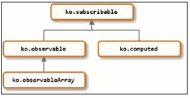

# 第九章：内部机制

我们已经涵盖了 Knockout 的基础知识，学习了如何扩展 Knockout 的绑定系统，并看到了如何组织应用程序。现在，是时候满足我们内心的工匠精神了。在本章中，我们将探讨 Knockout 的内部机制，看看是什么让它运转。到本章结束时，你应该熟悉 Knockout 如何处理以下内容：

+   依赖项跟踪

+   原型链

+   解析绑定属性表达式

+   应用绑定

+   模板化

此外，我们还将探讨`ko.utils`命名空间，它为常见操作提供了许多有用的工具。

### 注意

注意，本章中讨论的所有代码都是基于 Knockout 3.2 版本发布的。将来这部分内容可能会发生变化，这是可能的，也是很可能的。

# 依赖项跟踪

绑定处理程序和计算可观察对象需要在它们的可观察依赖项更新时重新评估。这意味着跟踪依赖项并订阅它们。三个对象构成了依赖项跟踪功能：可观察对象、计算可观察对象和依赖项检测模块。

这里有一个基本的概述。当一个计算被评估时，它会请求`ko.dependencyDetection`开始跟踪事物。当访问可观察对象时，它们会将自己注册到`ko.dependencyDetection`。当计算完成评估后，它会记录所有已注册的依赖项并订阅每个依赖项。

好的，现在让我们看看一些代码。

## ko.dependencyDetection

依赖项检测模块非常小——小到足以在这里完整地复制出来：

```js
ko.computedContext = ko.dependencyDetection = (function () {
  var outerFrames = [],
  currentFrame,
  lastId = 0;

  function getId() {
    return ++lastId;
  }

  function begin(options) {
    outerFrames.push(currentFrame);
    currentFrame = options;
  }

  function end() {
    currentFrame = outerFrames.pop();
  }

  return {
    begin: begin,
    end: end,
    registerDependency: function (subscribable) {
      if (currentFrame) {
        if (!ko.isSubscribable(subscribable))
        throw new Error("Only subscribable things can act as dependencies");
        currentFrame.callback(subscribable, subscribable._id || (subscribable._id = getId()));
      }
    },
    ignore: function (callback, callbackTarget, callbackArgs) {
      try {
        begin();
        return callback.apply(callbackTarget, callbackArgs || []);
      } finally {
        end();
      }
    },
    getDependenciesCount: function () {
      if (currentFrame)
      return currentFrame.computed.getDependenciesCount();
    },
    isInitial: function() {
      if (currentFrame)
      return currentFrame.isInitial;
    }
  };
})();
```

上述代码使用了揭示模块模式来隐藏`outerFrames`、`currentFrame`、`lastId`和`getId`函数的内部变量。

### 注意

更多关于揭示模块模式的信息，请查看 Todd Motto 的博客：[`toddmotto.com/mastering-the-module-pattern`](http://toddmotto.com/mastering-the-module-pattern)。

这里的想法是，`begin`要么被调用时带有可用于跟踪的帧，要么不带任何内容来禁用跟踪。当调用`end`时，之前的帧会被弹出并设置为当前帧。**帧**是一个跟踪依赖项的层；帧存在于另一个帧内部，但只有当前帧在访问依赖项时会注册依赖项。这允许依赖项跟踪递归发生，同时每个层只接收其直接依赖项。

传递给`begin`的`options`对象应该公开以下属性：

+   `callback`: 这是一个函数，当依赖项注册自身时，它会接收一个依赖项及其 ID

+   `computed`: 这是一个在帧上执行依赖项跟踪的计算可观察对象

+   `isInitial`: 这是一个布尔值，表示这是否是当前帧首次请求依赖项跟踪

当调用 `registerDependency` 时，当前帧的回调被传递给依赖及其 ID。ID 是按顺序生成的数字，如果依赖项缺失，则分配给依赖项。

`ignore` 函数提供了一个在 `try`/`finally` 块内对 `begin` 和 `end` 的简单包装。对 `begin` 的调用没有选项，因此不会触发依赖检测。这使得在你知道依赖检测不会或不应使用的情况下评估数据变得容易。Knockout 在几个绑定处理程序以及可订阅对象的 `notifySubscribers` 函数内部也这样做。

最后两个属性，即 `getDependenciesCount` 和 `isInitial`，暴露了当前帧上同名属性的特性。

## 注册依赖项

当读取可观察对象时，它必须通知 `ko.dependencyDetection` 以指示已访问依赖项。因为计算值和可观察对象都是可订阅的子类，而可订阅的子类不注册依赖项，因此它们各自都有自己的类似依赖项注册逻辑。

当可观察对象不带参数被调用时，发生可观察对象的实现：

```js
function observable() {
  if (arguments.length > 0) {
    /* write new value */
  }
  else {
    // Read
    ko.dependencyDetection.registerDependency(observable); 
    return _latestValue;
  }
}
```

在将自己注册为依赖项之后，它返回其当前值。计算版本几乎相同：

```js
function dependentObservable() {
  if (arguments.length > 0) {
    /* write new value */
  } else {
    ko.dependencyDetection.registerDependency(dependentObservable);
    if (_needsEvaluation) //suppressChangeNotification
    evaluateImmediate(true);
    return _latestValue;
  }
}
```

这里的唯一区别是，因为计算值可以异步评估，所以 `read` 函数在返回其值之前会检查是否需要重新评估。

关于这一点没有太多可说的。可观察数组类型不对注册过程进行任何更改。事实上，它无法进行任何更改。依赖注册是可观察对象的内部逻辑；不能被覆盖。

## 订阅依赖项

所有可观察对象的原型都是可订阅的。可订阅原型提供了两个用于依赖工作的函数：`subscribe` 和 `notifySubscribers`。

`subscribe` 函数在可订阅对象上创建一个订阅。订阅本身不执行任何操作，它只是一个具有 `callback` 和 `dispose` 属性的对象（它还有其他属性；这些只是相关的属性）。订阅存储在 `_subscriptions` 对象和内部使用属性中。由于订阅可以附加到命名事件，因此订阅对象为每个事件都有一个数组：

```js
_subscriptions: {
  change: [sub1, sub2],
  beforeChange: [sub3, sub4]
};
```

当创建一个没有名称的订阅时，它默认附加到更改事件。另一个标准事件是 `beforeChange` 事件，它在可观察对象更新之前触发。这是来自可观察对象的写入逻辑：

```js
function observable() {
  if (arguments.length > 0) {
    // Ignore writes if the value hasn't changed
    if (observable.isDifferent(_latestValue, arguments[0])) {
      observable.valueWillMutate();
      _latestValue = arguments[0];
      observable.valueHasMutated();
    }
    return this; // Permits chained assignments
  }
  else {
    // Read code
  }
}
//...
observable.valueHasMutated = function () {
  observable"notifySubscribers";
}
observable.valueWillMutate = function () {
  observable"notifySubscribers";
}
```

在可观察对象更新之前，它会调用 `valueWillMutate`，之后，它会调用 `valueHasMutated`。这两个都是 `notifySubscribers` 函数的包装，第一个提供了 `beforeChange` 事件名称：

```js
notifySubscribers: function (valueToNotify, event) {
  event = event || defaultEvent;
  if (this.hasSubscriptionsForEvent(event)) {
    try {
      // Begin suppressing dependency detection
      ko.dependencyDetection.begin();
      for (var a = this._subscriptions[event].slice(0), 
      i = 0, subscription; 
      subscription = a[i]; ++i) {
        if (!subscription.isDisposed)
        subscription.callback(valueToNotify);
      }
    } finally {
      // End suppressing dependency detection
      ko.dependencyDetection.end(); 
   }
 }
}
```

再次强调，事件名称是可选的，如果省略，则默认为`change`。它还会在开始之前检查是否存在该事件的订阅。然后，它禁用依赖检测。如果没有禁用依赖检测，那么原始新值编写者与当前可观察对象的订阅者之间将建立虚假的依赖关系。

### 注意

这种基本的发布/订阅实现可以很容易地用来创建消息系统。实际上，Ryan Niemeyer 已经创建了一个插件来完成这项工作（见[`github.com/rniemeyer/knockout-postbox`](https://github.com/rniemeyer/knockout-postbox)）。

主要工作是遍历订阅并传递当前值给订阅回调。执行检查以确保订阅没有被销毁，因为一个订阅可能因为另一个订阅而被销毁。最后，前面的代码块结束当前帧的依赖检测。

通过这三个部分，Knockout 提供了一个简单且高效的依赖跟踪系统。

## 订阅可观察数组

从原型上讲，可观察数组仍然是可观察的，但由于它们的更改主要是它们的内容而不是它们的值，它们有很多额外的逻辑来确保高效的通知。

### 标准数组函数

自从 ECMAScript 的第一个版本以来，JavaScript 就有一套标准的数组函数，所以你应该已经熟悉它们。它们给 Knockout 带来的头痛是它们直接修改数组的内容。由于数组订阅者期望在数组内容发生变化时被通知，Knockout 为`observableArray`提供了自己的实现。此实现在对原始数组函数进行调用之前调用可观察的标准通知函数。`slice`函数被跳过，因为它是一个只读函数，不需要通知订阅者：

```js
ko.utils.arrayForEach(["pop", "push", "reverse", "shift", "sort", "splice", "unshift"], function (methodName) {
  ko.observableArray['fn'][methodName] = function () {
    var underlyingArray = this.peek();
    this.valueWillMutate();
    this.cacheDiffForKnownOperation(underlyingArray, methodName, arguments);
    var methodCallResult = underlyingArray[methodName].apply(underlyingArray, arguments);
    this.valueHasMutated();
    return methodCallResult;
  };
});
```

自从 Knockout 1.0 以来，此函数几乎没有变化，当时它将方法添加到每个实例而不是可观察数组的`fn`原型。唯一的添加是调用`cacheDiffForKnownOperation`，它与内部`trackArrayChanges`扩展器一起工作，为增量更新数组提供更小、更快的变更通知。在此扩展器之前，可观察数组在每次更新时都会广播其全部内容。

此函数与普通可观察对象的`write`函数没有太大区别；它在执行更新之前调用`valueWillMutat`e，并在之后调用`valueHasMutated`。它不是设置自己的值，而是将原始方法名应用于底层数组。

`slice`函数甚至更简单。它不会触发订阅，因为它只读。它所做的只是包装底层数组的原始函数：

```js
ko.utils.arrayForEach(["slice"], function (methodName) {
  ko.observableArray['fn'][methodName] = function () {
    var underlyingArray = this();
    return underlyingArray[methodName].apply(underlyingArray, arguments);
  };
});
```

### 工具方法

除了标准方法之外，Knockout 还提供了对 JavaScript 中一些原因尚未实现的一些常见数组更改的友好函数：`remove`、`removeAll`、`destroy`、`destroyAll`和`replace`。

你现在应该能够猜到这些函数的样子；通过`peek`获取底层数组，调用`valueWillMutate`，进行一些更改，然后通过`valueHasMutated`完成。关于前面函数的有趣之处在于它们接受的参数。如果你传递一个对象给`remove`，如果它存在，它会预期地从这个数组中移除该对象。然而，如果你传递一个函数，它将被用作谓词，移除数组中任何导致谓词返回真值的元素（我非常喜欢这种模式）：

```js
remove: function (valueOrPredicate) {
  var underlyingArray = this.peek();
  var removedValues = [];
  var predicate = typeof valueOrPredicate == "function" && !ko.isObservable(valueOrPredicate) ? valueOrPredicate : function (value) { return value === valueOrPredicate; };
  for (var i = 0; i < underlyingArray.length; i++) {
    var value = underlyingArray[i];
    if (predicate(value)) {
      //Remove element, add to removedValues
    }
  }
  if (removedValues.length) {
    this.valueHasMutated();
  }
  return removedValues;
}
```

这通过将单个值转换为检查严格相等性的谓词来实现。检查`!ko.isObservable(valueOrPredicate)`很重要，因为可观察对象是函数，但在这里应该被视为值，而不是谓词。

这个相同的模式也用于`destroy`，只不过它使用`_destory`属性标记可观察对象，而不是移除它们。

`removeAll`和`destroyAll`函数也是重载的：它们可以接受要移除的值的数组，或者在没有提供参数的情况下移除所有元素。在提供值数组的案例中，它们只是调用基于数组的`remove`/`destroy`谓词：

```js
removeAll: function (arrayOfValues) {
  // If you passed zero args, we remove everything
  if (arrayOfValues === undefined) {
    //remove all elements
  }
  return this'remove' {
    return ko.utils.arrayIndexOf(arrayOfValues, value) >= 0;
  });
}
```

# 原型链

回到第一章, *Knockout 基础*，我向你展示了这张图：



这些对象继承函数的方式不是通过正常的 JavaScript 原型链，其中构造函数的 prototype 被分配给一个对象。这是因为可观察对象是函数而不是对象，并且不能使用构造函数或`Object.create`函数来创建函数。标准的 JavaScript 原型继承对函数不起作用。要了解 Knockout 如何共享方法，让我们看看可订阅对象及其子对象可观察对象的构建方式。

首先，可订阅对象的基本方法定义在`fn`对象上：

```js
var ko_subscribable_fn = {
  subscribe: function (callback, target, event) { /* logic */ },
  notifySubscribers: function (value, event) { /* logic */ },
  limit: function(limitFunction) { /* logic */ },
  hasSubscriptionsForEvent: function(event) { /* logic */ },
  getSubscriptionsCount: function () { /* logic */ },
  isDifferent: function(oldValue, newValue) { /* logic */ },
  extend: applyExtenders
};
ko.subscribable['fn'] = ko_subscribable_fn;
```

这是在构建可订阅对象时添加的：

```js
ko.subscribable = function () {
  ko.utils.setPrototypeOfOrExtend(this, ko.subscribable['fn']);
  this._subscriptions = {};
}
```

`setPrototypeOfOrExtend`方法将分配对象的`__proto__`属性——这是更高版本的 IE 版本无法做到的——或者使用`ko.utils.extend`来扩展对象。

可观察对象是以不同的方式构建的。它们的*工厂*方法返回一个内部构建的对象，该对象使用`ko.subscribable.call`和`setPrototypeOfOrExtend`来继承方法：

```js
ko.observable = function (initialValue) {
  var _latestValue = initialValue;

  function observable() {
    //build observable
  }
  ko.subscribable.call(observable);
  ko.utils.setPrototypeOfOrExtend(observable, ko.observable['fn']);

  observable.peek = function() { return _latestValue };
  observable.valueHasMutated = function () { 
    observable"notifySubscribers"; 
  }
  observable.valueWillMutate = function () { 
    observable"notifySubscribers"; 
  }

  return observable;
}
```

可观察对象被构建并运行通过可订阅对象的构造函数，扩展了`observable[''fn'']`对象，并最终添加了自己的方法。

## ko.isObservable 函数

在标准的 JavaScript 继承中，`instanceof` 操作符可以用来检查一个对象或其任何原型是否有与提供的函数匹配的构造函数。因为 Knockout 不使用标准继承，所以它不能使用 `instanceof` 操作符；相反，Knockout 使用以下代码来实现 `ko.isObservable` 函数。

```js
var protoProperty = ko.observable.protoProperty = "__ko_proto__";
ko.observable['fn'][protoProperty] = ko.observable;

ko.hasPrototype = function(instance, prototype) {
  if ((instance === null) || (instance === undefined) || (instance[protoProperty] === undefined)) return false;
  if (instance[protoProperty] === prototype) return true;
  return ko.hasPrototype(instance[protoProperty], prototype); // Walk the prototype chain
};

ko.isObservable = function (instance) {
  return ko.hasPrototype(instance, ko.observable);
}
```

Knockout 在 `observable[''fn'']` 对象上定义了一个 `__ko_proto__` 属性，并将其设置为 `ko.observable` 对象。这个自定义原型属性被 `hasPrototype` 用于代替 `instanceof` 操作符，以确定实例化对象是否是可观察的。

# 绑定表达式解析器

在数据绑定属性中编写的表达式实际上不是真正的 JavaScript 或 JSON，尽管它们看起来非常相似。Knockout 有自己的解析器将这些属性转换为 JavaScript。比如说你写了一个这样的数据绑定属性：

```js
data-bind="value: name, visible: showName"
```

然后，绑定提供者的任务是返回一个像这样的对象：

```js
{
  value: function() { return name; },
  visible: function() { return showName; }
}
```

默认绑定提供者使用 `ko.expressionRewriting` 模块来完成这项工作，该模块负责调用绑定预处理程序并返回一个类似 JSON 的字符串。在内部，这是通过正则表达式将完整属性解析为一个键/值对数组来完成的。这听起来可能有些混乱，但它完成了工作。话虽如此，即使是对于“内部”的查看，这些细节对 Knockout 来说并不非常相关，因为解析是通用的。如果你仍然好奇，代码位于 [`github.com/knockout/knockout/blob/master/src/binding/expressionRewriting.js`](https://github.com/knockout/knockout/blob/master/src/binding/expressionRewriting.js)，其内联注释优于平均水平。

解析数据绑定属性后，键/值对数组被迭代以构建一个类似 JSON 的字符串数组：

```js
function processKeyValue(key, val) {
  var writableVal;
  function callPreprocessHook(obj) {
    return (obj && obj['preprocess']) ? (val = obj'preprocess') : true;
  }
  if (!bindingParams) {
    if (!callPreprocessHook(ko'getBindingHandler'))
    return;

    if (twoWayBindings[key] && (writableVal = getWriteableValue(val))) {
      //provide a write method in case the value
      // isn't a writable observable.
      propertyAccessorResultStrings.push("'" + key + "':function(_z){" + writableVal + "=_z}");
    }
  }
  if (makeValueAccessors) {
    val = 'function(){return ' + val + ' }';
  }
  resultStrings.push("'" + key + "':" + val);
}
```

键用于查找绑定处理程序以调用其 `preprocess` 函数。如果它返回假值，则处理停止，因为绑定已被移除。当它来自 `getBindingAccessors` 时，`makeValueAccessors` 属性将为真，当它来自 `getBindings` 时为假。然后，结果被添加到一个运行列表中。

`twoWayBindings` 块向 `propertyAccessorResultStrings` 添加了一个特殊的功能字符串，在完成所有其他绑定键之后进行检查：

```js
if (propertyAccessorResultStrings.length)
  processKeyValue('_ko_property_writers', "{" + propertyAccessorResultStrings.join(",") + " }");
```

这添加了一个额外的绑定属性 `_ko_property_writers`，它是一个函数，可以用来写入而不是读取绑定属性。我们将在下一分钟回到这个问题。

最后，通过连接返回运行列表中的字符串：

```js
return resultStrings.join(",");
```

示例绑定产生的字符串将看起来像这样：

```js
'value': function() { return name; }, 'visible': function() { return showName; '_ko_property_writers':function(){return {'value':function(_z){ name =_z} } } }
```

绑定提供者通过将字符串放在函数体中并使用绑定上下文和被绑定的元素调用该函数，将这个字符串转换成一个真正的对象：

```js
var rewrittenBindings = ko.expressionRewriting.preProcessBindings(bindingsString, options),
  functionBody = "with($context){with($data||{}){return{" + rewrittenBindings + "}}}";
  return new Function("$context", "$element", functionBody);
```

### 注意

这种使用 `new Function` 的方法会导致在阻止 `new Function` 和 `eval` 的环境中（如 Google Chrome 扩展程序中）使用 Knockout 的默认绑定提供者失败。Knockout Secure Binding 是一个不使用 `new Function` 的绑定提供者，它允许 Knockout 与 CSP（见 [`github.com/brianmhunt/knockout-secure-binding`](https://github.com/brianmhunt/knockout-secure-binding)）一起使用。

当这个函数在绑定上下文和元素上评估时，它会产生最终的绑定对象：

```js
{
  value: function() { return name; },
  visible: function() { return showName; },
  _ko_property_writers: function (){
    return {'value':function(_z){query=_z} } 
  }
}
```

## Knockout 属性写入器

我们还没有介绍 `_`ko_property_writers` 属性，因为它对大多数人来说都很令人惊讶，并且可能会分散注意力。这个属性的作用是暴露非可观察值的写入函数，以便双向绑定处理程序仍然可以更新它们的值。它们不是可观察的，因此不会发生通知，但这仍然是一个受支持的场景。

这种特殊的绑定是在绑定访问器上进行的。当需要更新 viewmodel 的双向绑定，例如 `value`，它们会调用 `ko.expressionRewriting.writeValueToProperty`：

```js
writeValueToProperty: function(property, allBindings, key, value, checkIfDifferent) {
  if (!property || !ko.isObservable(property)) {
    var propWriters = allBindings.get('_ko_property_writers');
    if (propWriters && propWriters[key])
    propWriterskey;
  } else if (ko.isWriteableObservable(property) && (!checkIfDifferent || property.peek() !== value)) {
    property(value);
  }
}
```

### 注意

这部分是 API 的非文档部分，因此可能会在没有通知的情况下更改。

如果属性不是可观察的并且存在一个属性写入器，则使用它来更新值。如果属性是可观察的，则直接写入属性。

# 应用绑定

绑定应用过程主要发生在 `bindingAttributeSyntax` 模块中，该模块定义了 `ko.bindingContext` 类以及 `ko.applyBindings` 方法。高级概述如下：

1.  使用 viewmodel 调用 `ko.applyBindings` 方法。

1.  使用 viewmodel 构造绑定上下文。

1.  从 `ko.bindingProvider.instance` 获取绑定提供者。

1.  Knockout 与 DOM 树协同工作：

    +   它通过绑定提供者的节点预处理器传递（除了根节点）

    +   使用绑定提供者构建节点的绑定处理程序

    +   通过确保它们的 `after` 属性中的任何绑定首先加载来对绑定处理程序进行排序

    +   遍历绑定处理程序，调用每个处理程序的 `init` 和 `update` 函数。

前三个步骤相当直接；即使是遍历算法也只是一个简单的递归，它将绑定应用于一个节点，然后遍历其子节点以预处理和绑定它们。这个过程的真正核心是 `applyBindingsToNodeInternal` 函数，它实际上执行将绑定应用于节点的操作。

函数的前半部分是安全检查。我们将跳过这部分代码，因为它对于理解绑定部分的工作方式并不非常重要。因为我们已经介绍了绑定提供者如何生成绑定，所以我们只将查看最后两个要点。

## 排序绑定处理程序

Knockout 使用拓扑排序来对绑定处理程序进行排序。

如果你对拓扑排序不熟悉，请记住它来自图论。我们不会在这里详细介绍图论（如果你感兴趣，谷歌可以告诉你所有关于它的事情），但拓扑排序基本上是元素的排序，确保一个元素的依赖项都在该元素本身之前。拓扑排序不保证每次都保证相同的顺序；只是不存在依赖循环。

这是 Knockout 用来排序绑定处理程序的排序函数；它是一个相当常见的实现：

```js
function topologicalSortBindings(bindings) {
  // Depth-first sort
  var result = [],                // The list of key/handler pairs that we will return
  bindingsConsidered = {},    // A temporary record of which bindings are already in 'result'
  cyclicDependencyStack = []; // Keeps track of a depth-search so that, if there's a cycle, we know which bindings caused it
  ko.utils.objectForEach(bindings, function pushBinding(bindingKey) {
    if (!bindingsConsidered[bindingKey]) {
      var binding = ko'getBindingHandler';
      if (binding) {
        // First add dependencies (if any) of the current binding
        if (binding['after']) {
          cyclicDependencyStack.push(bindingKey);
          ko.utils.arrayForEach(binding['after'], function(bindingDependencyKey) {
            if (bindings[bindingDependencyKey]) {
              if (ko.utils.arrayIndexOf(cyclicDependencyStack, bindingDependencyKey) !== -1) {
                throw Error("Cannot combine the following bindings, because they have a cyclic dependency: " + cyclicDependencyStack.join(", "));
              } else {
                pushBinding(bindingDependencyKey);
              }
            }
          });
          cyclicDependencyStack.length--;
        }
        // Next add the current binding
        result.push({ key: bindingKey, handler: binding });
      }
      bindingsConsidered[bindingKey] = true;
    }
  });

  return result;
}
```

这个函数会遍历提供的绑定，跳过它已经处理过的绑定；如果它有一个`after`属性，它将开始依赖检查。它将当前绑定推入跟踪依赖的数组中，然后遍历`after`属性中的每个绑定。如果已经发现依赖绑定在依赖数组中，Knockout 会抛出一个异常，这意味着存在循环依赖。如果依赖绑定未找到，它将递归到循环处理程序中，以便检查其依赖项。

在检查完依赖绑定后，将依赖数组中的最后一个元素移除，并将当前绑定推入结果数组和已处理绑定数组。如果未来的绑定需要它作为依赖项，循环处理程序将立即返回，表示未来的绑定可以安全继续。

## 运行绑定处理程序

在获取正确的绑定处理程序顺序后，它们将被迭代。进行最后一次安全检查以确保如果节点是注释节点，则允许虚拟元素使用绑定处理程序。然后在`try`/`catch`块中调用`init`和`update`函数：

```js
// Run init, ignoring any dependencies
var handlerInitFn = bindingKeyAndHandler.handler["init"];
if (typeof handlerInitFn == "function") {
  ko.dependencyDetection.ignore(function() {
    var initResult = handlerInitFn(node, 
    getValueAccessor(bindingKey),
    allBindings,
    bindingContext['$data'],
    bindingContext);

    // If this binding handler claims to control descendant bindings, make a note of this
    if (initResult && initResult['controlsDescendantBindings']) {
      if (bindingHandlerThatControlsDescendantBindings !== undefined)
      throw new Error("Multiple bindings (" + bindingHandlerThatControlsDescendantBindings + " and " + bindingKey + ") are trying to control descendant bindings of the same element. You cannot use these bindings together on the same element.");
      bindingHandlerThatControlsDescendantBindings = bindingKey;
    }
  });
}
```

整个过程在一个禁用依赖检测的作用域中运行，因为`init`函数不会运行两次。`init`处理程序传递所有必需的参数，并检查结果以查看此处理程序是否想要控制子代绑定。如果不是第一个控制子代绑定的处理程序，Knockout 会抛出一个异常：

```js
// Run update in its own computed wrapper
var handlerUpdateFn = bindingKeyAndHandler.handler["update"];
if (typeof handlerUpdateFn == "function") {
  ko.dependentObservable(
    function() {
      handlerUpdateFn(node, 
      getValueAccessor(bindingKey), 
      allBindings, 
      bindingContext['$data'], 
      bindingContext);
    },
    null,
    { disposeWhenNodeIsRemoved: node }
  );
}
```

`update`处理程序在计算可观察值（`dependantObservable`是计算值的原始名称，仍在源代码中使用）内部运行，当依赖项发生变化时，它会自动重新运行。这是 Knockout 我最喜欢的部分之一：绑定处理程序在可观察依赖项变化时自动重新运行，因为*它们本身就在可观察值内部*。

一旦所有绑定处理程序都已遍历，`applyBindingsToNodeInternal`函数返回一个对象，告诉其调用者是否需要使用`init`处理程序的结果中的标志递归到当前节点的子节点：

```js
return {
  'shouldBindDescendants': bindingHandlerThatControlsDescendantBindings === undefined
};
```

# 模板

Knockout 的模板系统非常灵活：它支持*匿名*模板、命名模板，并允许覆盖渲染模板的引擎。模板绑定还用于`foreach`绑定，它只是`{ foreach: someExpression }`模板的语法糖。要了解模板系统是如何工作的，让我们从模板绑定处理程序开始。

## 模板绑定处理程序

模板绑定的`init`函数理解模板可以是命名的（从源加载）或内联（使用绑定元素的內容加载）：

```js
'init': function(element, valueAccessor) {
  // Support anonymous templates
  var bindingValue = ko.utils.unwrapObservable(valueAccessor());
  if (typeof bindingValue == "string" || bindingValue['name']) {
    // It's a named template - clear the element
    ko.virtualElements.emptyNode(element);
  } else {
    var templateNodes = ko.virtualElements.childNodes(element),
    container = ko.utils.moveCleanedNodesToContainerElement(templateNodes);
    new ko.templateSources.anonymousTemplate(element)'nodes';
  }
  return { 'controlsDescendantBindings': true };
}
```

如果绑定值只是一个字符串，或者绑定值是一个具有`name`属性的对象，那么我们正在使用一个命名源，并且需要完成的工作仅仅是清空节点。命名源需要在模板名称更改时进行更改，因此实际渲染模板的所有工作都在`update`方法中。

如果是一个匿名模板，`moveCleanedNodesToContainerElement`将移除元素的孩子并将它们放置在一个`div`容器中，但`div`容器不会被放置在 DOM 中。使用该元素创建一个新的匿名模板源，并将`div`容器传递给模板的`nodes`函数。`nodes`函数使用`utils.domData`存储容器。

**模板源**是一个由模板引擎使用的对象，用于提供渲染模板所需的 DOM。它必须提供一个返回包含要使用节点的容器的`nodes`函数，或者提供一个提供相同内容的字符串化的`text`函数。`ko.templateSources`数组包含两种模板源类型：`domElement`用于命名源，`anonymousTemplate`用于内联源。

最后，`init`函数返回`{ 'controlsDescendantBindings': true }`。

`update`函数有三个不同的分支：渲染单个模板的分支、使用`foreach`渲染模板数组的分支，以及如果存在`if`（或`ifnot`）绑定且为假时删除所有内容的分支。最后一个分支不需要太多解释，而前两个分支在功能上非常相似：它们在模板引擎上调用`renderTemplate`，该引擎返回一个 DOM 节点数组，然后这些节点被添加到 DOM 中。之后，它们各自在模板上调用`applyBindings`。

## 模板引擎

模板引擎负责生成 DOM 节点。然而，它不能单独使用，因为它只是一个基类。当在基模板引擎上调用`renderTemplate`时，它调用`makeTemplateSource`并将结果传递给`renderTemplateSource`。

默认的`makeTemplateSource`方法接受一个模板参数。如果模板是一个字符串，它将尝试通过该名称查找脚本并创建一个`domElement`源。如果模板是一个节点，它将从中创建并返回一个新的`anonymousTemplate`源。

默认的`renderTemplateSource`方法未实现，将抛出错误。模板实现必须覆盖此方法才能工作。

Knockout 提供了两个模板引擎实现：原生和 jQuery.tmpl。jQuery.tmpl 引擎自 2011 年以来就没有再进行开发了，我认为 Knockout 继续包含在标准分发中可能更多的是向后兼容性，而不是任何人真正需要的。它在那里，但我们将会忽略它。

原生模板引擎使用此方法覆盖`renderTemplateSource`：

```js
function (templateSource, bindingContext, options) {
  // IE<9 cloneNode doesn't work properly
  var useNodesIfAvailable = !(ko.utils.ieVersion < 9),
  templateNodesFunc = useNodesIfAvailable ? templateSource['nodes'] : null,
  templateNodes = templateNodesFunc ? templateSource['nodes']() : null;

  if (templateNodes) {
    return ko.utils.makeArray(templateNodes.cloneNode(true).childNodes);
  } else {
    var templateText = templateSource['text']();
    return ko.utils.parseHtmlFragment(templateText);
  }
};
```

如果存在`nodes`，它将被用来获取模板节点容器，克隆它，并返回它。如果它在更高的 IE 版本中，克隆不起作用，或者如果没有提供`nodes`，文本源将由`ko.utils`解析，并返回。

模板引擎不会将节点添加到 DOM 中，也不会绑定它们；它只是返回它们。模板绑定在从模板引擎获取生成的模板后负责这部分。

# `ko.utils`参考

`ko.utils`命名空间是 Knockout 的实用函数桶。并非所有这些函数都是公开暴露的——至少不是以可用的方式。Knockout 的压缩过程使其中超过一半的函数变得模糊。由于未模糊的方法是 Knockout 承诺提供的公共 API，因此更改它们将是一个重大的变更。尽管考虑了 API 的`ko.utils`部分的公开方法，但 Knockout 并没有为它们提供任何文档。

以下是 Knockout 3.2 版本中`ko.utils`的公共函数完整列表：

+   `addOrRemoveItem(array, item, included)`: 如果`included`为`true`，它将如果项目不在数组中则将其添加到数组中；如果`included`为`false`，它将如果项目存在则从数组中移除它。

+   `arrayFilter(array, predicate)`: 这返回一个数组，其中包含从数组中返回谓词`true`的元素，使用`predicate(element, index)`。

+   `arrayFirst(array, predicate, predicateOwner)`: 这返回数组中第一个使谓词返回`true`的元素，使用`predicate.call(predicateOwner, element, index)`。这使得`predicateOwner`成为一个可选参数，它控制谓词中的这部分。

+   `arrayForEach(array, action)`: 这将在数组的每个元素上调用操作，使用`action(element, index)`。

+   `arrayGetDistinctValues(array)`: 这返回一个只包含原始数组中唯一元素的新数组。它使用`ko.utils.arrayIndexOf`来确定唯一性。

+   `arrayIndexOf(array, item)`: 如果存在`Array.prototype.indexOf`，`arrayIndexOf(array, item)`将调用它，否则它将手动遍历数组并返回索引或如果找不到元素则返回`-1`。这是针对小于 9 版本的 Internet Explorer 的 polyfill。

+   `arrayMap(array, mapping)`: 这并不是`Array.prototype.map`的 polyfill；这个函数通过在原始数组的每个元素上调用`mapping(element, index)`来返回一个新数组。

+   `arrayPushAll(array, valuesToPush)`: 这个函数将 `valuesToPush` 参数推入 `array` 参数。此函数处理 `valuesToPush` 类似于数组但实际上不是数组的情况，例如 `HTMLCollection`，在正常情况下调用 `array.push.apply(array, valuesToPush)` 会失败。

+   `arrayRemoveItem(array, itemToRemove)`: 这个函数通过剪切或移动，根据项目索引从数组中移除项目。

+   `domData`: 此对象提供 `get`、`set` 和 `clear` 方法，以便在 DOM 节点上处理任意键/值对。Knockout 内部使用它来跟踪绑定信息，但也可以用来存储任何内容。

+   `domNodeDisposal`: 此对象提供与 DOM 清理任务相关的以下实用工具：

    +   `addDisposeCallback(node, callback)`: 这个函数向具有 `domData` 的节点添加回调。如果 Knockout 通过模板或控制流删除节点，将使用此回调。

    +   `cleanNode(node)`: 这个函数运行所有与 `addDisposeCallback` 注册的关联的销毁回调。此函数别名为 `ko.cleanNode`。

    +   `cleanExternalData(node)`: 这个函数使用 jQuery 的 `cleanData` 函数来移除 jQuery 插件添加的数据。如果未找到 jQuery，则不执行任何操作。

    +   `removeDisposeCallback(node, callback)`: 这个函数从节点的 `domData` 函数中移除回调。

    +   `removeNode(node)`: 这个函数使用 `cleanNode` 清理节点，然后将其从 DOM 中删除。此函数别名为 `ko.removeNode`。

+   `Extend(target, source)`: 这是一个普通的扩展方法；它将源上的所有属性添加或覆盖到目标上。它使用 `hasOwnProperty` 过滤源属性。

+   `fieldsIncludedWithJsonPost`: 这是一个默认字段数组，用于 `postJson`，如果没有指定 `includeFields` 选项。

+   `getFormFields(form, fieldName)`: 这个函数返回所有与 `fieldname` 匹配的 `input` 或 `textarea` 字段，其中 `fieldname` 可以是一个字符串、一个正则表达式，或者一个包含测试谓词的对象，该谓词接受字段名称。

+   `objectForEach(obj, action)`: 这个函数对 `obj` 中的每个属性调用 `action(properyName, propetyValue)`，使用 `hasOwnProperty` 过滤。

+   `parseHtmlFragment(html)`: 如果存在 jQuery，此函数使用其 `parseHTML` 函数；否则，它使用简单的内部 HTML 解析。它返回 DOM 节点。

+   `parseJson(jsonString)`: 通过解析提供的字符串，这将返回一个 JavaScript 对象。如果 JSON 对象存在，它将被使用；否则，将使用 `new Function`。

+   `peekObservable(value)`: 就像 `ko.unwrap` 一样，这是一个安全方法。如果值是可观察的，它将返回其 peek 的结果；否则，它将只返回值。

+   `postJson(urlOrForm, data, options)`: 这将通过创建一个新的表单，将其附加到 DOM 上，并在其上调用 `submit` 来执行一个 POST 操作。表单将使用 `data` 来创建其字段。如果 `urlOrForm` 是一个表单，并且其字段与 `options['includeFields']`（或如果 `options['includeFields']` 不存在，则为 `fieldsIncludedWithJsonPost`）匹配，则其字段将包含在数据中，并且其 action 将用作 URL。

+   `Range(min, max)`: 这返回一个介于 `min` 和 `max` 之间的值数组。它对两个参数都使用 `ko.unwrap`。

+   `registerEventHandler(element, eventType, handler)`: 这将事件处理器附加到元素上。如果可能，它使用 jQuery，如果可用，则使用 `addEventListener`，或者作为最后的手段使用 `attachEvent`（Internet Explorer）。如果使用 `attachEvent`，它将注册一个清理处理器来调用 `detachEvent`，因为 IE 不会自动这样做。

+   `setHtml(node, html)`: 这会清空节点的内容，解包 HTML，并使用 `jQuery.html`（如果可用）或 `parseHtmlFragement` 来设置节点的 HTML。

+   `stringifyJson(data, replacer, space)`: 这使用 `ko.unwrap` 来处理可观察数据，并调用 `JSON.stringify`。`replacer` 和 `space` 参数是可选的。如果 JSON 对象不存在，它将抛出异常。

+   `toggleDomNodeCssClass(node, classNames, shouldHaveClass)`: 这使用 `shouldHaveClass` 布尔值来决定是否添加或移除节点上所有 `classNames` 布尔值。

+   `triggerEvent(element, eventType)`: 这在元素上触发事件。当适用时，它使用 jQuery，并处理在 IE 和 jQuery 中引发点击事件的已知问题。

+   `unwrapObservable(value)`: 这是 `ko.unwrap` 的原始名称，为了向后兼容而保留。它将返回可观察值的底层值，或者如果不是可观察值，则返回其本身。

# 摘要

虽然这当然不是对 Knockout 内部结构的详尽分析，你可能根本不希望这样做，但你至少应该对 Knockout 如何完成大多数重要任务有一个很好的理解。本章涵盖了依赖跟踪、*原型*（`fn`）链、绑定表达式解析器、`ko.applyBindings` 的工作方式、Knockout 如何处理模板以及 `ko.utils` 命名空间。希望你会对每个系统如何内部工作感到舒适。了解这些组件如何组合在一起应该有助于你在调试那些真正棘手的错误时。
