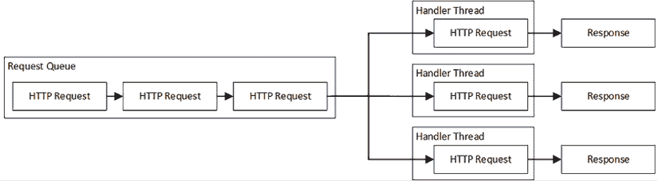
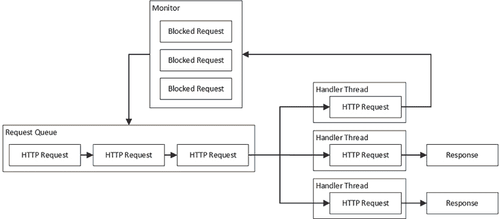
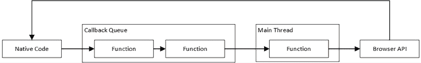
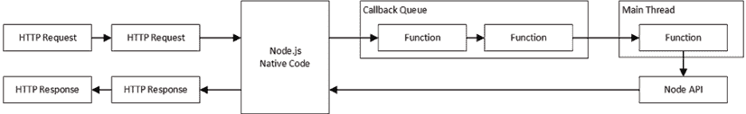
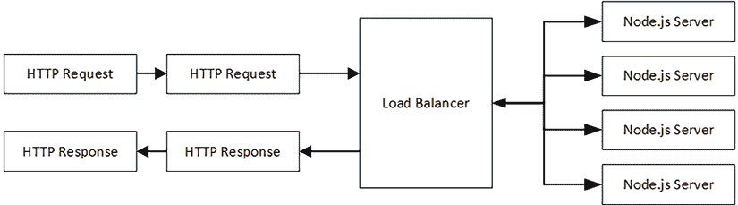
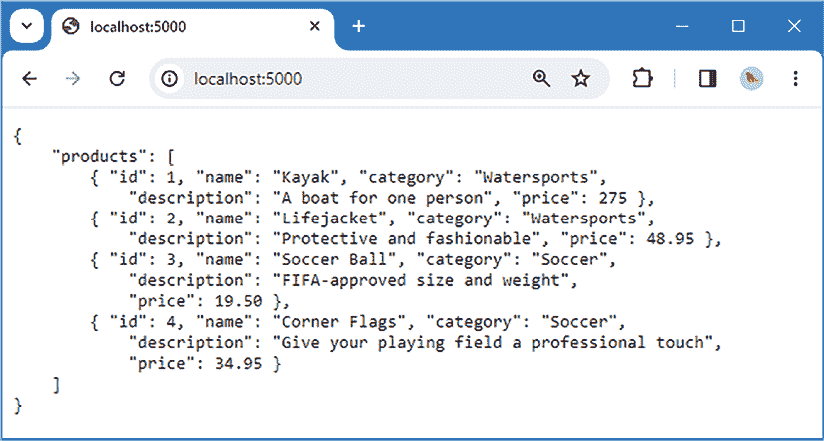
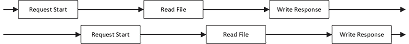
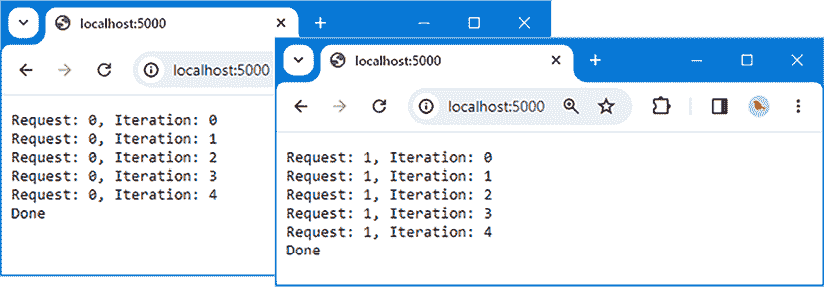
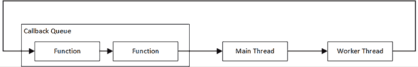
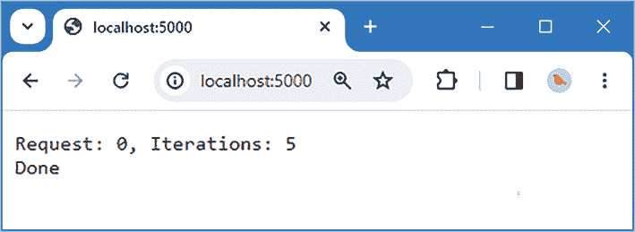

# 第四章：理解 Node.js 并发

服务器端 Web 开发的特点是尽可能快速和高效地处理大量 HTTP 请求。JavaScript 与其他语言和平台不同，因为它只有一个执行线程，这意味着 HTTP 请求是逐个处理的。然而，在幕后，还有更多的事情在进行，在本章中，我将解释为什么 JavaScript 方法不寻常，Node.js API 如何代表 JavaScript 代码执行工作，以及如何创建额外的执行线程来处理计算密集型任务。*表 4.1* 将 JavaScript 并发置于上下文中。

表 4.1：将 Node.js 并发置于上下文中

| 问题 | 答案 |
| --- | --- |
| 它是什么？ | 并发是代码多个线程的执行。Node.js 支持并发，但它隐藏了这些细节不向开发者展示。 |
| 为什么它有用？ | 并发允许服务器通过同时接受和处理多个 HTTP 请求来实现更高的吞吐量。 |
| 如何使用？ | Node.js 为 JavaScript 代码提供了一个名为主线程的单个执行线程，它依赖于事件来协调处理不同线程所需的工作。Node.js API 在其 API 中广泛使用并发执行，但这在很大程度上对开发者隐藏。 |
| 有没有陷阱或限制？ | 必须注意不要阻塞主线程；否则，性能将受到影响。 |
| 有没有替代方案？ | 没有。并发模型是 Node.js 的核心，理解它是创建可扩展经济型 Web 应用程序的关键。 |

*表 4.2* 总结了本章内容。

表 4.2：本章总结

| 问题 | 解决方案 | 列表 |
| --- | --- | --- |
| 并发执行任务 | 使用 Node.js API 并通过回调函数或承诺处理事件。 | *10-15* |
| 将代码包装为承诺或回调 | 使用 `promisify` 和 `callbackify` 函数。 | *16, 17* |
| 避免阻塞主线程处理简单任务 | 将工作分解成更小的块，可以与其他工作交织进行。 | *21* |
| 避免阻塞主线程处理复杂任务 | 使用工作线程。 | *22-27* |

# 准备本章内容

要创建本章的项目，打开一个新的命令提示符，导航到一个方便的位置，并创建一个名为 `webapp` 的文件夹。在 `webapp` 文件夹中运行 *列表 4.1* 中显示的命令，以创建 `package.json` 文件。

列表 4.1：初始化项目

```js
npm init -y 
```

在 `webapp` 文件夹中运行 *列表 4.2* 中显示的命令，以安装用于编译 TypeScript 文件和监视文件更改的包。

**提示**

您可以从[`github.com/PacktPublishing/Mastering-Node.js-Web-Development`](https://github.com/PacktPublishing/Mastering-Node.js-Web-Development)下载本章（以及本书中所有其他章节）的示例项目。有关如何获取帮助以运行示例的信息，请参阅*第一章*。

*列表 4.2*：安装工具包

```js
npm install --save-dev typescript@5.2.2
npm install --save-dev tsc-watch@6.0.4 
```

在 `webapp` 文件夹中运行*列表 4.3*中显示的命令，以添加配置 Node.js 项目的 TypeScript 编译器的包，并描述 Node.js API 使用的类型。

*列表 4.3*：添加编译配置和类型包

```js
npm install --save-dev @tsconfig/node20
npm install --save @types/node@20.6.1 
```

要配置 TypeScript 编译器，在 `webapp` 文件夹中创建一个名为 `tsconfig.json` 的文件，其内容如*列表 4.4*所示。

*列表 4.4*：webapp 文件夹中 tsconfig.json 文件的内容

```js
{
   "extends": "@tsconfig/node20/tsconfig.json",
    "compilerOptions": {                      
        "rootDir": "src",  
        "outDir": "dist",                                   
    }
} 
```

此配置文件扩展了 TypeScript 开发者为与 Node.js 一起工作提供的配置文件。TypeScript 文件将在 `src` 文件夹中创建，编译后的 JavaScript 将写入 `dist` 文件夹。

打开 `package.json` 文件，并将*列表 4.5*中显示的命令添加到 `script` 部分，以定义将启动构建工具的命令。

*列表 4.5*：在 webapp 文件夹中的 package.json 文件中添加脚本命令

```js
{
  "name": "webapp",
  "version": "1.0.0",
  "description": "",
  "main": "index.js",
  "scripts": {
    **"start": "tsc-watch --onsuccess \"node dist/server.js\""**
  },
  "keywords": [],
  "author": "",
  "license": "ISC",
  "devDependencies": {
    "tsc-watch": "⁶.0.4",
    "typescript": "⁵.2.2"
  }
} 
```

## 创建简单的 Web 应用程序

在设置了包和构建工具之后，是时候创建一个简单的 Web 应用程序了。创建 `webapp/src` 文件夹，并向其中添加一个名为 `handler.ts` 的文件，其内容如*列表 4.6*所示。

*列表 4.6*：src 文件夹中 handler.ts 文件的内容

```js
import { IncomingMessage, ServerResponse } from "http";
export const handler = (req: IncomingMessage, res: ServerResponse) => {
    res.end("Hello World");
}; 
```

此文件定义了将处理 HTTP 请求的代码。我在*第五章*中描述了 Node.js 提供的 HTTP 功能，但就本章而言，只需知道 HTTP 请求由一个 `IncomingMessage` 对象表示，响应是通过使用 `ServerResponse` 对象创建的。*列表 4.6*中的代码对所有请求都返回一个简单的 `Hello World` 消息。

接下来，向 `src` 文件夹添加一个名为 `server.ts` 的文件，其内容如*列表 4.7*所示。

*列表 4.7*：src 文件夹中 server.ts 文件的内容

```js
import { createServer } from "http";
import { handler } from "./handler";
const port = 5000;
const server = createServer(handler);
server.listen(port, function() {
    console.log(`Server listening on port ${port}`);
}); 
```

此代码创建了一个简单的 HTTP 服务器，它监听端口 5000 上的 HTTP 请求，并使用*列表 4.6*中定义的 `handler.ts` 文件中的函数来处理它们。

在 `webapp` 文件夹中添加一个名为 `data.json` 的文件，其内容如*列表 4.8*所示。此文件将在本章后面使用。

*列表 4.8*：webapp 文件夹中 data.json 文件的内容

```js
{
    "products": [
        { "id": 1, "name": "Kayak", "category": "Watersports",
            "description": "A boat for one person", "price": 275 },
        { "id": 2, "name": "Lifejacket", "category": "Watersports",
            "description": "Protective and fashionable", "price": 48.95 },
        { "id": 3, "name": "Soccer Ball", "category": "Soccer",
            "description": "FIFA-approved size and weight",
            "price": 19.50 },
        { "id": 4, "name": "Corner Flags", "category": "Soccer",
            "description": "Give your playing field a professional touch",
            "price": 34.95 }
    ]
} 
```

在 `webapp` 文件夹中运行*列表 4.9*中显示的命令，以启动监视器，该监视器将监视和编译 TypeScript 文件，并执行生成的 JavaScript。

*列表 4.9*：启动项目

```js
npm start 
```

`src` 文件夹中的 `server.ts` 文件将被编译，生成一个名为 `dist` 文件夹中的 `server.js` 的纯 JavaScript 文件，当它执行时将产生以下输出：

```js
Server listening on port 5000 
```

打开网页浏览器并导航到`http://localhost:5000`以向 HTTP 服务器发送请求，这将产生*图 4.1*中显示的响应。


图 4.1：运行示例应用

# 理解（简化的）服务器代码执行

需要一个免责声明：本章省略了一些细节，对某些解释有些宽松，并且模糊了一些细微的界限。

本章涉及的主题很复杂，有无数的细微差别和细节，以及在不同平台上意味着不同事物的术语。因此，考虑到简洁性，我专注于对 JavaScript Web 应用开发重要的事项，即使这意味着会忽略一些主题。

并发是一个真正有趣的主题，并且可以是一个有回报的研究领域。但在深入细节之前，请记住，要成为一名有效的 JavaScript 开发者，你只需要对并发有一个基本的概述——就像本章中提到的。

## 理解多线程执行

服务器端 Web 应用需要能够同时处理许多 HTTP 请求，以便经济地扩展规模，这样就可以使用少量的服务器容量来支持大量的客户端。

传统的做法是利用现代服务器硬件的多线程功能，创建一个处理线程池。当一个新的 HTTP 请求到达时，它被添加到一个队列中，在那里它等待直到有一个线程可用来处理它。线程处理请求，将响应发送回客户端，然后返回队列等待下一个请求。

服务器硬件可以同时执行多个线程，如图*图 4.2*所示，这样就可以并发接收和处理大量请求。



图 4.2：并发处理 HTTP 请求

这种方法充分利用了服务器硬件，但它要求开发者考虑请求可能会相互干扰。一个常见的问题是，一个处理线程在另一个线程读取数据时修改数据，从而产生意外的结果。

为了避免这类问题，大多数编程语言都包含用于限制线程之间交互的关键字。具体细节各异，但像`lock`和`synchronize`这样的关键字被用来确保线程通过创建只能由一个线程同时执行的代码保护区域来安全地使用共享资源和数据。

编写使用线程的代码需要在安全和性能之间取得平衡。代码的保护区域可能是性能瓶颈，如果保护措施应用得太广泛，那么性能会受到影响，可以并发处理的请求数量也会减少。然而，如果保护措施应用得太少，请求可能会相互干扰并产生意外的结果。

### 理解阻塞和非阻塞操作

在大多数服务器端应用程序中，处理 HTTP 请求的线程大部分时间都在等待。这可能是在等待数据库生成结果，等待从文件中获取下一块数据，或者等待访问受保护的代码区域。

当一个线程在等待时，我们称它为*阻塞*。一个阻塞的线程在等待的操作完成之前无法执行任何其他工作，在此期间，服务器处理请求的能力会降低。在繁忙的应用程序中，新请求的流入是持续的，而让线程闲置不工作会导致请求队列堆积，从而降低整体吞吐量。

一个解决方案是使用*非阻塞*操作，也称为*异步*操作。这些术语可能会让人困惑。理解它们最好的方式是通过一个现实世界的例子：一家披萨餐厅。

想象一下，在接单后，餐厅的一名员工走进厨房，组装你的披萨，把它放进烤箱，站在那里等待 10 分钟，然后把它端给你。这就是阻塞——或者说同步——的披萨制作方法。如果顾客在有空闲员工接单时进入餐厅，他们会很高兴，因为他们可以最快地得到披萨。但其他人不会高兴。排队等候的其他顾客不会高兴，因为他们必须等待，直到他们前面的所有顾客的披萨都组装好、烤好并上桌，这时才有员工可以为他们制作披萨。餐厅老板也不高兴，因为披萨的吞吐量等于员工数量，而员工大部分时间都在等待披萨烤熟。

有一个更合理的方法。一个员工——让我们称他为鲍勃——被分配了监控烤箱的任务。其他员工像以前一样接单、组装披萨，并将它们放入烤箱，但他们不会等待披萨烤熟，而是让鲍勃告诉他们披萨何时烤好。

当鲍勃在烤箱里观察披萨时，其他员工可以继续工作，为队列中的下一个顾客接单，准备下一个披萨，等等。鲍勃可以观察很多披萨，所以能生产的披萨数量限制是烤箱的大小，而不是员工数量。

对于除了鲍勃之外的所有人来说，烤披萨已经变成了一种非阻塞操作。等待烤箱是没有办法绕过的，但通过让一个人做所有的等待，餐厅的效率得到了提高。每个人都感到高兴。

嗯，几乎是这样。餐厅老板很高兴，因为餐厅能生产更多的披萨。排队等候的顾客也很高兴，因为员工可以在鲍勃查看早先订单的同时开始制作他们的披萨。但个别订单可能需要更长的时间：鲍勃可能会告诉另一个员工披萨已经准备好了，但如果他们正忙于服务其他顾客，他们可能无法提供服务。整体餐厅的表现有所提高，但个别订单可能需要更长的时间来完成。

可以采用与*图 4.3*所示相同的方法来处理 HTTP 请求。



图 4.3：从阻塞操作中释放请求处理器

处理器线程在继续处理队列中的请求的同时，依赖于监控线程而不是等待操作完成。当阻塞操作完成后，监控线程将请求放回队列，以便处理器线程可以继续处理该请求。

将操作委托给监控的过程通常集成到用于编写 Web 应用的 API 中，这样从文件中读取数据等操作会自动释放处理器线程，使其能够执行其他工作，并且可以信赖它在文件读取操作完成后将请求放入队列以进行处理。

重要的是要理解，*非阻塞*和*异步*这两个术语是从处理器线程的角度出发的。操作仍然需要时间来完成，但在那段时间内处理器线程可以执行其他工作。仍然存在阻塞线程，但它们不是负责处理 HTTP 请求的线程，这是我们最关心的线程。

## 理解 JavaScript 代码执行

作为一种基于浏览器的语言，JavaScript 的起源塑造了 JavaScript 代码的编写和执行方式。JavaScript 最初用于提供用户与 HTML 元素的交互。每种类型的元素都定义了*事件*，描述了用户与该元素交互的不同方式。例如，按钮元素有用户点击按钮、将指针移至按钮上等事件。

程序员编写称为*回调*的 JavaScript 函数，并使用浏览器的 API 将这些函数与元素上的特定事件关联起来。当浏览器检测到事件时，它会将回调添加到队列中，以便由 JavaScript 运行时执行。

JavaScript 运行时有一个单独的线程，称为*主线程*，负责执行回调。主线程在一个循环中运行，从队列中取出回调并执行它们，这被称为 JavaScript 的*事件循环*。事件循环是浏览器原生代码（为特定操作系统编写）与在任意兼容运行时上运行的 JavaScript 代码交互的方式。

**注意**

事件循环更复杂，但回调队列的概念对于有效的 JavaScript 网络开发已经足够接近。如果你像我一样对此类事物感兴趣，这些细节值得探索。一个不错的起点是[`nodejs.org/en/docs/guides/event-loop-timers-and-nexttick`](https://nodejs.org/en/learn/asynchronous-work/event-loop-timers-and-nexttick)。

事件通常成簇发生，例如当指针跨越多个元素时，因此队列可以包含多个等待执行的回调，如图*4.4*所示。


图 4.4：回调队列

使用单线程意味着任何需要时间完成的回调操作都会导致应用程序冻结，因为回调队列正在等待处理。为了帮助管理这个问题，许多浏览器 API 特性是非阻塞的，并使用回调模式来传递它们的结果。

几年来，JavaScript 语言和浏览器 API 已经添加了功能，但事件循环和回调函数用于执行 JavaScript。例如，浏览器提供的 HTTP 请求 API 定义了一系列描述请求生命周期的事件，这些事件通过回调函数处理，如图*4.5*所示。



图 4.5：浏览器 API 的结果通过 JavaScript 回调函数处理

在幕后，浏览器使用原生线程执行 HTTP 请求并等待响应，然后通过回调将响应传递给 JavaScript 运行时。

JavaScript 运行时只执行一个回调，因此 JavaScript 语言不需要像`lock`和`synchronize`这样的关键字。JavaScript 代码通过一个 API 与浏览器交互，该 API 隐藏了实现细节并一致地接收结果。

## 理解 Node.js 代码执行

Node.js 保留了主线程和事件循环，这意味着服务器端代码以与客户端 JavaScript 相同的方式执行。对于 HTTP 服务器，主线程是唯一的请求处理器，回调用于处理传入的 HTTP 连接。示例应用程序演示了如何使用回调来处理 HTTP 请求：

```js
...
const server = createServer(**handler**);
... 
```

当 Node.js 收到 HTTP 连接时，传递给`createServer`函数的回调函数将被调用。该函数定义了代表已接收请求和将返回给客户端的响应的参数：

```js
...
export const handler = (**req: IncomingMessage, res: ServerResponse**) => {
    res.end("Hello World");
};
... 
```

我在*第五章*中描述了 Node.js 提供的 HTTP API，但回调函数使用其参数来准备将发送给客户端的响应。Node.js 接收 HTTP 请求和返回 HTTP 响应的细节被隐藏在原生代码中，如图*4.6*所示。



图 4.6：在 Node.js 中处理 HTTP 请求

尽管 Node.js 可能只有一个处理线程，但由于现代服务器硬件非常快，性能可以非常出色。即便如此，单个线程并没有充分利用大多数应用程序部署的多核和多处理器硬件。

为了扩展，启动多个 Node.js 实例。HTTP 请求由负载均衡器（或入口控制器或主节点，具体取决于应用程序的部署方式，如第三部分所述）接收，并分配给 Node.js 实例，如图 4.7 所示。



图 4.7：使用多个 Node.js 实例进行扩展

单个 Node.js 实例仍然只有一个 JavaScript 线程，但它们可以集体处理更高的请求量。

将 JavaScript 执行模型应用于 HTTP 请求的一个重要后果是，阻塞主线程将阻止该 Node.js 实例处理所有请求，从而产生类似于客户端 JavaScript 中可能出现的死锁。Node.js 通过两种方式帮助程序员避免阻塞主线程：一个执行许多异步任务的 API，称为 *工作池*，以及支持启动额外的线程来执行阻塞 JavaScript 代码，称为 *工作线程*。这两个特性将在接下来的章节中描述。

# 使用 Node.js API

Node.js 用支持常见服务器端任务（如处理 HTTP 请求和读取文件）的 API 替换了浏览器提供的 API。在幕后，Node.js 使用称为工作池的本地线程来异步执行操作。

为了演示，*列表 4.10* 使用 Node.js API 读取文件内容。

列表 4.10：在 src 文件夹的 handler.ts 文件中使用 Node.js API

```js
import { IncomingMessage, ServerResponse } from "http";
**import { readFile } from "fs";**
export const handler = (req: IncomingMessage, res: ServerResponse) => {
    **readFile****("data.json", (err: Error | null, data: Buffer) => {**
 **if (err == null) {**
 **res.end(data, () => console****.log("File sent"));**
 **} else {**
 **console.log(`Error: ${err.message}`);**
 **res.statusCode = 500;**
 **res.end****();**
 **}**
 **});**
}; 
```

如其名所示，`readFile` 函数读取文件的正文。使用网页浏览器请求 `http://localhost:5000`，你将看到图 4.8 所示的输出。



图 4.8：将文件内容发送到客户端

读取操作是异步的，并使用本地线程实现。文件内容传递给一个回调函数，该函数将它们发送到 HTTP 客户端。

代码中有三个回调函数。第一个回调是传递给 `createServer` 函数的，当接收到 HTTP 请求时被调用：

```js
...
const server = createServer(**handler**);
... 
```

第二个回调是传递给 `readFile` 函数的，当文件内容被读取或发生错误时被调用：

```js
...
export const handler = (req: IncomingMessage, res: ServerResponse) => {
    readFile("data.json", (**err: Error** **| null, data: Buffer) => {**
**if (err == null) {**
 **res.end(data, () => console.log("File sent"));**
 **} else** **{**
 **console.log(`Error: ${err.message}`);**
 **res.statusCode = 500;**
 **res.end();**
 **}**
 **});**
};
... 
```

我使用类型注解来帮助描述读取文件的结果的呈现方式。回调的第一个参数的类型是 `Error | null`，用于指示结果。如果第一个参数是 `null`，则操作已成功完成，文件的內容将在第二个参数中可用，其类型是 `Buffer`。（Buffer 是 Node.js 表示字节数组的方式。）如果第一个参数不是 `null`，则 `Error` 对象将提供阻止读取文件的问题的详细信息。

**注意**

当您从浏览器发送 HTTP 请求时，您可能会在命令提示符中看到两条消息。浏览器通常会请求 `favicon.ico` 文件以获取可以在标签页标题中显示的图标，这就是为什么您有时会在输出中看到两次出现 `File sent` 的原因。

当从文件中读取的数据已发送到客户端时，将调用第三个回调：

```js
...
export const handler = (req: IncomingMessage, res: ServerResponse) => {
    readFile("data.json", (err: Error | null, data: Buffer) => {
        if (err == null) {
            res.end(data, **() => console.log("File sent")**);
        } else {
            console.log(`Error: ${err.message}`);
            res.statusCode = 500;
            res.end();
        }
    });
};
... 
```

使用回调分解生成 HTTP 响应的过程意味着 JavaScript 主线程不需要等待文件系统读取文件的内容，这允许处理来自其他客户端的请求，如图 *4.9* 所示。



图 4.9：使用多个回调分解请求处理

## 处理事件

事件用于提供通知，表明应用程序的状态已更改，并提供执行回调函数以处理该更改的机会。事件在 Node.js API 中被广泛使用，尽管通常有一些便利功能隐藏了细节。*列表 4.11* 修改了监听 HTTP 请求的代码，以直接使用事件。

列表 4.11：在 src 文件夹中的 server.ts 文件中处理事件

```js
import { createServer } from "http";
import { handler } from "./handler";
**const port = 5000;**
**const server = createServer();**
**server.on("****request", handler)**
**server.listen(port);**
**server.on("listening", () => {**
 **console.log(`(Event) Server listening on port ${port}****`);**
**});** 
```

许多使用 Node.js API 创建的对象扩展了 `EventEmitter` 类，这表示事件源。`EventEmitter` 类定义了 *表 4.3* 中描述的方法来接收事件。

表 4.3：有用的 eventemitter 方法

| 名称 | 描述 |
| --- | --- |

|

```js
`on(event, callback)` 
```

| 此方法注册一个 `回调`，以便在指定事件被触发时执行。 |
| --- |

|

```js
`off(event, callback)` 
```

| 此方法在特定事件被触发时停止调用 `回调`。 |
| --- |

|

```js
`once(event, callback)` 
```

| 此方法注册一个`回调`，以便在指定事件被触发时执行，但之后不再执行。 |
| --- |

扩展 `EventEmitter` 的类定义事件并指定它们何时被触发。由 `createServer` 方法返回的 `Server` 类扩展了 `EventEmitter` 并定义了在 *列表 4.11* 中使用的两个事件：`request` 和 `listening` 事件。*列表 4.7* 和 *列表 4.11* 中的代码具有相同的效果，唯一的区别是 `createServer` 函数在幕后将其函数参数注册为 `request` 事件的回调，而 `listen` 方法将其函数参数注册为 `listening` 事件的回调。

重要的是要理解事件是 Node.js API 的一个重要部分，并且可以直接使用 *表 4.3* 中描述的方法使用，或者通过其他功能间接使用。

## 使用承诺

承诺是回调和 Node.js API 的一些部分的替代方案。承诺与回调具有相同的目的，即定义异步操作完成后将执行的代码。不同之处在于，使用承诺编写的代码通常比使用回调编写的代码更简单。Node.js 提供承诺和回调的 API 部分之一是用于处理文件，如 *列表 4.12* 所示。

列表 4.12：在 src 文件夹的 handler.ts 文件中使用承诺

```js
import { IncomingMessage, ServerResponse } from "http";
**//import { readFile } from "fs";**
**import { readFile } from** **"fs/promises";**
export const handler = (req: IncomingMessage, res: ServerResponse) => {
 **   const p: Promise<****Buffer> = readFile("data.json");**
 **p.then((data: Buffer) => res.end(data, () => console.log("****File sent")));**
 **p.catch((err: Error) => {**
 **console.log(`Error: ${err.message}`);**
 **res.statusCode = 500****;**
 **res.end();**
 **});**
**};** 
```

这通常不是承诺的使用方式，这就是为什么代码看起来比之前的例子更复杂。但这段代码强调了承诺的工作方式。这是创建承诺的语句：

```js
...
const p: Promise<Buffer> = readFile("data.json");
... 
```

`readFile` 函数与用于回调的函数具有相同的名称，但它在 `fs/promises` 模块中定义。`readFile` 函数返回的结果是 `Promise<Buffer>`，这是一个异步操作完成后将产生 `Buffer` 对象的承诺。

**理解何时同步方法是有用的**

除了回调和承诺之外，Node.js API 的某些部分也提供了同步功能，这些功能会在完成之前阻塞主线程。一个例子是 `readFileSync` 函数，它执行与 `readFile` 相同的任务，但会阻塞执行直到文件内容被读取。

在大多数情况下，你应该使用 Node.js 提供的非阻塞功能来最大化 Node.js 可以处理的请求数量，但有两种情况下阻塞操作更有意义。第一种情况出现在你知道操作将很快完成，以至于比设置承诺或回调更快时。执行异步操作会有资源和时间成本，有时可以避免这种情况。这种情况并不常见，你应该仔细考虑潜在的性能影响。

第二种情况更为常见，那就是当你知道主线程将要执行的下一段代码将是你要执行的操作的结果时。你可以在 *第六章* 中看到一个例子，我在 Node.js 开始监听 HTTP 请求之前同步地读取配置文件。

承诺要么是 *已解决* 的，要么是 *被拒绝* 的。一个成功完成并产生其结果的承诺是已解决的。`then` 方法用于注册当承诺解决时将被调用的函数，这意味着文件已成功读取，如下所示：

```js
...
p.**then**((data: Buffer) => res.end(data, () => console.log("File sent")));
... 
```

被拒绝的承诺是指发生了错误的承诺。使用 `catch` 方法来注册一个处理被拒绝的承诺产生的错误的函数，如下所示：

```js
...
p.**catch**((err: Error) => {
    console.log(`Error: ${err.message}`);
    res.statusCode = 500;
    res.end();
});
... 
```

注意，使用承诺不会改变用于描述结果的数据类型：使用 `Buffer` 来描述从文件中读取的数据，使用 `Error` 来描述错误。

使用 `then` 和 `catch` 方法将成功的结果与错误分开，这与回调 API 不同，后者将两者都展示出来，并要求回调函数确定发生了什么。

`then` 和 `catch` 方法可以串联在一起，这是简化代码的一个小改进，如 *列表 4.13* 所示，并且是使用承诺的更典型方式。

列表 4.13：在 src 文件夹中的 handler.ts 文件中链式调用承诺方法

```js
import { IncomingMessage, ServerResponse } from "http";
import { readFile } from "fs/promises";
export const handler = (req: IncomingMessage, res: ServerResponse) => {
    **readFile("data.json")**
 **.then((data: Buffer) => res.end(data, () =>** **console.log("File sent")))**
 **.catch((err: Error) => {**
 **console.log(`Error: ${err.message}`****);**
 **res.statusCode = 500;**
 **res.end();**
 **});**
}; 
```

这看起来更整洁，但真正的改进来自于使用 `async` 和 `await` 关键字，这使得可以使用不需要嵌套函数或链式方法的语法来执行异步操作，如 *列表 4.14* 所示。

列表 4.14：在 src 文件夹中的 handler.ts 文件中使用 async 和 await 关键字

```js
import { IncomingMessage, ServerResponse } from "http";
import { readFile } from "fs/promises";
**export const handler = async (req: IncomingMessage, res: ServerResponse****) => {**
 **const data: Buffer = await readFile("data.json");**
 **res.end(data, () => console.log****("File sent"));**
**};** 
```

使用 `async` 和 `await` 关键字通过移除对 `then` 方法和其函数的需求来简化代码。`async` 关键字应用于处理请求的函数：

```js
...
export const handler = **async** (req: IncomingMessage, res: ServerResponse) => {
... 
```

`await` 关键字应用于返回承诺的语句，如下所示：

```js
**...**
**const data: Buffer = await readFile("data.json");**
**...** 
```

这些关键字不会改变 `readFile` 函数的行为，它仍然异步读取文件，并仍然返回一个 `Promise<Buffer>`，但 JavaScript 运行时会异步地获取由 promise 产生的结果，在这个例子中是一个 `Buffer` 对象，将其分配给一个名为 `data` 的常量，然后执行后续的语句。结果是相同的——以及获取结果的方式也是相同的——但语法更简单，更容易阅读。

这还不是代码的最终版本。为了支持错误处理，当使用 `await` 关键字时，将 `Promise` 对象上使用的 `catch` 方法替换为 `try/catch` 块，如 *列表 4.15* 所示。

列表 4.15：在 src 文件夹中的 handler.ts 文件中添加错误处理

```js
import { IncomingMessage, ServerResponse } from "http";
import { readFile } from "fs/promises";
export const handler = async (req: IncomingMessage, res: ServerResponse) => {
 **try {**
        const data: Buffer = await readFile("data.json");
        res.end(data, () => console.log("File sent"));
 **} catch (err: any) {**
 **console.log(`Error: ${err?.message ?? err}****`);**
 **res.statusCode = 500;**
 **res.end();** 
 **}**
}; 
```

传递给 `catch` 异常的值的类型是 `any`，而不是 `Error`，因为 JavaScript 不限制用于表示错误的类型。

**提示**

与承诺相比，回调的一个优点是回调可以在同一操作中多次被调用，允许在异步工作执行期间提供一系列更新。承诺旨在产生一个单一的结果，而不提供任何中间更新。你可以在本章末尾看到一个这种差异的例子。

## 包装回调和展开承诺

Not every part of the Node.js API supports both promises and callbacks, and that can lead to both approaches being mixed in the same code. You can see this problem in the example, where the `readFile` function returns a promise, but the `end` method, which sends data to the client and finishes the HTTP response, uses a callback:

```js
...
const data: Buffer = await readFile("data.json");
res.end(data, **() =>** **console.log("File sent")**);
... 
```

The promise and callback APIs can be mixed without problems, but the result can be awkward code. To help ensure consistency, the Node.js API includes two useful functions in the `util` module, which are described in *Table 4.4*.

表 4.4：包装回调和展开 promise 的函数

| Name | Description |
| --- | --- |

|

```js
`promisify` 
```

| This function creates a `Promise` from a function that accepts a conventional callback. The convention is that the arguments passed to the callback are an error object and the result of the operation. There is support for other arrangements of arguments using a custom symbol – see [`nodejs.org/docs/latest/api/util.html#utilpromisifycustom`](https://nodejs.org/docs/latest/api/util.html#utilpromisifycustom) for details. |
| --- |

|

```js
`callbackify` 
```

| This function accepts a `Promise` object and returns a function that will accept a conventional callback. |
| --- |

这些函数背后的想法是好的，但它们有一些限制，尤其是在尝试从回调创建 promise 以使用 `await` 关键字时。最大的限制是，除非小心处理 JavaScript 处理 `this` 关键字的方式，否则 `promisify` 函数在类方法上不会无缝工作。此外，TypeScript 也有一个特定的问题，编译器没有正确识别涉及的类型。

在 `src` 文件夹中添加一个名为 `promises.ts` 的文件，其内容如 *列表 4.16* 所示。

列表 4.16：src 文件夹中 promises.ts 文件的内容

```js
import { ServerResponse } from "http";
import { promisify } from "util";
export const endPromise = promisify(ServerResponse.prototype.end) as
    (data: any) => Promise<void>; 
```

The first step is to use `promisify` to create a function that returns a promise, which I do by passing the `ServerResponse.prototype.end` function to `promisify`. I use the `as` keyword to override the type inferred by the TypeScript compiler with a description of the method parameters and result:

```js
...
export const endPromise = promisify(ServerResponse.prototype.end) as
    **(data: any) => Promise<void>;**
... 
```

*列表 4.17* 导入了在 *列表 4.16* 中定义的函数，并使用了它产生的 promise。

列表 4.17：src 文件夹中 handler.ts 文件中使用 Promise

```js
import { IncomingMessage, ServerResponse } from "http";
import { readFile } from "fs/promises";
**import { endPromise } from "./promises";**
export const handler = async (req: IncomingMessage, res: ServerResponse) => {
    try {
        const data: Buffer = await readFile("data.json");
 **await endPromise.bind(res)(data);**
 **console.log("File sent");**
    } catch (err: any) {
        console.log(`Error: ${err?.message ?? err}`);
        res.statusCode = 500;
        res.end();  
    }
}; 
```

当在 `promisify` 创建的函数上使用 `await` 关键字时，我必须使用 `bind` 方法，如下所示：

```js
...
await endPromise.**bind(res)**(data);
... 
```

The `bind` method associates the `ServerResponse` object for which the function is being invoked. The result is a new function, which is invoked by passing the data that will be sent to the client:

```js
...
await endPromise.bind(res)(**data**);
... 
```

The result is that the `await` keyword can be used instead of the callback, even though it is a slightly awkward process.

# 执行自定义代码

所有 JavaScript 代码都是由主线程执行的，这意味着任何不使用 Node.js 提供的非阻塞 API 的操作都会阻塞线程。为了保持一致性，将*列表 4.18*中显示的语句添加到`promises.ts`文件中，以便将`ServerResponse`类定义的`write`方法包装在一个 promise 中。

列表 4.18：在 src 文件夹中的 promises.ts 文件中添加函数

```js
import { ServerResponse } from "http";
import { promisify } from "util";
export const endPromise = promisify(ServerResponse.prototype.end) as
    (data: any) => Promise<void>;
**export const writePromise = promisify(ServerResponse.prototype.write) as**
 **(data: any) => Promise<void>;** 
```

*列表 4.19*过滤掉了对`favicon.ico`文件的请求，这在早期示例中是可行的，但在这个部分会添加不需要的请求。

列表 4.19：在 src 文件夹中的 server.ts 文件中过滤请求

```js
import { createServer } from "http";
import { handler } from "./handler";
const port = 5000;
const server = createServer();
**server.on("request", (req, res) =>** **{**
 **if (req.url?.endsWith("favicon.ico")) {**
 **res.statusCode = 404;**
 **res.end();**
 **} else {**
 **handler(req, res)**
 **}**
**});**
server.listen(port);
server.on("listening", () => {
    console.log(`(Event) Server listening on port ${port}`);
}); 
```

*列表 4.20*通过引入一个完全在 JavaScript 中实现的耗时操作，展示了线程阻塞的问题。

列表 4.20：在 src 文件夹中的 handler.ts 文件中的阻塞操作

```js
import { IncomingMessage, ServerResponse } from "http";
**//import { readFile } from "fs/promises";**
import { endPromise, writePromise } from "./promises";
**const total = 2_000_000_000;**
**const** **iterations = 5;**
**let shared_counter = 0;**
export const handler = async (req: IncomingMessage, res: ServerResponse) => {
   ** const** **request = shared_counter++;**
 **for (let iter = 0; iter < iterations; iter++) {**
 **for (let count = 0; count < total; count++) {**
 **count++;**
 **}**
 **const msg = `Request: ${request}, Iteration: ${(iter)}`****;**
 **console.log(msg);**
 **await writePromise.bind(res)(msg + "\n");**
 **}**
 **await endPromise.bind(res)("Done");**
}; 
```

两个`for`循环反复递增一个数值，由于这个操作完全是用 JavaScript 编写的，主线程在两个循环完成之前都会被阻塞。为了看到阻塞线程的效果，打开两个浏览器标签页，并在两个标签页中请求[`localhost:5000`](http://localhost:5000)。你需要在第一个请求完成之前在第二个标签页中开始请求，你可能需要调整`total`值来给自己留出时间。*列表 4.20*中的`total`值在我的系统上需要三到四秒才能完成，这足以在两个浏览器标签页中开始请求。

**避免浏览器缓存问题**

一些浏览器，包括 Chrome，不会对相同的 URL 发起并发请求。这意味着第二个浏览器标签页的请求不会开始，直到第一个标签页请求的响应被接收，这可能会让人误以为请求总是阻塞的。

浏览器这样做是为了查看第一个请求的结果是否可以添加到它们的缓存中，并用于后续请求。这通常不是问题，但它可能会令人困惑，特别是对于本章讨论的功能。

你可以通过禁用浏览器缓存（例如，Chrome 在*F12*开发者工具窗口的**网络**选项卡上有**禁用缓存**复选框）或请求不同的 URL 来避免这个问题，例如`http://localhost:5000?id=1`和`http://localhost:5000?id=2`。

你会发现两个浏览器标签页都会得到结果，如图*图 4.10*所示。每个请求通过递增`shared_counter`值来标识，这使得将浏览器中显示的输出与 Node.js 控制台消息关联起来变得容易。



图 4.10：阻塞主线程

检查 Node.js 控制台输出，你会看到第一个请求的所有迭代都在开始第二个请求的工作之前完成：

```js
...
Request: 0, Iteration: 0
Request: 0, Iteration: 1
Request: 0, Iteration: 2
Request: 0, Iteration: 3
Request: 0, Iteration: 4
Request: 1, Iteration: 0
Request: 1, Iteration: 1
Request: 1, Iteration: 2
Request: 1, Iteration: 3
Request: 1, Iteration: 4
... 
```

这是一个典型的、尽管有些夸张的阻塞 JavaScript 线程的例子，使得请求排队等待处理，整体请求吞吐量下降。

## 释放主线程的控制权

解决阻塞的一种方法是将工作分解成更小的块，这些块与其他请求交织在一起。尽管工作仍然完全由主线程完成，但阻塞发生在一系列较短的周期中，这意味着对主线程的访问更加公平。

*表 4.5* 描述了可用于告诉 Node.js 在未来调用函数的函数。（与之前一样，我在这里简化了事情，以避免涉及 Node.js 事件循环的低级细节。）

表 4.5：调度函数

| 名称 | 描述 |
| --- | --- |

|

```js
`setImmediate` 
```

| 此函数告诉 Node.js 将一个函数添加到回调队列中。 |
| --- |

|

```js
`setTimeout` 
```

| 此函数告诉 Node.js 将一个函数添加到回调队列中，该函数至少需要等待指定的毫秒数后才能被调用。 |
| --- |

这些是 *全局* 函数，这意味着可以在不进行模块导入的情况下使用。*列表 4.21* 使用了 `setImmediate` 函数，以便将计数操作分解成更小的工作块。

列表 4.21：在 src 文件夹中的 handler.ts 文件中使用 setImmediate 函数

```js
import { IncomingMessage, ServerResponse } from "http";
import { endPromise, writePromise } from "./promises";
const total = 2_000_000_000;
const iterations = 5;
let shared_counter = 0;
export const handler = async (req: IncomingMessage, res: ServerResponse) => {
    const request = shared_counter++;
    **const iterate = async (iter: number = 0) => {**
 **for (let count = 0; count < total; count++) {**
 **count++;**
 **}**
 **const msg = `Request: ${request}, Iteration: ${(iter)}`;**
 **console.log(msg);**
 **await writePromise.bind(res)(msg + "\n"****);**
 **if (iter == iterations -1) {**
 **await endPromise.bind(res)("Done");**
 **} else {**
 **setImmediate(() => iterate****(++iter));**
 **}**
 **}**
 **iterate();**
}; 
```

`iterate` 函数执行一个计数块，然后使用 `setImmediate` 函数延迟下一个块。使用两个浏览器标签页请求 `http://localhost:5000`（如果你没有禁用浏览器缓存，则请求 `http://localhost:5000?id=1` 和 `http://localhost:5000?id=2`），你将看到由 Node.js 生成的控制台消息显示，为两个请求执行的工作已经交织在一起：

```js
...
Request: 0, Iteration: 0
Request: 0, Iteration: 1
Request: 1, Iteration: 0
Request: 0, Iteration: 2
Request: 1, Iteration: 1
Request: 0, Iteration: 3
Request: 1, Iteration: 2
Request: 0, Iteration: 4
Request: 1, Iteration: 3
Request: 1, Iteration: 4
... 
```

你可能会看到不同的迭代顺序，但重要的是 HTTP 请求的工作被分解并交织在一起。

**避免纯 JavaScript 承诺的陷阱**

一个常见的错误是尝试将阻塞的 JavaScript 代码包裹在一个承诺（promise）中，如下所示：

```js
`...`
`await new Promise<void>(resolve => {`
 `// executor - perform one unit of blocking work`
 `resolve();`
`}).then(() => {`
 `// follow on - set up next unit of work`
`});`
`...` 
```

这种方法对粗心的开发者有两个陷阱。第一个是 *执行器*，即执行工作的函数，是同步执行的。这看起来可能有些奇怪，但请记住，所有 JavaScript 代码都是同步执行的，预期执行器将用于调用将产生未来结果并最终添加到回调队列以进行处理的异步 API 方法。

第二个陷阱是传递给 `then` 方法的 *后续* *函数*，在执行器完成时立即执行，在主线程返回回调队列以获取另一个要执行的函数之前，这导致没有工作交织。

承诺（promises）是消费使用原生线程执行异步工作的 API 的有用方式，但它们在执行纯 JavaScript 代码时并没有帮助。

## 使用工作线程

之前示例的关键限制是仍然只有一个主线程，并且它仍然必须完成所有工作，无论这项工作是如何公平地完成的。

Node.js 支持 *工作线程*，这是用于执行 JavaScript 代码的额外线程，尽管存在一些限制。JavaScript 没有像 C# 或 Java 那样用于线程协调的特性，尝试添加这些特性将会很困难。相反，工作线程在 Node.js 引擎的独立实例中运行，与主线程隔离执行代码。主线程和工作线程之间的通信是通过事件完成的，如 *图 4.11* 所示，这很好地融入了 JavaScript 事件循环，因此工作线程产生的结果由回调函数处理，就像任何其他 JavaScript 代码一样。



图 4.11：主线程和工作线程

工作线程并非解决所有问题的方案，因为创建和管理它们会有开销，但它们提供了一种有效的方式来执行 JavaScript 代码而不阻塞主线程。

**理解工作线程与工作池**

由于 Node.js 使用了两个相似的术语：*工作线程* 和 *工作池*，因此存在术语重叠，可能会引起混淆。因为 Node.js 使用这两个术语：*工作线程* 和 *工作池*。工作线程是本章这一部分的主题，由程序员启动以执行 JavaScript 代码而不阻塞主线程。工作池是 Node.js 用于实现其 API 异步特性的线程集合，例如本章中用于读取文件和写入 HTTP 响应的函数。您不能直接与工作池交互，它由 Node.js 自动管理。

为了增加混淆，出于性能原因，工作线程通常被分组到一个池中，允许单个工作线程被重复使用，而不是使用一次后丢弃。我将在 *第二部分* 中解释如何做到这一点。

### 编写工作线程代码

工作线程执行的代码与 JavaScript 应用程序的其他部分定义是分开的。在 `src` 文件夹中添加一个名为 `count_worker.ts` 的文件，其内容如 *清单 4.22* 所示。

清单 4.22：src 文件夹中 count_worker.ts 文件的内容

```js
import { workerData, parentPort  } from "worker_threads";
console.log(`Worker thread ${workerData.request} started`);
for (let iter = 0; iter < workerData.iterations; iter++) {
    for (let count = 0; count < workerData.total; count++) {
        count++;
    }
    parentPort?.postMessage(iter);
}
console.log(`Worker thread ${workerData.request} finished`); 
```

工作线程的特性定义在 `worker_threads` 模块中，其中两个特性在 *清单 4.22* 中被使用。第一个，`workerData`，是一个对象或值，用于从主线程传递配置数据到工作线程。在这种情况下，工作线程通过 `workerData` 接收三个值，分别指定请求 ID、迭代次数以及每个计数工作块的目标值：

```js
...
console.log(`Worker thread ${**workerData.request**} started`);
for (let iter = 0; iter < **workerData.iterations**; iter++) {
    for (let count = 0; count < **workerData.total**; count++) {
... 
```

另一个特性是 `parentPort`，它用于发出主线程将接收的事件，如下所示：

```js
...
parentPort?.**postMessage**(iter);
... 
```

`postMessage` 方法会触发一个消息事件，并负责将工作线程的 JavaScript 运行时中的参数值传输到主线程。`parentPort` 的值可能是 `null`，这就是为什么在调用 `postMessage` 方法时需要使用 `?` 操作符。

### 创建工作线程

下一步是更新请求处理代码，以便使用上一节中定义的代码创建工作线程，如*列表 4.23*所示。

列表 4.23：在 src 文件夹中的 handler.ts 文件中使用工作线程

```js
import { IncomingMessage, ServerResponse } from "http";
import { endPromise, writePromise } from "./promises";
**import { Worker } from "worker_threads";**
const total = 2_000_000_000;
const iterations = 5;
let shared_counter = 0;
export const handler = async (req: IncomingMessage, res: ServerResponse) => {
    const request = shared_counter++;

 **const worker = new Worker(__dirname + "/count_worker.js", {**
 **workerData: {**
 **iterations,**
 **total,**
 **request**
 **}**
 **});**
 **worker.on("message",** **async (iter: number) => {**
 **const msg = `Request: ${request}, Iteration: ${(iter)}`;**
 **console.log(msg);**
 **await writePromise.bind(res)(msg + "****\n");**
 **});**
 **worker.on("exit", async (code: number) => {**
 **if (code == 0) {**
 **await endPromise.bind(res)("****Done");**
 **} else {**
 **res.statusCode = 500;**
 **await res.end();**
 **}**
 **});**
 **worker.on("error", async (err) => {**
 **console.****log(err)**
 **res.statusCode = 500;**
 **await res.end();** 
 **});**
}; 
```

工作线程通过实例化`Worker`类创建，该类在`worker_threads`模块中定义。构造函数的参数是要执行的 JavaScript 代码文件和一个配置对象：

```js
...
const worker = new **Worker**(__dirname + "/count_worker.js", {
    workerData: {
        iterations,
        total,
        request
    }
});
... 
```

Node.js 提供了两个全局值，它们提供了关于当前模块的路径信息，并且对于指定文件路径很有用，这些信息在*表 4.6*中描述，以便快速参考。要指定*列表 4.22*中创建的代码文件，我将`__dirname`值与编译后的 JavaScript 文件名（而不是 TypeScript 文件，它不能直接由 Node.js 执行）结合起来。

表 4.6：当前模块的全局值

| **名称** | **描述** |
| --- | --- |

|

```js
`__filename` 
```

| 此值包含当前模块的文件名。请记住，这将是指 JavaScript 文件的名称，而不是 TypeScript 文件。 |
| --- |

|

```js
`__dirname` 
```

| 此值包含包含当前模块的目录的名称。请记住，这将包含编译后的 JavaScript 文件而不是 TypeScript 文件的目录。 |
| --- |

传递给`Worker`构造函数的配置对象支持管理工作线程执行方式的配置设置，但本例中所需的唯一选项是`workerData`，它允许定义工作线程使用的数据值。

**提示**

有关其他工作配置选项，请参阅[`nodejs.org/docs/latest/api/worker_threads.html#new-workerfilename-options`](https://nodejs.org/docs/latest/api/worker_threads.html#new-workerfilename-options)，尽管其他选项很少需要。

工作线程通过发出事件与主线程进行通信，这些事件由`on`方法注册的函数处理，如下所示：

```js
...
worker.**on**("message", async (iter: number) => {
    const msg = `Request: ${request}, Iteration: ${(iter)}`;
    console.log(msg);
    await writePromise.bind(res)(msg + "\n");
});
... 
```

`on`方法的第一个参数是一个字符串，指定了将要处理的事件的名称。此处理程序用于`message`事件，当工作线程使用`parentPort.postMessage`方法时发出。在这个例子中，`message`事件表示工作线程完成了一次计数迭代。

本例中还处理了两个其他事件。`exit`事件由 Node.js 在工作线程完成时触发，该事件提供了一个退出代码，指示工作线程是否正常完成或因错误而终止。还有一个`error`事件，如果工作线程执行的 JavaScript 代码抛出未捕获的异常，则会发送该事件。

使用两个浏览器标签请求`http://localhost:5000`（如果你没有禁用浏览器缓存，则可以是`http://localhost:5000?id=1`和`http://localhost:5000?id=2`），你将看到 Node.js 控制台消息显示请求重叠时进行的计算，如下所示：

```js
...
Worker thread 0 started
Request: 0, Iteration: 0
Request: 0, Iteration: 1
Worker thread 1 started
Request: 0, Iteration: 2
Request: 1, Iteration: 0
Request: 0, Iteration: 3
Request: 1, Iteration: 1
Request: 0, Iteration: 4
Worker thread 0 finished
Request: 1, Iteration: 2
Request: 1, Iteration: 3
Request: 1, Iteration: 4
Worker thread 1 finished
... 
```

与早期示例的重要区别在于，请求的工作是在并行执行的，而不是所有的工作都在单个线程上执行。

## 将工作线程打包到回调中

清单 4.23 中的代码可以被封装，使其与 Node.js API 保持一致，使用回调。对于回调，将一个名为 `counter_cb.ts` 的文件添加到 `src` 文件夹中，其内容如 *清单 4.24* 所示。

清单 4.24：src 文件夹中 counter_cb.ts 文件的内容

```js
import { Worker } from "worker_threads";
export const Count = (request: number, iterations: number, total: number,
        callback: (err: Error | null, update: number | boolean) => void) => {
    const worker = new Worker(__dirname + "/count_worker.js", {
        workerData: {
            iterations,
            total,
            request
        }
    });

    worker.on("message", async (iter: number) => {
        callback(null, iter);
    });

    worker.on("exit", async (code: number) => {
        callback(code === 0 ? null : new Error(), true);
    });

    worker.on("error", async (err) => {
        callback(err, true);
    });       
} 
```

`Count` 函数接受描述要执行的工作的参数，以及一个回调函数，该函数将在出现错误、迭代完成以及所有工作都完成时被调用。*清单 4.25* 更新了请求处理代码以使用 `Count` 函数。

清单 4.25：在 src 文件夹中的 handler.ts 文件中使用回调函数

```js
import { IncomingMessage, ServerResponse } from "http";
import { endPromise, writePromise } from "./promises";
**//import { Worker } from "worker_threads";**
**import { Count } from "./counter_cb";**
const total = 2_000_000_000;
const iterations = 5;
let shared_counter = 0;
export const handler = async (req: IncomingMessage, res: ServerResponse) => {
    const request = shared_counter++;
    C**ount****(request, iterations, total, async (err, update) => {**
 **if (err !== null) {**
 **console.log(err)**
 **res.statusCode = 500;**
 **await res.end();** 
 **} else** **if (update !== true) {**
 **const msg = `Request: ${request}, Iteration: ${(update)}`;**
 **console.log(msg);**
 **await writePromise.bind****(res)(msg + "\n");**
 **} else {**
 **await endPromise.bind(res)("Done");** 
 **}**
 **});**
}; 
```

此示例产生的结果与上一个示例相同，但与大多数 Node.js API 更为一致，其关键部分将在接下来的章节中描述。

## 将工作线程打包到承诺中

工作线程也可以被封装在一个承诺中，尽管承诺不像回调那样适合接收中间更新，因此使用承诺只有在所有工作都完成或出现问题时才会产生结果。将一个名为 `count_promise.ts` 的文件添加到 `src` 文件夹中，其内容如 *清单 4.26* 所示。

**注意**

使用承诺可以产生中间更新，但这需要生成一系列承诺，这些承诺需要在循环中使用 `await` 关键字。结果是代码混乱，不符合承诺通常的行为，最好避免。如果需要从工作线程中获取中间更新，请使用回调。

清单 4.26：src 文件夹中 count_promise.ts 文件的内容

```js
import { Worker } from "worker_threads";
export const Count = (request: number,
        iterations: number, total: number) : Promise<void> => {
    return new Promise<void>((resolve, reject) => {
        const worker = new Worker(__dirname + "/count_worker.js", {
            workerData: {
                iterations, total, request
            }
        });
        worker.on("message", (iter) => {
            const msg = `Request: ${request}, Iteration: ${(iter)}`;           
            console.log(msg);           
        });
       worker.on("exit", (code) => {
            if (code !== 0) {
                reject();
            } else {
                resolve();
            }
        });

       worker.on("error", reject);       
    });
} 
```

`Count` 函数返回一个 `Promise<void>`，其执行器启动一个工作线程并设置处理它发出的事件的处理器。处理 `exit` 和 `error` 事件的函数解决或拒绝承诺，这将表示承诺已完成或抛出异常。`message` 事件的处理器将输出控制台消息以显示进度，但不会影响承诺的结果。*清单 4.27* 修订了请求处理器以使用基于承诺的 `Count` 函数版本。

清单 4.27：在 src 文件夹中的 handler.ts 文件中使用承诺

```js
import { IncomingMessage, ServerResponse } from "http";
import { endPromise, writePromise } from "./promises";
**//import { Count } from "./counter_cb";**
**import { Count } from "./count_promise";**
const total = 2_000_000_000;
const iterations = 5;
let shared_counter = 0;
export const handler = async (req: IncomingMessage, res: ServerResponse) => {
    const request = shared_counter++;
  **try {**
 **await Count(request, iterations, total);**
 **const msg = `Request: ${request}, Iterations: ${(iterations)}`;**
 **await writePromise.bind(res)(msg + "\n");**
**await endPromise.bind(res)("Done");**
 **} catch (err: any) {**
 **console.log(err);**
 **res.statusCode = 500;**
 **res.end();**
 **}**
}; 
```

这与早期示例类似，但发送给客户端的响应不包括每个工作块结束时生成的任何消息，如图 *图 4.12* 所示。



图 4.12：承诺封装的工作线程的结果

# 摘要

在本章中，我描述了 JavaScript 代码的执行方式，并解释了这对 HTTP 请求处理的影响以及为什么这种方法与其他平台不同。我解释了 JavaScript 代码是在单个主线程上执行的，并展示了 Node.js 为在其他线程上卸载工作提供的功能。

+   JavaScript 代码是在单个线程上执行的，这个线程被称为主线程

+   Node.js API 使用原生线程来执行许多操作，以避免阻塞主线程

+   Node.js API 主要使用回调，但也提供了一些对承诺（promises）的支持

+   Node.js 提供了将回调和承诺进行转换的函数

+   Node.js 支持使用工作线程（worker threads）来执行 JavaScript 代码，而不会阻塞主线程

在下一章中，我将描述 Node.js 为处理 HTTP 请求提供的功能
