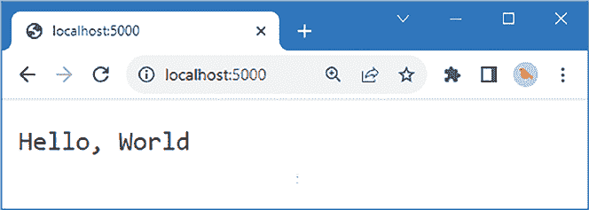
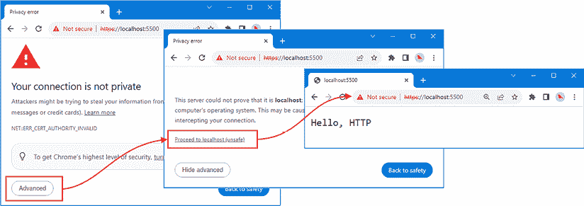
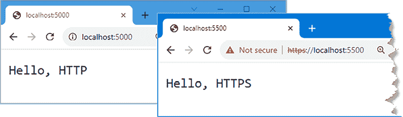
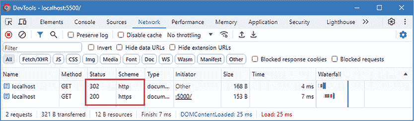

# 第五章：处理 HTTP 请求

服务器端 Web 开发的基础是能够从客户端接收 HTTP 请求并生成响应。在本章中，我介绍了用于创建 HTTP 服务器的 Node.js API，并解释了如何使用它来接收和响应请求。*表 5.1* 将 Node.js HTTP API 放置在上下文中。

表 5.1：将 Node.js API 放置在上下文中

| 问题 | 答案 |
| --- | --- |
| 它是什么？ | `http` 和 `https` 模块包含创建 HTTP 和 HTTPS 服务器、接收请求和生成响应所需的函数和类。 |
| 为什么它有用？ | 接收和响应 HTTP 请求是服务器端 Web 应用程序开发的核心功能。 |
| 如何使用它？ | 使用 `createServer` 函数创建服务器，当收到请求时，会触发事件。回调函数被调用以处理请求并生成响应。 |
| 有没有陷阱或限制？ | 处理函数可能会变得复杂，并将匹配请求的语句与生成响应的语句混合。本章中介绍的 Express 包等第三方包建立在 Node.js API 之上，以简化请求处理。 |
| 有没有替代方案？ | 没有。Node.js 的 HTTP 和 HTTPS API 是服务器端 Web 应用程序开发的核心。第三方包可以使 API 更易于使用，但它们建立在相同的功能之上。 |

*表 5.2* 总结了本章内容。

表 5.2：本章总结

| 问题 | 解决方案 | 列表 |
| --- | --- | --- |
| HTTP 请求列表 | 使用 `createServer` 函数创建 `Server` 对象，并使用 `listen` 方法开始监听请求。 | *4* |
| 检查 HTTP 请求 | 使用 `IncomingRequest` 类提供的功能。 | *5* |
| 解析请求 URL | 使用 `url` 模块中的 `URL` 类。 | *6* |
| 创建 HTTP 响应 | 使用 `ServerResponse` 类提供的功能。 | *7* |
| 监听 HTTPS 请求 | 使用 `https` 模块提供的功能。 | *8, 9* |
| 检测 HTTPS 请求 | 检查 `IncomingRequest` 对象上的 `socket.encrypted` 属性的值。 | *10* |
| 重定向不安全的请求 | 向 HTTPS 端口发送 302 标头。 | *11, 12* |
| 简化请求处理 | 使用第三方路由和增强的请求和响应类。 | *13-19* |

# 准备本章内容

在本章中，我将继续使用在 *第四章* 中创建的 `webapp` 项目。为了准备本章，请将 `src` 文件夹中 `handler.ts` 文件的全部内容替换为 *列表 5.1* 中显示的代码。

**提示**

您可以从 [`github.com/PacktPublishing/Mastering-Node.js-Web-Development`](https://github.com/PacktPublishing/Mastering-Node.js-Web-Development) 下载本章的示例项目——以及本书中所有其他章节的示例项目。如果您在运行示例时遇到问题，请参阅 *第一章* 获取帮助。

列表 5.1：替换 src 文件夹中 handler.ts 文件的内容

```js
import { IncomingMessage, ServerResponse } from "http";
export const handler = async (req: IncomingMessage, resp: ServerResponse) => {
    resp.end("Hello, World");
}; 
```

将 `src` 文件夹中的 `server.ts` 文件的内容替换为 *列表 5.2* 中显示的代码。

列表 5.2：替换 src 文件夹中 server.ts 文件的内容

```js
import { createServer } from "http";
import { handler } from "./handler";
const port = 5000;
const server = createServer();
server.on("request", handler);
server.listen(port);
server.on("listening", () => {
    console.log(`(Event) Server listening on port ${port}`);
}); 
```

在 `webapp` 文件夹中运行 *列表 5.3* 中显示的命令以启动编译 TypeScript 文件并执行生成的 JavaScript 的监视器。

列表 5.3：启动项目

```js
npm start 
```

`src` 文件夹中的 `server.ts` 文件将被编译，生成一个位于 `dist` 文件夹中的纯 JavaScript 文件，名为 `server.js`。JavaScript 代码将由 Node.js 运行时执行，它将开始监听 HTTP 请求。打开一个网页浏览器，请求 `http://localhost:5000`，你将看到 *图 5.1* 中显示的响应。



图 5.1：运行示例项目

# 监听 HTTP 请求

在 *第四章* 中，我创建了一个简单的 Web 服务器，以便演示 JavaScript 代码的执行方式。在这样做的时候，我跳过了代码工作原理的细节，但现在该回到细节中去探究了。

`http` 模块中的 `createServer` 函数用于创建 `Server` 对象，这些对象可以用来监听和处理 HTTP 请求。在开始监听请求之前，`Server` 对象需要配置，而 `Server` 类定义的最有用方法和属性在 *表 5.3* 中进行了描述。

表 5.3：有用的服务器方法和属性

| 名称 | 描述 |
| --- | --- |

|

```js
`listen(port)` 
```

| 此方法在指定的端口上开始监听请求。 |
| --- |

|

```js
`close()` 
```

| 此方法停止监听请求。 |
| --- |

|

```js
`requestTimeout` 
```

| 此属性获取或设置请求超时时间，也可以使用传递给 `createServer` 函数的配置对象来使用。 |
| --- |

一旦配置了 `Server` 对象，它就会发出表示状态重要变化的的事件。最有用的事件在 *表 5.4* 中进行了描述。

表 5.4：有用的服务器事件

| 名称 | 描述 |
| --- | --- |

|

```js
`listening` 
```

| 当服务器开始监听请求时，将触发此事件。 |
| --- |

|

```js
`request` 
```

| 当接收到新的请求时，将触发此事件。处理此事件的回调函数将使用表示 HTTP 请求和响应的参数调用。 |
| --- |

|

```js
`error` 
```

| 当发生网络错误时，将触发此事件。 |
| --- |

使用事件来调用回调函数是 *第四章* 中描述的 JavaScript 代码执行模型的典型特征。每当收到 HTTP 请求时，都会触发 `request` 事件，而 JavaScript 执行模型意味着一次只能处理一个 HTTP 请求。

Node.js API 通常允许通过其他方法指定事件处理器。用于创建 `Server` 对象的 `createServer` 函数接受一个可选的函数参数，该参数被注册为 `request` 事件的处理器，而 `Server.listen` 方法接受一个可选的函数参数，用于处理 `listening` 事件。

这些便利功能可以用来组合创建和配置 HTTP 服务器的语句与处理事件的回调函数，如 *列表 5.4* 所示。

列表 5.4：在 src 文件夹中的 server.ts 文件中使用服务器的事件便利功能

```js
import { createServer } from "http";
import { handler } from "./handler";
const port = 5000;
**const server = createServer(handler);**
**//server.on("request", handler);**
**server.listen(port,**
 **() => console****.log(`(Event) Server listening on port ${port}`));**
**// server.on("listening", () => {**
**//     console.log(`(Event) Server listening on port ${port}`);**
**// });** 
```

此代码与 *列表 5.2* 有相同的效果，但更简洁、更易于阅读。

## 理解服务器配置对象

`createServer` 函数的参数是一个配置对象和一个请求处理函数。配置对象用于更改接收请求的方式，其中最有用的设置在 *表 5.5* 中描述。

表 5.5：有用的 `createServer` 配置对象设置

| 名称 | 描述 |
| --- | --- |
| `IncomingMessage` | 此属性指定用于表示请求的类。默认是 `IncomingMessage` 类，在 `http` 模块中定义。 |
| `ServerResponse` | 此属性指定用于表示响应的类。默认是 `ServerResponse` 类，在 `http` 模块中定义。 |
| `requestTimeout` | 此属性指定客户端发送请求允许的时间量（以毫秒为单位），在此之后请求超时。默认值为 300,000 毫秒。 |

如果需要默认值，则可以省略配置对象。当接收到 HTTP 请求并调用处理函数时，处理函数的参数是对象，其类型由 `IncomingMessage` 和 `ServerResponse` 属性指定，或者如果配置未更改，则使用默认类型。*列表 5.4* 中的代码与 *列表 5.2* 有相同的效果，但更简洁、更易于阅读。

```js
...
export const handler = async (**req: IncomingMessage, resp: ServerResponse**) => {
    resp.end("Hello, World");
};
... 
```

本章后面的示例展示了使用不同类型，但 HTTP 请求和响应的默认表示提供了处理 HTTP 所需的所有功能，如以下各节所述。

# 理解 HTTP 请求

Node.js 使用 `IncomingMessage` 类表示 HTTP 请求，该类在 `http` 模块中定义。HTTP 请求的四个主要构建块是：

+   HTTP 方法，它描述了客户端想要执行的操作。

+   URL，它标识请求应该应用到的资源。

+   头部，它提供了有关请求和客户端能力的附加信息。

+   请求体，它提供了请求操作所需的数据。

`IncomingMessage` 类提供了对这些构建块的访问权限，允许检查它们，以便服务器可以生成适当的响应。*表 5.6* 列出了为前三个请求构建块提供的属性，我在 *第六章* 中解释了如何处理请求体。

表 5.6：有用的 `IncomingMessage` 属性

| 名称 | 描述 |
| --- | --- |
| `headers` | 此属性返回一个`IncomingHttpHeaders`对象，它定义了常见头的属性，也可以用作将请求中头的名称映射到头值的键/值对象。头信息已按以下描述规范化。 |
| `headersDistinct` | 此属性返回一个将请求中头的名称映射到头值的键/值对象。值已按以下表格描述规范化。 |
| `httpVersion` | 此属性返回一个包含请求中使用的 HTTP 版本的`string`值。 |
| `method` | 此属性返回一个包含请求中指定的 HTTP 方法的`string`值。此值可能为`undefined`。 |
| `url` | 此属性返回一个包含请求 URL 的`string`值。此值可能为`undefined`。 |
| `socket` | 此属性返回一个表示用于接收连接的网络套接字的对象，这在检测 HTTPS 请求时很有用，如*检测 HTTPS 请求*部分所示。 |

HTTP 头可能难以处理，`headers`和`headersDistinct`属性规范化了头信息，使其更容易使用。某些 HTTP 头只应在请求中出现一次，因此 Node.js 会移除重复的值。其他头可以有多个值，这些值通过`headers`属性连接成一个单一的`string`值，并通过`headersDistinct`属性转换成一个字符串数组。例外的是`set-cookie`头，它始终以`string`数组的形式呈现。（我在*第二部分*中详细描述了 cookie 的使用。）

**提示**

`IncomingRequest`类还定义了`rawHeaders`属性，它提供了以未规范化形式访问头信息的方式。如果需要执行自定义规范化，此属性可能很有用，但`headers`和`headersDistinct`属性对于主流开发项目更有用。

按照惯例，`headers`属性在显示或记录头信息时更有用，而`headersDistinct`属性在用头信息决定要生成哪种响应时更有用。*列表 5.5*更新了示例，以记录请求的详细信息到 Node.js 控制台。

列表 5.5：在 src 文件夹中的 handler.ts 文件中记录请求详细信息

```js
import { IncomingMessage, ServerResponse } from "http";
export const handler = async (req: IncomingMessage, resp: ServerResponse) => {
    **console.log(`---- HTTP Method: ${req.method}, URL: ${req.url}`);**
 **console.log(`host: ${req.headers.host}`);**
 **console****.log(`accept: ${req.headers.accept}`);**
 **console.log(`user-agent: ${req.headers["user-agent"]}`)**
    resp.end("Hello, World");
}; 
```

此示例输出了 HTTP 方法、请求 URL 和三个头信息：指定请求发送到的主机名和端口的`host`头；指定客户端愿意在响应中接受的格式的`accept`头；以及标识客户端的`user-agent`头。

我在*列表 5.5*中使用了`headers`属性，这使我能够使用与头名称对应的属性来访问头信息，如下所示：

```js
...
console.log(`host: ${**req.headers.host**}`);
... 
```

并非所有 HTTP 头名称都可以用作 JavaScript 属性名称，并且没有 `user-agent` 头的属性，因为 JavaScript 属性名称不能包含连字符。因此，我必须通过指定属性名称为字符串来访问 `user-agent` 头，如下所示：

```js
...
console.log(`user-agent: ${**req.headers["user-agent"]**}`)
... 
```

使用浏览器请求 `http://localhost:5000`，你将看到类似以下内容的输出，尽管你可能看到不同的头部值（并且为了简洁起见，我省略了头部值）：

```js
...
---- HTTP Method: GET, URL: /
host: localhost:5000
accept: text/html,application/xhtml+xml,application/xml;q=0.9,image/avif,...
user-agent: Mozilla/5.0 (Windows NT 10.0; Win64; x64) AppleWebKit/537.36 (...
---- HTTP Method: GET, URL: /favicon.ico
host: localhost:5000
accept: image/avif,image/webp,image/apng,image/svg+xml,image/*,*/*;q=0.8
user-agent: Mozilla/5.0 (Windows NT 10.0; Win64; x64) AppleWebKit/537.36 (...
... 
```

此输出显示了两个请求，因为浏览器通常会请求 `/favicon.ico`，这是用作标签页图标的。如果你最近使用了浏览器中的前一章中的示例，其中生成了 `404 Not Found` 响应，你可能看不到 `favicon.ico` 请求。如果你想看到两个请求，你可以清除浏览器的缓存，但这对于后续的示例并不重要。

## 解析 URL

Node.js 在 `url` 模块中提供了 `URL` 类，用于将 URL 解析为其各个部分，这使得检查 URL 并做出关于将发送何种响应的决定变得更容易。通过创建一个新的 `URL` 对象并读取 *表 5.7* 中描述的属性来解析 URL。

表 5.7：有用的 URL 属性

| 名称 | 描述 |
| --- | --- |
| `hostname` | 此属性返回一个包含 URL 主机名组件的 `string`。 |
| `pathname` | 此属性返回一个包含 URL 路径组件的 `string`。 |
| `port` | 此属性返回一个包含 URL 端口组件的 `string`。如果请求已发送到 URL 协议的默认端口（例如，对于未加密的 HTTP 请求，端口为 `80`），则该值将为空字符串。 |
| `protocol` | 此属性返回一个包含 URL 协议组件的 `string`。 |
| `search` | 此属性返回一个包含 URL 整个查询部分的 `string`。 |
| `searchParams` | 此属性返回一个 `URLSeachParams` 对象，它提供了对 URL 查询部分的键/值访问。 |

*列表 5.6* 创建一个新的 URL 对象以解析请求 URL。

列表 5.6：在 src 文件夹中的 handler.ts 文件中解析 URL

```js
import { IncomingMessage, ServerResponse } from "http";
import { URL } from "url";
export const handler = async (req: IncomingMessage, resp: ServerResponse) => {
    console.log(`---- HTTP Method: ${req.method}, URL: ${req.url}`);
    **// console.log(`host: ${req.headers.host}`);**
 **// console.log(`accept: ${req.headers.accept}`);**
 **// console.log(`user-agent: ${req.headers["user-agent"]}`)**
 **const parsedURL = new** **URL(req.url ?? "", `http://${req.headers.host}`);**
 **console.log(`protocol: ${parsedURL.protocol}`);**
 **console.****log(`hostname: ${parsedURL.hostname}`);**
 **console.log(`port: ${parsedURL.port}`);**
 **console.log(`pathname: ${parsedURL.pathname}****`);**
 **parsedURL.searchParams.forEach((val, key) => {**
 **console.log(`Search param: ${key}: ${val}`)**
 **});**

    resp.end("Hello, World");
}; 
```

创建一个用于解析 URL 的 `URL` 对象需要一点工作。`IncomingMessage.url` 属性返回一个相对 URL，`URL` 类构造函数将接受它作为参数，但前提是必须将 URL 的基础部分（协议、主机名和端口）作为第二个参数指定。主机名和端口可以从 `host` 请求头中获取，如下所示：

```js
...
const parsedURL = new URL(req.url ?? "", `http://${**req.headers.host**}`);
... 
```

缺少的部分是协议。示例仅接受常规未加密的 HTTP 请求，因此我可以指定 `http` 作为协议，有信心它是正确的。我将在本章后面演示如何在使用 HTTPS 时正确确定协议。

在创建 `URL` 对象之后，可以使用 *表 5.7* 中描述的属性来检查 URL 的各个部分，示例中写出了 `protocol`、`hostname`、`port` 和 `pathname` 的值。

`URL`类解析 URL 的查询部分，并将其呈现为键/值对集合，这些也会被写出。使用浏览器请求以下 URL：`http://localhost:5000/myrequest?first=Bob&last=Smith`

此 URL 有一个路径和一个查询，当解析此 URL 时，你会看到类似以下输出：

```js
---- HTTP Method: GET, URL: /myrequest?first=Bob&last=Smith
protocol: http:
hostname: localhost
port: 5000
pathname: /myrequest
Search param: first: Bob
Search param: last: Smith
---- HTTP Method: GET, URL: /favicon.ico
protocol: http:
hostname: localhost
port: 5000
pathname: /favicon.ico 
```

输出显示，除了显式请求的 URL 外，浏览器还发送了一个第二个请求，即对`/favicon.ico`的请求。

# 理解 HTTP 响应

检查 HTTP 请求的目的是确定所需的响应类型。响应是通过`ServerResponse`类提供的功能生成的，其中最有用的功能在*表 5.8*中描述。

表 5.8：有用的 ServerResponse 成员

| 名称 | 描述 |
| --- | --- |
| `sendDate` | 此`boolean`属性确定 Node.js 是否自动生成`Date`头并将其添加到响应中。默认值为`true`。 |
| `setHeader(name, value)` | 此方法使用指定的名称和值设置响应头。 |
| `statusCode` | 此`number`属性用于设置响应状态码。 |
| `statusMessage` | 此`string`属性用于设置响应状态消息。 |
| `writeHead(code, msg, headers)` | 此方法用于设置状态码，可选地设置状态消息和响应头。 |
| `write(data)` | 此方法将数据写入响应体，数据以`string`或`Buffer`形式表示。此方法接受可选参数，指定数据的编码以及一个在操作完成后被调用的回调函数。 |
| `end()` | 此方法通知 Node.js 响应已完整，可以发送给客户端。此方法可以带有一个可选的`data`参数，该参数将被添加到响应体中，一个用于数据的编码，以及一个回调函数，当响应发送完毕时将被调用。 |

生成响应的基本方法是设置状态码和状态消息，定义任何有助于客户端处理响应的头部，写入体数据（如果有的话），然后向客户端发送响应。

*列表 5.7* 检查接收到的请求，以确定如何使用`ServerResponse`类提供的功能来创建响应。

列表 5.7：在 src 文件夹中的 handler.ts 文件中生成 HTTP 响应

```js
import { IncomingMessage, ServerResponse } from "http";
import { URL } from "url";
export const handler = async (req: IncomingMessage, resp: ServerResponse) => {
    **const** **parsedURL = new URL(req.url ?? "", `http://${req.headers.host}`);**
 **if (req.method !== "GET" || parsedURL.pathname** **== "/favicon.ico") {**
 **resp.writeHead(404, "Not Found");**
 **resp.end();**
 **return;**
 **} else {**
 **resp.writeHead(200, "OK"****);**
 **if (!parsedURL.searchParams.has("keyword")) {**
 **resp.write("Hello, HTTP");**
 **} else {**
 **resp.write(`Hello, ${parsedURL.searchParams.get("keyword"****)}`);**
 **}**
 **resp.end();**
 **return;** 
 **}**
}; 
```

此示例生成了三个不同的响应。对于未指定 HTTP GET 方法或请求`/favicon.ico`的请求，状态码被设置为 404，这告诉浏览器请求的资源不存在，可读的状态消息被设置为`Not Found`，然后调用`end`方法来完成请求。

对于所有其他请求，状态码设置为 200，表示成功响应，状态消息设置为`OK`。检查请求 URL 的查询部分以查看是否存在`keyword`参数，如果存在，则将其值包含在响应体中。

注意，我在调用`end`方法后使用了`return`关键字。这不是必需的，但在调用`end`方法之后设置标题或写入数据是一个错误，并且明确地从函数返回可以避免这个问题。

使用浏览器请求`http://localhost:5000/favicon.ico`、`http://localhost:5000?keyword=World`和`http://localhost:5000`，您将看到*图 5.2*中显示的响应。（浏览器通常在幕后请求`favicon.ico`文件，但明确请求它可以使查看`HTTP 404`响应更容易。）


图 5.2：生成 HTTP 响应

# 支持 HTTPS 请求

大多数 Web 应用程序使用 HTTPS，其中 HTTP 请求通过加密的网络连接使用 TLS/SSL 协议发送。使用 HTTPS 确保请求和响应在穿越公共网络时不会被检查。

支持 SSL 需要一个证书来确立服务器的身份，并用作加密 HTTPS 请求的基础。对于本章，我将使用自签名证书，这对于开发和测试是足够的，但不应用于部署。

**注意**

如果您需要用于部署的证书，请参阅[`letsencrypt.org`](https://letsencrypt.org)。Let’s Encrypt 服务由一个非营利组织支持，并提供适合与 HTTPS 一起使用的免费证书。

## 创建自签名证书

创建自签名证书最简单的方法是使用 OpenSSL 包，这是一个用于安全相关任务的开源工具包。OpenSSL 项目可以在[`www.openssl.org`](https://www.openssl.org)找到，OpenSSL 是许多流行 Linux 发行版的一部分。可以在[`wiki.openssl.org/index.php/binaries`](https://wiki.openssl.org/index.php/binaries)找到二进制文件和安装程序的列表，包括 Windows 的安装程序。

或者，Git 客户端在`usr/bin`文件夹中包含 OpenSSL（在 Windows 上是`C:\Program Files\Git\usr\bin`），可以用来创建自签名证书，而无需安装 OpenSSL 包。

确保 OpenSSL 可执行文件在您的命令提示符路径中，并在`webapp`文件夹中运行*列表 5.8*中显示的命令，将整个命令在一行中输入。

列表 5.8：生成自签名证书

```js
openssl req -x509 -newkey rsa:4096 -keyout key.pem -out cert.pem -sha256 -days 3650 -nodes 
```

此命令会提示输入将包含在证书中的详细信息。按*Enter*键选择每个选项的默认值：

```js
...
Country Name (2 letter code) [AU]:
State or Province Name (full name) [Some-State]:
Locality Name (eg, city) []:
Organization Name (eg, company) [Internet Widgits Pty Ltd]:
Organizational Unit Name (eg, section) []:
Common Name (e.g. server FQDN or YOUR name) []:
Email Address []:
... 
```

详细内容不重要，因为证书仅用于开发。当命令完成后，`webapp` 文件夹中将出现两个新文件：包含自签名证书的 `cert.pem` 文件和包含证书私钥的 `key.pem` 文件。

## 处理 HTTPS 请求

下一步是使用 Node.js 提供的 API 接收 HTTPS 请求，如 *列表 5.9* 所示。

列表 5.9：在 src 文件夹的 server.ts 文件中处理 HTTPS 请求

```js
import { createServer } from "http";
import { handler } from "./handler";
**import { createServer as createHttpsServer } from "https";**
**import { readFileSync } from** **"fs";**
const port = 5000;
**const https_port = 5500;**
const server = createServer(handler);
server.listen(port,
    () => console.log(`(Event) Server listening on port ${port}`));
**const httpsConfig = {**
 **key: readFileSync("key.pem"),**
 **cert: readFileSync****("cert.pem")**
**};** 
**const httpsServer = createHttpsServer(httpsConfig, handler);**
**httpsServer.listen(https_port,**
 **() => console.log(`HTTPS Server listening on port ${https_port}****`));** 
```

接收 HTTPS 请求的过程与常规 HTTP 类似，到函数创建 HTTPS 服务器时命名为 `createServer`，这与 HTTP 使用的名称相同。为了在同一个代码文件中使用两个版本的 `createServer` 函数，我在 `import` 语句中使用了别名，如下所示：

```js
...
import { createServer **as createHttpsServer** } from "https";
... 
```

此语句从 `https` 模块导入 `createServer` 函数，并使用 `as` 关键字分配一个不会与其他导入冲突的名称。在这种情况下，我选择的名称是 `createHttpsServer`。

需要一个配置对象来指定上一节中创建的证书文件，其属性名为 `key` 和 `cert`：

```js
...
const httpsConfig = {
    **key**: readFileSync("key.pem"),
    **cert**: readFileSync("cert.pem")
};
... 
```

`key` 和 `cert` 属性可以分配 `string` 或 `Buffer` 值。我使用 `fs` 模块的 `readFileSync` 函数读取 `key.pem` 和 `cert.pem` 文件的内容，这会产生包含字节数组的 `Buffer` 值。

**理解同步文件读取**

在 *第四章* 中，我解释了当知道主线程没有其他工作要做时，使用阻塞操作是有意义的。在这种情况下，我需要读取 `key.pem` 和 `cert.pem` 文件的内容作为应用程序启动的一部分。使用回调或承诺的好处很少，因为我需要这些文件的内容来配置 Node.js 以监听 HTTPS 请求，并且使用非阻塞操作会产生如下代码：

```js
`...`
`readFile("key.pem", (err, keyBuffer) => {`
 `readFile("cert.pem", (err, certBuffer) => {`
 `const server = createServer(handler);`

 `server.listen(port,`
 ``() => console.log(`HTTP Server listening on port ${port}`));``

 `const httpsServer = createHttpsServer({`
 `key: keyBuffer, cert: certBuffer` 
 `}, handler);`

 `httpsServer.listen(https_port,`
 `() => console.log(`
 `` `HTTPS Server listening on port ${https_port}`)); `` 
 `});`
`});`
`...` 
```

这段代码展示了 *可以* 使用非阻塞的 `readFile` 函数读取文件，但嵌套回调更难理解。承诺也没有帮助，因为 `await` 关键字只能在函数内部使用，这意味着必须使用 *第四章* 中展示的 `then` 语法。

在几乎所有情况下，避免阻塞主线程都很重要，但有一些情况下这并不重要，并且非阻塞特性不太有用。

有许多配置选项可用，描述在 [`nodejs.org/dist/latest-v20.x/docs/api/https.html#httpscreateserveroptions-requestlistener`](https://nodejs.org/dist/latest-v20.x/docs/api/https.html#httpscreateserveroptions-requestlistener)，但 `key` 和 `cert` 选项足以开始。配置对象传递给 `createServer` 函数，在这个例子中，我将其别名为 `createHttpsServer`，并在结果上调用 `listen` 方法以开始监听 HTTPS 请求：

```js
...
const httpsServer = **createHttpsServer**(httpsConfig, handler);
httpsServer.**listen**(https_port,
    () => console.log(`HTTPS Server listening on port ${https_port}`));
... 
```

打开一个网页浏览器并请求 `https://localhost:5500`，这将向 Node.js 配置为监听的端口发送 HTTPS 请求。浏览器将显示自签名证书的警告，你通常需要确认你想要继续，如 *图 5.3* 所示，该图显示了 Chrome 提出的警告。



图 5.3：接受自签名证书

Node.js 仍然在端口 `5000` 上监听常规 HTTP 请求，你可以通过请求 `http://localhost:5000` 来确认。

## 检测 HTTPS 请求

Node.js API 使用 `IncomingMessage` 和 `ServerResponse` 类来处理 HTTP 和 HTTPS 请求，这意味着相同的处理函数可以用于两种请求类型。然而，了解正在处理哪种类型的请求可能很有用，以便可以生成不同的响应，如 *列表 5.10* 所示。

列表 5.10：在 src 文件夹中的 handler.ts 文件中检测 HTTPS 请求

```js
import { IncomingMessage, ServerResponse } from "http";
**import { TLSSocket } from "tls";**
import { URL } from "url";
**export const isHttps = (req: IncomingMessage) : boolean => {**
 **return req.socket instanceof TLSSocket** **&& req.socket.encrypted;**
**}**
export const handler = (req: IncomingMessage, resp: ServerResponse) => {
 **const protocol = isHttps(req) ? "https" : "http"****;**
 **const parsedURL =**
 **new URL(req.url ?? "", `${protocol}://${req.headers.host}`);**
    if (req.method !== "GET" || parsedURL.pathname == "/favicon.ico") {
        resp.writeHead(404, "Not Found");
        resp.end();
        return;
    } else {
        resp.writeHead(200, "OK");
        if (!parsedURL.searchParams.has("keyword")) {
            **resp.write(`Hello, ${protocol.toUpperCase()}`);**
        } else {
            resp.write(`Hello, ${parsedURL.searchParams.get("keyword")}`);           
        }
        resp.end();
        return;       
    }
}; 
```

由 `IncomingMessage` 类定义的 `socket` 属性将为安全请求返回 `TLSSocket` 类的实例，该类定义了一个 `encrypted` 属性，它始终返回 `true`。检查此属性的存在允许识别 HTTPS 和 HTTP 连接，以便可以生成不同的响应。

**注意**

Node.js 的常见部署模式是使用一个代理，该代理从客户端接收 HTTPS 请求，并使用纯 HTTP 将其分发到 Node.js 服务器。在这种情况下，你通常可以检查 `X-Forwarded-Proto` 请求头部，代理使用它来传递客户端使用的加密细节。有关详细信息，请参阅 [`developer.mozilla.org/en-US/docs/Web/HTTP/Headers/X-Forwarded-Proto`](https://developer.mozilla.org/en-US/docs/Web/HTTP/Headers/X-Forwarded-Proto)。

使用浏览器请求 `http://localhost:5000` 和 `https://localhost:5500`，你将看到 *图 5.4* 中显示的响应。



图 5.4：识别 HTTPS 请求

## 重定向不安全请求

HTTPS 已成为提供网络功能的首选方式，并且通常的做法是对常规 HTTP 请求做出响应，指示客户端使用 HTTPS，如 *列表 5.11* 所示。

列表 5.11：在 src 文件夹中的 handler.ts 文件中重定向 HTTP 请求

```js
import { IncomingMessage, ServerResponse } from "http";
import { TLSSocket } from "tls";
import { URL } from "url";
**export const isHttps = (req: IncomingMessage) : boolean** **=> {**
 **return req.socket instanceof TLSSocket && req.socket.encrypted;**
**}**
**export const redirectionHandler**
 **= (****req: IncomingMessage, resp: ServerResponse) => {**
 **resp.writeHead(302, {**
 **"Location": "https://localhost:5500"**
 **});**
 **resp.end();**
}
export const handler = (req: IncomingMessage, resp: ServerResponse) => {
    // ...statements omitted for brevity...
}; 
```

新的处理程序使用 `writeHead` 方法将状态码设置为 `302`，这表示重定向，并设置 `Location` 头部，该头部指定浏览器应请求的 URL。*列表 5.12* 应用了新的处理程序，使其用于生成所有 HTTP 请求的响应。

列表 5.12：在 src 文件夹中的 server.ts 文件中应用处理程序

```js
import { createServer } from "http";
**import { handler, redirectionHandler } from** **"./handler";**
import { createServer as createHttpsServer } from "https";
import { readFileSync } from "fs";
const port = 5000;
const https_port = 5500;
**const server = createServer(redirectionHandler);**
server.listen(port,
    () => console.log(`(Event) Server listening on port ${port}`));
const httpsConfig = {
    key: readFileSync("key.pem"),
    cert: readFileSync("cert.pem")
};   
const httpsServer = createHttpsServer(httpsConfig, handler);
httpsServer.listen(https_port,
    () => console.log(`HTTPS Server listening on port ${https_port}`)); 
```

如果你使用浏览器请求 `http://localhost:5000`，新处理器发送的响应将导致浏览器请求 `https://localhost:5500`。如果你在 *F12* 开发者工具窗口中检查浏览器建立的网络连接，你会看到重定向响应和随后的 HTTPS 请求，如图 *5.5* 所示。

**使用 HTTP 严格传输安全 (HSTS)**

将 HTTP 请求重定向到 HTTPS URL 意味着客户端和服务器之间的初始通信是不加密的，这可能导致 HTTP 请求被中间人攻击者劫持，将客户端重定向到恶意 URL。可以使用 **HTTP 严格传输安全** (**HSTS**) 标头来告诉浏览器不仅为该域名使用 HTTPS 请求。有关详细信息，请参阅 [`developer.mozilla.org/en-US/docs/Web/HTTP/Headers/Strict-Transport-Security`](https://developer.mozilla.org/en-US/docs/Web/HTTP/Headers/Strict-Transport-Security)。



图 5.5：重定向 HTTP 请求

**理解 HTTP/2**

本章中的所有示例都使用 HTTP/1.1，这通常是 Node.js 网络应用程序开发的默认选项。

HTTP/2 是对 HTTP 协议的更新，旨在提高性能。HTTP/2 使用单个网络连接来交错多个客户端请求，以紧凑的二进制格式发送标头，并允许服务器在请求之前“推送”内容到客户端。Node.js 在 `http2` 模块中提供了对 HTTP/2 的支持，甚至包括一个兼容性 API，该 API 使用本章中所示的方法以相同的代码处理 HTTP/1.1 和 HTTP/2 请求。（有关详细信息，请参阅 [`nodejs.org/dist/latest-v20.x/docs/api/http2.html`](https://nodejs.org/dist/latest-v20.x/docs/api/http2.html)）。

但 HTTP/2 并不是 Node.js 项目的自动选择，尽管它更高效。这是因为 HTTP/2 适用于请求量大的应用程序，而此类规模的应用程序使用代理来接收请求并将它们分发到多个 Node.js 服务器。代理从客户端接收 HTTP/2 请求，但使用 HTTP/1.1 请求与 Node.js 通信，因为 HTTP/2 功能在数据中心内部影响不大。你可以在本书的 *第三部分* 中看到一个此类部署的示例。

对于不使用代理的应用程序，请求量足够小，以至于 HTTP/2 的效率不足以证明其给开发带来的额外复杂性，例如要求所有请求加密。

大多数 Node.js 应用程序仍然使用 HTTP/1.1，你可以在下一节中使用的 Express 包等 Node.js 的开源包中看到这一点，尽管它们不支持 HTTP/2，但仍然非常受欢迎。

# 使用第三方增强功能

Node.js 为 HTTP 和 HTTPS 提供的 API 功能全面，但可能会生成难以阅读和维护的冗长代码。JavaScript 开发的乐趣之一是可用的开源包种类繁多，有许多包是基于 Node.js API 构建的，用于简化请求处理。

这些包中最受欢迎的是 Express。在 `webapp` 文件夹中运行 *列表 5.13* 中显示的命令，以安装 Express 包和示例项目中 Express 的 TypeScript 类型。

**提示**

如果您不喜欢 Express 的工作方式，请不要担心，因为还有许多其他包可供选择。快速在网上搜索 Express 的替代品将为您提供几个可考虑的选项。在选择包时，请记住，正如我在 *第二章* 中提到的，并非所有 JavaScript 包都从其创建者那里获得长期支持，在使用项目之前考虑包的采用范围是值得的。

列表 5.13：安装 Express 包

```js
npm install express@4.18.2
npm install --save-dev @types/express@4.17.20 
```

Express 有许多功能，详情请参阅 [`expressjs.com`](https://expressjs.com)，但其中最有用的是请求路由器和增强的请求/响应类型，这两者都在接下来的章节中进行了描述。

## 使用 Express 路由器

使用 Node.js API 的请求处理函数将检查请求的语句与生成响应的代码混合在一起。每当应用程序支持新的 URL 时，都需要一个新的代码分支，如 *列表 5.14* 所示。

列表 5.14：在 src 文件夹中的 handler.ts 文件中支持新的 URL

```js
import { IncomingMessage, ServerResponse } from "http";
import { TLSSocket } from "tls";
import { URL } from "url";
export const isHttps = (req: IncomingMessage) : boolean => {
    return req.socket instanceof TLSSocket && req.socket.encrypted;
}
export const redirectionHandler
        = (req: IncomingMessage, resp: ServerResponse) => {
    resp.writeHead(302, {
        "Location": "https://localhost:5500"
    });
    resp.end();
}
export const handler = (req: IncomingMessage, resp: ServerResponse) => {
    const protocol = isHttps(req) ? "https" : "http";
    const parsedURL
        = new URL(req.url ?? "", `${protocol}://${req.headers.host}`);
    if (req.method !== "GET" || parsedURL.pathname == "/favicon.ico") {
        resp.writeHead(404, "Not Found");
        resp.end();
        return;
    } else {
        resp.writeHead(200, "OK");
        **if (parsedURL.pathname == "/newurl") {**
 **resp.write("Hello, New URL");**
 **} else if (!parsedURL.searchParams.****has("keyword")) {**
            resp.write(`Hello, ${protocol.toUpperCase()}`);
        } else {
            resp.write(`Hello, ${parsedURL.searchParams.get("keyword")}`);           
        }
        resp.end();
        return;       
    }
}; 
```

每次新增都会使代码更加复杂，并增加编码错误的几率，这些错误可能无法匹配正确的请求或生成错误的响应。

Express *路由器* 通过将请求匹配与生成响应分离来解决此问题。使用 Express 路由器的第一步是将现有的请求处理代码重构为独立的函数，这些函数生成响应而不包含检查请求的语句，如 *列表 5.15* 所示。

列表 5.15：在 src 文件夹中的 handler.ts 文件中进行重构

```js
import { IncomingMessage, ServerResponse } from "http";
import { TLSSocket } from "tls";
import { URL } from "url";
export const isHttps = (req: IncomingMessage) : boolean => {
    return req.socket instanceof TLSSocket && req.socket.encrypted;
}
export const redirectionHandler
        = (req: IncomingMessage, resp: ServerResponse) => {
    resp.writeHead(302, {
        "Location": "https://localhost:5500"
    });
    resp.end();
}
**export const** **notFoundHandler**
 **= (req: IncomingMessage, resp: ServerResponse) => {**
 **resp.writeHead(404, "Not Found");**
 **resp.end();**
**}**
**export const newUrlHandler**
 **= (****req: IncomingMessage, resp: ServerResponse) => {**
 **resp.writeHead(200, "OK");** 
 **resp.write("Hello, New URL");**
 **resp.end();**
**}**
**export const defaultHandler**
 **= (req: IncomingMessage, resp: ServerResponse) => {**
 **resp.writeHead(200, "OK");**
 **const protocol = isHttps(req) ? "https" : "http";**
 **const parsedURL = new** **URL(req.url ?? "",**
 **`${protocol}://${req.headers.host}`);** 
 **if (!parsedURL.searchParams.has("keyword"****)) {**
 **resp.write(`Hello, ${protocol.toUpperCase()}`);**
 **} else {**
 **resp.write(`Hello, ${parsedURL.searchParams.get("keyword")}`);** 
 **}**
 **resp.end();**
**}** 
```

响应的生成方式与之前的示例相同，但每个响应都是由一个独立的处理函数创建的，没有匹配请求的代码。下一步是使用 Express 路由器来匹配请求并从 *列表 5.15* 中选择一个处理函数来生成结果，如 *列表 5.16* 所示。

列表 5.16：在 src 文件夹中的 server.ts 文件中使用 Express 路由器

```js
import { createServer } from "http";
**import { redirectionHandler, newUrlHandler, defaultHandler,**
 **notFoundHandler } from "./handler";**
import { createServer as createHttpsServer } from "https";
import { readFileSync } from "fs";
**import express, { Express } from "express";**
const port = 5000;
const https_port = 5500;
const server = createServer(redirectionHandler);
server.listen(port,
    () => console.log(`(Event) Server listening on port ${port}`));
const httpsConfig = {
    key: readFileSync("key.pem"),
    cert: readFileSync("cert.pem")
};   
**const** **expressApp: Express = express();**
**expressApp.get("/favicon.ico", notFoundHandler);**
**expressApp.get("/newurl", newUrlHandler);**
**expressApp.get("*", defaultHandler);**
**const** **httpsServer = createHttpsServer(httpsConfig, expressApp);**
httpsServer.listen(https_port,
    () => console.log(`HTTPS Server listening on port ${https_port}`)); 
```

`Express` 包包含一个默认导出，即名为 `express` 的函数，这就是为什么新的 `import` 语句看起来不同的原因：

```js
...
import **express**, { Express } from "express";
... 
```

调用 `express` 函数以创建一个 `Express` 对象，该对象提供了将请求映射到处理函数的方法。*表 5.9* 描述了最有用的方法，其中大多数方法都结合了 HTTP 方法到匹配过程中。

表 5.9：有用的 Express 方法

| 名称 | 描述 |
| --- | --- |

|

```js
`get(path, handler)` 
```

| 此方法将匹配路径的 HTTP GET 请求路由到指定的处理函数。 |
| --- |

|

```js
`post(path, handler)` 
```

| 此方法将匹配路径的 HTTP POST 请求路由到指定的处理函数。 |
| --- |

|

```js
`put(path, handler)` 
```

| 此方法将匹配路径的 HTTP PUT 请求路由到指定的处理函数。 |
| --- |

|

```js
`delete(path, handler)` 
```

| 此方法将匹配路径的 HTTP DELETE 请求路由到指定的处理函数。 |
| --- |

|

```js
`all(path, handler)` 
```

| 此方法将所有匹配路径的请求路由到指定的处理函数。 |
| --- |

|

```js
`use(handler)` 
```

| 此方法添加了一个中间件组件，该组件能够检查和拦截所有请求。后续章节将包含使用中间件的示例。 |
| --- |

我在本章中只对 GET 请求感兴趣，因此我使用了 `get` 方法来指定 URL 路径和将生成响应的函数：

```js
...
expressApp.**get**("/favicon.ico", notFoundHandler);
expressApp.**get**("/newurl", newUrlHandler);
expressApp.**get**("*", defaultHandler);
... 
```

这些语句是 *路由*，URL 被指定为允许通配符的模式，例如此路由中的 `*` 字符：

```js
...
expressApp.get(**"*"**, defaultHandler);
... 
```

这将匹配任何 GET 请求并将其路由到 `defaultHandler` 函数。Express 按照定义的顺序匹配请求到路由，因此这是一个通配符路由，如果请求未匹配其他路由，则将应用此路由。

除了 *表 5.9* 中描述的方法之外，`Express` 对象也是一个可以与 `http` 和 `https` 模块中定义的 Node.js `createServer` 函数一起使用的处理函数：

```js
...
const httpsServer = createHttpsServer(httpsConfig, **expressApp**);
... 
```

Express 处理 Node.js 收到的所有 HTTP 请求并将它们路由到适当的处理函数。

## 使用请求和响应增强功能

除了路由之外，Express 还为传递给处理函数的 `IncomingRequest` 和 `ServerResponse` 对象提供了增强功能。代表 HTTP 请求的对象命名为 `Request`，它扩展了 `IncomingRequest` 类型。最有用的 `Request` 增强功能在 *表 5.10* 中描述。

表 5.10：有用的 Express 请求增强功能

| 名称 | 描述 |
| --- | --- |
| `hostname` | 此属性提供了对 `hostname` 标头值的便捷访问。 |
| `params` | 此属性提供了对路由参数的访问，这些参数在本章的 *使用 Express 路由参数* 部分中描述。 |
| `path` | 此属性返回请求 URL 的路径部分。 |
| `protocol` | 此属性返回用于发出请求的协议，它将是 `http` 或 `https`。 |
| `query` | 此属性返回一个对象，其属性对应于查询字符串参数。 |
| `secure` | 如果请求是使用 HTTPS 发出的，则此属性返回 `true`。 |
| `body` | 此属性被分配了请求体的解析内容，如 *第六章* 中所示。 |

Express 用来表示 HTTP 响应的对象命名为`Response`，它扩展了`ServerResponse`类型。最有用的基本`Response`增强功能在*表 5.11*中描述。

表 5.11：有用的基本 Express 响应增强

| 名称 | 描述 |
| --- | --- |
| `redirect(code, path)``redirect(path)` | 此方法发送重定向响应。`code`参数用于设置响应状态码和消息。`path`参数用于设置`Location`头的值。如果省略`code`参数，则发送临时重定向，状态码为`302`。 |
| `send(data)` | 此方法用于向服务器发送响应。状态码设置为`200`。此方法设置响应头以描述内容，包括`Content-Length`和`Content-Type`头。 |
| `sendStatus(code)` | 此方法用于发送状态码响应，并将自动设置已知状态码的状态消息，例如，状态码`200`将导致使用**OK**消息。 |

其他 Express 增强功能与后续章节中描述的功能相关，但*表 5.10*和*表 5.11*中描述的基本添加足以简化示例应用程序生成响应的方式，如*列表 5.17*所示。

列表 5.17：在 src 文件夹中的 handler.ts 文件中使用 Express 增强功能

```js
import { IncomingMessage, ServerResponse } from "http";
**//import { TLSSocket } from "tls";**
**//import { URL } from "url";**
**import** **{ Request, Response } from "express";**
**// export const isHttps = (req: IncomingMessage) : boolean => {**
**//     return req.socket instanceof TLSSocket && req.socket.encrypted;**
**// }**
export const redirectionHandler
        = (req: IncomingMessage, resp: ServerResponse) => {
    resp.writeHead(302, {
        "Location": "https://localhost:5500"
    });
    resp.end();
}
**export const notFoundHandler = (req: Request, resp: Response) => {**
 **resp.sendStatus(****404);**
**}**
**export const newUrlHandler = (req: Request, resp: Response) => {**
 **resp.send("Hello, New URL");**
**}**
**export const** **defaultHandler = (req: Request, resp: Response) => {**
 **if (req.query.keyword) {**
 **resp.send(`Hello, ${req.query.keyword}`);** 
 **} else {**
 **resp.send(****`Hello, ${req.protocol.toUpperCase()}`);**
 **}**
**}** 
```

Express 自动解析请求 URL，并通过*表 5.10*中描述的`Response`属性使 URL 的各个部分可访问，这意味着我不必显式解析 URL。方便的`secure`属性意味着我可以移除`isHttps`函数。

*表 5.11*中描述的`Response`方法减少了生成响应所需的语句数量。例如，`send`方法负责设置响应状态码，设置一些有用的头信息，并调用`end`方法通知 Node.js 响应已完成。

如果您请求`https://localhost:5500/newurl`和`https://localhost:5500?keyword=Express`，您将看到*图 5.6*中显示的响应。

**注意**

您的浏览器可能使用不同的字体来显示这些响应，这是因为*列表 5.17*中用于生成响应的`Response`方法在响应中设置了`Content-Type`头为`text/html`。此头在之前的示例中没有设置，并且它改变了大多数浏览器显示内容的方式。


图 5.6：使用 Express 生成响应

## 使用 Express 路由参数

重要的是要理解 Express 并没有做什么神奇的事情，它的功能建立在章节中较早描述的 Node.js 提供的基础上。Express 的价值在于它使 Node.js API 更容易使用，结果是代码更容易理解和维护。

Express 提供的一个特别有用的功能是指定 *路由参数*，当匹配请求时从 URL 路径中提取值，并通过 `Response.params` 属性使它们易于访问，如 *列表 5.18* 所示。

列表 5.18：在 src 文件夹中的 server.ts 文件中使用路由参数

```js
...
const expressApp: Express = express();
expressApp.get("/favicon.ico", notFoundHandler);
**expressApp.get("/newurl/:message?", newUrlHandler);**
expressApp.get("*", defaultHandler);
... 
```

修改后的路由在路径以 `/newurl` 开头时匹配请求。URL 路径的第二部分被分配给名为 `message` 的路由参数。参数由冒号（`:` 字符）表示。例如，对于 URL 路径 `/newurl/London`，`message` 参数将被分配值 `London`。问号（`?` 字符）表示这是一个可选参数，这意味着即使没有第二个 URL 段，路由也会匹配请求。

路由参数是增加路由可以匹配的 URL 范围的有效方法。*列表 5.19* 使用 `Response.params` 属性获取 `message` 参数的值并将其纳入响应中。

列表 5.19：在 src 文件夹中的 handler.ts 文件中消耗路由参数

```js
...
export const newUrlHandler = (req: Request, resp: Response) => {
    **const msg = req.params.message ?? "(No Message)";**
 **resp.send(`Hello, ${msg}`);**
}
... 
```

使用浏览器请求 `https://localhost:5500/newurl/London`，你将看到 *图 5.7* 中显示的响应。


图 5.7：使用路由参数

# 摘要

在本章中，我描述了 Node.js 提供的用于接收 HTTP 请求和生成响应的 API 功能，这是服务器端 Web 应用程序开发的基础：

+   Node.js API 提供了接收 HTTP 和 HTTPS 请求的支持。

+   当收到请求时，Node.js 会发出事件并调用回调函数来处理这些请求。

+   当使用 Node.js API 时，通常需要执行一些额外的工作，例如解析 URL。

+   第三方包，例如 Express，基于 Node.js API 来简化请求处理并简化生成响应的代码。

在下一章中，我将描述 Node.js 提供的用于读取和写入数据的功能。
