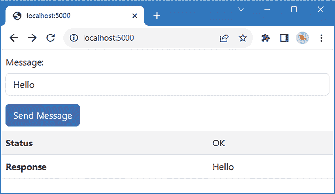
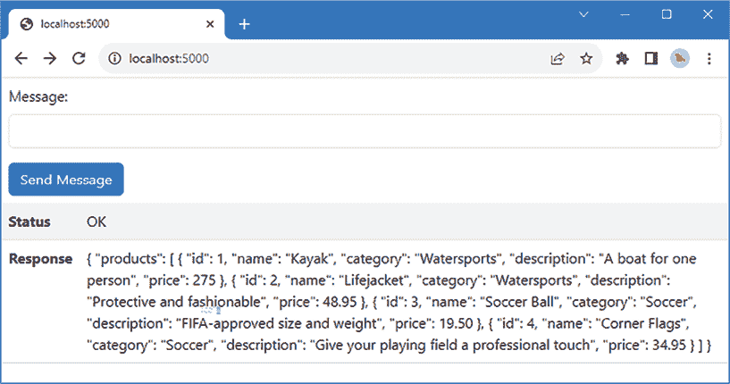
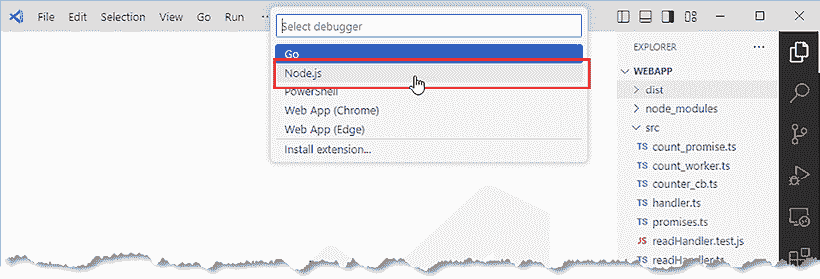
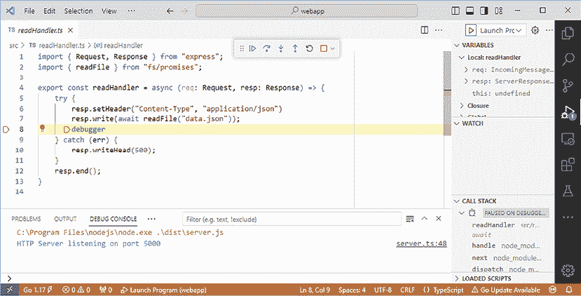
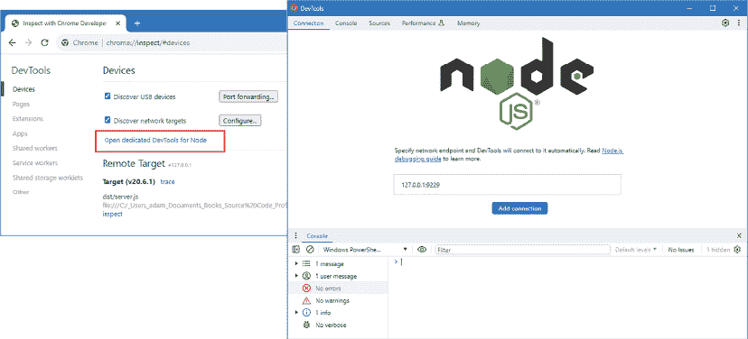
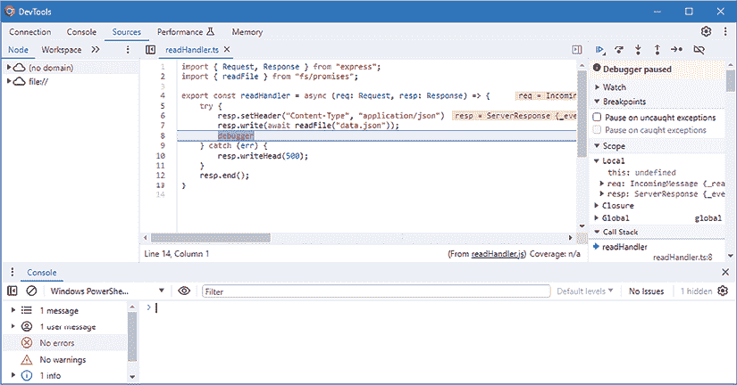

# 第八章：单元测试和调试

在本章中，我描述了 Node.js 提供的用于测试和调试 JavaScript 代码的功能。我首先演示了 Node.js 集成测试运行器，它使得定义和执行单元测试变得容易。然后，我演示了 Node.js 调试器，它集成在 JavaScript 运行时中，但通过外部工具使用。*表 8.1* 将测试和调试置于上下文中。

表 8.1：将测试和调试置于上下文中

| 问题 | 答案 |
| --- | --- |
| 它是什么？ | 单元测试是定义和运行测试以检查代码行为的过程。调试是检查应用程序执行状态的过程，以确定意外或不希望的行为的原因。 |
| 为什么它有用？ | 测试和调试有助于在应用程序部署给真实用户之前识别代码中的问题。 |
| 如何使用？ | 单元测试是用 JavaScript 代码编写的，并使用集成的 Node.js 测试运行器执行。Node.js 运行时包括对调试的支持，这通过外部工具使用，包括流行的代码编辑器。 |
| 有没有陷阱或限制？ | 对代码应该如何测试的不同观点往往会导致开发团队中的紧张关系。本可以用来完成项目的努力，往往被花费在争论测试上。 |
| 有没有替代方案？ | 测试和调试都是可选活动。两者都可以帮助产生缺陷更少的代码，但都不是强制性的。 |

*表 8.2* 总结了本章内容。

表 8.2：本章总结

| 问题 | 解决方案 | 列表 |
| --- | --- | --- |
| 创建单元测试 | 创建一个以`test.js`后缀的文件，并使用`node:test`模块中定义的`test`函数。 | *3* |
| 运行单元测试 | 使用`--test`参数以测试模式启动 Node.js。使用`--watch`参数在检测到更改时自动运行测试。 | *4-8* |
| 创建模拟 | 使用`fn`、`method`、`getter`或`setter`方法。 | *9-10* |
| 理解模拟的使用 | 使用添加到模拟中的间谍功能。 | *11* |
| 检查测试结果 | 使用`assert`模块中的断言函数。 | *12* |
| 测试异步代码 | 创建产生测试数据的异步模拟。 | *13-16* |
| 测试不同的结果 | 使用子测试。 | *17* |
| 触发调试器 | 使用`debugger`关键字或在代码编辑器中设置断点。 | *18-20* |
| 调试应用程序 | 使用流行的代码编辑器或浏览器提供的功能。 | *21-22* |

# 准备本章内容

在本章中，我继续使用*第七章*中的`webapp`项目。为准备本章不需要进行任何更改。打开命令提示符，导航到`webapp`文件夹，并运行*列表 8.1*中显示的命令以启动构建工具。

列表 8.1：启动构建工具

```js
npm start 
```

打开一个网页浏览器，请求`http://localhost:5000`，在文本框中输入一条消息，然后点击**发送消息**按钮。客户端 JavaScript 代码会将`input`元素的 内容发送到后端服务器，服务器会将它作为响应管道回浏览器，如图*图 8.1*所示。

**提示**

您可以从[`github.com/PacktPublishing/Mastering-Node.js-Web-Development`](https://github.com/PacktPublishing/Mastering-Node.js-Web-Development)下载本章的示例项目——以及本书中所有其他章节的示例项目。有关运行示例时遇到问题的帮助，请参阅*第一章*。



图 8.1：运行示例应用程序

# 单元测试 Node.js 应用程序

Node.js 有一个内置的测试运行器，这是一种方便的方式来定义和运行单元测试。尽管我推荐 TypeScript 进行开发，但单元测试最好用纯 JavaScript 编写。单元测试需要广泛使用假对象——称为*模拟*——来隔离正在测试的代码与应用程序的其他部分，创建模拟的过程——称为*模拟化*——依赖于创建仅具有足够功能来运行测试的对象，这可能会影响 TypeScript 编译器。为了准备纯 JavaScript 单元测试，*列表 8.2*更改了 TypeScript 编译器的配置。

**决定是否进行单元测试**

能够轻松地进行单元测试是使用 Node.js 的一个好处，但这并不是每个人都需要的，我也没有假装不是这样。我喜欢单元测试，并在我的项目中使用它，但并不是所有的项目，而且并不像你期望的那样一致。我倾向于专注于编写那些我知道将很难编写并且很可能是部署中错误来源的功能和函数的单元测试。在这些情况下，单元测试帮助我组织关于如何最好实现我所需要的想法。我发现，仅仅思考我需要测试的内容就能产生关于潜在问题的想法，这在我开始处理实际的错误和缺陷之前就已经发生了。

话虽如此，单元测试是一个工具，而不是一种信仰，只有你自己才知道你需要多少测试。如果你觉得单元测试没有用，或者你有更适合你的不同方法，那么请不要因为它是时尚的而觉得你需要进行单元测试。（然而，如果你没有更好的方法，而且你根本不做测试，那么你很可能是让用户发现你的错误，这很少是理想的。你不必进行单元测试，但你确实应该考虑进行某种形式的测试。）

如果您之前没有遇到过单元测试，那么我鼓励您尝试一下，看看它是如何工作的。如果您不是单元测试的粉丝，那么您可以跳过这一部分，转到*调试 JavaScript 代码*部分，在那里我将演示如何使用 Node.js 的调试功能。

列表 8.2：在 webapp 文件夹中的 tsconfig.Json 文件中添加属性

```js
{
    "extends": "@tsconfig/node20/tsconfig.json",
     "compilerOptions": {                      
         "rootDir": "src",  
         "outDir": "dist",
        ** "allowJs": true**
     },
     **"include": ["src/**/*"]**
} 
```

新的配置属性告诉 TypeScript 编译器处理 JavaScript 以及 TypeScript 文件，并指定所有源代码文件都在 `src` 文件夹中。

要开始测试，请将名为 `readHandler.test.js` 的文件添加到 `src` 文件夹中，其内容如 *清单 8.3* 所示。

*清单 8.3*：`src` 文件夹中 readHandler.test.js 文件的 内容

```js
import { test } from "node:test";
test("my first test", () => {
    // do nothing - test will pass
}); 
```

测试功能由 `node:test` 模块提供，其中最重要的函数是 `test`，用于定义单元测试。`test` 函数接受测试的名称和一个函数，该函数执行测试。

测试可以从命令行执行。打开一个新的命令提示符，并在 `webapp` 文件夹中运行 *清单 8.4* 中显示的命令。

*清单 8.4*：运行单元测试

```js
node --test dist 
```

`--test` 参数执行 Node.js 测试运行器。测试文件会自动发现，要么因为文件名包含 `test`，要么因为文件位于名为 `test` 的文件夹中。我遵循了在具有 `.test.js` 后缀的与模块同名的文件中定义模块测试的通用约定。

TypeScript 编译器将处理 `src` 文件夹中的 JavaScript 文件，并在 `dist` 文件夹中生成包含测试代码的文件。测试运行器将生成以下输出，这可能会根据您的平台和命令行包括额外的字符，例如勾选标记：

```js
...
my first test (0.5989ms)
tests 1
suites 0
pass 1
fail 0
cancelled 0
skipped 0
todo 0
duration_ms 51.685
... 
```

测试目前还没有做任何事情，但输出显示测试运行器已找到文件并执行了其中包含的函数。

测试运行器也可以在监视模式下运行，当文件发生变化时，它会自动运行测试。*清单 8.5* 向 `package.json` 文件的 `scripts` 部分添加了一个新命令。

**使用测试包**

我在本章中使用了内置的 Node.js 测试运行器，因为它易于使用，并且可以满足大多数项目的需求。但还有许多优秀的开源测试包可用；最受欢迎的是 Jest ([`jestjs.io`](https://jestjs.io))。如果您有特殊的测试需求或希望为项目中的客户端和服务器端 JavaScript 代码使用相同的测试包，测试包可能很有用。

*清单 8.5*：在 `webapp` 文件夹中的 package.json 文件中添加命令

```js
...
"scripts": {
    "server": "tsc-watch --noClear --onsuccess \"node dist/server.js\"",
    "client": "webpack serve",
    "start": "npm-run-all --parallel server client",
    **"test": "node --test --watch dist"**
},
... 
```

`--watch` 参数将测试运行器置于监视模式。在 `webapp` 文件夹中运行 *清单 8.6* 中显示的命令以启动 *清单 8.5* 中定义的命令。

*清单 8.6*：在监视模式下运行测试运行器

```js
npm run test 
```

测试运行器将启动，在 `dist` 文件夹中找到测试文件，并运行其中包含的测试，生成以下输出：

```js
...
my first test (0.5732ms)
... 
```

*清单 8.7* 将测试的名称更改，以确认测试监视模式正在工作。

*清单 8.7*：在 `src` 文件夹中的 readHandler.test.js 文件中更改名称

```js
import { test } from "node:test";
**test("my new test name", () => {**
    // do nothing - test will pass
}); 
```

主要构建过程将检测`src`文件夹中 JavaScript 文件的变化，并在`dist`文件夹中创建相应的文件。Node.js 测试运行器将检测纯 JavaScript 文件的变化，并执行其内容，产生以下输出：

```js
...
my first test (0.5732ms)
**my new test name (0.6408ms)**
... 
```

Node.js 测试运行器认为，如果测试完成而没有抛出异常，则测试通过，这就是为什么即使它没有做任何事情，测试也会通过。"列表 8.8"修改了示例测试，使其失败。

列表 8.8：在 src 文件夹中的 readHandler.test.js 文件中创建失败的测试

```js
import { test } from "node:test";
test("my new test name", () => {
    **throw new Error("something went wrong");**
}); 
```

当测试运行器执行测试时，会抛出异常，并在控制台输出中显示失败，以及有关异常的一些详细信息：

```js
...
my first test (0.5732ms)
my new test name (0.6408ms)
**my new test name (0.6288ms)**
 **Error: something went wrong**
 **at TestContext.<anonymous> (C:\webapp\dist\readHandler.test.js:6:11)**
... 
```

## 编写单元测试

编写单元测试的常见方法是从**arrange/act/assert**（**A/A/A**）模式开始，将单元测试分为三个部分。"Arrange"指的是为测试设置条件，"act"指的是执行测试，"assert"指的是验证结果是否符合预期。

### 安排测试

对于 Web 应用程序，单元测试的安排部分通常意味着模拟 HTTP 请求和响应，以便能够测试请求处理器。作为提醒，以下是示例项目中的`readHandler`：

```js
import { Request, Response } from "express";
export const readHandler = (req: Request, resp: Response) => {   
    resp.cookie("sessionID", "mysecretcode");
    req.pipe(resp);
} 
```

此处理程序执行两项操作：设置 cookie 并调用`Request.pipe`方法，以便从请求体中读取响应体。为了测试此功能，单元测试需要一个具有`pipe`方法和一个具有`cookie`方法的模拟`Request`和一个`Response`。单元测试不需要重新创建`pipe`和`cookie`方法的实际功能，因为这些功能超出了正在测试的代码的作用域。"列表 8.9"使用 Node.js 提供的功能创建模拟对象。

列表 8.9：在 src 文件夹中的 readHandler.test.ts 文件中创建模拟 HTTP 对象

```js
import { test } from "node:test";
**test("readHandler tests", (testCtx) => {**
 **// Arrange - set up the test**
 **const req = {**
**pipe: testCtx.mock.fn()**
 **};**
 **const resp = {**
 **cookie: testCtx.mock.fn()**
 **};**
 **// TODO - Act - perform the test**

 **// TODO - Assert - verify the results**
}); 
```

一个好的模拟对象应包含足够的功能来运行测试，同时还需要支持检查结果。当 Node.js 测试运行器调用测试函数时，它提供了一个`TestContext`对象，其`mock`属性返回一个`MockTracker`对象，可以用来创建模拟，其最有用的方法在"表 8.3"中描述。

表 8.3：有用的 MockTracker 方法

| 名称 | 描述 |
| --- | --- |

|

```js
`fn(orig, impl)` 
```

| 此方法创建一个模拟函数。可选参数是函数的原始实现和新实现。如果省略参数，则返回一个`no-op`函数。 |
| --- |

|

```js
`method(obj, name, impl, opts)` 
```

| 此方法创建一个模拟方法。参数是一个对象和要模拟的方法名称。可选参数是方法的替换实现。 |
| --- |

|

```js
`getter(obj, name, impl, opts)` 
```

| 与`method`类似，但创建一个 getter。 |
| --- |

|

```js
`setter(obj, name, impl, opts)` 
```

| 与`method`类似，但创建一个 setter。 |
| --- |

*表 8.3* 中描述的方法用于创建跟踪其使用情况的函数或方法，这在测试的断言部分很有用，如*断言测试结果*部分所述。

`method`、`getter`和`setter`方法可以围绕现有功能创建包装器，如*测试异步代码*部分所示。由于它们创建的方式以及它们对 Node.js API 的依赖性，很难包装 HTTP 请求和响应方法和属性。相反，可以使用`fn`方法创建一个跟踪其使用情况并提供创建测试所需功能的简单构建块的功能。JavaScript 函数可以接受任意数量的参数，这就是为什么从`fn`方法返回的函数可以在任何地方使用的原因。这也是为什么在 TypeScript 中编写测试可能如此困难，以及为什么应该使用纯 JavaScript 的原因。

### 执行测试

对于 HTTP 处理器的单元测试，执行测试通常是过程中最简单的部分，因为它涉及使用模拟的 HTTP 请求和响应对象调用处理器函数，如*列表 8.10*所示。

列表 8.10：在 src 文件夹中的 readHandler.test.js 文件中执行测试

```js
import { test } from "node:test";
**import { readHandler } from** **"./readHandler";**
test("readHandler tests", (testCtx) => {
    // Arrange - set up the test
    const req = {
        pipe: testCtx.mock.fn()
    };
    const resp = {
        cookie: testCtx.mock.fn()
    };
    **// Act - perform the test**
 **readHandler(req, resp);**

    // TODO - Assert - verify the results
}); 
```

### 断言测试结果

*表 8.3* 中的方法产生具有`mock`属性的结果，该属性可用于了解在执行测试时函数或方法是如何被使用的。`mock`属性返回一个`MockFunctionContext`对象，其中最有用的功能在*表 8.4*中描述。

表 8.4：有用的 MockFunctionContext 功能

| 名称 | 描述 |
| --- | --- |

|

```js
`callCount()` 
```

| 此方法返回函数或方法被调用的次数。 |
| --- |

|

```js
`calls` 
```

| 此方法返回一个对象数组，其中每个元素描述一次调用。 |
| --- |

*表 8.4* 中描述的`calls`属性的输出包含具有*表 8.5*中描述的属性的对象。

表 8.5：用于描述方法或函数调用的有用属性

| 名称 | 描述 |
| --- | --- |

|

```js
`arguments` 
```

| 该属性返回传递给函数或方法的参数数组。 |
| --- |

|

```js
`result` 
```

| 该属性返回函数或方法产生的结果。 |
| --- |

|

```js
`error` 
```

| 此属性返回一个对象，如果函数抛出错误，则返回`undefined`。 |
| --- |

|

```js
`stack` 
```

| 此属性返回一个`Error`对象，可用于确定错误抛出的位置。 |
| --- |

被模拟的函数和方法充当间谍，报告它们在测试期间的使用情况，使得结果可以轻松检查和评估，如*列表 8.11*所示。

列表 8.11：在 src 文件夹中的 readHandler.test.js 文件中评估 rest 结果

```js
import { test } from "node:test";
import { readHandler } from "./readHandler";
test("readHandler tests", (testCtx) => {
    // Arrange - set up the test
    const req = {
        pipe: testCtx.mock.fn()
    };
    const resp = {
        cookie: testCtx.mock.fn()
    };
    // Act - perform the test
    readHandler(req, resp);
 **// Assert - verify the results**
 **if (req.pipe.mock.callCount() !== 1** **||**
 **req.pipe.mock.calls[0].arguments[0] !== resp) {**
 **throw new Error("Request not piped"****);**
 **}**
 **if (resp.cookie.mock.callCount() === 1) {**
 **const [name, val] = resp.cookie.mock.calls[0****].arguments;**
 **if (name !== "sessionID" || val !== "mysecretcode") {**
 **throw new Error("Cookie not set correctly");**
 **}**
 **} else {**
 **throw** **new Error("cookie method not called once");**
 **}**
}); 
```

新的语句使用`mock`属性来确认`pipe`和`cookie`方法已被调用一次，并且接收到了正确的参数。

通过使用*断言*可以简化测试结果的评估，这些断言是执行比较并抛出异常的更简洁的方法。Node.js 在`assert`模块中提供了断言，其中最有用的方法在*表 8.6*中描述。

表 8.6：有用的断言

| 名称 | 描述 |
| --- | --- |

|

```js
`assert(val)` 
```

| 此方法如果`val`不是真值（如*第二章*所述），则会抛出错误。 |
| --- |

|

```js
`equal(v1, v2)` 
```

| 此方法如果`v1`不等于`v2`，则会抛出错误。 |
| --- |

|

```js
`notEqual(v1, v2)` 
```

| 此方法如果`v1`等于`v2`，则会抛出错误。 |
| --- |

|

```js
`deepStrictEqual(v1, v2)` 
```

| 此方法对`v1`和`v2`进行深度比较，如果它们不匹配，则会抛出错误。 |
| --- |

|

```js
`notDeepStrictEqual(v1, v2)` 
```

| 此方法对`v1`和`v2`进行深度比较，如果它们匹配，则会抛出错误。 |
| --- |

|

```js
`match(str, regexp)` 
```

| 此方法如果`str`不匹配指定的正则表达式，则会抛出错误。 |
| --- |

|

```js
`doesNotMatch(str, regexp)` 
```

| 此方法如果`str`匹配指定的正则表达式，则会抛出错误。 |
| --- |

*列表 8.12*修改了单元测试，使用断言来检查结果。

列表 8.12：在 src 文件夹中的 readHandler.test.js 文件中使用断言

```js
import { test } from "node:test";
import { readHandler } from "./readHandler";
**import { equal } from "assert";**
test("readHandler tests", (testCtx) => {
    // Arrange - set up the test
    const req = {
        pipe: testCtx.mock.fn()
    };
    const resp = {
        cookie: testCtx.mock.fn()
    };
    // Act - perform the test
    readHandler(req, resp);
    // Assert - verify the results
    **equal****(req.pipe.mock.callCount(), 1);**
 **equal(req.pipe.mock.calls[0].arguments****[0], resp);**
 **equal(resp.cookie.mock.callCount(), 1);**
 **equal(resp.cookie.mock.calls****[0].arguments[0], "sessionID");**
 **equal(resp.cookie.mock.calls[0].arguments****[1], "mysecretcode");**
}); 
```

`equal`方法用于进行一系列比较，如果值不匹配，则会抛出错误，导致测试失败。

## 测试异步代码

Node.js 测试运行器支持测试异步代码。对于基于 promise 的代码，如果 promise 被拒绝，则测试失败。为了准备，*列表 8.13*更改了处理器，使其执行异步文件读取并将文件内容发送到客户端。

列表 8.13：在 src 文件夹中的 readHander.ts 文件中执行异步操作

```js
import { Request, Response } from "express";
**import { readFile } from "fs";**
export const readHandler = (req: Request, resp: Response) => {   
    **readFile****("data.json", (err, data) => {**
 **if (err != null) {**
 **resp.writeHead(500, err.message);**
 **} else {**
 **resp.setHeader****("Content-Type", "application/json")**
 **resp.write(data);**
 **}**
 **resp.end();** 
 **});**
} 
```

目前忽略测试运行器的输出，并使用浏览器请求[`localhost:5000`](http://localhost:5000)并点击**发送消息**按钮来检查处理器的功能。响应将包含从`data.json`文件中读取的 JSON 数据，如图*图 8.2*所示。



图 8.2：测试修改后的处理器

编写单元测试时，需要采用不同的模拟方法，如*列表 8.14*所示。

列表 8.14：在 src 文件夹中的 readHandler.test.js 文件中测试异步处理器

```js
import { test } from "node:test";
import { readHandler } from "./readHandler";
import { equal } from "assert";
**import fs from "fs";**
test("readHandler tests", async (testCtx) => {
    // Arrange - set up the test
   ** const data = "****json-data";**
 **testCtx.mock.method(fs, "readFile", (file, cb) => cb(undefined, data));**
 **const req = {};**

 **const resp = {**
**setHeader: testCtx.mock.fn(),**
 **write: testCtx.mock.fn(),**
 **end: testCtx.mock.fn()**
 **};**
    // Act - perform the test
    **await readHandler(req, resp);**
    // Assert - verify the results
  **  equal(resp.setHeader.mock.calls[0].arguments[0], "****Content-Type");**
 **equal(resp.setHeader.mock.calls[0].arguments[1], "application/json");**
 **equal(resp.****write.mock.calls[0].arguments[0], data);**
 **equal(resp.end.mock.callCount(),** **1);**
}); 
```

此测试的关键是能够模拟`fs`模块中的`readFile`函数，这是通过以下语句完成的：

```js
...
testCtx.mock.**method**(fs, "readFile", (file, cb) => cb(undefined, data));
... 
```

这很难解释，因为名称和结果使用了相同的单词：名为`method`的方法模拟了一个对象上的方法。在这种情况下，对象是整个`fs`模块，它被导入如下：

```js
...
import fs from "fs";
... 
```

模块定义的顶层函数作为名为 `fs` 的对象上的方法呈现，这使得它们可以通过 `method` 来模拟。在这种情况下，`readFile` 函数已被替换为一个模拟实现，该实现使用测试数据调用回调函数，使得可以在不读取文件系统的情况下执行测试。本例中的其他模拟是通过 `fn` 方法创建的，对应于被测试的处理程序调用的 `Response` 方法。

### 测试承诺

测试使用承诺的代码的方式几乎相同，只是模拟使用测试数据解决承诺。*列表 8.15* 更新了处理程序，以使用基于承诺的 `readFile` 函数版本。

列表 8.15：在 src 文件夹中的 readHandler.ts 文件中使用承诺

```js
import { Request, Response } from "express";
**import { readFile } from "fs/promises";**
**export const readHandler = async (req: Request, resp: Response) => {** 
**try {**
 **resp.setHeader("Content-Type", "application/json")**
 **resp.write(await readFile("data.json"));**
 **} catch (err) {**
 **resp.writeHead(****500);**
 **}**
 **resp.end();**
} 
```

*列表 8.16* 更新了单元测试，以便模拟解决承诺。

列表 8.16：在 src 文件夹中的 readHandler.test.js 文件中测试承诺

```js
import { test } from "node:test";
import { readHandler } from "./readHandler";
import { equal } from "assert";
**import fs from "fs/promises";**
test("readHandler tests", async (testCtx) => {
    // Arrange - set up the test
    const data = "json-data";
    **testCtx.mock.method(fs, "readFile", async () => data);**
    const req = {};

    const resp = {
        setHeader: testCtx.mock.fn(),
        write: testCtx.mock.fn(),
        end: testCtx.mock.fn()
    };
    // Act - perform the test
    await readHandler(req, resp);
    // Assert - verify the results
    equal(resp.setHeader.mock.calls[0].arguments[0], "Content-Type");
    equal(resp.setHeader.mock.calls[0].arguments[1], "application/json");
    equal(resp.write.mock.calls[0].arguments[0], data);
    equal(resp.end.mock.callCount(), 1);
}); 
```

模拟是一个异步函数，在解决时产生测试数据。单元测试的其余部分保持不变。

## 创建子测试

*列表 8.16* 中的测试没有测试处理程序在读取文件数据时出现问题时如何响应。需要做更多的工作，如 *列表 8.17* 所示。

列表 8.17：在 src 文件夹中的 readHandler.test.js 文件中测试多个结果

```js
import { test } from "node:test";
import { readHandler } from "./readHandler";
import { equal } from "assert";
import fs from "fs/promises";
**const createMockResponse = (testCtx) => ({**
 **writeHead****: testCtx.mock.fn(),**
 **setHeader: testCtx.mock.fn(),**
 **write: testCtx.mock.fn(),**
 **end: testCtx.mock****.fn()** 
**});**
test("readHandler tests", async (testCtx) => {
    // Arrange - set up the test
    const req = {};

    **// const resp = {**
 **//     setHeader: testCtx.mock.fn(),**
 **//     write: testCtx.mock.fn(),**
 **//     end: testCtx.mock.fn()**
 **// };**
 **// Test the successful outcome**
 **await testCtx.test("Successfully reads file", async (innerCtx) => {**
 **// Arrange - set up the test**
 **const data = "json-data";**
 **innerCtx.mock****.method(fs, "readFile", async () => data);**
 **const resp = createMockResponse(innerCtx);**
 **// Act - perform the test**
 **await readHandler(req, resp);**
 **// Assert - verify the results**
 **equal****(resp.setHeader.mock.calls[0].arguments[0], "Content-Type");**
 **equal(resp.setHeader.mock****.calls[0].arguments[1], "application/json");**
 **equal(resp.write.mock.calls[0****].arguments[0], data);**
 **equal(resp.end.mock.callCount(), 1);**
 **});**
 **// Test the failure outcome**
 **await testCtx.test****("Handles error reading file", async (innerCtx) => {**
 **// Arrange - set up the test**
 **innerCtx.mock.method(fs, "readFile",** 
 **() => Promise.reject("file error"****));**
 **const resp = createMockResponse(innerCtx);**
 **// Act - perform the test**
 **await readHandler(req, resp);**

 **// Assert - verify the results**
 **equal(resp.writeHead.mock.calls****[0].arguments[0], 500);**
 **equal(resp.end.mock.callCount(), 1);**
 **});**
}); 
```

`TestContext` 类定义了一个 `test` 方法，可以用来创建子测试。子测试会接收到自己的上下文对象，可以用来为该子测试创建特定的模拟，*列表 8.17* 就使用了这个特性来创建使用不同实现的模拟 `readFile` 函数的测试。保存更改后，测试运行器的输出将反映子测试的添加，如下所示：

```js
...
readHandler tests
  Successfully reads file (0.5485ms)
  Handles error reading file (0.2952ms)
readHandler tests (2.0538ms)
... 
```

注意到子测试是异步的，需要 `await` 关键字。如果您不等待子测试，则顶层测试将提前完成，测试运行器将报告错误。

# 调试 JavaScript 代码

单元测试是确认代码按预期行为的过程；调试是找出为什么它不按预期工作的过程。在开始之前，使用 *Ctrl + C* 停止构建过程和单元测试过程。一旦进程停止，运行 *列表 8.18* 中显示的命令以单独启动 webpack 开发服务器。调试器将应用于后端服务器，该服务器将自行启动，但依赖于 webpack 来处理客户端内容的请求。

列表 8.18：启动 webpack 开发服务器

```js
npm run client 
```

下一步是配置 TypeScript 编译器，使其生成源映射，如 *列表 8.19* 所示，这允许调试器将 Node.js 执行的纯 JavaScript 与开发者编写的 TypeScript 代码关联起来。

列表 8.19：在 src 文件夹中的 tsconfig.json 文件中启用源映射

```js
{
    "extends": "@tsconfig/node20/tsconfig.json",
     "compilerOptions": {                      
         "rootDir": "src",  
         "outDir": "dist",
         "allowJs": true,
         **"sourceMap": true**
     },
     "include": ["src/**/*"]
} 
```

保存文件时，编译器将在 `dist` 文件夹中开始生成具有 `map` 文件扩展名的文件。

## 添加代码断点

具有良好 TypeScript 支持的代码编辑器，如 Visual Studio Code，允许向代码文件添加断点。我对该功能的体验好坏参半，并且我发现它们不可靠，这就是为什么我依赖于不那么优雅但更可预测的 `debugger` JavaScript 关键字。

当 JavaScript 应用程序通过调试器执行时，遇到 `debugger` 关键字时执行将停止，控制权传递给开发者。*清单 8.20* 将 `debugger` 关键字添加到 `readHandler.ts` 文件中。

清单 8.20：在 src 文件夹中的 readHandler.ts 文件中添加调试器关键字

```js
import { Request, Response } from "express";
import { readFile } from "fs/promises";
export const readHandler = async (req: Request, resp: Response) => {   
    try {
        resp.setHeader("Content-Type", "application/json")
        resp.write(await readFile("data.json"));
        **debugger**
    } catch (err) {
        resp.writeHead(500);
    }
    resp.end();
} 
```

执行代码时输出不会发生变化，因为 Node.js 默认忽略 `debugger` 关键字。

## 使用 Visual Studio Code 进行调试

大多数优秀的代码编辑器都具有一定的 TypeScript 和 JavaScript 代码调试支持。在本节中，我将向您展示如何使用 Visual Studio Code 进行调试，以便您了解整个过程。如果您使用其他编辑器，可能需要不同的步骤，但基本方法可能相似。

要设置调试配置，从 **运行** 菜单中选择 **添加配置**，并在提示时从环境列表中选择 **Node.js**，如 *图 8.3* 所示。



图 8.3：选择调试环境

Visual Studio Code 将创建一个 `.vscode` 文件夹和一个名为 `launch.json` 的文件，该文件用于配置调试器。更改 `program` 属性的值，以便调试器在 `dist` 文件夹中执行 JavaScript 代码，如 *清单 8.21* 所示。

清单 8.21：在 .vscode 文件夹中的 launch.json 文件中配置调试器

```js
{
    "version": "0.2.0",
    "configurations": [
        {
            "type": "node",
            "request": "launch",
            "name": "Launch Program",
            "skipFiles": [
                "<node_internals>/**"
            ],
           ** "program": "${workspaceFolder}/dist/server.js"****,**
            "preLaunchTask": "tsc: build - tsconfig.json",
            "outFiles": [
                "${workspaceFolder}/dist/**/*.js"
            ]
        }
    ]
} 
```

保存对 `launch.json` 文件的更改，并从 **运行** 菜单中选择 **开始调试**。Visual Studio Code 将启动 Node.js，执行将继续正常进行，直到遇到 `debugger` 关键字。使用浏览器请求 `http://localhost:5000` 并点击 **发送消息** 按钮。请求将被传递到处理器进行处理，当遇到 `debugger` 关键字时，执行将停止，控制权将转移到调试弹出窗口，如 *图 8.4* 所示。



图 8.4：使用 Visual Studio Code 进行调试

应用程序的状态显示在侧边栏中，显示在执行停止点设置的变量。提供了标准调试功能，包括设置监视、单步执行和跳过语句以及恢复执行。**调试控制台**窗口允许在应用程序的上下文中执行 JavaScript 语句，例如，输入一个变量名并按 *Enter* 键，将返回该变量的值。

## 使用远程 Node.js 调试器

如果你不想使用代码编辑器进行调试，那么 Google Chrome 为 Node.js 提供了良好的集成调试功能，使用与调试客户端代码相同的特性。停止上一节中的 Visual Studio Code 调试器，然后在 `webapp` 文件夹中运行 *清单 8.22* 中显示的命令以启动 Node.js 的调试模式。

列表 8.22：以调试模式启动 Node.js

```js
node --inspect dist/server.js 
```

当 Node.js 启动时，它将产生类似这些的消息，其中包含它准备接受调试请求的 URL 详细信息：

```js
**Debugger listening on ws://127.0.0.1:9229/faed1dec-fbb0-4425-bd87-410c98980716**
For help, see: https://nodejs.org/en/docs/inspector
HTTP Server listening on port 5000
Debugger attached. 
```

使用 Google Chrome，请求 `chrome://inspect` 并点击 **打开 Node 的专用开发者工具** 选项，调试窗口将打开，如图 *图 8.5* 所示。

**注意**

所有使用 Chromium 引擎的浏览器都支持此功能，包括 Brave、Opera 和 Edge。使用浏览器名称作为打开 Node.js 工具的 URL，例如 Brave 浏览器的 `brave://inspect`。这对于拥有自己浏览器引擎的 Firefox 不适用。



图 8.5：使用 Chrome 的 Node.js 调试功能

打开一个新的浏览器窗口，请求 `http://localhost:5000`，并点击 **发送消息**。当请求正在处理时，Node.js 达到 `debugger` 关键字。执行停止，控制权传递给 Chrome 开发者工具，如图 *图 8.6* 所示。



图 8.6：Chrome 开发者工具调试 Node.js

# 摘要

在本章中，我描述了 Node.js 的单元测试和调试功能。

+   Node.js 包含一个内置的测试运行器，支持执行测试和创建模拟函数和方法。

+   Web 应用程序的单元测试主要关注请求处理，需要模拟 HTTP 请求和响应。

+   对于需要客户端和服务器端 JavaScript 代码相同测试工具的项目，可以使用第三方包，如 Jest。

+   Node.js 包含调试支持，可以使用许多代码编辑器或基于 Chromium 的浏览器（如 Google Chrome）进行调试。

在本书的下一部分，我将演示如何使用 Node.js 创建 Web 应用程序所需的功能，例如生成动态内容和验证用户。
