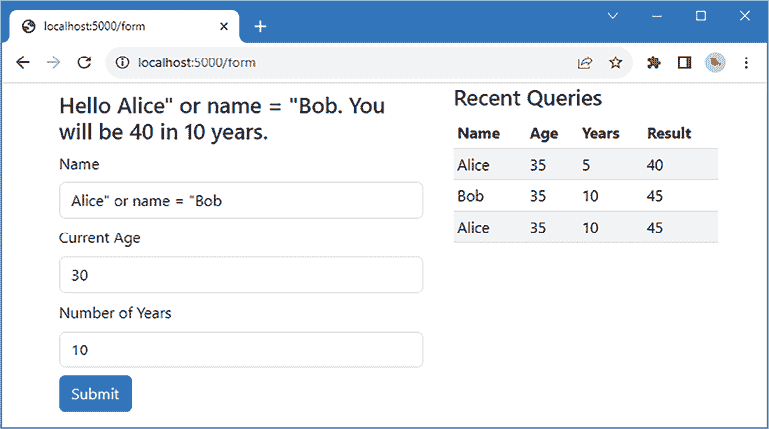
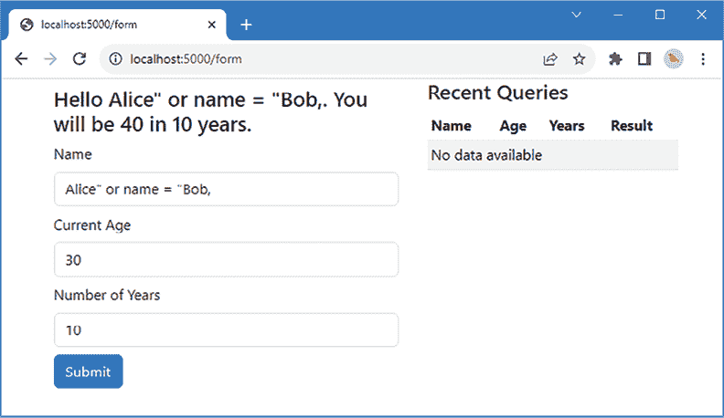
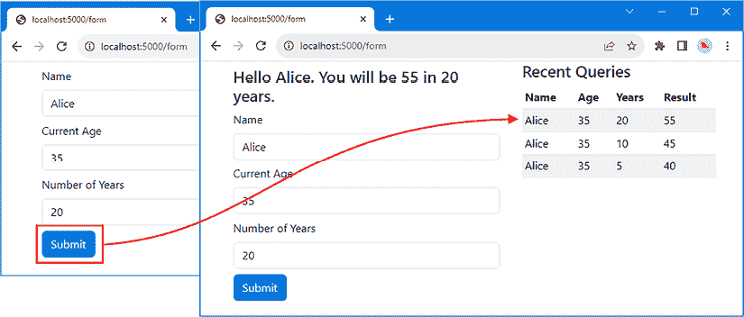
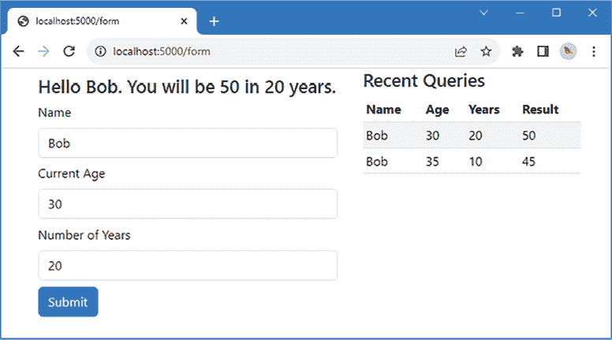

# 第十二章：使用数据库

在本章中，我将演示 Node.js 应用程序如何使用关系型数据库来存储和查询数据。本章解释了如何通过执行 SQL 查询直接与数据库交互，以及如何使用 ORM 包采取更少干预的方法。*表 12.1* 将本章置于上下文中。

表 12.1：将数据库置于上下文中

| **问题** | **答案** |
| --- | --- |
| 它们是什么？ | 数据库是持久存储数据最常见的方式。 |
| 为什么它们有用？ | 数据库可以存储大量数据，并强制执行一种数据结构，这使得执行高效查询成为可能。 |
| 如何使用它们？ | 数据库由数据库引擎管理，这些引擎可以作为 npm 包安装，在专用服务器上运行，或作为云服务使用。 |
| 有没有陷阱或限制？ | 数据库可能很复杂，需要额外的知识，例如能够用 SQL 表达查询。 |
| 有没有替代方案？ | 数据库不是存储数据的唯一方式，但它们是最常见的，通常也是最有效的，因为它们具有鲁棒性并且易于扩展。 |

*表 12.2* 总结了本章我们将做什么。

表 12.2：本章总结

| 问题 | 解决方案 | 列表 |
| --- | --- | --- |
| 持久存储数据。 | 使用数据库。 | *7, 8, 12, 13* |
| 简化更改数据存储方式的过程。 | 使用存储库层。 | *9–11* |
| 显示存储的数据。 | 在渲染模板时包含查询结果。 | *14, 15* |
| 防止用户提交的值被解释为 SQL。 | 使用查询参数。 | *16, 17* |
| 确保数据的一致性更新。 | 使用事务。 | *18–21* |
| 无需编写 SQL 查询即可使用数据库。 | 使用 ORM 包，并使用 JavaScript 代码描述应用程序使用的数据。 | *22–25, 27, 28* |
| 执行使用模型类难以描述的操作。 | 使用 ORM 包的执行 SQL 功能。 | *26* |
| 使用 ORM 查询和更新数据。 | 使用模型类定义的方法，并通过 JavaScript 对象指定约束。 | *29–32* |

# 准备本章内容

本章使用 *第十一章* 中的 `part2app` 项目。为了准备本章，*列表 12.1* 删除了客户端验证代码，因为本章不会使用它。

**提示**

您可以从 [`github.com/PacktPublishing/Mastering-Node.js-Web-Development`](https://github.com/PacktPublishing/Mastering-Node.js-Web-Development) 下载本章的示例项目——以及本书中所有其他章节的示例项目。有关如何获取帮助以运行示例的说明，请参阅 *第一章*。

列表 12.1：src/client 文件夹中 client.js 文件的内容

```js
document.addEventListener('DOMContentLoaded', () => {
    // do nothing
}); 
```

*列表 12.2* 更新了示例应用的路由配置。

列表 12.2：src/server 文件夹中 server.ts 文件的内容

```js
import { createServer } from "http";
import express, {Express } from "express";
import httpProxy from "http-proxy";
import helmet from "helmet";
import { engine } from "express-handlebars";
import { registerFormMiddleware, registerFormRoutes } from "./forms";
const port = 5000;
const expressApp: Express = express();
const proxy = httpProxy.createProxyServer({
    target: "http://localhost:5100", ws: true
});
expressApp.set("views", "templates/server");
expressApp.engine("handlebars", engine());
expressApp.set("view engine", "handlebars");
expressApp.use(helmet());
expressApp.use(express.json());
registerFormMiddleware(expressApp);
registerFormRoutes(expressApp);
expressApp.use("^/$", (req, resp) => resp.redirect("/form"));
expressApp.use(express.static("static"));
expressApp.use(express.static("node_modules/bootstrap/dist"));
expressApp.use((req, resp) => proxy.web(req, resp));
const server = createServer(expressApp);
server.on('upgrade', (req, socket, head) => proxy.ws(req, socket, head));
server.listen(port,
    () => console.log(`HTTP Server listening on port ${port}`)); 
```

新的路由配置删除了不再需要的条目。本章中的所有示例都使用模板，新的路由匹配默认路径的请求，并响应重定向到 `/form` URL。新的路由使用 Express 对 URL 模式的匹配支持，如下所示：

```js
...
expressApp.use(**"^/$"**, (req, resp) => resp.redirect("/form"));
... 
```

该模式需要匹配对 `http://localhost:5000` 的请求，而不是由其他路由处理的请求，例如 `http://localhost:5000/css/bootstrap.min.css`（由静态内容中间件处理）或 `http://localhost:5000/bundle.js`（转发到 webpack 开发 HTTP 服务器）。

*列表 12.3* 更新了 `age` 模板，添加了一个允许用户指定年数的字段，以便在结果数据中允许更多的变化。HTML 输出的结构已更改，引入了两列布局并使用名为 `history` 的部分模板。此列表还删除了验证错误元素，这在实际项目中是不应该做的，但在这个章节中它们不是必需的。

列表 12.3：模板/服务器文件夹中 age.handlebars 文件的内容

```js
<div class="container fluid">
    <div class="row">
        <div class="col-7">
            {{#if name}}
                <div class="m-2">
                    <h4>Hello {{ name }}. You will be {{ nextage }}
                        in {{ years }} years.</h4>
                </div>
            {{/if}}
            <div>
                <form id="age_form" action="/form" method="post">
                    <div class="m-2">
                        <label class="form-label">Name</label>
                        <input name="name" class="form-control"
                            value="{{ name }}"/>
                    </div>
                    <div class="m-2">
                        <label class="form-label">Current Age</label>
                        <input name="age" class="form-control"
                            value="{{ age }}" />
                    </div>                  
                    <div class="m-2">
                        <label class="form-label">Number of Years</label>
                        <input name="years" class="form-control"
                            value="{{ years }}" />         
                    </div>                          
                    <div class="m-2">
                        <button class="btn btn-primary">Submit</button>                               
                    </div>
                </form>
            </div>
        </div>
        <div class="col-5">
            {{> history }}
        </div>
    </div>
</div> 
```

要创建部分视图，将名为 `history.handlebars` 的文件添加到 `templates/server/partials` 文件夹中，内容如 *列表 12.4* 所示。

列表 12.4：模板/服务器/部分文件夹中 history.handlebars 文件夹的内容

```js
<h4>Recent Queries</h4>
<table class="table table-sm table-striped my-2">
    <thead>
        <tr>
            <th>Name</th><th>Age</th><th>Years</th><th>Result</th>
        </tr>
    </thead>
    <tbody>
        {{#unless history }}
            <tr><td colspan="4">No data available</td></tr>
        {{/unless }}
    </tbody>
</table> 
```

部分模板显示通过 `history` 上下文属性提供的数据，当没有数据可用时显示默认消息。*列表 12.5* 修改了处理 `/form` URL 的代码，移除了上一章中引入的验证检查。

列表 12.5：src/server 文件夹中 forms.ts 文件的内容

```js
import express, { Express } from "express";
export const registerFormMiddleware = (app: Express) => {
    app.use(express.urlencoded({extended: true}))
}
export const registerFormRoutes = (app: Express) => {
    app.get("/form", (req, resp) => {
        resp.render("age");
    });
    app.post("/form", (req, resp) => {
        const nextage = Number.parseInt(req.body.age)
            + Number.parseInt(req.body.years);
        const context = {
            ...req.body, nextage
        };
        resp.render("age", context);  
    });
} 
```

在 `part2app` 文件夹中运行 *列表 12.6* 中显示的命令以启动开发工具。

列表 12.6：启动开发工具

```js
npm start 
```

使用浏览器请求 `http://localhost:5000`，填写表单，并点击**提交**按钮，如图 *图 12.1* 所示。在**最近查询**部分不会显示任何数据。


图 12.1：运行示例应用程序

# 使用数据库

数据库允许网络应用程序读取和写入数据，这些数据可以用于生成对 HTTP 请求的响应。有许多类型的数据库，包括关于数据存储和查询的选择、数据库软件的部署方式以及如何处理数据变更。

数据库市场具有竞争力和创新性，有优秀的商业和开源产品，但我的建议是，最好的数据库是你已经理解和之前使用过的数据库。大多数项目可以使用大多数数据库，而特定数据库技术带来的好处可能会因为学习并掌握该技术所需的时间而被削弱。

如果你没有数据库，很容易在无尽的选择中迷失方向，我的建议是从尽可能简单的东西开始。对于小型应用程序，我推荐 SQLite，这是我在本章中将使用的数据库。对于大型应用程序，尤其是在使用多个 Node.js 实例来处理 HTTP 请求的情况下，我推荐使用一些优秀的开源关系型数据库，例如 MySQL ([`www.mysql.com`](https://www.mysql.com)) 或 PostgreSQL ([`www.postgresql.org`](https://www.postgresql.org))。你可以在本书的第三部分中看到一个这样的数据库示例。

如果你不喜欢使用**结构化查询语言**（**SQL**），那么有很好的 NoSQL 数据库可供选择，一个好的起点是 MongoDB ([`www.mongodb.com`](https://www.mongodb.com))。

**数据库投诉**

每当我写关于选择数据库产品时，我都会收到投诉。许多开发者对某个特定数据库或数据库风格的优越性有强烈的看法，当我不推荐他们偏好的产品时，他们会感到沮丧。

并非我认为任何特定的数据库引擎不好。事实上，数据库市场从未如此繁荣，以至于几乎任何数据库产品都可以在几乎任何项目中使用，对生产效率或规模的影响很小。

数据库引擎就像汽车：现代汽车如此出色，以至于大多数人几乎可以用任何汽车来应对。如果你已经有了汽车，那么与更换汽车的成本相比，改变它的好处可能很小。如果你没有汽车，那么一个好的起点就是从大多数邻居都有的汽车开始，当地的机械师经常对其进行维修。有些人对汽车非常着迷，并对某个品牌或型号有强烈的看法，这很正常，但可能会过度，而且大多数人不会以使边际改进变得显著的方式驾驶。

因此，我完全理解为什么一些开发者会深深投入到特定的数据库引擎中——我尊重这种承诺和理解水平——但大多数项目并没有那些使数据库产品之间差异重要的数据存储或处理需求。

## 安装数据库包

本章中使用的数据库引擎是 SQLite。它在 Node.js 进程中运行，是数据不需要在多个 Node.js 实例之间共享的应用程序的良好选择。由于 SQLite 不作为单独的服务器运行，因此它不支持这一点。SQLite 被广泛使用，至少根据[`sqlite.org`](https://sqlite.org)，它是世界上最受欢迎的数据库引擎。

在`part2app`文件夹中运行*列表 12.7*中显示的命令，将 SQLite 添加到项目中。不需要额外的 TypeScript 类型包。

列表 12.7：将数据库包添加到项目中

```js
npm install sqlite3@5.1.6 
```

此包包括数据库引擎、Node.js API 以及这些 API 对 TypeScript 编译器的描述。为了描述本节中将使用的数据库，将一个名为`age.sql`的文件添加到`part2app`文件夹中，其内容如*列出 12.8*所示。

列出 12.8：`part2app`文件夹中 age.sql 文件的内容

```js
DROP TABLE IF EXISTS Results;
DROP TABLE IF EXISTS Calculations;
DROP TABLE IF EXISTS People;
CREATE TABLE IF NOT EXISTS `Calculations` (
    id INTEGER PRIMARY KEY AUTOINCREMENT, `age` INTEGER,
    years INTEGER, `nextage` INTEGER);
CREATE TABLE IF NOT EXISTS `People` (
    id INTEGER PRIMARY KEY AUTOINCREMENT,
    name VARCHAR(255));
CREATE TABLE IF NOT EXISTS `Results` (
    id INTEGER PRIMARY KEY AUTOINCREMENT,
    calculationId INTEGER REFERENCES `Calculations` (`id`)
        ON DELETE CASCADE ON UPDATE CASCADE,
    personId INTEGER REFERENCES `People` (`id`)
        ON DELETE CASCADE ON UPDATE CASCADE);
INSERT INTO Calculations (id, age, years, nextage) VALUES
    (1, 35, 5, 40), (2, 35, 10, 45);
INSERT INTO People (id, name) VALUES
    (1, 'Alice'), (2, "Bob");

INSERT INTO Results (calculationId, personId) VALUES
    (1, 1), (2, 2), (2, 1); 
```

*列出 12.8*中的 SQL 语句创建了三个表，这些表将记录应用程序执行的计算年龄。`Calculations`表跟踪已执行的计算年龄，并包含用户提供的年龄和年份值以及已计算的未来年龄的列。`People`表跟踪用户提供的名字。`Results`表通过引用名字和计算来跟踪结果。

**注意**

应用程序处理的数据不必要三个表，但简单数据与多个表的结合可以更容易地展示一些常见问题。

## 创建存储库层

存储库是一层代码，将数据库与应用程序的其余部分隔离开来，这使得在不更改使用该数据的代码的情况下更容易更改数据的读取和写入方式。并不是每个人都认为存储库层有用，但我的建议是除非你完全确信你的应用程序对数据或数据库产品的使用不会改变，否则请使用它。创建`src/server/data`文件夹，并向其中添加一个名为`repository.ts`的文件，其内容如*列出 12.9*所示。

列出 12.9：`src/server/data`文件夹中 repository.ts 文件的内容

```js
export interface Result {
    id: number,
    name: string,
    age: number,
    years: number,
    nextage: number
}
export interface Repository {
    saveResult(r: Result):  Promise<number>;
    getAllResults(limit: number) : Promise<Result[]>;
    getResultsByName(name: string, limit: number): Promise<Result[]>;
} 
```

`Repository`接口定义了存储新的`Result`对象、查询所有结果以及具有特定名字的结果的方法。`Result`类型定义了数据库表中所有数据列的属性，以简单、平面结构的形式。

项目可以使用与数据库结构匹配的数据类型，但这通常意味着从用户那里到达的数据必须在提取并用于创建 SQL 语句之前组装成一个复杂结构，而反向过程将数据库中的数据组装成相同的结构，只是为了从模板中提取出来使用。这并不总是可能的，但使用简单的平面数据结构通常可以简化开发。

## 实现存储库

下一步是实现使用 SQLite 数据库引擎的`Repository`接口的类。我打算分阶段实现存储库，这将有助于理解数据库中的数据与应用程序中的 JavaScript 对象之间的关系。为了开始实现，在`src/server/data`文件夹中创建一个名为`sql_repository.ts`的文件，其内容如*列出 12.10*所示。

列出 12.10：`src/server/data`文件夹中 sql_repository.ts 文件的内容

```js
import { readFileSync } from "fs";
import { Database } from "sqlite3";
import { Repository, Result } from "./repository";
export class SqlRepository implements Repository {
    db: Database;
    constructor() {
        this.db = new Database("age.db");
        this.db.exec(readFileSync("age.sql").toString(), err => {
            if (err != undefined) throw err;
        });
    }
    saveResult(r: Result): Promise<number> {
        throw new Error("Method not implemented.");
    }
    getAllResults($limit: number): Promise<Result[]> {
        throw new Error("Method not implemented.");
    }

    getResultsByName($name: string, $limit: number): Promise<Result[]> {
        throw new Error("Method not implemented.");
    }
} 
```

`SqlRepository`类实现了`Repository`接口，其构造函数准备数据库。`sqlite3`模块包含数据库 API 并创建一个新的`Database`对象，指定`age.db`作为文件名。`Database`对象提供了使用数据库的方法，`exec`方法用于执行 SQL 语句——在这种情况下，用于执行`age.sql`文件中的语句。

**注意**

真实项目不需要每次都执行 SQL 来创建数据库，但这样做可以让示例重置，这就是为什么*清单 12.8*中的 SQL 将删除并重新创建数据库表的原因。数据库通常仅在应用程序部署时初始化，您可以在本书的*第三部分*中看到一个示例。

为了使存储库可供应用程序的其余部分使用，在`src/server/data`文件夹中添加一个名为`index.ts`的文件，其内容如*清单 12.11*所示。

清单 12.11：`src/server/data`文件夹中`index.ts`文件的内容

```js
import { Repository } from "./repository";
import { SqlRepository } from "./sql_repository";
const repository: Repository = new SqlRepository();
export default repository; 
```

此文件负责实例化存储库，以便应用程序的其余部分可以通过`Repository`接口访问数据，而无需知道使用了哪种实现。

### 查询数据库

下一步是实现提供数据库访问的方法，从查询数据的方法开始。在`src/server/data`文件夹中添加一个名为`sql_queries.ts`的文件，其内容如*清单 12.12*所示。

清单 12.12：`src/server/data`文件夹中`sql_queries.ts`文件的内容

```js
const baseSql = `
    SELECT Results.*, name, age, years, nextage FROM Results
    INNER JOIN People ON personId = People.id
    INNER JOIN Calculations ON calculationId = Calculations.id`;
const endSql = `ORDER BY id DESC LIMIT $limit`;
export const queryAllSql = `${baseSql} ${endSql}`;
export const queryByNameSql = `${baseSql} WHERE name = $name ${endSql}`; 
```

SQL 查询可以像任何其他 JavaScript 字符串一样编写，我的偏好是避免重复，通过定义基本查询然后在此基础上构建所需的变化来创建查询。在这种情况下，我定义了`baseSql`和`endSql`字符串，它们被组合起来创建查询，因此匹配名称的数据查询如下所示：

```js
...
SELECT Results.*, name, age, years, nextage FROM Results
    INNER JOIN People ON personId = People.id
    INNER JOIN Calculations ON calculationId = Calculations.id
    WHERE name = $name
    ORDER BY id DESC LIMIT $limit
... 
```

这些查询使用命名参数，由一个`$`符号表示，允许在执行查询时提供值。正如我在*理解 SQL 查询参数*部分所解释的，这是一个应该始终使用且每个数据库包都支持的功能。

我不是专业的数据库管理员，有更有效的方法来编写查询，但使用数据库在查询返回的数据可以轻松解析为 JavaScript 对象时更为简单。在这种情况下，查询将返回类似以下的数据表：

| `id` | `calculationId` | `personId` | `name` | `age` | `years` | `nextage` |
| --- | --- | --- | --- | --- | --- | --- |
| `1` | `1` | `1` | `Alice` | `35` | `5` | `40` |
| `3` | `2` | `1` | `Alice` | `35` | `10` | `45` |

SQLite 包将数据表转换为 JavaScript 对象的数组，其属性对应于表列名，如下所示：

```js
...
{
    id: 1,
    calculationId: 1,
    personId: 1,
    name: "Alice",
    age: 35,
    years: 5,
    nextage: 40
}
... 
```

从数据库接收到的数据结构是 *列表 12.9* 中定义的 `Result` 接口的超集，这意味着从数据库接收到的数据可以不经过进一步处理而使用。*列表 12.13* 使用 *列表 12.12* 中定义的 SQL 查询数据库。

列表 12.13：在 src/server/data 文件夹中的 sql_repository.ts 文件中查询数据库

```js
import { readFileSync } from "fs";
import { Database } from "sqlite3";
import { Repository, Result } from "./repository";
**import { queryAllSql, queryByNameSql } from** **"./sql_queries";**
export class SqlRepository implements Repository {
    db: Database;
    constructor() {
        this.db = new Database("age.db");
        this.db.exec(readFileSync("age.sql").toString(), err => {
            if (err != undefined) throw err;
        });
    }
    saveResult(r: Result): Promise<number> {
        throw new Error("Method not implemented.");
    }
    getAllResults($limit: number): Promise<Result[]> {
       ** return this.executeQuery(queryAllSql, { $limit });**
    }

    getResultsByName($name: string, $limit: number): Promise<Result[]> {
       ** return this.executeQuery(queryByNameSql, { $name, $limit });**
    }
   **executeQuery(sql: string, params: any) : Promise<Result[]> {**
 **return new Promise<Result[]>((resolve, reject****) => {**
 **this.db.all<Result>(sql, params, (err, rows) => {**
 **if (err == undefined) {**
 **resolve(rows);**
 **}** **else {**
 **reject(err);**
 **}**
 **})**
 **});**
 **}**
} 
```

构造函数中创建的 `Database` 对象提供了查询数据库的方法。`executeQuery` 方法使用 `Database.all` 方法，该方法执行 SQL 查询并返回数据库产生的所有行。为了快速参考，*表 12.3* 描述了 `Database` 类提供的最有用的方法。大多数这些方法接受查询参数的值，我在 *理解 SQL 查询参数* 部分中解释了这些。

表 12.3：有用的数据库方法

| 名称 | 描述 |
| --- | --- |

|

```js
`run(sql, params, cb)` 
```

| 此方法执行一个带有可选参数集的 SQL 语句。不返回结果数据。如果发生错误或执行完成时，将调用可选的回调函数。 |
| --- |

|

```js
`get<T>(sql, params, cb)` 
```

| 此方法执行一个带有可选参数集的 SQL 语句，并将第一个结果行作为类型为 `T` 的对象传递给回调函数。 |
| --- |

|

```js
`all<T>(sql, params, cb)` 
```

| 此方法执行一个带有可选参数集的 SQL 语句，并将所有结果行作为类型为 `T` 的数组传递给回调函数。 |
| --- |

|

```js
`prepare(sql)` 
```

| 此方法创建一个预处理语句，用 `Statement` 对象表示，可以提高性能，因为数据库不需要在每次查询执行时处理 SQL。此方法不接受查询参数。 |
| --- |

### 显示数据

*列表 12.14* 更新了处理 HTTP 请求的代码，以创建 SQL 存储库的实例，并使用它提供的方法查询数据库并将结果传递给模板。

列表 12.14：在 src/server 文件夹中的 forms.ts 文件中使用存储库

```js
import express, { Express } from "express";
**import repository  from "./data";**
**const** **rowLimit = 10;**
export const registerFormMiddleware = (app: Express) => {
    app.use(express.urlencoded({extended: true}))
}
export const registerFormRoutes = (app: Express) => {
    **app.get("/form", async (req, resp) => {**
        resp.render("age", {
           ** history: await repository.getAllResults(rowLimit)**
        });
    });
    **app.post("/form", async (req, resp) => {**
        const nextage = Number.parseInt(req.body.age)
            + Number.parseInt(req.body.years);
        const context = {
            ...req.body, nextage,
         **   history****: await repository.getResultsByName(**
 **req.body.name, rowLimit)**
        };
        resp.render("age", context);  
    });
} 
```

将 `async` 关键字应用于处理函数，这允许在调用存储库方法时使用 `await` 关键字。结果通过名为 `history` 的属性传递给模板，该属性用于填充 *列表 12.15* 中的表格。

列表 12.15：在模板/服务器/部分文件夹中的 history.handlebars 文件中填充表格

```js
<h4>Recent Queries</h4>
<table class="table table-sm table-striped my-2">
    <thead>
        <tr>
            <th>Name</th><th>Age</th><th>Years</th><th>Result</th>
        </tr>
    </thead>
    <tbody>
        {{#unless history }}
            <tr><td colspan="4">No data available</td></tr>
        {{/unless }}
        **{{#each history }}**
**<tr>**
 **<td>{{ this.name }} </td>**
 **<td>{{ this.age }} </td>**
**<td>{{ this.years }} </td>**
 **<td>{{ this.nextage }} </td>**
 **</tr>**
 **{{/each }}**
    </tbody>
</table> 
```

使用浏览器请求 `http://localhost:5000/form`，你会看到右侧显示了所有用户的数据。填写并提交表单后，只会显示该用户的查询，如图 *图 12.2* 所示。其他用户的数据库中的查询不再显示。


图 12.2：查询数据库

## 理解 SQL 查询参数

在 SQL 查询中包含从用户接收到的值时必须小心。作为一个示例，*列表 12.16* 修改了由 `SQLRepository` 类定义的 `getResultsByName` 的实现。

清单 12.16：在 src/server/data 文件夹中的 sql_repository.ts 文件中包含用户输入

```js
...
getResultsByName($name: string, $limit: number): Promise<Result[]> {
    **return this.executeQuery****(`**
 **SELECT Results.*, name, age, years, nextage FROM Results**
 **INNER JOIN People ON personId = People.id**
 **INNER JOIN Calculations ON calculationId = Calculations.id**
 **WHERE name = "${$name}"`, {});**
}
... 
```

在这个例子中犯的错误是将从表单接收到的值直接包含在查询中。如果用户在表单中输入`Alice`，那么查询将看起来像这样：

```js
...
SELECT Results.*, name, age, years, nextage FROM Results
        INNER JOIN People ON personId = People.id
        INNER JOIN Calculations ON calculationId = Calculations.id
        WHERE name = "Alice"
... 
```

这是预期的行为，并且它检索使用该名称进行的查询。但是，很容易构建更改查询的字符串。例如，如果用户输入`Alice`或`name = "Bob"`，那么查询将看起来像这样：

```js
...
SELECT Results.*, name, age, years, nextage FROM Results
        INNER JOIN People ON personId = People.id
        INNER JOIN Calculations ON calculationId = Calculations.id
        WHERE name = "Alice" OR name = "Bob"
... 
```

这不是开发者预期的结果，这意味着两个用户的查询将显示，如图 12.3 所示。



图 12.3：执行包含用户输入的查询

这是一个良性示例，但它表明直接在查询中包含用户提供的值允许恶意用户更改查询的处理方式。这个问题并没有通过第十一章中描述的 HTML 清理来解决，因为值是在它们包含在响应中之前才被清理的。相反，数据库提供了对*查询参数*的支持，这允许安全地将值插入到查询中。

参数在 SQL 查询中定义，并用初始的`$`字符表示，如下所示：

```js
...
export const queryByNameSql = `${baseSql} WHERE name = **$name** ${endSql}`;
... 
```

这个语句与基本查询相结合，这意味着整个 SQL 语句看起来像这样：

```js
...
SELECT Results.*, name, age, years, nextage FROM Results
    INNER JOIN People ON personId = People.id
    INNER JOIN Calculations ON calculationId = Calculations.id
    WHERE name = **$name** ORDER BY id DESC LIMIT **$limit**
... 
```

两个查询参数被加粗，并且它们指示在`SqlRepository`类的`executeQuery`方法执行语句时将提供的值：

```js
...
executeQuery(sql: string, **params**: any) : Promise<Result[]> {
    return new Promise<Result[]>((resolve, reject) => {
        this.db.all<RowResult>(sql, **params**, (err, rows) => {
            if (err == undefined) {
                resolve(rowsToObjects(rows));
            } else {
                reject(err);
            }
        })
    });
}
... 
```

*清单 12.17*将`SqlRepository`类的更改恢复，以便`getResultsByName`方法执行的查询使用`executeQuery`方法并提供查询参数。

清单 12.17：在 src/server/data 文件夹中的 sql_repository.ts 文件中使用查询参数

```js
...
getResultsByName($name: string, $limit: number): Promise<Result[]> {
    **return this.executeQuery(queryByNameSql, { $name, $limit });**
}
... 
```

包含参数值的对象具有与 SQL 语句中的参数匹配的属性名称：`$name`和`$limit`。`$`符号不是在 SQL 中表示查询参数的唯一方式，但它与 JavaScript 配合得很好，因为`$`符号允许在变量名称中使用。这就是为什么`getResultsByName`方法定义了`$name`和`$limit`参数，允许值传递而不需要更改名称。

最后一个拼图是由处理表单数据的代码提供的：

```js
...
const context = {
    ...req.body, nextage,
    history: await repository.getResultsByName(**req.body.name**, rowLimit)
};
... 
```

用户在表单中输入的名称字段的值从主体中读取，并用作`$name`查询参数的值。*表 12.3*中描述的方法会自动清理查询参数，因此它们不会改变查询的执行方式，如图 12.4 所示。



图 12.4：清理后的查询参数的效果

## 写入数据库

下一步是写入数据，以便数据库包含在创建数据库时添加的种子数据之外的数据。*清单 12.18*定义了将行插入数据库表的 SQL 语句。

列表 12.18：src/server/data 文件夹中 sql_queries.ts 文件添加语句

```js
const baseSql = `
    SELECT Results.*, name, age, years, nextage FROM Results
    INNER JOIN People ON personId = People.id
    INNER JOIN Calculations ON calculationId = Calculations.id`;
const endSql = `ORDER BY id DESC LIMIT $limit`;
export const queryAllSql = `${baseSql} ${endSql}`;
export const queryByNameSql = `${baseSql} WHERE name = $name ${endSql}`;
**export const insertPerson = `**
 **INSERT INTO People (name)**
 **SELECT $name**
 **WHERE NOT EXISTS (SELECT name FROM People WHERE name = $name)`;**
**export const insertCalculation = `**
 **INSERT INTO Calculations (age, years, nextage)**
 **SELECT $age, $years, $nextage**
 **WHERE NOT EXISTS**
 **(SELECT age, years, nextage FROM Calculations**
 **WHERE age = $age AND years = $years AND nextage = $nextage)`;**
**export const** **insertResult = `**
 **INSERT INTO Results (personId, calculationId)**
 **SELECT People.id as personId, Calculations.id as calculationId from People**
 **CROSS JOIN Calculations**
 **WHERE People.name = $name**
 **AND Calculations.age = $age**
 **AND Calculations.years = $years**
 **AND Calculations.nextage = $nextage`;** 
```

`insertPerson` 和 `insertCalculation` 语句只有在 `People` 和 `Calculation` 表中没有具有相同详细信息的现有行时，才会向这些表中插入新行。`insertResult` 语句在 `Results` 表中创建一行，并引用其他表。

这些语句需要在事务中执行以确保一致性。SQLite 数据库引擎支持事务，但这些事务并没有方便地暴露给 Node.js，因此需要额外的工作来在事务中运行 SQL 语句。将名为 `sql_helpers.ts` 的文件添加到 `src/server/data` 文件夹中，其内容如 *列表 12.19* 所示。

列表 12.19：src/server/data 文件夹中 sql_helpers.ts 文件的内容

```js
import { Database } from "sqlite3";
export class TransactionHelper {
    steps: [sql: string, params: any][] = [];
    add(sql: string, params: any): TransactionHelper {
        this.steps.push([sql, params]);
        return this;
    }
    run(db: Database): Promise<number> {
        return new Promise((resolve, reject) => {
            let index = 0;
            let lastRow: number = NaN;
            const cb = (err: any, rowID?: number) => {
                if (err) {
                    db.run("ROLLBACK", () => reject());
                } else {
                    lastRow = rowID ? rowID : lastRow;
                    if (++index === this.steps.length) {
                        db.run("COMMIT", () => resolve(lastRow));
                    } else {
                        this.runStep(index, db, cb);
                    }
                }
            }
            db.run("BEGIN", () => this.runStep(0, db, cb));
        }); 
    }
    runStep(idx: number, db: Database, cb: (err: any, row: number) => void) {
        const [sql, params] = this.steps[idx];
        db.run(sql, params, function (err: any) {
            cb(err, this.lastID)
        });
    }
} 
```

`TransactionHelper` 类定义了一个 `add` 方法，用于构建 SQL 语句和查询参数的列表。当调用 `run` 方法时，向 SQLite 发送 `BEGIN` 命令，并运行每个 SQL 语句。如果所有语句都成功执行，则发送 `COMMIT` 命令，SQLite 将更改应用到数据库中。如果任何语句失败，则发送 `ROLLBACK` 命令，SQLite 放弃之前语句所做的更改。SQLite 提供由 `INSERT` 语句修改的行的 ID，`run` 方法返回最新语句产生的值。知道最近插入行的 ID 通常是一个好主意，因为它使得查询新数据变得容易，正如 *第十四章* 将展示的那样。

*列表 12.20* 使用 `TransactionHelper` 类通过在 SQL 事务中运行 *列表 12.18* 中的三个语句来执行更新。

列表 12.20：src/server/data 文件夹中 sql_repository.ts 文件插入数据

```js
import { readFileSync } from "fs";
import { Database } from "sqlite3";
import { Repository, Result } from "./repository";
**import { queryAllSql, queryByNameSql,**
 **insertPerson, insertCalculation, insertResult } from "./sql_queries";**
**import { TransactionHelper } from "./sql_helpers";**
export class SqlRepository implements Repository {
    db: Database;
    constructor() {
        this.db = new Database("age.db");
        this.db.exec(readFileSync("age.sql").toString(), err => {
            if (err != undefined) throw err;
        });
    }
    async saveResult(r: Result): Promise<number> {
       ** return await new** **TransactionHelper()**
 **.add(insertPerson, { $name: r.name })**
 **.add(insertCalculation, {**
 **$age: r.age, $years: r.years, $nextage****: r.nextage**
 **})**
 **.add(insertResult, {**
 **$name: r.name,**
 **$age: r.age, $years: r.years, $nextage: r.nextage**
 **})**
 **.run(this.db);** 
    }
    getAllResults($limit: number): Promise<Result[]> {
        return this.executeQuery(queryAllSql, { $limit });
    }

    getResultsByName($name: string, $limit: number): Promise<Result[]> {
        return this.executeQuery(queryByNameSql, { $name, $limit });
    }
    executeQuery(sql: string, params: any) : Promise<Result[]> {
        return new Promise<Result[]>((resolve, reject) => {
            this.db.all<Result>(sql, params, (err, rows) => {
                if (err == undefined) {
                    resolve(rows);
                } else {
                    reject(err);
                }
            })
        });
    }
} 
```

`saveResult` 方法的实现执行了三个 SQL 语句。每个语句都需要一个单独的对象来存储其查询参数，因为 SQLite 如果参数对象中有未使用的属性会报错。*列表 12.21* 更新了处理 HTTP POST 请求以通过存储库写入数据库的处理程序。

列表 12.21：src/server 文件夹中 forms.ts 文件写入数据

```js
import express, { Express } from "express";
import repository  from "./data";
const rowLimit = 10;
export const registerFormMiddleware = (app: Express) => {
    app.use(express.urlencoded({extended: true}))
}
export const registerFormRoutes = (app: Express) => {
    app.get("/form", async (req, resp) => {
        resp.render("age", {
            history: await repository.getAllResults(rowLimit)
        });
    });
    app.post("/form", async (req, resp) => {
        const nextage = Number.parseInt(req.body.age)
            + Number.parseInt(req.body.years);
 **await repository.saveResult({...req.body, nextage });**
        const context = {
            ...req.body, nextage,
            history: await repository.getResultsByName(
                req.body.name, rowLimit)
        };
        resp.render("age", context);  
    });
} 
```

为应用程序的每个部分使用一致的名称意味着请求体可以用作符合存储库期望的 `Result` 接口的基础。结果是，每个新的请求都存储在数据库中，并反映在向用户展示的响应中，如图 *图 12.5* 所示。



图 12.5：向数据库写入数据

# 使用 ORM 包

直接与数据库工作的优点是你可以控制每个语句的编写和执行方式。缺点是这可能是一个复杂且耗时的过程。

另一种选择是使用代表开发者处理数据库的 ORM 包，隐藏一些 SQL 方面，并负责数据库与 JavaScript 对象之间的映射。

ORM 包提供的功能范围差异很大。有些采用轻量级方法，专注于转换数据，但大多数包处理数据库使用的各个方面，包括定义 SQL 模式、创建数据库，甚至生成查询。

ORM 包可能很好，但你仍然需要具备基本的 SQL 理解，这就是为什么我以直接到数据库的示例开始本章。ORM 包期望开发者理解如何使用其功能来创建和使用数据库，没有一些 SQL 技能，你将无法获得有用的结果或诊断问题。

**对象数据库的论点**

使用 SQL 和 ORM 包的替代方案是使用直接存储对象的数据库，例如 MongoDB ([`www.mongodb.com`](https://www.mongodb.com))。我没有在这本书中涵盖对象数据库的原因是，大多数项目使用关系数据库，而大多数公司对特定的关系数据库引擎进行标准化。对象数据库可能是一个不错的选择，但它们并不是大多数开发者最终使用的技术。尽管有一些出色的替代方案可用，但 SQL 数据库仍然占据主导地位。

我在本章中使用的 ORM 包名为 Sequelize ([`www.npmjs.com/package/sequelize`](https://www.npmjs.com/package/sequelize))，这是最受欢迎的 JavaScript ORM 包。Sequelize 具有一套全面的功能，并支持包括 SQLite 在内的最流行的数据库引擎。

在`part2app`文件夹中运行*清单 12.22*中显示的命令以安装 Sequelize 包，该包包括 TypeScript 类型信息。

清单 12.22：安装 ORM 包

```js
npm install sequelize@6.35.1 
```

## 使用 JavaScript 对象定义数据库

当直接与数据库交互时，第一步是编写创建表及其之间关系的 SQL 语句，这也是本章开始的方式。当使用 ORM 时，数据库使用 JavaScript 对象进行描述。每个 ORM 包都有自己的流程，对于 Sequelize 来说，需要三个步骤。

### 创建模型类

第一步是定义将代表数据库中数据的类。在`src/server/data`文件夹中添加一个名为`orm_models.ts`的文件，其内容如*清单 12.23*所示。

清单 12.23：`src/server/data`文件夹中`orm_models.ts`文件的内容

```js
**import { Model, CreationOptional, ForeignKey, InferAttributes,**
 **InferCreationAttributes  }** **from "sequelize";**
**export class Person extends Model<InferAttributes<Person>,**
 **InferCreationAttributes<****Person>> {**
 **declare id?: CreationOptional<number>;**
 **declare name: string**
**}**
**export class Calculation extends Model<InferAttributes<Calculation>,**
**InferCreationAttributes<Calculation>> {**
 **declare id?: CreationOptional<number>;** 
 **declare age: number;**
 **declare years: number;**
 **declare nextage: number;**
**}**
**export class ResultModel extends** **Model<InferAttributes<ResultModel>,**
 **InferCreationAttributes<ResultModel>> {**
 **declare id: CreationOptional<number>;** 
 **declare personId: ForeignKey<Person["****id"]>;**
 **declare calculationId: ForeignKey<Calculation["id"]>;**
 **declare Person?: InferAttributes<Person>;**
 **declare Calculation?: InferAttributes<****Calculation>;**
**}** 
```

Sequelize 将使用每个类创建一个数据库表，每个属性都将成为该表中的一列。这些类还向 TypeScript 编译器描述数据库中的数据。

*清单 12.23* 中的所有类属性都使用 `declare` 关键字定义，这告诉 TypeScript 编译器表现得好像属性已经被定义，但不要将这些属性包含在编译后的 JavaScript 中。这很重要，因为 Sequelize 将向对象添加获取器和设置器以提供对数据的访问，而按常规定义属性将防止该功能正常工作。

**注意**

模型类的名称应该是具有意义的。我选择了 `Person` 和 `Calculation`，它们足够明显，但我使用了 `ResultModel` 以避免与 `Repository` 接口使用的类型名称冲突。

类型为常规 JavaScript 类型的类属性将在数据库中以常规列的形式表示，例如 `Person` 类定义的 `name` 属性：

```js
...
export class Person extends Model<InferAttributes<Person>,
        InferCreationAttributes<Person>> {
    declare id?: CreationOptional<number>;
    **declare name: string**
}
... 
```

`CreationOptional<T>` 类型用于描述在创建模型类的新实例时不必提供的属性，如下所示：

```js
...
**export class Person extends Model****<InferAttributes<Person>,**
 **InferCreationAttributes<Person>> {**
declare id?: CreationOptional<number>;
    declare name: string
}
... 
```

`id` 属性代表当 `Person` 对象作为数据库表中的一行存储时的主键。数据库将被配置为在存储新行时自动分配键，因此使用 `CreationOptional<number>` 类型将防止 TypeScript 在创建没有 `id` 值的 `Person` 对象时报告错误。

基类用于构建由类定义的属性列表，这些属性用于在读取或写入数据时强制类型安全：

```js
...
**export class Person extends Model<InferAttributes<Person****>,**
 **InferCreationAttributes<Person>> {**
    declare id?: CreationOptional<number>;
    declare name: string
}
... 
```

`InferAttributes<Person>` 类型选择 `Person` 类定义的所有属性，而 `InferCreationAttributes<Person>` 类型排除了类型为 `CreationOptional<T>` 的属性。模型类还包含表示数据库表中关系属性：

```js
...
export class ResultModel extends Model<InferAttributes<ResultModel>,
        InferCreationAttributes<ResultModel>> {
    declare id: CreationOptional<number>;          
 **declare personId: ForeignKey<Person["id"]>;**
 **declare calculationId: ForeignKey<Calculation["id"]>;**
 **declare Person?: InferAttributes<Person>;**
 **declare Calculation?: InferAttributes<Calculation>;**
}
... 
```

`personId` 和 `calculationId` 属性将存储相关数据的主键，而 `Person` 和 `Calculation` 属性将填充由 Sequelize 创建的对象，作为将数据作为对象提供的过程的一部分。

### 初始化数据模型

下一步是告诉 Sequelize 如何在数据库中表示模型类定义的每个属性。将名为 `orm_helpers.ts` 的文件添加到 `src/server/data` 文件夹中，内容如 *清单 12.24* 所示。

清单 12.24：src/server/data 文件夹中 orm_helpers.ts 文件的内容

```js
import { DataTypes, Sequelize } from "sequelize";
import { Calculation, Person, ResultModel } from "./orm_models";
const primaryKey = {
    id: {
        type: DataTypes.INTEGER,
        autoIncrement: true,
        primaryKey: true
    }       
};
export const initializeModels = (sequelize: Sequelize) => {
    Person.init({
        ...primaryKey,
        name: { type: DataTypes.STRING }
    }, { sequelize });
    Calculation.init({
        ...primaryKey,
        age: { type: DataTypes.INTEGER},
        years: { type: DataTypes.INTEGER},
        nextage: { type: DataTypes.INTEGER},
    }, { sequelize });
    ResultModel.init({
        ...primaryKey,
    }, { sequelize });
} 
```

*清单 12.24* 中使用的 `Model` 基类定义了 `init` 方法，该方法接受一个对象，其属性对应于类中定义的属性。每个属性都被分配一个配置对象，该对象告诉 Sequelize 如何在数据库中表示数据。

所有三个模型类都有一个 `id` 属性，该属性被配置为主键。对于其他属性，从 `DataTypes` 类中选择一个值来指定在创建数据库时将使用的 SQL 数据类型。

`init`方法接受的第二个参数用于配置整体数据模型。*列表 12.24*中只指定了`sequelize`属性，这是一个将用于管理数据库的`Sequelize`对象。其他选项允许更改数据库表名，设置数据库触发器，以及配置其他数据库功能。

### 配置模型关系

`Model`基类提供方法来描述模型类之间的关系，如*列表 12.25*所示。

列表 12.25：在 src/server/data 文件夹中的 orm_helpers.ts 文件中定义模型关系

```js
import { DataTypes, Sequelize } from "sequelize";
import { Calculation, Person, ResultModel } from "./orm_models";
const primaryKey = {
    id: {
        type: DataTypes.INTEGER,
        autoIncrement: true,
        primaryKey: true
    }       
};
export const initializeModels = (sequelize: Sequelize) => {
    // ...statements omitted for brevity...
}
**export const defineRelationships = () => {**
 **ResultModel.belongsTo(Person, { foreignKey: "personId" });**
 **ResultModel.belongsTo****(Calculation, { foreignKey: "calculationId"});**
**}** 
```

Sequelize 定义了四种类型的*关联*，用于描述数据模型类之间的关系，如*表 12.4*中所述。

表 12.4：Sequelize 关联方法

| 名称 | 描述 |
| --- | --- |

|

```js
`hasOne(T, options)` 
```

| 此方法表示模型类与`T`之间的一对一关系，外键在`T`上定义。 |
| --- |

|

```js
`belongsTo(T, options)` 
```

| 此方法表示模型类与`T`之间的一对一关系，外键由模型类定义。 |
| --- |

|

```js
`hasMany(T, options)` 
```

| 此方法表示一对多关系，外键由`T`定义。 |
| --- |

|

```js
`belongsToMany(T, options)` 
```

| 此方法表示使用连接表的多对多关系。 |
| --- |

*表 12.4*中定义的每个方法都接受一个选项参数，用于配置关系。在*列表 12.25*中，使用`foreignKey`属性指定`ResultModel`类与`Person`和`Calculation`类型的一对一关系的外键。（还有其他选项，请参阅[`sequelize.org/api/v6/identifiers.html#associations`](https://sequelize.org/api/v6/identifiers.html#associations)，您可以在*第十五章*中看到一个更复杂的示例，该示例使用多对多关系。）

## 定义种子数据

虽然 ORM 包处理了很多细节，但有些任务可能通过直接执行 SQL 表达式而不是使用 JavaScript 对象更容易完成。为了演示，*列表 12.26*使用 SQL 来初始化数据库。（后面的章节将展示使用 JavaScript 对象初始化数据库，以便您可以比较技术。）

列表 12.26：在 src/server/data 文件夹中的 orm_helpers.ts 文件中添加种子数据

```js
import { DataTypes, Sequelize } from "sequelize";
import { Calculation, Person, ResultModel } from "./orm_models";
import { Result } from "./repository";
const primaryKey = {
    id: {
        type: DataTypes.INTEGER,
        autoIncrement: true,
        primaryKey: true
    }       
};
// ...statements omitted for brevity...
export const defineRelationships = () => {
    ResultModel.belongsTo(Person, { foreignKey: "personId" });
    ResultModel.belongsTo(Calculation, { foreignKey: "calculationId"});
}
**export const addSeedData = async (sequelize: Sequelize****) => {**
 **await sequelize.query(`**
 **INSERT INTO Calculations**
 **(id, age, years, nextage, createdAt, updatedAt) VALUES**
 **(1, 35, 5, 40, date(), date()),**
 **(2, 35, 10, 45, date(), date())`);**
 **await sequelize.query(`**
 **INSERT INTO People (id, name, createdAt, updatedAt) VALUES**
 **(1, 'Alice', date(), date()), (2, "Bob", date(), date())`);**
 **await sequelize.query****(`**
 **INSERT INTO ResultModels**
 **(calculationId, personId, createdAt, updatedAt) VALUES**
 **(1, 1, date(), date()), (2, 2, date(), date()),**
 **(2, 1, date(), date());`);**
**}** 
```

`Sequelize.query`方法接受一个包含 SQL 语句的字符串。*列表 12.26*中的语句创建了本章前面使用的相同种子数据，但增加了`createdAt`和`updatedAt`列的值。使用 ORM 包创建数据库的一个后果是通常会引入额外的功能和约束，Sequelize 添加这些列以跟踪表行何时创建和修改。创建种子数据的查询使用`date()`函数，该函数返回当前日期和时间。

## 将数据模型转换为扁平对象

使用 JavaScript 对象来表示数据可能是一种更自然的发展体验，但这可能意味着数据模型对象不符合应用程序其他部分的预期格式。在示例应用程序的情况下，ORM 数据模型对象不符合`Repository`接口使用的`Result`类型的规范。一种方法可能是修改接口，但这会损害将数据库从应用程序其余部分隔离出来的好处。*列表 12.27*定义了一个函数，该函数将 ORM 包提供的`ResultModel`对象转换为`Repository`接口所需的`Result`对象。

列表 12.27：src/server/data 文件夹中 orm_helpers.ts 文件中的数据转换

```js
import { DataTypes, Sequelize } from "sequelize";
import { Calculation, Person, ResultModel } from "./orm_models";
**import { Result } from "./repository";**
const primaryKey = {
    id: {
        type: DataTypes.INTEGER,
        autoIncrement: true,
        primaryKey: true
    }       
};
// ...functions omitted for brevity...
**export const fromOrmModel = (model: ResultModel | null) : Result => {**
 **return {**
 **id: model?.id || 0****,**
 **name: model?.Person?.name || "",**
 **age: model?.Calculation?.age || 0,**
 **years: model?.Calculation****?.years || 0,**
 **nextage: model?.Calculation?.nextage || 0**
 **}**
**}** 
```

这种转换可能看起来有些笨拙，但 JavaScript 使得以这种方式组合新对象变得容易，这是一种有用的技术，它简化了模块和包之间的集成，这是大多数 JavaScript 项目必须处理的问题。

## 实现存储库

所有的管道都已经就绪，现在是时候实现`Repository`接口了。向`src/server/data`文件夹添加一个名为`orm_repository.ts`的文件，其内容如*列表 12.28*所示，该文件设置了 ORM，但尚未实现查询或存储数据。

列表 12.28：src/server/data 文件夹中 orm_repository.ts 文件的内容

```js
**import { Sequelize } from "sequelize";**
**import { Repository, Result } from** **"./repository";**
**import { addSeedData, defineRelationships,**
 **fromOrmModel, initializeModels } from "./orm_helpers";**
**import { Calculation, Person, ResultModel } from "./orm_models"****;**
**export class OrmRepository implements Repository {**
 **sequelize: Sequelize;**
 **constructor() {**
 **this.sequelize = new** **Sequelize({**
 **dialect: "sqlite",**
 **storage: "orm_age.db",**
 **logging: console.log,**
 **logQueryParameters: true**
 **});**
 **this.initModelAndDatabase();**
 **}**
 **async initModelAndDatabase() : Promise<void> {**
 **initializeModels(this.sequelize);**
 **defineRelationships****();**
 **await this.sequelize.drop();** 
 **await this.sequelize.sync();**
 **await addSeedData****(this.sequelize);**
 **}**
 **async saveResult(r: Result): Promise<number> {**
 **throw new Error****("Method not implemented.");**
 **}**
 **async getAllResults(limit: number): Promise<Result[]> {**
 **throw new Error("Method not implemented."****);** 
 **}**
 **async getResultsByName(name: string, limit: number): Promise<Result[]> {**
 **throw new Error("Method not implemented."****);** 
 **}**
**}** 
```

Sequelize 支持一系列数据库引擎，包括 SQLite，因此第一步是创建一个`Sequelize`对象，提供一个配置对象，指定数据库引擎及其使用选项。在*列表 12.28*中，`dialect`选项指定 SQLite，而`storage`选项指定文件名。在使用 ORM 时，查看生成的 SQL 查询可能很有用，这就是为什么设置了`logging`和`logQueryParameters`选项。

一旦创建了`Sequelize`对象，就可以对其进行配置。`initModelAndDatabase`方法调用`initializeModels`和`defineRelationships`函数来配置数据模型对象，然后调用以下方法：

```js
...
await this.sequelize.drop();       
await this.sequelize.sync();
... 
```

`drop`方法告诉 Sequelize 删除数据库中的表。这并不是应该在真实项目中执行的操作，但它重新创建了本章早期示例。`sync`方法告诉 Sequelize 将数据库与数据模型对象同步，这会产生为`ResultModel`、`Person`和`Calculation`数据创建表的效果。一旦创建了表，就会调用`addSeedData`函数向数据库添加初始数据。一些操作是异步的，这就是为什么它们在`async`方法内部使用`await`关键字执行的原因。

### 查询数据

在 ORM 中，使用返回对象的 API 进行查询，而不直接与发送到数据库的 SQL 进行交互。ORM 包含不同的关于如何表达查询的哲学。在 Sequelize 中，查询是通过继承自 `Model` 基类的方法和数据模型类来执行的，其中最有用的方法在 *表 12.5* 中进行了描述。（完整的 **Model** 功能可以在 [`sequelize.org/api/v6/class/src/model.js~model`](https://sequelize.org/api/v6/class/src/model.js~model) 找到。）|

表 12.5：有用的模型方法

| 名称 | 描述 |
| --- | --- |

|

```js
`findAll` 
```

| 此方法查找所有匹配的记录并将它们作为模型对象展示。 |
| --- |

|

```js
`findOne` 
```

| 此方法查找第一个匹配的记录并将其作为模型对象展示。 |
| --- |

|

```js
`findByPk` 
```

| 此方法查找具有指定主键的记录。 |
| --- |

|

```js
`findOrCreate` 
```

| 此方法查找匹配的记录或在没有匹配项时创建一个。 |
| --- |

|

```js
`create` 
```

| 此方法创建一个新的记录。 |
| --- |

|

```js
`update` 
```

| 此方法更新数据库中的数据。 |
| --- |

|

```js
`upsert` 
```

| 此方法更新单行数据或在没有匹配项时创建行。 |
| --- |

*表 12.5* 中的方法通过一个配置对象进行配置，该对象改变了查询或更新的执行方式。最有用的配置属性在 *表 12.6* 中进行了描述。

表 12.6：有用的查询配置属性

| 名称 | 描述 |
| --- | --- |

|

```js
`include` 
```

| 此属性通过跟踪外键从相关表中加载数据。 |
| --- |

|

```js
`where` 
```

| 此属性用于缩小查询，该查询通过 SQL 的 `WHERE` 关键字传递给数据库。 |
| --- |

|

```js
`order` 
```

| 此属性配置查询顺序，该顺序通过 SQL 的 `ORDER BY` 关键字传递给数据库。 |
| --- |

|

```js
`group` 
```

| 此属性指定查询分组，该分组通过 SQL 的 `GROUP BY` 关键字传递给数据库。 |
| --- |

|

```js
`limit` 
```

| 此属性指定所需的记录数，该数通过 SQL 的 `LIMIT` 关键字传递给数据库。 |
| --- |

|

```js
`transaction` 
```

| 此属性在指定的事务内执行查询，如 *写入数据* 部分所示。 |
| --- |

|

```js
`attributes` 
```

| 此属性限制了结果，以便它们只包含指定的属性/列。 |
| --- |

*列表 12.29* 展示了一个基本的 Sequelize 查询，该查询实现了 `getAllResults` 方法。

列表 12.29：在 src/server/data 文件夹中的 orm_repository.ts 文件中执行查询

```js
...
async getAllResults(limit: number): Promise<Result[]> {
    **return (await ResultModel****.findAll({**
 **include: [Person, Calculation],**
 **limit,**
 **order: [["id", "DESC"]]**
 **})).map(row =>** **fromOrmModel(row));**
}
... 
```

在 `ResultModel` 类上调用 `findAll` 方法，并配置了一个具有 `include`、`limit` 和 `order` 属性的对象。最重要的属性是 `include`，它告诉 Sequelize 跟踪外键关系以加载相关数据并从结果中创建对象。在这种情况下，结果将是一个 `ResultModel` 对象，其 `Person` 和 `Calculation` 属性被填充。`limit` 属性限制了结果的数量，而 `order` 属性用于指定结果的排序方式。

查询是异步执行的，结果是返回一个 `Promise`，该 `Promise` 产生一个 `ResultModel` 对象数组，这些对象使用在 *列表 12.27* 中定义的 `fromOrmModel` 函数映射到 `Repository` 接口所需的 `Result` 对象。

可以使用 `where` 配置属性来选择特定数据，如 *列表 12.30* 所示，该列表实现了 `getResultsByName` 方法。

列表 12.30：在 src/server/data 文件夹中的 orm_repository.ts 文件中搜索数据

```js
...
async getResultsByName(name: string, limit: number): Promise<Result[]> {
 **return** **(await ResultModel.findAll({**
 **include: [Person, Calculation],**
 **where: {**
 **"$Person.name$": name**
 **},**
 **limit, order: [["id"****, "DESC"]]**
 **})).map(row => fromOrmModel(row));**
}
... 
```

这是与 *列表 12.29* 中相同的查询，但增加了 `where` 属性，该属性告诉 Sequelize 跟随外键关系，并使用 `name` 属性匹配 `Person` 对象。`where` 属性的语法可能需要一些时间来适应，但您将在后面的章节中看到更多的示例。

### 写入数据

*列表 12.31* 通过实现 `saveResult` 方法来完成仓库，该方法仅在数据库中不存在匹配数据时存储 `Person` 和 `Calculation` 对象，并且使用事务执行所有更改。

列表 12.31：在 src/server/data 文件夹中的 orm_repository.ts 文件中写入数据

```js
...
async saveResult(r: Result): Promise<number> {
   ** return await this.sequelize.transaction(async (tx) => {**
 **const [person] = await Person.****findOrCreate({**
 **where: { name : r.name},**
 **transaction: tx**
 **});**

 **const [calculation] = await Calculation.findOrCreate({**
 **where: {**
 **age: r.****age, years: r.years, nextage: r.nextage**
 **},**
 **transaction: tx**
 **});**
 **return (await ResultModel.create({**
**personId: person.id, calculationId: calculation.id},**
 **{transaction: tx})).id;**
 **});** 
}
... 
```

使用 `Sequelize.transaction` 方法创建 `transaction`，该方法接受一个回调函数，该函数接收一个 `Transaction` 对象。使用 `transaction` 属性将每个操作注册到事务中，这些操作将自动提交或回滚。

在事务中，使用 `findOrCreate` 方法来查看数据库中是否存在与 `saveResult` 方法接收到的数据匹配的 `Person` 和 `Calculation` 对象。结果是如果存在，则为现有对象，如果不存在匹配项，则为新创建的对象。

每个请求都必须存储一个新的 `ResultModel` 对象，这可以通过 `create` 方法完成。`personId` 和 `calculationId` 属性的值使用 `findOrCreate` 方法的输出设置，写操作注册到事务中。对于 `id` 属性不需要值，数据库在存储新数据时将分配该值，并且该值包含在 `create` 方法的输出中。

**注意**

`create` 方法允许在单个步骤中创建和存储对象。另一种选择是使用 `build` 方法，该方法创建一个模型对象，该对象在调用 `save` 方法之前不会存储，这允许在数据写入数据库之前进行更改。

### 应用仓库

使用仓库的好处是，可以更改数据存储的细节，而不会影响使用该数据的应用程序部分。为了完成向 ORM 包的过渡，*列表 12.32* 用 ORM 替换了现有的仓库。

列表 12.32：在 src/server/data 文件夹中的 index.ts 文件中使用 ORM 仓库

```js
import { Repository } from "./repository";
**//import { SqlRepository } from "./sql_repository";**
**import { OrmRepository } from "./orm_repository";**
**const repository: Repository =** **new OrmRepository();**
export default repository; 
```

由于仓库将数据管理从模板和请求处理代码中隔离出来，因此无需进行其他更改。使用浏览器请求`http://localhost:5000`，你将看到种子数据。填写并提交表单后，你将在*图 12.6*中看到响应，显示数据已存储在数据库中。如果你检查 Node.js 控制台输出，你将看到`Sequelize`从对数据模型对象执行的操作中构建的 SQL 查询。



图 12.6：使用 ORM 包

# 摘要

在本章中，我解释了 JavaScript 网络应用如何使用数据库，无论是直接使用 SQL 还是间接使用 ORM 包。

+   数据库是最常见的持久数据存储选择。

+   Node.js 可以与流行的数据库引擎一起使用，为此有大量的开源包。

+   数据库可以直接使用或通过将数据表示为对象并自动生成查询的包来使用。

+   对数据库工作原理的基本了解以及理解核心 SQL 语法的技能，使得即使在使用 ORM 包的情况下，与数据库工作也变得更加容易。

在下一章中，我将描述如何识别相关的 HTTP 请求以创建会话。
