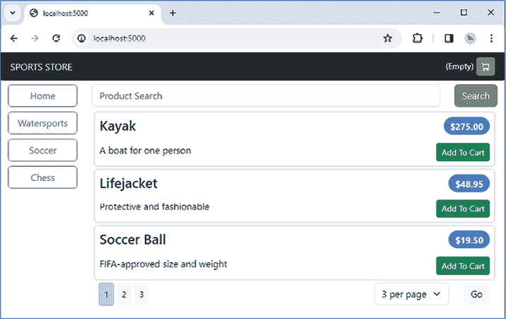
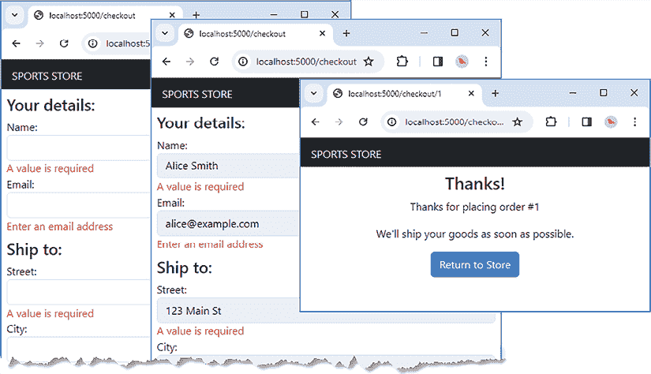
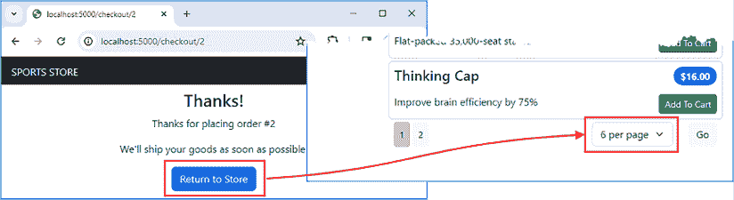

# 第十八章：SportsStore：订单和验证

在本章中，我们继续通过添加支持下单功能来构建 SportsStore 应用程序，这包括验证用户提供的表单数据。

# 为本章做准备

本章使用 *第十七章* 中的 `sportsstore` 项目。本章不需要任何更改。打开一个新的命令提示符，导航到 `sportsstore` 文件夹，并运行 *列表 18.1* 中显示的命令以启动开发工具。

**提示**

你可以从 [`github.com/PacktPublishing/Mastering-Node.js-Web-Development`](https://github.com/PacktPublishing/Mastering-Node.js-Web-Development) 下载本章的示例项目——以及本书中所有其他章节的示例项目。如果你在运行示例时遇到问题，请参阅 *第一章* 以获取帮助。

列表 18.1：启动开发工具

```js
npm start 
```

打开一个新的浏览器窗口，导航到 `http://localhost:5000`，你将看到产品目录，如 *图 18.1* 所示。



图 18.1：运行应用程序

# 处理订单

处理订单的数据模型分为两部分：订单和用户配置文件。订单描述了已选择的产品并提供订单的发货状态。如 *第十六章* 所述，SportsStore 应用程序不扩展到实现支付和履行过程，这些通常由与单独平台的集成来处理。

## 创建数据模型

要开始，请将一个名为 `customer_models.ts` 的文件添加到 `src/data` 文件夹中，内容如 *列表 18.2* 所示。这是一个占位符，用于表示客户，具有仅够开始处理订单的功能。

列表 18.2：src/data 文件夹中 customer_models.ts 文件的内容

```js
export interface Customer {
    id?: number;
    name: string;
    email: string;
} 
```

要描述订单，请将一个名为 `order_models.ts` 的文件添加到 `src/data` 文件夹中，内容如 *列表 18.3* 所示。

列表 18.3：src/data 文件夹中 order_models.ts 文件的内容

```js
import { Product } from "./catalog_models";
import { Customer } from "./customer_models";
export interface Order {
    id?: number;
    customer?: Customer;
    selections?: ProductSelection[];
    address?: Address;
    shipped: boolean;
}
export interface ProductSelection {
    id?: number;
    productId?: number;
    quantity: number;
    price: number;
}
export interface Address {
    id?: number;
    street: string;
    city: string;
    state: string;
    zip: string;
} 
```

`Order` 接口描述了一个订单，其中包含代表用户购买的产品（包括购买时的价格）的 `ProductSelection` 对象。客户由 `Customer` 对象表示，而发货和账单地址由 `Address` 对象表示。实际在线商店所需的详细信息取决于当地法律和习俗以及销售的产品类型，但这些接口是对基本订单特征的合理近似，可以根据需要调整。

要描述对订单数据的访问，请将一个名为 `order_repository.ts` 的文件添加到 `src/data` 文件夹中，内容如 *列表 18.4* 所示。

列表 18.4：src/data 文件夹中 order_repository.ts 文件的内容

```js
import { Order } from "./order_models";
export interface OrderRepository {
    getOrder(id: number): Promise<Order| null>;
    getOrders(excludeShipped: boolean): Promise<Order[]>;
    storeOrder(order: Order): Promise<Order>;
} 
```

`getOrder` 方法返回一个订单，通过其 `id` 值进行标识。`getOrders` 方法检索所有订单，有一个参数允许排除已发货的订单。`storeOrder` 方法存储或更新订单。

## 实现模型类

我打算扩展现有的 Sequelize 实现 `CatalogRepository` 接口，以实现 `OrderRepository` 接口定义的方法，这将允许单个数据库存储目录和订单数据。在 `src/data/orm/models` 文件夹中添加一个名为 `customer_models.ts` 的文件，其内容如 *清单 18.5* 所示。

**单数据库与多数据库**

从设计角度来看，将每种类型的数据存储在其自己的数据库中可能很有吸引力，例如，目录数据可以单独存储，与订单或用户数据分开。在实践中，单独的数据库难以管理，尤其是大多数应用程序使用的数据类别之间都存在某种关系：订单需要引用产品，用户账户需要与订单关联，等等。将应用程序的数据存储在单个数据库中，可以更方便地使用数据库功能，如事务，以确保数据完整性，并简化查询中的数据关联。

如果你决定使用多个数据库，那么你需要负责管理数据库之间的事务，并确保数据保持一致性，以便数据库之间的关系保持一致。有一些工具可以帮助，例如分布式事务管理器，但它们可能很复杂且难以使用。

从纯粹实用的角度来看，我的建议是在可能的情况下，始终使用单个数据库来存储应用程序的所有数据。当不可能使用单个数据库时，例如当员工数据存储在中央 HR 数据库中，而你的应用程序只有只读访问权限时，你应该密切关注数据之间关系的管理。

清单 18.5：`src/data/orm/models` 文件夹中 `customer_models.ts` 文件的内容

```js
import { Model, CreationOptional, InferAttributes, InferCreationAttributes }
    from "sequelize";
import { Customer } from "../../customer_models";
export class CustomerModel extends Model<InferAttributes<CustomerModel>,
        InferCreationAttributes<CustomerModel>> implements Customer {
    declare id?: CreationOptional<number>;
    declare name: string;
    declare email: string;
} 
```

`CustomerModel` 类实现了 `Customer` 接口，以便通过 Sequelize 存储客户数据。为了告诉 Sequelize 如何初始化模型类，在 `src/data/orm/models` 文件夹中添加一个名为 `customer_helpers.ts` 的文件，其内容如 *清单 18.6* 所示。

清单 18.6：`src/data/orm/models` 文件夹中 `customer_helpers.ts` 文件的内容

```js
import { DataTypes, Sequelize } from "sequelize";
import { CustomerModel } from "./customer_models";
export const initializeCustomerModels = (sequelize: Sequelize) => {
    CustomerModel.init({
        id: { type: DataTypes.INTEGER, autoIncrement: true, primaryKey: true},
        name: { type: DataTypes.STRING},       
        email: { type: DataTypes.STRING }
    }, { sequelize})
} 
```

`initializeCustomerModels` 函数初始化 `CustomerModel` 类，并指定每个模型属性的 SQL 数据类型和配置。

### 创建订单模型

要创建描述订单的接口的实现，在 `server/data/orm/models` 文件夹中添加一个名为 `order_models.ts` 的文件，其内容如 *清单 18.7* 所示。

清单 18.7：`src/data/orm/models` 文件夹中 `order_models.ts` 文件的内容

```js
import { Model, CreationOptional, ForeignKey, InferAttributes,
    InferCreationAttributes, 
    HasManySetAssociationsMixin} from "sequelize";
import { ProductModel } from "./catalog_models";
import { CustomerModel } from "./customer_models";
import { Address, Order, ProductSelection } from "../../order_models";
export class OrderModel extends Model<InferAttributes<OrderModel>,
        InferCreationAttributes<OrderModel>> implements Order {
    declare id?: CreationOptional<number>;
    declare shipped: boolean;
    declare customerId: ForeignKey<CustomerModel["id"]>;
    declare customer?: InferAttributes<CustomerModel>
    declare addressId: ForeignKey<AddressModel["id"]>;
    declare address?: InferAttributes<AddressModel>;

    declare selections?:  InferAttributes<ProductSelectionModel>[];
    declare setSelections:
        HasManySetAssociationsMixin<ProductSelectionModel, number>;
}
export class ProductSelectionModel extends
        Model<InferAttributes<ProductSelectionModel>,
            InferCreationAttributes<ProductSelectionModel>>
        implements ProductSelection {
    declare id?: CreationOptional<number>;

    declare productId: ForeignKey<ProductModel["id"]>;
    declare product?: InferAttributes<ProductModel>
    declare quantity: number;
    declare price: number;
    declare orderId: ForeignKey<OrderModel["id"]>;
    declare order?: InferAttributes<OrderModel>;
}
export class AddressModel extends Model<InferAttributes<AddressModel>,
    InferCreationAttributes<AddressModel>> implements Address {
    declare id?: CreationOptional<number>;
    declare street: string;
    declare city: string;
    declare state: string;
    declare zip: string;
} 
```

模型类使用了在早期示例中描述的 Sequelize 特性，并实现了`Order`、`ProductSelection`和`Address`接口。正如前几章所述，获取准确的数据模型可能是一个繁琐的过程，我发现同时定义模型类和初始化它们的辅助代码更容易。将一个名为`order_helpers.ts`的文件添加到`server/data/orm/models`文件夹中，其内容如*清单 18.8*所示。

*清单 18.8*：`server/data/orm/models`文件夹中`order_helpers.ts`文件的内容

```js
import { DataTypes, Sequelize } from "sequelize";
import { OrderModel, ProductSelectionModel, AddressModel }
    from "./order_models";
import { CustomerModel } from "./customer_models";
import { ProductModel } from ".";
const primaryKey = {
    id: { type: DataTypes.INTEGER, autoIncrement: true, primaryKey: true }
};

export const initializeOrderModels = (sequelize: Sequelize) => {
    OrderModel.init({
        ...primaryKey, shipped: DataTypes.BOOLEAN
    }, {sequelize});
    ProductSelectionModel.init({
        ...primaryKey,
        quantity: DataTypes.INTEGER, price: DataTypes.DECIMAL(10, 2)
    }, {sequelize});
    AddressModel.init({
        ...primaryKey,
        street: DataTypes.STRING, city: DataTypes.STRING,
        state: DataTypes.STRING, zip: DataTypes.STRING,
    }, {sequelize});
    OrderModel.belongsTo(CustomerModel, { as: "customer"});
    OrderModel.belongsTo(AddressModel,
        {foreignKey: "addressId", as: "address"});
    OrderModel.belongsToMany(ProductSelectionModel,
        { through: "OrderProductJunction",
            foreignKey: "orderId", as: "selections" });
    ProductSelectionModel.belongsTo(ProductModel, { as: "product"});
} 
```

除了初始化模型类之外，`initializeOrderModels`函数描述了它们之间的关系，这决定了将要创建以存储数据的数据库表的结构。

如同在*第十五章*中所述，Sequelize 为模型类添加了方法，允许管理相关数据。这是通过使用我在*第十六章*中构建仓库时使用的相同混合技术来实现的。由于`ProductSelectionModel`和`OrderModel`类之间的一对多关系，将创建一个名为`setSelections`的方法，这就是为什么我在`OrderModel`类中添加了这个`declare`语句的原因：

```js
...
declare **setSelections**: HasManySetAssociationsMixin<ProductSelectionModel, number>;
... 
```

`Sequelize`为所有模型属性添加了方法，但这是 SportsStore 应用程序唯一需要的方法。因此，这是我唯一添加了`declare`语句的方法。*清单 18.9*调用了`initializeCustomerModels`和`initializeOrderModels`函数，以便模型类与产品目录中使用的类一起初始化。

*清单 18.9*：`src/data/orm/models`文件夹中`index.ts`文件中初始化模型

```js
import { Sequelize } from "sequelize";
import { initializeCatalogModels } from "./catalog_helpers";
**import { initializeCustomerModels } from "./customer_helpers";**
**import { initializeOrderModels } from "./order_helpers";**
export { ProductModel, CategoryModel, SupplierModel } from "./catalog_models";
export const initializeModels = (sequelize: Sequelize) => {
    initializeCatalogModels(sequelize);
   **initializeCustomerModels(sequelize);**
 **initializeOrderModels(sequelize);**
} 
```

`initializeModels`函数现在初始化了应用程序使用的所有三类模型类。

## 实现仓库

下一步是创建`OrderRepository`接口定义的方法的实现。将一个名为`order_queries.ts`的文件添加到`src/data/orm`文件夹中，其内容如*清单 18.10*所示。

*清单 18.10*：`src/data/orm`文件夹中`order_queries.ts`文件的内容

```js
import { Attributes, FindOptions } from "sequelize";
import { Order } from "../order_models"
import { BaseRepo, Constructor } from "./core"
import { AddressModel, OrderModel } from "./models/order_models";
import { CustomerModel } from "./models/customer_models";
const queryConfig: FindOptions<Attributes<OrderModel>> = {
    include: [
        { model: AddressModel, as: "address"},
        { model: CustomerModel, as: "customer" }
    ],
    raw: true, nest: true
}
export function AddOrderQueries<TBase
        extends Constructor<BaseRepo>>(Base: TBase)  {
    return class extends Base {
        getOrder(id: number) : Promise<Order | null> {
            return OrderModel.findByPk(id, queryConfig);
        }
        getOrders(excludeShipped: boolean): Promise<Order[]> {
            return OrderModel.findAll(
                excludeShipped ?
                    { ...queryConfig, where: { shipped: false}} : queryConfig
            )           
        }
    }
} 
```

`AddOrderQueries`函数返回一个实现了`getOrder`和`getOrders`方法的类，这些方法是`OrderRepository`接口所要求的。为了保持查询的一致性，我使用了 Sequelize 提供的类型来描述用于查询数据库的选项。使用`FindOptions<Attributes<OrderModel>>`类型描述`OrderModel`数据的查询选项。`queryConfig`对象使用`include`属性将相关的`AddressModel`和`CustomerModel`数据包含在结果中，并将`raw`和`nest`属性设置为指定结果的格式。为了实现剩余的接口方法，将一个名为`order_storage.ts`的文件添加到`src/data/orm`文件夹中，其内容如*清单 18.11*所示。

*清单 18.11*：`src/data/orm`文件夹中`order_storage.ts`文件的内容

```js
import { Order } from "../order_models"
import { BaseRepo, Constructor } from "./core"
import { AddressModel, OrderModel, ProductSelectionModel }
    from "./models/order_models";
import { CustomerModel } from "./models/customer_models";
export function AddOrderStorage<TBase extends
        Constructor<BaseRepo>>(Base: TBase)  {
    return class extends Base {
        storeOrder(order: Order): Promise<Order> {
            return  this.sequelize.transaction(async (transaction) => {
                const { id, shipped } = order;
                const [stored] =
                    await OrderModel.upsert({ id, shipped }, {transaction});

                if (order.customer) {
                    const [{id}] = await CustomerModel.findOrCreate({
                        where: { email: order.customer.email},
                        defaults: order.customer,
                        transaction
                    });
                    stored.customerId = id;
                }
                if (order.address) {

                    const [{id}] = await AddressModel.findOrCreate({
                        where: { ...order.address },
                        defaults: order.address,
                        transaction
                    });
                    stored.addressId = id;
                }
                await stored.save({transaction});
                if (order.selections) {
                    const sels = await ProductSelectionModel.bulkCreate(
                        order.selections, { transaction});
                    await stored.setSelections(
                        sels, { transaction });
                }
                return stored;
            });
        }
    }
} 
```

使用 `Sequelize` 的 `upsert` 方法来更新或创建订单、客户和地址数据。产品选择使用 `bulkCreate` 方法存储，该方法允许在单个操作中存储多行，并使用 `mixin` `setSelections` 方法将存储的产品选择与订单关联。这些操作都在同一事务中执行，以确保数据一致性。*清单 18.12* 使用 JavaScript `mixin` 功能将订单功能合并到仓库类中。

清单 18.12：在 src/data/orm 文件夹中的 index.ts 文件中添加订单

```js
import { BaseRepo } from "./core";
import { AddQueries } from "./queries";
import { AddStorage } from "./storage";
**import { AddOrderQueries** **} from "./order_queries";**
**import { AddOrderStorage } from "./order_storage";**
**const CatalogRepo = AddStorage(****AddQueries(BaseRepo));**
**const RepoWithOrders = AddOrderStorage(AddOrderQueries(CatalogRepo));**
**export const CatalogRepoImpl** **= RepoWithOrders;** 
```

从本模块导出的 `CatalogRepoImpl` 类实现了 `CatalogRepository` 和 `OrderRepository` 接口所需的方法。尽管单个类实现了所有仓库方法，但我更喜欢将功能单独呈现给应用程序的其他部分，如 *清单 18.13* 所示。

清单 18.13：在 src/data 文件夹中的 index.ts 文件中创建仓库

```js
import { CatalogRepository } from "./catalog_repository";
import { CatalogRepoImpl} from "./orm";
**import { OrderRepository } from "./order_repository";**
**const repo =** **new CatalogRepoImpl();**
**export const catalog_repository: CatalogRepository = repo;**
**export const order_repository: OrderRepository** **= repo;** 
```

TypeScript 类型注解将确保此模块导出的每个常量都只呈现由仓库接口之一定义的方法。

# 实现订单流程

现在数据模型扩展到描述和存储订单数据，下一步是创建允许创建和存储订单的工作流程。

## 验证数据

创建订单的过程需要用户数据，这些数据在使用和存储之前将进行验证。要安装验证包及其 TypeScript 描述，请在 `sportsstore` 文件夹中运行 *清单 18.14* 中显示的命令。

清单 18.14：安装验证包

```js
npm install validator@13.11.0
npm install --save-dev @types/validator@13.11.5 
```

这些包在 *表 18.1* 中进行了描述，以便快速参考。

表 18.1：验证包

| 名称 | 描述 |
| --- | --- |

|

```js
`validator` 
```

| 此包包含常见数据类型的验证器。 |
| --- |

|

```js
`@types/validator` 
```

| 此包包含验证器 API 的 TypeScript 描述。 |
| --- |

要启动验证功能，创建 `src/data/validation` 文件夹，并向其中添加一个名为 `validation_types.ts` 的文件，其内容如 *清单 18.15* 所示。

清单 18.15：src/data/validation 文件夹中 validation_types.ts 文件的内容

```js
export class ValidationStatus {
    private invalid: boolean = false;
    constructor(public readonly value: any) {}
    get isInvalid() : boolean  {
        return this.invalid
    }
    setInvalid(newValue: boolean) {
        this.invalid = newValue || this.invalid;
    }

    messages: string[] = [];
}
export type ValidationRule = (status: ValidationStatus)
    => void | Promise<void>;
export type ValidationRuleSet<T> = {
    [key in keyof Omit<Required<T>, "id">]: ValidationRule | ValidationRule[];
}
export type ValidationResults<T> = {
    [key in keyof Omit<Required<T>, "id">]: ValidationStatus;
} 
```

`ValidationStatus` 类表示单个模型属性的验证状态，这将允许规则验证数据。`ValidationRule` 类型描述了一个接收 `ValidationStatus` 对象并验证其定义的数据值的规则。可以使用 `ValidationStatus` 类定义的 `setInvalid` 方法设置值的有效性，该方法锁定值，一旦值被标记为 `invalid`，则无法通过另一个规则返回到 `valid` 状态。

`ValidationRuleSet<T>` 类型描述了应用于模型类 `T` 的规则集。模型类定义的每个属性都必须至少有一个验证规则。

`ValidationResults<T>` 类型描述了模型对象的验证结果，为每个模型属性定义了一个 `ValidationStatus` 对象。

`ValidationRuleSet<T>` 和 `ValidationResults<T>` 类型使用 TypeScript 实用类型来描述模型验证要求和结果的表示方式：

```js
...
 [key in keyof **Omit<Required<T>, "id">**]: ValidationRule | ValidationRule[];
... 
```

这个咒语告诉 TypeScript 编译器，对于类型 `T` 定义的每个属性，包括可选属性，都需要属性，除了名为 `id` 的属性。TypeScript 提供了一系列有用的实用类型（在 [`www.typescriptlang.org/docs/handbook/utility-types.html`](https://www.typescriptlang.org/docs/handbook/utility-types.html) 中描述），可以用来描述一个类型如何与另一个类型相关联，在这种情况下，效果是验证要求和结果都是全面的。

将名为 `validator.ts` 的文件添加到 `src/data/validation` 文件夹中，其内容如 *列表 18.16* 所示。

列表 18.16：src/data/validation 文件夹中 validator.ts 文件的内容

```js
import { ValidationResults, ValidationRule, ValidationRuleSet,
    ValidationStatus } from "./validation_types";
export class Validator<T>{
    constructor(public rules: ValidationRuleSet<T>,
        public breakOnInvalid = true) {}
        async validate(data: any): Promise<ValidationResults<T>> {
            const vdata = Object.entries(this.rules).map(async ([key, rules]) => {
                const status = new ValidationStatus(data?.[key] ?? "");
                const rs = (Array.isArray(rules) ? rules: [rules]);
                for (const r of rs) {
                    if (!status.isInvalid || !this.breakOnInvalid) {
                        await r(status);
                    }
                }
                return [key, status];
            });
            const done = await Promise.all(vdata);
            return Object.fromEntries(done);
        }
    validateOriginal(data: any): ValidationResults<T> {
        const vdata = Object.entries(this.rules).map(([key, rules]) => {
            const status = new ValidationStatus(data?.[key] ?? "");
            (Array.isArray(rules) ? rules: [rules])
                .forEach(async (rule: ValidationRule) => {
                    if (!status.isInvalid || !this.breakOnInvalid) {
                        await rule(status);
                    }
            });
            return [key, status];
        });
        return Object.fromEntries(vdata);
    }
}
export function isValid<T>(result: ValidationResults<T>) {
    return Object.values<ValidationStatus>(result)
        .every(r => r.isInvalid === false);
}
export function getData<T>(result: ValidationResults<T>): T {
    return Object.fromEntries (Object.entries<ValidationStatus>(result)
        .map(([key, status]) => [key, status.value])) as T;
} 
```

`Validator<T>` 类为模型类型 `T` 提供验证。构造函数参数是一个 `ValidationRuleSet<T>` 值，它提供了要应用的规则，以及一个 `boolean` 参数，指定是否在规则报告值无效后停止对属性的验证，或者是否继续应用所有规则。

`validate` 方法接受一个要验证的值，应用规则，并构建一个描述结果的 `ValidationResult<T>` 对象。*列表 18.16* 包含一个名为 `isValid` 的实用函数，该函数检查为值产生的验证结果，并确定所有属性是否有效。`getData` 方法从验证结果中提取数据，这将用于确保应用程序只使用已定义验证规则和通过验证的属性。

### 定义验证规则

要为属性创建基本的验证规则，请将名为 `basic_rules.ts` 的文件添加到 `src/data/validation` 文件夹中，其内容如 *列表 18.17* 所示。

列表 18.17：src/data/validation 文件夹中 basic_rules.ts 文件的内容

```js
import validator from "validator";
import { ValidationStatus } from "./validation_types";
export const minLength = (min: number) => (status: ValidationStatus) => {
    if (!validator.isLength(status.value, { min })) {
        status.setInvalid(true);
        status.messages.push(`Enter at least ${min} characters`);
    }
};
export const email = (status: ValidationStatus) => {
    if (!validator.isEmail(status.value)) {
        status.setInvalid(true);
        status.messages.push("Enter an email address");
    }
};
export const required = (status: ValidationStatus) => {
    if (validator.isEmpty(status.value.toString(), { ignore_whitespace: true})) {
        status.setInvalid(true);
        status.messages.push("A value is required");
    }
};
export const no_op = (status: ValidationStatus) => { /* do nothing */ } 
```

`minLength`、`email` 和 `required` 函数确保值具有最小长度，是格式正确的电子邮件地址，并且值不是未定义或空字符串。所有三个函数都使用了 `validator` 包提供的功能。`no_op` 函数不执行任何验证，是要求模型类定义的每个属性（除了 `id` 属性）都需要验证规则的结果：某些属性可能不需要验证，但必须包含在验证配置中，而 `no_op`（简称为 *no operation*）函数可以用来实现这一点。

为了描述用户将为订单提供的数据的验证要求，将名为`order_rules.ts`的文件添加到`src/data/validation`文件夹中，其内容如*清单 18.18*所示。

*清单 18.18*：src/data/validation 文件夹中 order_rules.ts 文件的内容

```js
import { Validator } from "./validator";
import { required, minLength, email, no_op } from "./basic_rules";
import { Address } from "../order_models";
import { Customer } from "../customer_models";
export const CustomerValidator = new Validator<Customer>({
    name: [required, minLength(6)],
    email: email
});
export const AddressValidator = new Validator<Address>({
    street: required,
    city: required,
    state: required,
    zip: no_op
}); 
```

*清单 18.18*定义了`Customer`和`Address`模型类型的验证规则，这些规则将与用户购物车的内容结合以创建订单。请注意，地址的`zip`属性使用`no_op`规则，这告诉验证器该属性是可选的，没有特定的验证要求。

这是一种比我在本书*第二部分*中使用的方法更全面的定义验证方式，因为它使用 TypeScript 确保为每个类型定义的每个属性指定验证要求，除了`id`属性，我已省略，因为我通常希望让数据库确定对象所需的 ID。

当客户端提供 id 值时，我将将其与其他数据分开进行验证。为了完成验证功能，将名为`index.ts`的文件添加到`src/data/validation`文件夹中，其内容如*清单 18.19*所示。

*清单 18.19*：src/data/validation 文件夹中 index.ts 文件的内容

```js
export * from "./validation_types";
export * from "./validator";
export * from "./basic_rules";
export * from "./order_rules"; 
```

此文件仅导出验证文件夹中其他文件的内容，以便其余应用程序更容易消费这些内容。

## 创建 HTTP 处理器

下一步是定义将用于完成订单流程的三个 HTTP 处理器：一个渲染用于收集用户详情的 HTML 表单的`GET`处理器，一个接收并验证用户详情的`POST`处理器，以及一个在订单完成后显示总结信息的`GET`处理器。将名为`orders.ts`的文件添加到`src/routes`文件夹中，其内容如*清单 18.20*所示。

*清单 18.20*：src/routes 文件夹中 orders.ts 文件的内容

```js
import { Express } from "express";
import { Address } from "../data/order_models";
import { AddressValidator, CustomerValidator, ValidationResults, getData, isValid }
    from "../data/validation";
import { Customer } from "../data/customer_models";
import { createAndStoreOrder } from "./order_helpers";
declare module "express-session" {
    interface SessionData {
       orderData?: {
            customer?: ValidationResults<Customer>,
            address?: ValidationResults<Address>
       }
    }
}
export const createOrderRoutes = (app: Express) => {
    app.get("/checkout", (req, resp) => {
        resp.render("order_details", {
            order: req.session.orderData,
        });
    });
    app.post("/checkout", async (req, resp) => {
        const { customer, address } = req.body;
        const data = req.session.orderData = {
            customer: await CustomerValidator.validate(customer),
            address: await AddressValidator.validate(address)
        };
        if (isValid(data.customer) && isValid(data.address)
                && req.session.cart) {
            const order = await createAndStoreOrder(
                getData(data.customer), getData(data.address), req.session.cart
            )
            resp.redirect(`/checkout/${order.id}`);
            req.session.cart = undefined;
            req.session.orderData = undefined;
        } else {
            resp.redirect("/checkout");
        }
    });
    app.get("/checkout/:id", (req, resp) => {
        resp.render("order_complete", {id: req.params.id});
    })
} 
```

`declare`语句告诉 TypeScript，会话将用于使用名称`orderData`存储一个对象，其中包含`customer`和`address`属性，其值是验证结果。

第一个处理器接受发送到`/checkout` URL 的`GET`请求，并通过渲染名为`order_details`的模板来响应，将存储在会话中的`customer`和`address`数据作为上下文数据传递。

此模板渲染 HTML 表单，当用户第一次发送`GET`请求时，表单将是空的，因为会话中尚未存储任何客户或地址数据。

第二个处理器接受发送到`/checkout` URL 的`POST`请求，从请求中读取客户和地址数据并进行验证，如下所示：

```js
... 
```

```js
const data = req.session.orderData = {
    customer: await CustomerValidator.**validate**(customer),
    address: await AddressValidator.**validate**(address)
};
... 
```

在此语句中使用的`through`赋值确保验证结果存储在会话中，并存储在一个名为`data`的本地常量中，以便于使用。

如果数据无效，重定向到 `/checkout` URL 将渲染表单，但这次，模板将显示验证数据以向用户提供反馈。

如果数据有效，则通过调用一个名为 `createAndStoreOrder` 的函数来创建订单，该函数在 *清单 18.21* 中定义，并将客户和地址数据与用户的购物车内容结合起来创建和存储订单。传递给 `createAndStoreOrder` 函数的数据是从验证结果中提取的，如下所示：

```js
...
const order = await createAndStoreOrder(
    **getData**(data.customer), **getData**(data.address), req.session.cart
)
... 
```

这确保了只使用由模型类型定义的属性，这也是为什么本章早期定义的验证类型需要为每个模型属性提供验证信息的原因之一。一旦订单被存储，就会执行重定向到第三个处理器的操作，该操作在 URL 中包含订单 ID，并可用于向用户显示确认消息。`cart`、客户和地址数据从会话中删除，以便用户可以重新开始购物。

要定义一个组合客户、地址和购物车数据并存储订单的函数，请将一个名为 `order_helpers.ts` 的文件添加到 `src/routes` 文件夹中，其内容如 *清单 18.21* 所示。

*清单 18.21*：`src/routes` 文件夹中 `order_helpers.ts` 文件的内容

```js
import { catalog_repository, order_repository } from "../data";
import { Cart } from "../data/cart_models"
import { Customer } from "../data/customer_models"
import { Address, Order } from "../data/order_models"
export const createAndStoreOrder = async (customer: Customer,
        address: Address, cart: Cart): Promise<Order> => {
    const product_ids = cart.lines.map(l => l.productId) ?? [];
    const product_details = Object.fromEntries((await
        catalog_repository.getProductDetails(product_ids))
            .map(p => [p.id ?? 0, p.price ?? 0]));
    const selections = cart.lines.map(l => ({
        productId: l.productId, quantity: l.quantity,
        price: product_details[l.productId]}));
    return order_repository.storeOrder({   
        customer,address,
        selections, shipped: false
    });
} 
```

示例应用程序通常试图避免合并和格式化数据的混乱现实，但这是每个项目中都应该预期的。在这种情况下，购物车数据必须与产品价格匹配，这是一个尴尬的过程，需要编写尴尬的代码。

当你意识到你拥有的数据不是你需要的数据，并且需要额外的查询和转换时，常常会有一个“哦，不！”的时刻。可能会诱使你回到数据模型中平滑处理粗糙的边缘，但我的建议是不要这样做，因为这只会把问题拆散，使得没有一个数据模型完全适合其目的，这会在各个地方留下一些尴尬的部分。相反，我的偏好是定义每个模型，使其适合它所服务的应用程序部分，并接受在应用程序的一个部分的数据被弯曲成另一个部分所需的形状时，会有一些压力点。*清单 18.22* 启用了所需的订单路由。

*清单 18.22*：在 `src/routes` 文件夹中的 `index.ts` 文件中启用路由

```js
import { Express } from "express";
import { createCatalogRoutes } from "./catalog";
import { createCartMiddleware, createCartRoutes } from "./cart";
**import { createOrderRoutes } from "./orders";**
export const createRoutes = (app: Express) => {
    createCartMiddleware(app);
    createCatalogRoutes(app);
    createCartRoutes(app);
   ** createOrderRoutes(app);**
} 
```

## 创建模板和辅助函数

需要新的模板辅助函数来渲染订单表单。将一个名为 `order_helpers.ts` 的文件添加到 `src/helpers` 文件夹中，其内容如 *清单 18.23* 所示。

*清单 18.23*：`src/helpers` 文件夹中 `order_helpers.ts` 文件的内容

```js
export const toArray = (...args: any[]) => args.slice(0, -1);
export const lower = (val: string) => val.toLowerCase();
export const getValue = (val: any, prop: string) =>
    val?.[prop.toLowerCase()] ?? {};
export const get = (val: any) => val ?? {}; 
```

每个辅助函数的用途将在使用时进行解释，但它们都操作数据值，因此可以包含在模板输出中。*清单 18.24* 启用了新的辅助函数。

*清单 18.24*：在 `src/helpers` 文件夹中的 `index.ts` 文件中添加辅助函数

```js
import { Express } from "express";
import { getConfig } from "../config";
import { engine } from "express-handlebars";
import * as env_helpers from "./env";
import * as catalog_helpers from "./catalog_helpers";
import * as cart_helpers from "./cart_helpers";
**import * as order_helpers from "./order_helpers";**
const location = getConfig("templates:location");
const config = getConfig("templates:config");
export const createTemplates = (app: Express) => {
    app.set("views", location);
    app.engine("handlebars", engine({
        ...config,
       ** helpers: {...env_helpers, ...catalog_helpers, ...cart_helpers,**
 **...order_helpers}**
    }));
    app.set("view engine", "handlebars");
} 
```

从最简单的模板开始，将一个名为 `order_complete.handlebars` 的文件添加到 `templates` 文件夹中，其内容如 *列表 18.25* 所示。

列表 18.25：模板文件夹中 order_complete.handlebars 文件的内容

```js
<div class="text-center m-2">
    <h2>Thanks!</h2>
    <p>Thanks for placing order #{{ id }}</p>
    <p>We'll ship your goods as soon as possible.</p>
    <a class="btn btn-primary" href="/">Return to Store</a>
</div> 
```

此模板在订单已创建后显示一个简单的确认消息，其中包含订单 ID 值。其余模板与用于收集客户和地址数据的表单以及呈现验证反馈相关。将一个名为 `validation_messages.handlebars` 的文件添加到 `templates` 文件夹中，其内容如 *列表 18.26* 所示。

列表 18.26：模板文件夹中 validation_messages.handlebars 文件的内容

```js
{{#each this }}
    <div class="text-danger">{{ this }}</div>
{{/each }} 
```

模板将接收一个字符串数组，这些字符串使用 `each` 表达式显示，使用 `this` 引用当前字符串值。要创建用户姓名和电子邮件地址的表单元素，这些元素对于 `Customer` 数据是必需的，请将一个名为 `order_details_customer.handlebars` 的文件添加到 `templates` 文件夹中，其内容如 *列表 18.27* 所示。

列表 18.27：模板文件夹中 order_details_customer.handlebars 的内容

```js
<div class="m-2">
    <h3>Your details:</h3>
    <div class="form-group">
        <label>Name:</label>
        {{#with (get order.customer.name) }}
            <input name="customer[name]" class="form-control"
                value="{{ value }}">
            {{#if invalid}}
                {{> validation_messages messages }}
            {{/if }}
        {{/with }}
    </div>
        <div class="form-group">
        <label>Email:</label>
        {{#with (get order.customer.email)}}
            <input name="customer[email]" class="form-control"
                value="{{ value }}">
            {{#if invalid }}
                {{> validation_messages messages }}
            {{/if }}
        {{/with}}
    </div>
</div> 
```

该模板为每个值重复相同的元素集，并依赖于需要解释的模板引擎功能和辅助工具。

内置的 `with` 辅助工具用于更改上下文，这可以简化嵌套表达式，如下所示：

```js
...
{{#with **order.customer.name** }}
    <input name="customer[name]" class="form-control" value="{{ **value** }}">
... 
```

`with` 辅助工具用于将上下文更改为 `order.customer.name` 值，因此 `value` 表达式被评估为 `order.customer.name.value`。如果 `with` 辅助工具的表达式未定义，则它不会渲染内容，这在模板第一次渲染时会出现问题，因为用户的会话在表单第一次评估之后才包含此值。为了解决这个问题，使用了 *列表 18.23* 中定义的 `get` 辅助工具，如下所示：

```js
...
{{#with (**get order.customer.name**) }}
... 
```

括号表示一个子表达式，模板引擎将其评估为 `with` 辅助工具的参数。如果未定义值，`get` 辅助工具返回一个空对象，这确保了 `with` 辅助工具包含的内容始终被渲染。

要创建用户地址的表单元素，请将一个名为 `order_details_address.handlebars` 的文件添加到 `templates` 文件夹中，其内容如 *列表 18.28* 所示。

列表 18.28：模板文件夹中 order_details_address.handlebars 的内容

```js
<div class="m-2">
    <h3>Ship to:</h3>       
    {{#each (toArray "Street" "City" "State" "Zip") }}
        {{#with (getValue ../order.address this) }}
            <div class="form-group">
                <label>{{ ../this }}:</label>
                <input name="address[{{lower ../this}}]" class="form-control"
                    value="{{value}}">
            </div>
            {{#unless valid}}
                {{> validation_messages messages }}
            {{/unless}}
        {{/with}}
    {{/each}}
</div> 
```

与之前的模板不同，该模板使用数组中的值以编程方式生成元素：

```js
...
{{#each (toArray "Street" "City" "State" "Zip") }}
... 
```

内置的 `each` 辅助工具重复内容部分，但不支持字面数组。这个问题通过 `toArray` 辅助工具得到解决，它接受一系列参数并将它们组合成一个可以由 `each` 辅助工具处理的数组。

内置的`with`辅助函数用于将上下文更改为每个表单字段所需的数据值。`getValue`辅助函数用于为`with`辅助函数生成值，这是通过在源对象上查找属性来完成的。`with`辅助函数更改了上下文，但仍然可以通过使用导航表达式从原始数据中获取值，如下所示：

```js
...
<input name="address[{{lower ..**/this**}}]" class="form-control" value="{{value}}">
... 
```

`lower`辅助函数用于设置`input`元素的名称，该名称使用方括号结构化，以便在服务器从 HTTP 请求中读取时将相关值分组。整体效果是创建名称为`address[street]`、`address[city]`、`address[state]`和`address[zip]`的元素，这些元素将被传递到一个名为`address`的 JavaScript 对象中，该对象具有`street`、`city`、`state`和`zip`属性。

要合并客户和地址模板，在`templates`文件夹中创建一个名为`order_details.handlebars`的文件，内容如图*列表 18.29*所示。

列表 18.29：templates 文件夹中 order_details.handlebars 文件的内容

```js
<form method="post" action="/checkout">
    {{> order_details_customer }}
    {{> order_details_address }}

    <div class="m-2">
        <button type="submit" class="btn btn-primary">Place Order</button>
        <a href="/cart" class="btn btn-primary">Back</a>
    </div>
</form> 
```

当用户点击**提交订单**按钮时，`form`元素向`/checkout` URL 发送`POST`请求。还有一个样式设置为按钮的链接，将用户引导回购物车。

使用浏览器请求`http://localhost:5000`，将商品添加到购物车，并点击**结账**按钮，这将引导应用程序展示订单详情表单。点击**提交订单**按钮以查看验证错误。要完成订单，填写表单并点击**提交订单**按钮。整个过程如图*图 18.2*所示。



图 18.2：创建订单

# 修复返回 URL

在目录中，用户对类别、页面和页面大小的偏好通过查询字符串来保留，但当数据保存在会话中而不是在结账时，这些偏好就会丢失。我对保留类别和页面不太关心，因为它们是临时选择，但我希望保留页面大小，以便在用户完成订单或取消订单流程时使用。

我可以将所有用户的选择保存在会话中或在整个订单流程中使用查询字符串，但我希望保留这些不同的方法，因为它们展示了解决类似问题的不同方式。考虑到这一点，我将在订单流程开始时将用户首选的页面大小保存在会话中，并在生成将用户返回目录的 URL 时使用该值。

第一步是在用户从购物车过渡到订单流程时将页面大小作为会话数据存储，如图*列表 18.30*所示。

列表 18.30：在 src/routes 文件夹中的 orders.ts 文件中存储页面大小

```js
import { Express } from "express";
import { Address } from "../data/order_models";
import { AddressValidator, CustomerValidator, ValidationResults, getData, isValid }
    from "../data/validation";
import { Customer } from "../data/customer_models";
import { createAndStoreOrder } from "./order_helpers";
declare module "express-session" {
    interface SessionData {
       orderData?: {
            customer?: ValidationResults<Customer>,
            address?: ValidationResults<Address>
       },
      ** pageSize?: string;**
    }
}
export const createOrderRoutes = (app: Express) => {
    app.get("/checkout", (req, resp) => {
        **req.session.pageSize** **=**
 **req.session.pageSize ?? req.query.pageSize?.toString() ?? "3";**
        resp.render("order_details", {
            order: req.session.orderData,
            **page: 1,**
 **pageSize: req.session.pageSize**
        });
    });
    app.post("/checkout", async (req, resp) => {
        const { customer, address } = req.body;
        const data = req.session.orderData = {
            customer: await CustomerValidator.validate(customer),
            address: await AddressValidator.validate(address)
        };
        if (isValid(data.customer) && isValid(data.address)
                && req.session.cart) {
            const order = await createAndStoreOrder(
                getData(data.customer), getData(data.address),
                    req.session.cart
            )
            resp.redirect(`/checkout/${order.id}`);
            req.session.cart = undefined;
            req.session.orderData = undefined;
        } else {
            resp.redirect("/checkout");
        }
    });
    app.get("/checkout/:id", (req, resp) => {
        resp.render("order_complete", {
            id: req.params.id,
            **pageSize****: req.session.pageSize ?? 3**
        });
    })
} 
```

*列表 18.31*将返回 URL 添加到用户点击以离开购物车摘要的锚点元素的 target 中。

列表 18.31：在模板文件夹中的 cart.handlebars 文件中添加 URL

```js
<h2>Your cart</h2>
<table class="table table-bordered table-striped">
    <thead>
        <tr>
            <th class="text-end">Quantity</th><th>Item</th>
            <th class="text-end">Price</th><th class="text-end">Subtotal</th>
            <th></th>
        </tr>
    </thead>
    <tbody>
        {{#unless cart.lines}}
            <tr><td colspan="5" class="text-center">Cart is empty</td></tr>
        {{/unless}}
        {{#each cart.lines}}
            {{> cart_line returnUrl=../returnUrl }}       
        {{/each }}
    </tbody>
    <tfoot>
        <tr>
            <td colspan="3" class="text-end">Total:</td>
            <td class="text-end">{{ currency cart.total }}</td>
        </tr>
    </tfoot>
</table>
<div class="text-center">
    <a class="btn btn-primary" href="{{ returnUrl }}">Continue Shopping</a>
    {{#if cart.lines}}
        **<a class="btn btn-primary" href="/checkout{{returnUrl}}">Checkout</a>**
    {{else}}
        <button class="btn btn-primary" disabled>Checkout</button>
    {{/if}}
</div> 
```

*列表 18.32* 将返回 URL 添加到“**订单详情**”页面上的“**返回**”按钮。

列表 18.32：在模板文件夹中的 order_details.handlebars 文件中添加 URL

```js
<form method="post" action="/checkout">
    {{> order_details_customer }}
    {{> order_details_address }}

    <div class="m-2">
        <button type="submit" class="btn btn-primary">Place Order</button>
        **<a** **href="/cart?returnUrl={{ escapeUrl (navigationUrl )}}"**
 **class="btn btn-primary">Back</a>**
    </div>
</form> 
```

最后一步是添加用户点击以返回目录的按钮的 URL，如图*列表 18.33*所示。

列表 18.33：在模板文件夹中的 order_complete.handlebars 文件中添加 URL

```js
<div class="text-center m-2">
    <h2>Thanks!</h2>
    <p>Thanks for placing order #{{ id }}</p>
    <p>We'll ship your goods as soon as possible.</p>
   ** <a class="btn btn-primary"** **href="/?page=1&pageSize={{pageSize}}">**
        Return to Store
    </a>
</div> 
```

使用浏览器请求`http://localhost:5000`并将页面大小更改为**6**个项目。将商品添加到购物车并完成订单。点击订单摘要中显示的“**返回商店**”按钮，当目录显示时页面大小将被保留，如图*图 18.3*所示。



图 18.3：修复返回 URL

# 摘要

在本章中，我继续开发 SportsStore 应用程序，通过添加订单支持。

+   订单的数据模型通过一个独立的仓库接口展示，但使用的是`ORM mixin`类来实现。

+   订单数据存储在与目录相同的数据库中，这简化了数据一致性并使得使用事务进行更新变得更容易。

+   在存储之前，会验证用户提供的数据。

+   验证系统依赖于 TypeScript 来确保所有数据模型属性都定义了规则。

+   会话功能用于在结账过程中存储用户的分页偏好设置。

在下一章中，我将添加支持用户使用他们的 Google 账户进行身份验证的功能，这是通过`OAuth`协议完成的。
