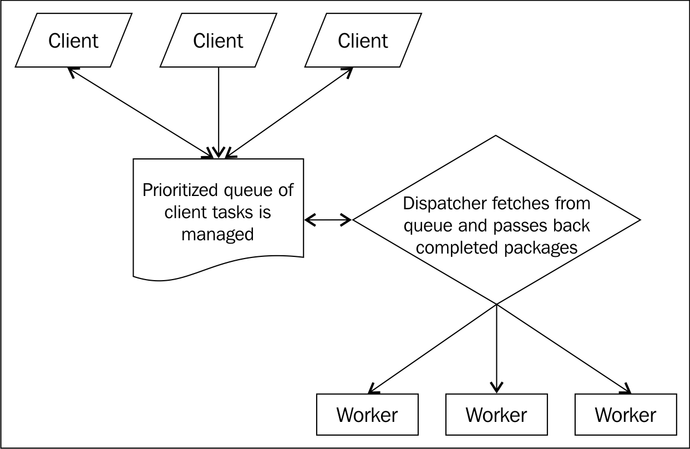

# 第二章：理解异步事件驱动编程

“预测未来的最好方法是创造它。”

– Alan Kay

通过使用事件驱动的异步 I/O 来消除阻塞进程是 Node 的主要组织原则。我们已经了解到这种设计如何帮助开发人员塑造信息并增加容量。Node 允许您构建和组织轻量级、独立的、无共享的进程，这些进程通过回调进行通信，并与可预测的事件循环同步。

随着 Node 的流行度增长，设计良好的事件驱动系统和应用程序的数量也在增加。要使一种新技术成功，它必须消除现有的问题，并/或以更低的时间、精力或价格成本为消费者提供更好的解决方案。在其年轻而富有活力的生命周期中，Node 社区已经合作证明了这种新的开发模式是现有技术的可行替代方案。基于 Node 的解决方案的数量和质量为企业级应用程序提供了进一步的证明，表明这些新想法不仅是新颖的，而且是受欢迎的。

在本章中，我们将更深入地探讨 Node 如何实现事件驱动编程。我们将首先解开事件驱动语言和环境从中获得和处理的想法和理论，以消除误解并鼓励掌握。在介绍事件之后，我们将重点介绍 Node.js 技术——事件循环。然后，我们将更详细地讨论 Node 如何实现定时器、回调和 I/O 事件，以及作为 Node 开发人员如何使用它们。我们还将讨论使用现代工具（如**Promises**、**Generators**和**async/await**）管理并发的方法。在构建一些简单但典型的文件和数据驱动应用程序时，我们将实践这些理论。这些示例突出了 Node 的优势，并展示了 Node 如何成功地简化了网络应用程序设计。

# Node 的独特设计

首先，让我们准确地看一下当您的程序要求系统执行不同类型的服务时的总时间成本。I/O 是昂贵的。在下图中（取自*Ryan Dahl*关于 Node 的原始演示），我们可以看到典型系统任务消耗多少个时钟周期。I/O 操作的相对成本令人震惊：

| L1 缓存 | 3 个周期 |
| --- | --- |
| L2 缓存 | 14 个周期 |
| RAM | 250 个周期 |
| 磁盘 | 41,000,000 个周期 |
| 网络 | 240,000,000 个周期 |

原因是很明显的：磁盘是一个物理设备，一个旋转的金属盘——存储和检索数据比在固态设备（如微处理器和存储芯片）之间移动数据要慢得多，或者说比在优化的芯片上的 L1/L2 缓存要慢得多。同样，数据在网络上不是瞬间移动的。光本身需要 0.1344 秒才能环绕地球！在一个由数十亿人定期在速度远远慢于光速的距离上相互交流的网络中，有许多弯路和少数直线，这种延迟会积累起来。

当我们的软件在我们桌子上的个人电脑上运行时，几乎没有或根本没有通过网络进行通信。与文字处理器或电子表格的交互中的延迟或故障与磁盘访问时间有关。为了提高磁盘访问速度，做了大量工作。数据存储和检索变得更快，软件变得更具响应性，用户现在期望在其工具中获得这种响应性。

随着云计算和基于浏览器的软件的出现，您的数据已经离开了本地磁盘，存在于远程磁盘上，并且您通过网络——互联网访问这些数据。数据访问时间再次显著减慢。网络 I/O 很慢。尽管如此，越来越多的公司正在将其应用程序的部分迁移到云中，一些软件甚至完全基于网络。

Node 旨在使 I/O 快速。它是为这个新的网络软件世界设计的，其中数据分布在许多地方，必须快速组装。许多传统的构建 Web 应用程序的框架是在一个单一用户使用桌面计算机，使用浏览器定期向运行关系数据库的单个服务器发出 HTTP 请求的时代设计的。现代软件必须预期成千上万个同时连接的客户端通过各种网络协议在任意数量的独特设备上同时更改庞大的共享数据池。Node 专门设计为帮助那些构建这种网络软件的人。

Node 设计所反映的思维突破一旦被认识到，就变得简单易懂，因为大多数工作线程都在等待——等待更多指令，等待子任务完成等。例如，被分配为服务命令“格式化我的硬盘”的进程将把所有资源用于管理工作流程，类似以下内容：

+   向设备驱动程序通知已发出格式请求

+   空闲，等待*不可知*的时间长度

+   接收格式完成的信号

+   通知客户端

+   清理；关闭：


在前面的图中，我们看到一个昂贵的工人正在向客户收取固定的时间单位费用，无论是否正在做任何有用的工作（客户对活动和空闲一视同仁地付费）。换句话说，并不一定是真的，而且往往不是真的，组成总任务的子任务每个都需要相似的努力或专业知识。因此，为这种廉价劳动力支付高价是浪费的。

同情地说，我们还必须认识到，即使准备好并能够处理更多工作，这个工人也无法做得更好——即使是最有诚意的工人也无法解决 I/O 瓶颈的问题。这个工人是**I/O 受限**的。

相反，想象一种替代设计。如果多个客户端可以共享同一个工人，那么当一个工人因 I/O 瓶颈而宣布可用时，另一个客户端的工作可以开始吗？

Node 通过引入一个系统资源（理想情况下）**永远**不会空闲的环境，使 I/O 变得通用。Node 实现的事件驱动编程反映了降低整体系统成本的简单目标，主要通过减少 I/O 瓶颈的数量来鼓励共享昂贵的劳动力。我们不再拥有无能为力的僵化定价的劳动力块；我们可以将所有努力减少为精确界定形状的离散单位，因此可以实现更准确的定价。

一个协作调度了许多客户端工作的环境会是什么样子？这种事件之间的消息传递是如何处理的？此外，并发、并行、异步执行、回调和事件对 Node 开发人员意味着什么？

# 协作

与先前描述的阻塞系统相比，更可取的是一个协作工作环境，工人定期被分配新任务，而不是空闲。为了实现这样的目标，我们需要一个虚拟交换机，将服务请求分派给可用的工人，并让工人通知交换机他们的可用性。

实现这一目标的一种方法是拥有一个可用劳动力池，通过将任务委派给不同的工人来提高效率：


这种方法的一个缺点是需要进行大量的调度和工人监视。调度程序必须处理源源不断的请求，同时管理来自工人的关于他们可用性的消息，将请求整理成可管理的任务并高效地排序，以便最少数量的工人处于空闲状态。

也许最重要的是，当所有工人都被预订满了会发生什么？调度程序是否开始从客户那里丢弃请求？调度也是资源密集型的，调度程序的资源也是有限的。如果请求继续到达，而没有工人可用来为其提供服务，调度程序会怎么做？管理队列？我们现在有一个情况，调度程序不再做正确的工作（调度），而是负责簿记和保持列表，进一步延长每个任务完成所需的时间。每个任务需要一定的时间，并且必须按到达顺序进行处理。这个任务执行模型堆叠了固定的时间间隔——*时间片*。这是*同步*执行。

# 排队

为了避免过载任何人，我们可以在客户和调度程序之间添加一个缓冲区。这个新的工人负责管理客户关系。客户不直接与调度程序交谈，而是与服务经理交谈，将请求传递给经理，并在将来的某个时候接到通知，说他们的任务已经完成。工作请求被添加到一个优先级工作队列（一个订单堆栈，最重要的订单在顶部），这个经理等待另一个客户走进门。

以下图表描述了情况：



调度程序试图通过从队列中提取任务，将工人完成的任何包传回，并通常维护一个理智的工作环境，以确保没有任何东西被丢弃或丢失，来使所有工人保持忙碌。与沿着单个时间线逐个进行任务不同，多个同时运行在其自己的时间线上的任务并行运行。如果所有工人都处于空闲状态且任务队列为空，那么办公室可以休息一会儿，直到下一个客户到来。

这是 Node 通过*异步*工作而不是*同步*工作来获得速度的粗略示意图。现在，让我们深入了解 Node 的事件循环是如何工作的。

# 理解事件循环

在我们分解事件循环时，以下三点很重要：

+   事件循环在与您的 JavaScript 代码运行的相同（单个）线程中运行。阻塞事件循环意味着阻塞整个线程。

+   您不会启动和/或停止事件循环。事件循环在进程启动时开始，并在没有进一步的回调需要执行时结束。因此，事件循环可能永远运行。

+   事件循环将许多 I/O 操作委托给`libuv`，后者管理这些操作（使用 OS 本身的能力，如线程池），并在结果可用时通知事件循环。易于理解的单线程编程模型通过多线程的效率得到了加强。

例如，以下`while`循环永远不会终止：

```js
let stop = false;
setTimeout(() => {
  stop = true;
}, 1000);

while (stop === false) {};
```

即使有人可能期望，在大约一秒钟内，将布尔值`true`分配给变量`stop`，触发`while`条件并中断其循环；这永远不会发生。为什么？这个`while`循环通过无限运行来使事件循环饥饿，贪婪地检查和重新检查一个永远不会有机会改变的值，因为事件循环永远不会有机会安排我们的定时器回调进行执行。这证明了事件循环（管理定时器）并且在同一个线程上运行。

根据 Node 文档，“事件循环是 Node.js 执行非阻塞 I/O 操作的关键，尽管 JavaScript 是单线程的，但通过尽可能地将操作卸载到系统内核来实现。” Node 的设计者所做的关键设计选择是将事件循环实现为并发管理器。例如，通过`libuv`，OS 传递网络接口事件来通知基于 Node 的 HTTP 服务器与本地硬件的网络连接。

以下是事件驱动编程的描述（摘自：[`www.princeton.edu/~achaney/tmve/wiki100k/docs/Event-driven_programming.html`](http://www.princeton.edu/~achaney/tmve/wiki100k/docs/Event-driven_programming.html)），不仅清楚地描述了事件驱动范式，还向我们介绍了事件在 Node 中的处理方式，以及 JavaScript 是这种范式的理想语言。

在计算机编程中，事件驱动编程或基于事件的编程是一种编程范式，其中程序的流程由事件决定 - 即传感器输出或用户操作（鼠标点击，按键）或来自其他程序或线程的消息。事件驱动编程也可以被定义为一种应用架构技术，其中应用程序具有一个主循环，明确定义为两个部分：第一个是事件选择（或事件检测），第二个是事件处理[...]。事件驱动程序可以用任何语言编写，尽管在提供高级抽象的语言中更容易，比如闭包。有关更多信息，请访问[`www.youtube.com/watch?v=QQnz4QHNZKc`](https://www.youtube.com/watch?v=QQnz4QHNZKc)。

Node 通过将许多阻塞操作委托给 OS 子系统来使单个线程更有效，只有在有数据可用时才会打扰主 V8 线程。主线程（执行中的 Node 程序）通过传递回调来表达对某些数据的兴趣（例如通过`fs.readFile`），并在数据可用时得到通知。在数据到达之前，不会对 V8 的主 JavaScript 线程施加进一步的负担。如何做到的？Node 将 I/O 工作委托给`libuv`，如引用所述：[`nikhilm.github.io/uvbook/basics.html#event-loops`](http://nikhilm.github.io/uvbook/basics.html#event-loops)。

在事件驱动编程中，应用程序表达对某些事件的兴趣，并在发生时做出响应。从操作系统收集事件或监视其他事件源的责任由`libuv`处理，用户可以注册回调以在事件发生时被调用。

* Matteo Collina *创建了一个有趣的模块，用于对事件循环进行基准测试，可在以下网址找到：[`github.com/mcollina/loopbench`](https://github.com/mcollina/loopbench)。

考虑以下代码：

```js
const fs = require('fs');
fs.readFile('foo.js', {encoding:'utf8'}, (err, fileContents) => {
  console.log('Then the contents are available', fileContents);
});
console.log('This happens first');
```

该程序的输出是：

```js
> This happens first
> Then the contents are available, [file contents shown]
```

执行此程序时，Node 的操作如下：

1.  使用 V8 API 在 C++中创建了一个进程对象。然后将 Node.js 运行时导入到这个 V8 进程中。

1.  `fs`模块附加到 Node 运行时。V8 将 C++暴露给 JavaScript。这为您的 JavaScript 代码提供了对本机文件系统绑定的访问权限。

1.  `fs.readFile`方法传递了指令和 JavaScript 回调。通过`fs.binding`，`libuv`被通知文件读取请求，并传递了原始程序发送的回调的特别准备版本。

1.  `libuv`调用了必要的操作系统级函数来读取文件。

1.  JavaScript 程序继续运行，打印`This happens first`。因为有一个未解决的回调，事件循环继续旋转，等待该回调解析。

1.  当操作系统完全读取文件描述符时，通过内部机制通知`libuv`，并调用传递给`libuv`的回调，从而为原始 JavaScript 回调准备重新进入主（V8）线程。

1.  原始的 JavaScript 回调被推送到事件循环，并在循环的近期刻度上被调用。

1.  文件内容被打印到控制台。

1.  由于没有进一步的回调在飞行中，进程退出。

在这里，我们看到了 Node 实现的关键思想，以实现快速、可管理和可扩展的 I/O。例如，如果在前面的程序中对`foo.js`进行了 10 次读取调用，执行时间仍然大致相同。每个调用都将由`libuv`尽可能高效地管理（例如，通过使用线程并行化调用）。尽管我们的代码是用 JavaScript 编写的，但实际上我们部署了一个非常高效的多线程执行引擎，同时避免了操作系统异步进程管理的困难。

现在我们知道了文件系统操作可能是如何工作的，让我们深入了解 Node 在事件循环中如何处理每种异步操作类型。

# 事件循环排序、阶段和优先级

事件循环通过阶段进行处理，每个阶段都有一个要处理的事件队列。来自 Node 文档：


对开发人员相关的阶段如下：

+   **定时器**：延迟到未来某个指定的毫秒数的回调，比如`setTimeout`和`setInterval`

+   **I/O 回调**：在被委托给 Node 的管理线程池后返回到主线程的准备好的回调，比如文件系统调用和网络监听器

+   **轮询/检查**：主要是根据`setImmediate`和`nextTick`的规则排列在堆栈上的函数

当套接字或其他流接口上有数据可用时，我们不能立即执行回调。JavaScript 是单线程的，所以结果必须同步。我们不能在事件循环的中间突然改变状态，这会导致一些经典的多线程应用程序问题，比如竞争条件、内存访问冲突等。

要了解更多关于 Node 如何绑定到`libuv`和其他核心库的信息，请查看`fs`模块的代码：[`github.com/nodejs/node/blob/master/lib/fs.js`](https://github.com/nodejs/node/blob/master/lib/fs.js)。比较`fs.read`和`fs.readSync`方法，观察同步和异步操作的实现方式的不同；注意在`fs.read`中传递给原生`binding.read`方法的包装回调。要深入了解 Node 设计的核心部分，包括队列实现，请阅读 Node 源代码：[`github.com/joyent/node/tree/master/src`](https://github.com/joyent/node/tree/master/src)。查看`fs_event_wrap.cc`中的`FSEventWrap`。调查`req_wrap`类，这是 V8 引擎的包装器，在`node_file.cc`和其他地方部署，并在`req_wrap.h`中定义。

进入事件循环时，Node 实际上会复制当前指令队列（也称为**堆栈**），清空原始队列，并执行其副本。处理这个指令队列被称为**tick**。如果`libuv`在单个主线程（V8）上处理此 tick 开始时复制的指令链时异步接收到结果（包装为回调），这些结果将被排队。一旦当前队列被清空并且其最后一条指令完成，队列将再次被检查以执行下一个 tick 上的指令。这种检查和执行队列的模式将重复（循环），直到队列被清空，并且不再期望有更多的数据事件，此时 Node 进程退出。

接下来，让我们看看 Node 的事件接口。

# 监听事件

现代网络软件因为各种原因变得越来越复杂，并且在很多方面改变了我们对应用程序开发的看法。大多数新平台和语言都试图解决这些变化。Node 也不例外，JavaScript 也不例外。

学习 Node 意味着学习事件驱动编程，将软件组合成模块，创建和链接数据流，生成和消耗事件及其相关数据。基于 Node 的架构通常由许多小进程和/或服务组成，这些进程和/或服务通过事件进行通信 - 内部通过扩展`EventEmitter`接口并使用回调，外部通过几种常见的传输层之一（例如 HTTP，TCP），或通过覆盖这些传输层之一的薄消息传输层（例如 0MQ，Redis PUBSUB 和 Kafka）。

这些进程很可能由几个免费、开源和高质量的 npm 模块组成，每个模块都配备了单元测试和/或示例和/或文档。

上一章向您介绍了`EventEmitter`接口。这是我们在逐章移动时将遇到的主要事件接口，因为它为许多暴露事件接口的 Node 对象提供了原型类，例如文件和网络流。不同模块 API 暴露的各种`close`、`exit`、`data`和其他事件都表示了`EventEmitter`接口的存在，随着我们的学习，我们将了解这些模块和用例。

在本节中，我们的目标是讨论一些较少为人知的事件源：信号、子进程通信、文件系统更改事件和延迟执行。

# 信号

事件驱动编程就像硬件中断编程。中断正是其名称所暗示的。它们利用中断控制器、CPU 或任何其他设备正在执行的任务，要求立即为它们的特定需求提供服务。

事实上，Node 进程对象公开了标准**可移植操作系统接口（POSIX）**信号名称，因此 Node 进程可以订阅这些系统事件。

正如[`en.wikipedia.org/wiki/POSIX_signal`](http://en.wikipedia.org/wiki/POSIX_signal) 所定义的，“信号是 Unix、类 Unix 和其他符合 POSIX 标准的操作系统中使用的一种有限的进程间通信形式。它是异步通知，发送给进程或同一进程中的特定线程，以通知其发生的事件。”

这是将 Node 进程暴露给操作系统信号事件的一种非常优雅和自然的方式。可以配置监听器来捕获指示 Node 进程重新启动或更新某些配置文件，或者简单地进行清理和关闭的信号。

例如，当控制终端检测到*Ctrl* + *C*（或等效）按键时，**SIGINT**信号将发送到进程。此信号告诉进程已请求中断。如果 Node 进程已将回调绑定到此事件，则该函数可能在终止之前记录请求，执行其他清理工作，甚至忽略请求：

```js
// sigint.js
console.log("Running...");

// After 16 minutes, do nothing
setInterval(() => {}, 1e6); // Keeps Node running the process

// Subscribe to SIGINT, so some of our code runs when Node gets that signal
process.on("SIGINT", () => {
    console.log("We received the SIGINT signal!");
    process.exit(1);
});
```

以下是`sigint.js`的输出：

```js
$ node sigint.js
Running...
(then press Ctrl+C)
We received the SIGINT signal!
```

此示例启动了一个长时间间隔，因此 Node 不会因无其他任务而退出。当您通过控制进程的终端从键盘发送*Ctrl* + *C*时，Node 会从操作系统接收信号。您的代码已订阅了该事件，Node 会运行您的函数。

现在，考虑这样一种情况，即 Node 进程正在进行一些持续的工作，例如解析日志。能够向该进程发送信号，例如更新配置文件或重新启动扫描，可能是有用的。您可能希望从命令行发送这些信号。您可能更喜欢由另一个进程执行此操作 - 这种做法称为**进程间通信**（IPC）。

创建一个名为`ipc.js`的文件，并键入以下代码：

```js
// ipc.js
setInterval(() => {}, 1e6);
process.on("SIGUSR1", () => {
    console.log("Got a signal!");
});
```

运行以下命令：

```js
$ node ipc.js
```

与以前一样，Node 将在运行空函数之前等待大约 16 分钟，保持进程开放，因此您将不得不使用*Ctrl *+ *C*来恢复提示符。请注意，即使在这里，我们没有订阅 SIGINT 信号，这也可以正常工作。

`SIGUSR1`（和`SIGUSR2`）是用户定义的信号，由操作系统不知道的特定操作触发。它们用于自定义功能。

要向进程发送命令，必须确定其**进程 ID**。有了 PID，您就可以寻址进程并与其通信。如果`ipc.js`在通过 Node 运行后分配的 PID 是`123`，那么我们可以使用`kill`命令向该进程发送`SIGUSR1`信号：

```js
$ kill –s SIGUSR1 123
```

在 UNIX 中查找给定 Node 进程的 PID 的一个简单方法是在系统进程列表中搜索正在运行的程序名称。如果`ipc.js`当前正在执行，可以通过在控制台/终端中输入以下命令行来找到其 PID：

使用`ps aux | grep ipc.js`命令。试试看。

# 子进程

Node 设计的一个基本部分是在并行执行或扩展系统时创建或分叉进程，而不是创建线程池。我们将在本书中以各种方式使用这些子进程。现在，重点将放在理解如何处理子进程之间的通信事件上。

要创建一个子进程，需要引入 Node 的`child_process`模块，并调用`fork`方法。传递新进程应执行的程序文件的名称：

```js
let cp = require("child_process");
let child = cp.fork(__dirname + "/lovechild.js");
```

您可以使用这种方法保持任意数量的子进程运行。在多核机器上，操作系统将分配分叉出的进程到可用的硬件核心上。将 Node 进程分布到核心上，甚至分布到其他机器上，并管理 IPC 是一种稳定、可理解和可预测的方式来扩展 Node 应用程序。

扩展前面的示例，现在分叉进程（`parent`）可以发送消息，并监听来自分叉进程（`child`）的消息。以下是`parent.js`的代码：

```js
// parent.js
const cp = require("child_process");
let child = cp.fork(__dirname + "/lovechild.js");

child.on("message", (m) => {
  console.log("Child said: ", m); // Parent got a message up from our child
});
child.send("I love you"); // Send a message down to our child
```

以下是`parent.js`的输出：

```js
$ node parent.js
Parent said:  I love you
Child said:  I love you too
(then Ctrl+C to terminate both processes)
```

在那个文件旁边，再创建一个文件，命名为`lovechild.js`。这里的子代码可以监听消息并将其发送回去：

```js
// lovechild.js
process.on("message", (m) => {
  console.log("Parent said: ", m); // Child got a message down from the parent
  process.send("I love you too"); // Send a message up to our parent
});
```

不要自己运行`lovechild.js`；`--parent.js`会为您进行分叉！

运行`parent.js`应该会分叉出一个子进程并向该子进程发送消息。子进程应该以同样的方式回应：

```js
Parent said:  I love you
Child said:  I love you too
```

运行`parent.js`时，请检查您的操作系统任务管理器。与之前的示例不同，这里将有两个 Node 进程，而不是一个。

另一个非常强大的想法是将网络服务器的对象传递给子进程。这种技术允许多个进程，包括父进程，共享服务连接请求的责任，将负载分布到核心上。

例如，以下程序将启动一个网络服务器，分叉一个子进程，并将父进程的服务器引用传递给子进程：

```js
// net-parent.js
const path = require('path');
let child = require("child_process").fork(path.join(__dirname, "net-child.js"));
let server = require("net").createServer();

server.on("connection", (socket) => {
  socket.end("Parent handled connection");
});

server.listen(8080, () => {
  child.send("Parent passing down server", server);
});
```

除了将消息作为第一个参数发送给子进程之外，前面的代码还将服务器句柄作为第二个参数发送给自己。我们的子服务器现在可以帮助家族的服务业务：

```js
// net-child.js
process.on("message", function(message, server) {
  console.log(message);
  server.on("connection", function(socket) {
    socket.end("Child handled connection");
  });
});
```

这个子进程应该会在您的控制台上打印出发送的消息，并开始监听连接，共享发送的服务器句柄。

重复连接到`localhost:8080`的服务器将显示由子进程处理的连接或由父进程处理的连接；两个独立的进程正在平衡服务器负载。当与之前讨论的简单进程间通信协议相结合时，这种技术展示了*Ryan Dahl*的创作如何成功地提供了构建可扩展网络程序的简单方法。

我们只用了几行代码就连接了两个节点。

我们将讨论 Node 的新集群模块，它扩展并简化了之前在第七章中讨论的技术，*使用多个进程*。如果您对服务器处理共享感兴趣，请访问集群文档：[`nodejs.org/dist/latest-v9.x/docs/api/cluster.html`](https://nodejs.org/dist/latest-v9.x/docs/api/cluster.html)

# 文件事件

大多数应用程序都会对文件系统进行一些操作，特别是那些作为 Web 服务的应用程序。此外，专业的应用程序可能会记录有关使用情况的信息，缓存预渲染的数据视图，或者对文件和目录结构进行其他更改。Node 允许开发人员通过`fs.watch`方法注册文件事件的通知。`watch`方法会在文件和目录上广播更改事件。

`watch`方法按顺序接受三个参数：

+   正在被监视的文件或目录路径。如果文件不存在，将抛出**ENOENT（没有实体）**错误，因此建议在某个有用的先前点使用`fs.exists`。

+   一个可选的选项对象，包括：

+   持久（默认为 true 的布尔值）：Node 会保持进程活动，只要还有*事情要做*。将此选项设置为*false*，即使你的代码仍然有一个文件监视器在监视，也会让 Node 关闭进程。

+   递归（默认为 false 的布尔值）：是否自动进入子目录。注意：这在不同平台上的实现不一致。因此，出于性能考虑，你应该明确控制你要监视的文件列表，而不是随意监视目录。

+   编码（默认为`utf8`的字符串）：传递文件名的字符编码。你可能不需要更改这个。

+   `listener`函数，接收两个参数：

+   更改事件的名称（`rename`或`change`之一）

+   已更改的文件名（在监视目录时很重要）

这个例子将在自身上设置一个观察者，更改自己的文件名，然后退出：

```js
const fs = require('fs');
fs.watch(__filename, { persistent: false }, (event, filename) => {
  console.log(event);
  console.log(filename);
})

setImmediate(function() {
  fs.rename(__filename, __filename + '.new', () => {});
});
```

两行，`rename`和原始文件的名称，应该已经打印到控制台上。

在任何时候关闭你的观察者通道，你想使用这样的代码：

```js
let w = fs.watch('file', () => {});
w.close();
```

应该注意，`fs.watch`在很大程度上取决于主机操作系统如何处理文件事件，Node 文档中也提到了这一点：

“fs.watch API 在各个平台上并不完全一致，并且在某些情况下不可用。”

作者在许多不同的系统上对该模块有非常好的体验，只是在 OS X 实现中回调函数的文件名参数为空。不同的系统也可能强制执行大小写敏感性，无论哪种方式。然而，一定要在你特定的架构上运行测试 —— 信任，但要验证。

或者，使用第三方包！如果你在使用 Node 模块时遇到困难，请检查 npm 是否有替代方案。在这里，作为`fs.watch`的问题修复包装器，考虑*Paul Miller*的*chokidar*。它被用作构建系统（如 gulp）的文件监视工具，以及许多其他项目。参考：[`www.npmjs.com/package/chokidar`](https://www.npmjs.com/package/chokidar)。

# 延迟执行

有时需要推迟执行一个函数。传统的 JavaScript 使用定时器来实现这一目的，使用众所周知的`setTimeout`和`setInterval`函数。Node 引入了另一种推迟执行的方式，主要是作为控制回调函数在 I/O 事件和定时器事件之间执行顺序的手段。

正如我们之前看到的，管理定时器是 Node 事件循环的主要工作之一。两种延迟事件源，使开发人员能够安排回调函数的执行在排队的 I/O 事件之前或之后，分别是`process.nextTick`和`setImmediate`。现在让我们来看看这些。

# process.nextTick

作为原生 Node 进程模块的一种方法，`process.nextTick`类似于熟悉的`setTimeout`方法，它延迟执行其回调函数直到将来的某个时间点。然而，这种比较并不完全准确；所有请求的`nextTick`回调函数列表都被放在事件队列的头部，并在当前脚本的执行之后（JavaScript 代码在 V8 线程上同步执行）和 I/O 或定时器事件之前，按顺序处理。

在函数中使用`nextTick`的主要目的是将结果事件的广播推迟到当前执行堆栈上的监听器在调用者有机会注册事件监听器之前，给当前执行的程序一个机会将回调绑定到`EventEmitter.emit`事件。

把这看作是一个模式，可以在任何想要创建自己的异步行为的地方使用。例如，想象一个查找系统，可以从缓存中获取，也可以从数据存储中获取新鲜数据。缓存很快，不需要回调，而数据 I/O 调用需要它们。

第二种情况中回调的需求支持对回调行为的模拟，在第一种情况中使用`nextTick`。这允许一致的 API，提高了实现的清晰度，而不会使开发人员负担起确定是否使用回调的责任。

以下代码似乎设置了一个简单的事务；当`EventEmitter`的一个实例发出开始事件时，将`Started`记录到控制台：

```js
const events = require('events');
function getEmitter() {
  let emitter = new events.EventEmitter();
  emitter.emit('start');
  return emitter;
}

let myEmitter = getEmitter();

myEmitter.on("start", () => {
  console.log("Started");
});
```

然而，你可能期望的结果不会发生！在`getEmitter`中实例化的事件发射器在返回之前发出`start`，导致后续分配的监听器出现错误，它到达时已经晚了一步，错过了事件通知。

为了解决这种竞争条件，我们可以使用`process.nextTick`：

```js
const events = require('events');
function getEmitter() {
  let emitter = new events.EventEmitter();
  process.nextTick(() => {
    emitter.emit('start');
  });
  return emitter;
}

let myEmitter = getEmitter();
myEmitter.on('start', () => {
  console.log('Started');
});
```

这段代码在 Node 给我们`start`事件之前附加了`on("start")`处理程序，并且可以正常工作。

错误的代码可能会递归调用`nextTick`，导致代码无休止地运行。请注意，与在事件循环的单个轮次内对函数进行递归调用不同，这样做不会导致堆栈溢出。相反，它会使事件循环饥饿，使微处理器上的进程繁忙，并可能阻止程序发现 Node 已经完成的 I/O。

# setImmediate

`setImmediate`在技术上是定时器类的成员，与`setInterval`和`setTimeout`一起。但是，它与时间无关——没有*毫秒数*等待发送参数。

这个方法实际上更像是`process.nextTick`的一个同级，有一个非常重要的区别：通过`nextTick`排队的回调将在 I/O 和定时器事件之前执行，而通过`setImmediate`排队的回调将在 I/O 事件之后调用。

这两种方法的命名令人困惑：Node 实际上会在你传递给`setImmediate`的函数之前运行你传递给`nextTick`的函数。

这个方法确实反映了定时器的标准行为，它的调用将返回一个对象，可以传递给`clearImmediate`，取消你对以后运行函数的请求，就像`clearTimeout`取消使用`setTimeout`设置的定时器一样。

# 定时器

定时器用于安排将来的事件。当需要延迟执行某些代码块直到指定的毫秒数过去时，用于安排特定函数的周期性执行等等时，就会使用它们。

JavaScript 提供了两个异步定时器：`setInterval()`和`setTimeout()`。假设读者完全了解如何设置（和取消）这些定时器，因此将不会花费太多时间讨论语法。我们将更多地关注定时和间隔的陷阱和不太为人知的细节。

关键要点是：在使用定时器时，不应该对定时器触发注册的回调函数之前实际过去的时间量或回调的顺序做任何假设。Node 定时器不是中断。定时器只是承诺尽可能接近指定的时间执行（但绝不会提前），与其他事件源一样，受事件循环调度的约束。

关于定时器你可能不知道的一件事是-我们都熟悉`setTimeout`的标准参数：回调函数和超时间隔。你知道传递给`callback`函数的还有许多其他参数吗？`setTimeout(callback, time, [passArg1, passArg2…])`

# setTimeout

超时可以用来推迟函数的执行，直到未来的某个毫秒数。

考虑以下代码：

```js
setTimeout(a, 1000);
setTimeout(b, 1001);
```

人们会期望函数`b`会在函数`a`之后执行。然而，这并不能保证-`a`可能在`b`之后执行，或者反过来。

现在，考虑以下代码片段中存在的微妙差异：

```js
setTimeout(a, 1000);
setTimeout(b, 1000);
```

在这种情况下，`a`和`b`的执行顺序是可以预测的。Node 基本上维护一个对象映射，将具有相同超时长度的回调分组。*Isaac Schlueter*，Node 项目的前任领导，现任 npm Inc.的首席执行官，这样说：

正如我们在[`groups.google.com/forum/#!msg/nodejs-dev/kiowz4iht4Q/T0RuSwAeJV0J`](https://groups.google.com/forum/#!msg/nodejs-dev/kiowz4iht4Q/T0RuSwAeJV0J)上发现的，“[N]ode 为每个超时值使用单个低级定时器对象。如果为单个超时值附加多个回调，它们将按顺序发生，因为它们位于队列中。但是，如果它们位于不同的超时值上，那么它们将使用不同的线程中的定时器，因此受[CPU]调度程序的影响。”

在相同的执行范围内注册的定时器回调的顺序并不能在所有情况下可预测地决定最终的执行顺序。此外，超时的最小等待时间为一毫秒。传递零、-1 或非数字的值将被转换为这个最小值。

要取消超时，请使用`clearTimeout(timerReference)`。

# setInterval

有许多情况可以想象到定期执行函数会很有用。每隔几秒轮询数据源并推送更新是一种常见模式。每隔几毫秒运行动画的下一步是另一种用例，还有收集垃圾。对于这些情况，`setInterval`是一个很好的工具：

```js
let intervalId = setInterval(() => { ... }, 100);
```

每隔 100 毫秒，发送的回调函数将执行，这个过程可以使用`clearInterval(intervalReference)`来取消。

不幸的是，与`setTimeout`一样，这种行为并不总是可靠的。重要的是，如果系统延迟（比如一些糟糕的写法的阻塞`while`循环）占据事件循环一段时间，那么在这段时间内设置的间隔将在堆栈上排队等待结果。当事件循环变得不受阻塞并解开时，所有间隔回调将按顺序被触发，基本上是立即触发，失去了它们原本意图的任何时间延迟。

幸运的是，与基于浏览器的 JavaScript 不同，Node 中的间隔通常更加可靠，通常能够在正常使用场景中保持预期的周期性。

# unref 和 ref

一个 Node 程序没有理由保持活动状态。只要还有等待处理的回调，进程就会继续运行。一旦这些被清除，Node 进程就没有其他事情可做了，它就会退出。

例如，以下愚蠢的代码片段将使 Node 进程永远运行：

```js
let intervalId = setInterval(() => {}, 1000);
```

即使设置的回调函数没有任何有用或有趣的内容，它仍然会被调用。这是正确的行为，因为间隔应该一直运行，直到使用`clearInterval`停止它。

有一些情况下，使用定时器来对外部 I/O、某些数据结构或网络接口进行一些有趣的操作，一旦这些外部事件源停止发生或消失，定时器本身就变得不必要。通常情况下，人们会在程序的其他地方捕获定时器的无关状态，并从那里取消定时器。这可能会变得困难甚至笨拙，因为现在需要不必要地纠缠关注点，增加了复杂性。

`unref`方法允许开发人员断言以下指令：当这个定时器是事件循环处理的唯一事件源时，继续终止进程。

让我们将这个功能测试到我们之前的愚蠢示例中，这将导致进程终止而不是永远运行：

```js
let intervalId = setInterval(() => {}, 1000);
intervalId.unref();
```

请注意，`unref`是启动定时器时返回的不透明值的一个方法，它是一个对象。

现在，让我们添加一个外部事件源，一个定时器。一旦这个外部源被清理（大约 100 毫秒），进程将终止。我们向控制台发送信息来记录发生了什么：

```js
setTimeout(() => {
  console.log("now stop");
}, 100);

let intervalId = setInterval(() => {
  console.log("running")
}, 1);

intervalId.unref();
```

你可以使用`ref`将定时器恢复到正常行为，这将撤消`unref`方法：

```js
let intervalId = setInterval(() => {}, 1000);
intervalId.unref();
intervalId.ref();
```

列出的进程将继续无限期地进行，就像我们最初的愚蠢示例一样。

快速测验！运行以下代码后，日志消息的预期顺序是什么？

```js
const fs = require('fs');
const EventEmitter = require('events').EventEmitter;
let pos = 0;
let messenger = new EventEmitter();

// Listener for EventEmitter
messenger.on("message", (msg) => {
  console.log(++pos + " MESSAGE: " + msg);
});

// (A) FIRST
console.log(++pos + " FIRST");

//  (B) NEXT
process.nextTick(() => {
  console.log(++pos + " NEXT")
})

// (C) QUICK TIMER
setTimeout(() => {
  console.log(++pos + " QUICK TIMER")
}, 0)

// (D) LONG TIMER
setTimeout(() => {
  console.log(++pos + " LONG TIMER")
}, 10)

// (E) IMMEDIATE
setImmediate(() => {
  console.log(++pos + " IMMEDIATE")
})

// (F) MESSAGE HELLO!
messenger.emit("message", "Hello!");

// (G) FIRST STAT
fs.stat(__filename, () => {
  console.log(++pos + " FIRST STAT");
});

// (H) LAST STAT
fs.stat(__filename, () => {
  console.log(++pos + " LAST STAT");
});

// (I) LAST
console.log(++pos + " LAST");
```

这个程序的输出是：

```js
FIRST (A).
MESSAGE: Hello! (F).
LAST (I).
NEXT (B).
QUICK TIMER (C).
FIRST STAT (G).
LAST STAT (H).
IMMEDIATE (E).
LONG TIMER (D).
```

让我们分解上述代码：

A、F 和 I 在主程序流中执行，因此它们将在主线程中具有第一优先级。这是显而易见的；你的 JavaScript 按照它们被编写的顺序执行指令，包括发出回调的同步执行。

主调用堆栈耗尽后，事件循环现在几乎可以开始处理 I/O 操作。这是`nextTick`请求被执行的时刻，它们排在事件队列的最前面。这时 B 被显示出来。

其余的顺序应该是清楚的。定时器和 I/O 操作将被处理（C、G、H），然后是`setImmediate`回调的结果（E），始终在执行任何 I/O 和定时器响应之后到达。

最后，长时间超时（D）到达，这是一个相对遥远的未来事件。

请注意，重新排列此程序中的表达式不会改变输出顺序，除了可能重新排列 STAT 结果之外，这只意味着它们以不同的顺序从线程池返回，但仍然作为与事件队列相关的正确顺序的一组。

# 并发和错误

Node 社区的成员每天都在开发新的包和项目。由于 Node 的事件性质，回调渗透到这些代码库中。我们已经考虑了事件可能如何通过回调排队、分发和处理的关键方式。让我们花点时间概述最佳实践，特别是关于设计回调和处理错误的约定，并讨论在设计复杂的事件和回调链时一些有用的模式。特别是，让我们看看在本书中会看到的新 Promise、Generator 和 async/await 模式，以及现代 Node 代码的其他示例。

# 并发管理

自从项目开始以来，简化控制流一直是 Node 社区关注的问题。事实上，这种潜在的批评是*Ryan Dahl*在向 JavaScript 开发者社区介绍 Node 时讨论的第一个预期批评之一。

由于延迟代码执行通常需要在回调中嵌套回调，因此 Node 程序有时会开始类似于侧向金字塔，也被称为“末日金字塔”。你见过吧：深度嵌套的代码，4 层或 5 层甚至更深，到处都是花括号。除了语法上的烦恼，你也可以想象在这样的调用堆栈中跟踪错误可能会很困难——如果第三层的回调抛出异常，谁负责处理这个错误？第二层吗？即使第二层正在读取文件，第三层正在查询数据库？这有意义吗？很难理解异步程序流的含义。

# 回调

幸运的是，Node 的创建者们早早就就如何构造回调达成了理智的共识。遵循这一传统是很重要的。偏离会带来意外，有时是非常糟糕的意外，总的来说，这样做会自动使 API 变得笨拙，而其他开发人员会迅速厌倦。

一个要么通过执行`callback`返回函数结果，要么处理`callback`接收到的参数，要么在 API 中设计`callback`的签名。无论考虑的是哪种情况，都应该遵循与该情况相关的惯例。

传递给`callback`函数的第一个参数是任何错误消息，最好是以错误对象的形式。如果不需要报告错误，这个位置应该包含一个空值。

当将`callback`传递给函数时，它应该被分配到函数签名的最后一个位置。API 应该一贯地按照这种方式设计。

在错误和`callback`之间可能存在任意数量的参数。

创建错误对象：`new Error("Argument must be a String!")`

# Promises

就像一些政客一样，Node 核心在支持 Promises 之前反对它们。*Mikeal Rogers*在讨论为什么 Promises 从最初的 Node 核心中被移除时，提出了一个强有力的论点，即将功能开发留给社区会导致更强大的核心产品。你可以在这里查看这个讨论：[`web.archive.org/posts/broken-promises.html`](https://web.archive.org/posts/broken-promises.html)

从那时起，Promises 已经获得了非常庞大的追随者，Node 核心也做出了改变。Promises 本质上是标准回调模式的替代品，而标准回调模式在 Node 中随处可见。曾经，你可能会这样写：

```js
API.getUser(loginInfo, function(err, user) {
    API.getProfile(user, function(err, profile) {
        // ...and so on
    }
});
```

如果 API 改为"Promisified"（回想一下前一章中的`util.promisify`？），你对前面的异步控制流的描述将使用 Promise 链来描述：

```js
let promiseProfile = API.getUser(loginInfo)
.then(user => API.getProfile(user))
.then(profile => {
    // do something with #profile
})
.catch(err => console.log(err))
```

这至少是一个更紧凑的语法，读起来更容易一些，操作的链条更长；然而，这里有更多有价值的东西。

`promiseProfile`引用了一个 Promise 对象。Promises 只执行一次，达到错误状态（未完成）或完成状态，你可以通过`then`提取最后的不可变值，就像我们之前对 profile 所做的那样。当然，Promises 可以被分配给一个变量，并且该变量可以传递给尽可能多的消费者，甚至在解决之前。由于`then`只有在有值可用时才会被调用，无论何时，Promises 都被称为未来状态的承诺。

也许最重要的是，与回调不同，Promises 能够管理许多异步操作中的错误。如果你回头看一下本节开头的示例回调代码，你会看到每个回调中都有`err`参数，反映了 Node 的核心错误优先回调风格。每个错误对象都必须单独处理，因此前面的代码实际上会开始看起来更像这样：

```js
API.getUser(loginInfo, function(err, user) {
  if(err) {
    throw err;
  }
  API.getProfile(user, function(err, profile) {
    if(err) {
      throw err;
    }
    // ...and so on
  }
});
```

观察每个错误条件必须单独处理。在实践中，开发人员希望对这段代码进行"手动"包装，比如使用`try...catch`块，以某种方式捕获这个逻辑单元中的所有错误并以集中的方式进行管理。

使用 Promises，你可以免费获得这些。任何`catch`语句都会捕获链中之前的任何`then`抛出的错误。这使得创建一个通用的错误处理程序变得轻而易举。更重要的是，Promises 允许执行链在错误发生后继续。你可以将以下内容添加到前面的 Promise 链中：

```js
.catch(err => console.log(err))
.then(() => // this happens no matter what happened previously)
```

通过 Promises，你可以在更少的空间中组合相当复杂的异步逻辑流，缩进有限，错误处理更容易处理，值是不可变的且可交换的。

Promise 对象的另一个非常有用的特性是，这些未来解析的状态可以作为一个块来管理。例如，想象一下，为了满足对用户配置文件的查询，你需要进行三次数据库调用。与其总是串行地链式调用这些调用，你可以使用`Promise.all`：

```js
const db = {
  getFullName: Promise.resolve('Jack Spratt'),
  getAddress: Promise.resolve('10 Clean Street'),
  getFavorites: Promise.resolve('Lean'),
};

Promise.all([
  db.getFullName() 
  db.getAddress() 
  db.getFavorites() 
])
.then(results => {
  // results = ['Jack Spratt', '10 Clean Stree', 'Lean']
})
.catch(err => {...})
```

在这里，所有三个 Promise 将被同时触发，并且将并行运行。并行运行调用当然比串行运行更有效率。此外，`Promise.all`保证最终的 thenable 接收到一个按照调用者位置同步结果位置排序的结果数组。

你最好熟悉一下完整的 Promise API，你可以在 MDN 上阅读：[`developer.mozilla.org/en-US/docs/Web/JavaScript/Reference/Global_Objects/Promise`](https://developer.mozilla.org/en-US/docs/Web/JavaScript/Reference/Global_Objects/Promise)

尽管 Promises 现在是原生的，但仍然存在一个“用户空间”模块，bluebird，它继续提供一个引人注目的替代 Promises 实现，具有附加功能，通常执行速度更快。你可以在这里阅读更多关于 bluebird 的信息：[`bluebirdjs.com/docs/api-reference.html`](http://bluebirdjs.com/docs/api-reference.html)。

# async/await

与其用一个专门的数据结构来包装满足条件，比如一个带有许多函数块和括号和特殊上下文的 Promise，为什么不简单地让异步表达式既能实现异步执行，又能实现程序的进一步执行（同步）直到解决？

`await`操作符用于等待一个 Promise。它只在`async`函数内部执行。`async/await`并发建模语法自 Node 8.x 以来就可用。这里演示了`async/await`被用来复制之前的`Promise.all`的例子：

```js
const db = {
  getFullName: Promise.resolve('Jack Spratt'),
  getAddress: Promise.resolve('10 Clean Street'),
  getFavorites: Promise.resolve('Lean'),
}

async function profile() {
  let fullName = await db.getFullName() // Jack Spratt
  let address = await db.getAddress() // 10 Clean Street
  let favorites = await db.getFavorites() // Lean

  return {fullName, address, favorites};
}

profile().then(res => console.log(res) // results = ['Jack Spratt', '10 Clean Street', 'Lean'
```

不错，对吧？你会注意到`profile()`返回了一个 Promise。一个`async`函数*总是*返回一个 Promise，尽管我们在这里看到，函数本身可以返回任何它想要的东西。

Promises 和`async`/`await`像老朋友一样合作。这里有一个递归目录遍历器，演示了这种合作：

```js
const {join} = require('path');
const {promisify} = require('util');
const fs = require('fs');
const readdir = promisify(fs.readdir);
const stat = promisify(fs.stat);

async function $readDir (dir, acc = []) {
  await Promise.all((await readdir(dir)).map(async file => {
    file = join(dir, file);
    return (await stat(file)).isDirectory() && acc.push(file) && $readDir(file, acc);
  }));
  return acc;
}

$readDir(`./dummy_filesystem`).then(dirInfo => console.log(dirInfo));

// [ 'dummy_filesystem/folderA',
// 'dummy_filesystem/folderB',
// 'dummy_filesystem/folderA/folderA-C' ]
```

这个递归目录遍历器的代码非常简洁，只比上面的设置代码稍长一点。由于`await`期望一个 Promise，而`Promise.all`将返回一个 Promise，所以通过`readDir` Promise 返回的每个文件运行，然后将每个文件映射到另一个等待的 Promise，该 Promise 将处理任何递归进入子目录，根据需要更新累加器。这样阅读，`Promise.all((await readdir(dir)).map`的结构读起来不像一个基本的循环结构，其中深层异步递归以一种简单易懂的过程化、同步的方式进行建模。

一个纯 Promise 的替代版本可能看起来像这样，假设与`async`/`await`版本相同的依赖关系：

```js
function $readDir(dir, acc=[]) {
  return readdir(dir).then(files => Promise.all(files.map(file => {
    file = join(dir, file);
    return stat(file).then(fobj => {
      if (fobj.isDirectory()) {
        acc.push(file);
        return $readDir(file, acc);
      }
    });
  }))).then(() => acc);
};
```

这两个版本都比回调函数更清晰。`async/await`版本确实兼顾了两者的优点，并创建了一个简洁的表示，类似于同步代码，可能更容易理解和推理。

使用`async/await`进行错误处理也很容易，因为它不需要任何特殊的新语法。对于 Promises 和`catch`，同步代码错误存在一个小问题。Promises 捕获发生在`then`块中的错误。例如，如果你的代码调用的第三方库抛出异常，那么该代码不会被 Promise 包装，而且该错误*不会被`catch`*捕获。

使用`async/await`，你可以使用熟悉的`try...catch`语句：

```js
async function makeError() {
    try {
        console.log(await thisDoesntExist());
    } catch (error) {
        console.error(error);
    }
}

makeError();
```

这避免了所有特殊错误捕获结构的问题。这种原生的、非常可靠的方法将捕获`try`块中任何地方抛出的任何东西，无论执行是同步还是异步。

# 生成器和迭代器

生成器是可以暂停和恢复的函数执行上下文。当你调用一个普通函数时，它可能会`return`一个值；函数完全执行，然后终止。生成器函数将产生一个值然后停止，但是生成器的函数上下文不会被销毁（就像普通函数一样）。你可以在以后的时间点重新进入生成器并获取更多的结果。

一个例子可能会有所帮助：

```js
function* threeThings() {
    yield 'one';
    yield 'two';
    yield 'three';
}

let tt = threeThings();

console.log(tt); // {} 
console.log(tt.next()); // { value: 'one', done: false }
console.log(tt.next()); // { value: 'two', done: false }
console.log(tt.next()); // { value: 'three', done: false }
console.log(tt.next()); // { value: undefined, done: true }
```

通过在生成器上标记一个星号（`*`）来声明生成器。在第一次调用`threeThings`时，我们不会得到一个结果，而是得到一个生成器对象。

生成器符合新的 JavaScript 迭代协议（[`developer.mozilla.org/en-US/docs/Web/JavaScript/Reference/Iteration_protocols#iterator`](https://developer.mozilla.org/en-US/docs/Web/JavaScript/Reference/Iteration_protocols#iterator)），对于我们的目的来说，这意味着生成器对象公开了一个`next`方法，该方法用于从生成器中提取尽可能多的值。这种能力来自于生成器实现了 JavaScript 迭代协议。那么，什么是迭代器？

正如[`developer.mozilla.org/en-US/docs/Web/JavaScript/Guide/Iterators_and_Generators`](https://developer.mozilla.org/en-US/docs/Web/JavaScript/Guide/Iterators_and_Generators)所说，

“当对象知道如何一次从集合中访问一个项，并跟踪其在该序列中的当前位置时，它就是一个迭代器。在 JavaScript 中，迭代器是提供了一个 next()方法的对象，该方法返回序列中的下一个项。此方法返回一个具有两个属性的对象：done 和 value。”

我们可以仅使用迭代器来复制生成器示例：

```js
function demoIterator(array) {
  let idx = 0;
  return {
    next: () => {
      return idx < array.length ? {
        value: array[idx++],
        done: false
      } : { done: true };
    }
  };
}
let it = demoIterator(['one', 'two', 'three']);
console.log(it); // { next: [Function: next] }
console.log(it.next()); // { value: 'one', done: false }
console.log(it.next()); // { value: 'two', done: false }
console.log(it.next()); // { value: 'three', done: false }
console.log(it.next()); // { done: true }
```

你会注意到，结果与生成器示例几乎相同，但在第一个结果中有一个重要的区别：迭代器只是一个具有 next 方法的对象。它必须完成维护自己的内部状态的所有工作（在先前的示例中跟踪`idx`）。生成器是迭代器的工厂；此外，它们完成了维护和产生自己的状态的所有工作。

从迭代器继承，生成器产生具有两个属性的对象：

+   **done**：一个布尔值。如果为 true，则生成器表示它没有剩余的内容可以`yield`。如果你把生成器想象成流（这不是一个坏的类比），那么你可能会将这种模式与流结束时`Readable.read()`返回 null 的模式进行比较（或者如果你愿意，也可以将其与`Readable`在完成时推送 null 的方式进行比较）。

+   **value**：最后一个`yield`的值。如果`done`为 true，则应该忽略。

生成器被设计用于迭代上下文，与循环类似，提供了函数执行上下文的强大优势。你可能已经写过类似这样的代码：

```js
function getArraySomehow() {
  // slice into a copy; don't send original
  return ['one','two','buckle','my','shoe'].slice(0); 
}

let state = getArraySomehow();
for(let x=0; x < state.length; x++) {
    console.log(state[x].toUpperCase());
}
```

这是可以的，但也有缺点，比如需要创建对外部数据提供程序的本地引用，并在此块或函数终止时维护该引用。我们应该将`state`设置为全局变量吗？它应该是不可变的吗？例如，如果底层数据发生变化，例如向数组添加了一个新元素，我们如何确保`state`被更新，因为它与我们应用程序的真实状态是断开的？如果有什么意外地覆盖了`state`会怎么样？数据观察和绑定库存在，设计理论存在，框架存在，可以正确地封装数据源并将不可变版本注入执行上下文；但如果有更好的方法呢？

生成器可以包含和管理自己的数据，并且即使发生变化也可以`yield`正确的答案。我们可以使用生成器实现先前的代码：

```js
function* liveData(state) {
    let state = ['one','two','buckle','my','shoe'];
    let current;

    while(current = state.shift()) {
        yield current;
    }
}

let list = liveData([]);
let item;
while (item = list.next()) {
    if(!item.value) {
        break;
    }
    console.log('generated:', item.value);
}
```

生成器方法处理所有发送回值的“样板”，并自然地封装了状态。但在这里似乎没有显著的优势。这是因为我们正在使用生成器执行顺序和立即运行的迭代。生成器实际上是用于承诺一系列值的情况，只有在请求时才生成单个值，随着时间的推移。我们真正想要创建的不是一次性按顺序处理数组，而是创建一个连续的通信过程链，每个过程“tick”都计算一个结果，并能看到先前过程的结果。

考虑以下情况：

```js
function* range(start=1, end=2) {
    do {
        yield start;
    } while(++start <= end)
}

for (let num of range(1, 3)) {
    console.log(num);
}
// 1
// 2
// 3
```

您可以向生成器传递参数。我们通过传递范围边界来创建一个`range`状态机，进一步调用该机器将导致内部状态改变，并将当前状态表示返回给调用者。虽然为了演示目的，我们使用了遍历迭代器（因此生成器）的`for...of`方法，但这种顺序处理（会阻塞主线程直到完成）可以被*异步化*。

生成器的运行/暂停（而不是运行/停止）设计意味着我们可以将迭代看作不是遍历列表，而是捕获一组随时间变化的过渡事件。这个想法对于**响应式编程**（[`en.wikipedia.org/wiki/Reactive_programming`](https://en.wikipedia.org/wiki/Reactive_programming)）是核心的。让我们通过另一个例子来思考一下生成器的这种特殊优势。

对于这些类型的数据结构，还有许多其他操作。这样想可能会有所帮助：生成器对未来值的序列就像 Promises 对单个未来值一样。Promises 和生成器都可以在生成时传递（即使有些最终值仍在解析中，或者尚未排队等待解析），一个通过`next()`接口获取值，另一个通过`then()`接口获取值。

# 错误和异常

一般来说，在编程中，术语*错误*和*异常*经常可以互换使用。在 Node 环境中，这两个概念并不相同。错误和异常是不同的。此外，在 Node 中，错误和异常的定义并不一定与其他语言和开发环境中类似的定义相一致。

在 Node 程序中，**错误**条件通常是应该被捕获和处理的非致命条件，最明显地体现在典型的 Node 回调模式所显示的*错误作为第一个参数*约定中。**异常**是一个严重的错误（系统错误），一个明智的环境不应该忽视或尝试处理。

在 Node 中会遇到四种常见的错误上下文，并且应该有可预测的响应：

+   **同步上下文**：这通常发生在函数的上下文中，检测到错误的调用签名或其他非致命错误。函数应该简单地返回一个错误对象；`new Error(…)`，或者其他一致的指示函数调用失败的指示器。

+   **异步上下文**：当期望通过触发`callback`函数来响应时，执行上下文应该传递一个`Error`对象，并将适当的消息作为该`callback`的第一个参数。

+   **事件上下文**：引用 Node 文档：“当`EventEmitter`实例遇到错误时，典型的操作是触发一个错误事件。错误事件在 node 中被视为特殊情况。如果没有监听器，那么默认操作是打印堆栈跟踪并退出程序。”在预期的情况下使用事件。

+   **Promise 上下文**：Promise 抛出或以其他方式被拒绝，并且此错误在`.catch`块中被捕获。重要提示：您应该始终使用真正的`Error`对象拒绝 Promises。 *Petka Antonov*，流行的 B*luebird* Promises 实现的作者，讨论了为什么：[`github.com/petkaantonov/bluebird/blob/master/docs/docs/warning-explanations.md`](https://github.com/petkaantonov/bluebird/blob/master/docs/docs/warning-explanations.md)

显然，这些情况是在控制的方式下捕获错误，而不是在整个应用程序不稳定之前。在不过分陷入防御性编码的情况下，应该努力检查输入和其他来源的错误，并妥善处理它们。

始终返回正确的`Error`对象的另一个好处是可以访问该对象的堆栈属性。错误堆栈显示错误的来源，函数链中的每个链接以及导致错误的函数。典型的`Error.stack`跟踪看起来像这样：

```js
> console.log(new Error("My Error Message").stack);
 Error: My Error Message
     at Object.<anonymous> (/js/errorstack.js:1:75)
     at Module._compile (module.js:449:26)
     at Object.Module._extensions..js (module.js:467:10)
     ...

```

同样，堆栈始终可以通过`console.trace`方法获得：

```js
> console.trace("The Stack Head")
 Trace: The Stack Head
     at Object.<anonymous> (/js/stackhead.js:1:71)
     at Module._compile (module.js:449:26)
     at Object.Module._extensions..js (module.js:467:10)
     ...
```

应该清楚这些信息如何帮助调试，有助于确保我们应用程序的逻辑流是正确的。

正常的堆栈跟踪在十几个级别后会截断。如果更长的堆栈跟踪对您有用，请尝试*Matt Insler*的**longjohn**：[`github.com/mattinsler/longjohn`](https://github.com/mattinsler/longjohn)

此外，运行并检查您的捆绑包中的`js/stacktrace.js`文件，以获取有关在报告错误或测试结果时如何使用堆栈信息的一些想法。

异常处理是不同的。异常是意外或致命错误，已经使应用程序不稳定。这些应该小心处理；处于异常状态的系统是不稳定的，未来状态不确定，并且应该优雅地关闭和重新启动。这是明智的做法。

通常，异常在`try`/`catch`块中捕获：

```js
try {
  something.that = wontWork;
} catch (thrownError) {
  // do something with the exception we just caught
} 
```

在代码库中使用`try`/`catch`块并尝试预期所有错误可能变得难以管理和笨拙。此外，如果发生您没有预料到的异常，未捕获的异常会怎么样？您如何从上次中断的地方继续？

Node 没有标准内置的方法来处理未捕获的关键异常。这是平台的一个弱点。未捕获的异常将继续通过执行堆栈冒泡，直到它到达事件循环，在那里，就像在机器齿轮中的扳手一样，它将使整个进程崩溃。我们最好的办法是将`uncaughtException`处理程序附加到进程本身：

```js
process.on('uncaughtException', (err) => {
  console.log('Caught exception: ' + err);
 });

setTimeout(() => {
  console.log("The exception was caught and this can run.");
}, 1000);

throwAnUncaughtException();

// > Caught exception: ReferenceError: throwAnUncaughtException is not defined
// > The exception was caught and this can run.
```

虽然我们异常代码后面的内容都不会执行，但超时仍然会触发，因为进程设法捕获了异常，自救了。然而，这是处理异常的一种非常笨拙的方式。`domain`模块旨在修复 Node 设计中的这个漏洞，但它已经被弃用。正确处理和报告错误仍然是 Node 平台的一个真正弱点。核心团队正在努力解决这个问题：[`nodejs.org/en/docs/guides/domain-postmortem/`](https://nodejs.org/en/docs/guides/domain-postmortem/)

最近，引入了类似的机制来捕获无法控制的 Promise，当您未将 catch 处理程序附加到 Promise 链时会发生这种情况：

```js
process.on('unhandledRejection', (reason, Prom) => {
  console.log(`Unhandled Rejection: ${p} reason: ${reason}`);
});
```

`unhandledRejection`处理程序在 Promise 被拒绝并且在事件循环的一个回合内未附加错误处理程序时触发。

# 考虑事项

任何开发人员都在经常做出具有深远影响的决定。很难预测从新代码或新设计理论中产生的所有可能后果。因此，保持代码的简单形式并迫使自己始终遵循其他 Node 开发人员的常见做法可能是有用的。以下是一些您可能会发现有用的准则：

+   通常，尽量追求浅层代码。这种重构在非事件驱动的环境中并不常见。通过定期重新评估入口和出口点以及共享函数来提醒自己。

+   考虑使用不同的、可组合的微服务来构建你的系统，我们将在第九章中讨论，*微服务*。

+   在可能的情况下，为`callback`重新进入提供一个公共上下文。闭包在 JavaScript 中是非常强大的工具，通过扩展，在 Node 中也是如此，只要封闭的回调的上下文帧长度不过大。

+   给你的函数命名。除了在深度递归结构中非常有用之外，当堆栈跟踪包含不同的函数名称时，调试代码会更容易，而不是匿名函数。

+   认真考虑优先级。给定结果到达或`callback`执行的顺序实际上是否重要？更重要的是，它是否与 I/O 操作有关？如果是，考虑使用`nextTick`和`setImmediate`。

+   考虑使用有限状态机来管理你的事件。状态机在 JavaScript 代码库中非常少见。当`callback`重新进入程序流时，它很可能改变了应用程序的状态，而异步调用本身的发出很可能表明状态即将改变。

# 使用文件事件构建 Twitter 动态

让我们应用所学知识。目标是创建一个服务器，客户端可以连接并从 Twitter 接收更新。我们首先创建一个进程来查询 Twitter 是否有带有`#nodejs`标签的消息，并将找到的消息以 140 字节的块写入到`tweets.txt`文件中。然后，我们将创建一个网络服务器，将这些消息广播给单个客户端。这些广播将由`tweets.txt`文件上的写事件触发。每当发生写操作时，都会从上次已知的客户端读取指针异步读取 140 字节的块。这将一直持续到文件末尾，同时进行广播。最后，我们将创建一个简单的`client.html`页面，用于请求、接收和显示这些消息。

虽然这个例子显然是刻意安排的，但它展示了：

+   监听文件系统的更改，并响应这些事件

+   使用数据流事件来读写文件

+   响应网络事件

+   使用超时进行轮询状态

+   使用 Node 服务器本身作为网络事件广播器

为了处理服务器广播，我们将使用**服务器发送事件**（**SSE**）协议，这是 HTML5 的一部分，正在标准化的新协议。

首先，我们将创建一个 Node 服务器，监听文件的更改，并将任何新内容广播给客户端。打开编辑器，创建一个名为`server.js`的文件：

```js
let fs = require("fs");
let http = require('http');

let theUser = null;
let userPos = 0;
let tweetFile = "tweets.txt";
```

我们将接受一个单个用户连接，其指针将是`theUser`。`userPos`将存储此客户端在`tweetFile`中上次读取的位置：

```js
http.createServer((request, response) => {
  response.writeHead(200, {
    'Content-Type': 'text/event-stream',
    'Cache-Control': 'no-cache',
    'Access-Control-Allow-Origin': '*'
  });

  theUser = response;

  response.write(':' + Array(2049).join(' ') + '\n');
  response.write('retry: 2000\n');

  response.socket.on('close', () => {
    theUser = null;
  });
}).listen(8080);
```

创建一个监听端口`8080`的 HTTP 服务器，它将监听并处理单个连接，存储`response`参数，表示连接服务器和客户端的管道。`response`参数实现了可写流接口，允许我们向客户端写入消息：

```js
let sendNext = function(fd) {
  let buffer = Buffer.alloc(140);
  fs.read(fd, buffer, 0, 140, userPos * 140, (err, num) => {
    if (!err && num > 0 && theUser) {
      ++userPos;
      theUser.write(`data: ${buffer.toString('utf-8', 0, num)}\n\n`);
      return process.nextTick(() => {
        sendNext(fd);
      });
    }
  });
};
```

我们创建一个函数来向客户端发送消息。我们将从绑定到我们的`tweets.txt`文件的可读流中拉取 140 字节的缓冲区，每次读取时将我们的文件位置计数器加一。我们将这个缓冲区写入到将我们的服务器与客户端绑定的可写流中。完成后，我们使用`nextTick`排队重复调用相同的函数，重复直到出现错误、不再接收数据或客户端断开连接：

```js
function start() {
  fs.open(tweetFile, 'r', (err, fd) => {
    if (err) {
      return setTimeout(start, 1000);
    }
    fs.watch(tweetFile, (event, filename) => {
      if (event === "change") {
        sendNext(fd);
      }
    });
  });
};

start();
```

最后，我们通过打开`tweets.txt`文件并监视任何更改来启动这个过程，每当写入新的推文时调用`sendNext`。当我们启动服务器时，可能还没有存在要读取的文件，因此我们使用`setTimeout`进行轮询，直到存在一个文件。

现在我们有一个服务器在寻找文件更改以进行广播，我们需要生成数据。我们首先通过**npm**为 Node 安装**TWiT** Twitter 包。

然后我们创建一个进程，其唯一工作是向文件写入新数据：

```js
const fs = require("fs");
const Twit = require('twit');

let twit = new Twit({
  consumer_key: 'your key',
  consumer_secret: 'your secret',
  access_token: 'your token',
  access_token_secret: 'your secret token'
});
```

要使用这个示例，您需要一个 Twitter 开发者帐户。或者，还有一个选项，可以更改相关代码，简单地将随机的 140 字节字符串写入`tweets.txt: require("crypto").randomBytes(70).toString('hex')：`

```js
let tweetFile = "tweets.txt";
let writeStream = fs.createWriteStream(tweetFile, {
  flags: "a" // indicate that we want to (a)ppend to the file
});
```

这将建立一个流指针，指向我们的服务器将要监视的同一个文件。

我们将写入这个文件：

```js
let cleanBuffer = function(len) {
  let buf = Buffer.alloc(len);
  buf.fill('\0');
  return buf;
};
```

因为 Twitter 消息永远不会超过 140 字节，所以我们可以通过始终写入 140 字节的块来简化读/写操作，即使其中一些空间是空的。一旦我们收到更新，我们将创建一个*消息数量* x 140 字节宽的缓冲区，并将这些 140 字节的块写入该缓冲区：

```js
let check = function() {
  twit.get('search/tweets', {
    q: '#nodejs since:2013-01-01'
  }, (err, reply) => {
    let buffer = cleanBuffer(reply.statuses.length * 140);
    reply.statuses.forEach((obj, idx) => {
      buffer.write(obj.text, idx*140, 140);
    });
    writeStream.write(buffer);
  })
  setTimeout(check, 10000);
};

check();
```

现在我们创建一个函数，每 10 秒被要求检查是否包含`#nodejs`标签的消息。Twitter 返回一个消息对象数组。我们感兴趣的是消息的`#text`属性。计算表示这些新消息所需的字节数（140 x 消息数量），获取一个干净的缓冲区，并用 140 字节的块填充它，直到所有消息都被写入。最后，这些数据被写入我们的`tweets.txt`文件，导致发生变化事件，我们的服务器得到通知。

最后一部分是客户端页面本身。这是一个相当简单的页面，它的操作方式应该对读者来说很熟悉。需要注意的是使用 SSE 监听本地主机上端口`8080`。当从服务器接收到新的推文时，应该清楚地看到一个列表元素被添加到无序列表容器`#list`中：

```js
<!DOCTYPE html>
<html>
<head>
    <title></title>
</head>

<script>

window.onload = () => {
  let list = document.getElementById("list");
  let evtSource = new EventSource("http://localhost:8080/events");

  evtSource.onmessage = (e) => {
    let newElement = document.createElement("li");
    newElement.innerHTML = e.data;
    list.appendChild(newElement);
  }
}

</script>
<body>

<ul id="list"></ul>

</body>
</html>
```

要了解更多关于 SSE 的信息，请参阅第六章，*创建实时应用程序*，

或者您可以访问：[`developer.mozilla.org/en-US/docs/Web/API/Server-sent_events`](https://developer.mozilla.org/en-US/docs/Web/API/Server-sent_events)。

# 总结

使用事件进行编程并不总是容易的。控制和上下文切换，定义范式，通常会使新手对事件系统感到困惑。这种看似鲁莽的失控和由此产生的复杂性驱使许多开发人员远离这些想法。入门编程课程的学生通常会形成这样一种心态，即程序流程可以被指示，一个执行流程不是从 A 到 B 顺序进行的程序会使人难以理解。

通过研究架构问题的演变，Node 现在正试图解决网络应用程序的问题——在扩展和代码组织方面，一般数据和复杂性量级方面，状态意识方面，以及明确定义的数据和过程边界方面。我们学会了如何智能地管理这些事件队列。我们看到了不同的事件源如何可预测地堆叠以供事件循环处理，以及远期事件如何使用闭包和智能回调排序进入和重新进入上下文。我们还了解了新的 Promise、Generator 和 async/await 结构，旨在帮助管理并发。

现在我们对 Node 的设计和特性有了基本的领域理解，特别是使用它进行事件编程的方式。现在让我们转向更大、更高级的应用程序知识。
