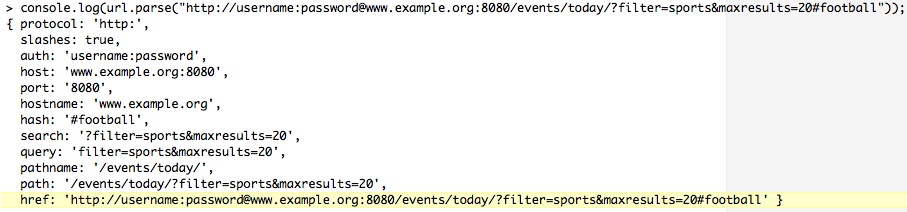
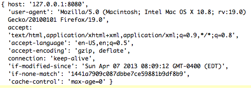

# 第三章：在节点和客户端之间流式传输数据

“壶口滴水成河。”

- 佛陀

我们现在更清楚地了解了 Node 的事件驱动、I/O 集中的设计理念如何在其各种模块 API 中体现，为开发提供了一致和可预测的环境。

在本章中，我们将发现如何使用 Node 从文件或其他来源中提取数据，然后使用 Node 进行读取、写入和操作，就像使用 Node 一样容易。最终，我们将学习如何使用 Node 开发具有快速 I/O 接口的网络服务器，支持高并发应用程序，同时在成千上万的客户端之间共享实时数据。

# 为什么使用流？

面对一个新的语言特性、设计模式或软件模块，一个新手开发者可能会开始使用它，因为它是新的和花哨的。另一方面，一个有经验的开发者可能会问，*为什么需要这个？*

文件很大，所以需要流。一些简单的例子可以证明它们的必要性。首先，假设我们想要复制一个文件。在 Node 中，一个天真的实现看起来像这样：

```js
// First attempt
console.log('Copying...');
let block = fs.readFileSync("source.bin");
console.log('Size: ' + block.length);
fs.writeFileSync("destination.bin", block);
console.log('Done.');
```

这非常简单。

调用`readFileSync()`时，Node 会将`source.bin`的内容（一个与脚本相同文件夹中的文件）复制到内存中，返回一个名为`block`的`ByteBuffer`。

一旦我们有了`block`，我们可以检查并打印出它的大小。然后，代码将`block`交给`writeFileSync`，它将内存块复制到一个新创建或覆盖的文件`destination.bin`的内容中。

这段代码假设以下事情：

+   阻塞事件循环是可以的（不是！）

+   我们可以将整个文件读入内存（我们不能！）

正如你在上一章中所记得的，Node 会一个接一个地处理事件，一次处理一个事件。良好的异步设计使得 Node 程序看起来好像同时做了各种事情，既对连接的软件系统又对人类用户来说，同时还为代码中的开发者提供了一个易于理解和抵抗错误的逻辑呈现。这一点尤为真实，尤其是与可能编写来解决相同任务的多线程代码相比。你的团队甚至可能已经转向 Node，以制作一个改进的替代品来解决这样一个经典的多线程系统。此外，良好的异步设计永远不会阻塞事件循环。

阻塞事件循环是不好的，因为 Node 无法做其他事情，而你的一个阻塞代码行正在阻塞。前面的例子，作为一个简单的脚本，从一个地方复制文件到另一个地方，可能运行得很好。它会在 Node 复制文件时阻塞用户的终端。文件可能很小，等待的时间很短。如果不是，你可以在等待时打开另一个 shell 提示符。这样，它与`cp`或`curl`等熟悉的命令并没有什么不同。

然而，从计算机的角度来看，这是相当低效的。每个文件复制不应该需要自己的操作系统进程。

此外，将之前的代码合并到一个更大的 Node 项目中可能会使整个系统不稳定。

你的服务器端 Node 应用程序可能同时让三个用户登录，同时向另外两个用户发送大文件。如果该应用程序执行之前的代码，两个下载将会停滞，三个浏览器会一直旋转。

所以，让我们一步一步地来修复这个问题：

```js
// Attempt the second
console.log('Copying...');
fs.readFile('source.bin', null, (error1, block) => {
  if (error1) {
    throw error1;
  }
  console.log('Size: ' + block.length);
  fs.writeFile('destination.bin', block, (error2) => {
    if (error2) {
      throw error2;
    }
    console.log('Done.');
  });
});
```

至少现在我们不再使用在它们标题中带有*Sync*的 Node 方法。事件循环可以再次自由呼吸。

但是：

+   大文件怎么办？（大爆炸）

+   你那里有一个相当大的金字塔（厄运）

尝试使用一个 2GB（2.0 x 2³⁰，或 2,147,483,648 字节）的源文件来运行之前的代码：

```js
RangeError: "size" argument must not be larger than 2147483647
 at Function.Buffer.allocUnsafe (buffer.js:209:3)
 at tryCreateBuffer (fs.js:530:21)
 at Object.fs.readFile (fs.js:569:14)
 ...
```

如果你在 YouTube 上以 1080p 观看视频，2GB 的流量大约可以让你看一个小时。之前的`RangeError`发生是因为`2,147,483,647`在二进制中是`1111111111111111111111111111111`，是最大的 32 位有符号二进制整数。Node 在内部使用这种类型来调整和寻址`ByteBuffer`的内容。

如果你交给我们可怜的例子会发生什么？更小，但仍然非常大的文件是不确定的。当它工作时，是因为 Node 成功地从操作系统获取了所需的内存。在复制操作期间，Node 进程的内存占用量会随着文件大小而增加。鼠标可能会变成沙漏，风扇可能会嘈杂地旋转起来。承诺会有所帮助吗？：

```js
// Attempt, part III
console.log('Copying...');
fs.readFileAsync('source.bin').then((block) => {
  console.log('Size: ' + block.length);
  return fs.writeFileAsync('destination.bin', block);
}).then(() => {
 console.log('Done.');
}).catch((e) => {
  // handle errors
});
```

不，本质上不是。我们已经扁平化了金字塔，但大小限制和内存问题仍然存在。

我们真正需要的是一些既是异步的，又是*逐步的*代码，从源文件中获取一小部分，将其传送到目标文件进行写入，并重复该循环，直到完成，就像古老的灭火队一样。


这样的设计会让事件循环在整个时间内自由呼吸。

这正是流的作用：

```js
// Streams to the rescue
console.log('Copying...');
fs.createReadStream('source.bin')
.pipe(fs.createWriteStream('destination.bin'))
.on('close', () => { console.log('Done.'); });
```

在实践中，规模化的网络应用通常分布在许多实例中，需要将数据流的处理分布到许多进程和服务器中。在这里，流文件只是一个数据流，被分成片段，每个片段可以独立查看，而不受其他片段的可用性的影响。你可以写入数据流，或者监听数据流，自由动态分配字节，忽略字节，重新路由字节。数据流可以被分块，许多进程可以共享块处理，块可以被转换和重新插入，数据流可以被精确发射和创造性地管理。

回顾我们在现代软件和模块化规则上的讨论，我们可以看到流如何促进独立的共享无事务的进程的创建，这些进程各自完成一项任务，并且组合起来可以构成一个可预测的架构，其复杂性不会妨碍对其行为的准确评估。如果数据接口是无争议的，那么数据映射可以准确建模，而不考虑数据量或路由的考虑。

在 Node 中管理 I/O 涉及管理绑定到数据流的数据事件。Node Stream 对象是`EventEmitter`的一个实例。这个抽象接口在许多 Node 模块和对象中实现，正如我们在上一章中看到的那样。让我们首先了解 Node 的 Stream 模块，然后讨论 Node 中如何通过各种流实现处理网络 I/O；特别是 HTTP 模块。

# 探索流

根据 Bjarne Stoustrup 在他的书《C++程序设计语言》（第三版）中的说法：

“为编程语言设计和实现通用的输入/输出设施是非常困难的... I/O 设施应该易于使用、方便、安全；高效、灵活；最重要的是完整。”

让人不惊讶的是，一个专注于提供高效和简单 I/O 的设计团队，通过 Node 提供了这样一个设施。通过一个对称和简单的接口，处理数据缓冲区和流事件，使实现者不必关心，Node 的 Stream 模块是管理内部模块和模块开发人员异步数据流的首选方式。

在 Node 中，流只是一系列字节。在任何时候，流都包含一个字节缓冲区，这个缓冲区的长度为零或更大：


流中的每个字符都是明确定义的，因为每种类型的数字数据都可以用字节表示，流的任何部分都可以重定向或*管道*到任何其他流，流的不同块可以发送到不同的处理程序，等等。这样，流输入和输出接口既灵活又可预测，并且可以轻松耦合。

Node 还提供了第二种类型的流：对象流。对象流不是通过流动内存块，而是通过 JavaScript 对象传输。字节流传输序列化数据，如流媒体，而对象流适用于解析的结构化数据，如 JSON 记录。

数字流可以用流体的类比来描述，其中个别字节（水滴）被推送通过管道。在 Node 中，流是表示可以异步写入和读取的数据流的对象。

Node 的哲学是非阻塞流，I/O 通过流处理，因此 Stream API 的设计自然地复制了这一一般哲学。事实上，除了以异步、事件方式与流交互外，没有其他方式——Node 通过设计阻止开发人员阻塞 I/O。

通过抽象流接口暴露了五个不同的基类：**Readable**，**Writable**，**Duplex**，**Transform**和**PassThrough**。每个基类都继承自`EventEmitter`，我们知道它是一个可以绑定事件监听器和发射器的接口。

正如我们将要学习的，并且在这里强调的，流接口是一个抽象接口。抽象接口充当一种蓝图或定义，描述了必须构建到每个构造的流对象实例中的特性。例如，可读流实现需要实现一个`public read`方法，该方法委托给接口的`internal _read`方法。

一般来说，所有流实现都应遵循以下准则：

+   只要存在要发送的数据，就向流写入，直到该操作返回`false`，此时实现应等待`drain`事件，表示缓冲的流数据已经清空。

+   继续调用读取，直到收到`null`值，此时等待可读事件再恢复读取。

+   几个 Node I/O 模块都是以流的形式实现的。网络套接字、文件读取器和写入器、`stdin`和`stdout`、zlib 等都是流。同样，当实现可读数据源或数据读取器时，应该将该接口实现为流接口。

重要的是要注意，在 Node 的历史上，Stream 接口在某些根本性方面发生了变化。Node 团队已尽最大努力实现兼容的接口，以便（大多数）旧程序可以继续正常运行而无需修改。在本章中，我们不会花时间讨论旧 API 的具体特性，而是专注于当前的设计。鼓励读者查阅 Node 的在线文档，了解迁移旧程序的信息。通常情况下，有一些模块会用方便、可靠的接口*包装*流。一个很好的例子是：[`github.com/rvagg/through2.`](https://github.com/rvagg/through2)

# 实现可读流

产生数据的流，另一个进程可能感兴趣的，通常使用`Readable`流来实现。`Readable`流保存了实现者管理读取队列、处理数据事件的发射等所有工作。

要创建一个`Readable`流，请使用以下方法：

```js
const stream = require('stream');
let readable = new stream.Readable({
  encoding: "utf8",
  highWaterMark: 16000,
  objectMode: true
});
```

如前所述，`Readable`作为一个基类暴露出来，可以通过三种选项进行初始化：

+   `encoding`：将缓冲区解码为指定的编码，默认为 UTF-8。

+   `highWaterMark`：在停止从数据源读取之前，保留在内部缓冲区中的字节数。默认为 16 KB。

+   `objectMode`：告诉流以对象流而不是字节流的方式运行，例如以 JSON 对象流而不是文件中的字节流。默认为`false`。

在下面的示例中，我们创建一个模拟的`Feed`对象，其实例将继承`Readable`流接口。我们的实现只需要实现`Readable`的抽象`_read`方法，该方法将向消费者推送数据，直到没有更多数据可以推送为止，然后通过推送`null`值来触发`Readable`流发出一个`end`事件：

```js
const stream = require('stream');

let Feed = function(channel) {
   let readable = new stream.Readable({});
   let news = [
      "Big Win!",
      "Stocks Down!",
      "Actor Sad!"
   ];
   readable._read = () => {
      if(news.length) {
         return readable.push(news.shift() + "\n");
      }
      readable.push(null);
   };
   return readable;
};
```

现在我们有了一个实现，消费者可能希望实例化流并监听流事件。两个关键事件是`readable`和`end`。

只要数据被推送到流中，`readable`事件就会被触发。它会提醒消费者通过`Readable`的`read`方法检查新数据。

再次注意，`Readable`实现必须提供一个`private _read`方法，为消费者 API 公开的`public read`方法提供服务。

当我们向`Readable`实现的`push`方法传递`null`值时，`end`事件将被触发。

在这里，我们看到一个消费者使用这些方法来显示新的流数据，并在流停止发送数据时提供通知：

```js
let feed = new Feed();

feed.on("readable", () => {
   let data = feed.read();
   data && process.stdout.write(data);
});
feed.on("end", () => console.log("No more news"));
// Big Win!
// Stocks Down!
// Actor Sad!
// No more news
```

同样，我们可以通过使用`objectMode`选项来实现对象流：

```js
const stream = require('stream');

let Feed = function(channel) {
   let readable = new stream.Readable({
      objectMode : true
   });
   let prices = [{price : 1},{price : 2}];
   readable._read = () => {
      if(prices.length) {
         return readable.push(prices.shift());
      }
      readable.push(null);
   };
   return readable;
};
```

在设置为 objectMode 后，每个推送的块都预期是一个对象。因此，该流的读取器可以假定每个`read()`事件将产生一个单独的对象：

```js
let feed = new Feed();
feed.on("readable", () => {
   let data = feed.read();
   data && console.log(data);
});
feed.on("end", () => console.log("No more news"));
// { price: 1 }
// { price: 2 }
// No more news
```

在这里，我们看到每个读取事件都接收一个对象，而不是缓冲区或字符串。

最后，`Readable`流的`read`方法可以传递一个参数，指示从流的内部缓冲区中读取的字节数。例如，如果希望逐字节读取文件，可以使用类似于以下的例程来实现消费者：

```js
let Feed = function(channel) {
   let readable = new stream.Readable({});
   let news = 'A long headline might go here';
   readable._read = () => {
      readable.push(news);
      readable.push(null);
   };
   return readable;
};
```

请注意，我们将整个新闻推送到流中，并以 null 终止。流已经准备好了整个字节字符串。现在消费者：

```js
feed.on('readable', () => {
   let character;
   while(character = feed.read(1)) {
      console.log(character.toString());
   }
});
// A
// 
// l
// o
// n
// ...
// No more bytes to read
```

在这里，应该清楚的是`Readable`流的缓冲区一次性填满了许多字节，但是却是离散地读取。

# 推送和拉取

我们已经看到`Readable`实现将使用`push`方法来填充用于读取的流缓冲区。在设计这些实现时，重要的是考虑如何管理流的两端的数据量。向流中推送更多数据可能会导致超出可用空间（内存）的复杂情况。在消费者端，重要的是要保持对终止事件的意识，以及如何处理数据流中的暂停。

我们可以将通过网络传输的数据流的行为与水流经过软管进行比较。

与水流经过软管一样，如果向读取流中推送的数据量大于消费者端通过`read`方法有效排出的数据量，就会产生大量背压，导致数据在流对象的缓冲区中开始积累。由于我们正在处理严格的数学限制，`read`方法根本无法通过更快地读取来释放这种压力——可用内存空间可能存在硬性限制，或者其他限制。因此，内存使用可能会危险地增加，缓冲区可能会溢出，等等。

因此，流实现应该意识到并响应`push`操作的响应。如果操作返回`false`，这表明实现应该停止从其源读取（并停止推送），直到下一个`_read`请求被发出。

与上述内容相结合，如果没有更多数据可以推送，但将来预期会有更多数据，实现应该`push`一个空字符串`("")`，这不会向队列中添加任何数据，但确保将来会触发一个`readable`事件。

虽然流缓冲区最常见的处理方式是向其`push`（将数据排队），但有时您可能希望将数据放在缓冲区的前面（跳过队列）。对于这些情况，Node 提供了一个`unshift`操作，其行为与`push`相同，除了在缓冲区放置数据的差异之外。

# 可写流

`Writable`流负责接受某个值（一系列字节，一个字符串）并将数据写入目标。将数据流入文件容器是一个常见的用例。

创建`Writable`流：

```js
const stream = require('stream');
let readable = new stream.Writable({
  highWaterMark: 16000,
  decodeStrings: true
});
```

`Writable`流构造函数可以用两个选项实例化：

+   `highWaterMark`：在写入时流缓冲区将接受的最大字节数。默认值为 16 KB。

+   `decodeStrings`：是否在写入之前将字符串转换为缓冲区。默认为`true`。

与`Readable`流一样，自定义的`Writable`流实现必须实现`_write`处理程序，该处理程序将接收发送给实例的`write`方法的参数。

你应该将`Writable`流视为一个数据目标，比如你正在上传的文件。在概念上，这与`Readable`流中`push`的实现类似，其中一个推送数据直到数据源耗尽，并传递`null`来终止读取。例如，在这里，我们向流写入了 32 个“A”字符，它将把它们记录下来：

```js
const stream = require('stream');

let writable = new stream.Writable({
   decodeStrings: false
});

writable._write = (chunk, encoding, callback) => {
   console.log(chunk.toString());
   callback();
};

let written = writable.write(Buffer.alloc(32, 'A'));
writable.end();

console.log(written);

// AAAAAAAAAAAAAAAAAAAAAAAAAAAAAAAA
// true
```

这里有两个关键点需要注意。

首先，我们的`_write`实现在写入回调后立即触发`callback`函数，这个回调函数始终存在，无论实例的`write`方法是否直接传递了`callback`。这个调用对于指示写入尝试的状态（失败或成功）非常重要。

其次，调用 write 返回了`true`。这表明在执行请求的写操作后，`Writable`实现的内部缓冲区已经被清空。如果我们发送了大量数据，足以超过内部缓冲区的默认大小，会怎么样呢？

修改前面的例子，以下将返回`false`：

```js
let written = writable.write(Buffer.alloc(16384, 'A'));
console.log(written); // Will be 'false'
```

`write`返回`false`的原因是它已经达到了`highWaterMark`选项的默认值 16 KB（16 * 1,024）。如果我们将这个值改为`16383`，`write`将再次返回`true`（或者可以简单地增加它的值）。

当`write`返回`false`时，你应该怎么做？你肯定不应该继续发送数据！回到我们水管的比喻：当流满时，应该等待它排空后再发送更多数据。Node 的流实现会在安全写入时发出`drain`事件。当`write`返回`false`时，在发送更多数据之前监听`drain`事件。

综合我们所学到的知识，让我们创建一个`highWaterMark`值为 10 字节的`Writable`流。然后设置一个模拟，我们将推送一个大于`highWaterMark`的数据字符串到`stdout`，然后等待缓冲区溢出并在发送更多数据之前等待`drain`事件触发：

```js
const stream = require('stream');

let writable = new stream.Writable({
   highWaterMark: 10
});

writable._write = (chunk, encoding, callback) => {
   process.stdout.write(chunk);
   callback();
};

function writeData(iterations, writer, data, encoding, cb) {
   (function write() {

      if(!iterations--) {
         return cb()
      }

      if (!writer.write(data, encoding)) {
         console.log(` <wait> highWaterMark of ${writable.writableHighWaterMark} reached`);
         writer.once('drain', write);
      }
   })()
}

writeData(4, writable, 'String longer than highWaterMark', 'utf8', () => console.log('finished'));
```

每次写入时，我们都会检查流写入操作是否返回 false，如果是，我们会在再次运行我们的`write`方法之前等待下一个`drain`事件。

你应该小心实现正确的流管理，尊重写事件发出的“警告”，并在发送更多数据之前正确等待`drain`事件的发生。

`Readable` 流中的流体数据可以很容易地重定向到 `Writable` 流。例如，以下代码将接收终端发送的任何数据（`stdin` 是一个 `Readable` 流）并将其回显到目标 `Writable` 流（`stdout`）：`process.stdin.pipe(process.stdout)`。当将 `Writable` 流传递给 `Readable` 流的 pipe 方法时，将触发 **pipe** 事件。类似地，当将 `Writable` 流从 `Readable` 流的目标中移除时，将触发 **unpipe** 事件。要移除 `pipe`，使用以下方法：`unpipe(destination stream)`

# 双工流

**双工流** 既可读又可写。例如，在 Node 中创建的 TCP 服务器公开了一个既可读又可写的套接字：

```js
const stream = require("stream");
const net = require("net");

net.createServer(socket => {
  socket.write("Go ahead and type something!");
  socket.setEncoding("utf8");
  socket.on("readable", function() {
    process.stdout.write(this.read())
  });
})
.listen(8080);
```

执行时，此代码将创建一个可以通过 Telnet 连接的 TCP 服务器：

```js
telnet 127.0.0.1 8080
```

在一个终端窗口中启动服务器，打开一个单独的终端，并通过 telnet 连接到服务器。连接后，连接的终端将打印出 `Go ahead and type something!` ——写入套接字。在连接的终端中输入任何文本（按下 **ENTER** 后）将被回显到运行 TCP 服务器的终端的 `stdout`（从套接字读取），创建一种聊天应用程序。

这种双向（双工）通信协议的实现清楚地展示了独立进程如何形成复杂和响应灵敏的应用程序的节点，无论是在网络上通信还是在单个进程范围内通信。

构造 `Duplex` 实例时发送的选项将合并发送到 `Readable` 和 `Writable` 流的选项，没有额外的参数。实际上，这种流类型简单地承担了两种角色，并且与其交互的规则遵循所使用的交互模式的规则。

`Duplex` 流假定了读和写两种角色，任何实现都需要实现 `­_write` 和 `_read` 方法，再次遵循相关流类型的标准实现细节。

# 转换流

有时需要处理流数据，通常在写入某种二进制协议或其他 *即时* 数据转换的情况下。`Transform` 流就是为此目的而设计的，它作为一个位于 `Readable` 流和 `Writable` 流之间的 `Duplex` 流。

使用与初始化典型 `Duplex` 流相同的选项初始化 `Transform` 流，`Transform` 与普通的 `Duplex` 流的不同之处在于其要求自定义实现仅提供 `_transform` 方法，而不需要 `_write` 和 `_read` 方法。

`_transform` 方法将接收三个参数，首先是发送的缓冲区，然后是一个可选的编码参数，最后是一个回调函数，`_transform` 期望在转换完成时调用。

```js
_transform = function(buffer, encoding, cb) {
  let transformation = "...";
  this.push(transformation);
  cb();
};
```

让我们想象一个程序，它可以将 **ASCII（美国信息交换标准代码）** 代码转换为 ASCII 字符，从 `stdin` 接收输入。您输入一个 ASCII 代码，程序将以对应该代码的字母数字字符作出响应。在这里，我们可以简单地将输入传输到 `Transform` 流，然后将其输出传输回 `stdout`：

```js
const stream = require('stream');
let converter = new stream.Transform();

converter._transform = function(num, encoding, cb) {
   this.push(String.fromCharCode(new Number(num)) + "\n");
   cb();
};

process.stdin.pipe(converter).pipe(process.stdout);
```

与此程序交互可能会产生类似以下的输出：

```js
65 A
66 B
256 Ā
257 ā
```

在本章结束时，将演示一个更复杂的转换流示例。

# 使用 PassThrough 流

这种流是 `Transform` 流的一个简单实现，它只是将接收到的输入字节传递到输出流。如果不需要对输入数据进行任何转换，只是想要轻松地将 `Readable` 流传输到 `Writable` 流，这是很有用的。

`PassThrough`流具有类似于 JavaScript 的匿名函数的好处，使得可以轻松地断言最小的功能而不需要太多的麻烦。例如，不需要实现一个抽象基类，就像对`Readable`流的`_read`方法所做的那样。考虑以下使用`PassThrough`流作为事件间谍的用法：

```js
const fs = require('fs');
const stream = require('stream');
const spy = new stream.PassThrough();

spy
.on('error', (err) => console.error(err))
.on('data', function(chunk) {
    console.log(`spied data -> ${chunk}`);
})
.on('end', () => console.log('\nfinished'));

fs.createReadStream('./passthrough.txt').pipe(spy).pipe(process.stdout);
```

通常，Transform 或 Duplex 流是你想要的（在这里你可以设置`_read`和`_write`的正确实现），但在某些情况下，比如测试中，可以将“观察者”放在流上是有用的。

# 创建一个 HTTP 服务器

HTTP 是建立在请求/响应模型之上的无状态数据传输协议：客户端向服务器发出请求，服务器然后返回响应。由于促进这种快速模式的网络通信是 Node 设计的出色之处，Node 作为一个用于创建服务器的工具包获得了早期广泛的关注，尽管它当然也可以用于做更多的事情。在本书中，我们将创建许多 HTTP 服务器的实现，以及其他协议服务器，并将在更深入的上下文中讨论最佳实践，这些上下文是特定的业务案例。预期你已经有一些类似的经验。出于这两个原因，我们将快速地从一般概述中进入一些更专业的用途。

在最简单的情况下，HTTP 服务器会响应连接尝试，并在数据到达和发送时进行管理。通常使用`http`模块的`createServer`方法创建一个 Node 服务器：

```js
const http = require('http');
let server = http.createServer((request, response) => {
   response.writeHead(200, { 
      'Content-Type': 'text/plain'
   });
   response.write("PONG");
   response.end();
}).listen(8080);

server.on("request", (request, response) => {
   request.setEncoding("utf8");
   request.on("readable", () => console.log(request.read()));
   request.on("end", () => console.log("DONE"));
});
```

`http.createServer`返回的对象是`http.Server`的一个实例，它扩展了`EventEmitter`，在网络事件发生时广播，比如客户端连接或请求。前面的代码是编写 Node 服务器的常见方式。然而，值得指出的是，直接实例化`http.Server`类有时是区分不同服务器/客户端交互的一种有用方式。我们将在接下来的示例中使用这种格式。

在这里，我们创建一个基本的服务器，它只是在连接建立时报告，并在连接终止时报告：

```js
const http = require('http');
const server = new http.Server();
server.on('connection', socket => {
   let now = new Date();
   console.log(`Client arrived: ${now}`);
   socket.on('end', () => console.log(`client left: ${new Date()}`));
});
// Connections get 2 seconds before being terminated
server.setTimeout(2000, socket => socket.end());
server.listen(8080);
```

在构建多用户系统时，特别是经过身份验证的多用户系统，服务器-客户端事务的这一点是客户端验证和跟踪代码的绝佳位置，包括设置或读取 cookie 和其他会话变量，或向在并发实时应用程序中共同工作的其他客户端广播客户端到达事件。

通过添加一个请求的监听器，我们可以得到更常见的请求/响应模式，作为一个`Readable`流进行处理。当客户端 POST 一些数据时，我们可以像下面这样捕获这些数据：

```js
server.on('request', (request, response) => {
   request.setEncoding('utf8');
   request.on('readable', () => {
      let data = request.read();
      data && response.end(data);
   });
});
```

尝试使用**curl**向这个服务器发送一些数据：

```js
curl http://localhost:8080 -d "Here is some data"
// Here is some data
```

通过使用连接事件，我们可以很好地将我们的连接处理代码分开，将其分组到清晰定义的功能域中，正确地描述为响应特定事件执行的功能域。在上面的示例中，我们看到了如何设置一个定时器，在两秒后启动服务器连接。

如果只是想设置在套接字被假定超时之前的不活动毫秒数，只需使用`server.timeout = (Integer)num_milliseconds`。要禁用套接字超时，请传递一个值`0`（零）。

现在让我们看看 Node 的 HTTP 模块如何用于进入更有趣的网络交互。

# 发出 HTTP 请求

网络应用程序通常需要进行外部 HTTP 调用。HTTP 服务器也经常被要求为向其发出请求的客户端执行 HTTP 服务。Node 提供了一个简单的接口来进行外部 HTTP 调用。

例如，以下代码将获取`www.example.org`的 HTML 首页：

```js
const http = require('http');
http.request({ 
   host: 'www.example.org',
   method: 'GET',
   path: "/"
}, function(response) {
   response.setEncoding("utf8");
   response.on("readable", () => console.log(response.read()));
}).end();
```

正如我们所看到的，我们正在使用一个`Readable`流，可以写入文件。

管理 HTTP 请求的一个流行的 Node 模块是 Mikeal Roger 的 request：[`github.com/request/request`](https://github.com/request/request)

因为通常使用`HTTP.request`来`GET`外部页面，Node 提供了一个快捷方式：

```js
http.get("http://www.example.org/", response => {
  console.log(`Status: ${response.statusCode}`);
}).on('error', err => {
  console.log("Error: " + err.message);
});
```

现在让我们看一些更高级的 HTTP 服务器实现，其中我们为客户端执行一般的网络服务。

# 代理和隧道

有时，为一个服务器提供作为代理或经纪人的功能对其他服务器很有用。这将允许一个服务器将负载分发给其他服务器，例如。另一个用途是为无法直接连接到该服务器的用户提供对安全服务器的访问。一个服务器为多个 URL 提供答复是很常见的——使用代理，一个服务器可以将请求转发给正确的接收者。

由于 Node 在其网络接口中具有一致的流接口，我们可以用几行代码构建一个简单的 HTTP 代理。例如，以下程序将在端口`8080`上设置一个 HTTP 服务器，该服务器将通过获取网站的首页并将该页面传送回客户端来响应任何请求：

```js
const http = require('http');
const server = new http.Server();

server.on("request", (request, socket) => {
   console.log(request.url);
   http.request({ 
      host: 'www.example.org',
      method: 'GET',
      path: "/",
      port: 80
   }, response => response.pipe(socket))
   .end();
});

server.listen(8080, () => console.log('Proxy server listening on localhost:8080'));
```

继续启动这个服务器，并连接到它。一旦这个服务器接收到客户端套接字，它就可以自由地从任何可读流中向客户端推送内容，这里，`www.example.org`的`GET`结果被流式传输。一个外部内容服务器管理应用程序的缓存层可能成为代理端点的例子。

使用类似的想法，我们可以使用 Node 的原生`CONNECT`支持创建一个隧道服务。隧道涉及使用代理服务器作为客户端的中间人与远程服务器进行通信。一旦我们的代理服务器连接到远程服务器，它就能在该服务器和客户端之间来回传递消息。当客户端和远程服务器之间无法直接建立连接或不希望建立连接时，这是有利的。

首先，我们将设置一个代理服务器来响应`HTTP` `CONNECT`请求，然后向该服务器发出`CONNECT`请求。代理接收我们客户端的`Request`对象，客户端的套接字本身，以及隧道流的头部（第一个数据包）：

```js
const http = require('http');
const net = require('net');
const url = require('url');
const proxy = new http.Server();

proxy.on('connect', (request, clientSocket, head) => {
  let reqData = url.parse(`http://${request.url}`);
  let remoteSocket = net.connect(reqData.port, reqData.hostname, () => {
    clientSocket.write('HTTP/1.1 200 \r\n\r\n');
    remoteSocket.write(head);
    remoteSocket.pipe(clientSocket);
    clientSocket.pipe(remoteSocket);
   });
}).listen(8080);

let request = http.request({
  port: 8080,
  hostname: 'localhost',
  method: 'CONNECT',
  path: 'www.example.org:80'
});
request.end();

request.on('connect', (res, socket, head) => {
  socket.setEncoding("utf8");
  socket.write('GET / HTTP/1.1\r\nHost: www.example.org:80\r\nConnection: close\r\n\r\n');
  socket.on('readable', () => {
      console.log(socket.read());
   });
  socket.on('end', () => {
    proxy.close();
  });
});
```

一旦我们向运行在端口 8080 上的本地隧道服务器发出请求，它将建立与目的地的远程套接字连接，并保持这个远程套接字和（本地）客户端套接字之间的“桥梁”。远程连接当然只看到我们的隧道服务器，这样客户端可以以某种匿名的方式连接到远程服务（这并不总是一种不正当的做法！）。

# HTTPS、TLS（SSL）和保护您的服务器

Web 应用程序的安全性近年来已成为一个重要的讨论话题。传统应用程序通常受益于主要部署基础的主要服务器和应用程序堆栈中设计成熟的安全模型。出于某种原因，Web 应用程序被允许进入客户端业务逻辑的实验世界，并由一层薄薄的帷幕保护着开放的 Web 服务。

由于 Node 经常部署为 Web 服务器，社区有责任开始确保这些服务器的安全。HTTPS 是一种安全的传输协议——本质上是通过在 SSL/TLS 协议之上叠加 HTTP 协议而形成的加密 HTTP。

# 为开发创建自签名证书

为了支持 SSL 连接，服务器将需要一个正确签名的证书。在开发过程中，简单创建一个自签名证书会更容易，这将允许您使用 Node 的 HTTPS 模块。

这些是创建开发证书所需的步骤。我们创建的证书不会展示身份，就像第三方的证书那样，但这是我们使用 HTTPS 加密所需要的。从终端：

```js
openssl genrsa -out server-key.pem 2048
 openssl req -new -key server-key.pem -out server-csr.pem
 openssl x509 -req -in server-csr.pem -signkey server-key.pem -out server-cert.pem
```

这些密钥现在可以用于开发 HTTPS 服务器。这些文件的内容只需作为选项传递给 Node 服务器即可：

```js
const https = require('https');
const fs = require('fs');
https.createServer({
  key: fs.readFileSync('server-key.pem'),
  cert: fs.readFileSync('server-cert.pem')
}, (req, res) => {
  ...
}).listen(443);
```

在开发过程中，可以从[`www.startssl.com/`](http://www.startssl.com/)获得免费的低保障 SSL 证书，这是自签名证书不理想的情况。此外，[`www.letsencrypt.org`](https://www.letsencrypt.org)已经开始了一个激动人心的倡议，为所有人提供免费证书（更安全的网络）。

# 安装真正的 SSL 证书

为了将安全应用程序从开发环境移出并放入暴露在互联网环境中，需要购买真正的证书。这些证书的价格一年比一年都在下降，应该很容易找到价格合理且安全级别足够高的证书提供商。一些提供商甚至提供免费的个人使用证书。

设置专业证书只需要更改我们之前介绍的 HTTPS 选项。不同的提供商将有不同的流程和文件名。通常，您需要从提供商那里下载或以其他方式接收`private` `.key`文件，已签名的域证书`.crt`文件，以及描述证书链的捆绑文件：

```js
let options = {
  key: fs.readFileSync("mysite.key"),
  cert: fs.readFileSync("mysite.com.crt"),
  ca: [ fs.readFileSync("gd_bundle.crt") ]
};
```

重要的是要注意，`ca`参数必须作为*数组*发送，即使证书的捆绑已经连接成一个文件。

# 请求对象

HTTP 请求和响应消息是相似的，包括以下内容：

+   状态行，对于请求来说，类似于 GET/`index.html` HTTP/1.1，对于响应来说，类似于 HTTP/1.1 200 OK

+   零个或多个头部，对于请求可能包括`Accept-Charset`: `UTF-8 或 From: user@server.com`，对于响应可能类似于`Content-Type: text/html 和 Content-Length: 1024`

+   消息正文，对于响应可能是一个 HTML 页面，对于`POST`请求可能是一些表单数据

我们已经看到了 Node 中 HTTP 服务器接口预期暴露一个请求处理程序，以及这个处理程序将被传递一些形式的请求和响应对象，每个对象都实现了可读或可写流。

我们将在本章后面更深入地讨论`POST`数据和`Header`数据的处理。在此之前，让我们先了解如何解析请求中包含的一些更直接的信息。

# URL 模块

每当向 HTTP 服务器发出请求时，请求对象将包含 URL 属性，标识目标资源。这可以通过`request.url`访问。Node 的 URL 模块用于将典型的 URL 字符串分解为其组成部分。请参考以下图示：



我们看到`url.parse`方法是如何分解字符串的，每个部分的含义应该是清楚的。也许很明显，如果`query`字段本身被解析为键/值对会更有用。这可以通过将`true`作为`parse`方法的第二个参数来实现，这将把上面给出的查询字段值更改为更有用的键/值映射：

```js
query: { filter: 'sports', maxresults: '20' }
```

这在解析 GET 请求时特别有用。`url.parse`还有一个与这两个 URL 之间的差异有关的最后一个参数：

+   `http://www.example.org`

+   `//www.example.org`

这里的第二个 URL 是 HTTP 协议的一个（相对较少知道的）设计特性的一个例子：协议相对 URL（技术上是**网络路径引用**），而不是更常见的绝对 URL。

要了解更多关于如何使用网络路径引用来平滑资源协议解析的信息，请访问：[`tools.ietf.org/html/rfc3986#section-4.2`](http://tools.ietf.org/html/rfc3986#section-4.2)。

正在讨论的问题是：`url.parse`将以斜杠开头的字符串视为路径，而不是主机。例如，`url.parse("//www.example.org")`将在主机和路径字段中设置以下值：

```js
host: null,
 path: '//www.example.org'
```

我们实际上想要的是相反的：

```js
host: 'www.example.org',
 path: null
```

为了解决这个问题，将`true`作为`url.parse`的第三个参数传递，这表明斜杠表示主机，而不是路径：

```js
url.parse("//www.example.org", null, true);
```

也有可能开发人员想要创建一个 URL，比如通过`http.request`进行请求时。所述 URL 的各个部分可能分布在各种数据结构和变量中，并且需要被组装。您可以通过将从`url.parse`返回的对象传递给`url.format`方法来实现这一点。

以下代码将创建 URL 字符串`http://www.example.org`：

```js
url.format({
  protocol: 'http:',
  host: 'www.example.org'
});
```

同样，您还可以使用`url.resolve`方法来生成 URL 字符串，以满足需要连接基本 URL 和路径的常见情况：

```js
url.resolve("http://example.org/a/b", "c/d"); //'http://example.org/a/c/d'
url.resolve("http://example.org/a/b", "/c/d"); 
//'http://example.org/c/d'
url.resolve("http://example.org", "http://google.com"); //'http://google.com/'
```

# Querystring 模块

正如我们在`URL`模块中看到的，查询字符串通常需要被解析为键/值对的映射。`Querystring`模块将分解现有的查询字符串为其部分，或者从键/值对的映射中组装查询字符串。

例如，`querystring.parse("foo=bar&bingo=bango")`将返回：

```js
{
  foo: 'bar',
  bingo: 'bango'
}
```

如果我们的查询字符串没有使用正常的`"&"`分隔符和`"="`赋值字符格式化，`Querystring`模块提供了可定制的解析。

`Querystring`的第二个参数可以是自定义的分隔符字符串，第三个参数可以是自定义的赋值字符串。例如，以下将返回与先前给出的具有自定义格式的查询字符串相同的映射：

```js
let qs = require("querystring");
console.log(qs.parse("foo:bar^bingo:bango", "^", ":"));
// { foo: 'bar', bingo: 'bango' }
```

您可以使用`Querystring.stringify`方法组成查询字符串：

```js
console.log(qs.stringify({ foo: 'bar', bingo: 'bango' }));
// foo=bar&bingo=bango
```

与解析一样，`stringify`还接受自定义的分隔符和赋值参数：

```js
console.log(qs.stringify({ foo: 'bar', bingo: 'bango' }, "^", ":"));
// foo:bar^bingo:bango
```

查询字符串通常与`GET`请求相关联，在`?`字符后面看到。正如我们之前看到的，在这些情况下，使用`url`模块自动解析这些字符串是最直接的解决方案。然而，以这种方式格式化的字符串也会在处理`POST`数据时出现，在这些情况下，`Querystring`模块是真正有用的。我们将很快讨论这种用法，但首先，关于 HTTP 头部的一些内容。

# 处理头

向 Node 服务器发出的每个 HTTP 请求可能包含有用的头信息，客户端通常希望从服务器接收类似的包信息。Node 提供了简单的接口来读取和写入头信息。我们将简要介绍这些简单的接口，澄清一些细节。最后，我们将讨论如何在 Node 中实现更高级的头使用，研究 Node 服务器可能需要适应的一些常见网络责任。

典型的请求头将如下所示：



头是简单的键/值对。请求键始终小写。在设置响应键时，可以使用任何大小写格式。

读取头很简单。通过检查`request.header`对象来读取头信息，这是头键/值对的一对一映射。要从前面的示例中获取*accept*头，只需读取`request.headers.accept`。

通过设置 HTTP 服务器的`maxHeadersCount`属性，可以限制传入头的数量。

如果希望以编程方式读取头，Node 提供了`response.getHeader`方法，接受头键作为其第一个参数。

当写入头时，请求头是简单的键/值对，我们需要更具表现力的接口。由于响应通常必须发送状态码，Node 提供了一种简单的方法来准备响应状态行和头组的一条命令：

```js
response.writeHead(200, {
  'Content-Length': 4096,
  'Content-Type': 'text/plain'
});
```

要单独设置头，可以使用`response.setHeader`，传递两个参数：头键，然后是头值。

要使用相同名称设置多个头，可以将数组传递给`response.setHeader`。

```js
response.setHeader("Set-Cookie", ["session:12345", "language=en"]);
```

有时，在*排队*后可能需要删除响应头。这可以通过使用`response.removeHeader`来实现，将要删除的头名称作为参数传递。

必须在写入响应之前写入头。在发送响应后写入头是错误的。

# 使用 cookies

HTTP 协议是无状态的。任何给定的请求都没有关于先前请求的信息。对于服务器来说，这意味着确定两个请求是否来自同一个浏览器是不可能的。为了解决这个问题，发明了 cookie。cookie 主要用于在客户端（通常是浏览器）和服务器之间共享状态，存在于浏览器中的小型文本文件。

Cookie 是不安全的。Cookie 信息在服务器和客户端之间以纯文本形式流动。中间存在任意数量的篡改点。例如，浏览器允许轻松访问它们。这是一个好主意，因为没有人希望他们的浏览器或本地机器上的信息被隐藏，超出他们的控制。

尽管如此，cookie 也被广泛用于维护状态信息，或者维护状态信息的指针，特别是在用户会话或其他身份验证方案的情况下。

假设您对 cookie 的一般功能很熟悉。在这里，我们将讨论 Node HTTP 服务器如何获取、解析和设置 cookie。我们将使用一个回显发送 cookie 值的服务器的示例。如果没有 cookie 存在，服务器将创建该 cookie，并指示客户端再次请求它。

考虑以下代码：

```js
const http = require('http');
const url = require('url');
http.createServer((request, response) => {
  let cookies = request.headers.cookie;
  if(!cookies) {
    let cookieName = "session";
    let cookieValue = "123456";
    let numberOfDays = 4;
    let expiryDate = new Date();
    expiryDate.setDate(expiryDate.getDate() + numberOfDays);

    let cookieText = `${cookieName}=${cookieValue};expires=${expiryDate.toUTCString()};`;
    response.setHeader('Set-Cookie', cookieText);
    response.writeHead(302, {'Location': '/'});
    return response.end();
  }

  cookies.split(';').forEach(cookie => {
    let m = cookie.match(/(.*?)=(.*)$/);
    cookies[m[1].trim()] = (m[2] || '').trim();
  });

  response.end(`Cookie set: ${cookies.toString()}`);
}).listen(8080);
```

首先，我们创建一个检查请求头中的 cookie 的服务器：

```js
let server = http.createServer((request, response) => {
  let cookies = request.headers.cookie;
  ...
```

请注意，cookie 存储为`request.headers`的`cookie`属性。如果该域不存在 cookie，我们将需要创建一个，给它命名为`session`，值为`123456`：

```js
if (!cookies) {
  ...
  let cookieText = `${cookieName}=${cookieValue};expires=${expiryDate.toUTCString()};`;
  response.setHeader('Set-Cookie', cookieText);
  response.writeHead(302, {
    'Location': '/'
  });
  return response.end();
}
```

如果我们第一次设置了这个 cookie，客户端被指示再次向同一服务器发出请求，使用 302 Found 重定向，指示客户端再次调用我们的服务器位置。由于现在为该域设置了一个 cookie，随后的请求将包含我们的 cookie，我们将处理它：

```js
cookies.split(';').forEach(cookie => {
 let m = cookie.match(/(.*?)=(.*)$/);
 cookies[m[1].trim()] = (m[2] || '').trim();
});
response.end(`Cookie set: ${cookies.toString()}`);
```

现在，如果你访问`localhost:8080`，你应该看到类似于这样的显示：

```js
Cookie set: AuthSession=c3Bhc3F1YWxpOjU5QzkzRjQ3OosrEJ30gDa0KcTBhRk-YGGXSZnT; io=QuzEHrr5tIZdH3LjAAAC
```

# 理解内容类型

客户端通常会传递一个请求头，指示预期的响应 MIME（多用途互联网邮件扩展）类型。客户端还会指示请求体的 MIME 类型。服务器将类似地提供有关响应体的 MIME 类型的头信息。例如，HTML 的 MIME 类型是 text/html。

正如我们所见，HTTP 响应有责任设置描述其包含的实体的头。同样，`GET`请求通常会指示资源类型，MIME 类型，它期望作为响应。这样的请求头可能看起来像这样：

```js
Accept: text/html
```

接收这样的指令的服务器有责任准备一个符合发送的 MIME 类型的实体主体，如果能够这样做，它应该返回类似的响应头：

```js
Content-Type: text/html; charset=utf-8
```

因为请求还标识了所需的特定资源（例如`/files/index.html`），服务器必须确保返回给客户端的请求资源实际上是正确的 MIME 类型。虽然看起来很明显，由扩展名`html`标识的资源实际上是 MIME 类型 text/html，但这并不确定——文件系统不会阻止将图像文件命名为`html`扩展名。解析扩展名是一种不完美的确定文件类型的方法。我们需要做更多的工作。

UNIX 的`file`程序能够确定系统文件的 MIME 类型。例如，可以通过运行以下命令来确定没有扩展名的文件（例如`resource`）的 MIME 类型：

```js
file --brief --mime resource
```

我们传递参数指示`file`输出资源的 MIME 类型，并且输出应该是简要的（只有 MIME 类型，没有其他信息）。这个命令可能返回类似于`text/plain; charset=us-ascii`的内容。在这里，我们有一个解决问题的工具。

有关文件实用程序的更多信息，请参阅：[`man7.org/linux/man-pages/man1/file.1.html`](http://man7.org/linux/man-pages/man1/file.1.html)

回想一下，Node 能够生成子进程，我们有一个解决方案来准确确定系统文件的 MIME 类型的问题。我们可以使用 Node 的`child_process`模块的 Node 命令`exec`方法来确定文件的 MIME 类型，就像这样：

```js
let exec = require('child_process').exec;
exec("file --brief --mime resource", (err, mime) => {
  console.log(mime);
});
```

这种技术在从外部位置流入的文件进行验证时也很有用。遵循“永远不要相信客户端”的原则，检查文件发布到 Node 服务器的`Content-type`头是否与本地文件系统中存在的接收文件的实际 MIME 类型匹配，这总是一个好主意。

# 处理 favicon 请求

当通过浏览器访问 URL 时，通常会注意到浏览器标签中或浏览器地址栏中有一个小图标。这个图标是一个名为`favicon.ico`的图像，它在每个请求中都会被获取。因此，一个 HTTP GET 请求通常会结合两个请求——一个用于获取 favicon，另一个用于获取请求的资源。

Node 开发人员经常对这种重复的请求感到惊讶。任何一个 HTTP 服务器的实现都必须处理 favicon 请求。为此，服务器必须检查请求类型并相应地处理它。以下示例演示了一种这样做的方法：

```js
const http = require('http');
http.createServer((request, response) => { 
  if(request.url === '/favicon.ico') {
    response.writeHead(200, {
      'Content-Type': 'image/x-icon'
    });
    return response.end();
  }
  response.writeHead(200, {
    'Content-Type': 'text/plain'
  });
  response.write('Some requested resource');
  response.end();

}).listen(8080);
```

这段代码将简单地发送一个空的图像流用于 favicon。如果有一个要发送的 favicon，你可以简单地通过响应流推送这些数据，就像我们之前讨论过的那样。

# 处理 POST 数据

在网络应用程序中使用的最常见的`REST`方法之一是 POST。根据`REST`规范，`POST`不是幂等的，与大多数其他众所周知的方法（`GET`、`PUT`、`DELETE`等）相反。这是为了指出`POST`数据的处理往往会对应用程序的状态产生重大影响，因此应该小心处理。

我们现在将讨论处理最常见类型的通过表单提交的`POST`数据。更复杂的`POST`类型——多部分上传——将在第四章中讨论，*使用 Node 访问文件系统*。

让我们创建一个服务器，该服务器将向客户端返回一个表单，并回显客户端使用该表单提交的任何数据。我们需要首先检查请求的`URL`，确定这是一个表单请求还是表单提交，在第一种情况下返回表单的`HTML`，在第二种情况下解析提交的数据：

```js
const http = require('http');
const qs = require('querystring');

http.createServer((request, response) => {
   let body = "";
   if(request.url === "/") {
      response.writeHead(200, {
         "Content-Type": "text/html"
      });
      return response.end(
         '<form action="/submit" method="post">\
         <input type="text" name="sometext">\
         <input type="submit" value="Send some text">\
         </form>'
      );
   }
}).listen(8080);
```

请注意，我们响应的表单只有一个名为`sometext`的字段。这个表单应该以`sometext=entered_text`的形式将数据 POST 到路径`/submit`。为了捕获这些数据，添加以下条件：

```js
if(request.url === "/submit") {
   request.on('readable', () => {
      let data = request.read();
      data && (body += data);
   });
   request.on('end', () => {
      let fields = qs.parse(body);
      response.end(`Thanks for sending: ${fields.sometext}`);
   });
}
```

一旦我们的`POST`流结束，我们使用`Querystring.parse`解析主体，从中得到一个键/值映射，我们可以从中取出名称为`sometext`的表单元素的值，并向客户端响应我们已经收到他们的数据。

# 使用 Node 创建和流式传输图像

经过对启动和转移数据流的主要策略的讨论，让我们通过创建一个服务来流式传输（恰当地命名为）**PNG**（**可移植网络图形**）图像来实践这个理论。然而，这不会是一个简单的文件服务器。目标是通过将在单独的进程中执行的**ImageMagick**转换操作的输出流管道传输到 HTTP 连接的响应流中来创建 PNG 数据流，其中转换器正在将 Node 运行时中存在的虚拟**DOM**（**文档对象模型**）中生成的另一个**SVG**（**可缩放矢量图形**）数据流进行转换。让我们开始吧。

这个示例的完整代码可以在你的代码包中找到。

我们的目标是使用 Node 根据客户端请求动态生成饼图。客户端将指定一些数据值，然后将生成表示该数据的 PNG。我们将使用**D3.js**库，该库提供了用于创建数据可视化的 Javascript API，以及**jsdom** NPM 包，该包允许我们在 Node 进程中创建虚拟 DOM。此外，我们将使用**ImageMagick**将**SVG（可缩放矢量图形）**表示转换为**PNG（便携式网络图形）**表示。

访问[`github.com/tmpvar/jsdom`](https://github.com/tmpvar/jsdom)了解**jsdom**的工作原理，访问[`d3js.org/`](https://d3js.org/)了解如何使用 D3 生成 SVG。

此外，我们创建的 PNG 将被写入文件。如果未来的请求将相同的查询参数传递给我们的服务，我们将能够立即传送现有的渲染结果，而无需重新生成。

饼图代表一系列百分比，其总和填满圆的总面积，以切片形式可视化。我们的服务将根据客户端发送的值绘制这样的图表。在我们的系统中，客户端需要发送总和为 1 的值，例如.5，.3，.2。因此，当服务器收到请求时，需要获取查询参数，并创建一个将来与相同查询参数映射的唯一键：

```js
let values = url.parse(request.url, true).query['values'].split(",");
let cacheKey = values.sort().join('');
```

在这里，我们看到 URL 模块正在起作用，提取我们的数据值。此外，我们通过首先对值进行排序，然后将它们连接成一个字符串来创建一个键，我们将使用它作为缓存的饼图的文件名。我们对值进行排序的原因是：通过发送.5 .3 .2 和.3 .5 .2 可以得到相同的图表。通过排序和连接，这两者都变成了文件名.2 .3 .5。

在生产应用程序中，需要做更多工作来确保查询格式正确，数学上正确等。在我们的示例中，我们假设正在发送正确的值。

# 创建、缓存和发送 PNG 表示

首先，安装 ImageMagick：[`www.imagemagick.org/script/download.php`](http://www.imagemagick.org/script/download.php)。我们将生成一个 Node 进程来与安装的二进制文件进行交互，如下所示。

在动态构建图表之前，假设已经存在一个存储在变量`svg`中的 SVG 定义，它将包含类似于这样的字符串：

```js
<svg width="200" height="200">
<g transform="translate(100,100)">
<defs>
  <radialgradient id="grad-0" gradientUnits="userSpaceOnUse" cx="0" cy="0" r="100">
  <stop offset="0" stop-color="#7db9e8"></stop>
 ...
```

要将 SVG 转换为 PNG，我们将生成一个子进程来运行 ImageMagick 转换程序，并将我们的 SVG 数据流式传输到该进程的`stdin`，该进程将输出一个 PNG。在接下来的示例中，我们将继续这个想法，将生成的 PNG 流式传输到客户端。

我们将跳过服务器样板代码 -- 只需说明服务器将在 8080 端口运行，并且将有一个客户端调用一些数据来生成图表。重要的是我们如何生成和流式传输饼图。

客户端将发送一些查询字符串参数，指示此图表的`values`（例如 4,5,8，切片的相对大小）。服务器将使用 jsdom 模块生成一个“虚拟 DOM”，其中插入了 D3 图形库，以及一些 javascript（在您的代码包中的`pie.js`），以便获取我们收到的值并使用 D3 绘制 SVG 饼图，所有这些都在服务器端虚拟 DOM 中完成。然后，我们获取生成的 SVG 代码，并使用 ImageMagick 将其转换为 PNG。为了允许缓存，我们使用缓存值形成一个字符串文件名作为 cacheKey 存储这个 PNG，并在写入时将流式传输的 PNG 返回给客户端：

```js
jsdom.env({
   ...
   html : `<!DOCTYPE html><div id="pie" style="width:${width}px;height:${height}px;"></div>`,
   scripts : ['d3.min.js','d3.layout.min.js','pie.js'], 
   done : (err, window) => {
      let svg = window.insertPie("#pie", width, height, values).innerHTML;
      let svgToPng = spawn("convert", ["svg:", "png:-"]);
      let filewriter = fs.createWriteStream(cacheKey);

      filewriter.on("open", err => {
         let streamer = new stream.Transform();
         streamer._transform = function(data, enc, cb) {
            filewriter.write(data);
            this.push(data);
            cb();
         };
         svgToPng.stdout.pipe(streamer).pipe(response);
         svgToPng.stdout.on('finish', () => response.end());

         // jsdom's domToHTML will lowercase element names
         svg = svg.replace(/radialgradient/g,'radialGradient');

         svgToPng.stdin.write(svg);
         svgToPng.stdin.end();
         window.close();
      });
   }
});    
```

回顾我们关于流的讨论，这里发生的事情应该是清楚的。我们使用 jsdom 生成一个 DOM（`window`），运行`insertPie`函数生成 SVG，然后生成两个流：一个用于写入缓存文件，一个用于 ImageMagick 进程。使用`TransformStream`（可读和可写）我们实现了其抽象的`_transform`方法，以期望从 ImageMagick 流的`stdout`输入数据，将该数据写入本地文件系统，然后重新将数据推回流中，然后将其传送到响应流。我们现在可以实现所需的流链接：

```js
svgToPng.stdout.pipe(streamer).pipe(response);
```

客户端接收到一个饼图，并且一个副本被写入到本地文件缓存中。在请求的饼图已经被渲染的情况下，它可以直接从文件系统中进行流式传输。

```js
fs.exists(cacheKey, exists => {
  response.writeHead(200, {
    'Content-Type': 'image/png'
  });
  if (exists) {
    fs.createReadStream(cacheKey).pipe(response);
    return;
  }
 ...
```

如果您启动服务器并将以下内容粘贴到浏览器中：

```js
http://localhost:8080/?values=3,3,3,3,3
```

您应该看到一个饼图显示出来：


虽然有些不自然，但希望这能展示不同进程链如何通过流连接，避免在内存中存储任何中间数据，特别是在通过高流量网络服务器传递数据时尤其有用。

# 摘要

正如我们所了解的，Node 的设计者成功地创建了一个简单、可预测且方便的解决方案，解决了在不同来源和目标之间实现高效 I/O 的挑战性设计问题，同时保持了易于管理的代码。它的抽象流接口促进了一致的可读和可写接口的实例化，以及将这个接口扩展到 HTTP 请求和响应、文件系统、子进程和其他数据通道，使得使用 Node 进行流编程成为一种愉快的体验。

现在我们已经学会了如何设置 HTTP 服务器来处理从许多同时连接的客户端接收的数据流，以及如何向这些客户端提供缓冲流的数据，我们可以开始更深入地参与使用 Node 构建企业级并发实时系统的任务。
