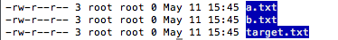
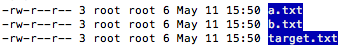
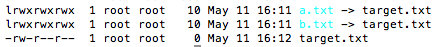
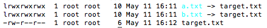
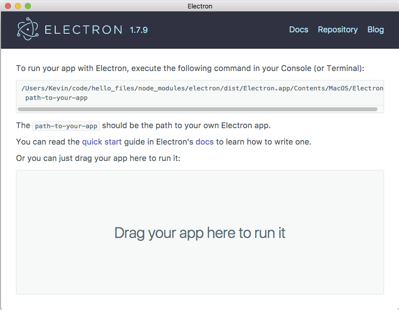
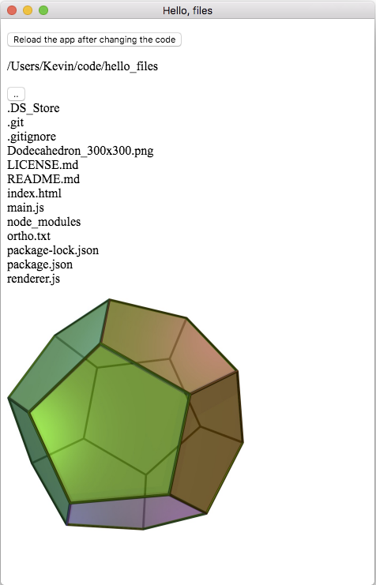

# 第四章：使用 Node 访问文件系统

"我们有持久对象——它们被称为文件。"

– Ken Thompson

文件只是一块数据，通常保存在硬盘等硬介质上。文件通常由一系列字节组成，其编码映射到其他模式，如一系列数字或电脉冲。几乎可以有无限数量的编码，其中一些常见的是文本文件、图像文件和音乐文件。文件具有固定长度，要读取它们，必须由某种阅读器解密其字符编码，例如 MP3 播放器或文字处理器。

当文件在传输中，从某个存储设备吸取后通过电缆移动时，它与通过电线运行的任何其他数据流没有区别。它以前的固态只是一个稳定的蓝图，可以轻松且无限地复制。

我们已经看到事件流如何反映了 Node 设计的核心设计原则，其中字节流应该被读取和写入，并被传送到其他流中，发出相关的流事件，如`end`。文件很容易被理解为数据的容器，其中充满了可以部分或完整提取或插入的字节。

除了它们与流的自然相似性之外，文件还显示了对象的特征。文件具有描述访问文件内容的接口的属性——具有属性和相关访问方法的数据结构。

文件系统反映了文件应该如何组织的一些概念——它们如何被识别，它们存储在哪里，如何被访问等等。UNIX 用户常用的文件系统是 UFS（Unix 文件系统），而 Windows 用户可能熟悉 NTFS（新技术文件系统）。

有趣的是，Plan 9 操作系统的设计者（包括 Ken Thompson 在内的一个团队）决定将*所有*控制接口表示为文件系统，以便所有系统接口（跨设备，跨应用程序）都被建模为文件操作。将文件视为一等公民是 UNIX 操作系统也使用的哲学；使用文件作为命名管道和套接字的引用等等，使开发人员在塑造数据流时拥有巨大的力量。

文件对象也是强大的，它们所在的系统公开了必须易于使用、一致且非常快速的基本 I/O 接口。不足为奇，Node 的`file`模块公开了这样的接口。

我们将从这两个角度考虑在 Node 中处理文件：文件数据内容如何流入和流出（读取和写入），以及如何修改文件对象的属性，如更改文件权限。

此外，我们将介绍 Node 服务器的责任，接受文件上传并处理文件请求。通过示例演示目录迭代器和文件服务器，Node 的文件系统 API 的全部范围和行为应该变得清晰。

最后，我们将使用 GitHub 的 Electron 框架将 JavaScript 带回桌面，制作我们自己的桌面应用程序，一个简单的文件浏览器。

# 目录和文件夹的迭代

通常，文件系统将文件分组成集合，通常称为目录。通过目录导航以找到单个文件。一旦找到目标文件，文件对象必须被包装成一个公开文件内容以供读取和写入的接口。

由于 Node 开发通常涉及创建既接受又发出文件数据的服务器，因此应该清楚这个活跃和重要的 I/O 层的传输速度有多重要。正如前面提到的，文件也可以被理解为对象，而对象具有某些属性。

# 文件类型

在 UNIX 系统上通常遇到的有六种类型的文件：

+   **普通文件**：这些文件包含一维字节数组，不能包含其他文件。

+   **目录**：这些也是以特殊方式实现的文件，可以描述其他文件的集合。

+   **套接字**：用于 IPC，允许进程交换数据。

+   **命名管道**：像`ps aux | grep node`这样的命令创建了一个管道，

一旦操作终止，它就会被销毁。命名管道是持久的、可寻址的，并且可以被多个进程用于 IPC。

+   **设备文件**：这些是 I/O 设备的表示，接受数据流的进程；`/dev/null`通常是字符设备文件的一个例子（接受 I/O 的串行数据流），`/dev/sda`是块设备文件的一个例子（允许数据块的随机访问 I/O），代表一个数据驱动器。

+   **链接**：这些是指向其他文件的指针，有两种类型：硬链接和符号链接。硬链接直接指向另一个文件，并且与目标文件无法区分。符号链接是间接指针，并且可以与普通文件区分开。

大多数 Node 文件系统交互只涉及前两种类型，第三种类型只是通过 Node API 间接涉及。对剩余类型的更深入解释超出了本讨论的范围。然而，Node 通过`file`模块提供了完整的文件操作套件，读者应该至少对文件类型的全部范围和功能有一定的了解。

学习命名管道将奖励那些对了解 Node 如何设计以与流和管道一起工作感兴趣的读者。在终端中尝试这个：

```js
$ mkfifo namedpipe
```

如果你得到了当前目录的扩展列表`-ls -l`，将会显示类似于这样的列表：

```js
prw-r--r-- 1 system staff 0 May 01 07:52 namedpipe
```

注意文件模式中的`p`标志（第一个段，带有破折号）。你已经创建了一个命名的`(p)ipe`。现在，输入到同一个终端中，将一些字节推送到命名管道中：

```js
echo "hello" > namedpipe
```

看起来好像进程已经挂起了。其实没有——管道，就像水管一样，必须在两端打开才能完成它们刷新内容的工作。我们已经把一些字节放进去了……现在呢？

打开另一个终端，导航到相同的目录，并输入以下内容：

```js
$ cat namedpipe.
```

`hello`将出现在第二个终端中，作为`namedpipe`的内容被刷新。请注意，第一个终端不再挂起——它已经刷新了。如果你回忆一下第三章中关于 Node 流的讨论，*在节点和客户端之间流式传输数据*，你会注意到与 Unix 管道有些相似之处，这是有意为之的。

# 文件路径

Node 提供的大多数文件系统方法都需要操作文件路径，为此，我们使用`path`模块。我们可以使用这个模块来组合、分解和关联路径。不要手动拆分你自己的路径字符串，也不要使用正则表达式和连接例程，尝试通过将路径操作委托给这个模块来规范化你的代码：

+   在处理源不可信或不可靠的文件路径字符串时，使用`path.normalize`来确保可预测的格式：

```js
const path = require('path'); 
path.normalize("../one////two/./three.html"); 
// -> ../one/two/three.html 
```

+   在构建路径段时，使用`path.join`：

```js
path.join("../", "one", "two", "three.html"); 
// -> ../one/two/three.html 
```

+   使用`path.dirname`来剪切路径中的目录名：

```js
path.dirname("../one/two/three.html"); 
// ../one/two
```

+   使用`path.basename`来操作最终的路径段：

```js
path.basename("../one/two/three.html"); 
// -> three.html 

// Remove file extension from the basename 
path.basename("../one/two/three.html", ".html"); 
// -> three 
```

+   使用`path.extname`从路径字符串的最后一个句点（`.`）开始切片到末尾：

```js
var pstring = "../one/two/three.html"; 
path.extname(pstring); 
// -> .html 
```

+   使用`path.relative`来找到从一个绝对路径到另一个绝对路径的相对路径：

```js
path.relative( 
  '/one/two/three/four',  
  '/one/two/thumb/war' 
); 
// -> ../../thumb/war 
```

+   使用`path.resolve`来将路径指令列表解析为绝对路径：

```js
path.resolve('/one/two', '/three/four'); 
// -> /three/four 
path.resolve('/one/two/three', '../', 'four', '../../five') 
// -> /one/five 
```

将传递给`path.resolve`的参数视为一系列`cd`调用：

```js
cd /one/two/three 
cd ../ 
cd four 
cd ../../five 
pwd 
// -> /one/five 
```

如果传递给`path.resolve`的参数列表未能提供绝对路径，那么当前目录名称也会被使用。例如，假设我们在`/users/home/john/`中：

```js
path.resolve('one', 'two/three', 'four'); 
// -> /users/home/john/one/two/three/four
```

这些参数解析为一个相对路径`one/two/three/four`，因此，它是以当前目录名称为前缀的。

# 文件属性

文件对象公开了一些属性，包括有关文件数据的一组有用的元数据。例如，如果使用 Node 运行 HTTP 服务器，将需要确定通过 GET 请求的任何文件的文件长度。确定文件上次修改的时间在许多类型的应用程序中都有用。

要读取文件的属性，使用`fs.stat`：

```js
fs.stat("file.txt", (err, stats) => { 
  console.log(stats); 
}); 
```

在上面的例子中，`stats`将是描述文件的`fs.Stats`对象：

```js
  dev: 2051, // id of device containing this file 
  mode: 33188, // bitmask, status of the file 
  nlink: 1, // number of hard links 
  uid: 0, // user id of file owner 
  gid: 0, // group id of file owner 
  rdev: 0, // device id (if device file) 
  blksize: 4096, // I/O block size 
  ino: 27396003, // a unique file inode number 
  size: 2000736, // size in bytes 
  blocks: 3920, // number of blocks allocated 
  atime: Fri May 3 2017 15:39:57 GMT-0500 (CDT), // last access 
  mtime: Fri May 3 2017 17:22:46 GMT-0500 (CDT), // last modified 
  ctime: Fri May 3 2017 17:22:46 GMT-0500 (CDT)  // last status change 
```

`fs.Stats`对象公开了几个有用的方法来访问文件属性数据：

+   使用`stats.isFile`来检查标准文件

+   使用`stats.isDirectory`来检查目录

+   使用`stats.isBlockDevice`来检查块设备文件

+   使用`stats.isCharacterDevice`来检查字符类型设备文件

+   在`fs.lstat`之后使用`stats.isSymbolicLink`来查找符号链接

+   使用`stats.isFIFO`来识别命名管道

+   使用`stats.isSocket`来检查套接字

还有两个可用的`stat`方法：

+   `fs.fstat(fd, callback)`: 类似于`fs.stat`，只是传递了文件描述符`fd`而不是文件路径

+   `fs.lstat(path, callback)`: 对符号链接进行`fs.stat`将返回目标文件的`fs.Stats`对象，而`fs.lstat`将返回链接文件本身的`fs.Stats`对象

以下两种方法简化了文件时间戳的操作：

+   `fs.utimes(path, atime, mtime, callback)`: 更改`path`上的文件的访问和修改时间戳。文件的访问和修改时间以 JavaScript `Date`对象的实例存储。例如，`Date.getTime`将返回自 1970 年 1 月 1 日午夜（UTC）以来经过的毫秒数。

+   `fs.futimes(fd, atime, mtime, callback)`: 更改文件描述符`fd`上的访问和修改时间戳；它类似于`fs.utimes`。

有关使用 JavaScript 操作日期和时间的更多信息，请访问：

[`developer.mozilla.org/en-US/docs/Web/JavaScript/Reference/Global_Objects/Date`](https://developer.mozilla.org/en-US/docs/Web/JavaScript/Reference/Global_Objects/Date)。

# 打开和关闭文件

Node 项目的一个非正式规则是不要不必要地从现有的操作系统实现细节中抽象出来。正如我们将看到的，文件描述符的引用出现在整个 Node 的文件 API 中。对于**POSIX**（**可移植操作系统接口**），文件描述符只是一个（非负）整数，唯一地引用特定的文件。由于 Node 的文件系统方法是基于 POSIX 建模的，因此文件描述符在 Node 中表示为整数并不奇怪。

回想一下我们讨论过的设备和操作系统的其他元素是如何表示为文件的，那么标准 I/O 流（`stdin`，`stdout`，`stderr`）也会有文件描述符是合理的。事实上，情况就是这样的：

```js
console.log(process.stdin.fd); // 0 
console.log(process.stdout.fd); // 1 
console.log(process.stderr.fd); // 2 

fs.fstat(1, (err, stat) => { 
  console.log(stat); // an fs.Stats object 
}); 
```

文件描述符易于获取，并且是传递文件引用的便捷方式。让我们看看如何通过检查如何执行低级文件打开和关闭操作来创建和使用文件描述符。随着本章的进行，我们将研究更精细的文件流接口。

# fs.open(path, flags, [mode], callback)

尝试在`path`处打开文件。`callback`将接收操作的任何异常作为其第一个参数，并将文件描述符作为其第二个参数。在这里，我们打开一个文件进行读取：

```js
fs.open("path.js", "r", (err, fileDescriptor) => { 
  console.log(fileDescriptor); // An integer, like `7` or `23` 
}); 
```

`flags`接收一个字符串，指示调用者期望在返回的文件描述符上执行的操作类型。它们的含义应该是清楚的。

+   `r`：打开文件进行读取，如果文件不存在则抛出异常。

+   `r+`：打开文件进行读取和写入，如果文件不存在则抛出异常。

+   `w`：打开文件进行写入，如果文件不存在则创建文件，并且如果文件存在则将文件截断为零字节。

+   `wx`：类似于`w`，但以独占模式打开文件，这意味着如果文件已经存在，它将**不会被打开**，打开操作将失败。如果多个进程可能同时尝试创建相同的文件，则这很有用。

+   `w+`：打开文件进行读取和写入，如果文件不存在则创建文件，并且如果文件存在则将文件截断为零字节。

+   `wx+`：类似于`wx`（和`w`），此外还打开文件进行读取。

+   `a`：打开文件进行追加，如果文件不存在则创建文件。

+   `ax`：类似于**a**，但以独占模式打开文件，这意味着如果文件已经存在，它将**不会被打开**，打开操作将失败。如果多个进程可能同时尝试创建相同的文件，则这很有用。

+   `a+`：打开文件进行读取和追加，如果文件不存在则创建文件。

+   `ax+`：类似于`ax`（和`a`），此外还打开文件进行读取。

当操作可能创建新文件时，使用可选的`mode`以八进制数字形式设置此文件的权限，默认为 0666（有关八进制权限的更多信息，请参阅`fs.chmod`）：

```js
fs.open("index.html", "w", 755, (err, fd) => { 
   fs.read(fd, ...); 
}); 
```

# fs.close(fd, callback)

`fs.close(fd, callback)` 方法关闭文件描述符。回调函数接收一个参数，即调用中抛出的任何异常。关闭所有已打开的文件描述符是一个好习惯。

# 文件操作

Node 实现了用于处理文件的标准 POSIX 函数，UNIX 用户会很熟悉。我们不会深入讨论这个庞大集合的每个成员，而是专注于一些常用的例子。特别是，我们将深入讨论打开文件描述符和操作文件数据的方法，读取和操作文件属性，以及在文件系统目录中移动。然而，鼓励读者尝试整套方法，以下列表简要描述了这些方法。请注意，所有这些方法都是异步的，非阻塞文件操作。

# fs.rename(oldName, newName, callback)

`fs.rename(oldName, newName, callback)` 方法将`oldName`处的文件重命名为`newName`。回调函数接收一个参数，即调用中抛出的任何异常。

# fs.truncate(path, len, callback)

`fs.truncate(path, len, callback)` 方法通过`len`字节更改`path`处文件的长度。如果`len`表示比文件当前长度更短的长度，则文件将被截断为该长度。如果`len`更大，则文件长度将通过附加空字节（x00）进行填充，直到达到`len`。回调函数接收一个参数，即调用中抛出的任何异常。

# fs.ftruncate(fd, len, callback)

`fs.ftruncate(fd, len, callback)` 方法类似于`fs.truncate`，不同之处在于不是指定文件，而是将文件描述符作为`fd`传递。

# fs.chown(path, uid, gid, callback)

`fs.chown(path, uid, gid, callback)` 方法更改`path`处文件的所有权。使用此方法设置用户`uid`或组`gid`是否可以访问文件。回调函数接收一个参数，即调用中抛出的任何异常。

# fs.fchown(fd, uid, gid, callback)

`fs.fchown(fd, uid, gid, callback)` 方法与`fs.chown`类似，不同之处在于不是指定文件路径，而是将文件描述符作为`fd`传递。

# fs.lchown(path, uid, gid, callback)

`fs.lchown(path, uid, gid, callback)` 方法与`fs.chown`类似，不同之处在于对于符号链接，更改的是链接文件本身的所有权，而不是引用的链接。

# fs.chmod(path, mode, callback)

`fs.chmod(path, mode, callback)` 方法更改`path`处文件的`mode`（权限）。您正在设置该文件的读取（4）、写入（2）和执行（1）位，可以以八进制数字形式发送：

|  | [r]读取 | [w]写入 | E[x]执行 | 总计 |
| --- | --- | --- | --- | --- |
| 所有者 | **4** | **2** | **1** | **7** |
| 组 | **4** | **0** | **1** | **5** |
| 其他 | **4** | **0** | **1** | **5** |
|  |  |  |  | **chmod(755)** |

您也可以使用符号表示，例如`g+rw`表示组读写，类似于我们之前在`file.open`中看到的参数。有关设置文件模式的更多信息，请参阅：[`en.wikipedia.org/wiki/Chmod`](http://en.wikipedia.org/wiki/Chmod)。

回调函数接收一个参数，在调用中抛出的任何异常。

# fs.fchmod(fd, mode, callback) ----

`fs.fchmod(fd, mode, callback)`方法类似于`fs.chmod`，不同之处在于不是指定文件路径，而是将文件描述符作为`fd`传递。

# fs.lchmod(path, mode, callback)

`fs.lchmod(path, mode, callback)`方法类似于`fs.chmod`，不同之处在于对于符号链接，只会更改链接文件本身的权限，而不会更改引用链接的权限。

# fs.link(srcPath, dstPath, callback)

`fs.link(srcPath, dstPath, callback)`在`srcPath`和`dstPath`之间创建一个硬链接。这是创建指向完全相同文件的许多不同路径的一种方法。例如，以下目录包含一个`target.txt`文件和两个硬链接—`a.txt`和`b.txt`—它们各自指向这个文件：



请注意，`target.txt`是空的。如果更改目标文件的内容，链接文件的长度也将更改。考虑更改目标文件的内容：

```js
echo "hello" >> target.txt  
```

这导致了这种新的目录结构，清楚地展示了硬引用：



回调函数接收一个参数，在调用中抛出的任何异常。

# fs.symlink(srcPath, dstPath, [type], callback)

`fs.symlink(srcPath, dstPath, [type], callback)`方法在`srcPath`和`dstPath`之间创建一个符号链接。与使用`fs.link`创建的硬链接不同，符号链接只是指向其他文件的指针，并且本身不会对目标文件的更改做出响应。默认的链接`type`是文件。其他选项是目录和 junction，最后一个是 Windows 特定类型，在其他系统上被忽略。回调函数接收一个参数，在调用中抛出的任何异常。

将我们在`fs.link`讨论中描述的目录更改与以下内容进行比较：



与硬链接不同，当它们的目标文件（在本例中为`target.txt`）更改长度时，符号链接的长度不会改变。在这里，我们看到将目标长度从零字节更改为六字节对任何绑定的符号链接的长度没有影响：



# fs.readlink(path, callback)

给定`path`处的符号链接返回目标文件的文件名：

```js
fs.readlink('a.txt', (err, targetFName) => { 
  console.log(targetFName); // target.txt 
}); 
```

# fs.realpath(path, [cache], callback)

`fs.realpath(path, [cache], callback)`方法尝试找到`path`处文件的真实路径。这是查找文件的绝对路径，解析符号链接，甚至清理多余的斜杠和其他格式不正确的路径的有用方法。考虑这个例子：

```js
fs.realpath('file.txt', (err, resolvedPath) => { 
  console.log(resolvedPath); // `/real/path/to/file.txt` 
}); 
```

或者，考虑这个：

```js
fs.realpath('.////./file.txt', (err, resolvedPath) => { 
  // still `/real/path/to/file.txt` 
}); 
```

如果要解析的一些路径段已知，可以传递一个映射路径的`cache`：

```js
let cache = {'/etc':'/private/etc'}; 
fs.realpath('/etc/passwd', cache, (err, resolvedPath) => { 
  console.log(resolvedPath); // `/private/etc/passwd` 
});
```

# fs.unlink(path, callback)

`fs.unlink(path, callback)`方法删除`path`处的文件，相当于删除文件。回调函数接收一个参数，在调用中抛出的任何异常。

# fs.rmdir(path, callback)

`fs.rmdir(path, callback)`方法删除`path`处的目录，相当于删除目录。

请注意，如果目录不为空，这将抛出异常。回调函数接收一个参数，在调用中抛出的任何异常。

# fs.mkdir(path, [mode], callback)

`fs.mkdir(path, [mode], callback)`方法在`path`处创建一个目录。要设置新目录的模式，请使用`fs.chmod`中描述的权限位图。

请注意，如果此目录已经存在，将抛出异常。回调函数接收一个参数，在调用中抛出的任何异常。

# fs.exists(path, callback)

`fs.exists(path, callback)`方法检查`path`处是否存在文件。回调将接收一个布尔值 true 或 false。

# fs.fsync(fd, callback)

在发出写入文件的某些数据的请求和该数据完全存在于存储设备上之间的瞬间，候选数据存在于核心系统缓冲区中。这种延迟通常不相关，但在一些极端情况下，例如系统崩溃，有必要坚持文件反映稳定存储设备上已知状态。

`fs.fsync`将由文件描述符`fd`引用的文件的所有核心数据复制到磁盘

（或其他存储设备）。回调函数接收一个参数，即调用中抛出的任何异常。

# 同步性

方便的是，Node 的`file`模块为我们介绍的每个异步方法提供了同步对应方法，以`Sync`为后缀表示。例如，`fs.mkdir`的同步版本是`fs.mkdirSync`。

同步调用还能够直接返回其结果，无需回调。在第三章中演示了在 HTTPS 服务器中创建流数据跨节点和客户端的过程中，我们既看到了同步代码的一个很好的用例，也看到了直接分配结果而无需回调的示例：

```js
key: fs.readFileSync('server-key.pem'), 
cert: fs.readFileSync('server-cert.pem') 
```

嘿！Node 不是严格执行异步编程吗？阻塞代码不总是错误的吗？鼓励所有开发人员遵循非阻塞设计，并鼓励避免同步编码——如果面临一个同步操作似乎是唯一的解决方案的问题，那么很可能是问题被误解了。然而，确实存在一些需要在执行进一步指令之前完全存在于内存中的文件对象的边缘情况（阻塞操作）。如果这是唯一可能的解决方案（这可能并不是！），Node 给开发人员提供了打破异步传统的权力。

开发人员经常使用的一个同步操作（也许是在不知不觉中）是`require`指令：

```js
require('fs') 
```

在`require`所指向的依赖项完全初始化之前，后续的 JavaScript 指令将不会执行（文件加载会阻塞事件循环）。*Ryan Dahl*在 2013 年 7 月的 Google Tech Talk 上提到，他在引入同步操作（特别是文件操作）到 Node 中遇到了困难：

根据[`www.youtube.com/watch?v=F6k8lTrAE2g`](http://www.youtube.com/watch?v=F6k8lTrAE2g)，

“我认为这是一个可以接受的妥协。几个月来，放弃异步模块系统的纯度让我感到痛苦。但是，我认为这样做是可以的。

……

能够只需插入“require, require, require”而无需执行 onload 回调，这样简化了代码很多……我认为这是一个相对可以接受的妥协。[...]你的程序实际上有两个部分：加载和启动阶段……你并不真的关心它运行得有多快……你将加载模块和其他东西……你的守护进程的设置阶段通常是同步的。当你进入用于处理请求的事件循环时，你需要非常小心。[...]我会给人们同步文件 I/O。如果他们在服务器上这样做……那不会太糟糕，对吧？重要的是永远不要让他们进行同步网络 I/O。”

同步代码的优势在于极其可预测，因为在完成此指令之前不会发生其他任何事情。当启动服务器时，这种情况很少发生，Dahl 建议一点确定性和简单性可以走得更远。例如，服务器初始化时加载配置文件可能是有意义的。

有时，在 Node 开发中使用同步命令的愿望只是在请求帮助；开发人员被深度嵌套的回调结构所压倒。如果曾经面对这种痛苦，请尝试一些在第二章中提到的回调控制库，*理解异步事件驱动编程*。

# 浏览目录

让我们应用我们所学到的知识，创建一个目录迭代器。这个项目的目标是创建一个函数，该函数将接受一个目录路径，并返回一个反映文件目录层次结构的 JSON 对象，其节点由文件对象组成。我们还将使我们的目录遍历器成为一个更强大的基于事件的解析器，与 Node 哲学一致。

要移动到嵌套目录中，必须首先能够读取单个目录。Node 的文件系统库提供了`fs.readdir`命令来实现这一目的：

```js
fs.readdir('.', (err, files) => { 
  console.log(files); // list of all files in current directory 
}); 
```

记住一切都是文件，我们需要做的不仅仅是获取目录列表；我们必须确定文件列表中每个成员的类型。通过添加`fs.stat`，我们已经完成了大部分逻辑：

```js
(dir => { 
  fs.readdir(dir, (err, list) => { 
    list.forEach(file => { 
      fs.stat(path.join(dir, file), (err, stat) => { 
        if (stat.isDirectory()) { 
          return console.log(`Found directory: ${file}`); 
        }
        console.log(`Found file: ${file}`); 
      }); 
    }); 
  }); 
})("."); 
```

这个自执行函数接收一个目录路径参数`(".")`，将该目录列表折叠成一个文件名数组，为其中的每个文件获取一个`fs.Stats`对象，并根据指示的文件类型（目录或非目录）做出决定下一步该做什么。在这一点上，我们也已经映射了一个单个目录。

我们现在必须映射目录中的目录，将结果存储在反映嵌套文件系统树的 JSON 对象中，树上的每个叶子都是一个文件对象。递归地将我们的目录读取器函数路径传递给子目录，并将返回的结果附加为最终对象的分支是下一步：

```js
let walk = (dir, done) => { 
  let results = {}; 
  fs.readdir(dir, (err, list) => { 
    let pending = list.length;    
    if (err || !pending) { 
      return done(err, results); 
    } 
    list.forEach(file => { 
      let dfile = require('path').join(dir, file); 
      fs.stat(dfile, (err, stat) => { 
        if(stat.isDirectory()) { 
          return walk(dfile, (err, res) => { 
            results[file] = res; 
            !--pending && done(null, results); 
          }); 
        }  
        results[file] = stat; 
        !--pending && done(null, results); 
      }); 
    }); 
  }); 
}; 
walk(".", (err, res) => { 
  console.log(require('util').inspect(res, {depth: null})); 
});
```

我们创建一个`walk`方法，该方法接收一个目录路径和一个回调函数，该回调函数在`walk`完成时接收目录图或错误，遵循 Node 的风格。创建一个非常快速的、非阻塞的文件树遍历器，包括文件统计信息，不需要太多的代码。

现在，让我们在遇到目录或文件时发布事件，使任何未来的实现都能够灵活地构建自己的文件系统表示。为此，我们将使用友好的`EventEmitter`对象：

```js
let walk = (dir, done, emitter) => { 
  ... 
  emitter = emitter || new (require('events').EventEmitter); 
  ... 
  if (stat.isDirectory()) { 
    emitter.emit('directory', dfile, stat); 
    return walk(dfile, (err, res) => { 
      results[file] = res; 
      !--pending && done(null, results); 
    }, emitter); 
  }  
  emitter.emit('file', dfile, stat); 
  results[file] = stat; 
  ... 
  return emitter; 
} 
walk("/usr/local", (err, res) => { 
  ... 
}).on("directory", (path, stat) => { 
  console.log(`Directory: ${path} - ${stat.size}`); 
}).on("file", (path, stat) => { 
  console.log(`File: ${path} - ${stat.size}`); 
}); 
// File: index.html - 1024 
// File: readme.txt - 2048 
// Directory: images - 106 
// File images/logo.png - 4096 
// ... 
```

现在我们知道如何发现和处理文件，我们可以开始从中读取和写入。

# 从文件中读取

在我们讨论文件描述符时，我们提到了一种打开文件、获取文件描述符并最终通过该引用推送或拉取数据的方法。读取文件是一个常见的操作。有时，精确管理读取缓冲区可能是必要的，Node 允许逐字节控制。在其他情况下，人们只是想要一个简单易用的无花俏流。

# 逐字节读取

`fs.read`方法是 Node 提供的读取文件的最低级别的方法。

# fs.read(fd, buffer, offset, length, position, callback)

文件由有序字节组成，这些字节可以通过它们相对于文件开头的`position`进行寻址（位置零[0]）。一旦我们有

文件描述符`fd`，我们可以开始读取`length`字节数，并将其插入到`Buffer`对象`buffer`中，插入从给定的缓冲区`offset`开始。例如，要将从可读文件`fd`的位置 309 开始的 8,366 字节复制到

一个从`offset`为 100 开始的`buffer`，我们将使用`fs.read(fd, buffer, 100, 8366, 309, callback)`。

以下代码演示了如何以 512 字节块打开和读取文件：

```js
fs.open('path.js', 'r', (err, fd) => { 
  fs.fstat(fd, (err, stats) => { 
    let totalBytes = stats.size; 
    let buffer = Buffer.alloc(totalBytes); 
    let bytesRead = 0; 
    // Each call to read should ensure that chunk size is 
    // within proper size ranges (not too small; not too large). 
    let read = chunkSize => { 
      fs.read(fd, buffer, bytesRead, chunkSize, bytesRead, (err, numBytes, bufRef) => { 
        if((bytesRead += numBytes) < totalBytes) { 
          return read(Math.min(512, totalBytes - bytesRead)); 
        } 
        fs.close(fd); 
        console.log(`File read complete. Total bytes read: ${totalBytes}`); 
        // Note that the callback receives a reference to the 
        // accumulating buffer  
        console.log(bufRef.toString()); 
      }); 
    } 
    read(Math.min(512, totalBytes)); 
  }); 
}); 
```

生成的缓冲区可以被传送到其他地方（包括服务器响应对象）。也可以使用 Node 的`Buffer`对象的方法进行操作，例如使用`buffer.toString("utf8")`将其转换为 UTF8 字符串。

# 一次获取整个文件

通常，我们只需要获取整个文件，而不需要任何仪式或精细控制。Node 提供了一个快捷方法来实现这一点。

# fs.readFile(path, [options], callback)

获取`path`文件中包含的数据可以在一步中完成：

```js
fs.readFile('/etc/passwd', (err, fileData) => { 
  if(err) { 
    throw err; 
  } 
  console.log(fileData); 
  // <Buffer 48 65 6C 6C 6F ... > 
}); 
```

我们看到`callback`接收一个缓冲区。可能更希望以常见编码（如 UTF8）接收文件数据。我们可以使用`options`对象指定返回数据的编码以及读取模式，该对象有两个可能的属性：

+   **encoding**：一个字符串，如`utf8`，默认为 null（无编码）

+   **flag**：文件模式作为字符串，默认为`r`

修改上一个例子：

```js
fs.readFile('/etc/passwd', (err, { encoding : "utf8" }, fileData) => { 
  ... 
  console.log(fileData); 
  // "Hello ..." 
});
```

# 创建可读流

虽然`fs.readFile`是一种完成常见任务的简单方法，但它有一个重大缺点，即在将文件的任何部分发送到回调之前，需要将整个文件读入内存。对于大文件或未知大小的文件，这不是一个好的解决方案。

在上一章中，我们学习了数据流和`Stream`对象。虽然文件可以很容易和自然地使用可读流处理，但 Node 提供了一个专用的文件流接口，提供了一种紧凑的文件流功能，无需额外的构造工作，比`fs.readFile`提供的更灵活。

# fs.createReadStream(path, [options])

`fs.createReadStream(path, [options])`方法返回`path`文件的可读流对象。然后，您可以对返回的对象执行流操作，例如`pipe()`。

以下选项可用：

+   `flags`：文件模式参数作为字符串。默认为`r`。

+   `encoding`：`utf8`、`ascii`或`base64`之一。默认为无编码。

+   `fd`：可以将`path`设置为 null，而不是传递文件描述符。

+   `mode`：文件模式的八进制表示，默认为 0666。

+   `bufferSize`：内部读取流的块大小，以字节为单位。默认为 64 * 1024 字节。您可以将其设置为任何数字，但内存分配严格受主机操作系统控制，可能会忽略请求。参考：[`groups.google.com/forum/?fromgroups#!topic/nodejs/p5FuU1oxbeY`](https://groups.google.com/forum/?fromgroups#!topic/nodejs/p5FuU1oxbeY)。

+   `autoClose`：是否自动关闭文件描述符（类似于`fs.close`）。默认为 true。如果您正在跨多个流共享文件描述符，则可能希望将其设置为 false 并手动关闭，因为关闭描述符将中断任何其他读取器。

+   `start`：从这个位置开始阅读。默认为 0。

+   `end`：在这个位置停止阅读。默认为文件字节长度。

# 逐行读取文件

逐字节读取文件流对于任何文件解析工作都足够了，但特别是文本文件通常更适合逐行读取，例如读取日志文件时。更准确地说，可以将任何流理解为由换行字符分隔的数据块，通常在 UNIX 系统上是`rn`。Node 提供了一个本地模块，其方法简化了对数据流中的换行分隔块的访问。

# Readline 模块

`Readline`模块有一个简单但强大的目标，即使得逐行读取数据流更容易。其接口的大部分设计是为了使命令行提示更容易，以便更容易设计接受用户输入的接口。

记住 Node 是为 I/O 设计的，I/O 操作通常涉及在可读和可写流之间移动数据，并且`stdout`和`stdin`是与`fs.createReadStream`和`fs.createWriteStream`返回的文件流相同的流接口，我们将看看如何使用这个模块类似地提示文件流以获取一行文本。

要开始使用`Readline`模块，必须创建一个定义输入流和输出流的接口。默认接口选项优先使用作为终端接口。我们感兴趣的选项如下：

+   `input`：必需。正在监听的可读流。

+   `output`：必需。正在写入的可写流。

+   `terminal`：如果输入和输出流都应该像 Unix 终端或**电传打字机**（**TTY**）一样对待，则设置为 true。对于文件，您将其设置为 false。

通过这个系统，读取文件的行变得非常简单。例如，假设有一个列出英语常用单词的字典文件，一个人可能希望将列表读入数组进行处理：

```js
const fs = require('fs'); 
const readline = require('readline'); 

let rl = readline.createInterface({ 
  input: fs.createReadStream("dictionary.txt"), 
  terminal: false 
}); 
let arr = []; 
rl.on("line", ln => { 
  arr.push(ln.trim()) 
}); 
// aardvark 
// abacus 
// abaisance 
// ...  
```

请注意，我们禁用了 TTY 行为，自己处理行而不是重定向到输出流。

正如预期的那样，与 Node I/O 模块一样，我们正在处理流事件。可能感兴趣的事件监听器如下所列：

+   `line`：接收最近读取的行，作为字符串

+   `pause`：每当流被暂停时调用

+   `resume`：每当流恢复时调用

+   `close`：每当流关闭时调用

除了`line`之外，这些事件名称反映了`Readline`方法，使用`Readline.pause`暂停流，使用`Readline.resume`恢复流，使用`Readline.close`关闭流。

# 写入文件

与读取文件一样，Node 提供了丰富的工具集来写入文件。我们将看到 Node 如何使得将文件内容按字节进行定位变得如此简单，就像将连续的数据流导入单个可写文件一样。

# 逐字节写入

`fs.write`方法是 Node 提供的写入文件的最低级别方法。该方法使我们可以精确控制字节将被写入文件的位置。

# fs.write(fd, buffer, offset, length, position, callback)

要将`buffer`中位置 309 和 8,675 之间的字节集合（长度为 8,366）插入到由文件描述符`fd`引用的文件中，从位置 100 开始：

```js
let buffer = Buffer.alloc(8675); 
fs.open("index.html", "w", (err, fd) => { 
  fs.write(fd, buffer, 309, 8366, 100, (err, writtenBytes, buffer) => { 
    console.log(`Wrote ${writtenBytes} bytes to file`); 
    // Wrote 8366 bytes to file 
  }); 
}); 
```

请注意，对于以追加（`a`）模式打开的文件，一些操作系统可能会忽略`position`值，始终将数据添加到文件的末尾。此外，在不等待回调的情况下多次调用`fs.write`对同一文件是不安全的。在这种情况下，请使用`fs.createWriteStream`。

有了这样精确的控制，我们可以智能地构造文件。在下面（有点牵强的）例子中，我们创建了一个基于文件的数据库，其中包含了一个单一团队 6 个月的棒球比分的索引信息。我们希望能够快速查找这个团队在某一天是赢了还是输了（或者没有比赛）。

由于一个月最多有 31 天，我们可以（随机地）在这个文件中创建一个 6 x 31 的数据网格，将三个值中的一个放在每个网格单元中：L（输）、W（赢）、N（未比赛）。为了好玩，我们还为我们的数据库创建了一个简单的**CLI**（**命令行界面**）和一个基本的查询语言。这个例子应该清楚地说明了`fs.read`、`fs.write`和`Buffer`对象是如何精确地操作文件中的字节的：

```js
const fs = require('fs'); 
const readline = require('readline'); 
let cells  = 186; // 6 x 31 
let buffer = Buffer.alloc(cells); 
let rand;
while(cells--) { 
  //  0, 1 or greater 
  rand = Math.floor(Math.random() * 3); 
  //  78 = "N", 87 = "W", 76 = "L" 
  buffer[cells] = rand === 0 ? 78 : rand === 1 ? 87 : 76; 
} 
fs.open("scores.txt", "r+", (err, fd) => { 
  fs.write(fd, buffer, 0, buffer.length, 0, (err, writtenBytes, buffer) => {          
    let rl = readline.createInterface({ 
      input: process.stdin, 
      output: process.stdout 
    }); 

    let quest = () => { 
      rl.question("month/day:", index => { 
        if(!index) { 
          return rl.close(); 
        } 
        let md = index.split('/'); 
        let pos = parseInt(md[0] -1) * 31 + parseInt(md[1] -1); 
        fs.read(fd, Buffer.alloc(1), 0, 1, pos, (err, br, buff) => { 
          let v = buff.toString(); 
          console.log(v === "W" ? "Win!" : v === "L" ? "Loss..." : "No game"); 
          quest(); 
        }); 
      }); 
    }; 
    quest(); 
  }); 
}); 
```

一旦运行，我们只需输入一个月/日对，就可以快速访问该数据单元。为输入值添加边界检查将是一个简单的改进。将文件流通过可视化 UI 可能是一个不错的练习。

# 写入大块数据

对于简单的写操作，`fs.write`可能过于复杂。有时，所需的只是一种创建具有一些内容的新文件的方法。同样常见的是需要将数据追加到文件的末尾，就像在日志系统中所做的那样。`fs.writeFile`和`fs.appendFile`方法可以帮助我们处理这些情况。

# fs.writeFile(path, data, [options], callback)

`fs.writeFile(path, data, [options], callback)`方法将`data`的内容写入到`path`处的文件中。data 参数可以是一个缓冲区或字符串。 

一个字符串。以下选项可用：

+   `编码`：默认为`utf8`。如果数据是一个缓冲区，则忽略此选项。

+   `mode`：文件模式的八进制表示，默认为 0666。

+   `flag`：写入标志，默认为`w`。

使用方法很简单：

```js
fs.writeFile('test.txt', 'A string or Buffer of data', err => { 
  if (err) { 
    return console.log(err); 
  } 
  // File has been written 
}); 
```

# fs.appendFile(path, data, [options], callback)

类似于`fs.writeFile`，不同之处在于`data`被追加到`path`文件的末尾。此外，`flag`选项默认为`a`。

# 创建可写流

如果要写入文件的数据以块的形式到达（例如文件上传时发生的情况），通过`WritableStream`对象接口将数据流式传输提供了更灵活和高效的方式。

# fs.createWriteStream(path, [options])

`fs.createWriteStream(path, [options])`方法返回`path`文件的可写流对象。

以下选项可用：

+   `flags`：文件模式参数作为字符串。默认为`w`。

+   `encoding`：`utf8`、`ascii`或`base64`中的一个。默认为无编码。

+   `mode`：文件模式的八进制表示，默认为 0666。

+   `start`：表示写入应该开始的文件中的位置的偏移量。

例如，这个小程序作为世界上最简单的文字处理器，将所有终端输入写入文件，直到终端关闭：

```js
let writer = fs.createWriteStream("novel.txt", 'w'); 
process.stdin.pipe(writer);
```

# 注意事项

打开文件描述符并从中读取的副作用很小，因此在正常开发中，很少会考虑实际发生了什么。通常情况下，读取文件不会改变它。

在写入文件时，必须解决许多问题，例如：

+   是否有足够的可写存储空间？

+   是否有另一个进程同时访问该文件，甚至擦除它？

+   如果写入操作失败或在流中途被非自然地终止，必须采取什么措施？

我们已经看到了独占写模式标志（`wx`），它可以在多个写入进程同时尝试创建文件的情况下提供帮助。一般来说，对文件进行写入时可能会面临的所有问题的完整解决方案都很难得出，或者简要陈述。Node 鼓励异步编程。然而，特别是在文件系统方面，有时需要同步、确定性的编程。鼓励您牢记这些和其他问题，并尽可能保持 I/O 非阻塞。

# 提供静态文件

任何使用 Node 创建 Web 服务器的人都需要对 HTTP 请求做出智能响应。对于 Web 服务器的资源的 HTTP 请求期望得到某种响应。一个基本的静态文件服务器可能看起来像这样：

```js
http.createServer((request, response) => { 
  if(request.method !== "GET") { 
    return response.end("Simple File Server only does GET"); 
  } 
  fs 
  .createReadStream(__dirname + request.url) 
  .pipe(response); 
}).listen(8000); 
```

该服务器在端口`8000`上服务 GET 请求，期望在相对路径等于 URL 路径段的本地文件中找到。我们看到 Node 是如何简单地让我们流式传输本地文件数据的，只需将`ReadableStream`传输到代表客户端套接字连接的`WritableStream`中。这是在几行代码中安全实现大量功能。

最终，将会添加更多内容，例如处理标准 HTTP 方法的例程，处理错误和格式不正确的请求，设置适当的标头，管理网站图标请求等等。

让我们使用 Node 构建一个相当有用的文件服务器，它将通过流式传输资源来响应 HTTP 请求，并且将遵守缓存请求。在这个过程中，我们将涉及如何管理内容重定向。在本章的后面，我们还将看到如何实现文件上传。请注意，一个完全符合 HTTP 所有特性的 Web 服务器是一个复杂的东西，因此我们正在创建的应该被视为一个良好的开始，而不是终点。

# 重定向请求

有时，客户端会尝试`GET`一个 URL，但该 URL 不正确或不完整，资源可能已经移动，或者有更好的方法来发出相同的请求。其他时候，`POST`可能会在客户端无法知道的新位置创建一个新资源，需要一些响应头信息指向新创建的 URI。让我们看看使用 Node 实现静态文件服务器时可能会遇到的两种常见重定向场景。

重定向基本上需要两个响应头：

+   `Location`：这表示重定向到可以找到内容主体的位置

+   `Content-Location`：这意味着指示请求者将在响应主体中找到实体的原始位置的 URL

此外，这些头还有两个特定的用例：

+   提供有关新创建资源位置的信息

对`POST`的响应

+   通知客户端请求资源的替代位置

对`GET`的响应

`Location`和`Content-Location`头与 HTTP 状态代码有许多可能的配对，特别是**3xx**（重定向）集。实际上，这些头甚至可以在同一个响应中一起出现。鼓励用户阅读 HTTP/1.1 规范的相关部分，因为这里只讨论了一小部分常见情况。

# 位置

使用`201`状态代码响应`POST`表示已创建新资源并将其 URI 分配给`Location`头，客户端可以在将来使用该 URI。请注意，由客户端决定是否以及何时获取此资源。因此，严格来说，这不是重定向。

例如，系统可能通过将新用户信息发布到服务器来创建新帐户，期望接收新用户页面的位置：

```js
    POST /path/addUser HTTP/1.1
    Content-Type: application/x-www-form-urlencoded
    name=John&group=friends 
    ...
    Status: 201 
    Location: http://website.com/users/john.html  
```

同样，在接受但尚未完成的情况下，服务器将指示`202`状态。在前面的例子中，如果创建新用户记录的工作已被委托给工作队列，那么这将是情况。

我们将在本章后面看到一个实际的实现，演示这种用法，当我们讨论文件上传时。

# Content-Location

当对具有多个表示形式的资源进行`GET`请求，并且这些表示形式可以在不同的资源位置找到时，应该返回特定实体的`content-location`头。例如，内容格式协商是`Content-Location`处理的一个很好的例子。可能有兴趣检索给定月份的所有博客文章，可能可以在 URL 上找到，比如：`http://example.com/september/`。带有`application/json`的`Accept`头的 GET 请求将以 JSON 格式接收响应。对 XML 的请求将接收该表示形式。

如果正在使用缓存机制，这些资源可能具有替代的永久位置，比如`http://example.com/cache/september.json`或`http://example.com/cache/september.xml`。将通过`Content-Location`发送此附加位置信息，响应对象类似于这样：

```js
    Status: 200 
    Content-Type: application/json
    Content-Location: http://blogs.com/cache/allArticles.json
    ... JSON entity body  
```

在请求的 URL 已经被永久或临时移动的情况下，可以使用`3xx`状态代码组和`Content-Location`来指示此状态。例如，要重定向到已永久移动的 URL，应发送 301 代码：

```js
function requestHandler(request,response) { 
  let newPath = "/thedroids.html"; 
  response.writeHead(301, { 
    'Content-Location': newPath 
  }); 
  response.end(); 
} 
```

# 实施资源缓存

作为一个一般规则，永远不要浪费资源向客户端传递无关的信息。对于 HTTP 服务器，重新发送客户端已经拥有的文件是不必要的 I/O 成本，这是实现 Node 服务器的错误方式，会增加延迟以及支付被挪用的带宽的财务损失。

浏览器维护已经获取的文件的缓存，并且**实体标签**（**ETag**）标识这些文件。ETag 是服务器发送的响应头，用于唯一标识它们返回的实体，比如一个文件。当服务器上的文件发生变化时，该服务器将为该文件发送一个不同的 ETag，允许客户端跟踪文件的更改。

当客户端向服务器请求其缓存中包含的资源时，该请求将包含一个`If-None-Match`头，该头设置为与所述缓存资源相关联的 ETag 的值。`If-None-Match`头可以包含一个或多个 ETag：

```js
If-None-Match : "686897696a7c876b7e" 
If-None-Match : "686897696a7c876b7e", "923892329b4c796e2e"
```

服务器理解这个头部，并且只有在发送的 ETags 中没有一个与当前资源实体标记匹配时，才会返回所请求资源的完整实体主体。如果发送的 ETags 中有一个与当前实体标记匹配，服务器将以 304（未修改）状态进行响应，这应该导致浏览器从其内部缓存中获取资源。

假设我们有一个`fs.Stats`对象可用，使用 Node 可以轻松地管理资源的缓存控制：

```js
let etag = crypto.createHash('md5').update(stat.size + stat.mtime).digest('hex'); 
if(request.headers['if-none-match'] === etag) { 
  response.statusCode = 304; 
  return response.end(); 
} else { 
  // stream the requested resource 
} 
```

我们通过创建当前文件大小和最后修改时间的 MD5 来为当前文件创建一个`etag`，并与发送的`If-None-Match`头进行匹配。如果两者不匹配，资源表示已更改，新版本必须发送回请求的客户端。请注意，应该使用哪种特定算法来创建`etag`并没有正式规定。示例技术对大多数目的应该能够很好地工作。

嘿！`Last-Modified`和`If-Unmodified-Since`呢？这些都是很好的头部，也在缓存文件的情况下很有用。事实上，当响应实体请求时，应该尽可能设置`Last-Modified`头部。我们在这里描述的使用 ETag 的技术将与这些标签类似地工作，实际上，鼓励同时使用 ETags 和这些其他标签。有关更多信息，请参阅：[`www.w3.org/Protocols/rfc2616/rfc2616-sec13.html#sec13.3.4`](http://www.w3.org/Protocols/rfc2616/rfc2616-sec13.html#sec13.3.4)。

# 处理文件上传

很可能任何阅读这句话的人都至少有一次从客户端上传文件到服务器的经历。有些人甚至可能实现了文件上传服务，一个将接收并对多部分数据流执行有用操作的服务器。在流行的开发环境中，这个任务变得非常容易。例如，在 PHP 环境中，上传的数据会自动处理并全局可用，被整洁地解析和打包成文件或表单字段值的数组，而开发人员无需编写一行代码。

不幸的是，Node 将文件上传处理的实现留给开发人员，这是一个具有挑战性的工作，许多开发人员可能无法成功或安全地完成。

幸运的是，Felix Geisendorfer 创建了**Formidable**模块，这是 Node 项目中最重要的早期贡献之一。这是一个广泛实施的企业级模块，具有广泛的测试覆盖范围，它不仅使处理文件上传变得轻而易举，而且可以用作处理表单提交的完整工具。我们将使用这个库来为我们的文件服务器添加文件上传功能。

有关 HTTP 文件上传设计的更多信息，以及开发人员必须克服的棘手实现问题，请参阅[`www.w3.org/TR/html401/interact/forms.html#h-17.13.4.2`](http://www.w3.org/TR/html401/interact/forms.html#h-17.13.4.2)中的多部分/表单数据规范，以及 Geisendorfer 关于**Formidable**的构想和演变的分解[`debuggable.com/posts/parsing-file-uploads-at-500-mb-s-with-node-js:4c03862e-351c-4faa-bb67-4365cbdd56cb`](http://debuggable.com/posts/parsing-file-uploads-at-500-mb-s-with-node-js:4c03862e-351c-4faa-bb67-4365cbdd56cb)。

首先，通过 npm 安装`formidable`：

```js
 npm install formidable 
```

现在你可以`require`它：

```js
    let formidable = require('formidable');  
```

我们将假设文件上传将通过路径发布到我们的服务器上

`/uploads/`，并且上传通过一个看起来像这样的 HTML 表单到达：

```js
<form action="/uploads" enctype="multipart/form-data" method="post"> 
Title: <input type="text" name="title"><br /> 
<input type="file" name="upload" multiple="multiple"><br /> 
<input type="submit" value="Upload"> 
</form> 
```

这个表单将允许客户端为上传写一些标题，并选择一个（或多个）文件进行上传。在这一点上，我们服务器的唯一责任是正确检测到何时发出了`POST`请求，并将相关请求对象传递给 Formidable。

我们不会涵盖 formidable API 设计的每个部分，但我们将专注于库公开的关键`POST`事件。由于 formidable 扩展了`EventEmitter`，我们使用`on(eventName,callback)`格式来捕获文件数据、字段数据和终止事件，向客户端发送响应，描述服务器成功处理了什么：

```js
http.createServer((request, response) => { 
  let rm = request.method.toLowerCase(); 
  if(request.url === '/uploads' && rm === 'post') { 
    let form = new formidable.IncomingForm(); 
    form.uploadDir = process.cwd(); 
    let resp = ""; 
    form 
    .on("file", (field, File) => { 
      resp += `File: ${File.name}<br />`; 
    }) 
    .on("field", (field, value) => { 
      resp += `${field}: ${value}<br />`; 
    }) 
    .on("end", () => { 
      response.writeHead(200, {'content-type': 'text/html'}); 
      response.end(resp); 
    }) 
    .parse(request); 
    return; 
  } 
}).listen(8000); 
```

我们在这里看到一个`formidable`实例如何通过其`parse`方法接收`http.Incoming`对象，以及如何使用该实例的`uploadDir`属性设置传入文件的写入路径。该示例将此目录设置为本地目录。真实的实现可能会将目标定位到专用的上传文件夹，甚至将接收到的文件定向到存储服务，通过 HTTP 和`Location`头接收最终的存储位置（也许是通过 HTTP 接收）。

还要注意文件事件回调如何接收 formidable `File`对象作为第二个参数，其中包含重要的文件信息，包括以下内容：

+   **size**：上传文件的大小，以字节为单位

+   `*` **path**：上传文件在本地文件系统上的当前位置，例如

作为`/tmp/bdf746a445577332e38be7cde3a98fb3`

+   **name**：文件在客户端文件系统上存在的原始名称，例如`lolcats.jpg`

+   **type**：文件的 MIME 类型，例如`image/png`

在几行代码中，我们已经实现了大量的`POST`数据管理。Formidable 还提供了处理进度指示器、处理网络错误等工具，读者可以通过访问以下网址了解更多信息：[`github.com/felixge/node-formidable`](https://github.com/felixge/node-formidable)。

# 把所有东西放在一起

回顾我们在上一章中关于 favicon 处理的讨论，并加上我们对文件缓存和文件上传的了解，我们现在可以构建一个简单的文件服务器来处理`GET`和`POST`请求：

```js
http.createServer((request, response) => { 
  let rm = request.method.toLowerCase(); 
  if(rm === "post") { 
    let form = new formidable.IncomingForm(); 
    form.uploadDir = process.cwd(); 
    form 
    .on("file", (field, file) => { 
      // process files 
    }) 
    .on("field", (field, value) => { 
      // process POSTED field data 
    }) 
    .on("end", () => { 
      response.end("Received"); 
    }) 
    .parse(request); 
    return; 
  } 
  // Only GET is handled if not POST
  if(rm !== "get") { 
    return response.end("Unsupported Method"); 
  } 
  let filename = path.join(__dirname, request.url); 
  fs.stat(filename, (err, stat) => { 
      if(err) { 
        response.statusCode = err.errno === 34 ? 404 : 500; 
      return response.end() 
      }  
    var etag = crypto.createHash('md5').update(stat.size + stat.mtime).digest('hex');     
    response.setHeader('Last-Modified', stat.mtime); 
    if(request.headers['if-none-match'] === etag) { 
      response.statusCode = 304; 
      return response.end(); 
    } 
    response.setHeader('Content-Length', stat.size); 
    response.setHeader('ETag', etag); 
    response.statusCode = 200; 
    fs.createReadStream(filename).pipe(response); 
  }); 
}).listen(8000); 
```

注意 404（未找到）和 500（内部服务器错误）状态代码。

`Content-Length`以字节为单位，而不是字符。通常，您的数据将是单字节字符（hello 是五个字节长），但并非总是如此。如果您确定流缓冲区的长度，请使用`Buffer.byteLength`。

# 一个简单的文件浏览器

现在，让我们利用我们对文件和 Node 的了解来做一些真正（希望如此）没有网页可以做到的事情；让我们直接浏览您个人计算机的整个硬盘！为了实现这一点，我们将使用 JavaScript 和 Node 家族的两个强大的最近添加：*Electron*和*Vue.js*。

从终端开始，使用以下命令：

```js
$ mkdir hello_files
$ cd hello_files
$ npm init
$ npm install -S electron
```

默认答案很好，除了入口点——不要输入`index.js`，而是输入`main.js`。完成后，你应该有一个像这样的`package.json`文件：

```js
{
  "name": "hello_files",
  "version": "0.0.1",
  "description": "A simple file browser using Node, Electron, and Vue.js",
  "main": "main.js",
  "dependencies": {
    "electron": "¹.7.9"
  }
}
```

现在，让我们来看看这三个命令：

```js
$ ./node_modules/.bin/electron --version
$ ./node_modules/.bin/electron
$ ./node_modules/.bin/electron .
```

尝试第一个命令，以确保 npm 在您的计算机上获得了一个可用的 Electron 副本。截至目前，当前版本是 v1.7.9。第二个命令将执行 electron "empty"，即在不给它一个应用程序运行的情况下。第三个命令告诉 electron 在这个文件夹中运行应用程序：Electron 将读取`package.json`来查找并运行`main.js`。

或者，您可以使用`-g`全局安装 Electron，然后使用以下命令更轻松地到达可执行文件：

```js
$ npm install -g electron

$ electron --version
$ electron
$ electron .
```

# Electron

让我们运行第二个命令。结果可能会让人惊讶：一个图形窗口出现在您的屏幕上！：



这是什么？Electron 是什么？让我们以几种方式回答这个问题：对于最终用户，对于开发人员或产品所有者，底层，以及在本章末尾，从 JavaScript 的历史和发展的角度来看。

对于最终用户，Electron 应用程序只是一个普通的桌面应用程序。用户甚至无法知道它是用 Electron 制作的。开箱即用的流程完全相同：用户可以从他们喜欢的应用商店获取应用程序，或者从你的网站下载`setup.exe`。日常体验也是一样的：应用程序在开始菜单或 dock 上有一个图标，菜单在应该的地方，`文件|打开...`对话框——所有用户期望从桌面应用程序中获得的功能。例如，你可能在 Windows 或 macOS 上使用 Slack，并且可能会惊讶地发现 Slack 是用 Electron 制作的。

对于开发人员或产品所有者来说，Electron 是制作桌面应用程序的好方法。开发人员现在可以在桌面上使用他们在网络上学到的现代和强大的技术。你喜欢的所有 npm 模块也可以一起使用。产品所有者喜欢能够在 Windows、Mac 和 Linux 上同时发布 1.0 版本，几乎不需要额外的开发或测试。业务利益相关者喜欢能够让一个 Web 开发人员团队同时负责 Web 和桌面项目，而不是不得不雇佣新的专门的团队（每个目标操作系统一个）来熟悉每个单独的本地桌面堆栈。

在底层，Electron 非常惊人。它由 Chromium 和 Node 的部分组成，从 Chromium 获取页面渲染的能力，从 Node 获取缓冲区、文件和套接字等能力。Chromium 和 Node 都包含 V8，当然在 V8 内部有一个 JavaScript 事件循环。在一项令人印象深刻的工程壮举中，Electron 将这两个事件循环合并在一起，允许单个 JavaScript 事件运行代码，影响屏幕和系统。

Electron 是由 GitHub 制作的，GitHub 也开发了 Atom 文本编辑器。为了使 Atom 像网络一样易于修改，GitHub 使用了网络技术构建了它。意识到其他软件团队可能希望以这种方式构建桌面应用程序，GitHub 首先将他们的工具作为 Atom Shell 发布，并将名称简化为 Electron。

现在我们已经让 Electron 运行起来了，让我们把 Electron 变成我们自己的应用程序。`electron .`命令会让 Electron 查看`package.json`来确定它应该做什么。在那里，我们指向了`main.js`：

```js
// main.js

const electron = require('electron');
const app = electron.app;
const BrowserWindow = electron.BrowserWindow;

const path = require('path');
const url = require('url');

let mainWindow; // Keep this reference so the window doesn't close

function createWindow() {
  mainWindow = new BrowserWindow({width: 800, height: 800});
  mainWindow.loadURL(url.format({
    pathname: path.join(__dirname, 'index.html'),
    protocol: 'file:',
    slashes: true
  }));
  mainWindow.webContents.openDevTools();
  mainWindow.on('closed', () => {
    mainWindow = null;
  });
}

app.on('ready', createWindow);

app.on('window-all-closed', () => {
  app.quit();
});
```

你可以想象 Node 正在运行这个文件，尽管实际上运行它的可执行文件是 Electron（当然，Electron 内部包含了 Node 和 V8）。请注意代码如何可以引入熟悉的 Node 模块，比如`path`和`url`，以及一些新的模块，比如`electron`。`main.js`中的代码创建了一个特殊的 Electron 浏览器窗口，宽 800 像素，高 800 像素，并将其导航到`index.html`：

```js
<!DOCTYPE html>
<html>
  <head>
    <meta charset="UTF-8">
    <title>Hello, files</title>
  </head>
  <body>
    <p>
      <input type="button" value="Reload the app after changing the code" onClick="window.location.reload()"/>
    </p>
    <div id="app">
      <p>{{ location }}</p>
      <button @click="up">..</button>
      <listing v-for="file in files" v-bind:key="file.id" v-bind:item="file"></listing>
      <p></p>
    </div>
    <script src="img/vue"></script>
    <script>
      require('./renderer.js')
    </script>
  </body>
</html>
```

这看起来也很熟悉，符合我们在网络上的期望。我们将在本章后面讨论 Vue；现在，请注意页面顶部的重新加载`按钮`和末尾的`script`标签。

在开发时，按钮是很有用的。你可以通过点击重新加载按钮来查看对这个页面或它引入的 JavaScript 进行更改后的结果，而不是在命令行重新启动 Electron 进程。Electron 不显示 Chromium 的默认浏览器工具栏，其中包含重新加载按钮，但在 macOS 的菜单栏上有“查看，重新加载”，并且可以更容易地在页面上放置一个重新加载按钮。

要理解末尾的`script`标签，最好先对 Electron 的进程架构有一个基本的了解。

# Electron 进程

由 Chromium 构建，Electron 继承了 Chromium（和 Chrome）的每个标签一个进程的架构。使用 Electron 运行我们的应用程序时，只有一个“标签”：你屏幕上的窗口，但仍然有两个进程。*主*进程代表底层浏览器，你可以从命令行启动它，然后它读取`package.json`，然后运行`main.js`。Electron 的主进程可以创建新的`BrowserWindow`对象，并处理影响桌面应用程序整体生命周期的事件，从启动到关闭。

然而，在 Electron 打开的页面上，另一个进程，*渲染器*进程，运行其中的 JavaScript。只有渲染器进程能够执行与 GUI 相关的任务，比如操作 DOM。

Node 在两个进程中都可用。如果一个模块期望 DOM 存在，它可能无法在主进程中工作。例如，jQuery 在 Electron 的主进程中无法加载，但在渲染器进程中可以正常工作，而 Handlebars 在两者中都可以正常工作。

在某些情况下，一个 Electron 进程中的代码需要执行某个动作或从另一个进程中的代码获取答案，解决方案是 Node 的标准进程间通信工具，稍后在第七章中描述，*使用多个进程*。此外，Electron 方便地将其中一些封装在自己的 API 中。

# 渲染器进程

到目前为止，我们已经看到 Electron 启动，运行`main.js`，并打开`index.html`。总之，整个过程是这样工作的：

Electron 的*主*进程执行以下操作：

+   读取`package.json`，然后告诉它

+   运行`main.js`

这会导致 Electron 启动一个*渲染器*进程来执行此操作：

+   解析 `index.html`，然后

+   运行`renderer.js`

让我们看看那里的代码：

```js
// renderer.js

const Promise = require("bluebird");
const fs = Promise.promisifyAll(require("fs"));
const path = require("path");

Vue.component('listing', {
  props: ['item'],
  template: '<div @click="clicked(item.name)">{{ item.name }}</div>',
  methods: {
    clicked(n) {
      go(path.format({ dir: app.location, base: n }));
    }
  }
});

var app = new Vue({
  el: '#app',
  data: {
    location: process.cwd(),
    files: [],
    image: null
  },
  methods: {
    up() {
      go(path.dirname(this.location));
    }
  }
});

function go(p) {

  if (p.endsWith(".bmp") || p.endsWith(".png") || p.endsWith(".gif") || p.endsWith(".jpg")) {

    // Image
    app.image = "file://" + p; // Show it

  } else {

    // Non-image
    app.image = null;

    // See if it's a directory or not
    fs.lstatAsync(p).then((stat) => {

      if (stat.isDirectory()) {

        // Directory, list its contents
        app.location = p;
        fs.readdirAsync(app.location).then((files) => {
          var a = [];
          for (var i = 0; i < files.length; i++)
            a.push({ id: i, name: files[i] });
          app.files = a;
        }).catch((e) => {
          console.log(e.stack);
        });
      } else {
        // Non-directory, don't go there at all
      }
    }).catch((e) => {
      console.log(e.stack);
    });
  }
}

go(app.location);
```

首先，这段代码引入了 bluebird promise 库，并将其设置为`Promise`。对`Promise.promisifyAll()`的调用创建了诸如`fs.lstatAsync()`之类的函数，这是`fs.lstat()`的 promise 版本。

我们应用的核心逻辑被分解为一个名为`go()`的单个函数，该函数传递给应用程序想要查看的绝对文件系统路径。如果路径是一个图像，应用程序会在页面上显示它。如果路径是一个目录，应用程序会列出文件夹的内容。

为了执行这个逻辑，前面的代码首先简单地查找一个常见的图像文件扩展名。如果不存在，一个异步步骤会使用`fs.lstatAsync()`来查看磁盘，然后能够调用`stat.isDirectory()`。如果是一个目录，另一个 promise 调用`fs.readdirAsync()`会获取目录列表。

这是我们简单的 Electron 文件浏览器的运行情况：



# Vue.js

我们应用的用户体验由*Vue.js*提供支持，这是一个用于构建和轻松更改网页内容的前端 JavaScript 框架。与 React 一样，Vue 允许您对组件进行模板化，将它们放在页面上，并在底层数据发生变化时进行更改。

React 使用 JSX 将 HTML 标记与 JavaScript 代码组合在一起。这需要一个预处理器，比如*Babel*，将 JSX 部分转译成 ES6 JavaScript。在典型的 React 堆栈中，*webpack*管理着一个构建过程，其中包括 Babel，将您的开发文件转换并组合成您将运行、测试和最终部署的文件。webpack 开发服务器会在您编写代码时显示您的网站，甚至在您更改代码时自动刷新。

然而，Vue 不需要一个转译步骤。您可以将它与 webpack 一起使用，但也可以只使用一个脚本标签，就像我们应用程序的`index.html`中的这个一样：

```js
<script src="img/vue"></script>
```

这种灵活性使得使用 Vue 很容易入门，在 Electron 中运行 Vue 也很容易，这也是我们选择它作为这个示例应用程序的原因。

回到`index.html`页面，看看这些行：

```js
<div id="app">
  <p>{{ location }}</p>
  <button @click="up">..</button>
  <listing v-for="file in files" v-bind:key="file.id" v-bind:item="file"></listing&gt;
  <p></p>
</div>
<script src="img/vue"></script>
```

此外，在`renderer.js`脚本中，看看这部分：

```js
var app = new Vue({
  el: '#app',
  data: {
    location: process.cwd(),
    files: [],
    image: null
  },
  methods: {
    up() {
      go(path.dirname(this.location));
    }
  }
});
```

在页面中，`<div id="app">`标识`div`作为我们的应用程序，在脚本中，`var app = new Vue({});`创建了连接到并控制*app* `div`的新 JavaScript 对象。`app`内部的数据对象定义了出现在 div 中的值，因此也出现在页面上。例如，`app.location`，通过与上面的`data`对象的一些巧妙的内部链接，显示在`{{ location }}`出现的页面上。Vue 甚至会监视对`data.location`的更改-将其设置为一个新值，页面将自动更新。有了这个能力，Vue 被称为*reactive*。

使用我们刚刚构建的文件浏览器在本地磁盘上浏览一下，并想象一下你现在可以使用 Node 和 Electron 创建的所有桌面应用程序。

在本章的开头，我们问过，“Electron 是什么？”并构思了不同的答案，想象了不同的利益相关者，并考虑了不同的观点。

Electron 让 JavaScript 离 Kris Kowal 在第一章中提到的语言目标更近了一步，即“理解 Node 环境”，这意味着能够在任何地方运行并做任何事情。此外，考虑到 JavaScript 在过去几十年的计算中的地位，它以一些讽刺的方式实现了这一目标。

Brendan Eich 在 1990 年代创建了 JavaScript，用于在个人电脑上运行的浏览器中的网页中脚本化小任务，这些电脑刚刚获得了位图显示和图形操作系统。在那里，JavaScript 被严格限制在浏览器标签的沙盒中。沙盒执行严格的安全要求，并限制了它，不能查看一些文件等。靠近用户和屏幕，JavaScript 可以验证表单数据，并实时更改 CSS。在生命的第一阶段，大多数时候，JavaScript 都在动画化一些文本。

Node 将 JavaScript 带到了服务器，使其远离了图形屏幕，但也使其摆脱了浏览器的限制。在那里，JavaScript 成为了一种能干而完整的系统语言，访问文件和套接字以执行有用和强大的任务。在生命的第二阶段，大多数时候，JavaScript 迁移了数据库。

Electron 将 JavaScript 带回了客户端。就像一个漂泊的封建武士在被流放多年后返回家乡一样，JavaScript 带着 ES6 功能和在服务器荒原上开发的 npm 模块回来了，它与强大的伙伴（有时也是敌人）如 C++和 Java 一起被使用和开发。在桌面上并且拥有 Electron 的支持，它可以在浏览器的受限范围之外使用这些能力。在生命的第三阶段，JavaScript 真的可以做任何事情。

# 总结

在本章中，我们看到了 Node 的 API 是对本地文件系统绑定的全面映射，为开发人员提供了完整的功能范围，同时需要非常少的代码或复杂性。此外，我们还看到文件如何轻松地包装成`Stream`对象，以及这种与 Node 设计的一致性如何简化了不同类型 I/O 之间的交互，比如网络数据和文件之间的交互。使用 Electron，我们构建了一个作为跨平台本地应用程序运行的文件浏览器，为 Node 开发人员打开了一个全新的世界。

我们还学到了一些关于如何使用 Node 构建服务器，以满足常规客户端的期望，轻松实现文件上传和资源缓存。在介绍了 Node 的关键特性之后，现在是时候在构建能够处理成千上万客户端的大型应用程序中使用这些技术了。
