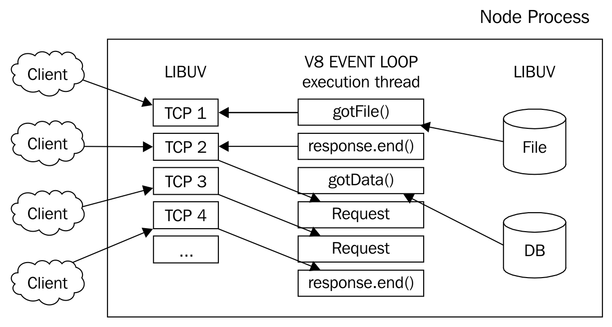
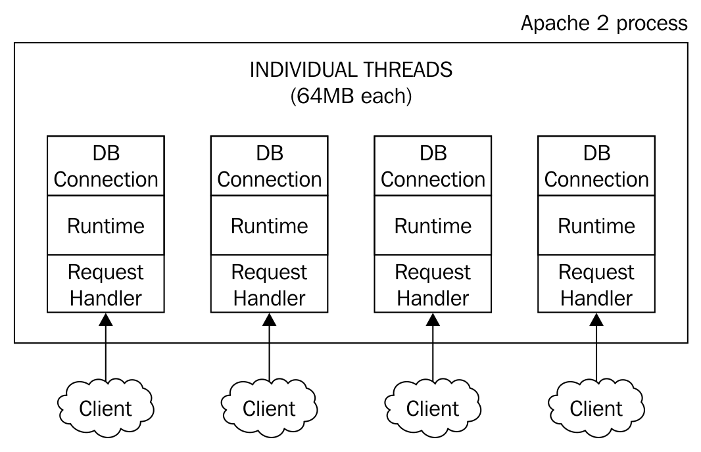
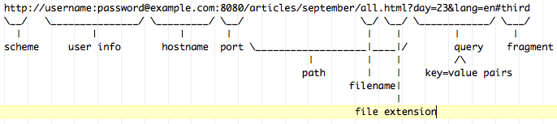
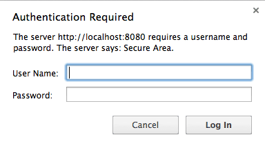
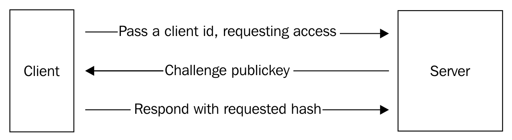
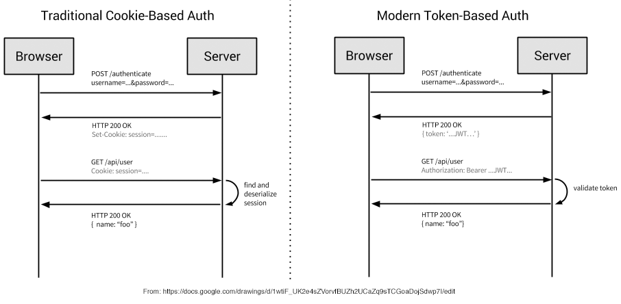

# 第五章：管理许多同时客户连接

“如果每个人都帮助撑起天空，那么一个人就不会感到疲倦。”

- Tshi 谚语

在网络软件的不可预测和*突发*环境中管理成千上万个同时客户事务的同时保持高吞吐量是开发人员对他们的 Node 实现的一个期望。鉴于历史上失败和不受欢迎的解决方案，处理并发问题甚至被赋予了自己的数字缩写：“*C10K 问题*”。应该如何设计能够自信地为 10,000 个同时客户提供服务的网络软件？

如何构建高并发系统的最佳方法的问题在过去几十年引发了许多理论争论，主要是在线程和事件之间。

“线程允许程序员编写直线代码，并依赖操作系统通过透明地在线程之间切换来重叠计算和 I/O。另一种选择，事件，允许程序员通过将代码结构化为一个单线程处理程序来显式地管理并发，以响应事件（如非阻塞 I/O 完成、特定于应用程序的消息或定时器事件）。”

- “高并发系统的设计框架”  （韦尔什，格里布尔，布鲁尔和卡勒，2000），第 2 页。

在上述引用中提出了两个重要观点：

+   开发人员更喜欢编写结构化代码（直线；单线程），以尽可能隐藏多个同时操作的复杂性

+   I/O 效率是高并发应用的主要考虑因素

直到最近，编程语言和相关框架并不是（必然）针对在分布式网络或甚至跨处理器上执行的软件进行优化。算法应该是确定性的；写入数据库的数据应该立即可供阅读。在这个时代的最终一致性数据库和异步控制流中，开发人员不能再期望在任何给定时间点知道应用程序的精确状态；这对高并发系统的架构师来说是一种有时令人费解的挑战。

正如我们在第二章中所学到的，*理解异步事件驱动编程*，Node 的设计试图结合线程和事件的优势，通过在单个线程上为所有客户提供服务（一个包装 JavaScript 运行时的事件循环），同时将阻塞工作（I/O）委托给一个优化的线程池，通过事件通知系统通知主线程状态变化。

清楚地思考以下 HTTP 服务器实现，运行在单个 CPU 上，通过将回调函数包装在请求的上下文中，并将执行上下文推送到一个不断被清空和重建的堆栈中，该堆栈绑定到事件循环的单个线程中，以响应每个客户请求：

```js
require('http').createServer((req, res) => {
  res.writeHead(200, {'Content-Type': 'text/plain'});
  res.end('Hello client from ${req.connection.remoteAddress}`);
  console.log(req);
}).listen(8000);
```

从图上看，情况是这样的：



另一方面，像 Apache 这样的服务器为每个客户请求启动一个线程：



这两种方法非常不同。Node 设计中隐含的声明是：当程序流沿着单个线程组织时，更容易推理高并发软件，并且即使在单线程执行模型中，减少 I/O 延迟也会增加可以支持的同时客户数量。第二个声明将在以后进行测试，但现在，让我们看看构建自然扩展的基本流程有多容易。

我们将演示如何使用 Node 跟踪和管理并发进程之间的关系，特别是那些同时为多个客户提供服务的进程。我们的目标是建立对在 Node 服务器或其他进程中如何对状态进行建模的基本理解。一个大型在线社交网络如何为您提供根据您的友谊或兴趣定制的信息？您的购物车如何在多次购物会话中保持不变，甚至包含基于您的购买历史的建议？一个客户端如何与其他客户端进行交互？

# 理解并发性

我们都会同意世界上有意想不到的事件，其中许多事件恰好发生在同一时间。很明显，任何给定系统的状态可能由任意数量的子状态组成，即使是微小的状态变化的全部后果也很难预测——蝴蝶煽动翅膀的力量足以将一个更大的系统推入另一个状态。此外，我们也知道，系统的体积和形状随着时间的推移以难以预测的方式发生变化。

在他 1981 年撰写的博士论文《*Actor 语义的基础》中，William Clinger 提出他的工作是：

“……受到高度并行计算机的前景的激励，这些计算机由数十、数百甚至数千个独立的微处理器组成，每个微处理器都有自己的本地存储器和通信处理器，通过高性能通信网络进行通信。”

事实证明，Clinger 有所发现。并发是由许多同时执行的操作组成的系统的属性，我们现在正在构建的网络软件类似于他所设想的，只是规模更大，*数百甚至数千*是下限，而不是上限。

Node 使并发变得容易访问，同时可以跨多个核心、多个进程和多台机器进行扩展。重要的是要注意，Node 对程序的简单性和一致性的重视程度与成为最快解决方案的重视程度一样高，通过采用和强制非阻塞 I/O 来提供高并发性，以及通过设计良好和可预测的接口。这就是 Dahl 说的“Node 的目标是提供一种构建可扩展网络程序的简单方法”的意思。

令人高兴的是，Node 非常快。

# 并发不等于并行。

将问题分解为较小的问题，将这些较小的问题分散到一个可用的人员或工人池中并行处理，并同时交付并行的结果，可以解决问题。

多个进程同时解决单个数学问题的一部分是并行性的一个例子。

Rob Pike，一位通用的巫师黑客和 Google Go 编程语言的共同发明者，以这种方式定义并发：

“并发是一种构造事物的方式，使您可以可能使用并行性来做得更好。但并行性不是并发的目标；并发的目标是一个良好的结构。”

成功的高并发应用程序开发框架提供了一种简单而富有表现力的词汇，用于描述这样的系统。

Node 的设计表明，实现其主要目标——提供一种构建可扩展网络程序的简单方法——包括简化共存进程的执行顺序的结构和组合。Node 帮助开发人员更好地组织他们的代码，解决了在一个程序中同时发生许多事情（比如为许多并发客户提供服务）的问题。

这并不是说 Node 是为了保持简单的接口而设计的，而牺牲效率——恰恰相反。相反，这个想法是将实现高效并行处理的责任从开发人员转移到系统的核心设计中，使开发人员可以通过简单和可预测的回调系统来构建并发，远离死锁和其他陷阱。

Node 的简洁来得正是时候，因为社交和社区网络与世界数据一起增长。系统正在被扩展到很少有人预测的规模。现在是进行新思考的好时机，比如如何描述和设计这些系统，以及它们如何相互请求和响应。

# 请求路由

HTTP 是建立在请求/响应模型之上的数据传输协议。使用这个协议，我们中的许多人向朋友传达我们的当前状态，为家人买礼物，或者与同事通过电子邮件讨论项目。令人震惊的是，许多人已经开始依赖这个基础性的互联网协议。

通常，浏览器客户端会向服务器发出 HTTP GET 请求。然后服务器返回所请求的资源，通常表示为 HTML 文档。HTTP 是无状态的，这意味着每个请求或响应都不保留先前请求或响应的信息——通过网页的前后移动，整个浏览器状态都会被销毁并从头开始重建。

服务器从客户端路由状态更改请求，最终导致返回新的状态表示，客户端（通常是浏览器）重新绘制或报告。当 WWW 首次构想时，这个模型是有意义的。在很大程度上，这个新网络被理解为一个分布式文件系统，任何人都可以通过网络浏览器访问，可以通过 HTTP 请求（例如 GET）从网络上的某个位置（Internet Protocol 或 IP 地址）的文件服务器计算机（服务器）请求特定资源（例如报纸文章），只需输入 URL（例如[`www.example.org/articles/april/showers.html`](http://www.example.org/articles/april/showers.html)）。用户请求一个页面，页面出现，可能包含到相关页面的（超）链接。

然而，由于无状态协议不保留上下文信息，服务器操作员几乎不可能在一系列请求中与访问者建立更有趣的关系，或者访问者动态地将多个响应聚合成一个视图。

此外，请求的表达能力受到协议本身的限制，也受到服务器内容不足以有用地支持更具描述性词汇的限制。在很大程度上，请求就像指着一个对象说“给我那个”。考虑典型 URL 的部分：



我们可以看到，在描述简单资源位置时，客户端工作量很大，查询参数和资源目标成为一个笨拙的事后想法，一旦使用了多个资源描述符，几乎变得无法使用。虽然在简单文档和不变的层次结构的时代，这是可行的，但现代网络软件的需求和复杂性使原始概念变得不可行并需要改进。

传递越来越复杂的键/值对以维护用户状态的笨拙性开始让这个新媒介的抱负受挫。很快，开发人员意识到，对互联网作为世界信息、软件和商业的实用通信层的日益依赖需要更精细的方法。

随着时间的推移，这些限制已经通过对 HTTP 协议的改进、引入 JavaScript 到浏览器、诸如浏览器 cookie 等技术以及开发人员构建产品和服务来利用这些进步的创新的结合而被克服。

然而，HTTP 协议本身仍然被个体文件样式资源存在于一个独特和永久路径，并由一个通常不具描述性的名称标识的相同主题所支配。

现在许多服务器上实际存在的是一个复杂的软件，指定了数据模型的网络接口。与这些类型的网络应用程序通信涉及到获取和设置该数据模型的状态，无论是一般的还是特定于向发出请求的客户端的状态。

部署实时解决方案的客户端在服务器上设置和获取资源状态表示。应用服务器必须在每个请求中报告客户端的状态与多个进程（数据库、文件、规则引擎、计算引擎等）的关系，并且通常在应用状态发生变化时单方面报告（例如，用户失去访问权限）。客户端通常不是浏览器，而是其他服务器。它们应该如何通信？

# 理解路线

路由将 URL 映射到操作。与构建应用程序界面以 URL 路径到包含一些逻辑的特定文件的方式不同，使用路由进行设计涉及将特定功能分配给 URL 路径和请求方法的不同组合。例如，一个接受城市列表请求的 Web 服务可能以这种方式被调用：

```js
GET /services/cities.php?country=usa&state=ohio 
```

当您的服务器收到此请求时，它将把 URL 信息传递给一个 PHP 进程，该进程将执行`cities.php`中的应用逻辑，比如读取查询、解析国家和州、调用数据库、构建响应并返回。Node 具有作为服务器和应用环境的双重优势。服务器可以直接处理请求。因此，使用 URL 作为简单的意图陈述更有意义：

```js
GET /listCities/usa/ohio 
```

在 Node 服务器中，我们可能会使用以下代码来处理这些城市的请求：

```js
let app = http.createServer((request, response) => {
  let url = request.url;
  let method = request.method;
  if (method === "GET") {
    if (url === "/listCities/usa/ohio") {
      database.call("usa","ohio", (err, data) => {
        response.writeHead(200, {'Content-Type': 'application/json' });
        // Return list of cities in Ohio, USA
        response.end(JSON.stringify(data));
      });
    }
    if (url === "/listCities/usa/arizona") { ... }
    if (url === "/listCities/canada/ontario") { ... }
  }
})
```

有一个好的和一个坏的跳出来：

+   URL 处理清晰地组织在一个地方

+   代码是不可思议的重复

写出每种可能的路线是行不通的。我们将保持组织，但需要在路线中创建变量，更倾向于定义一个通用的路线表达式，如下所示：

```js
/listCities/:country/:state 
```

方法`listCities`可以接受`country`和`state` *变量*参数，用冒号(`:`)前缀标识。在我们的服务器中，我们需要将这个符号表达式转换成正则表达式。在这种情况下，`RegExp /^\/listCities\/([^\/\.]+)\/([^\/\.]+)\/?$/`可以用来从我们的示例 URL 中提取有序值，形成一个类似于值映射的值映射：

```js
{ country: "usa", state: "ohio" } 
```

通过将请求视为表达式，我们的服务器设计变得更加理智，将任何国家/州的组合都很好地路由到一个公共处理程序函数：

```js
if (request.method === "GET") {
  let match = request.url.match(/^\/listCities\/([^\/\.]+)\/([^\/\.]+)\/?$/);
  if (match) {
    database.call(match[1],match[2],function(err, data) {…}
  }
}
```

这种形式的请求路由在 Node 社区中*赢得了争论*，成为各种框架和工具的默认行为。事实上，这种关于路由请求的思考方式已经在许多其他开发环境中得到了接受，比如 Ruby on Rails。因此，大多数 Node 的 Web 应用程序框架都是围绕路由开发的。

Node 最流行的 Web 应用程序框架是 T.J. Holowaychuk 的 Express 框架，我们将在本书中经常使用这个框架来设计路由服务器。您可以通过运行`npm install express`来安装它。

# 使用 Express 路由请求

Express 简化了定义路由匹配例程的复杂性。我们的示例可能以以下方式使用 Express 编写：

```js
const express = require('express');
let app = express();
app.get('/listCities/:country/:state', (request, response) => {
  let country = request.params.country;
  let state = request.params.state;
  response.end(`You asked for country: ${country}and state: ${state}`);
});
app.listen(8080);

GET /listCities/usa/ohio
// You asked for country: usa and state: ohio
GET /didnt/define/this
// Cannot GET /didnt/define/this
GET /listCities // note missing arguments
// Cannot GET /listCities
```

实例化 Express 提供了一个完全成型的 Web 服务器，包装在一个易于使用的应用程序开发 API 中。我们的城市服务已经清晰定义，并声明了其变量，期望通过 GET 调用（也可以使用`app.post(...)`或`app.put(...)`，或任何其他标准的`HTTP`方法）。

Express 还引入了请求处理程序链的概念，在 Express 中被理解为中间件。在我们的示例中，我们调用一个单个函数来处理城市请求。如果在调用数据库之前，我们想要检查用户是否经过身份验证呢？我们可以在主要服务方法之前添加一个`authenticate()`方法：

```js
let authenticate = (request, response, next) => {
  if (validUser) {
    next();
  } else {
    response.end("INVALID USER!");
  }
}
app.get('/listCities/:country/:state', authenticate, (request, response) => { ... });
```

中间件可以链接，换句话说，简化了复杂执行链的创建，很好地遵循了模块化规则。已经开发了许多类型的中间件，用于处理网站图标、日志记录、上传、静态文件请求等。要了解更多，请访问：[`expressjs.com/`](https://expressjs.com/)。

在为 Node 服务器配置路由请求的正确方式已经建立之后，我们现在可以开始讨论如何识别发出请求的客户端，为该客户端分配一个唯一的会话 ID，并通过时间管理该会话。

# 使用 Redis 跟踪客户端状态

在本章的一些应用程序和示例中，我们将使用**Redis**，这是由*Salvatore Sanfilippo*开发的内存键/值（KV）数据库。有关 Redis 的更多信息，请访问：[`redis.io`](http://redis.io)。Redis 的一个知名竞争对手是**Memcached**（[`memcached.org`](http://memcached.org)）。

一般来说，任何必须维护许多客户端会话状态的服务器都需要一个高速数据层，具有几乎即时的读/写性能，因为请求验证和用户状态转换可能在每个请求上发生多次。传统的基于文件的关系数据库在这个任务上往往比内存 KV 数据库慢。我们将使用 Redis 来跟踪客户端状态。

Redis 是一个在内存中运行的单线程数据存储。它非常快，专注于实现多个数据结构，如哈希、列表和集合，并对这些数据执行操作（如集合交集和列表推送和弹出）。有关安装 Redis 的说明，请访问：[`redis.io/topics/quickstart`](https://redis.io/topics/quickstart)。

与 Redis 交互：

```js
$ redis-cli 
```

值得注意的是，亚马逊的 ElastiCache 服务可以将 Redis 作为内存缓存“云”化，具有自动扩展和冗余功能，网址为：[`aws.amazon.com/elasticache/`](https://aws.amazon.com/elasticache/)。

Redis 支持预期操作的标准接口，例如获取或设置键/值对。要`get`存储在键上的值，请首先启动 Redis CLI：

```js
 $ redis-cli
 redis> get somerandomkey
 (nil)
```

当键不存在时，Redis 会返回（`nil`）。让我们`set`一个键：

```js
redis> set somerandomkey "who am I?"
redis> get somerandomkey
"who am I?"
```

要在 Node 环境中使用 Redis，我们需要某种绑定。我们将使用 Matt Ranney 的`node_redis`模块。使用以下命令行通过 npm 安装它：

```js
$ npm install redis 
```

要在 Redis 中设置一个值并再次获取它，我们现在可以在 Node 中这样做：

```js
let redis = require("redis");
let client = redis.createClient();
client.set("userId", "jack", (err) => {
  client.get("userId", (err, data) => {
    console.log(data); // "jack"
  });
});
```

# 存储用户数据

管理许多用户意味着至少跟踪他们的用户信息，一些长期存储（例如地址、购买历史和联系人列表），一些会话数据短期存储（自登录以来的时间、最后一次游戏得分和最近的答案）。

通常，我们会创建一个安全的接口或类似的东西，允许管理员创建用户帐户。读者在本章结束时将清楚如何创建这样的接口。在接下来的示例中，我们只需要创建一个用户，作为志愿者。让我们创建`Jack`：

```js
redis> hset jack password "beanstalk"
redis> hset jack fullname "Jack Spratt"
```

这将在 Redis 中创建一个键—Jack—包含一个类似的哈希：

```js
{
  "password": "beanstalk",
  "fullname": "Jack Spratt"
}
```

如果我们想要创建一个哈希并一次添加多个 KV 对，我们可以使用`hmset`命令来实现前面的操作：

```js
redis> hmset jack password "beanstalk" fullname "Jack Spratt"
```

现在，`Jack`存在了：

```js
redis> hgetall jack
 1) "password"
 2) "beanstalk"
 3) "fullname"
 4) "Jack Spratt"
```

我们可以使用以下命令来获取存储在 Jack 账户中特定字段的值：

```js
redis> hget jack password // "beanstalk"
```

# 处理会话

服务器如何知道当前客户端请求是否是先前请求链的一部分？Web 应用程序通过长事务链与客户端进行交互——包含要购买的商品的购物车即使购物者离开进行一些比较购物也会保留。我们将称之为会话，其中可能包含任意数量的 KV 对，例如用户名、产品列表或用户的登录历史。

会话是如何开始、结束和跟踪的？有许多方法可以解决这个问题，这取决于不同体系结构上存在的许多因素。特别是，如果有多个服务器用于处理客户端，那么会话数据是如何在它们之间共享的？

我们将使用 cookie 来存储客户端的会话 ID，同时构建一个简单的长轮询服务器。请记住，随着应用程序的复杂性增加，这个简单的系统将需要扩展。此外，长轮询作为一种技术正在为我们在讨论实时系统构建时将要探索的更强大的套接字技术所取代。然而，在服务器上同时保持许多连接的客户端，并跟踪它们的会话时所面临的关键问题应该得到证明。

# Cookie 和客户端状态

Netscape 在 1997 年提供了有关 cookie 的初步规范：

根据[`web.archive.org/web/20070805052634/http://wp.netscape.com/newsref/std/cookie_spec.html`](https://web.archive.org/web/20070805052634/http://wp.netscape.com/newsref/std/cookie_spec.html)，“Cookie 是一种通用机制，服务器端连接（如 CGI 脚本）可以使用它来存储和检索与连接的客户端一侧有关的信息。简单、持久的客户端状态的添加显著扩展了基于 Web 的客户端/服务器应用程序的功能。服务器在向客户端返回 HTTP 对象时，还可以发送一个状态信息片段，客户端将存储该状态。该状态对象包括一个描述该状态有效的 URL 范围。客户端以后在该范围内发出的任何 HTTP 请求都将包括将当前状态对象的值从客户端传输回服务器。状态对象称为 cookie，没有强制的原因。”

在这里，我们首次尝试*修复*HTTP 的无状态性，特别是会话状态的维护。这是一个很好的尝试，它仍然是 Web 的一个基本部分。

我们已经看到如何使用 Node 读取和设置 cookie 头。Express 使这个过程变得更容易：

```js

const express = require('express');
const cookieParser = require('cookie-parser');
const app = express();

app.use(cookieParser());

app.get('/mycookie', (request, response) => {
   response.end(request.cookies.node_cookie);
});

app.get('/', (request, response) => {
   response.cookie('node_cookie', parseInt(Math.random() * 10e10));
   response.end("Cookie set");
});

app.listen(8000);
```

注意`use`方法，它允许我们为 Express 打开 cookie 处理中间件。在这里，我们看到每当客户端访问我们的服务器时，该客户端都会被分配一个随机数作为 cookie。通过导航到`/mycookie`，该客户端可以看到 cookie。

# 一个简单的轮询

接下来，让我们创建一个并发环境，一个有许多同时连接的客户端。我们将使用一个长轮询服务器来做到这一点，通过`stdin`向所有连接的客户端进行广播。此外，每个客户端将被分配一个唯一的会话 ID，用于标识客户端的`http.serverResponse`对象，我们将向其推送数据。

长轮询是一种技术，其中服务器保持与客户端的连接，直到有数据可发送。当数据最终发送到客户端时，客户端重新连接到服务器，进程继续进行。它被设计为对短轮询的改进，短轮询是盲目地每隔几秒钟检查一次服务器是否有新信息的低效技术，希望有新数据。长轮询只需要在向客户端传递实际数据后重新连接。

我们将使用两个路由。第一个路由使用斜杠(`/`)描述，即根域请求。对该路径的调用将返回一些形成客户端 UI 的 HTML。第二个路由是`/poll`，客户端将使用它在接收到一些数据后重新连接服务器。

客户端 UI 非常简单：它的唯一目的是向服务器发出 XML HTTP 请求（XHR）（服务器将保持该请求直到接收到一些数据），在接收到一些数据后立即重复此步骤。我们的 UI 将在无序列表中显示接收到的消息列表。对于 XHR 部分，我们将使用 jQuery 库。可以使用任何类似的库，并且构建纯 JavaScript 实现并不困难。

HTML：

```js
<ul id="results"></ul> 
```

JavaScript：

```js
function longPoll() {
  $.get('http://localhost:2112/poll', (data) => {
    $('<li>' + data + '</li>').appendTo('#results');
    longPoll();
  });
}
longPoll();
```

在上面的客户端代码中，您应该看到这将如何工作。客户端对/poll 进行 GET 调用，并将等待直到接收到数据。一旦接收到数据，它将被添加到客户端显示，并进行另一个/poll 调用。通过这种方式，客户端保持与服务器的长连接，并且仅在接收到数据后重新连接。

服务器也很简单，主要负责设置会话 ID 并保持并发客户端连接，直到数据可用，然后将数据广播到所有连接的客户端。数据通过 redis pub/sub 机制可用。这些连接通过会话 ID 进行索引，使用 cookie 进行维护：

```js
const fs = require('fs');
const express = require('express');
const cookieParser = require('cookie-parser');
const redis = require("redis");
const receiver = redis.createClient();
const publisher = redis.createClient();
const app = express();

app.use(cookieParser());

let connections = {};

app.get('/poll', (request, response) => {
   let id = request.cookies.node_poll_id;
   if(!id) {
      return;
   }
   connections[id] = response;
});

app.get('/', (request, response) => {
    fs.readFile('./poll_client.html', (err, data) => {
       response.cookie('node_poll_id', Math.random().toString(36).substr(2, 9));
        response.writeHead(200, {'Content-Type': 'text/html'});
        response.end(data);
    });
});

app.listen(2112);

receiver.subscribe("stdin_message");
receiver.on("message", (channel, message) => {
   let conn;
   for(conn in connections) {
      connections[conn].end(message);
   }
    console.log(`Received message: ${message} on channel: ${channel}`);
});

process.stdin.on('readable', function() {
   let msg = this.read();
   msg && publisher.publish('stdin_message', msg.toString());
});
```

在命令行上运行此服务器，并通过浏览器连接到服务器（http://localhost:2112）。将显示一个带有文本“Results:”的页面。返回到命令行并输入一些文本-此消息应立即显示在您的浏览器中。当您在命令行上继续输入时，您的消息将被路由到连接的客户端。您也可以尝试使用多个客户端进行此操作--请注意，您应该使用不同的浏览器，隐身模式或其他方法来区分每个客户端。

虽然这是用于演示的玩具服务器（您可能不应该使用长轮询--更好的选项在第六章中提出，*创建实时应用程序*），但最终应该看到如何使用一些业务逻辑来更新状态，然后捕获这些状态更改事件，然后使用类似 Redis pub/sub 的机制广播到监听客户端。

# 验证连接

与建立客户端会话对象相结合，Node 服务器通常需要身份验证凭据。Web 安全的理论和实践是广泛的。

我们希望将我们的理解简化为两种主要的身份验证场景：

+   当传输协议是 HTTPS 时

+   当它是 HTTP 时

第一个自然是安全的，第二个不是。对于第一个，我们将学习如何在 Node 中实现基本身份验证，对于第二个，将描述一种挑战-响应系统。

# 基本身份验证

如前所述，基本身份验证在传输中发送包含用户名/密码组合的明文，使用标准 HTTP 头。这是一个简单而广为人知的协议。发送正确头的任何服务器都将导致任何浏览器显示登录对话框，如下所示：



尽管如此，这种方法仍然不安全，在传输中发送非加密的明文数据。为了简单起见，我们将在 HTTP 服务器上演示此身份验证方法，但必须强调的是，在实际使用中，服务器必须通过安全协议进行通信，例如 HTTPS。

让我们使用 Node 实现此身份验证协议。利用之前在 Redis 中开发的用户数据库，我们通过检查用户对象以验证提交的凭据，处理失败和成功来验证提交的凭据：

```js
http.createServer(function(req, res) {

   let auth = req.headers['authorization']; 
   if(!auth) {   
      res.writeHead(401, {'WWW-Authenticate': 'Basic realm="Secure Area"'});
      return res.end('<html><body>Please enter some credentials.</body></html>');
   }

   let tmp = auth.split(' ');   
   let buf = Buffer.from(tmp[1], 'base64'); 
   let plain_auth = buf.toString();   
   let creds = plain_auth.split(':'); 
   let username = creds[0];

   // Find this user record
   client.get(username, function(err, data) {
      if(err || !data) {
         res.writeHead(401, {'WWW-Authenticate': 'Basic realm="Secure Area"'});
         return res.end('<html><body>You are not authorized.</body></html>');
      }
      res.statusCode = 200;
      res.end('<html><body>Welcome!</body></html>');
   });
}).listen(8080);
```

通过在新的客户端连接上发送`401`状态和`'authorization'`头，将创建一个类似于上一个屏幕截图的对话框，通过这段代码：

```js
  res.writeHead(401, {'WWW-Authenticate': 'Basic realm="Secure Area"'});
  return res.end('<html><body>Please enter some credentials.</body></html>');
```

通过这种方式，可以设计一个简单的登录系统。由于浏览器会自然地提示用户请求访问受保护的域，甚至登录对话框也会被处理。

# 握手

在无法建立 HTTPS 连接的情况下考虑的另一种身份验证方法是挑战/响应系统：



在这种情况下，客户端请求服务器访问特定用户、用户名、ID 或类似的内容。通常，这些数据将通过登录表单发送。让我们模拟一个挑战/响应场景，使用我们之前创建的用户 Jack 作为示例。

挑战/响应系统的一般设计和目的是避免在网络上传输任何明文密码数据。因此，我们需要决定一个加密策略，客户端和服务器都共享。在我们的示例中，让我们使用 SHA256 算法。Node 的 crypto 库包含了创建这种类型哈希所需的所有工具。客户端可能没有，所以我们必须提供一个。我们将使用由 Chris Veness 开发的一个，可以从以下链接下载：[`github.com/chrisveness/crypto/blob/master/sha256.js.`](https://github.com/chrisveness/crypto/blob/master/sha256.js)

要启动此登录，客户端需要为用户 Jack 发送身份验证请求：

```js
GET /authenticate/jack 
```

作为响应，客户端应该收到服务器生成的公钥——挑战。现在，客户端必须形成一个以此键为前缀的 Jack 的密码字符串。从中创建一个 SHA256 哈希，并将生成的哈希传递给`/login/`。服务器也将创建相同的 SHA256 哈希——如果两者匹配，则客户端已经通过身份验证：

```js
<script src="img/sha256.js"></script>
<script>
$.get("/authenticate/jack", (publicKey) => {
    if (publicKey === "no data") {
    return alert("Cannot log in.");
  }
  // Expect to receive a challenge: the client should be able to derive a SHA456 hash
  // String in this format: publicKey + password. Return that string.
  let response = Sha256.hash(publicKey + "beanstalk");
  $.get("/login/" + response, (verdict) => {
    if (verdict === "failed") {
      return alert("No Dice! Not logged in.");
    }
    alert("You're in!");
  });
});
</script>
```

服务器本身非常简单，由两个提到的身份验证路由组成。我们可以在以下代码中看到，当收到用户名（`jack`）时，服务器将首先检查 Redis 中是否存在用户哈希，如果找不到这样的数据，则中断握手。如果记录存在，我们创建一个新的随机公钥，组成相关的 SHA256 哈希，并将此挑战值返回给客户端。此外，我们将此哈希设置为 Redis 中的一个键，其值为发送的用户名：

```js
const crypto = require('crypto');
const fs = require('fs');
const express = require('express');
const redis = require("redis");

let app = express();
let client = redis.createClient();

app.get('/authenticate/:username', (request, response) => {
  let publicKey = Math.random();
  let username = request.params.username; // This is always "jack"
  // ... get jack's data from redis
  client.hgetall(username, (err, data) => {
    if (err || !data) {
      return response.end("no data");
    }
    // Creating the challenge hash
    let challenge = crypto.createHash('sha256').update(publicKey + data.password).digest('hex');
    // Store challenge for later match
    client.set(challenge, username);
    response.end(challenge);
  });
});
app.get('/login/:response', (request, response) => {
  let challengehash = request.params.response;
  client.exists(challengehash, (err, exists) => {
    if (err || !exists) {
    return response.end("failed");
    }
  });
  client.del(challengehash, () => {
    response.end("OK");
  });
});
```

在`/login/`路由处理程序中，我们可以看到如果响应存在于 Redis 中，则会进行检查，并且如果找到，则立即删除该键。这是有几个原因的，其中之一是防止其他人发送相同的响应并获得访问权限。我们也通常不希望这些现在无用的键堆积起来。这带来了一个问题：如果客户端从不响应挑战会怎么样？由于键清理仅在进行`/login/`尝试时发生，因此此键将永远不会被删除。

与大多数 KV 数据存储不同，Redis 引入了**键过期**的概念，其中设置操作可以为键指定**生存时间**（**TTL**）。例如，在这里，我们使用`setex`命令将键`userId`设置为值`183`，并指定该键应在一秒后过期：

```js
 client.setex("doomed", 10, "story", (err) => { ... }); 
```

这个功能为我们的问题提供了一个很好的解决方案。通过用以下行替换`client.set(challenge, username);`行：

```js
client.setex(challenge, 5, username); 
```

我们确保无论如何，这个键都会在`5`秒内消失。以这种方式做事也可以作为一种轻量级的安全措施，留下一个非常短的时间窗口使响应保持有效，并自然地怀疑延迟的响应。

# 使用 JSON Web 令牌进行身份验证

基本的身份验证系统可能需要客户端在每个请求上发送用户名和密码。要启动基于令牌的身份验证会话，客户端只需发送一次凭据，然后收到一个令牌作为交换，并在随后的请求中只发送该令牌，获取该令牌提供的任何访问权限。不再需要不断传递敏感凭据。



JWT 的一个特别优势是，服务器不再需要维护一个共同的凭据数据库，因为只有发行机构需要验证初始登录。在使用 JWT 时，无需维护会话存储。因此，发行的令牌（可以将其视为访问卡）可以在任何识别和接受它的域（或服务器）内使用。在性能方面，现在请求的成本是解密哈希的成本，而不是进行数据库调用来验证凭据的成本。我们还避免了在移动设备上使用 cookie 时可能遇到的问题，跨域问题（cookie 是与域名绑定的），某些类型的请求伪造攻击等。

如果您想要与 Express 集成，`express-jwt`模块可能会很有用：[`github.com/auth0/express-jwt`](https://github.com/auth0/express-jwt)。

让我们看一下 JWT 的结构，然后构建一个简单的示例，演示如何发出，验证和使用 JWT 来管理会话。

JWT 令牌具有以下格式：

```js
<base64-encoded header>.<base64-encoded claims>.<base64-encoded signature>
```

每个部分都以 JSON 格式描述。**header**只是描述令牌的类型和加密算法。考虑以下示例：

```js
{ 
  "typ":"JWT", 
  "alg":"HS256" 
}
```

在这里，我们声明这是一个 JWT 令牌，使用 HMAC SHA-256 进行加密。有关加密的更多信息，请参阅[`nodejs.org/api/crypto.html`](https://nodejs.org/api/crypto.html)，以及如何在 Node 中执行加密。JWT 规范本身可以在以下网址找到：[`tools.ietf.org/html/rfc7519`](https://tools.ietf.org/html/rfc7519)。

**claims**部分概述了安全性和其他约束条件，任何接收 JWT 的服务都应该检查这些条件。查看完整的规范。通常，JWT 声明清单会想要指示 JWT 的发行时间，发行者，过期时间，JWT 的主题以及谁应该接受 JWT：

```js
{ 
  "iss": "http://blogengine.com", 
  "aud": ["http://blogsearch.com", "http://blogstorage"], 
  "sub": "blogengine:uniqueuserid", 
  "iat": "1415918312", 
  "exp": "1416523112", 
  "sessionData": "<some data encrypted with secret>" 
}
```

`iat`（发行时间）和`exp`（过期时间）声明都设置为数字值，表示自 Unix 纪元以来的秒数。`iss`（发行者）应该是描述 JWT 发行者的 URL。任何接收 JWT 的服务都必须检查`aud`（受众），如果它不出现在受众列表中，该服务必须拒绝 JWT。JWT 的`sub`（主题）标识 JWT 的主题，例如应用程序的用户——一个永远不会重新分配的唯一值，例如发行服务的名称和唯一用户 ID。

最后，使用任何您喜欢的键/值对附加一些有用的数据。在这里，让我们称之为令牌数据 sessionData。请注意，我们需要加密这些数据——JWT 的签名部分防止篡改会话数据，但 JWT 本身并不加密（尽管您始终可以加密整个令牌本身）。

最后一步是创建一个签名，如前所述，防止篡改——JWT 验证器专门检查签名和接收到的数据包之间的不匹配。

接下来是一个示例服务器和客户端的框架，演示如何实现基于 JWT 的身份验证系统。我们将使用`jwt-simple`包来实现各种签名和验证步骤，而不是手动实现。随时浏览您的代码包中的`/jwt`文件夹，其中包含我们将在接下来解压缩的完整代码。

要请求令牌，我们将使用以下客户端代码：

```js
function send(route, formData, cb) {
  if(!(formData instanceof FormData)) {
    cb = formData;
    formData = new FormData();
  }
  let caller = new XMLHttpRequest();
  caller.onload = function() {
     cb(JSON.parse(this.responseText));
  };
  caller.open("POST", route);
  token && caller.setRequestHeader('Authorization', 'Bearer ' + token);
  caller.send(formData);
}
```

当我们以某种方式收到`username`和`password`时：

```js
formData = new FormData();
formData.append("username", "sandro");
formData.append("password", 'abcdefg');

send("/login", formData, function(response) {
  token = response.token;
  console.log('Set token: ' + token);
});
```

接下来我们将实现服务器代码。现在，请注意我们有一个发送方法，该方法在某个时候期望有一个全局令牌设置，以便在进行请求时传递。最初的`/login`是我们请求该令牌的地方。

使用 Express，我们创建以下服务器和`/login`路由：

```js
const jwt = require('jwt-simple');
const app = express();
app.set('jwtSecret', 'shhhhhhhhh');

...

app.post('/login', auth, function(req, res) {
   let nowSeconds     = Math.floor(Date.now()/1000);
   let plus7Days  = nowSeconds + (60 * 60 * 24 * 7);
   let token = jwt.encode({
      "iss" : "http://blogengine.com", 
      "aud" : ["http://blogsearch.com", "http://blogstorage"],
      "sub" : "blogengine:uniqueuserid",
      "iat" : nowSeconds,
      "exp" : plus7Days,
      "sessionData" : encrypt(JSON.stringify({
         "department" : "sales"
      }))
   }, app.get('jwtSecret'));

   res.send({
      token : token
   })
})
```

请注意，我们将`jwtsecret`存储在应用服务器上。这是在签署令牌时使用的密钥。当尝试登录时，服务器将返回`jwt.encode`的结果，该结果编码了前面讨论过的 JWT 声明。就是这样。从现在开始，任何客户端只要向正确的受众提到这个令牌，就可以与这些受众成员提供的任何服务进行交互，有效期为自发行日期起的 7 天。这些服务将实现类似以下内容的内容：

```js
app.post('/tokendata', function(req, res) { 
   let </span>token = req.get('Authorization').replace('Bearer ', '');
   let decoded = jwt.decode(token, app.get('jwtSecret'));
   decoded.sessionData = JSON.parse(decrypt(decoded.sessionData));
   let now = Math.floor(Date.now()/1000);
   if(now > decoded.exp) {
      return res.end(JSON.stringify({
         error : "Token expired"
      }));
   }
   res.send(decoded)
});
```

在这里，我们只是获取**Authorization**头（去掉**Bearer**）并通过`jwt.decode`进行解码。服务至少必须检查令牌是否过期，我们通过比较自纪元以来的当前秒数和令牌的过期时间来实现这一点。使用这个简单的框架，您可以创建一个易于扩展的身份验证/会话系统，使用安全标准。不再需要维护与公共凭据数据库的连接，个别服务（可能部署为微服务）可以使用 JWT 验证请求，而几乎不会产生 CPU、延迟或内存成本。

# 总结

Node 提供了一组工具，可帮助设计和维护面对 C10K 问题的大规模网络应用程序。在本章中，我们已经迈出了第一步，创建了具有许多同时客户端的网络应用程序，跟踪它们的会话信息和凭据。这种并发性的探索展示了一些路由、跟踪和响应客户端的技术。我们提到了一些简单的扩展技术，例如使用 Redis 数据库构建的发布/订阅系统来实现进程内消息传递。我们还提到了各种认证机制，从基本认证到基于 JSON Web Tokens 的基于令牌的认证。

我们现在准备深入探讨实时软件的设计——在使用 Node 实现高并发和低延迟之后的逻辑下一步。我们将扩展我们在长轮询讨论中概述的想法，并将它们放在更健壮的问题和解决方案的背景下。

# 进一步阅读

并发性和并行性是丰富的概念，经过了严格的研究和辩论。当应用架构设计支持线程、事件或某种混合时，架构师很可能对这两个概念持有看法。鼓励您深入理论，阅读以下文章。对辩论的准确理解将提供一个客观的框架，可用于评估选择（或不选择）Node 的决定：

+   一些数字：[`citeseerx.ist.psu.edu/viewdoc/download?doi=10.1.1.154.7354&rep=rep1&type=pdf`](http://citeseerx.ist.psu.edu/viewdoc/download?doi=10.1.1.154.7354&rep=rep1&type=pdf)

+   线程是一个坏主意：[`web.stanford.edu/~ouster/cgi-bin/papers/threads.pdf`](https://web.stanford.edu/~ouster/cgi-bin/papers/threads.pdf)

+   事件是一个坏主意：[`people.eecs.berkeley.edu/~brewer/papers/threads-hotos-2003.pdf`](https://people.eecs.berkeley.edu/~brewer/papers/threads-hotos-2003.pdf)

+   一起怎么样？：[`www.cis.upenn.edu/~stevez/papers/LZ06b.pdf`](https://www.cis.upenn.edu/~stevez/papers/LZ06b.pdf)

+   科学：[`courses.cs.vt.edu/cs5204/fall09-kafura/Presentations/Threads-VS-Events.pdf`](http://courses.cs.vt.edu/cs5204/fall09-kafura/Presentations/Threads-VS-Events.pdf)
