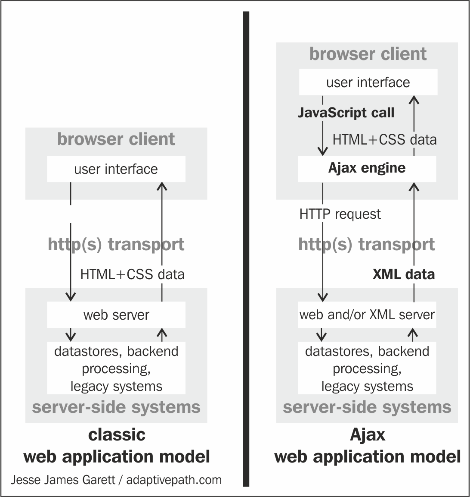
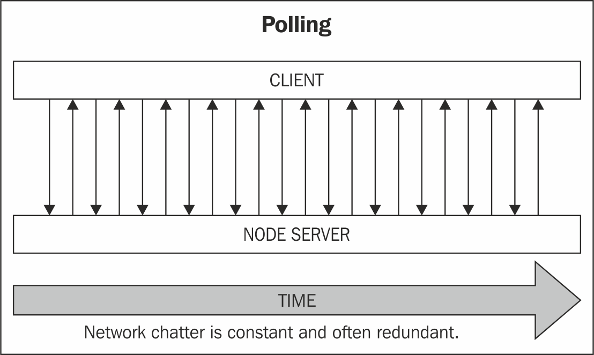
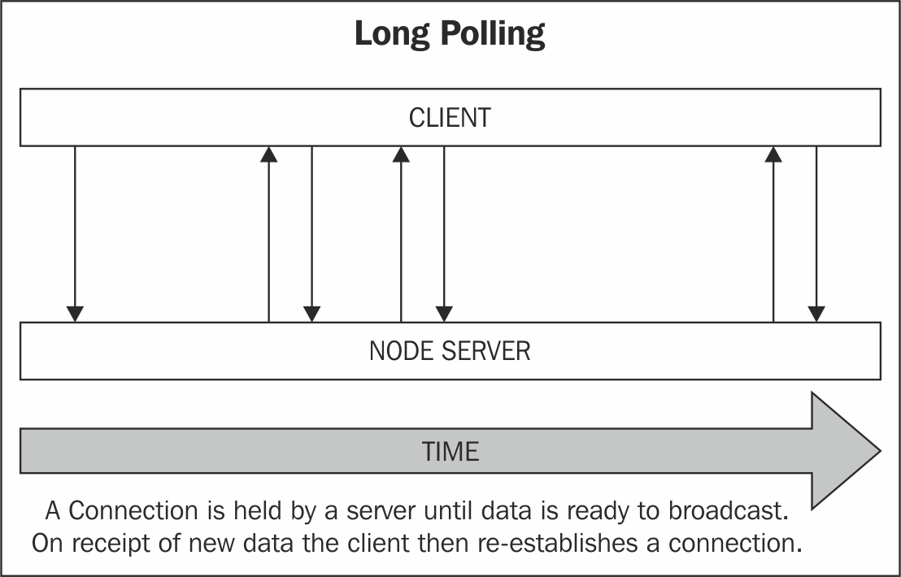
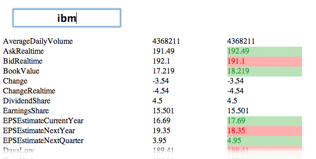
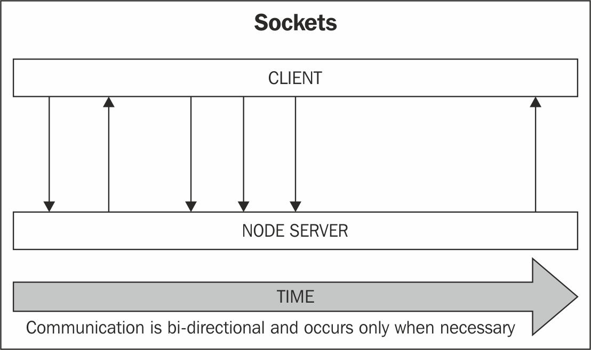
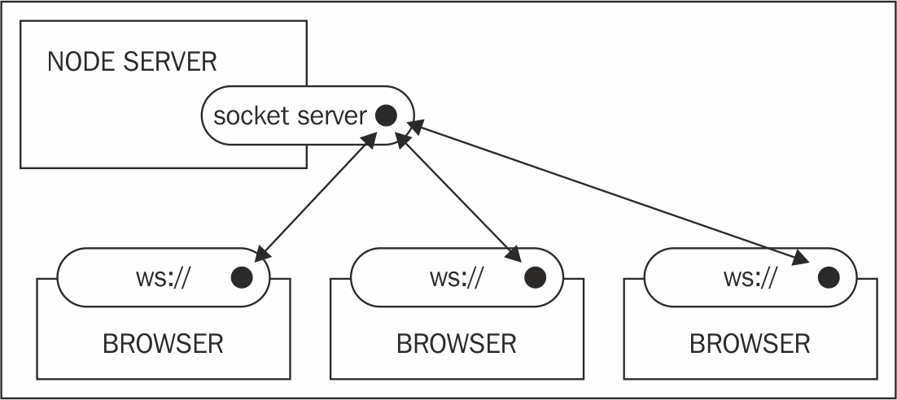
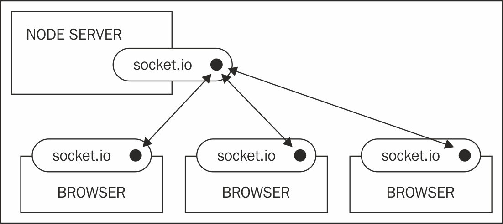
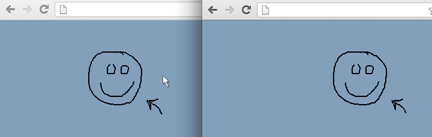
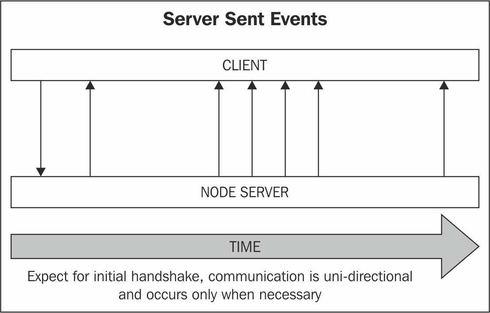
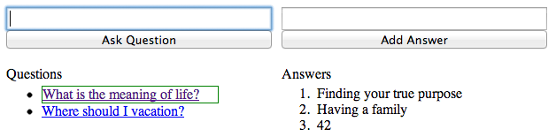

# 第六章：创建实时应用程序

“唯一不变的是变化。”

- 赫拉克利特

什么是实时软件？好友列表在有人加入或退出时立即更新。交通信息会自动流入正在寻找最佳回家路线的司机的智能手机。在线报纸的体育版会在实际比赛中得分时立即更新比分和排名。这类软件的用户期望对变化的反应能够快速传达，这种期望要求软件设计者特别关注减少网络延迟。数据 I/O 更新必须在亚秒级时间范围内发生。

让我们退一步，考虑一下 Node 环境和社区的一般特点，使其成为创建这类响应式网络应用程序的绝佳工具。

可以说，Node 设计的一些验证可以在庞大的开发者社区中找到，这些开发者正在贡献企业级 Node 系统。多核、多服务器的企业系统正在使用大部分用 JavaScript 编写的免费软件创建。

为什么有这么多公司在设计或更新产品时都向 Node 迁移？以下列举了原因：

+   Node 提供了出色的 npm 包管理系统，可以轻松与 Git 版本控制系统集成。浅显易懂的学习曲线帮助即使是经验不足的开发人员也能安全地存储、修改和分发新的模块、程序和想法。开发人员可以在私人 Git 存储库上开发私有模块，并使用 npm 在私人网络中安全地分发这些存储库。因此，Node 用户和开发人员的社区迅速扩大，一些成员声名鹊起。*如果你建造它，他们就会来*。

+   Node 打破了系统访问的障碍，突然释放了大批技术娴熟的程序员的才华，为一个需要在基础设施上进行许多改进的热门新项目提供了机遇生态系统。关键在于：Node 将并发的机会与原生 JavaScript 事件相结合；其设计精巧的 API 允许使用众所周知的编程范式的用户利用高并发 I/O。*如果你奖励他们，他们就会来*。

+   Node 打破了网络访问的障碍，让一大批 JavaScript 开发人员的工作和抱负开始超越客户端开发者可用的小沙盒。不应忘记，从 1995 年引入 JavaScript 到现在已经过去了 20 多年。几乎一个开发人员的一代人一直在努力尝试在以事件驱动的开发环境中实现新的网络应用想法，而这个环境以其限制而闻名，甚至被定义。Node 一夜之间消除了这些限制。*如果你清理路径，他们就会来*。

+   Node 提供了一种构建可扩展网络程序的简单方法，其中网络 I/O 不再是瓶颈。真正的转变不是从另一个流行系统到 Node，而是摆脱了需要昂贵和复杂资源来构建和维护需要突发并发的高效应用程序的观念。如果可以廉价实现一个弹性和可扩展的网络架构，那么释放出的资源可以用来解决其他紧迫的软件挑战，比如并行化数据过滤、构建大规模多人游戏、构建实时交易平台或协作文档编辑器，甚至在热系统中实现实时代码更改。信心带来进步。*如果你让它变得容易，他们就会来*。

Node 在那些构建动态网页的人已经开始遇到服务器无法顺利处理许多小型同时请求的限制时出现。软件架构师现在必须解决一些有趣的问题：*实时*的规则是什么——用户是否满意于*很快*，还是*现在*是唯一正确的响应？最好的设计系统满足这些用户需求的方式是什么？

在本章中，我们将调查开发人员在构建实时网络应用程序时可以使用的三种标准技术：AJAX、WebSockets 和服务器发送事件（SSE）。我们本章的目标是了解每种技术的优缺点，并使用 Node 实现每种技术。记住我们的目标是实现一个一致的架构，反映 Node 的事件流设计，我们还将考虑每种技术作为可读、可写或双工流的表现能力。

我们将以构建一个协作代码编辑器来结束本章，这应该展示了 Node 为那些希望构建实时协作软件的人提供的机会。当您逐步学习示例并构建自己的应用程序时，这些都是值得自问的一些问题：

+   我预计每秒要处理的消息量是多少？在高峰时段和非高峰时段，预计会有多少同时连接的客户端？

+   传输的消息的平均大小是多少？

+   如果我能接受偶尔的通信中断或丢失的消息，是否可以通过这种让我获得更低的平均延迟？

+   我真的需要双向通信吗，还是一方几乎负责所有消息量？我是否需要一个复杂的通信接口？

+   我的应用程序将在哪些网络中运行？在客户端和我的 Node 服务器之间会有代理服务器吗？支持哪些协议？

+   我需要一个复杂的解决方案，还是简单直接，甚至稍慢一些的解决方案会在长远带来其他好处？

# 引入 AJAX

2005 年，Jesse James Garrett 发表了一篇文章，试图将他所看到的网站设计方式的变化压缩成一种模式。在研究了这一趋势之后，Garrett 提出，动态更新页面代表了一种新的软件浪潮，类似于桌面软件，他创造了缩写*AJAX*来描述推动这种快速向*Web 应用程序*发展的技术概念。

这是他用来展示一般模式的图表：



原始文章链接：

[`adaptivepath.org/ideas/ajax-new-approach-web-applications/`](http://adaptivepath.org/ideas/ajax-new-approach-web-applications/).

在 2000 年前后，*Garrett*的图表中提到的"*AJAX 引擎*"实际上已经存在于大多数常见的浏览器中，甚至在一些浏览器中更早。这些浏览器中的 JavaScript 实现了**XMLHttpRequest** (**XHR**)对象，使网页能够从服务器请求 HTML 或其他数据的*片段*。部分更新可以动态应用于网页，从而为新型用户界面创造了机会。例如，最新的活动图片可以神奇地出现在用户面前，而无需用户主动请求页面刷新或点击下一张图片按钮。

更重要的是，Garrett 还理解了*旧*互联网的同步、无状态世界正在变成异步、有状态的世界。客户端和服务器之间的对话不再因突然失忆而中断，可以持续更长时间，共享越来越有用的信息。Garret 将此视为网络软件新一代的转变。

# 回应呼叫

如果可以在不需要完全重建状态和状态显示的情况下引入更改到 Web 应用程序中，更新客户端信息将变得更加便宜。客户端和服务器可以更频繁地交流，定期交换信息。服务器可以识别、记住并立即响应客户端的愿望，通过反应式界面收集用户操作，并几乎实时地在 UI 中反映这些操作的影响。

使用 AJAX，支持实时更新每个客户端对整个应用程序状态的视图的多用户环境的构建涉及客户端定期轮询服务器以检查重要更新：



轮询状态的重大缺点是，其中许多请求将是徒劳的。客户端变成了一个破碎的记录，不断地请求状态更新，无论这些更新是否可用或即将到来。当应用程序花费时间或精力执行不必要的任务时，应该存在一些明显的好处，以抵消这种成本。此外，每次徒劳的调用都会增加建立然后拆除 HTTP 连接的成本。

这样的系统只能在定期间隔内获取状态的快照，由于轮询间隔可能增加到几秒钟，以减少冗余的网络通信，我们对状态变化的意识可能开始显得迟钝，稍微落后于最新消息。

在上一章中，我们看到了一个更好的解决方案——长轮询，即让服务器保持与客户端的连接，直到有新数据可用。



这种改进的 AJAX 技术并没有完全摆脱建立和拆除网络连接的成本，但显著减少了这类昂贵操作的数量。总的来说，AJAX 无法提供流畅的、类似流的事件接口，需要大量的服务来持久化状态，因为连接经常中断然后重新建立。

然而，AJAX 仍然是一些应用的真正选择，特别是简单的应用，其中理想的轮询间隔相当明确，每次轮询都有很大机会收集有用的结果。让我们使用 Node 构建一个能够与股票报告服务通信的服务器，并构建一个定期请求该服务器以检查更改并报告它们的轮询客户端。

# 创建股票行情

最终，我们将创建一个应用程序，允许客户端选择一只股票，并观察与该股票相关的数据点的变化，如其价格，并突出正面或负面的变化：



要创建客户端，我们的工作很少。我们只需要每隔几秒钟轮询我们的服务器，更新我们的界面以反映任何数据更改。让我们使用 jQuery 作为我们的 AJAX 库提供程序。要使用 jQuery 从服务器获取 JSON，通常会这样做：

```js
function fetch() {
  $.getJSON("/service", (data) => {
    // Do something with data
    updateDisplay(data);
    // Call again in 5 seconds
    setTimeout(fetch, 5000);
  });
}
fetch(); 
```

Node 服务器将接收此更新请求，执行一些 I/O（检查数据库，调用外部服务），并以数据响应，客户端可以使用。

在我们的示例中，Node 将用于连接到 IEX Developer Platform ([`iextrading.com/developer/`](https://iextrading.com/developer/))，该平台免费提供股票报价。

我们将构建一个 Node 服务器，监听客户端请求更新给定股票代码（如“IBM”）的数据。然后，Node 服务器将为该股票代码创建一个 YQL 查询，并通过`http.get`执行该查询，将接收到的数据包装好发送回调用客户端。

这个包还将被分配一个新的`callIn`属性，表示客户端在再次调用之前应该等待的毫秒数。这是一个有用的技术要记住，因为我们的股票数据服务器将比客户端更好地了解交通状况和更新频率。我们的服务器可以在每次调用后重新校准这个频率，甚至要求客户端停止调用，而不是盲目地按照固定的时间表检查。

由于这种设计，特别是视觉设计，可以通过多种方式完成，我们将简单地看一下我们客户需要的核心功能，包含在以下的`fetch`方法中：

```js
function fetch() {
  clearTimeout(caller);
  let symbol = $("#symbol").val();

  $.getJSON(`/?symbol=${symbol}`, function(data) {
    if(!data.callIn) {
      return;
    }
    caller = setTimeout(fetch, data.callIn);
    if(data.error) {
      return console.error(data.error);
    }
    let quote = data.quote;
    let keys = fetchNumericFields(quote);

    ...

    updateDisplay(symbol, quote, keys);
  });
}
```

在这个页面上，用户将股票符号输入到 ID 为`#symbol`的输入框中。然后从我们的数据服务中获取这些数据。在前面的代码中，我们看到通过`$.getJSON jQuery`方法进行服务调用，接收到 JSON 数据，并使用 Node 发送回来的`callIn`间隔设置了`setTimeout`属性。

我们的服务器负责与数据服务协商前面的客户端调用。假设我们有一个正确配置的服务器成功地从客户端接收股票符号，我们需要打开到服务的 HTTP 连接，读取任何响应，并返回这些数据：

```js
https.get(query, res => {
 let data = "";
 res.on('readable', function() {
   let d;
   while(d = this.read()) {
     data += d.toString();
   }
 }).on('end', function() {
   let out = {};
   try {
     data = JSON.parse(data);
     out.quote = data;
     out.callIn = 5000;

     Object.keys(out.quote).forEach(k => {
       // Creating artificial change (random)
       // Normally, the data source would change regularly.
       v = out.quote[k];
       if(_.isFinite(v)) {
         out.quote[k] = +v + Math.round(Math.random());
       }
     })

   } catch(e) {
     out = {
       error: "Received empty data set",
       callIn: 10000
     };
   }
   response.writeHead(200, {
     "Content-type" : "application/json"
   });
   response.end(JSON.stringify(out));
  });
}).on('error', err => {
  response.writeHead(200, {
    "Content-type" : "application/json"
  });
  response.end(JSON.stringify({
    error: err.message,
    callIn: null
  }));
});
```

在这里，我们看到了一个很好的例子，说明为什么让服务器，作为主要的状态观察者，调节客户端轮询的频率是一个好主意。如果成功接收到数据对象，我们将轮询间隔(`callIn`)设置为大约五秒。如果发生错误，我们将延迟增加到 10 秒。很容易看出，如果重复发生错误，我们可能会做更多的事情，例如进一步限制连接。鉴于这一点，应用程序可能会对向外部服务发出请求的速率有限制（例如限制一小时内可以发出的调用次数）；这也是一个确保不断的客户端轮询不会超过这些速率限制的有用技术。

AJAX 是创建实时应用程序的原始技术。在某些情况下仍然有用，但已被更高效的传输方式取代。在离开这一部分时，让我们记住一些轮询的优缺点：

| **优点** | **缺点** |
| --- | --- |
| REST 的理论和实践是可用的，允许更标准化的通信 | 建立和断开连接会对网络延迟产生成本，特别是如果经常这样做 |
| 不需要任何特殊的协议服务器，轮询可以很容易地使用标准的 HTTP 服务器实现 | 客户端必须请求数据；服务器无法单方面更新客户端以响应新数据的到来 |
| HTTP 是众所周知且一贯实施的 | 即使长轮询也会使需要维持持久连接的网络流量翻倍 |
|  | 数据是盲目地推送和拉取，而不是在频道上平稳地广播和监听 |

现在让我们进入讨论一些较新的协议，部分设计用于解决我们在 AJAX 中发现的一些问题：WebSockets 和 SSE。

# 使用 socket.io 进行双向通信

我们已经熟悉套接字是什么。特别是，我们知道如何使用 Node 建立和管理 TCP 套接字连接，以及如何通过它们双向或单向地传输数据。

W3C 提出了一个套接字 API，允许浏览器通过持久连接与套接字服务器通信。`socket.io`是一个库，为那些使用 Node 开发的人提供了一个基于 Node 的套接字服务器和一个用于不支持原生`WebSocket` API 的浏览器的仿真层，从而便于建立持久套接字连接。

让我们首先简要看一下原生 WebSocket API 是如何实现的，以及如何使用 Node 构建支持该协议的套接字服务器。然后，我们将使用`socket.io`和 Node 构建一个协作绘图应用程序。

`WebSocket` API 的完整规范可以在以下网址找到：[`www.w3.org/TR/websockets/. `](http://www.w3.org/TR/websockets/)有关`socket.io`的文档和安装说明可以在以下网址找到：[`socket.io/`](http://socket.io/)

# 使用 WebSocket API

套接字通信是高效的，只有当其中一方有有用的东西要说时才会发生：



这种轻量级模型非常适合需要在客户端和服务器之间进行高频消息传递的应用程序，例如在多人网络游戏或聊天室中发现的情况。

根据 W3C，WebSocket API 旨在“使 Web 应用程序能够与服务器端进程保持双向通信。”假设我们已经在`localhost:8080`上运行了一个套接字服务器，我们可以从包含以下 JavaScript 行的浏览器连接到此服务器：

```js
let conn = new WebSocket("ws://localhost:8080", ['json', 'xml']); 
```

`WebSocket`需要两个参数：以`ws://`为前缀的 URL 和一个可选的子协议列表，可以是服务器可能实现的协议的数组或单个字符串。

要建立安全的套接字连接，请使用`wss://`前缀。与 HTTPS 服务器一样，您将需要 SSL 证书。

一旦发出套接字请求，浏览器可以处理连接事件、打开、关闭、错误和消息：

```js
<head>
  <title></title>
   <script>

     let conn = new WebSocket("ws://localhost:8080", 'json');
     conn.onopen = () => {
       conn.send('Hello from the client!');
     };
     conn.onerror = (error) => {
       console.log('Error! ' + error);
     };
     conn.onclose = () => {
       console.log("Server has closed the connection!");
     };
     conn.onmessage = (msg) => {
       console.log('Received: ' + msg.data);
     };
   </script>
</head>

```

在这个例子中，我们将使用 ws 模块在 Node 中实现一个`WebSocket`服务器：[`github.com/websockets/ws`](https://github.com/websockets/ws)。使用 npm 安装 ws（`npm i ws`）后，建立一个 Node 套接字服务器非常简单：

```js
let SocketServer = require('ws').Server;
  let wss = new SocketServer({port: 8080});
  wss.on('connection', ws => {
    ws.on('message', (message) => {
      console.log('received: %s', message);
    });
    ws.send("You've connected!");
 });

```

在这里，我们可以看到服务器只是简单地监听来自客户端的`connection`和`message`事件，并根据需要做出响应。如果有必要终止连接（也许是如果客户端失去授权），服务器可以简单地发出`close`事件，客户端可以监听该事件：

```js
ws.close(); 
```

因此，使用 WebSocket API 创建双向通信的应用程序的一般示意图如下：



本地 WebSocket 浏览器实现用于与我们的自定义 Node 套接字服务器进行通信，该服务器处理来自客户端的请求，并在必要时向客户端广播新数据或信息。

# socket.io

如前所述，`socket.io`旨在提供一个仿真层，将在支持它的浏览器中使用本机`WebSocket`实现，并在旧浏览器中（如长轮询）使用其他方法来模拟本机 API。这是一个重要的事实要记住：仍然有一些旧的浏览器存在。

尽管如此，`socket.io`在隐藏浏览器差异方面做得非常好，并且在套接字提供的控制流对于您的应用程序的通信模型是一种理想选择时，它仍然是一个很好的选择。

在前面示例中使用的`WebSocket`实现（`ws`）中，可以清楚地看到套接字服务器独立于任何特定的客户端文件。我们编写了一些 JavaScript 来在客户端上建立`WebSocket`连接，独立地使用 Node 运行套接字服务器。与这种本机实现不同，`socket.io`需要在服务器上安装自定义客户端库以及`socket.io`服务器模块：



`socket.io`可以使用`npm`包管理器进行安装：

```js
$ npm install socket.io 
```

设置客户端/服务器套接字配对非常简单。

在服务器端：

```js
let io = require('socket.io').listen(8080);
io.sockets.on('connection', socket => {
  socket.emit('broadcast', { message: 'Hi!' });
  socket.on('clientmessage', data => {
    console.log("Client said" + data);
  });
});
```

在客户端：

```js
<script src="img/socket.io.js"></script>
 <script>
   let socket = io.connect('http://localhost:8080');
   socket.on('broadcast', data => {
     console.log(`Server sent: ${JSON.stringify(data)}`);
     socket.emit('clientmessage', { message: 'ohai!' });
   });
 </script> 
```

我们可以看到客户端和服务器都使用相同的文件`socket.io.js`。使用`socket.io`的服务器在请求时会自动处理向客户端提供`socket.io.js`文件。还应该注意到`socket.io` API 与标准 Node`EventEmitter`接口非常相似。

# 协作绘图

让我们使用`socket.io`和 Node 创建一个协作绘图应用。我们想要创建一个空白画布，同时显示所有连接客户端所做的*笔迹*：



从服务器端来看，要做的事情很少。当客户端通过移动鼠标更新坐标时，服务器只需将此更改广播给所有连接的客户端：

```js
io.sockets.on('connection', socket => {
  let id = socket.id;

  socket.on('mousemove', data => {
    data.id = id;
    socket.broadcast.emit('moving', data);
  });

  socket.on('disconnect', () => {
    socket.broadcast.emit('clientdisconnect', id);
  });
});
```

`socket.io`会自动生成一个唯一的 ID 用于每个 socket 连接。每当发生新的绘图事件时，我们将传递这个 ID，允许接收端客户端跟踪有多少用户连接。同样，当一个客户端断开连接时，所有其他客户端都会被指示删除对这个客户端的引用。稍后，我们将看到这个 ID 在应用 UI 中如何使用，以维护表示所有连接客户端的指针。

这是一个很好的例子，展示了使用 Node 和 Node 社区创建的包来创建多用户网络应用是多么简单。让我们来分析一下这个服务器在做什么。

因为我们需要提供客户端用于绘制的 HTML 文件，所以服务器设置的一半涉及创建一个静态文件服务器。为了方便起见，我们将使用 node-static 包：[`github.com/cloudhead/node-static`](https://github.com/cloudhead/node-static)。我们的实现将为任何连接的客户端提供一个`index.html`文件。

我们的`socket.io`实现期望从客户端接收`mousemove`事件，它的唯一任务是向所有连接的客户端发送这些新坐标，它通过其`broadcast`方法通过发出一个移动事件来实现。当一个客户端通过绘制一条线改变画布状态时，所有客户端都将收到更新画布状态所需的信息，以实时更新他们的画布状态视图。

通信层建立完成后，我们现在必须创建客户端视图。如前所述，每个客户端将加载一个包含必要的 canvas 元素和监听移动事件的 JavaScript 的`index.html`文件，以及将客户端绘制事件广播到我们的服务器的`socket.io`发射器：

```js
<head>
     <style type="text/css">
     /* CSS styling for the pointers and canvas */
     </style>
     <script src="img/socket.io.js"></script>
     <script src="img/script.js"></script>
 </head>
 <body>
     <div id="pointers"></div>
     <canvas id="canvas" width="2000" height="1000"></canvas>
 </body>

```

创建一个`pointers`元素来保存所有连接客户端光标的可见表示，这些表示将随着连接客户端移动其指针和/或绘制某些东西而更新。

在`script.js`文件中，我们首先在`canvas`元素上设置事件监听器，监听`mousedown`和`mousemove`事件的组合，指示绘图动作。请注意，我们创建了一个 50 毫秒的时间缓冲，延迟每次绘制事件的广播，略微降低了绘图的分辨率，但避免了过多的网络事件：

```js
let socket = io.connect("/");
let prev = {};
let canvas = document.getElementById('canvas');
let context = canvas.getContext('2d');
let pointerContainer = document.getElementById("pointers");

let pointer = document.createElement("div");
pointer.setAttribute("class", "pointer");

let drawing = false;
let clients = {};
let pointers = {};

function drawLine(fromx, fromy, tox, toy) {
  context.moveTo(fromx, fromy);
  context.lineTo(tox, toy);
  context.stroke();
}
function now() {
  return new Date().getTime();
}
let lastEmit = now();
canvas.onmouseup = canvas.onmousemove = canvas.onmousedown = function(e) {
  switch(e.type) {
    case "mouseup":
      drawing = false;
      break;

    case "mousemove":
      if(now() - lastEmit > 50) {
        socket.emit('mousemove', {
          'x' : e.pageX,
          'y' : e.pageY,
          'drawing' : drawing
        });
        lastEmit = now();
      }
      if(drawing) {
        drawLine(prev.x, prev.y, e.pageX, e.pageY);
        prev.x = e.pageX;
        prev.y = e.pageY;
      }
      break;

    case "mousedown":
      drawing = true;
      prev.x = e.pageX;
      prev.y = e.pageY;
      break;

    default: 
      break;
  }
};
```

每当发生绘图动作（`mousedown`和`mousemove`事件的组合），我们会在客户端的机器上绘制请求的线条，然后通过`socket.emit('mousemove', ...)`将这些新坐标广播到我们的`socket.io`服务器，记得传递绘图客户端的`id`值。服务器将通过`socket.broadcast.emit('moving', data)`广播它们，允许客户端监听器在它们的`canvas`元素上绘制等效的线条：

```js
socket.on('moving', data => {
  if (!clients.hasOwnProperty(data.id)) {
    pointers[data.id] = pointerContainer.appendChild(pointer.cloneNode());
  }
  pointers[data.id].style.left = data.x + "px";
  pointers[data.id].style.top = data.y + "px";

  if (data.drawing && clients[data.id]) {
    drawLine(clients[data.id].x, clients[data.id].y, data.x, data.y);
  }
  clients[data.id] = data;
  clients[data.id].updated = now();
});

```

在这个监听器中，如果发送的客户端 ID 以前没有看到过，客户端将建立一个新的客户端指针，并且动画化一条线的绘制和客户端指针，从而在单个客户端视图中创建多个光标绘制不同线条的效果。

回想一下我们在服务器上跟踪的`clientdisconnect`事件，我们还使客户端能够监听这些断开连接，从视图（可视化指针）和我们的`clients`对象中删除丢失客户端的引用：

```js
socket.on("clientdisconnect", id => {
  delete clients[id];
  if (pointers[id]) {
    pointers[id].parentNode.removeChild(pointers[id]);
  }
}); 
```

`socket.io`是一个很好的工具，用于构建交互式的、多用户的环境，需要连续快速的双向数据传输。

现在，让我们来看看`socket.io`的优缺点：

| **优点** | **缺点** |
| --- | --- |
| 对于实时游戏、协作编辑工具和其他应用程序来说，快速的双向通信至关重要 | 允许的持久套接字连接数量可以在服务器端或任何中间位置进行限制 |
| 比标准 HTTP 协议请求的开销更低，降低了在网络上发送数据包的价格 | 许多代理和反向代理都会使套接字实现混乱，导致客户端丢失 |
| 套接字的事件驱动和流式特性在概念上与 Node 架构相吻合——客户端和服务器只是通过一致的接口来回传递数据 | 需要自定义协议服务器，通常需要自定义客户端库 |

另一个有趣的项目是 SockJS，它在许多不同的语言中实现了套接字服务器，包括 Node.js。查看：[`github.com/sockjs/sockjs-node`](https://github.com/sockjs/sockjs-node)。

# 监听服务器发送的事件

SSE 是简单而具体的。它们在大多数数据传输是从服务器到客户端单向进行时使用。传统和类似的概念是*推送*技术。SSE 传递带有简单格式的文本消息。许多类型的应用程序被动地接收简短的状态更新或数据状态更改。SSE 非常适合这些类型的应用程序。

与`WebSocket`一样，SSE 也消除了 AJAX 的冗余交流。与`WebSocket`不同，SSE 连接只关注从服务器向连接的客户端广播数据：



通过将路径传递给`EventSource`构造函数，客户端连接到支持 SSE 的服务器：

```js
let eventSource = new EventSource('/login'); 
```

`EventSource`的这个实例现在将在从服务器接收到新数据时发出可订阅的数据事件。

# 使用 EventSource API

`EventSource`实例发出可订阅的数据事件，每当从服务器接收到新数据时，就像`Readable`流在 Node 中发出数据事件一样，正如我们在这个示例客户端中所看到的：

```js
<script>
  let eventSource = new EventSource('/login');
  eventSource.addEventListener('message', (broadcast) => {
    console.log("got message: " + broadcast);
  });
  eventSource.addEventListener('open', () => {
    console.log("connection opened");
  });
  eventSource.addEventListener('error', () => {
    console.log("connection error/closed");
  });
 </script> 
```

`EventSource`实例会发出三个默认事件：

+   `open`：当连接成功打开时，将触发此事件

+   `message`：分配给此事件的处理程序将接收一个对象，其`data`属性包含广播消息

+   `error`：每当服务器发生错误，或服务器断开连接或以其他方式与此客户端断开连接时，都会触发此事件

作为标准 HTTP 协议的一部分，响应 SSE 请求的服务器需要进行最少的配置。以下服务器将接受`EventSource`绑定并每秒向绑定的客户端广播当前日期：

```js
const http = require("http");
const url = require("url");
http.createServer((request, response) => {
  let parsedURL = url.parse(request.url, true);
  let pathname = parsedURL.pathname;
  let args = pathname.split("/");
  let method = args[1];
  if (method === "login") {
    response.writeHead(200, {
      "Content-Type": "text/event-stream",
      "Cache-Control": "no-cache",
      "Connection": "keep-alive"
    });
    response.write(":" + Array(2049).join(" ") + "\n");
    response.write("retry: 2000\n");
    response.on("close", () => {
      console.log("client disconnected");
    });
    setInterval(() => {
      response.write("data: " + new Date() + "\n\n");
    }, 1000);
    return;
  }
}).listen(8080);
```

该服务器监听请求并选择在路径`/login`上进行的请求，将其解释为对`EventSource`绑定的请求。建立`EventSource`连接只是简单地通过使用`Content-Type`头部为`text/event-stream`来响应请求。此外，我们指示客户端的`Cache-Control`行为应设置为`no-cache`，因为我们期望在此通道上有大量原始材料。

从连接点开始，此客户端的`response`对象将保持一个开放的管道，可以通过`write`发送消息。让我们看看接下来的两行：

```js
response.write(":" + Array(2049).join(" ") + "\n");
response.write("retry: 2000\n");
```

这第一次写入是为了调整一些浏览器中 XHR 实现的特性，最终需要所有 SSE 流都以 2KB 填充为前缀。这个写入操作只需要发生一次，对后续消息没有影响。

SSE 的一个优点是，客户端在连接断开时会自动尝试重新连接服务器。重试的毫秒数将因客户端而异，并且可以使用重试字段进行控制，我们在这里使用它来设置两毫秒的重试间隔。

最后，我们监听客户端的关闭事件，当客户端断开连接时触发，并开始以一秒的间隔广播时间：

```js
setInterval(() => {
  response.write("data: " + new Date() + "\n\n");
 }, 1000);
```

一个网站可能会绑定到这个时间服务器并显示当前的服务器时间：

```js
<html>
 <head>
     <script>
       let ev = new EventSource('/login');
       ev.addEventListener("message", broadcast => {
         document.getElementById("clock").innerHTML = broadcast.data;
       });
     </script>
 </head>
 <body>
     <div id="clock"></div>
 </body>
 </html>
```

因为连接是单向的，任意数量的服务可以很容易地设置为发布者，客户端通过新的`EventSource`实例分别绑定到这些服务。例如，可以通过修改前面的服务器，使其定期发送`process.memoryUsage()`的值，轻松实现服务器监视。作为练习，使用 SSE 重新实现我们在 AJAX 部分中介绍的股票服务。

# EventSource 流协议

一旦服务器建立了客户端连接，它现在可以随时通过这个持久连接发送新消息。这些消息由一个或多个文本行组成，由以下四个字段中的一个或多个分隔：

+   `event`：这是一个事件类型。发送此字段的消息将触发客户端的一般`EventSource`事件处理程序处理任何消息。如果设置为诸如*latestscore*之类的字符串，客户端的`message`处理程序将不会被调用，处理将委托给使用`EventSource.addEventListener('latestscore'…)`绑定的处理程序。

+   `data`：这是要发送的消息。这始终是`String`类型，尽管它可以有用地传输通过`JSON.stringify()`传递的对象。

+   `id`：如果设置，此值将出现为发送的消息对象的`lastEventID`属性。这对于对客户端进行排序、排序和其他操作非常有用。

+   重试：重新连接间隔，以毫秒为单位。

发送消息涉及组成包含相关字段名称并以换行符结尾的字符串。这些都是有效的消息：

```js
response.write("id:" + (++message_counter) + "\n");
response.write("data: I'm a message\n\n");
response.write("retry: 10000\n\n");
response.write("id:" + (++message_counter) + "\n");
response.write("event: stock\n");
response.write("data: " + JSON.stringify({price: 100, change: -2}) + "\n\n");
response.write("event: stock\n");
response.write("data: " + stock.price + "\n");
response.write("data: " + stock.change + "\n");
response.write("data: " + stock.symbol + "\n\n");
response.write("data: Hello World\n\n");
```

我们可以看到也可以设置多个`data`字段。需要注意的一点是在最后一个数据字段之后发送双换行（`"\n\n"`）。之前的字段应该只使用单个换行。

默认的`EventSource`客户端事件（`open`，`message`和`close`）足以对大多数应用程序接口进行建模。服务器发送的所有广播都在唯一的`message`处理程序中捕获，该处理程序负责路由消息或以其他方式更新客户端，就像在使用 JavaScript 处理 DOM 中的事件时工作时事件委托会起作用一样。

在需要许多唯一的消息标识符的情况下，压倒一个单一处理函数可能不是理想的。我们可以使用 SSE 消息的`event`字段来创建自定义事件名称，客户端可以单独绑定，从而整洁地分离关注点。

例如，如果正在广播两个特殊事件`actionA`和`actionB`，我们的服务器将像这样结构化它们：

```js
 event: actionA\n
 data: Message A here\n\n

 event: actionB\n
 data: Message B here\n\n
```

我们的客户端将以正常方式绑定到它们，如下面的代码片段所示：

```js
ev.addEventListener("actionA", (broadcast) => {
  console.log(broadcast.data);
});
ev.addEventListener("actionB", (broadcast) => {
  console.log(broadcast.data);
}); 
```

在单个消息处理函数变得过长或过于复杂的情况下，考虑使用唯一命名的消息和处理程序。

# 提问和获取答案

如果我们想要创建一个与兴趣相关的接口怎么办？让我们构建一个应用程序，使任意数量的人可以提问和/或回答问题。我们的用户将加入社区服务器，看到一个开放问题的列表以及对这些问题的答案，并在添加新问题或答案时实时获取更新。有两个关键活动需要建模：

+   每个客户端必须在另一个客户端提问或发布答案时得到通知。

+   客户端可以提问或提供答案



在一个大量的同时贡献者的大型群体中，最大的变化会发生在哪里？

任何个别的客户端都可以提出几个问题或提供几个答案。客户端还可以选择问题，并查看答案。我们只需要满足少量的客户端到服务器的请求，比如向服务器发送新问题或答案。大部分工作将在满足客户端请求数据（问题的答案列表）和向所有连接的客户端广播应用程序状态更改（添加新问题；给出新答案）方面。在这种协作应用程序中存在的一对多关系意味着单个客户端广播可能会创建与连接的客户端数量相等的服务器广播，从 1 到 10,000 或更多。SSE 在这里非常合适，所以让我们开始吧。

此应用程序的三个主要操作如下：

+   提问

+   回答问题

+   选择问题

这些操作中的任何一个都会改变应用程序的状态。由于这个状态必须在所有客户端上反映出来，我们将在服务器上存储应用程序的状态——所有问题、答案以及客户端与这些数据对象的关系。我们还需要唯一标识每个客户端。通常，人们会使用数据库来持久化其中一些信息，但出于我们的目的，我们将简单地将这些数据存储在我们的 Node 服务器中：

```js
let clients = {};
let clientQMap = {};
let questions = {};
let answers    = {};

function removeClient(id) {
  if(id) {
    delete clients[id];
    delete clientQMap[id];
  }
}
```

除了 `questions` 和 `answers` 存储对象之外，我们还需要存储客户端对象本身——客户端被分配一个唯一的 ID，可以用来查找信息（比如客户端的套接字），当进行广播时使用。

我们只想向对特定问题感兴趣的客户端广播答案数据——因为客户端 UI 只显示单个问题的答案，当然我们不会向客户端不加区分地广播答案。因此，我们保留了一个 `clientQMap` 对象，它将一个问题映射到所有关注该问题的客户端，通过 ID。

`removeClient` 方法很简单：当客户端断开连接时，该方法会从池中删除其数据。稍后我们会再次看到这一点。

有了这个设置，接下来我们需要构建我们的服务器来响应 `/login` 路径，这是由 `EventSource` 用于建立连接的。这个服务负责为客户端配置一个适当的事件流，将这个 `Response` 对象存储起来以备后用，并为用户分配一个唯一标识符，这个标识符将在将来的客户端请求中用于识别客户端并获取该客户端的通信套接字：

```js

 http.createServer((request, response) => {
   let parsedURL = url.parse(request.url, true);
   let pathname = parsedURL.pathname;
   let args = pathname.split("/");
   //  Lose initial null value
   args.shift();
   let method = args.shift();
   let parameter = decodeURIComponent(args[0]);
   let sseUserId = request.headers['_sse_user_id_'];
   if (method === "login") {
     response.writeHead(200, {
       "Content-Type": "text/event-stream",
       "Cache-Control": "no-cache"
   });
   response.write(":" + Array(2049).join(" ") + "\n"); // 2kB
   response.write("retry: 2000\n");
   removeClient(sseUserId);
   // A very simple id system. You'll need something more secure.
   sseUserId = (USER_ID++).toString(36);
   clients[sseUserId] = response;
   broadcast(sseUserId, {
     type : "login",
     userId : sseUserId
   });
   broadcast(sseUserId, {
     type : "questions",
     questions : questions
   });
   response.on("close", () => {
     removeClient(sseUserId);
   });

   // To keep the conn alive we send a "heartbeat" every 10 seconds.
   // https://bugzilla.mozilla.org/show_bug.cgi?id=444328
   setInterval(() => {
     broadcast(sseUserId, new Date().getTime(), "ping");
   }, 10000);
   return;
}).listen(8080);
```

在建立请求参数之后，我们的服务器会检查请求中的 `_sse_user_id_` 头部，这是在初始 `EventSource` 绑定中分配给用户的唯一字符串，位于 `/login` 中：

```js
sseUserId = (USER_ID++).toString(36);
clients[sseUserId] = response;
```

然后通过即时广播将此 ID 发送给客户端，我们利用这个机会发送当前批次的问题：

```js
broadcast(sseUserId, sseUserId, "login");
```

现在客户端负责在进行调用时传递这个 ID。通过监听 `/login` 事件并存储传递的 ID，客户端可以在进行 HTTP 调用时自我识别：

```js
 evSource.addEventListener('login', broadcast => {
   USER_ID = JSON.parse(broadcast.data);
 });
 let xhr = new XMLHttpRequest();
 xhr.open("POST", "/...");
 xhr.setRequestHeader('_sse_user_id_', USER_ID);
 ...
```

请记住，我们刚刚从服务器到客户端创建了一个单向事件流。这个通道用于与客户端通信，而不是 `response.end()` 或类似的方法。在 `/login` 中引用的广播方法完成了广播流事件的任务，如下面的代码所示：

```js
let broadcast = function(toId, msg, eventName) {
  if (toId === "*") {
    for (let p in clients) {
      broadcast(p, msg);
    }
    return;
  }
  let clientSocket = clients[toId];
  if (!clientSocket) {
    return;
  }
  eventName && clientSocket.write(`event: ${eventName}\n`);
  clientSocket.write(`id: ${++UNIQUE_ID}\n`);
  clientSocket.write(`data: ${JSON.stringify(msg)}\n\n`);
 }

```

从下往上扫描这段代码。注意广播的主要目的是获取客户端 ID，查找该客户端的事件流，并向其写入，如果需要，接受自定义事件名称。然而，由于我们将定期向所有连接的客户端广播，我们允许使用特殊的 `*` 标志来指示大规模广播。

现在一切都设置好了，只需要为此应用程序的三个主要操作定义服务：添加新问题和答案，以及记住每个客户端正在关注的问题。

当提出问题时，我们确保问题是唯一的，将其添加到我们的`question`集合中，并告诉所有人新的问题列表：

```js
if (method === "askquestion") {
  // Already asked?
  if (questions[parameter]) {
    return response.end();
  }
  questions[parameter] = sseUserId;    
  broadcast("*", {
    type : "questions",
    questions : questions
  });
  return response.end();
} 
```

处理答案几乎相同，只是这里我们只想将新答案广播给询问正确问题的客户端：

```js
if (method === "addanswer") {
     ...
  answers[curUserQuestion] = answers[curUserQuestion] || [];
  answers[curUserQuestion].push(parameter);
  for (var id in clientQMap) {
    if (clientQMap[id] === curUserQuestion) {
      broadcast(id, {
        type : "answers",
        question : curUserQuestion,
        answers : answers[curUserQuestion]
      });
    }
  }
  return response.end();
}
```

最后，通过更新`clientQMap`来存储客户端兴趣的更改：

```js
if (method === "selectquestion") {
  if (parameter && questions[parameter]) {
    clientQMap[sseUserId] = parameter;
    broadcast(sseUserId, {
      type : "answers",
      question : parameter,
      answers : answers[parameter] ? answers[parameter] : []
    });
  }
   return response.end();
}
```

虽然我们不会深入讨论客户端 HTML 和 JavaScript，但我们将看看如何处理一些核心事件。

假设 UI 以 HTML 呈现，一侧列出答案，另一侧列出问题，包含用于添加新问题和答案的表单，以及用于选择要跟随的问题的表单，我们的客户端代码非常轻量且易于跟踪。在与服务器进行初始`/login`握手后，此客户端只需通过 HTTP 发送新数据即可。服务器响应的处理被整洁地封装成三个事件，使得事件流处理变得易于跟踪：

```js
 let USER_ID = null;
 let evSource = new EventSource('/login');
 let answerContainer = document.getElementById('answers');
 let questionContainer = document.getElementById('questions');

 let showAnswer = (answers) => {
   answerContainer.innerHTML = "";
   let x = 0;
   for (; x < answers.length; x++) {
     let li = document.createElement('li');
     li.appendChild(document.createTextNode(answers[x]));
     answerContainer.appendChild(li);
   }
 }

 let showQuestion = (questions) => {
   questionContainer.innerHTML = "";
   for (let q in questions) {
     //... show questions, similar to #showAnswer
   }
 }

 evSource.addEventListener('message', (broadcast) => {
   let data = JSON.parse(broadcast.data);
   switch (data.type) {
     case "questions":
       showQuestion(data.questions);
     break;
     case "answers":
       showAnswer(data.answers);
     break;
     case "notification":
       alert(data.message);
     break;
     default:
       throw "Received unknown message type";
     break;
   }
 });

 evSource.addEventListener('login', (broadcast) => {
   USER_ID = JSON.parse(broadcast.data);
 });

```

此界面只需等待新的问题和答案数据，并在列表中显示它。三个回调足以使此客户端保持最新状态，无论有多少不同的客户端更新应用程序的状态。

| **优点** | **缺点** |
| --- | --- |
| 轻量级：通过使用原生 HTTP 协议，可以使用几个简单的标头创建 SSE 服务器 | 不一致的浏览器支持需要为客户端到服务器通信创建自定义库，不支持的浏览器通常会进行长轮询 |
| 能够单方面向客户端发送数据，而无需匹配客户端调用 | 单向：不适用于需要双向通信的情况 |
| 自动重新连接断开的连接，使 SSE 成为可靠的网络绑定 | 服务器必须每隔大约 10 秒发送“心跳”以保持连接活动 |
| 简单，易于定制，易于理解的消息格式 |  |

`EventSource`不受所有浏览器支持（特别是 IE）。可以在以下网址找到 SSE 的出色仿真库：[`github.com/Yaffle/EventSource`](https://github.com/Yaffle/EventSource)。

# 构建协同文档编辑应用程序

现在我们已经研究了构建协同应用程序时要考虑的各种技术，让我们使用**操作转换**（**OT**）来组合一个协同代码编辑器。

在这里，OT 将被理解为一种允许许多人同时编辑同一文档的技术——协同文档编辑。Google 以以下方式描述了他们（现已关闭的）Wave 项目：

正如[`svn.apache.org/repos/asf/incubator/wave/whitepapers/operational-transform/operational-transform.html`](https://svn.apache.org/repos/asf/incubator/wave/whitepapers/operational-transform/operational-transform.html)所说，“协同文档编辑意味着多个编辑者能够同时编辑共享文档。当用户可以逐个按键地看到另一个人所做的更改时，它是实时和并发的。Google Wave 提供了富文本文档的实时并发编辑。”。

参与 Wave 项目的工程师之一是 Joseph Gentle，Gentle 先生很友好地编写了一个模块，将 OT 技术带到了 Node 社区，命名为**ShareJS**，后来成为了**ShareDB**，Derby web 框架的 OT 后端（[`derbyjs.com/`](http://derbyjs.com/)）。我们将使用此模块创建一个允许任何人创建新的协同编辑文档的应用程序。

此示例大量借鉴了 ShareDB GitHub 存储库中包含的许多示例。要深入了解 ShareDB 的可能性，请访问：[`github.com/share/sharedb`](https://github.com/share/sharedb)。

首先，我们需要一个代码编辑器来绑定我们的 OT 层。对于这个项目，我们将使用优秀的 Quill 编辑器，可以从以下地址克隆：[`github.com/quilljs/quill`](https://github.com/quilljs/quill)。Quill 特别适用于与 ShareDB 一起使用，因为它被设计为将文档表示为 JSON 中的一系列变更集（[`github.com/ottypes/rich-text`](https://github.com/ottypes/rich-text)），这些变更集可以映射到 ShareDB 理解的 OT 类型。虽然超出了本节的范围，但读者可能会对 OT 如何工作，特别是这两个库如何工作感兴趣。

作为一个协作的实时应用程序，我们将使用**ws**套接字服务器来管理客户端和数据库之间的通信，并使用**Express**来管理提供静态文件，如`index.html`。

在本章的代码捆绑包中，将会有一个 sharedb 文件夹。要安装并尝试它，请运行以下命令：

```js
npm i
npm run build
npm start
// Now navigate to localhost:8080 and start editing.
// Open another browser to localhost:8080 to see collaboration in action!
```

主要文件将是`client.js`和`server.js`。将使用**Browserify**捆绑`client.js`文件，生成客户端将使用的 JavaScript。让我们看看`client.js`文件：

```js
const sharedb = require('sharedb/lib/client');
const richText = require('rich-text');
const Quill = require('quill');

sharedb.types.register(richText.type);

const socket = new WebSocket('ws://' + window.location.host);
const connection = new sharedb.Connection(socket);

window.disconnect = () => connection.close();
window.connect = () => connection.bindToSocket(new WebSocket('ws://' + window.location.host));

// 0: Name of collection
// 1: ID of document
let doc = connection.get('examples', 'richtext');

doc.subscribe(err => {
  if(err) {
    throw err;
  }
  let quill = new Quill('#editor', {
    theme: 'snow'
  });
  quill.setContents(doc.data);
  // ... explained below
});
```

该文件的标题只是实例化了 ShareDB，将其文档类型设置为`rich-text`，并为实例提供了与服务器的通信套接字。为了演示的目的，我们将在单个集合`examples`和一个文件`richtext`上操作。这种集合/文档配对是您在 ShareDB 中处理文档的方式，并且很快将在我们即将看到的`server.js`文件中反映出来。在更高级的实现中，您可能需要创建某种集合/文档管理层，将这些集合链接到特定用户，添加用户帐户、权限等。

一旦我们订阅了服务器，我们就将一个新的 Quill 实例绑定到`#editor`元素，将其内容（`quill.setContents`）设置为服务器返回的当前文档，并声明我们想要使用`snow`主题，其 css 已包含在`index.html`中：

```js
<!DOCTYPE html>
<html lang="en">
<head>
  ...
  <link href="quill.snow.css" rel="stylesheet">
</head>
<body>
  <div id="editor"></div>
  <script src="img/bundle.js"></script>
</body>
</html>
```

剩下的就是创建将 OT 功能暴露给客户端的 Node 服务器。为此，我们需要接受来自服务器的 OT 更改（增量）并将这些更改应用到 Quill 编辑器，并在用户使用 Quill 编辑器时向服务器报告更改：

```js
doc.subscribe(err => {
  ...
  quill.setContents(doc.data);
  quill.on('text-change', (delta, oldDelta, source) => {
   ...
   doc.submitOp(delta, {
     source: quill
   });
  });
  doc.on('op', (op, source) => {
    ...
    quill.updateContents(op);
  });
}
```

我们现在已经设置好了，每当 Quill 编辑器中有`text-change`时，我们将更新文档数据库，并在共享文档上有新的`op`时，我们将`updateContents`到任何连接的客户端编辑器。

服务器实现在很大程度上反映了客户端实现：

```js
const http = require('http');
const express = require('express');
const ShareDB = require('sharedb');
const richText = require('rich-text');
const WebSocket = require('ws');
const WebSocketJSONStream = require('websocket-json-stream');

ShareDB.types.register(richText.type);

const app = express();
app.use(express.static('static'));
app.use(express.static('node_modules/quill/dist'));

const backend = new ShareDB();
const connection = backend.connect();

// 0: Name of collection
// 1: ID of document
let doc = connection.get('examples', 'richtext');

doc.fetch(err => {
  if (err) {
    throw err;
  }
  if (doc.type === null) {
    return doc.create([
      {insert: 'Say Something!'}
    ], 'rich-text', startServer);
  }
  startServer();
});

function startServer() {
  const server = http.createServer(app);
  const wss = new WebSocket.Server({server: server});
  wss.on('connection', (ws, req) => {
    backend.listen(new WebSocketJSONStream(ws));
  });
  server.listen(8080, () => console.log('Editor now live on http://localhost:8080'));
}
```

我们需要所有的库，注意 websocket-json-stream 的要求，这是一个在套接字上创建 JSON 对象流的库，需要表示我们将使用的 JSON 变更集。

然后，我们建立客户端期望的集合/文档设置，如果文档不存在，则使用一些虚拟文本“说点什么！”创建文档。唯一剩下的事情就是将 ShareDB 后端绑定到这个双向 JSON 对象流：

```js
backend.listen(new WebSocketJSONStream(ws))
```

该服务器现在可以用于在所有请求具有相同名称的文档的客户端之间共享文档状态，从而促进协作编辑。

# 总结

在本章中，我们已经讨论了构建实时应用程序时使用的三种主要策略：AJAX、WebSocket 和 SSE。我们已经展示了使用 Node 可以用非常少的代码开发复杂的协作应用程序。我们还看到了一些策略如何使客户端/服务器通信建模为事件数据流接口。我们考虑了这些各种技术的优缺点，并且通过一些清晰的示例介绍了每种技术的最佳使用场景。

此外，我们已经展示了如何在 Node 服务器中构建和管理客户端标识符和状态数据，以便状态更改可以安全地封装在一个中心位置，并安全可靠地广播到许多连接的客户端。通过使用操作转换，展示了与 Node 社区开发的模块的质量，我们创建了一个协作代码编辑系统。

在下一章中，我们将学习如何协调多个同时运行的 Node 进程的努力。通过示例，我们将学习如何使用 Node 实现并行处理，从生成运行 Unix 程序的许多子进程到创建负载均衡 Node 套接字服务器集群。
