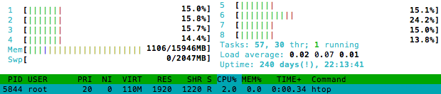
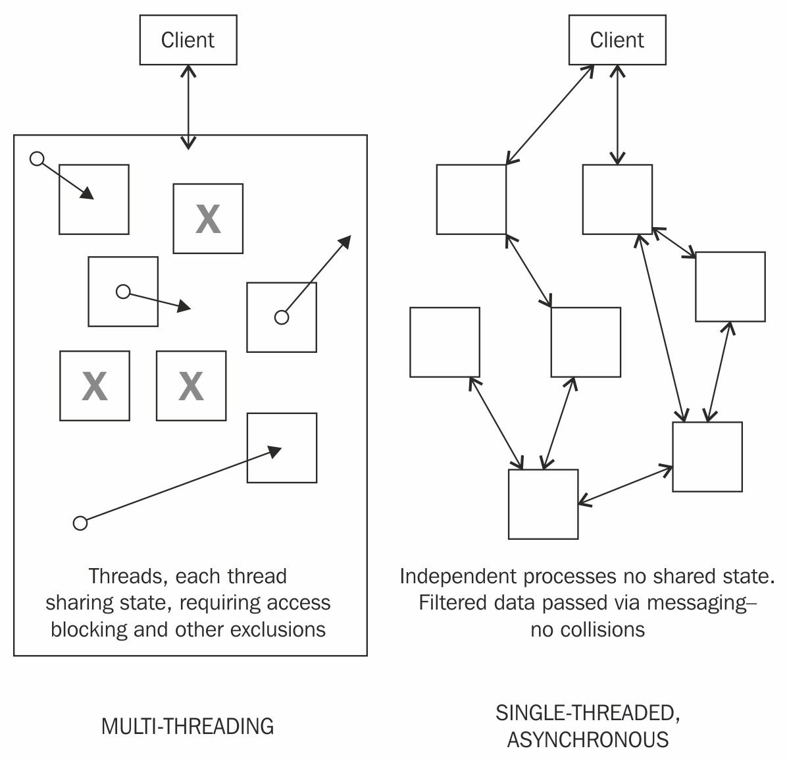
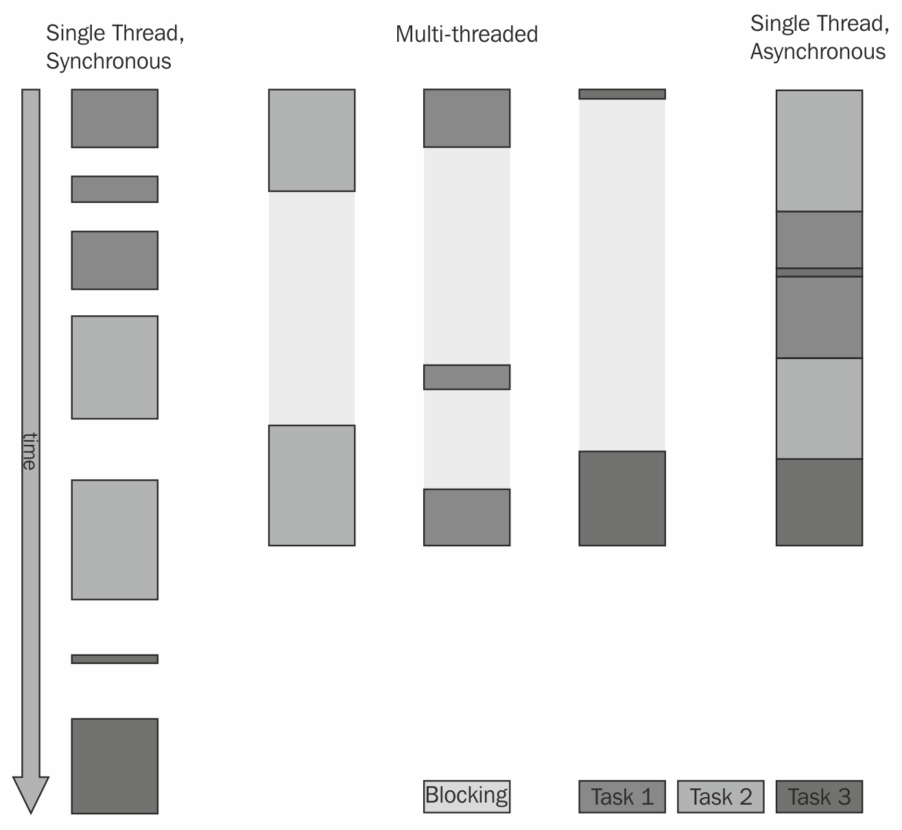
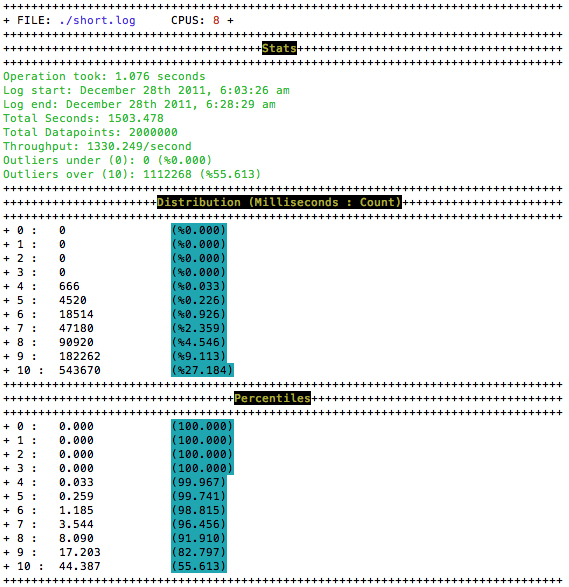
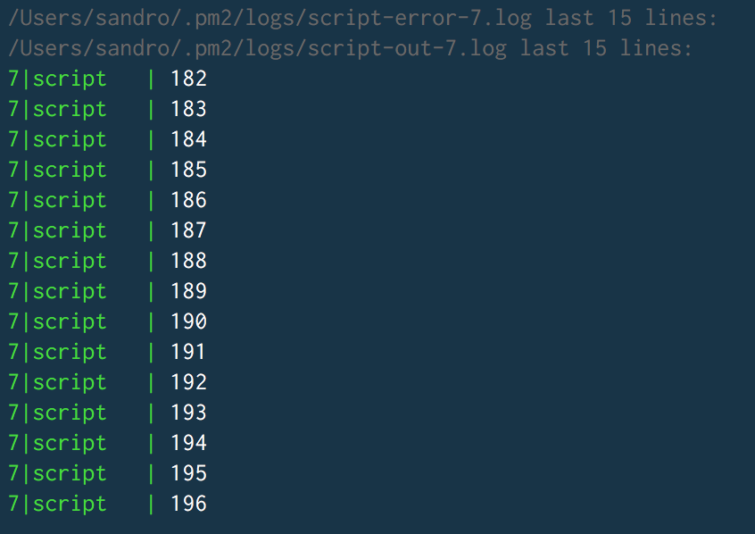
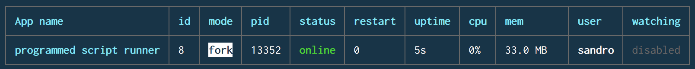
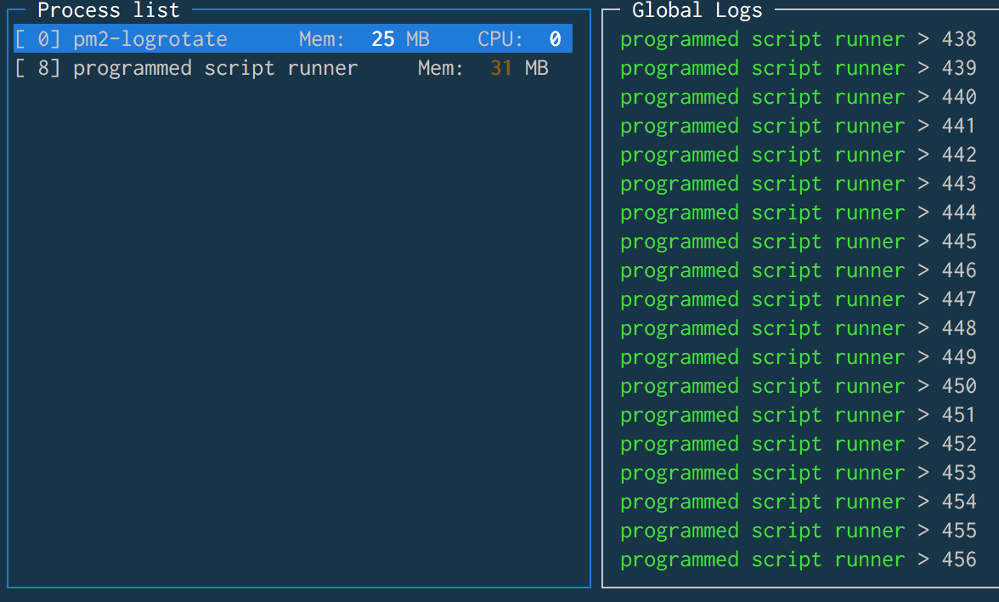
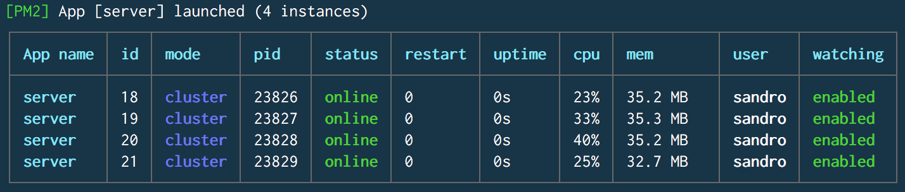
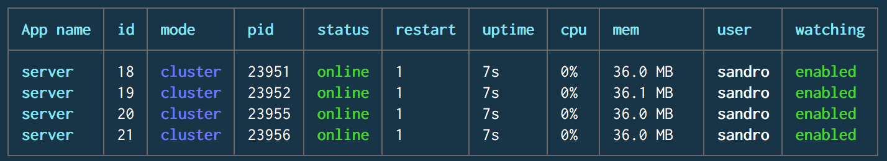
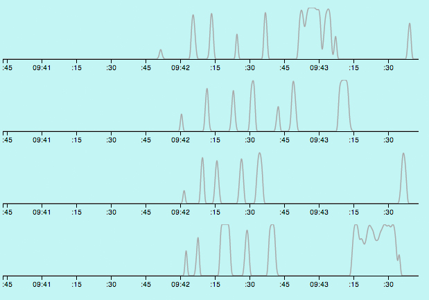

# 第七章：使用多个进程

“现在很遗憾的是，现在几乎没有多余的信息。”

– 奥斯卡·王尔德

对于目睹着越来越多的应用程序产生的数据量急剧增加的人来说，I/O 效率的重要性是不言而喻的。用户生成的内容（博客、视频、推文和帖子）正在成为互联网内容的主要类型，这一趋势与社交软件的兴起同步进行，其中对内容之间的交集进行映射产生了另一层数据的指数级增长。

一些数据储存库，如谷歌、Facebook 和其他数百家公司，通过 API 向公众公开其数据，通常是免费的。这些网络每个都收集了令人惊讶的内容、观点、关系等大量数据，这些数据还通过市场研究和各种类型的流量和使用分析进一步增加。这些 API 大多是双向的，既收集并储存成员上传的数据，又提供这些数据。

Node 已经在这一数据扩张期间到来。在本章中，我们将探讨 Node 如何满足对大量数据进行排序、合并、搜索和其他操作的需求。调整软件，使其能够安全、廉价地处理大量数据，在构建快速和可扩展的网络应用程序时至关重要。

我们将在下一章中处理特定的扩展问题。在本章中，我们将研究在设计多个 Node 进程共同处理大量数据的系统时的一些最佳实践。

作为讨论的一部分，我们将研究在构建数据密集型应用程序时的并行策略，重点是如何利用多个 CPU 环境、使用多个工作进程，并利用操作系统本身来实现并行性的效率。通过示例来演示如何将这些独立而高效的处理单元组装成应用程序的过程。 

如第五章*中所述，管理许多同时的客户端连接*，并发性并不等同于并行性。并发的目标是为程序提供良好的结构，简化模拟处理多个同时进行的进程所固有的复杂性。并行性的目标是通过将任务或计算的部分分配给多个工作进程来提高应用程序的性能。值得回顾的是*Clinger*对“…数十、数百甚至数千个独立微处理器，每个都有自己的本地内存和通信处理器，通过高性能通信网络进行通信”的愿景。

我们已经讨论了 Node 如何帮助我们理解非确定性控制流。让我们还记得 Node 的设计者遵循**模块化规则**，鼓励我们编写简单的部分，并通过清晰的接口连接起来。这条规则导致了对简单的网络化进程的偏好，这些进程使用共同的协议进行通信。相关的规则是**简单规则**，如下所述：

正如[`en.wikipedia.org/wiki/Unix_philosophy`](https://en.wikipedia.org/wiki/Unix_philosophy)所说，“开发人员应该通过寻找将程序系统分解为小而简单的协作部分的方法来设计简单。这条规则旨在阻止开发人员对编写“错综复杂且美丽的复杂性”产生情感，而这些实际上是容易出错的程序。”

在我们继续阅读本章内容时，记住这条规则是很好的。为了控制不断增长的数据量，我们可以构建庞大、复杂和强大的单体，希望它们能够保持足够的规模和强大。或者，我们可以构建小而有用的处理单元，可以组合成任意大小的单一处理团队，就像超级计算机可以由成千上万甚至数百万台廉价的处理器构建而成一样。

在阅读本章时，进程查看器将非常有用。Unix 系统的一个很好的工具是**htop**，可以从以下网址下载：[`hisham.hm/htop/`](http://hisham.hm/htop/)。该工具提供了 CPU 和内存使用情况的视图；在这里，我们可以看到负载是如何分布在所有八个核心上的：



让我们开始研究线程和进程。

# Node 的单线程模型

Node 环境的整体展示了多线程并行性的效率和适用于具有高并发性特征的应用程序的表达语法。使用 Node 不会限制开发人员、开发人员对系统资源的访问，或者开发人员可能想要构建的应用程序类型。

然而，令人惊讶的是，对 Node 的许多持久批评都是基于这种误解。正如我们将看到的，认为 Node 不是多线程的，因此慢，或者还没有准备好投入使用，简单地错过了重点。JavaScript 是单线程的；Node 堆栈不是。JavaScript 代表了用于协调执行多个多线程 C++进程的语言，甚至是您开发人员创建的定制 C++附加组件。Node 提供 JavaScript，通过 V8 运行，主要作为建模并发的工具。此外，您可以仅使用 JavaScript 编写整个应用程序，这只是该平台的另一个好处。您不必一直使用 JavaScript-如果您选择，可以在 C++中编写大部分应用程序。

在本章中，我们将尝试解决这些误解，为使用 Node 进行乐观开发铺平道路。特别是，我们将研究跨核心、进程和线程分配工作的技术。目前，本节将尝试澄清单个线程的能力有多大（提示：通常您所需要的就是这个）。

# 单线程编程的好处

很难找到任何数量可观的专业软件工程师愿意否认多线程软件开发是痛苦的。然而，为什么做得好这么难呢？

并不是说多线程编程本身很困难-困难在于线程同步的复杂性。使用线程模型构建高并发性非常困难，特别是在状态共享的模型中。一旦应用程序超出最基本的形状，几乎不可能预料到一个线程中的操作可能如何影响其他所有线程。纠缠和冲突迅速增加，有时会破坏共享内存，有时会创建几乎不可能追踪的错误。

Node 的设计者选择认识到线程的速度和并行化优势，而不要求开发人员也这样做。特别是，Node 的设计者希望免除开发人员管理伴随线程系统的困难。

+   共享内存和锁定行为导致系统在复杂性增加时变得非常难以理解。

+   任务之间的通信需要实现各种同步原语，如互斥锁和信号量、条件变量等。一个本来就具有挑战性的环境需要高度复杂的工具，扩展了完成甚至相对简单系统所需的专业知识水平。

+   这些系统中常见的竞争条件和死锁是常见的陷阱。在共享程序空间内同时进行读写操作会导致顺序问题，两个线程可能会不可预测地*竞争*影响状态、事件或其他关键系统特征的权利。

+   由于在线程之间和它们的状态之间保持可靠的边界是如此困难，确保一个库（对于 Node 来说是一个*模块*）是线程安全的需要大量的开发人员时间。我能知道这个库不会破坏我的应用的某个部分吗？保证线程安全需要库开发人员的极大细心，而这些保证可能是有条件的；例如，一个库在读取时可能是线程安全的，但在写入时可能不是。

单线程的主要论点是，在并发环境中控制流是困难的，特别是当内存访问或代码执行顺序是不可预测的时候：

+   开发人员不再需要关注任意锁定和其他冲突，可以专注于构建可预测顺序的执行链。

+   由于并行化是通过使用多个进程完成的，每个进程都有一个独立和不同的内存空间，进程之间的通信保持简单——通过简单性原则，我们不仅实现了简单和无错的组件，还实现了更容易的互操作性。

+   由于状态不会（任意地）在单个 Node 进程之间共享；单个进程会自动受到保护，不会受到其他进程对内存重新分配或资源垄断的意外访问。通信是通过清晰的通道和基本协议进行的，所有这些都使得编写跨进程进行不可预测更改的程序变得非常困难。

+   线程安全是开发人员不再需要浪费时间担心的一个问题。由于单线程并发消除了多线程并发中存在的冲突，开发可以更快地进行，更加稳固。在下图中，我们可以看到左侧如何跨线程共享状态需要细心管理以防止冲突，而右侧的“无共享”架构避免了冲突和阻塞动作：



由事件循环高效管理的单个线程为 Node 程序带来了稳定性、可维护性、可读性和韧性。重要的消息是，Node 继续向开发人员提供多线程的速度和能力——Node 设计的精华使得这种能力变得透明，反映了 Node 既定目标的一部分，即为最多的人带来最大的力量，而最少的困难。

在下图中，展示了两种单线程模型和多线程模型之间的差异：



没有逃脱阻塞操作的可能性——例如，从文件中读取始终需要一些时间。单线程同步模型迫使每个任务在开始之前等待其他任务完成，消耗更多时间。使用线程可以并行启动多个任务，甚至在不同的时间，总执行时间不会超过最长运行线程所需的时间。当使用线程时，开发人员需要负责同步每个单独线程的活动，使用锁定或其他调度工具。当线程数量增加时，这可能变得非常复杂，而在这种复杂性中存在非常微妙和难以发现的错误。

与其让开发人员为这种复杂性而苦苦挣扎，Node 本身管理 I/O 线程。您无需微观管理 I/O 线程；只需设计一个应用程序来建立数据可用性点（回调），以及一旦该数据可用就执行的指令。线程在底层提供了相同的效率，但它们的管理通过一个易于理解的接口暴露给开发人员。

# 多线程已经是本地和透明的

Node 的 I/O 线程池在操作系统范围内执行，并且其工作分布在核心之间（就像操作系统安排的任何其他作业一样）。当您运行 Node 时，您已经利用了其多线程执行。

在即将讨论的子进程和集群模块中，我们将看到这种并行性的实现。我们将看到 Node 并没有被剥夺操作系统的全部功能。

正如我们之前所看到的，在讨论 Node 的核心架构时，执行 JavaScript 程序的 V8 线程绑定到`libuv`，后者作为主要的系统级 I/O 事件分发器。在这种情况下，`libuv`处理由相关 JavaScript 进程或模块命令请求的定时器、文件系统调用、网络调用和其他 I/O 操作，例如`fs.readFile`和`http.createServer`。因此，主 V8 事件循环最好被理解为一个控制流编程接口，由高效的、多线程的系统代理`libuv`支持和驱动。

*Bert Belder*，Node 的核心贡献者之一，也是`libuv`的核心贡献者之一。事实上，Node 的发展引发了`libuv`开发的同时增加，这种反馈循环只会提高这两个项目的速度和稳定性。它已经合并并取代了形成 Node 原始核心的`libeo`和`libev`库。

考虑雷蒙德的另一条规则，**分离原则**：“分离策略和机制；分离接口和引擎。”驱动 Node 的异步、事件驱动编程风格的引擎是`libuv`；该引擎的接口是 V8 的 JavaScript 运行时。继续看雷蒙德的话：

"实现这种分离的一种方法是，例如，将您的应用程序编写为由嵌入式脚本语言驱动的 C 服务例程库，其中控制流程由脚本语言而不是 C 编写。"

在单个可预测线程的抽象中编排超高效的并行操作系统进程的能力是有意设计的，而不是妥协。

它总结了应用程序开发过程如何改进的务实分析，绝对不是对可能性的限制。

libuv 的详细拆包可以在以下网址找到：[`github.com/nikhilm/uvbook`](https://github.com/nikhilm/uvbook)。**Burt Belder**也在以下网址深入讲解了 libuv 和 Node 在内部是如何工作的：[`www.youtube.com/watch?v=PNa9OMajw9w`](https://www.youtube.com/watch?v=PNa9OMajw9w)。

# 创建子进程

软件开发不再是单片程序的领域。在网络上运行的应用程序不能放弃互操作性。现代应用程序是分布式和解耦的。我们现在构建连接用户与分布在互联网上的资源的应用程序。许多用户同时访问共享资源。如果整个复杂系统被理解为解决一个或几个明确定义的相关问题的程序接口的集合，那么这样的系统更容易理解。在这样的系统中，预期（并且是可取的）进程不会空闲。

Node 的早期批评是它没有多核意识，也就是说，如果 Node 服务器在具有多个核心的机器上运行，它将无法利用这种额外的计算能力。在这个看似合理的批评中隐藏着一种基于草人的不公正偏见：一个程序如果无法显式分配内存和执行*线程*以实现并行化，就无法处理企业级问题。

这种批评是持久的。这也是不正确的。

虽然单个 Node 进程在单个核心上运行，但可以通过`child_process`模块生成任意数量的 Node 进程。该模块的基本用法很简单：我们获取一个`ChildProcess`对象并监听数据事件。此示例将调用 Unix 命令`ls`，列出当前目录：

```js
const spawn = require('child_process').spawn;
let ls = spawn('ls', ['-lh', '.']);
ls.stdout.on('readable', function() {
    let d = this.read();
    d && console.log(d.toString());
});
ls.on('close', code => {
    console.log(`child process exited with code: ${code}`);
});
```

在这里，我们生成了`ls`进程（列出目录），并从生成的`readable`流中读取，接收到类似以下内容：

```js
-rw-r--r-- 1 root root 43 Jul 9 19:44 index.html
 -rw-rw-r-- 1 root root 278 Jul 15 16:36 child_example.js
 -rw-r--r-- 1 root root 1.2K Jul 14 19:08 server.js
 child process exited with code 0
```

可以以这种方式生成任意数量的子进程。这里需要注意的是，当生成子进程或以其他方式创建子进程时，操作系统本身会将该进程的责任分配给特定的 CPU。Node 不负责操作系统分配资源的方式。结果是，在具有八个核心的机器上，生成八个进程很可能会导致每个进程分配到独立的处理器。换句话说，操作系统会自动将子进程跨 CPU 分配，这证明了 Node 可以充分利用多核环境的说法是错误的。

每个新的 Node 进程（子进程）分配了 10MB 的内存，并表示一个至少需要 30 毫秒启动的新 V8 实例。虽然您不太可能生成成千上万个这样的进程，但了解如何查询和设置用户创建进程的操作系统限制是有益的；htop 或 top 将报告当前运行的进程数量，或者您可以在命令行中使用`ps aux | wc –l`。`ulimit` Unix 命令（[`ss64.com/bash/ulimit.html`](https://ss64.com/bash/ulimit.html)）提供了有关操作系统上用户限制的重要信息。通过传递`ulimit`，-u 参数将显示可以生成的最大用户进程数。通过将其作为参数传递来更改限制：`ulimit –u 8192`。

`child_process`模块表示一个公开四个主要方法的类：`spawn`、`fork`、`exec`和`execFile`。这些方法返回一个扩展了`EventEmitter`的`ChildProcess`对象，公开了一个用于管理子进程的接口和一些有用的函数。我们将看一下它的主要方法，然后讨论常见的`ChildProcess`接口。

# 生成进程

这个强大的命令允许 Node 程序启动并与通过系统命令生成的进程进行交互。在前面的示例中，我们使用 spawn 调用了一个本机操作系统进程`ls`，并传递了`lh`和`.`参数给该命令。通过这种方式，任何进程都可以像通过命令行启动一样启动。该方法接受三个参数：

+   **命令**：要由操作系统 shell 执行的命令

+   **参数（可选）**：这些是作为数组发送的命令行参数

+   **选项**：用于`spawn`的可选设置映射

`spawn`的选项允许仔细定制其行为：

+   `cwd`（字符串）：默认情况下，命令将理解其当前工作目录与调用 spawn 的 Node 进程相同。使用此指令更改该设置。

+   `env`（对象）：用于将环境变量传递给子进程。例如，考虑使用环境对象生成子进程，如下所示：

```js
{
  name: "Sandro",
  role: "admin"
}
```

子进程环境将可以访问这些值：

+   `detached`（布尔值）：当父进程生成子进程时，两个进程形成一个组，父进程通常是该组的领导者。使用`detached`可以使子进程成为组的领导者。这将允许子进程在父进程退出后继续运行。这是因为父进程默认会等待子进程退出。您可以调用`child.unref()`告诉父进程的事件循环不应计算子引用，并在没有其他工作存在时退出。

+   `uid`（数字）：设置子进程的`uid`（用户标识）指令，以标准系统权限的形式，例如具有子进程执行权限的 UID。

+   gid（数字）：为子进程设置`gid`（组标识）指令，以标准系统权限的形式，例如具有对子进程执行权限的 GID。

+   stdio（字符串或数组）：子进程具有文件描述符，前三个是`process.stdin`，`process.stdout`和`process.stderr`标准 I/O 描述符，按顺序（fds = 0,1,2）。此指令允许重新定义、继承这些描述符等。

考虑以下子进程程序的输出：

```js
process.stdout.write(Buffer.from("Hello!"));
```

在这里，父进程将监听`child.stdout`。相反，如果我们希望子进程继承其父进程的`stdio`，这样当子进程写入`process.stdout`时，发出的内容会通过管道传输到父进程的`process.stdout`，我们将传递相关的父进程文件描述符给子进程，覆盖其自己的文件描述符：

```js
spawn("node", ['./reader.js', './afile.txt'], {
  stdio: [process.stdin, process.stdout, process.stderr]
});
```

在这种情况下，子进程的输出将直接传输到父进程的标准输出通道。此外，有关此类模式的更多信息，请参见 fork 如下。

三个（或更多）文件描述符可以取六个值中的一个：

+   管道：这在子进程和父进程之间创建了一个管道。由于前三个子文件描述符已经暴露给了父进程（`child.stdin`，`child.stdout`和`child.stderr`），这只在更复杂的子实现中是必要的。

+   ipc：这在子进程和父进程之间创建了一个 IPC 通道，用于传递消息。子进程可能有一个 IPC 文件描述符。一旦建立了这种连接，父进程可以通过`child.send`与子进程通信。如果子进程通过此文件描述符发送 JSON 消息，则可以使用`child.on("message")`捕获这些消息。如果作为子进程运行 Node 程序，可能更好的选择是使用`ChildProcess.fork`，它内置了这个消息通道。

+   ignore：文件描述符 0-2 将附加到`/dev/null`。对于其他文件描述符，将不会在子进程上设置引用的文件描述符。

+   流对象：这允许父进程与子进程共享流。为了演示目的，假设有一个子进程，它将相同的内容写入任何提供的`WritableStream`，我们可以这样做：

```js
let writer = fs.createWriteStream('./a.out');
writer.on('open', () => {
  let cp = spawn("node", ['./reader.js'], {
    stdio: [null, writer, null]
  });
});
```

子进程现在将获取其内容并将其传输到已发送的任何输出流：

```js
fs.createReadStream('cached.data').pipe(process.stdout);
```

+   整数：文件描述符 ID。

+   null 和 undefined：这些是默认值。对于文件描述符 0-2（`stdin`，`stdout`和`stderr`），将创建一个管道；其他默认为`ignore`。

除了将`stdio`设置作为数组传递之外，还可以将某些常见的分组传递

通过传递以下这些快捷字符串值之一来实现：

+   `'ignore' = ['ignore', 'ignore', 'ignore']`

+   `'pipe' = ['pipe', 'pipe', 'pipe']`

+   `'inherit' = [process.stdin, process.stdout, process.stderr]`

+   `[0,1,2]`

我们已经展示了使用`spawn`来运行 Node 程序作为子进程的一些示例。虽然这是一个完全有效的用法（也是尝试 API 选项的好方法），但`spawn`主要用于运行系统命令。有关将 Node 进程作为子进程运行的更多信息，请参阅 fork 的讨论如下。

应该注意的是，生成任何系统进程的能力意味着可以使用 Node 来运行安装在操作系统上的其他应用程序环境。如果安装了流行的 PHP 语言，就可以实现以下功能：

```js
const spawn = require('child_process').spawn;
let php = spawn("php", ['-r', 'print "Hello from PHP!";']);
php.stdout.on('readable', () => {
  let d;
  while (d = this.read()) {
    console.log(d.toString());
  }
});
// Hello from PHP!
```

运行一个更有趣、更大的程序同样容易。

除了通过这种技术异步地运行 Java 或 Ruby 或其他程序，我们还对 Node 的一个持久的批评有了一个很好的回答：JavaScript 在处理数字或执行其他 CPU 密集型任务方面不如其他语言快。这是真的，从这个意义上说，Node 主要针对 I/O 效率进行了优化，并帮助管理高并发应用程序，并且 JavaScript 是一种解释性语言，没有专注于重型计算。

然而，使用`spawn`，可以很容易地将大量计算和长时间运行的例程传递给其他环境中的独立进程，例如分析引擎或计算引擎。当这些操作完成时，Node 的简单事件循环将确保通知主应用程序，无缝地集成产生的数据。与此同时，主应用程序可以继续为客户端提供服务。

# 分叉进程

与`spawn`一样，`fork`启动一个子进程，但设计用于运行 Node 程序，并具有内置的通信通道的额外好处。与将系统命令作为其第一个参数传递给`fork`不同，可以将路径传递给 Node 程序。与`spawn`一样，命令行选项可以作为第二个参数发送，并在分叉的子进程中通过`process.argv`访问。

可选的选项对象可以作为第三个参数传递，具有以下参数：

+   `cwd`（字符串）：默认情况下，命令将理解其当前工作目录与调用`fork`的 Node 进程的相同。使用此指令更改该设置。

+   `env`（对象）：这用于将环境变量传递给子进程。参考 spawn。

+   `encoding`（字符串）：这设置了通信通道的编码。

+   `execPath`（字符串）：这是用于创建子进程的可执行文件。

+   `silent`（布尔值）：默认情况下，fork 的子进程将与父进程关联（例如，`child.stdout`与`parent.stdout`相同）。将此选项设置为 true 将禁用此行为。

`fork`和`spawn`之间的一个重要区别是，前者的子进程在完成时不会自动退出。这样的子进程在完成时必须显式退出，可以通过`process.exit()`轻松实现。

在下面的例子中，我们创建一个子进程，每十分之一秒发出一个递增的数字，然后父进程将其转储到系统控制台。首先，让我们看看子程序：

```js
let cnt = 0;
setInterval(() => {
  process.stdout.write(" -> " + cnt++);
}, 100);
```

同样，这将简单地写入一个不断增加的数字。记住，使用`fork`，子进程将继承其父进程的`stdio`，我们只需要创建子进程即可在运行父进程的终端中获得输出：

```js
var fork = require('child_process').fork;
fork('./emitter.js');
// -> 0 -> 1 -> 2 -> 3 -> 4 -> 5 -> 6 -> 7 -> 8 -> 9 -> 10 ...
```

这里可以演示静默选项；`fork('./emitter.js', [], { silent: true });`关闭了对终端的任何输出。

创建多个并行进程很容易。让我们增加创建的子进程数量：

```js
fork('./emitter.js');
fork('./emitter.js');
fork('./emitter.js');
// 0 -> 0 -> 0 -> 1 -> 1 -> 1 -> 2 -> 2 -> 2 -> 3 -> 3 -> 3 -> 4 ...
```

到这一点应该很清楚，通过使用`fork`，我们正在创建许多并行执行上下文，分布在所有机器核心上。

这足够简单，但内置的`fork`通信通道使得与分叉子进程的通信变得更加容易和清晰。考虑以下文件，它生成一个子进程并与其通信：

```js
// parent.js
const fork = require('child_process').fork;
let cp = fork('./child.js');
cp.on('message', msgobj => {
    console.log(`Parent got message: ${msgobj.text}`);
});
cp.send({
    text: 'I love you'
});
```

我们看到现在有一个通信通道可用，通过它父进程可以发送消息，同时也可以接收来自子进程的消息，如下所示：

```js
// child.js
process.on('message', msgobj => {
    console.log('Child got message:', msgobj.text);
    process.send({
        text: `${msgobj.text} too`
    });
});
```

通过执行父脚本，我们将在控制台中看到以下内容：

```js
Child got message: I love you
Parent got message: I love you too
```

我们将很快深入探讨这个重要的跨进程通信概念。

# 缓冲进程输出

在某些情况下，子进程的完整缓冲输出足够，无需通过事件管理数据，`child_process`提供了`exec`方法。该方法接受三个参数：

+   **command：**命令行字符串。与`spawn`和`fork`不同，它通过数组将参数传递给命令，这个第一个参数接受一个完整的命令字符串，例如`ps aux | grep node`。

+   **选项：**这是一个可选参数：

+   `cwd`（字符串）：这设置了命令进程的工作目录。

+   `env`（对象）：这是一个键值对的映射，将被暴露给子进程。

+   `encoding`（字符串）：这是子进程数据流的编码。默认值为`'utf8'`。

+   `timeout`（数字）：这指定等待进程完成的毫秒数，此时子进程将收到`killSignal.maxBuffer`值。

+   `killSignal.maxBuffer`（数字）：这是`stdout`或`stderr`上允许的最大字节数。当超过这个数字时，进程将被杀死。默认为 200 KB。

+   `killSignal`（字符串）：在超时后，子进程接收到此信号。默认为`SIGTERM`。

+   **回调**：这个接收三个参数：一个`Error`对象（如果有的话），`stdout`（包含结果的`Buffer`对象），`stderr`（包含错误数据的`Buffer`对象，如果有的话）。如果进程被杀死，`Error.signal`将包含杀死信号。

当您想要`exec`的缓冲行为，但是针对的是一个 Node 文件时，请使用`execFile`。重要的是，`execFile`不会生成一个新的子 shell，这使得它的运行成本稍微降低。

# 与您的子进程通信

所有`ChildProcess`对象的实例都扩展了`EventEmitter`，公开了用于管理子数据连接的有用事件。此外，`ChildProcess`对象公开了一些有用的方法，用于直接与子进程交互。现在让我们来看一下这些方法，首先是属性和方法：

+   `child.connected`: 当子进程通过`child.disconnect()`与其父进程断开连接时，此标志将设置为`false`。

+   `child.stdin`: 这是一个对应于子进程标准输入的`WritableStream`。

+   `child.stdout`: 这是一个对应于子进程标准输出的`ReadableStream`。

+   `child.stderr`: 这是一个对应于子进程标准错误的`ReadableStream`。

+   `child.pid`: 这是一个整数，表示分配给子进程的进程 ID（PID）。

+   `child.kill`: 尝试终止子进程，发送一个可选的信号。如果未指定信号，则默认为`SIGTERM`（有关信号的更多信息，请访问：[`en.wikipedia.org/wiki/Signal_(IPC)`](https://en.wikipedia.org/wiki/Signal_(IPC))）。虽然方法名称听起来是终端的，但不能保证杀死进程 - 它只是向进程发送一个信号。危险的是，如果尝试对已经退出的进程进行`kill`，则可能会导致新分配了死进程的 PID 的另一个进程接收到信号，后果不可预测。此方法应该触发`close`事件，该事件用于关闭进程的信号。

+   `child.disconnect()`: 此命令断开子进程与其父进程之间的 IPC 连接。然后，子进程将会优雅地死去，因为它没有 IPC 通道来保持其存活。您也可以在子进程内部调用`process.disconnect()`。一旦子进程断开连接，该子引用上的`connected`标志将被设置为`false`。

# 向子进程发送消息

正如我们在讨论`fork`时所看到的，并且在`spawn`的`ipc`选项上使用时，子进程可以通过`child.send`发送消息，消息作为第一个参数传递。可以将 TCP 服务器或套接字句柄作为第二个参数传递。通过这种方式，TCP 服务器可以将请求分布到多个子进程。例如，以下服务器将套接字处理分布到等于可用 CPU 总数的多个子进程。每个分叉的子进程都被赋予一个唯一的 ID，在启动时报告。每当 TCP 服务器接收到一个套接字时，该套接字将作为一个句柄传递给一个随机的子进程：

```js
// tcpparent.js
const fork = require('child_process').fork;
const net = require('net');
let children = [];
require('os').cpus().forEach((f, idx) => {
 children.push(fork('./tcpchild.js', [idx]));
});
net.createServer((socket) => { 
 let rand = Math.floor(Math.random() * children.length);
 children[rand].send(null, socket);
}).listen(8080)
```

然后，该子进程发送一个唯一的响应，证明了套接字处理正在分布式进行：

```js
// tcpchild.js
let id = process.argv[2];
process.on('message', (n, socket) => {
 socket.write(`child ${id} was your server today.\r\n`);
 socket.end();
});
```

在一个终端窗口中启动父服务器。在另一个窗口中，运行`telnet 127.0.0.1 8080`。您应该看到类似以下输出，每次连接都显示一个随机的子 ID（假设存在多个核心）：

```js
Trying 127.0.0.1...
 …
 child 3 was your server today.
 Connection closed by foreign host.
```

多次访问该端点。您应该看到您的请求是由不同的子进程处理的。

# 使用多个进程解析文件

许多开发人员将承担的任务之一是构建日志文件处理器。日志文件可能非常大，有数兆字节长。任何一个单独处理非常大文件的程序都很容易遇到内存问题，或者运行速度太慢。逐块处理大文件是有意义的。我们将构建一个简单的日志处理器，将大文件分成多个部分，并将每个部分分配给几个子工作进程，以并行运行它们。

此示例的完整代码可以在代码包的`logproc`文件夹中找到。我们将专注于主要例程：

+   确定日志文件中的行数

+   将它们分成相等的块

+   为每个块创建一个子进程并传递解析指令

+   组装并显示结果

为了获得文件的字数，我们使用`child.exec`和`wc`命令，如下面的代码所示：

```js
child.exec(`wc -l ${filename}`, function(e, fL) {
  fileLength = parseInt(fL.replace(filename, ""));

  let fileRanges = [];
  let oStart = 1;
  let oEnd = fileChunkLength;

  while(oStart < fileLength) {
    fileRanges.push({
      offsetStart: oStart,
      offsetEnd: oEnd
    })
    oStart = oEnd + 1;
    oEnd = Math.min(oStart + fileChunkLength, fileLength);
  } 
  ...
}
```

假设我们使用 500,000 行的`fileChunkLength`。这意味着将创建四个子进程，并且每个子进程将被告知处理文件中的 500,000 行的范围，例如 1 到 500,000：

```js
let w = child.fork('bin/worker');
w.send({
  file: filename,
  offsetStart: range.offsetStart,
  offsetEnd: range.offsetEnd
});
w.on('message', chunkData => {
  // pass results data on to a reducer.
});
```

这些工作进程本身将使用子进程来获取它们分配的块，使用`sed`，这是 Unix 的本地流编辑器：

```js
process.on('message', (m) => {
  let filename = m.file;
  let sed = `sed -n '${m.offsetStart},${m.offsetEnd}p' ${filename}`;
  let reader = require('child_process').exec(sed, {maxBuffer: 1024e6}, (err, data, stderr) => {

     // Split the file chunk into lines and process it.
     //
     data = data.split("\n");
     ...
  })
})            
```

在这里，我们执行`sed –n '500001,1000001p' logfile.txt`命令，该命令会提取给定范围的行并返回它们以进行处理。一旦我们处理完数据的列（将它们相加等），子进程将把数据返回给主进程（如前所述），数据结果将被写入文件，否则将被操作，或者发送到`stdout`，如下图所示：



这个示例的完整文件要长得多，但所有额外的代码只是格式和其他细节——我们已经描述的 Node 子进程管理足以创建一个并行化的系统，用于处理数百万行代码，只需几秒钟。通过使用更多的进程分布在更多的核心上，日志解析速度甚至可以进一步降低。

在您的代码包中的`/logproc`文件夹中查看`README.MD`文件，以尝试此示例。

# 使用集群模块

正如我们在处理大型日志文件时所看到的，一个主父控制器对多个子进程的模式非常适合 Node 的垂直扩展。作为对此的回应，Node API 已经通过`cluster`模块进行了增强，该模块正式化了这种模式，并有助于更容易地实现它。继续 Node 的核心目标，帮助构建可扩展的网络软件更容易，`cluster`的特定目标是促进在许多子进程之间共享网络端口。

例如，以下代码创建了一个共享相同 HTTP 连接的工作进程的`cluster`：

```js
const cluster = require('cluster');
const http = require('http');
const numCPUs = require('os').cpus().length;

if(cluster.isMaster) {
   for(let i = 0; i < numCPUs; i++) {
      cluster.fork();
   }
}

if(cluster.isWorker) {
   http.createServer((req, res) => {
      res.writeHead(200);
      res.end(`Hello from ${cluster.worker.id}`);
   }).listen(8080);
}
```

我们将很快深入了解细节。现在，请注意`cluster.fork`没有带任何参数。`fork`没有命令或文件参数会做什么？在`cluster`中，默认操作是`fork`当前程序。我们在`cluster.isMaster`期间看到，操作是`fork`子进程（每个可用的 CPU 一个）。当这个程序在分叉的上下文中重新执行时，`cluster.isWorker`将为`true`，并且将启动一个在共享端口上运行的新 HTTP 服务器。多个进程共享单个服务器的负载。

使用浏览器启动并连接到此服务器。您将看到类似`Hello from 8`的内容，这是与负责处理您的请求的唯一`cluster.worker.id`值相对应的整数。自动处理所有工作进程的负载平衡，因此刷新浏览器几次将导致显示不同的工作进程 ID。

稍后，我们将通过一个示例来介绍如何在集群中共享套接字服务器。现在，我们将列出集群 API，它分为两部分：可用于集群主进程的方法、属性和事件，以及可用于子进程的方法、属性和事件。在这种情况下，使用 fork 定义工作进程，`child_process`的该方法的文档也可以应用于这里：

+   `cluster.isMaster`：这是一个布尔值，指示进程是否为主进程。

+   `cluster.isWorker`：这是一个布尔值，指示进程是否是从主进程 fork 出来的。

+   `cluster.worker`：这将引用当前工作进程对象，仅对子进程可用。

+   `cluster.workers`：这是一个哈希，包含对所有活动工作进程对象的引用，以工作进程 ID 为键。在主进程中使用此方法循环遍历所有工作进程对象。这仅存在于主进程中。

+   `cluster.setupMaster([settings])`：这是一种方便的方法，用于传递默认参数映射，以在 fork 子进程时使用。如果所有子进程都将 fork 相同的文件（通常情况下），通过在这里设置，可以节省时间。可用的默认值如下：

+   `exec`（字符串）：这是进程文件的文件路径，默认为`__filename`。

+   `args`（数组）：这包含作为参数发送到子进程的字符串。默认情况下，使用`process.argv.slice(2)`获取参数。

+   `silent`（布尔值）：这指定是否将输出发送到主进程的 stdio，默认为 false。

+   `cluster.fork([env])`：创建一个新的工作进程。只有主进程可以调用此方法。要将键值对映射暴露给子进程的环境，请发送一个对象到`env`。

+   `cluster.disconnect([callback])`：用于终止集群中的所有工作进程。一旦所有工作进程都已经优雅地死亡，如果集群进程没有更多事件需要等待，它将自行终止。要在所有子进程过期时收到通知，请传递`callback`。

# 集群事件

集群对象发出几个事件，如下所列：

+   `fork`：当主进程尝试 fork 一个新的子进程时触发。这与`online`不同。这接收一个`worker`对象。

+   `online`：当主进程收到子进程完全绑定的通知时触发。这与`fork`事件不同，并接收一个`worker`对象。

+   `listening`：当工作进程执行需要`listen()`调用的操作（例如启动 HTTP 服务器）时，此事件将在主进程中触发。该事件发出两个参数：一个`worker`对象和包含连接的`address`、`port`和`addressType`值的地址对象。

+   `disconnect`：每当子进程断开连接时调用，这可能是通过进程退出事件或调用`child.kill()`后发生的。这将在`exit`事件之前触发-它们不是相同的。这接收一个`worker`对象。

+   `exit`：每当子进程死亡时，都会触发此事件。该事件接收三个参数：一个`worker`对象，退出代码数字和导致进程被杀死的信号字符串，如`SIGNUP`。

+   `setup`：在`cluster.setupMaster`执行后调用。

# 工作进程对象属性

工作进程具有以下属性和方法：

+   `worker.id`：这是分配给工作进程的唯一 ID，也代表`cluster.workers`索引中的工作进程键。

+   `worker.process`：这指定了一个引用工作进程的`ChildProcess`对象。

+   `worker.suicide`：最近已经对其进行了`kill`或`disconnect`调用的工作进程将其`suicide`属性设置为`true`。

+   `worker.send(message, [sendHandle])`：参考之前提到的`child_process.fork()`。

+   `worker.kill([signal])`：杀死一个工作进程。主进程可以检查该工作进程的`suicide`属性，以确定死亡是有意还是意外的。发送的默认信号值是`SIGTERM`。

+   `worker.disconnect()`：这指示工作人员断开连接。重要的是，与工作人员的现有连接不会立即终止（与`kill`一样），而是允许它们正常退出，然后工作人员完全断开连接。这是因为现有连接可能存在很长时间。定期检查工作人员是否实际断开连接可能是一个很好的模式，也许可以使用超时。

# 工作人员事件

工作人员也会发出事件，例如以下列表中提到的事件：

+   `message`：参考`child_process.fork`

+   `online`：这与`cluster.online`相同，只是检查仅针对指定的工作人员

+   `listening`：这与`cluster.listening`相同，只是检查仅针对指定的工作人员

+   `disconnect`：这与`cluster.disconnect`相同，只是检查仅针对指定的工作人员

+   `exit`：参考`child_process`的`exit`事件

+   `setup`：在`cluster.setupMaster`执行后调用

现在，根据我们现在对`cluster`模块的了解，让我们实现一个实时工具，用于分析许多用户同时与应用程序交互时发出的数据流。

# 使用 PM2 管理多个进程

PM2 旨在成为企业级进程管理器。如其他地方所讨论的，Node 在 Unix 进程中运行，其子进程和集群模块用于在跨多个核心扩展应用程序时生成更多进程。PM2 可用于通过命令行和以编程方式进行部署和监视 Node 进程。PM2 免除了开发人员配置集群样板的复杂性，自动处理重启，并提供了开箱即用的高级日志记录和监视工具。

全局安装 PM2：`npm install pm2 -g`

使用 PM2 的最简单方法是作为一个简单的进程运行程序。以下程序将每秒递增并记录一个值：

```js
// script.js
let count = 1;
function loop() {
  console.log(count++);
  setTimeout(loop, 1000);
}
loop();
```

在这里，我们从`script.js`中派生一个新的进程，在后台*永远*运行，直到我们停止它。这是运行守护进程的绝佳方式：

```js
pm2 start script.js 
// [PM2] Process script.js launched
```

脚本启动后，您应该在终端中看到类似于以下内容：

！[](img/c79e0330-beca-4f40-af85-6c6b84c36df8.png)

大多数值的含义应该是清楚的，例如您的进程使用的内存量，它是否在线，它已经运行了多长时间等（模式和观看字段将很快解释）。进程将继续运行，直到停止或删除。

要在启动进程时为其设置自定义名称，请将`--name`参数传递给 PM2：`pm2 start script.js --name 'myProcessName'`。

可以随时通过命令`pm2 list`查看所有正在运行的 PM2 进程的概述。

PM2 提供其他简单的命令：

+   `pm2 stop <app_name | id | all>`：按名称停止进程，id 或停止所有进程。已停止的进程将保留在进程列表中，并且可以稍后重新启动。

+   `pm2 restart <app_name | id | all>`：重新启动进程。在所有进程列表中显示了进程重新启动的次数。要在达到某个最大内存限制（比如 15M）时自动重新启动进程，请使用命令`pm2 start script.js --max-memory-restart 15M`。

+   `pm2 delete <app_name | id | all>`：删除进程。此进程无法重新启动。pm2 delete all 删除所有 PM2 进程。

+   `pm2 info <app_name | id>`：提供有关进程的详细信息。

您将经常使用`pm2 info <processname>`。确保`script.js`作为 PM2 进程运行，使用`PM2 list`，然后使用`pm2 info script`检查该进程信息：

！[](img/480ac271-bf14-4d44-9e8f-bd564a647a33.png)

注意为错误和其他日志给出的路径。请记住，我们的脚本每秒递增一个整数并记录该计数。如果您`cat /path/to/script/out/log`，您的终端将显示已写入输出日志的内容，这应该是一个递增的数字列表。错误同样会写入日志。此外，您可以使用`pm2 logs`实时流式传输输出日志：



要清除所有日志，请使用`pm2 flush`。

您还可以以编程方式使用 PM2。要复制我们使用 PM2 运行`scripts.js`的步骤，首先创建以下脚本`programmatic.js`：

```js
const pm2 = require('pm2');

pm2.connect(err => {
   pm2.start('script.js', { 
      name: 'programmed script runner',
      scriptArgs: [
         'first',
         'second',
         'third'
      ],
      execMode : 'fork_mode'
   }, (err, proc) => {
      if(err) {
         throw new Error(err);
      }
   });
});
```

此脚本将使用 pm2 模块将`script.js`作为进程运行。继续使用`node programmatic.js`运行它。执行`pm2 list`应该显示编程脚本运行器是活动的：



要确保，请尝试`pm2 logs`——您应该看到数字正在递增，就像以前一样。您可以在此处阅读有关完整编程选项的信息：[`pm2.keymetrics.io/docs/usage/pm2-api/`](http://pm2.keymetrics.io/docs/usage/pm2-api/)。

# 监控

PM2 使进程监控变得简单。要查看进程的 CPU 和内存使用情况的实时统计信息，只需输入命令`pm2 monit`：



相当不错，对吧？在通过 PM2 管理的生产服务器上，您可以使用此界面快速查看应用程序的状态，包括内存使用情况和运行日志。

PM2 还可以轻松创建基于 Web 的监控界面——只需运行`pm2 web`即可。此命令将启动一个在端口 9615 上监听的受监视进程——运行`pm2 list`现在将列出一个名为`pm2-http-interface`的进程。运行 web 命令，然后在浏览器中导航到`localhost:9615`。您将看到有关您的进程、操作系统等的详细快照，以 JSON 对象的形式：

```js
... 
"monit": {
  "loadavg": [ 1.89892578125, 1.91162109375, 1.896484375 ],
  "total_mem": 17179869184, "free_mem": 8377733120, 
...
{
  "pid": 13352,
  "name": "programmed script runner",
  "pm2_env": {
    "instance_var": "NODE_APP_INSTANCE",
    "exec_mode": "fork_mode",
...
  "pm_id": 8, // our script.js process "monit": {
  "memory": 19619840, "cpu": 0 
...
```

创建一个基于 Web 的 UI，每隔几秒轮询您的服务器，获取进程信息，然后绘制图表，由于 PM2 的这一内置功能，变得更加简单。PM2 还有一个选项，可以在所有管理的脚本上设置一个监视器，这样监视的脚本的任何更改都会导致自动进程重启。这在开发过程中非常有用。

作为演示，让我们创建一个简单的 HTTP 服务器并通过 PM2 运行它：

```js
// server.js
const http = require('http');
http.createServer((req, resp) => {
   if(req.url === "/") {
      resp.writeHead(200, {
         'content-type' : 'text/plain'
      });
      return resp.end("Hello World");
   }
   resp.end();
}).listen(8080);
```

每当访问`localhost:8080`时，此服务器将回显“Hello World”。现在，让我们使用 PM2 进程文件进行更多涉及配置。

# 进程文件

继续使用`pm2 delete all`杀死所有正在运行的 PM2 进程。然后，创建以下`process.json`文件：

```js
// process.json
{
  "apps" : [{
    "name" : "server",
    "script" : "./server.js",
    "watch" : true,
    "env": {
      "NODE_ENV": "development"
    },
    "instances" : 4,
    "exec_mode" : "cluster"
  }]
}
```

我们将使用此部署定义在 PM2 上启动我们的应用程序。请注意，apps 是一个数组，这意味着您可以列出几个不同的应用程序，并使用不同的配置同时启动它们。我们将在下面解释这些字段，但现在，请使用`pm2 start process.json`执行此清单。您应该会看到类似于这样的内容：



部署多进程（集群）应用程序如此简单。PM2 将自动在实例之间平衡负载，在清单中通过`instances`属性设置为 4 个 CPU，`exec_mode`为*cluster*（默认模式为“fork”）。在生产环境中，您可能希望在最大核心数之间平衡负载，只需将`instances`设置为`0`即可。此外，您可以看到我们通过`env:`设置了环境变量，您可以在此处为服务器创建*dev*和*prod*（甚至*stage*）配置，设置 API 密钥和密码以及其他环境变量。

打开浏览器并访问`localhost:8080`，以查看服务器是否正在运行。请注意，在我们的 JSON 清单中，我们将`watch`设置为`true`。这告诉 PM2 在您的存储库中更改任何文件时自动重新启动应用程序，跨所有核心。通过更改服务器上的“Hello”消息为其他内容来测试它。然后重新加载`localhost:8080`，您将看到新消息，表明服务器已重新启动。如果列出正在运行的 PM2 进程，您将看到重新启动的次数：



试着多次尝试。重新启动是稳定的，快速的，自动的。

您还可以为监视器指定特定的文件：

```js
{
  "apps" : [{
    ...
    "watch": [
      "tests/*.test",
      "app" 
    ],
    "ignore_watch": [
      "**/*.log"
    ],
    "watch_options": {
      "followSymlinks": false
    },
    ...
  }]
}
```

在这里，我们告诉 PM2 只监视`/test`中的`.test`文件和`/app`目录，忽略任何.log 文件的更改。在底层，PM2 使用 Chokidar ([`github.com/paulmillr/chokidar#api`](https://github.com/paulmillr/chokidar#api))来监视文件更改，因此您可以通过在`watch_options`上设置 Chokidar 选项来进一步配置监视器。请注意，您可以在这些设置中使用 glob 表达式（和正则表达式）。

您可以在此处阅读 PM2 进程文件的完整选项列表：[`pm2.keymetrics.io/docs/usage/application-declaration/`](http://pm2.keymetrics.io/docs/usage/application-declaration/)。

一些需要注意的地方：

+   `max_restarts`：PM2 允许的不稳定重新启动次数。

+   `min_uptime`：在被视为不稳定并触发重新启动之前，应用程序被给予启动的最短时间。

+   `autorestart`：是否在崩溃时重新启动。

+   `node_args`：将命令行参数传递给 Node 进程本身。例如：`node_args: "--harmony"`相当于`node --harmony server.js`。

+   `max_memory_restart`：当内存使用量超过此阈值时发生重新启动。

+   `restart_delay`：特别是在`watch`场景中，您可能希望在文件更改时延迟重新启动，等待一段时间再做出反应。

由于 PM2，服务器应用程序的实时开发变得更加容易。

# 多个工作结果的实时活动更新

利用我们所学到的知识，我们将构建一个多进程系统来跟踪所有访问者对示例网页的行为。这将由两个主要部分组成：一个由 WebSocket 驱动的客户端库，它将在用户移动鼠标时广播每次移动，以及一个管理界面，可视化用户交互以及用户连接和断开系统的时间。我们的目标是展示如何设计一个更复杂的系统（例如跟踪和绘制用户可能进行的每次点击、滑动或其他交互）。

最终的管理界面将显示几个用户的活动图表，并类似于这样：



由于该系统将跟踪所有用户所做的每次鼠标移动的 X 和 Y 位置，我们将使用`cluster`将这连续的数据流跨越所有可用的机器核心，集群中的每个工作进程都共享承载大量套接字数据的负担，这些数据被馈送到一个共享端口。继续访问本章的代码包，并按照`/watcher`文件夹中的`README.MD`说明进行操作。

一个很好的开始是设计模拟客户端页面，它负责捕获所有鼠标移动事件并通过`WebSocket`将它们广播到我们的集群套接字服务器。我们正在使用本机的`WebSocket`实现；您可能希望使用一个库来处理旧版浏览器（如`Socket.IO`）：

```js
<head>
  <script>
    let connection = new WebSocket('ws://127.0.0.1:8081', ['json']);
      connection.onopen = () => {
        let userId = 'user' + Math.floor(Math.random()*10e10);
        document.onmousemove = e => {
          connection.send(JSON.stringify({id: userId, x: e.x, y: e.y}));
        }
      };
  </script>
</head>
```

在这里，我们只需要简单地打开基本的`mousemove`跟踪，它将在每次移动时广播用户鼠标的位置到我们的套接字。此外，我们还发送一个唯一的用户 ID，因为跟踪客户端身份对我们来说以后很重要。请注意，在生产环境中，您将希望通过服务器端身份验证模块实现更智能的唯一 ID 生成器。

为了使这些信息传达给其他客户端，必须设置一个集中的套接字服务器。正如前面提到的，我们希望这个套接字服务器是集群的。每个集群子进程，都是以下程序的副本，将处理客户端发送的鼠标数据：

```js
const SServer = require('ws').Server;
let socketServer = new SServer({port: 8081});
socketServer.on('connection', socket => {
  let lastMessage = null;
  function kill() => {
    if (lastMessage) {                                              
      process.send({kill: lastMessage.id});            
    }
  }
  socket.on('message', message => {
    lastMessage = JSON.parse(message);   
    process.send(lastMessage);                                                                  
  });
  socket.on('close', kill);
  socket.on('error', kill);
});
```

在这个演示中，我们使用了*Einar Otto Stangvik*的非常快速和设计良好的套接字服务器库`ws`，它托管在 GitHub 上：[`github.com/websockets/ws`](https://github.com/websockets/ws)

值得庆幸的是，我们的代码仍然非常简单。我们有一个监听消息的套接字服务器（记住客户端发送的是一个带有鼠标*X*和*Y*以及用户 ID 的对象）。最后，当接收到数据时（`message`事件），我们将接收到的 JSON 解析为一个对象，并通过`process.send`将其传递回我们的集群主。

还要注意我们如何存储最后一条消息（`lastMessage`），出于簿记原因，当连接终止时，我们将需要将此连接上看到的最后一个用户 ID 传递给管理员。

现在已经设置好了捕捉客户端数据广播的部分。一旦接收到这些数据，它是如何传递给先前展示的管理界面的？

我们设计这个系统时考虑了扩展性，并希望将数据的收集与广播数据的系统分离。我们的套接字服务器集群可以接受来自成千上万客户端的持续数据流，并且应该针对这一点进行优化。换句话说，集群应该将广播鼠标活动数据的责任委托给另一个系统，甚至是其他服务器。

在下一章中，我们将研究更高级的扩展和消息传递工具，比如消息队列和 UDP 广播。对于我们在这里的目的，我们将简单地创建一个 HTTP 服务器，负责管理来自管理员的连接并向他们广播鼠标活动更新。我们将使用 SSE 来实现这一点，因为数据流只需要单向，从服务器到客户端。

HTTP 服务器将为管理员登录实现一个非常基本的验证系统，以一种允许我们的套接字集群向所有成功连接广播鼠标活动更新的方式保留成功的连接。它还将作为一个基本的静态文件服务器，当请求时发送客户端和管理 HTML，尽管我们只关注它如何处理两个路由：“admin/adminname”和`/receive/adminname`。一旦服务器被理解，我们将进入我们的套接字集群如何连接到它。

第一个路由`/admin/adminname`主要负责验证管理员登录，还要确保这不是重复登录。一旦确认了身份，我们就可以向管理界面发送一个 HTML 页面。用于绘制先前图片中的图表的特定客户端代码将不在这里讨论。我们需要的是与服务器建立 SSE 连接，以便界面的图表工具可以实时接收鼠标活动的更新。返回的管理员页面上的一些 JavaScript 建立了这样的连接：

```js
let ev = new EventSource('/receive/adminname');
ev.addEventListener("open", () => {
  console.log("Connection opened");
});
ev.addEventListener("message", data => {
  //  Do something with mouse data, like graph it.
}
```

在我们的服务器上，我们实现了`/receive/adminname`路由：

```js
if (method === "receive") {
  // Unknown admin; reject
  if (!admins[adminId]) {
    return response.end();
  }
  response.writeHead(200, {
    "Content-Type": "text/event-stream",
    "Cache-Control": "no-cache",
    "Connection": "keep-alive"
  });
  response.write(":" + Array(2049).join(" ") + "\n");
  response.write("retry: 2000\n");
  response.on("close", () => {
    admins[adminId] = {};
  });
  setInterval(() => {
    response.write("data: PING\n\n");
  }, 15000);
  admins[adminId].socket = response;
  return;
}
```

这个路由的主要目的是建立 SSE 连接并存储管理员的连接，以便我们以后可以向其广播。

现在我们将添加一些部分，将鼠标活动数据传递给可视化界面。使用集群模块跨核心扩展这个子系统是我们的下一步。集群主现在只需要等待来自其提供套接字服务的子进程的鼠标数据，就像之前描述的那样。

我们将使用在之前的集群讨论中提出的相同思想，简单地将先前的套接字服务器代码分叉到所有可用的 CPU 上：

```js
if (cluster.isMaster) {
  let i;
  for (i = 0; i < numCPUs; i++) {
    cluster.fork();
}
cluster.on('exit', (worker, code, signal) => {
  console.log(`worker ${worker.process.pid} died`);
})

// Set up socket worker listeners
Object.keys(cluster.workers).forEach(id => {
  cluster.workers[id].on('message', msg => {
    let a;
    for (a in admins) {
      if (admins[a].socket) {
        admins[a].socket.write(`data: ${JSON.stringify(msg)}\n\n`);
      }
    }
  });
});
```

鼠标活动数据通过套接字传输到一个集群工作进程，并通过`process.send`广播到之前描述的集群主进程。在每个工作进程的消息中，我们遍历所有连接的管理员，并使用 SSE 将鼠标数据发送到他们的可视化界面。管理员现在可以观察客户端的到来和离开，以及他们个人的活动水平。

为了测试系统，首先以默认管理员身份登录，网址为`http://localhost:2112/admin/adminname`。你应该会看到一个青绿色的背景，目前为空，因为没有连接的客户端。接下来，通过打开一个或多个浏览器窗口并导航到`http://localhost:2112`来创建一些客户端，你会看到一个空白屏幕。随意在屏幕上移动鼠标。如果你返回管理员界面，你会看到你的鼠标移动（一个或多个客户端）正在被跟踪和绘制成图表。

# 总结

这是我们真正开始测试 Node 可扩展性目标的第一章。在考虑了关于并发和并行思考方式的各种论点之后，我们理解了 Node 如何成功地在并发模型中包裹了所有这些复杂性，使其易于理解和稳健，同时保持了线程和并行处理的优势。

深入了解了进程的工作方式，特别是子进程如何相互通信，甚至生成更多的子进程，我们看了一些用例。将原生 Unix 命令进程与自定义 Node 进程无缝结合的示例，让我们找到了一种高效且简单的处理大文件的技术。然后，集群模块被应用于如何在多个工作进程之间共享处理繁忙套接字的问题，这种在进程之间共享套接字句柄的能力展示了 Node 设计的一个强大方面。我们还了解了一个生产级的进程管理器 PM2，以及它如何使管理单个进程和集群变得更容易。

在看到了 Node 应用如何进行垂直扩展之后，我们现在可以研究跨多个系统和服务器的水平扩展。在下一章中，我们将学习如何将 Node 与亚马逊和 Twilio 等第三方服务连接，设置多个 Node 服务器在代理后面，并且更多内容。
