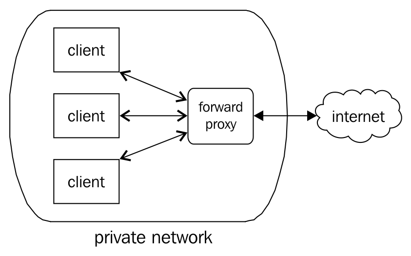
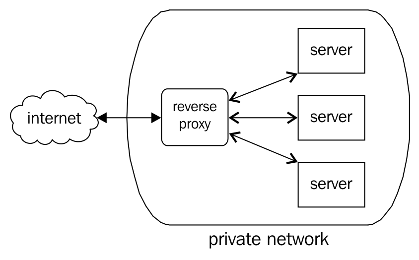
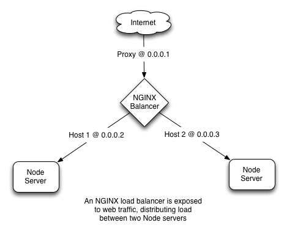
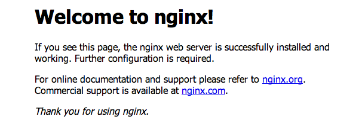
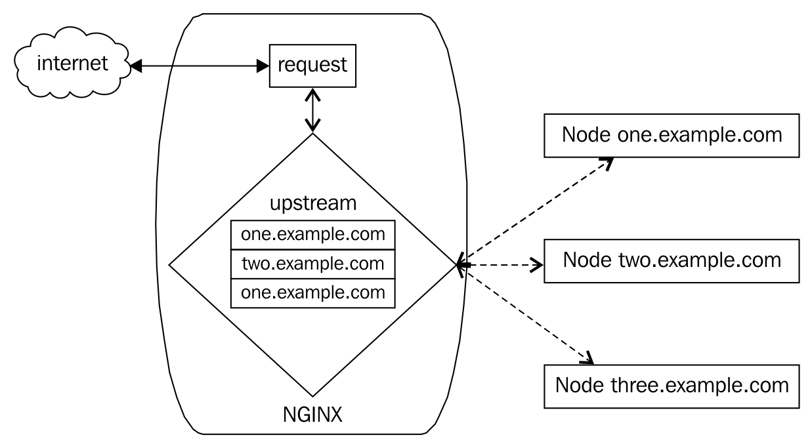
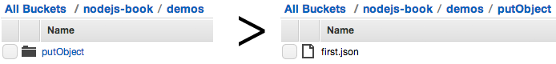
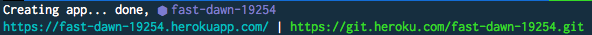
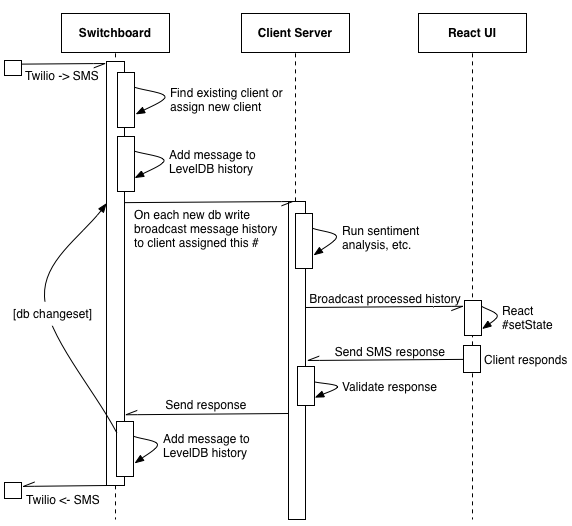
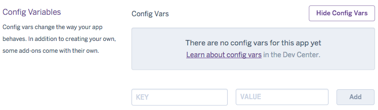
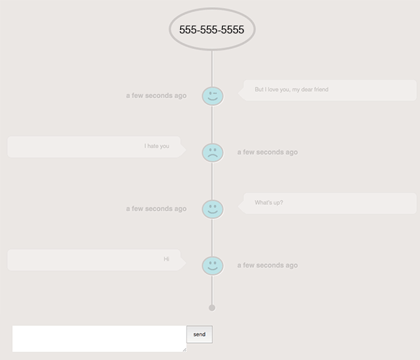

# 第八章：扩展您的应用程序

“进化是一个不断分支和扩张的过程。”

- Stephen Jay Gould

可扩展性和性能并不是相同的东西：

“‘性能’和‘可扩展性’这两个术语通常可以互换使用，

但这两者是不同的：性能衡量的是单个请求执行的速度，而可扩展性衡量的是请求在负载增加时保持其性能的能力。例如，一个请求的性能可能被报告为在三秒内生成有效响应，但请求的可扩展性衡量的是请求在用户负载增加时保持这三秒的响应时间的能力。”

- Steven Haines，《Pro Java EE 5》

在上一章中，我们看到了 Node 集群如何用于提高应用程序的性能。通过使用进程和工作进程的集群，我们学会了如何在面对许多同时请求时高效地交付结果。我们学会了垂直扩展 Node，通过堆叠可用 CPU 的性能来增加吞吐量，保持相同的占用空间（单个服务器）。

在本章中，我们将专注于*横向*可扩展性；其思想是由自给自足和独立的单元（服务器）组成的应用程序可以通过添加更多单元而无需改变应用程序的代码来进行扩展。

我们希望创建一个架构，其中任意数量的优化和封装的 Node 驱动服务器可以根据不断变化的需求进行添加或减少，动态扩展而无需进行系统重写。我们希望在不同系统之间共享工作，将请求推送到操作系统、另一个服务器、第三方服务，同时使用 Node 的事件驱动并发方式智能地协调这些 I/O 操作。

通过架构的并行性，我们的系统可以更有效地管理增加的数据量。必要时，专门的系统可以被隔离，甚至可以独立扩展或以其他方式进行集群化。

Node 特别适合处理横向扩展架构的两个关键方面。

首先，Node 强制执行非阻塞 I/O，这样任何一个单元的卡住都不会导致整个应用程序崩溃。由于没有任何单一的 I/O 操作会阻塞整个系统，因此可以放心地集成第三方服务，鼓励解耦的架构。

其次，Node 非常重视支持尽可能多的快速网络通信协议。无论是通过共享数据库、共享文件系统还是消息队列，Node 的高效网络和`Stream`层允许许多服务器在平衡负载方面同步它们的努力。例如，能够高效地管理共享套接字连接有助于在扩展服务器集群和进程集群时使用。

在本章中，我们将探讨如何在运行 Node 的许多服务器之间平衡流量，这些不同的服务器如何进行通信，以及这些集群如何绑定并从专门的云服务中获益。

# 何时进行扩展？

关于应用程序扩展的理论是一个复杂而有趣的话题，它不断得到完善和扩展。对于不同的环境和需求，全面讨论这个话题将需要几本书。对于我们的目的，我们只需学会如何识别何时需要进行扩展（甚至缩减）。

拥有一个灵活的架构，可以根据需要添加和减少资源，对于一个具有弹性的扩展策略至关重要。垂直扩展的解决方案并不总是足够（简单地添加内存或 CPU 不会带来必要的改进）。何时应考虑横向扩展？

监控服务器是至关重要的。检查服务器上运行的 Node 进程所占用的 CPU 和内存使用情况的一个简单但有用的方法是使用 Unix 的`ps`（*进程状态*）命令，例如，`ps aux | grep node`。更健壮的解决方案是安装一个交互式进程管理器，比如 Unix 系统的 HTOP（[`hisham.hm/htop/`](http://hisham.hm/htop/)）或基于 Windows 的系统的 Process Explorer（[`docs.microsoft.com/en-us/sysinternals/downloads/process-explorer`](https://docs.microsoft.com/en-us/sysinternals/downloads/process-explorer)）。

# 网络延迟

当网络响应时间超过某个阈值时，比如每个请求花费几秒钟，很可能系统已经远远超过了稳定状态。

虽然发现这个问题最简单的方法是等待客户对网站速度慢的投诉，但最好是针对等效的应用环境或服务器创建受控的压力测试。

**AB**（**Apache Bench**）是一种对服务器进行粗略压力测试的简单直接的方式。这个工具可以以多种方式进行配置，但通常用于测量服务器的网络响应时间的测试是比较直接的。

例如，让我们测试一下这个简单的 Node 服务器的响应时间：

```js
http.createServer(function(request, response) { 
    response.writeHeader(200, {"Content-Type": "text/plain"});   
    response.write("Hello World");   
    response.end();   
}).listen(2112) 
```

以下是如何对该服务器运行 10,000 个请求进行测试，并发数为 100（即同时请求的数量）：

```js
ab -n 10000 -c 100 http://yourserver.com/ 
```

如果一切顺利，您将收到类似于这样的报告：

```js
 Concurrency Level:      100
 Time taken for tests:   9.658 seconds
 Complete requests:      10000
 Failed requests:        0
 Write errors:           0
 Total transferred:      1120000 bytes
 HTML transferred:       110000 bytes
 Requests per second:    1035.42 [#/sec] (mean)
 Time per request:       96.579 [ms] (mean)
 Time per request:       0.966 [ms] (mean, across all concurrent requests)
 Transfer rate:          113.25 [Kbytes/sec] received

 Connection Times (ms)
 min  mean[+/-sd] median   max
 Connect:        0    0   0.4      0       6
 Processing:    54   96  11.7     90     136
 Waiting:       53   96  11.7     89     136
 Total:         54   96  11.6     90     136

 Percentage of the requests served within a certain time (ms)
 50%     90
 66%     98
 ...
 99%    133
 100%    136 (longest request) 
```

这份报告中包含了很多有用的信息。特别是，应该寻找失败的请求和长时间运行的请求的百分比。

存在更复杂的测试系统，但`ab`是性能的一个快速脏快照。养成创建与生产系统相似的测试环境并对其进行测试的习惯。

在运行 Node 进程的同一台服务器上运行`ab`，当然会影响测试速度。测试运行程序本身会占用大量服务器资源，因此您的结果将是误导性的。`ab`的完整文档可以在此找到：[`httpd.apache.org/docs/2.4/programs/ab.html`](https://httpd.apache.org/docs/2.4/programs/ab.html)。

# 热 CPU

当 CPU 使用率开始接近最大值时，开始考虑增加处理客户端请求的单位数量。请记住，虽然在单 CPU 机器上添加一个新的 CPU 会带来立即和巨大的改进，但在 32 核机器上添加另一个 CPU 不一定会带来同等的改进。减速并不总是由于计算速度慢造成的。

如前所述，`htop`是了解服务器性能的一个很好的方式。它实时可视化了每个核心所承受的负载，这是了解发生了什么的一个很好的方式。此外，服务器的负载平均值以三个值的形式得到了很好的总结。这是一个良好的服务器：

```js
Load average: 0.00 0.01 0.00
```

这些值代表什么？什么是“好”的或“坏”的负载平均值？

这三个数字都是在衡量 CPU 使用率，呈现了一分钟、五分钟和十五分钟间隔的测量值。通常情况下，短期负载会比长期负载更高。如果平均而言，您的服务器随着时间的推移并没有过度紧张，那么客户很可能会有良好的体验。

在单核机器上，负载平均值应保持在 0.00 和 1.00 之间。任何请求都会花费一些时间，问题是请求是否花费了比必要更多的时间，以及是否由于负载过大而出现了延迟。

如果将 CPU 视为管道，测量值为 0.00 意味着推送一滴水时没有过多的摩擦或延迟。测量值为 1.00 表示我们的管道已经达到容量；水流畅地流动，但任何额外的推送水的尝试都将面临延迟或背压。这会转化为网络上的延迟，新请求加入不断增长的队列。

多核机器只是将测量边界乘以。当负载平均值达到 4.00 时，拥有四个核心的机器已经达到容量。

您选择如何对负载平均值做出反应取决于应用程序的具体情况。对于运行数学模型的服务器来说，看到它们的 CPU 平均值达到最大容量并不罕见；在这种情况下，您希望*所有*可用资源都专门用于执行计算。另一方面，运行在容量上限的文件服务器可能值得调查。

一般来说，负载平均值超过 0.60 应该进行调查。事情并不紧急，但可能会有问题。一个经过所有已知优化后仍经常达到 1.00 的服务器显然是扩展的候选者，当然，任何超过这个平均值的服务器也是如此。

Node 还通过`os`模块提供本机进程信息：

```js
const os = require('os'); 
// Load average, as an Array 
console.log(os.loadavg()); 
// Total and free memory 
console.log(os.totalmem()); 
console.log(os.freemem()); 
// Information about CPUs, as an Array 
console.log(os.cpus()); 
```

# 套接字使用

然而，当持久套接字连接的数量开始超过任何单个 Node 服务器的容量时，无论优化多少，都需要考虑将处理用户套接字的服务器分散开来。使用`socket.io`，可以使用以下命令随时检查连接的客户端数量：

```js
io.sockets.clients() 
```

一般来说，最好通过应用程序内的某种跟踪/日志系统来跟踪 Web 套接字连接计数。

# 许多文件描述符

当操作系统打开的文件描述符数量接近其限制时，很可能有过多的 Node 进程活动，文件已打开，或者其他文件描述符（如套接字或命名管道）正在使用中。如果这些高数字不是由于错误或糟糕的设计，那么是时候添加一个新的服务器了。

可以使用`lsof`来检查任何类型的打开文件描述符的数量：

```js
# lsof | wc -l     // 1345
```

# 数据蔓延

当单个数据库服务器管理的数据量开始超过数百万行或数千兆字节的内存时，就是考虑扩展的时候了。在这里，您可以选择简单地将单个服务器专用于您的数据库，开始共享数据库，甚至在早期而不是晚期转移到托管的云存储解决方案。从数据层故障中恢复很少是一个快速的修复，一般来说，对于像*所有您的数据*这样重要的事情，有一个单一的故障点是危险的。

如果您正在使用 Redis，`info`命令将提供大部分您需要的数据，以做出这些决定。考虑以下示例：

```js
redis> info 
# Clients 
connected_clients:1 
blocked_clients:0 
# Memory 
used_memory:17683488 
used_memory_human:16.86M 
used_memory_rss:165900288 
used_memory_peak:226730192 
used_memory_peak_human:216.23M 
used_memory_lua:31744 
mem_fragmentation_ratio:9.38 
# CPU 
used_cpu_sys:13998.77 
used_cpu_user:21498.45 
used_cpu_sys_children:1.60 
used_cpu_user_children:7.19 
... 
```

有关`INFO`的更多信息，请参阅：[`redis.io/commands/INFO`](https://redis.io/commands/INFO)。

对于 MongoDB，您可以使用`db.stats()`命令：

```js
> db.stats(1024) 
{    "collections" : 3, 
 "objects" : 5, 
 "avgObjSize" : 39.2, 
 "dataSize" : 0, 
 "storageSize" : 12, 
 "numExtents" : 3, 
 "indexes" : 1, 
 "indexSize" : 7, 
 "fileSize" : 196608, 
 "nsSizeMB" : 16, 
 ... 
 "ok" : 1 } 
```

传递参数`1024`标记`stats`以以千字节显示所有值。

更多信息请参阅：[`docs.mongodb.com/v3.4/reference/method/db.stats/`](https://docs.mongodb.com/v3.4/reference/method/db.stats/)

# 服务器监控工具

有几种可用于监控服务器的工具，但很少有专门为 Node 设计的。一个强有力的候选者是**N|Solid** ([`nodesource.com/products/nsolid`](https://nodesource.com/products/nsolid))，这是一个由许多 Node 核心的关键贡献者组成的公司。这个云服务很容易与 Node 应用集成，提供一个有用的仪表板，可视化 CPU 使用情况、平均响应时间等。

其他值得考虑的监控工具列在以下：

+   **Nagios**: [`www.nagios.org`](https://www.nagios.org)

+   **Munin**: [`munin-monitoring.org/`](http://munin-monitoring.org/)

+   **Monit**: [`mmonit.com/`](https://mmonit.com/)

+   **NewRelic**: [`newrelic.com/nodejs`](https://newrelic.com/nodejs)

+   **Keymetrics**: [`keymetrics.io/`](https://keymetrics.io/)

# 运行多个 Node 服务器

购买几台服务器然后在它们上面运行一些 Node 进程是很容易的。然而，如何协调这些不同的服务器，使它们成为单个应用程序的一部分呢？这个问题的一个方面涉及将多个相同的服务器集群在一个入口点周围。客户端连接如何在一组服务器之间共享？

**水平扩展**是将架构分割成网络不同节点并协调它们的过程。*云计算*在这里相关，简单地意味着将应用程序的一些功能定位到远程服务器上，而不是在其他地方运行的服务器上。没有单点故障（理论上如此），整个系统更加健壮。*停车场问题*是沃尔玛可能面临的另一个考虑因素——在购物节日期间，您将需要成千上万个停车位，但在一年的其他时间，很难证明这种对空间的投资是合理的。就服务器而言，动态扩展的能力既支持向上扩展也支持向下扩展，这与构建固定的垂直存储单元相矛盾。向正在运行的服务器添加硬件也比启动并无缝链接另一个虚拟机到您的应用程序更复杂。

当然，文件服务速度并不是您可能使用像 NGINX 这样的代理服务器的唯一原因。通常情况下，网络拓扑特性使得反向代理成为更好的选择，特别是当集中常见服务（如压缩）时。关键是 Node 不应该仅仅因为其有效地提供文件的能力而被排除在外。

# 正向和反向代理

**代理**是代表另一个人或事物行事的人或事物。

**正向代理**通常代表私有网络中的客户端，代理对外部网络的请求，例如从互联网检索数据。在本书的前面，我们看了如何使用 Node 设置代理服务器，其中 Node 服务器充当中间人，将客户端的请求转发到其他网络服务器，通常是通过互联网。

早期的网络提供商如 AOL 的功能如下：



网络管理员在必须限制对外部世界（即互联网）的访问时使用正向代理。如果网络用户通过电子邮件附件从`somebadwebsite.com`下载恶意软件，管理员可以阻止对该位置的访问。对办公网络施加对社交网络网站的访问限制也是可能的。一些国家甚至以这种方式限制对公共网站的访问。

**反向代理**，并不奇怪，以相反的方式工作，接受来自公共网络的请求，并在客户端几乎看不到的私有网络中处理这些请求。客户端对服务器的直接访问首先委托给反向代理：



这是我们可能使用的代理类型，用于在许多 Node 服务器之间平衡客户端的请求。客户端*X*不直接与任何给定的服务器通信。代理*Y*是第一次接触点，能够将*X*引导到负载较小的服务器，或者距离*X*更近的服务器，或者在某种程度上是*X*在此时访问的最佳服务器。

我们现在将看一下如何在扩展 Node 时实现反向代理，讨论使用**NGINX**（发音为**Engine X**）的负载均衡 Node 服务器的实现，以及使用本机 Node 模块的实现。

# 使用 http-proxy 模块

多年来，人们建议在 Node 服务器前面放置一个 Web 服务器（如 NGINX）。理由是成熟的 Web 服务器能更有效地处理静态文件传输。虽然这对于早期的 Node 版本可能是真的（这些版本也受到新技术面临的错误的影响），但从纯速度来说，这不一定再是真的。更重要的是，使用内容交付网络（CDN）和其他边缘服务，你的应用程序可能需要的静态文件已经被缓存了，你的服务器本来就不会提供这些文件。

Node 旨在促进网络软件的创建，因此并不奇怪会开发出几个代理模块。一个受欢迎的生产级 Node 代理是 http-proxy。让我们看看如何使用它来平衡对不同 Node 服务器的请求。

我们的整个路由堆栈将由 Node 提供。一个 Node 服务器将运行我们的代理，监听端口`80`。我们将涵盖以下三种情况：

+   在同一台机器上运行多个不同端口的 Node 服务器

+   使用一个盒子作为纯路由器，代理到外部 URL

+   创建一个基本的轮询负载均衡器

作为一个初始示例，让我们看看如何使用这个模块来重定向请求：

```js
let httpProxy = require('http-proxy'); 
let proxy = httpProxy.createServer({ 
target: { 
  host: 'www.example.com', 
  port: 80 
} 
}).listen(80); 
```

通过在本地机器的端口`80`上启动此服务器，我们能够将用户重定向到另一个 URL。

要在单台机器上运行几个不同的 Node 服务器，每个服务器响应不同的 URL，只需定义一个路由器：

```js
let httpProxy = httpProxy.createServer({ 
  router: { 
    'www.mywebsite.com' : '127.0.0.1:8001', 
    'www.myothersite.com' : '127.0.0.1:8002', 
  } 
}); 
httpProxy.listen(80); 
```

对于你的不同网站，现在可以指向你的 DNS 名称服务器

（通过 ANAME 或 CNAME 记录）到相同的端点（无论这个 Node 程序在哪里运行），它们将解析到不同的 Node 服务器。当你想运行几个网站但不想为每个网站创建一个新的物理服务器时，这很方便。另一种策略是在同一个网站中处理不同路径在不同的 Node 服务器上：

```js
let httpProxy = httpProxy.createServer({ 
  router: { 
    'www.mywebsite.com/friends': '127.0.0.1:8001', 
    'www.mywebsite.com/foes': '127.0.0.1:8002', 
  } 
}); 
httpProxy.listen(80); 
```

这允许你的应用程序中的专门功能由独特配置的服务器处理。

设置负载均衡器也很简单。正如我们稍后将在 NGINX 的 upstream 指令中看到的那样，我们只需提供要平衡的服务器列表：

```js
const httpProxy = require('http-proxy'); 
let addresses = [ 
  { host: 'one.example.com', port: 80 }, 
  { host: 'two.example.com', port: 80 } 
]; 
httpProxy.createServer((req, res, proxy) => { 
  let target = addresses.shift(); 
  proxy.proxyRequest(req, res, target); 
  addresses.push(target); 
}).listen(80); 
```

在这个例子中，我们平等对待服务器，按顺序循环使用它们。选择的服务器被代理后，它将返回到列表的末尾。

很明显，这个例子可以很容易地扩展到适应其他指令，比如 NGINX 的 weight。

redbird 模块是建立在 http-proxy 之上的一个非常先进的反向代理。除其他功能外，它还内置了自动 SSL 证书生成和 HTTP/2 支持。了解更多信息：[`github.com/OptimalBits/redbird`](https://github.com/OptimalBits/redbird)。

# 在 Digital Ocean 上部署 NGINX 负载均衡器

由于 Node 非常高效，大多数网站或应用程序可以在垂直维度上满足其所有扩展需求。Node 可以使用少量 CPU 和普通内存处理大量流量。

NGINX 是一个非常受欢迎的高性能 Web 服务器，通常用作代理服务器。NGINX 与 Node 开发人员的设计非常相似，这是一种巧合：

如[`www.linuxjournal.com/magazine/nginx-high-performance-web-server-and-reverse-proxy`](http://www.linuxjournal.com/magazine/nginx-high-performance-web-server-and-reverse-proxy)所述，“NGINX 能够以更少的资源处理更多的请求，因为它的架构。它由一个主进程组成，将工作委托给一个或多个工作进程。每个工作进程使用 Linux 内核的特殊功能（epoll/select/poll）以事件驱动或异步方式处理多个请求。这使得 NGINX 能够快速处理大量并发请求，几乎没有额外开销。”

NGINX 还使负载均衡变得非常容易。在以下示例中，我们将看到通过 NGINX 代理自带负载均衡功能。

Digital Ocean 是一个价格便宜且易于设置的云托管提供商。我们将在该服务上构建一个 NGINX 负载均衡器。

要注册，请访问：[`www.digitalocean.com`](https://www.digitalocean.com)。基本套餐（在撰写本文时）需要支付五美元的费用，但经常提供促销代码；简单的网络搜索应该能找到可用的代码。创建并验证一个帐户以开始使用。

Digital Ocean 的套餐被描述为滴，具有特定的特征-存储空间量、传输限制等。我们的需求足够一个基本套餐。此外，您还将指定托管区域以及要在滴中安装的操作系统（在本例中，我们将使用最新版本的 Ubuntu）。创建一个滴，并检查您的电子邮件以获取登录说明。完成！

您将收到实例的完整登录信息。现在，您可以打开终端并使用这些登录凭据通过 SSH 登录到您的主机。

在您初始登录时，您可能希望更新您的软件包。对于 Ubuntu，您将运行`apt-get update`和`apt-get upgrade`。其他软件包管理器有类似的命令（例如，RHEL/CentOs 的`yum update`）。

在我们开始安装之前，让我们更改根密码并创建一个非根用户（将根暴露给外部登录和软件安装是不安全的）。要更改根密码，请输入`passwd`并按照终端中的说明操作。要创建一个新用户，请输入`adduser <新用户名>`（例如，`adduser john`）。按照说明操作。

还有一步：我们希望为我们的新用户提供一些管理权限，因为我们将以该用户身份安装软件。在 Unix 术语中，您希望为这个新用户提供`sudo`访问权限。无论您选择哪个操作系统，都很容易找到如何执行此操作的说明。基本上，您需要更改`/etc/sudoers`文件。记住要使用`lvisudo`这样的命令来执行此操作；不要手动编辑 sudoers 文件！您可能还希望在这一点上限制根登录并进行其他 SSH 访问管理。

在终端成功执行`sudo -i`后，您将能够在不用每个命令都加上`sudo`前缀的情况下输入命令。以下示例假定您已经执行了此操作。

现在，我们将为两个 Node 服务器创建一个 NGINX 负载均衡器前端。这意味着我们将创建三个滴：一个用于负载均衡器，另外两个用作 Node 服务器。最后，我们将得到一个类似于这样的架构：



# 安装和配置 NGINX

让我们安装 NGINX 和 Node/npm。如果您仍然以 root 用户登录，请注销并重新验证您刚刚创建的新用户。要安装 NGINX（在 Ubuntu 上），只需输入以下命令：

```js
apt-get install nginx
```

大多数其他 Unix 软件包管理器都有 NGINX 安装程序。

要启动 NGINX，请使用以下命令：

```js
service nginx start
```

NGINX 的完整文档可以在此处找到：[`www.nginx.com/resources/wiki/start/`](https://www.nginx.com/resources/wiki/start/)。

现在，您应该能够将浏览器指向您分配的 IP（如果您忘记了，请检查您的收件箱），并看到类似于这样的内容：



现在，让我们设置 NGINX 将平衡的两个服务器。

在 Digital Ocean 中创建另外两个滴。您*不*需要在这些服务器上安装 NGINX。像之前一样在这些服务器上配置权限，并在两个滴中安装 Node。管理 Node 安装的简单方法是使用*Tim Caswell 的* **NVM**（Node Version Manager）。NVM 本质上是一个 bash 脚本，提供一组命令行工具，便于管理 Node 版本，允许您轻松切换版本。要安装它，请在终端中运行以下命令：

```js
curl https://raw.githubusercontent.com/creationix/nvm/v7.10.1/install.sh | sh
```

现在，安装您首选的 Node 版本：

```js
nvm install 9.2.0
```

您可能希望在`.bashrc`或`.profile`文件中添加一个命令，以确保每次启动 shell 时都使用某个特定的 node 版本：

```js
nvm use 9.2.0
```

为了测试我们的系统，我们需要在这两台机器上设置 Node 服务器。在每台服务器上创建以下程序文件，将`**`更改为每个服务器上的唯一内容（例如*one*和*two*）：

```js
const http = require('http');
http.createServer((req, res) => {
  res.writeHead(200, {
    "Content-Type" : "text/html"
  });
  res.write('HOST **');
  res.end();
}).listen(8080)
```

在每台服务器上启动此文件（`node serverfile.js`）。每台服务器现在将在端口`8080`上回答。您现在应该能够通过将浏览器指向每个 Droplet 的 IP:8080\来访问此服务器。一旦有两台服务器响应不同的消息，我们就可以设置 NGINX 负载均衡器。

使用 NGINX 进行服务器之间的负载均衡非常简单。您只需在 NGINX 配置脚本中指示应该平衡的上游服务器。我们刚刚创建的两个 Node 服务器将成为上游服务器。NGINX 将被配置为平衡对每个请求：



每个请求将首先由 NGINX 处理，NGINX 将检查其*上游*配置，并根据其配置方式，将请求（反向）代理到实际处理请求的上游服务器。

您将在负载均衡器 Droplet 上的`/etc/nginx/sites-available/default`找到默认的 NGINX 服务器配置文件。

在生产中，您可能希望创建一个自定义目录和配置文件，但出于我们的目的，我们将简单地修改默认配置文件（在开始修改之前，您可能需要备份）。

在 NGINX 配置文件的顶部，我们希望定义一些*上游*服务器，这些服务器将成为重定向的候选者。这只是一个带有`lb-servers`任意键的映射，将在随后的服务器定义中引用：

```js
upstream lb_servers {
  server first.node.server.ip;
  server second.node.server.ip;
}
```

现在我们已经建立了候选映射，我们需要配置 NGINX，以便它以平衡的方式将请求转发到 lb-servers 的每个成员：

```js
server {
    listen 80 default_server;
    listen [::]:80 default_server ipv6only=on;

    #root /usr/share/nginx/html;
    #index index.html index.htm;

    # Make site accessible from http://localhost/
    server_name localhost;

    location / {
        proxy_pass http://lb-servers; # Load balance mapped servers

        proxy_http_version 1.1;
        proxy_set_header Upgrade $http_upgrade;
        proxy_set_header Connection 'upgrade';
        proxy_set_header Host $host;
        proxy_cache_bypass $http_upgrade;
    }

... more configuration options not specifically relevant to our purposes

}
```

关键一行是这一行：

```js
proxy_pass http://lb-servers
```

请注意名称`lb-servers`与我们上游定义的名称匹配。这应该清楚地说明正在发生的事情：监听端口`80`的 NGINX 服务器将将请求传递给包含在 lb-servers 中的服务器定义。如果上游定义中只有一个服务器，则该服务器将获得所有流量。如果定义了多个服务器，NGINX 将尝试在它们之间均匀分配流量。

还可以使用相同的技术在几个*本地服务器*之间平衡负载。可以在不同的端口上运行不同的 Node 服务器，例如`server 127.0.0.1:8001`和`server 127.0.0.1:8002`。

继续更改 NGINX 配置（如果遇到困难，请查阅本书代码包中的`nginx.config`文件）。更改后，使用以下命令重新启动 NGINX：

```js
service nginx restart
```

或者，如果您愿意，可以使用此方法：

```js
service nginx stop
service nginx start
```

假设另外两个运行 Node 服务器的 Droplet 处于活动状态，您现在应该能够将浏览器指向启用了 NGINX 的 Droplet，并查看来自这些服务器的消息！

由于我们可能希望更精确地控制流量如何分布到上游服务器，因此有进一步的指令可以应用于上游服务器定义。

NGINX 使用加权轮询算法进行负载平衡。为了控制流量分布的相对权重，我们使用权重指令：

```js
upstream lb-servers {
    server first.node.server.ip weight=10;
    server second.node.server.ip weight=20;
}
```

该定义告诉 NGINX 将负载分配给第二个服务器的量是第一个服务器的两倍。例如，具有更多内存或 CPU 的服务器可能会受到青睐。使用此系统的另一种方法是创建 A/B 测试场景，其中包含建议的新设计的一个服务器接收总流量的一小部分，以便可以将测试服务器的指标（销售额、下载量、参与时长等）与更广泛的平均值进行比较。

还有其他三个有用的指令，它们一起工作以管理连接故障：

+   `max_fails`：与服务器通信失败多少次之前将该服务器标记为无法运行。这些失败必须发生的时间段由`fail_timeout`定义。

+   `fail_timeout`：服务器无法运行时必须发生`max_fails`的时间片。这个数字还表示在标记服务器无法运行后，NGINX 再次尝试到达被标记的服务器之前的时间。

考虑以下例子：

```js
upstream lb-servers {
  server first.node.server.ip weight=10 max_fails=2 fail_timeout=20s;
  server second.node.server.ip weight=20 max_fails=10 fail_timeout=5m;   
}
```

+   `backup`：带有这个指令的服务器只有在*所有*其他列出的服务器不可用时才会被调用。

此外，有一些用于上游定义的指令，可以对客户端如何被引导到上游服务器进行一些控制：

+   `least_conn`：将请求传递给连接最少的服务器。这提供了稍微更智能的负载均衡，考虑了服务器负载以及权重。

+   `ip_hash`：这里的想法是为每个连接的 IP 创建一个哈希，并确保来自给定客户端的请求始终传递到同一台服务器。

用于平衡 Node 服务器的另一个常用工具是专用负载均衡器 HAProxy，网址为：[`www.haproxy.org`](http://www.haproxy.org)。

# 消息队列-RabbitMQ

确保分布式服务器保持可靠的通信渠道的最佳方法之一是将远程过程调用的复杂性捆绑到一个独立的单元中-一个消息队列。当一个进程希望向另一个进程发送消息时，消息可以简单地放在这个队列上-就像应用程序的待办事项列表一样，队列服务负责确保消息被传递以及将任何重要的回复传递回原始发送者。

有一些企业级消息队列可用，其中许多部署了**AMQP** **(高级消息队列协议)**。我们将专注于一个非常稳定和知名的实现-RabbitMQ。

要在您的环境中安装 RabbitMQ，请按照以下网址找到的说明进行操作：[`www.rabbitmq.com/download.html`](https://www.rabbitmq.com/download.html)。

安装完成后，您可以使用以下命令启动 RabbitMQ 服务器：

```js
service rabbitmq-server start
```

要使用 Node 与 RabbitMQ 进行交互，我们将使用*Theo Schlossnagle*创建的`node-amqp`模块：

```js
npm install amqp
```

要使用消息队列，必须首先创建一个消费者-一个绑定到 RabbitMQ 的监听发布到队列的消息。最基本的消费者将监听所有消息：

```js
const amqp = require('amqp');

const consumer = amqp.createConnection({ host: 'localhost', port: 5672 });


consumer.on('error', err => {
 
console.log(err);

});


consumer.on('ready', () => {
 
let exchange = consumer.exchange('node-topic-exchange', {type: "topic"});
 
consumer.queue('node-topic-queue', q => {

  
q.bind(exchange, '#');

  
q.subscribe(message => {
   // Messages are buffers
   console.log(message.data.toString('utf8'));
  
});
  
  
exchange.publish("some-topic", "Hello!");
 
});

});
```

我们现在正在监听来自绑定到端口`5672`的 RabbitMQ 服务器的消息。

一旦这个消费者建立了连接，它将建立它将要监听的队列的名称，并且应该`绑定`到一个`交换机`。在这个例子中，我们创建了一个主题`交换机`（默认），给它一个唯一的名称。我们还指示我们想要通过`#`监听*所有*消息。剩下要做的就是订阅队列，接收一个消息对象。随着我们的进展，我们会了解更多关于消息对象的信息。现在，注意重要的`data`属性，其中包含发送的消息。

现在我们已经建立了一个消费者，让我们向交换机发布一条消息。如果一切顺利，我们将在控制台中看到发送的消息：

```js
consumer.on('ready', function() { 
  // ... 
  exchange.publish("some-topic", "Hello!"); 
}); 
// Hello! 
```

我们已经学到足够的知识来实现有用的扩展工具。如果我们有多个分布式的 Node 进程，甚至在不同的物理服务器上，每个进程都可以通过 RabbitMQ 可靠地向彼此发送消息。每个进程只需要实现一个**交换队列订阅者**来接收消息，以及一个**交换发布者**来发送消息。

# 交换机的类型

RabbitMQ 提供三种类型的交换机：**直连**，**扇出**和**主题**。这些差异体现在每种类型的交换机如何处理**路由键**-发送到`exchange.publish`的第一个参数。

直连交换机直接匹配路由键。像下面这样的队列绑定*只*匹配发送到`'room-1'`的消息：

```js
queue.bind(exchange, 'room-1');
```

由于不需要解析，直接交换能够在一段时间内处理比主题交换更多的消息。

扇出交换是不加区别的；它将消息路由到所有绑定到它的队列，忽略路由键。这种类型的交换用于广播。

主题交换根据通配符`#`和`*`匹配路由键。与其他类型不同，主题交换的路由键*必须*由点分隔的单词组成，例如`"animals.dogs.poodle"`。`#`匹配零个或多个单词；它将匹配每条消息（就像我们在上一个示例中看到的那样），就像扇出交换一样。另一个通配符是`*`，它*精确地*匹配一个单词。

直接和扇出交换可以使用几乎与给定主题交换示例相同的代码实现，只需要更改交换类型，并且绑定操作需要知道它们将如何与路由键关联（扇出订阅者接收所有消息，而不考虑键；对于直接交换，路由键必须直接匹配）。

这个最后的例子应该说明主题交换是如何工作的。我们将创建三个具有不同匹配规则的队列，过滤每个队列从交换接收的消息：

```js
consumer.on('ready', function() { 
  // When all 3 queues are ready, publish. 
  let cnt = 3; 
  let queueReady = function() { 
    if(--cnt > 0) { 
      return; 
    } 
    exchange.publish("animals.dogs.poodles", "Poodle!"); 
    exchange.publish("animals.dogs.dachshund", "Dachshund!"); 
    exchange.publish("animals.cats.shorthaired", "Shorthaired Cat!"); 
    exchange.publish("animals.dogs.shorthaired", "Shorthaired Dog!"); 
    exchange.publish("animals.misc", "Misc!"); 
  } 
  let exchange = consumer.exchange('topical', {type: "topic"}); 
  consumer.queue('queue-1', q => { 
    q.bind(exchange, 'animals.*.shorthaired'); 
    q.subscribe(message => { 
      console.log(`animals.*.shorthaired -> ${message.data.toString('utf8')}`); 
    }); 
    queueReady(); 
  }); 
  consumer.queue('queue-2', q => {     
    q.bind(exchange, '#'); 
    q.subscribe(function(message) { 
      console.log('# -> ' + message.data.toString('utf8')); 
    }); 
    queueReady(); 
  }); 
  consumer.queue('queue-3', q => {     
    q.bind(exchange, '*.cats.*'); 
    q.subscribe(message => { 
      console.log(`*.cats.* -> ${message.data.toString('utf8')}`); 
    }); 
    queueReady(); 
  }); 
}); 

//    # -> Poodle! 
//    animals.*.shorthaired -> Shorthaired Cat! 
//    *.cats.* -> Shorthaired Cat! 
//    # -> Dachshund! 
//    # -> Shorthaired Cat! 
//    animals.*.shorthaired -> Shorthaired Dog! 
//    # -> Shorthaired Dog! 
//    # -> Misc! 
```

`node-amqp`模块包含进一步控制连接、队列和交换的方法；特别是，它包含从交换中删除队列和从队列中删除订阅者的方法。通常，在运行时更改队列的组成可能会导致意外错误，因此请谨慎使用这些方法。

要了解有关 AMQP（以及在使用`node-amqp`进行设置时可用的选项），请访问：[`www.rabbitmq.com/tutorials/amqp-concepts.html`](http://www.rabbitmq.com/tutorials/amqp-concepts.html)。

# 使用 Node 的 UDP 模块

**UDP**（用户数据报协议）是一种轻量级的核心互联网消息传递协议，使服务器能够传递简洁的**数据报**。UDP 设计时考虑了最小的协议开销，放弃了交付、排序和重复预防机制，而是更注重确保高性能。当不需要完美的可靠性而需要高速传输时，比如在网络游戏和视频会议应用中，UDP 是一个不错的选择。

这并不是说 UDP 通常不可靠。在大多数应用程序中，它以高概率传递消息。当需要*完美*可靠性时，比如在银行应用程序中，它就不合适了。它是监控和日志应用程序以及非关键消息服务的绝佳选择。

使用 Node 创建 UDP 服务器很简单：

```js
const dgram = require("dgram"); 
let socket = dgram.createSocket("udp4"); 
socket.on("message", (msg, info) => { 
  console.log("socket got: " + msg + " from " + 
  info.address + ":" + info.port); 
}); 
socket.bind(41234); 
socket.on("listening", () => { 
  console.log("Listening for datagrams."); 
}); 
```

`bind`命令需要三个参数，如下所示：

+   **端口**：整数端口号。

+   **地址**：这是一个可选地址。如果未指定，操作系统将尝试监听所有地址（这通常是您想要的）。您也可以尝试明确使用`0.0.0.0`。

+   **回调**：这是一个可选的回调，不接收任何参数。

这个套接字现在将在通过`41234`端口接收数据报时发出`message`事件。事件回调将数据报本身作为第一个参数接收，并将数据包信息映射作为第二个参数接收：

+   **地址**：源 IP

+   **家族**：IPv4 或 IPv6 之一

+   **端口**：源端口

+   **大小**：消息的大小（以字节为单位）

这个映射类似于调用`socket.address()`时返回的映射。

除了消息和监听事件之外，UDP 套接字还会发出**close**和**error**事件，当发生错误时，后者会接收一个`Error`对象。要关闭 UDP 套接字（并触发关闭事件），请使用`server.close()`。

发送消息甚至更容易：

```js
let client = dgram.createSocket("udp4"); 
let message = Buffer.from('UDP says Hello!', 'utf8'); 
client.send(message, 0, message.length, 41234, "localhost", (err, bytes) => client.close()); 
```

`send`方法采用`client.send(buffer, offset, length, port, host, callback)`形式：

+   `buffer`：包含要发送的数据报的缓冲区。

+   `offset`：一个整数，指示数据报在缓冲区中的位置。

+   `length`：数据报中的字节数。与**offset**结合使用，此值标识缓冲区中的完整数据报。

+   `port`：标识目标端口的整数。

+   `address`：一个指示数据报目标 IP 的字符串。

+   `callback`：一个可选的回调函数，在发送完成后调用。

数据报的大小不能超过 65507 字节，这相当于*2¹⁶-1*（65535）字节，减去 UDP 头部使用的 8 字节，减去 IP 头部使用的 20 字节。

现在我们有另一个进程间通信的候选者。为我们的节点应用程序设置一个监视服务器将会相当容易，它监听一个 UDP 套接字，接收来自其他进程发送的程序更新和统计信息。协议速度足够快，适用于实时系统，任何数据包丢失或其他 UDP 故障都将在总体数据量中占比不足。

进一步扩展广播的想法，我们还可以使用`dgram`模块创建一个多播服务器。**多播**只是一对多的服务器广播。我们可以广播到一系列已永久保留为多播地址的 IP 地址：

正如可以在[`www.iana.org/assignments/multicast-addresses/multicast-addresses.xhtml`](http://www.iana.org/assignments/multicast-addresses/multicast-addresses.xhtml)找到的那样，“IP 多播的主机扩展[RFC1112]指定了 Internet 协议（IP）的主机实现支持多播所需的扩展。多播地址在 224.0.0.0 到 239.255.255.255 的范围内。”

此外，`224.0.0.0`和`224.0.0.255`之间的范围进一步保留用于特殊路由协议。此外，某些端口号被分配用于 UDP（和 TCP），可以在[`en.wikipedia.org/wiki/List_of_TCP_and_UDP_port_numbers`](https://en.wikipedia.org/wiki/List_of_TCP_and_UDP_port_numbers)找到列表。

所有这些令人着迷的信息的要点是，有一块 IP 和端口保留给 UDP 和/或多播使用，我们将使用其中一些来实现 Node 上的 UDP 多播。

# 使用 Node 进行 UDP 多播

设置多播 UDP 服务器和*标准*服务器之间唯一的区别是绑定到一个特殊的 UDP 端口进行发送，并指示我们希望监听*所有*可用的网络适配器。我们的多播服务器初始化看起来像以下代码片段：

```js
let socket = dgram.createSocket('udp4'); 
let multicastAddress = '230.1.2.3'; 
let multicastPort = 5554; 
socket.bind(multicastPort); 
socket.on("listening", function() { 
    this.setMulticastTTL(64); 
    this.addMembership(multicastAddress); 
}); 
```

一旦我们决定了多播端口和地址并绑定了，我们就会捕获`listening`事件并配置我们的服务器。最重要的命令是`socket.addMembership`，它告诉内核加入`multicastAddress`的多播组。其他 UDP 套接字现在可以订阅这个地址的多播组。

数据报像任何网络数据包一样在网络中跳跃。`setMulticastTTL`方法用于设置数据报在被放弃之前允许跳转的最大次数（生存时间）。可接受的范围是 0-255，在大多数系统上默认为 1。这通常不是一个需要担心的设置，但在精确的限制有意义的情况下是可用的，比如数据包廉价而跳数昂贵的情况。

如果您希望还允许在本地接口上监听，可以使用`socket.setBroadcast(true)`和`socket.setMulticastLoopback(true)`。这通常是不必要的。

我们最终将使用这个服务器向`multicastAddress`上的所有 UDP 监听者广播消息。现在，让我们创建两个将监听多播的客户端：

```js
dgram.createSocket('udp4').on('message', (message, remote) => { 
  console.log(`Client1 received message ${message} from ${remote.address}:${remote.port}`); 
}).bind(multicastPort, multicastAddress); 

dgram.createSocket('udp4').on('message', (message, remote) => { 
  console.log(`Client2 received message ${message} from ${remote.address}:${remote.port}`); 
}).bind(multicastPort, multicastAddress); 
```

现在我们有两个客户端监听相同的多播端口。剩下的就是多播。在这个例子中，我们将使用`setTimeout`每秒发送一个计数器值：

```js
let cnt = 1; 
let sender; 
(sender = function() { 
  let msg = Buffer.from(`This is message #${cnt}`); 
  socket.send( 
    msg, 
    0, 
    msg.length, 
    multicastPort, 
    multicastAddress 
  ); 
  ++cnt; 
  setTimeout(sender, 1000); 
})(); 
```

计数器值将产生类似以下的内容：

```js
 Client2 received message This is message #1 from 67.40.141.16:5554
 Client1 received message This is message #1 from 67.40.141.16:5554
 Client2 received message This is message #2 from 67.40.141.16:5554
 Client1 received message This is message #2 from 67.40.141.16:5554
 Client2 received message This is message #3 from 67.40.141.16:5554
 ...
```

我们有两个客户端监听特定组的广播。让我们再添加另一个客户端，监听不同的组，比如说多播地址`230.3.2.1`：

```js
dgram.createSocket('udp4').on('message', (message, remote) =>{ 
  console.log(`Client3 received message ${message} from ${remote.address}:${remote.port}`); 
}).bind(multicastPort, '230.3.2.1');
```

由于我们的服务器当前正在向不同的地址广播消息，我们需要更改服务器配置并使用另一个`addMembership`调用添加这个新地址：

```js
socket.on("listening", function() { 
  this.addMembership(multicastAddress); 
  this.addMembership('230.3.2.1'); 
}); 
```

现在我们可以发送到*两个*地址：

```js
(sender = function() { 
  socket.send( 
      ... 
      multicastAddress 
  ); 
  socket.send( 
      ... 
      '230.3.2.1' 
  ); 
  // ... 
})(); 
```

没有什么能阻止客户端向组中的其他成员广播，甚至向另一个组的成员广播：

```js
dgram.createSocket('udp4').on('message', (message, remote) => { 
  let msg = Buffer.from('Calling original group!', 'utf8'); 
  // 230.1.2.3 is the multicast address 
  socket.send(msg, 0, msg.length, multicastPort, '230.1.2.3'); 
}).bind(multicastPort, '230.3.2.1'); 
```

现在，任何具有网络接口上地址的节点进程都可以监听 UDP 多播地址以获取消息，提供快速而优雅的进程间通信系统。

# 在您的应用程序中使用亚马逊网络服务

当几千个用户变成几百万个用户，当数据库扩展到几 TB 的数据时，维护应用程序的成本和复杂性开始压倒那些经验、资金和/或时间不足的团队。面对快速增长时，有时将应用程序的一个或多个方面的责任委托给基于云的服务提供商是很有用的。**AWS**（亚马逊网络服务）就是这样一套云计算服务，由[amazon.com](http://amazon.com)提供。

您需要一个 AWS 账户才能使用这些示例。我们将要探索的所有服务对于低容量开发用途都是免费或几乎免费的。要在 AWS 上创建一个账户，请访问以下链接：[`aws.amazon.com/`](https://aws.amazon.com/)。创建账户后，您将能够通过 AWS 控制台管理所有服务：[`aws.amazon.com/console/`](https://aws.amazon.com/console/)

在本节中，我们将学习如何使用三种流行的 AWS 服务：

+   为了存储文档和文件，我们将连接到亚马逊**S3**

（简单存储服务）

+   亚马逊的键/值数据库，**DynamoDB**

+   为了管理大量的电子邮件，我们将利用亚马逊的**SES**

（简单电子邮件服务）

为了访问这些服务，我们将使用 Node 的 AWS SDK，可以在以下位置找到

在以下链接：[`github.com/aws/aws-sdk-js`](https://github.com/aws/aws-sdk-js)

要安装模块，请运行以下命令：

```js
npm install aws-sdk  
```

`aws-sdk`模块的完整文档可以在以下网址找到：[`docs.aws.amazon.com/AWSJavaScriptSDK/latest/index.html`](https://docs.aws.amazon.com/AWSJavaScriptSDK/latest/index.html)。

# 身份验证

注册 AWS 的开发人员被分配了两个标识符：

+   一个公共**Access Key ID**（一个 20 个字符的字母数字序列）。

+   一个**Secret Access Key**（一个 40 个字符的序列）。保持您的 Secret Key 私密非常重要。

亚马逊还为开发人员提供了识别要通信的区域的能力，比如`"us-east-1"`。这使开发人员能够针对最近的服务器（区域端点）发出请求。

区域端点和两个身份验证密钥对于发出请求是必要的。

有关区域端点的详细信息，请访问：[`docs.aws.amazon.com/general/latest/gr/rande.html`](https://docs.aws.amazon.com/general/latest/gr/rande.html)。

由于我们将在接下来的每个示例中使用相同的凭据，让我们创建一个可重用的`config.json`文件：

```js
{ 
  "accessKeyId" : "your-key",  
  "secretAccessKey" : "your-secret", 
  "region" : "us-east-1", 
  "apiVersions" : { 
     "s3" : "2006-03-01", 
     "ses" : "2010-12-01", 
     "dynamodb" : "2012-08-10" 
  } 
} 
```

我们还会配置我们将用于服务的特定 API 版本。如果亚马逊的服务 API 发生变化，这将确保我们的代码将继续工作。

现在可以用两行代码初始化 AWS 会话。假设这两行代码存在于接下来的任何示例代码之前：

```js
const AWS = require('aws-sdk'); 
AWS.config.loadFromPath('./config.json');
```

# 错误

在尝试这些服务时，可能会偶尔出现错误代码。由于其复杂性和云计算的性质，这些服务有时会发出令人惊讶或意外的错误。例如，因为 S3 在某些区域和情况下只能保证最终一致性，尝试读取刚写入的密钥可能并不总是成功。我们将探索每个服务的完整错误代码列表，它们可以在以下位置找到：

+   **S3:** [`docs.aws.amazon.com/AmazonS3/latest/API/ErrorResponses.html`](https://docs.aws.amazon.com/AmazonS3/latest/API/ErrorResponses.html)

+   **DynamoDB:** [`docs.aws.amazon.com/amazondynamodb/latest/developerguide/Programming.Errors.html`](http://docs.aws.amazon.com/amazondynamodb/latest/developerguide/Programming.Errors.html)

+   **SES:** [`docs.aws.amazon.com/ses/latest/DeveloperGuide/api-error-codes.html`](https://docs.aws.amazon.com/ses/latest/DeveloperGuide/api-error-codes.html) 和 [`docs.aws.amazon.com/ses/latest/DeveloperGuide/smtp-response-codes.html`](https://docs.aws.amazon.com/ses/latest/DeveloperGuide/smtp-response-codes.html)

由于在开始阶段很难预测错误可能出现的位置，因此在进行操作时使用`domain`模块或其他错误检查代码是很重要的。

此外，亚马逊安全和一致性模型的一个微妙但基本的方面是其 Web 服务器时间和发出请求的服务器理解的时间的严格同步。最大允许的差异为 15 分钟。虽然这似乎是一个很长的时间，但事实上时间漂移是非常常见的。在开发过程中要注意类似以下的 403：禁止错误：

+   `SignatureDoesNotMatch`：这个错误意味着签名已经过期

+   `RequestTimeTooSkewed`：请求时间与当前时间的差异太大

如果遇到此类错误，发出请求的服务器的内部时间可能已经偏移。如果是这样，那么该服务器的时间将需要同步。在 Unix 上，可以使用**NTP**（网络时间协议）来实现同步。一个解决方案是使用以下命令：

```js
rdate 129.6.15.28
ntpdate 129.6.15.28  
```

有关 NTP 和时间同步的更多信息，请访问：[`www.pool.ntp.org/en/use.html`](http://www.pool.ntp.org/en/use.html)。

让我们开始使用 AWS 服务，从分布式文件服务 S3 开始。

# 使用 S3 存储文件

S3 可用于存储任何人们期望能够存储在文件系统上的文件。最常见的用途是存储媒体文件，如图像和视频。S3 也是一个非常优秀的文档存储系统，特别适合存储小型 JSON 对象或类似的数据对象。

此外，S3 对象可以通过 HTTP 访问，这使得检索非常自然，并且支持 REST 方法，如 PUT/DELETE/UPDATE。S3 的工作方式非常类似于人们对典型文件服务器的期望，它分布在遍布全球的服务器上，并提供了在实际上无限的存储容量。

S3 使用**存储桶**的概念作为*硬盘*的一种类比。每个 S3 帐户最多可以包含 100 个存储桶（这是一个硬性限制），每个存储桶中的文件数量没有限制。

# 处理存储桶

创建存储桶很容易：

```js
const AWS = require('aws-sdk');

 // You should change this to something unique. AWS bucket names must
// be unique and are shared across ALL USER namespaces.

const bucketName = 'nodejs-book';

AWS.config.loadFromPath('../config.json');


const S3 = new AWS.S3();


S3.createBucket({

 Bucket: bucketName

}, (err, data) => {
 
if(err) {
  throw err;
 }
 
 
console.log(data);

});
```

我们将收到一个包含`Location`存储桶和`RequestId`的数据映射：

```js
{
Location: '/masteringnodejs.examples'
}
```

很可能会对一个存储桶进行许多不同的操作。为了方便起见，`aws-sdk`允许在所有后续操作的参数列表中自动定义存储桶名称：

```js
let S3 = new AWS.S3({ 
  params: { Bucket: 'nodejs-book' } 
}); 
S3.createBucket((err, data) => { // ... }); 
```

使用`listBuckets`获取现有存储桶的数组：

```js
S3.listBuckets((err, data) => { 
  console.log(data.Buckets); 
}); 
//    [ { Name: 'nodejs-book', 
//        CreationDate: Mon Jul 15 2013 22:17:08 GMT-0500 (CDT) }, 
//        ... 
//    ] 
```

存储桶名称对所有 S3 用户都是全局的。S3 的单个用户不能使用另一个用户已经声明的存储桶名称。如果我有一个名为`foo`的存储桶，其他 S3 用户就永远不能使用那个存储桶名称。这是许多人忽视的一个陷阱。

# 处理对象

让我们在 S3 的`nodejs-book`存储桶中添加一个文档：

```js
const AWS = require('aws-sdk');
AWS.config.loadFromPath('../config.json');


const S3 = new AWS.S3({

 params: {
  Bucket: 'nodejs-book'
 }

});


let body = JSON.stringify({ foo: "bar" });

let s3Obj = {

 Key: 'demos/putObject/first.json',

 Body: body,

 ServerSideEncryption: "AES256",

 ContentType: "application/json",

 ContentLength: body.length,

 ACL: "private"
};


S3.putObject(s3Obj, (err, data) => {

 if(err) {
  throw err;
 }
 
 
 console.log(data);

});
```

如果 PUT 成功，它的回调将收到类似以下内容的对象：

```js
{ ETag: '"9bb58f26192e4ba00f01e2e7b136bbd8"',
ServerSideEncryption: 'AES256'}
```

鼓励您查阅 SDK 文档并尝试`putObject`接受的所有参数。在这里，我们专注于唯一的两个必填字段，以及一些有用和常见的字段：

+   `Key`：用于在此存储桶中唯一标识您的文件的名称。

+   `Body`：包含文件主体的缓冲区、字符串或流。

+   `ServerSideEncryption`：是否在 S3 内加密文件。目前唯一的选项是 AES256（这是一个很好的选项！）。

+   `ContentType`：标准 MIME 类型。

+   `ContentLength`：指示数据报的目标 IP 的字符串。

+   `ACL`：预定义的访问权限，例如`private`或`public-read-write`。请参阅 S3 文档。

让`Key`对象类似于文件系统路径是一个好主意，有助于以后进行排序和检索。事实上，亚马逊的 S3 控制台在其 UI 中反映了这种模式：



让我们将图像流式传输到 S3：

```js
fs.stat("./testimage.jpg", (err, stat) => {


 let s3Obj = {

  Key    : 'demos/putObject/testimage.jpg',

  Body   : fs.createReadStream("./testimage.jpg"),

  ContentLength : stat.size,

  ContentType  : "image/jpeg",

  ACL    : "public-read"
 
};

 
 S3.putObject(s3Obj, (err, data) => {
  if(err) {
   throw err;
  }
  console.log(data);
 
});

});
```

由于我们给了这张图片`public-read`权限，因此可以在以下位置访问：[`s3.amazonaws.com/nodejs-book/demos/putObject/testimage.jpg`](https://s3.amazonaws.com/nodejs-book/demos/putObject/testimage.jpg)。

从 S3 获取对象并将其流式传输到本地文件系统甚至更容易：

```js
let outFile = fs.createWriteStream('./fetchedfile.jpg'); 
S3.getObject({ 
  Key : 'demos/putObject/testimage.jpg' 
}).createReadStream().pipe(outFile); 
```

或者，我们可以在 HTTP 分块传输上捕获数据事件：

```js
S3.getObject({ 
  Key : 'demos/putObject/testfile.jpg' 
}) 
.on('httpData', chunk => outFile.write(chunk)) 
.on('httpDone', () => outFile.end()) 
.send(); 
```

删除对象时，请执行以下操作：

```js
S3.deleteObject({ 
  Bucket : 'nodejs-book', 
  Key : 'demos/putObject/optimism.jpg' 
}, (err, data) => { // ... }); 
```

要删除多个对象，请传递一个数组（最多 1,000 个对象）：

```js
S3.deleteObjects({ 
  Bucket : 'nodejs-book', 
  Delete : { 
    Objects : [{ 
      Key : 'demos/putObject/first.json' 
    }, { 
      Key : 'demos/putObject/testimage2.jpg' 
    }] 
  } 
}, (err, data) => { // ... });
```

# 使用 Node 服务器的 AWS

整合我们对 Node 服务器、通过管道流式传输文件数据和 HTTP 的了解，就可以清楚地知道如何在几行代码中将 S3 挂载为文件系统：

```js
http.createServer(function(request, response) {  
  let requestedFile = request.url.substring(1); 
  S3.headObject({ 
    Key : requestedFile 
  }, (err, data) => { 
    // 404, etc. 
    if(err) { 
      response.writeHead(err.statusCode); 
      return response.end(err.name); 
    } 
    response.writeHead(200, { 
      "Last-Modified" : data.LastModified, 
      "Content-Length" : data.ContentLength, 
      "Content-Type" : data.ContentType, 
      "ETag" : data.ETag 
    }); 
    S3.getObject({ 
      Key : requestedFile 
    }).createReadStream().pipe(response); 
  }); 
}).listen(8080); 
```

标准的 Node HTTP 服务器接收请求 URL。我们首先尝试使用`aws-sdk`方法`headObject`进行 HEAD 操作，完成两件事：

+   我们将确定文件是否可用

+   我们将拥有构建响应所需的标头信息

在处理任何非 200 状态代码错误后，我们只需要设置响应标头并将文件流式传输回请求者，就像之前演示的那样。

这样的系统也可以作为**故障安全**，在两个方向上操作；如果 S3 或文件不可用，我们可以绑定到另一个文件系统，从那里流式传输。相反，如果我们首选的本地文件系统失败，我们可以切换到备用的 S3 文件系统。

有关使用 302 重定向类似地挂载 AWS 文件系统的示例，请参考 Packt 网站提供的代码包中的`amazon/s3-redirect.js`文件。

S3 是一个功能强大的数据存储系统，具有比我们所涵盖的更高级的功能，例如对象版本控制、下载支付管理和将对象设置为种子文件。有了对流的支持，`aws-sdk`模块使 Node 开发人员可以轻松地像使用本地文件系统一样使用 S3。

# 使用 DynamoDB 获取和设置数据

**DynamoDB**（**DDB**）是一个 NoSQL 数据库，提供非常高的吞吐量和可预测性，可以轻松扩展。DDB 专为**数据密集型**应用程序设计，执行大规模的 map/reduce 和其他分析查询，延迟低且可靠。也就是说，它也是一种出色的通用 Web 应用程序数据库解决方案。

宣布 DynamoDB 的白皮书产生了很大的影响，引发了对 NoSQL 数据库的真正兴趣，并激发了许多人，包括**Apache** **Cassandra**。该白皮书涉及高级概念，但值得仔细研究；可在以下位置找到：[`www.allthingsdistributed.com/files/amazon-dynamo-sosp2007.pdf`](http://www.allthingsdistributed.com/files/amazon-dynamo-sosp2007.pdf)。

Dynamo 数据库是表的集合，表是项目的集合，项目是属性的集合。表中的每个项目（或者您更喜欢的行）必须具有作为表索引的主键。除了主键外，每个项目可以具有任意数量的属性（最多 65 KB）。

这是一个具有五个属性的项目，其中一个属性作为主键（`Id`）：

```js
{
     Id = 123                                        
     Date = "1375314738466" 
     UserId = "DD9DDD8892" 
     Cart = [ "song1", "song2" ] 
     Action = "buy" 
} 
```

让我们创建一个具有主键和辅助键的表：

```js
const AWS = require('aws-sdk'); 
AWS.config.loadFromPath('../config.json'); 
let db = new AWS.DynamoDB();  
db.createTable({ 
  TableName: 'purchases', 
  AttributeDefinitions : [{ 
    AttributeName : "Id", AttributeType : "N" 
  }, { 
    AttributeName : "Date", AttributeType : "N" 
  }], 
  KeySchema: [{  
    AttributeName: 'Id',  KeyType: 'HASH'  
  }, {  
    AttributeName: 'Date',  KeyType: 'RANGE'  
  }], 
  ProvisionedThroughput: { 
    ReadCapacityUnits: 2, 
    WriteCapacityUnits: 2 
  } 
}, (err, data) => console.log(util.inspect(data))); 
```

回调将接收类似于此的对象：

```js
{     
  TableDescription: {  
    AttributeDefinitions: [ // identical to what was sent], 
    CreationDateTime: 1375315748.029, 
    ItemCount: 0, 
    KeySchema: [ // identical to what was sent ], 
    ProvisionedThroughput: {  
      NumberOfDecreasesToday: 0, 
      ReadCapacityUnits: 2, 
      WriteCapacityUnits: 2  
    }, 
    TableName: 'purchases', 
    TableSizeBytes: 0, 
    TableStatus: 'CREATING'  
  }  
} 
```

表的创建/删除不是立即的；实质上，您正在排队创建表（请注意`TableStatus`）。在（近）将来的某个时候，表将存在。由于 DDB 表定义不能在不删除表并重建它的情况下更改，因此在实践中，这种延迟不应影响您的应用程序——只需构建一次，然后使用项目。

DDB 表必须具有模式，指示将作为键的项目属性，由`KeySchema`定义。`KeySchema`中的每个属性可以是`RANGE`或`HASH`。必须有一个这样的索引；最多可以有两个。每个添加的项目必须包含任何定义的键，以及所需的任意数量的其他属性。

`KeySchema`中的每个项目必须与`AttributeDefinitions`中的项目数量匹配。在`AttributeDefinitions`中，每个属性可以是数字（`"N"`）或字符串（`"S"`）。在添加或修改属性时，始终需要通过类型和名称来标识属性。

要添加项目，请使用以下内容：

```js
db.putItem({ 
  TableName : "purchases", 
  Item : { 
    Id : {"N": "123"},                                        
    Date : {"N": "1375314738466"}, 
    UserId : {"S" : "DD9DDD8892"}, 
    Cart : {"SS" : [ "song1", "song2" ]}, 
    Action : {"S" : "buy"} 
  } 
}, () => { // ... }); 
```

除了我们的主键和（可选的）辅助键之外，我们还想为我们的项目添加其他属性。每个属性必须属于以下类型之一：

+   `S`：字符串

+   `N`：数字

+   `B`：Base64 编码的字符串

+   `SS`：字符串数组（字符串集）

+   `NS`：数字数组（数字集）

+   `BS`：Base64 编码字符串数组（Base64 集）

所有项目都需要具有相同数量的列；再次强调，动态模式*不*是 DDB 的特性。

假设我们创建了一个如下表所示的表：

| **Id** | **Date** | **Action** | **Cart** | **UserId** |
| --- | --- | --- | --- | --- |
| 123 | 1375314738466 | 购买 | { "song1", "song2" } | DD9DDD8892 |
| 124 | 1375314738467 | 购买 | { "song2", "song4" } | DD9EDD8892 |
| 125 | 1375314738468 | 购买 | { "song12", "song6" } | DD9EDD8890 |

现在，让我们执行一些搜索操作。

# 搜索数据库

有两种类型的搜索操作可用：**查询**和**扫描**。对于具有单个主键的表进行扫描将无一例外地搜索表中的每个项目，并返回与您的搜索条件匹配的项目。这在除小型数据库外的任何情况下都可能非常慢。查询是直接的键查找。我们将首先查看查询。请注意，在此示例中，我们将假设此表只有一个主键。

要获取项目`124`的`Action`和`Cart`属性，我们使用以下代码：

```js
db.getItem({ 
  TableName : "purchases", 
  Key : { 
    Id : { "N" : "124" } 
  }, 
  AttributesToGet : ["Action", "Cart"] 
}, (err, res) => console.log(util.inspect(res, { depth: 10 }))); 
```

这将返回以下内容：

```js
{   
  Item: {  
    Action: { S: 'buy' },  
      Cart: { SS: [ 'song2', 'song4' ] }  
  }  
} 
```

要选择所有属性，只需省略`AttributesToGet`的定义。

扫描更昂贵，但允许更复杂的搜索。在进行扫描时，辅助键的实用性特别明显，可以避免扫描整个表的开销。在我们的第一个扫描示例中，我们将假设只有一个主键。然后，我们将展示如何使用辅助键过滤扫描。

要获取所有`Cart`属性包含`song2`的记录，请使用以下代码：

```js
db.scan({ 
  TableName : "purchases", 
  ScanFilter : { 
    "Cart": { 
      "AttributeValueList" : [{ 
        "S":"song2" 
      }], 
      "ComparisonOperator" : "CONTAINS" 
    }, 
  } 
}, (err, res) => { 
  console.log(util.inspect(res, { 
    depth: 10 
  })); 
}); 
```

这将返回`Id`为 123 和 124 的项目的所有属性值。

现在让我们使用我们的辅助键进一步过滤：

```js
db.scan({ 
  TableName : "purchases", 
  ScanFilter : { 
    "Date": { 
      "AttributeValueList" : [{ 
        "N" : "1375314738467" 
      }], 
        "ComparisonOperator" : "EQ" 
      }, 
      "Cart": { 
         "AttributeValueList" : [{ 
           "S" : "song2" 
         }], 
         "ComparisonOperator" : "CONTAINS" 
      }, 
   } 
}, (err, res) => { 
  console.log(util.inspect(res, {depth: 10})); 
}); 
```

此新过滤器将结果限制为项目 124。

# 通过 SES 发送邮件

亚马逊以这种方式描述 SES 旨在解决的问题：

“为发送营销和交易消息构建大规模的电子邮件解决方案通常是企业面临的一个复杂且昂贵的挑战。为了优化成功交付的电子邮件百分比，企业必须处理诸如电子邮件服务器管理、网络配置以及满足严格的互联网服务提供商（ISP）标准等麻烦。”

除了任何系统增长中固有的典型网络扩展问题之外，由于垃圾邮件的普遍存在，提供电子邮件服务变得特别困难。很难发送大量的未经请求的电子邮件而不被列入黑名单，即使收件人愿意接收它们。垃圾邮件控制系统是自动化的；您的服务必须被列入*白名单*，这是各种电子邮件提供商和垃圾邮件跟踪器使用的，以避免您的电子邮件低于客户收件箱以外的地方的百分比。邮件服务必须在正确的人群中有良好的声誉，否则它几乎没有用处。

亚马逊的 SES 服务具有必要的声誉，为应用程序开发人员提供可靠的基于云的电子邮件服务，能够处理几乎无限量的电子邮件。在本节中，我们将学习 SES 如何被 Node 应用程序用作可靠的邮件投递服务。

确保您通过访问您的开发者控制台获得 SES 访问权限。当您首次注册 SES 时，您将获得*沙箱*访问权限。在此模式下，您只能使用亚马逊的邮箱模拟器，或者发送邮件到您已验证的地址（例如您自己的地址）。您可以申请生产访问权限，但出于我们的目的，您只需要验证一个电子邮件地址进行测试。

使用诸如 SES 之类的服务的成本会随着邮件量的增加而增加，您可能需要定期检查您的配额：

```js
let ses = new AWS.SES(); 
ses.getSendQuota((err, data) => { 
  console.log(err, data); 
});  
```

要发送消息，请执行以下操作：

```js
ses.sendEmail({ 
  Source : "spasquali@gmail.com", 
  Destination : { 
    ToAddresses : [ "spasquali@gmail.com" ] 
  }, 
  Message : { 
    Subject: { Data : "NodeJS and AWS SES" }, 
    Body : { 
      Text : { Data : "It worked!" } 
    } 
  } 
}, (err, resp) => console.log(resp));
```

回调将接收类似以下输出：

```js
RequestId: '623144c0-fa5b-11e2-8e49-f73ce5ee2612'

MessageId: '0000014037f1a167-587a626e-ca1f-4440-a4b0-81756301bc28-000000'
```

多个收件人、HTML 正文内容以及邮件服务中所期望的所有其他功能都是可用的。

# 使用 Twilio 在 Heroku 上创建一个短信机器人

我们将构建一个作为客户服务应用程序的应用程序，客户服务代理可以处理来自客户的短信请求并回复它们。系统将有两个部分。

+   第一部分：一个客户端应用程序，在您的本地计算机上运行，它会启动一个由 React 驱动的 Web 界面，显示传入的短信消息，指示消息的情绪（客户生气了吗？开心吗？），并允许您回复消息。请注意，即使这个服务器在本地计算机上运行，它也可以部署到 Heroku 或其他地方--目标是演示不同位置的多台服务器如何智能地相互通信。

+   第二部分：一个*交换机*，通过 Twilio 短信网关接收到的消息，处理它们，并将消息分发到任意数量的客户端服务器--如果您有 10 名客户服务代表使用客户端应用程序连接到交换机，交换机接收到的消息将均匀分布到这些客户端上。这第二个应用程序将部署在 Heroku 上。

您首先需要在**Heroku**上注册一个帐户，这是一个类似于 Digital Ocean 的云服务器提供商：[`www.heroku.com`](http://www.heroku.com)

Heroku 提供免费帐户，因此您将能够构建以下应用程序而无需任何费用。

一旦您有了帐户，请登录并下载适用于您的系统的 Heroku CLI：[`devcenter.heroku.com/articles/getting-started-with-nodejs#set-up`](https://devcenter.heroku.com/articles/getting-started-with-nodejs#set-up)。按照该页面上的步骤登录 Heroku 的命令行工具。

确保您已安装 Git（[`git-scm.com/book/en/v2/Getting-Started-Installing-Git`](https://git-scm.com/book/en/v2/Getting-Started-Installing-Git)）。

在本地文件系统上创建一个目录，并将以下两个存储库克隆到该文件夹中：

+   [`github.com/sandro-pasquali/thankyou`](https://github.com/sandro-pasquali/thankyou)

+   [`github.com/sandro-pasquali/switchboard`](https://github.com/sandro-pasquali/switchboard)

*thankyou*存储库是客户端应用程序。现在，您将部署*switchboard*存储库到 Heroku。

使用您的终端导航到*switchboard*存储库并将副本部署到 Heroku：

```js
> heroku create
```

您应该在终端中看到类似以下内容的显示：



Heroku 在您的服务器上建立了一个 Git 端点。现在，运行以下命令：

```js
> git remote
```

您将看到返回的两个元素列表：*heroku*和*origin*。这些是您的本地*switchboard*存储库正在跟踪的两个远程分支，一个在 Heroku 上，一个是您最初克隆的。

下一步是将本地存储库推送到 Heroku 存储库：

```js
> git push heroku master
```

您应该看到很多安装说明。当一切顺利完成后，导航到您的应用程序 URL。您应该看到有一个*应用程序错误*。Heroku 为您的应用程序提供完整的日志。现在让我们访问它们，以发现出了什么问题：

```js
> heroku logs
```

要在 Heroku 服务器上保持日志活动的运行尾部，请使用：

**` > heroku logs --tail`**

您应该看到关于环境变量缺失的几个错误，特别是对于 Twilio。应用程序期望这些在应用程序环境中设置，并且它们还没有被设置。让我们现在来做。

# 使用 Twilio Webhooks 接收和发送短信

switchboard 应用程序最终提供了一个单一的服务——建立一个 REST 启用的端点，Twilio 可以通过该端点调用接收到的短信。它在 LevelDB（一个非常快速的键/值存储库）中按电话号码存储这些消息的日志，并向连接到 switchboard 的客户端广播新消息。

整个应用程序的逻辑流程将如下所示：



我们可以看到我们的应用程序的逻辑是从 Twilio 收到的短信开始，并支持客户端的响应。这是构建*NoUI*或纯短信应用程序的基本模式。这种模式越来越受欢迎，通常以聊天机器人、AI 助手等形式出现。我们将很快深入了解应用程序。

现在，我们需要启用 Twilio 桥接。

首先，您需要在 Twilio 上创建一个测试帐户以获取一些 API 变量。转到[`www.twilio.com`](https://www.twilio.com)并注册一个测试帐户。确保设置一个测试电话号码；我们将向该号码发送短信。

完成后，从帐户仪表板获取 Twilio API 密钥、电话号码和电话号码 SID。现在，您需要将该信息添加到 Heroku 的环境变量中，以及其他一些密钥。转到您的 Heroku 仪表板，找到您的实例，点击它，然后导航到设置 | 显示配置变量：



这是您在运行的 Node 进程中向`process.env`添加键/值对的地方。添加以下键/值对：

+   `TWILIO_AUTH_TOKEN` / <您的 auth 令牌>

+   `TWILIO_SID` / <您的 sid>

+   `TWILIO_PHONE_NUMBER_SID` / <您的电话号码 sid>

+   `TWILIO_DEFAULT_FROM` / <您分配的电话号码>

+   `SOCK_PORT` / `8080`

+   `URL` / <您的服务器 URL（没有尾随斜杠）

保存这些新的环境变量后，您的应用程序将在 Heroku 上自动重新启动。再次尝试您的应用程序 URL。如果一切正常，您应该看到一个消息，如 Switchboard is active。

您可以使用命令行快速将应用程序加载到浏览器中，方法是**`> heroku open`**。

虽然我们不会使用 shell，但您可以通过终端登录到 Heroku 服务器，方法是`> heroku run bash`。

要与 Twilio 进行通信，我们将使用官方的 Node 库：[`github.com/twilio/twilio-node`](https://github.com/twilio/twilio-node)。重要的代码可以在 switchboard 存储库的`router/sms/`文件夹中找到。该模块将允许我们注册一个 webhook 来接收消息，并对这些消息进行响应。

现在，让我们构建 switchboard。

# switchboard

switchboard 将有一个单一的责任——与 Twilio 进行通信。由于我们使用 webhooks，我们需要创建一个服务器，可以接收来自 Twilio 的 POST 数据。对于 web 服务器，我们将使用`restify`包（[`www.restify.com`](http://www.restify.com)）。这是一个非常快速的 Node 服务器实现，专门设计用于快速、高负载的基于 REST 的 API。由于 switchboard 专注于处理来自 Twilio 的传入消息，并且其出站流量是通过 WebSockets，因此不需要像 Express 这样的*更高级*服务器，后者旨在通过模板、会话等来促进视图的呈现。

让我们看一下实例化一个接受包含短信消息数据的 Twilio POST 消息的 restify 服务器的代码，以及将客户端绑定到 switchboard 的套接字服务器：

```js
// router/index.js
const restify = require('restify');
const SServer = require("ws").Server;
const server = restify.createServer({
  // additional configuration can be done here
});
server.use(restify.plugins.acceptParser(server.acceptable));
server.use(restify.plugins.bodyParser());

function responder(req, res) {
   res.send(200, 'Switchboard is active');
}
server.get('/', responder);

// process.env.PORT is set by heroku (add it yourself if hosting elsewhere)
server.listen(process.env.PORT, () => {});

// Get the LevelDB interface, and its readable stream
require('./Db')((db, dbApi) => {

  // Configure the sms webhook routing
  require('./sms')(server, dbApi);

  // Configure a leveldb datastream listener which has the job
  // of informing clients of data changes.
  require('./dataStream.js')(db, Clients);

  // Configure the socket listener for client connections
  let wss = new SServer(server);

  wss.on("connection", clientConn => {
    clientConn.on("close", () => {
      // remove clients, close the connection
    });

    clientConn.on("message", payload => {
      // ...more on this later
    });

    // Say something nice to clients when they connect
    clientConn.send(JSON.stringify({
      type: 'alert',
      text: 'How can I help you?'
    }));
  });
});
```

通过非常少的代码，我们已经建立了一个 Web 服务器，并使用了一个套接字服务器（使用了优秀的`ws`模块，您可以在[`github.com/websockets/ws`](https://github.com/websockets/ws)获取）。鼓励您查看 switchboard 存储库中的代码，那里应该很容易理解客户端连接管理的细节。特别是要调查`router/Db/index.js`文件，其中建立了一个`levelDB`连接，并定义了用于存储消息历史记录的 API（`api.addToNumberHistory`）。对于我们的目的，请注意`server.get`方法，它为简单的*ping*服务建立了一个 GET 请求的处理程序，以便我们需要检查 switchboard 是否可用。接下来，我们将添加重要的 webhook 路由。

Twilio webhook 代码如下：

```js
// router/sms/index.js
require('./sms')(server, dbApi);
```

该文件中的代码如下：

```js
const env = process.env;
const twilioAPI = require('twilio')(env.TWILIO_SID, env.TWILIO_AUTH_TOKEN);
module.exports = (server, dbApi) => {
  let smsUrl = env.URL + '/smswebhook';
  twilioAPI.incomingPhoneNumbers(env.TWILIO_PHONE_NUMBER_SID).update({
    smsUrl: smsUrl
  });    

  server.post('/smswebhook', (req, res) => {
    let dat = req.body;
    let meta = {
      message : dat.Body,
      received : Date.now(),
      fromCountry : dat.FromCountry,
      phoneNumber : dat.From
    };

    dbApi
    .addToNumberHistory(dat.From, meta)
    .then(newVal => console.log('Received message from', dat.From))
    .catch(err => console.log("levelERRR:", err));
    res.end();
  });
};
```

考虑到我们正在连接和使用全球短信网关，代码非常简单。在使用我们之前在 Heroku 上设置的环境变量实例化 Twilio API 之后，我们可以方便地使用此 API 来以编程方式建立 webhook，避免手动登录 Twilio 仪表板的过程：

```js
   let smsUrl = `${env.URL}/smswebhook`;
   twilioAPI.incomingPhoneNumbers(env.TWILIO_PHONE_NUMBER_SID).update({
     smsUrl: smsUrl
   });    
```

更重要的是，这种技术使我们能够动态重新配置 Twilio 端点；能够随时更改处理程序的名称或其他内容总是很好的。

Twilio POST 的主体和我们将要接收的内容如下：

```js
{
  ToCountry: 'US',
  ToState: 'NY',
  SmsMessageSid: 'xxxxxx',
  NumMedia: '0',
  ToCity: 'SOUTH RICHMOND HILL',
  FromZip: '11575',
  SmsSid: 'xxxxxx',
  FromState: 'NY',
  SmsStatus: 'received',
  FromCity: 'SOUTH RICHMOND HILL',
  Body: 'Hi! This is a test message!',
  FromCountry: 'US',
  To: '+5555554444',
  ToZip: '11244',
  NumSegments: '1',
  MessageSid: 'xxxxxx',
  AccountSid: 'xxxxxx',
  From: '+555555555',
  ApiVersion: '2010-04-01' 
}
```

在 hook 处理程序中，我们获取关键信息——发送者的号码和消息——并通过`api.addToNumberHistory`方法将它们存储在`levelDB`中（返回一个 Promise）。现在我们准备通知客户端消息。我们该如何做？

客户端通过 websocket 连接。在写入数据库后，我们可以在同一个函数体中简单地将消息发送给客户端。然而，现在我们的代码开始变得复杂，承担了两个责任（接收和发送），而不仅仅是一个（接收）。这可能看起来像一个小问题，但这是功能蔓延出现的地方——也许接下来我们在这个函数中添加日志记录等。此外，如果我们负责通知客户端有新消息，我们还需要确认数据库写入是否成功；这通常并不明确，假阳性并不罕见。

让我们创建一个通知系统，用于广播变更集。每当向数据库写入新消息时——确认写入——宣布更新事件，并注册事件处理程序。在我们的初始服务器代码中，使用以下行绑定了此功能：

```js
require('./dataStream.js')(db, Clients);
```

捕获更改集并广播它们的代码使用了*Domenic Tarr*的`level-live-stream`包：

```js
module.exports = (db, Clients) => {
  const dbStream = require('level-live-stream')(db);

  // When a new write has been successfully written...
  dbStream.on('data', data => {
    let number = data.key;
    let val = data.value;

    // Find any clients that are listening on this number
    let boundClient = Clients.withNumber(number);

    // Send the current history to this client
    if(boundClient) {
      try {
        return boundClient.send(JSON.stringify({
          type: 'update',
          list: val
        }));
      } catch(e) {
        Clients.delete(boundClient);
      }
    }

    // Try to find an available client to handle this number
    let waitingClient = Clients.nextAvailable();

    if(waitingClient) {
      // This client is no longer `available`. Assign client a number.
      // Then send number history.
      Clients.set(waitingClient, number);
      waitingClient.send(JSON.stringify({
        type: 'update',
        list: val
      }));
    }
    // TODO: handle situations without available clients
  });
};
```

使用`level-live-stream`，我们能够将逻辑集中在正确的事件上——确认写入数据库——使得这个*微服务*仅负责查找可用的客户并向他们发送更新的消息历史。请注意，这个示例中存储和引用客户的方式并不是最终确定的。您可能希望继续遵循*做好一件事*的理念，并创建另一个负责经纪连接的小型服务。例如，我们可以从这个示例中删除所有客户端代码，并创建另一个服务，暴露一个`getNextAvailableClient`方法。这种编排微服务的组合策略将在下一章中进一步讨论。

我们现在可以接收、存储和广播传入的短信消息。只剩下一个功能——将客户端响应发送回 Twilio，继续短信对话。这些响应的组成由我们接下来将讨论的*thankyou*应用程序执行。然而，这些响应最终是由交换机指导的（回想一下前面的序列图），以下是您可以使用的非常简短的代码，通过 Twilio 网关发送短信消息：

```js
// router/sms/sendResponse.js
const Twilio = require('twilio');
const twilioAPI = new Twilio(process.env.TWILIO_SID, process.env.TWILIO_AUTH_TOKEN);
module.exports = (number, message) => twilioAPI.messages.create({
  to: number,
  from: process.env.TWILIO_DEFAULT_FROM,
  body: message
});
```

您应该回想一下在我们的基本服务器代码中注册的 websocket 的*on message*监听器，它使用前面的功能来响应调用者。我们现在可以扩展该监听器：

```js
// router/index.js
...
clientConn.on("message", payload => {
  try {
    payload = JSON.parse(payload);
 } catch(e) {
    return;
 }

 switch(payload.type) {
   case 'available':
     Client.set(clientConn, 'available');
   break;

   case 'response':
     let number = Clients.get(clientConn);
     // Add to message history when bound client
     // sends valid message to a known number.
     if(/^\+?[0-9]*$/.test(number)) {
       dbApi.addToNumberHistory(number, {
         message : payload.message,
         received : Date.now(),
         phoneNumber : number
       })
       .then(() => require('./sms/sendResponse.js')(number, payload.message))
       .catch(err => console.log("response send error:", err));
     }
     break;
  }
});
```

我们再次看到了`addToNumberHistory`，因为响应当然是对话历史的一部分。一旦传出消息被添加到数据库记录中，通过 Twilio 发送它。您注意到了什么吗？这只是我们要做的事情之一。另一个是将更新的消息历史*发送回客户端*，以便这个响应可以出现在他们的历史视图中。通常，这是使用一些客户端 JavaScript 来完成的，当客户端输入响应并点击*发送*时，它会乐观地更新客户端状态，希望消息能够到达交换机。但如果没有呢？

我们看到了这里改变集方法如何帮助。如果客户端消息未能到达交换机或以其他方式失败，`levelDB`将永远不会更新，并且客户端的历史状态将不会与数据层表示的规范历史不同步。虽然在这种微不足道的应用程序中可能并不重要，但如果您正在构建事务性软件，这将很重要。

现在，让我们来看看应用程序的另一半——*thankyou*客户端。

# 感谢界面

总之，我们希望创建一个系统，其中交换机接收短信消息并将其传递给在本地笔记本电脑或类似设备上运行的*服务代表*的对话界面。这个客户端在`thankyou`存储库中定义，看起来像这样：



在这里，我们看到了交换机管理的消息历史，以及发送响应的界面。重要的是，消息中有表示情绪（眨眼的快乐，悲伤的愤怒）的图标，以及以人类可读的格式（*几秒钟前*）的时间戳。`thankyou`的目标将是捕获传入（和传出）的消息，对消息流进行情感分析，并显示结果。我们将使用 React 来构建 UI。

React 需要一个构建系统，我们正在使用**Browserify**，**Gulp**和**BrowserSync**。这些技术的工作原理超出了本章的范围。查看`gulpfile.js`和`thankyou`存储库的`/source`目录的内容。有许多关于这些流行技术的在线教程。

由于我们正在为一个真实的 UI 提供服务，因此在这个项目中，我们将使用 Express 来构建我们的 Node 服务器。不过，服务器非常简单。它只负责提供单个视图，该视图包含在一个名为`index.html`的文件中。

```js
// /source/views/index.html

<!DOCTYPE html>
<html>
<head>
   <title>Untitled</title>
   <link rel="stylesheet" type="text/css" href="css/app.css">
</head&gt;
<body>

<div id="main"></div>
<div id="page_controls">
   <span id="message-composer"></span>
</div>

<script src="img/jquery-3.2.1.min.js" integrity="sha256-hwg4gsxgFZhOsEEamdOYGBf13FyQuiTwlAQgxVSNgt4=" crossorigin="anonymous"></script>
<script src="img/socketConnector.js"></script>
<script src="img/components.js"></script>
<script src="img/app.js"></script>
</body>
</html>
```

React 组件由构建系统捆绑到`components.js`中；JavaScript 文件类似地捆绑到`app.js`中，样式表捆绑到`app.css`中。jQuery DOM 操作库用于简单的元素效果和管理消息撰写器。正如前面提到的，我们不会深入研究客户端 JavaScript。但是，简要查看用于构建时间线的 React 组件将会很有用，因为这个组件最终将接收来自交换机的新消息。

这是支持`thankyou`的主要 UI 组件：

```js
// source/jsx/MessageComposer.jsx
export class Timeline extends React.Component {
  constructor(props) {
    super(props);
    this.state = {
      phone : '',
      messages: []
    };
  }
  componentDidMount() {
    ws.onmessage = mOb => {
      let data = JSON.parse(mOb.data);
      if(data.messages && data.phone) {
        return this.setState(data);
      }
    }
  }

  render() {
    return <div>
      <MessageHistory history={this.state} />
      </div>
  }
}

export class MessageHistory extends React.Component {
  constructor(props) {
    super(props);
  }
  render() {
    let history = this.props.history;
     return <div id="timeline_container">
       <div className="history_header">
         <figure>{history.phone}</figure>
       </div>
         <ul> 
           { history.messages.map(function(it) { 
              return <li className="message_event" key={it.received}>
                <div className={"event_icn icon-emo-" + it.sentiment}></div>
                <div className="event_content">
                  <p>{it.message}</p>
                </div>
                <div className="event_date">
                  {it.date}
                </div>
              </li>
           }) }
        </ul>
      </div>;
    }
}

render(
  <Timeline />, document.getElementById('main')
);
```

即使您不了解 React，您也应该能够看到`MessageHistory`组件扩展了`Timeline`组件。`Timeline`组件负责维护应用程序状态，或者在我们的情况下，当前的消息历史记录。

这是`MessageHistory`中的关键 UI 代码：

```js
{ history.messages.map(function(it) {
   return <li className="message_event" key={it.received}>
      <div className={"event_icn icon-emo-" + it.sentiment}></div>
      <div className="event_content">
         <p>{it.message}</p>
      </div>
      <div className="event_date">
         {it.date}
      </div>
   </li>
}) }
```

您可能还记得交换机处理的消息历史记录：

```js
dbApi.addToNumberHistory(number, {
  message : payload.message,
  received : Date.now(),
  phoneNumber : number
})
```

这是`MessageHistory`中渲染数据到 UI 视图的部分。我们不会深入研究 UI 代码，但您应该注意到交换机没有生成的一个属性：`it.sentiment`。在我们讨论`thankyou`如何与交换机通信时，请记住这一点。

由于交换机通过 WebSockets 接收和发送消息，`Timeline`有这样一个引用：

```js
ws.onmessage = mOb => {
  let data = JSON.parse(mOb.data);
  if(data.messages && data.phone) {
    return this.setState(data);
  }
}
```

套接字代码包含在我们的`index.html`文件中：

```js
<script src="img/socketConnector.js"></script>
```

也是这样的：

```js
let ws = new WebSocket('ws://' + host + ':8080');
ws.sendMessage = function(command, msg) {
  this.send(JSON.stringify({
    command : command || '',
    message : msg || ''
  }));
};
```

这段代码将`ws`引用放在客户端的全局范围内（`window.ws`）。虽然通常不是最佳做法，但对于我们简单的 UI 来说，这使得 React 组件可以轻松获取相同的套接字引用。这个引用也在`MessageComposer`组件中使用，该组件接受来自客户端的响应：

```js
// source/jsx/MessageComposer.jsx
export class MessageComposer extends React.Component {
  constructor(props) {
    super(props);
  }
  sendMessage(ev) {
    // Get message; clear input; exit if
    let input = document.getElementById('composer');
    let msg = input.value;

    input.value = '';

    if(msg.trim() === '') {
      return;
    }

    ws.sendMessage('response', msg);
  }
  render() {
    return <span>
      <textarea id="composer"></textarea><button onClick={this.sendMessage}>send</button>
    </span>
  }
}

render(
  <MessageComposer />, document.getElementById('message-composer')
);
```

该组件呈现一个文本区域，可以在其中撰写并通过套接字发送响应到交换机。

现在，让我们看看客户端服务器如何与客户端 UI 通信，通过与交换机的通信进行协调。

客户端服务器在`router/index.js`中定义：

```js
const http = require('http');
const express = require('express');
const bodyParser = require('body-parser');

let defaultPort = 8080;
let app = express();

app.use(bodyParser.json());
app.use(bodyParser.urlencoded({
  extended: true
}));
app.use(express.static('./public'));

let server = http.createServer(app);
server.listen(process.env.PORT || defaultPort);

console.log('HTTP server listening on', process.env.PORT || defaultPort);

// The client is connected to a local socket server, which sends client->LocalSS->customer messages.
// The local SS is connected to switchboard, receiving SMS->switchboard->LocalSS->client messages.
require('./bindSocketServer.js')(server);
```

这是一个标准的 Express 设置。请注意以下行：

```js
require('./bindSocketServer.js')(server);
```

这是主要的经纪人逻辑。回想一下应用程序顺序图，这里是接收和传递交换机消息的地方，通过另一个套接字，最终传递给 UI 和 React 渲染器。同样，服务器监听来自 UI 的消息，并将其传递给交换机：

```js
// router/bindSocketServer.js
const WebSocket = require('ws');
const SServer = WebSocket.Server;

let arrayToStream = require('./transformers/arrayToStream.js');
let timeTransformer = require('./transformers/time.js');
let sentimentTransformer = require('./transformers/sentiment.js');
let accumulator = require('./transformers/accumulator.js');

const sbUrl = process.env.SWITCHBOARD_URL;

module.exports = server => {
  // Bind the local socket server, which communicates
  // with web clients.
  (new SServer({
     server: server
  })).on('connection', localClientSS => {
    let keepalive;
    // A remote SMS gateway
    let switchboard = new WebSocket(sbUrl);

    // ... boilerplate ping/pong functionality

    // handle 
    switchboard.onmessage = event => {
      let data = event.data;
      try {
        data = JSON.parse(data);
      } catch(e) {
        return console.log(`Unable to process data: ${data}`);
      }
      // switchboard sent an update
      if(data.type === 'update') {
        // Transform messages into expected format for UI.
        arrayToStream(data.list.reverse())
        .pipe(timeTransformer({
          format: "%s ago"
        }))
        .pipe(sentimentTransformer('message'))
        .pipe(accumulator((err, messages) => {
          if(err) {
            return console.log(err);
          }
          localClientSS.sendMessage({
            messages: messages,
            phone: messages[0].phoneNumber
          })
         }));
        }
      };

      // Need to configure handlers so we can bidirectionally
      // communicate with client UI (snd/rcv messages)
      localClientSS.sendMessage = obj => {
        localClientSS.send(JSON.stringify(obj));
      };

      // Client UI is responding
      localClientSS.on('message', payload => {
        try {
          payload = JSON.parse(payload);
        } catch(e) {
          return;
        }
        switch(payload.command) {
          case 'response':
            switchboard.send(JSON.stringify({
              type: 'response',
              message : payload.message
            }));
            break;
            default:
              // do nothing
            break;
         }
      });

      // ... handle socket close, etc.
};
```

现在，考虑到*交换机*的设计，这应该是有意义的。从底部开始，我们看到当客户端套接字服务器`localClientSS`接收到消息时，它会验证并将消息传递给*交换机*，其中消息将被添加到此客户端处理的电话号码的消息历史记录中。更有趣的是接收来自交换机的消息的代码，它执行情感分析并将时间戳转换为可读的句子。

为了执行这些转换，从*交换机*（以 JSON 格式的数组）接收到的有效负载被转换为对象流，使用`arrayToStream.js`模块。流在第三章中有介绍，*在节点和客户端之间传输数据*；我们只是创建一个`Readable`流，将数组中的每个元素作为一个独立的对象传输。当我们应用转换时，真正的乐趣开始了。让我们看一下情感分析的代码（处理历史对象的`'message'`属性），使用`through2`模块（[`github.com/rvagg/through2`](https://github.com/rvagg/through2)）简化转换流的创建和设计，当然还有情感模块（[`github.com/thisandagain/sentiment`](https://github.com/thisandagain/sentiment)）来评估消息的情绪：

```js
// router/transformers/sentiment.js
const through2 = require('through2');
const sentiment = require('sentiment');

module.exports = targProp => {
  if(typeof targProp !== 'string') {
     targProp = 'sentiment';
  }

  return through2.obj(function(chunk, enc, callback) {
    // Add #sentiment property
    let score = sentiment(chunk[targProp]).score;

    // Negative sentiments
    if(score < 0) {
      chunk.sentiment = score < -4 ? 'devil' : 'unhappy';
    }

    // Positive sentiments
    else if(score >= 0) {
      chunk.sentiment = score > 4 ? 'wink' : 'happy';
    }

    this.push(chunk);
    callback()
  });
};
```

功能很简单；对于从交换机发送的历史数组中的每个对象，确定消息的情感分数。负分数是*不好的*，范围从非常糟糕（*魔鬼*）到*不开心*。我们同样对正面情感进行评分，范围从非常好（*眨眼*）到*开心*。一个新的`sentiment`属性被添加到消息对象中，正如我们之前在考虑`MessageHistory`组件时看到的那样，这将设置消息在 UI 中接收的图标。

如果你想自己继续开发这个应用程序，你应该将存储库 fork 到你自己的 GitHub 账户上，并使用这些个人存储库重复这个过程。这将允许你推送更改，或者以其他方式修改应用程序以满足你自己的需求。

*交换机*和*感谢*的协调应该给你一些关于如何使用服务、套接字、REST 端点和第三方 API 来分发功能的想法，帮助你通过添加（或删除）组件来扩展整个堆栈。通过使用转换流，你可以在不阻塞的情况下应用“即时”流数据转换，管理服务器上的数据模型，并将布局留给 UI 本身。

# 摘要

大数据应用程序已经给网络应用程序的开发者带来了重大责任，需要为规模做好准备。Node 在创建一个网络友好的应用程序开发环境方面提供了帮助，可以轻松连接到网络上的其他设备，比如云服务，特别是其他 Node 服务器。

在本章中，我们学习了一些扩展 Node 服务器的好策略，从分析 CPU 使用率到跨进程通信。有了我们对消息队列和 UDP 的新知识，我们可以构建水平扩展的 Node 服务器网络，通过简单复制现有节点来处理越来越多的流量。通过使用 Node 和 NGINX 进行负载均衡和代理，我们可以自信地为我们的应用程序增加容量。当与 Digital Ocean、AWS 和 Twilio 提供的云服务配合使用时，我们可以尝试进行企业规模的开发、数据存储和广播，而成本低廉，而且不会给我们的应用程序增加太多复杂性。

随着我们的应用程序不断增长，我们需要持续关注每个部分以及整体的行为。随着我们不断添加新的组件和功能，一些是本地的，一些是通过云端的，甚至可能是用另一种语言编写的，作为开发者，我们如何智能地跟踪和规划添加和其他变化？在下一章中，我们将学习微服务，一种通过许多小的、协作的水平分布的网络服务来开发一个应用程序的方式。
