# 第九章：微服务

让每个人都打扫自己门前的雪，那么整个世界都会变得干净。

- 歌德

随着软件变得更加复杂，任何一个人，甚至一个团队，都无法完全了解整个架构。互联网的兴起促进了“前端”（一台计算机上运行 JavaScript、CSS、HTML 的浏览器）和“后端”（另一台计算机运行数据库和 HTTP 服务器）的概念，在单个服务器上统一交付一个产品——网页。用户可能会点击一个按钮，服务器会发出一个调用，该服务器可能会检查数据库，并最终交付一个 HTML 页面。

速度已经加快。现代用户期望功能强大且高度互动的移动应用程序能够以低成本进行娱乐或推动业务，并进行定期更新。现在，一个人可以创建一个在几个月内获得数百万用户的应用程序。从一个人到在几个月甚至几年内支持数百万并发用户的公司规模扩展，需要高效的团队和工程管理。

如今的基于网络的应用程序由几个独立的子系统组成，它们必须合作来满足更大系统的业务或其他要求。例如，许多 Web 应用程序将呈现基于浏览器的界面，由一个或多个库和/或 UI 框架组成，将用户操作转换为在手机、微控制器和笔记本电脑上运行的 JavaScript 控制器发出的正式网络请求，最终与执行用不同语言编程的业务逻辑单元的任意数量的服务器通信，这些服务器可能共享一个或多个数据库，甚至跨多个数据中心，它们本身会发起和协调更长的一系列请求到云 API 或其他服务器等等。

如今，任何复杂的软件很少仅限于一台机器或单一代码库。在本章中，我们将探讨将独立的组件组合成分布式架构的最新流行技术，每个组件都是一个小的、明确定义的、可热重载的服务，或者称为微服务。微服务允许您重连、重写、重用和重新部署应用程序的模块化部分，使变更更容易。

# 为什么要使用微服务？

将较大的系统构建成较小的专用单元并不是一个新的想法。面向对象编程遵循相同的原则。Unix 就是这样构建的。支持可组合网络软件的架构（CORBA、WebObjects、NetBeans）是几十年前的想法。新的是网络软件带来的利润规模。几乎每个业务领域的客户都需要新的软件和新的功能，软件开发人员不断根据不断变化的市场条件交付和/或完善这些功能。微服务实际上是一个管理理念，其目标是减少将业务/客户需求变化反映到代码中所需的时间。目标是降低变更成本。

构建软件没有绝对的“正确方式”，每种语言设计都偏向于一个或几个关键原则，特别是指导系统如何扩展的原则，通常会影响部署方式。Node 社区的一些关键原则——由小程序组成的模块化系统，事件驱动，I/O 聚焦，网络聚焦——与支持微服务的原则密切相关：

1.  一个系统应该被分解成许多小服务，每个服务只做一件事，而不是更多。这有助于清晰度。

1.  支持服务的代码应该简短而简单。Node 社区的一个常见指导原则是将程序限制在大约 100 行代码附近。这有助于可维护性。

1.  没有服务应该依赖于另一个服务的存在，甚至不应该知道其他服务的存在。服务是解耦的。这有助于可扩展性、清晰度和可维护性。

1.  数据模型应该是分散的，一个常见（但不是必需的）微服务模式是每个服务维护自己的数据库或类似模型。服务是无状态的。这加强了（3）。

1.  独立的服务易于复制（或删除）。在微服务架构中，扩展（双向）是一个自然的特性，因为可以根据需要添加或删除新的*节点*。这也使得轻松进行实验，可以测试原型服务，测试或临时部署新功能等。

1.  独立的无状态服务可以独立替换或升级（或降级），而不受它们所属系统的状态的影响。这打开了更加专注、离散的部署和重构的可能性。

1.  失败是不可避免的，因此系统应设计成能够优雅地失败。局部化故障点（1, 2），隔离故障（3, 4），并实施恢复机制（当错误边界明确定义、小且非关键时更容易），通过减少不可靠性的范围来促进健壮性。

1.  测试对于任何非平凡的系统都是必不可少的。明确简单的无状态服务易于测试。测试的一个关键方面是模拟——*存根*或*模拟*服务，以测试服务的互操作性。清晰界定的服务也易于模拟，因此可以智能地组合成可测试的系统。

这个想法很简单：更小的服务更容易单独思考，鼓励规范的正确性（几乎没有灰色地带）和 API 的清晰性（受限的输出集遵循受限的输入集）。作为无状态和解耦的服务，有助于系统的可组合性，有助于扩展和可维护性，使它们更容易部署。此外，这种类型的系统可以进行非常精确、离散的监控。

有了这个大致的草图，让我们回到过去，调查一些基础架构模式，比如“3 层”架构，以及它们的特点如何导致了*微服务*的概念。将这一进展带到现在，然后我们将看看现代网络应用程序的不可思议的规模如何迫使重新构想经典的客户端->服务器->数据库设置，这个新世界通常最好由微服务组成。

构建基于微服务的 Web API 时，拥有能够精确控制处理调用、标头、POST 主体、响应等的工具将非常有用，特别是在调试时。我建议安装**Postman**（[`www.getpostman.com/`](https://www.getpostman.com/)），以及浏览器的扩展程序，可以“美化”JSON 对象。对于 Chrome 来说，一个很好的选择是**JSON Formatter**（[`chrome.google.com/webstore/detail/json-formatter/bcjindcccaagfpapjjmafapmmgkkhgoa?hl=en`](https://chrome.google.com/webstore/detail/json-formatter/bcjindcccaagfpapjjmafapmmgkkhgoa?hl=en)）。

# 从 3 层到 4 层

要了解微服务如何改进您的 Node 应用程序，您必须了解它们旨在解决的问题，以及以前如何解决这些问题。重要的是要知道*微服务*导向架构可能适用的*地方*，以及*为什么*这样的变化将帮助您。让我们看看多层分布式网络架构是如何随着时间的推移发展的。

# 单体

这是一个单体：


它很大，是一个整体，是垂直增长的。可能很难在没有巨大的努力、巨大的危险和巨大的成本的情况下重新塑造或修改。当有人将架构描述为*单片式*时，他们使用前面的隐喻来暗示某种非常庞大、不可移动的东西，以至于使试图改进它或全面调查其全部组成部分的人望而却步。

考虑一个简单的应用，比如一个*待办*清单。清单管理器需要`创建`、`添加`、`删除`和其他改变清单的功能。该应用的代码可能类似于这样的伪代码：

```js
let orm = require('some-orm');

module.exports = {
  create: list  => orm.createList(list),
  add: (list, item) => List(list).insert(new Item(item)),
  delete: (list, item) => List(list).delete(item)
};
```

这个例子展示了单体设计思维。数据在同一台机器上，UI 控制器和进程逻辑在同一上下文中（封闭的 Node 模块），功能在同一个文件和同一个操作系统进程中。你不需要支持微服务来理解，随着用户账户、草稿和媒体附件、共享、多设备同步和其他功能被添加到你的待办应用中，最初的单一的、单体化的存储所有应用逻辑的仓库变得过于密集，需要被分解成多个部分。

如果你将这些函数中的每一个都分解成一个独立的进程，在自己的内存空间中运行，纯粹且不依赖于任何其他进程，以至于可以更新、关闭、复制、部署、测试，甚至替换而不对系统的任何其他部分产生影响，那么微服务就是从这种思维方式中产生的。

构建软件时，使用标准的面向对象编程，或者将所有函数或结构都放在一个文件或一小组文件中，期望软件在单台机器上运行是完全可以的。这种架构模型可能适用于大多数人；在现代硬件上，运行简单的 Node 服务器的单核机器可能能够处理数千个并发用户执行非平凡的、数据库驱动的任务。通过增加更多的核心或内存来扩展垂直架构来扩展不断增长的应用程序是完全可以的。通过启动几台已经垂直扩展的服务器并在它们之间平衡负载来扩展架构也是可以的。这种策略仍然被一些价值数十亿美元的公司使用。

如果构建单体架构是符合你需求的正确选择，那是可以的。在其他时候，微服务可能是正确的选择。你可能不需要使用去中心化的数据源；当服务发生变化时，你可能不需要*热重载*。广泛使用的数据库 MYSQL 通常是垂直扩展的。当限制被推动时，只需向数据库服务器添加更多的处理核心、内存和存储空间，或者创建同一数据库的多个副本并在它们之间平衡请求。这种单体架构易于理解，通常是有弹性的。

垂直扩展架构（单体架构）的优势是什么？：

+   **测试和调试**：应用程序中发生的事情始于应用程序本身，独立于随机网络效应。这在测试和调试时可能会有所帮助。

+   **强一致性**：持久的本地数据库连接可以帮助保证事务完整性，包括回滚。分布式数据库，特别是被许多客户端并发访问的数据库，要保持同步要困难得多，并且通常被描述为*最终一致*，这可能是一个问题，特别是如果你是一家银行。

+   **简单性**：一个设计良好的应用，例如一个在同一逻辑空间内与单个数据库绑定的单个 REST API，可以很容易地描述，并且是可预测的。通常，一个人可以理解整个系统，甚至可以独自运行它！这是一个非常重要的优势，特别是在员工入职速度增加和个人创业机会方面。

+   **线性扩展**：如果可能的话，通过在单台机器上加倍内存容量来加倍容量是一个非常简单的升级。在某些时候，这种解决方案可能不够用，但这一点可能比你想象的要远得多。相对容易预测增加负载的成本和扩展系统所需的步骤。

一些公司或开发者将遇到绝对需要分布式架构的规模。一些聪明的数据对象设计和通过单个数据库相关的组件化 UI，设计良好并且维护良好，可能足够长时间，甚至永远。在许多方面，流行的 Ruby on Rails 框架继续支持单体和集成系统的价值，这是其创始人 David Heinemeier Hansson 在[`rubyonrails.org/doctrine/#integrated-systems`](http://rubyonrails.org/doctrine/#integrated-systems)上强烈主张的立场。

# 从单片到三层架构

可以说，现在很少有人真正构建单片应用程序。人们现在所谓的单片通常是一个三层应用程序，具体化了以下概念层：

+   表示层：客户端请求、查看和修改信息的接口。通常与应用程序层通信。

+   应用程序层：连接表示层和数据层的逻辑

+   数据层：信息持久化和组织

一个 Node 开发者可能会认识到，应用程序由一个客户端框架（如 React）（表示层）组成，由使用 Express 构建的应用程序层提供服务，通过某种连接器与 MongoDB 数据库通信，例如 Mongoose。这些是 LAMP 堆栈，MEAN 堆栈。系统架构师很久以来就知道将应用程序分离成不同的系统是一种明智的策略。在许多方面，这种架构反映了模型视图控制（MVC）模型，其中 M=数据，V=表示，C=应用程序。

# 这种架构是如何产生的？

首先，人们认识到系统中有非常明显的应该分开理解的部分。基于浏览器的 UI 与您的数据库或 Web 服务器无关。它可能通过各种抽象层来反映您的数据库结构（例如，通过兴趣链接的个人资料显示），但这种系统特性最终是一个设计决策，而不是一个必要条件。独立于布局网格或交互组件维护和更新您的数据库是有道理的。不幸的是，这些不同的东西可能会因为懒惰的设计或快节奏的商业环境的变化而纠缠在一起，还有其他原因。

其次，当更改一个层的一部分最终需要重新测试整个系统时，快速、持续的部署和集成就会变得更加困难。集成测试必须要么涉及真实系统，要么创建人工模拟，两者都不可靠，都可能导致破坏性结果。同样，部署是整体的——即使在概念上是不同的，实际上每个部分都与其他部分紧密相连，每个部分的完整性都必须通过验证整体的完整性来验证。庞大的测试套件反映了它们试图覆盖的应用程序设计的巨大和密集。

专注于确切的三层使弹性变得困难。新的数据模型、功能、服务，甚至可能是一次性的 UI 添加（例如来自 Facebook 的完全独立的登录系统）必须在三个层之间进行链接，并且必须仔细地（有些是人为地）进行与许多或所有现有数据模型、功能、业务逻辑、UI 的集成。随着新的缓存机制（CDN）和 API 驱动的开发的出现，三层系统的人为性开始让开发人员感到沮丧。

# 面向服务的体系结构

微服务的概念在很大程度上是对围绕面向服务的体系结构（SOA）的想法的改进和重新定义，维基百科对此的定义如下：

<q>“[SOA]是一种软件设计风格，应用组件通过网络上的通信协议向其他组件提供服务。...服务是可以远程访问并独立操作和更新的离散功能单元，例如在线检索信用卡对账单。”</q>

面向服务的架构在明确定义功能时非常有意义。如果您正在运行在线商店，您可能希望将搜索功能和付款功能与注册系统和客户端 UI 服务器分开。我们可以看到这里的基本思想是创建逻辑上自包含并通过网络访问的功能——其他系统组件（包括服务）可以使用而不会相互冲突。

将类似功能分离为单独的服务是对 3 层架构的常见调整，在该架构中，服务器上的业务逻辑可能将其职责委托给第三方 API。例如，一个身份管理服务如**Auth0**可能用于管理用户帐户，而不是将其本地存储在数据库中。这意味着登录的业务逻辑作为外部服务的代理。财务交易，如销售，通常被委托给外部提供者，日志收集和存储也是如此。对于可能将其服务作为 API 提供的公司，整个 API 管理可能被委托给云服务，如 Swagger 或 Apiary。

可能是由于架构趋势向服务的方向发展，由第三方服务管理曾经在现场功能上的功能（如缓存和其他 API），一种通常称为“4 层架构”的新思想引起了系统架构师的关注。

# 4 层和微服务

现代分布式应用程序开发的最近几年已经形成了一种有利于扩展的模式共识。首先让我们考虑一下“4 层架构”通常指的是什么，然后再看微服务是如何定义这类系统设计的。

4 层架构扩展和扩展了 3 层架构：

+   **层 1：** 3 层架构中的数据层被**服务**层取代。这种思路很简单：数据以如此之大的规模、以如此多种不同的方式、通过如此多种不同的技术存储，并且在质量和类型上变化如此之快，以至于“单一真相来源”的概念，比如单一数据库，已经不再可行。数据通过抽象接口公开，其内部设计（调用 Redis 数据库和/或从 Gmail 收取收件箱和/或从政府数据库读取天气数据）是一个“黑匣子”，只需返回预期格式的数据。

+   **层 2：** 4 层架构引入了**聚合**层的概念。正如数据现在被分解为服务（1），业务逻辑也被隔离到单独的服务中。正如我们稍后将在讨论 Lambda 架构时看到的，获取数据或调用*子例程*的方式已经模糊成了一个通用的 API 驱动模型，其中具有一致接口的单独服务生成协议感知数据。这一层组装和转换数据，将聚合的源数据增加和过滤成以结构化、可预测的方式建模的数据。这一层可能被称为*后端*或应用层。这是开发人员编程数据流通道的地方，按照约定（编程）的协议。通常，我们希望在这里生成结构化数据。

+   其余层是通过将表示层分为两个部分来创建的：

+   **第三层：** **交付**层：此层意识到客户端配置文件（移动设备、桌面、物联网等），将聚合层提供的数据转换为特定于客户端的格式。缓存数据可以通过 CDN 或其他方式在此处获取。在这里可能会选择要插入*网页*的广告。此层负责优化从聚合层接收到的数据，以适应个别用户。这一层通常可以完全自动化。

+   **第四层：** **客户端**层：此层定制了交付层通常为特定客户返回的内容。这可以是为移动设备呈现数据流（可能是响应式 CSS 结构或特定设备的本机格式），也可以是个性化视图的反映（仅图像或语言翻译）。在这里，相同的数据源可以与特定的业务合作伙伴对齐，符合**SLA（服务级别协议）**或其他业务功能。

显著的变化是将呈现层分成两个部分。Node 经常出现在交付层，代表客户端查询聚合层，定制从聚合层接收到的数据响应给客户端。

总的来说，我们已经转向了一个架构，其中不再期望个别服务以任何特定方式反映调用者的需求，就像 Express 服务器中的面向浏览器的模板引擎可能会有的那样。服务无需共享相同的技术或编程语言，甚至不需要相同的操作系统版本或类型。架构师们相反宣布了一定类型的拓扑结构，具有明确定义的通信点和协议，通常分布在：1）数据源，2）数据聚合器，3）数据整形器和 4）数据显示器。

# 部署微服务

在本节中，我们将考虑微服务的几种变体，看一看开发人员如何使用 Node 进行微服务的一些常见方式。我们将从**Seneca**开始，这是一个用于 Node 的微服务框架。然后，我们将继续使用**Amazon Lambda**开发基于云的微服务。从那里，我们将尝试使用**Docker**容器模拟一个**Kubernetes**集群，探索现代容器化微服务编排。

# 使用 Seneca 的微服务

Seneca 是一个基于 Node 的微服务构建工具包，可以帮助您将代码组织成由模式触发的不同操作。Seneca 应用程序由可以接受 JSON 消息并可选返回一些 JSON 的服务组成。服务注册对具有特定特征的消息感兴趣。例如，每当广播显示`{ cmd: "doSomething" }`模式的 JSON 消息时，服务可能会运行。

首先，让我们创建一个响应三种模式的服务，其中一种模式返回“Hello!”，另外两种模式是不同的说“Goodbye!”的方式。

创建一个名为`hellogoodbye.js`的文件，其中包含以下代码：

```js
// hellogoodbye.js
const seneca = require('seneca')({ log: 'silent' });
const clientHello = seneca.client(8080);
const clientGoodbye = seneca.client(8081);

seneca
.add({
role: 'hello',
cmd:'sayHello'
}, (args, done) => done(null, {message: "Hello!"}))
.listen(8082);

seneca
.add({
role: 'goodbye',
cmd:'sayGoodbye'
}, (args, done) => done(null, {message: "Goodbye"}))
.add({
role: 'goodbye',
cmd:'reallySayGoodbye'
}, (args, done) => done(null, {message: "Goodbye!!"}))
.listen(8083);

clientHello.act({
role: 'hello',
cmd: 'sayHello'
}, (err, result) => console.log(result.message));

clientGoodbye.act({
role: 'goodbye',
cmd: 'sayGoodbye'
}, (err, result) => console.log(result.message));

clientGoodbye.act({
role: 'goodbye',
cmd: 'reallySayGoodbye'
}, (err, result) => console.log(result.message));
```

Seneca 的工作原理是服务客户端监听特定的命令模式，并根据模式匹配将其路由到正确的处理程序。我们的第一项工作是设置两个 Seneca 服务客户端，监听端口`8080`和`8081`。可以看到服务已经被组织成两个组，一个是“hello 服务”有一个方法，另一个是“goodbye 服务”有另一个方法。现在我们需要向这些服务添加操作。为此，我们需要告诉 Seneca 在进行匹配特定模式的服务调用时如何操作，这里使用特定的对象键进行定义。如何定义您的服务对象是开放的，但“cmd”和“role”模式是常见的——它可以帮助您创建逻辑组和标准的命令调用签名。我们将在接下来的示例中使用该模式。

考虑到上述代码，我们看到当收到一个 JSON 对象，其中`cmd`字段设置为`sayHello`，`role`为`hello`时，服务处理程序应该返回`{ message: "Hello!" }`。 "goodbye"角色方法同样被定义。在文件底部，您可以看到我们如何可以通过 Node 直接调用这些服务。很容易想象这些服务定义如何可以分解成几个模块导出到单独的文件中，根据需要动态导入，并以有组织的方式组合应用程序（这是微服务架构的目标）。

为了摆脱显示的日志数据，您可以使用`require('seneca')({ log: 'silent' })`来初始化您的 Seneca 实例。

由于 Seneca 服务默认监听 HTTP，您可以通过直接调用 HTTP，在`/act`路由上进行操作，从而实现相同的结果：

```js
curl -d "{\"cmd\":\"sayHello\",\"role\":\"hello\"}" http://localhost:8082/act
// {"message":"Hello!"}
```

这种自动的 HTTP 接口为我们提供了可自动发现的网络服务，这非常方便。我们已经可以感受到微服务模式：简单、独立、小的功能块，使用标准的网络数据模式进行通信。Seneca 为我们提供了免费的编程和网络接口，这是一个额外的好处。

一旦开始创建大量的服务，就会变得难以跟踪哪个服务组在哪个端口上运行。服务发现是微服务架构引入的一个困难的新问题。Seneca 通过其**mesh**插件解决了这个问题，该插件将服务发现添加到您的 Seneca 集群中。让我们创建一个简单的计算器服务来演示。我们将创建两个服务，每个服务监听不同的端口，一个执行加法，另一个执行减法，以及一个基本服务来实例化网格。最后，我们将创建一个简单的脚本，使用不需要知道其位置的服务执行加法/减法操作，通过网格。

此示例的代码位于您的代码包中的`/seneca`文件夹中。首先，您需要安装两个模块：

```js
npm i seneca-balance-client seneca-mesh
```

现在，我们创建一个基本节点，将启用网格：

```js
// base.js
require('seneca')().use('mesh', {
  base: true
});
```

一旦启动了这个节点，其他服务一旦连接到网格，就会自动被发现。

`add`服务块如下所示：

```js
// add.js
require('seneca')()
.add({
  role: 'calculator',
  cmd: 'add'
}, (args, done) => {
  let result = args.operands[0] + args.operands[1];
  done(null, {
    result : result
  })
})
.use('mesh', {
  pin: {
    role: 'calculator',
    cmd: 'add'
  }
})
.listen({
  host: 'localhost',
  port: 8080
});
```

（**subtract**服务看起来完全相同，只是更改了它使用的数学运算符，当然它的`cmd`将是“subtract”）。

使用熟悉的角色/cmd 模式，我们将`add`命令附加到`calculator`组，类似于我们在之前的示例中定义“hello”服务的方式，具有执行加法操作的处理程序。

我们还指示我们的服务`listen`在本地主机上的特定端口接收调用，就像我们通常做的那样。新的是我们使用`use`网格网络，使用`pin`属性指示此服务将响应的角色和 cmd，使其在网格中可发现。

进入您的代码包中的`/seneca`文件夹，并在单独的终端中按照以下顺序启动以下三个文件：`base.js`->`add.js`->`subtract.js`。我们的计算器的逻辑单元已经独立设置并独立运行，这是微服务的一般目标。最后一步是与它们进行交互，我们将使用以下`calculator.js`文件：

```js
// calculator.js
require('seneca')({ log: 'silent' })
.use('mesh')
.ready(function() {

  let seneca = this;

  seneca.act({
    role: 'calculator',
    cmd: 'add',
    operands: [7,3]
  }, (err, op) => console.log(`Addition result -> ${op.result}`));

  seneca.act({
    role: 'calculator',
    cmd:'subtract',
    operands: [7,3]
  }, (err, op) => console.log(`Subtraction result -> ${op.result}`));
});
```

除了在 Seneca 的`ready`处理程序中运行我们的操作（这是一个有用的做法），当然还有我们对`mesh`的`use`，`seneca.act`语句看起来与我们之前使用的“hello”操作一样，不是吗？它们是相同的，除了一个重要的细节：我们没有使用`.listen(<port>)`方法！不需要像在`hellogoodbye.js`示例中那样创建绑定到特定端口的新 Seneca 客户端，因为网格网络服务是自动发现的。我们可以简单地进行调用，而不需要知道服务存在于哪个端口。继续运行上述代码。您应该会看到以下结果：

```js
Addition result -> 10
Subtraction result -> 4
```

这样可以提供很大的灵活性。通过以这种方式构建您的计算器，每个操作都可以被隔离到自己的服务中，并且您可以根据需要添加或删除功能，而不会影响整个程序。如果某个服务出现错误，您可以修复并替换它，而不会停止整个计算器应用程序。如果某个操作需要更强大的硬件或更多内存，您可以将其转移到自己的服务器上，而不会停止计算器应用程序或更改应用程序逻辑。很容易看出，与它们都耦合到一个集中的服务管理器相比，串联数据库、身份验证、事务、映射和其他服务可以更容易地进行建模、部署、扩展、监视和维护。

# 无服务器应用程序

从这些分布式系统的设计中产生的抽象，主要建立在微服务上，暗示了一个自然的下一步。为什么传统意义上还需要服务器？服务器是设计在单体时代的大型、强大的机器。如果我们的思维是以小型、资源节约、独立于周围环境的行为者为基础，那么我们应该部署微服务到“微服务器”上吗？这种思路导致了一个革命性的想法：AWS Lambda。

# AWS Lambda

亚马逊的 AWS Lambda 技术的引入推动了我们今天所拥有的无服务器运动。亚马逊这样描述 Lambda：

"AWS Lambda 允许您在不需要预配或管理服务器的情况下运行代码...使用 Lambda，您可以为几乎任何类型的应用程序或后端服务运行代码-而无需进行任何管理。只需上传您的代码，Lambda 会处理运行和扩展您的代码所需的一切。您可以设置代码自动从其他 AWS 服务触发或直接从任何 Web 或移动应用程序调用它。"

Lambda 是一种技术，允许您创建由 JavaScript 编写的微服务组成的无限可扩展的计算云。您不再管理服务器，只管理函数（Lambda 函数）。扩展的成本是根据*使用*而不是*计数*来衡量的。调用 1 次 Lambda 服务的成本比调用每个 9 次 Lambda 服务一次要高。同样，您的服务可以处于空闲状态，从不被调用，而不会产生任何费用。

Lambda 函数是功能性虚拟机。Lambda 函数本质上是一个容器化的 Node 应用程序，可以自动构建和部署，包括底层服务和基础设施的安全更新和进一步维护。您永远不需要管理 Lambda 函数，只需编写它们执行的代码。

另一方面，您牺牲了在服务器架构上开发提供的一些灵活性。在撰写本文时，每个 Lambda 函数的限制如下：

| 资源 | 限制 |
| --- | --- |
| 内存分配范围 | 最小= 128 MB / 最大= 1536 MB（每次增加 64 MB）。如果超过最大内存使用量，函数调用将被终止。 |
| 临时磁盘容量（"/tmp"空间） | 512 MB |
| 文件描述符数量 | 1,024 |
| 进程和线程数量（总和） | 1,024 |
| 每个请求的最大执行持续时间 | 300 秒 |
| 调用请求体有效负载大小（请求响应/同步调用） | 6 MB |
| 调用请求体有效负载大小（事件/异步调用） | 128 K |

在设计应用程序时，需要牢记这些限制。通常，Lambda 函数不应依赖持久性，应做好一件事，并且快速完成。这些限制还意味着您不能在 Lambda 函数内部启动本地数据库或其他进程应用程序。

Lambda 发布时，它专门设计用于 Node；您可以通过 Node 运行时使用 JavaScript 编写 Lambda 函数。这一事实至少表明了 Node 对于现代应用程序开发的重要性。虽然现在支持其他语言，但 Lambda 仍将 Node 视为一流公民。在本节中，我们将使用 Lambda 计算云开发一个应用程序。

虽然与 Lambda 的设置过程现在比项目首次发布时要容易得多，但您仍然需要构建大量自动样板，并且需要进行大量手动工作来进行更改。因此，在 Node 生态系统中出现了许多非常高质量的 Lambda 专注的“无服务器”框架。以下是一些主要的框架：

+   Serverless: [`github.com/serverless/serverless`](https://github.com/serverless/serverless)

+   Apex: [`github.com/apex/apex`](https://github.com/apex/apex)

+   Claudia: [`github.com/claudiajs/claudia`](https://github.com/claudiajs/claudia)

在接下来的示例中，我们将使用`claudia`，它设计良好、文档完善、维护良好，并且易于使用。`claudia`的开发者是这样说的：

“……如果您想构建简单的服务并使用 AWS Lambda 运行它们，而且您希望找到一个低开销、易于入门的工具，并且只想使用 Node.js 运行时，Claudia 是一个不错的选择。如果您想要导出 SDK，需要对服务的分发、分配或发现进行精细控制，需要支持不同的运行时等等，那么请使用其他工具。”

**API 网关**是一个完全托管的 AWS 服务，“使开发人员能够轻松创建、发布、维护、监控和保护任何规模的 API”。我们现在将使用 Claudia 和 AWS API 网关来组装一个由 Lambda 驱动的微服务的可扩展 Web 服务器。

# 使用 Claudia 和 API 网关进行扩展

首先，您需要在 Amazon Web Services（AWS）[`aws.amazon.com`](https://aws.amazon.com)创建一个开发者账户。这个账户设置是免费的。此外，大多数 AWS 服务都有非常慷慨的免费使用额度，在这些限制内，您可以在学习和开发过程中使用 AWS 而不产生任何费用。使用 Lambda，每个月的前一百万个请求是免费的。

创建开发者账户后，登录到您的仪表板，然后从“服务”选项卡中选择 IAM。现在，您将添加一个用户，我们将在这些示例中使用。Claudia 需要权限与您的 AWS 账户通信。通常情况下，您不希望在应用程序中使用根账户权限，这应该被理解为您账户的“子用户”。AWS 提供了一个**身份和访问管理（IAM）**服务来帮助处理这个问题。让我们创建一个具有 IAM 完全访问权限、Lambda 完全访问权限和 API 网关管理员权限的 AWS 配置文件。

从侧边栏中，选择用户，然后点击“添加用户”：

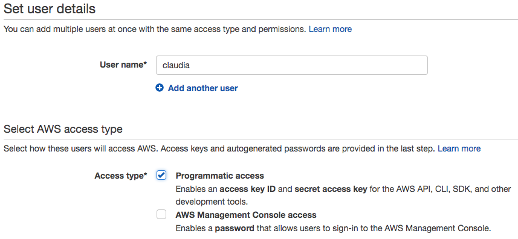

如上所示，创建一个名为`claudia`的新用户，为该用户提供编程访问权限。

完成后，点击“下一步：权限”按钮。现在，我们需要将此 IAM 账户附加到 Lambda 和 API 网关服务，并赋予它管理员权限：

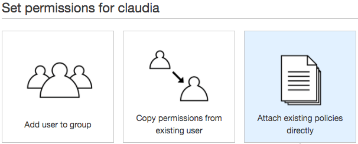

在选择“直接附加现有策略”后，您将看到下面出现一个长长的选项清单。为`claudia`用户选择以下三个权限：AdministratorAccess、AmazonAPIGatewayAdministrator，当然还有 AWSLambdaFullAccess。

点击“审核”后，您应该会看到以下内容：

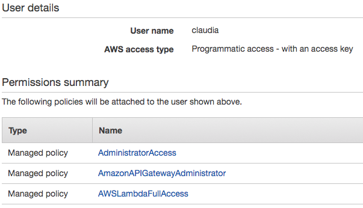

好的。点击“创建用户”，并复制提供的访问密钥 ID 和秘密访问密钥（稍后会用到）。现在，您已经准备好使用`claudia`部署 Lambda 函数了。

# 安装 claudia 并部署服务

要开始安装`claudia`模块，请输入以下命令：

```js
npm install claudia -g
```

现在，您应该存储刚刚为`claudia`用户创建的凭证。这里的一个好模式是在您的主目录中存储一个 AWS 配置文件（在 OSX 上，这将是`/Users/<yoursystemusername>`）。一旦进入您的主目录，创建`.aws/credentials`目录和文件，并使用您的 IAM 用户密钥：

```js
[claudia] 
aws_access_key_id = YOUR_ACCESS_KEY 
aws_secret_access_key = YOUR_ACCESS_SECRET
```

在这里，我们指示`claudia`是 AWS 配置文件名称，针对这些 IAM 凭证。当我们运行部署时，AWS 将被告知此配置文件和凭证。

现在，让我们创建一个可通过网络访问的 HTTP 端点，返回字符串“Hello from AWS!”。

创建一个新目录，并使用`npm init`初始化一个`npm`包，使用任何您喜欢的名称。要使用 AWS API Gateway，我们还需要安装`claudia`的扩展：

```js
npm install claudia-api-builder
```

接下来，将以下`app.js`文件添加到此目录：

```js
const ApiBuilder = require('claudia-api-builder');
const api = new ApiBuilder();

module.exports = api;

api.get('/hello', function () {
    return 'Hello from AWS!';
});
```

使用`claudia` `ApiBuilder`，我们将一个 Lambda 函数附加到`/hello`路由上处理 GET 请求。令人惊讶的是，我们已经完成了！要部署，请在终端中输入以下内容：

```js
AWS_PROFILE=claudia claudia create --region us-east-1 --api-module app
```

`AWS_PROFILE`环境变量引用了我们凭证文件中的`[claudia]`配置文件标识符，并且我们使用`--region`标志来建立部署区域。

如果一切顺利，您的端点将被部署，并且将返回类似以下的信息：

```js
{
  "lambda": {
    "role": "claudiaapi-executor",
    "name": "claudiaapi",
    "region": "us-east-1"
  },
  "api": {
    "id": "s8r80rsu22",
    "module": "app",
    "url": "https://s8r80rsu22.execute-api.us-east-1.amazonaws.com/latest"
  }
}
```

返回的 URL 指向我们的 API 网关。现在，我们需要添加我们 Lambda 函数的名称，该名称在我们之前定义的 GET 处理程序中设置为`'hello'`：

```js
api.get('/hello', function () ...
```

复制并粘贴返回的 URL 到浏览器中，并添加您的 Lambda 函数的名称：

```js
https://s8r80rsu22.execute-api.us-east-1.amazonaws.com/latest/hello
```

您将看到以下消息：

```js
Hello from AWS!
```

这很容易。更新函数同样容易。返回到代码并更改函数返回的字符串消息，然后运行：

```js
AWS_PROFILE=claudia claudia update
```

成功时将返回一个 JSON 对象，指示有关函数的代码大小和其他有用信息。继续在浏览器中重新加载端点，您将看到更新的消息。这些是零停机时间更新——您的服务在部署新代码时永远不会停止工作。在这里，我们满足了创建“独立的，无状态的服务可以独立地替换或升级（或降级）的关键目标，而不管它们所形成的任何系统的状态如何”。

现在，您可以通过返回 AWS 仪表板并访问 Lambda 服务来验证 Lambda 函数的存在：

![

我们可以看到列出的包名称（`claudiaapi`）和我们正在使用的 Node 运行时（在撰写本文时 AWS 上最高可用的版本）。如果单击函数，您将看到 Lambda 函数的管理页面，包括其代码以及用于管理最大执行时间和内存限制的界面。

将`app.js`中的处理程序函数更改为以下内容：

```js
api.get('/hello', function (request, context, callback) {
    return request;
});
```

您将看到三个新参数传递给`handler`，`request`，`context`和`callback`。`context`参数包含有关此调用的 Lambda 上下文的有用信息，例如调用 ID，被调用函数的名称等。有用的是，`claudia`在传递的`request`对象的`lambdaContext`键中镜像 Lambda 上下文。因此，使用`claudia`时，您只需要处理`request`参数，这简化了事情。

要了解有关 Lambda 事件上下文的更多信息，请参阅：[`docs.aws.amazon.com/lambda/latest/dg/nodejs-prog-model-context.html`](http://docs.aws.amazon.com/lambda/latest/dg/nodejs-prog-model-context.html)。

现在，使用`claudia update`更新您的 Lambda 函数，并检查 URL。您应该看到返回大量 JSON 数据，这是您可以使用的请求事件信息的总和。有关此数据对象的更多信息，请访问：[`github.com/claudiajs/claudia-api-builder/blob/master/docs/api.md#the-request-object`](https://github.com/claudiajs/claudia-api-builder/blob/master/docs/api.md#the-request-object)。

您可以在[`github.com/anaibol/awesome-serverless`](https://github.com/anaibol/awesome-serverless)找到一些有关无服务器开发信息和链接的有趣集合。

# 容器化的微服务

亚马逊 AWS 基础设施能够创建像 Lambda 这样的服务，因为他们的工程师在客户创建另一个云函数或 API 时不再提供硬件（即新的物理服务器）。相反，他们提供轻量级的虚拟机（VM）。当您注册时，没有人会将一个大的新金属箱放到机架上。软件是新的硬件。

容器的目标是提供与虚拟化服务器提供的相同的一般架构思想和优势——大规模生产虚拟化的独立机器。主要区别在于，虽然虚拟机提供自己的操作系统（通常称为**Hypervisor**），但容器需要主机操作系统提供实际的内核服务（例如文件系统、其他设备以及资源管理和调度），因为它们不需要携带自己的操作系统，而是寄生在主机操作系统上，容器非常轻便，使用更少的（主机）资源，并且能够更快地启动。在本节中，我们将介绍任何开发人员如何使用领先的容器技术 Docker 来廉价地制造和管理许多虚拟化服务器。

这是一个关于虚拟环境之间区别的很好的 StackOverflow 讨论：[`stackoverflow.com/questions/16047306/how-is-docker-different-from-a-normal-virtual-machine`](https://stackoverflow.com/questions/16047306/how-is-docker-different-from-a-normal-virtual-machine)。

Docker 网站（[`www.docker.com/`](http://www.docker.com/)）上的这张图片提供了一些关于 Docker 团队如何以及为什么他们认为他们的技术适合未来应用程序开发的信息：

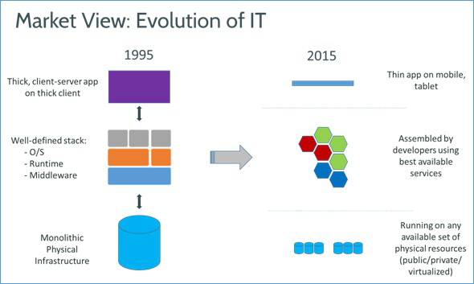

回顾我们对 4 层架构的讨论，我们可以看到开发人员问自己一个问题：如果我的应用程序由许多在云中独立开发、测试、部署和管理的通信服务组成，那么我们是否可以用“本地”服务做同样的事情，并为每个服务提供独立的容器，以便可以独立开发、测试、部署等？减少实施变更成本是容器化和微服务的目标。一个容器生成一个本地化的、独立的服务，具有受保护的本地内存，可以快速启动和重新启动，单独测试，并且可以静默失败，完全适合微服务架构：

+   明确定义的责任领域

+   隔离的依赖和状态

+   进程是可丢弃的

+   轻量级且易于启动和复制

+   优雅的终止，零应用程序停机时间

+   可以独立测试

+   可以独立监视

# 开始使用 Docker

Docker 生态系统有三个主要组件。文档中是这样说的：

+   Docker 容器。 Docker 容器包含应用程序运行所需的一切。每个容器都是从 Docker 镜像创建的。Docker 容器可以运行、启动、停止、移动和删除。每个容器都是一个独立和安全的应用程序平台。您可以将 Docker 容器视为 Docker 框架的运行部分。

+   Docker 镜像。 Docker 镜像是一个模板，例如，一个安装了 Apache 和您的 Web 应用程序的 Ubuntu 操作系统。 Docker 容器是从镜像启动的。Docker 提供了一种简单的方法来构建新的镜像或更新现有的镜像。您可以将 Docker 镜像视为 Docker 框架的构建部分。

+   **Docker 注册表**。Docker 注册表保存镜像。这些是公共（或私有！）存储，你可以上传或下载镜像。这些镜像可以是你自己创建的，也可以使用其他人之前创建的镜像。你可以将 Docker 注册表视为 Docker 框架的共享部分。你可以创建应用程序的镜像，以在任意数量的隔离容器中运行，并与其他人共享这些镜像。最受欢迎的是**Docker Hub**（[`hub.docker.com/`](https://hub.docker.com/)），但你也可以自己操作。

将 Node 应用程序组合成许多独立的进程的概念自然与 Docker 背后的哲学相吻合。Docker 容器是沙箱化的，无法在没有你的知识的情况下在其主机上执行指令。然而，它们可以向它们的主机操作系统公开一个端口，从而允许许多独立的虚拟容器链接到一个更大的应用程序中。

学习一下如何找到关于你的操作系统的信息，哪些端口正在使用，由哪些进程使用等是个好主意。我们之前提到过 HTOP，你应该至少熟悉一下如何收集网络统计信息——大多数操作系统都提供了`netstat`实用程序，用于发现哪些端口是打开的，谁在监听它们。例如，`netstat -an | grep -i "listen"`。

下载并安装**Docker 社区版**（[`www.docker.com/community-edition`](https://www.docker.com/community-edition)）或**Docker 工具箱**（[`docs.docker.com/toolbox/overview/`](https://docs.docker.com/toolbox/overview/)）。可以在以下网址找到两者之间的比较：[`docs.docker.com/docker-for-mac/docker-toolbox/`](https://docs.docker.com/docker-for-mac/docker-toolbox/)。如果你使用工具箱，在提示时选择 Docker Quickstart Terminal，这将在你的系统上生成一个终端并安装必要的组件。安装过程可能需要一段时间，所以不要惊慌！完成后，你应该在终端中看到类似以下的内容：

```js
docker is configured to use the default machine with IP 192.158.59.101
```

请注意 Docker 机器的名称是"default"。

为了了解镜像是如何工作的，运行`docker run hello-world`命令。你应该看到机器拉取一个镜像并将其容器化——正在发生的详细信息将被打印出来。如果现在运行`docker images`命令，你会看到类似这样的东西：

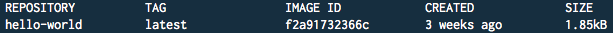

这个命令将告诉你一些关于你的 Docker 安装的信息：`docker info`。

Docker 容器运行你的应用程序的镜像。当然，你可以自己创建这些镜像，但现有的镜像生态系统也存在着大量的镜像。让我们创建一个运行 Express 的 Node 服务器的自己的镜像。

首先，我们需要构建一个要运行的应用程序。创建一个文件夹来放置你的应用程序文件。在该文件夹中，创建一个`/app`文件夹；这是我们将放置服务器文件的地方。与所有 Node 应用程序一样，我们需要创建一个`package.json`文件。进入`/app`文件夹并运行`npm init`，给这个包一个名字"docker-example"。然后，用`npm i express`安装 Express。

现在，创建一个简单的 Express 服务器并将其保存到`app/index.js`中：

```js
// index.js
const express = require('express');
const port = 8087;
const app = express();
const message = `Service #${Date.now()} responding`;
app.get('/', (req, res) => {
    res.send(message);
});
app.listen(port, () => console.log(`Running on http://localhost:${port}`));
```

继续启动服务器：

```js
> node app.js
// Running on http://localhost:8087
```

现在，你可以将浏览器指向端口`8087`的主机，看到类似`Service #1513534970093 responding`的唯一消息显示。很好。创建一个唯一消息（通过`Date.now()`）是有原因的，当我们讨论服务扩展时，这将更有意义。现在，让我们使用 Docker 将这些文件构建成一个容器。

# 创建一个 Dockerfile

我们的目标是描述此应用程序在其中执行的环境，以便 Docker 可以在容器中复制该环境。此外，我们希望将我们应用程序的源文件添加到这个新的虚拟化环境中运行。换句话说，Docker 可以充当构建器，遵循您提供的关于如何构建应用程序图像的指令。

首先，您应该有一个包含应用程序文件的文件夹。这是您的源代码存储库，您的 docker 图像将在其中构建。如前所述，Dockerfile 是用于构建应用程序的指令列表。Dockerfile 描述了构建过程。您通常会在 Dockerfile 中声明容器将运行的操作系统版本，以及您可能需要完成的任何操作系统安装，例如 Node。

创建一个`Dockerfile`文件（无扩展名）：

```js
# Dockerfile
FROM node:9
LABEL maintainer="your@email.com"
ENV NODE_ENV=development
WORKDIR /app
COPY ./app .
RUN npm i
EXPOSE 8087
CMD [ "npm", "start" ]
```

您在此文件中看到各种指令，并且还有一些其他指令可用于更复杂的构建。我们将从简单开始。要深入了解 Dockerfile，可以通过完整的文档运行：[`docs.docker.com/engine/reference/builder/`](https://docs.docker.com/engine/reference/builder/)。

`FROM`指令用于设置您将构建的基本图像。我们将基于`node:9`构建，这是包含最新 Node 的图像。更复杂的图像通常包括在此处，通常围绕常见模式构建。例如，此图像实现了**MEAN（Mongo Express Angular Node）**堆栈：[`hub.docker.com/r/meanjs/mean/`](https://hub.docker.com/r/meanjs/mean/)。`FROM`应该是 Dockerfile 中的第一个指令。

您可以通过`LABEL`为图像设置（可选的）元数据。可以有多个`LABEL`声明。这对于版本管理、信用等非常有用。我们还为 Node 进程设置了一些环境变量（`ENV`），如您在`process.env`中所期望的那样。

我们为应用程序指定工作目录（`WORKDIR`），并将我们机器上的所有本地文件`COPY`到容器的文件系统中；容器是隔离的，无法访问自身以外的文件系统，因此我们需要从我们的文件系统构建其文件系统。

现在，我们建立启动指令。`RUN npm i`安装`package.json`，`EXPOSE`我们服务器运行的端口（`8087`）到外部世界（再次，容器是隔离的，没有权限的情况下无法暴露内部端口），并运行命令（`CMD`）`npm start`。您可以设置多个`RUN`和`CMD`指令，以启动应用程序所需的任何内容。

我们现在准备构建和运行容器。

# 运行容器

在包含 Dockerfile 的目录中运行以下命令：

`docker build -t mastering-docker .`（注意末尾的句点）。

Docker 现在将获取所有基本依赖项并根据您的指令构建图像：

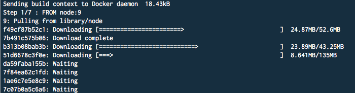

您刚刚创建了您的第一个 Docker 图像！要查看您的图像，请使用`docker images`：

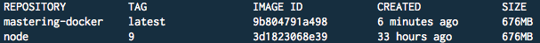

在这里，我们看到我们创建的图像`mastering-docker`，以及我们的图像基于的图像`node:9`。请注意冒号是用于创建图像的标记版本 -- 我们最终使用的是**node**图像标记为**9**。稍后再讨论版本控制。

下一步是将图像容器化并运行。使用此命令：

```js
docker run -p 8088:8087 -d mastering-docker
```

如果一切顺利，您将能够使用`docker ps`命令列出正在运行的 Docker 进程：

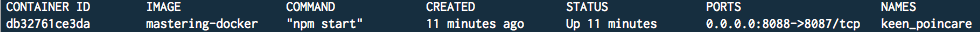

回想一下`EXPOSE 8087`指令？我们需要将容器暴露的端口映射到本地操作系统网络接口，我们在运行命令中使用`-p 8088:8087`标记了这个映射，我们可以在上面的屏幕截图中看到`PORTS`下的映射。

`-d`标志指示 Docker 我们想要以分离模式运行容器。这可能是您想要做的，将容器在后台运行。没有这个标志，当您终止终端会话时，容器将终止。

您现在正在一个完全与本地机器隔离的容器中运行一个 Node 服务器。通过在浏览器中导航到`localhost:8088`来尝试它。能够构建完全隔离的构建，具有完全不同的操作系统、数据库、软件版本等，然后知道您可以将完全相同的容器部署到数据中心而不改变任何内容，这是非常棒的。

以下是一些更有用的命令：

+   删除一个容器：`docker rm <containerid>`

+   删除所有容器：`docker rm $(docker ps -a -q)`

+   删除一个镜像：`docker rmi <imageid>`

+   删除所有镜像：`docker rmi $(docker images -q)`

+   停止或启动一个容器：`docker stop (或 start) <containerid>`

# 使用 Kubernetes 编排容器

基于微服务的架构由独立的服务组成。我们刚刚看到容器如何用于隔离不同的服务。现在，问题是如何管理和协调这 10、20、100、1,000 个服务容器？“手动”似乎不是正确的方法。Kubernetes 自动化容器编排，帮助您处理部署、扩展和集群健康的问题。由 Google 开发，它是一种成熟的技术，用于在 Google 自己的庞大数据中心中编排数百万个容器。

我们将安装一个名为 Minikube 的应用程序，它在本地机器的 VM 中运行一个单节点 Kubernetes 集群，因此您可以在部署之前在本地测试开发 Kubernetes 集群。由于您在本地进行的集群配置与“真实”的 Kubernetes 集群镜像，一旦满意，您可以在生产环境中部署您的定义而不需要进行任何更改。

# 创建一个基本的 Kubernetes 集群

您将需要某种 VM 驱动程序来运行 Minikube，默认情况下，Minikube 使用 VirtualBox。您可以在以下网址找到安装说明：[`www.virtualbox.org/wiki/Downloads`](https://www.virtualbox.org/wiki/Downloads)。VirtualBox 作为免费的 hypervisor 独立存在，用于支持其他有用的开发人员工具，如 Vagrant。

现在，我们将安装 kubectl（将其视为“Kube Control”），即 Kubernetes 命令行界面。请按照以下说明操作：[`kubernetes.io/docs/tasks/tools/install-kubectl/`](https://kubernetes.io/docs/tasks/tools/install-kubectl/)。

最后，我们安装 Minikube：[`kubernetes.io/docs/tasks/tools/install-minikube/`](https://kubernetes.io/docs/tasks/tools/install-minikube/)。

使用`minikube start`启动集群（这可能需要一段时间，所以请耐心等待）。输出足够描述：您将启动一个虚拟机，获取一个 IP 地址，并构建一个 Kubernetes 集群。输出应该以类似“Kubectl is now configured to use the cluster”的内容结束。您可以随时使用`minikube status`检查其状态：

```js
minikube: Running
cluster: Running
kubectl: Correctly Configured: pointing to minikube-vm at 192.160.80.100
```

要查看 kubectl 是否配置为与 Minikube 通信，请尝试`kubectl get nodes`，这应该显示 Minkube 机器'minikube'处于'就绪'状态。

此虚拟机是通过 VirtualBox 运行的。在您的机器上打开 Virtualbox Manager。您应该会看到列出了名为"minikube"的机器。如果是这样，太好了；Kubernetes 集群正在您的机器上运行！

您可以使用 Minikube 测试不同的 Kubernetes 版本。要获取可用版本，请运行`minikube get-k8s-versions`。一旦有了版本，使用`minikube start --kubernetes-version v1.8.0`在该版本上启动 Minikube。

现在，我们将使用 Kubernetes 来部署我们之前使用 Docker 容器化的“hello world”服务器。有用的是，Minikube 管理自己的 Docker 守护程序和本地存储库。我们将使用它来构建接下来的内容。首先，使用`eval $(minikube docker-env)`链接到 Minikube 的 Docker。当您想要将控制权返回到主机 Docker 守护程序时，请尝试`eval $(minikube docker-env -u)`。

返回到包含我们服务器的文件夹并构建我们的 Docker 镜像（注意末尾的点）：

```js
docker build -t mastering-kube:v1 .
```

当该过程完成后，您应该在终端中看到类似这样的显示：

```js
Successfully built 754d44e83976
Successfully tagged mastering-kube:v1
```

你可能已经注意到我们的镜像名称上有 `:v1` 后缀。我们在 Dockerfile 中声明 Node 时就看到了这一点（还记得 `FROM Node:9` 指令吗）？如果你运行 `docker images`，你会看到标签被应用了：

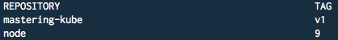

以后，如果我们想要发布 mastering-kube 的新版本，我们只需使用新标签构建，这将创建一个独立的镜像。这是您随着时间管理容器镜像版本的方法。

现在，让我们使用该镜像启动一个容器，并将其**部署**到我们的 Kubernetes 集群中：

```js
kubectl run kubernetes-demo --image=mastering-kube:v1
```

在这里，我们声明了一个名为 `kubernetes-demo` 的新部署，应该导入版本为 `v1` 的 `mastering-kube` 镜像。如果一切正常，您应该在终端中看到部署 "kubernetes-demo" 已创建。您可以使用 `kubectl get deployments` 列出部署：

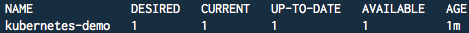

我们刚刚在 Kubernetes 集群中部署了一个单个 **Pod**。Pod 是 Kubernetes 的基本组织单元，它们是容器的抽象包装。Pod 可能包含一个或多个容器。Kubernetes 管理 Pod，Pod 管理它们自己的容器。每个 Pod 都有自己的 IP 地址，并且与其他 Pod 隔离，但是 Pod 中的容器之间不相互隔离（例如，它们可以通过 `localhost` 进行通信）。

Pod 提供了一个抽象，即在某个地方（本地、AWS、数据中心）运行的单个机器，以及在该单个机器上运行的所有容器。通过这种方式，您可以在云中的不同位置运行 Pod 的单个 Kubernetes 集群。Kubernetes 是跨不同位置的机器主机的抽象，它可以让您编排它们的行为，而不管它们是托管在 AWS 上的 VM 还是您办公室的笔记本电脑，就像您可能使用 ORM 来抽象数据库细节一样，让您可以自由更改部署的技术组成，而不必更改配置文件。

使用 `kubectl get pods` 命令，您现在应该看到类似这样的内容：

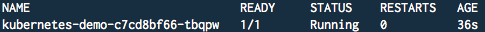

最后一步是将此部署的 Pod 作为服务暴露出来。运行此命令：

```js
kubectl expose deployment kubernetes-demo --port=8087 --type=LoadBalancer
```

如果成功，您应该看到消息服务 "kubernetes-demo" 已暴露。要查看服务，请使用 `kubectl get services`：

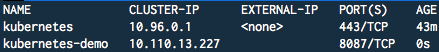

注意我们是如何创建一个负载均衡类型的部署的，暴露了一个映射到我们的 mastering-kube 服务（容器）的 Kubernetes 服务，可以通过为这个部署的 Pod 分配的唯一 IP 进行访问。让我们找到那个 URL：

```js
minikube service kubernetes-demo --url
```

您应该收到一个 URL（注意 Kubernetes 正在运行自己的 DNS），并浏览到该 URL，您应该看到类似这样的消息：

```js
Service #1513534970093 responding
```

通过 Minikube，您可以在一个步骤中在浏览器中启动您的服务：`minikube service kubernetes-demo`。

很好。然而，Kubernetes 的真正魔力在于部署如何扩展和响应网络条件。

回想一下这个部署是负载均衡的，让我们在同一个 Pod 中创建多个共享负载的容器（不太像你可能会使用 Node 的 Cluster 模块来平衡负载的方式）。运行以下命令：

```js
kubectl scale deployment kubernetes-demo --replicas=4
```

您应该收到消息部署 "kubernetes-demo" 已扩展。让我们确保这是真的。再次运行 `kubectl get pods`。您应该看到我们的部署已经自动扩展了它平衡的 Pod 数量：

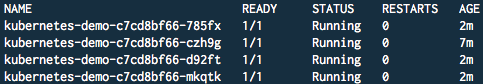

这很容易。让我们进行一个快速测试，以证明负载正在跨多个容器进行平衡。我们将使用 **AB（Apache Bench）** 进行快速基准测试和响应显示。使用以下命令针对我们的服务 URL 进行测试（用你本地服务的 URL 替换 URL）：

```js
ab -n 100 -c 10 -v 2 http://192.168.99.100:31769/
```

上面的所有内容都是为了模拟对我们的服务器的 100 次调用，这是为了检查它是否如预期般响应。我们将收到类似以下的输出：

```js
Service #1513614868094 responding
LOG: header received:
 HTTP/1.1 200 OK
X-Powered-By: Express
...
Connection: close

Service #1513614581591 responding
...

Service #1513614867927 responding
...
```

请记住，我们已经在 4 个容器之间进行了缩放的服务器有一个带有唯一时间戳的常量消息：

```js
// Per-server unique message
const message = `Service #${Date.now()} responding`; 

app.get('/', (req, res) => {
    res.send(message);
});
```

`ab`返回的响应差异证明了对一个端点的调用是在多个服务器/容器之间进行负载均衡的。

如果你发现 Minikube 处于奇怪或不平衡的状态，只需清除它的主目录并重新安装。例如：`rm -rf ~/.minikube; minikube start`。你也可以使用`minikube delete`完全删除 Kubernetes 集群。

虽然命令行工具非常有用，但你也可以访问 Kubernetes 集群的仪表板。你可以通过在终端中输入`kubectl proxy`来启动一个仪表板来监视你的集群。你会看到类似于这样的显示：`Starting to serve on 127.0.0.1:8001`。这指向仪表板服务器。在浏览器中打开这个服务器上的`/ui`路径（`127.0.0.1:8001/ui`），你应该会看到一个完整描述你的集群的 UI：

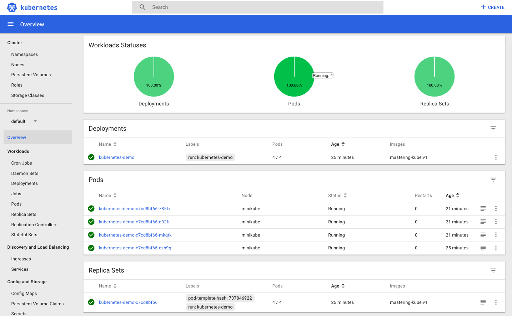

在这里，我们可以看到所有的 pod、状态等，特别是我们的 Pod 容器的 4/4 缩放。在本章的后面，我们将更深入地了解如何使用仪表板来检查正在运行的集群。

Minikube 提供了一个快捷方式，可以自动打开这个仪表板：`minikube dashboard`。

现在，让我们看一下如何使用**YAML（尚未标记语言）**来创建 Pod 声明，避免我们一直在做的手动配置，并简化后续的部署。

# 声明 Pod 部署

在本节中，我们将创建一个具有三个容器的 Pod，演示使用 YAML 文件管理配置声明如何简化部署过程，以及同一 Pod 中的容器如何相互通信。

在你的代码包中，将有一个名为`/kubernetes`的目录，其布局如下：

```js
/kubernetes
 /rerouter /responder three-containers.yaml
```

每个目录定义了一个 Docker 容器，该容器定义了一个 Express 服务器，将成为这个 Pod 中的容器。我们将把这些视为单独的服务，并演示它们如何通过`localhost`相互通信。

首先，让我们看一下 YAML 文件：

```js
apiVersion: v1
kind: Pod
metadata:
  name: three-containers
spec:
  restartPolicy: OnFailure
  volumes:
  - name: shared-data
    emptyDir: {}

  containers:
  - name: service-rerouter
    image: rerouter:v1
    volumeMounts:
    - name: shared-data
      mountPath: /app/public

  - name: service-responder
    image: responder:v1

  - name: service-os
    image: debian
    volumeMounts:
    - name: shared-data
      mountPath: /pod-data
    command: ["/bin/sh"]
    args: ["-c", "echo Another service wrote this! > /pod-data/index.html"]
```

这个清单是一个`kind`（`Pod`）的清单，具有一个定义了三个`containers`的`spec`，一个共享的`volume`（稍后会详细介绍），以及一个`restartPolicy`，表明只有在容器以失败代码退出时才应重新启动容器。

当容器需要共享数据时，就会使用卷。在容器内部，数据存储是暂时的——如果容器重新启动，那些数据就会丢失。共享卷是在 Pod 内部容器之外保存的，因此可以通过容器的重新启动和崩溃来持久保存数据。更重要的是，单个 Pod 中的许多容器可以写入和读取共享卷，从而创建一个共享的数据空间。我们的服务将使用这个卷作为共享文件系统，希望使用它的容器可以添加一个挂载路径——我们马上就会看到它是如何工作的。有关卷的更多信息，请访问：[`kubernetes.io/docs/concepts/storage/volumes/`](https://kubernetes.io/docs/concepts/storage/volumes/)。

首先，进入`/rerouter`文件夹并构建 docker 镜像：`docker build -t rerouter:v1 .`。请注意，在上面的 Pod 清单中列出了这个镜像：

```js
image: rerouter:v1
```

这个容器的`name`是`service-rerouter`，它提供了一个处理两个路由的 Express 服务器：

1.  当调用根路由（`/`）时，它将在`/public`目录中查找一个`index.html`文件。

1.  当调用`/rerouter`时，它将把用户重定向到这个 Pod 中的另一个服务，即监听端口`8086`的服务：

```js
const express = require('express');
const port = 8087;
const app = express();

app.use(express.static('public'));

app.get('/rerouter', (req, res) => {
    res.redirect('http://localhost:8086/oneroute');
});

app.listen(port, () => console.log(`Running on http://localhost:${port}`)); 
```

如果您查看`service-rerouter`的声明，您会看到它已经挂载到路径`/app/public`上的共享卷。此 Pod 中的任何容器现在都可以写入共享卷，它写入的内容将最终出现在此容器的`/public`文件夹中（可用作提供静态文件）。我们创建了一个容器服务，就是这样：

```js
- name: service-os
    image: debian
    volumeMounts:
    - name: shared-data
      mountPath: /pod-data
    command: ["/bin/sh"]
    args: ["-c", "echo Another service wrote this! > /pod-data/index.html"]
```

`service-os`容器将包含 Debian 操作系统，并将共享卷挂载到路径`/pod-data`。现在，任何写入文件系统的操作实际上都将写入此共享卷。使用系统 shell（`/bin/sh`），当此容器启动时，它将向共享卷`echo`一个`index.html`文件，其中包含“另一个服务写了这个！”的内容。由于此容器在回显后没有其他事情要做，它将终止。因此，我们将重启策略设置为仅在失败时重启 - 我们不希望此容器不断重启。添加终止的“辅助”服务，这些服务有助于构建 Pod 容器，然后退出的模式对于 Kubernetes 部署是常见的。

请记住，`service-rerouter`还声明了它的卷挂载`shared-data`在路径`/app/public`上，`service-os`生成的`index.html`文件现在将出现在该文件夹中，可用于提供服务：

```js
- name: service-rerouter
  image: rerouter:v1
  volumeMounts:
  - name: shared-data
    mountPath: /app/public
```

继续并为`/responder`文件夹中的应用程序构建 docker 镜像，就像您为`/rerouter`一样。`service-responder`容器解析单个路由`/oneroute`，返回一个简单的消息：

```js
const express = require('express');
const port = 8086;
const app = express();
app.get('/oneroute', (req, res) => {
    res.send('\nThe routing worked!\n\n');
});
app.listen(port, () => console.log(`Running on http://localhost:${port}`));
```

此容器将用于演示`service-rerouter`如何跨（共享的）`localhost`重定向 Kubernetes 为此 Pod 设置的 HTTP 请求。由于`service-responder`绑定在端口`8086`上，`service-rerouter`（在端口`8087`上运行）可以通过 localhost 路由到它：

```js
// rerouter/app/index.js
res.redirect('http://localhost:8086/oneroute');
```

因此，我们已经展示了 Pod 内的容器如何共享共同的网络和数据卷。假设您已成功构建了`rerouter:v1`和`responder:v1`的 Docker 镜像，请使用以下命令执行 Pod 清单：

```js
kubectl create -f three-containers.yaml
```

您应该看到创建的 Pod“three-containers”。使用`minikube dashboard`打开仪表板。您应该看到 three-containers Pod：

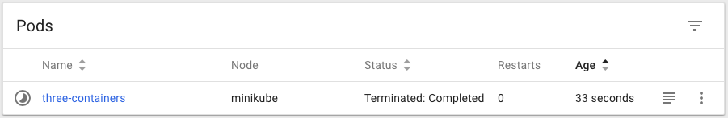

单击 three-containers 以显示描述：

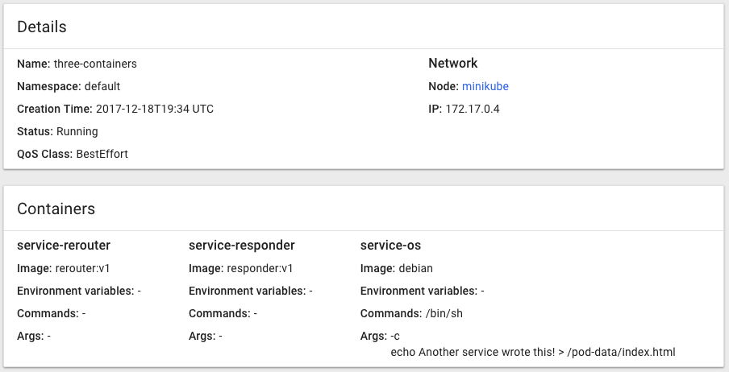

很好，一切都在运行。现在，让我们通过连接到我们的容器来验证一切是否正常。

获取`service-router`的 shell：

```js
kubectl exec -it three-containers -c service-rerouter -- /bin/bash
```

安装 curl：

```js
apt-get install curl
```

您的工作目录应该有一个`/public`文件夹。里面应该有一个`index.html`文件，由`service-os`容器创建。获取该文件的内容：`cat public/index.html`。如果一切正常，您应该看到消息“另一个服务写了这个！”，您会记得这是`service-os`服务创建的，通过共享卷 - `public/index.html`文件，`service-rerouter`将提供服务。

现在，让我们调用`/rerouter`路由，它应该重定向到`localhost:8086/oneroute/`上的`service-responder`服务器，并接收其响应“路由服务正常工作！”：

```js
curl -L http://localhost:8087/rerouter
```

这演示了同一 Pod 中的容器如何通过本地主机跨端口范围进行通信，就像它们所包含的 Pod 是单个主机一样。

Mesos 是编排的另一个选择（[`mesos.apache.org/`](http://mesos.apache.org/)），CoreOS 也是：[`coreos.com/`](https://coreos.com/)

这只是 Docker 和 Kubernetes 如何部署以简化扩展的表面。特别是在微服务架构上。您可以通过声明性清单进一步编排整个舰队的服务和部署。例如，很容易看出我们之前设计的 Seneca 微服务如何适应 Pods。现在您可以抽象出个别服务器的实现细节，并开始以声明方式思考，简单地描述您所期望的部署拓扑（副本、卷、恢复行为等），并让 Kubernetes 将其变为现实，这比命令式地微观管理成千上万的服务要好得多。

# 摘要

在本章中，我们深入研究了各种架构模式，从单体到 4 层。在这个过程中，我们开始考虑如何从微服务构建高度动态的应用程序，探索它们在可扩展性、灵活性和可维护性方面的一般优势。我们看了看微服务的 Seneca 框架，其基于模式的执行模型易于构建和遵循，特别是在与自动发现的网格服务的优势相结合时。跳入完全分布式模式，我们使用 Claudia 部署了无服务器 Lambda 函数，使用 API-Gateway 将 RESTful API 推送到 AWS 云中，始终可用并且成本低廉地实现了几乎无限的扩展。通过 Docker 和 Kubernetes（在 Minikube 的帮助下），我们深入探讨了如何构建独立虚拟机的集群，声明和部署容器的 Pods，以满足需求。

在本书的下一章，我们将学习软件开发人员可能最重要的技能：如何测试和调试您的代码。现在我们已经学会将应用程序的逻辑部分分离成独立的部分，我们可以开始探索这种设计在测试方面的优势，无论是在抽象的测试工具中还是在实际的代码情况中。
