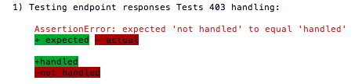
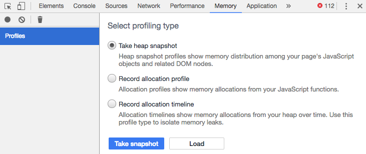
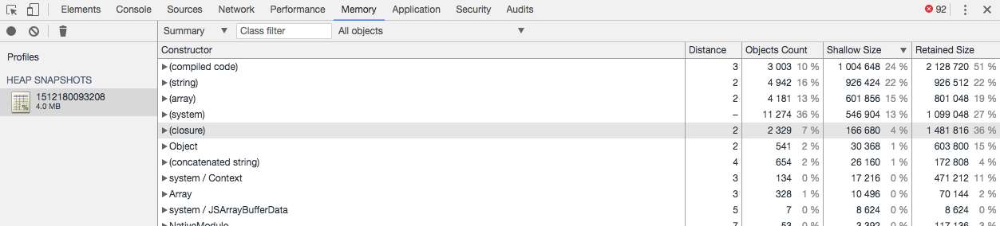
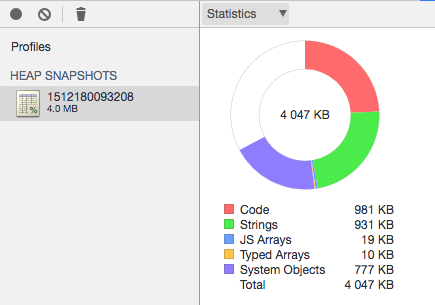
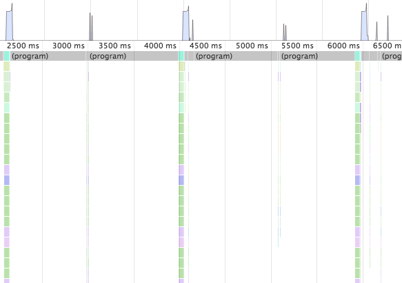
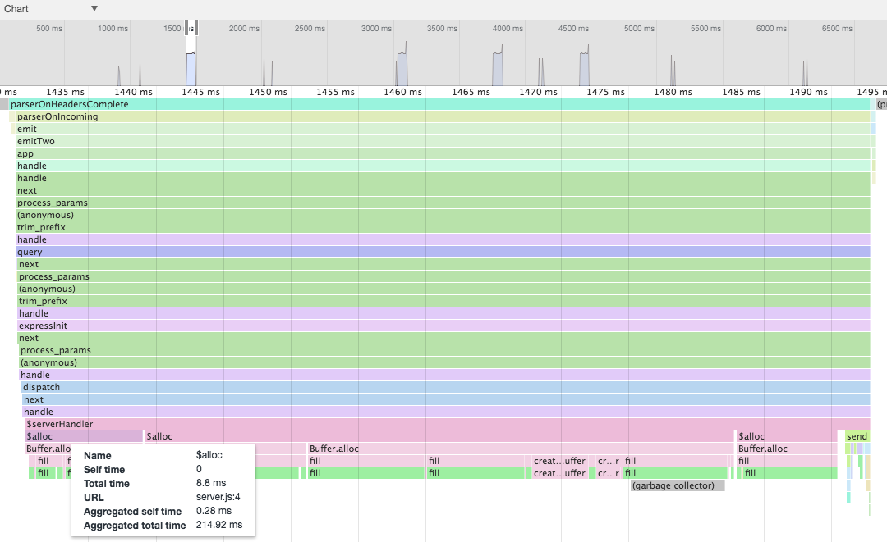
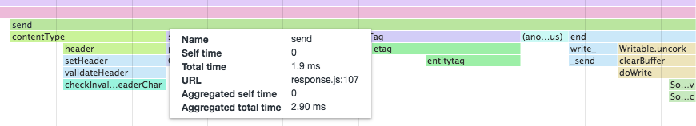
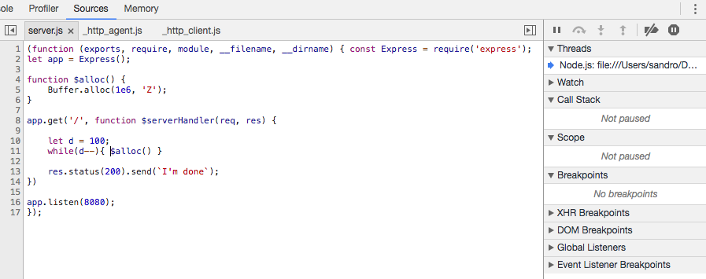
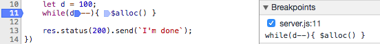
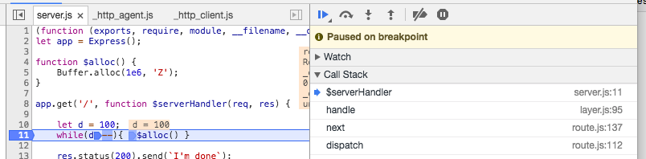

# 第十章：测试您的应用程序

“当地形与地图不符时，请相信地形。”

- 瑞士军刀手册

由于 Node 是由一个完全致力于代码共享的社区构建的，模块之间的互操作性非常重要，因此毫不奇怪的是，在 Node 的生态系统中，代码测试工具和框架在创立后不久就进入了。事实上，通常吝啬的核心 Node 团队很早就添加了`assert`模块，这表明他们认识到测试是开发过程的基本部分。

测试不仅仅是一个检测错误和修复缺陷的过程。例如，测试驱动开发坚持在任何代码存在之前进行测试！一般来说，测试是在软件中对现有行为和期望行为进行比较的过程，其中新信息不断地反馈到过程中。在这个意义上，测试涉及对期望进行建模，并验证单个功能、组成单元和实现路径是否满足每个利益相关者的期望，无论是在组织内部还是超出组织范围。

因此，测试也是关于管理风险。通过这种方式，异常可以被识别和量化，而地形中的颠簸现在可以有用地影响我们对地图的当前理解，从而缺陷的数量减少，我们的信心提高。测试帮助我们衡量何时完成。

在本章中，我们将专注于一些已知和有用的测试 Node 应用程序的模式，调查用于代码完整性测试的原生 Node 工具，使用 Mocha 框架进行一般测试，以及无头浏览器测试，最后一种允许在 Node 环境中测试基于浏览器的 JavaScript。我们还将看看测试的另一面——调试——并将两者结合起来。

当您阅读本章时，牢记将测试哲学融入项目可能很难做到。编写正确的测试比编写一些测试更困难。测试正确的事情比测试所有事情更困难（完整的代码覆盖很少意味着什么都不会出错）。一个好的测试策略应该尽早实施——这是您开始下一个 Node 项目时需要考虑的事情。

# 为什么测试很重要

一个好的测试策略通过积累证据和增加清晰度来建立信心。在公司内部，这可能意味着某些执行业务策略的标准已经得到满足，从而允许发布新的服务或产品。项目团队内的开发人员获得了一个自动的法官，确认或否认提交到代码库的更改是否合理。有了一个良好的测试框架，重构就不再危险；曾经对具有新想法的开发人员施加负面压力的“如果你破坏了它，你就拥有它”的警告不再那么可怕。有了一个良好的版本控制系统和测试/发布流程，任何破坏性的更改都可以在没有负面影响的情况下回滚，释放好奇心和实验精神。

三种常见的测试类型是：单元测试、功能测试和集成测试。虽然我们在本章的目标不是提出关于如何测试应用程序的一般理论，但简要总结单元测试、功能测试和集成测试是有用的，团队的哪些成员对每种测试最感兴趣，以及我们如何构建（或拆分）一个可测试的代码库。

# 单元测试

**单元测试**关注系统行为的单元。每个被测试的单元应该封装一个非常小的代码路径集，没有纠缠。当一个单元测试失败时，这应该理想地表明整体功能的一个孤立部分出现了问题。如果一个程序有一组明确定义的单元测试，整个程序的目的和预期行为应该很容易理解。单元测试对系统的小部分应用了有限的视角，不关心这些部分如何被包装成更大的功能块。

一个示例单元测试可以这样描述：当`123`值传递给“validate_phone_number（）”方法时，测试应该返回 false。对于这个单元的功能没有困惑，程序员可以放心使用它。

单元测试通常由程序员编写和阅读。类方法是良好的单元测试候选者，其他服务端点的输入签名稳定且被充分理解，预期输出可以被准确验证。通常假定单元测试运行速度快。如果一个单元测试执行时间很长，很可能是被测试的代码比应该的复杂。

单元测试不关心函数或方法将如何接收其输入，或者它将如何在一般情况下被使用。对于`add`方法的测试不应该关心该方法是否将被用于计算器或其他地方，它应该简单地测试两个整数输入（3,4）是否会导致该单元产生正确的结果（7）。单元测试不关心它在依赖树中的位置。因此，单元测试通常会*模拟*或*存根*数据源，例如将两个示例整数传递给`add`方法。只要输入是典型的，它们不必是实际的。此外，良好的单元测试是可靠的：不受外部依赖的影响，它们应该保持有效，无论周围的系统如何变化。

单元测试只确认单个实体在隔离状态下工作。测试单元能否在组合时良好工作是功能测试的目的。

# 功能测试

在单元测试关注特定行为的同时，**功能测试**旨在验证功能的各个部分。根词*function*的模棱两可，特别是对程序员来说，可能会导致混淆，即*单元测试*被称为*功能测试*，反之亦然。功能测试将许多单元组合成一个功能体，例如*当用户输入用户名和密码并点击发送时，该用户将被登录到系统*。我们很容易看到这个功能组将包括许多单元测试，一个用于验证用户名，一个用于处理按钮点击，等等。

功能测试通常是应用程序中某个特定领域的负责人关心的事情。虽然程序员和开发人员将继续实施这些测试，但产品经理或类似的利益相关者通常会设计它们（并在它们失败时抱怨）。这些测试在很大程度上检查较大的产品规格是否得到满足，而不是技术上的正确性。

前面给出的`validate_phone_number`的示例单元测试可能构成一个功能测试的一部分，描述如下：当用户输入错误的电话号码时，在该用户的国家显示一个描述正确格式的帮助消息。一个应用程序会帮助那些在电话号码上犯错误的用户，这是一个非常抽象的努力，与简单验证电话号码这样的技术实体完全不同。功能测试可以被认为是一些单元的抽象模型，它们如何一起满足产品需求。

由于功能测试是针对许多单元的组合进行的，因此可以预期，与孤立的单元测试不同，执行它们将涉及混合来自任意数量的外部对象或系统的关注点。在前面的登录示例中，我们看到一个相对简单的功能测试如何涉及数据库、UI、安全性和其他应用层。由于它的组合更复杂，功能测试花费的时间比单元测试多一点是可以接受的。功能测试预计变化不如单元测试频繁，因此功能的变化通常代表主要发布，而不是通常表示较小变化的单元测试修改。

请注意，与单元测试一样，功能测试本身与功能组在整个应用程序中的关系无关。因此，可以使用模拟数据作为运行功能测试的上下文，因为功能组本身不关心其对一般应用程序状态的影响，这是集成测试的领域。

# 集成测试

**集成测试**确保整个系统正确连接在一起，以便用户感觉应用程序正常工作。因此，集成测试通常验证整个应用程序的预期功能，或者验证一组重要产品功能中的一个。

集成测试与讨论中的其他测试类型最重要的区别在于，集成测试应在真实环境中执行，使用真实数据库和实际域数据，在服务器和其他系统上模拟目标生产环境。这样，集成测试很容易破坏以前通过的单元和功能测试。

例如，对于`validate_phone_number`的单元测试可能会通过像`555-123-4567`这样的输入，但在集成测试中，它将无法通过一些真实（且有效）的系统数据，比如`555.123.4567`。同样，功能测试可能成功测试理想系统打开帮助对话框的能力，但当与新的浏览器或其他运行时集成时，发现无法实现预期的功能。一个在单个本地文件系统上运行良好的应用程序，在分布式文件系统上运行时可能会失败。

由于增加了这种复杂性，系统架构师——能够对系统正确性应用更高层次的视角的团队成员——通常设计集成测试。这些测试可以发现孤立测试无法识别的连接错误。毫不奇怪，集成测试通常需要很长时间才能运行，通常设计为不仅运行简单场景，而且模拟预期的高负载、真实环境。

# 本地节点测试和调试工具

自从诞生以来，对经过测试的代码的偏好一直是 Node 社区理念的一部分，这反映在大多数流行的 Node 模块，甚至简单的模块，都附带了测试套件。而在许多年里，没有可用的测试工具，JavaScript 在浏览器端的开发一直备受困扰，而相对年轻的 Node 分发包含了许多测试工具。也许正因为如此，为 Node 开发了许多成熟且易于使用的第三方测试框架。这使得开发人员没有借口编写未经测试的代码！让我们来看看一些用于调试和测试 Node 程序的提供的工具。

# 写入控制台

控制台输出是最基本的测试和调试工具，提供了一个快速查看脚本中发生情况的方式。全局可访问的`console.log`通常用于调试。

Node 已经丰富了标准输出机制，增加了更多有用的方法，比如`console.error(String, String…)`，它将参数打印到`stderr`而不是`stdout`，以及`console.dir(Object)`，它在提供的对象上运行`util.inspect`（参见下文）并将结果写入`stdout`。

当开发人员想要跟踪代码执行所需时间时，通常会看到以下模式：

```js
let start = new Date().getTime();
for (x = 0; x < 1000; x++) {
  measureTheSpeedOfThisFunction();
}
console.log(new Date().getTime() - start);
// A time, in milliseconds 
```

`console.time`和`console.timeEnd`方法标准化了这种模式：

```js
 console.time('Add 1000000 records');
 let rec = [];
 for (let i = 0; i < 1000000; i++) {
     rec.push(1);
 }
 console.timeEnd('Add 1000000 records');
 //  > Add 1000000 records: 59ms
```

确保将相同的标签传递给`timeEnd()`，以便 Node 可以找到您使用`time()`开始的测量。Node 将秒表结果打印到`stdout`。在本章后面讨论断言模块和执行堆栈跟踪时，我们将看到其他特殊的控制台方法。

# 格式化控制台输出

在记录简单字符串时，上述方法都非常有用。更常见的是，有用的日志数据可能需要进行格式化，可以通过将几个值组合成单个字符串，或者通过整齐地显示复杂的数据对象来处理。`util.format`和`util.inspect`方法可以用来处理这些情况。

# `util.format(format，[arg，arg…])`方法

此方法允许将格式化字符串组成占位符，每个占位符都捕获并显示传递的附加值。考虑以下示例：

```js
> util.format('%s:%s', 'foo','bar')
 'foo:bar' 
```

在这里，我们看到两个占位符（以`％`为前缀）按顺序被传递的参数替换。占位符期望以下三种类型的值之一：

+   `％s`：字符串

+   `％d`：数字，可以是整数或浮点数

+   `％j`：JSON 对象

如果发送的参数数量多于占位符数量，则额外的参数将通过`util.inspect()`转换为字符串，并连接到输出的末尾，用空格分隔：

```js
> util.format('%s:%s', 'foo', 'bar', 'baz');
 'foo:bar baz' 
```

如果没有发送格式化字符串，则参数将被简单地转换为字符串并用空格分隔连接。

# `util.inspect(object，[options])`方法

当需要对象的字符串表示时，请使用此方法。通过设置各种选项，可以控制输出的外观：

+   `showHidden`：默认为 false。如果为 true，则会显示对象的不可枚举属性。

+   `depth`：对象定义（例如 JSON 对象）可以被深度嵌套。默认情况下，`util.inspect`只会遍历对象的两个级别。使用此选项来增加（或减少）深度。

+   `colors`：允许对输出进行着色（请查看以下代码片段）。

+   `customInspect`：如果正在处理的对象定义了`inspect`方法，则将使用该方法的输出，而不是 Node 的默认`stringification`方法（参见以下代码片段）。默认为 true。

设置自定义检查器：

```js
const util = require('util');
let obj = function() {
   this.foo = 'bar';
};
obj.prototype.inspect = function() {
   return "CUSTOM INSPECTOR";
};
console.log(util.inspect(new obj));
// CUSTOM INSPECTOR
console.log(util.inspect(new obj, { customInspect: false }));
// { foo: 'bar' }
```

当记录复杂对象或对象的值过大以至于使控制台输出无法阅读时，这可能非常有用。如果您的 shell 在终端中显示漂亮的颜色，如果颜色设置为 true，`util.inspect`也会显示漂亮的颜色。您甚至可以自定义颜色以及它们的使用方式。默认情况下，颜色只表示数据类型。

以下是默认设置，如在`util.inspect.styles`中设置的：

```js
{
   number: 'yellow',
   boolean: 'yellow',
   string: 'green',
   date: 'magenta',
   regexp: 'red'
   null: 'bold',
   undefined: 'grey',
   special: 'cyan',
 } 
```

在上述代码中，Node 以青色显示特殊类别中的函数。这些默认颜色分配可以与`util.inspect.colors`对象中存储的支持的 ANSI 颜色代码之一进行交换：粗体，斜体，下划线，反向，白色，灰色，黑色，蓝色，青色，绿色，品红色，红色和黄色。例如，要将对象的数字值显示为绿色而不是默认的黄色，请使用以下代码：

```js
 util.inspect.styles.number = "green";
 console.log(util.inspect([1,2,4,5,6], {colors: true}));
 // [1,2,3,4,5,6] Numbers are in green
```

# Node 调试器

大多数开发人员都使用 IDE 进行开发。所有良好的开发环境的一个关键特性是可以访问调试器，它允许在程序中设置断点，以便在需要检查状态或运行时的其他方面的地方进行检查。

V8 带有一个强大的调试器（通常用于 Google Chrome 浏览器的开发者工具面板），并且此调试器可供 Node 访问。它是使用 inspect 指令调用的：

```js
> node inspect somescript.js 
```

现在可以在节点程序中实现简单的逐步调试和检查。考虑以下程序：

```js
// debug-sample.js
setTimeout(() => {
  let dummyVar = 123;
  debugger;
  console.log('world');
}, 1000);
console.log('hello'); 
```

`dummyVar`一会儿就会有意义。现在注意`debugger`指令。在没有该行的情况下执行此程序会像您期望的那样运行：打印`hello`，等待一秒，然后打印`world`。有了调试器指令，运行 inspect 会产生这样的结果：

```js
> node inspect debug-sample.js
< Debugger listening on ws://127.0.0.1:9229/b3f76643-9464-41d0-943a-d4102450467e
< For help see https://nodejs.org/en/docs/inspector
< Debugger attached.
Break on start in debug-sample.js:1
> 1 (function (exports, require, module, __filename, __dirname) { setTimeout(() => {
 2 let dummyVar = 123;
 3 debugger;
debug>
```

调试器指令创建一个断点，一旦命中，Node 会给我们一个 CLI 来执行一些标准的调试命令：

+   `cont`或`c`：从上一个断点继续执行，直到下一个断点

+   `step`或`s`：步进，即继续运行直到命中新的源行（或断点），然后将控制返回给调试器

+   `next`或`n`：与`step`相同，但在新的源行上进行的函数调用会在不停止的情况下执行

+   `out`或`o`：跳出，即执行当前函数的其余部分并返回到父函数

+   `backtrace`或`bt`：跟踪到当前执行帧的步骤

+   `setBreakpoint()`或`sb()`：在当前行设置断点

+   `setBreakpoint(Integer)`或`sb(Integer)`：在指定行设置断点

在指定的行

+   `clearBreakpoint()`或`cb()`：清除当前行的断点

+   `clearBreakpoint(Integer)`或`cb(Integer)`：清除断点

在指定的行

+   `run`：如果调试器的脚本已终止，这将重新启动它

+   `restart`：终止并重新启动脚本

+   `pause`或`p`：暂停运行的代码

+   `kill`：终止正在运行的脚本

+   `quit`：退出调试器

+   `version`：显示 V8 版本

+   `scripts`：列出所有加载的脚本

重复上次的调试器命令，只需在键盘上按*Enter*。你的腕管道会感谢你。

回到我们正在调试的脚本：在调试器中输入`cont`将产生以下输出：

```js
...
debug> cont
< hello // A pause will now occur because of setTimeout
break in debug-sample.js:3
 1 (function (exports, require, module, __filename, __dirname) { setTimeout(() => {
 2 let dummyVar = 123;
> 3 debugger;
 4 console.log('world');
 5 }, 1000);
debug>
```

现在我们停在第 3 行的调试器语句处（注意尖括号）。例如，如果现在输入`next`（或`n`），调试器将跳到下一条指令并停在`console.log('world')`处。

在断点处通常有用进行一些状态检查，比如变量的值。您可以从调试器中跳转到**repl**以执行此操作。目前，我们在`debugger`语句处暂停。如果我们想要检查`dummyVar`的值怎么办？

```js
debug> repl
Press Ctrl + C to leave debug repl
> dummyVar
123
```

作为一个实验，再次运行脚本，使用`next`而不是`cont`，在最后一个上下文执行之前。不断按 Enter（重复上次的命令），尝试跟踪正在执行的代码。几步之后，您会注意到`timers.js`脚本将被引入到这个执行上下文中，并且您会看到类似以下的内容：

```js
debug> next
break in timers.js:307
 305 threw = false;
 306 } finally {
>307 if (timerAsyncId !== null) {
 308 if (!threw)
 309 emitAfter(timerAsyncId);
debug>
```

在这一点上在调试器中运行`scripts`命令，列出当前加载的脚本。您会看到类似这样的内容：

```js
debug> scripts
* 39: timers.js <native>
71: debug-sample.js
```

尝试使用强大的 V8 调试器来暂停、检查和在 Node 程序中进行导航的各种方法。除了常见的调试需求外，调试器在执行代码时以深层次显示 Node 的操作非常出色。

在本章的后面，我们将回顾其他可用于 Node 开发人员的调试和测试技术和工具。现在，让我们考虑`assert`模块，以及如何使用 Node 提供的这个本地测试框架。

# assert 模块

Node 的`assert`模块用于简单的单元测试。在许多情况下，它足以作为测试的基本脚手架，或者用作测试框架（如 Mocha，稍后我们将看到）的断言库。使用起来很简单：我们想要断言某些事情的真实性，并在我们的断言不为真时抛出错误。考虑这个例子：

```js
> require('assert').equal(1,2,'Not equal!')
AssertionError [ERR_ASSERTION]: Not equal!
>
```

如果断言为真（两个值相等），则不会返回任何内容：

```js
> require('assert').equal(1,1,"Not equal!")
undefined
```

遵循 UNIX 的沉默规则（当程序没有令人惊讶、有趣或有用的内容时，它应该保持沉默），断言只有在断言失败时才返回一个值。返回的值可以使用可选的消息参数进行自定义，就像前面的部分所示的那样。

`assert`模块 API 由一组具有相同调用签名的比较操作组成：实际值，期望值和可选消息（在比较失败时显示）。还提供了作为快捷方式或处理特殊情况的替代方法。

必须区分身份比较（`===`）和相等比较（`==`），前者通常被称为严格相等比较（就像在`assert`API 中一样）。由于 JavaScript 采用动态类型，当使用`==`相等运算符比较不同类型的两个值时，会尝试强制（或转换）一个值为另一个值，一种通用的操作。看看这个例子：

```js
1 == "1" // true
false == "0" // true
false == null // false
```

请注意，使用身份比较时结果更可预测：

```js
1 === "1" // false
false === "0" // false
false === null // false
```

要记住的是，在比较之前，`===`运算符不执行类型强制转换，而相等运算符在类型强制转换后进行比较。

将字符串和数字相等使 JavaScript 成为新手编程的宽容语言，并且很快，创建了一个错误，现在更有经验的程序员无意中隐藏在更大的代码库中。像*Brendan Eich*这样的语言作者做出这样的决定，并且很少能够在以后改变如此基本的行为，他们必须通过无休止的争论和争议来捍卫他们的决定，因为程序员们因此而抨击和赞扬他们的语言。

此外，因为对象可能包含相同的值但不是由相同的构造函数派生，因此具有相同值的两个对象的身份是不同的；身份要求两个操作数引用同一对象：

```js
let a = function(){};
let b = new a;
let c = new a;
let d = b;
console.log(a == function(){}) // false
console.log(b == c) // false
console.log(b == d) // true
console.log(b.constructor === c.constructor); // true
```

最后，深度相等的概念用于对象比较，其中身份不需要完全相同。如果两个对象都拥有相同数量的自有属性，相同的原型，相同的键集（尽管不一定是相同的顺序），并且每个属性的值是等效的（而不是相同的），则两个对象是深度相等的：

```js
const assert = require('assert');
let a = [1,2,3];
let b = [1,2,3];
assert.deepEqual(a, b); // passes, so nothing is output
assert.strictEqual(a, b); // throws Assertion error
```

通过设计一些断言测试来测试您对值如何相互理解的假设是很有用的。结果可能会让您感到惊讶。

以下是 Node 的 assert 模块中的函数，根据您可能使用它们的方式进行组织：

```js
equal            notEqual
strictEqual      notStrictEqual
deepEqual        notDeepEqual
deepStrictEqual  notDeepStrictEqual
ok
ifError
fail
throws           doesNotThrow
```

使用带有相等名称的断言函数遵循与`==`运算符相同的规则，而严格相等就像使用`===`一样。此外，选择一个标题中带有深度的函数，或者不带，以选择我们之前探索的所需行为。最简单的函数`assert.ok`，如果您自己编写逻辑来等同，可能就是您所需要的全部。

Node 的异步函数将错误对象返回给您的回调函数。将此对象传递给`assert.ifError(e)`，如果`e`被定义，`ifError`将抛出它。当执行已经到达代码中不应该执行的部分时，使用`assert.fail()`是最有用的。当异常被`try`/`catch`块捕获时，这是最有用的：

```js
// assertthrows.js
const assert = require('assert');
try {
   assert.fail(1,2,'Bad!','NOT EQ') 
} catch(e) { 
   console.log(e);
}
```

运行上述代码会产生以下输出：

```js
{ AssertionError [ERR_ASSERTION]: Bad!
 at Object.<anonymous> (/Users/sandro/Desktop/clients/ME/writing/Mastering_V2/chapter_ten/code/assertthrows.js:4:9)
 at Module._compile (module.js:660:30)
 ...
 at bootstrap_node.js:618:3
   generatedMessage: false,
 name: 'AssertionError [ERR_ASSERTION]',
 code: 'ERR_ASSERTION',
 actual: 1,
 expected: 2,
 operator: 'NOT EQ' }
```

控制台 API 中提供了用于记录断言结果的快捷方法：

```js
> repl
> console.assert(1 == 2, 'Nope!')
AssertionError [ERR_ASSERTION]: Nope!
```

或者，您可以使用`assert.throws`和`assert.doesNotThrow`确认函数始终抛出或从不抛出。

有关 JavaScript 中比较的详细解释，请参阅：[`developer.mozilla.org/en-US/docs/Web/JavaScript/Reference/Operators/Comparison_Operators`](https://developer.mozilla.org/en-US/docs/Web/JavaScript/Reference/Operators/Comparison_Operators) [Node 的 assert 模块受 CommonJS 测试规范的强烈影响，该规范可以在以下网址找到：](https://developer.mozilla.org/en-US/docs/Web/JavaScript/Reference/Operators/Comparison_Operators) [`wiki.commonjs.org/wiki/Unit_Testing`](http://wiki.commonjs.org/wiki/Unit_Testing)[.](https://developer.mozilla.org/en-US/docs/Web/JavaScript/Reference/Operators/Comparison_Operators)

# 沙箱

在某些情况下，您可能希望在一个单独且更有限的上下文中运行脚本，使其与较大应用程序的范围隔离开来。对于这些情况，Node 提供了`vm`模块，一个沙盒环境，包括一个新的 V8 实例和一个用于运行脚本块的有限执行上下文：

```js
const vm = require('vm');
let sandbox = {
    count: 2
};
let suspectCode = '++count;';
vm.runInNewContext(suspectCode, sandbox);
console.log(sandbox);
// { count: 3 }
```

在这里，我们看到提供的沙盒成为提供的脚本的局部执行范围。运行的脚本只能在提供的沙盒对象中操作，并且甚至被拒绝访问标准的 Node 全局对象，例如正在运行的进程，我们可以通过更改前面的代码来进行演示：

```js
suspectCode = '++count; process.exit()';
vm.runInNewContext(suspectCode, sandbox);

// evalmachine.<anonymous>:1
// ++count; process.exit()
//          ^
//
// ReferenceError: process is not defined
// at evalmachine.<anonymous>:1:10
// at ContextifyScript.Script.runInContext (vm.js:59:29)
// ...
```

该模块不能保证完全安全的*监狱*，以便可以安全地执行完全不受信任的代码。如果有这种需求，请考虑以适当的系统级权限运行一个单独的进程。由于`vm`会启动一个新的 V8 实例，每次调用都会耗费一些毫秒的启动时间和大约两兆字节的内存。只有在值得这种性能成本的情况下才使用`vm`。

为了测试代码，`vm`模块可以非常有效，特别是在强制代码在有限上下文中运行的能力方面。例如，在执行单元测试时，可以创建一个特殊的环境，并使用模拟环境中的模拟数据来测试脚本。这比创建一个带有虚假数据的人工调用上下文要好。此外，这种沙盒化将允许更好地控制新代码的执行上下文，提供良好的内存泄漏保护和其他在测试过程中可能出现的意外冲突。

# 区分局部范围和执行上下文

在进一步介绍示例之前，我们需要区分进程的局部范围和其执行上下文。这种区分有助于理解两个主要`vm`方法之间的区别：`vm.runInThisContext`和`vm.runInNewContext`。

在任何时候，V8 可能有一个或更可能是几个执行上下文。这些上下文充当单独的容器，V8 可以在其中执行一些更多的 JavaScript。在使用 Chrome 时，您可以将这些执行上下文视为导航到不同网站的不同标签页。

一个站点上的脚本无法看到或干扰另一个站点上的脚本。Node 进程的执行上下文代表 V8 中的运行时上下文，包括本地 Node 方法和其他全局对象（process、console、setTimeout 等）。

通过`vm.runInNewContext`执行的脚本无法访问任何范围；它的上下文限制在之前传递给它的沙盒对象中。

通过`vm.runInThisContext`执行的脚本可以访问 Node 进程的全局执行范围，但无法访问局部范围。我们可以通过以下方式进行演示：

```js
const vm = require('vm');

global.x = 1; // global scope
let y = 1; // local scope

vm.runInThisContext('x = 2; y = 3');
console.log(x, y); // 2, 1 <- only global is changed

eval('x = 3; y = 4');
console.log(x, y); // 3, 4 <- eval changes x, y
```

因此，脚本是通过`vm`在上下文中运行的。

预编译上下文和脚本通常很有用，特别是当每个都将被重复使用时。使用`vm.createContext([sandbox])`来编译一个执行上下文，并传入一个键/值映射。在下一节中，我们将看看如何将这些上下文应用于预编译的脚本。

# 使用编译上下文

收到 JavaScript 代码字符串后，V8 编译器将尽力将代码优化为更高效的编译版本。每次`vm`上下文方法接收代码字符串时，都必须进行这个编译步骤。如果您的代码不会改变并且至少被重用一次，最好使用`new vm.Script(code, [filename])`来编译它一次。

我们可以在从`runInThisContext`和`runInNewContext`继承的上下文中执行这些编译后的脚本。在这里，我们在两个上下文中运行编译后的脚本，演示了`x`和`y`变量被递增存在于完全隔离的范围中：

```js
const vm = require('vm');

global.x = 0;
global.y = 0;

let script = new vm.Script('++x, ++y;');
let emulation = vm.createContext({ x:0, y:0 });

for (let i = 0; i < 1000; i++) {
   script.runInThisContext(); // using global
   script.runInNewContext(emulation); // using own context
}

console.log(x, y); // 1000 1000
console.log(emulation.x, emulation.y); // 1000 1000
```

如果两个脚本都修改了相同的上下文中的`x`和`y`，输出将会是`2000 2000`。

请注意，如果`runInNewContext`脚本没有传递仿真层（沙盒），它将抛出`ReferenceError: x is not defined`，既不能访问本地变量也不能访问全局变量`x`和`y`的值。试一下。

现在我们已经了解了断言和创建测试上下文的一些内容，让我们使用一些常见的测试框架和工具编写一些真正的测试。

# 使用 Mocha、Chai 和 Sinon 进行测试

为您的代码编写测试的一个巨大好处是，您将被迫思考您编写的代码是如何工作的。难以编写的测试可能表明难以理解的代码。

另一方面，通过良好的测试实现全面覆盖，有助于他人（和您）了解应用程序的工作原理。在本节中，我们将看看如何使用测试运行器**Mocha**来描述您的测试，使用**Chai**作为其断言库，并在需要对测试进行模拟时使用**Sinon**。我们将使用**redis**来演示如何针对模拟数据集创建测试（而不是针对生产数据库进行测试，这当然是一个坏主意）。我们将使用**npm**作为测试脚本运行器。

首先，设置以下文件夹结构：

```js
/testing

/scripts

/spec
```

现在，在`/testing`文件夹中使用`npm init`初始化一个`package.json`文件。您可以在提示时只需按*Enter*，但当要求测试命令时，请输入以下内容：

```js
mocha ./spec --require ./spec/helpers/chai.js --reporter spec
```

这为我们的项目设置了我们将需要的模块的导入。稍后我们将讨论 Chai 的作用。现在，可以说在这个测试命令中，Mocha 被引用为依赖信息的配置文件。

继续安装所需的库到这个包中：

```js
npm install --save-dev mocha chai sinon redis
```

`/scripts`文件夹将包含我们将要测试的 JavaScript。`/spec`文件夹将包含配置和测试文件。

随着我们的进展，这将变得更有意义。现在，要认识到对 npm 的`test`属性的分配表明我们将使用 Mocha 进行测试，Mocha 的测试报告将是`spec`类型，并且测试将存在于`/spec`目录中。我们还需要一个 Chai 的配置文件，这将在我们继续进行时进行解释。重要的是，这现在已经在 npm 中创建了一个脚本声明，允许您使用`npm test`命令运行测试套件。在接下来的开发中，每当需要运行我们将要开发的 Mocha 测试时，请使用该命令。

# Mocha

Mocha 是一个测试运行器，不关心测试断言本身。Mocha 用于组织和运行您的测试，主要通过使用`describe`和`it`操作符。概括地说，Mocha 测试看起来像这样：

```js
describe("Test of Utility Class", function() {
  it("should return a date", function(){
   // Test date function somehow and assert success or failure
  });
  it("should return JSON", function() {
   // Test running some string through #parse 
  });
});
```

正如您所看到的，Mocha 测试套件留下了测试如何描述和组织的空间，并且不假设测试断言的设计方式。它是您测试的组织工具，另外还旨在生成可读的测试定义。

您可以设置同步运行的测试，如前面所述，也可以使用传递给所有回调的完成处理程序异步运行：

```js
describe("An asynchronous test", () => { 
  it("Runs an async function", done => { 
    // Run async test, and when finished call... done(); 
  }); 
}); 
```

块也可以嵌套：

```js
describe("Main block", () => { 
  describe("Sub block", () => { 
    it("Runs an async function", () => { 
      // A test running in sub block 
    }); 
  }); 
  it("Runs an async function", () => { 
    // A test running in main block 
  }); 
});
```

最后，Mocha 提供了*hooks*，使您能够在测试之前和/或之后运行一些代码：

+   `beforeEach()`在描述块中的每个测试之前运行

+   `afterEach()`在描述块中的每个测试之后运行

+   `before()`在任何测试之前运行一次代码-在任何`beforeEach`运行之前

+   `after()`在所有测试运行后运行一次代码-在任何`afterEach`运行之后

通常，这些用于设置测试上下文，例如在测试之前创建一些变量并在其他一些测试之前清理它们。这个简单的工具集足够表达大多数测试需求。此外，Mocha 提供了各种测试报告程序，提供不同格式的结果。随着我们构建一些真实的测试场景，我们将在后面看到这些。

# Chai

正如我们之前在 Node 的原生断言模块中看到的，基本上，测试涉及断言我们期望某些代码块执行的内容，执行该代码，并检查我们的期望是否得到满足。Chai 是一个断言库，提供了更具表现力的语法，提供了三种断言样式：`expect`、`should`和`assert`。我们将使用 Chai 来提供断言（测试），并将其包装在 Mocha 的`it`语句中，更青睐`expect`样式的断言。

请注意，虽然`Chai.assert`是模仿核心 Node 断言语法的，但 Chai 通过附加方法来增强对象。

首先，我们将创建一个配置文件`chai.js`：

```js
let chai = require('chai');

chai.config.includeStack = true;
global.sinon = require('sinon');
global.expect = chai.expect;
global.AssertionError = chai.AssertionError;
global.Assertion = chai.Assertion;
```

将此文件放在`/spec/helpers`文件夹中。这将告诉 Chai 显示任何错误的完整堆栈跟踪，并将`expect`断言样式公开为全局。同样，Sinon 也被公开为全局（更多关于 Sinon 的内容将在下一节中介绍）。这个文件将增强 Mocha 测试运行上下文，以便我们可以在每个测试文件中使用这些工具而不必重新声明它们。`expect`样式的断言读起来像一个句子，由*to*、*be*、*is*等单词组成。考虑以下例子：

```js
expect('hello').to.be.a('string') 
expect({ foo: 'bar' }).to.have.property('foo') 
expect({ foo: 'bar' }).to.deep.equal({ foo: 'bar' }); 
expect(true).to.not.be.false 
expect(1).to.not.be.true 
expect(5).to.be.at.least(10) // fails
```

要探索在创建期望测试链时可用的广泛单词列表，请查阅完整文档：[`chaijs.com/api/bdd/`](http://chaijs.com/api/bdd/)。正如前面所述，Mocha 对于如何创建断言并没有意见。我们将在接下来的测试中使用`expect`来创建断言。

考虑测试以下对象中的 capitalize 函数：

```js
let Capitalizer = () => {
  this.capitalize = str => { 
    return str.split('').map(char => { 
      return char.toUpperCase(); 
    }).join(''); 
  }; 
};
```

我们可能会这样做：

```js
describe('Testing Capitalization', () => { 
  let capitalizer = new Capitalizer(); 
  it('capitalizes a string', () => {
    let result = capitalizer.capitalize('foobar'); 
    expect(result).to.be.a('string').and.equal('FOOBAR'); 
  }); 
});
```

这个 Chai 断言将是真的，Mocha 也会报告相同的结果。您将用这些描述和断言块构建整个测试套件。

接下来，我们将看看如何将 Sinon 添加到我们的测试过程中。

# Sinon

在测试环境中，您通常在模拟生产环境的现实情况，因为访问真实用户、数据或其他实时系统是不安全或不可取的。因此，能够模拟环境是测试的一个重要部分。此外，您通常希望检查的不仅仅是调用结果；您可能还想测试给定函数是否在正确的上下文中被调用或使用正确的示例。Sinon 是一个帮助您模拟外部服务、模拟函数、跟踪函数调用等的工具。

sinon-chai 模块在[`github.com/domenic/sinon-chai`](https://github.com/domenic/sinon-chai)上扩展了 Chai 的 Sinon 断言。

关键的 Sinon 技术是间谍、存根和模拟。此外，您可以设置虚假计时器，创建虚假服务器等等（访问：[`sinonjs.org/`](http://sinonjs.org/)）。本节重点介绍前三者。让我们看看每个的一些例子。

# 间谍

来自 Sinon 文档：

“测试间谍是一个记录其所有调用的参数、返回值、this 的值和抛出的异常（如果有的话）的函数。测试间谍可以是一个匿名函数，也可以包装一个现有函数。”

间谍收集了它正在跟踪的函数的信息。看看这个例子：

```js
const sinon = require('sinon'); 

let argA = "foo"; 
let argB = "bar"; 
let callback = sinon.spy(); 

callback(argA); 
callback(argB); 

console.log(
  callback.called, 
  callback.callCount, 
  callback.calledWith(argA), 
  callback.calledWith(argB), 
  callback.calledWith('baz')
);
```

这将记录以下内容：

```js
true 
2 
true 
true 
false
```

间谍被叫了两次；一次用`foo`，一次用`bar`，从未用过`baz`。如果你正在测试某个函数是否被调用和/或测试它接收到的参数，间谍是你的一个很好的测试工具。

假设我们想测试我们的代码是否正确连接到 Redis 的发布/订阅功能：

```js
const redis = require("redis"); 
const client1 = redis.createClient(); 
const client2 = redis.createClient(); 

// Testing this
function nowPublish(channel, msg) { 
  client2.publish(channel, msg); 
}; 
describe('Testing pub/sub', function() { 
  before(function() { 
    sinon.spy(client1, "subscribe"); 
  }); 
  after(function() { 
    client1.subscribe.restore(); 
  }); 

  it('tests that #subscribe works', () => { 
    client1.subscribe("channel");
    expect(client1.subscribe.calledOnce); 
  }); 
  it('tests that #nowPublish works', done => { 
    let callback = sinon.spy(); 
    client1.subscribe('channel', callback); 
    client1.on('subscribe', () => { 
      nowPublish('channel', 'message'); 
        expect(callback.calledWith('message')); 
        expect(client1.subscribe.calledTwice); 
        done(); 
    }); 
  }); 
});
```

在这个例子中，我们在 spy 和 Mocha 中做了更多。 我们使用 spy 代理 client1 的原生 subscribe 方法，重要的是在 Mocha 的 before 和 after 方法中设置和拆卸 spy 代理（恢复原始功能）。 Chai 断言证明`subscribe`和`nowPublish`都正常运行，并且接收到正确的参数。 有关间谍的更多信息可以在以下网址找到：[`sinonjs.org/releases/v4.1.2/spies`](http://sinonjs.org/releases/v4.1.2/spies)。

# 存根

测试存根是具有预编程行为的函数（间谍）。 它们支持完整的测试间谍 API，以及可用于更改存根行为的方法。 存根在用作间谍时，可以包装现有函数，以便可以伪造该函数的行为（而不仅仅是记录函数执行，就像我们之前在间谍中看到的那样）。

假设您的应用程序中有一些功能会调用一些 HTTP 端点。 代码可能是这样的：

```js
http.get("http://www.example.org", res => { 
  console.log(`Got status: ${res.statusCode}`); 
}).on('error', e => { 
  console.log(`Got error: ${e.message}`); 
});
```

成功时，调用将记录`Got status: 200`。 如果端点不可用，您将看到类似`Got error: getaddrinfo ENOTFOUND`的内容。

您可能需要测试应用程序处理替代状态代码以及明确错误的能力。 您可能无法强制端点发出这些代码，但是如果发生这种情况，您必须为它们做好准备。 存根在这里非常有用，可以创建合成响应，以便可以全面地测试响应处理程序。

我们可以使用存根来模拟响应，而不实际调用`http.get`方法：

```js
const http = require('http'); 
const sinon = require('sinon'); 

sinon.stub(http, 'get').yields({ 
  statusCode: 404 
}); 

// This URL is never actually called 
http.get("http://www.example.org", res => { 
  console.log(`Got response: ${res.statusCode}`); 
  http.get.restore(); 
})
```

这个存根通过包装原始方法来产生模拟响应，但实际上从未调用原始方法，导致从通常返回状态代码`200`的调用中返回`404`。 重要的是，注意我们在完成后如何`restore`存根方法到其原始状态。

例如，以下*伪*代码描述了一个模块，该模块进行 HTTP 调用，解析响应，并在一切正常时返回`'handled'`，在 HTTP 响应意外时返回`'not handled'`：

```js
const http = require('http'); 
module.exports = function() => { 
  this.makeCall = (url, cb) => { 
    http.get(url, res => { 
      cb(this.parseResponse(res)); 
    }) 
  } 
  this.parseResponse = res => { 
    if(!res.statusCode) { 
      throw new Error('No status code present'); 
    }
    switch(res.statusCode) { 
      case 200: 
        return 'handled'; 
        break; 
      case 404: 
        return 'handled'; 
        break; 
      default: 
        return 'not handled'; break; 
    } 
  } 
}
```

以下的 Mocha 测试确保`Caller.parseReponse`方法可以处理我们需要处理的所有响应代码，使用存根来模拟整个预期的响应范围：

```js
let Caller = require('../scripts/Caller.js'); 
describe('Testing endpoint responses', function() { 
  let caller = new Caller(); 
  function setTestForCode(code) { 
    return done => { 
      sinon.stub(caller, 'makeCall').yields(caller.parseResponse({ 
        statusCode: code 
      })); 
      caller.makeCall('anyURLWillDo', h => { 
        expect(h).to.be.a('string').and.equal('handled'); 
        done(); 
      }); 
    } 
  } 
  afterEach(() => caller.makeCall.restore()); 

  it('Tests 200 handling', setTestForCode(200)); 
  it('Tests 404 handling', setTestForCode(404)); 
  it('Tests 403 handling', setTestForCode(403)); 
});
```

通过代理原始的`makeCall`方法，我们可以测试`parseResponse`对一系列状态代码的处理，而无需强制远程网络行为。 请注意，前面的测试应该失败（没有`403`代码的处理程序），这个测试的输出应该看起来像这样：



存根的完整 API 可以在以下网址查看：[`sinonjs.org/releases/v4.1.2/stubs/`](http://sinonjs.org/releases/v4.1.2/stubs/)。

# 模拟

模拟（和模拟期望）是具有预编程行为（如存根）和预编程期望的虚假方法（如间谍）。 如果未按预期使用模拟，模拟将使您的测试失败。 模拟可以用来检查被测试单元的正确使用，而不是在事后检查期望，它们强制执行实现细节。

在下面的示例中，我们检查特定函数被调用的次数，以及它是否以特定的预期参数被调用。 具体来说，我们再次使用模拟来测试 Utilities 的`capitalize`方法：

```js
const sinon = require('sinon'); 
let Capitalizer = require('../scripts/Capitalizer.js'); 
let capitalizer = new Capitalizer(); 

let arr = ['a','b','c','d','e']; 
let mock = sinon.mock(capitalizer); 

// Expectations 
mock.expects("capitalize").exactly(5).withArgs.apply(sinon, arr); 
// Reality
arr.map(capitalizer.capitalize);
// Verification
console.log(mock.verify());

// true
```

在`utilities`上设置模拟之后，我们将一个五元素数组映射到`capitalize`，期望`capitalize`被调用五次，数组的元素作为参数（使用`apply`将数组展开为单独的参数）。 然后检查名为`mock.verify`的方法，以查看我们的期望是否得到满足。 和往常一样，在完成后，我们使用`mock.restore`取消包装 utilities 对象。 您应该在终端中看到 true 被记录。

现在，从被测试的数组中删除一个元素，使期望受挫。当您再次运行测试时，您应该在输出的顶部附近看到以下内容：

```js
ExpectationError: Expected capitalize([...]) 5 times (called 4 times)
```

这应该澄清模拟旨在产生的测试结果类型。

请注意，模拟的函数不会执行；`mock`会覆盖其目标。在前面的示例中，没有任何数组成员会通过`capitalize`运行。

让我们重新审视我们之前使用模拟测试 Redis `pub/sub`的示例：

```js
const redis = require("redis"); 
const client = redis.createClient(); 

describe('Mocking pub/sub', function() { 
  let mock = sinon.mock(client); 
  mock.expects('subscribe').withExactArgs('channel').once(); 
  it('tests that #subscribe is being called correctly', function() { 
    client.subscribe('channel'); 
    expect(mock.verify()).to.be.true; 
  }); 
});
```

与其检查结论，我们在这里断言我们的期望，即模拟的`subscribe`方法将仅接收一次确切的参数通道。Mocha 期望`mock.verify`返回`true`。要使此测试失败，添加一行`client.subscribe('channel')`，产生类似以下的内容：

```js
ExpectationError: Unexpected call: subscribe(channel)
```

有关如何使用模拟的更多信息，请访问：[`sinonjs.org/releases/v4.1.2/mocks/`](http://sinonjs.org/releases/v4.1.2/mocks/)。

# 使用 Nightmare 和 Puppeteer 进行无头测试

测试 UI 是否有效的一种方法是支付几个人通过浏览器与网站进行交互，并报告他们发现的任何错误。这可能会变得非常昂贵，最终也不可靠。此外，这需要将潜在失败的代码投入生产以进行测试。最好在发布任何内容“到野外”之前，测试浏览器视图是否在测试过程本身中正确呈现。

一个被剥夺了按钮和其他控件的浏览器，本质上是一个验证和运行 JavaScript、HTML 和 CSS，并创建视图的程序。验证的 HTML 在您的屏幕上呈现出来只是人类只能用眼睛看到的结果。机器可以解释编译代码的逻辑，并查看与该代码的交互结果，而无需视觉组件。也许是因为眼睛通常在头部，由服务器上的机器运行的浏览器通常被称为无头浏览器。

我们将看一下两个无头浏览器测试自动化库：**Nightmare** ([`github.com/segmentio/nightmare`](https://github.com/segmentio/nightmare)) 和 **Puppeteer** ([`github.com/GoogleChrome/puppeteer`](https://github.com/GoogleChrome/puppeteer))。Nightmare 使用**Electron**作为其浏览器环境，而 Puppeteer 使用无头**Chromium**。它们都为您提供了一个可编写脚本的环境，围绕浏览器上下文，使您能够对该*页面*进行各种操作，例如抓取屏幕截图，填写并提交表单，或者根据 CSS 选择器从页面中提取一些内容。与我们之前的工作保持一致，我们还将学习如何使用 Mocha 和 Chai 来利用这些无头浏览器测试。

让我们熟悉这两个工具，然后看看它们如何集成到您的测试环境中。

# Nightmare

Nightmare 为处理 Web 内容提供了一个非常富有表现力的 API。让我们立即使用一个示例 Mocha 测试来验证网页的文档标题：

```js
const Nightmare = require('nightmare');

describe(`Nightmare`, function() {
  let nightmare;

  beforeEach(() => nightmare = Nightmare({
    show: false
  }));

  afterEach(function(done) {
    nightmare.end(done);
  });

  it(`Title should be 'Example Domain'`, function(done) {
    nightmare
    .goto('http://example.org')
    .title()
    .then(title => expect(title).to.equal(`Example Domain`))
    .then(() => done())
    .catch(done);
  });
});
```

在这里，我们使用 Mocha 的`beforeEach`和`afterEach`来预期许多测试块，为每个测试创建一个新的 Nightmare 实例，并通过`nightmare.end`自动清理这些实例。您不一定要这样做，但这是一个有用的*样板*。Nightmare 接受一个反映 Electron 的**BrowserWindow**选项的配置对象 ([`github.com/electron/electron/blob/master/docs/api/browser-window.md#new-browserwindowoptions`](https://github.com/electron/electron/blob/master/docs/api/browser-window.md#new-browserwindowoptions))，在这里，我们使用`show`属性，使渲染实例可见——视图*弹出*在您的屏幕上，以便您可以观看页面的操作。特别是在进行导航和 UI 交互的测试中，看到这些操作是很有用的。在这里和接下来的测试中尝试一下。

这个测试很容易阅读。在这里，我们简单地前往一个 URL，获取该页面的标题，并进行断言以测试我们是否有正确的标题。请注意，Nightmare 被设计为与 Promises 原生地配合工作，你看到的`Promise`链是基于 Node 原生的 Promises 构建的。如果你想使用另一个`Promise`库，你可以这样做：

```js
const bbNightmare = Nightmare({
  Promise: require('bluebird')
});

bbNightmare.goto(...)
```

与页面交互是无头浏览器测试的必不可少的部分，让你编写自动运行的 UI 测试。例如，你可能想测试你的应用程序的登录页面，或者当提交时搜索输入返回正确的结果和正确的顺序。让我们向这个套件添加另一个测试，一个在 Yahoo 上搜索 Nightmare 主页并查询链接文本的测试：

```js
it('Yahoo search should find Nightmare homepage', done => {
    nightmare
    .goto('http://www.yahoo.com')
    .type('form[action*="/search"] [name=p]', 'nightmare.js')
    .click('form[action*="/search"] [type=submit]')
    .wait('#main')
    .evaluate(() => document.querySelector('#main .searchCenterMiddle a').href)
    .then(result => expect(result).to.equal(`http://www.nightmarejs.org/`))
    .then(() => done())
    .catch(done);
})
```

你可以看到这是如何工作的。使用 CSS 选择器在 Yahoo 的首页上找到搜索框，输入`'nightmare.js'`并点击提交按钮提交表单。等待一个新的元素`#main`出现，表示结果页面已经被渲染。然后我们创建一个`evaluate`块，它将在浏览器范围内执行。这是一个进行自定义 DOM 选择和操作的好地方。在这里，我们找到第一个链接，并检查它是否是我们期望的链接。这个简单的模式可以很容易地修改为点击你网站上的链接以确保链接正常工作，或者在结果页面上运行几个选择器以确保正确的结果被传递。

在你的测试中，你可能会发现重复的模式。想象一下，从选择器定位的链接中提取文本是你测试中的常见模式。Nightmare 允许你将这些转化为自定义操作。让我们在 Nightmare 上创建一个自定义的`getLinkText`操作，并在我们的测试中使用它。首先，在实例化 Nightmare 之前，定义一个新的`action`：

```js
Nightmare.action('getLinkText', function(selector, done) {
    // `this` is the nightmare instance
    this.evaluate_now(selector => {
        return document.querySelector(selector).href;
    }, done, selector)
});
```

现在，用我们自定义操作的调用替换原始的 evaluate 指令：

```js
...
.wait('#main')
.getLinkText('#main .searchCenterMiddle a') // Call action
...
```

我们只是将我们的原始指令转换为一个操作块，使用自定义的名称和函数签名，并从我们的测试链中调用它。虽然这个例子是人为的，但很容易想象更复杂的操作，甚至是你的工程师可能会利用的操作库，作为一种测试的*编程语言*。请注意，在操作中使用`evaluate_now`而不是`evaluate`。Nightmare 将排队`evaluate`指令，而我们的操作已经被排队（作为原始测试链的一部分），我们希望立即在我们的操作中评估该命令，而不是重新排队。

有关 Nightmare 的更多信息，请访问：[`github.com/segmentio/nightmare#api`](https://github.com/segmentio/nightmare#api)。

# Puppeteer

Puppeteer 是一个全新的 Google 项目，专注于使用 Chromium 引擎创建浏览器测试 API。该团队正在积极地针对最新的 Node 版本，利用 Chromium 引擎的所有最新功能（访问：[`github.com/GoogleChrome/puppeteer/issues/316`](https://github.com/GoogleChrome/puppeteer/issues/316)）。特别是，它旨在鼓励在编写测试时使用 async/await 模式。

以下是之前使用 Puppeteer 编写的文档标题示例：

```js
it(`Title should be 'Example Domain'`, async function() {
    let browser = await puppeteer.launch({
        headless: true
    });

    let page = await browser.newPage();
    await page.goto(`http://example.org`);
    let title = await page.title();
    await browser.close();

    expect(title).to.equal(`Example Domain`);
});
```

请注意`async`函数包装器。这种模式非常紧凑，考虑到测试经常必须在浏览器上下文中跳进跳出，`async`/`await`在这里感觉很合适。我们还可以看到 Puppeteer API 受到 Nightmare API 的影响。与 Nightmare 一样，Puppeteer 接受一个配置对象：[`github.com/GoogleChrome/puppeteer/blob/master/docs/api.md#puppeteerlaunchoptions`](https://github.com/GoogleChrome/puppeteer/blob/master/docs/api.md#puppeteerlaunchoptions)。Nightmare 的`show`的等价物是`headless`，它将 Chrome 置于无头模式。重写前面的 Nightmare 雅虎搜索示例为 Puppeteer 可能是一个很好的练习。完整的文档可在此处找到：[`github.com/GoogleChrome/puppeteer/blob/master/docs/api.md`](https://github.com/GoogleChrome/puppeteer/blob/master/docs/api.md)。

以下是一个使用 Puppeteer 读取 NYTimes、拦截图像渲染调用并取消它们，然后对无图像页面进行截图并将其写入本地文件系统的 Mocha 测试：

```js
it(`Should create an imageless screenshot`, async function() {

    let savePath = './news.png';
    const browser = await puppeteer.launch({
        headless: true
    });

    const page = await browser.newPage();
    await page.setRequestInterception(true);
    page.on('request', request => {
        if (request.resourceType === 'image') {
            request.abort();
        }
        else {
            request.continue();
        }
    });
    await page.goto('http://www.nytimes.com');
    await page.screenshot({
        path: savePath,
        fullPage: true
    });
    await browser.close();

    expect(fs.existsSync(savePath)).to.equal(true);
});
```

要创建 PDF，您只需用以下内容替换`screenshot`部分：

```js
savePath = './news.pdf';
await page.pdf({path: savePath});
```

开发人员经常构建测试套件，以在各种移动设备尺寸上对同一页面进行截图，甚至进行视觉差异检查，以检查您的网站是否在所有情况下都正确渲染（例如，[`github.com/mapbox/pixelmatch`](https://github.com/mapbox/pixelmatch)）。您甚至可以创建一个服务，选择几个 URL 的片段并将它们组合成一个单独的 PDF 报告。

Navalia 是另一个具有有趣的使用无头 Chrome API 进行测试的新框架；您可以在此处找到它：[`github.com/joelgriffith/navalia`](https://github.com/joelgriffith/navalia)。

现在，您应该有足够的信息来开始为您的应用程序实施 UI 测试。一些超现代的应用程序甚至涉及在 AWS Lambda 上运行 Chromium（参见第九章，*微服务*），让您*外包*您的测试工作。Nightmare 和 Puppeteer 都是现代化、维护良好、有文档的项目，非常适合 Node 测试生态系统。

现在，让我们深入了解一下当 Node 进程运行时*幕后发生了什么*，以及在测试和调试时如何更加精确。

# 测试地形

测试 Node 也可能需要更科学、更实验性的努力。例如，内存泄漏是臭名昭著的难以追踪的 bug。您将需要强大的进程分析工具来取样、测试场景，并了解问题的根源。如果您正在设计一个必须处理大量数据的日志分析和总结工具，您可能需要测试各种解析算法并排名它们的 CPU/内存使用情况。无论是测试现有的流程还是作为软件工程师，收集资源使用信息都很重要。本节将讨论如何对运行中的进程进行数据快照，并如何从中提取有用的信息。

Node 已经本地提供了一些进程信息。基本跟踪 Node 进程使用了多少内存很容易通过`process.memoryUsage()`获取：

```js
{
  rss: 23744512,
  heapTotal: 7708672,
  heapUsed: 5011728,
  external: 12021 
}
```

你可以编写脚本来监视这些数字，也许在内存分配超过某个预定阈值时发出警告。有许多公司提供这样的监控服务，比如**Keymetrics**（[`keymetrics.io`](https://keymetrics.io)），他们是 PM2 的制造商和维护者。还有像**node-report**（[`github.com/nodejs/node-report`](https://github.com/nodejs/node-report)）这样的模块，它提供了一个很好的方式，在进程崩溃、系统信号或其他原因终止时生成系统报告。伟大的模块**memeye**（[`github.com/JerryC8080/Memeye`](https://github.com/JerryC8080/Memeye)）使得创建显示这种系统数据的基于浏览器的仪表板变得容易。

Node 进程有几个原生信息源。请访问文档：[`nodejs.org/api/process.html`](https://nodejs.org/api/process.html)。

让我们首先学习如何收集更广泛的内存使用统计信息，对运行中的进程进行分析，收集关键的 V8 性能数据概要等等。

# 测试进程、内存和 CPU

Node 有原生工具，可以让你对运行中的 V8 进程进行分析。这些是带有摘要的快照，捕获了 V8 在编译进程时对待进程的统计信息，以及在有选择地优化*热*代码时所做的操作和决策的类型。当尝试追踪例如一个函数运行缓慢的原因时，这是一个强大的调试技术。

任何 Node 进程都可以通过简单地传递`--prof`（用于 profile 的标志）来生成 V8 日志。让我们用一个例子来看 V8 进程分析是如何工作的。阅读大型日志文件是 Node 开发人员将遇到的一个相当复杂且常见的任务。让我们创建一个日志读取器并检查其性能。

# 进程分析

在你的代码包中，本章的`/profiling`目录下将有一个`logreader.js`文件。这只是读取代码包中也有的`dummy.log`文件。这是一个如何使用`stream.Transform`处理大型文件的很好的例子：

```js
const fs = require('fs');
const stream = require('stream');
let lineReader = new stream.Transform({ 
   objectMode: true 
});

lineReader._transform = function $transform(chunk, encoding, done) {
   let data = chunk.toString();
   if(this._lastLine) {
      data = this._lastLine + data;
   }
   let lines = data.split('\n');
   this._lastLine = lines.pop();
   lines.forEach(line => this.push(line));
   done();
};

lineReader._flush = function $flush(done) {
     if(this._lastLine) {
       this.push(this._lastLine);
     }
     this._lastLine = null;
     done();
};

lineReader.on('readable', function $reader() {
   let line;
   while(line = this.read()) {
      console.log(line);
   }
});

fs.createReadStream('./dummy.log').pipe(lineReader);
```

需要注意的重要事情是，主要函数已经被命名，并以$为前缀。这通常是一个很好的做法——你应该总是给你的函数命名，原因特别与调试相关。我们希望这些名称出现在我们即将生成的报告中。

要生成一个 v8 日志，可以使用`--prof`参数运行此脚本：

```js
node --prof logreader.js
```

现在你应该在当前工作目录中看到一个名为`isolate-0x103000000-v8.log`的 V8 日志文件。继续看一下它——日志有点令人生畏，但如果你搜索一下，比如`$reader`，你会发现 V8 是如何记录它对调用堆栈和编译工作的结构的实例。不过，这显然不是为人类阅读而设计的。

通过对该日志运行以下命令，可以创建这个 profile 的一个更有用的摘要：

```js
node --prof-process isolate-0x103000000-v8.log > profile
```

几秒钟后，进程将完成，目录中将存在一个新文件，名为 profile。继续打开它。里面有很多信息，深入研究所有含义远远超出了本章的范围。尽管如此，你应该能看到摘要清晰地总结了关键的 V8 活动，用 ticks 来衡量（还记得我们在第二章中关于事件循环的讨论吗，*理解异步事件驱动编程*？）。例如，考虑这一行：

```js
8   50.0%    LazyCompile: *$reader /../profiling/logreader.js:26:43
```

在这里，我们可以看到`$reader`消耗了 8 个 ticks，进行了懒编译，并且被优化了（*）。如果它没有被优化，它将被标记为波浪线（~）。如果你发现一个未优化的文件消耗了大量的 ticks，你可能会尝试以最佳方式重写它。这可以是解决应用程序堆栈中较慢部分的强大方式。

# 堆转储

正如我们之前学到的，堆本质上是对内存的大量分配，在这种特定情况下，它是分配给 V8 进程的内存。通过检查内存的使用情况，你可以追踪内存泄漏等问题，或者简单地找出内存使用最多的地方，并根据需要对代码进行调整。

用于获取堆转储的事实模块是`heapdump`（[`github.com/bnoordhuis/node-heapdump`](https://github.com/bnoordhuis/node-heapdump)），由自项目开始以来一直是核心 Node 开发者的*Ben Noordhuis*创建。

继续安装该模块并创建一个包含以下代码的新文件：

```js
// heapdumper.js
const path = require('path');
const heapdump = require('heapdump');

heapdump.writeSnapshot(path.join(__dirname, `${Date.now()}.heapsnapshot`));
```

运行该文件。你会发现生成了一个名为`1512180093208.heapsnapshot`的文件。这不是一个可读的文件，但它包含了重建堆使用情况视图所需的一切。你只需要正确的可视化软件。幸运的是，你可以使用 Chrome 浏览器来做到这一点。

打开 Chrome DevTools。转到内存选项卡。你会看到一个选项来加载堆转储：



加载刚刚创建的文件（注意，它**必须**有`.heapsnapshot`扩展名）。加载后，点击堆图标，你会看到类似以下的内容：



点击 Summary 以激活下拉菜单，并选择 Statistics。现在你会看到类似以下的图表：



熟悉如何读取堆转储是对任何 Node 开发者有用的技能。要了解内存分配的好介绍，请尝试：[`developer.chrome.com/devtools/docs/memory-analysis-101`](https://developer.chrome.com/devtools/docs/memory-analysis-101)。运行 Chrome DevTools UI 的源代码是开放和免费的，[`github.com/ChromeDevTools/devtools-frontend`](https://github.com/ChromeDevTools/devtools-frontend)，协议本身也是如此。想想你可能如何定期对运行中的进程进行堆转储，并使用 DevTools 测试系统健康状况，无论是我们演示的方式还是通过自定义构建。

虽然我们在演示中使用 Chrome，其他工具也可以*连接到*这个协议。查看[`nodejs.org/en/docs/inspector/`](https://nodejs.org/en/docs/inspector/)和[`github.com/ChromeDevTools/awesome-chrome-devtools#chrome-devtools-protocol`](https://github.com/ChromeDevTools/awesome-chrome-devtools#chrome-devtools-protocol)。

Chrome DevTools 有更多对开发者有用的功能。现在让我们来看看这些功能。

# 将 Node 连接到 Chrome DevTools

Chrome 调试协议最近与 Node 核心*集成*（[`github.com/nodejs/node/pull/6792`](https://github.com/nodejs/node/pull/6792)），这意味着现在可以使用 Chrome DevTools（和其他工具）调试运行中的 Node 进程。这不仅包括观察内存分配，还包括收集 CPU 使用情况的实时反馈，以及直接调试您的活动代码——例如添加断点和检查当前变量值。这是专业 Node 开发者的重要调试和测试工具。让我们深入了解一下。

为了演示目的，我们将创建一个执行一些重要工作的快速服务器：

```js
// server.js
const Express = require('express');
let app = Express();

function $alloc() {
    Buffer.alloc(1e6, 'Z');
}

app.get('/', function $serverHandler(req, res) => {

    let d = 100;
    while(d--){ $alloc() }

    res.status(200).send(`I'm done`);
})

app.listen(8080);
```

注意`$alloc`和`$serverHandler`的命名函数；这些函数名将用于跟踪我们的进程。现在，我们将启动该服务器，但使用一个特殊的`--inspect`标志指示 Node 我们计划检查（调试）该进程：

```js
node --inspect server.js
```

你应该看到类似以下的显示：

```js
Debugger listening on ws://127.0.0.1:9229/bc4d2b60-0d01-4a66-ad49-2e990fa42f4e
For help see https://nodejs.org/en/docs/inspector
```

看起来调试器是激活的。要查看它，打开 Chrome 浏览器并输入以下内容：

```js
chrome://inspect
```

你应该看到你启动的进程被列出。你可以检查该进程，或者通过点击 Open dedicated DevTools for Node 加载一个活动的调试屏幕，从现在开始，它将附加到你使用`--inspect`启动的任何 Node 进程。

# CPU 分析

在另一个浏览器窗口中打开并导航到我们的测试服务器`localhost:8080`。您应该会看到显示“我完成了”（如果没有，请返回并启动`server.js`，如之前所述）。保持打开；您将很快重新加载此页面。

在调试器 UI 中点击“Memory”，您会看到之前的界面。这是我们之前看到的调试器的*独立*版本。

现在，点击“Profiler”，这是调试 CPU 行为（特别是执行时间）的界面，然后点击“开始”。返回到浏览器并重新加载“我完成了”页面几次。返回调试器并点击“停止”。您应该会看到类似于这样的东西：



请注意三个较大的*块*，这些块是由我们的服务器处理程序的三次运行生成的。使用鼠标，选择其中一个块并放大：



在这里，我们看到了处理我们请求时 V8 活动的全面分解。还记得`$alloc`吗？通过将鼠标悬停在其时间轴上，您可以检查它消耗的总 CPU 时间。如果我们放大到右下角的 send 部分，我们还可以看到我们的服务器执行 HTTP 响应花费了 1.9 毫秒： 



玩弄一下这个界面。除了帮助您找到和调试应用程序中较慢的部分之外，在开发测试时，您还可以使用此工具来创建对*正常*运行预期行为的心理地图，并设计健康测试。例如，您的一个测试可能会调用特定的路由处理程序，并根据一些预定的最大执行时间阈值来判断成功或失败。如果这些测试*总是开启*，定期探测您的实时应用程序，它们甚至可能触发自动限流行为、日志条目或向工程团队发送紧急电子邮件。

# 实时调试

也许，这个界面最强大的功能是它能够直接调试运行中的代码，并测试实时应用程序的状态。在调试器中点击“Sources”。这是实际*脚本*组成 Node 进程的界面。您应该会看到我们的`server.js`文件的*挂载*版本：



有趣的事实：在这里，您可以看到 Node 如何实际包装您的模块，以便全局`exports`，`require`，`module`，`__filename`和`__dirname`变量对您可用。

让我们在第 11 行设置一个断点。只需点击数字；您应该会看到这个：



还记得我们之前关于 Node 调试器的讨论吗？同样的原则也适用于这里；我们将能够使用这个界面来逐步执行代码，定期停止执行，并检查应用程序状态。

为了演示，让我们导致这段代码在我们的服务器上执行。返回到您的浏览器并重新加载`localhost:8080`，调用路由并最终触发您刚刚设置的断点。调试器界面应该会弹出，并且看起来会像这样：



除了清楚地指示我们所在的位置（在`$serverHandler`函数内的行号），界面还有用地显示了`while`循环的当前迭代中`d`的值。还记得我们之前关于 Node 调试器的讨论吗？同样的原则也适用于这里。如果您将鼠标悬停在右侧的调试控件图标上，您会看到第二个是*步进*功能。我们在一个循环中；让我们步进到下一个迭代。继续点击步进几次。您是否注意到在您通过这个循环时`d`的值是如何更新的？

如果您探索右侧的界面，您可以深入了解程序的当前状态，全面分解所有作用域变量、全局引用等。通过使用*step into*控制，您可以观察每个请求通过执行堆栈的进展，跟踪 Node 运行时的执行过程。您将受益于这个练习，并更清楚地了解您的代码（以及 Node 的工作原理）。这将帮助您成为更好的测试编写者。

有一个 Chrome 插件，使与检查的 Node 进程交互变得简单，只需点一下鼠标即可；它可以在以下链接找到：[`chrome.google.com/webstore/detail/nodejs-v8-inspector-manag/gnhhdgbaldcilmgcpfddgdbkhjohddkj`](https://chrome.google.com/webstore/detail/nodejs-v8-inspector-manag/gnhhdgbaldcilmgcpfddgdbkhjohddkj)。

*Mathias Buus*创建了一个有趣的工具，为那些罕见但令人抓狂的进程不在预期结束时提供了非常有用的调试信息，您可以在以下链接找到它：[`github.com/mafintosh/why-is-node-running`](https://github.com/mafintosh/why-is-node-running)。

*Matteo Collina*的出色的`loopbench` ([`github.com/mcollina/loopbench`](https://github.com/mcollina/loopbench)) 及其针对 Node 服务器的打包版本 ([`github.com/davidmarkclements/overload-protection`](https://github.com/davidmarkclements/overload-protection)) 不仅可用于提供测试和调试信息，还可用于开发智能、自我调节的服务器，当运行过热时会自动卸载（或重定向）负载，这是独立、联网节点的分布式应用架构中的一个很好的特性。

# 摘要

Node 社区从一开始就支持测试，并为开发人员提供了许多测试框架和本地工具。在本章中，我们探讨了为什么测试对现代软件开发如此重要，以及有关功能、单元和集成测试的一些内容，它们是什么，以及如何使用它们。通过 vm 模块，我们学习了如何为测试 JavaScript 程序创建特殊的上下文，并在此过程中掌握了一些用于沙盒化不受信任代码的技巧。

此外，我们学习了如何使用丰富的 Node 测试和错误处理工具，从更具表现力的控制台日志记录到 Mocha 和 Sinon 的模拟，再到一行追踪和调试堆和实时代码。最后，我们学习了两种不同的无头浏览器测试库，学习了每种测试可能的两种方式，以及这些虚拟浏览器如何与其他测试环境集成。

现在您可以测试您的代码，去尝试 Node 的强大功能。
