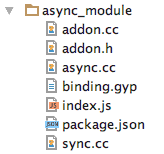

# 第十二章：创建你自己的 C++插件

如果同一工作的两个人总是意见一致，那么其中一个是无用的。如果他们总是意见不一致，那么两个都是无用的。

- Darryl F. Zanuck

Node 的一个非常常见的描述是：*NodeJS 允许在服务器上运行 Javascript*。这当然是真的；但也是误导的。Node 的成就在于以这样一种方式组织和链接强大的 C++库，使它们的效率可以被利用，而不需要理解它们的复杂性，所有这些都是通过将本地 C++库链接到*是*Node 的 JavaScript 驱动运行时来实现的。Node 的目标是通过将并发模型包装到一个易于理解的单线程环境中，来抽象出多用户、同时多线程 I/O 管理的复杂性，并且已经被数百万网络开发人员充分理解。

简单来说，当你使用 Node 时，你最终是在使用 C++绑定到你的操作系统，这是一种适用于企业级软件开发的语言，没有人会认真质疑。

这种与 C++程序的本地桥接证明了 Node 不适合企业级的说法是错误的。这些说法混淆了 Javascript 在 Node 堆栈中的实际角色。在 Node 程序中经常使用的 Redis 和其他数据库驱动程序的绑定是 C 绑定——快速，接近*底层*。正如我们所看到的，Node 的简单进程绑定（spawn、exec 等）促进了强大系统库与无头浏览器和 HTTP 数据流的平滑集成。我们能够访问一套强大的本地 Unix 程序，就好像它们是 Node API 的一部分。当然，我们也可以编写自己的插件。

对于成功的消费者技术，这是一些特征的简述，由*Keith Devlin*教授在"*微积分：最成功的技术之一*"([`www.youtube.com/watch?v=8ZLC0egL6pc`](https://www.youtube.com/watch?v=8ZLC0egL6pc))中描述：

+   它应该消除完成任务的困难或单调乏味。

+   它应该易于学习和使用。

+   如果有的话，它应该比流行的方法更容易学习和使用。

+   一旦学会，就可以在没有持续专家指导的情况下使用。用户仍然能够记住和/或推导出大部分或全部规则，以及随着时间的推移与技术的交互。

+   它应该可以在不知道它是如何工作的情况下使用。

希望当你考虑 Node 旨在解决的问题类别和它提供的解决方案形式时，你会很容易地在 Node 所代表的技术中看到上述五个特征。Node 学习和使用起来很有趣，具有一致和可预测的界面。重要的是，“*在幕后*”Node 运行着强大的工具，开发人员只需要理解它们的 API。

令人惊讶的是，Node、V8、libuv 和组成 Node 堆栈的其他库都是开源的，这是一个重要的事实，进一步区别了 Node 与许多竞争对手。不仅可以直接向核心库做出贡献，还可以*剪切和粘贴*代码块和其他例程来用于自己的工作。事实上，你应该把自己成长为更好的 Node 开发人员看作是同时成为更好的 C++程序员的机会。

这不是 C++的入门指南，让你自己去学习。不要感到害怕！C 语言家族使用的形式和习惯用法与你已经习惯使用的 JavaScript 非常相似。语法和流程控制应该看起来非常熟悉。你应该能够轻松理解以下示例的设计和目标，并且可以通过 C++编程来解决不清楚的部分的含义。逐步扩展这些示例是进入 C++编程世界的一个很好的方式。

# 你好，世界

让我们构建我们的第一个插件。为了保持传统，这个插件将生成一个 Node 模块，将打印出“Hello World!”即使这是一个非常简单的例子，但它代表了您将构建的所有后续 C++插件的结构。这使您可以逐步尝试新的命令和结构，以易于理解的步骤增加您的知识。

为了使接下来的步骤起作用，您需要在系统上安装 C/C++编译器和 Python 2.7。在操作系统上构建本机代码的工具是特定于该操作系统的（由维护或拥有它的社区或公司提供）。以下是一些主要操作系统的说明：

+   例如，在 macOS 上，苹果提供了 Xcode，一个集成开发环境（IDE），其中包括一个编译器。

+   对于 Windows，微软的编译器随 Visual Studio 一起提供。还有一个可用于此目的的 npm 包—`npm i -g windows-build-tools`。

+   在 Linux 和其他地方，**GCC，GNU 编译器集合**很常见。还需要**GNU Make**和**Python**。

C++程序员可能会受益于学习 V8 的嵌入方式，网址为：[`github.com/v8/v8/wiki/Embedder%27s-Guide`](https://github.com/v8/v8/wiki/Embedder%27s-Guide)。

编译本地代码时，通常还有另一种软件——构建自动化工具。这个工具指导编译器执行的步骤，将您的源代码转换为本机二进制代码。对于 C 语言，最早的工具之一是 Make。当然，您也可以直接输入编译器，但是 Make 可以让您重新运行相同的一组命令，记录这些命令是什么，并将这些命令传输给另一个开发人员。Make 是在 1976 年 4 月开发的，自那时以来一直在持续使用。

Visual Studio 和 Xcode 不使用像 Make 这样基于脚本的工具。相反，它们将构建步骤和设置保存在二进制文件中，并允许开发人员通过单击复选框和在图形对话框中输入文本来编辑它们。这种方法看起来更友好，但可能更繁琐和容易出错。

为了更方便，谷歌开发了一个名为**GYP**的工具，用于**生成您的项目**。这是一个元构建系统，从您那里（以文本格式）获取信息，并生成本机编译器或 IDE 所需的构建文件。GYP 将为您生成所需的文件，而不是打开 Visual Studio 或 Xcode 并在菜单和复选框上单击。对于任何一个花了一个晚上（或几个晚上）在设置中寻找以修复损坏的本机构建的开发人员来说，GYP 是一种神奇的魔法。

谷歌最初创建了 GYP 来构建 Chrome 和 V8，但作为一个开源项目，一个社区将其带到了一个不断扩大的新用途列表。为了构建本机 Node 插件，Node 团队创建并维护了`node-gyp`，其中包含了谷歌的 GYP。使用上述命令在系统上全局安装`node-gyp`，并通过获取版本来验证它是否存在。您可以在下面的链接中找到`node-gyp`的安装说明：[`github.com/nodejs/node-gyp`](https://github.com/nodejs/node-gyp)

您可能还记得我们在第一章中关于 Unix 设计哲学的讨论，特别是道格·麦克罗伊的指令“*编写处理文本流的程序，因为那是一个通用接口*”。

对于编译器自动化的任务，Make 在 20 世纪 70 年代遵循了这一准则，而苹果和微软在 20 世纪 90 年代打破了这一规则，他们使用了图形 IDE 和二进制项目文件，而现在在这个十年中，谷歌用 GYP 恢复了它。

为了了解我们要去哪里，可能有助于看一下我们最终会得到什么。完成后，我们将拥有一个模块定义文件夹，其中包含一些文件。首先我们将创建的结构如下：

```js
/hello_module
  binding.gyp
  hello.cc
  index.js
```

`/hello_module`模块文件夹包含一个 C++文件（`hello.cc`），GYP 的*指令*文件（`binding.gyp`），以及一个方便的*包装器*（`index.js`），其目的将很快清楚。

创建一个名为`hello.cc`的文件，其中包含以下内容：

```js
#include <node.h>

namespace hello_module {

    using v8::FunctionCallbackInfo;
    using v8::Isolate;
    using v8::Local;
    using v8::Object;
    using v8::String;
    using v8::Value;

    // Our first native function
    void sayHello(const FunctionCallbackInfo<Value>& args) {
      Isolate* isolate = args.GetIsolate();
      args.GetReturnValue().Set(String::NewFromUtf8(isolate, "Hello Node from native code!"));
    }

    // The initialization function for our module
    void init(Local<Object> exports) {
      NODE_SET_METHOD(exports, "sayHello", sayHello);
    }

    // Export the initialization function
    NODE_MODULE(NODE_GYP_MODULE_NAME, init)
}
```

在包含了 Node 的 C 头文件之后，为我们的代码定义了一个命名空间，并声明了我们需要使用的 V8 的各个部分，有三个部分。`void sayHello`函数是我们将要导出的本地函数。在下面，`init`是一个必需的初始化函数，用于设置这将成为的 Node 模块的导出（这里，函数名`"sayHello"`绑定到它的 C++对应部分），`NODE_MODULE()`是一个 C++宏，实际上导出了 GYP 配置为导出的模块。由于它是一个宏，在该行的末尾没有分号。

你正在将 C++代码嵌入 V8 运行时，以便 Javascript 可以绑定到相关的范围。V8 必须对你的代码中进行的所有新分配进行范围限制，因此，你需要将你编写的代码包装起来，扩展 V8。为此，你将看到在接下来的示例中，`Handle<Value>`语法的几个实例，将 C++代码包装起来。将这些包装器与将在初始化函数中定义并推送到`NODE_MODULE`的内容进行比较，应该清楚地表明 Node 是如何通过 V8 桥接绑定到 C++方法的。

要了解更多关于 V8 嵌入 C++代码的信息，请查看：[`github.com/v8/v8/wiki/Getting%20Started%20with%20Embedding`](https://github.com/v8/v8/wiki/Getting%20Started%20with%20Embedding)。

除了`hello.cc`，还要创建一个包含以下代码的`binding.gyp`：

```js
{
 "targets": [
   {
     "target_name": "hello",
     "sources": [ "hello.cc" ]
   }
 ]
} 
```

在你有多个源文件需要编译的情况下，只需将更多的文件名添加到源数组中。

这个清单告诉 GYP 我们希望看到`hello.cc`编译成一个名为`hello.node`的文件（`target_name`）在`/Release`文件夹中的编译二进制代码。现在我们有了 C++文件和编译指令，我们需要编译我们的第一个本地插件！

在`/hello_module`文件夹中运行以下命令：

```js
 $ node-gyp configure
```

基本上，`configure`生成一个 Makefile，`build`命令运行它。在运行`configure`命令之后，你可以查看 GYP 创建的`/build`文件夹，以熟悉它们；它们都是你可以检查的文本文件。在安装了 Xcode 的 Mac 上，它将包含一些文件，包括一个 300 行的 Makefile。如果成功，`configure`命令的输出应该看起来像这样：

```js
$ node-gyp configure
 gyp info it worked if it ends with ok
 gyp info using node-gyp@3.6.2
 gyp info using node@8.7.0 | darwin | x64
 gyp info spawn /usr/bin/python
 gyp info spawn args [ '/usr/local/lib/node_modules/node-gyp/gyp/gyp_main.py',
 gyp info spawn args   'binding.gyp',
 gyp info spawn args   '-f',
 gyp info spawn args   'make',
 gyp info spawn args   '-I',

 ...

 gyp info spawn args   '--generator-output',
 gyp info spawn args   'build',
 gyp info spawn args   '-Goutput_dir=.' ]
 gyp info ok
```

接下来，尝试`build`命令，它会运行这个 Makefile。输出看起来像这样：

```js
$ node-gyp build
 gyp info it worked if it ends with ok
 gyp info using node-gyp@3.6.2
 gyp info using node@8.7.0 | darwin | x64
 gyp info spawn make
 gyp info spawn args [ 'BUILDTYPE=Release', '-C', 'build' ]
     CXX(target) Release/obj.target/hello_native/hello.o
     SOLINK_MODULE(target) Release/hello_native.node
 gyp info ok 
```

现在，你会看到一个新的`/build/Release`文件夹，其中包含（其他内容之间）二进制`hello.node`文件。

要删除`/build`文件夹，可以运行`node-gyp clean`。作为一个构建快捷方式，你可以使用`node-gyp configure build`（一行）来配置和构建一步完成，或者简单地使用`node-gyp rebuild`，它会一次运行`clean configure build`。更多的命令行选项可以在这里找到：[`github.com/nodejs/node-gyp#command-options`](https://github.com/nodejs/node-gyp#command-options)。

现在，始终保持在`/hello_module`文件夹中，创建以下`index.js`文件：

```js
// index.js
module.exports = require('./build/Release/hello');
```

这个文件将作为这个模块的导出程序。根据你如何编写你的 C++代码，你可能会利用这个机会将你的模块的本地接口制作成一个特定于 Node 的 API。现在，让我们直接导出`hello`函数，省去开发者在使用`require`时遵循我们的构建文件夹结构的麻烦。

为了完成"模块化"，为这个模块创建一个`package.json`文件，并将"入口点"值设置为`index.js`：

现在，让我们演示如何在你的代码中使用这个模块。跳到上一级目录，创建一个文件，该文件将需要我们刚刚创建的模块。考虑以下示例：

```js
const {sayHello} = require('./hello_module');
console.log(sayHello())
```

使用解构，我们从我们的模块返回的对象中提取`sayHello`函数。现在，执行这段代码：

```js
$ node hello.js
Hello Node from native code!
```

现在，你既是 C++程序员，也是 Node 扩展程序员了！

注意我们如何以一种微妙而强大的方式使用相同熟悉的`require`语句。它不是引入更多 JavaScript 编写的 Node 模块，而是检测并加载我们新创建的本地附加程序。

# 一个计算器

当然，人们永远不会费心编写一个附加程序来简单地回显字符串。更有可能的是，您希望为您的 Node 程序公开 API 或接口。让我们创建一个简单的计算器，有两种方法：add 和 subtract。在这个例子中，我们将演示如何将参数从 Javascript 传递给附加程序中的方法，并将任何结果发送回来。

这个示例的完整代码将在您的代码包中找到。程序的核心部分可以在这个片段中看到，我们在这里为我们的两种方法定义了一个接口，每种方法都期望接收两个数字作为参数：

```js
#include <node.h>

namespace calculator_module {

  using v8::Exception;
  using v8::FunctionCallbackInfo;
  using v8::Isolate;
  using v8::Local;
  using v8::Number;
  using v8::Object;
  using v8::String;
  using v8::Value;

  void Add(const FunctionCallbackInfo<Value>& args) {
    Isolate* isolate = args.GetIsolate();

    // Check argument arity
    if (args.Length() < 2) {
      isolate->ThrowException(Exception::TypeError(
        String::NewFromUtf8(isolate, "Must send two argument to #add")));
      return;
    }

    // Check argument types
    if (!args[0]->IsNumber() || !args[1]->IsNumber()) {
      isolate->ThrowException(Exception::TypeError(
        String::NewFromUtf8(isolate, "#add only accepts numbers")));
      return;
    }

    // The actual calculation now
    double value = args[0]->NumberValue() + args[1]->NumberValue();
    Local<Number> num = Number::New(isolate, value);

    // Set the return value (using the passed in FunctionCallbackInfo<Value>&)
    args.GetReturnValue().Set(num);
  }

  void Subtract(const FunctionCallbackInfo<Value>& args) {
    Isolate* isolate = args.GetIsolate();

    if (args.Length() < 2) {
      isolate->ThrowException(Exception::TypeError(
        String::NewFromUtf8(isolate, "Must send two argument to #subtract")));
      return;
    }

    if (!args[0]->IsNumber() || !args[1]->IsNumber()) {
      isolate->ThrowException(Exception::TypeError(
        String::NewFromUtf8(isolate, "#subtract only accepts numbers")));
      return;
    }

    double value = args[0]->NumberValue() - args[1]->NumberValue();
    Local<Number> num = Number::New(isolate, value);

    args.GetReturnValue().Set(num);
  }

  void Init(Local<Object> exports) {
    NODE_SET_METHOD(exports, "add", Add);
    NODE_SET_METHOD(exports, "subtract", Subtract);
  }

  NODE_MODULE(NODE_GYP_MODULE_NAME, Init)
}
```

我们可以很快看到两种方法已经被限定范围：`Add`和`Subtract`（`Subtract`几乎与`Add`定义相同，只是操作符有所改变）。在`Add`方法中，我们看到一个`Arguments`对象（让人想起 Javascript 的 arguments 对象），它被检查长度（我们期望两个参数）和参数类型（我们想要数字：`!args[0]->IsNumber() || !args[1]->IsNumber()`）。仔细看看这个方法是如何结束的：

```js
Local<Number> num = Number::New(args[0]->NumberValue() + args[1]->NumberValue());
 return scope.Close(num);
```

虽然似乎有很多事情要做，但实际上非常简单：V8 被指示为一个名为`num`的数字分配空间，以便赋予我们两个数字相加的值。当这个操作完成后，我们关闭执行范围并返回`num`。我们不必担心这个引用的内存管理，因为这是由 V8 自动处理的。

最后，在下面的代码块中，我们不仅看到了这个特定程序如何定义它的接口，而且还看到了 Node 模块和 exports 对象在深层次上是如何关联的：

```js
void Init(Handle<Object> exports) {
  exports->Set(String::NewSymbol("add"),
    FunctionTemplate::New(Add)->GetFunction());
  exports->Set(String::NewSymbol("subtract"),
    FunctionTemplate::New(Subtract)->GetFunction());
 }
```

就像我们的“hello”示例一样，在这里我们看到了新的符号（这些只是字符串类型）`add`和`subtract`，它们代表了我们的新 Node 模块的方法名称。它们的函数签名是使用易于遵循的`FunctionTemplate::New(Add)->GetFunction())`蓝图实现的。

现在很容易从 Node 程序中使用我们的计算器：

```js
let calculator = require('./build/Release/calculator');
console.log(calculator.add(2,3));
console.log(calculator.subtract(3,2));
// 5
// 1
```

仅仅从这个简单的开始，我们就可以实现有用的 C++模块。现在，我们将深入一些，并且我们将从**nan（Node 的本地抽象）**中得到一些帮助。

# 使用 NAN

**nan**（[`github.com/nodejs/nan`](https://github.com/nodejs/nan)）是一个提供帮助程序和宏的头文件集，旨在简化附加程序的创建。根据文档，nan 主要是为了保持您的 C++代码在不同的 Node 版本之间的兼容性而创建的：

由于 V8（以及 Node 核心）的疯狂变化，跨版本保持本地附加程序编译的愉快，特别是从 0.10 到 0.12 到 4.0，是一场小噩梦。这个项目的目标是存储开发本地 Node.js 附加程序所需的所有逻辑，而无需检查`NODE_MODULE_VERSION`并陷入宏纠缠。

在接下来的示例中，我们将使用 nan 来构建一些本地附加程序。让我们使用 nan 重新构建我们的`hello world`示例。

# 你好，nan

为您的项目创建一个文件夹，并添加以下 package.json 文件：

```js
// package.json
{
  "name": "hello",
  "version": "1.0.0",
  "description": "",
  "main": "index.js",
  "scripts": {
    "build": "node-gyp rebuild",
    "start": "node index.js"
  },
  "keywords": [],
  "author": "",
  "license": "ISC",
  "dependencies": {
    "nan": "².8.0",
    "node-gyp": "³.6.2"
  },
  "gypfile": true
}
```

我们在这里添加了一些新东西，比如指示存在一个`gypfile`。更重要的是，我们为编译和运行我们的模块创建了一些方便的脚本：`build`和`start`。当然，我们还指出模块的主执行文件是`index.js`（我们很快就会创建）。还要注意，当您`npm install`这个包时，GYP 会注意到`binding.gyp`文件并自动构建 - 一个`/build`文件夹将与安装一起创建。

现在，创建我们的 GYP 绑定文件。注意添加了`include_dirs`。这确保了`nan`头文件对编译器是可用的：

```js
// binding.gyp
{
  "targets": [{
     "include_dirs": [
        "<!(node -e \"require('nan')\")"
      ],
      "target_name": "hello",
      "sources": [
        "hello.cc"
      ]
  }]
}
```

现在，我们重写主 C++文件以利用 nan 的帮助程序：

```js
#include <nan.h>

NAN_METHOD(sayHello) {
    auto message = Nan::New("Hello Node from NAN code!").ToLocalChecked();
    // 'info' is an implicit bridge object between JavaScript and C++
    info.GetReturnValue().Set(message);
}

NAN_MODULE_INIT(Initialize) {
    // Similar to the 'export' statement in Node -- export the sayHello method
    NAN_EXPORT(target, sayHello);
}

// Create and Initialize function created with NAN_MODULE_INIT macro
NODE_MODULE(hello, Initialize);
```

在这里，我们可以看到长长的包含列表是不必要的。代码的其余部分遵循与我们原始示例相同的模式，但现在通过 NAN 前缀的快捷方式运行初始化和函数定义。请注意，我们可以直接在模块对象上键入`sayHello`方法（`NAN_EXPORT(target, sayHello)`），而不需要在`require`语句接收的接口上指定`sayHello`。

最后一步是证明这个模块可以绑定到 Node。创建以下`index.js`文件：

```js
const {Hello} = require('./build/Release/hello');
console.log(Hello());
```

现在，我们要做的就是构建：

```js
$ npm run build
```

然后，我们将运行它：

```js
$ node index.js
// Hello Node from NAN code!
```

# 异步插件

根据 Node 程序的典型模式，插件也实现了异步回调的概念。正如人们可能在 Node 程序中期望的那样，执行昂贵和耗时操作的 C++插件应该理解异步执行函数的概念。

让我们创建一个模块，公开两种最终调用相同函数的方法，但一种是同步调用，另一种是异步调用。这将使我们能够演示如何创建带有回调的本机模块。

我们将把我们的模块分成 4 个文件，分离功能。创建一个新目录，并从上一个示例中复制`package.json`文件（将`name`更改为其他内容），然后添加以下`binding.gyp`文件：

```js
{
  "targets": [
    {
      "target_name": "nan_addon",
      "sources": [
        "addon.cc",
        "sync.cc",
        "async.cc"
      ],
      "include_dirs": ["<!(node -e \"require('nan')\")"]
    }
  ]
}
```

完成后，您的模块文件夹将看起来像这样：



我们将创建一个包含异步方法（`async.cc`）的文件，一个包含同步方法（`sync.cc`）的文件，每个文件将在`addon.h`中以不同方式调用的公共函数，以及将所有内容“绑定”在一起的主`addon.cc`文件。

在模块文件夹中创建`addons.h`：

```js
// addons.h
using namespace Nan;

int Run (int cycles) {
    // using volatile prevents compiler from optimizing loop (slower)
    volatile int i = 0;
    for (; i < cycles; i++) {}
    return cycles;
}
```

在这个文件中，我们将创建一个“模拟”函数，其责任只是浪费周期（时间）。因此，我们创建一个低效的函数`Run`。使用`volatile`关键字，我们吓唬 V8 使其取消优化这个函数（我们警告 V8 这个值将不可预测地改变，吓跑了优化器）。其余部分将简单地运行请求的周期数并反映它发送的值...慢慢地。这是我们的异步和同步代码都将执行的函数。

要同步执行`Run`，创建以下`sync.cc`文件：

```js
// sync.cc
#include <nan.h>
int Run(int cycles);

// Simple synchronous access to the `Run()` function
NAN_METHOD(RunSync) {
 // Expect a number as first argument
 int cycles = info[0]->Uint32Value();
 int result = Run(cycles);

 info.GetReturnValue().Set(result);
}
```

正如我们之前看到的，`info`将包含传递给此`RunSync`方法的参数。在这里，我们获取请求的周期数，将这些参数传递给`Run`，并返回该函数调用产生的任何内容。

现在，创建我们的异步方法`async.cc`的文件。创建异步代码稍微复杂：

```js
// async.cc
#include <nan.h>

using v8::Local;
using v8::Number;
using v8::Value;
using namespace Nan;

int Run(int cycles);

class Worker : public AsyncWorker {
 public:
  Worker(Callback *callback, int cycles)
    : AsyncWorker(callback), cycles(cycles) {}
  ~Worker() {}

  // This executes in the worker thread.
  // #result is being place on "this" (private.result)
  void Execute () {
    result = Run(cycles);
  }

  // When the async work is complete execute this function in the main event loop
  // We're sending back two arguments to fulfill standard Node callback
  // pattern (error, result) -> (Null(), New<Number>(result))
  void HandleOKCallback () {
    HandleScope scope;
    Local<Value> argv[] = {
        Null()
      , New<Number>(result)
    };
    callback->Call(2, argv);
  }

 private:
  int cycles;
  int result;
};

NAN_METHOD(RunAsync) {
  int cycles = To<int>(info[0]).FromJust();
  Callback *callback = new Callback(To<v8::Function>(info[1]).ToLocalChecked());

  AsyncQueueWorker(new Worker(callback, cycles));
}
```

从底部开始，您会看到我们正在创建一个方法，该方法期望第一个参数（info[0]）是一个整数，该整数被赋给`cycles`。然后我们创建一个新的`Callback`对象作为`callback`，并将`callback`和`cycles`传递给`Worker`构造函数，将结果实例传递给`AsyncQueueWorker`（设置我们的异步方法）。

现在，让我们看看如何配置异步`Worker`。

跳到`Worker`的底部，注意为这个类建立私有属性`cycles`和`result`。在 JavaScript 中，相当于创建一个具有`this.cycles`和`this.result`的本地变量上下文--在接下来的内容中使用的本地变量。

为了满足工作模板，我们需要实现两个关键函数：`Execute`和`HandleOKCallback`。`Execute`在工作线程中执行我们的`Run`函数（来自`addons.h`），并将返回的值赋给`result`。一旦`Run`完成，我们需要将这个结果发送回原始的 JavaScript 回调，我们的 Node 模块接口会发送。`HandleOKCallback`准备参数列表（`argv`），按照标准的错误优先 Node 回调模式的预期：我们将第一个错误参数设置为`Null()`，第二个参数设置为`result`。通过`callback->Call(2, argv)`，原始回调将使用这两个参数进行调用，并相应地进行处理。

最后一步是创建模块导出文件`index.js`：

```js
const addon = require('./build/Release/nan_addon');
const width = 1e9;

function log(type, result, start) {
    const end = Date.now() - start;
    console.log(`${type} returned <${result}> in ${end}ms`)
}

function sync() {
    const start = Date.now();
    const result = addon.runSync(width);
    log('Sync', result, start);
}

function async() {
    const start = Date.now();
    addon.runAsync(width, (err, result) => {
        log('Async', result, start);
    });
}

console.log('1');
async();
console.log('2');
sync();
console.log('3');
```

创建完这个文件后，继续通过`npm run build`（或`node-gyp rebuild`）构建您的模块，并使用`node index.js`执行此文件。您应该在终端中看到类似以下的内容：

```js
1
2
Sync returned <1000000000> in 1887ms
3
Async returned <1000000000> in 1889ms
```

这有什么意义呢？我们正在证明我们可以创建独立于单个 Node 进程线程的 C++函数。如果`addon.runAsync`不是异步运行的，输出将如下所示：

```js
1
Async returned <1000000000> in 1889ms
2
Sync returned <1000000000> in 1887ms
3
```

然而，我们看到运行时记录了 1，`runAsync`进入了线程，记录了 2，然后是同步函数`runSync`，阻塞了事件循环（在同一个单一的 JavaScript 线程中运行）。完成后，这个同步函数宣布了它的结果，循环继续执行下一个指令记录 3，最后，待处理的回调被执行，`runAsync`的结果最后出现。

即使您不是 C++程序员，这里还有很多探索的空间。借助`nan`这些简单的构建模块，您可以构建行为越来越复杂的插件。当然，最大的优势是能够将长时间运行的任务交给操作系统，在一个非常快速的编译语言中运行。您的 Node 项目现在可以充分利用 C++的力量。

# 结束语

能够轻松地将 C++模块与 Node 程序链接起来是一种强大的新范式。因此，可能会有诱惑力，热情洋溢地开始为程序的每个可识别的部分编写 C++插件。虽然这可能是学习的一种有效方式，但从长远来看，这并不一定是最好的主意。尽管通常编译后的 C++运行速度比 JavaScript 代码更快，但要记住 V8 最终是在 JavaScript 代码上使用另一种类型的编译。在 V8 中运行的 JavaScript 非常高效。

此外，我们不希望在高并发环境中设计复杂的交互时失去 JavaScript 的简单组织和可预测的单线程运行时。请记住，Node 的出现部分是为了使开发人员在执行 I/O 时免于使用线程和相关复杂性。因此，请牢记一些规则。

C++模块实际上会更快吗？答案并不总是肯定的。跳转到不同的执行上下文，然后再返回到 V8 需要时间。*Felix Geisendorfer*的演讲描述了他构建快速 MySQL 绑定的工作，提供了一些关于在做出这些决定时应该如何思考的见解，网址为：[`www.youtube.com/watch?v=Kdwwvps4J9A`](http://www.youtube.com/watch?v=Kdwwvps4J9A)。总的来说，除非真的需要做一些深入和昂贵的事情，需要更接近底层，否则应该坚持使用 JavaScript。

拆分代码库如何影响可维护性？虽然很难有任何开发人员建议使用效率低下的代码，但有时微不足道的性能提升并不能克服复杂性的增加，这可能导致更难以找到的错误或在共享或管理代码库时出现困难（包括未来尚未雇佣的团队成员）。

Node 已经将一个美丽的 JavaScript API 与一个非常强大且易于扩展的应用程序堆栈合并在一起。有了将 C++集成到你的应用程序中的能力，没有理由将 Node 排除在下一个项目考虑的技术列表之外。

# 链接和资源

关于编写 Node 插件的额外指南和资源可以在网上找到：

+   Node 的插件文档非常出色：[`nodejs.org/dist/latest-v9.x/docs/api/addons.html`](https://nodejs.org/dist/latest-v9.x/docs/api/addons.html)

+   nan 存储库包含许多示例：[`github.com/nodejs/nan`](https://github.com/nodejs/nan)

+   对于学习 C++的绝佳资源：[`www.learncpp.com/`](http://www.learncpp.com/)

+   当你感到更有信心时，Node 核心模块的源代码是一个很好的地方，可以进行探索和学习：[`github.com/nodejs/node/tree/master/src`](https://github.com/nodejs/node/tree/master/src)
