# 第一章. 介绍 PostCSS

网站的关键部分是样式——无论是简单的元素标签还是复杂的动画，网站没有颜色和动作就不是网站。为任何在线存在构建样式需要时间和精力——我们可以通过使用预处理器来自动创建样式，自动应用供应商前缀等来减少开发时间，但额外的库依赖可能就像用大锤砸核桃一样！

进入 PostCSS——它独特的模块化风格允许我们创建一个更精简、更快的 CSS 处理器，没有外部依赖。在本章中，我们将探讨安装 PostCSS、了解其架构，并学习如何利用其速度和力量将代码编译成有效的 CSS。在本章中，我们将涵盖多个主题，包括以下内容：

+   考虑创建我们自己的预处理器的好处

+   介绍 PostCSS 并探索其功能

+   使用 PostCSS 设置开发环境

+   使用 PostCSS 创建一个简单的示例

+   探索 PostCSS 的工作原理及其架构

让我们开始吧…！

### 注意

本书中的所有练习都是为 Windows 平台编写的；如果您使用的是其他操作系统，请相应地进行调整。

# 发现处理艺术的技巧

一个问题：SASS、Stylus、Haml 和 Less 都有什么共同之处？

答案是，它们都是编译器，源到源编译，或者称为**转换器**（以它们的官方名称），自 20 世纪 80 年代以来一直存在。它们以许多不同的格式出现，Digital Research 的 XLT86 是其中最早的版本之一，始于 1981 年。

最近，知名的 SASS 处理器于 2006 年出现；随后是 2009 年由 Alexis Sellier 创建的 Less。它们以类似的方式工作：它们接受一组规则并将其编译成有效的 CSS。我们可以通过所有种类的功能扩展 CSS，如变量、混入、函数等。尽管处理器可能无法减少我们必须编写的物理行数，但它们帮助我们重新组织代码成更易于管理的块，我们可以在未来的项目中重用，这有助于使 CSS 更易于维护。

但是，几乎总是如此，使用处理器的缺点也是有的：

+   几乎总是涉及到某种形式的依赖——对于 SASS 来说，是 Ruby；如果您使用 Less，则是一个库，尽管它是用 JavaScript 编写的

+   我们的项目可能只使用一小部分预处理的代码，但我们被迫依赖于可能是一个大型库，如 SASS

+   使用预处理器处理样式表很慢；可能只有几秒钟，但随着时间的推移，这会积累成大量的等待过程完成的时间

嗯，这并没有让处理变得那么吸引人！但如果有一种方法可以缓解所有这些问题，同时去除对依赖的需求呢？

好吧，原因如下：让我们自己构建一个处理器！好吧，这听起来可能有点疯狂，但正如有人曾经说过，疯狂之中自有方法，所以请耐心听我解释为什么这可能是一个更好的选择。

# 介绍 PostCSS

在本章的开头，我提到我们会专注于创建自己的预处理器，对吧？好吧，我有一个小小的坦白要讲：我们并没有这么做。等等，这是怎么回事？

好吧，我们将创建一个预处理器……但我们也会创建一个后处理器。让我解释一下原因——我们的替代“选项”允许我们同时创建这两个处理器。我们的替代选项是 PostCSS，可以从 [`github.com/postcss/postcss`](https://github.com/postcss/postcss) 下载。PostCSS 被一些主要公司使用，例如 Twitter、Google、Bootstrap 和 CodePen，甚至 WordPress（在有限的范围内）。

PostCSS 是作为一个 Node.js 模块构建的，因此将与 Node.js 已经提供的任何数量的现有插件一起工作——我们将在整本书中使用这些插件中的许多。让我们花点时间来探索这个工具的一些好处。

## 探索使用 PostCSS 的好处

我们所说的 PostCSS 是什么意思？简单来说，它可以指代两件事之一——PostCSS 核心工具或由该工具驱动的插件生态系统。单独来看，它实际上并没有做什么；一旦我们开始添加插件，我们就能实现很多功能。让我们来看看在实践中这意味着什么：

+   它的模块化架构意味着我们可以挑选和选择我们需要的；这允许我们保持库的大小非常小且响应迅速。

+   现有的处理器往往分为两个阵营——预处理或后处理——这在使用选择时是一个限制因素。PostCSS 允许我们在同一个过程中执行这两个操作，这意味着我们得到了两个处理世界的好处！

+   PostCSS 集成了对 Gulp、Grunt 或 Broccoli 等常见任务运行器的无缝支持；我们可以将其与许多其他可自动化的任务结合起来。

+   编译时没有依赖项；PostCSS 完全用 JavaScript 编写，因此不需要 Ruby 或 `libsass` 等库来编译代码。唯一的依赖项（如果可以这样称呼的话）是 Node.js——许多开发者可能已经安装了它。

+   没有必要学习任何新的语言；每个开发者都会熟悉 JavaScript，并在他们的开发过程中使用它。

+   当需要时，我们可以更改正在使用的任何插件以用于其他目的；在使用较大的库时，我们没有这种选择。

+   它相对较低的学习门槛意味着我们可以非常容易地创建所需的任何插件，或者可能修改现有的插件以更好地满足我们的需求。

+   PostCSS 很快——在一个使用 `postcss-benchmark` 插件（可在 [`github.com/postcss/benchmark`](https://github.com/postcss/benchmark) 获取）的测试中，该插件包含了解析后的代码、嵌套规则、混入、变量和数学，PostCSS 以明显的优势胜出：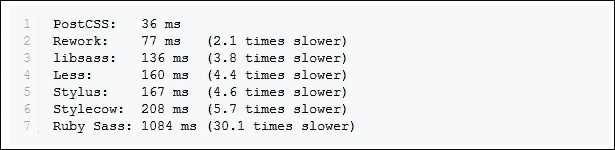

+   完美——无需不断更新 SASS，或下载 `libsass` 库的新版本，对吧？

## 考虑一些潜在的问题

嗯，使用自定义处理器有一些考虑因素；关键是要记住，PostCSS 既不是预处理器也不是后处理器，而更像是一个瑞士军刀式的工具箱，我们可以用它来处理我们的 CSS 代码。让我们来看看这些缺点：

+   虽然我们不需要学习新语言来使用 PostCSS，但创建自定义处理器将给我们的开发过程增加一层复杂性。

+   它的灵活方法意味着有些人可能会将 PostCSS 视为预处理器或后处理器；这种短视的方法意味着你会错过机会，因此，在考虑 PostCSS 可以为你带来的开发过程方面，保持开放的心态至关重要。

+   将现有预处理器中的代码转换为使用 PostCSS 可能很痛苦；这个过程只有在我们不尝试显式转换，而是将其作为逐步转向使用 PostCSS 的基础时才有效。

+   PostCSS 从一开始就需要语法正确的 CSS；尽管我们可以使用任何语法（因为 PostCSS 文件只是纯文本），但编译很容易失败，即使是使用单行注释也可能如此！

+   尽管如此，使用 PostCSS 的真正好处在于其与 Gulp 等工具的无缝集成——如果你愿意的话，想象一下这个场景：

你已经使用像 SASS 这样的预处理器开发网站。你可以使用独立的处理器来编译代码，但通常更喜欢使用 Node.js 和 Gulp 来完成任务。听起来合理吗？那么，转向使用 PostCSS 呢？

没问题，我们可以添加一个用于使用 PostCSS 处理 CSS 文件的章节。关键在于不要使用 PostCSS 来执行初始编译，而是执行后处理，例如添加供应商前缀或最小化结果。一旦确立了这一点，我们就可以开始整合一些可用的 PostCSS 插件，这些插件允许我们复制功能，例如从 SASS 内部。一旦我们将现有代码调整为使用插件所需的格式，我们就可以切换到使用 PostCSS，并开始减少对 SASS 的依赖。

## 澄清一些误解

在这一点上，花几分钟时间澄清一些关于 PostCSS 的常见误解是值得的，尽管许多人将其与预处理器或后处理器联系起来，但这并不是其初衷：

+   将 PostCSS 归类为后处理器，而不是预处理器（如 Less 或 SASS）是错误的；PostCSS 能够在各种不同的使用场景中编译，可以处理使用任何预处理器编译的代码，或者直接处理纯 CSS 代码。

+   PostCSS 不应该被归类为应该与任何特定过程（如编写基于 SASS 的循环或条件语句）绑定的工具。有插件可以完成这两项任务，但这只是 PostCSS 在你的开发工作流程中可以扮演的角色的一小部分。

+   如果你发现自己处于“PostCSS”似乎没有按预期表现的情况，这不太可能是 PostCSS 本身的问题，而更有可能是使用的某个插件导致了问题。尽管 PostCSS 仍然相对较新，但已经有大量的插件可供选择，所以如果你能尝试作为首选的替代方案，这是值得的。

好的，让我们继续前进，我认为现在是时候减少聊天，多做一些实际的工作了，对吧？让我们开始做一些实际的事情；现在安装 PostCSS 并准备好使用是再合适不过的时候了。

## 为本书的练习做准备

在我们这样做之前，我们只需要覆盖几个要求。首先，我们需要设置一个本地 Web 服务器。这不是关键，但会带来更好的效果。我个人使用 WAMP Server（适用于 PC，来自 [`www.wampserver.com/en`](http://www.wampserver.com/en)），否则，Mac 用户可以尝试 MAMP ([`www.mamp.info/en`](http://www.mamp.info/en))，或者跨平台的 Apache Web 服务器（来自 [`www.apachefriends.org`](http://www.apachefriends.org)）。在每种情况下，默认设置都应该足够。

第二个要求是设置一个项目区域；假设你已经设置了一个 WAMP 作为本地 Web 服务器，那么请继续在 `c:\wamp\www` 中创建一个名为 `postcss` 的文件夹，如图所示：

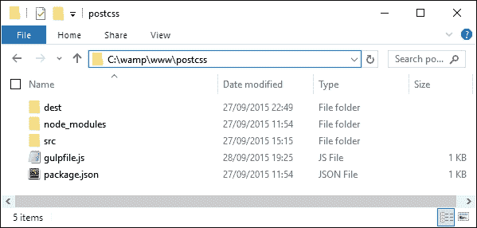

好的，现在我们已经解决了这个问题，让我们开始安装 PostCSS 吧！

# 设置开发环境

我们旅程的第一步是安装 PostCSS——这需要通过 Node.js 来运行；我们可以使用几个任务运行器插件中的任何一个来安装它。为了本书中的练习，我们将使用 Gulp；如果你更喜欢，可以使用 Grunt 或 Broccoli 这样的替代品。

### 注意

当使用 Node.js 时，确保你使用 Node.js 命令提示符，而不是 `node.exe`；使用后者时练习将无法工作！

让我们从安装 Node 和 Gulp 开始：

1.  我们首先需要安装 Node.js；它可以在 [`nodejs.org`](http://nodejs.org) 获取。确保你选择适合你平台的正确版本：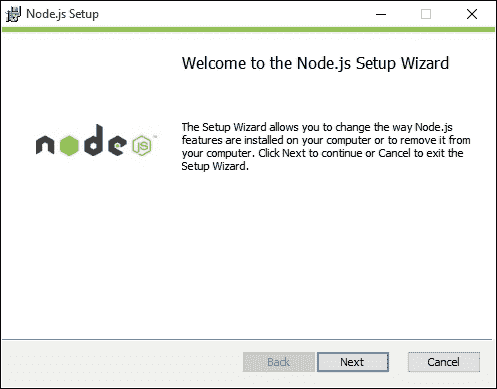

    在安装时，接受所有默认设置；这将为本书中的所有练习足够。

1.  接下来，打开一个 Node.js 命令提示符，输入以下命令，然后按 *Enter*：

    ```js
    node –v

    ```

    显示的输出是已安装的 Node 版本；这是一个快速检查，以确保 Node.js 已经正确安装：

    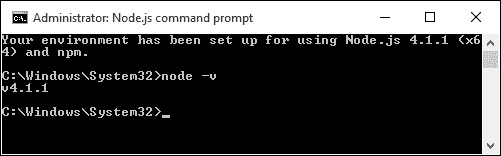

1.  现在 Node 已安装，我们需要创建一个 `package.json` 文件来存储我们的项目依赖项。在命令提示符中运行此命令，并按 *Enter* 键：

    ```js
    npm init

    ```

1.  当创建 `package.json` 文件时，Node 将会提示输入信息；请按照截图中的显示输入详细信息，或者按 *Enter* 键接受给定的默认值（括号内显示，每个问题之后）：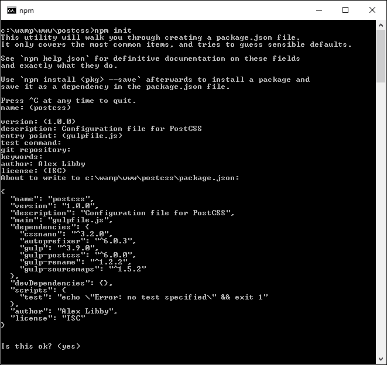

现在我们已经配置了 Node 并放置了一个空的 `package.json` 文件，所以让我们添加我们的依赖项。我们将首先添加 Gulp：

1.  回到 Node.js 命令提示符（或者如果关闭了上一个会话，则打开一个新的会话）。

1.  请继续更改工作目录到 `c:\wamp\www\postcss`。

1.  在命令提示符中输入以下命令，然后按 *Enter* 键。这将全局安装 Gulp 并使其可用于使用：

    ```js
    npm install --global gulp

    ```

1.  完成后，我们需要在我们的项目区域安装 Gulp 以供使用——运行此命令，这将添加到我们在步骤 *3* 和 *4* 中创建的 `package.json` 文件中的一个条目：

    ```js
    npm install --save-dev gulp

    ```

完成后，Gulp 现在已准备好使用；我们可以继续安装 PostCSS。

### 注意

关于使用 `--save-dev` 的小提示：这会安装开发特定插件所需的任何依赖项；如果我们只需要运行插件（在生产环境中）的依赖项，那么我们可以简单地使用 `--save`。

## 安装 PostCSS

我们现在处于一个有趣阶段——安装 PostCSS。PostCSS 可从 [`github.com/postcss/postcss`](https://github.com/postcss/postcss) 获取，并且可以使用 Gulp 插件安装到 Node 中。现在让我们来做这件事：

1.  我们将首先回到我们刚刚使用的 Node.js 命令提示符会话（或者如果上一个会话已关闭，则创建一个新的会话）。

1.  在提示符下，请输入以下命令，然后按 *Enter* 键：

    ```js
    npm install --save-dev gulp-postcss

    ```

    如果一切顺利，我们应该看到类似于以下截图的内容：

    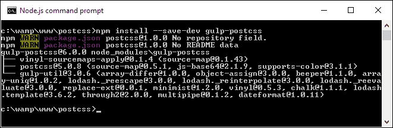

单独来看，PostCSS 什么也不做；为了使其更有用，我们将安装三个插件。我们将在本书的后面部分更详细地探讨插件的使用，但现在不必太担心正在发生的事情：

1.  将以下命令逐个在 Node.js 命令提示符中输入，每个命令输入后按 *Enter* 键：

    ```js
    npm install --save-dev autoprefixer

    ```

1.  让我们检查我们的 `package.json` 文件；如果一切顺利，我们应该看到类似于以下截图的内容：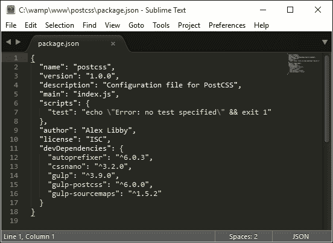

    ### 提示

    为了在 Sublime Text 中更容易查看 JSON 文件，尝试安装并激活一个自定义主题，例如 MonokaiJSON Plus，可以从 [`github.com/ColibriApps/MonokaiJsonPlus`](https://github.com/ColibriApps/MonokaiJsonPlus) 安装。

PostCSS 现已安装并可使用，但如果我们尝试使用它，可能不会走得很远，因为它需要配置后才能使用！现在让我们通过创建一个简单的示例来查看如何进行配置，该示例将为一些示例 CSS 规则添加供应商前缀，并自动压缩结果。

# 使用 PostCSS 创建一个简单示例

PostCSS 是一个令人着迷的工具；其模块化架构使其能够广泛应用于各种不同的使用场景，甚至可以混合使用几个！在这本书的整个过程中，我们将探讨不同的用法，最后将它们全部整合到一个可以在同一工作流程中预处理和后处理文件的处理器中。

为了让您体验其效果，我们现在将构建一个简单的处理器；这将在编译过程中自动添加供应商前缀并输出压缩版本。

让我们开始吧，我们已经安装了相关的插件，所以让我们创建我们的 Gulp 任务文件：

1.  在一个新文件中，添加以下代码，将其保存为项目区域的根目录下的 `gulpfile.js`：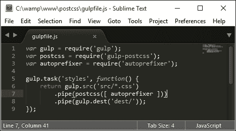

1.  在项目区域中，创建一个名为 `dest` 的文件夹；其他文件夹将会在编译过程中自动创建。

1.  在一个新文件中，添加以下代码，将其保存为项目区域 `src` 文件夹下的 `example.css`：

    ```js
    body {
      display: flex;
      background: green;
    }
    ```

1.  返回 Node.js 命令提示符，然后在命令提示符中，输入以下命令并按 *Enter*：

    ```js
    gulp styles

    ```

    Gulp 将现在处理 `gulpfile.js` 中的指令：

    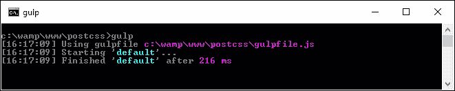

1.  几秒钟内（几乎是瞬间），我们应该在我们的项目区域的 `dest` 文件夹中看到编译好的 `example.css`。

1.  我们可以证明 PostCSS 已经正确地完成了其工作；请打开文本编辑器中的 `example.css`：如果一切顺利，我们应该看到这个：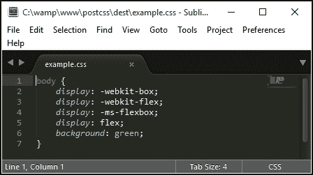

完美，我们现在有一个工作的 PostCSS 安装；任何需要添加供应商前缀的时候，我们都可以启动我们的编译过程，然后就可以开始了…

## 添加源映射支持

或者呢？啊，PostCSS 的功能远不止添加供应商前缀！记得我提到 PostCSS 经常（不正确地）被标记为预处理器或后处理器吗？

好吧，我们还有很多可以做的；PostCSS 的一个关键好处是我们可以选择性地处理我们的代码。我们不必依赖于依赖项（如 Ruby 的 SASS）；我们可以生产出非常轻量且快速的东西。在我们的上一个示例中，我们创建了一个名为 `styles` 的任务；我们将将其更改为使用任务名称 `default`，这将允许我们从单个命令中运行多个任务。这意味着我们可以简单地调用 `gulp`，而无需提供任务名称。

### 注意

从现在开始，我们所有的示例都将默认使用此约定。

让我们通过添加源映射支持来测试这一点，并开始扩展我们的编译过程——我们将使用 Florian Reiterer 提供的 Gulp 源映射插件，可从[`github.com/floridoo/gulp-sourcemaps`](https://github.com/floridoo/gulp-sourcemaps)获取：

1.  我们将像往常一样，使用 Node 安装插件——启动一个 Node.js 命令提示符，然后切换到我们的项目区域。

1.  接下来，在命令行中输入以下内容并按*Enter*键：

    ```js
    npm install --save-dev gulp-sourcemaps

    ```

1.  打开我们在*使用 PostCSS 创建简单示例*部分创建的`gulp`文件，然后添加对`gulp-sourcemaps`的引用作为一个变量：

    ```js
    var autoprefixer = require('autoprefixer');
    var sourcemaps = require('gulp-sourcemaps');

    ```

1.  然后我们需要添加创建源映射的命令——在同一个文件中，按照以下所示修改代码：

    ```js
    .pipe(postcss([ autoprefixer ]))
    .pipe(sourcemaps.init())
    .pipe(sourcemaps.write('maps/'))
    .pipe(gulp.dest('dest/'));
    ```

1.  保存结果，然后从 Node.js 命令提示符中运行此命令，并按*Enter*键：

    ```js
    gulp styles

    ```

1.  如果一切顺利，我们应该在`dest`文件夹下的一个名为`maps`的子文件夹中看到一个新源映射出现。

    我们又向前迈出一步，朝着正确的方向前进；现在我们已经在`maps`文件夹中为我们的样式表创建了一个映射文件，这是在编译过程中自动创建的。

    ### 注意

    值得注意的是，我们将充分利用这个区域——如果你在整本书中看到任何关于`project area`的提及，这将是我们对这个文件夹的指定名称。

    但是，我们可以做得更多：尽管我们这里只有一个小的 CSS 文件，但将其压缩以节省不必要的带宽使用仍然很重要。我们可以很容易地使用 PostCSS 来修复这个问题——让我们看看如何使用`cssnano`插件来操作。

## 创建最小化样式表

生成样式表的关键部分是输出最小化；这应该在任何开发者的工作流程中作为标准。最小化结果将减少带宽使用。在宽带或电缆使用时代，对于较小的网站来说，这可能不那么关键，但不应比大型网站的重要性低！

幸运的是，当使用 PostCSS 时，最小化文件变得非常简单。对于接下来的练习，我们将使用从[`cssnano.co/`](http://cssnano.co/)和[`github.com/hparra/gulp-rename`](https://github.com/hparra/gulp-rename)可用的`cssnano`和`gulp-rename`插件。让我们继续安装它们：

1.  我们将首先启动一个 Node.js 命令提示符，然后输入以下内容并按*Enter*键：

    ```js
    npm install -–save-dev cssnano
    npm install -–save-dev gulp-rename

    ```

    不要关闭会话窗口，我们将在本练习的后面使用它。

1.  切换到我们之前创建的`gulpfile.js`文件（它存储在我们的项目文件夹的根目录），然后在第 12 行或其附近的最后一个关闭`})`之后立即添加以下行：

    ```js
    gulp.task('rename', ['styles'], function () {
      return gulp.src('dest/example.css')
       .pipe(postcss([ cssnano ]))
       .pipe(rename('example.min.css'))
        .pipe(gulp.dest("dest/"));
    });

    gulp.task('default', ['styles', 'rename']);
    ```

1.  在文件顶部，我们需要添加两个声明，否则我们的代码将失败；请继续添加以下两条高亮显示的行：

    ```js
    var sourcemaps = require('gulp-sourcemaps');
    var rename = require('gulp-rename');
    var cssnano = require('cssnano');

    ```

1.  任何细心的读者现在可能已经发现了问题——在最后一行，我们有一个对`styles`的引用，但在代码中却没有显示这一点！为了修复它，我们需要更改我们的代码。在第 8 行，按照以下所示更改行：

    ```js
    gulp.task('styles', function() {
    ```

1.  保存文件，然后切换回 Node.js 命令提示符窗口，并输入以下命令，然后按 *Enter*：

    ```js
    gulp

    ```

1.  Gulp 现在将编译：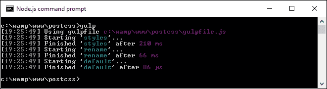

    如果一切顺利，我们应该在我们的项目区域的 `dest` 文件夹中看到编译后的输出：

    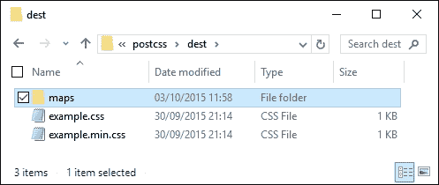

在我们的项目区域，我们不仅创建了 `maps` 下的源映射文件，现在还创建了一个最小化样式表，后者是通过重命名 `cssnano` 的输出创建的（`cssnano` 本身不执行重命名，因此使用了 `rename` 插件）。

然而，不幸的是，我们仍然有一个小问题——看看 `maps` 文件夹的内容：你注意到什么了吗？希望你能发现，源映射文件在我们的样式表的未压缩版本中，但压缩版本中没有！现在让我们修复这个问题。要做到这一点，我们只需要在我们的 Gulp 文件中使用 `rename` 任务，如下所示：

```js
    .pipe(rename('example.min.css'))
    .pipe(sourcemaps.init())
    .pipe(sourcemaps.write('maps/'))
    .pipe(gulp.dest("dest/"));
```

现在尝试运行 Gulp。如果一切顺利，我们应该在我们的最小化样式表看到源映射：

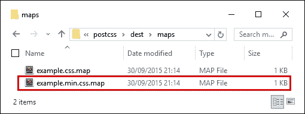

让我们完成我们的 `gulp` 文件；最后一步是添加一个 `watch` 功能，以便在文件修改后自动编译更改。

## 自动编译的修改

在使用 Gulp 时添加 `watch` 功能很简单。这有助于减少使用 Gulp 时所需的手动工作量，因为我们只需要运行一次 Gulp 任务文件，每次文件更改时它都会继续应用这些任务。

与其他插件不同，我们不需要为此安装任何插件；只需将以下高亮行添加到 `gulpfile.js` 文件中即可：

```js
gulp.task('default', ['styles', 'rename', 'sourcemaps']);

var watcher = gulp.watch('src/*.css', ['default']);
watcher.on('change', function(event) {
  console.log('File ' + event.path + ' was ' + event.type + ',     running tasks...');
});

```

我们可以看到我们添加到 `gulp` 任务文件中的结果，以及它是如何结合在一起的，如下面的截图所示：

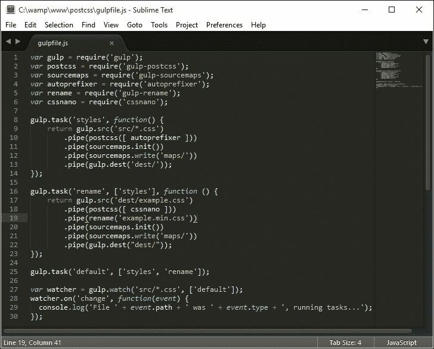

到目前为止，我们可以保存文件然后像之前一样重新运行 `gulp` 命令；这次它将自动重新编译 `src` 文件夹中更改的任何文件。在这个例子中，我们添加了一个事件处理程序来记录会话中的指示，这样我们就可以知道发生了什么；如果需要，我们可以轻松地修改它。

我们现在有一个基本的工作系统；我们将在接下来的几章中开始添加内容，以构建我们自己的处理器。不过，有一件小事我们应该注意：这不是必需的，但是一个在 PostCSS 开发中很有用的技巧。我指的是检查你的代码，以确保它是有效的；让我们深入探讨并设置好以供使用。

# 使用插件进行代码检查

不言而喻，代码检查应该是任何开发者工作流程的一部分。根据你使用的工具，有各种不同的方法来实现这一点。PostCSS 的美妙之处在于，我们可以轻松地为我们的处理器添加合适的代码检查功能，使用 PostCSS 的 `stylelint` 插件（可在 [`stylelint.io/`](http://stylelint.io/) 获取）。

我们为什么要这样做呢？很简单：我们可以得到一个一致的结果。如果你作为团队的一员工作，这一点变得至关重要；而不是不同的团队成员使用不一致的设置，我们可以设置一个中心点进行处理，以保持一致的输出。将代码检查过程移至我们的中心工作流程意味着服务器可以为我们做苦力工作，并且随时为任何运行此过程的人提供一致的结果。

考虑到这一点，让我们看看我们如何设置我们的代码检查能力：

1.  我们像往常一样开始安装插件。为此，打开 Node.js 命令提示符，然后切换到我们的项目区域根目录。

1.  在命令提示符下，输入以下命令，然后按*Enter*：

    ```js
    npm install stylelint

    ```

    如果一切顺利，我们应该在提示符中看到这个：

    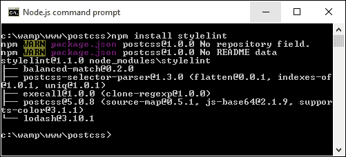

1.  接下来，我们需要安装第二个插件——`stylelint`中有一个报告函数，它会将任何消息发布到控制台（或在这种情况下，屏幕）。该插件是`postcss-reporter`，可在[`github.com/postcss/postcss-reporter`](https://github.com/postcss/postcss-reporter)找到。我们可以这样安装它：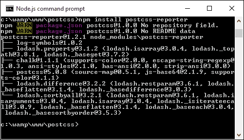

1.  插件安装完成后，我们需要更新我们的`gulp`文件；在显示的最后`var`行下面立即添加以下行：

    ```js
    var cssnano = require('cssnano');
    var stylelint = require('stylelint');
    var reporter = require('postcss-reporter');

    ```

1.  在 Gulp 文件中的重命名任务下面立即添加此任务——这个任务负责检查我们的代码，并在屏幕上标记任何错误：

    ```js
    gulp.task("lint-styles", function() {
      return gulp.src("src/*.css")
        .pipe(postcss([ stylelint({ 
          "rules": {
            "color-no-invalid-hex": 2,
            "declaration-colon-space-before": [2, "never"],
            "indentation": [2, 2],
            "number-leading-zero": [2, "always"]
          }
        }),
        reporter({
          clearMessages: true,
        })
      ]))
    });
    ```

1.  打开项目文件夹根目录下的`example.css`副本，并将`color`更改为`#fff1az`。

1.  在 Node.js 命令提示符中，输入此命令并按*Enter*：

    ```js
    gulp

    ```

1.  Gulp 将开始处理我们的代码；如果一切顺利，它应该会显示警告：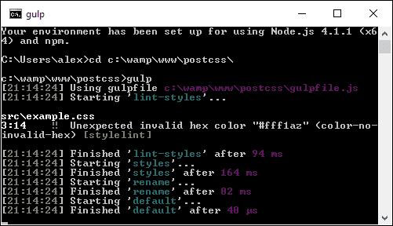

很容易就能发现`#fff1az`显然不是一个有效的数字！Stylelint 已经正确地识别了它，使用我们配置中的高亮规则：

```js
    .pipe(postcss([ stylelint({ 
        "rules": {
          "color-no-invalid-hex": true,
          …
        }
      }),
```

让我们暂时探索一下这个插件的工作原理——它的好处是，有数十个规则可供选择（你可以在[`cdn.rawgit.com/stylelint/stylelint/1.0.0/docs/rules.md`](https://cdn.rawgit.com/stylelint/stylelint/1.0.0/docs/rules.md)中看到）。它通过将检查的内容（在这种情况下，`color`）和对其运行的检查（在我们的情况下，**-no-invalid-hex**，或检查无效的十六进制数）连接起来工作。我们可以在配置对象中应用任意数量的规则，以确保所有项目的输出都是一致的。

### 小贴士

如果你想要了解规则是如何组合在一起的，那么请查看用户指南[`cdn.rawgit.com/stylelint/stylelint/1.0.0/docs/user-guide.md`](https://cdn.rawgit.com/stylelint/stylelint/1.0.0/docs/user-guide.md)，其中提供了更多规则的示例，可在[`cdn.rawgit.com/stylelint/stylelint/1.0.0/docs/rules.md`](https://cdn.rawgit.com/stylelint/stylelint/1.0.0/docs/rules.md)找到。

好的，让我们继续：从下一章开始，我们将更详细地探讨代码的编译过程，但就目前而言，让我们更详细地了解一下 PostCSS 是如何工作的，以及我们如何开始从现有的处理器迁移到 PostCSS。

# 探索 PostCSS 的工作原理

到目前为止，我们已经涵盖了设置和使用 PostCSS 的基础知识。花点时间了解它是如何工作的，这样我们就能更好地理解如何使用它，并为该平台开发自己的插件。

PostCSS 就像我周六早上在狂欢之后：什么也不做！是的，这是真的，单凭它本身，这个应用根本什么也不做；只有当我们添加插件进来，它才开始变得有用。

PostCSS 的关键是将其视为一个启用器，它不是作为你现有预处理器或后处理器的直接替代品，而是作为它们的补充。它基于解析代码，使用任何分配的插件处理代码，并渲染结果：

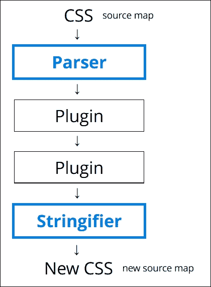

它通过一系列节点将内容解析为**抽象语法树**（或 AST）。树中的每个节点都包含了对代码中元素的符号表示。换句话说，如果你有一个指向三个可能结果的条件语句，那么 AST 将有一个节点，有三个分支代表可能的结果。

### 注意

例如，查看[`jointjs.com/demos/javascript-ast`](http://jointjs.com/demos/javascript-ast)，它展示了使用纯 JavaScript 分解一个简单的算术函数。

然后我们的 AST 通过一个或多个插件（我们必须始终使用一个插件，但可以在我们的`gulp`文件中有多个）。然后它将代码转换成长字符串，在通过任何分配的插件处理之前，并以有效 CSS 的形式输出结果。我们可以利用这一点作为创建我们自己的插件的基础，使用从 GitHub 上 PostCSS 主站提供的样板代码和 API。

插件阶段的技巧在于我们必须使用的插件组合来满足我们的需求；更好的插件应该只执行一个角色。任何执行多个任务的插件都不太理想，因为它们可能包含我们项目中不需要的额外功能。

## 从 SASS 迁移

假设我们决定使用 PostCSS，几乎每个人心中都有一个首要问题：我们如何进行迁移？

简而言之，关键不是简单假设现有的代码可以直接通过 PostCSS 过程，因为它可能不起作用。相反，我们应该采取迭代的过程，开始将低垂的果实转换为使用 PostCSS。这个过程当然需要一些工作，但有一些技巧可以帮助我们减少迁移到 PostCSS 时的痛苦。

实现迁移的关键是确定需要处理的功能，然后创建构建过程的初始框架（例如，一个 Gulp 或 Grunt 任务文件），然后逐步添加插件支持，直到你拥有一个完全工作的编译器。

我们可以更进一步，使用可以将 SASS 代码格式复制到 PostCSS 的插件；一个理想的开始插件是 Autoprefixer，随后可以尝试 `postcss-mixins` 或 `postcss-partial-import` 等插件。我们将在第十一章 “操纵自定义语法” 中探讨如何以 SASS 为基础创建自定义语法，我们将使用这两个插件以及更多插件，以帮助简化过渡过程并帮助移除对 SASS 或 Less 等预处理器依赖。

### 注意

现在许多用于 PostCSS 的 SASS 格式插件都包含在 `PreCSS` 套件中。我们将在第十章 “构建自定义预处理器” 中探讨如何使用这个套件。

好的，我们继续前进。在接下来的几章中，我们将探讨不同处理器元素，这些元素通常用于创建构建处理器，例如变量或混入（mixins）。我们将看到它们通常如何在 SASS 或 Less 等处理器中编写，然后努力将我们的代码转换为使用 PostCSS 等价物，在处理之前生成有效的 CSS。然后我们将完成所有这些，构建你自己的自定义处理器，用于未来的项目。

# 摘要

编写有效的 CSS 是一种自互联网诞生以来就存在的艺术；这需要技巧、耐心和时间来创作和完美任何杰作。SASS 或 Less 等处理器有助于使这个过程更高效，但并非没有缺点；PostCSS 允许更定制化的方法，但无需额外的负担。我们在本章中已经覆盖了关于 PostCSS 的几个关键点，所以让我们花点时间回顾一下我们学到了什么。

我们首先简要地看了看处理的艺术，然后介绍了 PostCSS 作为一种工具。接着我们探讨了使用它的利弊，以及如何通过一些周密的计划使其与现有的开发工作流程无缝结合。

接下来，我们介绍了 PostCSS 的安装，以及 Gulp 作为任务运行器/宿主进程，然后进行了一个简单的演示，介绍编译过程是如何工作的，以及通过正确选择插件，我们可以减少管理代码所需的某些手动工作（有意为之！）。随着我们的代码编译完成，我们接着关注添加监视功能，以及自动支持代码检查，以确保我们保持一致的标准。

我们接着通过了解 PostCSS 的工作原理和其架构的某些方面来完善本章，这样我们就可以开始从使用纯 CSS 或现有预处理器过渡到使用 PostCSS。

哎呀，我们确实已经涵盖了很多内容；现在是时候真正深入研究了，开始认真使用 PostCSS。在接下来的几章中，我们将探讨许多现有预处理器中常见的概念，并探讨我们如何从过渡到使用 PostCSS 中受益。我们必须从某个地方开始，所以我们将从下一章使用变量、函数和混入开始，看看我们如何使用一些处理器技术，但又不带相关的负担！
