# 第五章. 管理颜色、图像和字体

一个网站如果没有某种形式的颜色、图像或字体，就不会是一个伟大的网站——这些元素的混合将增加兴趣，在文字可能不足够清晰的地方表达内容，并且通常有助于保持访客的参与度。

现有预处理器用户当然熟悉来自 [`www.compass-style.org`](http://www.compass-style.org) 的 Compass 编写框架等库；如果我们能够产生类似的效果，但速度更快，且无需依赖，那会怎么样？没问题，使用 PostCSS，我们可以挑选和选择我们网站所需的插件，并开始构建一个满足我们需求的处理器。在本章中，我们将涵盖多个主题，包括：

+   可用于处理颜色、图像和字体的插件的概述

+   使用现有预处理器创建图像精灵

+   使用现有预处理器添加 SVG 支持

+   转向使用 PostCSS 插件

+   使用 PostCSS 插件操作颜色和调色板

让我们开始吧…！

# 向网站添加颜色、字体和媒体

*一张图片胜过千言万语…*

这个短语最初是在 1920 年代创造的，在数字内容的世界里非常贴切——如果我们能用一张图片替换一百个字，并且仍然传达相同的意思，那么写一百个字就没有同样的吸引力了！

任何开发人员或设计师的工作的一部分将是获取正确的图像或字体，或者选择正确的颜色，并将它们包含在他们正在构建的网站上，以便在适当的位置引用。我们将探讨我们可以使用的某些插件和技巧来修改颜色，但到目前为止，让我们看看一些可用于在网站内操作图像和字体的插件。

## 维护资产链接

当为网站获取媒体资源时，通常的过程是创建一个字体文件夹，另一个图像文件夹，等等，如果过程中的任何部分可能失败，那么很可能是我们在代码中应用了不正确的链接。如果我们有一个特别复杂的文件夹结构，这种风险当然会增加！

相反，我们可以采取另一种方法：为什么不让我们让 PostCSS（或一个插件）为我们做这项工作呢？

我们可以使用 `postcss-assets` 插件来完成这个目的；如果我们指定一个名称，它将在源文件相关的文件中查找，然后是 loadPaths 配置选项中指定的文件路径，最后是在 basePath 配置路径中指定的 URL 中搜索。这种美妙的特性在于，我们可以简单地引用图像名称，只要 PostCSS 在这些预先指定的位置之一找到一个同名图像，它就会在编译时为我们替换适当的路径。

如果一个链接需要更改，那么没问题，我们可以在其中添加一个新的，或者修改现有的一个；CSS 样式将在下一次编译时更新。让我们通过使用 `postcss-assets` 插件，在一个简单的演示中将其付诸实践。

## 自动化资产链接

记得第四章中的情绪化风景图像吗，*构建媒体查询*？

在我们的第一个例子中，我们将重构这个演示，但这次使用`postcss-assets`插件（可在[`github.com/borodean/postcss-assets`](https://github.com/borodean/postcss-assets)找到）来自动插入所有资产的链接。我们将专注于图像和字体，但这同样适用于视频等媒体。

这里有一个截图来提醒我们那个图像：

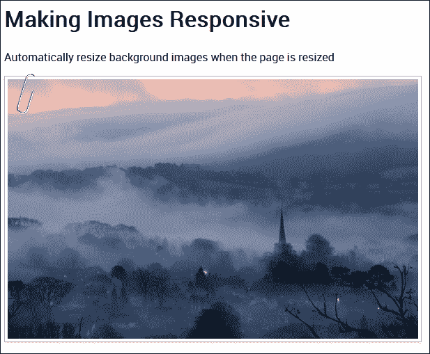

让我们开始：

1.  从本书附带的代码下载中下载`Tuturial19`文件夹的副本，并将其保存到我们项目区域的根目录。这包含了对第四章中演示的部分重构版本，即*构建媒体查询*。

1.  接下来，请从我们项目区域的根目录中删除任何`gulpfile.js`和`package.json`的副本——我们将从这个代码下载中开始这一章的新副本。

1.  现在，我们需要安装`postcss-assets`插件，所以启动一个 Node.js 命令提示符会话，输入以下命令，然后按*Enter*键：

    ```js
    npm install postcss-assets --save-dev

    ```

    不要关闭它，我们很快还会用到它！

1.  我们需要从代码下载中提取`gulpfile.js`和`package.json`文件的副本——请将它们保存到我们项目区域的根目录。

    眼尖的你们会注意到我们没有安装任何其他插件——我们正在使用之前练习中已经安装的插件；`package.json`文件将包含对这些插件和`postcss-assets`文件的引用。

1.  在`Tutorial19`文件夹中，找到并复制`styles – pre-compile.css`文件到我们项目区域的`src`文件夹中；将其重命名为`styles.css`。

1.  返回到 Node.js 命令提示符窗口，然后在提示符中输入`gulp`并按*Enter*键。

1.  如果一切顺利，我们应该有一个`maps`文件夹和两个 CSS 样式表（一个完整版本，一个压缩版本）——如果我们将这些文件复制回`Tutorial19`文件夹中的`css`文件夹，然后运行演示，我们应该看到一幅熟悉的风景图像，就像在这个演示的开始部分所展示的那样。

好的，图像已经显示，同时还有 Roboto 字体中的文本，但这一切是如何工作的呢？花几分钟时间探索代码是值得的；正确设置它将帮助你们节省大量时间！

在`gulp`文件中，你们大多数人都会从之前的演示中认出大部分内容——我们包括了之前的 linting、重命名和源映射创建。除了新的资产任务（用于处理我们的资产链接）之外，我们还移除了`autoprefixer`任务；我们没有调用需要供应商前缀的任何内容，因此不需要使用它。

Gulp 文件中的关键过程集中在以下代码上——它创建并替换正确的资产链接。我们首先从选项配置对象开始——`loadPaths`负责资产位置，而`relativeTo`告诉插件相对于`dest/`文件夹设置相对链接。在这种情况下，`loadPaths`定义了要使用的特定文件夹；我们使用`relativeTo`使这些路径成为相对路径：

```js
var options = {
  loadPaths: ['img/', 'fonts/'],
  relativeTo: 'dest/'
};
```

`dest/`文件夹用于我们的创建过程中——实际上，这将是我们的生产服务器上 CSS 样式表的存放位置。接下来的这个简单任务只是调用`postcss-assets`插件，并处理在`src`文件夹中找到的每个样式表：

```js
gulp.task('assets', function() {
  return gulp.src('src/*.css')
    .pipe(postcss([ assets(options) ]))
    .pipe(gulp.dest('dest/'));
});
```

然后，我们只需调用任务即可，如果我们从命令提示符中调用 gulp，它将运行所有这些任务：

```js
gulp.task('default', ['assets', 'lint-styles', 'rename', 'sourcemap']);

```

总的来说，这是一个非常简单但非常有效的工具，它消除了手动插入链接的需求，前提是我们已经将它们包含在配置对象中。

好吧…让我们继续：我们已经介绍了一种简单的方法来确保我们始终有正确的字体或图像文件的链接。尽管如此，仍然需要一些手动工作——我们真的需要包含为我们的自定义字体添加的所有行吗？

好吧，我们总是可以使用托管在 Google 上的字体，但这破坏了使用 PostCSS 的意义！相反，我们可以在样式表中简单地使用自定义字体名称，但让 PostCSS 在编译时自动添加自定义 font-face 声明。感兴趣吗？让我们看看如何，作为我们下一个练习的一部分。

# 使用 PostCSS 管理字体

在我们之前的演示中，我们探索了一种使用 PostCSS 自动添加链接的方法——它简化了提供文件正确位置的需求。但是，当与自定义字体一起使用时，它仍然需要太多的工作（是的，我知道，我们人类天生就懒惰！）。有一个更好的选择：

输入`postcss-fontpath`插件，可从[`github.com/seaneking/postcss-fontpath`](https://github.com/seaneking/postcss-fontpath)获取；这是一个简单的插件，它只需要我们提供有关自定义字体的一些有限信息，并在编译阶段生成完整的 font-face 声明。

所以，与其谈论它，不如让我们实际应用它？让我们回顾一下我们在上一个演示中覆盖的响应式图片演示，并修改我们的样式表以使用 fontpath 插件来处理我们的自定义字体：

1.  我们首先从本书附带的代码下载中提取`Tutorial20`文件夹的副本，并将文件夹保存到我们的项目区域根目录。

1.  接下来，从`Tutorial20`文件夹中复制`package.json`和`gulpfile.js`文件，并替换我们项目区域根目录中现有的版本。

1.  现在启动一个 Node.js 命令提示符，并将工作文件夹更改为我们的项目区域。

1.  在命令提示符中，输入以下命令，然后按*Enter*键：

    ```js
    npm install postcss-fontpath --save-dev

    ```

    尽管我们已经明确安装了插件，但我们只需使用 `npm install` 就可以轻松安装它；文件夹中存在的 `package.json` 文件将告诉 NPM 要安装什么（在这种情况下是缺失的 `postcss-fontpath` 插件）。保持会话开启，我们很快还会用到它。

1.  从 `css – completed version` 文件夹中复制 `styles – pre-compile.css`，并将其保存为 `styles.css` 到项目区域的根目录下的 `src` 文件夹中。

1.  返回 Node.js 命令提示符窗口，然后在提示符中输入 `gulp`，然后按 *Enter* 键。

1.  如果一切顺利，我们应该会在 `dest` 文件夹中看到现在熟悉的样式表和源映射；将这些复制到 `Tutorial20` 文件夹内的 `css` 文件夹中。

到目前为止，我们应该已经有一个可以工作的演示了；我们可能不会看到任何本质上的不同，但要知道在编译时，PostCSS 已经自动为我们添加了正确的字体声明。

这个插件的优点在于其简单性——它不需要在主任务中添加任何额外的命令：

```js
gulp.task('fonts', function () {
  return gulp.src('src/*.css').pipe(
    postcss([ fontpath() ])
  ).pipe(
    gulp.dest('dest/')
  );
});
```

没有必要指定任何额外的配置元素或规则，插件确实做到了它所说的那样！虽然我们在这个例子中没有取得任何突破性的成就，但它确实有助于说明使用 PostCSS 的一些关键点：

+   当插件专注于单一任务而不是试图一次性完成所有事情时，PostCSS 工作得最好。遵循单一责任原则意味着我们可以减少重复，使插件更健壮，并避免更改最终导致处理器其他地方功能中断的情况！这个插件是完美的——它只为指定的字体提供字体声明，没有其他任何功能。

+   有时候，在选择 PostCSS 中的正确插件时，可能会遇到我们选择的东西后来发现并不如预期工作的情况。一个例子是 `postcss-font-magician` 插件（可在 [`github.com/jonathantneal/postcss-font-magician`](https://github.com/jonathantneal/postcss-font-magician) 获取）；它有提供字体声明的好想法，但试图为 Google 托管的字体、本地托管字体、Bootstrap 等提供字体声明。

    ### 注意

    不幸的是，在撰写本文时，并非所有功能似乎都按预期工作，因此我们不得不在这个时候寻找替代方案。

如果你想探索更多，那么`postcss.parts`目录（在[`www.postcss.parts`](http://www.postcss.parts)）提供了更多选项；其中两个可能对你有吸引力的是`Assets Rebase`插件（来自[`github.com/devex-web-frontend/postcss-assets-rebase`](https://github.com/devex-web-frontend/postcss-assets-rebase)），以及 PostCSS 的`Font Pack`插件，来自[`github.com/jedmao/postcss-font-pack`](https://github.com/jedmao/postcss-font-pack)。我们将在第八章创建 PostCSS 插件中更详细地介绍这个插件。

好的，所以我们的文本已经准备好了：它看起来有点无聊，不是吗？嗯，我们可以通过添加图像来解决这个问题。那么，PostCSS 究竟如何帮助我们呢？我听到你问道？

它可以通过多种方式帮助——例如，我们可以开始混合一些纯色，而不是使用纯色。或者，使用图像精灵怎么样？手动创建很痛苦，对吧？但不是用 PostCSS。我敢打赌，你已经看到了一些可以在图像上使用的图像过滤器（例如，棕褐色或着色），但发现它们并不是在所有浏览器上都有效？

这些只是 PostCSS 能帮助我们的一些方式，我们将在本章中涵盖所有这些以及更多内容。不过，让我们先从处理图像开始：我们的第一个演示将涵盖图像精灵的创建。我们首先快速回顾一下 SASS 过程，然后再切换到使用 PostCSS。

# 创建图像精灵

让我们从简单的事情开始：我敢肯定，在某个时候，你要么使用过，要么创建过图像精灵，对吧？如果你是 SASS 开发者，毫无疑问，你已经使用了 Compass 的 sprite 混入，并使用像**Koala**这样的应用程序进行编译，或者直接从命令行编译。

### 注意

使用 Compass 创建精灵的相关文件可以在本书的代码下载中找到，位于`Tutorial21A`文件夹。

这个过程相对简单，但你仍然需要设置一个`Compass`项目，安装一个 GUI 应用程序（如果你在使用的话），等等，这真是个麻烦！我们可以使用一个在线应用程序，例如**SpritePad**([`spritepad.wearekiss.com/`](http://spritepad.wearekiss.com/))，但同样，这又是一个手动过程，而且容易出错。相反，我们可以轻松地使用 PostCSS 来帮助我们——除了在 gulp 文件顶部声明的正常变量之外，为了生成基本的图像精灵，所需的东西非常少。现在让我们看看如何使用`postcss-sprites`插件创建一个。

## 演示 - 创建信用卡图标栏

你有多少次在电子商务网站上购买过东西？如果你在网上购买的东西和我一样多，那么毫无疑问，你一定见过带有各种支付卡图标的购物车。这些图标可能很小，但它们对我们网站来说却至关重要——毕竟，如果在线零售商不接受万事达卡，我们如何知道使用特定的信用卡可能会失败呢？这似乎很明显，但并不总是容易判断。

不考虑这一点，使用 PostCSS 创建图像精灵非常简单；SASS 的依赖已经消失：我们可以使用 `postcss-sprites` 插件（可在 [`github.com/2createStudio/postcss-sprites`](https://github.com/2createStudio/postcss-sprites) 获取）来生成我们的组合图像。让我们深入探讨并查看一下。

对于这个演示，我们将使用在 [`findicons.com/pack/2102/credit_card_debit_card`](http://findicons.com/pack/2102/credit_card_debit_card) 可用的信用卡图标；如果您想使用不同的图标，请随意替换。

本教程的所有代码都可以在 `Tutorial21B` 文件夹中找到，在代码下载中——我们将通过安装 `postcss-sprites` 插件来从头开始：

1.  启动 Node.js 命令提示符，并将工作文件夹更改为我们项目区域。

1.  在命令提示符下，输入此截图所示的命令，然后按 *Enter* 键，一旦 Node 确认安装成功，请最小化窗口，因为我们将在本练习的稍后部分再次回到它：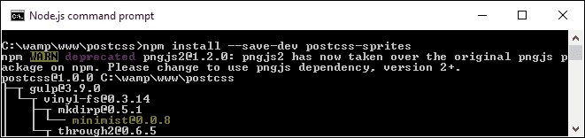

1.  现在启动你的文本编辑器，然后添加以下行——这些代表我们通常添加到任何在线电子商务网站上的四个信用卡图标：

    ```js
    .amex { background: #fff url(img/amex.png) no-repeat 0 0; }
    .cirrus { background: url(img/cirrus.png) no-repeat 0 0; }

    .delta { background: url(img/delta.png) no-repeat 0 0; }
    .solo { background: url(img/solo.png) no-repeat 0 0; }
    ```

1.  将文件保存为 `style.css`，并将其存储在我们项目区域的 `src` 文件夹中。

1.  在同一文件夹中，在项目区域的根目录创建一个名为 `img` 的文件夹；提取本书附带的代码下载中存储的图标副本，并将它们保存到 `img` 文件夹中。

1.  从本书附带的代码下载中，提取 `gulpfile.js` 的副本，并将其保存到我们项目区域的根目录。

1.  返回 Node.js 窗口，然后在提示符下输入 `gulp` 并按 *Enter* 键。

1.  如果一切顺利，我们的代码现在将被编译，我们应该在查看 `dest` 文件夹中的 `style.css` 文件时看到类似以下内容：

    ```js
    .amex { background-image: url(../img/sprite.png); background-position: 0 0; background-color: #fff; }
    .cirrus { background-image: url(../img/sprite.png); background-position: -102px 0; }
    .delta { background-image: url(../img/sprite.png); background-position: 0 -64px; }
    .solo { background-image: url(../img/sprite.png); background-position: -102px -64px; }
    ```

在此阶段，我们可以将代码连同图片一起复制到我们的网站上——而不是使用四个独立的图标（每个图标都需要单独调用服务器），我们可以缓存单个图标。这将导致响应时间更快，并且对服务器的调用次数更少。编译后的样式表可以在 `dest` 文件夹中找到，组合图像位于 `img` 文件夹的上一级：

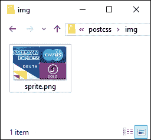

尽管这是一个简单的过程，但值得注意的是我们 gulp 文件配置的一个关键点——使用配置对象为`sprites`插件：

```js
var opts = {
  stylesheetPath: 'dest/',
  spritePath    : 'img/sprite.png',
  path          : 'src/img/'
};
```

这并不是我们迄今为止使用过的过程，但这并不意味着它不那么有用——这仅仅是一个个人偏好和可读性的问题。它确实使得阅读我们分配给每个插件的调用变得更容易；在这个例子中，我们只使用了一个，但你可以想象如果有多个插件在使用会是什么样子：

```js
gulp.task('autoprefixer', function() {
  return gulp.src('src/*.css')
    .pipe(postcss([ sprites(opts) ]))
    .pipe(gulp.dest('dest/'));
});
```

好吧，让我们改变方向，看看使用 PostCSS 处理图像的不同方面：使用 SVG 格式的图像。标准图像并不总是很好地缩放，尤其是在响应式环境中使用时；有时我们可能会使用视网膜图像，但可以考虑的一个替代方案是使用 SVG 图像。

# 在 PostCSS 中使用 SVG

移动设备的快速增加使得创建响应式内容变得必须；传统的做法是使用类似`max-width: 100%`的东西来控制屏幕上元素的大小。

一个更好的选择是使用 SVG——即使在调整大小时也能保持质量；标准图像格式如果调整到过大的尺寸将会变得像素化。对于那些之前使用过 SASS 的人来说，那么并没有内置对 SVG 的支持；我们最多希望在我们的样式表中实现高效的嵌套。

我们可能会使用的例子可以在本书附带的代码下载中`Tutorial22`文件夹内的`sass`文件夹中找到。

如果我们是在 SASS 中经常使用 SVG 图像的用户，那么我们可能会使用像`sass-svg`这样的库，来自[`github.com/davidkpiano/sass-svg`](https://github.com/davidkpiano/sass-svg)。从 SASS 迁移到 PostCSS 很容易；PostCSS 生态系统有许多插件我们可以用来操作图像。让我们看看如何使用`postcss-svg`插件来实现。

## 使用 PostCSS 修改图标图像

我们将使用`postcss-svg`插件（来自[`github.com/Pavliko/postcss-svg`](https://github.com/Pavliko/postcss-svg)），来操作`Evil Icon`包（可在[`github.com/outpunk/gulp-evil-icons`](https://github.com/outpunk/gulp-evil-icons)找到）中的某些图标，作为下一个演示的一部分：

1.  我们将开始从本书附带的代码下载中提取`Tutorial22`文件夹的副本。将其保存到我们的项目区域根目录。

1.  在`Tutorial22`文件夹内部，提取`gulpfile.js`和`package.json`文件的副本，并使用它们替换我们项目区域根目录下存储的任何文件。

1.  从同一个文件夹中提取`style – pre-compile.css`的副本；将其保存为`src`文件夹内的`style.css`。同样，对`index.html`文件也做同样的处理。

1.  在与之前的演示中断之后，我们需要一个额外的`css`文件夹——在`dest`文件夹内创建一个。

1.  接下来，启动一个 Node.js 命令提示符，并将工作文件夹更改为我们的项目区域。

1.  我们需要安装`postcss-svg`插件，所以请在命令提示符中输入此命令，然后按*Enter*：

    ```js
    npm install postcss-svg --save-dev

    ```

1.  完成后，在命令提示符中输入`gulp`，然后按*Enter*。

1.  如果一切顺利，我们应该在`/dest/css`文件夹中看到通常的两个样式表，以及一个源`map`文件夹。HTML 标记文件将出现在`dest`文件夹中。

    如果您没有看到源映射或最小化版本出现，那么请重新运行`gulp`——有时这些文件只有在存在编译后的`style.css`文件时才会出现。

1.  将`dest`文件夹的内容复制到`Tutorial22`文件夹内的`css`文件夹中——如果一切顺利，当在浏览器中预览结果时，我们应该会看到这些图标：

虽然这是一个简单的演示，但我们已经涵盖了一些有用的技巧和窍门；花些时间探索如何更详细地构建这个演示是值得的。

## 探索结果的详细信息

这个练习有几个值得注意的关键元素，包括使用 CDN 链接和 Node 提供 Evil Icons 的样式表和图标、编译后的 HTML 文件以及在我们自定义样式表中使用的引用。我们将涵盖所有这些，但首先让我们更详细地探索 gulp 文件。

我们从这两行开始：

```js
var evilIcons = require("gulp-evil-icons");
var postcssSVG = require('postcss-svg')
```

您看到后者可能不会感到惊讶，但前者存在，因为可以使用`gulp-evil-icons`包安装`Evil Icons`库。安装有多种不同的选项可用，但既然我们已经在使用 Gulp，继续使用任务运行器是有意义的。

接下来，我们将工作分散到两个任务中——第一个任务将 HTML 代码编译，将相关的图标图像分配给我们的标记中的`<icon>`语句：

```js
gulp.task('icons', function () {
  return gulp.src('src/index.html')
.pipe(evilIcons())
    .pipe(gulp.dest('dest/'));
});
```

要更改颜色，需要使用`postcss-svg`插件，这里通过`postcssSVG`引用：

```js
gulp.task('changecolor', ['icons'], function() {
  gulp.src('src/style.css')
  .pipe(postcss([ postcssSVG() ]))
    .pipe(gulp.dest('dest/'));
});
```

我们当然必须更新我们的默认任务，如果我们简单地从命令行调用`gulp`，那么它将知道依次运行所有这些任务：

```js
gulp.task('default', ['icons', 'changecolor', 'lint-styles' , 'rename', 'sourcemap' ]);
```

最后一步也更新了我们的监视功能：

```js
var watcher = gulp.watch('src/*.*', ['default', 'icons', 'changecolor', 'lint-styles', 'rename', 'sourcemap']);
```

如果我们然后查看 HTML 标记，我们可以看到一个使用 Node.js 安装的`Evil Icons`库的链接：

```js
<link rel="stylesheet" href="../node_modules/gulp-evil-icons/node_modules/evil-icons/assets/evil-icons.css">
```

然后，我们将自定义设置放入单独的样式表中：

```js
<link rel="stylesheet" type="text/css" href="css/style.css">
```

它们看起来像这样：

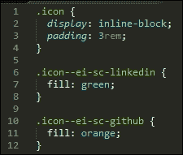

在这个阶段，CSS 样式可能看起来很简单，但 HTML 标记却并非如此；`postcss-svg`插件已将我们的图标以内联形式添加到 HTML 标记中，并从我们的自定义样式表进行了适当的编辑：

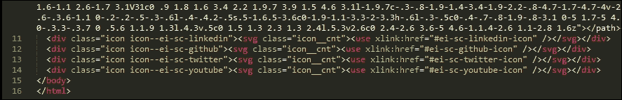

有时，很容易怀疑使用 SVG 是否值得额外的标记，主要好处是如果将其内联添加，那么我们可以减少对外部资源的调用；任何需要更改的内容都可以完成，而不会牺牲我们图像的质量。

## 考虑替代选项

在我们的练习中，我们专注于使用 `postcss-svg` 插件，作为在 PostCSS 系统中操作 SVG 图像的起点；还有一些其他选项可供选择，可能对你感兴趣：

+   `postcss-write-svg`：这个插件（可在 [`github.com/jonathantneal/postcss-write-svg`](https://github.com/jonathantneal/postcss-write-svg) 获取）允许我们在 CSS 中写入内联 SVG。

+   `postcss-inline-svg`：另一个插件（来自 [`github.com/TrySound/postcss-inline-svg`](https://github.com/TrySound/postcss-inline-svg)），它将 SVG 图像内联，并允许我们自定义它们的样式。

+   `postcss-svgo`：这个插件（可在 [`github.com/ben-eb/postcss-svgo`](https://github.com/ben-eb/postcss-svgo) 获取）使用 SVG 优化工具对 Node 中的内联 SVG 进行处理。

如果你需要为 SVG 文件提供一个后备位置，那么你可以尝试使用 `postcss-svg-fallback` 插件，它可在 [`github.com/justim/postcss-svg-fallback`](https://github.com/justim/postcss-svg-fallback) 获取——我们将在 第八章 *创建 PostCSS 插件* 中使用这个插件。

好吧，让我们改变一下方向：如果我们只需要一个简单的图像显示格式，使用 SVG 图像可能会有些过于复杂，对吧？嗯，我们可以使用标准格式，或者一个在保持较小尺寸的同时具有优越质量的格式。我指的是谷歌不太为人所知的 WebP 格式——让我们深入了解这个格式，并找出为什么它值得更多的关注。

# 添加对 WebP 图像的支持

操作 SVG 图像是一门需要掌握的技艺，在某些情况下，它可能对我们需要达成的目标来说过于复杂。

相反，对于那些需要图像细节的情况，我们通常可能会使用 JPEG 格式，或者可能作为替代的 PNG。这两种格式都没有问题，但它们已经过时了，我喜欢推动可能性的边界！此外，JPEG 图像格式是有损的，不支持 alpha 通道；PNG 图像是无损的，但对于更复杂的图像来说，文件大小会更大。如果我们只是简单地在一个页面上插入图像，那么 PostCSS 在这里可能没有帮助；相反，我们为什么不考虑一个完全不同的格式呢？

进入谷歌的 **WebP**。你可能会想“Web…什么？”因为它不是一个常见的格式！这部分的缺失可以归因于缺乏采用；唯一原生支持它的浏览器是 Chrome、Android 和 Opera。但这并不意味着我们应该将其排除在外。这种格式可以在保持优越质量的同时，比标准图像格式如 JPEG 或 PNG 节省更多的空间。我们甚至可以让 PostCSS 为我们完成大部分工作！让我们更详细地探讨这一点，通过一个简单的示例。

## 切换 WebP 图像的进与出

图像切换并不是什么新鲜事，我们在第四章中讨论了其中一个方面，即使用 PostCSS 在浏览器支持时切换高分辨率图像。

我们可以使用类似的技术，但这次是针对图像格式，Google 的 WebP 格式被设计为替代网络上可用的众多其他图像格式。在一个理想的世界里，我们会使用新的`<picture>`标签来自动切换图像：

```js
<picture>
  <source srcset="../img/landscape.webp" type="image/webp">
  
</picture>
```

这在所有浏览器中都不受支持，因此，我们可以使用 PostCSS 和 Modernizr 的混合来应用相同的效果。我们需要用于此任务的插件是`webpcss`插件（可在[`github.com/lexich/webpcss`](https://github.com/lexich/webpcss)获取）——我们需要在 Node.js 命令提示符会话中运行`npm install gulp-webp --save-dev`来安装插件。让我们深入探讨并更详细地查看它。

### 小贴士

为了获得最佳效果，我建议在整个这两个演示过程中使用 Chrome，通过访问[`developers.google.com/speed/webp/`](https://developers.google.com/speed/webp/)可以为 Windows 和其他浏览器添加支持。

## 查看文件大小差异

在我们开始使用 PostCSS 之前，让我们花一点时间进行快速测试。本教程的文件位于`Tutorial 23`文件夹中：

1.  在本书附带的代码下载中，请提取`landscape – original version.jpg`的副本，并将其重命名为`landscape.jpg`。其大小应约为 11.5 MB。

1.  将图像保存到我们的项目区域根目录——我们还需要`cwebp.exe`的副本，所以请将其也提取到我们的项目区域。

1.  启动一个命令提示符会话，将工作文件夹更改为我们的项目区域，输入`gulp`，然后按*Enter*。

1.  如果一切顺利，我们应该看到我们转换的结果，新的 WebP 格式图像将出现在我们的项目区域中：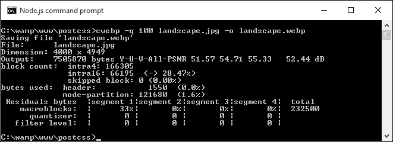

1.  尝试使用 PNG 格式图像执行相同的操作；以下是我进行的一个类似测试的结果，使用的是我们风景图像的 PNG 版本：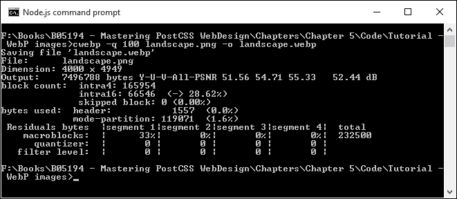

在这两种情况下，图像大小都显著减小，JPEG 版本从大约 12.5 MB 降至略超过 7 MB；PNG 格式从庞大的 25 MB 缩小到大约相同的大小！

### 注意

要了解更多关于使用 WebP 格式的信息，请查看 Google 开发者网站上的文档[`developers.google.com/speed/webp/`](https://developers.google.com/speed/webp/)。

好的，现在是时候进行另一个演示了！让我们现在使用 PostCSS 来创建标准 JPEG 格式和 WebP 等价物的样式：

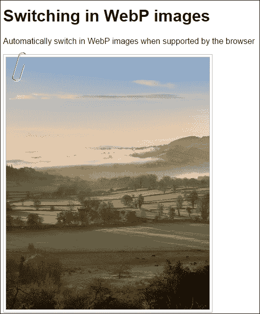

对于这个演示，我们将使用来自[`github.com/lexich/webpcss`](https://github.com/lexich/webpcss)的`gulp-webpcss`插件：

1.  请从本书附带的代码下载中下载`Tuturial23`文件夹的副本，将其保存到我们项目区域的根目录。

1.  接下来，请从我们项目区域的根目录中删除任何`gulpfile.js`和`package.json`的副本；我们需要用`Tutorial23`文件夹中的副本来替换它们。

1.  在这些文件就位后，我们仍然需要安装插件，在 Node.js 命令提示符窗口中，将工作文件夹更改为我们的项目，然后运行以下命令，每条命令后按*Enter*键：

    ```js
    npm install --save-dev gulp-webp 
    npm install --save-dev gulp-webpcss 

    ```

    注意这些命令中参数的顺序，如果顺序不同，它们将无法安装。

1.  将`Tutorial23`文件夹中的`style – pre-compile.css`文件复制到我们项目区域根目录下的`src`文件夹中，然后将其重命名为`style.css`。

1.  启动 Node.js 命令提示符，将工作文件夹更改为我们的项目区域，然后在提示符中输入`gulp`并按*Enter*键。

1.  如果一切顺利，在查看编译文件的内容时，我们应该看到这个截图所示的代码；转换后的图像也将出现在`img`文件夹中：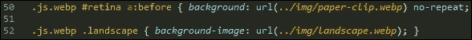

1.  将`img`文件夹的内容复制到`Tutorial23`文件夹内的`img`文件夹中。

1.  将`dest`文件夹中的`style.css`文件复制到`Tutorial23`文件夹内的`css`文件夹中。

1.  在浏览器中运行`index.html`，如果一切顺利，我们应该看到与这个练习开始时的截图类似的内容。

如果我们在 Google Chrome 或 Firefox 中运行相同的`index.html`，一开始我们不应该看到任何差异——我们只有在 Chrome 的开发者工具栏中查看编译的源代码时才会看到差异：

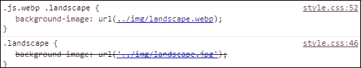

真正的好处在于我们项目区域的`img`文件夹中，我们使用的原始 JPEG 图像大小为 222 KB；然而，WebP 的大小只是这个大小的几分之一：它只有 82 KB。我说的节省空间的意思是什么？

好的，继续前进：现在是时候专注于网站建设的另一个领域了，那就是操作颜色。颜色在任何一个网站上都扮演着关键角色，因为它们构成了对最终用户信息的一部分；让我们深入探讨一下使用 PostCSS 时可用的一些选项。

# 操作颜色和颜色调板

任何开发人员或设计师都会面临的一个挑战是在网站上使用哪种颜色——比如一个漂亮的红色调，或者海蓝色如何？无论他们是否负责选择要使用的色调，或者他们是否需要选择正确的 RGB 或 HEX 颜色来使用，都无关紧要。

无论责任在哪里，我们仍然需要选择一种颜色，而且有很大可能性我们不会选择默认的 256 色调板中的颜色，而是选择一种更浅或更深的色调，或者可能是两种颜色的混合：

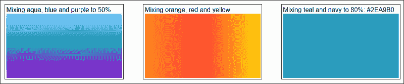

任何习惯于使用 SASS 的人都已经熟悉`lighten()`、`darken()`或`saturate()`等函数——PostCSS 的伟大之处在于我们可以为那些想要摆脱 SASS 依赖的人复制类似的功能。

为了看到使用起来有多简单，我们将结合两个 PostCSS 插件的强大功能——`postcss-color-palette`（可在[`github.com/zaim/postcss-color-palette`](https://github.com/zaim/postcss-color-palette)获取），以及`postcss-color-mix`（来自[`github.com/iamstarkov/postcss-color-mix`](https://github.com/iamstarkov/postcss-color-mix)）。前者允许我们从任意三个调色板中选择一个或多个颜色，而`postcss-color-mix`将混合特定颜色以生成新的颜色。使用这些插件的原因将会变得清晰；现在，让我们深入其中，看看这些插件的实际效果。

## 使用调色板显示和混合颜色

在这个练习中，我们将研究颜色混合；`postcss-color-palette`允许我们通过名称选择多个颜色（而不是通过数字！），然后将其转换为 HEX 等效值。然后我们可以创建渐变效果，或者简单地混合颜色（使用`postcss-color-mix`）以生成新的颜色。

让我们开始吧：

1.  我们将首先从本书附带的代码下载中提取`Tutorial24`文件夹的副本；将文件夹保存到我们项目区域的根目录。

1.  从`Tutorial24`文件夹中，将`package.json`和`gulpfile.js`文件复制到我们项目区域的根目录。

1.  我们还需要我们的样式表，为此，请从同一文件夹中复制`style – pre-compile.css`文件，并将其放入我们项目区域的`src`文件夹中。将其重命名为`style.css`。

1.  到目前为止，我们需要安装插件，为此，请启动一个 Node.js 命令提示符会话，然后更改工作文件夹到我们的项目区域。

1.  在提示符下，输入此截图所示的命令，然后按*Enter*，如果一切顺利，我们应该会看到确认插件已正确安装的消息：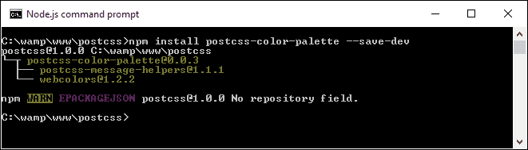

1.  重复步骤 5，但这次，运行此截图所示的命令：

1.  在提示符下，输入`gulp`，然后按*Enter*——PostCSS 将退出并编译样式表，并将编译结果放入`dest`文件夹。

1.  将`dest`文件夹的内容（将是不压缩和最小化的样式表，以及一个源映射文件）复制到`Tutorial24`文件夹内的`css`文件夹中。

1.  尝试预览`Tutorial24`文件夹根目录下的`index.html`；如果一切顺利，我们应该会看到我们混合的颜色，如图所示：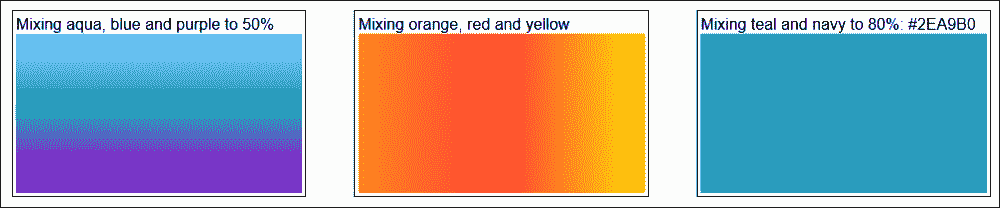

好吧，我选择的颜色显然不会很快赢得任何风格奖项，但它们有助于实现一个目的：如果愿意，使用正确的颜色名称非常容易，同时仍然允许 PostCSS 将它们编译成有效的十六进制值。抛开这一点，让我们花点时间考虑一下我们在演示中使用的代码——它确实提出了几个关键点，我们应该在使用这些插件时讨论。

## 更详细地剖析我们的演示

我们创建的演示遵循了我们迄今为止构建的大多数其他演示的类似原则；我们首先声明变量来存储插件的实例，因此：

```js
var palette = require('postcss-color-palette');
var colormix = require('postcss-color-mix')
```

魔法就在这个任务中发生，在我们的 `gulp` 文件中：

```js
gulp.task('palette', function () {
  return gulp.src('src/*.css')
  .pipe(postcss([ autoprefixer, palette({ palette: 'mrmrs' }), colormix() ]))
  .pipe(gulp.dest('dest/'));
});
```

注意，我们已经指定了一个要使用的颜色板，`mrmrs` 选项是默认的，但我们同样可以使用 `material` 或 `flatui` 作为替代。所有三个都引用了来自 [`github.com/zaim/webcolors/`](https://github.com/zaim/webcolors/) 的 `webcolors` 插件；如果需要，这个包可以扩展以包含其他颜色板。

在放置好我们两个插件的链接并设置好任务后，我们就可以开始在样式表中指定规则，这些规则将使用插件。我们创建了三个，并且所有三个都使用 `postcss-color-palette` 来确定每个颜色的十六进制值；第三个和最后一个在分配了十六进制值后将两种颜色混合在一起：

```js
#box0 { background: linear-gradient(aqua, blue 50%, purple); }

#box1 { background: linear-gradient(to right, orange, red, yellow); }

#box2 { background: mix(teal, navy, 80%); }
```

对于第三条规则正确地混合颜色并不容易，成功混合的关键是避免使用同一光谱中的颜色；它们越接近，混合的影响就越小！

如果你想快速评估颜色混合的效果，那么试试 [`jackiebalzer.com/color`](http://jackiebalzer.com/color)——这个演示有一个 `mix()` 选项，它将在浏览器中编译它们，避免需要手动运行编译过程。

我们介绍了一些可能更受欢迎的插件；更多插件可以通过 `PostCSS.parts` 目录获得，这可能很有趣：

+   `colorguard`: 帮助保持颜色板的一致性

+   `postcss-ase-colors`: 将颜色名称替换为从 ASE 颜色板文件中读取的值；如果你恰好是 Adobe PhotoShop、InDesign 或 Illustrator 的用户，这将是完美的。

+   `postcss-shades-of-gray`: 帮助保持灰度颜色与灰度颜色板的一致性

+   `postcss-color-pantone`: 将潘通颜色转换为 RGB。

同时，让我们继续前进：我们探索了使用颜色板来选择颜色，然后再混合它们以创建新的颜色。这仅仅是触及了可能性的表面；我们能否使用诸如 `darken()`、`tint()` 或 `lightness()` 等函数来创建不同 *色调* 的颜色？这些函数在大多数预处理器中已经存在，例如 SASS；让我们探索如何使用 PostCSS 插件实现相同的结果。

# 使用 PostCSS 创建颜色函数

在我们通过 PostCSS 操作颜色的旅程中，我们迄今为止已经看到了如何使用调色板来定义颜色——这可能在某些情况下有效，但有时我们需要指定不在调色板中的颜色。

我们可以尝试手动指定值，但如果我们需要更改它怎么办？我们是否尝试找到它的每一个实例，并冒着错过一个实例的风险？

答案是否定的。相反，我们可以使用 `postcss-color-function` 插件来动态创建我们的颜色；如果我们经常使用这种颜色，我们可以将生成的值分配给一个变量。我们可以使用这种方法来产生一些漂亮的颜色阴影，所以让我们深入探索这个插件。

## 使用函数调整颜色

大多数 CSS 预处理器中的一个有用功能是能够动态地创建新颜色，我们可以通过调整颜色通道或应用颜色滤镜来实现，例如使其变暗：

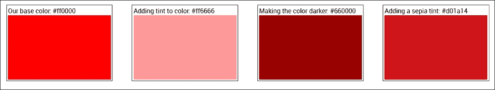

这种方法的优点很简单，它允许我们减少默认分配的基本颜色数量；剩余的颜色可以自动创建。如果我们需要更改我们的基本颜色之一，那么任何动态创建的颜色仍然可以使用。

幸运的是，我们可以在 PostCSS 中实现相同的效果，为此，我们需要使用 `postcss-color-function` 插件，该插件可在 [`github.com/postcss/postcss-color-function`](https://github.com/postcss/postcss-color-function) 获取。我们还将使用 `css-color-converter` 插件，以帮助管理不同颜色格式之间的转换。

让我们通过一个简单的演示来更详细地探讨这个问题：

1.  我们首先从本书附带的代码下载中提取 `Tutorial25` 文件夹的副本——请将其保存到我们的项目区域。

1.  如果项目区域已经存在 `package.json` 和/或 `gulpfile.js` 文件，那么请删除它们；用 `Tutorial25` 文件夹中的文件替换它们。

1.  尽管我们已经设置了正确的配置文件，但我们仍然需要安装插件——请启动一个 Node.js 命令提示符会话，然后将工作文件夹更改为我们的项目区域。

1.  在提示符中输入以下命令，每输入一个命令后按 *Enter* 键：

    ```js
    npm install postcss-color-function --save-dev
    npm install css-color-converter --save-dev

    ```

1.  到目前为止，我们现在可以继续编译我们的样式表了——在 `css – completed version` 子文件夹中查找 `styles – pre-compile.css`，并将其保存到项目区域内的 `src` 文件夹中作为 `style.css`。

1.  从之前的 Node.js 命令提示符切换过来，然后在提示符中输入 `gulp` 并按 *Enter* 键。

1.  如果一切顺利，我们应该会看到现在编译好的样式表出现在 `dest` 文件夹中（包括未压缩和压缩版本），以及源映射文件。将此文件夹的内容复制到 `Tutorial25` 文件夹内的 `css` 文件夹中。

尝试在浏览器中预览结果，如果编译成功，我们应该看到四个不同红色阴影的盒子出现，就像在这个练习的开始部分所示。问题是，我们已经看到了结果的出现，但 PostCSS 是如何知道创建这些颜色的？

## 分析我们的演示

这是一个很好的问题，转换过程非常简单；但其中的技巧不在于编译，而在于如何实现颜色！虽然听起来很奇怪，但选择颜色并不像看起来那么简单；让我详细解释一下：

编译过程，就像其他 PostCSS 插件一样，非常容易配置——我们当然是从创建一个定义 `color-function` 插件的变量开始的：

```js
var colorfunction = require('postcss-color-function');
```

接下来，我们添加了对我们的主要 gulp 任务的引用，在这里我们同时使用了 `autoprefixer` 和 `color-function` 插件，但前者并不是严格必要的，因为我们没有添加任何供应商前缀：

```js
gulp.task('autoprefixer', function() {
  return gulp.src('src/*.css')
    .pipe(postcss([  autoprefixer, colorfunction() ]))
    .pipe(gulp.dest('dest/'));
});
```

真正的魔法在于我们在样式表中指定的颜色——我们的第一个盒子是一个控制，具有标准的红色：

```js
#box0 { background-color: #ff0000; }
```

接下来，我们在 `box1` 上添加 `60%` 的色调，这使得它变成了浅粉色：

```js
#box1 { background-color: color(red tint(60%)); }
```

`Box2` 则相反，尽管我们使用了亮度过滤器（你可能期望与 `box1` 类似的结果），但负数使其变成了棕色-红色：

```js
#box2 { background-color: color(red lightness(-20%)); }
```

最后一个盒子 `box3` 继续从 `box2` 的棕色主题，但使其更浅。注意，在注释中，这种色调是我们应用棕褐色色调时会产生的结果：

```js
#box3 { background-color: sepia(red, 0.7);}
```

问题在于，我们如何知道这确实是一个正在应用的棕褐色过滤器？

从表面上看，我们似乎选择了红色，然后通过特定的量改变每个通道以获得最终结果。

使用此插件的一个缺点是它没有函数来支持今天可用的所有等效 CSS3 过滤器；这意味着我们必须机智，直接计算颜色应该是什么。我们将在下一个演示中能够改变这一点——会有时候我们需要创建自己的自定义过滤器；一个很好的例子是棕褐色。这确实意味着前期需要更多的工作，但它允许我们通过名称调用 `sepia()` 函数，而不是近似最终结果。

如果你发现很难确定应用过滤器后颜色应该是什么，请查看 [`jackiebalzer.com/color`](http://jackiebalzer.com/color)；这是一个很棒的网站，允许我们选择一种颜色并查看应用过滤器后的结果。它是为 SASS 编写的，但最终结果对于 PostCSS 将是相同的。ColorHexa.com ([`www.colorhexa.com`](http://www.colorhexa.com)) 这样的网站也很有帮助，我们可以用它来验证应用过滤器后应该是什么颜色值。

我们继续前进。在我们的练习中，我们发现 `postcss-color-function` 插件并没有涵盖我们可以在 CSS 中使用的所有 CSS3 过滤器；对于 `sepia` 示例，我们必须分配一个计算后的颜色值，而不是应用过滤器效果。现在让我们解决这个问题。通过一点对演示的前期修改，我们可以创建自己的自定义函数。这意味着，例如，如果我们想要棕褐色效果，我们可以调用 `sepia()`，而不是计算最终的颜色应该是什么！

## 使用 PostCSS 过滤器创建颜色

在我们之前的演示中，我们查看了一种通过编程方式更改颜色的方法——这是一个在大多数 CSS 处理器（如 SASS 或 Less）中已经存在一段时间的功能。

有时候，我们可能需要更精细地控制颜色变化，仅仅使用 `postcss-color-function` 插件提供的现有函数是不够的，或者所需的过滤器不可用。如果我们愿意，我们可以创建自己的颜色函数；为此，我们可以使用来自 [`github.com/andyjansson/postcss-functions`](https://github.com/andyjansson/postcss-functions) 的 `postcss-functions` 插件，在任务文件中暴露 JavaScript 函数的使用。

然而，值得注意的是，如果 CSS3 过滤器不存在，那么大多数可以通过不同的计算组合（如上一个演示中的 `sepia` 示例）来创建。技术上这可能可以正常工作，但简单地通过名称引用棕褐色过滤器，而不是计算出 `#box3` 应用了棕褐色效果，会更容易一些！

我感觉一个演示即将到来，所以不再多言，以下是我们要创建的内容的截图：

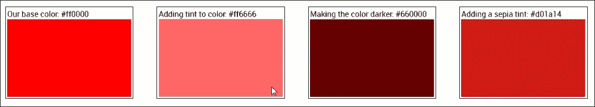

简而言之，我们使用标准的红色色调 (`#ff0000`，以便清楚！)，并使用色调、变暗或棕褐色过滤器计算各种色调。

让我们更详细地看看如何创建这些颜色：

1.  我们将首先从本书附带的代码下载中提取 `Tutorial26` 文件夹的副本；将其保存到我们项目区域的根目录。

1.  接下来，请从我们项目区域的根目录中删除任何 `gulpfile.js` 和 `package.json` 的副本。

1.  从 `Tutorial26` 文件夹中，将 `package.json` 和 `gulpfile.js` 复制到我们项目区域的根目录。

1.  在这些文件就位后，我们仍然需要安装插件。在 Node.js 命令提示符窗口中，将工作文件夹更改为我们的项目，然后输入以下命令，并在每个命令后按 *Enter* 键：

    ```js
    npm install postcss-functions --save-dev
    npm install css-color-converter --save-dev

    ```

1.  从 `Tutorial26` 文件夹中，将 `style – pre-compile.css` 复制到项目区域的 `src` 文件夹中；将其重命名为 `style.css`。

1.  返回 Node.js 命令提示符窗口，然后在提示符下输入 `gulp` 并按 *Enter* 键。

1.  如果一切顺利，我们应该在 `dest` 文件夹中看到一个源映射和两个编译后的样式表；将这些文件复制到 `Tutorial26` 文件夹内的 `css` 文件夹中。

1.  尝试在浏览器中运行演示。如果一切顺利，我们应该看到四个盒子出现，它们有各种深浅的红色调，就像在这个练习的开始部分所展示的那样。

如果我们更详细地查看`gulp`任务文件的内容，它看起来会比之前的练习更大；它可能看起来我们做了更多，但实际上，其中很多我们在早期的演示中已经见过。让我们更详细地看看它。

### 更详细地探索我们的演示

如果我们打开我们的 gulp 任务文件，我们可以看到它包含了许多函数，以及我们在之前的演示中使用过的任务，例如`lint-styles`。在这个演示中的关键是三个颜色函数，以及`autoprefixer`任务的主要部分。

让我们从`color`函数开始，以`darkenColor`为例：

```js
function darkenColor (value, frac) {
  var darken = 1 - parseFloat(frac);
  var rgba = color(value).toRgbaArray();
  var r = rgba[0] * darken;
  var g = rgba[1] * darken;
  var b = rgba[2] * darken;
  return color([r,g,b]).toHexString();
}
```

我们首先提取十进制值，然后从`1`中减去它（作为`frac`），这给了我们调整值，或者说是我们将要加深颜色的值。接下来，我们将使用的颜色（在这种情况下，红色）转换为有效的 RGBA 值，并将其拆分为 RGBA 数组。然后我们将`rgba`数组中的每个值乘以加深值，并将其重新格式化为有效的颜色，然后再将其转换为 HEX 值。

一旦创建了每个函数，我们就可以从我们的 gulp 任务中引用它，如下所示：

```js
gulp.task('autoprefixer', function() {
  return gulp.src('src/*.css')
  .pipe(postcss([  autoprefixer, functions({
    functions: {
      tint: tintColor,
      darken: darkenColor,
      sepia: sepiaColor
    }
  })
  ]))
  .pipe(gulp.dest('dest/'));
});
```

所有这些函数都使用类似的过程，但使用`rgba[]`数组中的值进行的主要计算，例如添加色调（`tintColor`），或者应用棕褐色效果（`sepiaColor`），将会不同。

你可能会问的问题，不过，我们是从哪里得到这些计算的？嗯，互联网上有许多可用的资源，例如这个 Stack Overflow 上的链接：[`stackoverflow.com/questions/6615002/given-an-rgb-value-how-do-i-create-a-tint-or-shade`](http://stackoverflow.com/questions/6615002/given-an-rgb-value-how-do-i-create-a-tint-or-shade)。另一个可能值得一看的替代方案是 Chris Coyier 的 CSS Tricks 网站，在[`css-tricks.com/snippets/javascript/lighten-darken-color/`](https://css-tricks.com/snippets/javascript/lighten-darken-color/)。然而，实际上，我迄今为止看到最好的网站是在 CamanJS 库中，在[`www.camanjs.com`](http://www.camanjs.com)；这个演示中的示例是基于这个库中可用的函数，在[`camanjs.com/docs/filters.html`](http://camanjs.com/docs/filters.html)。

### 小贴士

如果你想要检查特定色调或阴影应该显示的颜色值，一个有用的提示是查看[`highintegritydesign.com/tools/tinter-shader/`](http://highintegritydesign.com/tools/tinter-shader/)。

### 与 CSS3 过滤器比较

在这个阶段我们必须问的一个关键问题是：“为什么我们要费劲去创建单独的函数，当我们可以轻松地使用像 CamanJS 这样的库呢？”

嗯，我们选择在演示中使用的那种方法有一些关键原因：

+   CamanJS 是一个很棒的库，可以产生一些奇妙的效果，但它是一个外部依赖；我们面临的风险是未来可能会停止开发，这可能会影响我们的代码。

+   使用 PostCSS 意味着我们可以移除对外部库的依赖，我们可以控制哪些效果应该包含，哪些是多余的。如果我们使用像`CamanJS`这样的库，我们可能被迫包含大量不必要的额外代码。

+   并非每个浏览器都支持标准的 CSS3 过滤器——使用 PostCSS 给我们提供了一个机会来设计我们自己的过滤器，从而应用类似的效果。

+   我们始终可以使用现有的处理器，例如 SASS，但同样，我们依赖于外部库；使用 PostCSS 意味着我们仍然可以应用相同的原则，但无需依赖。

然而，关键在于浏览器对过滤器的支持非常好，除了 IE——我们应该始终考虑首先使用 CSS3 过滤器，但可以创建一个针对 IE 的特定样式表，允许我们在 PostCSS 中使用自己的版本。

## 为你的图片添加 Instagram 效果

使用 PostCSS 创建过滤器不应该总是无聊的，我们可以绝对地通过过滤器玩得开心！通过使用 Instagram 过滤器为图片添加一些额外样式是一个快速简单的方法——幸运的是，有一个预构建的插件可以用于此目的。

进入可从[`github.com/azat-io/postcss-instagram`](https://github.com/azat-io/postcss-instagram)获取的`Instagram`插件。让我们开始并创建一个简单的演示：

1.  我们将像往常一样，从本书附带的代码下载中提取`Tutorial27`文件夹的副本——将其保存到项目区域。

1.  接下来，提取`gulpfile.js`和`package.json`的副本，用这些新副本替换存储在我们项目区域根目录中的任何副本。

1.  现在，我们需要安装`postcss-instagram`插件，所以请启动一个 Node.js 命令提示符会话，然后更改工作文件夹到我们的项目区域。

1.  在提示符下，输入以下命令，然后按*Enter*键：

    ```js
    npm install postcss-instagram --save-dev

    ```

1.  将`style – pre-compile.css`文件复制到项目区域根目录下的`src`文件夹中，然后将其重命名为`style.css`。

1.  一旦插件安装完成，在提示符下输入`gulp`，然后按*Enter*键。

1.  如果一切顺利，PostCSS 将编译我们的代码，我们应该在`dest`文件夹中看到通常的文件；将这些文件复制到`Tutorial27`文件夹内的`css`文件夹中。

在这一点上，如果我们尝试在浏览器中预览结果，我们应该看到类似于这个屏幕截图的内容：

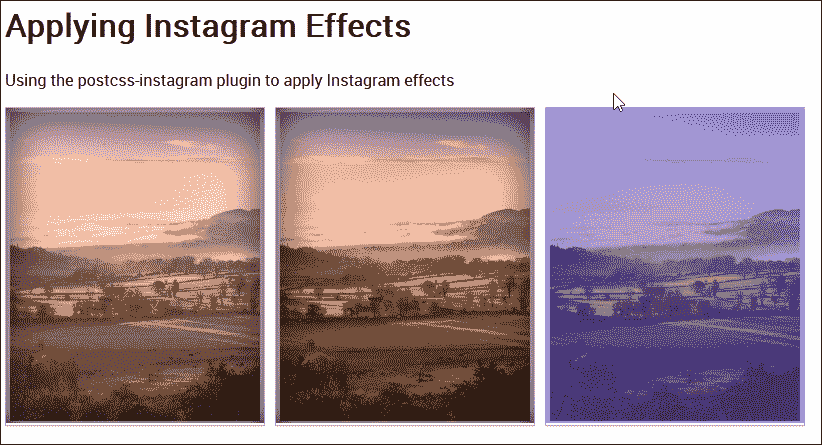

这个问题的关键在于主 CSS 样式表中，我们可以在规则中使用这个来应用所需的过滤器：

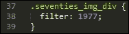

这将应用`1977`过滤效果（插件提供的过滤效果之一）。如果我们查看编译后的代码，我们可以看到插件添加了一些额外的规则；一个用于创建过滤效果，两个用于在图像上定位过滤效果。

如果我们查看编译后的代码，我们可以看到插件所做的更改：

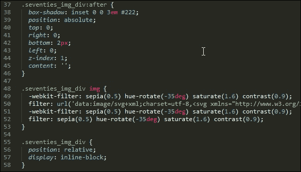

如果你真的想深入了解，那么查看这个插件的源代码是值得的，可以在[`github.com/azat-io/postcss-instagram/blob/master/index.js`](https://github.com/azat-io/postcss-instagram/blob/master/index.js)找到。它相当复杂，但如果你仔细观察，可以看到用于将效果应用到我们图像上的过滤代码的迹象。

# 摘要

处理图像和颜色可能非常有成就感，也可能有些令人畏惧，这取决于我们使我们的过程多么简单或复杂！幸运的是，PostCSS 可以帮助自动化我们相当一部分的过程，所以让我们花点时间考虑一下在这一章中我们涵盖了哪些内容。

我们从添加媒体资源开始，并使用 PostCSS 自动更新资源链接，这有助于消除我们意外使用错误链接的风险！

我们接着转向图像处理，首先研究了创建图像精灵，最初使用 SASS，然后过渡到使用 PostCSS。接下来，我们更深入地研究了如何修改图像，我们使用了`Evil Icons` SVG 库，并设置了 PostCSS 在编译时改变每个图标的颜色。然后我们继续学习如何切换到 WebP 图像格式；虽然大多数人可能会使用标准格式图像，但我们学习了在使用受支持的浏览器时切换 WebP 图像是多么容易。

接下来，我们将注意力转向通过使用特定的调色板来处理颜色，我们介绍了如何使用 PostCSS 编译人类可读的颜色名称，然后在样式表中混合或修改它们。然后我们稍微提高了一些难度，研究了使用 PostCSS 应用特定的颜色过滤效果，以改变所选颜色的颜色级别。然后我们探讨了使用标准插件的一些缺点，以及为什么我们可能需要创建我们自己的自定义过滤效果，这些过滤效果可以在代码编译期间应用。然后我们以快速查看一些有趣的 Instagram 过滤效果结束本章，我们可以轻松地看到如何将多个过滤效果组合在一起来处理我们网站中的图像。

哇，我们确实覆盖了大量的内容！但我们的旅程还没有结束：在下一章中，我们将探讨如何创建网格，然后我们可以使用这些网格在我们的项目中构建布局。
