# 第九章。使用快捷方式、回退和打包

如果你花时间工作与 CSS，那么你可能会遇到一些情况，你希望有一种更快的方法将特定的代码块添加到你的页面中，应用供应商前缀，或者可能为页面上的元素设置预定义的边框。

我们可以通过使用一个或多个可用的快捷方式、回退或打包插件轻松实现这一点。在本章中，我们将探讨一些需要插件的一些常见场景，在下一章中我们将学习如何创建它们。本章将涵盖多个主题，包括以下内容：

+   探索一些可用的 PostCSS 快捷方式和打包

+   使用插件来检查和优化你的 CSS 代码

+   补充 PostCSS 中现有的快捷方式

+   将回退应用到 PostCSS 代码以保持对旧浏览器的支持

让我们开始吧！

# 在 PostCSS 中使用快捷插件

构建一个基于网络的程序或网站可能是一个漫长的过程——有如此多的元素需要考虑，创建引人入胜且信息丰富的内容需要时间。

自然地，一个聪明的设计师或开发者总是会寻找捷径来节省时间——毕竟，为什么要花一个小时来做某事，如果有一个捷径只需要一半的时间？PostCSS 的好处在于它提供了一系列的快捷插件供我们使用；这些包括例如以下示例：

+   `postcss-focus`：此插件可在 [`github.com/postcss/postcss-focus`](https://github.com/postcss/postcss-focus) 找到，这个简单的插件为任何在样式规则中遇到的 `:hover` 属性添加一个 `:focus` 伪选择器。

+   `postcss-border`：如果指定为缩写版本，此插件将为现有的 `border:` 属性添加一个 `border-width` 属性。插件源代码可在 [`github.com/andrepolischuk/postcss-border`](https://github.com/andrepolischuk/postcss-border) 获取。

+   `postcss-short-data`：此插件可在 [`github.com/jonathantneal/postcss-short-data`](https://github.com/jonathantneal/postcss-short-data) 找到，这个有趣的插件允许我们编写类似于伪选择器的缩写数据属性选择器，这些选择器被编译成 data- 属性。

我们已经介绍了或讨论了 PostCSS 中可用的许多快捷插件——这些包括我们之前在书中用来构建响应式页面的 `postcss-responsive-type`，`easings`，当然还有来自第七章（第七章。元素动画 获取，这个插件是九个独立插件的接口；它处理了对旧版 IE 的支持。

+   **简写插件（Short）**: 位于 [`github.com/jonathantneal/postcss-short`](https://github.com/jonathantneal/postcss-short)，这个插件允许我们使用自己的缩写属性来编写样式。

+   **AtCSS**: 这个插件可在 [`github.com/morishitter/atcss`](https://github.com/morishitter/atcss) 获取，这个有趣的插件通过允许我们创建从基础规则继承的规则，为 SASS 的`@extend`提供了一个新的视角。

+   **precss**: 来自 [`github.com/jonathantneal/precss`](https://github.com/jonathantneal/precss) 的这个插件允许我们在样式表中使用类似 SASS 的标记。我们将在第十一章“操作自定义语法”中更详细地探讨这一点。

+   **Stylelint**: 这个插件包应该是任何 PostCSS 开发者的工具包的一部分：它允许我们自动检查我们的样式表。这个插件包可在 [`github.com/stylelint/stylelint`](https://github.com/stylelint/stylelint) 获取。

+   **cssnano**: 类似地，`cssnano` 应该是任何开发者的工具包的一部分：这个包非常适合压缩和优化我们样式表中的代码。你可以从 [`github.com/ben-eb/cssnano`](https://github.com/ben-eb/cssnano) 获取这个插件。

+   **Rucksack**: 最后，但绝不是最不重要的，Rucksack（如开发者所描述的），是一个“……CSS 超级能力的口袋”。这个包增加了对诸如`font src`生成、提供 RGBA 值的回退支持或`clearfix`技巧等功能的支持。

这些插件包提供了真正的功能混合——自然是我们决定要使用哪些插件。然而，此时，有人可能会想问“为什么使用插件包——这难道不是添加了不必要的冗余功能，而我们试图避免添加这些功能？”

这是一个好问题，简单的答案是这取决于你的需求。如果我们只对添加供应商前缀感兴趣，然后检查和压缩我们的代码，那么我们可能会使用`autoprefixer`、`cssnano`和`stylelint`。但如果我们想添加属性别名，那么可以放弃使用`autoprefixer`，转而使用带有`cssnano`和`stylelint`的 Rucksack。不过，关键在于仔细评估你的需求，并确定从 PostCSS 提供的插件中选择最佳组合。

好了，是时候改变一下了：让我们继续前进！在接下来的几页中，我们将探索一些这些插件包：让我们从一个简单的插件开始，形式为`postcss-short`。

## 使用缩写编写样式

这个插件可以从[`github.com/jonathantneal/postcss-short`](https://github.com/jonathantneal/postcss-short)获取，它是 PostCSS 生态系统中的几个插件的包装器；这些包括缩写边框、缩写颜色和缩写大小。安装这个插件非常简单——它使用与大多数其他 PostCSS 插件相同的格式，并且可以在我们的项目根区域内的 Node.js 命令提示符会话中使用此命令安装：

```js
npm install postcss-short --save-dev

```

这个插件（以及其他插件包）的伟大之处在于，它消除了调用大量单独插件的需求。但我们必须记住，为了使这变得有价值，我们需要以某种形式调用大多数插件。如果我们只从`postcss-short`中调用一个或两个，那么我们可能更愿意单独调用它们，而不是使用`postcss-short`插件。

放下对使用插件的任何顾虑，让我们来看看它在实际应用中的几个例子。体验它的最佳方式是使用[`jonathantneal.github.io/postcss-short/`](http://jonathantneal.github.io/postcss-short/)上的在线编辑器。我们可以用它来实验，在编译前将最终结果添加到我们的样式表中：

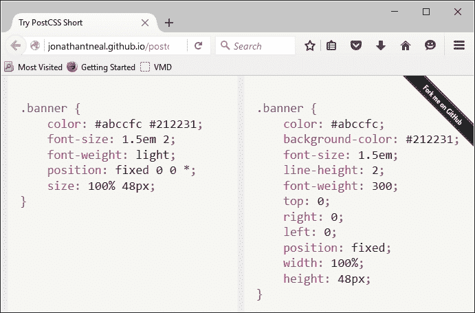

在这个例子（来自插件网站）中，我们使用了所有插件，除了缩写文本和缩写数据。在我们的代码中，我们使用了插件指定的相关缩写——PostCSS 将编译成有效的 CSS 样式，正如每个插件中概述的那样。

我们使用哪些插件当然取决于我们的需求——完全有可能你将发现自己在某些插件上比其他插件使用得更多。然而，就缩写主题而言，有一个插件包可能会经常出现在你的工具箱中——Rucksack。不，我并不建议这是一个去度假的机会（没有开玩笑），而是一个使用 PostCSS 中将是一个非常有用的插件集的机会。

# 使用 Rucksack 添加快捷方式

提到 Rucksack 这个词，人们可能会认为我们即将开始一段旅程或假期——虽然这种愿望可能存在，但还有更多实际的事情需要先处理！

话虽如此，使用 PostCSS 很容易被视为一次旅行；当与插件一起工作时，这一点尤其正确。当你与 PostCSS 一起工作时，你可能会遇到的一个插件（或者更准确地说，是一组插件）是 Rucksack（那里有文字游戏？）。这个有用的插件组，可在[`simplaio.github.io/rucksack/`](http://simplaio.github.io/rucksack/)找到，包含了一系列相互链接的插件，为我们提供了在编译样式表时使用 Rucksack 的附加功能，例如以下示例：

+   **别名**：此功能可在[`github.com/seaneking/postcss-alias`](https://github.com/seaneking/postcss-alias)找到，此插件允许我们创建简写 CSS 属性。

+   **清除浮动**：作为一名开发者，我确信你一定熟悉清除浮动的技巧：Sean King 的这个插件提供了 PostCSS 的等效功能，可在[`github.com/seaneking/postcss-clearfix`](https://github.com/seaneking/postcss-clearfix)找到。

+   **字体源扩展**：你有多少次在代码中使用自定义字体声明？它们编写起来很痛苦——Sean King（在[`github.com/seaneking/postcss-fontpath`](https://github.com/seaneking/postcss-fontpath)）的另一个插件，使得将其添加到代码中变得轻而易举。

然而，这里的讽刺之处在于，我们已经在不知不觉中使用了 Rucksack——还记得我们在第四章中使用的`postcss-responsive-type`插件吗？或者我们在本书的几乎所有章节中使用的`autoprefixer`插件？这两个插件都可通过 Rucksack 获得——Rucksack 实际上是一个抽象层，它将多个插件整合到一个一致的用户界面中，供我们使用。

好了，闲话少说：让我们开始一个演示，看看一些实际操作！对于我们的下一个演示，我们将使用一些标准的 HTML 标记和 CSS3 样式构建一个简单的滑块；根本不会使用 JavaScript。在我们将样式表转换为使用 Rucksack 之前，我们将快速浏览一下我们的滑块。

## 介绍我们的演示

对于接下来的演示，我们将打破传统，在创建我们的演示之前，不安装我们即将使用的插件。相反，我们将首先设置我们的演示——一旦我们设定了基线解决方案，我们就可以确定 Rucksack 可以用在哪里。

我们的演示集中在简单的图片滑块上，它使用纯 CSS3 样式来控制动画。这是我们即将创建的截图：


要查看演示的实际效果，请从本书附带的代码下载副本中提取`T45 – 转换为使用 Rucksack`文件夹——将其保存到我们的项目区域。然后在浏览器中运行`slider.html`来预览结果，然后点击左下角的数字在不同的图像之间切换。

### 注意

您需要将样式文件 `post-completed.css` 重命名为 `style.css` 以确保其正确运行。

## 将 Rucksack 作为插件安装

在我们的演示就绪后，是时候安装 Rucksack 并确定我们可以在我们的演示中使用它的位置！Rucksack，像大多数其他 PostCSS 插件一样，可以使用相同的方法安装——我们可以使用 NPM：

1.  启动 Node.js 命令提示符，然后更改工作文件夹到我们的项目区域。

1.  在提示符中输入 `npm install rucksack-css --save-dev`，然后按 *Enter*。

1.  NPM 将安装插件——如果一切顺利，我们应该看到类似这样的东西：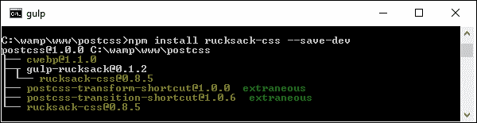

注意：Rucksack 有几个插件可用：确保安装正确的插件！有一个 Gulp 插件，但它似乎在 PostCSS 中不起作用，尽管我们使用 Gulp 作为任务运行器。

除了这个之外，让我们继续前进。在我们通过将我们的滑块转换为使用 Rucksack 的过程之前，让我们快速看一下使用它进行简单缓动演示的情况。

## 慢慢使用 Rucksack

任何在网站上花费时间动画内容的开发者无疑都创建过规则来控制内容如何进入或退出页面。在内容进入和退出页面以及网站效果过载之间找到正确的平衡需要时间才能做到！

不考虑最后一条评论中的糟糕的双关语，这正是 Rucksack 可以帮助的地方——这个包中包含的几个简单插件之一是 `postcss-easings`。这个插件可以从 [`github.com/postcss/postcss-easings`](https://github.com/postcss/postcss-easings) 获取，我们在 第七章 *动画内容* 中也提到了它，它的唯一作用就是将任何已识别的缓动名称转换为 cubic-bezier 等价值。

### 小贴士

例如，要查看贝塞尔曲线，请访问 [`cubic-bezier.com/#.17,.67,.83,.67`](http://cubic-bezier.com/#.17,.67,.83,.67)。

你问这样做有什么好处吗？嗯，我想到了两个：一致性和中心源点。让我解释一下我的意思。

中心源点借鉴了 CSS 预处理器（如 SASS 或 less）的原则，其中在文件顶部定义了一个单一值；文件中其他地方找到的任何实例都将自动替换为其值（在这个例子中，是一个 `cubic-bezier` 缓动）。这有助于保持一致性：我们可以在配置中指定任何自定义缓动的名称，这将替换在编译过程中找到的任何实例。

这样做的优点是，我们只需要更新一个中心点（即源点），并且可以避免在我们的代码中混合不同类型的缓动值——它们将在编译时转换为 cubic-bezier 值。

好的，让我们继续：现在是演示时间！在我们深入之前，让我们快速了解一下我们将要构建的内容。我们的演示很简单，只有四个方块，我们将使用纯 HTML 和 CSS（是的，没有 JavaScript）来动画化它们。我们将使用一些效果，例如 `easeOutBack`，它看起来像这样：

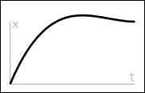

### 小贴士

你可以在 [`easings.net/#easeOutBack`](http://easings.net/#easeOutBack) 上了解更多关于这个特定缓动细节的信息——当在代码中使用时，它转换为 `cubic-bezier(0.175, 0.885, 0.32, 1.275)`。

让我们开始构建那个演示…

## 使用插件动画内容

如果你期待戏剧性的效果，那么我很抱歉让你失望——这个练习被故意保持简单，以展示使用 Rucksack 是多么容易。我们之前提到，整体结果将是四个我们可以随意动画化的简单方块——它们看起来可能像这样：


使用此插件确实会引发一个重要问题——我们将在构建完我们的演示后讨论这个问题：

1.  从这本书附带的代码下载中，请提取 `T44 - postcss-easings` 文件夹的副本，并将其保存到项目区域的根目录。

1.  接下来，将 `T44 - postcss-easings` 文件夹中的 `gulpfile.js` 和 `package.json` 文件复制到项目区域的根目录——请替换该位置已存在的任何文件，或者将它们保存在安全的地方。

1.  将 `css – completed versions` 文件夹中的 `style – pre-comile.css` 文件复制到项目区域内的 `src` 文件夹中；这将使其准备好进行编译。将其重命名为 `style.css`。

1.  好的，请启动一个 Node.js 命令提示符会话，然后将工作文件夹更改为我们的项目区域。

1.  在提示符中输入 `Gulp` 然后按 *Enter* 键——我们的文件将被编译，如下所示：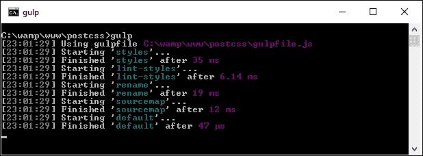

1.  假设编译过程中没有出现任何问题，将 `dest` 文件夹的内容复制到 `T44 - postcss-easings` 文件夹内的 `css` 文件夹中。

1.  尝试在浏览器中预览我们手工制作的成果——如果我们悬停在每个方块上，动画将启动；它们应该看起来与这个练习开始时显示的图相似。

我们的演示从未打算变得复杂——目的是展示如果配置对象设置正确，获得一致效果是多么容易！然而，这确实引发了一个关于我们插件选择的重要问题，因此让我们更详细地探讨这个问题。

### 更详细地剖析我们的演示

这就是简单性带来巨大回报的一个例子；`postcss-easings`插件在标准使用情况下无需配置，只有当我们使用的缓动效果不是其核心库的一部分时才需要配置。我们为这个演示选择的缓动效果已经在插件中定义了——如果我们打开编译后的样式表副本，我们应该能看到类似以下的内容：

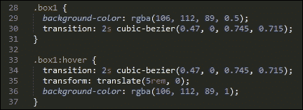

配置此插件的关键在于两行代码，大约在第 11 行和第 16 行：

```js
var rucksack = require('rucksack-css');
  .pipe(postcss([ rucksack() ]))
```

在这个演示中使用的 Gulp 任务文件中存在的大多数代码是我们之前已经见过的；提前思考通常是有益的，这样我们就可以构建一个可以用于未来项目的 gulp 文件。一旦配置完成，任何被插件识别的样式都将编译成有效的 CSS。

如果我们决定使用自定义的缓动样式，那么我们可以很容易地相应地更新配置对象：

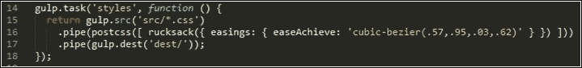

如果你对此名称感到好奇——这个效果模仿了在你取得好成绩后击打空气时的动作，尤其是如果它是一个棘手的问题的话！

在我们进行下一个练习之前，我们应该回答我之前提到的那个问题：我们应该使用哪个插件？但是等等，我们正在使用`postcss-easings`插件，对吧？

不，我并没有完全失去方向：`postcss-easings`插件可以单独使用，并且在 Rucksack 插件包中被引用。然而，关键在于，如果我们只需要使用`postcss-easings`，那么调用 Rucksack 的插件就没有意义了，这只会给我们的工作流程增加不必要的负担。相反，我们可以将 gulp 任务文件中的第 11 行改为以下内容：

```js
var easings = require('postcss-easings');
```

我们还可以将第 16 行改为以下内容：

```js
.pipe(postcss([ easings() ]))
```

只要插件还是之前安装的，代码就会像以前一样编译，但不会包含 Rucksack 中其他插件带来的额外开销。

## 将我们的滑块转换为使用 Rucksack

如果我们在使用 Rucksack，我们已经看到，成功使用的关键与其说是为我们的 Gulp 文件配置它，不如说是决定使用哪些插件。为了理解我们的意思，请仔细查看*介绍我们的演示*的原始样式表；它应该揭示我们可以使用多个插件来改进现有功能：

+   **响应式排版**：我们的演示已经部分是响应式的，但是当我们改变滑块的大小，标签文本不会调整大小。我们可以通过修改我们的代码来触发 Rucksack 使我们的字体响应式。

+   **简写定位**：这是一个添加位置属性的出色插件；为什么要在一行代码中添加 top、left、right 和 bottom 属性呢？添加这一行代码，我们就可以让 PostCSS 为我们做繁重的工作。

+   **属性别名**：继续简写主题，我们可以使用此插件设置任何我们关心的属性的简写版本；这意味着我们只需要输入一个或两个字母，PostCSS 就会将其转换为该属性的完整版本。

+   **字体源扩展**：如果我们仔细查看我们的源样式表，我们应该在第 6 行或附近看到一个小的错误。代码要求使用 Open Sans 作为字体，但这不是标准字体！幸运的是，我们可以通过告诉浏览器从哪里下载它来轻松修复它——Rucksack 为我们提供了方便的简写形式，以便将此详细信息添加到我们的代码中。

+   **Hex RGBA 快捷方式**：我们在样式表中混合使用了 RGBA 和 HEX 代码来表示颜色，但一些较旧的浏览器不支持前者。这已经不再是问题，但由于 Rucksack 会自动添加这些值，因此添加后者也没有坏处！

+   **缓动效果**：我们的滑块演示使用了一个缓动效果的实例，形式为 ease-in-out-back。在上一个演示中，我们使用了`postcss-easings`（这是 Rucksack 这部分的基础）将名称转换为`cubic-bezier`值；在更新滑块时，我们应该继续这个主题。

+   **自动前缀**：默认情况下，这并未启用，因此我们决定是否要使用它。它引用了我们之前在早期演示中已经使用的相同的`autoprefixer`插件；如果我们打算充分利用 Rucksack，那么启用它并删除我们代码中已经存在的任何现有引用是有意义的。我们将使用 Rucksack 中引用的大多数插件，因此我们将启用它以供使用。然而，如果我们只需要一个或两个，或者我们不需要对旧浏览器的支持，那么它可以保持关闭状态。

+   **遗留回退机制**：Rucksack 中的`laggard`插件提供了对旧浏览器的支持。它提供了一系列回退机制，例如为 rem 值添加回退支持，为 RGBA 值提供 HEX 回退，或为 will-change 的 3D 转换提供 hack。我们将添加 rem 回退支持，因此我们将启用此插件以供使用。

现在我们已经涵盖了我们要使用的元素，是我们进行更改的时候了。无需多言，让我们开始吧：

1.  从本书附带的代码下载中，请继续提取`T45 - 转换为使用 Rucksack`文件夹的副本，并将其保存到我们的项目区域。

1.  在`T45 - 转换为使用 Rucksack`文件夹内，将`gulpfile.js`和`package.json`文件复制到我们项目区域的根目录。

1.  接下来，将`T45 - 转换为使用 Rucksack`文件夹内的`css-completed`版本文件夹的内容复制到我们项目区域的根目录的`src`文件夹。将预编译的`version.css`重命名为`style.css`，然后在文本编辑器中打开此文件——我们需要对文件中的样式进行一些修改。

1.  我们的第一项更改是使演示中的文本响应式——搜索 `font-size`，并将任何实例更改为 `font-size:` `responsive`。这应该涵盖每个五个数字标签，以及 `div.slide-content > figcaption` 规则。

1.  接下来，添加我们针对位置属性的简写版本——在这个例子中，我们只能更改一行，即第 42 行。注释掉第 33-36 行指定的 `bottom`、`left`、`right` 和 `top` 属性，然后将 `position:` 属性替换为以下内容：

    ```js
    position: 427px 0 0 0;
    ```

    ### 注意

    注意，其他位置实例不能更改，因为我们没有在这些规则中指定单独的位置值。

1.  我们接下来的转换是添加一些别名——这只是一个输入更多文本的快捷方式！对于我们的演示，请在我们的样式表顶部添加以下内容：

    ```js
    @alias {
      pb: padding-bottom;
      bs: box-shadow;
      bgc: background-color;
    }
    ```

接下来，对这三个样式分别进行搜索和替换——将全名替换为 `@alias` 块中给出的快捷名称。

1.  记得我之前指出的那个小问题，关于 Open Sans 字体的缺失支持吗？嗯，我们可以轻松解决这个问题——在我们的样式表文件顶部，添加以下代码块；这告诉浏览器在哪里找到 Open Sans 字体：

    ```js
    @font-face {
      font-family: 'open_sansregular';
      font-path: '../fonts/OpenSans-Regular-webfont';
      font-weight: normal;
      font-style: normal;
    }
    ```

1.  我们简要提到了 Rucksack 将缓动名称转换为 cubic-bezier 值的能力。这个演示使用了一个缓动名称——这已经设置为 Rucksack 内部支持的值，因此我们不需要更改我们的代码。同样适用于 RGBA 回退支持——Rucksack 会自动将代码中看到的任何 RGBA 值转换为十六进制等效值。

1.  剩下的两个更改是为了支持旧版本和自动添加前缀——为了启用这些功能，我们必须修改我们的 gulp 文件，如图所示：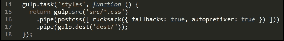

1.  保存文件后，切换到 Node.js 命令提示符——在提示符下，确保工作文件夹设置为我们的项目区域。

1.  在提示符下，输入 `gulp`，然后按 *Enter*——PostCSS 将消失并编译代码；如果一切顺利，我们应该在 `dest` 文件夹中看到我们的编译文件：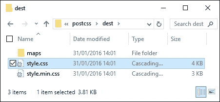

在这个阶段，我们有一组编译后的文件。为了确认演示是否正常工作，请将它们复制到 `T45 - 转换为使用 Rucksack` 文件夹内的 `css` 文件夹中；通过运行 `slider.html` 预览我们工作的结果。如果一切顺利，我们应该看到相同的滑块效果：


一切应该都很好，我们有一个正常工作的演示，并且我们的代码已成功编译。在这个时候，我们可以继续进行下一个任务，对吧…？

## 分析我们的代码

嗯，先看看我们的编译代码是值得的：Rucksack 对我们的代码进行了一些额外的更改，这些我们可能没有预料到。

例如，Rucksack 为我们代码中列出的 rem 单位提供了基于像素的回退支持，以及我们之前讨论的 HEX 回退支持：

```js
body {
  font-family: "open_sansregular";
  line-height: 25.888px;
  line-height: 1.618rem;
  background-color: #ecf0f1;
  background-color: rgba(236, 240, 241, 1.0);
  color: #44466a;
  color: rgba(68, 68, 618, 1.0);
}
```

接下来，看看第 96 行——还记得我们添加的`font-size: responsive`属性吗？这是编译后的结果：

```js
font-size: calc(12px + 9 * ( (100vw - 420px) / 860));
```

在底部三分之二的部分，添加了许多媒体查询；这些查询是为了使我们的字体样式响应式而添加的。进一步向下，大约在第 226 行，我们有这个代码块：

```js
-ms-filter: "progid:DXImageTransform.Microsoft.Alpha(Opacity=0)";
 -webkit-transition: opacity 0.35s;
 transition: opacity 0.35s;
```

初看起来，你可能会想知道这从哪里来，因为我们没有在我们的代码中指定`ms-filter`属性。好吧，这要归功于 Rucksack——它自动为 IE 添加了透明度支持。

然而，这个小探索的关键是，选择插件应该是一个迭代的过程，只有当网站不再需要时，这个过程才能真正结束。例如，我们可以轻松地在我们工作流程中添加另一个步骤，将`calc()`操作减少到静态值（在允许的情况下——这个插件的名称是`postcss-calc`）。我们应该定期考虑使用`postcss-remove-prefixes`来保持我们的代码更新；总会有那么一天，我们不再需要添加前缀，或者现有的前缀变得冗余。

除了对我们样式表的更改之外，还有一点需要考虑——你会注意到在我们的代码中，Autoprefixer 插件已经被注释掉了：

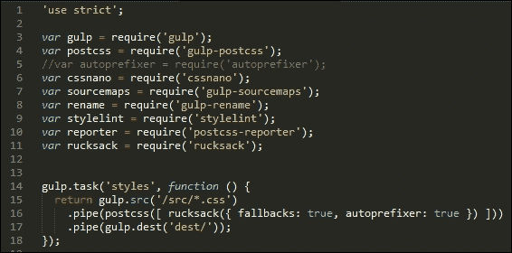

这是有充分理由的——Rucksack 内置了对`autoprefixer`的支持，因此没有必要调用两次；具有讽刺意味的是，它只是调用了我们代码中注释掉的同一个插件！我们决定是否从 Rucksack 内部调用它，或者单独调用；这主要取决于 Rucksack 中还有其他什么被调用，以及添加`autopre` `fixer`是否有助于为使用 Rucksack 提供更强的理由。

# Linting and optimizing your code

带宽使用一直是网站成功的关键；还记得那些 56K 调制解调器的美好时光吗？自从那时以来，我们已经走了很长的路，但这并不是生产出像过时一样消耗带宽的网站的借口！

其中一部分是通过在部署到生产使用之前对样式表进行 linting 和 minifying 来实现的——不言而喻，这应该成为任何开发者的工作流程过程的一部分。我们可以手动完成这项工作，但这项手动工作容易错过机会，这可能导致我们的代码出现不一致。

相反，我们可以利用 PostCSS 的力量为我们完成繁重的工作；`stylelint`和`cssnano`插件包提供了一个强大的优化工具！如果我们仔细查看本书过程中创建的大多数 gulp 任务文件，这两个过程都在进行；在这个例子中，`stylelint`在第 22 行使用，`cssnano`在第 38 行使用：

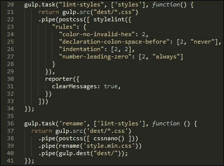

## 探索 cssnano 的使用

对于第一次使用 PostCSS 的人来说，只需将`cssnano()`指定为 PostCSS 的一个处理器就足够了：

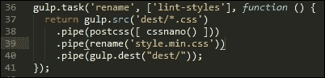

如果我们查看`T45 – 转换为使用 Rucksack`演示，我们的原始样式表文件在编译后重量为 4KB，但在压缩后降至 3KB。当然，这是一个很小的文件，但 25%的尺寸减少仍然不是微不足道的减少！

### 提示

到目前为止，值得注意的是，尽管我们正在使用 Gulp，但使用的插件是 PostCSS 版本，而不是`gulp-cssnano`。

`cssnano`插件不是一个单独的插件，而是一系列插件的包装器，包括这些示例：

+   `postcss-reduce-idents`: 这将任何自定义标识符名称（例如在`@keyframes`中使用的名称）减少到两个字母的等效代码；这有助于代码压缩。

+   `postcss-zindex`: 此插件减少了任何不必要的比应有的`z-index`声明更高的声明。

+   `postcss-convert-values`: 如果我们的 CSS 使用了任何数量的不同单位，那么我们可以通过不同的方式表达值来减少 CSS 的大小。例如，`400ms`可以表示为`.4s`（减少了两个字符）。有些人可能会认为这有点极端，但任何一点帮助都是好的！

+   `postcss-colormin`: 类似地，我们可以使用此插件来减少颜色名称的长度：如果我们的代码中使用了`rgba(255, 0, 0, 1)`，那么我们可以将其替换为`red`。虽然名称确实更短，但这是以牺牲与颜色命名的连贯性为代价的，这可能并不那么理想。

接下来，当使用`cssnano`时，我们应该注意一些关键点：

+   你会注意到在我们的 Gulp 文件中使用 gulp-rename 插件——`cssnano`没有能力将压缩文件重命名为我们希望在代码中看到的名称。我们可以使用`gulp-rename`创建一个开发人员期望在代码中看到的版本；如果需要，它会在原文件处留下副本。

+   `cssnano`中的大多数选项默认启用；我们可以在配置对象中关闭个别选项，如本例所示：

    ```js
    var nano = require('gulp-cssnano');

    gulp.task('default', function () {
        return gulp.src('./main.css')
            .pipe(nano({discardComments: {removeAll: true}}))
            .pipe(gulp.dest('./out'));
    });
    ```

    ### 提示

    要查看完整的转换选项列表，请查看[`cssnano.co/options/`](http://cssnano.co/options/)。点击链接查看该插件的个别配置选项。

+   此插件自动包含 autoprefixer。技术上，我们不需要单独包含它，就像我们在之前的练习中所做的那样，因此理想情况下应该将其删除。我们将在第十章 Building a Custom Processor 中更多地关注这一点，*构建自定义处理器*。

+   `cssnano`中有些转换是可用的，但默认情况下并未启用；这些不被认为是安全的，并且只有在您 100%确信它没有影响您的代码时才应包含。不安全转换的详细信息可在`options`页面[`cssnano.co/options/`](http://cssnano.co/options/)上找到。

好吧，让我们继续：我们双打表演的第二部分是 `stylelint` 插件包；与 `cssnano` 不同，`stylelint` 采取相反的方法，允许你根据需要从 100 多条可用规则中选择任何规则。让我们深入探讨并更详细地看看。

## 将 Stylelint 配置为我们的代码检查器

如果你之前从未遇到过 Stylelint，该如何描述它呢？好吧，引用其网站上的话，“stylelint 是一个强大、现代的 CSS 代码检查器”。

无论我们是否认同这样的大胆声明，了解 Stylelint 作为代码检查器的价值无疑是值得的。它可以从 [`stylelint.io/`](http://stylelint.io/) 获取，这个插件的关键不在于插件本身，而在于定义我们想要检查代码中哪些内容的规则。目前，我们可以使用 100 多条规则中的任意一条，或者混合使用几条；这些规则可以在 `.styleintrc` 文件中、`package.json` 文件内，或者作为一个导出 JavaScript 对象的 `stylelint.config.js` 文件中指定。

我们已经在早期项目中使用了 `stylelint`；为了方便，我们的 Gulp 任务中已经指定了一些规则：

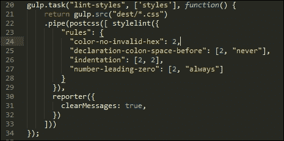

我选择了一些规则来展示我们如何使用 Stylelint；当然，作为开发者，选择哪些规则作为代码检查的一部分是你们自己的决定。Stylelint 并不包含一组默认启用的核心规则——它所做的任何检查都将取决于规则配置中指定的内容。

### 提示

一个有用的书签来源是 [`stylelint.io/`](http://stylelint.io/)——它包含了一整套可以在编译代码之前添加到 Stylelint 配置中的规则。

例如，如果我们正在构建一个大量使用黄金法则的响应式网站，我们可能希望将任何百分比值限制在三个或四个小数位以内。为此，我们将指定 `number-max-precision` 规则——它接受一个整数值；指定 `3` 将会对这两个属性发出警告：

```js
.foo { top: 3.2456px; }
.foo { top: 3.245634px; }
```

对于这个例子来说，情况并非如此：

```js
@media (min-width: 3.234em) {...}
```

我强烈建议阅读规则列表，以了解可用的选项；熟悉内容需要时间，但回报将是优化并检查后用于生产环境的代码。不过，有一点需要注意——即使我们无限期地优化代码，仍然有可能需要包含对旧浏览器的某些支持。

在理想的世界里，我们会说服我们的客户限制这种支持的好处（或者甚至不提供支持）。然而，如果客户坚持这样做，尽管我们判断不佳，PostCSS 也可以轻松地帮助我们提供这种支持。让我们探索一下可用的选项——其中大部分将集中在 IE（因为这是最大的罪魁祸首），但同样适用于其他浏览器。

# 提供回退支持

在设计网页内容时，一个关键的关注点是浏览器支持——我们需要支持哪些浏览器？如果我们要支持的唯一浏览器是 Firefox 或 Chrome 这样的，那么我们的工作就会容易得多。问题是，我们还得支持 IE、Safari、Edge……更不用说移动设备了！否则生活就会变得无聊……

但我跑题了，回到现实：对于那些拒绝遵守标准的旧版浏览器（是的，我特别指的是 IE），我们必须考虑提供某种形式的支持或优雅降级。幸运的是，在 PostCSS 生态系统中，我们可以使用许多插件——我们已经使用了一个，就是 Autoprefixer；还有其他可用的插件，所以让我们深入了解一下这些插件的一些详细情况。在我们这样做之前，有一个有用的技巧我想探讨，这个技巧可以帮助我们在浏览器中检查和提供旧版支持。

## 检测对特性的支持

开发过程中的一个关键部分是确保我们的代码能在那些我们必须支持的浏览器上运行。如果我们足够幸运，这个浏览器范围仅限于较新的产品，那么这就不成问题了。

对于一些开发者来说，可能需要支持旧版浏览器；如果环境中包含其他基于浏览器的应用程序，这些应用程序需要使用这些旧版浏览器，并且无法被替换，那么这一点尤其正确。

为了解决这个问题，我们可以使用像 Modernizr([`www.modernizr.com`](http://www.modernizr.com))这样的库，但更有效的方法是使用 CSS 的`@supports`指令。简而言之，它的工作方式与媒体查询类似；我们可以指定一个所有浏览器都支持的备用属性，如果我们使用的是可以支持增强属性的浏览器，就可以取消它：

```js
section {
  float: left;
}

@supports (display: -webkit-flex) or (display: flex) {
  section {
    display: -webkit-flex;
    display: flex;
    float: none;
  }
}
```

主要来说，这更有可能对那些需要为旧版 IE 提供支持的人有用（鉴于其他浏览器已经提供了一段时间的支持）。理想情况下，我们会试图说服客户不支持旧版 IE 的好处（至少是 8，可能是 9）。如果我们必须支持它们，这种方法结合使用 autoprefixer 可能会非常有用。

## 提供对旧版浏览器的支持

当谈到为旧版浏览器提供支持时，最大的罪魁祸首可能是微软的 IE。虽然必须说，在新版本中的支持正在改善，但它的流行意味着仍然有足够的旧版本需要提供支持！

值得称赞的是，微软已经宣布他们不再支持 IE8 到 10——这是朝着鼓励用户升级的正确方向迈出的一步，尽管这些版本完全消失还需要一段时间。

那么，如果你仍然需要支持旧版本的 IE，我们能做什么呢？一个值得尝试的好方法是使用旧版插件包；它的名字是对某些人所说的 oldIE 的引用，或者那些本应很久以前就被归入历史的 IE 版本！

这个插件可以从[`github.com/jonathantneal/oldie`](https://github.com/jonathantneal/oldie)获取，是 PostCSS 内众多插件的包装器；以下是一些示例：

+   `post-calc`：尽可能将任何`calc()`实例减少到单个值；使用混合单位的`calc()`实例可能不会被替换

+   `postcss-unroot`：如果我们的 CSS 使用了`:root`选择器，那么旧版本的 IE 将失败；这个插件将它们替换为 HTML，以便我们的代码可以编译

+   `postcss-unnot`：在类似的情况下，如果我们指定了包含使用`:not`伪元素的元素的规则，那么这些选择器将被移除

+   `postcss-unopacity`：将任何透明度属性的实例转换为使用`filter: alpha(opacity=XX)`，其中`XX`是原始透明度属性的等效值

该包还包括其他插件——为了了解包含哪些插件，查看插件包的`index.js`文件是值得的；它看起来可能像这样：

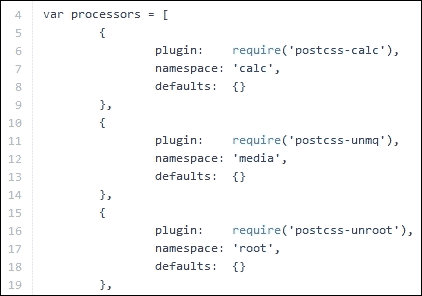

然而，美中不足的是，我们并不被迫完全使用 oldie 插件。如果我们由于某种命运的怪癖，成功地创建了一些主要避免了可能导致旧 IE 崩溃的 CSS 属性的代码，那么我们可以选择仅引用我们需要使用的那些插件。

当然，这取决于我们使用了多少——更可能的情况是我们最终需要使用所有插件，因此使用 oldie 更有意义！当然，我们总是可以鼓励我们的客户放弃旧 IE——这可能不像听起来那么简单…

## 从代码中移除样式黑客

如果我们足够幸运，拥有理解我们的客户——机会总是美好的——那么我们可能需要执行一项任务：从我们的代码中移除与不再支持的浏览器相关的任何样式黑客。如果只有一个小样式表，这些黑客的移除可能微不足道；但现实是，对于更大的样式表，这很可能是漫长且需要手动处理的过程，存在我们遗漏黑客的风险。

相反，我们可以利用一个插件，即 stylehacks；它与我们在本书中的演示中已经使用的`stylelint`插件配合得非常好。可以从[`github.com/ben-eb/stylehacks`](https://github.com/ben-eb/stylehacks)获取该插件，它使用[`browserhacks.com`](http://browserhacks.com)上列出的黑客，安装起来非常简单——让我们看看它的实际效果：

1.  我们首先从本书附带的代码下载中提取`T47 - 使用 stylehacks`文件夹的副本；将其保存到我们的项目文件夹根目录。

1.  将`gulpfile.js`和`package.json`文件复制到项目文件夹的根目录。

1.  在文本编辑器中，添加以下代码，并将其保存为`src`文件夹中的`style.css`（*不在* `T47 - 使用 stylehacks`文件夹内！）：

    ```js
    h1 {
      _color: white;
      color: rgba(255, 255, 255, 0.5);
    }
    ```

1.  接下来，启动一个 Node.js 命令提示符会话，然后更改工作文件夹到我们的项目区域。

1.  我们现在需要安装这个插件——在提示符中输入以下命令，然后按 *Enter*：

    ```js
    npm install stylehacks --save-dev

    ```

1.  当插件安装完成后，继续在提示符中输入 `gulp`，然后按 *Enter*。

1.  PostCSS 将编译我们的代码——如果一切顺利，我们应该在我们的项目区域根目录的 `dest` 文件夹中看到这个：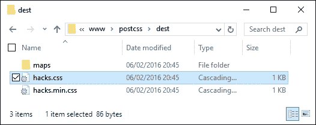

假设我们成功编译了代码，尝试在文本编辑器中打开 `style.css` 文件——我们当然会在代码底部有必要的源映射指令，但请注意它如何移除了颜色漏洞：

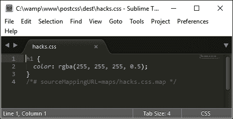

这个过程的关键在于我们 Gulp 文件中的这个任务：

```js
gulp.task('styles', function () {
  return gulp.src('src/*.css')
    .pipe(postcss([ stylehacks({browsers: 'last 1 version, > 10%'}) ]))
    .pipe(gulp.dest('dest/'));
});
```

在我们的 Gulp 文件中，我们添加了浏览器属性——这告诉 stylehacks 移除任何对于现代浏览器或那些全球使用率超过 `10%` 的浏览器来说不是必需的漏洞。这个设置基于从 [`github.com/ai/browserslist`](https://github.com/ai/browserslist) 可用的 Browserslist 查询列表——值得注意的是，这也可以用于像 Autoprefixer 这样的插件。

### 注意

如果我们开始包含更多使用 Browserslist 查询的插件，那么考虑使用变量来代替查询；从中央位置更新它将自动更新所有使用它的插件。有关更多详细信息，请参阅 GitHub 上的 Browserslist 网站。

尽管这个插件使用起来很简单，但在为这本书进行研究的过程中，有一个令人烦恼的问题一直萦绕在心头：这个插件在现实中到底有多有用？对于一些人来说，你可能觉得我需要检查一下我的脑袋，但这是有原因的——让我来解释一下。

如果你花过任何时间用 jQuery 进行开发，那么你应该知道它从 jQuery 2.x 版本开始已经不再支持 `IE6`-`8`，并且只会在 1.x 分支中继续支持它。1.x 分支中 jQuery 的许多负担都是基于为浏览器漏洞而设计的；这些漏洞的最大罪魁祸首就是 IE！

在撰写本文时，微软已经公开声明将停止支持 IE10 及以下版本（至少对于 Windows 8 而言）——他们只会在 Windows 8.1 平台上支持 IE11，以及他们新的浏览器 MS Edge。

由于 CSS 中发现的许多漏洞都是为了 IE（这也适用于 jQuery），人们不禁要 wonder 如果 stylehacks 插件在不久的将来仍然有用！我们也应该问自己，使用漏洞是否是一个好的设计决策。我们是否在为将来设计一个问题，或者我们应该重新考虑我们的原始设计，也许重新审视我们是否需要为旧浏览器提供专用的样式表，而不是在为较新浏览器设计的代码中引入漏洞？

# 摘要

PostCSS 的关键部分是探索 PostCSS 生态系统中可用的插件不断增加的数组；在某些方面，它可以被比作一次发现之旅。对于单个插件或包含在包中的插件来说，情况也是如此——我们已经看到，许多这些包由可单独使用的相同插件组成！让我们花点时间回顾一下我们已经学到的内容。

我们的旅程始于查看那些可以帮助我们节省写作时间的插件——这些插件可以是那些允许我们使用缩写来编写，或者基于我们在代码中指定的样式添加缺失的样式。这些也包括一些帮助为旧浏览器提供回退支持的插件。

然后，我们转向使用`postcss-short`插件，作为一个例子，说明我们如何减少开发时间，然后继续探索 Rucksack 插件套件，这些插件可以帮助添加我们可能在 CSS 中需要使用的某些缺失元素。为了探索 Rucksack 的工作原理，我们从一个简单的缓动演示开始，然后逐步通过一个更复杂的滑块演示，将其转换为使用 Rucksack，并探讨这个插件包在开发中可以帮助的一些方式。

在我们的旅程中，接下来我们关注了对于开发者来说应该是一个关键部分的发展工作流程——检查我们的代码一致性，并对其进行优化。我们介绍了`cssnano`和`stylelint`插件的用法，以及它们如何根据我们的需求进行定制。

然后，我们通过回顾对旧浏览器的支持来结束这一章——我们在之前的访问基础上，对 PostCSS 中可用的内容进行了更深入的探讨；我们探讨了许多回退主要是由于 IE 引起的，并讨论了我们可以如何帮助支持这个浏览器的旧版本，或者我们是否应该考虑将一些旧浏览器的支持归入历史。

呼吸，这真是一次对 PostCSS 可用的插件包的快速浏览！我们的旅程并未到此结束，因为我们现在需要将最后几章的内容综合起来，制作出一个完整的自定义处理器——这将是下一章的主题。
