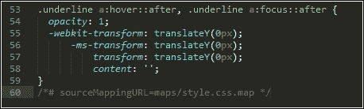

# 第十章：构建自定义处理器

使用 PostCSS 的一个关键好处是其模块化方法——我们不必使用一个大型的库，尤其是如果我们只需要使用其功能的一小部分！在本章中，我们将汇集我们在前几章中讨论的一些主题，并创建一个完全符合我们需求的完整预处理器。

我们将用它来编译一个简单网站的代码，探索使用它为 WordPress 等 CMS 系统，然后看看如何将其扩展到与 CSStyle 等框架一起工作。在本章中，我们将涵盖多个主题，包括以下内容：

+   创建我们的处理器

+   优化输出

+   添加源映射和供应商前缀支持

+   在一个简单的网站系统上测试最终的预处理器

+   将我们的预处理器扩展到使用 CSStyle 框架

让我们开始吧！

# 创建你的处理器

许多与现有处理器（如 SASS、less 或 Stylus）一起工作的开发者将习惯于使用一个必要的依赖库，并且不太可能使用他们选择的处理器提供的 100%的功能。

这并不是 PostCSS 的情况。一个主要的吸引力是其灵活性；我们不再需要携带那些对我们需求来说是冗余的处理器中的额外负担！灵活性的力量也可能是一个缺点，你可能会问，我们如何开始决定在我们的处理器中包含什么？

在本章的整个过程中，我们将汇集我们在演示中使用的处理器的各种元素，并探讨我们可以做出的改进或扩展功能的变化。然而，任何处理器的关键在于没有正确或错误答案；每个都会不同，并且它们将取决于你的需求。

随着时间的推移，你可能会发现可以在项目之间重用的常见元素，最终，作为开发者，找到满足你需求的组合取决于你。在此之外，让我们开始详细研究我们在最近示例中使用的处理器，并探索我们可以用来创建我们自己的版本的一些想法和技巧。

# 探索我们的处理器

作为本书中创建的演示的一部分，我们专注于确保插件已安装，并且我们有正确的文件在正确的位置。然而，还有一些东西缺失，那就是——文件中实际上发生了什么？为什么我们有特定的任务顺序？选择我们使用的某些插件背后的推理是什么……你大概明白了！

在接下来的几页中，我们将通过探索我们在一些最近示例中使用的处理器来尝试回答这些问题（以及更多），你会发现没有一种一刀切的方法，而更多的是根据你的需求进行工作，并选择适合你需求的插件。

在我们深入探讨之前，让我们快速回顾一下我们处理器的组成，从 `package.json` 文件开始。

## 解析 package.json 文件

`package.json` 文件告诉 PostCSS 使用哪些插件，并可能包含一些在编译期间使用的键配置设置：

```js
{
  "name": "postcss",
  "version": "1.0.0",
  "description": "Configuration file for PostCSS",
  "main": "index.js",
  "scripts": {
    "test": "echo \"Error: no test specified\" && exit 1"
  },
  "author": "Alex Libby",
  "license": "ISC",
  "dependencies": { "postcss": "⁵.0.8" },
```

我们处理器的上半部分包含许多关键属性，这些属性告诉我们有关版本、描述、创建者、任何依赖项以及项目使用的许可证等详细信息：

```js
  "devDependencies": {
    "autoprefixer": "⁶.0.3",
    "cssnano": "³.2.0",
    "gulp": "³.9.0",
    "gulp-postcss": "⁶.0.0",
    "gulp-rename": "¹.2.2",
    "gulp-sourcemaps": "¹.5.2",
    "postcss-reporter": "¹.3.0",
    "stylelint": "².3.7"
  }
}
```

与此相比，对我们来说关键部分在底部；这部分列出了我们项目中将使用的所有插件。在我们的许多项目中，我们在安装时安装了插件——插件将添加一个包含名称和所需最小版本（由 `^` 符号表示）的条目到此文件中。

值得注意的是，我们可以手动向此文件添加条目，或从该文件中删除条目，甚至在需要时将 `package.json` 文件从一个项目复制到另一个项目。如果我们知道新项目与现有项目具有相同（或非常相似）的需求，这尤其有用；插件在安装时只会将条目添加到此文件中，如果该条目尚未存在。

## 探索 Gulp 任务文件

`gulpfile.js` 文件是真正魔法发生的地方——它包含了对我们项目中每个样式表需要执行的所有任务。除了样式表之外，这是我们简单地从代码下载复制到项目区域的第二个文件。现在我们已经在使用它了，值得花点时间更详细地探索它的工作原理。

`gulpfile.js` 文件由几个部分组成——在我们的示例中，我们从一个定义每个插件的引用变量的列表开始：

```js
'use strict';

var gulp = require('gulp');
var postcss = require('gulp-postcss');
//var autoprefixer = require('autoprefixer');
var cssnano = require('gulp-cssnano');
var sourcemaps = require('gulp-sourcemaps');
var rename = require('gulp-rename');
var stylelint = require('stylelint');
var reporter = require('postcss-reporter');
var rucksack = require('rucksack-css');
```

我们列表中的第一个任务是最重要的一个——它将源代码拾取并编译成有效的 CSS 文件，并将其存放在 `dest` 文件夹中。作为此过程的一部分，我们提供了任何需要用于转换我们代码的 PostCSS 插件的链接——在这个例子中，我们使用 Rucksack，设置为包含回退支持但不添加供应商前缀：

```js
gulp.task('styles', function () {
  return gulp.src('src/*.css')
    .pipe(postcss([ rucksack({ fallbacks: true, autoprefixer: true }) ]))
    .pipe(gulp.dest('dest/'));
});
```

这个看起来复杂的任务实际上并不复杂——它根据设置的规则检查我们的代码的一致性，使用报告插件在屏幕上输出任何警告或错误。这里的关键是 `['styles']` 属性——这告诉 PostCSS 在样式任务完成之前不要执行此任务：

```js
gulp.task("lint-styles", ['styles'], function() {
    return gulp.src("dest/*.css")
    .pipe(postcss([ stylelint({
        "rules": {
          "color-no-invalid-hex": 2,
          "declaration-colon-space-before": [2, "never"],
          "indentation": [2, 2],
          "number-leading-zero": [2, "always"]
        }
      }),
      reporter({ clearMessages: true, })
    ]))
});
```

与此相比，接下来的两个任务相对简单直接——这个任务负责压缩我们的编译代码，并将其重命名为 `.min.css` 扩展名：

```js
gulp.task('rename', ['lint-styles'], function () {
  return gulp.src('dest/*.css')
    .pipe(postcss([ cssnano() ]))
    .pipe(rename('style.min.css'))
    .pipe(gulp.dest("dest/"));
});
```

此任务同样简单直接——它创建我们的样式表的源映射，并将其设置为 PostCSS 可以将其发布到我们项目区域 `dest` 文件夹中的文件格式：

```js
gulp.task('sourcemap', ['rename'], function () {
  return gulp.src('dest/*.css')
    .pipe(sourcemaps.init())
    .pipe(sourcemaps.write('maps/'))
    .pipe(gulp.dest("dest/"));
});
```

在任何 Gulp 任务文件中，最后两个步骤扮演着最重要的角色——第一个步骤将在命令行提示符中输入 `gulp` 时触发对每个任务的调用：

```js
gulp.task('default', ['styles', 'lint-styles',  'rename', 'sourcemap']);
```

这个任务虽然不是强制性的，但它会监视代码的任何更改，并自动触发 Gulp 文件中的任务。它将尊重任何设置的约束，尽管为了保持一致性，最好按照文件中显示的顺序列出正在执行的任务：

```js
var watcher = gulp.watch('src/*.css', ['styles',
'lint-styles', 'rename', 'sourcemap']);
watcher.on('change', function(event) {
  console.log('File ' + event.path + ' was ' +
event.type + ', running tasks...');
});
```

编译过程不仅仅是这两个文件——我们也应该考虑如何构建我们的工作环境。快速查看 Gulp 任务文件应该会揭示我们已经使用了一个简单的输入/输出方法；代码从 `src` 文件夹中提取，并在编译结束时将结果放入 `dest` 文件夹。

这是流程的重要部分——毕竟，如果我们不对项目区域的结构进行思考，使用 PostCSS 就没有好处！这包括保持源文件和编译文件之间的分离，也可能决定将图像缩小等任务纳入编译过程。在这个区域的结构上没有对错之分——这将由我们的项目需求决定。

# 分析处理器的问题

在放置了 Gulp 任务文件和相关的 `package.json` 文件后，我们应该可以顺利进行了，对吧？嗯，并不完全是这样——是的，我们的处理器在整本书的演示中都被使用，效果很好。但我们可以做得更多：我们的 Gulp 文件永远不应该是静态的；我们应该定期审查它，以确保它以最佳效率运行。

### 注意

要查看 Gulp 文件的更新版本，请查看随本书提供的代码下载中的 `T49 – fixing issues in Gulpfile` 文件夹。

我们的项目 Gulp 文件确实存在一些需要解决的问题，所以现在让我们来看看这些问题：

+   我们的一些任务命名不正确——例如，样式任务可以被重命名为更好地反映我们在该任务中使用 Rucksack。

+   关于源映射的使用有一个问题；到目前为止，我们使用了一个专用的源映射插件来创建它们。Gulp 4 的即将到来的更改将减少对插件的需求——创建它们的支持被添加到 Gulp 核心中，因此不需要经常使用单独的插件！

+   在重命名任务中，我们硬编码了一个 `style.min.css` 文件名作为输出；这并不适合所有需求，所以我们应该将其改为动态的。

+   在重命名任务中保持——我们将两个任务合并在一起，而它们应该被分成两个独立的过程。

+   看一下第 16 行样式任务中的处理器列表；现在这还不算太糟糕，但长期来看，它可能会变得很长且难以阅读！相反，我们需要更改它，以便在调用 PostCSS 的点上，我们可以使用数组来提供名称。

+   当创建源映射时，我们当前的设置提供了完整和压缩版本；这真的有必要吗？问题来自 `cssnano`，它会压缩它看到的每一个 `.css` 文件；这不是必要的，所以需要更改。

+   将`cssnano`的使用作为 PostCSS 中的一个任务运行正在引起问题——尽管以这种方式运行是有道理的，但它需要独立运行，以满足我们的需求。

+   我们应该决定是否使用一个专门的插件来提供供应商前缀支持，还是依赖使用可能已经内置了这一功能的其他插件。

+   在编译源文件时，我们的处理器正在生成两个最小化文件；一个是正确命名的，但另一个是为了开发目的而打算的不压缩版本。

在接下来的几页中，我们将探讨修复和改进我们的 Gulp 任务文件的方法——关键是要理解，虽然许多这些更改是针对我们的任务文件的，但它们也可能是你未来项目可能会遇到的问题。最重要的是，我们应该不断审查我们的生产过程，以确保它按需工作。

在我们将 Gulp 文件放在一个示例网站上测试之前，让我们开始修复和改进 Gulp 文件的过程。

## 修复我们的 Gulp 任务文件

不得不说，我们有一些问题需要解决——关键在于这些问题都不会阻止我们的编译过程；我们应该把它们看作是钻石的粗糙边缘，需要抛光才能使我们的过程更加闪耀（当然，这里是一个双关语！）。

### 注意

请注意，下一项练习中的行号指的是来自`T48 – existing processor`文件夹的源代码的*未修改版本*，在做出任何更改之前。如果您想保留现有文件的副本，请在开始练习之前将它们移动。

好的，让我们开始吧：有一些更改要做，所以我们将从关键任务开始，该任务编译源文件：

1.  为了这个过程，我们需要从代码下载中的`T48 – existing processor`文件夹中的`gulpfile.js`文件的副本；请将其保存为`gulpfile.js`到我们的项目区域根目录。

1.  我们需要做的第一个更改是启用文件中的`autoprefixer`支持——你应该在那里找到它，但在第 5 行被注释掉了；请继续移除注释。

1.  在第 16 行或附近，寻找以下行：

    ```js
    .pipe(postcss([ rucksack({ fallbacks: true, autoprefixer: true }) ]))
    ```

    我们不会包括回退支持，并将单独处理`autoprefixer`，所以现在，按照以下方式更改它：

    ```js
    .pipe(postcss([ rucksack(), autoprefixer() ]))
    ```

1.  我们接下来的更改是在 lint-styles 任务中——这里需要两个更改；首先，在 Rucksack 声明下方第 13 行添加以下代码块：

    ```js
    var stylerules = {
      "color-no-invalid-hex": 2,
      "declaration-colon-space-before": [2, "never"],
      "indentation": [2, 2],
      "number-leading-zero": [2, "always"]
    };
    ```

1.  接下来，将整个 lint-styles 任务替换为以下内容：

    ```js
    gulp.task('lint', ['styles'], function() {
      return gulp.src("dest/*.css")
        .pipe(postcss([ stylelint({ "rules": stylerules }), 
        reporter({ clearMessages: true })
      ]))
    });
    ```

1.  在重命名任务中，我们需要进行三个更改——首先，在第 38 行删除`cssnano`行；我们将任务拆分为两个，这将在新任务中处理。

1.  这个任务有一个先决条件，我们已经将其重命名——请将第 36 行改为以下内容：

    ```js
    gulp.task('rename', ['lint'], function () {
    ```

1.  接下来，按照指示更改重命名命令——这是在第 39 行：

    ```js
    .pipe(rename(renameFunction))
    ```

1.  在下一个任务`sourcemap`中，我们需要进行一个更改——在第 47 行或附近，按照以下方式更改该行：

    ```js
    gulp.task('sourcemap', ['rename'], function () {
      return gulp.src(sourceMapLocation)
    ```

1.  我们已经讨论了将最小化任务拆分出来——请在此处的`sourcemap`任务下方添加以下内容：

    ```js
    gulp.task('minifyCSS', ['sourcemap'], function () {
      return gulp.src('dest/*.min.css')
        .pipe(cssnano({ autoprefixer: false }))
        .pipe(gulp.dest("dest/"));
    });
    ```

1.  我们已经更改了任务名称，因此我们需要更新默认任务和监视设施——在 50 行和 52 行附近或周围查找方括号中的名称字符串。将其替换为以下字符串：

    ```js
    ['styles', 'lint' , 'rename' , 'sourcemap', 'minifyCSS']
    ```

1.  我们的任务监视器也可以进行减肥——没有必要两次指定所有任务！相反，按照指示更改代码——当进行更改时，监视设施将运行默认任务，该任务已经包含了必要的任务：

    ```js
    gulp.task('default', ['styles', 'lint' , 'rename' , 'minifyCSS', 'sourcemap']);

    var watcher = gulp.watch('src/*.css', ['default']);
    watcher.on('change', function(event) {
    ```

1.  我们几乎完成了——我们还需要在文件顶部添加一些额外的声明，以确保一切按预期工作。在步骤 *4* 中添加的 `stylerules` 声明下方，继续添加以下额外行：

    ```js
    var renameFunction = function (path) {
      path.extname = ".min.css";
      return path;
    };

    var sourceMapLocation = ['dest/*.css', '!dest/*.min.css'];
    ```

我们现在有一个更新的 Gulp 任务文件——我们现在需要将 `style.css` 从 `T49 – fixing issues in Gulpfile` 下的 `src` 文件夹复制到我们项目区域的根目录下的 `src` 文件夹。如果一切顺利，当我们编译文件时，我们项目区域的 `dest` 文件夹中应该会有类似的内容，并且在地图文件夹中有一个名为 `style.css.map` 的文件：


到目前为止，我相信你们肯定对我们所做的某些修改有一些疑问——演示突出了几个关键点，所以花时间详细探索这些内容是值得的。

### 小贴士

如果你在更改 gulp 文件时遇到任何问题，请查看本书附带的代码下载中 `T49 - fixing issues in Gulpfile` 文件夹中的完整版本。

## 理解所做的更改

在我们的演示过程中，我们对 Gulp 任务文件做了一些修改——需要注意的是，这些修改都不是强制性的。在做出这些修改之前，我们的任务文件运行得非常完美，所以如果不是强制性的，我们为什么要做出这些修改呢？

这个问题的答案很简单——使用像 Gulp 这样的任务运行器是为了自动化流程，以便你得到所需的内容。我们已经有这个了，但任务运行器产生了额外的文件，没有按预期压缩它们，并且我们的 Gulp 文件中包含了在同一任务内有多个步骤的任务。我们完成的工作是给这个过程添加一些润色——尽管我们的 Gulp 任务文件可以工作，但我们探索了如何通过调整一些流程来改进它。

我们从修改添加供应商前缀的方式开始——我们现有的任务在编译时使用 Rucksack 插件来完成这一部分。Rucksack 插件是为了提供回退支持——我不喜欢与旧浏览器一起工作，所以我们不需要它。这使得从这样一个大型插件中整合供应商前缀支持变得不那么有益，因此支持未启用。

### 注意

对于 PostCSS，还有一个处理供应商前缀的插件可用——`doiuse`，可在 [`github.com/anandthakker/doiuse`](https://github.com/anandthakker/doiuse) 找到。只是另一个尝试的选项！

lint-styles 任务运行良好——我们所做的更改集中在使任务文件中的代码更容易阅读。我们将配置块移动到文件开头，并重新排列了任务的格式；这意味着我们不应该需要更改任务，即使我们可能更改配置！

大多数剩余的更改集中在将多个角色拆分为单个任务，并纠正输出中的一些异常。我们的编译过程生成了一个带有正确扩展名的压缩文件，但也压缩了原始源文件。我们还以类似的方式生成了两个源映射文件——这显然不是理想的！我们现在所做的更改意味着我们的原始源文件没有被压缩，但只生成了一个压缩文件，并且在过程中创建了一个单一的未压缩样式表。

完美，我们现在有一个经过抛光的编译过程，在适当的时候生成正确的文件；接下来是什么？好吧，我们现在可以向我们的编译过程添加额外的功能。使用任务运行器如 Gulp 是关于自动化繁琐的任务，让我们更详细地探索我们可以实现什么。

# 优化输出

PostCSS 系统将非常乐意与其他插件友好地协作，无论是基于 Gulp 的，还是使用其他任务运行器，如 Grunt 或 Broccoli。这打开了一个真实世界中的可能性，仅限于您的想象力！不过，有一个小但重要的观点——它使得我们不仅优化处理器输出（如我们所做的），而且还需要对其进行微调，以确保我们添加了符合我们需求的功能。

那么，我们可以添加什么呢？好吧，这里有一个起点：压缩图片怎么样？另一个常见任务与添加响应式内容相关——我们在本书中已经使用 `postcss-responsive-type` 插件对此进行了介绍。我们可以进一步扩展，通过添加一个自动调整图片大小的任务；然后我们可以根据需要将这些图片用于响应式网站。

最终，这取决于您——随着时间的推移，您越来越习惯使用 PostCSS，您可能会发现自己比其他插件更频繁地使用某些插件。不过，这里的关键并不是简单地随意添加插件——相反，我们正在寻找那些我们会在我们的开发工作流程中经常使用的插件，并可以作为基本处理器的基石。任何需要支持特定项目的附加功能都可以在适当的时候添加。

一个很好的查找地方是 PostCSS 插件目录，位于 [`postcss.parts`](http://postcss.parts)——看看那里有什么，尝试一下是值得的！为了让我们开始，我们将探讨一些可能对您的处理器有用的想法，首先是改进对源映射的支持。

## 修改我们的源映射支持

如果我们回顾一下在*修复我们的 gulp 任务文件*练习之前我们的 gulp 文件，我们可以看到它确实工作，但它有一个主要的缺点。编译过程产生了一个额外的源映射文件，按名称进行了压缩，但实际上并没有！这显然是我们不需要的东西——对这个任务所做的更改将其转变成了我们现在拥有的样子：

```js
var sourceMapLocation = ['dest/*.css', '!dest/*.min.css'];
...
gulp.task('sourcemap', ['rename'], function () {
  return gulp.src(sourceMapLocation)
...
});
```

这是一个更好的版本——它只产生一个源映射文件，该文件未压缩；不需要压缩。话虽如此，我们仍然可以改进它；这只是一个通过查阅文档真正探索可用内容，并看看它是否可以帮助我们的简单问题。作为起点，尝试这个。

在编译我们的代码和创建源映射时，我们可能需要控制完整的 URL，例如，如果我们正在从测试环境转移到生产环境。在理想的世界里，我们会使用相对文件结构来避免这个问题，但对于那些不可能的情况，对我们的 Gulp 任务进行简单的更改就足够了：

```js
    .pipe(sourcemaps.write('maps/', {
      sourceMappingURLPrefix: 'https://www.mydomain.com/'
    }))
```

我们可以在下面的屏幕截图中看到结果：


最终，我们项目的需求将决定源映射支持需要如何配置——如果我们的项目需求要求，我们甚至可能需要将多个文件编译成一个更大的主文件。

然而，有一点需要注意——计划在 Gulp 4 中包含原生源映射支持；这可能会意味着不再需要单独的插件。了解变化是有益的，尤其是如果它可能影响我们的处理器！

### 小贴士

对于包含这些更改的我们的 Gulp 文件的完整版本，请查看随本书附带的代码下载中的`T50 - 调整源映射设置`文件夹。

在这里，让我们改变策略，改变源映射编译过程是一个简单的修改。我们可以通过另一个关键领域——供应商前缀来提高一个档次。我们已经涵盖了基础知识，所以我们将看看我们如何可以改进支持。

## 注意前缀

哎，前缀！任何设计师的噩梦：添加它们并保持它们更新确实是一项真正的苦差事。

已经在这些页面中出现的`autoprefixer`任务有助于减轻负担：它会添加当前的前缀并移除不再需要的任何前缀。这很好……但我们能做得更好！然而，这次的重点更少在于代码，而更多在于我们需要做出的决策：

+   您需要支持哪些浏览器版本？`autoprefixer`插件已经使用了来自[`caniuse.com/`](http://caniuse.com/)的数据，这对于大多数需求来说已经足够了。然而，我们可以调整我们的代码以使用 Browserslist（托管在[`github.com/ai/browserslist`](https://github.com/ai/browserslist)），以确定要支持哪些版本。例如，我们可能添加`> 5%`来限制支持到全球使用率超过`5%`的浏览器：

    ```js
    .pipe(postcss([ rucksack(), autoprefixer({browsers: ['last 2 versions']}) ])
    ```

    在一个理想的世界里，我会将其提高到 10%，但这可能有点过分了！

+   从一致性的角度来看，我们应该明确指出`autoprefixer`在 Rucksack 内部是`禁用`的——我的偏好是不在那里启用它，因为它可能会让人混淆，不知道哪个插件添加了前缀（考虑到`cssnano`也可以添加前缀）。为了纠正这一点，我们只需要更改这一行：

    ```js
    .pipe(postcss([ rucksack({autoprefixer: false  }),
     autoprefixer({browsers: ['last 2 versions']}) ])
    ```

这不是强制性的，但至少能使其清晰！如果我们想真正成为纯粹主义者，我们会将这项任务分成两个独立的任务，这样我们就能保持一个任务：一个角色咒语：

+   虽然`autoprefixer`可以处理冗余前缀的移除，但我们有一个有用的技巧可以使用：添加对`postcss-remove-prefixes`和`postcss-unprefix`插件的支援。这样做的原因很简单——在运行`autoprefixer`时，我们可能并不在一个公平的竞争环境中，因为我们的代码中可能缺少一些供应商前缀。添加这两个插件确保我们的代码在运行`autoprefixer`之前尽可能简洁。

+   如果我们的代码基于使用 SASS，那么有很大可能性正在使用 Compass 库——检查一下是否正在使用它来添加供应商前缀是有意义的。如果是的话，可能值得切换到使用`autoprefixer`，因为它报告称在移除代码方面更有效率。别忘了我们可以在运行 PostCSS 插件的同时在 Gulp 文件中编译 SASS 代码——我们将在本书的后面更详细地探讨这一点。

供应商前缀不断变化是不言而喻的；通过仔细规划和正确使用插件，我们可以放心地知道，无论发生什么，我们的代码将在下一次编译时得到更新。

现在，让我们继续前进：我相信您对无处不在的伪选择器，如 hover，已经很熟悉了。这是我们仔细考虑可能纳入基本处理器的内容的一个领域；PostCSS 有几个插件可以帮助我们在代码中处理伪选择器。让我们更详细地看看这一点。

## 添加对伪选择器的支持

在设计网站时，伪选择器是提供交互的关键部分——它们可以是简单的悬停，一直到更新的元素，如:range 或:placeholder。我们还得注意兼容性——幸运的是，大多数元素在合理近期的浏览器中都能正常工作（是的，甚至 IE8！），但不是所有浏览器在引用 CSS 中的选择器时都使用相同的单冒号或双冒号格式。

为了帮助样式化和提供一致性，PostCSS 提供了一些我们可以使用的选项；我们将在稍后探索使用`postcss-pseudo-elements-content`插件，但现在，让我们快速看看一些选项，以给你一个可用的感觉：

+   你经常发现自己需要在代码中添加`focus`伪选择器吗？如果答案是肯定的，那么`postcss-focus`插件可能会引起你的兴趣。该插件可在[`github.com/postcss/postcss-focus`](https://github.com/postcss/postcss-focus)找到，当编译代码时，它会自动添加`focus`伪选择器。样式将与`:hover`元素相同。

+   我们刚刚讨论了自动添加`focus`元素——开发者 Jonathan Neal 有了一个想法，创建一个 polyfill 来添加对`:enter`伪选择器的支持，这将替换代码中的`:hover`和`:focus`。当编译时，代码会将任何`:enter`实例转换为我们的代码中的`:hover`和`:active`样式。前往[`github.com/jonathantneal/postcss-pseudo-class-enter`](https://github.com/jonathantneal/postcss-pseudo-class-enter)了解更多关于此插件的信息。

+   下一个插件可以被委婉地描述为为那些有比编写链接样式更好的事情要做的人准备的。简单来说，这是一个真正的插件快捷方式！它会自动为所有与链接相关的类添加样式；浏览到[`github.com/jedmao/postcss-all-link-colors`](https://github.com/jedmao/postcss-all-link-colors)查看如何真正地偷懒的例子...

+   对于那些经常需要为表单按钮添加样式（说实话，谁不是呢？），那么来自[`github.com/andrepolischuk/postcss-pseudo-class-any-button`](https://github.com/andrepolischuk/postcss-pseudo-class-any-button)的下一个插件可能会引起你的兴趣：它允许我们使用`:any-button`选择器（这不是一个官方选择器）。当编译时，它会将其转换为四种不同类型——普通按钮和三个输入（重置、提交和按钮）。

这只是 PostCSS 生态系统中目前可用的少量插件中的一小部分，用于处理伪选择器。我们可以讨论如何使用它们，但现实中，了解它们有用性的最好方法是看到它们在实际中的应用！考虑到这一点，让我们看看一个实际应用的例子：`postcss-pseudo-elements-content`。这个小巧的插件只有一个目的：在我们的代码中，如果适当的选择器没有添加`content:`属性，就添加这个属性。

## 更新我们的代码

有几个插件示例可以帮助更好地处理伪选择器；我们的项目将决定我们是否应该根据每个案例使用它们，或者可以将其中一些或全部集成到我们的基本处理器中。

可能适合添加到我们的基本处理器的一个例子是`postcss-pseudo-elements-content`，它可以从[`github.com/omgovich/postcss-pseudo-elements-content`](https://github.com/omgovich/postcss-pseudo-elements-content)获取。这个简单的插件解析我们的代码，并在看到适当的伪选择器实例时，将`content: ''`语句添加到我们的代码中。它不需要任何配置，所以无需多言，让我们开始使用它：

1.  我们将像往常一样从安装插件开始——为此，打开一个 Node.js 命令提示符窗口，并将工作文件夹更改为我们的项目区域。

1.  在提示符中，运行此命令：

    ```js
    npm install postcss-pseudo-elements-content --save-dev

    ```

如果一切顺利，我们应该会看到类似以下内容：


1.  从本书附带的代码副本中，从`T51 - 添加前后内容`文件夹中提取`style.css`和`content.html`。将样式表保存到`src`文件夹中，将`content.html`保存到我们项目区域的根目录。

1.  打开位于我们项目区域根目录的`gulpfile.js`副本，然后在第 11 行添加此行：

    ```js
    var pseudoContent = require('postcss-pseudo-elements-content');
    ```

1.  有一点更往下，我们需要更新我们的第一个任务以允许额外的插件；按照指示更改该行：

    ```js
    gulp.task('styles', function() {
      return gulp.src('src/*.css')
      .pipe(postcss([ autoprefixer(), pseudoContent() ]))
    ```

1.  在 Node.js 命令提示符中输入`gulp`然后按*Enter*键——如果一切顺利，我们应该会在`dest`文件夹中看到我们的样式表文件和源映射。

1.  将此文件夹的内容复制到我们项目区域根目录的`css`文件夹中；如果我们预览`content.html`，我们应该会看到我们的菜单出现：

在某种意义上，这可以被视为一个快捷插件（与我们在本书早期使用的方式类似）。魔法在于在伪选择器后添加`–c`，如图中代码片段所示：

```js
.underline a:hover::after-c, .underline a:focus::after-c {
  opacity: 1;
  transform: translateY(0px);
}
```

当编译时，它会添加`content: ''`属性，如图所示：



虽然是否值得为这么小的事情添加插件是有争议的，但它至少确保我们在编译样式表时保持一致的代码库。

真正的决定是，你的代码是否有足够的伪选择器实例，值得将插件作为基本部分安装，或者如果你的项目需要根据具体情况使用。

让我们改变一下方向，我们之前提到的多数改进都与文本相关。没有图像的文本站点可能非常不吸引人——幸运的是，有一些插件可以帮助扩展我们的基本处理器，并更好地管理图像。我感觉一个演示即将到来，所以让我们更详细地探索这一点。

## 处理图像

如果我们将处理器视为仅用于编译 PostCSS 代码，那么我们可能低估了自己——我们已经介绍了如何使用 Gulp 这样的任务运行器添加额外的任务，如`autoprefixer`和`cssnano`。

一个值得考虑添加的功能是压缩我们的图片以获得最佳大小；你愿意手动进行，无论大小节省多少？我想你不会这么做。自动化这个过程意味着我们可以继续进行那些能增加过程价值的任务。我们可以通过来自[`github.com/sindresorhus/gulp-imagemin`](https://github.com/sindresorhus/gulp-imagemin)的`gulp-imagemin`插件来实现这一点——让我们看看在最小化我们的图片时可能涉及的内容：

1.  启动一个 Node.js 命令提示符窗口，然后更改工作目录到我们的项目区域。

1.  在提示符中输入两个命令，每个命令后按*Enter*键：

    ```js
    npm install gulp-imagemin --save-dev
    npm install imagemin-jpegtran --save-dev

    ```

    保持提示符打开——我们很快还会用到它。

1.  从本书附带的代码下载中，请从`T52 - optimizing images`文件夹中提取`gulpfile.js`和`package.json`文件的副本；将这些文件保存到我们项目区域的根目录。

1.  在我们项目文件夹的根目录下创建一个名为`img`的文件夹；这将被用作现有`dest`文件夹的临时替代。

1.  找一些大图片——它们应该是 JPEG 格式，理想情况下大小为几兆字节；大约四到六张图片就足够了。

1.  返回 Node.js 提示符，然后输入`gulp`并按*Enter*键——下面的截图显示了我在一些图片上执行的一个示例：

如果一切顺利，我们应该在`img`文件夹中看到我们新压缩的图片——这是一个在处理器中非常有用的任务，所以让我们更详细地讨论几个要点。

### 探索过程

图片压缩是高性能网站的关键——如果文本在几秒钟内出现，用户可能会感到厌烦，但图片出现需要更长的时间！然而，这种方法有几个需要考虑的点：

+   它并不特别快——压缩大约 2MB 大小的十几张图片还不错，但如果你需要压缩大量图片，这不会有所改善。

+   我们只支持 JPEG 图片——优化 SVG 和 PNG 图片是可能的，但这将需要更改我们的代码。如果我们仔细查看使用的代码，我们可以看到这一点：

    ```js
    var images = require('gulp-imagemin');
    var jpegtran = require('imagemin-jpegtran');
    ```

后者插件由`gulp-imagemin`自动安装，如果处理 SVG 或 PNG 图片，则需要更改：

+   本地执行的测试似乎表明，尺寸的减少并不像预期的那样好；我怀疑这将在更大的图片上得到改善。尝试改变压缩级别是值得的——确保你的源图片尽可能大！

一旦我们的图片已经针对大小进行了优化，我们就可以探索更多的选项——这里有一些值得考虑的：

+   在多设备发展的时代，我们需要我们的图片具有响应性；来自[`github.com/azat-io/postcss-responsive-images`](https://github.com/azat-io/postcss-responsive-images)的 gulp-responsive 插件可以帮助创建这些图片。

+   我们可能想使用精灵图代替。幸运的是，在 PostCSS 中添加精灵图支持很容易：查看 postcss-sprites 插件来完成这项任务。

+   你可能想考虑使用资产管理器来解析 URLs——postcss-assets 插件是这项任务的理想选择。使用方法和详细信息可在[`github.com/assetsjs/postcss-assets`](https://github.com/assetsjs/postcss-assets)找到。

需要注意的一个重要观点是——尽管有插件可以实现这个目的，但考虑压缩 HTML 并不值得；你不太可能获得任何显著的空间节省，而且代码将变得难以阅读。最好将压缩文件保留给那些必须链接到你的 HTML 页面的外部资源，以便获得最大的好处。

好的，让我们继续：在我们测试我们的处理器之前，还有一个可能值得考虑的想法。将自动重新加载功能添加到我们的代码意味着我们不需要重新加载页面来查看更新内容。这很大程度上依赖于 Chrome 的使用来使其工作，所以它可能不是每个人都需要的：让我们更详细地看看这会涉及哪些内容。

# 添加重新加载功能

添加重新加载功能可以减少在代码更改后手动重新加载页面所花费的时间；后者可能真的令人头疼，尤其是在处理复杂的 CSS 样式时！

这种方法的缺点是它只能在 Chrome 中工作——如果这不是问题，那么你需要遵循以下步骤来使它工作：

1.  我们首先从“T53 – 添加 LiveReload 功能”文件夹中提取`gulpfile.js`和`package.json`文件的副本，从本书附带的代码下载中。将这两个副本保存到我们项目区域的根目录下。

1.  从相同的“T53 – 添加 LiveReload 功能”文件夹中，提取并保存`src`文件夹内的`style.css`文件副本，到我们项目区域的根目录下的`src`文件夹。

1.  启动 Node.js 命令提示符，然后更改工作文件夹到我们的项目区域。

1.  在提示符中输入`npm install gulp-livereload –save-dev`并按*Enter*——让这个安装完成。

1.  从[`bit.ly/IKI2MY`](http://bit.ly/IKI2MY)下载并安装 Chrome LiveReload 小程序。

1.  在`sourcemap`任务末尾添加此行：

    ```js
    .pipe(plugins.livereload());
    ```

1.  删除第 60 行末尾的分号。

1.  将此行添加到我们的`watch`任务：

    ```js
    plugins.livereload.listen();
    ```

1.  我们的任务文件将如下所示，其中第 61 行和第 68 行进行了更改：

在这一点上，我们可以通过更改样式表来测试它是否工作——如果一切顺利，Gulp 将启动并重新编译我们的代码；如果我们正在浏览器中打开我们正在开发的网站，那么插件将自动重新加载。

### 注意

对于那些想要更详细地使用此插件的人，请参阅 GitHub 网站上提供的文档，网址为 [`github.com/vohof/gulp-livereload`](https://github.com/vohof/gulp-livereload)。示例中使用的完整代码版本位于本书附带的代码下载中的 `T53 - 添加 livereload 功能` 文件夹内。

好的，继续前进！我们几乎到达了探索可能的技艺的终点；在我们开始测试我们的处理器之前，我想给你留下一些你可能想要考虑在处理器中使用的新想法。所有这些都应该使用我们在这本书中看到的相同过程进行安装。

# 进一步扩展我们的处理器

在过去的几页中，我们探讨了多种改进现有处理器的方法，以及一些扩展功能性的想法。尽管我们总是可以坚持使用 PostCSS 插件，但我们面临的风险是限制“可能的技艺”，或者我们可用的选择。

有时候，我们可能想要走得更远一些——创建一个处理器不仅仅是关于编译代码的细节，还涉及到我们的工作环境以及支持它的过程（至少部分如此）。为了证明这一点，我们将以安装 `postcss-stats` 插件为例，展示我们如何扩展我们的插件和工作环境。

此插件有助于在编译项目时提供有关每个项目的有用统计数据——它基于 CSS Stats 系统，并在网上提供，网址为 [`www.cssstats.com`](http://www.cssstats.com)。

### 注意

在整个演示过程中，你可能会看到一些关于弃用警告的问题——在撰写本文时，该插件需要一点打磨/更新。不过不用担心：该插件在我们的演示中仍然可以正常工作。

该插件的源代码可在 GitHub 上找到，网址为 [`github.com/cssstats/postcss-cssstats`](https://github.com/cssstats/postcss-cssstats)，可以使用常规方式安装。让我们深入了解一下：

1.  我们将首先启动一个 Node.js 命令提示符会话，然后更改工作目录到我们项目区域的根目录。

1.  我们需要安装该插件，所以在提示符中输入以下命令并按 *Enter* 键：

    ```js
    npm install postcss-cssstats --save-dev 

    ```

保持打开状态——我们将在练习的稍后部分需要它。

接下来，我们需要更新我们的 `gulpfile.js` 和 `package.json` 文件——请从本书附带的代码下载中的 `T54 - 使用 cssstats` 文件夹中提取这两个文件的副本。将两个文件都保存到我们项目区域的根目录下：

1.  在我们的文件就绪后，我们现在可以测试它是否工作——请将同一文件夹中的 `style.css` 文件的副本保存到我们项目区域的 `src` 文件夹中。

1.  返回我们之前打开的 Node.js 命令提示符——在提示符中输入 `gulp`，然后按 *Enter* 键。

1.  PostCSS 将编译我们的代码——如果一切顺利，我们应该在现在熟悉的 `dest` 文件夹中看到文件……我们也应该看到类似下面的截图：

如果我是一个赌徒（我不是，但为了这个假设我就是这样）——我会打赌你可能在想“这一切文字究竟是什么意思？”好吧，让我来解释一下这一切的含义。

简而言之，我们安装了一个实际上是一个报告系统——它详细说明了我们代码的一组统计数据。它包含了各种信息的详细信息，包括选择器的数量、颜色、CSS 特异性级别、声明等。这是一种获取我们代码信息、作为记录以供以后使用的方法。它之所以如此容易获取信息，在于它的配置方式——看看 `gulpfile.js` 文件；我们将在顶部添加对插件的调用：

```js
var reporter = require('postcss-reporter');
```

然后，我们可以通过在末尾附近添加这一行来修改单个样式任务：

```js
    .pipe(postcss([ cssstats( function(stats) {
      console.log(stats);
    })
  ]))
  .pipe(gulp.dest('dest/'));
})
```

问题在于，虽然获取信息可能很容易，但存储它却不容易！我们可以绝对地改进它；而不是通过我们的处理器获取信息，我们可以直接从源获取。让我们看看如何实现这一点：

1.  我们将首先启动一个 Node.js 命令提示符，然后更改工作文件夹到我们的项目区域根目录。

1.  在提示符下，请继续输入 `npm install gulp-stylestats --save-dev`，然后按 *Enter* 键。

1.  现在，我们需要编辑之前练习中使用的 `gulpfile.js` 和 `package.json` 文件，所以请在文本编辑器中打开 `gulpfile.js` 文件，并在 `sourcemap` 任务的结束括号下方立即添加这些行：

    ```js
    gulp.task('stylestats', ['minifyCSS'], function () {
      gulp.src('dest/*.css')
        .pipe(stylestats({
          type: 'json',
          outfile: true
        }))
        .pipe(gulp.dest('dest/'));
    });
    ```

1.  接下来，我们需要更新默认任务——按照指示进行更改：

    ```js
    gulp.task('default', ['styles', 'lint', 'rename',
     'minifyCSS', 'sourcemap', 'stylestats']);
    ```

1.  返回 Node.js 命令提示符，然后输入 `gulp` 并按 *Enter* 键——假设我们仍然在项目区域的 `src` 文件夹中有相同的 `style.css` 文件，我们应该在我们的项目区域的根目录下的 `dest` 文件夹中看到这个文件：

1.  虽然我们显然需要更改 Gulp 文件的参数以防止它生成压缩的 JSON 文件，但我们至少可以看到（未压缩的）JSON 文件的结果。打开它——它看起来可能像这样：

虽然我们仍然只看到代码，但我们现在可以随意解析内容；例如，我们可以使用 jQuery 来探索内容，并使用适当的样式和格式将其渲染到屏幕上。我相信你也会同意，这确实是一种查看（和存储）信息的方法！插件需要最少的配置即可开始使用。我们可以用它来查看任何标准的 CSS 文件，一旦它通过了编译过程。

### 小贴士

我们可以使用 `gulp-stylestats` 插件的一组选项——有关详细信息，请参阅 `https://github.com/t32k/stylestats`。

好的，我们现在有一个完成的处理器；希望这也会包括一个运行中的风格指南，使用我们在上一个练习中讨论过的插件之一。是我们继续前进的时候了——在我们开始下一阶段的旅程之前，我们还需要完成一个任务。是时候对我们的处理器进行测试了…

# 测试最终的预处理器

在本书中，我们探索了许多不同的插件和概念来构建处理器；在过去的几页中，我们将这些概念整合到了我们处理器的最终版本中——至少是我们可以开始使用的版本。

剩下最后一个关键步骤需要完成——我们已经为简单的练习编译了代码，这效果很好，但并不能真正代表我们作为开发者可能会经历的过程！为此，我们需要构建一个真实世界的例子，并让我们的处理器经受考验。

幸运的是，我们可以从本书附带的代码下载中找到一个示例网页——让我们看看如何将它的样式表代码通过我们的处理器。我们将先运行之前做过的正常任务，但会添加一些插件以使示例更加真实：

1.  我们将首先从本书附带的代码下载中提取`T55 - testing our processor`文件夹的副本；将其保存到我们项目区域的根目录。

1.  将此子文件夹中的`gulpfile.js`和`package.json`文件复制到我们项目区域的根目录。

1.  启动一个 Node.js 命令提示符，然后更改工作文件夹到我们的项目区域。

1.  在提示符中，输入以下三行，每行输入后按*Enter*键：

    ```js
    npm install postcss-nesting --save-dev
    npm install postcss-short-color --save-dev
    npm install postcss-pixrem

    ```

1.  将`T55 – testing our processor`下的`css – completed version`文件夹中的`site.css`文件复制到我们项目区域的根目录下的`src`文件夹。

1.  返回 Node.js 会话，然后在提示符中输入`gulp`并按*Enter*键——等待它完成编译。

1.  当编译完成后，将`dest`文件夹的内容复制到`T55 – testing our processor`中的`css`文件夹。

1.  尝试预览编译文件的成果——如果一切顺利，我们应该看到类似于以下截图的内容：

尝试调整浏览器窗口大小，或者在浏览器中启用响应式设计模式（如果支持的话）——我们应该看到内容会根据你为浏览器窗口设置的大小自动流动或调整大小。总体来说，这是一个成功的成果！

问题是——这里发生了什么？如果我们查看我们的代码，细心的读者应该会注意到增加了三个插件，以及编译版本中大量额外的代码；让我们花点时间来消化我们练习的结果。

## 消化我们的练习结果

如果我们仔细查看我们的 Gulp 任务文件，其中不应该有太多令人惊讶的内容——许多使用的任务我们在书中已经多次使用过。

然而，关键在于，尽管我们可以运行之前已经使用过的标准处理器，但它可能不太适合所有场合。更有可能的是，我们可以将其作为基础（如前所述），然后根据需要添加任何额外的插件。这个的好处是，大多数配置工作已经完成——它保持了我们对工作的持续方法。剩下的只是安装我们尚未安装的任何插件——我们当然拥有其中大部分，但需要安装三个额外的插件，如这里所示：

```js
gulp.task('styles', function () {
  return gulp.src('src/*.css')
    .pipe(postcss([ rucksack({ fallbacks: true }), autoprefixer(), shortcolor, nesting, pixrem ]))
    .pipe(gulp.dest('dest/'));
});
```

这些必须在我们的 Gulp 任务文件顶部进行相关调用：

```js
var nesting = require('postcss-nesting');
var shortcolor = require('postcss-short-color');
var pixrem = require('pixrem');
```

相应地，这些插件如下：

+   **背包**：这是为了处理响应式/媒体查询，将 rgba 颜色从十六进制中回退，并实现 `@font-face`。

+   **Pixrem**：可在 [`github.com/robwierzbowski/node-pixrem`](https://github.com/robwierzbowski/node-pixrem) 获取，它负责为我们样式表中的 rem 单位值提供回退机制。

+   **嵌套**：可以从 [`github.com/jonathantneal/postcss-nesting`](https://github.com/jonathantneal/postcss-nesting)（通过 Node）下载，这涵盖了我们在代码中使用的嵌套实例。

+   **简写颜色**：在几个实例中，我们将 `background-color` 和 `color` 属性以简写形式结合在一起，该插件随后将其转换。您可以在 [`github.com/jonathantneal/postcss-short-color`](https://github.com/jonathantneal/postcss-short-color) 上了解更多关于此插件的信息。

我们当然可以添加更多，并继续转换我们的代码——还有其他一些地方可以应用嵌套，例如在控制我们导航样式的规则中。但关键在于，成功衡量的是我们不得不改变处理器**默认**设置的多少——在这个例子中，我们根本不需要改变它！我们当然添加了需要更改处理器中一行代码的额外插件，但其他所有任务都不需要任何更改。

正是在这个阶段，我们实际上已经完成了创建我们处理器的旅程——严格来说，我们的旅程应该始终被视为没有尽头；这将有助于确保我们的工具保持最新。尽管如此，还有一些有用的技巧，我们可以在创建处理器时使用，所以让我们花点时间更详细地介绍这些技巧。

# 从一些提示和技巧开始入门

现在是时候轮到开发者们开始创建自己的处理器了！这可能会在最初看起来是一项艰巨的任务，取决于项目的规模和性质；我列出了一些提示，以帮助您克服规划和创建处理器的初步障碍：

+   每个处理器都是独特的——不要害怕实验。处理器当然必须满足您的需求，但破解坚果的方法有很多，所以如果您尝试的第一个插件不起作用，那么继续尝试另一个。

+   不要陷入许多人都会犯的陷阱，将 PostCSS 视为预处理程序或后处理程序；它既不是也不是。库本身不做任何事情；魔法在于你添加的插件，它们决定了它的性能。

+   从小开始——PostCSS 是设计成模块化的，所以如果你一开始只需要一个添加供应商前缀的功能，那就没问题。随着时间的推移，你可以轻松地向你的处理器添加额外的插件；无论是添加到现有功能，还是替换不再高效或工作的旧流程，都没有关系。

+   考虑迭代性——不要试图一次性转换像 WordPress 样式表这样大的东西！你很快就会失去耐心和动力，并且可能会在获得 PostCSS 的好处之前放弃项目。

+   处理器唯一应该被淘汰的时候是，如果你的项目架构发生了根本性的变化，使其与 PostCSS 不兼容。PostCSS 的多功能性使得这种情况不太可能发生——你应该定期审查功能，以确保你从处理器中获得最佳效果。插件会更改、被弃用，或者添加新的插件——检查将确保你的解决方案尽可能高效地工作。

+   任何处理器都不应该仅限于 PostCSS 插件——尽管这是我们关注的焦点，但还有数千个其他插件可供你选择的任务运行器使用，它们很可能与 PostCSS 兼容。关键在于，如果它有助于自动化一个可以节省你作为开发者时间的日常任务，那么应该考虑是否可以将它包含在你的处理器中。

+   我个人认为，如果可以可靠地自动化，那么就包括一个任务——我们生活在一个时间宝贵的时代；例如，如果可以自动处理，手动调整图片就没有价值！

+   尽管我们已经讨论了一些可以使用任务运行器完成的任务，但我们不能忘记文件夹结构。最糟糕的事情莫过于为不同的环境编译文件，例如，如果它们最终落在组织混乱的文件夹中！Gulp 可以自动化大量任务，所以我们需要做的更改越少，或者需要复制的文件越少，就越好。

希望这些建议能帮助你开始！关于 PostCSS 的好处是，没有两个处理器会是相同的；虽然有些人可能认为这是一个缺点，但应该注意的是，有大量的可能性等待探索，你可以根据项目需求将处理器做得尽可能简单或复杂。

在我们结束构建自定义处理器的旅程之前，我们应该考虑一些事情。我们的处理器完全使用 PostCSS 插件构建；实际上，我们的处理器更有可能经历一个过渡阶段，从 SASS 或 less 等转换到使用 PostCSS。

为了帮助这个过程，我们可以始终使用像 CSStyle 这样的库——这个有趣的小宝石可以与 SASS 或 PostCSS 一起工作，并且可能是过渡过程中的一个有用补充。在接下来的两章中，我们将学习如何创建自定义语法，并探索一些我们可以通过相同的过程处理 PostCSS 和 SASS 内容的方法。作为即将到来的内容的预览，让我们快速浏览 CSSStyle，看看它是如何实际工作的。

# 介绍 CSStyle 库

回想一下第三章，*嵌套规则*，其中我们探讨了 BEM 背后的概念，或者说是块、元素、修饰符编写 CSS 的方式。使用这种方法的关键好处是帮助减少 CSS 的特定性，或者我们可能否则会使用以下内容来为简单的按钮设置样式：

```js
#maincontent .button .red.large:hover
```

好吧，这有点牵强，但你应该明白了：特定性的级别使得管理和将来在项目中重用变得尴尬。

我们考虑了 BEM 作为可能的替代方案——它有将样式减少到一到两个类的优点，但可能难以记住使用哪些约定：

```js
.component {
  /* represents a component */
}

.component__element {
  /* represents a small part that is used to make a component */

}

'.component--modifier {
  /* represents a state modifier for the component */
}
```

好吧，那么我们如何解决这个问题呢？嗯，这里有一个我们可以考虑使用的选项：CSStyle 库。有几个原因可以说明为什么这可以帮助我们——让我们更详细地看看。

## 探索使用 CSStyle 的好处

CSStyle（可在[`csstyle.io/`](http://csstyle.io/)获取）的关键在于它由模块化块组成，类似于 BEM 的风格。然而，区别在于，我们不需要记住一组不太直观的约定，而可以使用更简单的集合来创建更干净的代码。

但真正的美在于，我们可以使用 SASS 或 PostCSS 来创建我们的网站——我们可以从 SASS 开始，但也可以开始过渡到使用 PostCSS，而只需进行最小更改。让我们将其付诸实践，并探索一个快速演示，看看进行这些更改有多容易——在我们这样做之前，请查看[`codepen.io/alibby251/pen/pgmqjJ`](http://codepen.io/alibby251/pen/pgmqjJ)；这是一个 Pen，展示了我们将要创建的内容：


它不会赢得任何风格奖项，但这个演示的目的是向您展示*过程*，而不仅仅是产生令人惊叹的东西！考虑到这一点，让我们开始：

1.  我们将从从本书附带的代码下载中提取`T56 - 使用 csstyle 与 sass`文件夹的副本开始；将文件夹保存到项目区域的根目录中。

1.  将`T56 - 使用 csstyle 与 sass`文件夹内的`src`文件夹的内容复制到项目区域的根目录下的`src`文件夹中。

1.  将项目区域根目录下的`gulpfile.js`和`package.json`文件替换为`T56 - 使用 csstyle 与 sass`文件夹内的副本。

1.  启动一个 Node.js 命令提示符会话，然后更改工作文件夹到我们项目区域的根目录。

1.  在提示符下，输入 gulp 并按 *Enter* 键——如果一切顺利，我们应该在我们的项目区域 `dest` 文件夹中看到一个编译后的 `style.css` 文件。

1.  将 `dest` 文件夹的内容复制回 `T56 - using csstyle with sass` 文件夹内的 `css` 文件夹。

在这一点上，尝试在浏览器中预览结果。如果一切顺利，我们将看到三个按钮出现，就像我们在本练习开始时提到的笔中显示的那样。

一切看起来都很顺利……我们有一个可以运行的演示，有一个编译后的样式表——但是等等……在 *SASS* 中？是的，如果你仔细看，演示确实设置为使用 SASS，但这是有原因的：我们将看到在不改变我们的样式表或编译过程的情况下使用 PostCSS 是多么容易。让我们开始吧：

1.  在我们项目区域根目录下的 `gulpfile.js` 中，注释掉第 5 行，取消注释第 6 和第 7 行；这会将我们的任务文件从使用 SASS 切换到使用 PostCSS。

1.  将第 9 行的 `[sass]` 任务重命名为 `[style]`。

1.  在第 10 行，`gulp.src` 调用正在寻找 SASS 文件；将其更改为 `src/*.css`。

1.  将第 11 行替换为这一行：`.pipe(postcss([nested, csstyle]))`——这消除了对 SASS 的依赖，并切换到使用 PostCSS。

1.  在第 15 行，我们的默认任务将调用 `[sass]` 任务；将 `[sass]` 更改为 `[style]`。

1.  将第 17 行的监视任务更改为监视 CSS 文件，而不是 SASS：

    ```js
    var watcher = gulp.watch('src/*.css', ['style']);
    ```

1.  好吧，打开我们项目区域根目录下的 `src` 文件夹中的 SASS 样式表——将文件重命名为 `style.css`。

1.  在 `style.css` 中，请移除样式表顶部的 `@import 'csstyle'` 行。

1.  进行搜索和替换 `@include`——在我们的样式表中移除所有实例。

我们的演示就到这里，很抱歉让您失望，如果您期待更多的话！剩下的只是将项目区域根目录下的 `gulpfile.js` 和 `package.json` 文件替换为 `T57 –` `using csstyle with postcss` 文件夹中的副本，并按正常方式编译。

## 分析我们的演示

从 SASS 转换到 PostCSS 可以像我们让它变得一样简单或复杂。使用 CSStyle 库可以在很大程度上简化从现有处理器（如 SASS）的转换过程。

尽管我们的演示只是对使用 CSStyle 的快速浏览（我们将在 第十二章，*混合预处理器*）进行回顾），但它仍然说明了几个重要的要点：

+   该库使用组件、选项、部分和微调的概念来创建基本组件，传递样式以覆盖基本规则，添加额外元素（如图标），或微调代码。精心设计意味着我们可以减少或消除在转换为使用 PostCSS 过程中修改 HTML 的需要。

+   完全可以使用标准的 SASS 编译器编译我们演示的 SASS 版本；选择使用任务运行器版本（在这种情况下是 Gulp）的原因是，我们可以将编译过程集中在一个任务文件中，并消除在过程中使用单独编译器的需求。

+   当计划我们的网站设计或过渡到使用 PostCSS 时，在 PostCSS 中选择插件要小心；这将决定我们在代码和处理器中做出更改的难易程度。

+   我们的演示重点在于核心编译过程，并且没有包括过去使用的额外任务，例如添加源映射。这纯粹是为了清晰起见——我们没有理由不能在确认我们的编译过程按预期工作后，添加之前使用的剩余任务。

然而，使用这个库的目的是帮助简化过渡到使用 PostCSS 的过程。有不同的方式来处理这个问题——使用 CSSStyle 意味着我们必须完全重新设计我们的 HTML，但可以轻松地以最小的麻烦更改处理器。另一方面，我们可以使用模仿 SASS 编码标准的 PostCSS 插件，或者创建我们自己的自定义语法——我们将在下一两章中探讨这些概念。

# 摘要

创建我们自己的处理器可以是一种令人满意的经验——我们完全控制应该包含哪些元素，并且可以在任何时候添加或删除元素。在整个本书的过程中，我们探讨了构成可能典型处理器的多个元素；在本章中，我们将所有这些元素结合起来创建我们的最终文章。让我们花点时间回顾一下我们已经学到的内容。

我们首先回顾了我们处理器的一些关键元素，我们之前已经使用过，但并没有真正详细了解它们是如何结合在一起的。考虑到这一点，我们继续检查我们处理器的一些问题，然后找出纠正这些问题和修改我们代码的方法。

在我们的更新处理器到位后，我们研究了通过改变现有功能或包括可能或可能不构成基线处理器或针对特定项目定制的选项来优化我们的输出的方法。然后我们研究了扩展我们的功能，包括我们通常不会考虑的选项，但将完美补充我们的工作流程。

然后，我们在本章的最后，快速测试了我们的处理器在一个示例网站上，然后探索了一些有助于我们创建处理器的提示和技巧。我们旅程的最后一站是快速查看 CSSStyle 库，作为创建 PostCSS 自定义语法的先导，我们将在下一章中探讨。
