# 第十一章。操作自定义语法

虽然许多开发者已经从使用预处理器转向使用 PostCSS，但重要的是要注意，PostCSS 并不是替代品，而是一种预处理 CSS 样式的替代方法。为了帮助过渡，我们不必学习新的语法。通过使用一些插件，我们可以利用 PostCSS 的速度，同时仍然使用我们习惯的语法，如 Less、SASS 或 Stylus。

在本章中，我们将探讨使这成为可能的插件，并工作于一些简单的示例，展示在使用 PostCSS 时，我们仍然可以使用我们所有人都熟悉的自定义语法。

本章将涵盖以下技术主题：

+   介绍自定义语法

+   实现自定义语法插件的示例

+   解析 CSS

+   使用 API 将内容转换为字符串

+   为我们的代码添加高亮支持

让我们开始吧！

# 介绍自定义语法

W3Schools 将 CSS 语法定义为如下：

> *"一个 CSS 规则集由一个选择器和声明块组成：选择器指向你想要样式的 HTML 元素。声明块包含一个或多个由分号分隔的声明。"*

作为开发者，我们花费许多小时来制作网站；这可以是从一个单页联系卡片型网站到大型电子商务网站的各种大小。我们决定使用哪种样式，或者我们如何到达那里，并不重要：关键是最终结果必须使用我们多年来一直喜爱的相同标准语法。

这并不意味着我们的源应该使用标准的 CSS，实际上，如果这是唯一的选择，这将非常受限！我们可以使用 SASS 或 Less 等库，但相反，为什么不直接使用 API 和自定义语法插件来操作我们的样式呢？我们之前在第八章中提到了一些原则，即*创建 PostCSS 插件*；现在是时候回顾一下，并探索我们如何开始消除这种限制。

你可能会问，我们为什么要这样做？答案很简单——让我们假设一下，你为 WordPress 创建主题。WordPress 的默认主题是使用 SASS（和 PostCSS）创建的；这意味着以某种形式依赖于 SASS。我们可以通过使用`gulp-sass`插件来稍微减轻这一点，但这仍然使用`libsass`来编译代码。

如果我们能将其颠倒过来，并使用解析 SASS 代码并将其转换为 PostCSS 等价的 API 和自定义语法插件，会怎样呢？好吧，承认吧，我们可能无法涵盖所有样式；但我们至少可以开始转换一些样式，并减少我们对 SASS 的依赖。让我们开始吧。在我们开始编写代码之前，我们有一个简单的管理任务要执行：我们需要首先安装一个语法高亮器。

# 准备我们的环境

在本章的整个过程中，我们将直接与 PostCSS API（或插件的个人 API，如果有的话）进行工作。由于我们直接在 CSS 上工作（而不是简单地通过插件配置对象），安装一个与 PostCSS 兼容的语法高亮器是有意义的。

并非每个文本编辑器都有，但如果你恰好使用 Sublime Text，并且安装了 Package Control 功能（并且我假设这本书中的演示就是这样），那么它有一个适用于 PostCSS 的荧光笔可供安装。该插件可在[`github.com/hudochenkov/Syntax-highlighting-for-PostCSS`](https://github.com/hudochenkov/Syntax-highlighting-for-PostCSS)获取。让我们按照以下步骤安装它：

1.  打开 Sublime Text，然后按*Cmd* + *Shift* + *P*（OS X）或*Ctrl* + *Shift* + *P*（Linux/Windows）以打开命令面板。

1.  从出现的列表中，点击**Package Control: Install Package**。

1.  几分钟后，它将显示一个新的列表；开始键入`Syntax Highlighting for PostCSS`：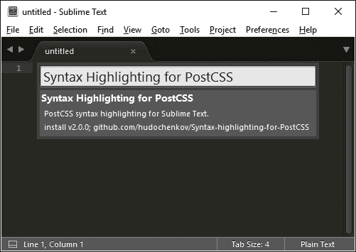

1.  当它出现时，点击它进行安装；完成需要几分钟。

当然，我们可以简单地使用一个与 JavaScript 兼容的荧光笔；但这不会完全一样：有一个专为 PostCSS 设计的荧光笔将使编辑代码更容易！

我们刚刚安装的语法高亮器自带了一个主题。如果你喜欢自己动手，那么你可以这样做，使用 Base16 网站[`chriskempson.github.io/base16/`](http://chriskempson.github.io/base16/)。

好的，让我们继续前进；是时候深入代码了。让我们先探索一些可用于在 PostCSS 中解析代码的插件。

# 实现自定义语法插件

根据最后的统计，PostCSS 生态系统包含超过 100 个插件；这个数字还在增加。这些插件将满足不同的需求，但它们有一个共同点：它们用来转换我们代码的过程。

现在，我们应该清楚，这种相似性是在一个非常高的层面上；我们并不是指每个插件的详细技术细节！除此之外，当我们创建自己的自定义语法时，我们必须遵循一个三步过程：

1.  我们首先通过解析器处理我们的代码。

1.  然后，我们使用任何一种插件对其进行转换。

1.  我们最终将其转换为字符串，或者将其转换为字符串格式的有效 CSS。

我们已经有一系列插件，允许我们在 PostCSS 环境中使用其他语法；这些包括如 less 或 JavaScript 等语言：

| 插件名称 | 插件用途 |
| --- | --- |
| `sugarss` | 这个插件是一个基于缩进的语法，类似于 SASS 或 Stylus。插件可在[`github.com/postcss/sugarss`](https://github.com/postcss/sugarss)获取。 |
| `postcss-less` | 我们可以使用这个插件将 less 转换为有效的 CSS。注意：它不会编译代码。插件可在[`github.com/webschik/postcss-less`](https://github.com/webschik/postcss-less)获取。 |
| `postcss-js` | 任何与 JavaScript 一起工作的人都可以使用这个插件用 JS 编写样式或转换 React 内联样式、Radium 或 JSS。插件可以从 [`github.com/postcss/postcss-js`](https://github.com/postcss/postcss-js) 获取。 |
| `postcss-scss` | 对于使用 SASS 的您，这个插件非常适合处理 SASS 代码；它不会将代码编译为 CSS。插件可以从 [`github.com/postcss/postcss-scss`](https://github.com/postcss/postcss-scss) 获取。 |
| `postcss-safe-parser` | 这个插件非常适合查找和修复 CSS 语法错误。您可以从 [`github.com/postcss/postcss-safe-parser`](https://github.com/postcss/postcss-safe-parser) 下载。 |
| `poststylus` | 我们可以使用这个插件将使用 Stylus 库创建的样式转换为有效的 CSS。注意：它不会编译代码。插件可以从 [`github.com/seaneking/poststylus`](https://github.com/seaneking/poststylus) 获取。 |

虽然所有这些插件都服务于不同的目的，但它们都遵循相同的原理：解析代码并对其进行转换，然后再将其转换为可以保存为有效样式表输出的格式。

不论我们使用哪个解析器，但有一个问题：我们为什么要直接操作我们的代码呢？需要直接修改代码的原因有几个；以下是一些：

+   我们可能想创建一份报告，详细说明有关我们代码的事实和数字，供参考之用；确实，已经有插件或脚本可以做到这一点，但 PostCSS 可以在编译期间为我们提供基本功能，而不是作为一个单独的过程。

+   这个想法怎么样？如果你恰好使用 Adobe Color CC 这样的应用程序，那么我们可以考虑使用 API 直接将特定颜色转换为有效的 RGB(A) 或 HEX 等价值。我们可以使用一个插件来实现这一点，但直接使用 API 执行此操作可以让我们在颜色选择上保持灵活性。

+   没有任何阻止我们剖析现有插件，并将它们执行的任务重新基座为我们可以添加到任务运行器文件中的内容，然后根据我们的需求进行适配。我们最终可能会考虑创建一个插件，但如果所需的步骤非常具体，那么插件可能不是一个有用的补充。

+   有时候错误处理可能会不足。API 包含一些有用的功能，允许我们在进程失败时在屏幕上添加适当格式的消息。

这些只是一些启动想法，除了操作现有的非 PostCSS 样式（例如使用 SASS 创建的样式）之外。

谈得够多了，我感觉一个演示即将到来！我们已经遇到了一些可用的插件，所以是时候将它们用于实际用途了；其中两个特别有趣的是 `postcss-scss` 和 `postcss-safe-parser` 插件。让我们深入探讨并更详细地查看它们，从 `postcss-safe-parser` 开始。

## 解析内容和修复错误

在接下来的几页中，我们将简要介绍使用几个解析器插件，以展示如何轻松地转换我们的代码。我们将查看一个插件，它消除了对 SASS 的需求（至少在基本级别上）；在这样做之前，让我们首先探索使用 `postcss-safe-parser` 插件。

可从 [`github.com/postcss/postcss-safe-parser`](https://github.com/postcss/postcss-safe-parser) 获取的 `postcss-safe-parser` 插件，非常适合查找和修复 CSS 错误。这是一个简单易用的插件，让我们开始使用它：

1.  我们将首先安装插件，所以请启动一个 Node.js 命令提示符会话，然后更改工作目录到我们的项目区域根目录。

1.  在提示符下，输入以下命令，然后按 *Enter* 安装插件：

    ```js
    npm install postcss-safe-parser --save-dev

    ```

1.  接下来，请从本书附带的代码下载中提取 `T58 – 解析无效内容` 文件夹的副本；将其保存到我们的项目区域根目录。

1.  将 `package.json` 和 `gulpfile.js` 文件从其中复制到我们的项目区域根目录。

1.  切换回 NodeJS 命令提示符会话，然后在提示符下，输入 `gulp` 并按 *Enter*。

如果一切顺利，我们应该看到成功的编译：在项目区域根目录中创建一个标记为 `output.css` 的文件。

好的，打开它。尽管我们的示例只包含一个格式错误的选择器，但文件中包含相同的选择器，但这次添加了缺失的闭合括号。我们还可以在下面的屏幕截图中所见的同时，在控制台日志中看到结果：

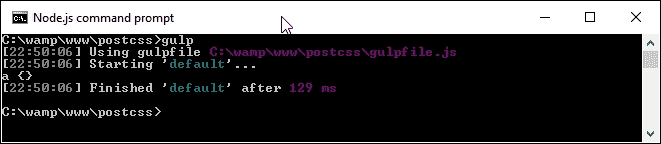

那么，这里发生了什么？嗯，其中一些可能很熟悉。我们在 Gulp 文件中使用标准格式任务，以及一些我们已遇到的插件的引用，例如 `autoprefixer`。

然而，我们感兴趣的内容在默认的 Gulp 任务中，如下面的屏幕截图所示：

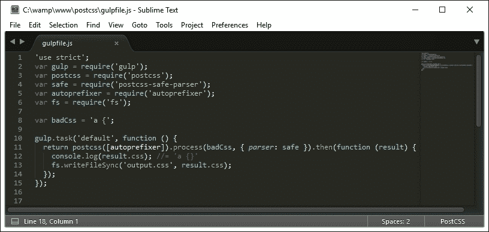

这个任务可能看起来有点复杂，但实际上，我们在操作它之前解析了我们的 CSS。我们首先定义一个 `postcss` 对象（向其中发送一个运行 `autoprefixer` 的请求）。然后，使用解析器找到并修复任何问题，将 CSS 处理成 AST，在屏幕上显示，并在我们的项目区域中创建一个名为 `output.css` 的文件。

### 注意

**抽象语法树**（**AST**）是我们 CSS 样式表或代码的语法结构的图形树表示。

好的，我们的示例非常简单，但这是为了向您展示原理。在下一个示例中，使用了相同的原则将标准 SCSS 代码转换为有效的 CSS；请注意，但我们没有调用 SASS（如我们之前所做），而是将 SCSS 代码转换为有效的 CSS 样式。

## 解析 SCSS 内容

在我们之前的演示中，我们探讨了使用 PostCSS 解析我们的 CSS，并添加了缺失的闭合括号作为修复代码的解决方案。这是一个简单的例子；如果你使用的是标准 CSS，那就再合适不过了，但如果你项目使用的是 SASS 呢？

好吧，作为我们下一个示例的一部分，我们将证明使用编译器已经过时了；我们将使用`postcss-scss`插件（来自[`github.com/postcss/postcss-scss`](https://github.com/postcss/postcss-scss)）直接转换我们的 SASS 代码，在展开嵌套样式之前使用`postcss-nested`插件（可在[`github.com/postcss/postcss-nested`](https://github.com/postcss/postcss-nested)）：

1.  我们将首先安装`postcss-scss`插件。启动一个 NodeJS 命令提示符会话，然后更改工作目录到我们项目区域的根目录。

1.  在提示符中输入此命令，然后按*Enter*键：

    ```js
    npm install postcss-scss --save-dev

    ```

    插件安装完成后，保持会话打开：

    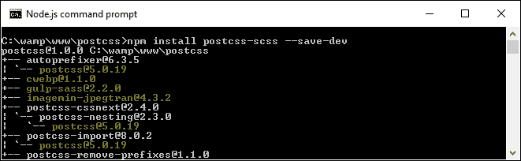

1.  从本书附带的下载代码中，从`T59 – 解析 SCSS 内容`文件夹中提取`package.json`文件的副本。将其保存到我们项目区域的根目录。

1.  从相同的`T59 – 解析 SCSS`内容文件夹中，将`src`文件夹的内容复制到我们项目区域根目录的`src`文件夹。

1.  在一个新文件中，添加以下代码并将其保存为`gulpfile.js`，存放在我们项目区域的`src`文件夹中：

    ```js
    'use strict';
    var gulp = require('gulp');
    var postcss = require('postcss');
    var fs = require('fs')
    var autoprefixer = require('autoprefixer');
    var nested = require('postcss-nested');

    var scss = fs.readFileSync('src/styles.scss', 'utf-8');

    gulp.task('default', function () {
      var syntax = require('postcss-scss');
      postcss([ autoprefixer, nested() ]).process(scss, { syntax: syntax }).then(function (result) {
        fs.writeFileSync('dest/styles.css', result.content);
      });
    });
    ```

眼尖的你们中的一些人会发现对`postcss-nested`的引用。我们不指定任何内容就不能调用 PostCSS，所以我们将使用此插件来展开我们代码中的嵌套语句：

1.  返回 NodeJS 命令提示符会话，然后输入以下命令并按*Enter*键：

    ```js
    npm install postcss-nested --save-dev

    ```

1.  一旦 Node 完成了插件的安装，在提示符中输入`gulp`然后按*Enter*键：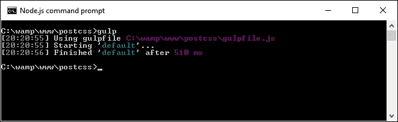

1.  如果一切顺利，我们将在`dest`文件夹中看到一个编译后的文件：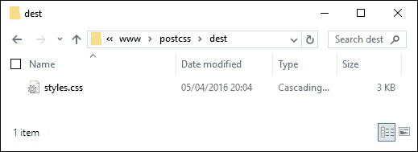

但等等：这是一个有效的*CSS*文件，对吧？绝对正确。但是……到目前为止，我们不得不使用编译器来生成有效的 CSS 代码；为什么现在我们不需要添加一个呢？

## 探索发生了什么

好吧，答案在于转换过程——传统上我们不得不编译我们的代码，尽管标准 SASS 文件是当前 CSS 的超集。相反，我们只是简单地使用一种语法来*重写*我们的代码，这种语法可以将标准 SCSS 文件转换为有效的 CSS。

如果我们更详细地查看我们的 Gulp 文件，我们可以看到对标准`gulp-postcss`插件的引用，以及`fs`、`autoprefixer`、`postcss-nested`和`postcss-scss`插件的声明实例。这个演示的关键从第 10 行开始，在那里我们声明了`scss`变量的实例，并使用 Node 的**文件系统**（**fs**）插件将文件内容读入这个变量。

一旦进入任务，我们创建一个 PostCSS 实例作为对象，然后向它提供`autoprefixer`和`nested()`插件（作为变量）。然后我们使用`postcss-scss`插件附带的语法处理我们的 SASS 代码，然后将内容作为文件通过管道输出到我们的项目区域的`dest`文件夹。

看见了吗？简单又容易；周围没有 SASS 编译器！这个简单的更改消除了对编译器的任何依赖，毕竟，SCSS 文件只是标准的 CSS 文本文件，所以为什么还要使用编译器呢？在所有关于解析 CSS（或者 SCSS）的讨论中，花些时间探索我们所说的含义以及它对整个过程的重要性是值得的。

# 解析 CSS

在编写任何自定义语法的核心是解析内容的能力——这无关紧要这是 CSS、JavaScript 还是其他什么；在我们能够做出更改之前，我们显然需要了解我们正在处理的内容！在基本层面上，当我们使用 PostCSS 处理 CSS 时，我们必须采取以下步骤来转换我们的 CSS：

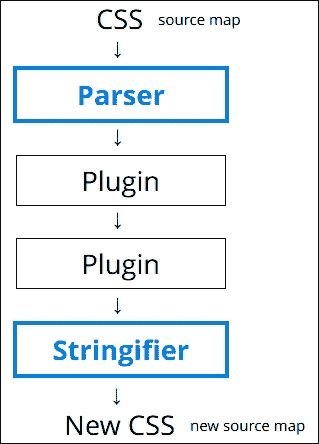

我们从源 CSS（可能带有或没有源映射）开始，我们只解析一次，但随后通过任何指定的插件（示例中显示两个，但我们可以轻松使用更多）。然后我们使用字符串化器将输出转换为字符串；在这个时候，我们可以在屏幕上查看内容或将它们保存到磁盘。

让我们暂时看看解析一些示例代码。在这个下一个示例中，我们将使用一个 CSS 规则，并使用`postcss-value-parser`插件（来自[`github.com/TrySound/postcss-value-parser`](https://github.com/TrySound/postcss-value-parser)）来解析它；原因很快就会变得清楚：

1.  从本书附带的代码下载中，从“T60 – 解析颜色值”文件夹中提取并保存`gulpfile.js`和`package.json`文件的副本到我们的项目区域根目录；如果您想保存那里现有的任何文件，请先这样做。

1.  启动一个 NodeJS 命令提示符会话，然后更改工作文件夹到我们的项目区域根目录。

1.  我们需要安装`postcss-value-parser`插件，所以在提示符下，输入以下命令然后按*Enter*：

    ```js
    npm install postcss-value-parser --save-dev 

    ```

    NPM 现在将安装插件；在完成时保持会话打开：

    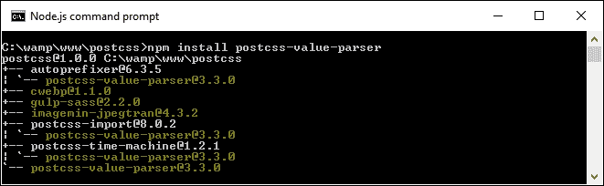

1.  在提示符下，键入`gulp`然后按*Enter*；现在 gulp 将消失并显示内容，看起来可能像这样：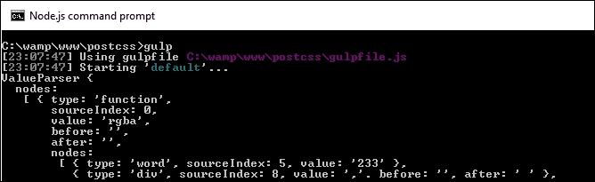

哎呀！这一切意味着什么？别担心，看起来比实际情况更糟；这是一个 AST 的例子，我们之前在本章中讨论过。这为我们提供了关于 CSS 内容的深入信息，例如值、值的类型以及它们在树中的位置。

然而，好的一点是，一旦我们有了所有这些内容，我们就可以随意查询和操作内容。一旦我们操作了内容，我们就需要将其转换为字符串格式，以便以更智能的格式在屏幕上显示，或者保存到磁盘。

对于这个演示，我们使用了 `postcss-value-parser` 插件来创建我们的抽象语法树（AST）；我们也可以尝试使用 `postcss-safe-` `parser` 插件（来自 [`github.com/postcss/postcss-safe-parser`](https://github.com/postcss/postcss-safe-parser)），或者 `postcss-selector-parser` 插件（来自 [`github.com/postcss/postcss-selector-parser`](https://github.com/postcss/postcss-selector-parser)），以实现类似的效果。

至于为什么我们在演示中只使用了一行 CSS 代码？嗯，解析 CSS 代码可能会变得非常复杂。我们演示中的例子相对简单；想象一下如果有 2,000+ 行代码会是什么样子！

让我们进一步开发这个主题，并使用它来替换一些示例 RGBA 值为等效的基于十六进制的颜色。我们可以通过使用 `postc` `ss-unrgba` 插件（来自 [`github.com/jonathantneal/postcss-unrgba`](https://github.com/jonathantneal/postcss-unrgba)）轻松做到这一点，但它有近 60 行代码；我们的 Gulp 文件有 43 行，其中很多是注释！

## 替换 RGBA 颜色

我们接下来的例子是一个相对简单的搜索和替换；这是一个很好的例子，说明了并不总是需要使用插件，我们可以直接解析代码以实现相同的效果。让我们开始吧：

1.  我们将首先从本书附带的下载代码中提取 `T61 – 更改颜色` 文件夹的副本；将文件夹保存到我们的项目区域根目录。

1.  将 `gulpfile.js` 和 `package.json` 文件从 `T61 – 更改颜色` 文件夹复制到我们的项目区域根目录。

1.  将 `src` 文件夹从 `T61 – 更改颜色` 文件夹复制到我们的项目区域根目录。

1.  接下来，启动一个 NodeJS 命令提示符会话，然后更改工作文件夹到我们的项目区域根目录。

1.  现在，我们需要安装一个额外的插件，`color-convert`（可在 [`github.com/qix-/color-convert`](https://github.com/qix-/color-convert) 获取），我们将使用它从抽象语法树（AST）中提取细节后更改颜色。为此，请启动一个 NodeJS 命令提示符，然后更改工作文件夹到我们的项目区域根目录。

1.  在提示符下，输入 `npm install color-convert --save-dev` 并按 *Enter*。

1.  当插件安装完成后，请输入 `gulp` 并按 *Enter*。如果一切顺利，我们应能看到现在熟悉的转换后的样式表出现在目标文件夹中：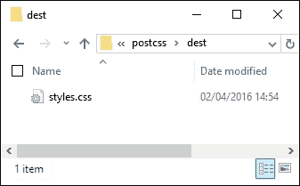

到目前为止，我们的样式表已经发生了转换。如果我们在一个文本编辑器中预览结果，我们可以确认确实用十六进制等效值替换了原始的 RGBA 颜色，如下面的截图所示：

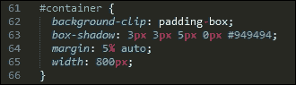

还不放心？看看源文件中的相同规则；这里显示了原始的 RGBA 值：

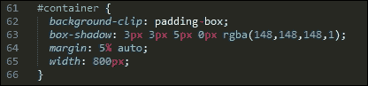

看起来很简单？有一点需要注意；如果我们看一下 Gulp 文件，乍一看可能觉得我们还在使用几个插件。关键在于这三个都是 Node 的部分（`fs`、`path`和`util`），所以我们没有安装任何新的插件，除了`value-parser`和`color-convert`示例之外。

## 探索它是如何工作的

值得花时间更详细地考虑这段代码。它包含了一些有用的技术，这些技术将帮助你开始创建自定义语法，从检索我们需要的值开始。

我们首先读取样式表文件的正文内容，然后通过`postcss-value-parser`插件对其进行解析。我们遍历 AST 中的每个节点，忽略任何包含`node.type`为函数或`node.value`为`rgba`的节点。对于剩下的节点，我们收集任何具有单词类型的节点，然后将它们映射到一个单一的数组值中，并将其转换为数字。

然后将其从函数节点转换为单词节点，在我们最终将值从 RGBA 转换为 HEX 颜色之前。内容被转换为字符串，并保存到目标文件夹中的同一文件名。

### 注意

节点类型代表我们正在处理的选择器类型——例如包括`root`、`string`、`tag`和`attribute`。在我们的例子中，我们使用了`node.type`来显示选择器类型的字符串表示形式，我们可以在代码中对其进行操作。

好的，让我们继续：使用自定义语法的关键基础是理解我们需要处理的内容；破解这一点，你就已经是在将你的样式转换为有效 CSS 的一部分了。不过，为了帮助这个过程，我们需要将我们的内容转换为可以保存到磁盘的格式。现在是时候看看如何使用 PostCSS API 来实现了。

# 使用 API 格式化输出

当解析 CSS 时，默认输出将类似于以下截图所示：

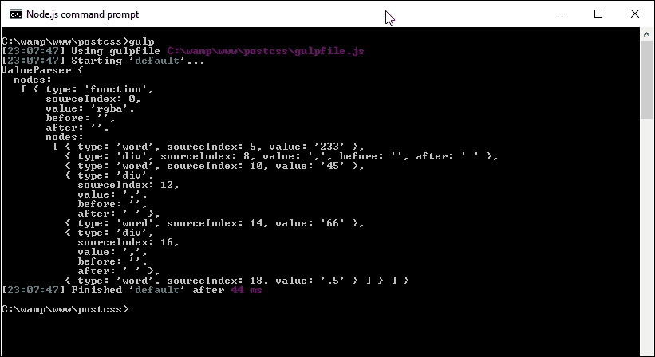

它看起来真的很乱，但实际上它是 AST 树的标准格式。问题是，如果我们想在代码中使用其中的细节，它并不太有帮助！为了解决这个问题，我们需要将我们的内容转换为字符串格式：最简单的方法是使用`.toString()`方法，这对于将内容保存到磁盘来说非常合适。

下一个练习的所有代码都包含在这本书附带的代码下载中的`T62 – 添加一个字符串化器`文件夹里。

在我们的 Gulp 文件中使用它非常简单；让我们在下一个练习中看看：

1.  我们将首先创建一个新的 Gulp 任务文件。在你的首选文本编辑器中，添加以下代码；涉及的内容相当多，所以我们将分部分进行，从插件声明开始：

    ```js
    'use strict';
    var gulp = require('gulp');
    var postcss = require('postcss');
    var util = require('util');
    var autoprefixer = require('autoprefixer');
    var fs = require('fs');
    ```

1.  我们需要设置一些变量；这些将在编译过程中生成值：

    ```js
    var newValue = 'white', result, selectors = [], root, decl;
    ```

1.  接下来是任务的开头。第一步是解析一些简单的 CSS，作为我们的演示的基础。然后我们获取代码中的第一个子元素，并将其保存到`decl`变量中：

    ```js
    gulp.task('default', function () {
      root = postcss.parse('a { color: black }');
      decl = root.first.first;
    ```

1.  我们想要的第一条信息是选择器数量；接下来的这个块将使用`root.walkRules`遍历每个选择器，并将值推入`selectors`数组：

    ```js
      // get a selector count
      selectors = [];
      root.walkRules(function (rule) {
        selectors.push(rule.selector);
      });
    ```

1.  到目前为止，我们已经准备好输出代码的总结报告——我们使用`console.log`在屏幕上显示多个不同的值：

    ```js
      console.log("\nThe declaration type is: " + decl.type);
      console.log("The value of this declaration is: " + decl.toString());
      console.log("Number of nodes in this CSS: " + root.nodes.length);
      console.log("Selectors used in this CSS: " + selectors.toString());
    ```

1.  我们几乎完成了——在这个下一个块中，我们执行了 PostCSS 的搜索和替换操作，将我们的颜色从黑色更改为白色：

    ```js
      // Replace color black with white
      root.walkDecls(function (decl) {
        if ( decl.value.match(/^black/) ) {
          decl.value = 'white';
        }
      });
    ```

1.  我们可以在屏幕上显示我们的内容，但一个更有用的步骤是将它保存到磁盘上——为此，我们可以使用 Node.js 的`fs`插件来创建我们的转换后的 CSS 文件和相关的源映射：

    ```js
      // display content on screen and save to file
      result = root.toResult({ to: 'all.css', map: { inline: false } });
      console.log("Updated color value: " + decl.value.toString() + "\n");
      fs.writeFileSync('dest/styles.css', result.css);
      fs.writeFileSync('dest/styles.css.map', result.map);
    });
    ```

1.  将 Gulp 文件保存到我们的项目区域的根目录，然后启动一个 Node.js 命令提示符，并将工作目录更改为我们的项目区域。

1.  在提示符下，键入`gulp`，然后按*Enter*键，等待编译完成。

    如果一切顺利，我们应该在屏幕上看到第 6 步的结果，如下所示：

    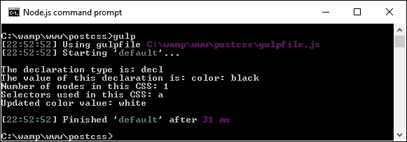

    转换后的 CSS 文件和源映射将出现在`dest`文件夹中：

    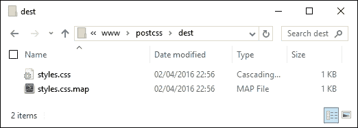

那么，这一切是如何帮到我们的呢？嗯，直接解析我们的代码的能力打开了一些真正的可能性；让我们暂停一下，看看我们的演示中发生了什么，以及我们如何在未来的项目中利用这个功能。

## 分析我们的示例代码

在整本书中，我们使用了各种插件来转换我们的代码。这些都会以某种形式使用 PostCSS API。然而，我们不仅限于简单地使用插件；我们还可以直接使用 API 来转换我们的代码。此时，应该注意的是，我们不是在谈论创建一个自定义解析器；实际上，这很容易形成一个足够的内容，足以写一本短书！

看一下 Gulp 文件可能会让一些人望而却步。确实，创建一个自定义语法来解析使用 Stylus 或 less 创建的代码并不容易，并且超出了本书的范围。然而，我们可以利用一些 API 来查询我们的内容。在我们的示例中，有两个代码块值得关注。

第一个块解析每个选择器并保持计数。我们可以使用`.walkRules`方法遍历每个规则：

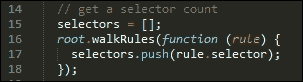

一旦我们有了原始信息，我们就可以将其转换为字符串（或将其转换为字符串），然后再在屏幕上显示内容：

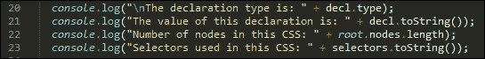

值得注意的是，PostCSS API 包含了将我们的 CSS 字符串化和组合在一起的功能。这些被称为 Stringify 和 Builder 命令；这些命令仅用于创建自定义语法时使用。我们只是简单地使用为这个目的设计的现有插件解析了我们的内容，所以使用 `toString()` 对于我们的需求来说是足够的。

继续前进——我们的示例被故意保持简单，以说明这个过程。我们可以轻松地添加额外的功能。API 参考文档在 [`github.com/postcss/postcss/blob/master/docs/api.md`](https://github.com/postcss/postcss/blob/master/docs/api.md) 是一个很好的起点。比如，添加错误检查怎么样？我们已经从其中添加了一个选项，以源映射的形式；让我们更详细地简要介绍这一点。

## 添加源映射

在我们的大多数演示中，我们包含了一个创建 CSS 样式源映射的任务。到目前为止，它工作得非常好，但这并不是最终答案——我们可以做得更好！为了了解可能的情况，请再次查看上一个演示中使用的 Gulp 任务文件中的最后一部分代码（应该在 33 到 36 行左右）：

```js
// display content on screen and save to file
result = root.toResult({ to: 'all.css', map: { inline: false } });
...
fs.writeFileSync('dest/styles.css', result.css);
fs.writeFileSync('dest/styles.css.map', result.map);
```

在这里，我们正在创建一个版本的转换后的代码，可以保存到文件。`{inline: false}` 阻止在代码中直接创建源映射。相反，我们使用 NodeJS 的文件系统根据 `result.map` 创建源映射；这包含了我们转换后的代码内容。

使用这种方法时有一些需要注意的点；更多细节，请查看主 PostCSS 网站 [`github.com/postcss/postcss/blob/master/docs/source-maps.md`](https://github.com/postcss/postcss/blob/master/docs/source-maps.md)。

是时候改变方向了：到目前为止，我们一直专注于编写代码，但关于展示呢？这并不是完全必要的，但设置突出显示有两个好处：它使我们的代码更容易编辑，我们还可以用它来在电子文档中提供一致的主题。毕竟，我相信您至少做了后者……不是吗？

# 突出显示我们的语法代码

在我们的大多数演示中，我们专注于使用插件，对配置代码以供使用所需的更改很少。这并没有什么问题，但就像往常一样，我们可以做得更好。比如，安装支持突出显示怎么样？

这确实是一种使我们的代码更容易阅读的简单方法，我们确实应该很久以前就安装这样的东西！除此之外，修复起来也很容易；支持广泛的各种编辑器。为了本章节的目的，我将假设您正在使用 Sublime Text；这是一个示例，看看它可能的样子（截图显示了正在使用的 Twilight Light 主题）：

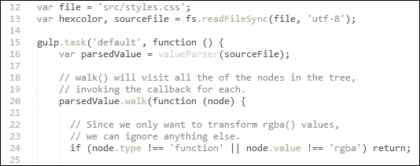

让我们深入探讨如何使用 Sublime Text 的包管理器来设置此环境。

## 安装主题

当使用像 Sublime Text 这样的编辑器时，添加主题支持非常简单。让我们一步步来完成：

1.  我们首先打开一个命令提示符会话。请继续添加此命令，然后按 *Enter* 键：

    ```js
    cd %APPDATA%\Sublime Text 3\Packages\User

    ```

1.  接下来，输入此命令，然后按 *Enter* 键：

    ```js
    git clone git://github.com/chriskempson/base16-textmate.git Base16

    ```

1.  打开 Sublime Text。如果一切顺利，当我们点击 **首选项** | **颜色方案** | **用户** 时，我们应该看到一个新菜单项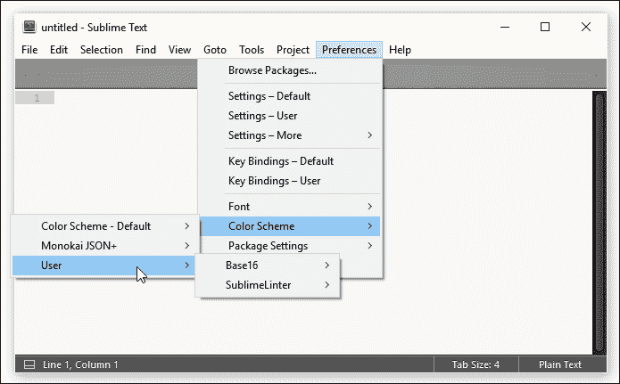

这是一个简单的更改，但非常有用；尽管如此，这仅仅是我们能做的事情的一部分！如果我们想（字面上）大干一场，我们可以将类似的样式应用到我们的 CSS 样式中。如果我们想在线记录样式，这将使阅读变得更加容易。毕竟，颜色显然比黑白更容易阅读！让我们花点时间来探索将颜色主题应用到我们的文档代码中所需的内容。

## 创建 HTML 显示主题

开发代码的一部分是需要对其进行文档记录。这不仅是为了我们的理智，也是为了未来的更改，以防其他人需要修改我们的代码！创建打印文档现在已经过时，更好的方法是创建在线文档，这样我们可以轻松更新它而无需太多麻烦。同时，我们可以在其中添加一些颜色，使其在视觉上更加吸引人，并为我们的努力提供更一致的格式。

我们可以手动创建这段代码，但这是一个资源密集且容易出错的过程！相反，我们可以使用 Midas 库（可在 [`midasjs.com`](http://midasjs.com) 获取）来自动化创建我们文档的基础，并且我们可以使用之前练习中提到的 base16 主题之一来对其进行样式化。

让我们开始安装这个支持：

1.  我们首先启动一个 NodeJS 命令提示符，然后更改工作文件夹到我们的项目区域。

1.  在提示符中，输入此命令，然后按 *Enter* 键：

    ```js
    npm install midas --save-dev 

    ```

1.  安装完成后，请从 `T63 – incorporating midas` 文件夹中提取 `src` 文件夹以及 `gulpfile.js` 和 `package.json` 文件，然后将它们保存到我们项目区域的根目录。

1.  回到 NodeJS 命令提示符，然后输入 `gulp` 并按 *Enter* 键。

1.  Gulp 将退出并编译我们的代码的基于 HTML 的提取，生成 `styles.html` 文件，该文件已使用额外的标记进行了适当的格式化。该文件将出现在我们项目区域内的 `dest` 文件夹中。

在这一点上，如果我们查看该文件的目录，它看起来会很普通；这很容易解决！为此，我们将使用 Timothée Poisot 的 Brewer 主题，可在 [`github.com/chriskempson/base16-builder/blob/master/schemes/brewer.yml`](https://github.com/chriskempson/base16-builder/blob/master/schemes/brewer.yml) 获取；要实现这一点，涉及几个步骤：

1.  浏览到[`github.com/ben-eb/midas/blob/master/templates/template-light.css`](https://github.com/ben-eb/midas/blob/master/templates/template-light.css)，然后在我们的项目区域的`dest`文件夹中将其保存为 CSS 文件。

1.  在文本编辑器中打开它；它包含了一系列用于可用 base16 主题的占位符。我们通常会使用 Ruby 生成这些主题之一的 CSS，但这并非完全必要；相反，使用您编辑器的搜索和替换功能，将每个占位符与相应的颜色匹配：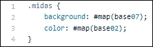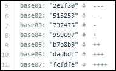

1.  保存结果；为了使其工作，我们需要调整`styles.html`文件的内容，以便引用新的样式表，使其具有正确的 HTML 结构。一旦完成，它将看起来像这样：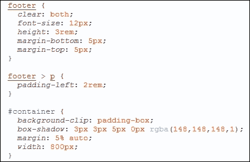

我认为这看起来更有吸引力，我相信你会同意！虽然创建初始主题需要一些工作，但这将是每个主题创建的一次性过程。对 CSS 规则或声明所做的任何更改都可以自动生成，并且 HTML 结果会相应更新。

# 摘要

我们首先快速介绍了自定义语法，然后为开发代码准备我们的环境。然后，我们介绍了一些可用于解析内容的插件，并在实施两个示例之前，探讨了为什么我们可能需要直接解析自定义语法或样式，以展示如何操作我们的代码。

我们随后深入研究了大多数 PostCSS 插件如何修改我们的代码。然后，我们在考虑我们的更改对代码本身的影响之前，探索了一些直接修改样式的技术。

接下来，我们研究了如何为屏幕或准备保存到磁盘的状态格式化内容（包括创建源映射）。我们注意到，尽管有一些特定的方法可用，但这些方法是为自定义语法开发保留的，而我们使用的选项足以满足对代码的初始操作。

然后，我们通过查看如何为我们的项目添加高亮支持来结束本章——我们探讨了添加此功能的原因，例如使代码编辑更容易，并展示了一个使用 Midas 库创建项目正确布局文档的快速演示。

使用不同的语法是一种很好的方法，可以消除将现有代码重写为有效 CSS 的需求。不过，有一个问题：如果我们混合了标准 CSS 和预处理器代码，比如来自 less 或 Stylus 的代码，会发生什么？我们能否同时处理这两种代码？当然可以！在下一章中，我们将探讨支持这一功能的 Pleeease 库。
