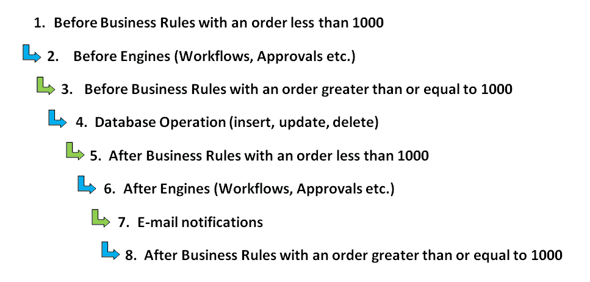
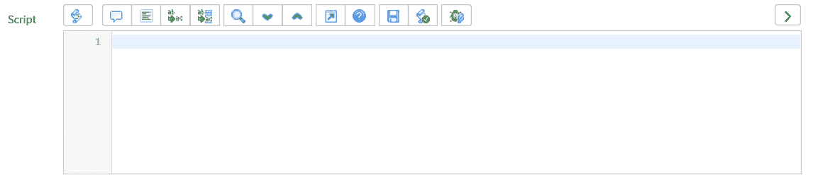

# 第一章：入门指南

欢迎您。在这本书中，我希望教会您并提高您的 ServiceNow 脚本技能，以确保您真正成为一名脚本大师。我将展示何时使用脚本配置和定制 ServiceNow 以实现您的目标。基于 ServiceNow 的 glide 类，还将探讨并解释客户端和服务器端脚本。

通过 Jelly 脚本和定制页面进行深入，本书还将探讨调试和最佳实践，最后介绍如何构建您自己的定制应用程序。

在本章的开头，我们将探讨何时适合编写脚本，以及为什么应该使用脚本，以及如何配置或定制 ServiceNow 实例。我们还将探讨 ServiceNow 中的基本脚本类型及其运行时机。本章还将涵盖 ServiceNow 脚本的运行顺序、脚本简介以及用于脚本的脚本编辑器。

本章我们将涵盖的主题包括：

+   配置与定制

+   在 ServiceNow 中何时编写脚本

+   脚本类型

+   ServiceNow 中脚本的执行顺序

+   脚本基础知识

+   脚本编辑器

# 配置与定制

ServiceNow 实例很复杂。它们可以通过许多方式改变，而且通常，使用不同的技术实现相同目标的方法有很多。这些更改可以通过配置和定制来完成。

配置使用 ServiceNow 界面来设置规则、条件和其他配置，如全局系统属性和过滤器。这通常是通过一系列下拉列表来完成的。

我们可以在以下业务规则示例中看到这一点：


图 1.1：来自业务规则的配置示例

在 *图 1.1* 中，我们可以看到筛选条件和基于筛选设置值的条件。此配置示例不使用代码，并且比定制更可取。这种筛选类型在 ServiceNow 平台上随处可见。

大多数系统管理员将能够仅通过配置来管理他们的实例。配置后的实例可以在实例上满足一定级别的功能，如果您试图实现配置可用的目标，这通常是最佳选择。

定制是指管理员使用脚本允许实例执行配置本身无法单独完成的进一步任务。ServiceNow 非常开放，在加载和提交表单时在多个点编写脚本的能力使其非常灵活。

一种定制可能是编写一个脚本，在字段上添加日期验证，并在输入错误值时显示消息或清除字段。定制脚本应由创建者管理，因为 ServiceNow 不负责代码。因此，如果您开始进入定制路线，请确保您知道自己在做什么。

由于创建者需要维护创建的脚本，他们还需要确保脚本在 ServiceNow 实例升级后仍然能够运行。

如果要自定义现有的 ServiceNow 脚本，而不是直接自定义脚本本身，请复制它，重命名复制的脚本，并停用现有的脚本。然后你可以对新的复制脚本进行任何你喜欢的更改，同时保留原始脚本以防万一需要。

# 要编写脚本还是不要编写脚本？

对于新管理员来说，知道何时编写脚本可能很困难。对于程序员来说，由于在 ServiceNow 中有许多编写脚本的机会，所以在需要之前就编写脚本可能很容易。然而，尽可能不编写脚本会更好。

如果你可以通过配置而不是编写脚本来实现，那么这应该是你的首要考虑。这允许工具以预期的方式使用，并在升级实例时让你准备得更充分。不仅如此；使用配置而不是自定义的主要原因之一是为了维护。配置可以由不同的管理员轻松维护，而自定义则需要一些对脚本及其逻辑的基本了解，因此它们往往更难维护和调试。记住，一旦开始自定义，维护该自定义就是你的责任。

如果你发现自己仅用配置无法实现目标，那么你应该考虑编写脚本。尽管配置是你的最佳选择，但脚本在大多数实例上提供了许多高级功能。几乎所有的成熟实例都会进行一定程度的脚本编写，但那些表现更好的实例是在适当的时候进行了脚本编写的。

例如，如果你想要显示、隐藏、使字段必填或只读，这可以通过客户端脚本或 UI 策略来完成。如果你只需要根据字段中的值执行一项操作，那么在这种情况下，UI 策略是更好的选择，因为它可以在不使用脚本的情况下实现目标。然而，如果你需要根据登录用户是否具有特定角色来执行操作，那么你需要使用脚本。脚本可以在 UI 策略中完成，但在此场景中，我通常选择客户端脚本。

尽可能避免编写脚本。配置实例而不是编写脚本有许多好处，并使实例更容易维护。

# 脚本类型

在 ServiceNow 中，你可以编写许多不同的脚本，它们运行的时间通常决定了哪种脚本最好。然而，所有这些脚本都将分为两大类。这些是客户端脚本和服务器端脚本。

这两种脚本类型将在后续章节中进一步探讨，但在这里我们将先看看基本定义：

+   客户端脚本将在用户面前运行，基于用户在网页上接收到的数据，通常是一个表单或列表，在这种情况下不需要表单提交。这些脚本只能使用作为网页一部分加载的数据来运行它们的脚本（如果它们仅在客户端运行），因为这是唯一可用的数据。在 ServiceNow 中，最常见的客户端脚本简单地被称为客户端脚本。这些脚本的一些常见用途包括吸引用户注意需要更改的字段或验证字段值。

+   服务器端脚本将在表单提交或发生不同触发器后幕后运行。由于此类脚本在服务器上运行，它可以使用 ServiceNow 数据库中持有的所有数据，而不仅仅是加载在网页上的数据。业务规则是最常用的服务器端脚本。业务规则有多种运行方式，但通常会在表单提交后运行，常见的任务包括修改字段值或更新父或子记录。

下表显示了最常见的脚本类型以及它们是否在客户端或服务器端运行：

| **客户端** | **服务器端** |
| --- | --- |
| 客户端脚本 | 业务规则 |
| 用户界面策略 | 访问控制 |
| 用户界面操作 | 脚本包含 |
|  | 用户界面操作 |
|  | 定时作业 |
|  | 背景脚本 |
|  | 工作流脚本 |
|  | 脚本操作 |

您可能会注意到，从前面的表中可以看出，用户界面操作出现在客户端和服务器端。这是因为它们可以运行在任一侧，因此它们适合这两个类别。我们将在后面的章节中更详细地讨论这一点以及其他常见的脚本类型。

前面的表中的所有脚本类型都将在稍后进行更详细的研究，并且每个脚本类型都在充分利用 ServiceNow 实例中扮演着重要的角色。

在可能的情况下，服务器端脚本被认为是首选的，因为它们可以在用户之外的后台运行，而客户端脚本则在用户面前运行，并且通常会导致页面加载延迟。

客户端脚本可以调用服务器端脚本。这通常会导致轻微的延迟，因为信息是从数据库中收集的。在可能的情况下，最好避免从客户端脚本中进行此类服务器调用，但通常这是必要的。稍后，我们将讨论如何从客户端最佳地调用服务器端脚本，而不会为用户造成长时间的延迟。

客户端和服务器端脚本是 ServiceNow 脚本的重要组成部分，您如何利用它们来获得优势将决定您在 ServiceNow 脚本中的整体成功。

当编写新脚本时，请考虑结果是否需要立即显示在用户面前。如果不是，考虑使用服务器端脚本而不是客户端脚本。

# 脚本执行

在 ServiceNow 中脚本执行的顺序可能非常重要。后续运行的脚本可能会撤销或更改先前脚本所做的更改。

一些脚本可以由管理员指定顺序，而另一些则不能。了解如何对脚本进行排序将如何影响脚本的结果是很重要的。对于不能排序的脚本，它需要在与其他基线或自定义脚本相比的任何顺序中运行，并且仍然能够正确执行。

当脚本可以排序时，它们将根据分配给它们的顺序号执行。脚本按顺序号升序执行，因此顺序号为 50 的脚本将先于顺序号为 100 的脚本执行。然而，每个数字并不是唯一的，因此您可以在顺序号为 100 的情况下运行多个脚本，这是新脚本的默认设置。在这种情况下，对于具有相同顺序号的脚本，您不能确定它们的执行顺序。

考虑一个场景，其中脚本 A 已经存在。假设脚本 A 将用户的活跃字段设置为 true。作为管理员，我编写脚本 B 将用户的活跃字段设置为 false。如果脚本 B 的顺序低于脚本 A，它将没有效果。这很容易被误解为脚本 B 没有正确工作，但实际上它只是被脚本 A 覆盖了。如果脚本 B 的顺序高于脚本 A，那么脚本 B 看起来会正常工作。然而，脚本 A 就变得冗余了。

两个脚本如此明显地相互对立的情况并不常见，但在其他代码和多个脚本中隐藏的上述场景在更复杂的背景下相当常见。因此，排序非常重要，并且是脚本问题的一个常见原因。为了确保您在更改自己的脚本时不会遇到排序问题，确保在更改之前了解您正在处理的字段或字段上的其他脚本。

如前所述，有时您无法指定脚本的执行顺序。一个例子是客户端脚本。这些脚本将基本上以随机顺序执行，因此，在编写它们时，管理员需要考虑到这一点。这意味着您不能编写依赖于另一个客户端脚本中的值或字段的客户端脚本，否则它可能会出错（如果执行顺序不是您所期望的）。

然而，大多数服务器端代码是可以排序的。服务器端脚本的执行顺序可以在以下图中看到：



图 1.2：脚本的执行顺序

正如您在前面的图中看到的，脚本在多个不同的时间点运行，因此，对于管理员来说，确定脚本的正确顺序是很重要的。

从这个排序系统中需要注意两个重要点。第一个是，除了电子邮件通知外，脚本可以在数据库操作之前或之后调用。选择正确的脚本执行时机可以帮助简化实例。选择错误的执行时间通常不会引起问题，但可能会相当低效。通常，如果脚本将更改当前记录的值，则最好在数据库操作之前调用脚本；否则，脚本可以在数据库操作之后运行。

第二个重要点是，在 ServiceNow 中，1000 这个顺序号是一个重要的数字。当我第一次开始使用 ServiceNow 时，我很好奇为什么有这么多脚本的顺序号如此之高。原因是运行脚本在引擎之前或之后。这些引擎包括 SLA、审批和工作流引擎。我在经验中遇到的主要原因是根据工作流脚本来排序脚本。

脚本执行顺序错误可能难以诊断，因为它可能需要花费很长时间来找出哪些其他脚本正在干扰你正在处理的当前脚本。这就是为什么在脚本中清晰地标记所有代码并添加有意义的注释很重要的原因。

# 脚本简介

ServiceNow 使用 JavaScript 作为编写或编辑的大多数脚本的编程语言。如果你已经具备 JavaScript 的背景，那么在编写第一个脚本时你肯定会有一个先发优势。用于编写脚本的 JavaScript 引擎会随着 ServiceNow 新版本的发布而更新。另一种使用的语言称为 Jelly。在 ServiceNow 领域之外，很少有人知道 Jelly，而且在我与 ServiceNow 合作之前，我当然不熟悉这种语言。幸运的是，Jelly 在大多数脚本中并不常用，我们将在后面的章节中介绍如何以及在哪里使用它。

在开始编写你的第一个脚本之前，检查是否可以在不使用脚本的情况下实现你的目标是很重要的。这应该在你开始之前始终是一个考虑因素。例如，通过利用 UI 策略形式的配置，可以完全避免定制。

在编写脚本时，重要的是要考虑你想要实现什么，以及你需要访问数据库中的哪些记录和字段。最常见的脚本只需要从当前显示或更新的记录中获取信息，但更复杂的脚本可能需要访问来自几个不同表的数据。在开始之前确保数据库和表结构允许你从当前记录中获取脚本所需的所有数据是一个好习惯。

在编写脚本时，还有一个需要注意的要点是确保您的代码有良好的文档记录，包括良好的注释和对要实现的目标的描述。当您编写代码时，可能会觉得它所做的是显而易见的，但经过一段时间再次回到相同的代码时，情况往往并非如此。维护 ServiceNow 实例是管理员工作的一部分重要内容，在没有注释的脚本中尝试这样做可能是一项繁重的工作。我遇到过许多注释和描述不足的实例，最初在发现它们是如何相互关联上浪费了很多时间。记录您的代码不仅会随着时间的推移帮助您，还会帮助任何需要维护您的脚本和实例的其他管理员。

例如，解释每个函数的功能是很重要的：

```js
/*This function returns true or false based on the whether the input variable is 0
Inputs: input - integer
*/
function myFunction(input) {
if (input == 0) {  
  return true;
} else {
  return false;
}
}
```

大多数脚本将使用 ServiceNow 提供的 glide 类，我们将在下一章中讨论。

# 脚本编辑器

当您在 ServiceNow 中遇到脚本字段时，它将具有一些额外的功能，这些功能允许您比在简单文本字段中更容易地创建脚本。这种类型的字段被称为脚本类型，并在 ServiceNow 中随处可见。

我们现在将详细查看此字段类型，以便您可以使用此字段发挥其最佳效果并了解其功能。首先，让我们看看 *图 1.2* 中的此字段：



图 1.3：脚本类型字段

字段上方有许多按钮，您可以使用这些按钮来发挥优势。让我们依次查看这些按钮，因为每个按钮都可以帮助我们编写代码：

+   **滚动**: 滚动允许我们打开或关闭语法高亮和脚本格式化。默认情况下是开启的，大多数人会发现这是更好的选项。然而，如果您更愿意禁用此功能并偏好使用简单文本字段编写，请将此按钮切换到关闭。如果切换到关闭，所有其他按钮都会消失，只留下一个按钮，允许您转到特定的代码行。保持开启状态，这将允许脚本字段中的脚本进行颜色编码，通过间距格式化以使其更容易阅读，并显示语法错误。语法错误将出现在左侧的边框上，您可以将鼠标悬停在其上以查看问题。

+   **气泡**: 气泡切换当前脚本行是否被注释。许多开发者会直接编辑脚本字段本身，但这对多行来说可能很有用。

+   **对齐文本**: 此按钮格式化脚本字段中的代码。它会在 if 语句和循环中缩进脚本，使代码更容易阅读。这是一个我发现非常有用的按钮。

+   **替换字母**: 此按钮允许您将脚本中的单词或短语替换为不同的文本。这是针对您找到的每个单词或短语实例进行的，因此您可以替换许多或少数单词或短语。

+   **替换字母为文本**: 此图标类似于替换按钮，但它将替换脚本字段中所有实例的单词或短语，而不会单独通知您每个实例。因此，在使用此图标之前，请确保您想要替换脚本字段中的每个特定单词或短语。

+   **放大镜**: 通过点击此按钮，我们可以在脚本字段中搜索单词或短语。

+   **向下箭头**: 在执行搜索后，这允许用户看到搜索到的单词或短语的下一个实例。

+   **向上箭头**: 一旦在脚本字段中执行了搜索，这将显示之前在脚本字段中搜索过的单词或短语。

+   **框形箭头**: 这可以在全屏和屏幕上的较小框之间切换脚本字段。当处理更大的脚本时，这可以很有帮助，以避免过度滚动。

+   **问号**: 点击此按钮会显示脚本编辑器和您可以使用的快捷键的弹出摘要。

+   **磁盘**: 这将保存记录和脚本。

+   **勾选滚动条**: 这可以切换语法检查的开启和关闭。当发生这种情况时，您会注意到左侧边距大小的变化。通常，语法检查是有用的，但这确实提供了隐藏它的选项，如果某些语法建议不适合您。

+   **滚动错误**: 通过选择此图标，脚本调试器将在新窗口中打开。

一些开发者将使用他们自己的外部脚本工具来创建脚本，并在完成后将其粘贴到脚本字段中。如果这样做，请确保您的外部工具中代码的版本是最新的，以免不小心覆盖他人的更新。

这提供了此类字段的总览，并使脚本编写变得更加容易。语法检查和代码格式化是特别有用的工具。

# 摘要

在本章中，我们讨论了 ServiceNow 实例的配置和自定义，以及何时应该同时使用它们。我们还介绍了两种脚本类型：客户端和服务器端脚本。本章还解释了 ServiceNow 中脚本的运行顺序、顺序 1000 的重要性以及它如何影响脚本结果。我们介绍了准备编写脚本，包括在开始之前的一些考虑；最后，我们探讨了脚本编辑器。

在下一章中，我们将探讨 ServiceNow 的 glide 类。这将向您展示 ServiceNow 提供的脚本，这些脚本可以用来补充您的 JavaScript。glide 类是 ServiceNow 脚本中常用的一个方面，了解其使用方法将使您能够编写有用的基本脚本，并作为编写更高级代码的绝佳第一步。
