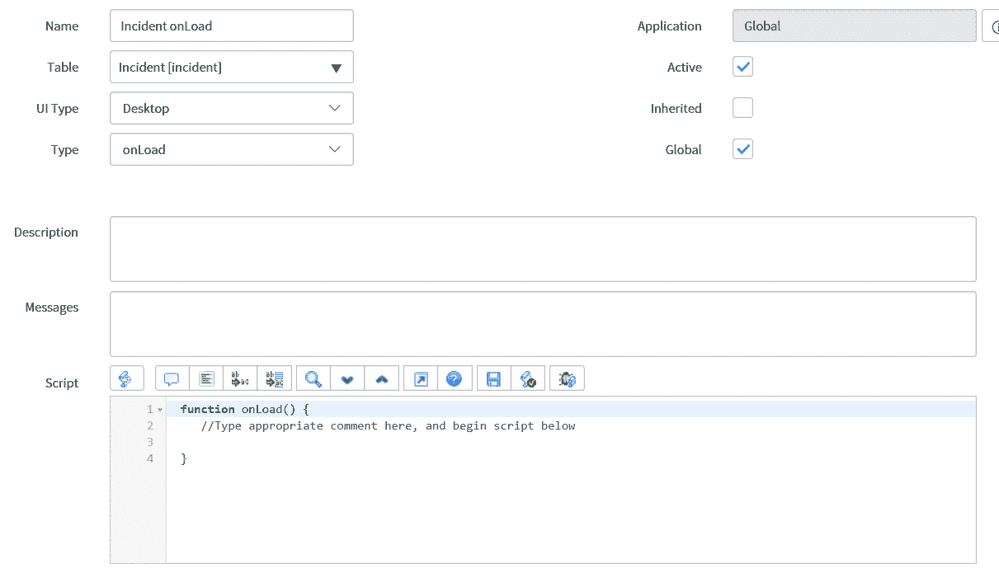
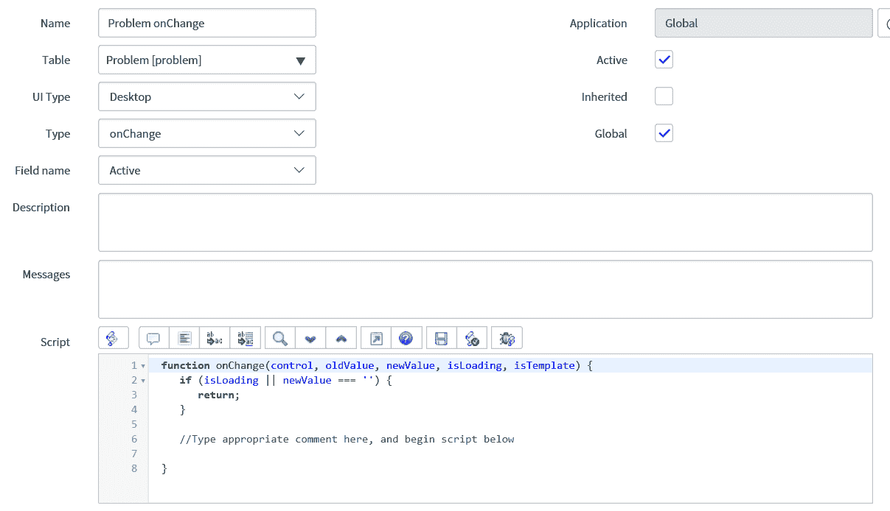
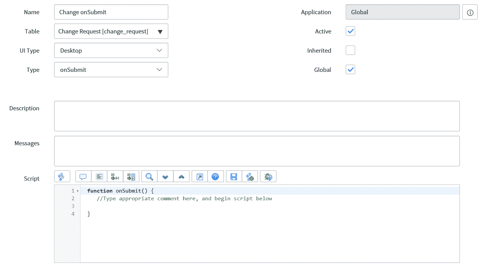
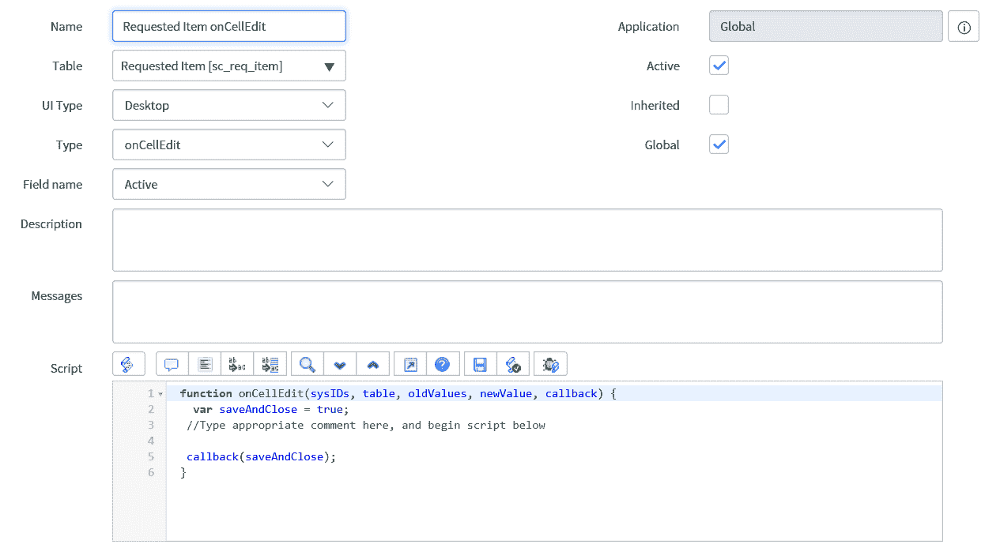
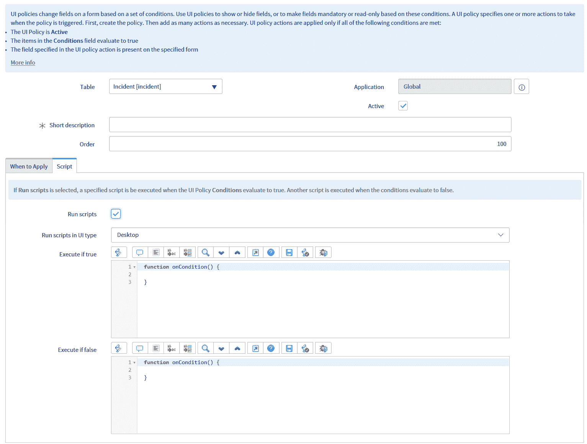
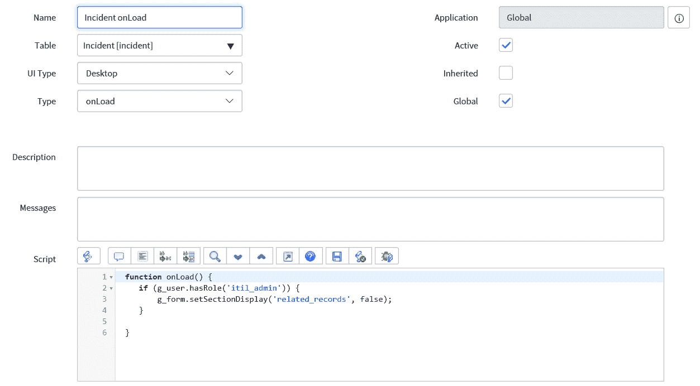
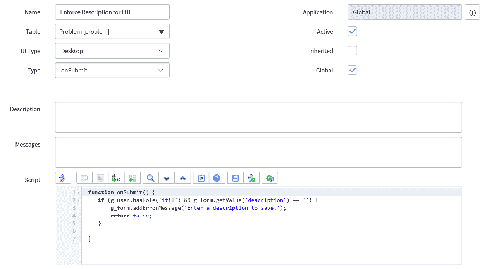
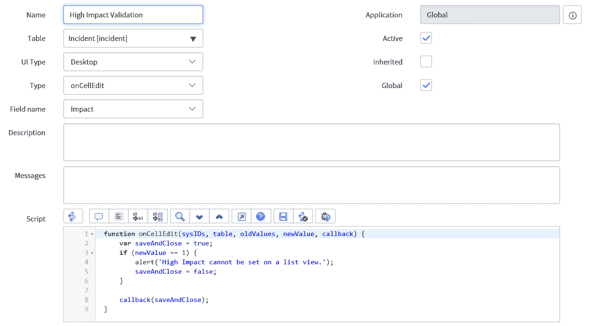
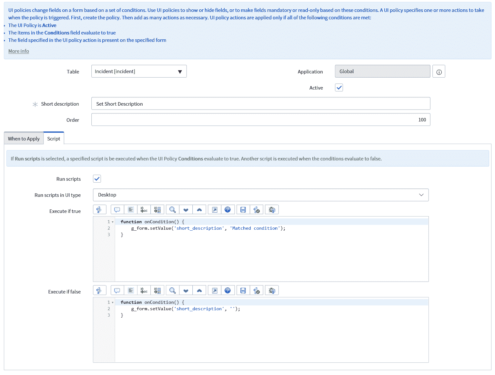

# 第三章：客户端脚本简介

在本章中，我们将开始探讨客户端基础知识。这将帮助您了解在哪里以及如何编写您的客户端脚本，以及如何测试它们。我们还将查看一些在这个领域入门的示例。

在本章中，我们将探讨以下主题：

+   客户端脚本

+   UI 策略

+   如何以及何时编写客户端脚本

+   测试客户端脚本

+   基本客户端脚本示例

# 客户端脚本

客户端脚本通常是开发者最常使用的客户端脚本。默认情况下，客户端脚本将在表的所有视图中运行，但可以通过取消选中全局复选框并将特定视图输入到出现的视图字段中来设置为仅针对某个视图运行。客户端脚本还可以继承到从不同表扩展的表中。例如，任务表上的客户端脚本可以继承到扩展它的表中，如事件、变更和问题表。要允许表继承客户端脚本，必须设置继承复选框。

客户端脚本中的脚本可以在开发者选择的不同时间运行。这种选择是通过为客户端脚本选择一个类型来实现的。

客户端脚本有四种类型，它们是：

+   `onLoad`

+   `onChange`

+   `onSubmit`

+   `onCellEdit`

让我们逐一查看每种类型，以及您何时可能想要使用每种类型来实现您的脚本目标。

# `onLoad`

`onLoad`客户端脚本类型在表加载时运行脚本。这有助于在用户开始使用表之前操纵表中的数据。有时，当表加载缓慢时，可以看到`onLoad`客户端脚本正在执行其任务。

当选择`onLoad`类型时，只要脚本字段尚未被编辑，脚本字段将填充 ServiceNow 为您提供的`onLoad`函数。脚本如下所示：

```js
function onLoad() {
    //Type appropriate comment here, and begin script below

}
```

这是将您的脚本放入的`onLoad`函数。任何运行`onLoad`的脚本都会花费时间运行并减慢加载时间，因此始终值得尝试将`onLoad`客户端脚本保持在最小，如果需要，则尽可能简短。我曾参与过仅为了减少表上`onLoad`客户端脚本的数量以减少加载时间的项目。

尽量让每个表只有一个`onLoad`客户端脚本，而不是多个。这样便于维护，因为所有`onLoad`代码都在一个地方，您可以完全确信`onLoad`代码将按什么顺序运行。

在以下图中，*图 3.1*，我们可以看到这种类型客户端脚本的外观：



图 3.1：示例 onLoad 客户端脚本

在前面的图中，我们可以看到一个为事件表编写的`onLoad`客户端脚本。正如代码中的注释所述，将代码中的注释替换为脚本的功能，然后在`onLoad`函数内的注释下方开始编写。

# `onChange`

`onChange` 客户端脚本在表单上更改选定的字段时运行。重要的是要注意，当表单加载时，`onChange` 脚本也会运行。这种类型的脚本通常用于根据 `onChange` 脚本运行的字段中的数据自动填充表单上的其他字段。例如，如果用户在表单上被选中，表单上的其他用户数据，如公司和职位，可以使用 `onChange` 脚本来填充。

与 ServiceNow 在 `onLoad` 脚本中提供脚本函数的方式相同，`onChange` 函数也被提供。这稍微复杂一些，让我们看看：

```js
function onChange(control, oldValue, newValue, isLoading, isTemplate) {
    if (isLoading || newValue === '') {
        return;
    }

    //Type appropriate comment here, and begin script below

}
```

`onChange` 函数为我们提供了五个参数，我们可以在脚本函数内部使用这些参数。以下是每个参数提供的内容：

+   `control`：已更改字段的动态 HTML

+   `oldValue`：表单加载时更改字段的值

+   `newValue`：已输入到更改字段的新的值

+   `isLoading`：如果表单正在加载，则为真；否则为假

+   `isTemplate`：如果更改是作为模板加载的一部分发生的，则为真；否则为假

你也可以看到 ServiceNow 已经进行了一些脚本编写。这个 `if` 语句检查表单是否正在加载，或者更改字段的新的值是否为空。如果这两个条件中的任何一个为真，脚本将从函数中返回，实际上取消了脚本。在大多数情况下，这非常有帮助，但了解这个 `if` 语句是好的，因为有时你可能想要修改它，以便在加载期间或字段变为空值时运行代码。

例如，如果你已经清除了包含附加用户数据的用户字段，你也会想要清除附加的用户数据。在这种情况下，你将想要移除代码返回函数的条件，如果 `newValue` 参数为空。

当选择 `onChange` 类型时，开发者将可以看到为脚本运行选择字段的选项。此字段中可用的字段取决于表字段中的值。

我们可以在 *图 3.2* 中看到一个 `onChange` 类型客户端脚本：



图 3.2：示例 `onChange` 客户端脚本

在前面的图中，我们可以看到问题表的 `onChange` 客户端脚本。特别注意字段名称字段，它默认为 Active，因为这是需要更改以使脚本运行的字段。很容易忘记更改这个字段，当你期望脚本执行时，却不知道为什么它没有执行。

# `onSubmit`

`onSubmit` 客户端脚本类型在表单保存时运行。这种类型的脚本并不广泛使用，因为我们通常可以使用服务器端脚本来在记录保存后执行操作，但它很有帮助，因为它提供了在运行服务器端脚本之前执行客户端脚本的最后机会。

ServiceNow 为 `onSubmit` 提供的脚本与 `onLoad` 非常相似：

```js
function onSubmit() {
    //Type appropriate comment here, and begin script below

}
```

`onSubmit` 脚本类型可用于在保存之前检查字段值，并在字段中存在无效值时终止保存。

当考虑编写 `onSubmit` 脚本时，值得思考的是该脚本是否可以在服务器端运行。这是因为客户端脚本在用户面前运行，进一步的加工必须等待脚本完成，而服务器端，代码在用户之外执行，并且可以与其他脚本并行执行。

如果您想终止正在提交的表单，请从 `onSubmit` 函数返回 `false`。

我们可以在 *图 3.3* 中看到一个 `onSubmit` 示例：



图 3.3：样本 onSubmit 客户端脚本

对于我们的 `onSubmit` 客户端脚本示例，我们可以看到这个客户端脚本已准备好添加到更改表。

# onCellEdit

当在表的列表视图中编辑单元格时，将运行 `onCellEdit` 类型的客户端脚本。这是唯一不运行在表表单视图中的客户端脚本类型。这种类型的客户端脚本有助于确保您想要坚持的规则也适用于表的列表视图。

ServiceNow 为 `onCellEdit` 脚本提供的脚本看起来与其他客户端脚本类型略有不同：

```js
function onCellEdit(sysIDs, table, oldValues, newValue, callback) {
  var saveAndClose = true;
 //Type appropriate comment here, and begin script below

 callback(saveAndClose);
}
```

值得注意的是，这些脚本可能是针对多个记录的，因为您可以使用列表编辑多个记录。如您所见，这种略有不同的脚本类型中有相当多的不同参数。我们将查看每个参数提供了什么：

+   `sysIDs`: 正在被编辑的记录的所有 `sys_id` 唯一 ID 的数组。

+   `table`: 正在被编辑的记录的当前表。

+   `oldValues`: 正在被编辑的所有单元格的旧值。

+   `newValue`: 将放入所有正在编辑的单元格的新值。

+   `callback`: 一个回调，允许执行进一步的 `onCellEdit` 脚本或在没有其他脚本存在的情况下提交所做的更改。可以传递一个 `true` 或 `false` 参数，分别允许进一步执行脚本和提交更改，或者停止进一步脚本的执行并不提交更改。

这些脚本通常不太常用，因为像业务规则这样的服务器端脚本通常可以用来执行所需的功能。在列表中编辑记录也可以是更新多个记录的强大工具，因此有时会将其锁定为仅对某些用户开放，以防止知识不足的用户造成问题。

一个 `onCellEdit` 客户端脚本示例可以在 *图 3.4* 中查看：



图 3.4：样本 onCellEdit 客户端脚本

前图中的客户端脚本是为请求的项目表中的`onCellEdit`。同样，对于此类脚本，请确保字段名称字段设置为所需的值，因为脚本仅在列表视图中更改此字段时运行。

# UI 策略

UI 策略是客户端脚本的更可配置版本。管理员设置一个条件，然后使用操作或脚本修改字段。通过配置，开发者可以更改字段是否为必填、可见和只读。如果您正在考虑对字段进行这些更改，UI 策略通常是最佳选择。UI 策略比客户端脚本更容易理解和维护，对其他管理员来说也是如此。

UI 策略也可以根据设置的条件进行脚本化，例如，如果条件匹配，可以运行代码；如果不匹配，也可以运行代码。在 UI 策略中设置条件与在 ServiceNow 的其他地方设置条件非常相似，因为它使用标准的条件构建器。

UI 策略针对表运行，但由于可以使用条件构建器，因此可以多个字段作为条件构建的一部分使用。UI 策略附带一些复选框，用于指定 UI 策略何时应用。在以下内容中，我们将查看不同的选项以及它们在应用策略时的变化：

+   `Global`：默认设置，这意味着 UI 策略将默认在所有视图中运行，尽管通过取消勾选全局复选框，您可以选择特定的视图。

+   `On load`：默认设置，此复选框选中时，在表单加载时以及字段更改时运行策略。

+   `Reverse if false`：如果条件不成立，则反转 UI 策略的效果。这是默认设置。

+   `Inherit`：默认未设置，这允许扩展所选表的表继承策略。例如，如果设置了此选项，任务表上的策略将被事件表继承。

UI 策略与其关联的 UI 策略操作相关联，当条件匹配时生效，或者在“反转如果为假”复选框设置的情况下反向生效。这些操作允许字段变为必填、可见、只读或这些效果的组合。UI 策略操作被视为配置，并在字段上采取这些操作时被视为最佳实践。

如果您想通过 UI 策略实现更多功能，有选项可以在匹配或不匹配给定条件时进行脚本化。这很少使用，因为客户端脚本通常更适合此要求，但让我们看看它是如何工作的。

首先，要在 UI 策略中脚本化，您必须设置“运行脚本”复选框。这将出现两个字段：如果为真则执行和如果为假则执行。这些名称相当直观，即如果 UI 策略中定义的条件匹配为真或假，则将运行。

ServiceNow 为我们提供了将代码放入其中的功能，如下所示：

```js
function onCondition() {

} 
```

这个功能在“执行如果为真”或“执行如果为假”脚本字段中是相同的。

UI 策略对于使字段成为必填、可见和只读非常有用。如果考虑在 UI 策略中脚本化，那么配置而不是定制当然被认为是最佳实践，尽管通常最好使用客户端脚本。这是因为你只需要维护一个客户端脚本，而不是 UI 策略上的两个脚本。在客户端脚本中，编写所有可能情况下的代码也更容易，而不是像 UI 策略中那样仅仅匹配或不匹配一组条件。

在图 3.5 中，我们可以看到一个显示脚本表单部分的 UI 策略：



图 3.5：示例 UI 策略显示脚本字段

在前面的图中，我们可以看到一个当前设置为在事件表中运行的 UI 策略。如果我们使用可以看到的两个脚本字段，那么重要的是我们要用这两个脚本覆盖 UI 策略条件为真和假的场景。

# 如何以及何时编写客户端脚本

当开发者想要更改用户面前的屏幕时，应该编写客户端脚本。这可能是对字段值、可见性或其他更改的更改。每次运行客户端脚本时，都需要从实例中获取资源，因此将客户端脚本保持在最低限度很重要。

如果你可以在服务器端而不是客户端进行更改，那么这样做被认为是最佳实践。这将缩短加载时间并提高用户体验。

让我们看看客户端脚本的一些常见用途以及如何最好地完成这些任务。

# 使字段成为必填、可见或只读

对于使字段成为必填、可见或只读，最好使用 UI 策略。这种方法使用配置而不是定制，并且更容易维护。

在这种情况下，不需要进行脚本编写，因为你可以使用 UI 策略操作来实现你的目标。ServiceNow 通过条件构建器使这些操作设置变得简单易行。

# 根据另一个字段的值填充字段

客户端脚本的另一个流行用途是基于另一个字段的值填充字段。这种用法的一个常见例子是在字段中选择用户后，例如，自动填充公司、电话号码和职位名称。

对于这个示例，你将想要使用一个`onChange`客户端脚本。通过将`onChange`字段设置为用户字段，你可以使用客户端脚本获取其余的用户数据。对于这一点，最佳实践是使用`GlideAjax`调用，我们将在下一章的进阶客户端脚本中探讨。

# 显示/隐藏表单部分

有时候，你可能只想向不同类型的用户显示特定的表单部分。这可以基于许多变量，但通常它将基于用户拥有的角色或他们所属的组。

对于这个需求，可以使用 `onLoad` 客户端脚本。这将确保在表单对用户可用之前，所需的表单部分可以被隐藏。

# 复习

我们已经探讨了客户端脚本的一些常见用途，但这绝对不是详尽的列表。在考虑在客户端编写脚本时，通常值得思考它们是否必要，以及它们是否可以更好地放在服务器端脚本中。记住，客户端脚本会增加加载时间，因此尽量将它们保持在最低限度。

# 测试客户端脚本

在 ServiceNow 中测试脚本可以通过几种方式完成。幸运的是，客户端脚本可能是最容易测试的，因为脚本是在用户面前运行的，因此可以直接向用户展示脚本的日志和反馈。

# 弹出提示

调试客户端脚本最简单的方法之一是使用 `alert` 功能。`alert` 简单地弹出一个消息窗口，显示你选择包含的信息。这可以用于显示在特定时间字段或变量的值，或者简单地确认某些函数已被输入。

让我们看看以下代码中 `alert` 的作用：

```js
alert('Debug Message');
```

前面的脚本将简单地向用户显示一个弹出消息，内容为“调试信息”。这是一行简单的代码，可以提供即时反馈。

让我们看看如何使用 `alert` 来帮助我们测试代码：

```js
function onLoad() {
alert('Start of script');
var shortDescBefore = g_form.getValue('short_description');
alert('The short description beforehand is ' + shortDescBefore);
g_form.setValue('short_description', 'Alerting Issue');
var shortDescAfter = g_form.getValue('short_description');
alert('The short description afterwards is ' + shortDescAfter);

}
```

在前面的例子中，我们使用三条消息来测试脚本是否按预期工作。第一条消息会简单地通过显示“脚本开始”来提醒用户脚本已经开始。这有助于检查 JavaScript 是否在浏览器上正确运行，或者是否有其他客户端脚本正在引发错误，阻止此脚本运行。

第二条消息给出了表单加载时的简短描述值。我们将简短描述的值存储在 `shortDescBefore` 变量中，并在我们的 `alert` 中使用它。我们可以通过在它们之间使用加号将文本字符串和变量组合在一起，在 `alert` 中。

第三条消息显示了在用 `g_form setValue` 方法修改后，简短描述字段的值。第三条消息将读作“之后的简短描述是弹出问题”。

使用 `alert` 允许我们测试和调试快速且有效地编写的脚本。使用 `alert` 的问题在于，你必须确保在用于测试或调试时移除或注释掉所有 `alert`，因为这些消息如果不移除，对用户来说非常明显，有些人甚至觉得它们很烦人，需要不断点击。

我倾向于喜欢以这种方式进行初始开发测试，因为它使用起来非常方便。然而，`alert` 并不提供持续的测试方法，因此对于代码的维护来说，使用更干净的日志方法可能更好。

# Jslog

另一种测试和调试客户端脚本的方法是使用`jslog`。当使用`jslog`时，您可以在脚本中写入行以将日志发送到 JavaScript 日志。JavaScript 日志可以在开发系统设置中打开，以便查看消息。这种方法只会向已打开 JavaScript 日志的用户显示日志，因此它可以是一种不太侵入性的测试脚本的方法。

`jslog`消息的内容可以与使用`alert`的消息相同。让我们看看我们如何在脚本中编写它：

```js
jslog('Testing Message');
```

在前面的示例中，消息`Testing Message`将出现在 JavaScript 日志中。Jslog 可以包含字符串或变量，但它不会显示在 ServiceNow 日志中。它只出现在 JavaScript 日志中，因此如果您使用此测试方法，请确保您已打开它。

由于 JavaScript 日志对于普通用户来说通常不会打开，因此可以将这些日志保留以供脚本未来的维护。如果您选择这样做，请确保您留下的日志有良好的文档记录并且尽可能少。对于新手开发者来说，维护一个他们不熟悉的实例，其中 JavaScript 日志不断更新，是非常困难的。

# 浏览器

浏览器方法不是 ServiceNow 特有的客户端脚本调试方式，但它可能非常有用。因为这些脚本在客户端运行，所以网络浏览器通常有显示正在运行的 JavaScript 代码的方式，您可以进行检查。

这些方法根据您查看 ServiceNow 所使用的浏览器而有所不同，但大多数现代浏览器都将有一些检查正在运行的 JavaScript 的方法，这可以用来测试您的客户端脚本。

我个人倾向于使用 Google Chrome 进行基于浏览器的测试，但其他浏览器也可以同样出色。

# 脚本示例

介绍了客户端脚本的基本元素以及如何和在哪里使用它之后，我们可以看看一些脚本的例子来进一步加深理解。

我们将从查看一些客户端脚本示例开始。

在这个第一个例子中，我们将使用一个`onLoad`客户端脚本根据登录用户的角色显示和隐藏表单部分。如果登录用户具有`itil_admin`角色，我们只会在事件表单上显示相关的记录表单部分：

```js
function onLoad() {
    if (g_user.hasRole('itil_admin')) {
        g_form.setSectionDisplay('related_records', false);
    }
}
```

如您在示例中看到的，我们正在使用`g_user`的`hasRole`方法来确定登录用户是否具有所需的角色。如果没有，我们则使用`g_form`的`setSectionDisplay`方法来隐藏表单部分。将此客户端脚本作为`onLoad`类型放置，可以确保此表单部分立即从用户那里隐藏。

我经常使用这种类型的脚本来隐藏出现在表单部分上的敏感数据。这可以是从财务细节到由 HR 持有的个人信息。

我们可以在*图 3.6*中看到这个脚本的外观：



图 3.6：用于隐藏表单部分的 OnLoad 客户端脚本

现在让我们看看一个`onChange`客户端脚本的示例。有时，我们可能希望提高对某些类别事件的处理速度。假设在这个示例中，我们希望将所有网络事件的紧急程度设置为高，数据库事件的紧急程度设置为中等，其他用户的紧急程度设置为低。

我们需要确保为我们的`onChange`脚本设置`字段名称`字段的值为`Category`。让我们看看我们需要查看的代码：

```js
function onChange(control, oldValue, newValue, isLoading, isTemplate) {
    if (isLoading || newValue === '') {
        return;
    }

    switch(newValue) {
        case 'network':
            g_form.setValue('urgency', 1);
            break;
        case 'database':
            g_form.setValue('urgency', 2);
            break;
        default:
            g_form.setValue('urgency', 3);
    }

}
```

在这个示例中，我们使用`switch case`语句根据字段的新值执行不同的操作。这种 JavaScript 技术比使用多个`if`语句更有效。我们还使用了 ServiceNow 提供的`newValue`参数，以便快速决定将紧急程度设置为何值。

在本例中设置紧急程度的值时，如果用户认为紧急程度不适合这个特定事件，他们仍然可以修改紧急程度字段。通过将字段设置为只读或设置安全规则，可以锁定由脚本填充的字段。

让我们看看这个客户端脚本在*图 3.7*中的样子：


图 3.7：基于类别的 OnChange 客户端脚本设置紧急程度

接下来，我们将查看一个使用`onSubmit`类型客户端脚本的示例。这些脚本不如其他类型的客户端脚本常用，但如果需要，了解如何创建一个是有好处的。

在本例中，我们将检查具有`itil`角色的用户是否填写了描述。有时你可能希望确保具有更多技术经验的用户在表单中填写更多信息：

```js
function onSubmit() {
    if (g_user.hasRole('itil') && g_form.getValue('description') == '') {
        g_form.addErrorMessage('Enter a description to save.');
        return false;
    }

}
```

在前面的示例中，我们使用`g_form.addErrorMessage`方法在表单顶部显示消息，如果具有`itil`角色的用户尝试保存没有描述的表单。这条消息将让用户知道为什么他们无法保存表单。阻止记录保存的代码是从`onSubmit`函数返回 false。如果在`onSubmit`脚本的任何点上函数返回 false，则记录将不会保存。

能够阻止表单保存是`onSubmit`类型客户端脚本的一个重要方面，可以说是其主要用途。

我们编写的示例可以在*图 3.8*中看到：



图 3.8：OnSubmit 客户端脚本强制 itil 用户更新描述

现在让我们看看一个使用`onCellEdit`类型客户端脚本的示例。通常，这类脚本用于验证用户在列表视图中单元格中输入的内容。

对于这个示例，我们将确保用户不会在单元格中输入高影响值，以迫使他们打开表单视图来完成此操作：

```js
function onCellEdit(sysIDs, table, oldValues, newValue, callback) {
  var saveAndClose = true;
  if (newValue == 1) {
    alert('High Impact cannot be set on a list view.');
    saveAndClose = false;
  }

  callback(saveAndClose);
}
```

这个例子使用`newValue`参数来检查影响被设置到的值。如果它将字段值设置为`high`或`1`，这是我们需要在脚本中而不是标签中使用的，那么用户将通过消息被提醒。通过将`saveAndClose`变量设置为`false`，我们还可以阻止字段被更新。这是因为回调正在使用这个变量，因此也将`callback`设置为`false`。

通常，业务规则可以用来完成与`onCellEdit`脚本类似的任务，但了解它们是如何创建的很有用。

我们还可以在*图 3.9*中看到这个脚本在 ServiceNow 中的样子：



图 3.9：OnCellEdit 客户端脚本将列表视图上的影响设置为高

这些示例让我们对不同的客户端脚本类型及其用途有了很好的理解。现在我们将探讨 UI 策略。

当配置 UI 策略时，我们主要只需要使用脚本，如果我们想要运行我们在本章前面描述的“如果为真”和“如果为假”字段中的脚本。

对于这个例子，我们将当 UI 策略条件匹配时更改简短描述，如果条件不匹配则再次清除值。首先，让我们看看“如果为真”脚本：

```js
function onCondition() {
  g_form.setValue('short_description', 'Matched condition');
}
```

由于条件处理了脚本何时运行，我们只需在“如果为真”脚本中执行我们想要采取的操作。这个脚本将更改简短描述字段中的值。

现在让我们看看“如果为假”脚本：

```js
function onCondition() {
  g_form.setValue('short_description', '');
}
```

第二个脚本将在条件不匹配时清除简短描述字段。在这个例子中，简短描述字段将只包含无值或`Matched condition`文本。在 UI 策略中编写脚本时，要仔细考虑脚本的所有可能结果。在这两个独立的脚本中编写脚本可能更困难，这就是为什么脚本通常在客户端脚本中而不是在 UI 策略中编写。

我们可以在*图 3.10*中看到包含我们创建的脚本的 UI 策略：



图 3.10：UI 策略设置或清除简短描述

# 摘要

在本章中，我们探讨了客户端脚本在客户端脚本和 UI 策略中的基本用法。我们研究了四种不同类型的客户端脚本，并了解了每种脚本类型的工作方式。我们还发现了何时以及如何编写客户端脚本，以及如何测试和调试它们。最后，我们查看了一些客户端脚本的实用示例以及不同类型客户端脚本的使用场景。

在下一章中，我们将继续探讨客户端脚本，关注更高级的技术和客户端脚本可以使用的领域。我们将研究脚本操作、用于调用服务器端脚本的 AJAX 调用，以及使用 UI 操作运行客户端脚本。
