# 第十章：最佳实践

在本章中，我们将探讨在 ServiceNow 中脚本编写时的最佳实践。在脚本编写时，最佳实践非常重要，以便充分利用资源并提供最佳的用户体验。我们将探讨一般脚本、服务器端和客户端代码以及调试的最佳实践。我们还将深入研究涉及日志、队列和系统性能的最佳实践。

本章将探讨以下主题：

+   编码最佳实践

+   业务规则最佳实践

+   客户端脚本最佳实践

+   调试工具最佳实践

+   日志和队列最佳实践

+   系统性能最佳实践

# 编码最佳实践

在脚本编写时，有许多方法可以实现相同的目标，但保持代码高效可以使未来的维护和工作变得更加容易。通常也鼓励使用少量系统资源，因为这可以减少加载时间和云数据中心上的负载。

你经常会发现，较旧的实例由于在开发过程中没有遵守最佳实践而性能不佳。我之前曾参与过一些小项目，仅仅是为了使代码更高效，因为这些项目通常与缓慢的加载时间相关，因此对用户基础来说可能是一个巨大的改进。

在本节中，我们将探讨如何确保你的脚本遵守最佳实践以及如何避免常见的错误。

首先，一种相当常见的脚本类型是嵌套的 `if` 语句。这是一个在另一个 `if` 语句之后的 `if` 语句，通常用于捕获同一变量的几个潜在值。我们可以看到一个服务器端示例，看看它是什么样子：

```js
var state = current.state;
if (state == '1') {
  gs.log('State is New'); 
} else if (state == '2') {
  gs.log('State is In Progress');
} else if (state == '6') {
  gs.log('State is Resolved');
}
```

我们还可以在 *图 10.1* 中的脚本字段中看到它的样子：


图 10.1：嵌套 if 语句脚本示例

与使用嵌套的 if 语句相比，使用 `switch` 语句更好。我们可以看到之前的脚本可以是一个更高效的 `switch` 语句：

```js
switch(state.getDisplayValue()) {
    case 'New':
    gs.log('State is New');
    break;
    case 'In Progress':
    gs.log('State is In Progress');
    break;
    case 'Resolved':
    gs.log('State is Resolved');
    break;
    default:
    gs.log('Not Found');
  }
```

对于可能需要维护 ServiceNow 实例的开发者来说，`switch` 语句也更容易阅读。

我们可以在 *图 10.2* 中看到脚本字段内的 `switch` 语句：

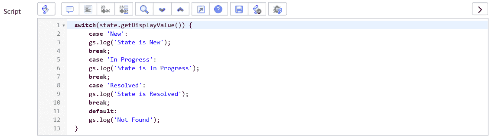

图 10.2：开关语句脚本示例

确保在每个 case 的末尾使用 break，以确保 `switch` 语句正确工作，因为有时可能会不小心省略。

# 业务规则最佳实践

业务规则最佳实践在很大程度上是关于在正确的时间运行业务规则。正如我们已经发现的，业务规则可以在表单保存或对记录执行操作的不同时间运行。

这意味着确保创建的业务规则以最有效的方式运行非常重要。正确使用业务规则，我们可以避免诸如更新同一记录两次和在不必要的时候运行脚本等问题。

我们将从查看业务规则上的复选框开始，如图*图 10.3*所示：

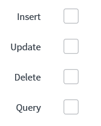

图 10.3：业务规则复选框

“插入”和“更新”是最常用的，它们经常一起使用。然而，确保您的业务规则仅在必要时运行是最佳实践。不要只是为了覆盖所有可能性而同时勾选两个框；如果业务规则在记录插入或更新时不需要，则不要勾选该复选框。

通常情况下，单独选择“删除”和“查询”，因为这些操作通常不会与其他操作对齐。

由于业务规则在服务器端运行，因此业务规则脚本中的良好做法也适用于 ServiceNow 的其他使用服务器端脚本的区域。

“当”字段是我们接下来要查看的字段。这是一个重要的字段，正确设置它可以帮助避免不良做法。这里有四个选项；让我们逐一看看。

# 之前

在记录保存之前运行业务规则是改变保存操作之前值的好方法。当对正在保存的记录进行更改时，应选择“之前”选项。这意味着如果您正在使用“current”来更改值，那么“之前”可能是最佳选项。

记住，在“之前”业务规则中运行脚本时，记录尚未保存。这意味着您只需要设置当前记录中的值，因为记录将在之后保存。这也意味着您需要确保避免使用`current.update()`，因为这会导致记录被保存两次。

# 之后

如果在运行业务规则时选择了“之后”选项，脚本将在记录保存后立即运行。如果我们正在更新当前保存的记录之外的值，但希望脚本立即运行，则应使用“之后”选项。

此选项适用于更新与正在保存的记录相关的记录，例如，在更新更改时更改任务。如果我们正在为正在保存的记录编写任何类型的审批更改脚本，这也是一个好的选项，因为这些更改将在记录重新加载后、保存后显示在记录上。

如果我们想要更新当前记录，那么使用“之前”选项会更好。如果您在脚本中考虑使用`current.update()`，那么考虑使用“之前”选项代替。

# 异步

“异步”选项会将脚本发送到系统调度器，并在记录保存后不久运行。当您编写的脚本不需要在记录保存后立即运行时，此选项是很好的选择。

异步选项的良好用途包括在集成之间发送消息和将任务发送到 ECC 队列。请记住，如果 ServiceNow 实例计划作业队列很长，异步选项可能会有更大的延迟，因此在设置异步业务规则时，请注意您实例的平均等待时间。如果您希望脚本立即运行，请考虑使用 after 选项。

# 显示

当记录在运行任何客户端脚本之前被加载时，显示业务规则会运行。这种类型的业务规则对于向客户端提供值非常有用，这样就不需要从客户端脚本调用服务器。我们可以使用这种类型的业务规则来避免 AJAX 调用。

显示业务规则在 ServiceNow 中并不总是可用，因此你可能会发现，在旧实例中使用它们可以减少客户端脚本中的服务器调用，从而减少记录加载时间。

如果你正在考虑在 onLoad 客户端脚本中使用 AJAX 调用，那么在可能的情况下，你应该使用显示业务规则来获取所需的服务器端值，并将它们设置在草稿本中供客户端脚本使用。

# 客户端脚本最佳实践

正如我们所见，客户端脚本在客户端运行，因此只能访问从服务器发送到客户端的数据。当我们编写客户端脚本时，我们的主要目标是尽量减少我们编写的脚本数量和对服务器的调用次数。

我们将客户端脚本保持到最小量的原因是因为这些脚本在用户面前运行，因此会直接影响加载时间。我们希望将加载时间保持在最低，因此客户端脚本也应该保持在最低。

当编写一个新的客户端脚本时，考虑脚本是否可以在服务器端运行是有价值的，如果是这样，那么这通常被认为是最佳实践。

让我们看看客户端脚本中最常见的坏做法之一。以下是一个示例脚本： 

```js
function onLoad() {
  var user = new GlideRecord('sys_user');
  user.get(g_form.getValue('caller_id'));
  g_form.showFieldMsg('caller_id', 'Active: ' + user.active);

}
```

此脚本正在调用服务器以获取有关当前事件调用者的详细信息，以及该调用者是否现在在系统中活跃。这是一个不好的做法，因为我们可以在加载记录之前就已经知道这个用户是否活跃，而不是加载记录后再次回到数据库，这会增加加载时间。

我们可以在以下客户端脚本中看到这段代码的示例：

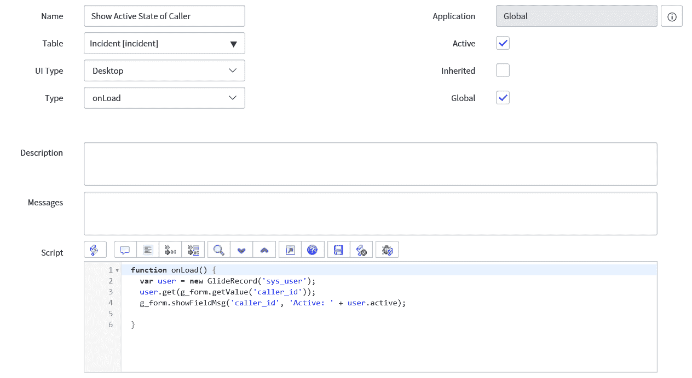

图 10.4：客户端脚本展示了不必要的服务器调用的不良做法

为了保持这一功能，同时改进代码，我们可以使用一个显示业务规则。通过这样做，我们在将数据从服务器传输到客户端之前，使用草稿本来获取我们想要的数据。

首先，我们使用以下代码创建显示业务规则：

```js
(function executeRule(current, previous /*null when async*/) {

  g_scratchpad.caller_active = current.caller_id.active;

})(current, previous);
```

此代码将活动字段值设置为`caller_active`草稿本，以便它可以被客户端代码使用。

让我们看看这作为一个显示业务规则的样子：

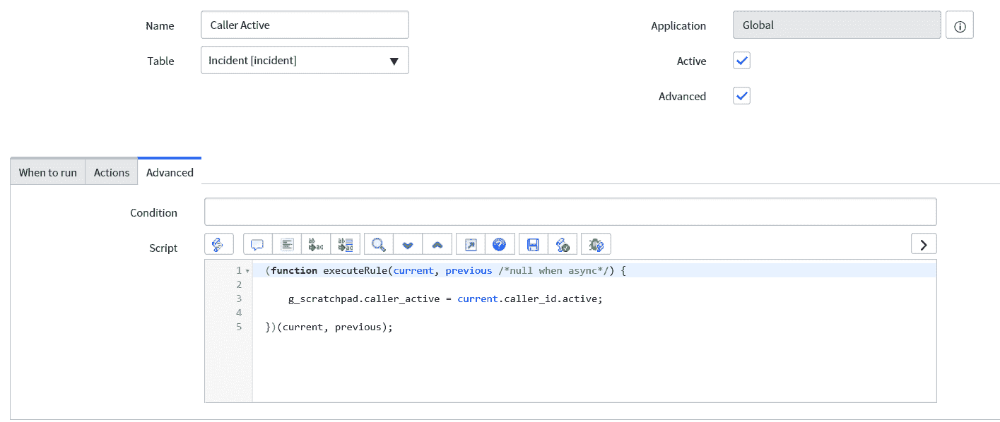

图 10.5：显示业务规则设置刮板变量

在我们的业务规则中，我们会将“何时运行”选项卡上的“何时”字段设置为显示，以便这个规则在表单加载时运行。在我们的例子中，我们将事件表单设置为运行此业务规则的表。

现在，我们已经设置了显示业务规则，所以我们只需要修改我们的客户端脚本：

```js
function onLoad() {

  g_form.showFieldMsg('caller_id', 'Active: ' + g_scratchpad.caller_active);

}
```

在早期代码中，我们使用在显示业务规则中设置的刮板值来设置字段消息文本。这意味着我们不再需要为这个细节进行服务器往返，因为它最初就被发送了。

让我们看看在定义的客户端脚本中这会是什么样子：

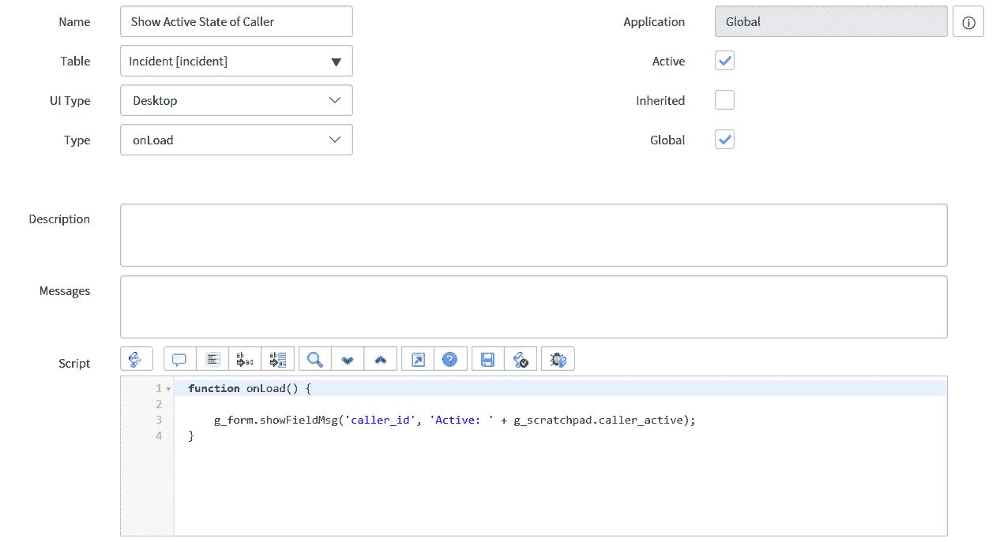

图 10.6：客户端脚本根据刮板值设置字段消息

在我们的例子中，我们使用脚本在事件表单加载时。这将显示在事件表单上当前选定的调用者的活动状态。我们还想注意，如果调用者发生变化，这个值可能会改变。

使用这种方法，我们还可以显示其他调用者属性，包括如电话号码或电子邮件地址等有助于联系调用者了解事件进展的辅助字段。我们还可以显示线路经理，并使用点遍历来显示一些经理的信息。

在这里，我们可以看到我们的示例中事件表单上调用者的输出会是什么样子：

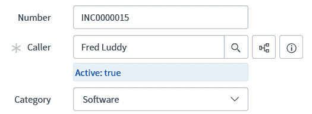

图 10.7：事件表单显示调用者字段的自定义字段消息

我们已经打开了一个存在于 ServiceNow 中的基线事件，我们可以看到当前调用者在 ServiceNow 中是活跃的。

高度推荐审查你的 ServiceNow 实例中的客户端脚本，以确保它们没有进行不必要的服务器调用。记住尽可能使用显示业务规则。

# 调试工具的最佳实践

正如我们在前面的章节中所发现的，在 ServiceNow 中有很多调试方法。每个开发者都会有他们自己的首选方法，而且，也有更好的方法来调试不同的场景。

# 日志

我最喜欢的调试方法之一是使用日志技术，例如`gs.log`。在早期章节中，我们看到了这些日志可以被添加到脚本中，当脚本运行时，我们可以在 ServiceNow 实例的系统日志中看到这些日志。

然而，我们必须确保这种调试永远不会在生产实例中可见。检查你编写的每个脚本以确保没有调试代码留在最终版本中是一个好习惯。在执行新创建的脚本之前检查系统日志，完成后再检查一次是个好主意。如果有任何日志消息被发送，那么在将新功能发送到生产实例之前应该删除这些消息。

确保您的日志消息与您试图实现的功能相关也很重要。如果您打算在新的代码中保留一些日志功能，这一点尤为重要。在更大的应用程序或定制中构建一些日志功能可能会有所帮助。

例如，考虑以下代码和日志：

```js
var caller = current.caller_id;
gs.log('log');
```

此示例将在调用者的值成功放入调用者变量时创建日志，但它没有提供太多信息。

我们可以看到这里创建的日志：

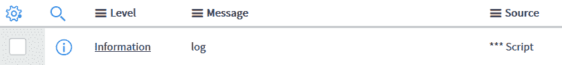

图 10.8：基本日志示例

为了改进我们的日志，让我们看看另一个例子：

```js
var caller = current.caller_id;
gs.log('caller id obtained from the caller field');
```

第二个例子更好，因为我们现在有了关于代码此点发生的事情以及代码成功的地方的一些信息。

此日志的输出看起来像这样：

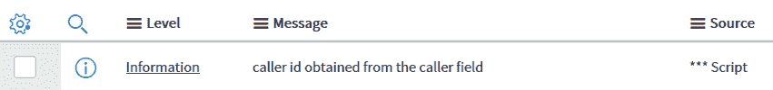

图 10.9：改进后的日志示例

尽管如此，我们还可以通过在此处添加更多信息来进一步改进它。

让我们进一步看看这种方式的日志记录示例：

```js
var caller = current.caller_id;
gs.log('caller id obtained from the caller field with value ' + caller);
```

看看这个例子，我们现在在我们的日志中添加了代码来记录调用者字段的值，以及脚本中发生的情况的详细信息。这将记录系统日志中的用户`sys_id`，这样我们就可以检查调用者变量在此代码点的值是否正确。

我们可以在以下图中看到这个改进后的日志：

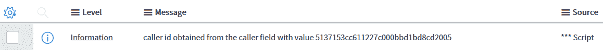

图 10.10：添加数据后的日志示例

现在，我们将看看一个最终的例子：

```js
var caller = current.caller_id;
gs.log('caller id obtained from the caller field with value ' + caller.getDisplayValue());
```

在这个最终示例中，我们现在将显示值记录到日志中，这样我们就可以看到用户的实际名称，而不仅仅是用户的`sys_id`。这使得阅读日志语句的开发者看到的结果更清晰。

让我们看看最终示例在系统日志中的样子：

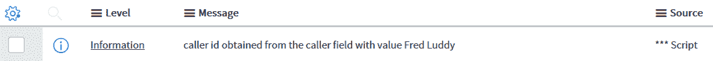

图 10.11：包含有用数据的日志示例

我们已经看到如何轻松地将日志添加到 ServiceNow 脚本中，但最佳实践是确保您创建的日志对其他开发者也有帮助。

# 会话调试

会话调试可以是一个强大的工具，但它也可能创建过多的日志，使调试变得漫长而艰巨。在使用会话调试时，重要的是要考虑您需要调试情况所需的日志类型。

虽然简单地启用所有会话调试可能看起来最简单，但最好只启用您感兴趣的区域。这确保了日志数量更少，意味着您可以更快地访问您感兴趣的信息。

通常，我发现除了作用域和安全规则之外，很少有开发者使用会话调试。这是因为其他方法更受其他调试选项会话调试的青睐。

# 日志和队列的最佳实践

日志和队列是 ServiceNow 实例的重要组成部分。日志在 ServiceNow 中用于记录实例中发生的事件。这些日志在调试中使用，正如我们所见，当包含这些日志时，它们应该被很好地定义。

队列在 ServiceNow 的多个区域中可见，从 ECC 队列到系统调度器。这些队列在适当的时间构建要执行的作业或操作。

在使用日志和队列时，重要的是使日志清晰，并且只在必要时在队列中创建作业或事件。

# 日志

需要为每个日志创建清晰的详细信息，并将其发送到正确的日志位置，以确保信息可以轻松读取。我们在调试部分介绍了某些日志技术或如何编写良好的日志，但我们还需要确保将日志发送到正确的日志本身。

当使用`gs.log`时，我们可以指定一个发送日志的源。如果没有指定源，则默认使用***脚本作为源。这将在脚本日志语句模块中显示日志。

在这里，我们可以看到一个示例日志，其中显示了***脚本源：

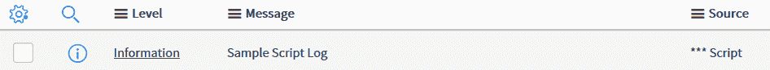

图 10.12：示例脚本日志

如果你正在创建一个较大的功能块或自定义应用程序，建议你创建自己的日志源。通过添加自己的源，你可以保持所有日志的独立性和易于维护。通常情况下，开发者会创建一个模块作为他们新应用程序的一部分，以便将日志定向到具有应用程序自定义源的日志。

# 队列

在 ServiceNow 中，你可以将作业和事件发送到许多队列。将任务或事件排队可以允许它们组合在一起批量处理，而不是单独处理。

每个队列将在给定时间后进行处理，每个队列的处理时间通常在系统属性中设置。改变队列的处理频率意味着任务或事件将更快地被处理，但会对系统资源产生消耗效应。在将队列处理时间设置为与基线系统提供的默认值不同的值时，始终需要仔细考虑这一点。

现在，让我们看看 ServiceNow 实例中一些最重要的队列以及每种队列类型的最佳实践。

# 事件队列

事件队列触发事件，然后由通知和脚本操作捕获。触发事件不会使用很多系统资源，因此通常不会成为问题。基线系统中提供了许多事件，因此此队列将始终包含活动。

设置脚本以将事件发送到事件队列的重要方面是确保事件被很好地定义，并且仅在需要时触发。

事件解释得很好的事件对其他开发者来说更容易使用，因此尽量在事件名称本身以及定义中演示事件是由什么触发的。

我们可以在这里看到示例事件日志：

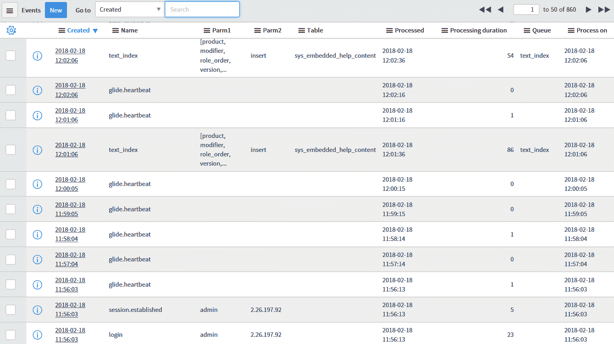

图 10.13：事件日志示例

在事件日志中，我们可以看到事件的处理时间以及事件的处理持续时间。考虑事件处理时间过长的影响，并在必要时调查原因，这是值得考虑的。

在我们的示例中，我们可以在日志中看到一些常规事件，包括成功的登录和建立的会话，以及心跳事件和文本索引。

创建事件时，确保测试边缘情况，以确保事件的定义真正反映了它何时会触发。

当将事件发送到更远未来的事件队列时，请注意事件不会在表轮换过程中丢失。

# 系统调度器

您可以将作业添加到系统调度器中最常见的方法之一是使用异步业务规则。一旦异步业务规则被触发，它就会将作业发送到调度器队列以运行其中包含的脚本。

也可以将您自己的作业添加到系统调度器中。最好只在必要时这样做，因为调度器中的作业过多可能会损害实例性能。

# ECC 队列

ECC 队列是存放来自 MID 服务器输入和输出消息的地方。这通常是为了实例和其他系统之间的集成。在这里，我们可以使用脚本向 MID 服务器发送作业。通常不会向 ECC 队列发送很多脚本消息，因为它通常会在一行中触发一次集成。

通过导航到 ECC | 队列，可以从应用程序导航器访问 ECC 队列。我们可以在这里看到此模块：


图 10.14：ECC 队列模块

队列通常会包含发送到 MID 服务器以检查它们是否响应的心跳探测。这是每 5 分钟进行一次，如果收到响应，则将 MID 服务器标记为在线，如果没有收到响应，则将 MID 服务器标记为离线。

当向 ECC 队列发送作业时，只需确保每个作业都是相关的，并且不要发送比必要的更多的作业。

# 系统性能最佳实践

有许多属性构成了实例的感知性能。这些可能会受到糟糕编写的脚本或大量不必要的脚本的影响。

脚本可能导致感知性能延迟的最常见方式之一是在表单打开时使用过多的客户端脚本。这会导致浏览器渲染和解析的延迟很大，用户可以非常明显地感觉到。正如我们之前提到的，在这种情况下的一种最佳实践是将创建的客户端脚本数量限制在仅必要的那些，并确保服务器调用保持在最低限度。

如果需要`onLoad`客户端脚本的信息，那么考虑使用显示业务规则而不是从客户端脚本调用服务器。

使用这种方法，我们可以在显示表单之前从显示业务规则中获取所需的服务器信息。然后，我们在客户端脚本中运行客户端代码，该代码将能够使用我们从显示业务规则中提供的信息。

通过导航到您的实例名称并在其后附加`/cache.do`，可以清除实例的缓存。这会为您清除缓存，并在您想要确保新脚本正在运行且缓存数据未被使用时有所帮助。

我们可以看到用户在导航到清除缓存页面时看到的屏幕，如图 10.15 所示。

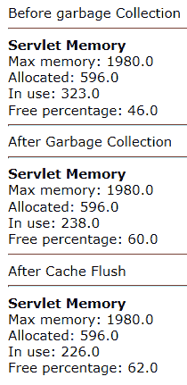

图 10.15：缓存清除提供的信息

然而，清除实例的缓存可能会导致性能下降，因此了解何时进行此操作很重要。在非生产实例上，这通常不会成为问题，因为性能下降不应显著影响其他开发者。但对于生产实例，在可能的情况下应避免在办公时间内进行。

在考虑系统性能时，还值得检查正在使用的实例的性能。这可以通过 ServiceNow 提供的性能主页来完成。

让我们来看看这个主页提供的某些图表：

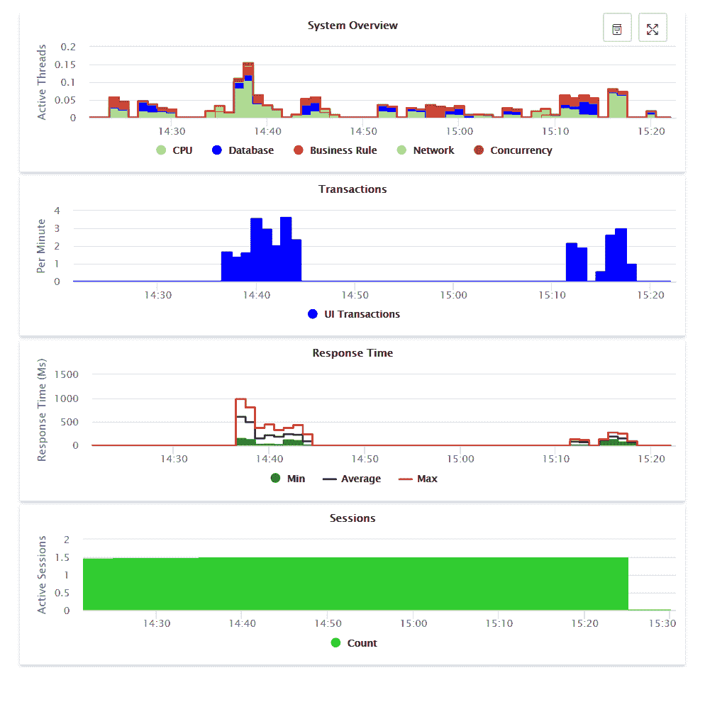

图 10.16：系统概述图表示例

在之前展示的图表中，我们可以看到概述、交易、响应时间和活跃会话图表。这些图表有助于了解实例当前的负载情况以及响应时间是否提供了良好的服务水平。

ServiceNow 性能主页还显示了比展示的更多的图表，您可以使用它们。我倾向于认为提供的响应时间是最有用的，但每个图表都有其用途。

通过关注实例性能，您可以主动解决潜在的系统性能问题。

# 摘要

在本章中，我们探讨了 ServiceNow 的最佳实践。我们探讨了在 ServiceNow 中使用脚本的一些最佳方法，以及一些应避免的坏习惯。我们的最佳实践包括编码、业务规则和客户端脚本领域，以及调试、日志、队列和系统性能。我们看到了这些最佳实践是如何协同工作以构建一个精简的 ServiceNow 实例的。

在下一章中，我们将探讨使用更新集。更新集是 ServiceNow 实例之间移动功能的重要组成部分，并且被广泛使用。我们将讨论何时以及如何使用更新集，以及它们与范围的关系。我们将发现如何在不同实例之间移动更新集，以及在此过程中应避免的陷阱。最后，我们将探讨使用更新集的最佳实践，以便您能够最大限度地利用 ServiceNow 应用程序。
