# 第一章 TypeScript - 工具和框架选项

JavaScript 是一种真正无处不在的语言。现代世界中您访问的几乎每个网站都会嵌入某种 JavaScript 组件，以使网站更具响应性、更易读，或者更具吸引力。想想您在过去几个月中访问过的最令人印象深刻的网站。它外观吸引人吗？它有某种巧妙的呈现方式吗？它是否通过为您提供全新的发现汽车保险、图片分享或新闻文章的方式来吸引您作为用户？

这就是 JavaScript 的力量。JavaScript 是互联网体验的点睛之笔，让全世界数百万人感到“哇，太酷了”。它也带来了收入。两个网站可能以相同的价格提供相同的产品，但是能够吸引客户并让他们享受网络体验的网站将吸引最多的追随者并获得最大的成功。如果这个网站还可以在台式机、手机或平板电脑上无缝重现，那么目标受众和目标收入可以成倍增加。

然而，JavaScript 也是互联网上讨厌的一面的原因。那些令人讨厌的广告，您必须等待 5 秒钟才能点击“跳过”按钮。或者在旧版浏览器上无法正常工作，或者在平板电脑和手机上无法正确渲染的网站。可以说，许多网站如果没有 JavaScript 会更好。

一个引人入胜的网络体验也可以在企业网络应用中产生巨大差异。笨重、难以使用和缓慢的网络应用会完全让企业用户对您的应用产生反感。请记住，您的典型企业用户正在将他们的工作体验与他们的日常网络体验进行比较 - 他们期望得到精心设计、响应迅速、直观的界面。毕竟，他们通常是最受欢迎的网站的用户，并期望在工作中得到同样的响应。

大部分这种增强的用户体验来自于 JavaScript 的有效使用。异步 JavaScript 请求允许您的网页在等待后端进程进行繁重、耗时的数据处理任务时更快地向用户呈现内容。

JavaScript 语言并不难学，但在编写大型、复杂程序时会带来挑战。作为一种解释性语言，JavaScript 没有编译步骤，因此是即时执行的。对于习惯于在更正式的环境中编写代码 - 使用编译器、强类型和成熟的编程模式的程序员来说，JavaScript 可能是一个完全陌生的环境。

TypeScript 弥合了这一差距。它是一种强类型、面向对象、编译语言，允许您作为程序员在 JavaScript 中重复使用成熟的面向对象语言的概念和思想。TypeScript 编译器生成的 JavaScript 遵循这些强类型、面向对象的原则 - 但同时又是纯粹的 JavaScript。因此，它将在 JavaScript 可以运行的任何地方成功运行 - 在浏览器、服务器或现代移动设备上。

本章分为两个主要部分。第一部分是对 TypeScript 为 JavaScript 开发体验带来的一些好处的快速概述。本章的第二部分涉及设置 TypeScript 开发环境。

如果您是一名有经验的 TypeScript 程序员，并且已经设置好了开发环境，那么您可能想跳过本章。如果您以前从未使用过 TypeScript，并且因为想了解 TypeScript 能为您做什么而拿起了这本书，那么请继续阅读。

本章将涵盖以下主题：

+   TypeScript 的好处

+   编译

+   强类型

+   与流行的 JavaScript 库集成

+   封装

+   私有和公共成员变量

+   设置开发环境

+   Visual Studio

+   WebStorm

+   括号和 Grunt

# 什么是 TypeScript？

TypeScript 既是一种语言，也是一套生成 JavaScript 的工具。它是由微软的 Anders Hejlsberg（C#的设计者）设计的，作为一个开源项目，帮助开发人员编写企业规模的 JavaScript。JavaScript 已经被世界各地的程序员广泛采用，因为它可以在任何操作系统上的任何浏览器上运行。随着 Node 的创建，JavaScript 现在也可以在服务器、桌面或移动设备上运行。

TypeScript 生成 JavaScript——就是这么简单。TypeScript 生成的 JavaScript 可以重用所有现有的 JavaScript 工具、框架和丰富的库，而不需要完全新的运行时环境。然而，TypeScript 语言和编译器将 JavaScript 的开发更接近于更传统的面向对象的体验。

## EcmaScript

JavaScript 作为一种语言已经存在很长时间，并且也受到语言特性标准的约束。在这个标准中定义的语言称为 ECMAScript，每个浏览器必须提供符合这个标准的功能和特性。这个标准的定义帮助了 JavaScript 和网络的增长，并允许网站在许多不同的操作系统上的许多不同的浏览器上正确呈现。ECMAScript 标准于 1999 年发布，被称为 ECMA-262 第三版。

随着语言的流行和互联网应用的爆炸性增长，ECMAScript 标准需要进行修订和更新。这个过程导致了 ECMAScript 的草案规范，称为第四版。不幸的是，这个草案提出了对语言的彻底改革，但并未受到良好的反响。最终，来自雅虎、谷歌和微软的领导人提出了一个另类提案，他们称之为 ECMAScript 3.1。这个提案被编号为 3.1，因为它是第三版的一个较小的功能集，并且位于标准的第 3 版和第 4 版之间。

这个提案最终被采纳为标准的第五版，并被称为 ECMAScript 5。ECMAScript 第四版从未出版，但决定将第四版和 3.1 功能集的最佳特性合并为第六版，命名为 ECMAScript Harmony。

TypeScript 编译器有一个参数，可以修改以针对不同版本的 ECMAScript 标准。TypeScript 目前支持 ECMAScript 3、ECMAScript 5 和 ECMAScript 6。当编译器运行在您的 TypeScript 上时，如果您尝试编译的代码不符合特定标准，它将生成编译错误。微软团队还承诺在 TypeScript 编译器的任何新版本中遵循 ECMAScript 标准，因此一旦采用新版本，TypeScript 语言和编译器也会跟进。

ECMAScript 标准的每个版本包含的细节超出了本书的范围，但重要的是要知道存在差异。一些浏览器版本不支持 ES5（IE8 就是一个例子），但大多数浏览器支持。在选择要为项目定位的 ECMAScript 版本时，您需要考虑要支持的浏览器版本。

## TypeScript 的好处

为了让您了解 TypeScript 的好处（这绝不是完整列表），让我们快速看一下 TypeScript 带来的一些东西：

+   编译步骤

+   强类型或静态类型

+   流行 JavaScript 库的类型定义

+   封装

+   私有和公共成员变量装饰器

### 编译

JavaScript 开发最令人沮丧的事情之一是缺乏编译步骤。JavaScript 是一种解释性语言，因此需要运行才能测试其有效性。每个 JavaScript 开发人员都会讲述关于花费数小时来查找代码中的错误的可怕故事，只是发现他们错过了一个多余的闭括号`{`，或者一个简单的逗号`,` - 或者甚至是一个双引号`"`，而应该是单引号`'`。更糟糕的是，当你拼错属性名称或者无意中重新分配全局变量时，真正的头痛就来了。

TypeScript 将编译你的代码，并在发现这种类型的语法错误时生成编译错误。这显然非常有用，并且可以帮助在 JavaScript 运行之前突出显示错误。在大型项目中，程序员通常需要进行大规模的代码合并 - 而今天的工具可以自动合并 - 令人惊讶的是编译器经常会发现这些类型的错误。

虽然像 JSLint 这样的语法检查工具已经存在多年，但将这些工具集成到你的 IDE 中显然是有益的。在持续集成环境中使用 TypeScript 也将在发现编译错误时完全失败构建 - 进一步保护程序员免受这些类型的错误。

### 强类型

JavaScript 不是强类型的。它是一种非常动态的语言，因为它允许对象在运行时改变其属性和行为。举个例子，考虑以下代码：

```ts
var test = "this is a string";
test = 1;
test = function(a, b) {
    return a + b;
}
```

在这段代码片段的第一行，变量`test`绑定到一个字符串。然后它被赋一个数字，最后被重新定义为一个期望两个参数的函数。然而，传统的面向对象语言不允许变量的类型改变 - 因此它们被称为强类型语言。

虽然前面的所有代码都是有效的 JavaScript - 并且可以被证明是合理的 - 但很容易看出这可能在执行过程中导致运行时错误。想象一下，你负责编写一个库函数来添加两个数字，然后另一个开发人员无意中重新将你的函数重新分配为减去这些数字。

这些类型的错误可能在几行代码中很容易发现，但随着你的代码库和开发团队的增长，找到并修复这些错误变得越来越困难。

强类型的另一个特性是，你正在使用的 IDE 可以理解你正在处理的变量类型，并且可以提供更好的自动完成或智能提示选项。

#### TypeScript 的“语法糖”

TypeScript 引入了一种非常简单的语法来在编译时检查对象的类型。这种语法被称为“语法糖”，或者更正式地说，类型注解。考虑以下 TypeScript 代码：

```ts
var test: string = "this is a string";
test = 1;
test = function(a, b) { return a + b; }
```

在这段代码片段的第一行上，我们介绍了一个冒号`:`和一个`string`关键字，将我们的变量和它的赋值之间。这种类型注解语法意味着我们正在设置变量的类型为`string`类型，并且任何不将其用作字符串的代码都将生成一个编译错误。通过 TypeScript 编译器运行前面的代码将生成两个错误：

```ts
error TS2011: Build: Cannot convert 'number' to 'string'.
error TS2011: Build: Cannot convert '(a: any, b: any) => any' to 'string'.

```

第一个错误非常明显。我们已经指定变量`test`是一个`string`，因此尝试将一个数字赋给它将生成一个编译错误。第二个错误与第一个类似，本质上是在说我们不能将一个函数赋给一个字符串。

通过 TypeScript 编译器，你的 JavaScript 代码引入了强大的静态类型，给你所有强类型语言的好处。因此，TypeScript 被描述为 JavaScript 的“超集”。我们将在下一章更详细地探讨类型。

### 流行 JavaScript 库的类型定义

正如我们所见，TypeScript 有能力“注释”JavaScript，并为 JavaScript 开发体验带来强类型。但是我们如何为现有的 JavaScript 库提供强类型？答案出奇的简单：通过创建一个定义文件。TypeScript 使用扩展名为`.d.ts`的文件作为一种“头”文件，类似于 C++等语言，以在现有的 JavaScript 库上叠加强类型。这些定义文件包含描述库中每个可用函数和变量以及它们相关类型注释的信息。

让我们快速看一下定义会是什么样子。举个例子，考虑一个来自流行的 Jasmine 单元测试框架的函数`describe`：

```ts
var describe = function(description, specDefinitions) {
  return jasmine.getEnv().describe(description, specDefinitions);
};
```

这个函数有两个参数，`description`和`specDefinitions`。然而，仅仅阅读这个 JavaScript 并不能告诉我们这些参数应该是什么类型。`specDefinitions`参数是一个字符串，还是一个字符串数组，一个函数或者其他什么？为了弄清楚这一点，我们需要查看 Jasmine 文档，可以在[`jasmine.github.io/2.0/introduction.html`](http://jasmine.github.io/2.0/introduction.html)找到。这个文档为我们提供了如何使用这个函数的有用示例：

```ts
describe("A suite", function () {
    it("contains spec with an expectation", function () {
        expect(true).toBe(true);
    });
});
```

从文档中，我们可以很容易地看出第一个参数是一个`string`，第二个参数是一个`function`。然而，在 JavaScript 语言中，并没有强制我们遵循这个 API。正如之前提到的，我们可以轻松地用两个数字调用这个函数，或者无意中交换参数，先发送一个函数，然后发送一个字符串。如果我们这样做，显然会开始出现运行时错误，但是 TypeScript 可以在我们尝试运行这段代码之前生成编译时错误，使用定义文件。 

让我们来看一下`jasmine.d.ts`定义文件的一部分：

```ts
declare function describe(
    description: string, specDefinitions: () => void
): void;
```

这是描述函数的 TypeScript 定义。首先，`declare function describe`告诉我们可以使用一个名为`describe`的函数，但是这个函数的实现将在运行时提供。

显然，`description`参数被强类型为`string`类型，`specDefinitions`参数被强类型为返回`void`的`function`。TypeScript 使用双括号`()`语法声明函数，并使用箭头语法显示函数的返回类型。所以`() => void`是一个不返回任何东西的函数。最后，`describe`函数本身将返回`void`。

如果我们的代码尝试将一个函数作为第一个参数传递，将一个字符串作为第二个参数传递（显然违反了这个函数的定义），如下例所示：

```ts
describe(() => { /* function body */}, "description");
```

TypeScript 编译器将立即生成以下错误：

```ts
error TS2082: Build: Supplied parameters do not match any signature of call target: Could not apply type "string" to argument 1 which is of type () => void

```

这个错误告诉我们，我们试图使用无效的参数调用`describe`函数。我们将在后面的章节中更详细地看定义文件，但是这个例子清楚地显示了如果我们尝试不正确地使用外部 JavaScript 库，TypeScript 将生成错误。

#### Definitely Typed

TypeScript 发布后不久，Boris Yankov 开始在 DefinitelyTyped（[`github.com/borisyankov/DefinitelyTyped`](https://github.com/borisyankov/DefinitelyTyped)）上创建了一个 GitHub 存储库，用于存放定义文件。这个存储库现在已经成为将外部库集成到 TypeScript 中的首选方法，并且目前保存了超过 500 个 JavaScript 库的定义。

### 封装

面向对象编程的一个基本原则是封装：将数据定义以及一组可以操作该数据的函数封装到一个单一的组件中。大多数编程语言都有类的概念，提供了一种定义数据和相关函数模板的方式。

让我们首先看一下一个简单的 TypeScript 类定义：

```ts
class MyClass {
    add(x, y) {
        return x + y;
    }
}

var classInstance = new MyClass();
console.log(classInstance.add(1, 2));
```

这段代码非常简单易懂。我们创建了一个名为`MyClass`的`class`，其中包含一个名为`add`的函数。要使用这个类，我们只需创建一个实例，并使用两个参数调用`add`函数。

不幸的是，JavaScript 没有`class`关键字，而是使用函数来复制类的功能。通过类实现封装可以通过使用原型模式或者使用闭包模式来完成。理解原型和闭包模式，并正确使用它们，被认为是编写企业级 JavaScript 时的基本技能。

闭包本质上是指引用独立变量的函数。这意味着在闭包函数内定义的变量会“记住”它们被创建的环境。这为 JavaScript 提供了一种定义局部变量和提供封装的方式。在前面的代码中使用 JavaScript 的闭包来编写`MyClass`定义会看起来像这样：

```ts
var MyClass = (function () {
    // the self-invoking function is the 
    // environment that will be remembered
    // by the closure
    function MyClass() {
        // MyClass is the inner function,
        // the closure
    MyClass.prototype.add = function (x, y) {
        return x + y;
    };
    return MyClass;
})();
var classInstance = new MyClass();
console.log("result : " + classInstance.add(1, 2));
```

我们从一个名为`MyClass`的变量开始，并将其分配给一个立即执行的函数——请注意代码片段底部附近的`})();`语法。这种语法是为了避免将变量泄漏到全局命名空间而常用的 JavaScript 编写方式。然后我们定义一个名为`MyClass`的新函数，并将这个新函数返回给外部调用函数。然后我们使用`prototype`关键字将一个新函数注入到`MyClass`定义中。这个函数名为`add`，接受两个参数，返回它们的和。

代码的最后两行展示了如何在 JavaScript 中使用这个闭包。创建一个闭包类型的实例，然后执行 add 函数。在浏览器中运行这个代码将会在控制台上记录**result: 3**，这是预期的结果。

### 提示

**下载示例代码**

您可以从您在[`www.packtpub.com`](http://www.packtpub.com)的帐户中下载示例代码文件，这适用于您购买的所有 Packt Publishing 图书。如果您在其他地方购买了这本书，您可以访问[`www.packtpub.com/support`](http://www.packtpub.com/support )并注册以直接通过电子邮件接收文件。

通过比较 JavaScript 代码和 TypeScript 代码，我们可以很容易地看出 TypeScript 相对于等效的 JavaScript 来说是多么简单。还记得我们提到过 JavaScript 程序员很容易错放大括号`{`或者括号`(`吗？看一下闭包定义的最后一行：`})();`。弄错其中一个大括号或者括号可能需要花费数小时来调试。

#### TypeScript 类生成闭包

如前面的代码片段所示，TypeScript 类定义的实际输出是 JavaScript 闭包。因此 TypeScript 实际上为您生成了闭包。

### 注意

多年来，向 JavaScript 语言添加类的概念一直是人们讨论的话题，目前已经成为 ECMAScript 第六版（Harmony）标准的一部分，但这仍然是一个正在进行中的工作。微软已经承诺在 TypeScript 编译器中遵循 ECMAScript 标准，一旦这些标准发布，就会实现这些标准。

### 公共和私有访问器

封装中使用的另一个面向对象原则是数据隐藏的概念——即具有公共和私有变量的能力。私有变量应该对特定类的用户隐藏——因为这些变量只应该被类本身使用。意外地将这些变量暴露到类外部可能很容易导致运行时错误。

不幸的是，JavaScript 没有声明变量为私有的本地方法。虽然可以使用闭包来模拟这种功能，但很多 JavaScript 程序员简单地使用下划线字符`_`来表示私有变量。然而，在运行时，如果您知道私有变量的名称，您可以很容易地为它赋值。考虑以下 JavaScript 代码：

```ts
var MyClass = (function() {
    function MyClass() {
        this._count = 0;
    }
    MyClass.prototype.countUp = function() {
        this._count ++;
    }
    MyClass.prototype.getCountUp = function() {
        return this._count;
    }
    return MyClass;
}());

var test = new MyClass();
test._count = 17;
console.log("countUp : " + test.getCountUp());
```

`MyClass`变量实际上是一个闭包 - 具有构造函数、`countUp`函数和`getCountUp`函数。变量`_count`应该是一个私有成员变量，只在闭包范围内使用。使用下划线命名约定可以让这个类的用户知道这个变量是私有的，但是 JavaScript 仍然允许您操作变量`_count`。看一下代码片段的倒数第二行。我们明确地将假定的私有变量`_count`的值设置为 17 - 这是 JavaScript 允许的，但不是类的原始创建者所期望的。这段代码的输出将是**countUp: 17**。

然而，TypeScript 引入了`public`和`private`关键字，可以用于类成员变量。尝试访问被标记为`private`的类成员变量将生成一个编译时错误。例如，上面的 JavaScript 代码可以在 TypeScript 中写成如下形式：

```ts
class MyClass {
    private _count: number;
    constructor() {
        this._count = 0;
    }
    countUp() {
        this._count++;
    }
    getCount() {
        return this._count;
    }
}

var classInstance = new MyClass();
console.log(classInstance._count);
```

在我们的代码片段的第二行，我们声明了一个名为`_count`的`private`成员变量。同样，我们有一个构造函数、一个`countUp`和一个`getCount`函数。如果我们编译这个 TypeScript 代码，编译器将生成一个错误：

```ts
error TS2107: Build: 'MyClass._count' is inaccessible.

```

这个错误是因为我们试图在代码的最后一行访问私有变量`_count`。

因此，TypeScript 编译器帮助我们遵守公共和私有访问者 - 当我们无意中违反这个规则时，它会生成一个编译错误。

### 注意

不过，请记住，这些访问者只是编译时的特性，不会影响生成的 JavaScript。如果您正在编写将被第三方使用的 JavaScript 库，您需要牢记这一点。即使存在编译错误，TypeScript 编译器仍会生成 JavaScript 输出文件。

# TypeScript IDEs

本节的目的是让您快速上手使用 TypeScript 环境，以便您可以编辑、编译、运行和调试您的 TypeScript 代码。TypeScript 已经作为开源发布，并包括 Windows 版本和 Node 版本。这意味着编译器将在 Windows、Linux、OS X 和任何支持 Node 的其他操作系统上运行。

在 Windows 环境中，我们可以安装 Visual Studio - 这将在我们的`C:\Program Files`目录中注册`tsc.exe`（TypeScript 编译器），或者我们可以使用 Node。在 Linux 和 OS X 环境中，我们将需要使用 Node。无论哪种方式，启动命令提示符并输入`tsc –v`应该显示我们正在使用的编译器的当前版本。在撰写本文时，这个版本是 1.4.2.0。

在本节中，我们将看一下以下 IDE：

+   Visual Studio 2013

+   WebStorm

+   括号

## Visual Studio 2013

首先，让我们看一下微软的 Visual Studio 2013。这是微软的主要 IDE，有各种定价组合。最高端是 Ultimate，然后是 Premium，然后是 Professional，最后是 Express。Ultimate、Premium 和 Professional 都需要付费许可证，价格范围（撰写本文时）从 13000 美元到 1199 美元不等。好消息是，微软最近宣布了社区版，可以在非企业环境中免费使用。TypeScript 编译器包含在所有这些版本中。

Visual Studio 可以下载为 Web 安装程序或.ISO CD 映像。请注意，Web 安装程序在安装过程中需要互联网连接，因为它在安装步骤中下载所需的软件包。Visual Studio 还需要 Internet Explorer 10 或更高版本，但如果您尚未升级浏览器，它将在安装过程中提示您。如果您使用.ISO 安装程序，请记住，如果您已经有一段时间没有通过 Windows Update 更新系统，可能需要下载并安装额外的操作系统补丁。

### 创建 Visual Studio 项目

安装 Visual Studio 后，启动它并创建一个新项目（**File** | **New Project**）。在左侧的**Templates**部分下，您将看到一个 TypeScript 选项。选择此选项后，您将能够使用一个名为**Html Application with TypeScript**的项目模板。输入项目的名称和位置，然后单击**OK**生成一个 TypeScript 项目：

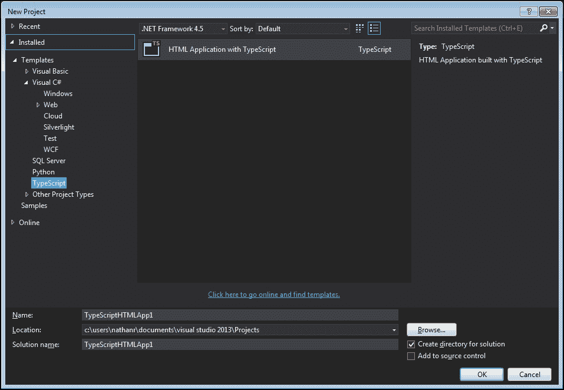

Visual Studio - 选择 TypeScript 项目类型

### 注意

这不是唯一支持 TypeScript 的项目模板。任何 ASP.NET 项目类型都支持 TypeScript。如果您计划使用 Web API 提供 RESTful 数据控制器，那么您可能考虑从头开始创建一个 MVC Web 应用程序。然后，只需包含一个 TypeScript 文件，并在项目中指定`.ts`文件扩展名，Visual Studio 将自动开始编译您的 TypeScript 文件作为新项目的一部分。

### 默认项目设置

创建一个新的 TypeScript 项目后，注意项目模板会自动生成一些文件：

+   `app.css`

+   `app.ts`

+   `index.html`

+   `web.config`

如果我们现在编译然后运行这个项目，我们将立即拥有一个完整的、运行中的 TypeScript 应用程序：

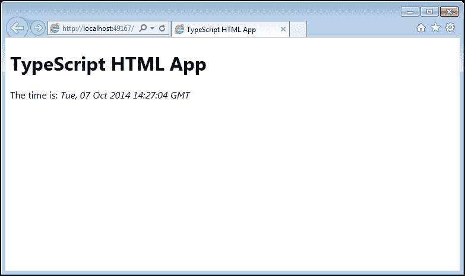

在 Internet Explorer 中运行的 Visual Studio index.html

让我们快速看一下生成的 index.html 文件及其内容：

```ts
<!DOCTYPE html>

<html lang="en">
<head>
    <meta charset="utf-8" />
    <title>TypeScript HTML App</title>
    <link rel="stylesheet" href="app.css" type="text/css" />
    <script src="img/app.js"></script>
</head>
<body>
    <h1>TypeScript HTML App</h1>

    <div id="content"></div>
</body>
</html>
```

这是一个非常简单的 HTML 文件，包括`app.css`样式表，以及一个名为`app.js`的 JavaScript 文件。这个`app.js`文件是从`app.ts` TypeScript 文件生成的 JavaScript 文件，当项目被编译时。

### 注意

`app.js`文件不包括在**Solution Explorer**中 - 只有`app.ts` TypeScript 文件包括在内。这是有意设计的。如果您希望看到生成的 JavaScript 文件，只需点击**Solution Explorer**工具栏中的**Show All Files**按钮。

### 在 Visual Studio 中调试

Visual Studio 最好的功能之一是它真正是一个集成环境。在 Visual Studio 中调试 TypeScript 与调试 C#或 Visual Studio 中的任何其他语言完全相同，并包括通常的**Immediate**、**Locals**、**Watch**和**Call stack**窗口。

要在 Visual Studio 中调试 TypeScript，只需在 TypeScript 文件中希望中断的行上设置断点（将鼠标移动到源代码行旁边的断点区域，然后单击）。在下面的图像中，我们在`window.onload`函数内设置了一个断点。

要开始调试，只需按下*F5*。

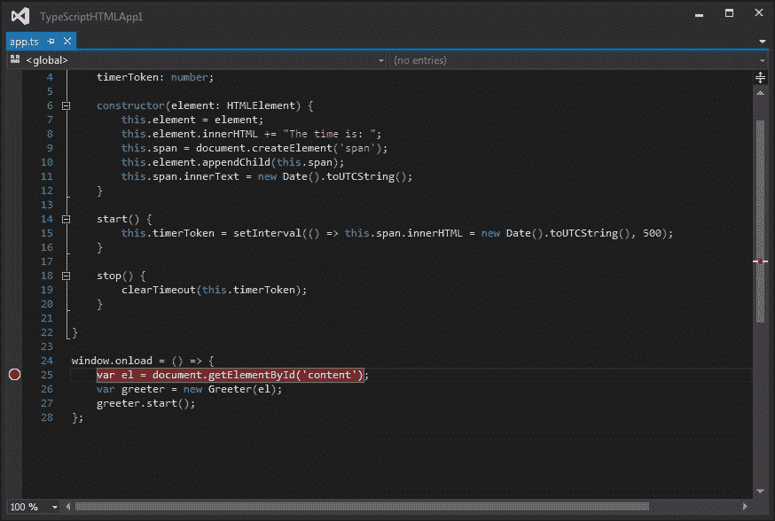

在 Visual Studio 中设置断点的 TypeScript 编辑器

当源代码行被黄色高亮显示时，只需将鼠标悬停在源代码中的任何变量上，或使用**Immediate**、**Watch**、**Locals**或**Call stack**窗口。

### 注意

Visual Studio 只支持在 Internet Explorer 中调试。如果您的计算机上安装了多个浏览器，请确保在**Debug**工具栏中选择 Internet Explorer，如下面的截图所示：

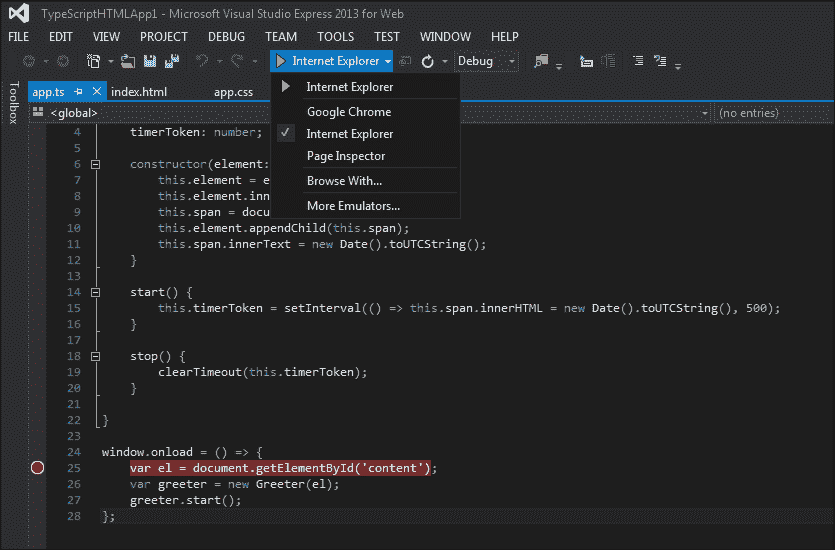

Visual Studio 调试工具栏显示浏览器选项

## WebStorm

WebStorm 是 JetBrains（[`www.jetbrains.com/webstorm/`](http://www.jetbrains.com/webstorm/)）的一款流行的 IDE，可在 Windows、Mac OS X 和 Linux 上运行。价格从单个开发者的 49 美元到商业许可证的 99 美元不等。JetBrains 还提供 30 天的试用版本。

WebStorm 有一些很棒的功能，包括实时编辑和代码建议，或者智能感知。实时编辑功能允许您保持浏览器窗口打开，WebStorm 将根据您的输入自动更新 CSS、HTML 和 JavaScript 的更改。代码建议 - 这也是另一款流行的 JetBrains 产品 Resharper 提供的 - 将突出显示您编写的代码，并建议更好的实现方式。WebStorm 还有大量的项目模板。这些模板将自动下载并包含模板所需的相关 JavaScript 或 CSS 文件，例如 Twitter Bootstrap 或 HTML5 样板。

设置 WebStorm 就像从网站下载软件包并运行安装程序一样简单。

### 创建 WebStorm 项目

要创建一个新的 WebStorm 项目，只需启动它，然后点击**文件** | **新建项目**。选择**名称**、**位置**和**项目类型**。对于这个项目，我们选择了`Twitter Bootstrap`作为项目类型，如下面的屏幕截图所示：

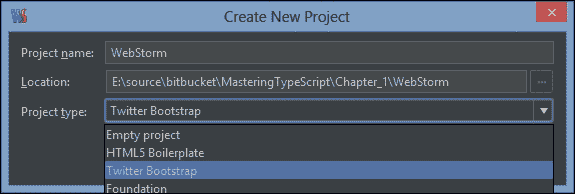

WebStorm 创建新项目对话框

WebStorm 随后会要求您选择要开发的 Twitter Boostrap 版本。在本例中，我们选择了版本`v3.2.0`。

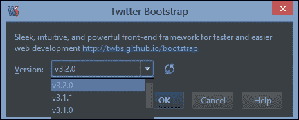

WebStorm 选择 Twitter Boostrap 版本对话框

### 默认文件

WebStorm 方便地创建了一个`css`、`fonts`和`js`目录作为新项目的一部分 - 并为我们下载并包含了相关的 CSS、字体文件和 JavaScript 文件，以便开始构建基于 Bootstrap 的新网站。请注意，它没有为我们创建`index.html`文件，也没有创建任何 TypeScript 文件 - 就像 Visual Studio 一样。在使用 TypeScript 一段时间后，大多数开发人员都会删除这些通用文件。所以让我们创建一个`index.html`文件。

只需点击**文件** | **新建**，选择 HTML 文件，输入`index`作为名称，然后点击**确定**。

接下来，让我们以类似的方式创建一个 TypeScript 文件。我们将把这个文件命名为`app`（或`app.ts`），与 Visual Studio 默认项目示例中的相同。当我们点击新的`app.ts`文件时，WebStorm 会在编辑窗口顶部弹出一个绿色栏，建议读取**文件监视器'TypeScript'可用于此文件**，如下面的屏幕截图所示：

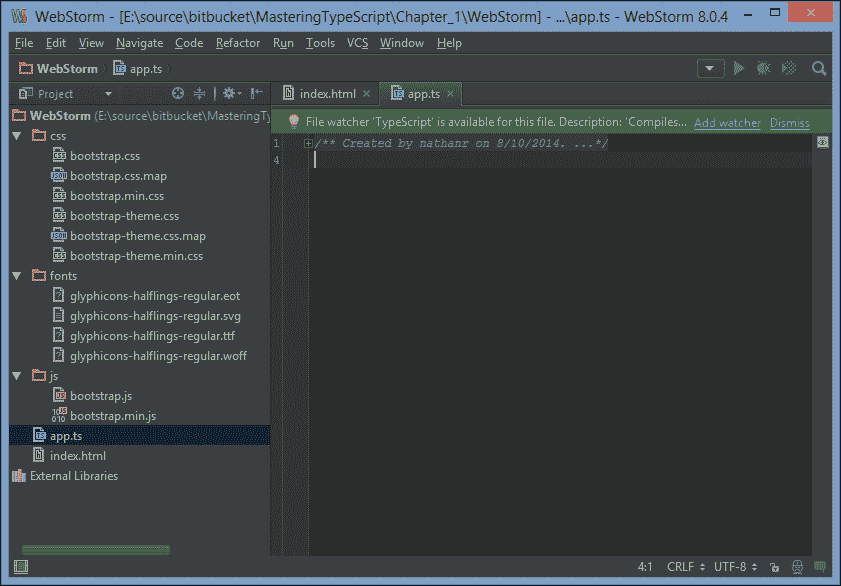

WebStorm 首次编辑 TypeScript 文件，显示文件监视器栏

WebStorm 的“文件监视器”是一个后台进程，将在您保存文件后立即执行。这相当于 Visual Studio 的**保存时编译**TypeScript 选项。正如 WebStorm 建议的那样，现在是激活 TypeScript 文件监视器的好时机。点击绿色栏中的**添加监视器**链接，并在下一个屏幕上填写详细信息。

我们可以暂时保持下一个屏幕上的默认设置不变，除了**程序**设置：

如果您在 Windows 上运行，并且已经安装了 Visual Studio，则应将其设置为`tsc.exe`可执行文件的完整路径，即`C:\Program Files (x86)\Microsoft SDKs\TypeScript\1.0\tsc.exe`，如下面的屏幕截图所示：

如果您在非 Windows 系统上运行，或者通过 Node 安装了 TypeScript，那么这个设置将只是`tsc`，没有路径。

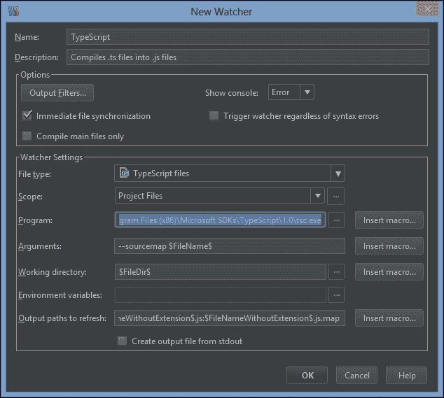

WebStorm 新文件监视器选项屏幕

现在我们已经为我们的 TypeScript 文件创建了一个文件监视器，让我们创建一个简单的 TypeScript 类，它将修改 HTML 的`div`的`innerText`。当您输入时，您会注意到 WebStorm 的自动完成或 Intellisense 功能，帮助您使用可用的关键字、参数、命名约定和其他语言特定信息。这是 WebStorm 最强大的功能之一，类似于 JetBrain 的 Resharper 工具中看到的增强 Intellisense。继续输入以下 TypeScript 代码，您将体验到 WebStorm 提供的自动完成功能。

```ts
class MyClass {
    public render(divId: string, text: string) {
        var el: HTMLElement = document.getElementById(divId);
        el.innerText = text;
    }
}

window.onload = () => {
    var myClass = new MyClass();
    myClass.render("content", "Hello World");
}
```

我们首先定义了`MyClass`类，它简单地有一个名为`render`的函数。这个`render`函数接受一个 DOM 元素名称和一个文本字符串作为参数。然后它简单地找到 DOM 元素，并设置`innerText`属性。请注意变量`el`的强类型使用-我们明确将其类型为`HTMLElement`类型。

我们还将一个函数分配给`window.onload`事件，这个函数将在页面加载后执行，类似于 Visual Studio 示例。在这个函数中，我们只是创建了`MyClass`的一个实例，并调用`render`函数，传入两个字符串参数。

如果您的 TypeScript 文件中有任何错误，这些错误将自动显示在输出窗口中，让您在输入时立即得到反馈。创建了这个 TypeScript 文件后，我们现在可以将其包含在我们的`index.html`文件中，并尝试一些调试。

打开`index.html`文件，并添加一个`script`标签来包含`app.js` JavaScript 文件，以及一个`id`为`"content"`的`div`。就像我们在 TypeScript 编辑中看到的一样，您会发现 WebStorm 在编辑 HTML 时也具有强大的 Intellisense 功能。

```ts
<!DOCTYPE html>
<html>
<head lang="en">
    <meta charset="UTF-8">
    <title></title>
    <script src="img/app.js" type="application/javascript"></script>
</head>
<body>
    <h2>Index.html</h2>
    <div id="content"></div>
</body>
</html>
```

在上述代码中有几点要注意。我们正在包括一个`app.js` JavaScript 文件的脚本标签，因为这是 TypeScript 编译器将生成的输出文件。我们还创建了一个带有`content` id 的 HTML `<div>`，`MyClass`类的实例将使用它来渲染我们的文本。

### 在 Chrome 中运行网页

在 WebStorm 中查看或编辑 HTML 文件时，您会注意到编辑窗口右上角会弹出一组小的浏览器图标。单击其中任何一个图标将使用所选的浏览器启动当前的 HTML 页面。

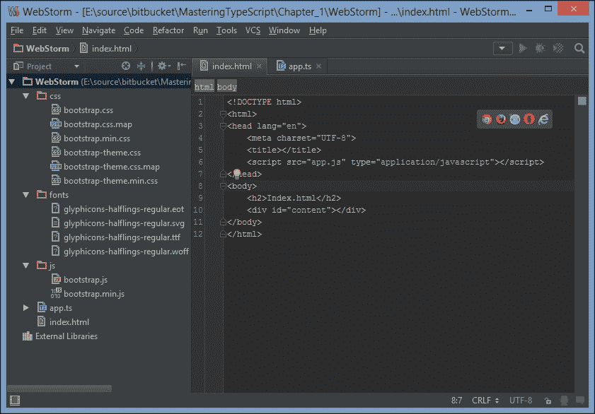

WebStorm 编辑 HTML 文件显示弹出式浏览器启动图标

### 在 Chrome 中调试

正如我们在 Visual Studio 中看到的那样，在 WebStorm 中进行调试只是标记断点，然后按下*Alt* + *F5*。WebStorm 使用 Chrome 插件来启用在 Chrome 中进行调试。如果您没有安装这个插件，WebStorm 将在您第一次开始调试时提示您下载并启用 JetBrains IDE Support Chrome 插件。启用了这个插件后，WebStorm 有一套非常强大的工具来检查 JavaScript 代码，添加监视器，查看控制台等，都可以在 IDE 内部完成。

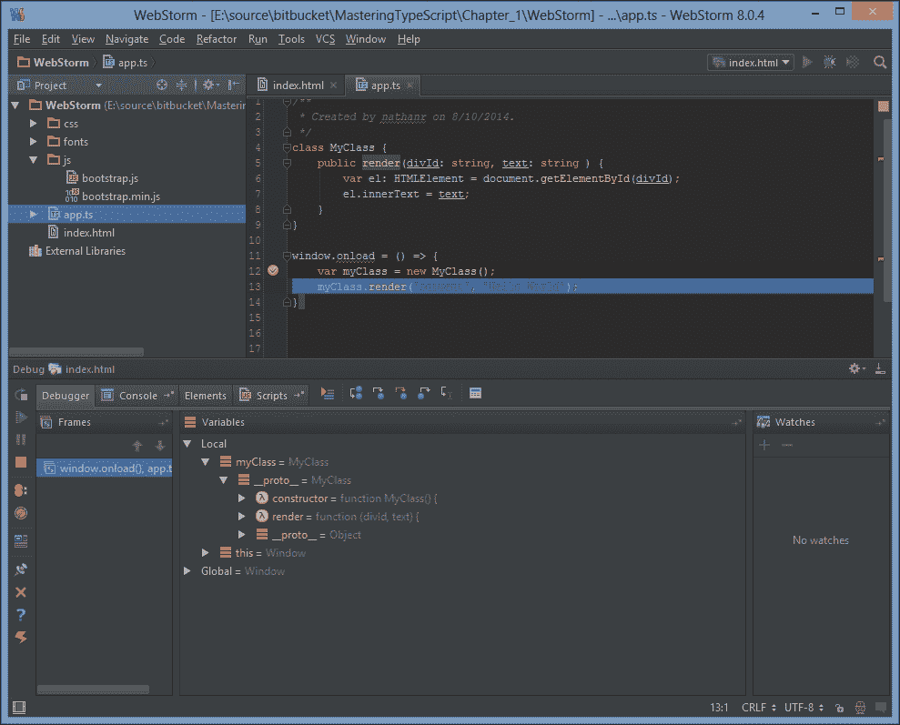

WebStorm 调试会话显示调试器面板

## Brackets

我们将在本章中看到的最后一个 IDE 实际上不是一个 TypeScript 的 IDE，它更像是一个具有 TypeScript 编辑功能的网页设计师 IDE。Brackets 是一个开源的代码编辑器，非常擅长帮助设计和样式网页。与 WebStorm 类似，它有一个实时编辑模式，您可以在输入时看到 HTML 或 CSS 在运行的网页上的更改。在我们的开发团队中，Brackets 已经成为快速原型设计 HTML 网页和 CSS 样式的非常受欢迎的编辑器。

在本章中包括 Brackets 有几个原因。首先，它是完全开源的，因此完全免费 - 并且可以在 Windows、Linux 和 Mac OS X 上运行。其次，使用 Brackets 环境可以展示一个多么简单的 TypeScript 环境会是什么样子，只需一个文本编辑器和命令行。最后，Brackets 显示了开源项目的语法高亮和代码补全能力可以和商业 IDE 一样好 - 如果不是更快。

### 安装括号

可以从[`brackets.io`](http://brackets.io)下载 Brackets 首选安装程序。安装完成后，我们需要安装一些扩展。Brackets 有一个非常简洁和简单的扩展管理器，易于使用，可以让我们轻松找到和安装可用的扩展。每当 Brackets 或已安装的扩展之一有更新时，Brackets 都会自动通知您。

要安装扩展，启动 Brackets，然后单击**文件** | **扩展管理器**，或单击右侧垂直侧边栏上的乐高图标。

首先，我们需要安装 TypeScript 扩展。在搜索栏中，键入`brackets typescript`，然后从**Francois de Campredon**那里安装**Brackets TypeScript**扩展。

如下截图所示，每个扩展都有一个**更多信息…**链接 - 这将带您到扩展主页。

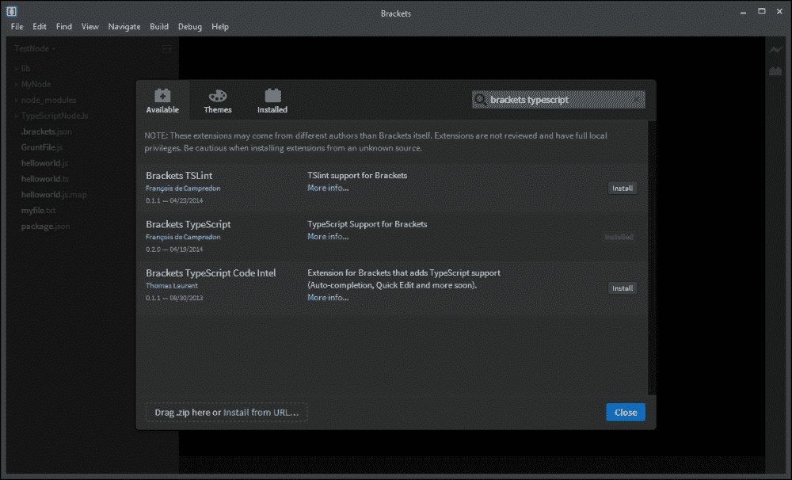

括号扩展管理器界面

除了**Brackets TypeScript**扩展之外，另一个有用的扩展是**Patrick Oladimeji**的**Code Folding**。这将允许您折叠或展开您正在编辑的任何文件中的代码部分。

另一个很棒的时间节省者是**Sergey Chikujonok**的**Emmet**。 Emmet（以前称为 Zen Coding）使用类似于 CSS 的简写，而不是传统的代码片段，来生成 HTML。在本节中，我们将快速展示 Emmet 如何用于生成 HTML，就像一个预告片一样。所以继续安装 Emmet 扩展。

### 创建一个括号项目

括号本身并没有项目的概念，而是直接在根文件夹上工作。在文件系统上创建一个目录，然后在 Brackets 中打开该文件夹：**文件** | **打开文件夹**。

现在让我们使用 Brackets 创建一个简单的 HTML 页面。选择**文件** | **新建**，或按*Ctrl* + *N*。在我们面前有一个空白文件时，我们将使用 Emmet 来生成我们的 HTML。输入以下 Emmet 字符串：

```ts
html>head+body>h3{index.html}+div#content
```

现在按下*Ctrl* + *Alt* + *Enter*，或从**文件菜单**中，选择**Emmet** | **展开缩写**。

哇！Emmet 在一毫秒内生成了以下 HTML 代码 - 对于一行源代码来说还不错。

```ts
<html>
<head></head>
<body>
    <h3>index.html</h3>
    <div id="content"></div>
</body>
</html>
```

按下*Ctrl* + *S*保存文件，并输入`index.html`。

### 注意

只有在我们保存了文件之后，括号才会根据文件扩展名进行语法高亮。这对于任何括号文件都是真实的，所以一旦你创建了一个文件 - TypeScript，CSS 或 HTML，尽快将其保存到磁盘上。

回到 Emmet。

Emmet 使用`>`字符来创建子元素，使用`+`字符来表示兄弟元素。如果在元素旁边指定花括号`{ }`，这将被用作文本内容。

我们之前输入的 Emmet 字符串基本上是这样说的：“创建一个带有子`head`标签的`html`标签。然后创建另一个名为`body`的`html`标签的子标签，创建一个带有文本`"index.html"`的子`h3`标签，然后创建一个兄弟`div`标签作为`body`的子标签，其`id`为`content`。”一定要前往[`emmet.io`](http://emmet.io)获取更多文档，并记得在学习 Emmet 字符串快捷方式时保持速查表方便（[`docs.emmet.io/cheat-sheet`](http://docs.emmet.io/cheat-sheet)）。

现在让我们用一个`app.js`脚本来完成我们的`index.html`，以加载我们生成的 TypeScript JavaScript 文件。将光标移动到`<head></head>`标签之间，然后输入另一个 Emmet 字符串：

```ts
script:src
```

现在按下*Ctrl* + *Alt* + *Enter*，让 Emmet 生成一个`<script src="img/code>`标签，并方便地将光标放在引号之间，准备让您简单地填写空白。现在键入 JavaScript 文件名`app.js`。

您完成的 index.html 文件现在应该如下所示：

```ts
<html>
<head>
    <script src="img/app.js"></script>
</head>
<body>
    <h3>index.html</h3>
    <div id="content"></div>
</body>
</html>
```

这就是我们样本 HTML 页面所需要的全部内容。

### 使用 Brackets 实时预览

在括号内，点击屏幕右侧的**实时预览**图标 - 它是电动的，就在乐高积木包图标的上方。这将启动 Chrome 并以实时预览模式渲染我们的`index.html`。为了展示 Brackets 可以用于实时预览，保持这个 Chrome 窗口可见，并导航回 Brackets。您应该能够同时看到两个窗口。

现在编辑`index.html`文件，在`<div id="content"></div>`元素下键入以下 Emmet 快捷方式：

```ts
ul>li.item$*5
```

再次按下*Ctrl* + *Alt* + *Enter*，注意生成的`<ul>`和`<li>`标签（共 5 个）如何自动显示在 Chrome 浏览器中。当您在源代码中上下移动光标时，注意 Chrome 中的蓝色轮廓如何显示网页中的元素。

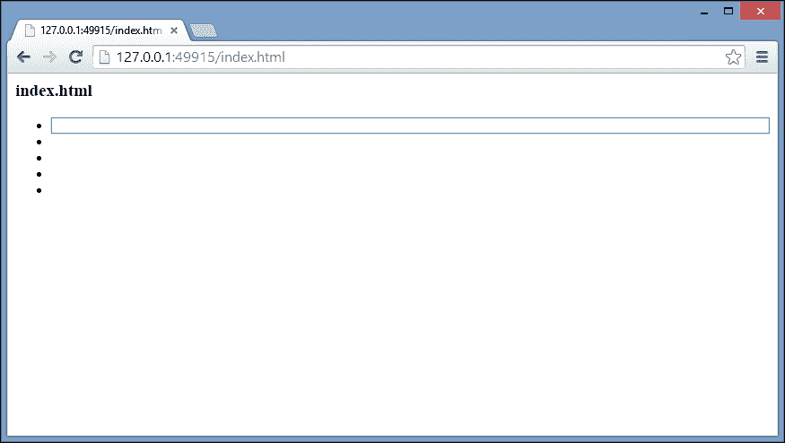

Brackets 在实时预览模式下运行 Chrome，显示突出显示的元素

我们不需要这些`<ul> <li>`标签用于我们的应用程序，所以简单地按下*Ctrl* + *Z*，*Ctrl* + *Z*来撤消我们的更改，或者删除这些标签。

### 创建一个 TypeScript 文件

要创建我们非常简单的 TypeScript 应用程序，按下*Ctrl* + *N*（新建文件），*Ctrl* + *S*（保存文件），并使用`app.ts`作为文件名。开始输入以下代码，并注意 Brackets 也会实时自动完成，或者类似于 Visual Studio 和 WebStorm 的智能感知功能：

```ts
class MyClass {
    render( elementId: string, text: string) {
        var el: HTMLElement = document.getElementById(elementId);
        el.innerHTML = text;
    }
}
window.onload = () => {
    var myClass = new MyClass();
    myClass.render("content", "Hello world!");
}
```

这是我们之前使用的相同代码，简单地创建了一个名为`MyClass`的 TypeScript 类，该类有一个`render`函数。这个`render`函数获取一个 DOM 元素，并修改它的`innerHTML`属性。`window.onload`函数创建了这个类的一个实例，然后使用适当的参数调用`render`函数。

如果您在任何阶段按下*Ctrl* + *S*保存文件，Brackets 将调用 TypeScript 语言引擎来验证我们的 TypeScript，并在底部窗格中呈现任何错误。在下面的截图中，我们可以清楚地看到我们缺少一个闭合大括号`}`。


Brackets 编辑一个 TypeScript 文件并显示编译错误

Brackets 不会调用 TypeScript 编译器来生成`app.js`文件 - 它只是在这个阶段解析 TypeScript 代码，并突出显示任何错误。在**TypeScript 问题**窗格中双击错误将跳转到相关行。

### 编译我们的 TypeScript

在我们能够运行应用程序之前，我们需要通过调用 TypeScript 编译器将`app.ts`文件编译成一个`app.js`文件。打开命令提示符，切换到您的源目录，然后简单地输入：

```ts
**tsc app.ts** 
```

这个命令将调用`tsc`命令行编译器，并从我们的`app.ts`文件创建一个`app.js`文件。

现在我们在这个目录中有一个`app.js`文件，我们可以再次调用**实时预览**按钮，现在可以看到我们的 TypeScript 应用程序确实将**Hello world!**文本呈现为内容`div`的`innerHTML`：

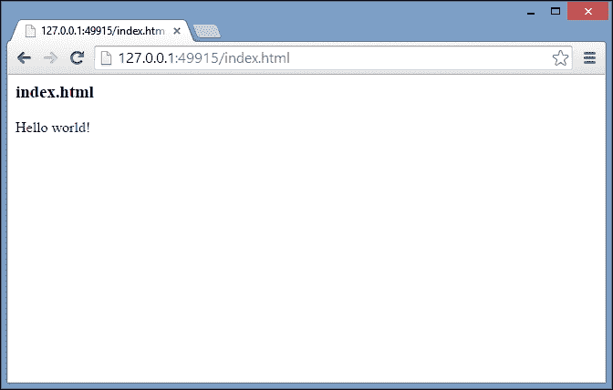

Brackets 实时预览运行我们的 TypeScript 应用程序

### 使用 Grunt

显然，每次我们进行更改时都必须切换到命令提示符并手动编译每个 TypeScript 文件将会非常乏味。Grunt 是一个自动化任务运行器（[`gruntjs.com`](http://gruntjs.com)），可以自动化许多乏味的编译、构建和测试任务。在本节中，我们将使用 Grunt 来监视 TypeScript 文件，并在保存文件时调用`tsc`编译器。这与我们之前使用的 WebStorm 文件监视功能非常相似。

Grunt 在 Node 环境中运行。Node 是一个开源的跨平台运行时环境，其程序是用 JavaScript 编写的。因此，要运行 Grunt，我们需要安装 Node。Windows、Linux 和 OS X 的安装程序可以在 Node 网站([`nodejs.org/`](http://nodejs.org/))上找到。安装 Node 后，我们可以使用**npm**（**Node 包管理器**）来安装 Grunt 和 Grunt 命令行界面。

Grunt 需要作为项目的 npm 依赖项安装。它不能像大多数 npm 包那样全局安装。为了做到这一点，我们需要在项目的根目录中创建一个`packages.json`文件。打开命令提示符，并导航到 Brackets 项目的根目录。然后简单地输入：

```ts
**npm init** 
```

然后按照提示操作。您几乎可以将所有选项保留为默认设置，并始终返回编辑从此步骤创建的`packages.json`文件，以便在需要调整任何更改时进行编辑。完成包初始化步骤后，我们现在可以按照以下方式安装 Grunt：

```ts
**npm install grunt –save-dev** 
```

-save-dev 选项将在项目目录中安装 Grunt 的本地版本。这样做是为了确保您的计算机上的多个项目可以使用不同版本的 Grunt。我们还需要安装`grunt-typescript`包，以及`grunt-contrib-watch`包。这些可以使用以下 npm 命令安装：

```ts
**Npm install grunt-typescript –save-dev**
**Npm install grunt-contrib-watch –save-dev.** 
```

最后，我们需要一个`GruntFile.js`作为 Grunt 的入口点。使用 Brackets，创建一个新文件，保存为`GruntFile.js`，并输入以下 JavaScript。请注意，这里我们创建的是 JavaScript 文件，而不是 TypeScript 文件。您可以在本章附带的示例源代码中找到此文件的副本。

```ts
module.exports = function (grunt) {
    grunt.loadNpmTasks('grunt-typescript');
    grunt.loadNpmTasks('grunt-contrib-watch');
    grunt.initConfig({
        pkg: grunt.file.readJSON('package.json'),
        typescript: {
            base: {
                src: ['**/*.ts'],
                options: {
                    module: 'commonjs',
                    target: 'es5',
                    sourceMap: true
                }
            }
        },
        watch: {
            files: '**/*.ts',
            tasks: ['typescript']
        }
    });

   //grunt.registerTask('default', ['typescript']);
    grunt.registerTask('default', ['watch']);
}
```

这个`GruntFile.js`是设置所有 Grunt 任务所必需的。它是一个简单的函数，Grunt 用它来初始化 Grunt 环境，并指定 Grunt 命令。函数的前两行加载了`grunt-typescript`和`grunt-contrib-watch`任务，然后运行了带有配置部分的`grunt.initConfig`函数。这个配置部分有一个`pkg`属性，一个`typescript`属性和一个`watch`属性。`pkg`属性是通过读取我们之前创建的`package.json`文件来设置的，这是 npm init 步骤的一部分。

`typescript`属性有一个`base`属性，在其中我们指定源代码应该是`'**/*.ts'` - 换句话说，任何子目录中的所有`.ts`文件。我们还指定了一些 TypeScript 选项 - 使用`'commonjs'`模块而不是`'amd'`模块，并生成 sourcemaps。

`watch`属性有两个子属性。`files`属性指定要监视源树中的任何`.ts`文件，`tasks`数组指定一旦文件发生更改，我们应该启动 TypeScript 命令。最后，我们调用`grunt.registerTask`，指定默认任务是监视文件更改。Grunt 将在后台运行，监视保存的文件，如果找到，将执行 TypeScript 任务。

现在我们可以从命令行运行 Grunt。确保您在 Brackets 项目的基本目录中，并启动 Grunt：

```ts
**Grunt** 
```

打开您的`app.ts`文件，进行一些小改动（添加一个空格或其他内容），然后按下*Ctrl* + *S*进行保存。现在检查 Grunt 命令行的输出。您应该会看到类似以下的内容：

```ts
**>> File "app.ts" changed.**
**Running "typescript:base" (typescript) task**
**2 files created. js: 1 file, map: 1 file, declaration: 0 files (861ms)**
**Done, without errors.**
**Completed in 1.665s at Fri Oct 10 2014 11:24:47 GMT+0800 (W. Australia Standard Time) - Waiting...** 
```

这个命令行输出证实了 Grunt watch 任务已经确认`app.ts`文件已经发生了变化，运行了 TypeScript 任务，创建了两个文件，现在正在等待下一个文件的变化。回到 Brackets，我们现在应该在 Brackets 文件窗格中看到 Grunt 创建的`app.js`文件。

### 在 Chrome 中调试

由于 Brackets 只是作为编辑器使用，我们需要使用标准的 Chrome 开发工具来调试我们的应用程序。我们在`GruntFile.js`中指定的一个选项是打开 sourcemap（`options { sourceMap : true }`）。有了这个选项，Chrome - 和其他浏览器 - 可以将运行的 JavaScript 映射回源 TypeScript 文件。这意味着您可以在 TypeScript 文件中设置调试器断点，并在调试时遍历 TypeScript 文件。

要调试我们的示例应用程序，首先在**实时预览**模式下运行`index.html`页面，然后按下*F12*以打开开发工具。Chrome 为开发人员提供了许多工具，包括 Network、Console 和 Elements 来检查 DOM。点击**Sources**选项卡，按下*Ctrl* + *P*打开文件。滚动到`app.ts`，然后按下*Enter*。在第 9 行（`var myClass = new MyClass()`）设置断点，然后重新加载页面。

Chrome 应该在调试器模式下暂停页面，方法如下：

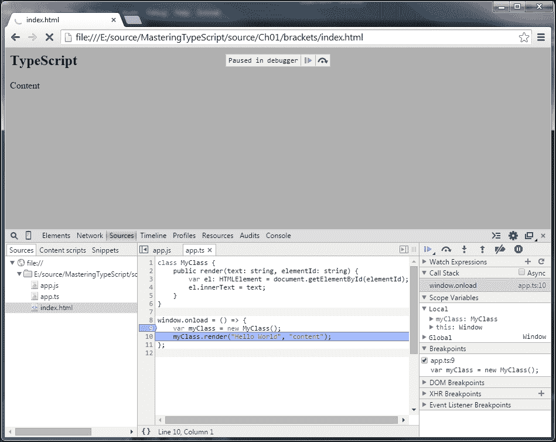

括号调试 TypeScript 使用 Chrome 开发工具。

现在您可以尽情使用所有 Chrome 调试工具。 

# 总结

在本章中，我们快速了解了 TypeScript 是什么，以及它可以为 JavaScript 开发体验带来什么好处。我们还看了如何使用两种流行的商业 IDE 和一个开源开发环境来设置开发环境。现在我们已经设置好了开发环境，可以开始更详细地了解 TypeScript 语言。我们将从类型开始，然后转向变量，然后在下一章讨论函数。

为 Bentham Chang 准备，Safari ID bentham@gmail.com 用户编号：2843974 © 2015 Safari Books Online，LLC。此下载文件仅供个人使用，并受到服务条款的约束。任何其他用途均需版权所有者事先书面同意。未经授权的使用、复制和/或分发严格禁止并违反适用法律。保留所有权利。
