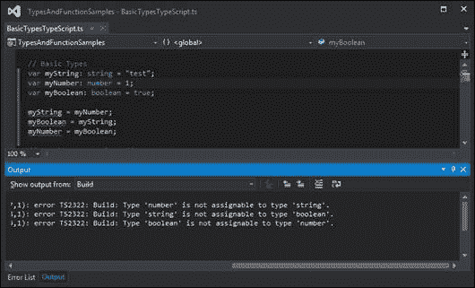

# 第二章。类型，变量和函数技术

TypeScript 通过一种简单的语法引入了强类型到 JavaScript，安德斯·海尔斯伯格称之为“语法糖”。

这一章是对 TypeScript 语言中用于将强类型应用于 JavaScript 的语法的介绍。它适用于以前没有使用过 TypeScript 的读者，并涵盖了从标准 JavaScript 过渡到 TypeScript 的过程。如果您已经有了 TypeScript 的经验，并且对下面列出的主题有很好的理解，那么请快速阅读一下，或者跳到下一章。

我们将在本章中涵盖以下主题：

+   基本类型和类型语法：字符串、数字和布尔值

+   推断类型和鸭子类型

+   数组和枚举

+   任意类型和显式转换

+   函数和匿名函数

+   可选和默认函数参数

+   参数数组

+   函数回调和函数签名

+   函数作用域规则和重载

# 基本类型

JavaScript 变量可以保存多种数据类型，包括数字、字符串、数组、对象、函数等。JavaScript 中对象的类型由其赋值确定——因此，如果一个变量被赋予了字符串值，那么它将是字符串类型。然而，这可能会在我们的代码中引入许多问题。

## JavaScript 没有强类型

正如我们在第一章中看到的，*TypeScript – 工具和框架选项*，JavaScript 对象和变量可以在运行时更改或重新分配。例如，考虑以下 JavaScript 代码：

```ts
var myString = "test";
var myNumber = 1;
var myBoolean = true;
```

我们首先定义三个变量，名为`myString`，`myNumber`和`myBoolean`。`myString`变量设置为字符串值`"test"`，因此将是`string`类型。同样，`myNumber`设置为值`1`，因此是`number`类型，`myBoolean`设置为`true`，因此是`boolean`类型。现在让我们开始将这些变量相互赋值，如下所示：

```ts
myString = myNumber;
myBoolean = myString;
myNumber = myBoolean;
```

我们首先将`myString`的值设置为`myNumber`的值（即数字值`1`）。然后将`myBoolean`的值设置为`myString`的值（现在将是数字值`1`）。最后，我们将`myNumber`的值设置为`myBoolean`的值。这里发生的是，即使我们最初有三种不同类型的变量——字符串、数字和布尔值——我们仍然能够将其中任何一个重新分配给另一种类型。我们可以将数字赋给字符串，字符串赋给布尔值，或者布尔值赋给数字。

虽然在 JavaScript 中这种赋值是合法的，但它表明 JavaScript 语言并不是强类型的。这可能导致我们的代码出现意外的行为。我们的代码的某些部分可能依赖于一个特定变量保存一个字符串的事实，如果我们无意中将一个数字赋给这个变量，我们的代码可能会以意想不到的方式开始出现问题。

## TypeScript 是强类型的

另一方面，TypeScript 是一种强类型语言。一旦你声明一个变量为`string`类型，你只能给它赋`string`值。所有进一步使用这个变量的代码必须将其视为`string`类型。这有助于确保我们编写的代码会按预期运行。虽然强类型在处理简单的字符串和数字时似乎没有任何用处，但当我们将相同的规则应用于对象、对象组、函数定义和类时，它确实变得重要。如果你编写了一个函数，期望第一个参数是`string`，第二个参数是`number`，如果有人用`boolean`作为第一个参数，另一个东西作为第二个参数调用你的函数，你是无法责怪的。

JavaScript 程序员一直严重依赖文档来理解如何调用函数，以及正确的函数参数的顺序和类型。但是，如果我们能够将所有这些文档包含在 IDE 中呢？然后，当我们编写代码时，我们的编译器可以自动指出我们错误地使用了对象和函数。这肯定会使我们更高效，更有生产力的程序员，使我们能够生成更少错误的代码。

TypeScript 确实做到了这一点。它引入了一种非常简单的语法来定义变量或函数参数的类型，以确保我们以正确的方式使用这些对象、变量和函数。如果我们违反了这些规则，TypeScript 编译器将自动生成错误，指出我们代码中的错误行。

这就是 TypeScript 得名的原因。它是带有强类型的 JavaScript - 因此是 TypeScript。让我们来看看这种非常简单的语言语法，它使 TypeScript 中的“类型”成为可能。

## 类型语法

声明变量类型的 TypeScript 语法是在变量名后面加上冒号（`:`），然后指定其类型。考虑以下 TypeScript 代码：

```ts
var myString : string = "test";
var myNumber: number = 1;
var myBoolean : boolean = true;
```

这段代码片段是我们前面的 JavaScript 代码的 TypeScript 等价物，并展示了为`myString`变量声明类型的 TypeScript 语法的示例。通过包括冒号和关键字`string`（`: string`），我们告诉编译器`myString`变量是`string`类型。同样，`myNumber`变量是`number`类型，`myBoolean`变量是`boolean`类型。TypeScript 为每种基本 JavaScript 类型引入了`string`、`number`和`boolean`关键字。

如果我们尝试将一个不同类型的值赋给一个变量，TypeScript 编译器将生成编译时错误。在前面代码中声明的变量的情况下，以下 TypeScript 代码将生成一些编译错误：

```ts
myString = myNumber;
myBoolean = myString;
myNumber = myBoolean;
```



在分配不正确的类型时，TypeScript 生成构建错误

TypeScript 编译器正在生成编译错误，因为我们试图混合这些基本类型。第一个错误是由编译器生成的，因为我们不能将`number`值赋给`string`类型的变量。同样，第二个编译错误表示我们不能将`string`值赋给`boolean`类型的变量。同样，第三个错误是因为我们不能将`boolean`值赋给`number`类型的变量。

TypeScript 语言引入的强类型语法意味着我们需要确保赋值操作符（`=`）左侧的类型与赋值操作符右侧的类型相同。

要修复前面的 TypeScript 代码并消除编译错误，我们需要做类似以下的事情：

```ts
myString = myNumber.toString();
myBoolean = (myString === "test");
if (myBoolean) {
    myNumber = 1;
}
```

我们的第一行代码已更改为在`myNumber`变量（类型为`number`）上调用`.toString()`函数，以返回一个`string`类型的值。这行代码不会生成编译错误，因为等号两边的类型相同。

我们的第二行代码也已更改，以便赋值操作符的右侧返回比较的结果，`myString === "test"`，这将返回一个`boolean`类型的值。因此，编译器将允许这段代码，因为赋值的两侧都解析为`boolean`类型的值。

我们代码片段的最后一行已更改为仅在`myBoolean`变量的值为`true`时将值`1`（类型为`number`）赋给`myNumber`变量。

Anders Hejlsberg 将这一特性描述为“语法糖”。通过在可比较的 JavaScript 代码上添加一些糖，TypeScript 使我们的代码符合了强类型规则。每当你违反这些强类型规则时，编译器都会为你的有问题的代码生成错误。

## 推断类型

TypeScript 还使用了一种叫做推断类型的技术，在你没有明确指定变量类型的情况下。换句话说，TypeScript 会找到代码中变量的第一次使用，找出变量最初初始化的类型，然后假定在代码块的其余部分中该变量的类型相同。举个例子，考虑以下代码：

```ts
var myString = "this is a string";
var myNumber = 1;
myNumber = myString;
```

我们首先声明了一个名为`myString`的变量，并给它赋了一个字符串值。TypeScript 确定这个变量被赋予了`string`类型的值，因此会推断出这个变量的任何进一步使用都是`string`类型。我们的第二个变量，名为`myNumber`，被赋予了一个数字。同样，TypeScript 推断出这个变量的类型是`number`。如果我们尝试在代码的最后一行将`myString`变量（类型为`string`）赋给`myNumber`变量（类型为`number`），TypeScript 将生成一个熟悉的错误消息：

```ts
error TS2011: Build: Cannot convert 'string' to 'number'

```

这个错误是由于 TypeScript 的推断类型规则所生成的。

## 鸭子类型

TypeScript 还对更复杂的变量类型使用了一种叫做鸭子类型的方法。鸭子类型意味着如果它看起来像鸭子，叫起来像鸭子，那么它很可能就是鸭子。考虑以下 TypeScript 代码：

```ts
var complexType = { name: "myName", id: 1 };
complexType = { id: 2, name: "anotherName" };
```

我们从一个名为`complexType`的变量开始，它被赋予了一个包含`name`和`id`属性的简单 JavaScript 对象。在我们的第二行代码中，我们可以看到我们正在重新分配这个`complexType`变量的值给另一个也有`id`和`name`属性的对象。编译器将在这种情况下使用鸭子类型来判断这个赋值是否有效。换句话说，如果一个对象具有与另一个对象相同的属性集，那么它们被认为是相同类型的。

为了进一步说明这一点，让我们看看编译器在我们尝试将一个不符合鸭子类型的对象分配给我们的`complexType`变量时的反应：

```ts
var complexType = { name: "myName", id: 1 };
complexType = { id: 2 };
complexType = { name: "anotherName" };
complexType = { address: "address" };
```

这段代码片段的第一行定义了我们的`complexType`变量，并将一个包含`id`和`name`属性的对象赋给它。从这一点开始，TypeScript 将在我们尝试分配给`complexType`变量的任何值上使用这个推断类型。在我们的第二行代码中，我们尝试分配一个具有`id`属性但没有`name`属性的值。在第三行代码中，我们再次尝试分配一个具有`name`属性但没有`id`属性的值。在代码片段的最后一行，我们完全错了。编译这段代码将生成以下错误：

```ts
error TS2012: Build: Cannot convert '{ id: number; }' to '{ name: string; id: number; }':
error TS2012: Build: Cannot convert '{ name: string; }' to '{ name: string; id: number; }':
error TS2012: Build: Cannot convert '{ address: string; }' to '{ name: string; id: number; }':

```

从错误消息中我们可以看到，TypeScript 使用鸭子类型来确保类型安全。在每条消息中，编译器都给出了关于有问题的代码的线索 - 明确说明了它期望的内容。`complexType`变量既有`id`属性，也有`name`属性。因此，要给`complexType`变量赋值，这个值将需要同时具有`id`和`name`属性。通过处理每一个错误，TypeScript 都明确说明了每一行代码的问题所在。

请注意，以下代码不会生成任何错误消息：

```ts
var complexType = { name: "myName", id: 1 };
complexType = { name: "name", id: 2, address: "address" };
```

再次，我们的第一行代码定义了 `complexType` 变量，就像我们之前看到的那样，具有 `id` 和 `name` 属性。现在，看一下这个例子的第二行。我们正在使用的对象实际上有三个属性：`name`、`id` 和 `address`。即使我们添加了一个新的 `address` 属性，编译器只会检查我们的新对象是否同时具有 `id` 和 `name`。因为我们的新对象具有这些属性，因此将匹配变量的原始类型，TypeScript 将允许通过鸭子类型进行此赋值。

推断类型和鸭子类型是 TypeScript 语言的强大特性——为我们的代码带来了强类型，而无需使用显式类型，即冒号 `:` 然后是类型说明符语法。

## 数组

除了基本的 JavaScript 类型字符串、数字和布尔值之外，TypeScript 还有两种其他数据类型：数组和枚举。让我们看一下定义数组的语法。

数组只是用 `[]` 符号标记，类似于 JavaScript，并且每个数组可以被强类型化以保存特定类型，如下面的代码所示：

```ts
var arrayOfNumbers: number[] = [1, 2, 3];
arrayOfNumbers = [3, 4, 5];
arrayOfNumbers = ["one", "two", "three"];
```

在这个代码片段的第一行，我们定义了一个名为 `arrayOfNumbers` 的数组，并进一步指定该数组的每个元素必须是 `number` 类型。然后，第二行重新分配了这个数组以保存一些不同的数值。

然而，这个片段的最后一行将生成以下错误消息：

```ts
error TS2012: Build: Cannot convert 'string[]' to 'number[]':

```

这个错误消息警告我们，变量 `arrayOfNumbers` 的强类型只接受 `number` 类型的值。我们的代码试图将一个字符串数组赋给这个数字数组，因此会生成一个编译错误。

## 任意类型

所有这些类型检查都很好，但 JavaScript 足够灵活，允许变量混合使用。以下代码片段实际上是有效的 JavaScript 代码：

```ts
var item1 = { id: 1, name: "item 1" };
item1 = { id: 2 };
```

我们的第一行代码将一个具有 `id` 属性和 `name` 属性的对象分配给变量 `item1`。然后，第二行将这个变量重新分配给一个只有 `id` 属性而没有 `name` 属性的对象。不幸的是，正如我们之前所见，TypeScript 会为前面的代码生成一个编译时错误：

```ts
error TS2012: Build: Cannot convert '{ id: number; }' to '{ id: number; name: string; }'

```

TypeScript 为这种情况引入了 `any` 类型。在本质上，指定对象的类型为 `any` 会放宽编译器的严格类型检查。以下代码显示了如何使用 `any` 类型：

```ts
var item1 : any = { id: 1, name: "item 1" };
item1 = { id: 2 };
```

注意我们的第一行代码已经改变。我们指定变量 `item1` 的类型为 `: any`，这样我们的代码就可以编译而不会出错。没有类型说明符 `: any`，第二行代码通常会生成一个错误。

## 显式转换

与任何强类型语言一样，总有一个时刻需要明确指定对象的类型。这个概念将在下一章中更加详细地展开，但在这里快速记录显式转换是值得的。可以使用 `< >` 语法将一个对象转换为另一个对象的类型。

### 注意

这不是严格意义上的转换；它更像是 TypeScript 编译器在运行时使用的断言。您使用的任何显式转换都将在生成的 JavaScript 中被编译掉，并且不会影响运行时的代码。

让我们修改之前的代码片段来使用显式转换：

```ts
var item1 = <any>{ id: 1, name: "item 1" };
item1 = { id: 2 };
```

请注意，在这段代码片段的第一行，我们现在已经用右边的`<any>`显式转换替换了赋值左边的`: any`类型指定符。这段代码片段告诉编译器显式地转换，或者显式地将右边的`{ id: 1, name: "item 1" }`对象作为`any`类型处理。因此，`item1`变量也因此具有`any`类型（由于 TypeScript 的推断类型规则）。这样就允许我们在代码的第二行将只有`{ id: 2 }`属性的对象赋值给变量`item1`。在赋值的右边使用`< >`语法的这种技术称为显式转换。

虽然`any`类型是 TypeScript 语言的一个必要特性，但它的使用应尽可能受到限制。它是一种确保与 JavaScript 兼容性的语言快捷方式，但过度使用`any`类型会很快导致难以发现的编码错误。与其使用`any`类型，不如尝试找出你正在使用的对象的正确类型，然后使用这种类型。我们在编程团队内使用一个缩写：**S.F.I.A.T.**（读作 sviat 或 sveat）。**Simply Find an Interface for the Any Type**。虽然这听起来有些愚蠢，但它强调了`any`类型应该总是被接口替换，所以只需找到它。接口是在 TypeScript 中定义自定义类型的一种方式，我们将在下一章中介绍接口。只需记住，通过积极尝试定义对象的类型应该是什么，我们正在构建强类型代码，因此保护自己免受未来的编码错误和错误的影响。

## 枚举

枚举是从其他语言（如 C#）借鉴过来的一种特殊类型，它提供了解决特殊数字问题的解决方案。枚举将人类可读的名称与特定数字关联起来。考虑以下代码：

```ts
enum DoorState {
    Open,
    Closed,
    Ajar
}
```

在这段代码片段中，我们定义了一个名为`DoorState`的`enum`，用于表示门的状态。这个门状态的有效值是`Open`、`Closed`或`Ajar`。在底层（在生成的 JavaScript 中），TypeScript 将为这些人类可读的枚举值分配一个数值。在这个例子中，`DoorState.Open`的枚举值将等于数值`0`。同样，枚举值`DoorState.Closed`将等于数值`1`，而`DoorState.Ajar`的枚举值将等于`2`。让我们快速看一下我们将如何使用这些枚举值：

```ts
window.onload = () => {
    var myDoor = DoorState.Open;
    console.log("My door state is " + myDoor.toString());
};
```

`window.onload`函数中的第一行创建了一个名为`myDoor`的变量，并将其值设置为`DoorState.Open`。第二行只是将`myDoor`的值记录到控制台。这个`console.log`函数的输出将是：

```ts
My door state is 0

```

这清楚地显示了 TypeScript 编译器已经用数值`0`替换了`DoorState.Open`的枚举值。现在让我们以稍微不同的方式使用这个枚举：

```ts
window.onload = () => {
    var openDoor = DoorState["Closed"];
    console.log("My door state is " + openDoor.toString());
};
```

这段代码片段使用字符串值"Closed"来查找`enum`类型，并将结果的枚举值赋给`openDoor`变量。这段代码的输出将是：

```ts
My door state is 1

```

这个示例清楚地显示了`DoorState.Closed`的枚举值与`DoorState["Closed"]`的枚举值相同，因为两种变体都解析为`1`的数值。最后，让我们看看当我们使用数组类型语法引用枚举时会发生什么：

```ts
window.onload = () => {
    var ajarDoor = DoorState[2];
    console.log("My door state is " + ajarDoor.toString());
};
```

在这里，我们将变量`openDoor`赋值为基于`DoorState`枚举的第二个索引值的枚举值。然而，这段代码的输出令人惊讶：

```ts
My door state is Ajar

```

您可能期望输出只是`2`，但这里我们得到的是字符串`"Ajar"` - 这是我们原始枚举名称的字符串表示。这实际上是一个巧妙的小技巧 - 允许我们访问枚举值的字符串表示。这种可能性的原因在于 TypeScript 编译器生成的 JavaScript。让我们看一下 TypeScript 编译器生成的闭包：

```ts
var DoorState;
(function (DoorState) {
    DoorState[DoorState["Open"] = 0] = "Open";
    DoorState[DoorState["Closed"] = 1] = "Closed";
    DoorState[DoorState["Ajar"] = 2] = "Ajar";
})(DoorState || (DoorState = {}));
```

这种看起来很奇怪的语法正在构建一个具有特定内部结构的对象。正是这种内部结构使我们能够以刚刚探索的各种方式使用这个枚举。如果我们在调试 JavaScript 时查询这个结构，我们将看到`DoorState`对象的内部结构如下：

```ts
DoorState
{...}
    [prototype]: {...}
    [0]: "Open"
    [1]: "Closed"
    [2]: "Ajar"
    [prototype]: []
    Ajar: 2
    Closed: 1
    Open: 0
```

`DoorState`对象有一个名为`"0"`的属性，其字符串值为`"Open"`。不幸的是，在 JavaScript 中，数字`0`不是有效的属性名称，因此我们不能简单地使用`DoorState.0`来访问此属性。相反，我们必须使用`DoorState[0]`或`DoorState["0"]`来访问此属性。`DoorState`对象还有一个名为`Open`的属性，其值设置为数字`0`。在 JavaScript 中，`Open`是一个有效的属性名称，因此我们可以使用`DoorState["Open"]`或简单地`DoorState.Open`来访问此属性，这在 JavaScript 中等同于同一个属性。

尽管底层的 JavaScript 可能有点令人困惑，但我们需要记住的是，枚举是一种方便的方式，可以为特殊数字定义一个易于记忆和人类可读的名称。使用易于阅读的枚举，而不是在代码中散布各种特殊数字，也使代码的意图更加清晰。使用应用程序范围的值`DoorState.Open`或`DoorState.Closed`比记住为`Open`设置值为`0`，`Closed`设置值为`1`，`ajar`设置值为`3`要简单得多。除了使我们的代码更易读、更易维护外，使用枚举还可以在这些特殊数字值发生变化时保护我们的代码库，因为它们都在一个地方定义了。

关于枚举的最后一点说明 - 如果需要，我们可以手动设置数值：

```ts
enum DoorState {
    Open = 3,
    Closed = 7,
    Ajar = 10
}
```

在这里，我们已经覆盖了枚举的默认值，将`DoorState.Open`设置为`3`，`DoorState.Closed`设置为`7`，`DoorState.Ajar`设置为`10`。

### Const 枚举

随着 TypeScript 1.4 的发布，我们还可以定义`const`枚举如下：

```ts
const enum DoorStateConst {
    Open,
    Closed,
    Ajar
}

var myState = DoorStateConst.Open;
```

这些类型的枚举主要是出于性能原因引入的，由此产生的 JavaScript 将不包含我们之前看到的`DoorStateConst`枚举的完整闭包定义。让我们快速看一下从这个`DoorStateConst`枚举生成的 JavaScript：

```ts
var myState = 0 /* Open */;
```

请注意，我们根本没有完整的 JavaScript 闭包`DoorStateConstenum`。编译器只是将`DoorStateConst.Open`枚举解析为其内部值`0`，并完全删除了`const enum`定义。

因此，使用 const 枚举时，我们无法引用枚举的内部字符串值，就像我们在之前的代码示例中所做的那样。考虑以下示例：

```ts
// generates an error
console.log(DoorStateConst[0]);
// valid usage
console.log(DoorStateConst["Open"]);
```

第一个`console.log`语句现在将生成一个编译时错误 - 因为我们没有完整的闭包可用于我们的 const 枚举的`[0]`属性。然而，这个`const`枚举的第二个用法是有效的，并将生成以下 JavaScript：

```ts
console.log(0 /* "Open" */);
```

使用 const 枚举时，只需记住编译器将剥离所有枚举定义，并直接将枚举的数值替换到我们的 JavaScript 代码中。

# 函数

JavaScript 使用`function`关键字、一组大括号，然后是一组花括号来定义函数。典型的 JavaScript 函数将被编写如下：

```ts
function addNumbers(a, b) {
    return a + b;
}

var result = addNumbers(1, 2);
var result2 = addNumbers("1", "2");
```

这段代码很容易理解；我们定义了一个名为`addNumbers`的函数，它接受两个变量并返回它们的和。然后我们调用这个函数，传入`1`和`2`的值。变量`result`的值将是`1` + `2`，即`3`。现在看看代码的最后一行。在这里，我们调用`addNumbers`函数，传入两个字符串作为参数，而不是数字。变量`result2`的值将是一个字符串`"12"`。这个字符串值似乎可能不是期望的结果，因为函数的名称是`addNumbers`。

将前面的代码复制到一个 TypeScript 文件中不会生成任何错误，但让我们在前面的 JavaScript 中插入一些类型规则，使其更加健壮：

```ts
function addNumbers(a: number, b: number): number {
    return a + b;
};

var result = addNumbers(1, 2);
var result2 = addNumbers("1", "2");
```

在这个 TypeScript 代码中，我们为`addNumbers`函数的两个参数`a`和`b`添加了`:number`类型，并且在`( )`括号后面也添加了`:number`类型。在这里放置类型描述符意味着函数本身的返回类型被强制类型化为返回一个`number`类型的值。然而，在 TypeScript 中，代码的最后一行将导致编译错误：

```ts
error TS2082: Build: Supplied parameters do not match any signature of call target:

```

这个错误消息是由于我们明确声明了函数应该只接受`number`类型的两个参数`a`和`b`，但在我们的错误代码中，我们传递了两个字符串。因此，TypeScript 编译器无法匹配一个名为`addNumbers`的函数的签名，该函数接受两个`string`类型的参数。

## 匿名函数

JavaScript 语言也有匿名函数的概念。这些是在定义时即时定义的函数，不指定函数名称。考虑以下 JavaScript 代码：

```ts
var addVar = function(a, b) {
    return a + b;
};

var result = addVar(1, 2);
```

这段代码定义了一个没有名称的函数，它添加了两个值。因为这个函数没有名称，所以它被称为匿名函数。然后将这个匿名函数分配给一个名为`addVar`的变量。然后，`addVar`变量可以作为一个函数调用，带有两个参数，并且返回值将是执行匿名函数的结果。在这种情况下，变量`result`将具有值`3`。

现在让我们用 TypeScript 重写前面的 JavaScript 函数，并添加一些类型语法，以确保函数只接受两个`number`类型的参数，并返回一个`number`类型的值：

```ts
var addVar = function(a: number, b: number): number {
    return a + b;
}

var result = addVar(1, 2);
var result2 = addVar("1", "2");
```

在这段代码中，我们创建了一个匿名函数，它只接受类型为`number`的参数`a`和`b`，并且返回类型为`number`的值。现在`a`和`b`参数的类型，以及函数的返回类型，都使用了`:number`语法。这是 TypeScript 注入到语言中的另一个简单的“语法糖”的例子。如果我们编译这段代码，TypeScript 将拒绝最后一行的代码，在这里我们尝试用两个字符串参数调用我们的匿名函数：

```ts
error TS2082: Build: Supplied parameters do not match any signature of call target:

```

## 可选参数

当我们调用一个期望参数的 JavaScript 函数，并且我们没有提供这些参数时，函数内部的参数值将是`undefined`。作为这一点的例子，考虑以下 JavaScript 代码：

```ts
var concatStrings = function(a, b, c) {
    return a + b + c;
}

console.log(concatStrings("a", "b", "c"));
console.log(concatStrings("a", "b"));
```

在这里，我们定义了一个名为`concatStrings`的函数，它接受三个参数`a`、`b`和`c`，并简单地返回这些值的总和。如果我们使用所有三个参数调用这个函数，就像在这个片段的倒数第二行中看到的那样，我们将在控制台中得到字符串`"abc"`。然而，如果我们只提供两个参数，就像在这个片段的最后一行中看到的那样，将在控制台中得到字符串`"abundefined"`。再次，如果我们调用一个函数并且不提供参数，那么这个参数，在我们的例子中是`c`，将简单地是`undefined`。

TypeScript 引入了问号`?`语法来表示可选参数。考虑以下 TypeScript 函数定义：

```ts
var concatStrings = function(a: string, b: string, c?: string) {
    return a + b + c;
}

console.log(concatStrings("a", "b", "c"));
console.log(concatStrings("a", "b"));
console.log(concatStrings("a"));
```

这是原始`concatStrings` JavaScript 函数的强类型版本，我们之前使用过。请注意在第三个参数的语法中添加了`?`字符：`c?: string`。这表示第三个参数是可选的，因此，除了最后一行之外，所有前面的代码都将编译成功。最后一行将生成一个错误：

```ts
error TS2081: Build: Supplied parameters do not match any signature of call target.

```

这个错误是因为我们试图用只有一个参数调用`concatStrings`函数。然而，我们的函数定义要求至少有两个参数，只有第三个参数是可选的。

### 注意

可选参数必须是函数定义中的最后一个参数。只要非可选参数在可选参数之前，你可以有任意数量的可选参数。

## 默认参数

可选参数函数定义的微妙变体允许我们指定参数的默认值，如果它没有从调用代码中作为参数传递进来。让我们修改前面的函数定义来使用可选参数：

```ts
var concatStrings = function(a: string, b: string, c: string = "c") {
    return a + b + c;
}

console.log(concatStrings("a", "b", "c"));
console.log(concatStrings("a", "b"));
```

这个函数定义现在已经去掉了`?`可选参数的语法，而是给最后一个参数赋了一个值："c:string = "c"。通过使用默认参数，如果我们没有为最后一个参数命名为`c`提供一个值，`concatStrings`函数将会用默认值"c"来替代。因此参数`c`将不会是`undefined`。最后两行代码的输出都将是"abc"。

### 注意

注意，使用默认参数语法将自动使参数变为可选。

## 参数变量

JavaScript 语言允许一个函数被调用时带有可变数量的参数。每个 JavaScript 函数都可以访问一个特殊的变量，名为`arguments`，它可以用来检索传递给函数的所有参数。例如，考虑以下 JavaScript 代码：

```ts
function testParams() {
    if (arguments.length > 0) {
        for (var i = 0; i < arguments.length; i++) {
            console.log("Argument " + i + " = " + arguments[i]);
        }
    }
}

testParams(1, 2, 3, 4);
testParams("first argument");
```

在这段代码中，我们定义了一个名为`testParams`的函数，没有任何命名参数。但请注意，我们可以使用特殊变量`arguments`来测试函数是否被调用了任何参数。在我们的示例中，我们可以简单地遍历`arguments`数组，并通过使用数组索引器`arguments[i]`将每个参数的值记录到控制台中。console.log 调用的输出如下：

```ts
Argument 0 = 1
Argument 1 = 2
Argument 2 = 3
Argument 3 = 4
Argument 0 = first argument

```

那么，在 TypeScript 中如何表示可变数量的函数参数呢？答案是使用所谓的剩余参数，或者三个点(`…`)的语法。下面是用 TypeScript 表达的等价`testParams`函数：

```ts
function testParams(...argArray: number[]) {
    if (argArray.length > 0) {
        for (var i = 0; i < argArray.length; i++) {
            console.log("argArray " + i + " = " + argArray[i]);
            console.log("arguments " + i + " = " + arguments[i]);
        }
    }

}

testParams(1);
testParams(1, 2, 3, 4);
testParams("one", "two");
```

请注意我们的`testParams`函数使用了`…argArray: number[]`的语法。这个语法告诉 TypeScript 编译器函数可以接受任意数量的参数。这意味着我们对这个函数的使用，即用`testParams(1)`或`testParams(1,2,3,4)`调用函数，都将正确编译。在这个版本的`testParams`函数中，我们添加了两个`console.log`行，只是为了展示`arguments`数组可以通过命名的剩余参数`argArray[i]`或通过普通的 JavaScript 数组`arguments[i]`来访问。

在这个示例中，最后一行将会生成一个编译错误，因为我们已经定义了剩余参数只接受数字，而我们正试图用字符串调用这个函数。

### 注意

使用`argArray`和`arguments`的微妙差异在于参数的推断类型。由于我们明确指定了`argArray`的类型为`number`，TypeScript 将把`argArray`数组的任何项都视为数字。然而，内部的`arguments`数组没有推断类型，因此将被视为`any`类型。

我们还可以在函数定义中结合普通参数和剩余参数，只要剩余参数是参数列表中的最后一个定义，如下所示：

```ts
function testParamsTs2(arg1: string,
    arg2: number, ...ArgArray: number[]) {
}
```

在这里，我们有两个名为`arg1`和`arg2`的普通参数，然后是一个`argArray`剩余参数。错误地将剩余参数放在参数列表的开头将生成一个编译错误。

## 函数回调

JavaScript 最强大的特性之一，事实上也是 Node 技术构建的基础，就是回调函数的概念。回调函数是传递到另一个函数中的函数。请记住 JavaScript 不是强类型的，所以变量也可以是一个函数。通过查看一些 JavaScript 代码来最好地说明这一点：

```ts
function myCallBack(text) {
    console.log("inside myCallback " + text);
}

function callingFunction(initialText, callback) {
    console.log("inside CallingFunction");
    callback(initialText);
}

callingFunction("myText", myCallBack);
```

在这里，我们有一个名为`myCallBack`的函数，它接受一个参数并将其值记录到控制台。然后我们定义了一个名为`callingFunction`的函数，它接受两个参数：`initialText`和`callback`。这个函数的第一行只是将`"inside CallingFunction"`记录到控制台。`callingFunction`的第二行是有趣的部分。它假设`callback`参数实际上是一个函数，并调用它。它还将`initialText`变量传递给`callback`函数。如果我们运行这段代码，将会得到两条消息记录到控制台，如下所示：

```ts
inside CallingFunction
inside myCallback myText

```

但是，如果我们不将函数作为回调传递会发生什么？在前面的代码中没有任何信号告诉我们`callingFunction`的第二个参数必须是一个函数。如果我们无意中使用字符串而不是函数作为第二个参数调用`callingFunction`函数，如下所示：

```ts
callingFunction("myText", "this is not a function");
```

我们将得到一个 JavaScript 运行时错误：

```ts
0x800a138a - JavaScript runtime error: Function expected

```

然而，防御性的程序员首先会检查`callback`参数是否实际上是一个函数，然后再调用它，如下所示：

```ts
function callingFunction(initialText, callback) {
    console.log("inside CallingFunction");
    if (typeof callback === "function") {
        callback(initialText);
    } else {
        console.log(callback + " is not a function");
    }
}

callingFunction("myText", "this is not a function");
```

请注意此代码片段的第三行，我们在调用之前检查`callback`变量的类型。如果它不是一个函数，我们就会在控制台上记录一条消息。在此片段的最后一行，我们正在执行`callingFunction`，但这次将一个字符串作为第二个参数传递。

代码片段的输出将是：

```ts
inside CallingFunction
this is not a function is not a function

```

因此，当使用函数回调时，JavaScript 程序员需要做两件事；首先，了解哪些参数实际上是回调，其次，编写无效使用回调函数的代码。

## 函数签名

TypeScript 强制类型的“语法糖”不仅适用于变量和类型，还适用于函数签名。如果我们能够在代码中记录 JavaScript 回调函数，然后在用户传递错误类型的参数给我们的函数时警告他们，那该多好啊？

TypeScript 通过函数签名来实现这一点。函数签名引入了一个`() =>`的箭头语法，来定义函数的外观。让我们用 TypeScript 重新编写前面的 JavaScript 示例：

```ts
function myCallBack(text: string) {
    console.log("inside myCallback " + text);
}

function callingFunction(initialText: string,
    callback: (text: string) => void)
{
    callback(initialText);
}

callingFunction("myText", myCallBack);
callingFunction("myText", "this is not a function");
```

我们的第一个函数定义`myCallBack`现在将`text`参数强制类型为`string`类型。我们的`callingFunction`函数有两个参数；`initialText`是`string`类型，`callback`现在具有新的函数签名语法。让我们更仔细地看一下这个函数签名：

```ts
callback: (text: string) => void
```

这个函数定义的意思是，`callback`参数被类型化（通过`:`语法）为一个函数，使用箭头语法`() =>`。此外，这个函数接受一个名为`text`的参数，类型为`string`。在箭头语法的右边，我们可以看到一个新的 TypeScript 基本类型，称为`void`。Void 是一个关键字，用于表示函数不返回值。

因此，`callingFunction`函数只会接受一个函数作为其第二个参数，该函数接受一个字符串参数并且不返回任何值。编译前面的代码将正确地突出显示代码片段的最后一行中的错误，即我们将一个字符串作为第二个参数传递，而不是一个回调函数：

```ts
error TS2082: Build: Supplied parameters do not match any signature of call target:
Type '(text: string) => void' requires a call signature, but type 'String' lacks one

```

鉴于回调函数的前面函数签名，以下代码也会生成编译时错误：

```ts
function myCallBackNumber(arg1: number) {
    console.log("arg1 = " + arg1);
}

callingFunction("myText", myCallBackNumber);
```

在这里，我们定义了一个名为`myCallBackNumber`的函数，它以一个数字作为唯一参数。当我们尝试编译这段代码时，我们将收到一个错误消息，指示`callback`参数，也就是我们的`myCallBackNumber`函数，也没有正确的函数签名。

```ts
Call signatures of types 'typeof myCallBackNumber' and '(text: string) => void' are incompatible.

```

`myCallBackNumber`的函数签名实际上应该是`(arg1:number) => void`，而不是所需的`(text: string) => void`，因此会出现错误。

### 注意

在函数签名中，参数名（`arg1`或`text`）不需要相同。只需要函数的参数数量、它们的类型和函数的返回类型相同。

这是 TypeScript 的一个非常强大的特性——在代码中定义函数的签名，并在用户调用函数时警告他们是否使用了正确的参数。正如我们在 TypeScript 介绍中看到的，当我们使用第三方库时，这一点尤为重要。在我们能够在 TypeScript 中使用第三方函数、类或对象之前，我们需要定义它们的函数签名。这些函数定义被放入一种特殊类型的 TypeScript 文件中，称为声明文件，并以`.d.ts`扩展名保存。我们将在第四章中深入了解声明文件，*编写和使用声明文件*。

## 函数回调和作用域

JavaScript 使用词法作用域规则来定义变量的有效作用域。这意味着变量的值由它在源代码中的位置来定义。嵌套函数可以访问在其父作用域中定义的变量。作为这一点的例子，考虑以下 TypeScript 代码：

```ts
function testScope() {
    var testVariable = "myTestVariable";
    function print() {
        console.log(testVariable);
    }
}

console.log(testVariable);
```

这段代码片段定义了一个名为`testScope`的函数。变量`testVariable`在这个函数内部定义。`print`函数是`testScope`的子函数，因此它可以访问`testVariable`变量。然而，代码的最后一行将生成一个编译错误，因为它试图使用`testVariable`变量，而这个变量在`testScope`函数体内部是有效的。

```ts
error TS2095: Build: Could not find symbol 'testVariable'.

```

简单吧？嵌套函数可以访问源代码中的变量，取决于它在源代码中的位置。这一切都很好，但在大型 JavaScript 项目中，有许多不同的文件，代码的许多部分都设计为可重用。

让我们看看这些作用域规则如何成为一个问题。对于这个示例，我们将使用一个典型的回调场景——使用 jQuery 执行异步调用来获取一些数据。考虑以下 TypeScript 代码：

```ts
var testVariable = "testValue";

function getData() {
    var testVariable_2 = "testValue_2";
    $.ajax(
        {
            url: "/sample_json.json",
            success: (data, status, jqXhr) => {
                console.log("success : testVariable is "
                    + testVariable);
                console.log("success : testVariable_2 is" 
                    + testVariable_2);
            },
            error: (message, status, stack) => {
                alert("error " + message);
            }
        }
   );
}

getData();
```

在这段代码片段中，我们定义了一个名为`testVariable`的变量并设置了它的值。然后我们定义了一个名为`getData`的函数。`getData`函数设置了另一个名为`testVariable_2`的变量，然后调用了 jQuery 的`$.ajax`函数。`$.ajax`函数配置了三个属性：`url`、`success`和`error`。`url`属性是一个简单的字符串，指向项目目录中的`sample_json.json`文件。`success`属性是一个匿名函数回调，简单地将`testVariable`和`testVariable_2`的值记录到控制台中。最后，`error`属性也是一个匿名函数回调，简单地弹出一个警告。

这段代码按预期运行，成功函数将把以下结果记录到控制台中：

```ts
success : testVariable is :testValue
success : testVariable_2 is :testValue_2

```

到目前为止一切都很好。现在，假设我们正在尝试重构前面的代码，因为我们正在做一些类似的`$.ajax`调用，并希望在其他地方重用`success`回调函数。我们可以很容易地切换掉这个匿名函数，并为我们的`success`回调创建一个命名函数，如下所示：

```ts
var testVariable = "testValue";

function getData() {
    var testVariable_2 = "testValue_2";
    $.ajax(
        {
            url: "/sample_json.json",
            success: successCallback,
            error: (message, status, stack) => {
                alert("error " + message);
            }
        }
   );
}

function successCallback(data, status, jqXhr) {
    console.log("success : testVariable is :" + testVariable);
    console.log("success : testVariable_2 is :" + testVariable_2);
}

getData();
```

在这个示例中，我们创建了一个名为`successCallback`的新函数，参数与之前的匿名函数相同。我们还修改了`$.ajax`调用，只需将这个函数作为`success`属性的回调函数传递进去：`success: successCallback`。如果我们现在编译这段代码，TypeScript 会生成一个错误，如下所示：

```ts
error TS2095: Build: Could not find symbol ''testVariable_2''.

```

由于我们改变了代码的词法作用域，通过创建一个命名函数，新的`successCallback`函数不再可以访问变量`testVariable_2`。

### 注意

在一个简单的示例中很容易发现这种错误，但在更大的项目中，以及在使用第三方库时，这些错误变得更难追踪。因此，值得一提的是，在使用回调函数时，我们需要理解词法作用域。如果你的代码期望一个属性有一个值，在回调之后它没有一个值，那么记得查看调用代码的上下文。

## 函数重载

由于 JavaScript 是一种动态语言，我们经常可以用不同的参数类型调用同一个函数。考虑以下 JavaScript 代码：

```ts
function add(x, y) {
    return x + y;
}

console.log("add(1,1)=" + add(1,1));
console.log("add(''1'',''1'')=" + add("1", "1"));
console.log("add(true,false)=" + add(true, false));
```

在这里，我们定义了一个简单的`add`函数，返回其两个参数`x`和`y`的和。这段代码片段的最后三行只是记录了`add`函数的不同类型的结果：两个数字、两个字符串和两个布尔值。如果我们运行这段代码，将会看到以下输出：

```ts
add(1,1)=2
add('1','1')=11
add(true,false)=1

```

TypeScript 引入了一种特定的语法来表示同一个函数的多个函数签名。如果我们要在 TypeScript 中复制上述代码，我们需要使用函数重载语法：

```ts
function add(arg1: string, arg2: string): string;
function add(arg1: number, arg2: number): number;
function add(arg1: boolean, arg2: boolean): boolean;
function add(arg1: any, arg2: any): any {
    return arg1 + arg2;
}

console.log("add(1,1)=" + add(1, 1));
console.log("add(''1'',''1'')=" + add("1", "1"));
console.log("add(true,false)=" + add(true, false));
```

这段代码片段的第一行指定了一个`add`函数的函数重载签名，接受两个字符串并返回一个`string`。第二行指定了另一个使用数字的函数重载，第三行使用布尔值。第四行包含了函数的实际体，并使用了`any`类型说明符。片段的最后三行展示了我们如何使用这些函数签名，与我们之前使用的 JavaScript 代码类似。

在上述代码片段中有三个值得注意的地方。首先，片段的前三行中的函数签名实际上都没有函数体。其次，最终的函数定义使用了`any`类型说明符，并最终包括了函数体。函数重载的语法必须遵循这个结构，包括函数体的最终函数签名必须使用`any`类型说明符，因为其他任何类型都会生成编译时错误。

第三点需要注意的是，我们通过使用这些函数重载签名，限制了`add`函数只接受两个相同类型的参数。如果我们尝试混合类型；例如，如果我们用一个`boolean`和一个`string`调用函数，如下所示：

```ts
console.log("add(true,''1'')", add(true, "1"));
```

TypeScript 会生成编译错误：

```ts
error TS2082: Build: Supplied parameters do not match any signature of call target:
error TS2087: Build: Could not select overload for ''call'' expression.

```

这似乎与我们最终的函数定义相矛盾。在原始的 TypeScript 示例中，我们有一个接受`(arg1: any, arg2: any)`的函数签名；因此，理论上当我们尝试将一个`boolean`和一个`number`相加时，应该调用这个函数。然而，TypeScript 的函数重载语法不允许这样做。请记住，函数重载的语法必须包括对函数体的`any`类型的使用，因为所有的重载最终都会调用这个函数体。然而，在函数体之上包含函数重载的部分告诉编译器，这些是调用代码可用的唯一签名。

## 联合类型

随着 TypeScript 1.4 的发布，我们现在可以使用管道符(`|`)来表示联合类型，将一个或两个类型组合起来。因此，我们可以将前面代码片段中的`add`函数重写为以下形式：

```ts
function addWithUnion(
    arg1: string | number | boolean,
    arg2: string | number | boolean
     ): string | number | boolean
    {
    if (typeof arg1 === "string") {
        // arg1 is treated as a string here
        return arg1 + "is a string";
    }
    if (typeof arg1 === "number") {
        // arg1 is treated as a number here
        return arg1 + 10;
    }
    if (typeof arg1 === "boolean") {
        // arg1 is treated as a boolean here
        return arg1 && false;
    }
}
```

这个名为`addWithUnion`的函数有两个参数，`arg1`和`arg2`。这些参数现在使用联合类型语法来指定这些参数可以是`string`、`number`或`boolean`。还要注意，我们函数的返回类型再次使用联合类型，这意味着函数也将返回其中的一个类型。

### 类型保护

在前面代码片段的`addWithUnion`函数体内，我们检查`arg1`参数的类型是否为字符串，语句为`typeof arg1 === "string"`。这被称为类型保护，意味着`arg1`的类型将在`if`语句块内被视为`string`类型。在下一个`if`语句的函数体内，`arg1`的类型将被视为数字，允许我们将`10`添加到它的值，在最后一个 if 语句的函数体内，编译器将把类型视为`boolean`。

### 类型别名

我们还可以为类型、联合类型或函数定义定义别名。类型别名使用`type`关键字表示。因此，我们可以将前面的`add`函数写成如下形式：

```ts
type StringNumberOrBoolean = string | number | boolean;

function addWithAliases(
    arg1: StringNumberOrBoolean,
    arg2: StringNumberOrBoolean
     ): StringNumberOrBoolean {

}
```

在这里，我们定义了一个名为`StringNumberOrBoolean`的类型别名，它是`string`、`number`和`boolean`类型的联合类型。

类型别名也可以用于函数签名，如下所示：

```ts
type CallbackWithString = (string) => void;

function usingCallback(callback: CallbackWithString) {
    callback("this is a string");
}
```

在这里，我们定义了一个名为`CallbackWithString`的类型别名，它是一个接受单个`string`参数并返回`void`的函数。我们的`usingCallback`函数在函数签名中接受这个类型别名作为`callback`参数的类型。

# 总结

在本章中，我们讨论了 TypeScript 的基本类型、变量和函数技术。我们看到 TypeScript 如何在普通 JavaScript 代码的基础上引入了“语法糖”，以确保强类型的变量和函数签名。我们还看到 TypeScript 如何使用鸭子类型和显式转换，并以 TypeScript 函数、函数签名和重载结束。在下一章中，我们将在此基础上继续学习，看看 TypeScript 如何将这些强类型规则扩展到接口、类和泛型中。

为 Bentham Chang 准备，Safari ID bentham@gmail.com 用户编号：2843974 © 2015 Safari Books Online，LLC。此下载文件仅供个人使用，并受到服务条款的约束。任何其他用途均需版权所有者的事先书面同意。未经授权的使用、复制和/或分发严格禁止并违反适用法律。保留所有权利。
