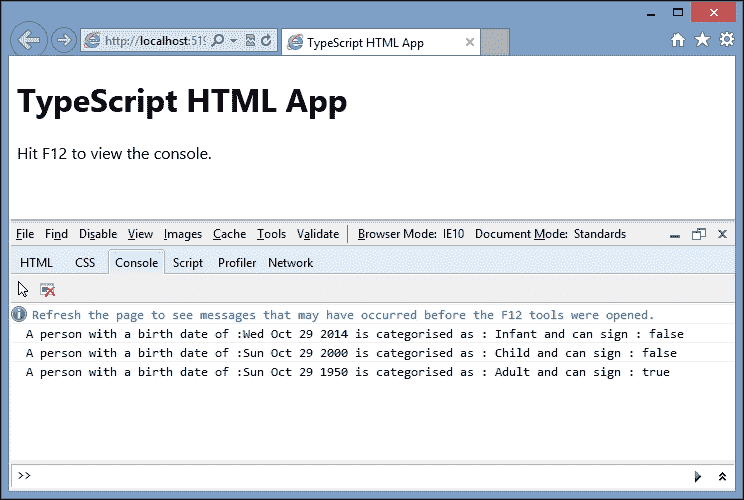
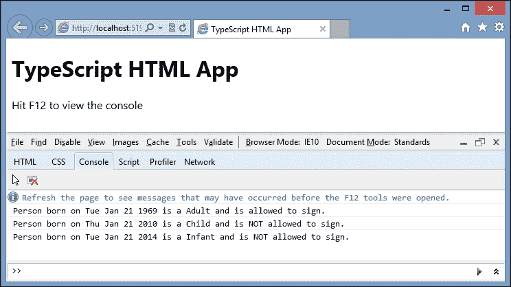

# 第三章：接口、类和泛型

我们已经看到 TypeScript 如何使用基本类型、推断类型和函数签名来为 JavaScript 带来强类型的开发体验。TypeScript 还引入了从其他面向对象语言借鉴的三个概念：接口、类和泛型。在本章中，我们将看看这些面向对象的概念在 TypeScript 中的使用，以及它们为 JavaScript 程序员带来的好处。

本章的第一部分适用于首次使用 TypeScript 的读者，并从基础开始介绍接口、类和继承。本章的第二部分建立在这些知识之上，展示如何创建和使用工厂设计模式。本章的第三部分涉及泛型。

如果您有 TypeScript 的经验，正在积极使用接口和类，了解继承，并且对应用于`this`参数的词法作用域规则感到满意，那么您可能对后面关于工厂设计模式或泛型的部分更感兴趣。

本章将涵盖以下主题：

+   接口

+   类

+   继承

+   闭包

+   工厂设计模式

+   类修饰符、静态函数和属性

+   泛型

+   运行时类型检查

# 接口

接口为我们提供了一种机制来定义对象必须实现的属性和方法。如果一个对象遵循一个接口，那么就说该对象实现了该接口。如果一个对象没有正确实现接口，TypeScript 会在我们的代码中更早地生成编译错误。接口也是定义自定义类型的另一种方式，除其他外，它在我们构造对象时提供了一个早期指示，即对象没有我们需要的属性和方法。

考虑以下 TypeScript 代码：

```ts
interface IComplexType {
    id: number;
    name: string;
}

var complexType : IComplexType = 
    { id: 1, name: "firstObject" };
var complexType_2: IComplexType = 
    { id: 2, description: "myDescription"};

if (complexType == complexType_2) {
    console.log("types are equal");
}
```

我们从一个名为`IComplexType`的接口开始，该接口具有`id`和`name`属性。`id`属性被强类型为`number`类型，`name`属性为`string`类型。然后我们创建一个名为`complexType`的变量，并使用`:`类型语法来指示该变量的类型为`IComplexType`。下一个变量名为`complexType_2`，也将该变量强类型为`IComplexType`类型。然后我们比较`complexType`和`complexType_2`变量，并在控制台中记录一条消息，如果这些对象相同。然而，这段代码将生成一个编译错误：

```ts
error TS2012: Build: Cannot convert 
'{ id: number; description: string; }' to 'IComplexType':

```

这个编译错误告诉我们`complexType_2`变量必须符合`IComplexType`接口。`complexType_2`变量有一个`id`属性，但它没有一个`name`属性。为了解决这个错误，并确保变量实现了`IComplexType`接口，我们只需要添加一个`name`属性，如下所示：

```ts
var complexType_2: IComplexType = {
    id: 2,
    name: "secondObject",
    description: "myDescription"
};
```

即使我们有额外的`description`属性，`IComplexType`接口只提到了`id`和`name`属性，所以只要我们有这些属性，对象就被认为是实现了`IComplexType`接口。

接口是 TypeScript 的一个编译时语言特性，编译器不会从您在 TypeScript 项目中包含的接口生成任何 JavaScript 代码。接口仅在编译步骤期间由编译器用于类型检查。

### 注意

在本书中，我们将坚持使用一个简单的接口命名约定，即在接口名称前加上字母`I`。使用这种命名方案有助于处理代码分布在多个文件的大型项目。在代码中看到任何以`I`为前缀的东西，可以立即将其识别为接口。但是，您可以随意命名您的接口。

# 类

类是对象的定义，它持有什么数据，以及可以执行什么操作。类和接口是面向对象编程原则的基石，并且通常在设计模式中一起工作。设计模式是一种简单的编程结构，已被证明是解决特定编程任务的最佳方式。稍后会详细介绍设计模式。

让我们使用类重新创建我们之前的代码示例：

```ts
interface IComplexType {
    id: number;
    name: string;
    print(): string;
}
class ComplexType implements IComplexType {
    id: number;
    name: string;
    print(): string {
        return "id:" + this.id + " name:" + this.name;
    }
}

var complexType: ComplexType = new ComplexType();
complexType.id = 1;
complexType.name = "complexType";
var complexType_2: ComplexType = new ComplexType();
complexType_2.id = 2;
complexType_2.name = "complexType_2";

window.onload = () => {
    console.log(complexType.print());
    console.log(complexType_2.print());
}
```

首先，我们有我们的接口定义（`IComplexType`），它有一个 `id` 和一个 `name` 属性，以及一个 `print` 函数。然后我们定义了一个名为 `ComplexType` 的类，该类实现了 `IComplexType` 接口。换句话说，`ComplexType` 的类定义必须与 `IComplexType` 接口定义相匹配。请注意，类定义不会创建一个变量——它只是定义了类的结构。然后我们创建了一个名为 `complexType` 的变量，然后将一个 `ComplexType` 类的新实例分配给这个变量。这行代码被称为创建类的实例。一旦我们有了类的实例，我们就可以设置类属性的值。代码的最后部分只是在 `window.onload` 函数中调用每个类的 `print` 函数。这段代码的输出如下：

```ts
id:1 name:complexType
id:2 name:complexType_2

```

## 类构造函数

类可以在初始构造时接受参数。如果我们看一下之前的代码示例，我们对 `ComplexType` 类的实例进行调用，然后设置其属性的调用可以简化为一行代码：

```ts
var complexType = new ComplexType(1, "complexType");
```

这个版本的代码将 `id` 和 `name` 属性作为类构造函数的一部分进行传递。然而，我们的类定义需要包括一个新的函数，名为 `constructor`，以接受这种语法。我们更新后的类定义将变成：

```ts
class ComplexType implements IComplexType {
    id: number;
    name: string;
    constructor(idArg: number, nameArg: string) {
        this.id = idArg;
        this.name = nameArg;
    }
    print(): string {
        return "id:" + this.id + " name:" + this.name;
    }
}
```

注意 `constructor` 函数。它是一个普通的函数定义，但使用了 `constructor` 关键字，并接受 `idArg` 和 `nameArg` 作为参数。这些参数被强类型为 `number` 和 `string` 类型。然后将 `ComplexType` 类的内部 `id` 属性赋值为 `idArg` 参数值。注意用于引用 `id` 属性的语法：`this.id`。类使用与对象相同的 `this` 语法来访问内部属性。如果我们尝试在不使用 `this` 关键字的情况下使用内部类属性，TypeScript 将生成编译错误。

## 类函数

类中的所有函数都遵循我们在上一章关于函数中涵盖的语法和规则。作为这些规则的复习，所有类函数都可以：

+   强类型

+   使用 `any` 关键字来放宽强类型

+   具有可选参数

+   具有默认参数

+   使用参数数组或剩余参数语法

+   允许函数回调并指定函数回调签名

+   允许函数重载

让我们修改我们的 `ComplexType` 类定义，并包括这些规则的示例：

```ts
class ComplexType implements IComplexType {
    id: number;
    name: string;
    constructor(idArg: number, nameArg: string);
    constructor(idArg: string, nameArg: string);
    constructor(idArg: any, nameArg: any) {
        this.id = idArg;
        this.name = nameArg;
    }
    print(): string {
        return "id:" + this.id + " name:" + this.name;
    }
    usingTheAnyKeyword(arg1: any): any {
        this.id = arg1;
    }
    usingOptionalParameters(optionalArg1?: number) {
        if (optionalArg1) {
            this.id = optionalArg1;
        }
    }
    usingDefaultParameters(defaultArg1: number = 0) {
        this.id = defaultArg1;
    }
    usingRestSyntax(...argArray: number []) {
        if (argArray.length > 0) {
            this.id = argArray[0];
        }
    }
    usingFunctionCallbacks( callback: (id: number) => string  ) {
        callback(this.id);
    }

}
```

要注意的第一件事是 `constructor` 函数。我们的类定义正在使用函数重载来定义 `constructor` 函数，允许使用一个 `number` 和一个 `string` 或两个字符串来构造类。以下代码展示了如何使用这些 `constructor` 定义：

```ts
var complexType: ComplexType = new ComplexType(1, "complexType");
var complexType_2: ComplexType = new ComplexType("1", "1");
var complexType_3: ComplexType = new ComplexType(true, true);
```

`complexType`变量使用构造函数的`number,` `string`变体，`complexType_2`变量使用`string,string`变体。`complexType_3`变量将生成编译错误，因为我们不允许构造函数使用`boolean,boolean`变体。然而，您可能会争辩说，最后一个构造函数指定了`any,any`变体，这应该允许我们使用`boolean,boolean`。只要记住，使用构造函数重载时，实际的构造函数实现必须使用与构造函数重载的任何变体兼容的类型。然后，我们的构造函数实现必须使用`any,any`变体。然而，由于我们使用构造函数重载，这个`any,any`变体被编译器隐藏，以支持我们的重载签名。

以下代码示例显示了我们如何使用我们为这个类定义的其余函数。让我们从`usingTheAnyKeyword`函数开始：

```ts
complexType.usingTheAnyKeyword(true);
complexType.usingTheAnyKeyword({id: 1, name: "test"});
```

此示例中的第一个调用使用布尔值调用`usingTheAnyKeyword`函数，第二个调用使用任意对象。这两个函数调用都是有效的，因为参数`arg1`定义为`any`类型。接下来是`usingOptionalParameters`函数：

```ts
complexType.usingOptionalParameters(1);
complexType.usingOptionalParameters();
```

在这里，我们首先使用单个参数调用`usingOptionalParameters`函数，然后再次调用时不使用任何参数。同样，这些调用都是有效的，因为`optionalArg1`参数被标记为可选。现在是`usingDefaultParameters`函数：

```ts
complexType.usingDefaultParameters(2);
complexType.usingDefaultParameters();
```

对`usingDefaultParameters`函数的这两个调用都是有效的。第一个调用将覆盖默认值 0，而第二个调用——没有参数——将使用默认值 0。接下来是`usingRestSyntax`函数：

```ts
complexType.usingRestSyntax(1, 2, 3);
complexType.usingRestSyntax(1, 2, 3, 4, 5);
```

我们的剩余函数`usingRestSyntax`可以使用任意数量的参数进行调用，因为我们使用剩余参数语法将这些参数保存在一个数组中。这两个调用都是有效的。最后，让我们看一下`usingFunctionCallbacks`函数：

```ts
function myCallbackFunction(id: number): string {
    return id.toString();
}
complexType.usingFunctionCallbacks(myCallbackFunction);
```

这段代码显示了一个名为`myCallbackFunction`的函数的定义。它匹配了`usingFunctionCallbacks`函数所需的回调签名，允许我们将`myCallbackFunction`作为参数传递给`usingFunctionCallbacks`函数。

请注意，如果您在理解这些不同的函数签名时遇到任何困难，请重新查看第二章中有关函数的相关部分，*类型、变量和函数技术*，其中详细解释了这些概念。

## 接口函数定义

接口与类一样，在处理函数时遵循相同的规则。要更新我们的`IComplexType`接口定义以匹配`ComplexType`类定义，我们需要为每个新函数编写一个函数定义，如下所示：

```ts
interface IComplexType {
    id: number;
    name: string;
    print(): string;
    usingTheAnyKeyword(arg1: any): any;
    usingOptionalParameters(optionalArg1?: number);
    usingDefaultParameters(defaultArg1?: number);
    usingRestSyntax(...argArray: number []);
    usingFunctionCallbacks(callback: (id: number) => string);
}
```

第 1 到 4 行构成了我们现有的接口定义，包括`id`和`name`属性以及我们一直在使用的`print`函数。第 5 行显示了如何为`usingTheAnyKeyword`函数定义一个函数签名。它看起来非常像我们实际的类函数，但没有函数体。第 6 行显示了如何为`usingOptionalParameters`函数使用可选参数。然而，第 7 行与我们的`usingDefaultParameters`函数的类定义略有不同。请记住，接口定义了我们的类或对象的形状，因此不能包含变量或值。因此，我们已将`defaultArg1`参数定义为可选的，并将默认值的赋值留给了类实现本身。第 8 行显示了包含剩余参数语法的`usingRestSyntax`函数的定义，第 9 行显示了带有回调函数签名的`usingFunctionCallbacks`函数的定义。它们与类函数签名几乎完全相同。

这个接口唯一缺少的是`constructor`函数的签名。如果我们在接口中包含`constructor`签名，TypeScript 会生成一个错误。假设我们在`IComplexType`接口中包含`constructor`函数的定义：

```ts
interface IComplexType {

    constructor(arg1: any, arg2: any);

}
```

TypeScript 编译器会生成一个错误：

```ts
Types of property 'constructor' of types 'ComplexType' and 'IComplexType' are incompatible

```

这个错误告诉我们，当我们使用`constructor`函数时，构造函数的返回类型会被 TypeScript 编译器隐式地确定。因此，`IComplexType`构造函数的返回类型将是`IComplexType`，而`ComplexType`构造函数的返回类型将是`ComplexType`。即使`ComplexType`函数实现了`IComplexType`接口，它们实际上是两种不同的类型，因此`constructor`签名将始终不兼容，因此会出现编译错误。

# 继承

继承是面向对象编程的基石之一。继承意味着一个对象使用另一个对象作为其基本类型，从而“继承”了基本对象的所有特征，包括属性和函数。接口和类都可以使用继承。被继承的接口或类称为基接口或基类，进行继承的接口或类称为派生接口或派生类。TypeScript 使用`extends`关键字实现继承。

## 接口继承

作为接口继承的例子，考虑以下 TypeScript 代码：

```ts
interface IBase {
    id: number;
}

interface IDerivedFromBase extends IBase {
    name: string;
}

class DerivedClass implements IDerivedFromBase {
    id: number;
    name: string;
}
```

我们从一个名为`IBase`的接口开始，该接口定义了一个类型为数字的`id`属性。我们的第二个接口定义`IDerivedFromBase`从`IBase`继承，并因此自动包含`id`属性。然后，`IDerivedFromBase`接口定义了一个类型为字符串的`name`属性。由于`IDerivedFromBase`接口继承自`IBase`，因此它实际上有两个属性：`id`和`name`。`DerivedClass`的类定义实现了`IDerivedFromBase`接口，因此必须包含`id`和`name`属性，以成功实现`IDerivedFromBase`接口的所有属性。虽然在这个例子中我们只展示了属性，但是函数也适用相同的规则。

## 类继承

类也可以像接口一样使用继承。使用我们对`IBase`和`IDerivedFromBase`接口的定义，以下代码展示了类继承的一个例子：

```ts
class BaseClass implements IBase {
    id : number;
}

class DerivedFromBaseClass 
    extends BaseClass 
    implements IDerivedFromBase 
{
    name: string;
}
```

第一个类名为`BaseClass`，实现了`IBase`接口，因此只需要定义一个类型为`number`的`id`属性。第二个类`DerivedFromBaseClass`继承自`BaseClass`类（使用`extends`关键字），同时实现了`IDerivedFromBase`接口。由于`BaseClass`已经定义了`IDerivedFromBase`接口中需要的`id`属性，`DerivedFromBaseClass`类需要实现的唯一其他属性是`name`属性。因此，我们只需要在`DerivedFromBaseClass`类中包含`name`属性的定义。

## 使用 super 进行函数和构造函数重载

在使用继承时，通常需要创建一个具有定义构造函数的基类。然后，在任何派生类的构造函数中，我们需要调用基类的构造函数并传递这些参数。这称为构造函数重载。换句话说，派生类的构造函数重载了基类的构造函数。TypeScript 包括`super`关键字，以便使用相同名称调用基类的函数。以下代码片段最好解释了这一点：

```ts
class BaseClassWithConstructor {
    private _id: number;
    constructor(id: number) {
        this._id = id;
    }
}

class DerivedClassWithConstructor extends BaseClassWithConstructor {
    private _name: string;
    constructor(id: number, name: string) {
        this._name = name;
        super(id);
    }
}
```

在这段代码片段中，我们定义了一个名为`BaseClassWithConstructor`的类，它拥有一个私有的`_id`属性。这个类有一个需要`id`参数的`constructor`函数。我们的第二个类，名为`DerivedClassWithConstructor`，继承自`BaseClassWithConstructor`类。`DerivedClassWithConstructor`的构造函数接受一个`id`参数和一个`name`参数，但它需要将`id`参数传递给基类。这就是`super`调用的作用。`super`关键字调用了基类中与派生类中函数同名的函数。`DerivedClassWithConstructor`的构造函数的最后一行显示了使用`super`关键字的调用，将接收到的`id`参数传递给基类构造函数。

这个技术被称为函数重载。换句话说，派生类有一个与基类函数同名的函数，并且"重载"了这个函数的定义。我们可以在类中的任何函数上使用这个技术，不仅仅是在构造函数上。考虑以下代码片段：

```ts
class BaseClassWithConstructor {
    private _id: number;
    constructor(id: number) {
        this._id = id;
    }
    getProperties(): string {
        return "_id:" + this._id;
    }
}

class DerivedClassWithConstructor extends BaseClassWithConstructor {
    private _name: string;
    constructor(id: number, name: string) {
        this._name = name;
        super(id);
    }
    getProperties(): string {
        return "_name:" + this._name + "," + super.getProperties();
    }
}
```

`BaseClassWithConstructor`类现在有一个名为`getProperties`的函数，它只是返回类的属性的字符串表示。然而，我们的`DerivedClassWithConstructor`类还包括一个名为`getProperties`的函数。这个函数是对`getProperties`基类函数的函数重写。为了调用基类函数，我们需要包括`super`关键字，就像在调用`super`.`getProperties()`中所示的那样。

以下是前面代码的一个示例用法：

```ts
window.onload = () => {
    var myDerivedClass = new DerivedClassWithConstructor(1, "name");
    console.log(
        myDerivedClass.getProperties()
    );
}
```

这段代码创建了一个名为`myDerivedClass`的变量，并传入了`id`和`name`的必需参数。然后我们简单地将对`getProperties`函数的调用结果记录到控制台上。这段代码片段将导致以下控制台输出：

```ts
_name:name,_id:1

```

结果显示，`myDerivedClass`变量的`getProperties`函数将按预期调用基类的`getProperties`函数。

## JavaScript 闭包

在我们继续本章之前，让我们快速看一下 TypeScript 是如何通过闭包技术在生成的 JavaScript 中实现类的。正如我们在第一章中提到的，闭包是指引用独立变量的函数。这些变量本质上记住了它们被创建时的环境。考虑以下 JavaScript 代码：

```ts
function TestClosure(value) {
    this._value = value;
    function printValue() {
        console.log(this._value);
    }
    return printValue;
}

var myClosure = TestClosure(12);
myClosure();
```

在这里，我们有一个名为`TestClosure`的函数，它接受一个名为`value`的参数。函数的主体首先将`value`参数赋给一个名为`this._value`的内部属性，然后定义了一个名为`printValue`的内部函数，它将`this._value`属性的值记录到控制台上。有趣的是`TestClosure`函数的最后一行 - 我们返回了`printValue`函数。

现在看一下代码片段的最后两行。我们创建了一个名为`myClosure`的变量，并将调用`TestClosure`函数的结果赋给它。请注意，因为我们从`TestClosure`函数内部返回了`printValue`函数，这实质上也使得`myClosure`变量成为了一个函数。当我们在片段的最后一行执行这个函数时，它将执行内部的`printValue`函数，但会记住创建`myClosure`变量时使用的初始值`12`。代码的最后一行的输出将会将值`12`记录到控制台上。

这就是闭包的本质。闭包是一种特殊类型的对象，它将函数与创建它的初始环境结合在一起。在我们之前的示例中，由于我们将通过`value`参数传入的任何内容存储到名为`this._value`的局部变量中，JavaScript 会记住创建闭包时的环境，换句话说，创建时分配给`this._value`属性的任何内容都将被记住，并且可以在以后重复使用。

有了这个想法，让我们来看一下 TypeScript 编译器为我们刚刚使用的`BaseClassWithConstructor`类生成的 JavaScript：

```ts
var BaseClassWithConstructor = (function () {
    function BaseClassWithConstructor(id) {
        this._id = id;
    }
    BaseClassWithConstructor.prototype.getProperties = function () {
        return "_id:" + this._id;
    };
    return BaseClassWithConstructor;
})();
```

我们的闭包从第一行开始是`function () {`，并以最后一行的`}`结束。这个闭包首先定义了一个用作构造函数的函数：`BaseClassWithConstructor(id)`。请记住，当构造一个 JavaScript 对象时，它会继承或复制原始对象的`prototype`属性到新实例中。在我们的示例中，使用`BaseClassWithConstructor`函数创建的任何对象也将继承`getProperties`函数，因为它是`prototype`属性的一部分。此外，因为在`prototype`属性上定义的函数也在闭包内，它们将记住原始的执行环境和变量值。

然后，这个闭包被包围在第一行的开括号`(`和最后一行的闭括号`)`中——定义了一个被称为 JavaScript 函数表达式的东西。然后，这个函数表达式立即被最后两个大括号`();`执行。这种立即执行函数的技术被称为**立即调用函数表达式**（**IIFE**）。我们上面的 IIFE 然后被赋值给一个名为`BaseClassWithConstructor`的变量，使它成为一个一流的 JavaScript 对象，并且可以使用`new`关键字创建它。这就是 TypeScript 在 JavaScript 中实现类的方式。

TypeScript 用于类定义的底层 JavaScript 代码实际上是一个众所周知的 JavaScript 模式——称为**模块**模式。它使用闭包来捕获执行环境，并提供了一种公开类的公共 API 的方式，正如使用`prototype`属性所见。

好消息是，TypeScript 编译器将处理闭包的深入知识，如何编写它们以及如何使用模块模式来定义类，从而使我们能够专注于面向对象的原则，而无需编写 JavaScript 闭包使用这种样板代码。

# 工厂设计模式

为了说明我们如何在一个大型的 TypeScript 项目中使用接口和类，我们将快速地看一下一个非常著名的面向对象设计模式——工厂设计模式。

## 业务需求

例如，假设我们的业务分析师给了我们以下要求：

根据出生日期，您需要对人进行分类，并用`true`或`false`标志表示他们是否具有签署合同的法定年龄。如果一个人不到 2 岁，则被视为婴儿。婴儿不能签署合同。如果一个人不到 18 岁，则被视为儿童。儿童也不能签署合同。如果一个人超过 18 岁，则被视为成年人，只有成年人才能签署合同。

## 工厂设计模式的作用

工厂设计模式使用一个工厂类来根据提供的信息返回多个可能类中的一个实例。

这种模式的本质是将决策逻辑放在一个单独的类——工厂类中，用于创建哪种类型的类。工厂类然后返回几个微妙变化的类中的一个，它们根据其专业领域会做稍微不同的事情。为了使我们的逻辑工作，任何使用这些类之一的代码必须有一个所有类的变化都实现的公共契约（或属性和方法列表）。这是接口的完美场景。

为了实现我们需要的业务功能，我们将创建一个`Infant`类、一个`Child`类和一个`Adult`类。`Infant`和`Child`类在被问及是否能签署合同时会返回`false`，而`Adult`类会返回`true`。

### IPerson 接口和 Person 基类

根据我们的要求，工厂返回的类实例必须能够做两件事：以所需格式打印人的类别，并告诉我们他们是否能签署合同。为了完整起见，我们将包括一个第三个函数，打印出生日期。让我们定义一个接口来满足这个要求：

```ts
interface IPerson {
    getPersonCategory(): string;
    canSignContracts(): boolean;
    getDateOfBirth(): string;
}
```

我们的`IPerson`接口有一个`getPersonCategory`方法，它将返回他们类别的字符串表示：`"Infant"`、`"Child"`或`"Adult"`。`canSignContracts`方法将返回`true`或`false`，`getDateOfBirth`方法将简单地返回他们的出生日期的可打印版本。为了简化我们的代码，我们将创建一个名为`Person`的基类，它实现了这个接口，并处理所有类型的`Person`的通用数据和函数：存储和返回出生日期。我们的基类定义如下：

```ts
class Person {
    _dateOfBirth: Date
    constructor(dateOfBirth: Date) {
        this._dateOfBirth = dateOfBirth;
    }
    getDateOfBirth(): string {
        return this._dateOfBirth.toDateString();
    }
}
```

这个`Person`类定义是我们专业人员类型的基类。由于我们的每一个专业类都需要一个`getDateOfBirth`函数，我们可以将这个通用代码提取到一个基类中。构造函数需要一个日期，它存储在内部变量`_dateOfBirth`中，`getDateOfBirth`函数返回这个`_dateOfBirth`转换为字符串的值。

### 专业类

现在让我们来看看三种专业类的类型：

```ts
class Infant extends Person implements IPerson {
    getPersonCategory(): string {
        return "Infant";
    }
    canSignContracts() { return false; }
}

class Child extends Person implements IPerson {
    getPersonCategory(): string {
        return "Child";
    }
    canSignContracts() { return false; }
}

class Adult extends Person implements IPerson
{
    getPersonCategory(): string {
        return "Adult";
    }
    canSignContracts() { return true; }
}
```

此代码片段中的所有类都使用继承来扩展`Person`类。我们的`Infant`、`Child`和`Adult`类没有指定`constructor`方法，而是从它们的基类`Person`继承了这个`constructor`。每个类都实现了`IPerson`接口，因此必须提供`IPerson`接口定义所需的所有三个函数的实现。`getDateOfBirth`函数在`Person`基类中定义，因此这些派生类只需要实现`getPersonCategory`和`canSignContracts`函数即可。我们可以看到我们的`Infant`和`Child`类在`canSignContracts`上返回`false`，而我们的`Adult`类返回`true`。

### 工厂类

现在，让我们转向工厂类本身。这个类负责保存所有需要做出决定的逻辑，并返回`Infant`、`Child`或`Adult`类的实例：

```ts
class PersonFactory {
    getPerson(dateOfBirth: Date): IPerson {
        var dateNow = new Date();
        var dateTwoYearsAgo = new Date(dateNow.getFullYear()-2,
            dateNow.getMonth(), dateNow.getDay());
        var dateEighteenYearsAgo = new Date(dateNow.getFullYear()-18,
            dateNow.getMonth(), dateNow.getDay());

        if (dateOfBirth >= dateTwoYearsAgo) {
            return new Infant(dateOfBirth);
        }
        if (dateOfBirth >= dateEighteenYearsAgo) {
            return new Child(dateOfBirth);
        }
        return new Adult(dateOfBirth);
    }
}
```

`PersonFactory`类只有一个函数`getPerson`，它返回一个`IPerson`类型的对象。这个函数创建一个名为`dateNow`的变量，它被设置为当前日期。然后使用这个`dateNow`变量来计算另外两个变量，`dateTwoYearsAgo`和`dateEighteenYearsAgo`。然后决策逻辑接管，比较传入的`dateOfBirth`变量与这些日期。这个逻辑满足了我们的要求，并根据他们的出生日期返回一个新的`Infant`、`Child`或`Adult`类的实例。

## 使用工厂类

为了说明如何使用这个`PersonFactory`类，我们将使用以下代码，包装在`window.onload`函数中，以便我们可以在浏览器中运行它：

```ts
window.onload = () => {
    var personFactory = new PersonFactory();

    var personArray: IPerson[] = new Array();
    personArray.push(personFactory.getPerson(
        new Date(2014, 09, 29))); // infant
    personArray.push(personFactory.getPerson(
       new Date(2000, 09, 29))); // child
    personArray.push(personFactory.getPerson(
       new Date(1950, 09, 29))); // adult

    for (var i = 0; i < personArray.length; i++) {
        console.log(" A person with a birth date of :"
            + personArray[i].getDateOfBirth()
            + " is categorised as : "
            + personArray[i].getPersonCategory()
            + " and can sign : "
            + personArray[i].canSignContracts());
    }
}
```

在第 2 行，我们开始创建一个变量`personFactory`，用于保存`PersonFactory`类的一个新实例。第 4 行创建一个名为`personArray`的新数组，它被强类型化为只能容纳实现`IPerson`接口的对象。然后第 5 到 7 行通过使用`PersonFactory`类的`getPerson`函数向这个数组添加值，传入出生日期。请注意，`PersonFactory`类将根据我们传入的出生日期做出所有关于返回哪种类型对象的决定。

第 8 行开始一个`for`循环来遍历`personArray`数组，第 9 到 14 行使用`IPerson`接口定义来调用相关的打印函数。这段代码的输出如下：



我们满足了业务需求，并同时实现了一个非常常见的设计模式。如果你发现自己在许多地方重复相同的逻辑，试图弄清楚一个对象是否属于一个或多个类别，那么很有可能你可以重构你的代码来使用工厂设计模式——避免在整个代码中重复相同的决策逻辑。

# 类修饰符

正如我们在开头章节简要讨论的那样，TypeScript 引入了`public`和`private`访问修饰符，用于标记变量和函数是公共的还是私有的。传统上，JavaScript 程序员使用下划线(`_`)作为变量的前缀来表示它们是私有变量。然而，这种命名约定并不能阻止任何人无意中修改这些变量。

让我们看一个 TypeScript 代码示例来说明这一点：

```ts
class ClassWithModifiers {
    private _id: number;
    private _name: string;
    constructor(id: number, name: string) {
        this._id = id;
        this._name = name;
    }
    modifyId(id: number) {
        this._id = id;
        this.updateNameFromId();
    }
    private updateNameFromId() {
        this._name = this._id.toString() + "_name";
    }
}

var myClass = new ClassWithModifiers(1, "name");
myClass.modifyId(2);
myClass._id = 2;
myClass.updateNameFromId();
```

我们从一个名为`ClassWithModifiers`的类开始，它有两个属性，`_id`和`_name`。我们用`private`关键字标记了这些属性，以防止它们被错误修改。我们的`constructor`接受一个传入的`id`和`name`参数，并将这些值分配给内部的私有属性`_id`和`_name`。我们定义的下一个函数叫做`modifyId`，它允许我们用新值更新内部的`_id`变量。`modifyId`函数然后调用一个名为`updateNameFromId`的内部函数。这个函数被标记为`private`，因此只允许在类定义的内部调用它。`updateNameFromId`函数简单地使用新的`_id`值来设置私有的`_name`值。

代码的最后四行展示了我们如何使用这个类。第一行创建了一个名为`myClass`的变量，并将其赋值为`ClassWithModifiers`类的一个新实例。第二行是合法的，并调用了`modifyId`函数。然而，第三行和第四行将生成编译时错误：

```ts
error TS2107: Build: 'ClassWithModifiers._id' is inaccessible.
error TS2107: Build: 'ClassWithModifiers.updateNameFromId' is inaccessible.

```

TypeScript 编译器警告我们，`_id`属性和`updateNameFromId`函数都是不可访问的——换句话说，是`private`的，并且不打算在类定义之外使用。

### 注意

类函数默认是`public`的。如果不为属性或函数指定`private`的访问修饰符，它们的访问级别将默认为`public`。

## 构造函数访问修饰符

TypeScript 还引入了前一个构造函数的简写版本，允许你直接在构造函数中指定带有访问修饰符的参数。这最好用代码来描述：

```ts
class ClassWithAutomaticProperties {
    constructor(public id: number, private name: string) {
    }
    print(): void {
        console.log("id:" + this.id + " name:" + this.name);
    }
}

var myAutoClass = new ClassWithAutomaticProperties(1, "name");
myAutoClass.id = 2;
myAutoClass.name = "test";
```

这段代码片段定义了一个名为`ClassWithAutomaticProperties`的类。`constructor`函数使用两个参数——一个类型为`number`的`id`和一个类型为`string`的`name`。然而，请注意，`id`的访问修饰符是`public`，而`name`的访问修饰符是`private`。这个简写自动创建了`ClassWithAutomaticProperties`类的一个公共`id`属性和一个私有`name`属性。

第 4 行的`print`函数在`console.log`函数中使用了这些自动属性。我们在`console.log`函数中引用了`this.id`和`this.name`，就像我们之前的代码示例中一样。

### 注意

这种简写语法仅在`constructor`函数内部可用。

我们可以看到第 9 行我们创建了一个名为`myAutoClass`的变量，并将`ClassWithAutomaticProperties`类的一个新实例分配给它。一旦这个类被实例化，它就自动拥有两个属性：一个类型为数字的`public`的`id`属性；和一个类型为字符串的`private`的`name`属性。然而，编译前面的代码将产生一个 TypeScript 编译错误：

```ts
error TS2107: Build: 'ClassWithAutomaticProperties.name' is inaccessible.

```

这个错误告诉我们，自动属性`name`被声明为`private`，因此在类外部不可用。

### 注意

虽然这种简写创建自动成员变量的技术是可用的，但我认为它使代码更难阅读。就我个人而言，我更喜欢不使用这种简写技术的更冗长的类定义。在类的顶部列出属性列表，使得阅读代码的人立即看到这个类使用了哪些变量，以及它们是`public`还是`private`。使用构造函数的自动属性语法有时会隐藏这些参数，迫使开发人员有时需要重新阅读代码以理解它。无论你选择哪种语法，都要尽量将其作为编码标准，并在整个代码库中使用相同的语法。

## 类属性访问器

ECMAScript 5 引入了属性访问器的概念。这允许一对`get`和`set`函数（具有相同的函数名）被调用代码视为简单的属性。这个概念最好通过一些简单的代码示例来理解：

```ts
class SimpleClass {
    public id: number;
}

var mySimpleClass = new SimpleClass();
mySimpleClass.id = 1;
```

在这里，我们有一个名为`SimpleClass`的类，它有一个公共的`id`属性。当我们创建这个类的一个实例时，我们可以直接修改这个`id`属性。现在让我们使用 ECMAScript 5 的`get`和`set`函数来实现相同的结果：

```ts
class SimpleClassWithAccessors {
    private _id: number;
    get id() {
        return this._id;
    }
    set id(value: number) {
        this._id = value;
    }
}

var mySimpleAccClass = new SimpleClassWithAccessors();
mySimpleClass.id = 1;
console.log("id has the value of " + mySimpleClass.id);
```

这个类有一个私有的`_id`属性和两个函数，都叫做`id`。这些函数中的第一个是由`get`关键字前缀的，简单地返回内部`_id`属性的值。这些函数中的第二个是由`set`关键字前缀的，并接受一个`value`参数。然后将内部`_id`属性设置为这个`value`参数。

在类定义的底部，我们创建了一个名为`mySimpleAccClass`的变量，它是`SimpleClassWithAccessors`类的一个实例。使用这个类的实例的人不会看到两个名为`get`和`set`的单独函数。他们只会看到一个`id`属性。当我们给这个属性赋值时，ECMAScript 5 运行时将调用`set id(value)`函数，当我们检索这个属性时，运行时将调用`get id()`函数。

### 注意

一些浏览器不支持 ECMAScript 5（如 Internet Explorer 8），当运行这段代码时会导致 JavaScript 运行时错误。

## 静态函数

静态函数是可以在不必先创建类的实例的情况下调用的函数。这些函数在其性质上几乎是全局的，但必须通过在函数名前加上类名来调用。考虑以下 TypeScript 代码：

```ts
class ClassWithFunction {
    printOne() {
        console.log("1");
    }
}

var myClassWithFunction = new ClassWithFunction();
myClassWithFunction.printOne();
```

我们从一个简单的类开始，名为`ClassWithFunction`，它有一个名为`printOne`的函数。`printOne`函数实际上并没有做任何有用的事情，除了将字符串`"1"`记录到控制台。然而，为了使用这个函数，我们需要首先创建一个类的实例，将其赋给一个变量，然后调用这个函数。

然而，使用静态函数，我们可以直接调用函数或属性：

```ts
class StaticClass {
    static printTwo() {
        console.log("2");
    }
}

StaticClass.printTwo();
```

`StaticClass`的类定义包括一个名为`printTwo`的函数，标记为`static`。从代码的最后一行可以看出，我们可以在不创建`StaticClass`类的实例的情况下调用这个函数。只要我们在函数前面加上类名，就可以直接调用这个函数。

### 注意

类的函数和属性都可以标记为静态的。

## 静态属性

静态属性在处理代码库中的所谓“魔术字符串”时非常方便。如果你在代码的各个部分依赖于一个字符串包含特定的值，那么现在是时候用静态属性替换这个“魔术字符串”了。在我们之前讨论的工厂设计模式中，我们创建了返回字符串值"Infant"、"Child"或"Adult"的专门的`Person`对象。如果我们后来编写的代码检查返回的字符串是否等于"Infant"或"Child"，如果我们将"Infant"拼错成"Infent"，就可能无意中破坏我们的逻辑：

```ts
if (value === "Infant") {
    // do something with an infant.
}
```

以下是我们可以使用的静态属性的示例，而不是那些“魔术字符串”：

```ts
class PersonType {
    static INFANT: string = "Infant";
    static CHILD: string = "Child";
    static ADULT: string = "Adult";
}
```

然后，在我们的代码库中，我们不再检查值是否等于字符串"Infant"，而是将它们与静态属性进行比较：

```ts
if (value === PersonType.INFANT) {
    // do something with an infant.
}
```

这段代码不再依赖于“魔术字符串”。字符串"Infant"现在记录在一个地方。只要所有的代码都使用静态属性`PersonType.Infant`，它就会更加稳定，更加抗变化。

# 泛型

泛型是一种编写代码的方式，可以处理任何类型的对象，但仍然保持对象类型的完整性。到目前为止，我们已经在示例中使用了接口、类和 TypeScript 的基本类型来确保我们的代码是强类型的（并且更不容易出错）。但是如果一段代码需要处理任何类型的对象会发生什么呢？

举个例子，假设我们想要编写一些代码，可以迭代一个对象数组并返回它们值的连接。所以，给定一个数字列表，比如`[1,2,3]`，它应该返回字符串`"1,2,3"`。或者，给定一个字符串列表，比如`["first","second","third"]`，返回字符串`"first,second,third"`。我们可以编写一些接受`any`类型值的代码，但这可能会在我们的代码中引入错误 - 记得 S.F.I.A.T.吗？我们想要确保数组的所有元素都是相同类型。这就是泛型发挥作用的地方。

## 泛型语法

让我们编写一个名为`Concatenator`的类，它可以处理任何类型的对象，但仍然确保类型完整性得到保持。所有 JavaScript 对象都有一个`toString`函数，每当运行时需要一个字符串时，它就会被调用，所以让我们使用这个`toString`函数来创建一个泛型类，输出数组中包含的所有值。

`Concatenator`类的泛型实现如下：

```ts
class Concatenator< T > {
    concatenateArray(inputArray: Array< T >): string {
        var returnString = "";

        for (var i = 0; i < inputArray.length; i++) {
            if (i > 0)
                returnString += ",";
            returnString += inputArray[i].toString();
        }
        return returnString;
    }
}
```

我们注意到的第一件事是类声明的语法，`Concatenator < T >`。这个`< T >`语法是用来表示泛型类型的语法，而在我们代码的其余部分中用于这个泛型类型的名称是`T`。`concatenateArray`函数也使用了这个泛型类型的语法，`Array < T >`。这表示`inputArray`参数必须是最初用于构造此类实例的类型的数组。

## 实例化泛型类

要使用这个泛型类的实例，我们需要构造这个类，并通过`< >`语法告诉编译器`T`的实际类型是什么。我们可以在这个泛型语法中使用任何类型作为`T`的类型，包括基本的 JavaScript 类型、TypeScript 类，甚至 TypeScript 接口：

```ts
var stringConcatenator = new Concatenator<string>();
var numberConcatenator = new Concatenator<number>();
var personConcatenator = new Concatenator<IPerson>();
```

注意我们用来实例化 `Concatenator` 类的语法。在我们的第一个示例中，我们创建了 `Concatenator` 泛型类的一个实例，并指定它应该在代码中使用 `T` 的地方用类型 `string` 替代 `T`。类似地，第二个示例创建了 `Concatenator` 类的一个实例，并指定在代码遇到泛型类型 `T` 时应该使用类型 `number`。我们的最后一个示例展示了使用 `IPerson` 接口作为泛型类型 `T`。

如果我们使用这个简单的替换原则，那么对于使用字符串的 `stringConcatenator` 实例，`inputArray` 参数必须是 `Array<string>` 类型。同样，这个泛型类的 `numberConcatenator` 实例使用数字，所以 `inputArray` 参数必须是一个数字数组。为了测试这个理论，让我们生成一个字符串数组和一个数字数组，看看如果我们试图违反这个规则编译器会报什么错误：

```ts
var stringArray: string[] = ["first", "second", "third"];
var numberArray: number[] = [1, 2, 3];
var stringResult = stringConcatenator.concatenateArray(stringArray);
var numberResult = numberConcatenator.concatenateArray(numberArray);
var stringResult2 = stringConcatenator.concatenateArray(numberArray);
var numberResult2 = numberConcatenator.concatenateArray(stringArray);
```

我们的前两行定义了我们的 `stringArray` 和 `numberArray` 变量来保存相关的数组。然后我们将 `stringArray` 变量传递给 `stringConcatenator` 函数——没有问题。在下一行，我们将 `numberArray` 传递给 `numberConcatenator`——仍然可以。

然而，当我们试图将一个数字数组传递给只能使用字符串的 `stringConcatenator` 时，问题就开始了。同样，如果我们试图将一个只允许数字的 `numberConcatenator` 配置为使用的字符串数组，TypeScript 将生成以下错误：

```ts
Types of property 'pop' of types 'string[]' and 'number[]' are incompatible.
Types of property 'pop' of types 'number[]' and 'string[]' are incompatible.

```

`pop` 属性是 `string[]` 和 `number[]` 之间的第一个不匹配的属性，所以很明显，我们试图传递一个数字数组，而应该使用字符串，反之亦然。同样，编译器警告我们没有正确使用代码，并强制我们在继续之前解决这些问题。

### 注意

泛型的这些约束是 TypeScript 的编译时特性。如果我们查看生成的 JavaScript，我们将看不到任何大量的代码，通过各种方式确保这些规则被传递到生成的 JavaScript 中。所有这些类型约束和泛型语法都会被简单地编译掉。在泛型的情况下，生成的 JavaScript 实际上是我们代码的一个非常简化的版本，看不到任何类型约束。

## 使用类型 T

当我们使用泛型时，重要的是要注意泛型类或泛型函数定义中的所有代码都必须尊重 `T` 的属性，就好像它是任何类型的对象一样。让我们更仔细地看一下在这种情况下 `concatenateArray` 函数的实现：

```ts
class Concatenator< T > {
    concatenateArray(inputArray: Array< T >): string {
        var returnString = "";

        for (var i = 0; i < inputArray.length; i++) {
            if (i > 0)
                returnString += ",";
            returnString += inputArray[i].toString();
        }
        return returnString;
    }
}
```

`concatenateArray` 函数强类型化了 `inputArray` 参数，所以它应该是 `Array <T>` 类型。这意味着使用 `inputArray` 参数的任何代码都只能使用所有数组共有的函数和属性，无论数组保存的是什么类型的对象。在这个代码示例中，我们在两个地方使用了 `inputArray`。

首先，在我们的 for 循环中，注意我们使用了 `inputArray.length` 属性。所有数组都有一个 `length` 属性来表示数组有多少项，所以使用 `inputArray.length` 在任何数组上都可以工作，无论数组保存的是什么类型的对象。其次，当我们使用 `inputArray[i]` 语法引用数组中的对象时，我们实际上返回了一个类型为 `T` 的单个对象。记住，无论我们在代码中使用 `T`，我们只能使用所有类型为 `T` 的对象共有的函数和属性。幸运的是，我们只使用了 `toString` 函数，而所有 JavaScript 对象，无论它们是什么类型，都有一个有效的 `toString` 函数。所以这个泛型代码块将编译通过。

让我们通过创建一个自己的类来测试这个 `T` 类型理论，然后将其传递给 `Concatenator` 类：

```ts
class MyClass {
    private _name: string;
    constructor(arg1: number) {
        this._name = arg1 + "_MyClass";
    }
}
var myArray: MyClass[] = [new MyClass(1), new MyClass(2), new MyClass(3)];
var myArrayConcatentator = new Concatenator<MyClass>();
var myArrayResult = myArrayConcatentator.concatenateArray(myArray);
console.log(myArrayResult);
```

这个示例以一个名为`MyClass`的类开始，该类有一个接受数字的`constructor`。然后，它将一个名为`_name`的内部变量赋值为`arg1`的值，与`"_MyClass"`字符串连接在一起。接下来，我们创建了一个名为`myArray`的数组，并在这个数组中构造了一些`MyClass`的实例。然后，我们创建了一个`Concatenator`类的实例，指定这个泛型实例只能与`MyClass`类型的对象一起使用。然后，我们调用`concatenateArray`函数，并将结果存储在一个名为`myArrayResult`的变量中。最后，我们在控制台上打印结果。在浏览器中运行这段代码将产生以下输出：

```ts
[object Object],[object Object],[object Object]

```

嗯，不太符合我们的预期！这个奇怪的输出是因为对象的字符串表示形式 - 不是基本 JavaScript 类型之一 - 解析为`[object type]`。您编写的任何自定义对象可能需要重写`toString`函数以提供人类可读的输出。我们可以通过在我们的类中提供`toString`函数的重写来很容易地修复这段代码，如下所示：

```ts
class MyClass {
    private _name: string;
    constructor(arg1: number) {
        this._name = arg1 + "_MyClass";
    }
    toString(): string {
        return this._name;
    }
}
```

在上面的代码中，我们用自己的实现替换了所有 JavaScript 对象继承的默认`toString`函数。在这个函数中，我们只是返回了`_name`私有变量的值。现在运行这个示例会产生预期的结果：

```ts
1_MyClass,2_MyClass,3_MyClass

```

## 限制 T 的类型

在使用泛型时，有时希望限制`T`的类型只能是特定类型或类型的子集。在这些情况下，我们不希望我们的泛型代码对任何类型的对象都可用，我们只希望它对特定的对象子集可用。TypeScript 使用继承来实现这一点。例如，让我们重构我们之前的工厂设计模式代码，使用一个特定设计为与实现`IPerson`接口的类一起工作的泛型`PersonPrinter`类：

```ts
class PersonPrinter< T extends IPerson> {
    print(arg: T) {
        console.log("Person born on "
            + arg.getDateOfBirth()
            + " is a "
            + arg.getPersonCategory()
            + " and is " +
            this.getPermissionString(arg)
            + "allowed to sign."
        );
    }
    getPermissionString(arg: T) {
        if (arg.canSignContracts())
            return "";
        return "NOT ";
    }
}
```

在这段代码片段中，我们定义了一个名为`PersonPrinter`的类，它使用了泛型语法。请注意，`T`泛型类型是从`IPerson`接口派生的，如`< T extents IPerson >`中的`extends`关键字所示。这表示`T`类型的任何使用都将替代`IPerson`接口，并且因此，只允许在使用`T`的任何地方使用`IPerson`接口中定义的函数或属性。`print`函数接受一个名为`arg`的参数，其类型为`T`。根据我们的泛型规则，我们知道`arg`变量的任何使用只允许使用`IPerson`接口中可用的函数。

`print`函数构建一个字符串以记录到控制台，并且只使用`IPerson`接口中定义的函数。这些函数包括`getDateOfBirth`和`getPersonCategory`。为了生成一个语法正确的句子，我们引入了另一个名为`getPermissionString`的函数，它接受一个`T`类型或`IPerson`接口的参数。这个函数简单地使用`IPerson`接口的`canSignContracts()`函数来返回一个空字符串或字符串`"NOT"`。

为了说明这个类的用法，考虑以下代码：

```ts
window.onload = () => {
    var personFactory = new PersonFactory();
    var personPrinter = new PersonPrinter<IPerson>();

    var child = personFactory.getPerson(new Date(2010, 0, 21));
    var adult = personFactory.getPerson(new Date(1969, 0, 21));
    var infant = personFactory.getPerson(new Date(2014, 0, 21));

    console.log(personPrinter.print(adult));
    console.log(personPrinter.print(child));
    console.log(personPrinter.print(infant));
}
```

首先，我们创建了`PersonFactory`类的一个新实例。然后我们创建了泛型`PersonPrinter`类的一个实例，并将参数`T`的类型设置为`IPerson`类型。这意味着传递给`PersonPrinter`实例的任何类都必须实现`IPerson`接口。我们从之前的例子中知道，`PersonFactory`将返回`Infant`、`Child`或`Adult`类的一个实例，而这些类都实现了`IPerson`接口。因此，我们知道`PersonFactory`返回的任何类都将被`personPrinter`泛型类实例接受。

接下来，我们实例化了名为`child`、`adult`和`infant`的变量，并依靠`PersonFactory`根据他们的出生日期返回正确的类。这个示例的最后三行简单地将`personPrinter`泛型类实例生成的句子记录到控制台上。

这段代码的输出和我们预期的一样：



泛型 PersonFactory 输出

## 泛型接口

我们也可以使用泛型类型语法与接口一起使用。对于我们的`PersonPrinter`类，匹配的接口定义将是：

```ts
interface IPersonPrinter<T extends IPerson> {
    print(arg: T) : void;
    getPermissionString(arg: T): string;
}
```

这个接口看起来和我们的类定义一样，唯一的区别是`print`和`getPermissionString`函数没有实现。我们保留了使用`< T >`的泛型类型语法，并进一步指定类型`T`必须实现`IPerson`接口。为了将这个接口用于`PersonPrinter`类，我们修改类定义如下：

```ts
class PersonPrinter<T extends IPerson> implements IPersonPrinter<T> {

}
```

这个语法看起来很简单。和之前一样，我们使用`implements`关键字跟在类定义后面，然后使用接口名。但是需要注意的是，我们将类型`T`传递到`IPersonPrinter`接口定义中作为泛型类型`IPersonPrinter<T>`。这满足了`IPersonPrinter`泛型接口定义的要求。

定义我们的泛型类的接口进一步保护了我们的代码，防止它被无意中修改。举个例子，假设我们试图重新定义`PersonPrinter`类的类定义，使得`T`不再被限制为`IPerson`类型：

```ts
class PersonPrinter<T> implements IPersonPrinter<T> {

}
```

在这里，我们已经移除了`PersonPrinter`类中对类型`T`的约束。TypeScript 会自动生成一个错误：

```ts
Type 'T' does not satisfy the constraint 'IPerson' for type parameter 'T extends IPerson'.

```

这个错误指向了我们错误的类定义；代码中使用的`T`类型（`PersonPrinter<T>`）必须使用一个从`IPerson`继承的类型`T`。

## 在泛型中创建新对象

有时，泛型类可能需要创建一个作为泛型类型`T`传入的类型的对象。考虑以下代码：

```ts
class FirstClass {
    id: number;
}

class SecondClass {
    name: string;
}

class GenericCreator< T > {
    create(): T {
        return new T();
    }
}

var creator1 = new GenericCreator<FirstClass>();
var firstClass: FirstClass = creator1.create();

var creator2 = new GenericCreator<SecondClass>();
var secondClass : SecondClass = creator2.create();
```

在这里，我们有两个类定义，`FirstClass`和`SecondClass`。`FirstClass`只有一个公共的`id`属性，`SecondClass`有一个公共的`name`属性。然后我们有一个接受类型`T`的泛型类，并有一个名为`create`的函数。这个`create`函数试图创建一个类型`T`的新实例。

示例的最后四行展示了我们如何使用这个泛型类。`creator1`变量使用正确的语法创建了`FirstClass`类型的新实例。`creator2`变量是`GenericCreator`类的一个新实例，但这次使用的是`SecondClass`。不幸的是，前面的代码会生成一个 TypeScript 编译错误：

```ts
error TS2095: Build: Could not find symbol 'T'.

```

根据 TypeScript 文档，为了使泛型类能够创建类型为`T`的对象，我们需要通过它的`constructor`函数引用类型`T`。我们还需要将类定义作为参数传递。`create`函数需要重写如下：

```ts
class GenericCreator< T > {
    create(arg1: { new(): T }) : T {
        return new arg1();
    }
}
```

让我们把这个`create`函数分解成它的组成部分。首先，我们传递一个名为`arg1`的参数。然后，定义这个参数的类型为`{ new(): T }`。这是一个小技巧，允许我们通过它的`constructor`函数来引用`T`。我们定义了一个新的匿名类型，重载了`new()`函数并返回了一个类型`T`。这意味着`arg1`参数是一个被强类型化的函数，它具有返回类型为`T`的单个`constructor`。这个函数的实现简单地返回`arg1`变量的一个新实例。使用这种语法消除了我们之前遇到的编译错误。

然而，这个改变意味着我们必须将类定义传递给`create`函数，如下所示：

```ts
var creator1 = new GenericCreator<FirstClass>();
var firstClass: FirstClass = creator1.create(FirstClass);

var creator2 = new GenericCreator<SecondClass>();
var secondClass : SecondClass = creator2.create(SecondClass);
```

注意在第 2 行和第 5 行上`create`函数的用法的变化。我们现在需要传入我们的`T`类型的类定义作为第一个参数：`create(FirstClass)`和`create(SecondClass)`。尝试在浏览器中运行这段代码，看看会发生什么。泛型类实际上会创建`FirstClass`和`SecondClass`类型的新对象，正如我们所期望的。

# 运行时类型检查

尽管 TypeScript 编译器对类型不正确的代码生成编译错误，但这种类型检查在生成的 JavaScript 中被编译掉了。这意味着 JavaScript 运行时引擎对 TypeScript 接口或泛型一无所知。那么我们如何在运行时告诉一个类是否实现了一个接口呢？

JavaScript 有一些函数，当处理对象时可以告诉我们对象的类型，或者一个对象是否是另一个对象的实例。对于类型信息，我们可以使用 JavaScript 的`typeof`关键字，对于实例信息，我们可以使用`instanceof`。让我们看看在给定一些简单的 TypeScript 类时，这些函数返回什么，并看看我们是否可以使用它们来判断一个类是否实现了一个接口。

首先，一个简单的基类：

```ts
class TcBaseClass {
    id: number;
    constructor(idArg: number) {
        this.id = idArg;
    }
}
```

这个`TcBaseClass`类有一个`id`属性和一个根据传递给它的参数设置这个属性的`constructor`。

然后，一个从`TcBaseClass`派生的类：

```ts
class TcDerivedClass extends TcBaseClass {
    name: string;
    constructor(idArg: number, nameArg: string) {
        super(idArg);
        this.name = name;
    }
    print() {
        console.log(this.id + " " + this.name);
    }
}
```

这个`TcDerivedClass`类派生（或扩展）自`TcBase`类，并添加了一个`name`属性和一个`print`函数。这个派生类的构造函数必须调用基类的构造函数，通过`super`函数传递`idArg`参数。

现在，让我们构造一个名为`base`的变量，它是`TcBaseClass`的一个新实例，然后构造一个名为`derived`的变量，它是`TcDerivedClass`的一个新实例，如下所示：

```ts
var base = new TcBaseClass(1);
var derived = new TcDerivedClass(2, "second");
```

现在进行一些测试；让我们看看对于这些类，`typeof`函数返回什么：

```ts
console.log("typeof base: " + typeof base);
console.log("typeof derived: " + typeof derived);
```

这段代码将返回：

```ts
typeof base: object
typeof derived: object

```

这告诉我们 JavaScript 运行时引擎将一个类的实例视为一个对象。

现在，让我们转到`instanceof`关键字，并使用它来检查一个对象是否是从另一个对象派生的：

```ts
console.log("base instance of TcBaseClass : " + (base instanceof TcBaseClass));
console.log("derived instance of TcBaseClass: " + (derived instanceof TcBaseClass));
```

这段代码将返回：

```ts
base instance of TcBaseClass : true
derived instance of TcBaseClass: true

```

到目前为止一切顺利。现在让我们看看当我们在一个类的属性上使用`typeof`关键字时它返回什么：

```ts
console.log("typeof base.id: " +  typeof base.id);
console.log("typeof derived.name: " +  typeof derived.name);
console.log("typeof derived.print: " + typeof derived.print);
```

这段代码将返回：

```ts
 typeof base.id: number
 typeof derived.name: string
 typeof derived.print: function

```

正如我们所看到的，JavaScript 运行时正确地将我们的基本类型的`id`属性识别为数字，`name`属性为字符串，`print`属性为函数。

那么我们如何在运行时告诉对象的类型是什么？简单的答案是我们不能轻易地告诉。我们只能告诉一个对象是否是另一个对象的实例，或者一个属性是否是基本的 JavaScript 类型之一。如果我们试图使用`instanceof`函数来实现类型检查算法，我们需要检查传入的对象是否与对象树中的每个已知类型匹配，这显然不是理想的。我们也不能使用`instanceof`来检查一个类是否实现了一个接口，因为 TypeScript 接口被编译掉了。

## 反射

其他静态类型的语言允许运行时引擎查询对象，确定对象的类型，并查询对象实现了哪些接口。这个过程称为反射。

正如我们所看到的，使用`typeof`或`instanceof` JavaScript 函数，我们可以从运行时获取一些关于对象的信息。除了这些能力之外，我们还可以使用`getPrototypeOf`函数来返回有关类构造函数的一些信息。`getPrototypeOf`函数返回一个字符串，所以我们可以解析这个字符串来确定类名。不幸的是，`getPrototypeOf`函数的实现返回的字符串略有不同，这取决于使用的浏览器。它也只在 ECMAScript 5.1 及以上版本中实现，这可能在旧版浏览器或移动浏览器上运行时引入问题。

我们可以使用`hasOwnProperty`函数来查找关于对象的运行时信息。这是自 ECMAScript 3 以来 JavaScript 的一部分，因此与几乎所有桌面和移动浏览器兼容。`hasOwnProperty`函数将返回`true`或`false`，指示对象是否具有您正在寻找的属性。

TypeScript 编译器帮助我们以面向对象的方式使用接口来编写 JavaScript，但这些接口被“编译掉”，并不会出现在生成的 JavaScript 中。例如，让我们看一下以下 TypeScript 代码：

```ts
interface IBasicObject {
    id: number;
    name: string;
    print(): void;
}

class BasicObject implements IBasicObject {
    id: number;
    name: string;
    constructor(idArg: number, nameArg: string) {
        this.id = idArg;
        this.name = nameArg;
    }
    print() {
        console.log("id:" + this.id + ", name" + this.name);
    }
}
```

这是一个简单的例子，定义一个接口并在一个类中实现它。`IBasicObject`接口具有一个类型为`number`的`id`，一个类型为`string`的`name`，以及一个`print`函数。类定义`BasicObject`实现了所有必需的属性和参数。现在让我们来看一下 TypeScript 生成的编译后的 JavaScript：

```ts
var BasicObject = (function () {
    function BasicObject(idArg, nameArg) {
        this.id = idArg;
        this.name = nameArg;
    }
    BasicObject.prototype.print = function () {
        console.log("id:" + this.id + ", name" + this.name);
    };
    return BasicObject;
})();
```

TypeScript 编译器没有包含`IBasicObject`接口的任何 JavaScript。这里我们只有一个`BasicObject`类定义的闭包模式。虽然 TypeScript 编译器使用了`IBasicObject`接口，但在生成的 JavaScript 中并不存在。因此，我们说它已经被“编译掉”了。

因此，在 JavaScript 中实现类似反射的能力时，这给我们带来了一些问题：

+   我们无法在运行时确定对象是否实现了 TypeScript 接口，因为 TypeScript 接口被编译掉了

+   在旧的 ECMAScript 3 浏览器上，我们不能使用`getOwnPropertyNames`函数来循环遍历对象的属性

+   我们不能在旧的 ECMAScript 3 浏览器上使用`getPrototypeOf`函数来确定类名

+   `getPrototypeOf`函数的实现在不同的浏览器中并不一致

+   我们不能使用`instanceof`关键字来确定类类型，而不是与已知类型进行比较

## 检查对象是否具有一个函数

那么我们如何在运行时确定对象是否实现了一个接口？

在他们的书*Pro JavaScript Design Patterns* ([`jsdesignpatterns.com/`](http://jsdesignpatterns.com/))中，Ross Harmes 和 Dustin Diaz 讨论了这个困境，并提出了一个相当简单的解决方案。我们可以使用包含函数名称的字符串在对象上调用一个函数，然后检查结果是否有效，或者是`undefined`。在他们的书中，他们使用这个原则构建了一个实用函数，用于在运行时检查对象是否具有一组定义的属性和方法。这些定义的属性和方法被保存在 JavaScript 代码中作为简单的字符串数组。因此，这些字符串数组充当了我们的代码的对象“元数据”，我们可以将其传递给一个函数检查工具。

他们的`FunctionChecker`实用类可以在 TypeScript 中编写如下：

```ts
class FunctionChecker {
    static implementsFunction(
    objectToCheck: any, functionName: string): boolean
    {
        return (objectToCheck[functionName] != undefined &&
            typeof objectToCheck[functionName] == 'function');
    }
}
```

这个`FunctionChecker`类有一个名为`implementsFunction`的静态函数，它将返回`true`或`false`。`implementsFunction`函数接受一个名为`objectToCheck`的参数和一个名为`functionName`的字符串。请注意，`objectToCheck`的类型被明确定义为`any`。这是`any`类型实际上是正确的 TypeScript 类型的罕见情况之一。

在`implementsFunction`函数中，我们使用一种特殊的 JavaScript 语法，使用`[]`语法从对象的实例中读取函数本身，并通过名称引用它：`objectToCheck[functionName]`。如果我们正在查询的对象具有这个属性，那么调用它将返回除`undefined`之外的东西。然后我们可以使用`typeof`关键字来检查属性的类型。如果`typeof`实例返回“function”，那么我们知道这个对象实现了这个函数。让我们来看一些快速的用法：

```ts
var myClass = new BasicObject(1, "name");
var isValidFunction = FunctionChecker.implementsFunction(
    myClass, "print");
console.log("myClass implements the print() function :" + isValidFunction);
isValidFunction = FunctionChecker.implementsFunction(
    myClass, "alert");
console.log("myClass implements the alert() function :" + isValidFunction);
```

第 1 行，简单地创建了`BasicObject`类的一个实例，并将其赋给`myClass`变量。然后第 2 行调用我们的`implementsFunction`函数，传入类的实例和字符串“print”。第 3 行将结果记录到控制台。第 4 行和第 5 行重复这个过程，但是检查`myClass`实例是否实现了函数“alert”。这段代码的结果将是以下内容：

```ts
myClass implements the print() function :true
myClass implements the alert() function :false

```

这个`implementsFunction`函数允许我们询问一个对象，并检查它是否具有特定名称的函数。稍微扩展这个概念，就可以简单地进行运行时类型检查。我们只需要一个 JavaScript 对象应该实现的函数（或属性）列表。这个函数（或属性）列表可以被描述为类的“元数据”。

## 使用泛型进行接口检查

罗斯和达斯汀描述的这种持有接口“元数据”信息的技术在 TypeScript 中很容易实现。如果我们定义了为每个接口持有这些“元数据”的类，我们就可以在运行时使用它们来检查对象。让我们组合一个接口，其中包含一个方法名称数组，用于检查对象，以及一个属性名称列表。

```ts
interface IInterfaceChecker {
    methodNames?: string[];
    propertyNames?: string[];
}
```

这个`IInterfaceChecker`接口非常简单——一个可选的`methodNames`数组，和一个可选的`propertyNames`数组。现在让我们实现这个接口，描述 TypeScript 的`IBasicObject`接口的必要属性和方法：

```ts
class IIBasicObject implements IInterfaceChecker {
    methodNames: string[] = ["print"];
    propertyNames: string[] = ["id", "name"];
}
```

我们首先从实现`IInterfaceChecker`接口的类定义开始。这个类被命名为`IIBasicObject`，类名前缀有两个`I`。这是一个简单的命名约定，表示`IIBasicObject`类持有我们之前定义的`IBasicObject`接口的“元数据”。`methodNames`数组指定了这个接口必须实现`print`方法，`propertyNames`数组指定了这个接口还包括`id`和`name`属性。

为对象定义元数据的这种方法是我们问题的一个非常简单的解决方案，而且既不依赖于浏览器，也不依赖于 ECMAScript 的版本。虽然这可能需要我们将“元数据”对象与 TypeScript 接口保持同步，但现在我们已经有了必要的东西来检查一个对象是否实现了一个定义好的接口。

我们还可以利用我们对泛型的了解来实现一个使用这些对象“元数据”类的`InterfaceChecker`类：

```ts
class InterfaceChecker<T extends IInterfaceChecker> {
    implementsInterface(
        classToCheck: any,
        t: { new (): T; }
    ): boolean
    {
        var targetInterface = new t();
        var i, len: number;
        for (i = 0, len = targetInterface.methodNames.length; i < len; i++) {
            var method: string = targetInterface.methodNames[i];
            if (!classToCheck[method] ||
                typeof classToCheck[method] !== 'function') {
                console.log("Function :" + method + " not found");
                return false;
            }
        }
        for (i = 0, len = targetInterface.propertyNames.length; i < len; i++) {
            var property: string = targetInterface.propertyNames[i];
            if (!classToCheck[property] ||
                typeof classToCheck[property] == 'function') {
                console.log("Property :" + property + " not found");
                return false;
            }
        }
        return true;
    }
}
var myClass = new BasicObject(1, "name");
var interfaceChecker = new InterfaceChecker();

var isValid = interfaceChecker.implementsInterface(myClass, IIBasicObject);

console.log("myClass implements the IIBasicObject interface :" + isValid);
```

我们首先从一个泛型类`InterfaceChecker`开始，它接受任何实现`IInterfaceChecker`类的对象`T`。同样，`IInterface`类的定义只是一个`methodNames`数组和一个`propertyNames`数组。这个类只有一个名为`implementsInterface`的函数，它返回一个布尔值——如果类实现了所有属性和方法，则返回 true，否则返回 false。第一个参数`classToCheck`是我们正在对接口“元数据”进行询问的类实例。我们的第二个参数使用了我们之前讨论过的泛型语法，可以创建类型`T`的一个新实例——在这种情况下，是任何实现了`IInterfaceChecker`接口的类型。

代码的主体是我们之前讨论过的`FunctionChecker`类的扩展。我们首先需要创建类型`T`的一个实例，赋给变量`targetInterface`。然后我们简单地循环遍历`methodNames`数组中的所有字符串，并检查我们的`classToCheck`对象是否实现了这些函数。

然后我们重复这个过程，检查`propertyNames`数组中给定的字符串。

这段代码示例的最后几行展示了我们如何使用这个`InterfaceChecker`类。首先，我们创建了`BasicObject`的一个实例，并将其赋给变量`myClass`。然后我们创建了`InterfaceChecker`类的一个实例，并将其赋给变量`interfaceChecker`。

此片段的倒数第二行调用`implementsInterface`函数，传入`myClass`实例和`IIBasicObject`。请注意，我们并没有传入`IIBasicObject`类的实例，而是只传入了类定义。我们的通用代码将创建`IIBasicObject`类的内部实例。

此代码的最后一行只是将一个`true`或`false`消息记录到控制台。这行的输出将是：

```ts
myClass implements the IIBasicObject interface :true

```

现在让我们用一个无效的对象运行代码：

```ts
var noPrintFunction = { id: 1, name: "name" };
isValid = interfaceChecker.implementsInterface(
    noPrintFunction, IIBasicObject);
console.log("noPrintFunction implements the IIBasicObject interface:" + isValid);
```

变量`noPrintFunction`既有`id`属性又有`name`属性，但它没有实现`print`函数。这段代码的输出将是：

```ts
Function :print not found
noPrintFunction implements the IIBasicObject interface :false

```

现在我们有了一种在运行时确定对象是否实现了定义的接口的方法。这种技术可以用于您无法控制的外部 JavaScript 库，甚至可以用于更大的团队，在这些团队中，特定库的 API 在库编写之前原则上已经达成一致。在这些情况下，一旦交付了库的新版本，消费者就可以迅速轻松地确保 API 符合设计规范。

接口在许多设计模式中使用，即使我们可以使用 TypeScript 实现这些模式，我们可能还想通过运行时检查对象的接口来进一步巩固我们的代码。这种技术还打开了在 TypeScript 中编写**控制反转**（**IOC**）容器或领域事件模式的实现的可能性。我们将在第八章中更详细地探讨这两种设计模式，*TypeScript 面向对象编程*。

# 摘要

在本章中，我们探讨了接口、类和泛型的面向对象概念。我们讨论了接口继承和类继承，并利用我们对接口、类和继承的知识在 TypeScript 中创建了工厂设计模式的实现。然后我们转向泛型及其语法，泛型接口和泛型构造函数。最后，我们在反射方面进行了讨论，并使用泛型实现了 TypeScript 版本的`InterfaceChecker`模式。在下一章中，我们将看一下 TypeScript 用于与现有 JavaScript 库集成的机制——定义文件。

为 Bentham Chang 准备，Safari ID bentham@gmail.com 用户编号：2843974 © 2015 Safari Books Online，LLC。此下载文件仅供个人使用，并受到服务条款的约束。任何其他用途均需版权所有者的事先书面同意。未经授权的使用、复制和/或分发严格禁止并违反适用法律。保留所有权利。
