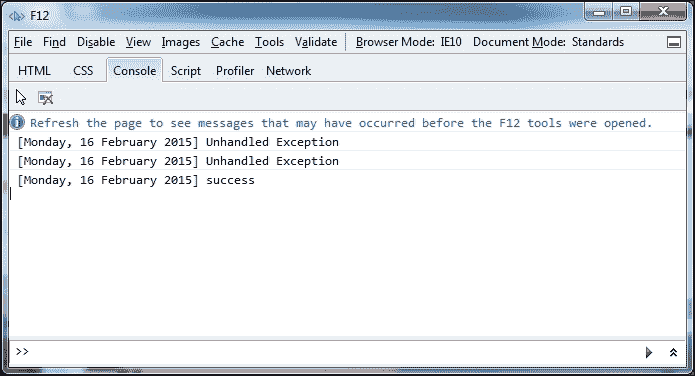
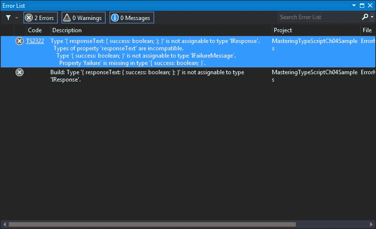
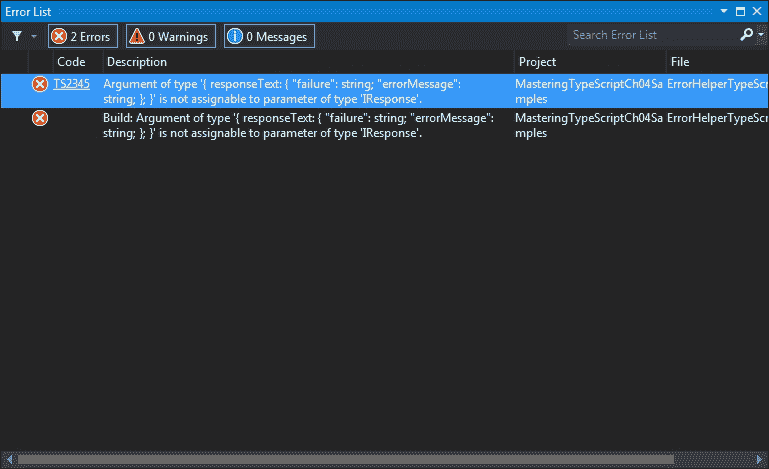

# 第四章：编写和使用声明文件

JavaScript 开发最吸引人的一个方面是已经发布的大量外部 JavaScript 库，比如 jQuery、Knockout 和 Underscore。TypeScript 的设计者知道，向 TypeScript 语言引入“语法糖”将为开发人员带来一系列好处。这些好处包括 IDE 功能，如智能感知，以及详细的编译时错误消息。我们已经看到了如何将这种语法应用于大多数 TypeScript 语言特性，比如类、接口和泛型，但是我们如何将这种“糖”应用于现有的 JavaScript 库呢？答案相对简单——声明文件。

声明文件是 TypeScript 编译器使用的一种特殊类型的文件。它以`.d.ts`扩展名标记，然后在编译步骤中由 TypeScript 编译器使用。声明文件类似于其他语言中使用的头文件；它们只是描述可用函数和属性的语法和结构，但不提供实现。因此，声明文件实际上不会生成任何 JavaScript 代码。它们只是用来提供 TypeScript 与外部库的兼容性，或者填补 TypeScript 不了解的 JavaScript 代码的空白。为了在 TypeScript 中使用任何外部 JavaScript 库，您将需要一个声明文件。

在本章中，我们将探讨声明文件，展示它们背后的原因，并基于一些现有的 JavaScript 代码构建一个声明文件。如果您熟悉声明文件以及如何使用它们，那么您可能会对*声明语法参考*部分感兴趣。本节旨在作为模块定义语法的快速参考指南。由于编写声明文件只是 TypeScript 开发的一小部分，我们并不经常编写它们。*声明语法参考*部分展示了等效 JavaScript 语法的示例声明文件语法。

# 全局变量

大多数现代网站都使用某种服务器引擎来生成它们的网页 HTML。如果您熟悉微软技术栈，那么您会知道 ASP.NET MVC 是一个非常流行的服务器端引擎，用于基于主页面、部分页面和 MVC 视图生成 HTML 页面。如果您是 Node 开发人员，那么您可能正在使用其中一个流行的 Node 包来帮助您通过模板构建网页，比如 Jade 或嵌入式 JavaScript（EJS）。

在这些模板引擎中，您有时可能需要根据后端逻辑在 HTML 页面上设置 JavaScript 属性。举个例子，假设您在后端数据库中保存了一组联系人电子邮件地址，然后通过名为`CONTACT_EMAIL_ARRAY`的 JavaScript 全局变量将其呈现到前端 HTML 页面上。您的渲染的 HTML 页面将包含一个包含这个全局变量和联系人电子邮件地址的`<script>`标签。您可能有一些 JavaScript 代码来读取这个数组，然后在页脚中呈现这些值。以下 HTML 示例显示了 HTML 页面中生成的脚本可能看起来像什么：

```ts
<body>
    <script type="text/javascript">
        var CONTACT_EMAIL_ARRAY = [
            "help@site.com",
            "contactus@site.com",
            "webmaster@site.com"
        ];
    </script>
</body>
```

这个 HTML 文件有一个脚本块，在这个脚本块中有一些 JavaScript。JavaScript 只是一个名为`CONTACT_EMAIL_ARRAY`的变量，其中包含一些字符串。假设我们想编写一些 TypeScript 代码来读取这个全局变量。考虑以下 TypeScript 代码：

```ts
class GlobalLogger {
    static logGlobalsToConsole() {
        for (var i = 0; i < CONTACT_EMAIL_ARRAY.length; i++) {
            console.log("found contact : " + CONTACT_EMAIL_ARRAY[i]);
        }
    }
}

window.onload = () => {
    GlobalLogger.logGlobalsToConsole();
}
```

这段代码创建了一个名为`GlobalLogger`的类，其中包含一个名为`logGlobalsToConsole`的静态函数。该函数只是遍历`CONTACT_EMAIL_ARRAY`全局变量，并将数组中的项记录到控制台中。

如果我们编译这段 TypeScript 代码，将会生成以下错误：

```ts
error TS2095: Build: Could not find symbol 'CONTACT_EMAIL_ARRAY'.

```

这个错误表明 TypeScript 编译器对名为`CONTACT_EMAIL_ARRAY`的变量一无所知。它甚至不知道它是一个数组。由于这段 JavaScript 代码位于任何 TypeScript 代码之外，我们需要以与“外部”JavaScript 相同的方式处理它。

为了解决我们的编译问题，并使`CONTACT_EMAIL_ARRAY`变量对 TypeScript 可见，我们需要使用一个声明文件。让我们创建一个名为`globals.d.ts`的文件，并在其中包含以下 TypeScript 声明：

```ts
declare var CONTACT_EMAIL_ARRAY: string [];
```

首先要注意的是，我们使用了一个新的 TypeScript 关键字：`declare`。`declare`关键字告诉 TypeScript 编译器，我们想要定义某个东西的类型，但这个对象（或变量或函数）的实现将在运行时解析。我们声明了一个名为`CONTACT_EMAIL_ARRAY`的变量，其类型为字符串数组。这个`declare`关键字为我们做了两件事：它允许在 TypeScript 代码中使用变量`CONTACT_EMAIL_ARRAY`，并且还将这个变量强类型为字符串数组。

### 注意

TypeScript 编译器的 1.0 版本及更高版本将扫描我们的源代码目录以寻找`.d.ts`文件，并自动包含它们在编译步骤中。在以前的版本中，需要包含一个注释作为对这些文件的引用，但现在不再需要这个引用注释行。

有了`globals.d.ts`文件，我们的代码可以正确编译。如果我们现在在浏览器中运行它，输出将如下所示：

```ts
found contact : help@site.com
found contact : contactus@site.com
found contact : webmaster@site.com

```

因此，通过使用名为`globals.d.ts`的声明文件，我们已经能够描述“外部”JavaScript 变量的结构给 TypeScript 编译器。这个 JavaScript 变量是在我们的任何 TypeScript 代码之外定义的，但我们仍然能够在 TypeScript 中使用这个变量的定义。

这就是声明文件的用途。基本上，我们告诉 TypeScript 编译器在编译步骤中使用声明文件中找到的定义，并且实际的变量本身只在运行时可用。

### 注意

定义文件还为我们的 IDE 带来了外部 JavaScript 库和代码的智能提示或代码补全功能。

# 在 HTML 中使用 JavaScript 代码块

我们刚刚看到的示例是在您的网页上生成的 HTML 内容（其中包含脚本块中的 JavaScript 代码）与实际运行的 JavaScript 之间紧密耦合的一个例子。然而，您可能会认为这是一个设计缺陷。如果网页需要一个联系人电子邮件数组，那么 JavaScript 应用程序应该简单地向服务器发送一个 AJAX 请求以获取相同的 JSON 格式信息。虽然这是一个非常合理的论点，但在某些情况下，将内容包含在呈现的 HTML 中实际上更快。

曾经有一个时代，互联网似乎能够在眨眼之间发送和接收大量信息。互联网的带宽和速度呈指数增长，台式机的内存和处理器速度也在不断提高。在互联网高速发展阶段，作为开发人员，我们不再考虑典型用户在其设备上拥有多少内存。我们也不再考虑我们通过网络发送了多少数据。这是因为互联网速度如此之快，浏览器处理速度似乎是无限的。

是的，然后移动电话出现了，感觉就像我们回到了 20 世纪 90 年代，互联网连接非常缓慢，屏幕分辨率很小，处理能力有限，内存很少（还有像*Elevator Action*这样的流行街机游戏，可以在[`archive.org/details/Elevator_Action_1985_Sega_Taito_JP_en`](https://archive.org/details/Elevator_Action_1985_Sega_Taito_JP_en)找到）。这个故事的要点是，作为现代网页开发人员，我们仍然需要注意运行在移动电话上的浏览器。这些浏览器有时在非常有限的互联网连接上运行，这意味着我们必须仔细测量我们的 JavasScript 库、JSON 数据和 HTML 页面的大小，以确保我们的应用程序即使在移动浏览器上也是快速和可用的。

在渲染的 HTML 页面中包含 JavaScript 变量或较小的静态 JSON 数据的技术通常为我们提供了在旧浏览器或现代手机上快速渲染屏幕的最快方式。许多流行的网站使用这种技术在通过异步 JSON 请求传递主要内容之前，快速渲染页面的一般结构（标题、侧边栏、页脚等）。这种技术之所以有效，是因为它能更快地渲染页面，并为用户提供更快的反馈。

## 结构化数据

让我们用一些更相关的数据增强这个简单的联系人电子邮件数组。对于这些电子邮件地址中的每一个，我们现在想要包含一些文本，我们将在页面的页脚中渲染，以及电子邮件地址。考虑以下使用 JSON 结构的全局变量的 HTML 代码：

```ts
<script type="text/javascript">
    var CONTACT_DATA = [
        { DisplayText: "Help", Email: "help@site.com" },
        { DisplayText: "Contact Us", Email: "contactus@site.com" },
        { DisplayText: "Web Master", Email: "webmaster@site.com" }
    ];
</script>
```

在这里，我们定义了一个名为`CONTACT_DATA`的全局变量，它是一个 JSON 对象数组。每个 JSON 对象都有一个名为`DisplayText`和一个名为`Email`的属性。与以前一样，我们现在需要在`globals.d.ts`声明文件中包含这个变量的定义：

```ts
interface IContactData {
    DisplayText: string;
    Email: string;
}

declare var CONTACT_DATA: IContactData[];
```

我们从一个名为`IContactData`的接口定义开始，表示`CONTACT_DATA`数组中单个项目的属性。每个项目都有一个`DisplayText`属性，类型为`string`，以及一个`Email`属性，类型也为`string`。因此，我们的`IContactData`接口与 JSON 数组中单个项目的原始对象属性相匹配。然后，我们声明一个名为`CONTACT_DATA`的变量，并将其类型设置为`IContactData`接口的数组。

这允许我们在 TypeScript 中使用`CONTACT_DATA`变量。现在让我们创建一个处理这些数据的类，如下所示：

```ts
class ContactLogger {
    static logContactData() {
        for (var i = 0; i < CONTACT_DATA.length; i++) {
            var contactDataItem: IContactData = CONTACT_DATA[i];
            console.log("Contact Text : " + contactDataItem.DisplayText
                 + " Email : " + contactDataItem.Email
                );
        }
    }
}

window.onload = () => {
    ContactLogger.logContactData();
}
```

`ContactLogger`类有一个名为`logContactData`的静态方法。在这个方法中，我们循环遍历`CONTACT_DATA`数组中的所有项目，使用所有 JavaScript 数组中固有的`length`属性。然后，我们创建一个名为`contactDataItem`的变量，它的类型被强制为`IContactData`，并将当前数组项的值赋给它。作为`IContactData`类型，`contactDataItem`现在有两个属性，`DisplayText`和`Email`。我们只需将这些值记录到控制台。这段代码的输出将是：

```ts
Contact Text : Help Email : help@site.com
Contact Text : Contact Us Email : contactus@site.com
Contact Text : Web Master Email : webmaster@site.com

```

# 编写自己的声明文件

在任何开发团队中，都会有一个时刻，你需要修复 bug 或增强已经编写的 JavaScript 代码。如果你处于这种情况，那么你会想尝试用 TypeScript 编写新的代码，并将其与现有的 JavaScript 代码集成。然而，为了这样做，你需要为任何需要重用的现有 JavaScript 编写自己的声明文件。这可能看起来是一项令人望而却步且耗时的任务，但当你面对这种情况时，只需记住采取小步骤，一次定义一小部分代码。你会惊讶地发现它实际上是多么简单。

在这一部分，让我们假设您需要集成一个现有的辅助类——一个在许多项目中重复使用、经过充分测试并且是开发团队标准的类。这个类已经被实现为一个 JavaScript 闭包，如下所示：

```ts
ErrorHelper = (function() {
    return {
        containsErrors: function (response) {
            if (!response || !response.responseText)
                return false;

            var errorValue = response.responseText;

            if (String(errorValue.failure) == "true"
                || Boolean(errorValue.failure)) {
                return true;
            }
            return false;
        },
        trace: function (msg) {
            var traceMessage = msg;
            if (msg.responseText) {
                traceMessage = msg.responseText.errorMessage;
            }
            console.log("[" + new Date().toLocaleDateString()
                + "] " + traceMessage);
        }
    }
})();
```

这段 JavaScript 代码片段定义了一个名为`ErrorHelper`的 JavaScript 对象，它有两个方法。`containsErrors`方法以一个名为`response`的对象作为参数，并测试它是否有一个名为`responseText`的属性。如果有，它然后检查`responseText`属性本身是否有一个名为`failure`的属性。如果这个`failure`属性是一个包含文本`"true"`的字符串，或者`failure`属性是一个值为`true`的布尔值，那么这个函数返回`true`；换句话说，我们正在评估`response.responseText.failure`属性。`ErrorHelper`闭包还有一个名为`trace`的函数，可以用一个字符串或类似`containsErrors`函数期望的响应对象来调用。

不幸的是，这个`ErrorHelper`函数缺少关键的文档部分。被传递到这两个方法中的对象的结构是什么，它有哪些属性？没有任何形式的文档，我们被迫反向工程代码来确定`response`对象的结构是什么样的。如果我们能找到`ErrorHelper`类的一些样本用法，这可能会帮助我们猜测这个结构。作为这个`ErrorHelper`的用法示例，考虑以下 JavaScript 代码：

```ts
   var failureMessage = {
        responseText: { 
            "failure": true,
            "errorMessage": "Unhandled Exception"
        }
    };
   var failureMessageString = {
        responseText: {
            "failure": "true",
            "errorMessage": "Unhandled Exception"
        }
   };
   var successMessage = { responseText: { "failure": false } };

   if (ErrorHelper.containsErrors(failureMessage))
        ErrorHelper.trace(failureMessage);
   if (ErrorHelper.containsErrors(failureMessageString))
        ErrorHelper.trace(failureMessageString);
   if (!ErrorHelper.containsErrors(successMessage))
        ErrorHelper.trace("success");
```

在这里，我们首先有一个名为`failureMessage`的变量，它有一个名为`responseText`的属性。`responseText`属性又有两个子属性：`failure`和`errorMessage`。我们的下一个变量`failureMessageString`具有相同的结构，但将`responseText.failure`属性定义为字符串，而不是布尔值。最后，我们的`successMessage`对象只定义了`responseText.failure`属性为`false`，但它没有`errorMessage`属性。

### 注意

在 JavaScript 的 JSON 格式中，属性名需要用引号括起来，而在 JavaScript 中这是可选的。因此，结构`{"failure" : true}`在语法上等同于结构`{failure : true}`。

前面代码片段的最后几行显示了`ErrorHelper`闭包的使用方式。我们只需要用我们的变量调用`ErrorHelper.containsErrors`方法，如果结果是`true`，则通过`ErrorHelper.trace`函数将消息记录到控制台。我们的输出将如下所示：



ErrorHelper 控制台输出

## 模块关键字

为了使用 TypeScript 测试这个 JavaScript 的`ErrorHelper`闭包，我们需要一个包含`ErrorHelper.js`文件和 TypeScript 生成的 JavaScript 文件的 HTML 页面。假设我们的 TypeScript 文件叫做`ErrorHelperTypeScript.ts`，那么我们的 HTML 页面将如下所示：

```ts
<!DOCTYPE html>
<html >
<head>specify.
    <title></title>
    <script src="img/ErrorHelper.js"></script>
    <script src="img/ErrorHelperTypeScript.js"></script>
</head>
<body>

</body>
</html>
```

这个 HTML 非常简单，包括了现有的`ErrorHelper.js` JavaScript 文件，以及 TypeScript 生成的`ErrorHelperTypeScript.js`文件。

在`ErrorHelperTypeScript.ts`文件中，让我们如下使用`ErrorHelper`：

```ts
window.onload = () => {
    var failureMessage = {
        responseText: { "failure": true,
            "errorMessage": "Unhandled Exception" }
    };

    if (ErrorHelper.containsErrors(failureMessage))
        ErrorHelper.trace(failureMessage);

 }
```

这段代码片段展示了我们原始 JavaScript 样本的简化版本。实际上，我们可以直接将原始 JavaScript 代码复制粘贴到我们的 TypeScript 文件中。我们首先创建一个具有正确属性的`failureMessage`对象，然后简单地调用`ErrorHelper.containsErrors`方法和`ErrorHelper.trace`方法。如果我们在这个阶段编译我们的 TypeScript 文件，我们将收到以下错误：

```ts
error TS2095: Build: Could not find symbol 'ErrorHelper'.

```

这个错误表明，虽然我们在 JavaScript 文件中有`ErrorHelper`的完整源代码，但没有有效的 TypeScript 类型名为`ErrorHelper`。默认情况下，TypeScript 会查找项目中所有的 TypeScript 文件来找到类定义，但不会解析 JavaScript 文件。为了正确编译这段代码，我们需要一个新的 TypeScript 定义文件。

### 注意

这个定义文件根本没有包含在 HTML 文件中；它只被 TypeScript 编译器使用，不会生成任何 JavaScript。

在我们的`ErrorHelper`类上没有一套有用的文档，我们需要通过阅读源代码来纯粹地逆向工程一个 TypeScript 定义。这显然不是一个理想的情况，也不推荐，但在这个阶段，这是我们能做的一切。在这些情况下，最好的起点就是简单地查看用法示例，然后从那里开始。

通过查看 JavaScript 中`ErrorHelper`闭包的用法，我们应该在我们的声明文件中包含两个关键部分。第一个是`containsErrors`和`trace`函数的一组函数定义。第二个是一组接口，用于描述`ErrorHelper`闭包依赖的`response`对象的结构。让我们从函数定义开始，创建一个名为`ErrorHelper.d.ts`的新的 TypeScript 文件，其中包含以下代码：

```ts
declare module ErrorHelper {
    function containsErrors(response);
    function trace(message);
}
```

这个声明文件以我们之前见过的`declare`关键字开头，然后使用了一个新的 TypeScript 关键字：`module`。`module`关键字后面必须跟着一个模块名，这里是`ErrorHelper`。这个模块名必须与我们描述的原始 JavaScript 中的闭包名匹配。在我们所有对`ErrorHelper`的使用中，我们总是用闭包名`ErrorHelper`本身作为`containsErrors`和`trace`函数的前缀。这个模块名也被称为命名空间。如果我们有另一个名为`AjaxHelper`的类，它也包括一个`containsErrors`函数，我们可以通过使用这些命名空间或模块名来区分`AjaxHelper.containsErrors`和`ErrorHelper.containsErrors`函数。

前面代码片段的第二行指示我们正在定义一个名为`containsErrors`的函数，它接受一个参数。模块声明的第三行指示我们正在定义另一个名为`trace`的函数，它接受一个参数。有了这个定义，我们的 TypeScript 代码样本将能够正确编译。

## 接口

虽然我们已经正确定义了`ErrorHelper`闭包可用的两个函数，但我们缺少关于`ErrorHelper`闭包可用的函数的第二部分信息——`response`参数的结构。我们没有为`containsErrors`或`trace`函数中的任何一个强类型参数。在这个阶段，我们的 TypeScript 代码可以将任何东西传递给这两个函数，因为它没有`response`或`message`参数的定义。然而，我们知道这两个函数都查询这些参数的特定结构。如果我们传入一个不符合这个结构的对象，那么我们的 JavaScript 代码将会引起运行时错误。

为了解决这个问题并使我们的代码更稳定，让我们为这些参数定义一个接口：

```ts
interface IResponse {
    responseText: IFailureMessage;
}

interface IFailureMessage {
    failure: boolean;
    errorMessage: string;
}
```

我们从一个名为`IResponse`的接口开始，它具有一个名为`responseText`的属性，与原始的 JSON 对象相同。这个`responseText`属性被强类型为`IFailureMessage`类型。`IFailureMessage`接口被强类型为具有两个属性：`failure`是`boolean`类型，`errorMessage`是`string`类型。这些接口正确描述了`containsErrors`函数的`response`参数的正确结构。现在我们可以修改`containsErrors`函数的原始声明，以在`response`参数上使用这个接口。

```ts
declare module ErrorHelper {
    function containsErrors(response: IResponse);
    function trace(message);
}
```

`containsErrors`的函数定义现在将响应参数强类型为我们之前定义的`IResponse`类型。对声明文件的这种修改现在将强制`containsErrors`函数的任何进一步使用发送一个符合`IResponse`结构的有效参数。让我们写一些故意不正确的 TypeScript 代码，看看会发生什么：

```ts
var anotherFailure : IResponse = { responseText: { success: true } };

if (ErrorHelper.containsErrors(anotherFailure))
    ErrorHelper.trace(anotherFailure);
```

我们首先创建一个名为`anotherFailure`的变量，并将其类型指定为`IResponse`类型。即使我们使用定义文件来定义这个接口，TypeScript 编译器应用的规则与我们以前看到的没有什么不同。这段代码中的第一行将生成以下错误：



编译错误的响应文本对象

从这个相当冗长但信息丰富的错误消息中可以看出，`anotherFailure`变量的结构导致了所有的错误。即使我们正确引用了`IResponse`的`responseText`属性，`responseText`属性也被强类型为`IFailureMessage`类型，它要求`failure`属性和`errorMessage`属性都存在，因此会出现错误。

我们可以通过在变量`anotherFailure`中包含`failure`和`errorMessage`的必需属性来修复这些错误：

```ts
var anotherFailure: IResponse = {
    responseText: {
        failure: false, errorMessage: "", success: true
        }
    };
```

我们的 TypeScript 现在可以正确编译。变量`anotherFailure`现在具有所有必需的属性，以便正确使用`ErrorHelper`函数。通过为现有的`ErrorHelper`类创建一个强类型声明文件，我们可以确保对现有的`ErrorHelper` JavaScript 闭包的任何进一步的 TypeScript 使用都不会生成运行时错误。

## 函数重载

我们对`ErrorHelper`的声明文件还没有完全完成。如果我们看一下`ErrorHelper`的原始 JavaScript 用法，我们会注意到`containsErrors`函数还允许`responseText`的`failure`属性是一个字符串：

```ts
var failureMessageString = {
    responseText: { "failure": "true",
        "errorMessage": "Error Message" }
};

if (ErrorHelper.containsErrors(failureMessageString))
    ErrorHelper.trace(failureMessage);
```

如果我们现在编译这段代码，将会得到以下编译错误：



响应文本的多个定义的编译错误

在变量`failureMessageString`的先前定义中，`failure`属性的类型为`true`，这是一个`string`类型，而不是`boolean`类型的`true`。为了允许在原始`IFailureMessage`接口上进行这种变体，我们需要修改我们的声明文件。首先，我们需要两个新接口，指定`failure`属性的类型为`string`：

```ts
interface IResponseString {
    responseText: IFailureMessageString;
}

interface IFailureMessageString {
    failure: string;
    errorMessage: string;
}
```

`IResponseString`接口与`IResponse`接口几乎相同，只是它使用`IFailureMessageString`类型作为`responseText`属性的类型。`IFailureMessageString`接口与原始的`IFailureMessage`接口几乎相同，只是`failure`属性的类型为`string`。现在我们需要修改我们的声明文件，以允许`containsErrors`函数上的两个调用签名：

```ts
declare module ErrorHelper {
    function containsErrors(response: IResponse);
    function containsErrors(response: IResponseString);
    function trace(message);
}
```

与接口和类定义一样，模块也允许函数覆盖。模块`ErrorHelper`现在有一个`containsErrors`函数定义，使用原始的`IResponse`接口，以及一个使用新的`IReponseString`接口的第二个函数定义。这个模块定义的新版本将允许`failure`消息结构的两种变体都正确编译。

在这个例子中，我们还可以利用联合类型，并简化我们先前对`containsErrors`函数的声明为单个定义：

```ts
declare module ErrorHelper {
    function containsErrors(response: IResponse | IResponseString);
    function trace(message: string);
}
```

## 完善我们的定义文件

现在我们可以将注意力集中在`trace`函数上。`trace`函数可以接受`IResponse`接口的两个版本，或者它可以简单地接受一个字符串。让我们更新`trace`函数签名的定义文件：

```ts
declare module ErrorHelper {
    function containsErrors(response: IResponse | IResponseString);
    function trace(message: string | IResponse | IResponseString);
}
```

在这里，我们已经更新了`trace`函数，以允许三种不同类型的消息类型——普通的`string`，一个`IResponse`类型，或一个`IResponseString`类型。

这完成了我们对`ErrorHelper`JavaScript 类的定义文件。

# 模块合并

正如我们现在所知，TypeScript 编译器将自动搜索项目中所有`.d.ts`文件，以获取声明文件。如果这些声明文件包含相同的模块名称，TypeScript 编译器将合并这两个声明文件，并使用模块声明的组合版本。

如果我们有一个名为`MergedModule1.d.ts`的文件，其中包含以下定义：

```ts
declare module MergedModule {
    function functionA();
}
```

和一个名为`MergedModule2.d.ts`的第二个文件，其中包含以下定义：

```ts
declare module MergedModule {
    function functionB();
}
```

TypeScript 编译器将合并这两个模块，就好像它们是单个定义一样：

```ts
declare module MergedModule {
    function functionA();
    function functionB();
}
```

这将允许`functionA`和`functionB`都是相同`MergedModule`命名空间的有效函数，并允许以下用法：

```ts
MergedModule.functionA();
MergedModule.functionB();
```

### 注意

模块还可以与接口、类和枚举合并。但是，类不能与其他类、变量或接口合并。

# 声明语法参考

在创建声明文件并使用`module`关键字时，可以使用一些规则来混合和匹配定义。我们已经涵盖了其中之一——函数覆盖。作为 TypeScript 程序员，你通常只会偶尔编写模块定义，并且偶尔需要向现有声明文件添加新的定义。

因此，本节旨在成为此声明文件语法的快速参考指南，或者一张备忘单。每个部分包含模块定义规则的描述，JavaScript 语法片段，然后是等效的 TypeScript 声明文件语法。

要使用此参考部分，只需匹配 JavaScript 语法部分中要模拟的 JavaScript，然后使用等效的定义语法编写您的声明文件。我们将以函数覆盖语法作为示例开始：

## 函数覆盖

声明文件可以包含同一函数的多个定义。如果相同的 JavaScript 函数可以使用不同类型进行调用，则需要为函数的每个变体声明一个函数覆盖。

### JavaScript 语法

```ts
trace("trace a string");
trace(true);
trace(1);
trace({ id: 1, name: "test" });
```

### 声明文件语法

```ts
declare function trace(arg: string | number | boolean );
declare function trace(arg: { id: number; name: string });
```

### 注意

每个函数定义必须具有唯一的函数签名。

## 嵌套命名空间

模块定义可以包含嵌套的模块定义，然后转换为嵌套的命名空间。如果您的 JavaScript 使用命名空间，则需要定义嵌套模块声明以匹配 JavaScript 命名空间。

### JavaScript 语法

```ts
FirstNamespace.SecondNamespace.ThirdNamespace.log("test");
```

### 声明文件语法

```ts
declare module FirstNamespace {
    module SecondNamespace {
        module ThirdNamespace {
            function log(msg: string);
        }
    }
}
```

## 类

类定义允许在模块定义内。如果您的 JavaScript 使用类或 new 操作符，则可实例化的类将需要在声明文件中定义。

### JavaScript 语法

```ts
var myClass = new MyClass();
```

### 声明文件语法

```ts
declare class MyClass {
}
```

## 类命名空间

类定义允许在嵌套模块定义中。如果您的 JavaScript 类具有前置命名空间，则需要先声明匹配命名空间的嵌套模块，然后可以在正确的命名空间内声明类。

### JavaScript 语法

```ts
var myNestedClass = new OuterName.InnerName.NestedClass();
```

### 声明文件语法

```ts
declare module OuterName {
    module InnerName {
        class NestedClass {}
    }
}
```

## 类构造函数重载

类定义可以包含构造函数重载。如果您的 JavaScript 类可以使用不同类型或多个参数进行构造，则需要在声明文件中列出每个变体作为构造函数重载。

### JavaScript 语法

```ts
var myClass = new MyClass();
var myClass2 = new MyClass(1, "test");
```

### 声明文件语法

```ts
declare class MyClass {
    constructor(id: number, name: string);
    constructor();
}
```

## 类属性

类可以包含属性。您需要在类声明中列出类的每个属性。

### JavaScript 语法

```ts
var classWithProperty = new ClassWithProperty();
classWithProperty.id = 1;
```

### 声明文件语法

```ts
declare class ClassWithProperty {
    id: number;
}
```

## 类函数

类可以包含函数。您需要在类声明中列出 JavaScript 类的每个函数，以便 TypeScript 编译器接受对这些函数的调用。

### JavaScript 语法

```ts
var classWithFunction = new ClassWithFunction();
classWithFunction.functionToRun();
```

### 声明文件语法

```ts
declare class ClassWithFunction {
    functionToRun(): void;
}
```

### 注意

被视为私有的函数或属性不需要通过声明文件公开，可以简单地省略。

## 静态属性和函数

类方法和属性可以是静态的。如果您的 JavaScript 函数或属性可以在不需要对象实例的情况下调用，则这些属性或函数需要标记为静态。

### JavaScript 语法

```ts
StaticClass.staticId = 1;
StaticClass.staticFunction();
```

### 声明文件语法

```ts
declare class StaticClass {
    static staticId: number;
    static staticFunction();
}
```

## 全局函数

不带命名空间前缀的函数可以在全局命名空间中声明。如果您的 JavaScript 定义了全局函数，则需要在没有命名空间的情况下声明这些函数。

### JavaScript 语法

```ts
globalLogError("test");
```

### 声明文件语法

```ts
declare function globalLogError(msg: string);
```

## 函数签名

函数可以使用函数签名作为参数。使用回调函数或匿名函数的 JavaScript 函数，需要用正确的函数签名声明。

### JavaScript 语法

```ts
describe("test", function () {
    console.log("inside the test function");
});
```

### 声明文件语法

```ts
declare function describe(name: string, functionDef: () => void);
```

## 可选属性

类或函数可以包含可选属性。在 JavaScript 对象参数不是必需时，这些参数需要在声明中标记为可选属性。

### JavaScript 语法

```ts
var classWithOpt  = new ClassWithOptionals();
var classWithOpt1 = new ClassWithOptionals({ id: 1 });
var classWithOpt2 = new ClassWithOptionals({ name: "first" });
var classWithOpt3 = new ClassWithOptionals({ id: 2, name: "second" });
```

### 声明文件语法

```ts
interface IOptionalProperties {
    id?: number;
    name?: string;
}

declare class ClassWithOptionals {
    constructor(options?: IOptionalProperties);
}
```

## 合并函数和模块

具有特定名称的函数定义可以与相同名称的模块定义合并。这意味着如果您的 JavaScript 函数可以使用参数调用并且还具有属性，则需要将函数与模块合并。

### JavaScript 语法

```ts
fnWithProperty(1);
fnWithProperty.name = "name";
```

### 声明文件语法

```ts
declare function fnWithProperty(id: number);
declare module fnWithProperty {
    var name: string;
}
```

# 总结

在本章中，我们概述了您需要了解的内容，以便编写和使用自己的声明文件。我们讨论了在呈现的 HTML 中的 JavaScript 全局变量以及如何在 TypeScript 中访问它们。然后，我们转向了一个小的 JavaScript 辅助函数，并为这个 JavaScript 编写了我们自己的声明文件。我们通过列出一些模块定义规则来结束本章，强调了所需的 JavaScript 语法，并展示了等效的 TypeScript 声明语法。在下一章中，我们将讨论如何使用现有的第三方 JavaScript 库，以及如何将这些库的现有声明文件导入到您的 TypeScript 项目中。

为 Bentham Chang 准备，Safari ID bentham@gmail.com 用户编号：2843974 © 2015 Safari Books Online，LLC。此下载文件仅供个人使用，并受到服务条款的约束。任何其他用途均需版权所有者的事先书面同意。未经授权的使用、复制和/或分发严格禁止并违反适用法律。保留所有权利。
