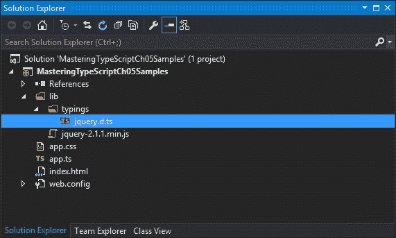
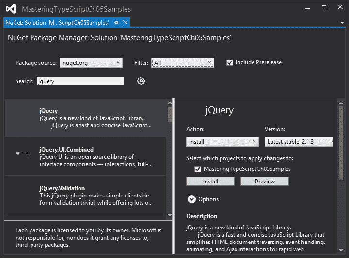
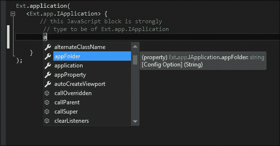

# 第五章：第三方库

如果我们无法重用现有的 JavaScript 库、框架和其他好东西，那么我们的 TypeScript 开发环境就不会有多大作用。然而，正如我们所看到的，为了在 TypeScript 中使用特定的第三方库，我们首先需要一个匹配的定义文件。

TypeScript 发布后不久，Boris Yankov 建立了一个 github 存储库，用于存放第三方 JavaScript 库的 TypeScript 定义文件。这个名为 DefinitelyTyped 的存储库（[`github.com/borisyankov/DefinitelyTyped`](https://github.com/borisyankov/DefinitelyTyped)）迅速变得非常受欢迎，目前是获取高质量定义文件的地方。DefinitelyTyped 目前拥有超过 700 个定义文件，这些文件是来自世界各地数百名贡献者多年来建立起来的。如果我们要衡量 TypeScript 在 JavaScript 社区中的成功，那么 DefinitelyTyped 存储库将是 TypeScript 被采用程度的一个很好指标。在尝试编写自己的定义文件之前，先检查 DefinitelyTyped 存储库，看看是否已经有可用的文件。

在这一章中，我们将更仔细地研究如何使用这些定义文件，并涵盖以下主题：

+   下载定义文件

+   在 Visual Studio 中使用 NuGet

+   使用 TypeScript Definition manager (TSD)

+   选择一个 JavaScript 框架

+   使用 Backbone 的 TypeScript

+   使用 Angular 的 TypeScript

+   使用 ExtJs 的 TypeScript

# 下载定义文件

在 TypeScript 项目中包含定义文件的最简单方法是从 DefinitelyTyped 下载匹配的`.d.ts`文件。这只是简单地找到相关文件，并下载原始内容。假设我们想要在项目中开始使用 jQuery。我们已经找到并下载了 jQuery JavaScript 库（v2.1.1），并在项目中的一个名为`lib`的目录下包含了相关文件。要下载声明文件，只需浏览到 DefinitelyTyped 上的`jquery`目录（[`github.com/borisyankov/DefinitelyTyped/tree/master/jquery`](https://github.com/borisyankov/DefinitelyTyped/tree/master/jquery)），然后点击`jquery.d.ts`文件。这将打开一个 GitHub 页面，显示文件的编辑器视图。在这个编辑器视图的菜单栏上，点击**Raw**按钮。这将下载`jquery.d.ts`文件，并允许您将其保存在项目目录结构中。在**lib**文件夹下创建一个名为**typings**的新目录，并将**jquery.d.ts**文件保存在其中。

您的项目文件应该看起来像这样：



带有下载的 jquery.d.ts 文件的 Visual Studio 项目结构

现在我们可以修改我们的`index.html`文件，包含`jquery` JavaScript 文件，并开始编写针对 jQuery 库的 TypeScript 代码。我们的`index.html`文件需要修改如下：

```ts
<!DOCTYPE html>

<html lang="en">
<head>
    <meta charset="utf-8" />
    <title>TypeScript HTML App</title>
    <link rel="stylesheet" href="app.css" type="text/css" />
    <script src="img/jquery-2.1.1.min.js"></script>
    <script src="img/app.js"></script>
</head>
<body>
    <h1>TypeScript HTML App</h1>

    <div id="content"></div>
</body>
</html>
```

这个`index.html`文件的第一个`<script>`标签现在包含了一个指向`jquery-2.1.1.min.js`的链接，第二个`<script>`标签包含了一个指向 TypeScript 生成的`app.js`的链接。打开`app.ts` TypeScript 文件，删除现有的源代码，并用以下 jQuery 代码替换它：

```ts
$(document).ready(() => {
    $("#content").html("<h1>Hello World !</h1>");
});
```

这段代码首先定义了一个匿名函数，在 jQuery 的`document.ready`事件上执行。`document.ready`函数类似于我们之前使用的`window.onload`函数，它会在 jQuery 初始化后执行。这段代码的第二行简单地使用 jQuery 选择器语法获取名为`content`的 DOM 元素的句柄，然后调用`html`函数设置其 HTML 值。

我们下载的`jquery.d.ts`文件为我们提供了在 TypeScript 中编译 jQuery 所需的相关模块声明。

# 使用 NuGet

NuGet 是一个流行的包管理平台，可以下载所需的外部库，并自动包含在您的 Visual Studio 或 WebMatrix 项目中。它可用于打包为 DLL 的外部库，例如 StructureMap，也可用于 JavaScript 库和声明文件。NuGet 也可用作命令行实用程序。

## 使用扩展管理器

要在 Visual Studio 中使用 NuGet 包管理器对话框，请在主工具栏上选择**工具**选项，然后选择**NuGet 包管理器**，最后选择**管理解决方案的 NuGet 包**。这将打开 NuGet 包管理器对话框。在对话框的左侧，单击**在线**。NuGet 对话框将查询 NuGet 网站并显示可用包的列表。屏幕右上方有一个**搜索**框。单击**搜索**框，并输入`jquery`，以显示 NuGet 中为 jQuery 提供的所有包，如下图所示：



NuGet 包管理器对 jQuery 查询的对话框

在**搜索结果**面板中选择包时，每个包都将有一个突出显示的**安装**按钮。选择包后，右侧窗格将显示有关所讨论的 NuGet 包的更多详细信息。请注意，项目详细信息面板还显示了您即将安装的包的版本。单击**安装**按钮将自动下载相关文件以及任何依赖项，并将它们自动包含在您的项目中。

### 注意

NuGet 用于 JavaScript 文件的安装目录实际上称为`Scripts`，而不是我们之前创建的`lib`目录。NuGet 使用`Scripts`目录作为标准，因此任何包含 JavaScript 的包都将安装相关的 JavaScript 文件到`Scripts`目录中。

## 安装声明文件

您会发现在 DefinitelyTyped GitHub 存储库上找到的大多数声明文件都有相应的 NuGet 包。这些包的命名约定是`<library>`.`TypeScript.DefinitelyTyped`。如果我们在搜索框中输入`jquery typescript`，我们将看到返回的这些 DefinitelyTyped 包的列表。我们要找的 NuGet 包的名称是**jquery.TypeScript.DefinitelyTyped**，由**Jason Jarret**创建，在撰写本文时，版本为 1.4.0。

### 注意

DefinitelyTyped 包有它们自己的内部版本号，这些版本号不一定与您使用的 JavaScript 库的版本匹配。例如，jQuery 包的版本为 2.1.1，但相应的 TypeScript 定义包显示的版本号为 1.4.0。

安装`jQuery.TypeScript.DefinitelyTyped`包将在`Scripts`目录下创建一个`typings`目录，然后包含`jquery.d.ts`定义文件。这种目录命名标准已被各种 NuGet 包作者采用。

## 使用包管理器控制台

Visual Studio 还有一个命令行版本的 NuGet 包管理器，可以作为控制台应用程序使用，也集成到了 Visual Studio 中。单击**工具**，然后**NuGet 包管理器**，最后**包管理器控制台**，将打开一个新的 Visual Studio 窗口，并初始化 NuGet 命令行界面。NuGet 的命令行版本具有一些在 GUI 版本中不包括的功能。输入`get-help NuGet`以查看可用的顶级命令行参数列表。

### 安装包

要从控制台命令行安装 NuGet 包，只需输入`install-package <packageName>`。例如，要安装`jquery.TypeScript.DefinitelyTyped`包，只需输入：

```ts
Install-Package jquery.TypeScript.DefinitelyTyped

```

此命令将连接到 NuGet 服务器，并下载并安装包到您的项目中。

### 注意

在**包管理器控制台**窗口的工具栏上有两个下拉列表，**包源**和**默认项目**。如果您的 Visual Studio 解决方案有多个项目，您需要从**默认项目**下拉列表中选择正确的项目，以便 NuGet 将包安装到其中。

### 搜索包名称

从命令行搜索包名称是通过`Get-Package –ListAvailable`命令完成的。此命令使用`–Filter`参数作为搜索条件。例如，要查找包含`definitelytyped`搜索字符串的可用包，请运行以下命令：

```ts
Get-Package –ListAvailable –Filter definitelytyped

```

### 安装特定版本

有一些 JavaScript 库与 jQuery 2.x 版本不兼容，需要使用 1.x 范围内的 jQuery 版本。要安装特定版本的 NuGet 包，我们需要从命令行指定`-Version`参数。例如，要安装`jquery v1.11.1`包，请从命令行运行以下命令：

```ts
Install-Package jQuery –Version 1.11.1

```

### 注意

如果 NuGet 发现您的项目中已经安装了另一个版本的包，它将升级或降级要安装的包的版本。在上面的示例中，我们已经在项目中安装了最新版本的 jQuery（2.1.1），因此 NuGet 将首先删除`jQuery 2.1.1`，然后安装`jQuery 1.11.1`。

# 使用 TypeScript Definition Manager

如果您正在使用 Node 作为 TypeScript 开发环境，那么您可能考虑使用**TypeScript Definition Manager**来获取 DefinitelyTyped 的 TypeScript 定义（**TSD**位于[`definitelytyped.org/tsd/`](http://definitelytyped.org/tsd/)）。TSD 提供类似于 NuGet 包管理器的功能，但专门针对 DefinitelyTyped GitHub 存储库中的 TypeScript 定义。

要安装 TSD，请使用以下`npm`命令：

```ts
npm install tsd@next –g

```

这将安装`tsd prerelease v0.6.x`。

### 注意

在撰写本文时，您需要 v0.6.x 及更高版本才能从命令行使用`install`关键字。如果您只是输入`npm install tsd –g`，那么 npm 将安装 v0.5.x，其中不包括`install`关键字。

## 查询包

TSD 允许使用`query`关键字查询包存储库。要搜索`jquery`定义文件，输入以下内容：

```ts
tsd query jquery

```

上述命令将在`DefinitelyTyped`存储库中搜索任何名为`jquery.d.ts`的定义文件。由于只有一个，搜索返回的结果将是：

```ts
Jquery / jquery

```

## 使用通配符

TSD 还允许使用星号`*`作为通配符。要搜索以`jquery`开头的`DefinitelyTyped`声明文件，输入以下内容：

```ts
tsd query jquery.*

```

这个`tsd`命令将搜索存储库，并返回以 jQuery 开头的声明文件的结果。

## 安装定义文件

要安装定义文件，请使用以下`install`关键字：

```ts
tsd install jquery

```

此命令将下载`jquery.d.ts`文件到以下目录：

```ts
\typings\jquery\jquery.d.ts

```

### 注意

TSD 将基于运行 tsd 的当前目录创建`\typings`目录，因此请确保每当您从命令行使用 TSD 时，都要导航到项目中的相同基本目录。

# 使用第三方库

在本章的这一部分，我们将开始探索一些更受欢迎的第三方 JavaScript 库，它们的声明文件以及如何为每个框架编写兼容的 TypeScript。我们将比较 Backbone、Angular 和 ExtJs，它们都是用于构建丰富的客户端 JavaScript 应用程序的框架。在我们的讨论中，我们将看到一些框架与 TypeScript 语言及其特性高度兼容，一些部分兼容，一些则兼容性很低。

## 选择 JavaScript 框架

选择一个 JavaScript 框架或库来开发单页应用程序是一个困难且有时令人望而生畏的任务。似乎每个月都会出现一个新的框架，承诺用更少的代码提供更多的功能。

为了帮助开发人员比较这些框架，并做出明智的选择，Addy Osmani 写了一篇名为*Journey Through the JavaScript MVC Jungle*的优秀文章。([`www.smashingmagazine.com/2012/07/27/journey-through-the-javascript-mvc-jungle/`](http://www.smashingmagazine.com/2012/07/27/journey-through-the-javascript-mvc-jungle/))。

实质上，他的建议很简单 - 这是一个个人选择 - 所以尝试一些框架，看看哪个最适合你的需求、编程思维方式和现有技能。Addy 开始的**TodoMVC**项目([`todomvc.com`](http://todomvc.com))，在几种 MV* JavaScript 框架中实现了相同的应用程序，做得非常出色。这真的是一个参考站点，可以深入了解一个完全工作的应用程序，并比较不同框架的编码技术和风格。

同样，取决于你在 TypeScript 中使用的 JavaScript 库，你可能需要以特定的方式编写你的 TypeScript 代码。在选择框架时要记住这一点 - 如果在 TypeScript 中使用起来很困难，那么你可能最好看看另一个集成更好的框架。如果在 TypeScript 中使用这个框架很容易和自然，那么你的生产力和整体开发体验将会更好。

在本节中，我们将看一些流行的 JavaScript 库，以及它们的声明文件，并了解如何编写兼容的 TypeScript。要记住的关键是 TypeScript 生成 JavaScript - 所以如果你在使用第三方库时遇到困难，那么打开生成的 JavaScript，看看 TypeScript 生成的 JavaScript 代码是什么样子的。如果生成的 JavaScript 与库的文档中的 JavaScript 代码示例匹配，那么你就在正确的轨道上。如果不匹配，那么你可能需要修改你的 TypeScript，直到编译后的 JavaScript 与示例相匹配。

当尝试为第三方 JavaScript 框架编写 TypeScript 代码时 - 特别是如果你是根据 JavaScript 文档进行工作 - 你的初始尝试可能只是试错。在这个过程中，你可能会发现你需要以特定的方式编写你的 TypeScript，以匹配特定的第三方库。本章的其余部分展示了三种不同的库需要不同的 TypeScript 编写方式。

# Backbone

Backbone 是一个流行的 JavaScript 库，通过提供模型、集合和视图等内容，为 Web 应用程序提供结构。Backbone 自 2010 年以来一直存在，并且拥有大量的追随者，许多商业网站都在使用这个框架。根据[Infoworld.com](http://Infoworld.com)的报道，Backbone 在 GitHub 上有超过 1600 个与 Backbone 相关的项目，评分超过 3 星，这意味着它拥有庞大的扩展生态系统和相关库。

让我们快速看一下用 TypeScript 编写的 Backbone。

### 注意

要在自己的项目中跟着代码进行，你需要安装以下 NuGet 包：`backbone.js`（当前版本为 v1.1.2），和`backbone.TypeScript.DefinitelyTyped`（当前版本为 1.2.3）。

## 在 Backbone 中使用继承

从 Backbone 的文档中，我们找到了在 JavaScript 中创建`Backbone.Model`的示例如下：

```ts
var Note = Backbone.Model.extend(
    {
        initialize: function() {
            alert("Note Model JavaScript initialize");
        },
        author: function () { },
        coordinates: function () { },
        allowedToEdit: function(account) {
            return true;
        }
    }
);
```

这段代码展示了 JavaScript 中 Backbone 的典型用法。我们首先创建一个名为`Note`的变量，它扩展（或派生自）`Backbone.Model`。这可以通过`Backbone.Model.extend`语法看出。Backbone 的`extend`函数使用 JavaScript 对象表示法在外部花括号`{ ... }`中定义一个对象。在前面的代码中，这个对象有四个函数：`initialize`，`author`，`coordinates`和`allowedToEdit`。

根据 Backbone 文档，`initialize`函数将在创建此类的新实例时被调用一次。在我们之前的示例中，`initialize`函数只是创建一个**警报**来指示该函数被调用。`author`和`coordinates`函数在这个阶段是空的，只有`allowedToEdit`函数实际上做了一些事情：`return true`。

如果我们只是简单地将上面的 JavaScript 复制粘贴到一个 TypeScript 文件中，我们将生成以下编译错误：

```ts
Build: 'Backbone.Model.extend' is inaccessible.

```

在使用第三方库和来自 DefinitelyTyped 的定义文件时，我们首先应该看看定义文件是否有错误。毕竟，JavaScript 文档说我们应该能够像示例中那样使用`extend`方法，那么为什么这个定义文件会导致错误呢？如果我们打开`backbone.d.ts`文件，然后搜索找到`Model`类的定义，我们会找到编译错误的原因：

```ts
class Model extends ModelBase {

    /**
    * Do not use, prefer TypeScript's extend functionality.
    **/
    private static extend(
        properties: any, classProperties?: any): any;
```

这个声明文件片段显示了 Backbone `Model`类的一些定义。在这里，我们可以看到`extend`函数被定义为`private static`，因此它在 Model 类本身之外不可用。然而，这似乎与我们在文档中看到的 JavaScript 示例相矛盾。在`extend`函数定义的前面评论中，我们找到了在 TypeScript 中使用 Backbone 的关键：更喜欢 TypeScript 的 extend 功能。

这个评论表明 Backbone 的声明文件是围绕 TypeScript 的`extends`关键字构建的，因此我们可以使用自然的 TypeScript 继承语法来创建 Backbone 对象。因此，这段代码的 TypeScript 等价物必须使用`extends` TypeScript 关键字从基类`Backbone.Model`派生一个类，如下所示：

```ts
class Note extends Backbone.Model {
    initialize() {
        alert("Note model Typescript initialize");
    }
    author() { }
    coordinates() { }
    allowedToEdit(account) {
        return true;
    }
}
```

现在我们正在创建一个名为`Note`的类定义，它`extends`了`Backbone.Model`基类。这个类然后有`initialize`，`author`，`coordinates`和`allowedToEdit`函数，与之前的 JavaScript 版本类似。我们的 Backbone 示例现在将正确编译和运行。

使用这两个版本中的任何一个，我们都可以通过在 HTML 页面中包含以下脚本来创建`Note`对象的实例：

```ts
<script type="text/javascript">
    $(document).ready( function () {
        var note = new Note();
    });
</script>
```

这个 JavaScript 示例只是等待 jQuery 的`document.ready`事件被触发，然后创建一个`Note`类的实例。如前所述，当类的实例被构造时，`initialize`函数将被调用，因此当我们在浏览器中运行时，我们会看到一个警报框出现。

Backbone 的所有核心对象都是以继承为设计基础的。这意味着创建新的 Backbone 集合、视图和路由器将在 TypeScript 中使用相同的`extends`语法。因此，Backbone 非常适合 TypeScript，因为我们可以使用自然的 TypeScript 语法来继承创建新的 Backbone 对象。

## 使用接口

由于 Backbone 允许我们使用 TypeScript 继承来创建对象，因此我们也可以轻松地在任何 Backbone 对象中使用 TypeScript 接口。提取上面`Note`类的接口将如下所示：

```ts
interface INoteInterface {
    initialize();
    author();
    coordinates();
    allowedToEdit(account: string);
}
```

现在我们可以更新我们的`Note`类定义来实现这个接口，如下所示：

```ts
class Note extends Backbone.Model implements INoteInterface {
    // existing code
}
```

我们的类定义现在实现了`INoteInterface` TypeScript 接口。这个简单的改变保护了我们的代码不会被无意中修改，并且还打开了使用标准面向对象设计模式与核心 Backbone 对象一起工作的能力。如果需要的话，我们可以应用第三章中描述的工厂模式，*接口、类和泛型*，来返回特定类型的 Backbone 模型 - 或者其他任何 Backbone 对象。

## 使用泛型语法

Backbone 的声明文件还为一些类定义添加了泛型语法。这在为 Backbone 编写 TypeScript 代码时带来了更强的类型化好处。Backbone 集合（惊喜，惊喜）包含一组 Backbone 模型，允许我们在 TypeScript 中定义集合如下：

```ts
class NoteCollection extends Backbone.Collection<Note> {
    model = Note;
    //model: Note; // generates compile error
    //model: { new (): Note }; // ok
}
```

在这里，我们有一个`NoteCollection`，它派生自`Backbone.Collection`，但也使用泛型语法来限制集合只处理`Note`类型的对象。这意味着任何标准的集合函数，比如`at()`或`pluck()`，都将被强类型化为返回`Note`模型，进一步增强了我们的类型安全和智能感知。

请注意第二行用于将类型分配给集合类的内部`model`属性的语法。我们不能使用标准的 TypeScript 语法`model: Note`，因为这会导致编译时错误。我们需要将`model`属性分配给类定义，就像`model=Note`语法所示，或者我们可以使用`{ new(): Note }`语法，就像最后一行所示。

## 使用 ECMAScript 5

Backbone 还允许我们使用 ECMAScript 5 的能力来为`Backbone.Model`类定义 getter 和 setter，如下所示：

```ts
interface ISimpleModel {
    Name: string;
    Id: number;
}
class SimpleModel extends Backbone.Model implements ISimpleModel {
    get Name() {
        return this.get('Name');
    }
    set Name(value: string) {
        this.set('Name', value);
    }
    get Id() {
        return this.get('Id');
    }
    set Id(value: number) {
        this.set('Id', value);
    }
}
```

在这个片段中，我们定义了一个具有两个属性的接口，名为`ISimpleModel`。然后我们定义了一个`SimpleModel`类，它派生自`Backbone.Model`，并且还实现了`ISimpleModel`接口。然后我们为我们的`Name`和`Id`属性定义了 ES 5 的 getter 和 setter。Backbone 使用类属性来存储模型值，所以我们的 getter 和 setter 只是调用了`Backbone.Model`的底层`get`和`set`方法。

## Backbone TypeScript 兼容性

正如我们所看到的，Backbone 允许我们在我们的代码中使用 TypeScript 的所有语言特性。我们可以使用类、接口、继承、泛型，甚至是 ECMAScript 5 属性。我们所有的类也都派生自基本的 Backbone 对象。这使得 Backbone 成为了一个非常兼容 TypeScript 的构建 Web 应用程序的库。我们将在后面的章节中更多地探索 Backbone 框架。

# Angular

AngularJs（或者只是 Angular）也是一个非常流行的 JavaScript 框架，由 Google 维护。Angular 采用了完全不同的方法来构建 JavaScript SPA，引入了一个 HTML 语法，运行中的 Angular 应用程序可以理解。这为应用程序提供了双向数据绑定的能力，自动同步模型、视图和 HTML 页面。Angular 还提供了**依赖注入**（**DI**）的机制，并使用服务来为视图和模型提供数据。

让我们来看一下 Angular 教程中的一个示例，该示例位于第 2 步，我们开始构建一个名为`PhoneListCtrl`的控制器。教程中提供的示例显示了以下 JavaScript：

```ts
var phonecatApp = angular.module('phonecatApp', []);
phonecatApp.controller('PhoneListCtrl', function ($scope) 
{
  $scope.phones = [
    {'name': 'Nexus S',
     'snippet': 'Fast just got faster with Nexus S.'},
    {'name': 'Motorola XOOM™ with Wi-Fi',
     'snippet': 'The Next, Next Generation tablet.'},
    {'name': 'MOTOROLA XOOM™',
     'snippet': 'The Next, Next Generation tablet.'}
  ];
});
```

这段代码片段是典型的 Angular JavaScript 语法。我们首先创建一个名为`phonecatApp`的变量，并通过在`angular`全局实例上调用`module`函数将其注册为一个 Angular 模块。`module`函数的第一个参数是 Angular 模块的全局名称，空数组是其他模块的占位符，这些模块将通过 Angular 的依赖注入机制注入。

然后我们调用新创建的`phonecatApp`变量上的`controller`函数，带有两个参数。第一个参数是控制器的全局名称，第二个参数是一个接受名为`$scope`的特殊命名的 Angular 变量的函数。在这个函数中，代码将`$scope`变量的`phones`对象设置为一个 JSON 对象数组，每个对象都有`name`和`snippet`属性。

如果我们继续阅读教程，我们会发现一个单元测试，展示了`PhoneListCtrl`控制器的使用方式：

```ts
describe('PhoneListCtrl', function(){
    it('should create "phones" model with 3 phones', function() {
      var scope = {},
          ctrl = new PhoneListCtrl(scope);

      expect(scope.phones.length).toBe(3);
  });

});
```

这段代码片段的前两行使用了一个名为`describe`的全局函数，以及在这个函数内部另一个名为`it`的函数。这两个函数是单元测试框架 Jasmine 的一部分。我们将在下一章讨论单元测试，但目前让我们专注于代码的其余部分。

我们声明了一个名为`scope`的变量，它是一个空的 JavaScript 对象，然后声明了一个名为`ctrl`的变量，它使用`new`关键字来创建我们`PhoneListCtrl`类的一个实例。`new PhoneListCtrl(scope)`语法表明 Angular 正在使用控制器的定义，就像我们在 TypeScript 中使用普通类一样。

在 TypeScript 中构建相同的对象将允许我们使用 TypeScript 类，如下所示：

```ts
var phonecatApp = angular.module('phonecatApp', []);

class PhoneListCtrl  {
    constructor($scope) {
        $scope.phones = [
            { 'name': 'Nexus S',
              'snippet': 'Fast just got faster' },
            { 'name': 'Motorola',
              'snippet': 'Next generation tablet' },
            { 'name': 'Motorola Xoom',
              'snippet': 'Next, next generation tablet' }
        ];
    }
};
```

我们的第一行与之前的 JavaScript 示例相同。然而，我们使用了 TypeScript 类语法来创建一个名为`PhoneListCtrl`的类。通过创建一个 TypeScript 类，我们现在可以像在 Jasmine 测试代码中所示的那样使用这个类：`ctrl = new PhoneListCtrl(scope)`。我们`PhoneListCtrl`类的`constructor`函数现在充当了原始 JavaScript 示例中看到的匿名函数：

```ts
phonecatApp.controller('PhoneListCtrl', function ($scope) {
    // this function is replaced by the constructor
}
```

## Angular 类和$scope

让我们进一步扩展我们的`PhoneListCtrl`类，并看看完成后会是什么样子：

```ts
class PhoneListCtrl  {
    myScope: IScope;
    constructor($scope, $http: ng.IHttpService, Phone) {
        this.myScope = $scope;
        this.myScope.phones = Phone.query();
        $scope.orderProp = 'age';
         _.bindAll(this, 'GetPhonesSuccess');
    }
    GetPhonesSuccess(data: any) {
        this.myScope.phones = data;
    }
};
```

这个类中需要注意的第一件事是，我们正在定义一个名为`myScope`的变量，并将通过构造函数传入的`$scope`参数存储在这个内部变量中。这是因为 JavaScript 的词法作用域规则。请注意构造函数末尾的`_.bindAll`调用。这个 Underscore 实用函数将确保每当调用`GetPhonesSuccess`函数时，它将在类实例的上下文中使用变量`this`，而不是在调用代码的上下文中。我们将在后面的章节中详细讨论`_.bindAll`的用法。

`GetPhonesSuccess`函数在其实现中使用了`this.myScope`变量。这就是为什么我们需要将初始的`$scope`参数存储在内部变量中的原因。

从这段代码中我们注意到的另一件事是，`myScope`变量被类型化为一个名为`IScope`的接口，需要定义如下：

```ts
interface IScope {
    phones: IPhone[];
}
interface IPhone {
    age: number;
    id: string;
    imageUrl: string;
    name: string;
    snippet: string;
};
```

这个`IScope`接口只包含了一个`IPhone`类型的对象数组（请原谅这个接口的不幸命名 - 它也可以包含安卓手机）。

这意味着我们在处理`$scope`对象时没有标准的接口或 TypeScript 类型可用。由于其性质，`$scope`参数的类型会根据 Angular 运行时调用它的时间和位置而改变，因此我们需要定义一个`IScope`接口，并将`myScope`变量强类型化为这个接口。

`PhoneListCtrl`类的构造函数中另一个有趣的事情是`$http`参数的类型。它被设置为`ng.IHttpService`类型。这个`IHttpService`接口在 Angular 的声明文件中找到。为了在 TypeScript 中使用 Angular 变量（如`$scope`或`$http`），我们需要在声明文件中找到匹配的接口，然后才能使用这些变量上可用的任何 Angular 函数。

在这个构造函数代码中要注意的最后一个参数是名为`Phone`的参数。它没有分配给它的 TypeScript 类型，因此自动变成了`any`类型。让我们快速看一下这个`Phone`服务的实现，如下所示：

```ts
var phonecatServices = angular.module('phonecatServices', ['ngResource']);

phonecatServices.factory('Phone',
    [
        '$resource', ($resource) => {
            return $resource('phones/:phoneId.json', {}, {
                query: {
                    method: 'GET',
                    params: {
                        phoneId: 'phones'
                    },
                    isArray: true
                }
            });
        }
    ]
);
```

这段代码片段的第一行再次使用`angular.module`全局函数创建了一个名为`phonecatServices`的全局变量。然后我们调用`phonecatServices`变量上可用的`factory`函数，以定义我们的`Phone`资源。这个`factory`函数使用一个名为`'Phone'`的字符串来定义`Phone`资源，然后使用 Angular 的依赖注入语法来注入一个`$resource`对象。通过查看这段代码，我们可以看到我们不能轻松地为 Angular 在这里使用标准的 TypeScript 类。也不能在这个 Angular 服务上使用标准的 TypeScript 接口或继承。

## Angular TypeScript 兼容性

在使用 TypeScript 编写 Angular 代码时，我们可以在某些情况下使用类，但在其他情况下必须依赖于底层的 Angular 函数（如`module`和`factory`）来定义我们的对象。此外，当使用标准的 Angular 服务（如`$http`或`$resource`）时，我们需要指定匹配的声明文件接口才能使用这些服务。因此，我们可以描述 Angular 库与 TypeScript 的兼容性为中等。

# 继承 - Angular 与 Backbone

继承是面向对象编程的一个非常强大的特性，也是在使用 JavaScript 框架时的一个基本概念。在每个框架中使用 Backbone 控制器或 Angular 控制器都依赖于某些特性或可用的功能。然而，我们已经看到，每个框架以不同的方式实现继承。

由于 JavaScript 没有继承的概念，每个框架都需要找到一种实现方式，以便框架可以允许我们扩展基类及其功能。在 Backbone 中，这种继承实现是通过每个 Backbone 对象的`extend`函数来实现的。正如我们所见，TypeScript 的`extends`关键字与 Backbone 的实现方式类似，允许框架和语言相互配合。

另一方面，Angular 使用自己的继承实现，并在 angular 全局命名空间上定义函数来创建类（即`angular.module`）。我们有时也可以使用应用程序的实例（即`<appName>.controller`）来创建模块或控制器。不过，我们发现 Angular 与 TypeScript 类似地使用控制器，因此我们可以简单地创建标准的 TypeScript 类，这些类将在 Angular 应用程序中起作用。

到目前为止，我们只是浅尝辄止了 Angular TypeScript 语法和 Backbone TypeScript 语法。这个练习的目的是尝试理解如何在这两个第三方框架中使用 TypeScript。

一定要访问[`todomvc.com`](http://todomvc.com)，并查看用 TypeScript 编写的 Angular 和 Backbone 的 Todo 应用程序的完整源代码。它们可以在示例部分的**Compile-to-JS**选项卡中找到。这些运行的代码示例，结合这些网站上的文档，将在尝试在外部第三方库（如 Angular 或 Backbone）中编写 TypeScript 语法时，证明是一个宝贵的资源。

## Angular 2.0

微软 TypeScript 团队和谷歌 Angular 团队刚刚完成了数月的合作，并宣布即将发布的名为 Angular 2.0 的 Angular 版本将使用 TypeScript 构建。最初，Angular 2.0 将使用一种名为 AtScript 的新语言进行 Angular 开发。然而，在微软和谷歌团队的合作工作期间，AtScript 的功能已经在 TypeScript 中实现，这是 Angular 2.0 开发所需的。这意味着一旦 Angular 2.0 库和 TypeScript 编译器的 1.5 版可用，Angular 2.0 库将被归类为与 TypeScript 高度兼容。

# ExtJs

ExtJs 是一个流行的 JavaScript 库，拥有各种各样的小部件、网格、图形组件、布局组件等。在 4.0 版中，ExtJs 将模型、视图、控制器式的应用程序架构整合到他们的库中。虽然它对于开源开发是免费的，但对于商业用途需要许可证。它受到开发团队的欢迎，这些团队正在构建基于 Web 的桌面替代品，因为它的外观和感觉与普通的桌面应用程序相当。ExtJs 默认确保每个应用程序或组件在任何浏览器中运行时看起来和感觉都完全相同，并且几乎不需要 CSS 或 HTML。

然而，尽管社区施加了很大压力，ExtJs 团队尚未发布官方的 TypeScript 声明文件。幸运的是，更广泛的 JavaScript 社区已经出手相助，首先是 Mike Aubury。他编写了一个小型实用程序，从 ExtJs 文档中生成声明文件（[`github.com/zz9pa/extjsTypescript`](https://github.com/zz9pa/extjsTypescript)）。

这项工作是否影响了 DefinitelyTyped 上当前版本的 ExtJs 定义，还有待观察，但 Mike Aubury 的原始定义和 DefinitelyTyped 上 brian428 的当前版本非常相似。

## 在 ExtJs 中创建类

ExtJs 是一个以自己的方式做事的 JavaScript 库。如果我们要对 Backbone、Angular 和 ExtJs 进行分类，我们可能会说 Backbone 是一个高度兼容的 TypeScript 库。换句话说，TypeScript 中的类和继承语言特性与 Backbone 高度兼容。

在这种情况下，Angular 将是一个部分兼容的库，其中一些 Angular 对象的元素符合 TypeScript 语言特性。另一方面，ExtJs 将是一个最低限度兼容的库，几乎没有适用于该库的 TypeScript 语言特性。

让我们来看一个用 TypeScript 编写的示例 ExtJs 4.0 应用程序。考虑以下代码：

```ts
Ext.application(
    {
        name: 'SampleApp',
        appFolder: '/code/sample',
        controllers: ['SampleController'],
        launch: () => {

            Ext.create('Ext.container.Viewport', {
                layout: 'fit',
                items: [{
                    xtype: 'panel',
                    title: 'Sample App',
                    html: 'This is a Sample Viewport'
                }]
            });

        }

    }
);
```

我们首先通过在`Ext`全局实例上调用`application`函数来创建一个 ExtJs 应用程序。然后，`application`函数使用一个 JavaScript 对象，在第一个和最后一个大括号`{ }`中定义属性和函数。这个 ExtJs 应用程序将`name`属性设置为`SampleApp`，`appFolder`属性设置为`/code/sample`，`controllers`属性设置为一个包含一个条目的数组：`'SampleController'`。

然后我们定义了一个`launch`属性，这是一个匿名函数。这个`launch`函数然后使用全局`Ext`实例上的`create`函数来创建一个类。`create`函数使用`"Ext.container.Viewport"`名称来创建`Ext.container.Viewport`类的一个实例，该类具有`layout`和`items`属性。`layout`属性只能包含特定一组值之一，例如`'fit'`、`'auto'`或`'table'`。`items`数组包含进一步的 ExtJs 特定对象，这些对象根据它们的`xtype`属性创建。

ExtJs 是那种不直观的库之一。作为程序员，你需要随时打开一个浏览器窗口，查看库文档，并用它来弄清楚每个属性对于每种可用类的含义。它还有很多魔术字符串 - 在前面的示例中，如果我们错写了`'Ext.container.Viewport'`字符串，或者在正确的位置忘记了大写，`Ext.create`函数将会失败。对于 ExtJs 来说，`'viewport'`和`'ViewPort'`是不同的。记住，我们在 TypeScript 中解决魔术字符串的一个方法是使用枚举。不幸的是，当前版本的 ExtJs 声明文件没有一组枚举来表示这些类类型。

## 使用类型转换

然而，我们可以使用 TypeScript 的类型转换语言特性来帮助编写 ExtJs 代码。如果我们知道我们要创建的 ExtJs 对象的类型，我们可以将 JavaScript 对象转换为这种类型，然后使用 TypeScript 来检查我们使用的属性是否适用于该类型的 ExtJs 对象。为了帮助理解这个概念，让我们只考虑`Ext.application`的外部定义。去掉内部代码后，对`Ext`全局对象上的`application`函数的调用将被简化为这样：

```ts
Ext.application(
    {
        // properties of an Ext.application
        // are set within this JavaScript
        // object block
    }
);
```

使用 TypeScript 声明文件、类型转换和大量的 ExtJs 文档，我们知道内部 JavaScript 对象应该是`Ext.app.IApplication`类型，因此我们可以将这个对象转换为如下形式：

```ts
Ext.application(
   <Ext.app.IApplication> {
       // this JavaScript block is strongly
       // type to be of Ext.app.IApplication
    }
);
```

这段代码片段的第二行现在使用了 TypeScript 类型转换语法，将大括号`{ }`之间的 JavaScript 对象转换为`Ext.app.IApplication`类型。这给我们提供了强类型检查和智能感知，如下图所示：



Visual Studio 对 ExtJs 配置块的智能感知

类似地，这些显式类型转换也可以用于创建 ExtJs 类的任何 JavaScript 对象。目前在 DefinitelyTyped 上的 ExtJs 声明文件使用与 ExtJs 文档相同的对象定义名称，因此找到正确的类型应该相当简单。

上述显式类型转换的技术几乎是我们可以在 ExtJs 库中使用的唯一的 TypeScript 语言特性 - 但这仍然突显了对象的强类型化如何在开发过程中帮助我们，使我们的代码更加健壮，更加抗错误。

## ExtJs 特定的 TypeScript 编译器

如果你经常使用 ExtJs，那么你可能会想看看 Gareth Smith、Fabio Parra dos Santos 及其团队在[`github.com/fabioparra/TypeScript`](https://github.com/fabioparra/TypeScript)上的工作。这个项目是 TypeScript 编译器的一个分支，它将从标准的 TypeScript 类中生成 ExtJs 类。使用这个版本的编译器可以改变正常的 ExtJs 开发方式，允许使用自然的 TypeScript 类语法，通过`extends`关键字使用继承，以及自然的模块命名，而不需要魔术字符串。这个团队的工作表明，由于 TypeScript 编译器是开源的，它可以被扩展和修改以特定的方式生成 JavaScript，或者针对特定的库。向 Gareth、Fabio 和他们的团队致敬，因为他们在这个领域做出了开创性的工作。

# 总结

在本章中，我们已经看过第三方 JavaScript 库以及它们如何在 TypeScript 应用程序中使用。我们首先看了包括社区发布的 TypeScript 声明文件在内的各种包含方式，从下载原始文件到使用 NuGet 和 TSD 等包管理器。然后，我们看了三种类型的第三方库，并讨论了如何将这些库与 TypeScript 集成。我们探讨了 Backbone，它可以被归类为高度兼容的第三方库，Angular 是一个部分兼容的库，而 ExtJs 是一个最低限度兼容的库。我们看到了 TypeScript 语言的各种特性如何与这些库共存，并展示了在这些情况下 TypeScript 等效代码会是什么样子。在下一章中，我们将看看测试驱动开发，并探讨一些可用于单元测试、集成测试和自动验收测试的库。

为 Bentham Chang 准备，Safari ID bentham@gmail.com 用户编号：2843974 © 2015 Safari Books Online，LLC。此下载文件仅供个人使用，并受到服务条款的约束。任何其他用途均需著作权所有者的事先书面同意。未经授权的使用、复制和/或分发严格禁止并违反适用法律。保留所有权利。
