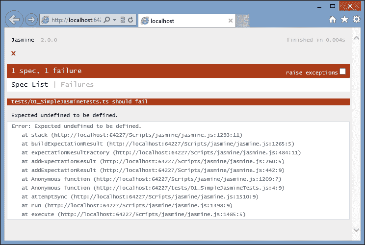
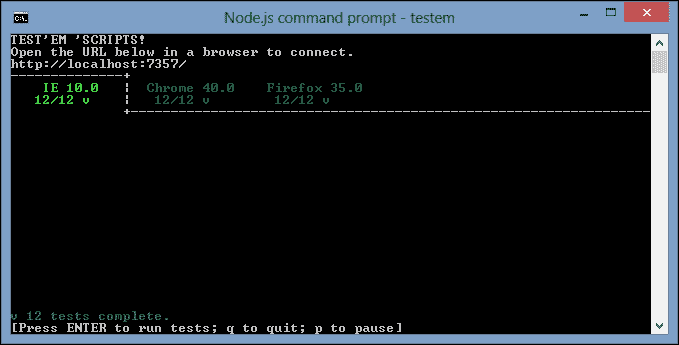
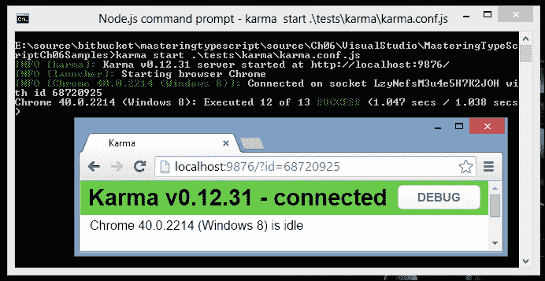
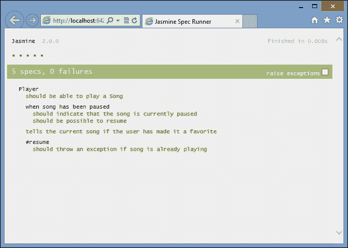
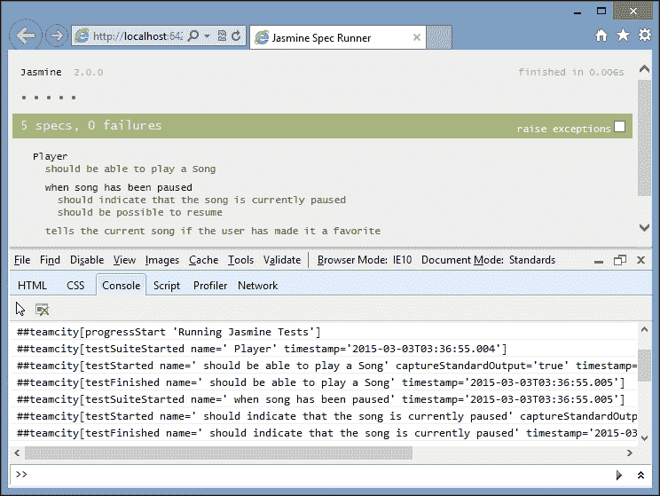
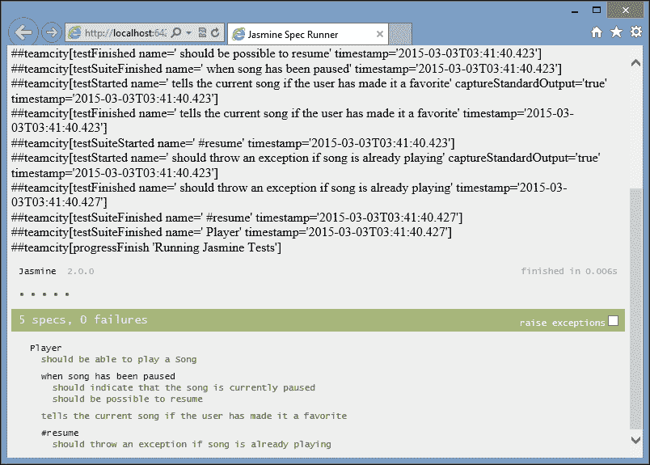
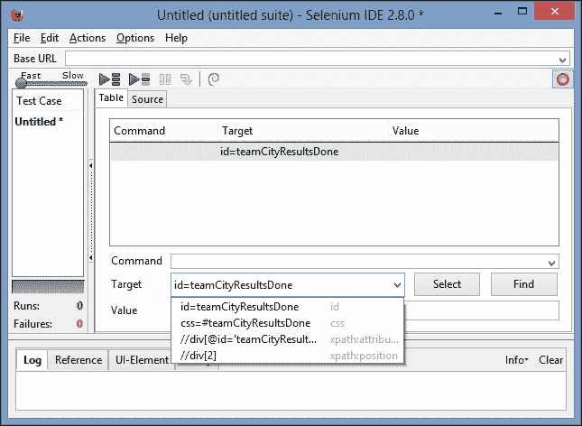
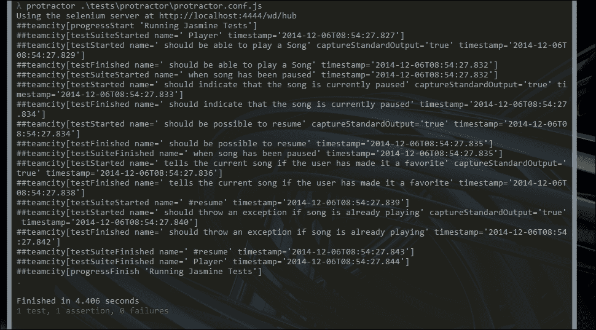

# 第六章 测试驱动开发

在过去的几年中，**模型视图控制器**（**MVC**）、**模型视图呈现器**（**MVP**）和**模型视图视图模型**（**MVVM**）模式的流行使得出现了一系列第三方 JavaScript 库，每个库都实现了自己的这些模式的版本。例如，Backbone 可以被描述为 MVP 实现，其中视图充当呈现器。ExtJS 4 引入了 MVC 模式到他们的框架中，而 Angular 可以被描述为更多的 MVVM 框架。当一起讨论这组模式时，有些人将它们描述为**模型视图任何**（**MVW**）或**模型视图某物**（**MV***）。

编写应用程序的 MV*风格的一些好处包括模块化和关注点分离。构建应用程序的 MV*风格还带来了一个巨大的优势——能够编写可测试的 JavaScript。使用 MV*允许我们对我们精心编写的 JavaScript 进行单元测试、集成测试和功能测试。这意味着我们可以测试我们的渲染函数，以确保 DOM 元素在页面上正确显示。我们还可以模拟按钮点击、下拉选择和动画。我们还可以将这些测试扩展到页面转换，包括登录页面和主页。通过为我们的应用程序构建大量的测试，我们将获得对我们的代码按预期工作的信心，并且它将允许我们随时重构我们的代码。

在本章中，我们将讨论与 TypeScript 相关的测试驱动开发。我们将讨论一些更受欢迎的测试框架，编写一些单元测试，然后讨论测试运行器和持续集成技术。

# 测试驱动开发

**测试驱动开发**（**TDD**）是一个开发过程，或者说是一个开发范式，它从测试开始，并通过这些测试推动生产代码的动力。测试驱动开发意味着提出问题“我如何知道我已经解决了问题？”而不仅仅是“我如何解决这个问题？”

测试驱动方法的基本步骤如下：

+   编写一个失败的测试

+   运行测试以确保它失败

+   编写代码使测试通过

+   运行测试以查看它是否通过

+   运行所有测试以确保新代码不会破坏其他任何测试

+   重复这个过程

使用测试驱动开发实践实际上是一种心态。一些开发人员遵循这种方法，首先编写测试，而其他人先编写他们的代码，然后再编写测试。然后还有一些人根本不写测试。如果你属于最后一类人，那么希望你在本章学到的技术将帮助你朝正确的方向迈出第一步。

有很多借口可以用来不写单元测试。一些典型的借口包括诸如“测试框架不在我们最初的报价中”，或者“它将增加 20%的开发时间”，或者“测试已经过时，所以我们不再运行它们”。然而，事实是，在当今这个时代，我们不能不写测试。应用程序的规模和复杂性不断增长，需求随时间变化。一个拥有良好测试套件的应用程序可以比没有测试的应用程序更快地进行修改，并且对未来的需求变化更具有弹性。这时，单元测试的真正成本节约才显现出来。通过为应用程序编写单元测试，您正在未来保护它，并确保对代码库的任何更改不会破坏现有功能。

在 JavaScript 领域的 TDD 为我们的代码覆盖率增加了另一层。开发团队经常只编写针对应用程序的服务器端逻辑的测试。例如，在 Visual Studio 空间中，这些测试通常只针对控制器、视图和基础业务逻辑的 MVC 框架。测试应用程序的客户端逻辑一直是相当困难的——换句话说，就是实际呈现的 HTML 和基于用户的交互。

JavaScript 测试框架为我们提供了填补这一空白的工具。现在我们可以开始对呈现的 HTML 进行单元测试，以及模拟用户交互，比如填写表单和点击按钮。这种额外的测试层，结合服务器端测试，意味着我们有一种方法来对应用程序的每一层进行单元测试——从服务器端业务逻辑，通过服务器端页面呈现，直到呈现和用户交互。对前端用户交互进行单元测试是任何 JavaScript MV*框架的最大优势之一。事实上，它甚至可能影响您在选择技术栈时所做的架构决策。

# 单元测试、集成测试和验收测试

自动化测试可以分为三个一般领域，或测试类型——单元测试、集成测试和验收测试。我们也可以将这些测试描述为黑盒测试或白盒测试。白盒测试是测试者知道被测试代码的内部逻辑或结构的测试。另一方面，黑盒测试是测试者不知道被测试代码的内部设计或逻辑的测试。

## 单元测试

单元测试通常是一种白盒测试，其中代码块的所有外部接口都被模拟或存根化。例如，如果我们正在测试一些进行异步调用以加载一块 JSON 的代码，单元测试这段代码将需要模拟返回的 JSON。这种技术确保被测试对象始终获得已知的数据集。当出现新的需求时，这个已知的数据集当然可以增长和扩展。被测试对象应该被设计为与接口交互，以便这些接口可以在单元测试场景中轻松地被模拟或存根化。

## 集成测试

集成测试是另一种白盒测试的形式，允许被测试的对象在接近真实代码的环境中运行。在我们之前的例子中，一些代码进行异步调用以加载一块 JSON，集成测试需要实际调用生成 JSON 的**表述性状态转移**（**REST**）服务。如果这个 REST 服务依赖于来自数据库的数据，那么集成测试就需要数据库中与集成测试场景匹配的数据。如果我们将单元测试描述为在被测试对象周围有一个边界，那么集成测试就是简单地扩展这个边界，以包括依赖对象或服务。

为应用程序构建自动化集成测试将极大地提高应用程序的质量。考虑我们一直在使用的场景——一段代码调用 REST 服务获取一些 JSON 数据。有人很容易改变 REST 服务返回的 JSON 数据的结构。我们的单元测试仍然会通过，因为它们实际上并没有调用 REST 服务器端代码，但我们的应用程序会出现问题，因为返回的 JSON 不是我们期望的。

没有集成测试，这些类型的错误只能在手动测试的后期阶段被发现。考虑集成测试，实现特定的数据集用于集成测试，并将其构建到测试套件中，将能够及早消除这些类型的错误。

## 验收测试

验收测试是黑盒测试，通常基于场景。它们可能包含多个用户屏幕或用户交互以通过。这些测试通常也由测试团队执行，因为可能需要登录到应用程序，搜索特定的数据，更新数据等。通过一些规划，我们还可以将这些验收测试的部分自动化为集成套件，因为我们在 JavaScript 中有能力查找并单击按钮，将数据插入所需字段，或选择下拉项。项目拥有的验收测试越多，它就会越健壮。

### 注意

在测试驱动开发方法论中，手动测试团队发现的每个错误都必须导致新的单元测试、集成测试或验收测试的创建。这种方法将有助于确保一旦发现并修复错误，它就不会再次出现。

# 使用持续集成

当为任何应用程序编写单元测试时，很快就会变得重要，设置一个构建服务器，并将您的测试作为每个源代码控制检入的一部分运行。当您的开发团队超出单个开发人员时，使用**持续集成**（**CI**）构建服务器变得至关重要。这个构建服务器将确保提交到源代码控制服务器的任何代码都通过所有已知的单元测试、集成测试和自动验收测试。构建服务器还负责标记构建并生成在部署过程中需要使用的任何部署工件。

构建服务器的基本步骤如下：

+   检出最新版本的源代码，并增加构建编号

+   在构建服务器上编译应用程序

+   运行任何服务器端单元测试

+   为部署打包应用程序

+   将软件包部署到构建环境

+   运行任何服务器端集成测试

+   运行任何 JavaScript 单元测试、集成测试和验收测试

+   标记更改集和构建编号为通过或失败

+   如果构建失败，请通知责任人

### 注意

如果前面的任何步骤失败，构建服务器应该失败。

## 持续集成的好处

使用构建服务器运行前面的步骤对任何开发团队都带来巨大的好处。首先，应用程序在构建服务器上编译，这意味着任何使用的工具或外部库都需要安装在构建服务器上。这为您的开发团队提供了在新机器上安装软件的机会，以便编译或运行应用程序。

其次，在尝试打包之前，可以运行一组标准的服务器端单元测试。在 Visual Studio 项目中，这些测试将是使用任何流行的.NET 测试框架构建的 C#单元测试，例如 MSTest、NUnit 或 xUnit。

接下来，运行整个应用程序的打包步骤。假设一名开发人员在项目中包含了一个新的 JavaScript 库，但忘记将其添加到 Visual Studio 解决方案中。在这种情况下，所有测试将在他们的本地计算机上运行，但由于缺少库文件，构建将失败。如果我们在这个阶段部署站点，运行应用程序将导致 404 错误-文件未找到。通过运行打包步骤，这类错误可以很快被发现。

一旦成功完成了打包步骤，构建服务器应该将站点部署到一个特别标记的构建环境中。这个构建环境仅用于 CI 构建，因此必须具有自己的数据库实例、Web 服务引用等，专门为 CI 构建设置。再次，实际上部署到目标环境测试了部署工件以及部署过程。通过为自动打包部署设置构建环境，您的团队再次能够记录部署的要求和过程。

在这个阶段，我们在一个独立的构建环境上完整地运行了我们的网站实例。然后，我们可以轻松地针对特定的网页运行我们的 JavaScript 测试，并直接在完整版本的网站上运行集成或自动接受测试。这样，我们可以编写针对真实网站 REST 服务的测试，而无需模拟这些集成点。因此，实际上，我们是从头开始测试应用程序。显然，我们可能需要确保我们的构建环境具有一组特定的数据，可以用于集成测试，或者一种生成所需数据集的方法，我们的集成测试将需要。

## 选择构建服务器

有许多持续集成构建服务器，包括 TeamCity、Jenkins 和 Team Foundation Server（TFS）。

### Team Foundation Server

TFS 需要在其构建代理上进行特定配置，以便能够运行 Web 浏览器的实例。对于较大的项目，实际在特定浏览器中运行 JavaScript 测试是有意义的，并很快就成为必需的步骤。您可能需要支持多个浏览器，并希望在 Firefox、Chrome、IE、Safari 或其他浏览器中运行您的测试。TFS 还使用 Windows Workflow Foundation（WF）来配置构建步骤，这需要相当多的经验和知识来修改。

### Jenkins

Jenkins 是一个开源的免费使用的 CI 构建服务器。它有广泛的社区使用和许多插件。Jenkins 的安装和配置相当简单，Jenkins 将允许进程运行浏览器实例，使其与基于浏览器的 JavaScript 单元测试兼容。Jenkins 的构建步骤是基于命令行的，有时需要一些技巧来正确配置构建步骤。

### TeamCity

一个非常受欢迎且功能强大的免费设置的构建服务器是 TeamCity。如果您有少量开发人员（<20）和少量项目（<20），TeamCity 允许免费安装。完整的商业许可证只需约 1500 美元，这使得大多数组织都能负担得起。在 TeamCity 中配置构建步骤比在 Jenkins 或 TFS 中要容易得多，因为它使用向导样式的配置，具体取决于您正在创建的构建步骤的类型。TeamCity 还具有丰富的围绕单元测试的功能，能够显示每个单元测试的图表，因此被认为是构建服务器的最佳选择。

# 单元测试框架

有许多可用的 JavaScript 单元测试框架，也有一些用 TypeScript 编写的框架。最受欢迎的两个 JavaScript 框架是 Jasmine（[`jasmine.github.io/`](http://jasmine.github.io/)）和 QUnit（[`qunitjs.com/`](http://qunitjs.com/)）。如果您正在编写 Node TypeScript 代码，那么您可能想看看 mocha（[`github.com/mochajs/mocha/wiki`](https://github.com/mochajs/mocha/wiki)）。

两个基于 TypeScript 的测试框架是 MaxUnit（[`github.com/KnowledgeLakegithub/MaxUnit`](https://github.com/KnowledgeLakegithub/MaxUnit)）和 tsUnit（[`github.com/Steve-Fenton/tsUnit`](https://github.com/Steve-Fenton/tsUnit)）。不幸的是，MaxUnit 和 tsUnit 都是这个领域的新手，因此可能没有老一辈更流行的框架所固有的功能。例如，MaxUnit 在撰写时没有任何文档，而 tsUnit 没有与 CI 构建服务器兼容的测试报告框架。随着时间的推移，这些 TypeScript 框架可能会成长，但是看到使用第三方库和使用 DefinitelyTyped 声明文件编写 QUnit 或 Jasmine 的单元测试是非常简单的。

在本章的其余部分，我们将使用 Jasmine 2.0 作为我们的测试框架。

# Jasmine

在本章的这一部分，我们将创建一个基于 MVC 框架项目类型的新的 Visual Studio 项目。现在，我们可以使用空的 MVC 模板。

Jasmine 可以通过以下两个 NuGet 包安装到我们的新 TypeScript 项目中：

```ts
Install-Package JasmineTest
Install-Package jasmine.TypeScript.DefinitelyTyped

```

有了这两个包，我们就有了所需的 JavaScript 库和 TypeScript 定义文件，可以开始编写 Jasmine 测试。

### 注意

通过 NuGet 默认安装`JasmineTest`使用了 ASP.NET MVC 框架，并在`Controllers`目录中创建了一个`JasmineController`。如果您没有使用 MVC 框架，或者在 Node 环境中安装了这个包，那么这个`JasmineController`应该被删除，因为它会导致编译错误。在本章的后面，我们将展示如何对这个`JasmineController`运行集成测试，所以最好暂时保留它。

## 一个简单的 Jasmine 测试

Jasmine 使用一种简单的格式来编写测试。考虑以下 TypeScript 代码：

```ts
describe("tests/01_SimpleJasmineTests.ts ", () => {
    it("should fail", () => {
        var undefinedValue;
        expect(undefinedValue).toBeDefined();
    });
});
```

这个片段以一个名为`describe`的 Jasmine 函数开始，它接受两个参数。第一个参数是测试套件的名称，第二个是包含我们的测试套件的匿名函数。接下来的一行使用了名为`it`的 Jasmine 函数，它也接受两个参数。第一个参数是测试名称，第二个参数是包含我们的测试的匿名函数；换句话说，`it`匿名函数中的内容就是我们的实际测试。这个测试首先定义了一个名为`undefinedValue`的变量，但实际上并没有设置它的值。接下来，我们使用了 Jasmine 函数`expect`。仅仅通过阅读这个`expect`语句的代码，我们就可以快速理解这个单元测试在做什么。它期望`undefinedValue`变量的值应该被定义，也就是不是`undefined`。

`expect`函数接受一个参数，并返回一个 Jasmine 匹配器。然后我们可以调用任何 Jasmine 匹配器函数来评估传入`expect`的值与匹配器函数的关系。`expect`关键字类似于其他测试库中的`Assert`关键字。`expect`语句的格式是人类可读的，使得 Jasmine 的期望相对简单易懂。

## Jasmine SpecRunner.html 文件

为了运行这个测试，我们需要一个包含所有相关 Jasmine 第三方库以及我们的测试 JavaScript 文件的 HTML 页面。我们可以创建一个`SpecRunner.html`文件，其中包含以下 HTML：

```ts
<!DOCTYPE html>
<html >
    <head>
        <title>Jasmine Spec Runner</title>
        <link rel="shortcut icon" type="image/png" href="/Content/jasmine/jasmine_favicon.png">
        <link rel="stylesheet" type="text/css" href="/Content/jasmine/jasmine.css">
        <script type="text/javascript" src="img/jasmine.js"></script>
        <script type="text/javascript" src="img/jasmine-html.js"></script>
        <script type="text/javascript" src="img/boot.js"></script>
        <script type="text/javascript" src="img/01_SimpleJasmineTests.js"></script>

    </head>
<body>

</body>
</html>
```

这个 HTML 页面只是包含了所需的 Jasmine 文件，`jasmine.css`、`jasmine.js`、`jasmine-html.js`和`boot.js`。最后一行包含了从我们的 TypeScript 测试文件编译出的 JavaScript 文件。

如果我们将这个页面设置为在 Visual Studio 中的启动页面并运行它，我们应该会看到一个失败的单元测试：



显示 Jasmine 输出的 SpecRunner.html 页面

太棒了！我们正在遵循测试驱动开发的过程，首先创建一个失败的单元测试。结果正是我们所期望的。我们的名为`undefinedVariable`的变量还没有被赋值，因此将是`undefined`。如果我们遵循 TDD 过程的下一步，我们应该编写使测试通过的代码。更新我们的测试如下将确保测试通过：

```ts
describe("tests/01_SimpleJasmineTests.ts ", () => {
    it("value that has been assigned should be defined", () => {
        var undefinedValue = "test";
        expect(undefinedValue).toBeDefined();
    });
});
```

请注意，我们已经更新了我们的测试名称以描述测试的目标。为了使测试通过，我们只需将值`"test"`赋给我们的`undefinedValue`变量。现在运行`SpecRunner.html`页面将显示一个通过的测试。

## 匹配器

Jasmine 有各种各样的匹配器可以在测试中使用，并且还允许我们编写和包含自定义匹配器。从以下 TypeScript 代码中可以看出，Jasmine 匹配器的语法非常直观：

```ts
    var undefValue;
    expect(undefValue).not.toBeDefined();
```

在这里，我们使用`.not.`匹配器语法来检查变量`undefValue`是否确实是`undefined`。

```ts
    var definedValue = 2;
    expect(definedValue).not.toBe(null);
```

这个`expect`语句使用`not.toBe`匹配器来确保`definedValue`变量不是`null`。

```ts
    expect(definedValue).toBe(2);
```

在这里，我们使用`.toBe`匹配器来检查`definedValue`实际上是一个值为 2 的数字。

```ts
    expect(definedValue.toString()).toEqual("2");
```

这个`expect`语句使用`toEqual`匹配器来确保`toString`函数将返回字符串值`"2"`。

```ts
    var trueValue = true;
    expect(trueValue).toBeTruthy();
    expect(trueValue).not.toBeFalsy();
```

在这里，我们使用`toBeTruthy`和`toBeFalsy`匹配器来测试`boolean`值。

```ts
    var stringValue = "this is a string";
    expect(stringValue).toContain("is");
    expect(stringValue).not.toContain("test");
```

最后，我们还可以使用`toContain`匹配器来解析一个字符串，并测试它是否包含另一个字符串，或者使用`.not.`匹配器与`toContain`进行相反的测试。

一定要前往 Jasmine 网站查看匹配器的完整列表，以及编写自定义匹配器的详细信息。

## 测试启动和拆卸

与其他测试框架一样，Jasmine 提供了一种定义函数的机制，这些函数将在每个测试之前和之后运行，或作为测试启动和拆卸机制。在 Jasmine 中，`beforeEach`和`afterEach`函数充当测试启动和拆卸函数，如下面的 TypeScript 代码所示：

```ts
describe("beforeEach and afterEach tests", () => {
    var myString;

    beforeEach(() => {
        myString = "this is a test string";
    });
    afterEach(() => {
        expect(myString).toBeUndefined();
    });

    it("should find then clear the myString variable", () => {
        expect(myString).toEqual("this is a test string");
        myString = undefined;
    });

});
```

在这个测试中，我们在匿名函数的开头定义了一个名为`myString`的变量。根据 JavaScript 的词法作用域规则，这个`myString`变量将在接下来的`beforeEach`、`afterEach`和`it`函数中可用。在`beforeEach`函数中，这个变量被设置为一个字符串值。在`afterEach`函数中，测试这个变量是否已被重置为`undefined`。我们在测试中的期望是，这个变量已经通过`beforeEach`函数设置。在测试结束时，我们将变量重置为`undefined`。请注意，`afterEach`函数也调用了一个`expect`，在这种情况下是为了确保测试已将变量重置为`undefined`。

### 注意

Jasmine 2.1 版本引入了第二个版本的设置和拆卸，称为`beforeAll`和`afterAll`。在撰写本书时，`jasmine.js`和`jasmine.d.ts`文件的版本都还没有更新到 v2.1。

## 数据驱动测试

为了展示 Jasmine 测试库的可扩展性，JP Castro 编写了一个非常简短但功能强大的实用程序，以在 Jasmine 中提供数据驱动测试。他关于这个主题的博客可以在这里找到（[`blog.jphpsf.com/2012/08/30/drying-up-your-javascript-jasmine-tests/`](http://blog.jphpsf.com/2012/08/30/drying-up-your-javascript-jasmine-tests/)），GitHub 存储库可以在这里找到（[`github.com/jphpsf/jasmine-data-provider`](https://github.com/jphpsf/jasmine-data-provider)）。这个简单的扩展允许我们编写直观的 Jasmine 测试，每个测试都带有一个参数，如下所示：

```ts
describe("data driven tests", () => {
    using<string>("valid values", [
        "first string",
        "second string",
        "third string"
    ], (value) => {
        it("should contain string (" + value + ")", () => {
            expect(value).toContain("string");
        });
    });
});
```

在这里，我们将我们的`it`测试函数包裹在另一个名为`using`的函数中。这个`using`函数接受三个参数：值集的字符串描述，值的数组，以及一个函数定义。这个最后的函数定义使用变量`value`，并将使用这个值来调用我们的测试。还要注意，在调用我们的测试时，我们正在动态更改测试名称，以包含传入的`value`参数。这是为了确保每个测试都有一个唯一的测试名称。

前面的解决方案只需要 JP Castro 的 Jasmine 扩展，如下面的 JavaScript 代码所示：

```ts
function using(name, values, func) {
    for (var i = 0, count = values.length; i < count; i++) {
        if (Object.prototype.toString.call(values[i]) !== '[object Array]') 
        {
            values[i] = [values[i]];
        }
        func.apply(this, values[i]);
    }
}
```

这是一个非常简单的名为`using`的函数，它接受我们之前提到的三个参数。该函数通过数组值进行简单的循环，并将每个数组值传递给我们的测试。

我们需要的最后一样东西是一个用于前面`using`函数的 TypeScript 定义文件。这是一个非常简单的函数声明，如下所示：

```ts
declare function using<T>(
    name: string,
    values : T [],
    func : (T) => void
);
```

这个 TypeScript 声明使用了泛型语法`<T>`，以确保第二个和第三个参数使用相同的类型。有了这个声明，以及 JavaScript 的`using`函数，我们的代码将正确编译，并且测试将针对数据数组中的每个值运行一次：

```ts
data driven tests
should contain string (first string)
should contain string (second string)
should contain string (third string)

```

## 使用间谍

Jasmine 还有一个非常强大的功能，可以让你的测试看到特定的函数是否被调用，以及它被调用时使用的参数。它还可以用来创建模拟和存根。所有这些功能都包含在 Jasmine 所称的间谍中。

考虑以下测试：

```ts
class MySpiedClass {
    testFunction(arg1: string) {
        console.log(arg1);
    }
}
describe("simple spy", () => {
    it("should register a function call", () => {
        var classInstance = new MySpiedClass();
        spyOn(classInstance, 'testFunction');

        classInstance.testFunction("test");

        expect(classInstance.testFunction).toHaveBeenCalled();
    });
});
```

我们从一个名为`MySpiedClass`的简单类开始，它有一个名为`testFunction`的函数。这个函数接受一个参数，并将参数记录到控制台上。

我们的测试从创建一个`MySpiedClass`的新实例开始，并将其赋值给一个名为`classInstance`的变量。然后我们在`classInstance`变量的`testFunction`函数上创建了一个 Jasmine 间谍。一旦我们创建了一个间谍，就可以调用这个函数。我们的期望是检查这个函数是否被调用。这就是间谍的本质。Jasmine 将“监视”`MySpiedClass`实例的`testFunction`函数，以查看它是否被调用。

### 注意

默认情况下，Jasmine 间谍会阻止对底层函数的调用。换句话说，它们会用 Jasmine 代理替换你试图调用的函数。如果你需要对一个函数进行间谍，但仍然需要执行函数体，你必须使用`.and.callThrough()`流畅语法来指定这种行为。

虽然这只是一个非常简单的例子，但在许多不同的测试场景中，间谍变得非常强大。例如，需要回调参数的类或函数需要一个间谍来确保回调函数实际上被调用。

让我们看看如何测试回调函数是否被正确调用。考虑以下 TypeScript 代码：

```ts
class CallbackClass {
    doCallBack(id: number, callback: (result: string) => void ) {
        var callbackValue = "id:" + id.toString();
        callback(callbackValue);
    }
}

class DoCallBack {
    logValue(value: string) {
        console.log(value);
    }
}
```

在这段代码片段中，我们定义了一个名为`CallbackClass`的类，它有一个名为`doCallback`的函数。这个`doCallback`函数接受一个`number`类型的`id`参数，还有一个`callback`函数。`callback`函数接受一个`string`作为参数，并返回`void`。

我们定义的第二个类有一个名为`logValue`的函数。这个函数的签名与`doCallback`函数上所需的回调函数签名相匹配。使用 Jasmine 间谍，我们可以测试`doCallBack`函数的逻辑。这个逻辑根据传入的`id`参数创建一个字符串，然后用这个字符串调用`callback`函数。我们的测试需要确保这个字符串格式正确。因此，我们的 Jasmine 测试可以写成如下形式：

```ts
describe("using callback spies", () => {
    it("should execute callback with the correct string value", () => {
        var doCallback = new DoCallBack();
        var classUnderTest = new CallbackClass();

        spyOn(doCallback, 'logValue');
        classUnderTest.doCallBack(1, doCallback.logValue);

        expect(callbackSpy.logValue).toHaveBeenCalled();
        expect(callbackSpy.logValue).toHaveBeenCalledWith("id:1");

    });
});
```

这个测试代码首先创建了一个`CallbackClass`类的实例，也创建了一个`DoCallBack`类的实例。然后我们在`DoCallBack`类的`logValue`函数上创建了一个间谍。接着我们调用`doCallback`函数，将`1`作为第一个参数传入，并将`logValue`函数作为第二个参数传入。我们在最后两行的`expect`语句中检查回调函数`logValue`是否被实际调用，以及它被调用时使用的参数。

## 使用间谍作为伪装

Jasmine 间谍的另一个好处是它们可以充当伪装。换句话说，它们代替了对真实函数的调用，而是委托给了 Jasmine 间谍。Jasmine 还允许间谍返回值——这在生成小型模拟框架时非常有用。考虑以下测试：

```ts
Class ClassToFake {
    getValue(): number {
        return 2;
    }
}
describe("using fakes", () => {
    it("calls fake instead of real function", () => {
        var classToFake = new ClassToFake();
        spyOn(classToFake, 'getValue')
            .and.callFake( () => { return 5; }
            );
        expect(classToFake.getValue()).toBe(5);
    });
});
```

我们从一个名为`ClassToFake`的类开始，它有一个名为`getValue`的单一函数，返回`2`。我们的测试然后创建了这个类的一个实例。然后我们调用 Jasmine 的`spyOn`函数来创建一个对`getValue`函数的间谍，然后使用`.and.callFake`语法将一个匿名函数附加为一个伪造函数。这个伪造函数将返回`5`而不是原来会返回`2`的`getValue`函数。测试然后检查当我们在`ClassToFake`实例上调用`getValue`函数时，Jasmine 会用我们的新伪造函数替换原来的`getValue`函数，并返回`5`而不是`2`。

Jasmine 的伪造语法有许多变体，包括抛出错误或返回值的方法，请参考 Jasmine 文档以获取其伪造能力的完整列表。

## 异步测试

JavaScript 的异步特性——由 AJAX 和 jQuery 广泛使用，一直是这门语言的吸引点之一，也是 Node.js 应用程序的主要架构原理。让我们快速看一下一个异步类，然后描述我们应该如何测试它。考虑以下 TypeScript 代码：

```ts
class MockAsyncClass {
    executeSlowFunction(success: (value: string) => void) {
        setTimeout(() => {
            success("success");
        }, 1000);
    }
}
```

`MockAsyncClass`有一个名为`executeSlowFunction`的单一函数，它接受一个名为`success`的函数回调。在`executeSlowFunction`的代码中，我们通过使用`setTimeout`函数模拟了一个异步调用，并且只在`1000`毫秒（1 秒）后调用成功回调。这种行为模拟了标准的 AJAX 调用（它会使用`success`和`error`回调），这可能需要几秒钟才能返回，取决于后端服务器的速度或数据包的大小。

我们对`executeSlowFunction`的测试可能如下所示：

```ts
describe("asynchronous tests", () => {
    it("failing test", () => {

        var mockAsync = new MockAsyncClass();
        var returnedValue;
        mockAsync.executeSlowFunction((value: string) => {
            returnedValue = value;
        });
        expect(returnedValue).toEqual("success");
    });

});
```

首先，我们实例化了`MockAsyncClass`的一个实例，并定义了一个名为`returnedValue`的变量。然后我们用一个匿名函数调用`executeSlowFunction`作为`success`回调函数。这个匿名函数将`returnedValue`的值设置为从`MockAsyncClass`传入的任何值。我们的期望是`returnedValue`应该等于`"success"`。然而，如果我们现在运行这个测试，我们的测试将失败，并显示以下错误消息：

```ts
Expected undefined to equal 'success'.

```

这里发生的情况是，因为`executeSlowFunction`是异步的，JavaScript 不会等到回调函数被调用之后再执行下一行代码。这意味着期望被调用之前`executeSlowFunction`还没有机会调用我们的匿名回调函数（设置`returnedValue`的值）。如果你在`expect(returnValue).toEqual("success")`行上设置一个断点，并在`returnedValue = value`行上设置另一个断点，你会看到期望行先被调用，而`returnedValue`行只在一秒后才被调用。这个时间问题导致了这个测试的失败。我们需要以某种方式让我们的测试等到`executeSlowFunction`调用回调之后再执行我们的期望。

## 使用`done()`函数

Jasmine 2.0 版本引入了一种新的语法来帮助我们处理这种异步测试。在任何`beforeEach`、`afterEach`或`it`函数中，我们传递一个名为`done`的参数，它是一个函数，然后在我们的异步代码的末尾调用它。考虑以下测试：

```ts
describe("asynch tests with done", () => {
    var returnedValue;

    beforeEach((done) => {
        returnedValue = "no_return_value";
        var mockAsync = new MockAsyncClass();
        mockAsync.executeSlowFunction((value: string) => {
            returnedValue = value;
            done();
        });
    });

    it("should return success after 1 second", (done) => {
        expect(returnedValue).toEqual("success");
        done();
    });
});
```

首先，我们已经将`returnedValue`变量移出了我们的测试，并包含了一个`beforeEach`函数，在我们实际的测试之前运行。这个`beforeEach`函数首先重置了`returnValue`的值，然后设置了`MockAsyncClass`的实例。最后调用了这个实例上的`executeSlowFunction`。

请注意`beforeEach`函数接受一个名为`done`的参数，然后在调用`returnedValue = value`行之后调用此`done`函数。还要注意，`it`函数的第二个参数现在也接受一个`done`参数，并在测试完成时调用此`done`函数。

### 注意

来自 Jasmine 文档：在调用`beforeEach`时，`done`函数被调用之前，规范不会开始，并且在调用`done`函数之前，规范不会完成。默认情况下，Jasmine 将等待 5 秒钟，然后导致超时失败。可以使用`jasmine.DEFAULT_TIMEOUT_INTERVAL`变量进行覆盖。

## Jasmine fixtures

很多时候，我们的代码要么负责从 JavaScript 中读取 DOM 元素，要么在大多数情况下操纵 DOM 元素。这意味着任何依赖于 DOM 元素的运行代码，如果底层 HTML 不包含正确的元素或一组元素，可能会失败。另一个名为`jasmine-jquery`的 Jasmine 扩展库允许我们在测试执行之前将 HTML 元素注入到 DOM 中，并在测试运行后从 DOM 中删除它们。

在撰写本书时，此库尚未在 NuGet 上可用，因此我们需要以传统方式下载`jasmine-jquery.js`文件，并将其包含在我们的项目中。但是，TypeScript 定义文件在 NuGet 上是可用的：

```ts
Install-package Jasmine-jquery.TypeScript.DefinitelyTyped

```

### 注意

我们还需要更新`.html`文件，在头部脚本部分包含`jquery.js`和`jasmine-jquery.js`文件。

让我们看一个使用`jasmine-jquery`库注入 DOM 元素的测试。首先，一个操纵特定 DOM 元素的类：

```ts
Class ModifyDomElement {
    setHtml() {
        var elem = $("#my_div");
        elem.html("<p>Hello world</p>");
    }
}
```

这个`ModifyDomElement`类有一个名为`setHtml`的单个函数，它使用 jQuery 查找 id 为`my_div`的 DOM 元素。然后，这个 div 的 HTML 被设置为一个简单的`"Hello world"`段落。现在是我们的 Jasmine 测试：

```ts
describe("fixture tests", () => {
    it("modifies dom element", () => {
        setFixtures("<div id='my_div'></div>");
        var modifyDom = new ModifyDomElement();
        modifyDom.setHtml();
        var modifiedElement = $("#my_div");
        expect(modifiedElement.length).toBeGreaterThan(0);
        expect(modifiedElement.html()).toContain("Hello");
    });
});
```

测试从调用`jasmine-jquery`函数`setFixtures`开始。此函数将提供的 HTML 作为第一个字符串参数直接注入到 DOM 中。然后，我们创建`ModifyDomElement`类的一个实例，并调用`setHtml`函数来修改`my_div`元素。然后，我们将变量`modifiedElement`设置为 DOM 中 jQuery 搜索的结果。如果 jQuery 找到了元素，则其`length`属性将为`> 0`，然后我们可以检查 HTML 是否确实被修改。

### 注意

`jasmine-jquery`提供的 fixture 方法还允许从磁盘加载原始 HTML 文件，而不必编写 HTML 的冗长字符串表示。如果您的 MV*框架使用 HTML 文件片段，这也特别有用。`jasmine-jquery`库还具有从磁盘加载 JSON 的实用程序，并且可以与 jQuery 一起使用的特定构建匹配器。请务必查看文档（[`github.com/velesin/jasmine-jquery`](https://github.com/velesin/jasmine-jquery)）。

## DOM 事件

`jasmine-jquery`库还添加了一些 Jasmine 间谍，以帮助处理 DOM 事件。如果我们正在创建一个按钮，无论是在 TypeScript 代码中还是在 HTML 中，我们都可以确保我们的代码正确响应 DOM 事件，比如`click`。考虑以下代码和测试：

```ts
Function handle_my_click_div_clicked() {
    // do nothing at this time
}
describe("click event tests", () => {
    it("spies on click event element", () => {
        setFixtures("<div id='my_click_div' "+"onclick='handle_my_click_div_clicked'>Click Here</div>");

        var clickEventSpy = spyOnEvent("#my_click_div", "click");

        $('#my_click_div').click();
        expect(clickEventSpy).toHaveBeenTriggered();
    });
});
```

首先，我们定义了一个名为`handle_my_click_div_clicked`的虚拟函数，该函数在 fixture HTML 中使用。仔细查看`setFixtures`函数调用中使用的 HTML，我们创建了一个带有 id 为`my_click_div`的按钮，并且具有一个`onclick` DOM 事件，将调用我们的虚拟函数。然后，我们在`my_click_div` div 上创建一个点击事件的间谍，然后在下一行实际调用点击事件。我们的期望是使用`jasmine-jquery`匹配器`toHaveBeenTriggered`来测试`onclick`处理程序是否被调用。

### 注意

jQuery 和 DOM 操作为我们提供了一种填写表单、单击**提交**、**取消**、**确定**按钮，并一般模拟用户与我们的应用程序的交互的方法。我们可以使用这些技术在 Jasmine 中轻松编写完整的验收或用户验收测试，进一步巩固我们的应用程序，防止错误和变更。

# 茉莉花运行器

有许多方法可以在实际网页之外运行 Jasmine 测试，就像我们一直在做的那样。但请记住，Visual Studio 不支持在直接运行 Internet Explorer 的网页之外调试 TypeScript。在这些情况下，您需要回到目标浏览器中现有的开发人员工具。

大多数测试运行器依赖于一个简单的静态 HTML 页面来包含所有测试，并将启动一个小型的 Web 服务器实例，以便将此 HTML 页面提供给测试运行器。一些测试运行器使用配置文件来实现这一目的，并构建一个无需 HTML 的测试环境。这对于单元测试可能很好，其中代码的集成点被模拟或存根，但这种方法对于集成或验收测试效果不佳。

例如，许多现实世界的 Web 应用程序通过一些服务器端业务逻辑来生成每个 Web 请求的 HTML。例如，身份验证逻辑可能会将用户重定向到登录页面，然后在后续页面请求或 RESTful 数据请求中使用基于表单的身份验证 cookie。在这些情况下，在实际 Web 应用程序之外运行简单的 HTML 页面将不起作用。您需要在实际与 Web 应用程序的其余部分一起托管的页面中运行您的测试。此外，如果您尝试将 JavaScript 测试套件添加到现有的 Web 项目中，这种逻辑可能不容易放在一边。

出于这些原因，我们专注于在我们的 Web 应用程序中使用标准 HTML 页面来运行我们的测试。例如，在 MVC 应用程序中，我们将设置一个 Jasmine 控制器，其中包含一个返回`SpecRunner.cshtml`视图页面的`Run`函数。实际上，NuGet 包`JasmineTest`的默认安装将在安装时为我们设置这些控制器和视图作为标准模板。

## Testem

Testem 是一个基于 Node 的命令行实用程序，当它检测到 JavaScript 文件已被修改时，将连续运行测试套件以针对连接的浏览器。Testem 非常适用于在多个浏览器上快速获得反馈，还具有可以在构建服务器上使用的持续集成标志。Testem 适用于单元测试。更多信息可以在 GitHub 存储库中找到（[`github.com/airportyh/testem`](https://github.com/airportyh/testem)）。

可以通过以下命令在 Node 上安装 Testem：

```ts
Npm install –g testem

```

要运行`testem`，只需在命令行窗口中导航到测试套件的根文件夹，并输入`testem`。Testem 将启动，启动一个 Web 服务器，并邀请您通过浏览器连接到它。按照屏幕截图，Testem 在`http://localhost:7357`上运行。您可以将多个不同的浏览器连接到此 URL，并且 Testem 将针对每个浏览器运行它找到的规范。默认情况下，Testem 将在当前目录中搜索包含测试的 JavaScript 文件，构建包含这些测试的 HTML 页面并执行它们。如果您已经有一个包含您的测试的 HTML 页面，那么可以通过`testem.yml`配置文件将此页面指定给 Testem，如下所示：

```ts
{
    "test_page":"tests/01_SpecRunner.html"
}
```

此 HTML 页面还需要包含 testem.js 文件，以便与 Testem 服务器进行通信。



Testem 输出显示三个连接的浏览器

Testem 有许多强大的配置选项，可以在配置文件中指定。请务必前往 GitHub 存储库获取更多信息。

请注意，Testem 将无法与 ASP.NET MVC 控制器路由一起工作，因此不适用于 ASP.NET MVC 站点的集成测试。如果您正在使用 MVC 控制器和视图来生成您的测试套件，例如，您正在运行测试页面的 URL 是`/Jasmine/Run`，Testem 将无法工作。

## Karma

Karma 是由 Angular 团队构建的测试运行器，并在 Angular 教程中大量使用。它只是一个单元测试框架，Angular 团队建议使用 Protractor 构建和运行端到端或集成测试。Karma，像 Testem 一样，运行自己的 Web 服务器实例，以便为测试套件提供所需的页面和工件，并具有大量的配置选项。它也可以用于不针对 Angular 的单元测试。要安装 Karma 以与 Jasmine 2.0 一起使用，我们需要使用`npm`安装一些软件包：

```ts
Npm install karma-jasmine@2_0 –save-dev
Npm install jasmine-core –save-dev
Npm install karma-chrome-launcher
Npm install karma-jasmine-jquery

```

要运行 Karma，我们首先需要一个配置文件。按照惯例，这通常称为`karma.conf.js`。示例`karma`配置文件如下：

```ts
module.exports = function (config) {
    config.set({
        basePath: '../../',
        files: [
          'Scripts/underscore.js',
          'Scripts/jquery-1.8.0.js',
          'Scripts/jasmine-jquery/jasmine-jquery.js',
          'Scripts/jasmine-data-provider/SpecHelper.js',
          'tests/*.js'
        ],
        autoWatch: true,
        frameworks: ['jasmine'],
        browsers: ['Chrome'],
        plugins: [
                'karma-chrome-launcher',
                'karma-jasmine'
        ],

        junitReporter: {
            outputFile: 'test_out/unit.xml',
            suite: 'unit'
        }
    });
};
```

所有 Karma 的配置都必须通过`module.exports`和`config.set`约定传递，如前两行所示。`basePath`参数指定 Web 项目的根路径，并与`karma.config.js`文件所在的目录相关。`files`数组包含要包含在生成的 HTML 文件中的文件列表，并且可以使用`\**\*.js`匹配算法来加载整个目录和子目录的 JavaScript 文件。`autoWatch`参数使 Karma 在后台运行，监视文件的更改，类似于 Testem。Karma 还允许指定各种浏览器，每个浏览器都有自己的启动器插件。最后，本示例中使用`junitReporter`将测试报告回报给 Jenkins CI 服务器。一旦配置文件就位，只需运行以下命令启动 karma：

```ts
karma start <path to karma.config.js>.

```



Karma 从一个简单的测试中输出

## Protractor

Protractor 是一个基于 Node 的测试运行器，用于端到端测试。它最初是为 Angular 应用程序设计的，但可以与任何网站一起使用。与 Testem 和 Karma 不同，Protractor 能够浏览到特定页面，然后从 JavaScript 与页面交互，适用于集成测试。它可以检查页面标题等元数据属性，或填写表单和点击按钮，并允许后端服务器重定向到不同的页面。Protractor 文档可以在这里找到（[`github.com/angular/protractor`](https://github.com/angular/protractor)），并可以使用`npm`安装：

```ts
Npm install –g protractor

```

稍后我们将运行 Protractor，但首先让我们讨论 Protractor 用于自动化网页的引擎。

### 使用 Selenium

Selenium 是一个用于 Web 浏览器的驱动程序。它允许对 Web 浏览器进行编程远程控制，并可用于在 Java、C#、Python、Ruby、PHP、Perl 甚至 JavaScript 中创建自动化测试。Protractor 在底层使用 Selenium 来控制 Web 浏览器实例。要安装用于 Protractor 的 Selenium 服务器，请运行以下命令：

```ts
Webdriver-manager update

```

要启动 Selenium 服务器，请运行以下命令：

```ts
Webdriver-manager start

```

如果一切顺利，Selenium 将报告服务器已启动，并详细说明 Selenium 服务器的地址。检查您的输出是否有类似以下行：

```ts
RemoteWebDriver instances should connect to: http://127.0.0.1:4444/wd/hub

```

### 注意

您需要在您的计算机上安装 Java 才能运行 Selenium 服务器，因为 webdriver-manager 脚本使用 Java 启动 Selenium 服务器。

一旦服务器运行，我们将需要一个 Protractor 的配置文件（名为`protractor.conf.js`），其中包含一些设置。在这个阶段，我们只需要以下内容：

```ts
exports.config = {
    seleniumAddress: 'http://localhost:4444/wd/hub',
    specs: ['*.js']
}
```

这些 protractor 设置只是将`seleniumAddress`设置为之前报告的 Selenium 服务器的地址。我们还有一个`specs`属性，它被设置为在与`protractor.conf.js`相同目录中查找任何`.js`文件，并将它们视为测试规范。

现在是最简单的测试：

```ts
describe("simple protractor test", () => {
    it("should navigate to a page and find a title", () => {
        browser.driver.get('http://localhost:64227/Jasmine/Run');
        expect(browser.driver.getTitle()).toContain("Jasmine");
    });
});
```

我们的测试从在`/Jasmine/Run`打开页面开始。请注意，这是一个使用默认 Jasmine 控制器的 ASP.NET MVC 路径，并返回`Views/Jasmine/SpecRunner.cshtml`。这个控制器和视图是之前安装的 Jasmine NuGet 包中包含的。在尝试执行 Protractor 测试之前，请确保您可以在浏览器中导航到此页面。

使用配置文件运行 Protractor 现在将执行我们之前的测试：

```ts
protractor .\tests\protractor\protractor.conf.js

```

并且将产生期望的结果：

```ts
Using the selenium server at http://localhost:4444/wd/hub.
Finished in 1.606 seconds
1 test, 1 assertion, 0 failures

```

### 注意

这里必须有两件事情在运行，以便这个测试能够工作：

Selenium 服务器必须在命令提示符中运行，以便`localhost:4444/wd/hub`是有效地址，并且不返回 404 错误

开发人员 ASP.NET 网站必须正常运行，以便`localhost:64277/Jasmine/Run`访问我们的 Visual Studio Jasmine 控制器，并呈现 HTML 页面

# 集成测试

假设我们正在进行集成测试，测试页面是使用 ASP.NET MVC 路由渲染的。我们希望使用标准的 MVC 控制器、操作、视图方法来生成 HTML 页面，因为我们可能需要执行一些服务器端逻辑来设置集成测试开始之前的前提条件。

请注意，在现实世界的应用程序中，通常需要运行服务器端逻辑或使用服务器端 HTML 渲染进行集成测试。例如，大多数应用程序在允许通过 JavaScript 调用 REST 服务之前，都需要某种形式的身份验证。向 RESTful API 控制器实现[Authorize]属性是合乎逻辑的解决方案。不幸的是，从普通 HTML 页面调用这些 REST 控制器将返回 401（未经授权）错误。解决这个问题的一种方法是使用 MVC 控制器来提供测试 HTML 页面，然后在服务器端代码中设置虚拟表单身份验证票证。一旦这个设置完成，从此页面对 RESTful 服务的任何调用都将使用虚拟用户配置文件进行身份验证。这种技术也可以用于运行具有不同角色和不同权限的用户的集成测试，这些角色和权限基于他们的身份验证凭据。

## 模拟集成测试

为了模拟这种集成测试页面，让我们重用之前安装的 Jasmine NuGet 包中的`JasmineController`。如前所述，集成测试将需要访问后端服务器端逻辑（在这种情况下是 Jasmine MVC 控制器），然后将服务器端生成的 HTML 页面呈现到浏览器（在这种情况下是`SpecRunner.cshtml`视图）。这种模拟意味着我们依赖服务器端 MVC 框架来解析`/Jasmine/Run` URL，动态生成 HTML 页面，并将生成的 HTML 页面返回给浏览器。

这个`SpecRunner.cshtml`文件（用于生成 HTML 的 MVC 模板）非常简单：

```ts
{
  Layout = null;
}
<!DOCTYPE HTML PUBLIC "-//W3C//DTD HTML 4.01 Transitional//EN" "http://www.w3.org/TR/html4/loose.dtd">
<html>
<head>
  <title>Jasmine Spec Runner</title>

  <link rel="shortcut icon" type="image/png" href="/Content/jasmine/jasmine_favicon.png">
  <link rel="stylesheet" type="text/css" href="/Content/jasmine/jasmine.css">
  <script type="text/javascript" src="img/jasmine.js"></script>
  <script type="text/javascript" src="img/jasmine-html.js"></script>
  <script type="text/javascript" src="img/boot.js"></script>

  <!—include source files here... -->
  <script type="text/javascript" src="img/SpecHelper.js"></script>
  <script type="text/javascript"
          src="img/PlayerSpec.js"></script>

  <!—include spec files here... -->
  <script type="text/javascript" src="img/Player.js"></script>
  <script type="text/javascript" src="img/Song.js"></script>
</head>

<body>
</body>
</html>
```

这个 ASP.NET MVC 视图页面使用 Razor 语法，不是基于主页面，因为文件顶部的`Layout`参数设置为`null`。页面在`head`元素中包含了一些链接，包括`jasmine.css`、`jasmine.js`、`jasmine-html.js`和`boot.js`。这些是我们之前看到的必需的 Jasmine 文件。之后，我们只包括了`jasmine-samples`目录中的`SpecHelper.js`、`PlayerSpec.js`、`Player.js`和`Song.js`文件。通过导航到`/Jasmine/Run` URL 运行此页面将运行 Jasmine 附带的示例测试。



默认/Jasmine/Run 网页的输出

在这个示例中，我们模拟的集成测试页面只运行了一些标准的 Jasmine 测试。现在使用服务器端生成的 HTML 页面可以允许我们使用虚拟身份验证，如果需要的话。有了虚拟身份验证，我们可以开始编写 Jasmine 测试来针对安全的 RESTful 数据服务。

在下一章中，我们将看一下构建和测试一些 Backbone 模型和集合，并将通过更多的集成测试示例来实际请求服务器上的数据。不过，目前我们有一个由服务器端生成的示例页面，可以作为进一步集成测试的基础。

### 注意

这样的测试页面不应该被打包在用户验收测试（UAT）或发布配置中。在 ASP.NET 中，我们可以简单地在我们的控制器类周围使用编译指令，比如`#if DEBUG … #endif`，来排除它们从任何其他构建配置中。

## 详细的测试结果

所以现在我们有了一个集成测试页面的开端，它显示了我们的 Jasmine 测试运行的结果。这个 HTML 页面对于快速概览很好，但我们现在希望一些更详细的关于每个测试的信息，以便我们可以报告给我们的构建服务器；每个测试花费的时间，以及它的`success` / `fail`状态。

为了报告这些目的，Jasmine 包括使用自定义测试报告者的能力，超出了 Jasmine 默认的`HtmlReporter`。GitHub 项目 jasmine-reporters（[`github.com/larrymyers/jasmine-reporters`](https://github.com/larrymyers/jasmine-reporters)）有许多预构建的测试报告者，适用于最流行的构建服务器。不幸的是，这个项目没有相应的 NuGet 包，所以我们需要手动在我们的项目中安装`.js`文件。

### 注意

管理 JavaScript 库的另一种方法是使用**Bower**包管理器。Bower 是一个基于 Node 的命令行实用程序，类似于 NuGet，但只处理 JavaScript 库和框架。

现在让我们修改我们的 HTML 页面来包含 TeamCity 报告者。首先，修改`SpecRunner.cshtml`文件，包含`teamcity_reporter.js`文件的`script`标签如下：

```ts
<script type="text/javascript" src="img/teamcity_reporter.js">
</script>
```

接下来，我们需要在`body`标签内创建一个简单的脚本来注册这个报告者到 Jasmine：

```ts
<script type="application/javascript">
    window.tcapi = new jasmineReporters.TeamCityReporter({});
    jasmine.getEnv().addReporter(window.tcapi);
</script>
```

这个脚本只是创建了一个`TeamCityReporter`类的实例，并将其分配给`window`对象上的一个名为`tcapi`的变量。这个脚本的第二行将这个报告者添加到 Jasmine 环境中。现在运行我们的页面将会产生记录在控制台的 TeamCity 结果：



Jasmine 输出与记录在控制台的 TeamCity 消息

## 记录测试结果

现在我们需要访问这个输出，并找到一种方法将其报告给 Protractor 实例。不幸的是，通过 Selenium 访问控制台的日志只会报告关键错误，因此前面的 TeamCity 报告输出将不可用。快速查看`teamcity_reporter.js`代码，发现所有的`console.log`输出消息都使用`tclog`函数来构建一个字符串，然后调用`console.log`输出这个字符串。由于我们有一个可用的`TeamCityReporter`实例，我们可以很容易地将这些记录的消息存储到一个数组中，然后在测试套件运行结束后读取它们。对 JavaScript 文件`teamcity_reporter.js`进行一些快速修改如下。

在`TeamCityReporter`类的构造函数下方，创建一个数组：

```ts
exportObject.TeamCityReporter = function (args) {

    self.logItems = new Array();
}
```

现在我们可以修改`tclog`函数来返回它构建的字符串：

```ts
Function tclog(message, attrs) {

    log(str); // call to console.log
    return str; // return the string to the calling function
}
```

然后，每次调用`tclog`都可以将返回的字符串推送到这个数组中：

```ts
self.jasmineStarted = function (summary) {

    self.logItems.push(
       tclog("progressStart 'Running Jasmine Tests'"));
};
```

现在`TeamCityReporter`有一个`logItems`数组，我们需要一些方法来找出测试套件何时完成，然后我们可以循环遍历`logItems`数组，并将它们附加到 DOM 上。一旦它在 DOM 中，我们的 Protractor 实例就可以使用 Selenium 来读取这些值并报告给命令行。

让我们构建一个名为`JasmineApiListener`的小类，它接受`TeamCityReporter`类的一个实例来为我们做所有这些工作：

```ts
class JasmineApiListener {
    private _outputComplete: boolean;
    private _tcReporter: jasmine.ITeamCityReporter;

    constructor(tcreporter: jasmine.ITeamCityReporter) {
        this._outputComplete = false;

        this._tcReporter = tcreporter;
        var self = this;

        window.setInterval(() => {

            if (self._tcReporter.finished && !self._outputComplete) {
                var logItems = self._tcReporter.logItems;
                var resultNode = document.getElementById( 'teamCityReporterLog');
                resultNode.setAttribute('class', 'teamCityReporterLog');
                for (var I = 0; I < logItems.length; i++) {
                    var resultItemNode = document.createElement('div');
                    resultItemNode.setAttribute('class', 'logentry');
                    var textNode = document.createTextNode(logItems[i]);
                    resultItemNode.appendChild(textNode);
                    resultNode.appendChild(resultItemNode);

                }
                self._outputComplete = true;

                var doneFlag = document.getElementById( 'teamCityResultsDone');
                var doneText = document.createTextNode("done");
                doneFlag.appendChild(doneText);
            }

        }, 3000);
    }

}
```

我们的`JasmineApiListener`类有两个私有变量。`_outputComplete`变量是一个布尔标志，指示测试套件已完成，并且结果已经写入 DOM。`_tcReporter`变量保存了`TeamCityReporter`类的一个实例，它通过`constructor`传递。`constructor`简单地将标志`_outputComplete`设置为`false`，创建一个名为`self`的变量，并在三秒间隔上设置一个简单的定时器。

### 注意

`self`变量是必要的作用域步骤，以便在传递给`setInterval`的匿名函数内访问`this`的正确实例。

我们匿名函数的主体是所有好东西发生的地方。首先，我们检查`TeamCityReporter`实例上的`_tcReporter.finished`属性，以判断套件是否已完成。如果是，并且我们还没有将结果附加到 DOM `(!self._outputComplete)`，那么我们可以访问`logItems`数组，并为每个条目创建 DOM 元素。这些元素作为`<div class="logentry">…</div>`元素附加到父级`<div id="teamCityReporterLog">`元素。

请注意，前面的代码使用了原生的`document.getElementById`和`appendChild`语法进行 DOM 操作，而不是 jQuery 风格的语法，以避免对 jQuery 的依赖。

现在我们可以在`SpecRunner.cshtml`视图中修改脚本如下：

```ts
<script type="application/javascript">
    window.tcapi = new jasmineReporters.TeamCityReporter({});
    jasmine.getEnv().addReporter(window.tcapi);
    var jasmineApiListener = new JasmineApiListener(window.tcapi);
</script>

<div id="teamCityResultsDone"></div>
<div id="teamCityReporterLog"></div>
```

第一个脚本是我们之前使用的更新版本，现在它创建了我们的`JasmineApiListener`类的一个实例，并在构造函数中传递了`TeamCityReporter`类的实例。我们还添加了两个`<div>`标签。第一个`teamCityResultsDone`是一个标志，表示我们已经完成了将 TeamCity 结果写入 DOM，第二个`teamCityReporterLog`是父`div`，用于容纳所有子`logentry`元素。

如果我们现在打开这个页面，我们应该能看到我们的测试运行，然后三秒后，DOM 将被更新，显示我们从`TeamCityReporter`数组中读取的结果，如下面的截图所示：



Jasmine 输出被记录到 DOM

现在我们有了一种将测试结果记录到 DOM 的方法，我们可以更新基于 Protractor 的 Selenium 测试，将这些结果与构建服务器相关联。

## 查找页面元素

如前所述，Protractor 可以用于运行集成测试，以及自动接受测试。Protractor 测试可以浏览到登录页面，找到登录用户名文本框，向该文本框发送值，例如"`testuser1"`，然后重复该过程以输入密码。然后可以使用相同的测试代码单击**登录**按钮，这将提交表单到我们的服务器登录控制器。然后我们的测试可以确保服务器以正确的重定向响应到我们的主页。这个主页可能包含多个按钮、网格、图片、侧边栏和导航元素。理想情况下，我们希望为每个这些页面元素编写接受测试。

Protractor 使用定位器在 DOM 中查找这些元素。这些元素可以通过它们的 CSS 选择器、`id`来找到，或者如果使用 Angular，则可以通过模型或绑定来找到。构建这些选择器的正确字符串有时可能很困难。

Selenium 为我们提供了一个有用的 Firefox 扩展，用于编写基于 Selenium 的测试 - Selenium IDE ([`docs.seleniumhq.org/projects/ide/`](http://docs.seleniumhq.org/projects/ide/))。安装了这个扩展后，我们可以使用 IDE 来帮助找到页面上的元素。

作为如何使用这个扩展的示例，让我们继续我们正在编写的 Jasmine 报告器的工作，并找到我们一直在使用来标记完成测试套件的`teamCityResultsDone`DOM 元素。我们用来找到这个 DOM 元素的代码和过程与我们在登录页面上找到其他页面元素的代码和过程相同，例如，或者我们通过 Selenium 驱动的任何其他页面。

如果我们在 Firefox 中启动我们的`/Jasmine/Run`页面，现在我们可以点击浏览器右上角的 Selenium IDE 按钮来启动 Selenium IDE。这个 IDE 使用命令来记录对网页的交互，并在主窗口中显示这些命令列表。右键单击命令窗口，然后选择**插入新命令**。在命令名称文本框中给新命令一个名称，比如`find done element`。一旦命令有了名称，目标输入框旁边的两个按钮就变成了启用状态，我们可以点击**选择**。然后我们可以在网页上拖动鼠标，并点击页面顶部的**done**文本。注意命令已经自动填写了 Selenium IDE 中的**目标**元素。**目标**输入框现在变成了一个下拉列表，我们可以使用这个列表来显示我们`teamCityResultsDone`的`div`的 Selenium 选择器语法，如下面的截图所示：



FireFox Selenium IDE

## 在 Jasmine 中使用页面元素

现在我们知道如何使用 Selenium IDE 来找到 HTML 页面元素，我们可以开始编写 Selenium 命令来查询我们 Jasmine 测试的页面元素。记住我们需要找到两个元素。

首先，我们需要找到`teamCityResultsDone`的`div`，并等待该元素的文本被更新。这个`div`只有在我们的 Jasmine 测试套件完成时才会被更新，并且我们的测试结果已经包含在 DOM 中。一旦我们的测试套件被标记为完成，我们就需要循环遍历`teamCityReporterLog`的子元素`logentry`的每一个`div`。这些`logentry`的`div`将包含我们每个测试的详细结果。

我们在 protractor 测试中需要的更改如下：

```ts
describe("team city reporter suite", () => {
    it("should find test results", () => {
        browser.driver.get('http://localhost:64227/Jasmine/Run');

        expect(browser.driver.getTitle()).toContain("Jasmine");

        var element = browser.driver.findElement(
            { id: "teamCityResultsDone" });

        browser.driver.wait(() => {
            return element.getText().then((value) => {
                return value.length > 0;
            });
        }, 60000, "failed to complete in 60 s");
    });

    afterEach(() => {
        browser.driver.findElements(
                by.css("#teamCityReporterLog > div.logentry")
            ).then((elements) => {
            for (var i = 0; i < elements.length; i++) {
                elements[i].getText().then((textValue) => {
                    console.log(textValue);
                });
            }
        });
    });
});
```

我们的测试从浏览到`/Jasmine/Run`页面开始，并期望该页面的标题包含`"Jasmine"`，就像我们之前看到的那样。然后，我们使用来自 Selenium 的`findElement`函数在页面上找到一个元素。这个函数传递了一个 JavaScript 对象，其中`id`设置为`teamCityResultsDone`，并且使用了我们之前在 Selenium IDE 中看到的选择语法。

然后，我们调用`wait`函数等待`teamCityResultsDone`元素的文本被更新（即其`length`为`> 0`），并为这个`wait`函数设置了 60 秒的超时。记住我们的`JasmineApiListener`代码将在我们完成更新 DOM 时将这个`div`的文本值设置为`"done"`，这将有效地触发`wait`函数。

然后，我们使用`afterEach`函数循环遍历`logentry`的`divs`。我们现在不是找到父元素，而是使用`findElements` Selenium 函数在页面上找到多个元素。

注意我们用于这些`div`的 Selenium 选择器语法：`by.css("#teamCityReporterLog > div.logentry")`。这个`by.css`函数使用 CSS 选择器语法来找到我们的元素，输入字符串对应于 Selenium IDE 显示的 CSS 选择器。因此，我们可以使用 Selenium IDE 来帮助我们找到正确的 CSS 选择器语法。

Selenium 对其大多数 API 函数使用流畅的语法。因此，对 `findElements` 的调用后面跟着一个 `.then` 函数，它将在数组中找到的元素传递给匿名函数。我们使用这个匿名函数与 `.then( (elements) => { .. })` 语法。在这个函数中，我们循环遍历元素数组的每个元素，并调用 `.getText` Selenium 函数。同样，这个 `getText` 函数提供了流畅的语法，允许我们编写另一个匿名函数来使用返回的文本值，就像在 `elements[i].getText().then( (textValue ) => { … });` 中看到的那样。这个函数只是将 `textValue` 记录到 protractor 控制台中。

现在运行我们的 Protractor 测试将会将测试结果报告到命令行，如下所示：



Protractor 将测试结果记录到控制台

任务完成。我们现在正在使用 Protractor 浏览到一个由服务器生成的 HTML 页面，运行一组 Jasmine 测试。然后我们使用 Selenium 在页面上查找元素，等待 DOM 更新，然后循环遍历元素数组，以便将我们的 Jasmine 测试结果记录到 protractor 控制台中。

这些 Selenium 函数，如 `browser.driver.get`、`findElements` 和 `wait`，都是 Selenium 提供的丰富功能集的一部分，用于处理 DOM 元素。请务必查阅 Selenium 文档以获取更多信息。

我们现在有了一种机制，可以启动集成测试页面，运行 Jasmine 测试套件，将这些测试结果报告给 DOM，然后读取这些结果并将其记录到 Protractor 控制台中。然后在 TeamCity 构建服务器中设置一个构建步骤来执行 protractor，并在构建过程中记录这些测试结果。

# 总结

在本章中，我们从头开始探讨了测试驱动开发。我们讨论了 TDD 的理论，探讨了单元测试、集成测试和验收测试之间的区别，并看了一下 CI 构建服务器流程会是什么样子。然后我们探讨了 Jasmine 作为一个测试框架，学习了如何编写测试，使用期望和匹配器，还探讨了 Jasmine 扩展，以帮助进行数据驱动测试和通过固定装置进行 DOM 操作。最后，我们看了测试运行器，并构建了一个基于 Protractor 的测试框架，通过 Selenium 驱动网页，并将结果报告给构建服务器。在下一章中，我们将探讨 TypeScript 模块语法，以便同时使用 CommonJS 和 AMD JavaScript 模块。

为 Bentham Chang 准备，Safari ID bentham@gmail.com 用户编号：2843974 © 2015 Safari Books Online, LLC。此下载文件仅供个人使用，并受到服务条款的约束。任何其他使用都需要版权所有者的事先书面同意。未经授权的使用、复制和/或分发严格禁止并违反适用法律。保留所有权利。
