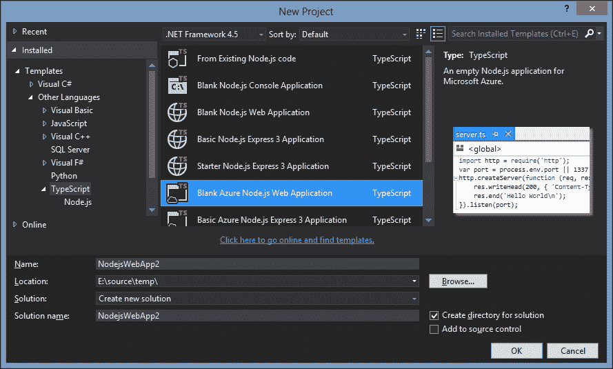
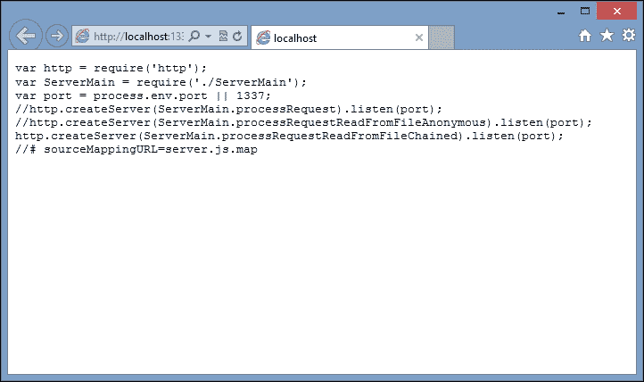
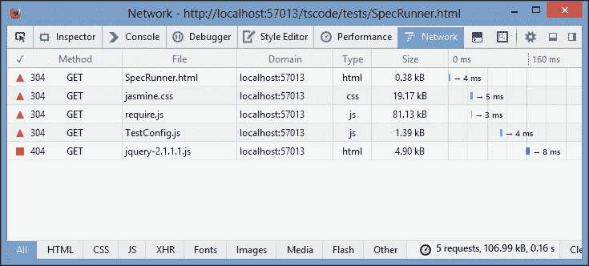
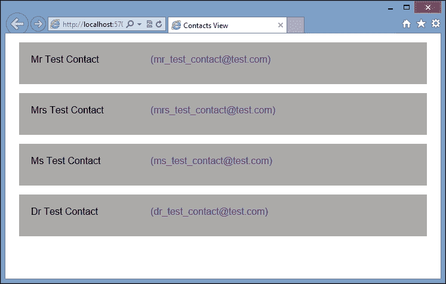
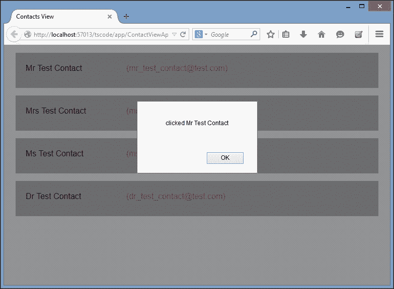
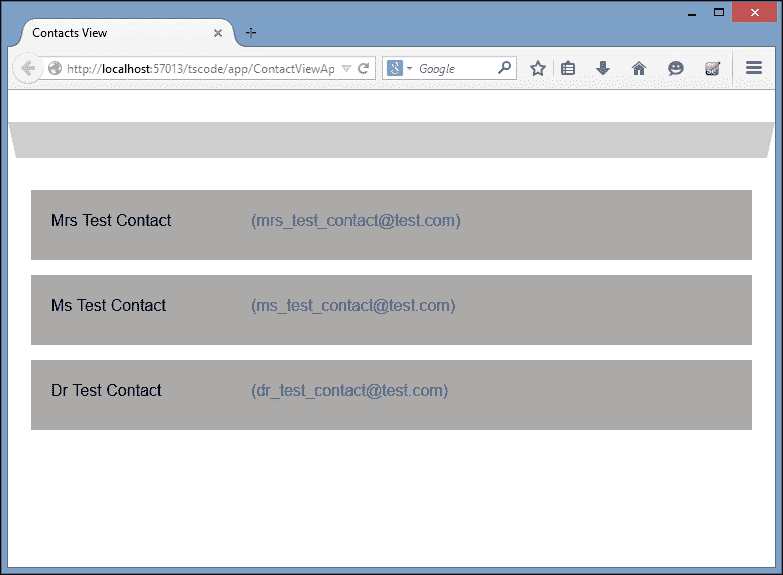

# 第七章：模块化

模块化是现代编程语言中常用的一种技术，它允许程序由一系列较小的程序或模块构建而成。编写使用模块的程序鼓励程序员编写符合称为“关注点分离”的设计原则的代码。换句话说，每个模块专注于做一件事，并且有一个明确定义的接口。如果我们通过关注接口来使用这个模块，我们可以很容易地用其他东西替换这个接口，而不会破坏我们的代码。我们将在下一章更多地关注“关注点分离”和其他面向对象的设计模式。

JavaScript 本身并没有模块的概念，但它被提议用于即将到来的 ECMAScript 6 标准。流行的框架和库，如 Node 和 Require，已经在它们的框架中构建了模块加载功能。然而，这些框架使用略有不同的语法。Node 使用 CommonJS 语法进行模块加载，而 Require 使用**异步模块加载**（**AMD**）语法。TypeScript 编译器有一个选项可以打开模块编译，然后在这两种语法风格之间切换。

在本章中，我们将看一下两种模块风格的语法，以及 TypeScript 编译器如何实现它们。我们将看一下在编写 Node 和 Require 的代码时如何使用模块。我们还将简要介绍 Backbone，以及如何使用 Model、View 和 Controller 编写应用程序。这些 Backbone 组件将被构建为可加载的模块。

# CommonJs

使用 CommonJs 语法编写模块的最普遍用法是编写服务器端代码。有人认为基于浏览器的 CommonJs 语法简直无法做到，但也有一些库，比如 Curl（[`github.com/cujojs/curl`](https://github.com/cujojs/curl)）可以实现这种语法。然而，在本节中，我们将专注于 Node 应用程序开发。

## 在 Visual Studio 中设置 Node

在 Visual Studio 中使用 Node 已经变得非常简单，这得益于 Node 工具的 Visual Studio 插件（[`nodejstools.codeplex.com`](https://nodejstools.codeplex.com)）。这个工具集也已经更新，使用 TypeScript 作为默认编辑器，为 Node 带来了完整的 TypeScript 开发体验。安装了扩展后，我们可以创建一个新的空白 Node 应用程序，如下面的截图所示：



使用 Node 工具集创建空白 Node 应用程序

这个项目模板将自动为我们创建一个`server.ts` TypeScript 文件，并自动包含`node.d.ts`声明文件。如果我们编译并运行这个默认实现，只需按下*F5*，项目模板将自动启动一个新的控制台来运行我们的 Node 服务器，启动服务器实例，并打开一个浏览器连接到这个实例。如果一切顺利，你的浏览器将简单地显示**Hello World**。

让我们来看看创建我们的 Node 服务器实例的`server.ts` TypeScript 文件：

```ts
import _http = require('http');
var port = process.env.port || 1337
http.createServer(function (req, res) {
    res.writeHead(200, { 'Content-Type': 'text/plain' });
    res.end('Hello World\n');
}).listen(port);
```

这段代码片段的第一行使用 CommonJs 模块语法告诉我们的 Node 服务器必须`import`名为`'http'`的库。

这一行有两个关键部分。为了解释这些关键部分，让我们从`=`号的右侧开始，然后向左工作。`require`函数接受一个参数，并用于告诉应用程序有一个名为`'http'`的库。`require`函数还告诉应用程序需要这个库才能继续正常运行。由于`require`是 TypeScript 模块语法的关键部分，它被赋予了关键字状态，并且将会像`var`、`string`和`function`等其他关键字一样以蓝色高亮显示。如果应用程序找不到`'http'`库，那么 Node 将立即抛出异常。

`=`号的左侧使用了`import`关键字，这也是模块语法中的一个基本概念。`import`语句告诉应用程序将通过`require`函数加载的库`require('http')`附加到名为`_http`的命名空间中。`'http'`库公开的任何函数或对象都将通过`_http`命名空间对程序可用。

如果我们快速跳到第三行，我们会看到我们调用了`'http'`模块中定义的`createServer`函数，并通过`_http`命名空间调用它，因此是`_http.createServer()`。

### 注意

由空白 Node 项目模板生成的默认`server.ts`文件与我们前面的代码示例略有不同。它将导入命名为`http`，与库名`'http'`匹配，如下所示：

`import http = require('http');`

这是 Node 的一个常见命名标准。当然，您可以将导入的命名空间命名为任何您喜欢的名称，但是将命名空间与导入的库的名称匹配会有助于提高代码的可读性。

我们的代码片段的第二行只是将名为`port`的变量设置为全局变量`process.env.port`的值，或者默认值`1337`。这个端口号在最后一行使用，使用流畅的语法在`http.createServer`函数的返回值上调用`listen`函数。

我们的`createServer`函数有两个名为`req`和`res`的变量。如果我们将鼠标悬停在`req`变量上，我们会看到它的类型是`_http.ServerRequest`。同样，`res`变量的类型是`_http.ServerResponse`。这两个变量是我们的 HTTP 请求和响应流。在代码体中，我们在 HTTP 响应上调用`writeHead`函数来设置内容类型，然后在 HTTP 响应上调用`end`函数来向浏览器写入文本`'Hello World\n'`。

通过这几行代码，我们创建了一个运行中的 Node HTTP 服务器，提供一个简单的网页，其中包含文本**"Hello World"**。

请注意，如果您对 TypeScript 语法有敏锐的眼光，您会注意到这个文件使用 JavaScript 语法而不是 TypeScript 语法来调用我们的`createServer`函数。这很可能是由于最近将 Node 工具集从 JavaScript 升级到 TypeScript。调用`createServer`也可以使用 TypeScript 的箭头函数语法来编写，如下所示：

```ts
_http.createServer((req, res) => { .. }
```

## 创建一个 Node 模块

要创建一个 Node 模块，我们只需要创建另一个 TypeScript 文件来存放我们的模块代码。让我们创建一个名为`ServerMain.ts`的文件，并将写入 HTTP 响应的代码移入此模块，如下所示：

```ts
import http = require('http');
export function processRequest(
    req: http.ServerRequest,
    res: http.ServerResponse): void
{
    res.writeHead(200, { 'Content-Type': 'text/plain' });
    res.end('Hello World\n');
}
```

我们的`ServerMain`模块以将`'http'`模块导入到`http`命名空间开始。这是必要的，以便我们可以使用此库的`ServerRequest`和`ServerResponse`类型。

现在使用关键字`export`来指示哪些函数将对该模块的用户可用。正如我们所看到的，我们导出了一个名为`processRequest`的函数，它接受两个参数，`req`和`res`。这个函数将用作替代我们之前在`server.ts`文件中使用的匿名函数`(req, res) => { ... }`。

请注意，作为优秀的 TypeScript 编码者，我们还强类型化了`req`和`res`变量，分别为`http.ServerRequest`类型和`http.ServerResponse`类型。这将使我们的 IDE 内置智能提示，并且也符合强类型的两个原则（S.F.I.A.T 和自描述函数）。

在修改`server.ts`文件以使用我们的新模块之前，让我们打开生成的 JavaScript 文件，更仔细地查看一下 CommonJs 语法：

```ts
function processRequest(req, res) {
    res.writeHead(200, { 'Content-Type': 'text/plain' });
    res.end('Hello World\n');
}
exports.processRequest = processRequest;
```

这个 JavaScript 的前半部分足够简单——我们有一个名为`processRequest`的函数。然而，最后一行将这个函数附加到`exports`全局变量的一个属性上。这个`exports`全局变量是 CommonJs 将模块发布到外部世界的方式。任何需要暴露给外部世界的函数、类或属性都必须附加到`exports`全局变量上。每当我们在 TypeScript 文件中使用`exports`关键字时，TypeScript 编译器将为我们生成这行代码。

## 使用 Node 模块

现在我们已经有了我们的模块，我们可以修改我们的`server.ts`文件来使用这个模块，如下所示：

```ts
import http = require('http');
import ServerMain = require('./ServerMain');
var port = process.env.port || 1337;
http.createServer(ServerMain.processRequest).listen(port);
```

第一行保持不变，但第二行使用相同的`import`和`require`语法来将我们的`'./ServerMain'`模块导入到`ServerMain`命名空间中。

### 注意

我们用来命名这个模块的语法指向一个本地文件模块，因此使用相对文件路径到模块文件。这个相对路径将解析为 TypeScript 生成的`ServerMain.js`文件。创建一个名为`'ServerMain'`的全局 Node 模块，它将全局可用——类似于`'http'`模块——超出了本讨论的范围。

我们对`http.createServer`函数的调用现在将我们的`processRequest`函数作为参数传入。我们已经从使用箭头函数的匿名函数改为了来自`ServerMain`模块的命名函数。我们还开始遵循我们的“关注点分离”设计模式。`server.ts`文件在特定端口上启动服务器，而`ServerMain.ts`文件现在包含用于处理单个请求的代码。

## 链接异步函数

在编写 Node 代码时，有必要仔细注意所有 Node 编程的异步性质，以及 JavaScript 的词法作用域规则。幸运的是，TypeScript 编译器会在我们违反这些规则时生成错误。举个例子，让我们更新我们的`ServerMain`模块，从磁盘中读取文件，并提供该文件的内容，而不是我们的`Hello world`文本，如下所示：

```ts
import fs = require("fs");
export function processRequestReadFromFileAnonymous(
      req: http.ServerRequest, res: http.ServerResponse) 
{
    fs.readFile('server.js', 'utf8', (err, data) => {
        res.writeHead(200, { 'Content-Type': 'text/plain' });
        if (err)
            res.write("could not open file for reading");
        else {
            res.write(data);
            res.end();
        }
    });
}
```

要从磁盘中读取文件，我们需要使用名为`"fs"`的 Node 全局模块，或者文件系统，它在代码的第一行被导入。然后我们暴露一个名为`processRequestReadFromFileAnonymous`的新函数，再次使用`req`和`res`参数。在这个函数内部，我们使用`fs.readFile`函数来使用三个参数从磁盘中读取文件。第一个参数是要读取的文件名，第二个参数是文件类型，第三个参数是一个回调函数，Node 在从磁盘中读取文件后将调用它。

这个匿名函数的主体与我们之前看到的类似，但它还检查`err`参数，以查看在加载文件时是否出现错误。如果没有错误，函数就简单地将文件写入响应流中。

在现实世界的应用程序中，主`processRequestReadFromFileAnonymous`函数内部的逻辑可能会变得非常复杂（除了名称之外），并且可能涉及从磁盘读取硬编码文件名的多个步骤。让我们将这个匿名函数移到一个私有函数中，看看会发生什么。我们对重构这段代码的第一次尝试可能类似于以下内容：

```ts
export function processRequestReadFromFileError(
    req: http.ServerRequest, res: http.ServerResponse) 
{
    fs.readFile('server.js', 'utf8', writeFileToStreamError);
}
function writeFileToStreamError(err, data) {
    res.writeHead(200, { 'Content-Type': 'text/plain' });
    if (err)
        res.write("could not open file for reading");
    else {
        res.write(data);
        res.end();
    }
}
```

在这里，我们修改了`fs.readFile`函数调用，并用命名函数`writeFileToStreamError`替换了匿名回调函数。然而，这个改变会立即生成一个编译错误：

```ts
Cannot find name 'res'.

```

这个编译错误是由 JavaScript 的词法作用域规则引起的。函数`writeFileToStreamError`试图使用父函数的`res`参数。然而，一旦我们将这个函数移出父函数的词法作用域，变量`res`就不再在作用域内 - 因此将是`undefined`。为了解决这个错误，我们需要确保`res`参数的词法作用域在我们的代码结构中得到维持，并且我们需要将`res`参数的值传递给我们的`writeFileToStream`函数，如下所示：

```ts
export function processRequestReadFromFileChained(
    req: http.ServerRequest, res: http.ServerResponse) 
{
    fs.readFile('server.js', 'utf8', (err, data) => {
        writeFileToStream(err, data, res);
    });
}
function writeFileToStream(
    err: ErrnoException, data: any, 
    res: http.ServerResponse): void 
{
    res.writeHead(200, { 'Content-Type': 'text/plain' });
    if (err)
        res.write("could not open file for reading");
    else {
        res.write(data);
        res.end();
    }
}
```

请注意，在前面代码的第三行调用`fs.readFile`时，我们已经恢复到了匿名语法，并将父级`res`参数的值传递给我们的新函数`writeFileToStream`。我们对代码的这种修改现在正确地遵守了 JavaScript 的词法作用域规则。另一个副作用是，我们已经清楚地定义了`writeFileToStream`函数需要哪些变量才能工作。它需要`fs.readFile`回调中的`err`和`data`变量，但它还需要原始 HTTP 请求中的`res`变量。

### 注意

我们没有导出`writeFileToStream`函数；它纯粹是我们模块内部使用的函数。

现在我们可以修改我们的`server.ts`文件来使用我们的新的链式函数：

```ts
http.createServer(ServerMain.processRequestReadFromFileChained) .listen(port);
```

现在运行应用程序将展示`server.js`文件的内容：



Node 应用程序提供磁盘上文件的内容

请注意，由于我们使用了模块，我们已经能够编写`processRequest`函数的三个不同版本，每个版本都有一点不同。然而，我们对启动服务器的`server.ts`文件的修改非常简单。我们只是替换了服务器调用的函数，以有效地运行我们应用程序的三个不同版本。再次，这符合“关注点分离”设计原则。`server.ts`代码只是用于在特定端口上启动 Node 服务器，并不应该关心每个请求是如何处理的。我们`ServerMain.ts`中的代码只负责处理请求。

这结束了我们在 TypeScript 中编写 Node 应用程序的部分。正如我们所见，TypeScript 开发者体验带来了一个编译步骤，它将快速捕捉到我们代码中的词法作用域规则和许多其他问题。最终得分，TypeScript：1，有错误的代码：0！

# 使用 AMD

AMD 代表异步模块定义，正如其名称所示，它异步加载模块。这意味着当加载 HTML 页面时，获取 JavaScript 模块文件的请求同时发生。这使得我们的页面加载更快，因为我们同时请求了更小量的 JavaScript。

AMD 模块加载通常用于浏览器应用程序，并与提供脚本加载功能的第三方库一起工作。目前最流行的脚本和模块加载器之一是 Require。在本节中，我们将看看如何使用 AMD 模块加载语法，以及如何在基于浏览器的应用程序中实现 Require。

首先，让我们使用“**带有 TypeScript 的 HTML 应用程序”**Visual Studio 模板创建一个简单的基于 TypeScript 的解决方案。如果您不使用 Visual Studio，那么只需创建一个新项目或基本源目录，并设置 TypeScript 编译环境。为了使用 AMD 编译，我们需要设置 TypeScript 项目属性，以便编译为 AMD 模块语法。

使用 NuGet，我们将安装以下包：

+   RequireJS

+   `Requirejs.TypeScript.DefinitelyTyped`

+   jQuery

+   jquery.TypeScript.DefinitelyTyped

+   JasmineTest

+   Jasmine.TypeScript.DefinitelyTyped

因此，我们还将基于 Backbone 构建我们的应用程序，因此我们需要以下 NuGet 包：

+   Backbone.js

+   `Backbone.TypeScript.DefinitelyTyped`

### 注意

Backbone 安装还将安装 Underscore，而`Backbone.TypeScript.DefinitelyTyped`包还将安装`underscore.TypeScript.DefinitelyTyped`。

## Backbone

Backbone 提供了一个非常简约的框架，用于编写丰富的客户端 JavaScript 应用程序。它使用 MVC 模式将我们的逻辑抽象出来，远离直接的 DOM 操作。Backbone 提供了一组核心功能，分为模型、集合和视图，以及一些辅助类来帮助处理事件和路由。库本身非常小，最小化的`.js`文件大小不到 20 KB。它的唯一依赖是 Underscore，这是一个实用库，大小不到 16 KB。Backbone 是一个非常受欢迎的库，有大量的扩展，并且相对容易学习和实现。

## 模型、集合和视图

在 Backbone 的核心是模型。模型是一个具有一组属性的类，代表将被视为一个单元的信息项。您可以将模型视为数据库表中的单行数据，或者作为保存特定类型信息的对象。模型对象通常非常简单，每个属性都有一些 getter 和 setter，可能还有一个用于 RESTful 服务的`url:`属性。模型的数组存储在集合中。集合可以被视为数据库表中的所有数据行，或者是相同类型的逻辑模型组。模型可以包含其他模型，也可以包含集合，因此我们可以自由地混合和匹配和组合集合和模型。

因此，模型用于定义我们的应用程序使用的数据结构。Backbone 为模型和集合都提供了一个简单的`url:`属性，用于将 Backbone 模型与 RESTful 服务同步。Backbone 将通过这个`url:`属性来生成对我们服务的创建、读取、更新和删除的 AJAX 调用。

一旦模型或集合被创建，它就会被传递给视图。Backbone 视图负责将模型的属性与 HTML 模板结合在一起。模板由普通 HTML 组成，但具有特殊的语法，允许将模型的属性注入到此 HTML 中。一旦将此 HTML 模板与模型结合，视图就可以将生成的 HTML 呈现到页面上。

Backbone 实际上并没有控制器的概念，就像经典的 MVC 定义中那样，但我们可以使用普通的 TypeScript 类来实现相同的功能。

## 创建模型

让我们立即深入 Backbone，并从定义模型开始。在此示例中，我们将使用联系人的概念——只有`Name`和`EmailAddress`属性——如下所示。

请注意，`ContactModel.ts`文件位于`/tscode/app/models`目录下：

```ts
interface IContactModel {
    Name: string;
    EmailAddress: string;
}
export class ContactModel extends Backbone.Model
    implements IContactModel 
{
    get Name() {
        return this.get('Name');
    }
    set Name(val: string) {
        this.set('Name', val);
    }
    get EmailAddress() {
        return this.get('EmailAddress');
    }
    set EmailAddress(val: string) {
        this.set('EmailAddress', val);
    }
}
```

我们从定义一个名为`IContactModel`的接口开始，其中包含我们的`Name`和`EmailAddress`属性，都是字符串。

接下来，我们创建了一个名为`ContactModel`的类，它派生自基类`Backbone.Model`。请注意，我们在类定义之前使用了`export`关键字，以指示给 TypeScript 编译器我们正在创建一个可以在其他地方导入的模块。`export`关键字和用法与我们之前使用 CommonJS 语法时完全相同。我们的`ContactModel`类实现了`IContactModel`接口，并且还使用了 ES5 的`get`和`set`语法来定义`Name`和`EmailAddress`属性。

### 注意

每个属性的实现都调用了 Backbone 的`this.get('<propertyname>')`或`this.set('<propertyname>', value)`函数。Backbone 将模型属性存储为对象属性，并在内部使用这些`get`和`set`函数与模型属性交互，因此之前使用的语法。

让我们遵循 TDD 实践，并编写一组单元测试，以确保我们可以正确地创建`ContactModel`的实例。对于这个测试，我们将在`/tscode/tests/models`目录下创建一个`ContactModelTests.ts`文件，如下所示：

```ts
import cm = require("../../app/models/ContactModel");
describe('/tests/models/ContactModelTests', () => {
    var contactModel: cm.ContactModel;
    beforeEach(() => {
        contactModel = new cm.ContactModel(	
            { Name: 'testName', EmailAddress: 'testEmailAddress'
            });
    });
    it('should set the Name property', () => {
        expect(contactModel.Name).toBe('testName');
    });
    it('should set the Name attribute', () => {
        expect(contactModel.get('Name')).toBe('testName');
    });
});
```

这个测试的第一行使用了我们之前见过的`import <namespace> = require('<filename>')`语法，导入了我们之前导出的`ContactModel`模块。您会注意到文件名使用了相对路径，它在指定`"app/models/ContactModel"`路径之前向下跨越了两个目录(`"../../"`)。这是因为 AMD 模块编译使用相对于当前文件的路径。由于我们的测试代码在`/tscode/tests/models`目录中，这个相对路径必须指向包含`ContactModel.ts` TypeScript 文件的正确目录。

我们的测试定义了一个名为`contactModel`的变量，它被强类型为`cm.ContactModel`类型。同样，我们使用了`import`语句中的前缀作为命名空间，以便引用导出的`ContactModel`类。我们的`beforeEach`函数然后创建了`ContactModel`类的一个实例，将一个具有`Name`和`EmailAddress`属性的 JavaScript 对象传递给构造函数。

### 注意

我们在`ContactModel`类的构造函数中使用了 JSON 语法。这个语法与 RESTful 服务返回的数据非常接近，因此是一种方便的方式来构造类并在单个构造函数调用中分配属性。

我们的第一个测试检查`contactModel.Name` ES5 语法是否正确工作，并且将返回文本`'testName'`。第二个测试几乎相同，但是使用了`.get('Name')`内部 Backbone 属性语法，以确保我们的 TypeScript 类和 Backbone 类按预期工作。

## require.config 文件

现在我们已经定义了一个`Backbone.Model`，并且为它编写了一个 Jasmine 测试，我们需要在浏览器中运行这个测试来验证我们的结果。通常，我们会创建一个 HTML 页面，然后在头部部分包含每个 JavaScript 文件的`<script>`标签。这就是 AMD 发挥作用的地方。我们不再需要在 HTML 中指定每个 JavaScript 文件。我们只需要包含一个 Require 的`<script>`标签（这是我们的模块加载器），它将自动协调加载我们需要的所有文件。

为此，让我们在`/tests`目录中创建一个`SpecRunner.html`文件，如下所示：

```ts
<!DOCTYPE html>
<html >
<head>
    <title>AMD SpecRunner</title>
    <link rel="stylesheet" 
          type="text/css" 
          href="/Scripts/jasmine/jasmine.css">
    <script
        data-main="/tscode/tests/TestConfig"
        type="text/javascript"
        src="img/require.js">
    </script>
</head>
<body>
</body>
</html>
```

这是一个非常简单的 HTML 文件。这里需要注意的是`<script>`标签加载了`/Scripts/require.js`。这个脚本标签有一个`data-main`属性，它设置为`"/tscode/tests/TestConfig"`。`data-main`属性被传递给 Require，它告诉 Require 从哪里开始寻找我们的 JavaScript 文件。在前面的代码中，Require 将寻找一个名为`/tscode/tests/TestConfig.js`的文件。

我们将按照以下方式构建`/tscode/tests/TestConfig.ts`文件：

```ts
require.config(
    {
        baseUrl: "../../",
        paths: {
            'jasmine': '/Scripts/jasmine/jasmine',
            'jasmine-html': '/Scripts/jasmine/jasmine-html',
            'jasmine-boot': '/Scripts/jasmine/boot',
            'underscore' : '/Scripts/underscore',
            'backbone': '/Scripts/backbone',
            'jquery': '/Scripts/jquery-2.1.1',
        },
        shim: {
            underscore: {
                exports: '_'
            },
            backbone : {
                deps: ['underscore'],
                exports: 'Backbone'
            },
            'jasmine' : {
                exports: 'window.jasmineRequire'
            },
            'jasmine-html': {
                deps : ['jasmine'],
                exports: 'window.jasmineRequire'
            },
            'jasmine-boot': {
                deps : ['jasmine-html', 'backbone'],
                exports: 'window.jasmineRequire'
            }
        }
    }
);

var specs = [
    'tscode/tests/models/ContactModelTests'
];

require(['jasmine-boot'], (jb) => {
    require(specs, () => {
        (<any>window).onload();
    });
});
```

我们从调用`require.config`函数开始，并传递一个具有三个属性的 JavaScript 对象：`baseUrl`，`paths`和`shim`。`baseUrl`属性告诉 Require 在查找 JavaScript 文件时要使用的基本目录。在示例应用程序中，我们的`TestConfig.ts`文件位于`/tscode/tests`目录中，因此我们的基本目录将是`/`。

`paths`属性指定了我们 JavaScript 文件的完整路径，每个条目都有一个名称。在前面的示例中，脚本`/Scripts/jasmine/jasmine.js`被命名为`'jasmine'`，并且可以在脚本的其余部分中被称为`'jasmine'`。

### 注意

Require 会自动将`.js`附加到这些条目中，因此`paths`属性中的任何条目都不应包含文件条目中的`.js`。

`shim`属性告诉 Require 关于`paths`属性中每个条目的更多细节。看一下`backbone`的`shim`条目。它有一个`deps`属性，指定了 Backbone 的依赖关系。Backbone 依赖于 Underscore，因此必须在 Backbone 之前加载 Underscore。

`exports`属性告诉 Require 将库附加到指定为 exports 值的命名空间。因此，在我们之前的示例中，对 Underscore 的任何调用都必须在 Underscore 库中的任何函数调用之前加上`_`。例如，`_.bindAll`调用 Underscore 的`bindAll`函数。

在`require.config`的`shim`部分指定的依赖关系是递归的。如果我们看一下`jasmine-boot`的 shim，我们可以看到它依赖于`jasmine-html`，而`jasmine-html`又依赖于`jasmine`。Require 将确保在运行需要`jasmine-boot`的代码之前，按正确的顺序加载所有这些脚本。

接下来让我们看一下文件底部的`require`函数调用。这个调用有两个参数：需要加载的文件数组和一旦加载步骤完成后要调用的回调函数。这个回调函数对应于数组中每个文件条目的参数。因此，在前面的示例中，`'jasmine-boot'`将通过相应的参数`jb`提供给我们的函数。稍后我们将看到更多这方面的例子。

对`require`函数的调用，每个调用都有其需要加载的文件数组和相应的回调参数，可以嵌套。在我们的示例中，我们在初始调用内嵌套了对 require 函数的第二次调用，但这次我们传入了`specs`数组并省略了回调参数。这个`specs`数组目前只包含我们的`ContactModelTests`文件。我们嵌套的匿名函数只是调用`window.onload`函数，这将触发 Jasmine 运行我们所有的测试。

### 注意

对`window.onload()`的调用具有稍微奇怪的语法。在调用`onload()`函数之前，我们使用显式转换将`window`变量转换为`<any>`类型。这是因为 TypeScript 编译器期望将`Event`参数传递给`onload()`函数。我们没有事件参数，需要确保生成的 JavaScript 语法正确 - 因此转换为`<any>`。

如果一切顺利，我们现在可以启动浏览器，并在`/tscode/tests/SpecRunner.html`页面上调用`SpecRunner.html`。

## 修复 Require 配置错误

在使用 Require 开发 AMD 应用程序时，经常会出现意外行为、奇怪的错误消息或者空白页面。这些奇怪的结果通常是由 Require 的配置引起的，要么是在`paths`，`shim`或`deps`属性中。修复这些 AMD 错误一开始可能会令人沮丧，但通常是由两种情况引起的 - 不正确的依赖关系或`file-not-found`错误。

要修复这些错误，我们需要打开浏览器中的调试工具，大多数浏览器可以通过简单地按下*F12*来实现。

### 不正确的依赖关系

一些 AMD 错误是由`require.config`中的不正确依赖关系引起的。可以通过检查浏览器中的控制台输出来找到这些错误。依赖错误会生成类似以下的浏览器错误：

```ts
ReferenceError: jasmineRequire is not defined
ReferenceError: Backbone is not defined

```

这种类型的错误可能意味着 AMD 加载器在加载 Underscore 之前加载了 Backbone，例如。因此，每当 Backbone 尝试使用下划线函数时，我们会得到一个`未定义`错误，如前面的输出所示。修复这种类型的错误的方法是更新导致错误的库的`deps`属性。确保所有先决条件库都已在`deps`属性中命名，错误应该会消失。如果没有，那么错误可能是由下一种类型的 AMD 错误引起的，即`文件未找到`错误。

### 404 错误

文件未找到，或 404 错误通常由类似以下的控制台输出指示：

```ts
Error: Script error for: jquery
http://requirejs.org/docs/errors.html#scripterror
Error: Load timeout for modules: jasmine-boot
http://requires.org/docs/errors.html#timeout

```

要找出哪个文件导致了前面的错误，请切换到调试工具中的网络选项卡并刷新页面。查找 404（`文件未找到`）错误，如下面的截图所示：



Firefox 网络选项卡显示 404 错误

在这个截图中，我们可以看到对`jquery.js`的调用生成了一个 404 错误，因为我们的文件实际上被命名为`/Scripts/jquery-2.1.1.js`。这种错误可以通过在`require.config`的`paths`参数中添加一个条目来修复，这样任何对`jquery.js`的调用都会被替换为对`jquery-2.1.1.js`的调用。

### 注意

Require 有一套很好的常见 AMD 错误文档（[`requirejs.org/docs/errors.html`](http://requirejs.org/docs/errors.html)），以及包括循环引用在内的高级 API 用法，因此请务必查看该网站，了解可能的 AMD 错误的更多信息。

## 使用 Backbone.Collections

现在我们已经有了一个工作并经过测试的`ContactModel`，我们可以构建一个`Backbone.Collection`来容纳一组`ContactModel`实例。由于我们使用了 AMD，我们可以创建一个新的`ContactCollection.ts`文件，并添加以下代码：

```ts
import cm = require("./ContactModel")
export class ContactCollection
    extends Backbone.Collection<cm.ContactModel> {
    model = cm.ContactModel;
    url = "/tscode/tests/contacts.json";
}
```

创建一个`Backbone.Collection`相对简单。首先，我们像之前看到的那样`import`了`ContactModel`，并将其赋值给`cm`命名空间。然后我们创建了一个名为`ContactCollection`的类，它`extends`自`Backbone.Collection`，并使用了泛型类型`cm.ContactModel`。这个`ContactCollection`有两个属性：`model`和`url`。`model`属性告诉 Backbone 内部使用哪个模型类，`url`属性指向服务器端的 RESTful URL。当我们将数据与服务器同步时，Backbone 将为服务器端的 RESTful 调用生成正确的 POST、GET、DELETE 和 UPDATE HTTP 协议。在前面的示例中，我们只是返回一个硬编码的 JSON 文件，因为我们只会使用 HTTP GET。

如果我们打开 TypeScript 生成的结果 JavaScript 文件，我们会看到编译器已经对我们的文件进行了相当多的修改：

```ts
var __extends = this.__extends || function (d, b) {
    for (var p in b) if (b.hasOwnProperty(p)) d[p] = b[p];
    function __() { this.constructor = d; }
    __.prototype = b.prototype;
    d.prototype = new __();
};
define(["require", "exports", "./ContactModel"], function (require, exports, cm) {
    var ContactCollection = (function (_super) {
        __extends(ContactCollection, _super);
        function ContactCollection() {
            _super.apply(this, arguments);
            this.model = cm.ContactModel;
            this.url = "/tscode/tests/contacts.json";
        }
        return ContactCollection;
    })(Backbone.Collection);
    exports.ContactCollection = ContactCollection;
});
//# sourceMappingURL=ContactCollection.js.map
```

文件的前六行以`var __extends`开头，只是 TypeScript 在 JavaScript 中实现继承的方式，我们不需要过多关注它。

需要注意的行以`define`函数开头。TypeScript 已经将我们的类定义包裹在一个外部的`define`调用中。这个`define`函数现在有三个参数：`require`，`exports`和`./ContactModel`。这个函数的语法和用法与我们在`TestConfig.ts`文件中自己编写的`require`函数调用完全相同。

第一个参数是要导入的文件数组，第二个参数是在这些文件加载完成后要调用的回调函数。同样，我们第一个数组中的每个元素在回调参数中都有对应的参数。TypeScript 会自动为我们添加`"require"`和`"exports"`参数，然后包含我们使用`import`关键字指定的任何文件。当 TypeScript 使用 AMD 语法编译我们的文件时，它会自动生成与 AMD 加载器（如 Require）兼容的 JavaScript 样式。

现在让我们为我们的`ContactCollection`编写一些单元测试：

```ts
import cc = require("../../app/models/ContactCollection");
import cm = require("../../app/models/ContactModel");
describe("/tests/models/ContactCollectionTests", () => {
    it("should create a collection", () => {
        var contactCollection = new cc.ContactCollection(
        [
            new cm.ContactModel(
              { Name: 'testName1', EmailAddress: 'testEmail1' }),
            new cm.ContactModel(
              { Name: 'testName2', EmailAddress: 'testEmail2' })
        ]);
        expect(contactCollection.length).toBe(2);
    });
});
```

这个测试以`import`语句开始，导入了`ContactCollection`和`ContactModel`，因为我们将在这个测试中使用这两者。然后简单地创建一个新的`ContactCollection`，并传入一个包含两个新的`ContactModels`的数组。这个测试突出了如何通过编程方式创建一个新的`ContactCollection`并填充它。

现在让我们编写一个测试，通过`url`属性加载集合：

```ts
describe("contact json tests", () => {
    var collection: cc.ContactCollection;
    it("should load collection from url", () => {
        collection = new cc.ContactCollection();
        collection.fetch({ async: false });
        expect(collection.length).toBe(4);
    });
});
```

这个测试创建了一个新的`ContactCollection`，然后调用了`fetch`函数。

### 注意

我们传递了一个设置为`false`的`async`标志，以强制 Backbone 使用同步调用服务器。换句话说，JavaScript 将在获取完成之前暂停，然后再继续执行下一行。我们本可以使用 Jasmine 的异步`done`语法来编写这个测试，但对于较小的测试，传递这个`async`标志使代码更容易阅读。

如前所述，`fetch`函数将使用`url`参数向提供的 URL 发出 GET HTTP 请求，在这种情况下，它只是加载`contacts.json`文件。该文件的内容如下：

```ts
[
    { "Name": "Mr Test Contact", 
       "EmailAddress": "mr_test_contact@test.com" },
    { "Name": "Mrs Test Contact", 
       "EmailAddress": "mrs_test_contact@test.com" },
    { "Name": "Ms Test Contact",
       "EmailAddress": "ms_test_contact@test.com" },
    { "Name": "Dr Test Contact", 
       "EmailAddress": "dr_test_contact@test.com" }
]
```

这个文件使用简单的 JSON 语法定义了四个联系人，每个联系人都有一个`Name`和`EmailAddress`属性。让我们编写一些集成测试，以确保使用这个 JSON 的`fetch`函数实际上正确地创建了一个`ContactCollection`：

```ts
describe("contact json model tests", () => {
    var collection: cc.ContactCollection;
    beforeEach(() => {
        collection = new cc.ContactCollection();
        collection.fetch({ async: false });
    });
    it("ContactModel at 0 should have attribute called Name", () => {
        var contactModel = collection.at(0);
        expect(contactModel.get('Name')).toBe('Mr Test Contact');
    });
    it("ContactModel at 0 should have property called Name", () => {
        var contactModel : cm.ContactModel = collection.at(0);
        expect(contactModel.Name).toBe('Mr Test Contact');
    });
});
```

在这个测试代码中，我们使用`beforeEach`函数用`ContactCollection`类的一个实例填充我们的集合变量，然后再次调用`fetch`函数，使用`{async: false}`标志。我们的第一个测试然后使用 Backbone 的`at`函数从索引`0`处的集合中检索第一个模型。然后我们使用 Backbone 的内部`get`函数检查返回的模型的`'Name'`属性。第二个测试使用我们`ContactModel`类的 ES5 语法，只是为了测试 Backbone 是否确实在其集合中存储了我们的`ContactModel`类的实例。

要将这些测试包含在我们的测试套件中，现在我们只需要修改`TestConfig.ts`文件，并在我们的 specs 数组中添加一个条目，如下所示：

```ts
var specs = [
    'tscode/tests/models/ContactModelTests',
    'tscode/tests/models/ContactCollectionTests'
];
```

## Backbone 视图

现在我们有了一个用于存放我们的`ContactModels`的`ContactCollection`，让我们创建一个`Backbone.View`，将这个集合渲染到 DOM 中。为了做到这一点，我们实际上会创建两个视图：一个视图用于集合中的每个项目，另一个视图用于集合本身。请记住，Backbone 视图将`Backbone.Model`与模板结合起来，以便将模型的属性呈现到 DOM 中。

我们将从视图开始，以渲染单个集合项（在本例中是单个`ContactModel`），称为`ContactItemView`：

```ts
import cm = require("../models/ContactModel");
export class ContactItemView extends Backbone.View<cm.ContactModel> {
    template: (properties?: any) => string;
    constructor(options?: any) {
        this.className = "contact-item-view";
        this.template = _.template(
            '<p><%= Name %> (<%= EmailAddress %>)</p>');
        super(options);
    }
    render(): ContactItemView {
        this.$el.html(this.template(this.model.attributes));
        return this;
    }
}
```

这段代码片段以我们附加到`cm`命名空间的`ContactModel`类的`import`开始。然后我们创建了一个名为`ContactItemView`的类，它`extends`自`Backbone.View`。与我们用于集合的通用语法类似，这个视图类也使用`ContactModel`作为其通用实例的类型。最后，我们导出这个类，使其作为 AMD 模块对我们的代码可用。

`ContactItemView`类有一个名为`template`的公共属性，它是一个返回字符串的函数。这个函数将模型的属性作为输入参数。`template`函数在构造函数的第二行被赋值为调用 Underscore 的`_.template( … )`函数的结果。如果我们仔细看一下这个模板函数中使用的字符串，我们会发现它是一个 HTML 字符串，它使用`<%= propertyName %>`语法将 Backbone 模型的属性注入到 HTML 中。我们还指定了 DOM 的`className`应该设置为`"contact-item-view"`。最后，我们使用传递给构造函数的`options`参数调用基类构造函数。

那么，我们在这里做了什么？我们创建了一个`Backbone.View`类，指定了它的`className`，并设置了视图应该用来将其模型呈现到 DOM 的`template`。我们需要的最后一段代码是`render`函数本身。这个`render`函数在一行中做了几件事情。首先，每个 Backbone 视图都有一个`$el`属性，它保存着 DOM 元素。然后我们在这个元素上调用`html`函数来设置它的 HTML，并传入`template`函数的调用结果。按照惯例，`render`函数总是返回`this`，以便调用类在调用`render`函数后使用流畅的语法。

### 注意

Backbone 可以与许多模板引擎一起使用，例如 Handlebars（[`handlebarsjs.com/`](http://handlebarsjs.com/)）和 Moustache（[`github.com/janl/mustache.js/`](https://github.com/janl/mustache.js/)）。在这个示例中，我们将坚持使用 Underscore 模板引擎。

现在我们已经定义了`Backbone.View`，我们可以为其编写一个简单的测试：

```ts
import cm = require("../../app/models/ContactModel");
import ccv = require("../../app/views/ContactItemView");
describe("/tscode/tests/views/ContactItemViewTests", () => {
    it("should generate html from template and model", () => {
        var contactModel = new cm.ContactModel(
            { Name: 'testName', EmailAddress: 'testEmailAddress' });

        var contactItemView = new ccv.ContactItemView(
            { model: contactModel });
        var html = contactItemView.render().$el.html();

        expect(html).toBe('<p>testName (testEmailAddress)</p>');
    });
});
```

这段代码片段以`ContactModel`和`ContactItemView`的导入开始。这个套件中只有一个测试，而且非常简单。首先，我们创建一个`ContactModel`的实例，在构造函数中设置`Name`和`EmailAddress`属性。然后我们创建`ContactItemView`类的一个实例，并将我们刚刚创建的模型作为构造函数的参数传递。请注意我们在构造函数中使用的语法：`{ model: contactModel }`。Backbone 视图可以以几种不同的方式构造，我们在构造时设置的属性-在这种情况下是`model`属性-通过我们的构造函数中的`super()`函数调用传递给基本的 Backbone 类。

我们的测试然后在`contactItemView`实例上调用`render`函数。请注意，我们直接引用了视图的`$el`属性，并调用了`html`函数-就好像它是一个 jQuery DOM 元素一样。这就是为什么所有`render`函数都应该返回`this`的原因。

我们的测试然后检查`render`函数的结果是否生成了我们根据模板和我们的模型属性所期望的 HTML。

## 使用 Text 插件

然而，在我们的视图中硬编码 HTML 将使我们的代码难以维护。为了解决这个难题，我们将使用一个名为 Text 的 Require 插件。Text 使用正常的 require 语法，只是使用`'text!"`前缀从站点加载文件以在我们的代码中使用。要通过 NuGet 安装此插件，只需键入：

```ts
Install-package RequireJS.Text

```

要使用 Text，我们首先需要在`require.config paths`属性中列出`text`，如下所示：

```ts
paths: {
    // existing code
    'text': '/Scripts/text'
},
```

然后我们可以修改我们在`TestConfig.ts`中对`require`的调用如下：

```ts
var CONTACT_ITEM_SNIPPET = "";
require(
    ['jasmine-boot',
     'text!/tscode/app/views/ContactItemView.html'],
    (jb, contactItemSnippet) => {
        CONTACT_ITEM_SNIPPET = contactItemSnippet;
        require(specs, () => {
            (<any>window).onload();
        });
    });
```

在这段代码片段中，我们创建了一个名为`CONTACT_ITEM_SNIPPET`的全局变量来保存我们的片段，然后我们在调用`require`时使用`'text!<path to html>'`语法来包含我们需要加载的 HTML 文件。同样，我们在`require`函数调用的数组中的每个项目都在我们的匿名函数中有一个对应的变量。

这样，Require 将加载在`/tscode/app/views/ContactItemView.html`找到的文本，并通过字符串作为`contactItemSnippet`参数传递给我们的函数。然后我们可以将全局变量`CONTACT_ITEM_SNIPPET`设置为这个值。然而，在运行这段代码之前，我们需要修改我们的`ContactItemView`来使用这个变量。

```ts
constructor(options?: any) {
    this.className = "contact-item-view";
    this.events = <any>{ 'click': this.onClicked };
    this.template = _.template(CONTACT_ITEM_SNIPPET);

    super(options);
}
```

在前面的代码中改变的行是使用全局变量`CONTACT_ITEM_SNIPPET`的值调用`_.template`函数，而不是使用硬编码的 HTML 字符串。

我们需要做的最后一件事是创建`ContactItemView.html`文件本身，如下所示：

```ts
<div class="contact-outer-div">
    <div class="contact-name-div">
        <%= Name %>
    </div>
    <div class="email-address-div">
        (<%= EmailAddress %>)
    </div>
</div>
```

这个 HTML 文件使用了与之前相同的`<%= propertyName %>`语法，但是现在我们可以很容易地扩展我们的 HTML，包括外部的`divs`，并为每个属性分配自己的 CSS 类，以便稍后进行一些样式设置。

然而，现在运行我们的测试将会破坏我们的`ContactItemViewTests`，因为我们使用的 HTML 已经被更改了。让我们现在修复这个破损的测试：

```ts
//expect(html).toBe('<p>testName (testEmailAddress)</p>');
expect(html).toContain('testName');
expect(html).toContain('testEmailAddress');
```

我们已经注释了有问题的行，并使用`.toContain`匹配器来确保我们的 HTML 已经正确地注入了模型属性，而不是寻找`html`字符串值的精确匹配。

## 渲染一个集合

现在我们有了一个用于渲染单个联系人项目的视图，我们需要另一个视图来渲染整个`ContactCollection`。为此，我们简单地为我们的集合创建一个新的`Backbone.View`，然后为集合中的每个项目创建一个新的`ContactItemView`实例，如下所示：

```ts
import cm = require("../models/ContactModel");
import civ = require("./ContactItemView");
export class ContactCollectionView extends Backbone.View<Backbone.Model> {
    constructor(options?: any) {
        super(options);
        _.bindAll(this, 'renderChildItem');
    }

    render(): ContactCollectionView {
        this.collection.each(this.renderChildItem);
        return this;
    }
    renderChildItem(element: Backbone.Model, index: number) {
        var itemView = new civ.ContactItemView( { model: element });
        this.$el.append(itemView.render().$el);
    }
}
```

我们从`ContactModel`和`ContactItemView`模块导入开始这个代码片段。然后我们创建了一个扩展了`Backbone.View`的`ContactCollectionView`，这次使用了一个基本的`Backbone.Model`来进行通用的语法。我们的`constructor`简单地通过`super`函数调用将它接收到的任何`options`传递给基本视图类。然后我们调用了一个 Underscore 函数命名为`bindAll`。Underscore 的`bindAll`函数是一个实用函数，用于在类函数中绑定`this`的作用域到正确的上下文。让我们稍微探索一下代码，以使这一点更清楚。

`render`函数将被`ContactCollectionView`的用户调用，并简单地为它的集合中的每个模型调用`renderChildItem`函数。`this.collection.each`接受一个参数，这个参数是一个回调函数，用于对集合中的每个模型进行调用。我们可以将这段代码写成如下形式：

```ts
render(): ContactCollectionView {
    this.collection.each(
        (element: Backbone.Model, index: number) => {
// include rendering code within this anonymous function
        }
    );
    return this;
}
```

这个版本的相同代码在`each`函数内部使用了一个匿名函数。然而，在我们之前的代码片段中，我们已经将`renderChildItem`写成了一个类函数，而不是使用匿名函数。由于 JavaScript 的词法作用域规则，这种细微的变化意味着`this`属性现在将指向函数本身，而不是类实例。通过使用`_.bindAll(this,'renderChildItem')`，我们已经将变量`this`绑定为所有对`renderChildItem`的调用的类实例。然后我们可以在`renderChildItem`函数内部使用`this`变量，`this.$el`将正确地作用于`ContactCollectionView`类的实例。

现在对这个`ContactCollectionView`类进行一些测试：

```ts
import cc = require("../../app/models/ContactCollection");
import cm = require("../../app/models/ContactModel");
import ccv = require("../../app/views/ContactCollectionView");
describe("/ts/views/ContactCollectionViewTests", () => {
    var contactCollection: cc.ContactCollection;
    beforeAll(() => {
        contactCollection = new cc.ContactCollection([
            new cm.ContactModel(
                { Name: 'testName1', EmailAddress: 'testEmail1' }),
            new cm.ContactModel(
                { Name: 'testName2', EmailAddress: 'testEmail2' })
        ]);
    });

    it("should create a collection property on the view", () => {
        var contactCollectionView = new ccv.ContactCollectionView({
            collection: contactCollection
        });
        expect(contactCollectionView.collection.length).toBe(2);
    });
});
```

在这个代码片段中，`import`和`beforeAll`函数应该很容易理解，所以让我们专注于实际测试的主体。首先，我们创建了一个`ContactCollectionView`实例，并通过构造函数中的`{ collection: contactCollection}`属性将这个`contactCollection`实例传递给它。使用单个项目的 Backbone 视图使用`{ model: <modelName> }`属性，而使用集合的视图使用`{ collection: <collectionInstance> }`属性。我们的第一个测试简单地检查内部的`collection`属性是否确实包含一个`length`为`2`的集合。

现在我们可以写一个测试，检查当我们在`ContactCollectionView`上调用`render`函数时，`renderChildItem`函数是否被调用：

```ts
it("should call render on child items", () => {
    var contactCollectionView = new ccv.ContactCollectionView({
        collection: contactCollection
    });
    spyOn(contactCollectionView, 'renderChildItem');
    contactCollectionView.render();

 expect(contactCollectionView.renderChildItem).toHaveBeenCalled();
});
```

这个测试创建了一个视图，就像我们之前看到的那样，然后在`renderChildItem`函数上创建了一个间谍。为了触发调用这个函数，我们在视图实例上调用`render`函数。最后，我们只是检查我们的间谍是否被调用了。

接下来，我们可以写一个快速测试，看看`render`函数生成的 HTML 是否包含我们集合模型的属性：

```ts
it("should generate html from child items", () => {
    var contactCollectionView = new ccv.ContactCollectionView({
        collection: contactCollection
    });
    var renderedHtml = contactCollectionView.render().$el.html();
    expect(renderedHtml).toContain("testName1");
    expect(renderedHtml).toContain("testName2");

});
```

这个测试与我们的`ContactItemView`渲染测试非常相似，但是使用了`ContactCollectionView`的`render`函数。

## 创建一个应用程序

有了这两个 Backbone 视图，我们现在可以构建一个简单的类来协调我们集合的加载和完整集合的渲染到 DOM 中：

```ts
import cc = require("tscode/app/models/ContactCollection");
import cm = require("tscode/app/models/ContactModel");
import civ = require("tscode/app/views/ContactItemView");
import ccv = require("tscode/app/views/ContactCollectionView");
export class ContactViewApp {
    run() {
        var contactCollection = new cc.ContactCollection();
        contactCollection.fetch(
            {
                success: this.contactCollectionLoaded,
                error: this.contactCollectionError
            });
    }

    contactCollectionLoaded(model, response, options) {
        var contactCollectionView = new ccv.ContactCollectionView(
            {
                collection: model
            });
        $("#mainContent").append(
            contactCollectionView.render().$el);
    }
    contactCollectionError(model, response, options) {
        alert(model);
    }
}
```

我们的代码从各种模块的导入开始。然后我们创建了一个名为`ContactViewApp`的类定义，在这个类中，有一个名为`run`的方法。这个`run`方法简单地创建了一个新的`ContactCollection`，并调用`fetch`来触发 Backbone 加载集合。这次调用`fetch`然后定义了一个`success`和一个`error`回调，每个都设置为类内部的相关函数。

当`ContactCollection`成功返回时，Backbone 将调用`contactCollectionLoaded`函数。在这个函数中，我们简单地创建一个`ContactCollectionView`，然后使用 jQuery 将通过`render`函数返回的 HTML 附加到 DOM 元素`"#mainContent"`上。

现在我们可以创建一个网页来把所有东西放在一起。我们的 HTML 页面的内容现在应该如下所示：

```ts
<!DOCTYPE html>
<html >
<head>
    <title>Contacts View</title>
    <link rel="stylesheet" type="text/css"
          href="/css/app.css">
    <script data-main="/tscode/app/AppConfig"
            type="text/javascript"
            src="img/require.js"></script>

</head>
<body>
    <div id="mainContent"></div>
</body>
</html>
```

这个页面与我们之前用于运行测试的页面非常相似。我们包含了一个`app.css`链接以允许一些样式，然后调用 Require 并使用一个新的配置文件，名为`/tscode/app/AppConfig`。我们还在 body 标签内有一个 id 为`mainContent`的`div`，用来容纳我们的`ContactViewApp`返回的渲染 HTML。现在我们需要创建我们的`AppConfig.ts`文件供 Require 使用，如下所示：

```ts
require.config(
    {
        baseUrl: "../../",
        paths: {
            'underscore': '/Scripts/underscore',
            'backbone': '/Scripts/backbone',
            'jquery': '/Scripts/jquery-2.1.1',
            'ContactViewApp': '/tscode/app/ContactViewApp',
            'text': '/Scripts/text'
        },
        shim: {
            underscore: {
                exports: '_'
            },
            backbone: {
                deps: ['underscore'],
                exports: 'Backbone'
            }
            ,ContactViewApp: {
                deps: ['backbone']
            }
        }
    }
);

var CONTACT_ITEM_SNIPPET = "";

require([
    'ContactViewApp',
    'text!/tscode/app/views/ContactItemView.html'
    ], (app, contactItemSnippet) => {

    CONTACT_ITEM_SNIPPET = contactItemSnippet;
    var appInstance = new app.ContactViewApp();
    appInstance.run();
});
```

在这段代码片段中要注意的第一件事是，我们现在已经在我们的`ContactViewApp`中包含了一个`paths`引用。`ContactViewApp`的相应`shim`条目指定它依赖于`backbone`。同样，我们有一个名为`CONTACT_ITEM_SNIPPET`的全局变量，然后我们调用`require`函数来加载我们的`ContactViewApp`类，以及 HTML 片段。还要注意，我们能够通过匿名函数中的`app`参数引用我们的`ContactViewApp`，并且通过`contactItemSnippet`参数引用 HTML。要运行应用程序，我们只需创建`ContactViewApp`类的一个实例，并调用`run`方法。

现在我们应该能够看到我们所有辛苦工作的结果了：



使用 Require.js 运行的 Backbone 应用程序

## 使用 jQuery 插件

完成我们的应用程序，让我们使用一个名为**flip**的 jQuery 插件（[`lab.smashup.it/flip/`](http://lab.smashup.it/flip/)），触发一个动画来旋转或翻转项目的外部`div`。Flip 是一系列可以应用于我们应用程序元素的 jQuery 插件的典型代表。然而，在触发 Flip 动画之前，我们需要在`ContactItemView`中响应用户的点击事件，如下所示：

```ts
import cm = require("../models/ContactModel");

export class ContactItemView extends Backbone.View<cm.ContactModel> {
    template: (properties?: any) => string;
    constructor(options?: any) {
        this.className = "contact-item-view";
        this.events = <any>{ 'click': this.onClicked };
        this.template = _.template(CONTACT_ITEM_SNIPPET);
        super(options);
    }

    render(): ContactItemView {
        this.$el.html(this.template(this.model.attributes));
        return this;
    }

    onClicked() {
        alert('clicked : ' + this.model.Name);
    }
}
```

在这段代码片段中，我们现在在我们的`ContactItemView`类中添加了一个`onClicked`函数，简单地弹出一个`alert`。请注意，我们能够引用视图类的`model`属性，以便从该类实例创建时使用的底层`Backbone.Model`中读取属性。在`constructor`中，我们还将`this.events`设置为一个具有一个属性`'click'`的 JavaScript 对象。

`'click'`属性设置为我们的`onClicked`函数，并在`ContactItemView` DOM 元素接收到用户点击事件时调用。有了这个设置，每当我们在页面上点击渲染的元素时，我们将收到一个警报弹窗：



点击事件显示模型属性的警报弹窗

现在我们可以转向使用 Flip jQuery 插件。Flip 依赖于 jQuery 和 jQueryUI，因此我们需要从 NuGet 安装 jQueryUI，如下所示：

```ts
Install-package jQuery.UI.Combined

```

Flip 本身没有 NuGet 包，因此需要下载并以传统的方式将其包含在我们的项目中。Flip 也没有 DefinitelyTyped 定义，因此我们需要在项目中包含一个如下所示的定义：

```ts
interface IFlipOptions {
    direction: string;
    onBefore?: () => void;
    onAnimation?: () => void;
    onEnd?: () => void;
    speed?: number;
    color?: string;
    content?: string;
}
interface JQuery {
    flip(input: IFlipOptions): JQuery;
    revertFlip();
}
```

Flip 插件的声明文件非常简单，是从网站上的文档生成的。由于 Flip 是一个 jQuery 插件，它可以在通过`$( )`符号引用的任何 jQuery 对象上使用。因此，我们必须使用我们自己的`extend` JQuery 类型定义 - 因此我们创建了带有我们两个新函数`flip`和`revertFlip`的 jQuery 接口。Flip 的输入已被定义为`IFlipOptions`接口，根据网站文档构建。

要在 Require 中加载此库，我们修改对`require.config`的调用如下：

```ts
require.config(
    {
        baseUrl: "../../",
        paths: {
            'underscore': '/Scripts/underscore',
            'backbone': '/Scripts/backbone',
            'jquery': '/Scripts/jquery-2.1.1',
            'ContactViewApp': '/tscode/app/ContactViewApp',
            'text': '/Scripts/text',
            'jqueryui': '/Scripts/jquery-ui-1.11.2',
            'jqueryflip' : '/Scripts/jquery.flip'
        },
        shim: {
            underscore: {
                exports: '_'
            },
            backbone: {
                deps: ['underscore'],
                exports: 'Backbone'
            }
            ,jqueryui: {
                deps: ['jquery']
            }
            ,jqueryflip: {
                deps: ['jqueryui'],
                exports: '$'
            }
            ,ContactViewApp: {
                deps: ['backbone'
                    , 'jqueryflip'
                ]
            }
        }
    }
);
```

在这里，我们已经向我们的路径对象添加了两个条目：`jqueryui`和`jqueryflip`。然后，我们添加了相应的`shim`条目并指定了相关的依赖关系。这里需要注意的一行是`jqueryflip`上的`exports`属性。我们指定它必须导出到`$`符号。这是默认的 jQuery 选择器符号，所有 jQuery 插件必须导出到`$`符号，以便在使用 Require 时正确定义。我们对代码的最终更改是在`ContactItemView`的点击事件上使用`flip`函数，如下所示：

```ts
onClicked() {
    this.$el.flip({
        direction: 'tb',
        speed : 200
    });
}
```

在这里，我们引用了`Backbone.View`中的`$el`元素，这是 jQuery 选择器的简写语法。然后我们调用`flip`函数，并指定从上到下翻转，持续 200 毫秒。现在运行我们的页面，点击联系人元素将触发翻转动画：



Flip.js 在操作中翻转 div 元素

为 Bentham Chang 准备，Safari ID bentham@gmail.com 用户编号：2843974 © 2015 Safari Books Online，LLC。此下载文件仅供个人使用，并受到服务条款的约束。任何其他用途均需版权所有者的事先书面同意。未经授权的使用、复制和/或分发严格禁止并违反适用法律。保留所有权利。

# 摘要

在本章中，我们已经研究了使用模块 - 包括 CommonJs 和 AMD。我们探讨了在 Node 应用程序中使用的 CommonJS 模块，并讨论了在 TypeScript 中创建和使用这些模块。然后，我们转向基于浏览器的模块，并探讨了与 Require 相关的 AMD 编译的使用。我们构建了一个非常简单的基于 Backbone 的应用程序，包括 Jasmine 单元测试，然后研究了在 Require 中使用 Text 插件。我们还整合了一个名为 Flip 的第三方 jQuery 插件，以在用户界面上提供一些动画。在下一章中，我们将探讨一些面向对象的编程原则，并研究依赖注入和领域事件。

为 Bentham Chang 准备，Safari ID bentham@gmail.com 用户编号：2843974 © 2015 Safari Books Online，LLC。此下载文件仅供个人使用，并受到服务条款的约束。任何其他用途均需版权所有者的事先书面同意。未经授权的使用、复制和/或分发严格禁止并违反适用法律。保留所有权利。
