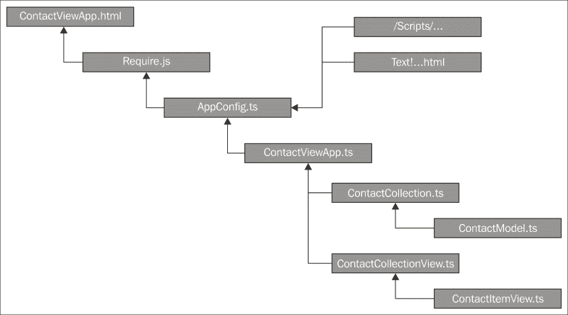
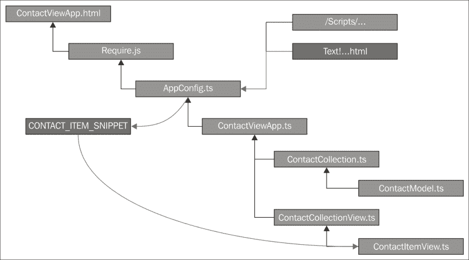
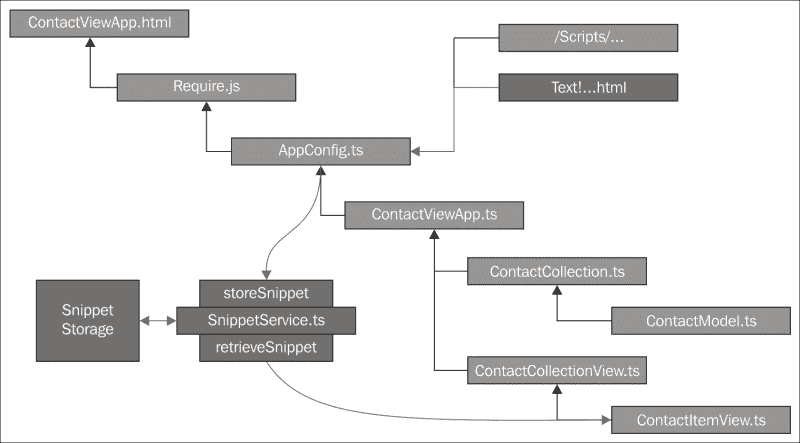
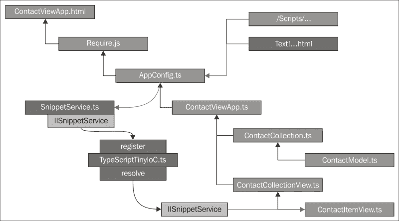
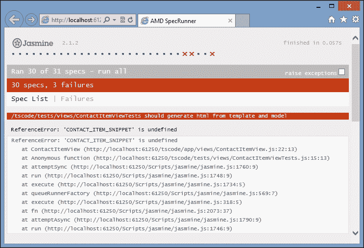
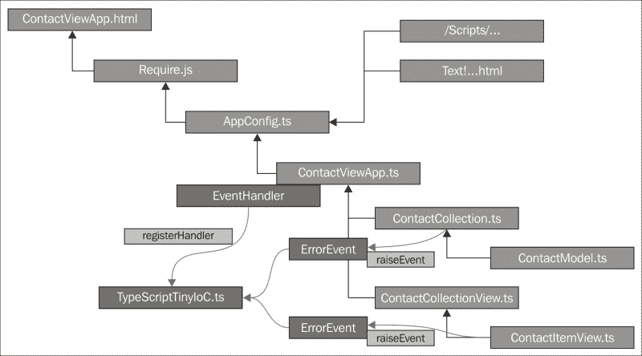
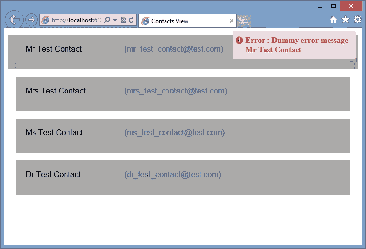

# 第八章：使用 TypeScript 进行面向对象编程

1995 年，**四人帮**（**GoF**）出版了一本名为*设计模式：可复用面向对象软件的元素*的书。在这本书中，作者 Erich Gamma、Richard Helm、Ralph Johnson 和 John Vlissides 描述了许多经典的软件设计模式。这些模式提供了常见软件问题的简单而优雅的解决方案。如果你从未听说过工厂模式、组合模式、观察者模式或单例模式等设计模式，那么强烈建议阅读这本 GoF 书籍。

GoF 提出的设计模式已经在许多不同的编程语言中复制，包括 Java 和 C#。Mark Torok 甚至将这些模式移植到了 TypeScript 中，他的 GitHub 存储库可以在[`github.com/torokmark/design_patterns_in_typescript`](https://github.com/torokmark/design_patterns_in_typescript)找到。我们已经在第三章*接口、类和泛型*中探讨了其中的一个模式，即工厂设计模式，Mark 的工作为 TypeScript 中的所有 GoF 模式提供了快速简单的参考实现。

Simon Timms 还出版了一本名为*精通 JavaScript 设计模式*的书，*Packt Publishing*（[`www.packtpub.com/application-development/mastering-javascript-design-patterns`](https://www.packtpub.com/application-development/mastering-javascript-design-patterns)），该书为读者逐一介绍了这些模式，何时使用它们以及如何使用它们。

在本章中，我们不会涵盖标准的 GoF 设计模式，而是看一看另外两种流行的设计模式以及它们如何在 TypeScript 中实现。我们将讨论使用服务定位器模式进行依赖注入，然后看看这些技术如何用于构建领域事件模式的实现。

# 按接口编程

四人帮坚持的主要观念之一是，程序员应该“按接口编程，而不是按实现编程”。这意味着程序是使用接口作为对象之间定义的交互来构建的。通过按接口编程，客户对象不知道其依赖对象的内部逻辑，并且更具有抵抗变化的能力。

TypeScript 语言带来了`interface`关键字，使我们能够以比标准 JavaScript 更简单的方式针对接口编写面向对象的代码。不过，请记住，接口只是 TypeScript 的概念，会在生成的 JavaScript 中被编译掉。

请注意，许多其他语言都有能够询问对象以查看它们实现了哪些接口的概念，这个过程称为**反射**。

# SOLID 原则

“按接口编程”原则的延伸是所谓的 SOLID 设计原则，基于 Robert Martin 的思想。这是五个不同编程原则的首字母缩写，无论何时讨论面向对象编程，都值得一提。单词 SOLID 中的每个字母都与一个面向对象原则相关，如下所示：

+   S：单一职责

+   O：开闭原则

+   L：里氏替换

+   I：接口隔离

+   D：依赖反转

## 单一职责

单一职责原则的理念是，一个对象应该只有一个职责，或者说只有一个存在的理由。换句话说，做一件事，并且做好。我们在上一章中已经看到了这个原则的例子，在我们使用 Backbone 时。Backbone 模型类用于表示单个模型。Backbone 集合类用于表示这些模型的集合，Backbone 视图类用于渲染模型或集合。

## 开闭原则

开闭原则的理念是，一个对象应该对扩展开放，但对修改关闭。换句话说，一旦为一个类设计了接口，随着时间的推移对这个接口的更改应该通过继承来实现，而不是直接修改接口。

请注意，如果您正在编写通过 API 由第三方使用的库，则此原则至关重要。对 API 的更改应仅通过新的、有版本的发布进行，并且不应破坏现有的 API 或接口。

## 里斯科夫替换

里斯科夫替换原则规定，如果一个对象是从另一个对象派生的，那么这些对象可以相互替换而不会破坏功能。虽然这个原则似乎很容易实现，但在处理与更复杂类型相关的子类型规则时，比如对象列表或对象上的操作时，情况可能会变得非常复杂——这些通常出现在使用泛型的代码中。在这些情况下，引入了变异的概念，对象可以是协变的、逆变的或不变的。我们不会在这里讨论变异的细节，但在编写库或使用泛型的代码时，请记住这个原则。

## 接口分离

接口分离原则的理念是，许多接口比一个通用接口更好。如果我们将这个原则与单一责任原则联系起来，我们将开始将我们的接口视为谜题的小部分，这些小部分将被组合在一起，以创建更广泛的应用程序功能。

## 依赖反转

依赖反转原则规定，我们应该依赖于抽象（或接口），而不是具体对象的实例。同样，这与“根据接口而不是实现编程”的原则相同。

# 构建服务定位器

服务定位器模式的理念是，应用程序的某些区域可以被分解为服务。每个服务都应遵循我们的 SOLID 设计原则，并提供一个作为服务 API 的小外部接口。应用程序使用的每个服务都会在服务定位器中注册。当应用程序需要特定的信息或功能时，它可以查询这个服务定位器，以找到基于服务接口的正确服务。

## 问题空间

在上一章中，我们探讨了 Backbone，我们的应用程序被分解为模型、集合和视图。除了这些元素之外，我们还有一个应用程序类来协调通过集合加载数据，并使用视图呈现此集合。一旦我们构建了应用程序类，谜题的最后一块就是组合`require.config`对象，以协调加载我们的 AMD 模块、应用程序中需要的任何 HTML 和我们的 jQuery 插件。

如果我们看一下应用程序加载哪些文件的视觉表示，我们会得到以下内容：



应用对象依赖树

我们从一个名为`ContactViewApp.html`的 HTML 页面开始，这是我们应用程序的主入口页面，将提供给 Web 浏览器。然后这个 HTML 页面加载 Require 库，Require 库又加载包含`require.config`部分的`AppConfig.ts`文件。然后`require.config`部分指示 Require 从`/Scripts/`目录加载各种脚本，以及通过 Text 插件加载一小段 HTML。一旦 Require 加载了所有文件，`AppConfig.ts`文件的最后一部分加载`ContactViewApp.ts`，然后加载我们的`ContactCollection.ts`和`ContactCollectionView.ts`文件。然后这两个文件指示 Require 分别加载名为`ContactModel.ts`和`ContactItemView.ts`的模块文件。

如果我们更仔细地看一下这个层次结构，很容易想象在一个大型应用程序中，我们会有大量的集合、模型、视图和项目视图。可能我们正在加载集合的集合，以及包含子视图的视图，其中包含进一步的子视图。每个这些视图都需要通过文本插件加载一些 HTML，以使用我们的模板机制。

让我们更仔细地看一下在我们之前的例子中如何加载和使用 HTML 片段：



使用全局变量的依赖树

在这个图中，我们可以看到我们通过文本插件在`AppConfig.ts`文件中加载了一个 HTML 片段，然后将其存储到名为`CONTACT_ITEM_SNIPPET`的全局变量中。唯一使用这个全局变量的代码是`ContactItemView`类本身。

使用全局变量违反了我们的依赖反转原则，因为我们在编程时针对一个全局变量的具体实例，而不是一个接口。这个全局变量也可能被任何正在运行的代码无意中改变，这可能导致我们的视图停止工作。当运行我们的测试套件时，我们遇到的另一个问题是，更改原始的 HTML 模板会破坏一些单元测试。虽然我们能够稍微修改测试以通过，但这个破损的测试突显出我们在某个地方违反了开闭原则。

## 创建一个服务

我们将分两部分解决使用全局变量存储 HTML 片段的问题。

首先，让我们定义一个服务来替换我们的全局变量 - `SnippetService`。这个服务将有一个非常简单的接口，只负责两件事：存储 HTML 片段和检索 HTML 片段。

其次，我们需要一种机制来获取这个`SnippetService`，在我们存储片段的代码点（在`AppConfig.ts`中）和使用片段的代码点（在`ContactItemView.ts`中）。我们稍后将在这两个接触点使用服务定位器，但现在，让我们为我们的片段服务设计一个设计。

引入`SnippetService`会改变我们的依赖图如下：



使用服务存储 HTML 片段的依赖树

我们可以看到，我们现在已经抽象出了对全局变量的使用。我们仍然有一个全局区域来存储这些 HTML 片段，即片段存储区，但我们现在是针对一个接口编程 - `SnippetService`提供的接口，而不是针对一个具体的实现。我们的应用程序现在受到了对这些 HTML 片段的内部存储的任何更改的保护。例如，我们可能决定从使用 HTML 文件改为在数据库中存储 HTML 片段。在这种情况下，只需要修改`SnippetService`的内部，我们的代码就可以继续运行而无需更改。

显然，我们需要一种键来允许我们存储多个片段，但`SnippetService`是否应该负责定义这个键呢？考虑单一职责原则。`SnippetService`是否真的负责管理与片段相关的键？换句话说，它需要添加或删除这些键吗？并不是真的。一个更小的枚举类在这里会非常有用，并且更倾向于许多较小的接口而不是一个通用接口 - 考虑接口隔离。

考虑到这些事情，我们可以定义`SnippetService`的接口如下：

```ts
enum SnippetKey {
    CONTACT_ITEM_SNIPPET,
    OTHER_SNIPPET,
}

interface ISnippetService {
    storeSnippet(key: SnippetKey, value: string): void;
    retrieveSnippet(key: SnippetKey): string;
}
```

首先，我们定义了一个名为`SnippetKey`的`enum`，用于存储`SnippetService`要使用的所有键。其次，我们定义了实际`SnippetService`的接口，名为`ISnippetService`，它有两个函数。第一个函数将是一个存储片段的方法，名为`storeSnippet`。这个函数有两个参数，第一个是`SnippetKey`枚举值，第二个参数当然是 HTML 片段本身。类似地，第二个函数，名为`retrieveSnippet`，使用一个`SnippetKey`参数来检索 HTML 片段。

现在我们已经定义了一个接口，我们可以创建`SnippetService`类的结构：

```ts
class SnippetService implements ISnippetService {
    public storeSnippet(key: SnippetKey, value: string) {
    }
    public retrieveSnippet(key: SnippetKey) {
        return "";
    }
}
```

在这里，我们有一个名为`SnippetService`的类，它实现了我们的`ISnippetService`接口。我们已经创建了接口中定义的两个方法，但尚未提供实现。我们将利用这个机会遵循 TDD 原则，在编写使测试通过的代码之前编写一个失败的单元测试。我们的单元测试如下：

```ts
describe("/tscode/tests/services/SnippetServiceTests.ts", () => {
    it("should store a snippet", () => {
        var snippetService = new SnippetService();
        snippetService.storeSnippet(
            SnippetKey.CONTACT_ITEM_SNIPPET, "contact_snippet");
        expect(
            snippetService.retrieveSnippet(
                SnippetKey.CONTACT_ITEM_SNIPPET)
        ).toBe("contact_snippet");
    });
});
```

在这个测试中，我们只是创建了一个`SnippetService`的实例，使用`SnippetKey.CONTACT_ITEM_SNIPPET`作为键存储了一个片段，然后使用相同的键调用`retrieveSnippet`，验证返回的字符串值。请记住，这是一个模拟测试，在真实应用中，`storeSnippet`调用将在应用初始化期间发生，而`retrieveSnippet`调用将在稍后的阶段发生。

现在让我们完善`SnippetService`，使测试通过：

```ts
class SnippetService implements ISnippetService {
    private snippetArray: string[] = new Array();
    public storeSnippet(key: SnippetKey, value: string) {
        this.snippetArray[key] = value;
    }
    public retrieveSnippet(key: SnippetKey) {
        if (!this.snippetArray[key]) {
            throw new Error(
                "SnippetService no snippet with key :" + key);
        }
        return this.snippetArray[key];
    }
}
```

我们的`SnippetService`类现在有一个名为`snippetArray`的内部字符串数组，标记为`private`，它将保存我们的 HTML 片段值。我们的`storeSnippet`和`retrieveSnippet`函数现在只是简单地从这个数组中存储或检索值。有了这段代码，我们的测试现在将通过，我们简单的`SnippetService`完成了。

# 依赖解析

到目前为止，我们已经重构了我们的代码，使其依赖于接口而不是具体对象。这一切都很好，但引出了一个问题：“我们如何获得一个接口？”- 或者更正确地说 - “我们如何获得当前实现这个接口的具体类？”这是依赖注入器试图回答的基本问题。

类可以获得实现接口的另一个类的方式有很多种。

## 服务定位

如果类本身根据接口请求一个具体对象，那么这个过程称为“**服务定位**”。换句话说，类使用注册表或助手来定位它需要的服务。您还可以将这种技术描述为“依赖请求”。一个中央注册表保存了所有已注册类与它们各自接口的查找表。当接口被请求时，服务定位器简单地查找其表中存储的接口对应的类实例，并从其注册表返回对象。

## 依赖注入

如果创建类的实例的行为可以交给某种框架处理，那么这个框架可以找出类需要什么接口，并在类实例化期间“注入”这些依赖关系。这种依赖注入也称为**装配**。在这种情况下，装配器类或框架需要能够查询对象以找出它依赖的接口。不幸的是，在 JavaScript 或 TypeScript 中我们没有这种能力，因为所有接口都被编译掉了。因此，我们不能单独使用 TypeScript 接口来实现依赖注入。如果我们要在 TypeScript 或 JavaScript 中实现依赖注入，我们需要一种命名约定来告诉装配器框架我们需要一个具体对象来替换接口。

依赖注入也被称为控制反转，因为我们把类的创建和依赖项的解析控制权交给了第三方。当我们收到类的实例时，所有的服务或依赖项都已经被“神奇”地填充进去了。

## 服务定位与依赖注入

服务定位模式的想法最早是由马丁·福勒在 2004 年左右提出的，在一篇名为《控制反转容器和依赖注入模式》的博客中（[`martinfowler.com/articles/injection.html`](http://martinfowler.com/articles/injection.html)）。然而，在他的书《.NET 中的依赖注入》中，马克·西曼认为服务定位模式实际上是一种反模式。

马克对马丁最初的想法是，使用服务定位很容易引入运行时错误，或者误解特定类的使用。这是因为找出一个类使用了哪些服务意味着要阅读整个类。他认为更好的使用依赖注入的方法是，在类的构造函数中列出所有的依赖项，并让服务定位器在类构造过程中解析每个依赖项。马克的大部分例子似乎都围绕着构建和使用 API，其中特定类的内部不能简单地从代码中读取，并且在不知道一个类依赖于哪些服务的情况下使用一个类很容易引起运行时错误。

尽管他的想法确实是正确的，但是解决这个问题的方法都与.NET 语言相关，而这在 JavaScript 中是不可用的，这就是反射。反射是程序在运行时询问对象自身信息的能力，比如它有哪些属性，它实现或期望实现哪些接口。尽管 TypeScript 提供了接口关键字，并对这些接口进行了编译时检查，但所有接口都在生成的 JavaScript 中被编译掉了。

这给我们带来了一个严重的问题。如果一个类依赖于一个接口，我们不能在运行时使用这个接口来查找接口的具体实现，因为在运行时，这个接口根本不存在。

Angular 使用命名约定（以`$`前缀）来提供依赖注入功能。这已经相当成功，尽管在使用缩小程序时会有一些注意事项和一些解决方法。Angular 2.0 也通过提供自定义语法来解决这个问题，以表示需要注入依赖项的位置。其他 JavaScript 框架，如 ExtJs，提供了使用全局创建例程来创建对象的机制，然后允许框架注入依赖项。不幸的是，这种 ExtJs 技术与 TypeScript 语法不太兼容（参见第五章，“第三方库”中我们讨论了 ExtJs）。

此外，如果我们不使用 Angular、Angular 2.0、ExtJs 或任何其他框架，那么在标准 JavaScript 中依赖注入就略微超出了我们的能力。另一方面，服务定位是可以实现的，并且结合 TypeScript 接口，可以为我们带来依赖项解析的所有好处，因此也可以实现模块化编程。

我们也可以做出妥协，以纳入马克建议的想法，并将我们的服务定位限制在对象构造函数中。在编写使用服务定位的库时，我们需要清楚地记录特定类有哪些依赖项，以及它们需要如何注册。即使像 StructureMap 这样的流行.NET 依赖注入框架仍然允许使用服务定位技术，尽管它们正在被弃用。

因此，为了本书的目的，让我们探讨如何编写一个简单的服务定位器，并在我们的代码中使用它来构建一个更模块化的应用程序，并将模式与反模式的论点留给那些具有自然实现依赖注入功能的语言。

# 一个服务定位器

让我们回到我们问题的核心：给定一个接口，我们如何获得当前实现它的类的具体实现？

在第三章, *接口，类和泛型*，我们编写了一个名为`InterfaceChecker`的通用类，它对类进行了运行时评估，以检查它是否实现了一组特定的方法和属性。这个`InterfaceChecker`背后的基本思想是，如果我们提供了一个列出了接口的预期属性和方法的元数据类，我们就可以在运行时根据这些元数据来查询一个类。如果类具有所有必需的属性和方法，那么就说它实现了这个接口。

因此，我们现在有了一个机制——在运行时——来确保一个类实现了一个接口：注意，不是 TypeScript 接口，而是元数据定义的接口。如果我们扩展这个想法，并为我们的每个元数据接口提供一个唯一的名称，我们就有了“命名接口”的概念。只要这些接口名称在我们的应用程序中是唯一的，我们现在就有了一个在运行时查询一个类是否实现了命名接口的机制。

如果一个类实现了一个命名接口，我们可以使用注册表来存储该类的实例与其命名接口。任何需要实现这个命名接口的类实例的其他代码，只需查询注册表，提供接口名称，注册表就能返回类实例。

只要我们确保我们的 TypeScript 接口与命名接口定义匹配，我们就可以开始了。

## 命名接口

回到第三章, *接口，类和泛型*，我们编写了一个名为`IInterfaceChecker`的接口，我们可以将其用作元数据的标准模板。让我们更新这个接口，并给它一个必需的`className`属性，这样我们就可以将其用作命名接口：

```ts
interface IInterfaceChecker {
    methodNames?: string[];
    propertyNames?: string[];
    className: string;
}
```

我们仍然有可选的`methodNames`和`propertyNames`数组，但现在每个实现这个接口的类也将需要一个`className`属性。

因此，考虑到以下 TypeScript 接口：

```ts
interface IHasIdProperty {
    id: number;
}
```

我们的命名接口元数据类匹配这个 TypeScript 接口将如下所示：

```ts
class IIHasIdProperty implements IInterfaceChecker {
    propertyNames: string[] = ["id"];
    className: string = "IIHasIdProperty";
}
```

这个`IHasIdProperty`接口有一个名为`id`的属性，类型为`number`。然后我们创建一个名为`IIHasIdProperty`的类，作为一个命名接口定义。这个类实现了我们更新的`IInterfaceChecker`接口，因此必须提供一个`className`属性。`propertyNames`属性有一个名为`id`的单个数组条目，并将被我们的`InterfaceChecker`类用来与我们的 TypeScript 接口的`id`属性进行匹配。

注意这个类的命名约定——它与接口的名称相同，但添加了额外的`I`。这个双`I`约定将帮助我们将 TypeScript 接口命名为`IHasIdProperty`与其`IIHasIdProperty`元数据命名接口类联系起来。

现在，我们可以创建一个正常的 TypeScript 类，实现`IHasIdProperty`TypeScript 接口，如下所示：

```ts
class PropertyOne implements IHasIdProperty  {
    id = 1;
}
```

我们现在已经有了所有的要素来开始构建一个服务定位器：

+   一个名为`IHasIdProperty`的 TypeScript 接口。这将提供对实现这个接口的类的编译时类型检查。

+   一个名为`IIHasIdProperty`的命名接口或元数据类。这将提供对类的运行时类型检查，并且还有一个唯一的名称。

+   一个实现了 TypeScript 接口`IHasIdProperty`的类。这个类将通过运行时类型检查，并且这个类的实例可以被注册到我们的服务定位器中。

## 注册类与命名接口对应

有了这些元数据类，我们现在可以创建一个中央存储库，作为服务定位器。这个类有用于注册类以及解析接口的静态函数：

```ts
class TypeScriptTinyIoC {
    static registeredClasses: any[] = new Array();
    public static register(
        targetObject: any,
        targetInterface: { new (): IInterfaceChecker; }): void {
    }

    public static resolve(
        targetInterface: { new (): IInterfaceChecker; }): any {
    }
    public static clearAll() {}
}
```

这个名为`TypeScriptTinyIoC`的类有一个名为`registeredClasses`的静态属性，它是一个`any`类型的数组。这个数组本质上是我们的注册表。由于我们不知道要在这个数组中存储什么类型的类，所以在这种情况下使用`any`类型是正确的。

这个类提供了两个主要的静态函数，名为`register`和`resolve`。`register`函数以`targetObject`作为第一个参数，然后是一个命名接口的类定义，即从`IInterfaceChecker`派生的类。注意`targetInterface`参数的语法，它与我们在第三章中使用的泛型语法相同，用于表示类定义。

如果我们看一下它们的使用示例，就更容易理解这些函数签名，所以让我们写一个快速测试：

```ts
it("should resolve instance of IIProperty to PropertyOne", () => {
    var propertyInstance = new PropertyOne();
    TypeScriptTinyIoC.register(propertyInstance, IIHasIdProperty);

    var iProperty: IHasIdProperty = 
        TypeScriptTinyIoC.resolve(IIHasIdProperty);
    expect(iProperty.id).toBe(1);
});
```

这个测试首先创建了一个`PropertyOne`类的实例，该类实现了`IHasIdProperty`接口。这个类是我们想要注册的类。然后测试调用`TypeScriptTinyIoC`的`register`函数，有两个参数。第一个参数是类实例本身，第二个参数是与命名接口`IIHasIdProperty`相关的类定义。我们之前已经见过这种语法，当我们讨论使用泛型创建类的实例时，但它的签名也适用于非泛型函数。

如果不使用`targetInterface: { new (): IInterfaceChecker; }`的签名，我们将不得不如下调用这个函数：

```ts
TypeScriptTinyIoC.register(propertyOneInstance,
    new IIHasIdProperty());
```

但是有了这个签名，我们可以将`IIHasIdProperty`命名接口类的创建推迟到`register`函数中，并且可以删除如下的新语法：

```ts
TypeScriptTinyIoC.register(propertyOneInstance, IIHasIdProperty);
```

然后我们的测试调用`TypeScriptTinyIoC`的`resolve`函数，并再次传入我们命名接口的类定义作为查找键。最后，我们检查返回的类是否实际上是我们最初注册的`PropertyOne`类的实例。

在这个阶段，我们的测试将会失败，所以让我们完善`TypeScriptTinyIoC`类，从`register`函数开始：

```ts
public static register(
    targetObject: any,
    targetInterface: { new (): IInterfaceChecker; })
{
    var interfaceChecker = new InterfaceChecker();
    var targetClassName = new targetInterface();
    if (interfaceChecker.implementsInterface(
        targetObject, targetInterface)) {
        this.registeredClasses[targetObject.className]
            = targetObject;
    } else {
        throw new Error(
            "TypeScriptTinyIoC cannot register instance of "
            + targetClassName.className);
    }
}
```

这个`register`函数首先创建了一个`InterfaceChecker`类的实例，然后通过`targetInterface`参数创建了传入的类定义的实例。这个`targetInterface`是命名接口或元数据类。然后我们调用`interfaceChecker`的`implementsInterface`函数来确保`targetObject`实现了`targetInterface`描述的接口。如果通过了这个检查，我们就使用`className`属性作为键将其添加到我们的内部数组`registeredClasses`中。

再次使用我们的`InterfaceChecker`给我们提供了运行时类型检查，这样我们就可以确保我们注册的任何类实际上都实现了正确的命名接口。

现在我们可以如下完善`resolve`函数：

```ts
public static resolve(
    targetInterface: { new (): IInterfaceChecker; })
{
    var targetClassName = new targetInterface();
    if (this.registeredClasses[targetClassName.className]) {
        return this.registeredClasses[targetClassName.className];
    } else {
        throw new Error(
            "TypeScriptTinyIoC cannot find instance of "
            + targetClassName.className);
    }
}
```

这个`resolve`函数只有一个参数，即我们命名接口的定义。同样，我们使用了之前见过的可实例化的语法。这个函数简单地创建了`targetInterface`类的一个实例，然后使用`className`属性作为`registeredClasses`数组的键。如果找到了条目，我们就简单地返回它；否则，我们抛出一个错误。

我们`TypeScriptTinyIoC`类上的最后一个函数是`clearAll`函数，它主要用于测试，用于清除我们的注册类数组：

```ts
public static clearAll() {
    this.registeredClasses = new Array();
}
```

我们的服务定位器现在已经完成。

## 使用服务定位器

现在让我们更新我们的依赖树，看看`TypeScriptTinyIoC`服务定位器将如何被使用：



带有服务定位器模式的依赖图

我们的`AppConfig.ts`代码现在将创建一个`SnippetService`的实例，并使用命名接口`IISnippetService`将其注册到`TypeScriptTinyIoC`中。然后我们将更新`ContactItemView`的构造函数，以从注册表中解析`IISnippetService`的实例。这样，我们现在是编程到一个接口——`IISnippetService`接口。我们在注册服务到服务定位器时使用这个命名接口，以及在以后解析服务时再次使用。然后，我们的`ContactItemView`要求服务定位器给我们实现`IISnippetService`接口的当前对象。

为了实现这个改变，我们首先需要一个命名接口来匹配`ISnippetService` TypeScript 接口。作为一个复习，我们的`ISnippetService`定义如下：

```ts
interface ISnippetService {
    storeSnippet(key: SnippetKey, value: string): void;
    retrieveSnippet(key: SnippetKey): string;
}
```

根据我们的命名规则，我们的命名接口定义将被称为`IISnippetService`，如下所示：

```ts
class IISnippetService implements IInterfaceChecker {
    methodNames: string[] = ["storeSnippet", "retrieveSnippet"];
    className: string = "IISnippetService";
}
```

请注意，`methodNames`数组包含两个与我们的 TypeScript 接口匹配的条目。按照惯例，我们还指定了一个`className`属性，这样我们就可以将这个类用作命名接口。使用类的名称（`IISnippetService`）作为`className`属性也将确保一个唯一的名称，因为 TypeScript 不允许使用相同名称定义多个类。

现在让我们专注于我们的测试套件。记住我们的`TestConfig.ts`文件几乎与我们的`AppConfig.ts`文件相同，但是它启动了 Jasmine 测试套件而不是运行我们的应用程序。我们将修改这个`TestConfig.ts`文件，包括我们的`SnippetService`和`TypeScriptTinyIoC`，如下所示。

```ts
require.config(
    {
        // existing code 
        paths: {
            // existing code
            'tinyioc': '/tscode/app/TypeScriptTinyIoC',
            'snippetservice': '/tscode/app/services/SnippetService'
        },
        shim: {
          // existing code
        }
    }
);

require(
    ['jasmine-boot', 'tinyioc', 'snippetservice',
    'text!/tscode/app/views/ContactItemView.html'],
     (jb, tinyioc, snippetservice, contactItemSnippet) => {
        var snippetService = new SnippetService();
        snippetService.storeSnippet( SnippetKey.CONTACT_ITEM_SNIPPET, contactItemSnippet);
        TypeScriptTinyIoC.register(snippetService, IISnippetService);
        require(specs, () => {
             (<any>window).onload();
        });
    }
);
```

首先，我们在路径属性中包含了对`tinyioc`和`snippetservice`的条目，以确保 Require 会从指定目录加载我们的文件。然后我们更新对 require 函数的调用，将`tinyioc`和`snippetservice`都包含在两个参数中。我们的匿名函数然后创建了`SnippetService`的一个新实例，并使用`CONTACT_ITEM_SNIPPET`键存储由 Text 加载的片段。然后我们使用命名接口`IISnippetService`将这个`SnippetService`的实例注册到`TypeScriptTinyIoC`中。如果我们现在运行测试套件，应该会有一些失败的测试：



单元测试失败

这个失败是因为`ContactItemView`仍然引用`CONTACT_ITEM_SNIPPET`全局变量。现在让我们修改这个视图的构造函数如下：

```ts
constructor(options?: any) {
    var snippetService: ISnippetService =
        TypeScriptTinyIoC.resolve(IISnippetService);
    var contactItemSnippet = snippetService.retrieveSnippet(
        SnippetKey.CONTACT_ITEM_SNIPPET);

    this.className = "contact-item-view";
    this.events = <any>{ 'click': this.onClicked };
    this.template = _.template(contactItemSnippet);

    super(options);
}
```

构造函数的第一行调用`TypeScriptTinyIoC.resolve`函数，使用命名接口`IISnippetService`的定义。这个调用的结果存储在`snippetService`变量中，它的类型与`ISnippetService`接口强类型绑定。这就是服务定位器模式的本质：我们编程到一个接口（`ISnippetService`），并且通过我们的服务定位器定位这个接口。一旦我们有了提供接口的类的实例，我们就可以简单地使用所需的键调用`retrieveSnippet`来加载我们的模板。

现在我们已经更新并修复了我们的测试，我们只需要以与我们修改`TestConfig.ts`文件相同的方式修改我们的`AppConfig.ts`文件。

## 可测试性

现在我们正在根据一个定义好的接口进行编程，我们可以开始以不同的方式测试我们的代码。在一个测试中，我们现在可以用另一个在调用`retrieveSnippet`时抛出错误的服务替换实际的`SnippetService`。对于这个测试，让我们创建一个名为`SnippetServiceRetrieveThrows`的类，如下所示：

```ts
class SnippetServiceRetrieveThrows implements ISnippetService {
    storeSnippet(key: SnippetKey, value: string) {}

    retrieveSnippet(key: SnippetKey) {
        throw new Error("Error in retrieveSnippet");
    }
}
```

这个类可以注册到`IISnippetService`命名接口，因为它正确实现了 TypeScript 接口`ISnippetService`。然而，`retrieveSnippet`函数只是抛出一个错误。

然后，我们的测试可以轻松注册此服务的版本，然后创建一个`ContactItemView`类的实例，以查看如果调用`retrieveSnippet`函数失败会发生什么。请注意，我们并没有以任何方式修改我们的`ContactItemView`类 - 我们只是针对`IISnippetService`命名接口注册了一个不同的类。在这种情况下，我们的测试将如下：

```ts
beforeAll(() => {
    var errorService = new SnippetServiceRetrieveThrows();
    TypeScriptTinyIoC.register(errorService, IISnippetService);
});

it("should handle an error on constructor", () => {
    var contactModel = new cm.ContactModel(
      { Name: 'testName', EmailAddress: 'testEmailAddress' });

    var contactItemView = new ccv.ContactItemView(
      { model: contactModel });
    var html = contactItemView.render().$el.html();
    expect(html).toContain('error');

});
```

在这个测试中，我们在`beforeAll`函数中注册了我们抛出版本的`SnippetService`，然后测试了`ContactItemView`的渲染能力。运行此测试将在`ContactItemView`调用`retrieveSnippet`时引发错误。为了使此测试通过，我们需要更新`ContactItemView`以优雅地处理错误：

```ts
var contactItemSnippet = "";
var snippetService: ISnippetService =
    TypeScriptTinyIoC.resolve(IISnippetService);
try {
    contactItemSnippet = snippetService.retrieveSnippet(
        SnippetKey.CONTACT_ITEM_SNIPPET);
} catch (err) {
    contactItemSnippet = 
     "There was an error loading CONTACT_ITEM_SNIPPET";
}
```

在这里，我们只是用`try` `catch`块包围了对`retrieveSnippet`的调用。如果发生错误，我们将修改片段为标准错误消息。通过放置这样的测试，我们进一步巩固了我们的代码，以便处理各种错误。

到目前为止，我们取得了什么成就呢？我们已经建立了一个服务来提供 HTML 片段，并且我们已经建立了一个服务定位器，可以注册此服务的实例，以便在整个代码中使用。通过在测试期间注册不同版本的此服务，我们还可以通过模拟常见错误来进一步防止错误，并在这些情况下测试我们的组件。

# 域事件模式

大多数 JavaScript 框架都有事件总线的概念。事件总线只是一种将事件发布到全局总线的方法，以便订阅这些事件的应用程序的其他部分将接收到消息，并能够对其做出反应。使用基于事件的架构有助于解耦我们的应用程序，使其更具有适应变化的能力，并更易于测试。

域事件是特定于我们应用程序域的事件。例如“当发生错误时，将其记录到控制台”，或者“当单击菜单按钮时，更改子菜单面板以反映此选项”。域事件可以在代码的任何位置引发。任何类都可以针对此事件注册事件处理程序，然后在引发此事件时将收到通知。对于单个域事件可以有多个事件处理程序。

Martin Fowler 在 2005 年的一篇博客中首次提出了域事件的概念，该博客位于[`martinfowler.com/eaaDev/DomainEvent.html`](http://martinfowler.com/eaaDev/DomainEvent.html)。然后，Udi Dahan 在另一篇博客中展示了如何在 C#中实现简单的域事件模式，该博客位于[`www.udidahan.com/2009/06/14/domain-events-salvation/`](http://www.udidahan.com/2009/06/14/domain-events-salvation/)。Mike Hadlow 还在博客中讨论了域事件的关注点分离，该博客位于[`mikehadlow.blogspot.com.au/2010/09/separation-of-concerns-with-domain.html`](http://mikehadlow.blogspot.com.au/2010/09/separation-of-concerns-with-domain.html)。

Mike 认为，引发事件的代码片段不应该关心之后会发生什么 - 我们应该有单独的处理程序来处理这些事件 - 这些处理程序与实际引发事件的任何内容都没有耦合。

虽然有许多处理事件的 JavaScript 库 - 例如 Postal - 但这些库中的大多数都将字符串或简单的 JavaScript 对象作为消息包发送。无法确保发送消息的对象填写了消息处理程序所期望的所有属性。换句话说，这些消息不是强类型的 - 可能会很容易地导致运行时错误 - 试图将“方形销子”消息适配到“圆形孔”事件处理程序中。

在本节中，我们将构建一个强类型的领域事件消息总线，并展示事件引发方和事件处理方如何确保引发的事件具有事件处理方期望的所有属性。我们还将展示如何确保事件处理程序被正确编写和正确注册，以便以强类型的方式传递事件。

## 问题空间

假设我们有以下业务需求：“如果发生错误，请向用户显示一个通知弹出窗口中的错误消息。这个弹出窗口应该显示两秒钟，然后消失，让用户继续工作。”

在我们当前的应用程序中，有许多可能发生错误的地方——例如通过`ContactCollection`加载 JSON 时，或者渲染`ContactItemView`时。这些错误可能会发生在我们的类层次结构中的深层。为了实现我们的需求，我们需要在`ContactViewApp`级别处理这些错误。请考虑以下图表：



带有领域事件处理程序和事件引发方的依赖树。

我们的`ContactViewApp`将使用`TypeScriptTinyIoC`注册一个事件处理程序，指定它感兴趣的事件类型。当我们的模块中的任何一个引发了这种类型的事件时，我们的消息总线将把消息传递给正确的处理程序或一组处理程序。在前面的图表中，`ContactCollection`和`ContactItemView`类被显示为通过`TypeScriptTinyIoC`引发`ErrorEvent`。

## 消息和处理程序接口

我们需要两组关键信息来注册和引发强类型消息。第一组是描述消息本身的接口，与其命名接口配对。第二组是描述消息处理程序函数的接口，同样与其命名接口配对。我们的 TypeScript 接口为我们提供了消息和处理程序的编译时检查，而我们的命名接口（实现`IInterfaceChecker`）为我们提供了消息和处理程序的运行时类型检查。

首先，我们的消息接口如下：

```ts
interface IErrorEvent {
    Message: string;
    Description: string;
}

export class IIErrorEvent implements IInterfaceChecker {
    propertyNames: string [] = ["Message", "Description"];
    className: string = "IIErrorEvent";
}
```

我们从 TypeScript 接口`IErrorEvent`开始。这个接口有两个属性，`Message`和`Description`，都是字符串。然后我们创建我们的`IIErrorEvent`类，它是我们命名接口的一个实例——再次使用`propertyNames`数组匹配我们的 TypeScript 接口属性名。`className`属性也设置为类的名称`IIErrorEvent`，以确保唯一性。

然后我们的事件处理程序接口如下：

```ts
interface IErrorEvent_Handler {
    handle_ErrorEvent(event: IErrorEvent);
}

export class IIErrorEvent_Handler implements IInterfaceChecker {
    methodNames: string[] = ["handle_ErrorEvent"];
    className: string = "IIErrorEvent_Handler";
}
```

TypeScript 接口`IErrorEvent_Handler`包含一个名为`handle_ErrorEvent`的方法。这个处理程序方法有一个名为`event`的参数，再次强类型化为我们的事件接口`IErrorEvent`。然后我们构建一个名为`IIErrorEvent_Handler`的命名接口，并通过`methodNames`数组匹配 TypeScript 接口。同样，我们为这个命名接口提供一个独特的`className`属性。

有了这两个接口和命名接口，我们现在可以创建实际的`ErrorEvent`类如下：

```ts
export class ErrorEvent implements IErrorEvent {
    Message: string;
    Description: string;
    constructor(message: string, description: string) {
        this.Message = message;
        this.Description = description;
    }
}
```

`ErrorEvent`的类定义实现了`IErrorEvent`接口，从而使其与我们的事件处理程序兼容。请注意这个类的`constructor`。我们强制这个类的用户在构造函数中提供`message`和`description`参数——从而使用 TypeScript 编译时检查来确保我们无论在何处都正确构造这个类。

然后我们可以创建一个实现`IErrorEvent_Handler`接口的类，该类将接收事件本身。举个快速的例子，考虑以下类：

```ts
class EventHandlerTests_ErrorHandler
    implements IErrorEvent_Handler {
    handle_ErrorEvent(event: IErrorEvent) {
    }
}
```

这个类实现了`IErrorEvent_Handler` TypeScript 接口，因此编译器将强制这个类定义一个具有正确签名的`handle_ErrorEvent`函数，以接收消息。

## 多事件处理程序

为了能够注册多个事件，并且每个事件可以有多个事件处理程序，我们将需要一个事件数组，每个事件将依次保存一个处理程序数组，如下所示：


用于注册每个事件的多个事件处理程序的类结构。

我们的`TypeScriptTinyIoC`类将有一个名为`events`的数组，它使用事件的名称作为键。这个名称将来自我们的事件的命名接口 - 再次因为 TypeScript 接口被编译掉了。为了帮助管理每个事件的多个事件处理程序，我们将创建一个名为`EventHandlerList`的新类，它将便于注册多个事件处理程序。这个`EventHandlerList`类的实例将被存储在我们已注册的每个命名事件的`events`数组中。

让我们从事件处理程序列表开始，并实现我们的`EventHandlerList`类。在这个阶段，我们只需要一个内部数组来存储处理程序，名为`eventHandlers`，以及一个`registerHandler`函数，如下所示：

```ts
class EventHandlerList {
    eventHandlers: any[] = new Array();
    registerHandler(handler: any,
        interfaceType: { new (): IInterfaceChecker }) {
    }
}
```

`registerHandler`函数再次使用`{ new(): IInterfaceChecker }`语法来为`interfaceType`参数，从而允许我们为这个函数调用使用类型名称。一个快速的单元测试如下：

```ts
import iee = require("../app/events/ErrorEvent");

class EventHandlerTests_ErrorHandler
    implements iee.IErrorEvent_Handler {
    handle_ErrorEvent(event: iee.IErrorEvent) {
    }
}

describe("/tests//EventHandlerTests.ts", () => {

    var testHandler: EventHandlerTests_ErrorHandler;
    beforeEach(() => {
        testHandler = new EventHandlerTests_ErrorHandler();
    });

    it("should register an event Handler", () => {
        var eventHandlerList = new EventHandlerList();
        eventHandlerList.registerHandler(testHandler,
            iee.IIErrorEvent_Handler);

        expect(eventHandlerList.eventHandlers.length).toBe(1);
    });
});
```

我们从导入我们的事件类的`import`语句开始，然后是一个名为`EventHandlerTests_ErrorHandler`的类。这个类将被用作一个仅用于这个测试套件的注册事件处理程序。该类实现了`iee.IErrorEvent_Handler`，因此，如果我们没有一个接受`IErrorEvent`作为唯一参数的`handle_ErrorEvent`函数，它将生成一个编译错误。仅仅通过使用 TypeScript 接口，我们已经确保这个类具有正确的函数名称和函数签名来接受`ErrorEvent`消息。

我们的测试首先声明一个名为`testHandler`的变量来存储我们的`EventHandlerTests_ErrorHandler`类的一个实例。`beforeEach`函数将创建这个实例，并将其赋给我们的`testHandler`变量。测试本身然后创建一个`EventHandlerList`类的实例，调用`registerHandler`，然后期望内部`eventHandlers`属性的`length`值为 1。

再次注意`registerHandler`的调用语法。我们将我们的`testHandler`实例作为第一个参数传入，然后指定命名接口`IIErrorEvent_Handler`类类型。正如我们在服务定位器模式中看到的，我们再次使用相同的类名语法来表示我们的命名接口，而不是调用`new()`。

现在让我们填写代码使测试通过：

```ts
class EventHandlerList {
    eventHandlers: any[] = new Array();
    registerHandler(handler: any,
        interfaceType: { new (): IInterfaceChecker }) {

        var interfaceChecker = new InterfaceChecker();
        if (interfaceChecker.implementsInterface(
            handler, interfaceType)) {
            this.eventHandlers.push(handler);
        } else {
            var interfaceExpected = new interfaceType();
            throw new Error(
                "EventHandlerList cannot register handler of "
                + interfaceExpected.className);
        }
    }
}
```

我们的`registerHandler`函数首先创建一个`InterfaceChecker`类的实例，然后调用`implementsInterface`来确保在运行时，传入的处理程序对象确实具有我们命名接口定义的所有方法名称。如果`implementsInterface`函数返回`true`，我们可以简单地将这个处理程序推入我们的内部数组。

如果处理程序没有实现命名接口，我们会抛出一个错误。为了完整起见，这个错误包含了命名接口的`className`属性，因此我们首先要实例化这个命名接口类的一个实例，然后才能提取`className`属性。

现在让我们创建一个测试，故意使我们的`implementsInterface`检查失败，并确保实际上抛出了一个错误：

```ts
class No_ErrorHandler {
}

it("should throw an error with the correct className", () => {
    var eventHandlerList = new EventHandlerList();
    expect(() => {
        eventHandlerList.registerHandler(new No_ErrorHandler(),
            iee.IIErrorEvent_Handler);
    }).toThrow(new Error(
        "EventHandlerList cannot register handler of IIErrorEvent_Handler"
        ));
});
```

我们从`No_ErrorHandler`类的类定义开始，显然它没有实现我们的命名接口。然后我们设置`EventHandlerList`类，并调用`registerHandler`函数，使用`No_ErrorHandler`类的新实例和我们的`IIErrorEvent_Handler`命名接口。然后我们期望一个特定的错误消息 - 这个消息应该包括我们命名接口`IIErrorEvent_Handler`的名称。

## 触发事件

现在我们可以把注意力转向触发事件。为了做到这一点，我们需要知道事件处理程序的实际函数名称。我们将对`EventHandlerList`进行轻微更改，并将事件名称传递给构造函数，如下所示：

```ts
class EventHandlerList {
    handleEventMethod: string;
    constructor(handleEventMethodName: string) {
        this.handleEventMethod = handleEventMethodName;
    }

    raiseEvent(event: any) {
    }
}
```

我们的构造函数现在期望一个`handleEventMethodName`作为必需的参数，并且我们将其存储在名为`handleEventMethod`的属性中。请记住，注册到此类实例的所有处理程序都在响应相同的事件 - 因此都将具有相同的方法名称 - 这是由 TypeScript 编译器强制执行的。我们还定义了一个`raiseEvent`函数，由于我们不知道这个类将处理什么事件，所以事件的类型是`any`。

现在，我们可以创建一个单元测试，该测试将失败，因为`raiseEvent`函数实际上还没有做任何事情。在这之前，让我们更新我们的测试处理程序类`EventHandlerTests_ErrorHandler`，以便将最后触发的事件存储在一个我们以后可以访问的属性中：

```ts
class EventHandlerTests_ErrorHandler
    implements iee.IErrorEvent_Handler {
    LastEventFired: iee.IErrorEvent;
    handle_ErrorEvent(event: iee.IErrorEvent) {
        this.LastEventFired = event;
    }
}
```

我们已经更新了这个类定义，增加了一个名为`LastEventFired`的属性，并在`handle_ErrorEvent`函数中设置了这个属性。有了这个改变，当一个事件被触发时，我们可以询问`LastEventFired`属性来查看最后触发的事件是什么。现在让我们编写一个调用`raiseEvent`方法的测试。

```ts
it("should fire an event", () => {
    var eventHandlerList = new
        EventHandlerList('handle_ErrorEvent');
    eventHandlerList.registerHandler(testHandler,
        iee.IIErrorEvent_Handler);
    eventHandlerList.raiseEvent(
        new iee.ErrorEvent("test", "test"));
    expect(testHandler.LastEventFired.Message).toBe("test");
});
```

我们从一个名为`eventHandlerList`的变量开始，它保存了我们`EventHandlerList`类的一个实例，并通过构造函数传递了要调用的函数的名称。然后我们使用这个`testHandler`实例调用`registerHandler`。现在，我们可以调用`raiseEvent`函数，传入一个`new ErrorEvent`。由于我们`ErrorEvent`类的构造函数需要两个参数，我们刚刚为这些参数传入了`"test"`。最后，我们期望我们的事件处理程序的`LastEventFired`属性被正确设置。在这个阶段运行我们的测试将失败，所以让我们实现`EventHandlerList`类上的`raiseEvent`方法如下：

```ts
raiseEvent(event: any) {
    var i, len = 0;
    for (i = 0, len = this.eventHandlers.length; i < len; i++) {
        var handler = this.eventHandlers[i];
        handlerthis.handleEventMethod;
    }
}
```

这个`raiseEvent`函数的实现相对简单。我们只需遍历我们的`eventHandlers`数组，然后使用索引引用每个事件处理程序。这里需要注意的一行是我们如何执行处理程序函数：`handlerthis.handleEventMethod`。这利用了 JavaScript 能够使用与函数名称匹配的字符串值来调用函数的能力。在我们的测试中，这相当于`handler'handle_ErrorEvent'`，在 JavaScript 中相当于`handler.handle_ErrorEvent(event)` - 对处理程序函数的实际调用。有了这个 JavaScript 魔法，我们的事件被触发，我们的单元测试正确运行。

## 为事件注册事件处理程序

现在我们有一个可工作、经过测试的类来管理多个事件处理程序响应特定事件，我们可以把注意力转回到`TypeScriptTinyIoC`类上。

就像我们为服务定位器模式所做的那样，我们需要注册一个对象的实例来处理特定的事件。我们的事件处理程序注册的方法签名将如下所示：

```ts
public static registerHandler(
    handler: any,
    handlerInterface: { new (): IInterfaceChecker },
    eventInterface: { new (): IInterfaceChecker }) {
}
```

这个`registerHandler`函数有三个参数。第一个是实现处理程序的对象的实例。第二个参数是处理程序的命名接口类，这样我们可以在运行时检查这个类，以确保它实现了处理程序接口。第三个参数是事件本身的命名接口。这个`register`函数也是将事件绑定到处理程序的方法。

在我们组合单元测试之前，我们需要另一个静态函数来触发事件：

```ts
static raiseEvent(event: any,
    eventInterface: { new (): IInterfaceChecker }) {
}
```

这个`TypeScriptTinyIoC`类上的`raiseEvent`函数将调用这个事件的`EventHandlerList`类实例上的`raiseEvent`函数。我们还将在这里进行一个`interfaceChecker`测试，以确保正在触发的事件与我们为事件提供的命名接口类匹配——在我们实际触发事件之前。

现在到我们的单元测试：

```ts
it("should register an event handler with
TypeScriptTinyIoC and fire an event", () => {
    TypeScriptTinyIoC.registerHandler(testHandler,
        iee.IIErrorEvent_Handler, iee.IIErrorEvent);
    TypeScriptTinyIoC.raiseEvent(
        new iee.ErrorEvent("test", "test"),
        iee.IIErrorEvent);
    expect(testHandler.LastEventFired.Message).toBe("test");
});
```

这个测试与我们为`EventHandlerList`类编写的测试非常相似，只是我们在`TypeScriptTinyIoC`类上调用`registerHandler`和`raiseEvent`方法，而不是特定的`EventHandlerList`。有了这个失败的测试，我们现在可以填写`registerHandler`和`raiseEvent`函数如下：

```ts
static events: EventHandlerList[] = new Array<EventHandlerList>();
public static registerHandler(
    handler: any,
    handlerInterface: { new (): IInterfaceChecker },
    eventInterface: { new (): IInterfaceChecker }) {

    var eventInterfaceInstance = new eventInterface();
    var handlerInterfaceInstance = new handlerInterface();

    var handlerList = 
        this.events[eventInterfaceInstance.className];
    if (handlerList) {
        handlerList.registerHandler(handler, handlerInterface);
    } else {
        handlerList = new EventHandlerList(
            handlerInterfaceInstance.methodNames[0]);
        handlerList.registerHandler(handler, handlerInterface);
        this.events[eventInterfaceInstance.className] =
            handlerList;
    }
}
```

首先，我们添加了一个名为`events`的静态属性，它是`EventHandlerList`实例的数组。我们将使用命名事件接口的`className`作为键来添加到这个数组中。我们的`registerHandler`函数首先创建通过`handlerInterface`和`eventInterface`参数传入的命名接口类的实例。然后我们检查我们的内部数组是否已经有了一个针对这个事件的`EventHandlerList`实例，通过命名事件接口的`className`属性作为键。如果已经有了条目，我们可以简单地在现有的`EventHandlerList`实例上调用`registerHandler`函数。如果这个事件尚未注册，我们只需创建一个`EventHandlerList`类的新实例，调用`registerHandler`，然后将这个条目添加到我们的内部数组中。

注意我们是如何找出事件处理程序函数调用的实际名称的。我们只是使用在我们的方法名称数组中找到的第一个方法名称：`handlerInterfaceInstance.methodNames[0]`，这将返回一个字符串。在我们的示例中，这将返回`'handle_ErrorEvent'`字符串，这是我们在调用事件的处理程序函数时需要调用的方法名称。

接下来，我们可以专注于`raiseEvent`函数：

```ts
static raiseEvent(event: any,
    eventInterface: { new (): IInterfaceChecker }) {

    var eventChecker = new InterfaceChecker();
    if (eventChecker.implementsInterface(event, eventInterface)) {
        var eventInterfaceInstance = new eventInterface();
        var handlerList = 
            this.events[eventInterfaceInstance.className];
        if (handlerList) {
            handlerList.raiseEvent(event);
        }
    }

}
```

这个函数首先创建一个`InterfaceChecker`类的实例，然后确保正在触发的事件符合我们作为第二个参数提供的命名接口。同样，这是一个运行时类型检查，以确保我们试图触发的事件实际上是正确类型的。如果事件是有效的，我们获取为这个事件注册的`EventHandlerList`类的实例，然后调用它的`raiseEvent`函数。

我们的强类型域事件机制现在已经完成。我们在两个方面使用了编译时 TypeScript 接口检查和运行时类型检查。首先，在注册处理程序时，我们进行了接口检查，然后在触发事件时，我们进行了另一个接口检查。这意味着事件的两个方面——注册和触发——在编译时和运行时都是强类型的。

## 显示错误通知

现在我们已经在`TypeScriptTinyIoC`中有了事件机制，我们可以专注于解决当错误发生时显示错误通知的业务问题。Notify 是一个完全符合我们需求的 jQuery 插件（[`notifyjs.com/`](http://notifyjs.com/)）。我们可以从 NuGet 安装 JavaScript 库（安装`jQuery.notify`包），但是这个包的默认版本依赖于另一个名为 Bootstrap 的包来进行样式设置。然而，Notify 还在他们的网站上提供了一个选项，可以下载一个包含所有这些样式的自定义 notify.js 脚本。我们将使用这个自定义版本，因为我们的项目没有使用 Bootstrap 包。

Notify 的定义文件可以从 DefinitelyTyped（[`github.com/borisyankov/DefinitelyTyped/tree/master/notify`](https://github.com/borisyankov/DefinitelyTyped/tree/master/notify)）下载。然而，在撰写本文时，似乎有两个版本的 Notify 库，一个名为 Notify，另一个名为 Notify.js。使用 Notify 版本，因为它似乎更加更新。

为了模拟一个错误，让我们附加到`ContactItemView onClicked`函数，我们当前正在执行 flip，并在某人点击我们的联系链接时引发一个虚拟错误：

```ts
onClicked() {
    this.$el.flip({
        direction: 'tb',
        speed : 200
    });
    var errorEvent = new iee.ErrorEvent(
        "Dummy error message", this.model.Name);
    TypeScriptTinyIoC.raiseEvent(errorEvent, iee.IIErrorEvent);
}
```

在我们调用 flip 之后，我们只是创建了一个`ErrorEvent`类的实例，带有它的两个必需参数。然后我们调用`TypeScriptTinyIoC`上的`raiseEvent`函数，使用这个`errorEvent`实例和我们正在引发的事件类型的命名接口。就是这么简单。

现在，我们可以修改我们的`ContactViewApp`来注册此事件的处理程序如下：

```ts
import iee = require("tscode/app/events/ErrorEvent");

export class ContactViewApp implements iee.IErrorEvent_Handler {
    constructor() {
        TypeScriptTinyIoC.registerHandler(this,
            iee.IIErrorEvent_Handler, iee.IIErrorEvent);
    }
    run() {

    }

    contactCollectionLoaded(model, response, options) {

    }
    contactCollectionError(model, response, options) {

    }
    handle_ErrorEvent(event: iee.IErrorEvent) {
        $.notify("Error : " + event.Message
            + "\n" + event.Description);
    }
}
```

在这里，我们对`ContactViewApp`类进行了一些更改。首先，我们实现了`IErrorEvent_Handler` TypeScript 接口，这将强制我们在类中包含`handle_ErrorEvent`函数。我们还定义了一个`constructor`，在其中，我们使用我们的两个命名接口`IIErrorEvent_Handler`和`IIErrorEvent`注册了类实例作为处理程序。

在`handle_ErrorEvent`函数中，我们调用`$.notify`——Notify jQuery 插件。请注意，传递给`handle_ErrorEvent`函数的`event`参数的类型是`IErrorEvent`。这意味着我们可以在事件处理程序函数中安全地使用`IErrorEvent`接口的任何属性或方法，因为在事件引发期间，我们已经确保此事件正确实现了接口。

我们调用 Notify 只是使用了从我们的`ErrorEvent`构建的消息。以下屏幕截图显示了此 Notify 调用的结果：



应用程序显示错误通知的屏幕截图

### 注意

在本章中，我们已经通过 GitHub 项目*typescript-tiny-ioc*（[`github.com/blorkfish/typescript-tiny-ioc`](https://github.com/blorkfish/typescript-tiny-ioc)）实现了此服务定位器模式和强类型域事件模式。该项目还有更多的代码示例以及用于 AMD 和普通 JavaScript 使用的完整单元测试套件。

# 总结

在本章中，我们研究了面向对象编程，从 SOLID 设计原则开始。然后，我们针对这些原则回顾了我们在第七章 *模块化* 中构建的应用程序。我们讨论了各种依赖注入的方法，然后构建了一个基于我们在第三章 *接口、类和泛型* 中的`InterfaceChecker`的机制，以获得命名接口的实例。我们使用了这个原则来构建一个服务定位器，然后将这个原则扩展到为域事件模式构建一个强类型的事件总线。最后，我们将 Notify 整合到我们的应用程序中，用于对这些错误事件进行简单通知。在我们接下来的最后一章中，我们将把我们迄今学到的所有原则付诸实践，并从头开始构建一个应用程序。

为 Bentham Chang 准备，Safari ID 为 bentham@gmail.com 用户编号：2843974 © 2015 Safari Books Online，LLC。此下载文件仅供个人使用，并受到服务条款的约束。任何其他用途均需获得版权所有者的事先书面同意。未经授权的使用、复制和/或分发严格禁止并违反适用法律。保留所有权利。
