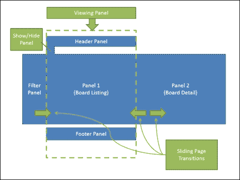
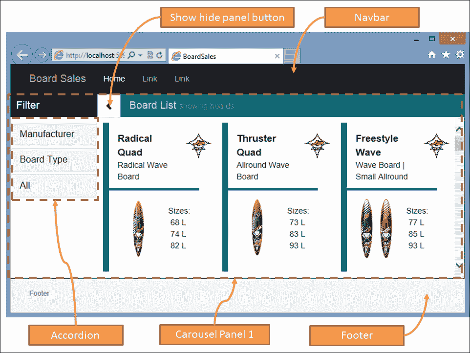
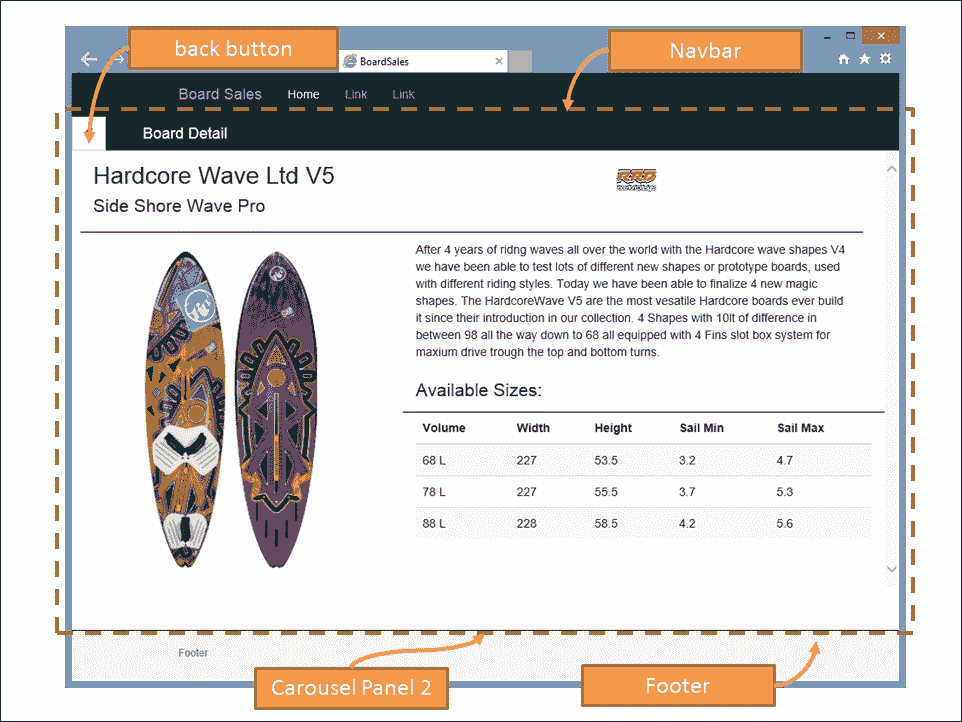
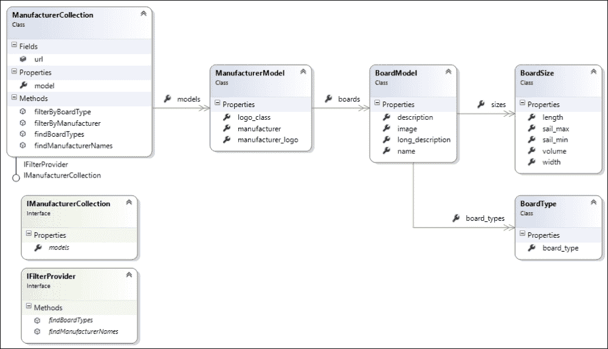
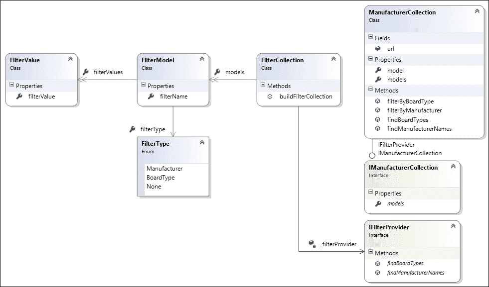
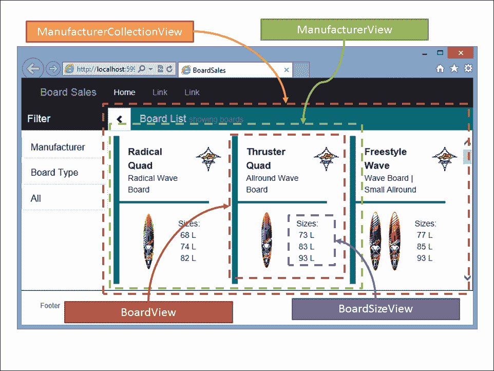
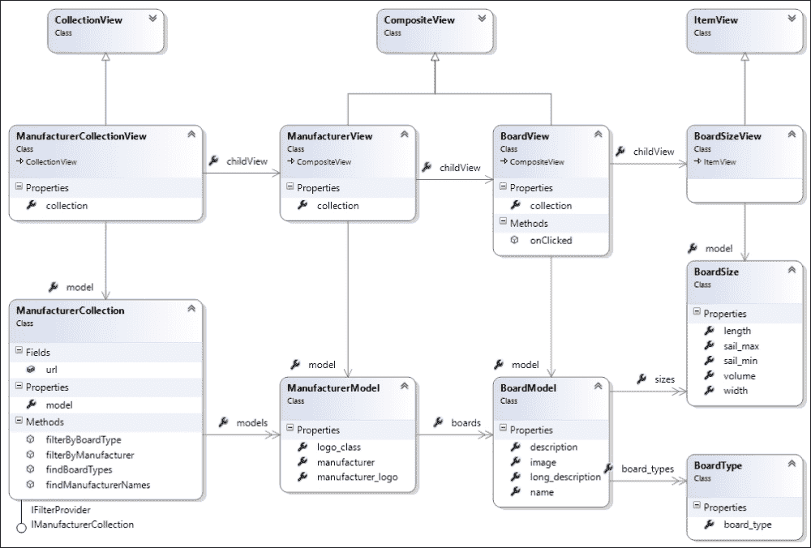
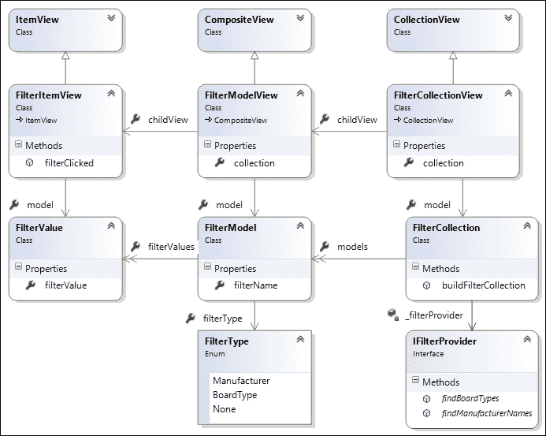
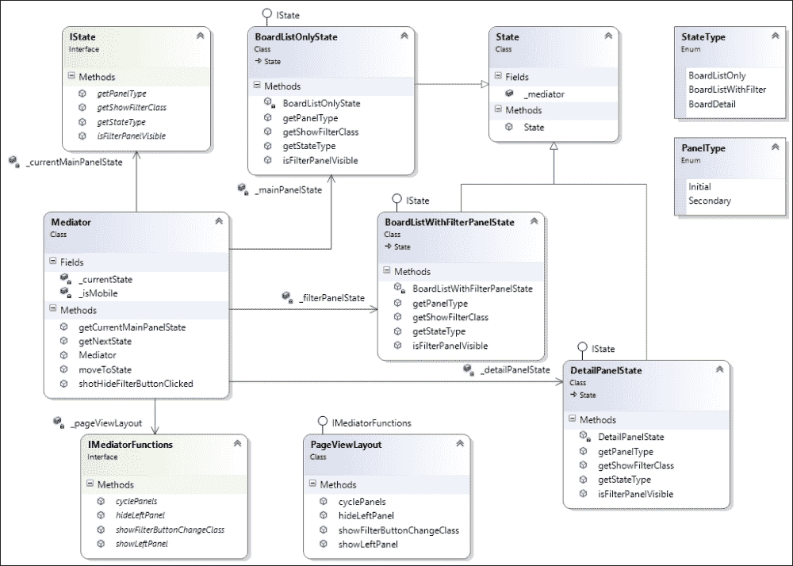

# 第九章：让我们动手吧

在本章中，我们将从头开始构建一个 TypeScript 单页 Web 应用程序。我们将从讨论网站应该是什么样子开始，我们希望我们的页面转换如何流动，然后转向探索 Bootstrap 框架的功能，并讨论我们网站的纯 HTML 版本。我们的重点将转向我们应用程序所需的数据结构，以及我们需要用来表示这些数据的 Backbone 模型和集合。在此过程中，我们将为这些模型和集合编写一组单元和集成测试。

一旦我们有了要处理的数据，我们将使用**Marionette**框架来构建视图，以将我们的应用程序呈现到 DOM 中。然后，我们将展示如何将我们网站的纯 HTML 版本分解为 HTML 片段的较小部分，然后将这些片段与我们的 Marionette 视图集成。最后，我们将使用事件将应用程序联系在一起，并探讨**State**和**Mediator**设计模式，以帮助我们管理复杂的页面转换和 DOM 元素。

# Marionette

Marionette 是 Backbone 库的扩展，引入了一些增强功能，以减少样板 Backbone 代码，并使处理 DOM 元素和 HTML 片段更容易。Marionette 还引入了布局和区域的概念，以帮助管理大型网页中的逻辑部分。Marionette 布局是一种管理多个区域的控制器，而 Marionette 区域是管理我们页面上特定 HTML 部分的对象。例如，我们可以为标题面板设置一个区域，为侧边栏面板设置一个区域，为页脚区域设置另一个区域。这使我们能够将应用程序分解为逻辑区域，然后通过消息将它们联系在一起。

# Bootstrap

我们还将使用 Bootstrap 来帮助我们进行页面布局。Bootstrap 是一个流行的移动优先框架，用于在许多不同平台上呈现 HTML 元素。Bootstrap 的样式和定制是一个足够大的主题，需要一本专门的书来探讨，所以我们不会探讨各种 Bootstrap 选项的细节。如果你有兴趣了解更多，请务必阅读 David Cochran 和 Ian Whitley 的优秀著作*Boostrap Site Blueprints*，*Packt Publishing* ([`www.packtpub.com/web-development/bootstrap-site-blueprints`](https://www.packtpub.com/web-development/bootstrap-site-blueprints))。

# Board Sales

我们的应用将是一个相当简单的应用，名为 Board Sales，将在主页上列出一系列风浪板，使用摘要视图或板列表视图。单击其中任何一个板将使页面转换为显示所选板的详细信息。在屏幕的左侧，将有一个简单的面板，允许用户通过制造商或板类型来过滤主板列表。

现代的风浪板有各种尺寸，并且是按体积来衡量的。较小体积的板通常用于波浪帆船，而较大体积的板用于比赛或障碍赛。介于两者之间的板可以归类为自由式板，用于在平静水域上进行杂技表演。任何板的另一个重要元素是板设计的帆范围。在非常强风下，使用较小的帆来允许风帆手控制风力产生的动力，在较轻的风中，使用较大的帆来产生更多的动力。我们的摘要视图将包括对每个板的体积测量的快速参考，我们的详细视图将显示所有各种板的测量和兼容的帆范围列表。

# 页面布局

通过这个应用程序，我们将利用 JavaScript 的强大功能来提供从左到右的面板式页面布局。我们将使用一些 Bootstrap 过渡效果，从左侧或右侧滑入面板，以提供用户稍微不同的浏览体验。让我们来看看这在概念上是什么样子：



Board Sales 的页面转换的概念视图

**查看面板**将是我们的主页面，有一个**头部面板**，一个**板块列表面板**和一个**页脚面板**。左侧隐藏的是**过滤面板**，主面板的左上方有一个按钮，用于显示或隐藏此过滤面板。需要时，过滤面板将从左侧滑入，隐藏时将滑回左侧。同样，**板块详细** **面板**将在点击板块时从右侧滑入，点击返回按钮时将滑回右侧，显示板块列表面板。

当在桌面设备上查看网站时，左侧的过滤面板将默认显示，但当在平板设备上查看网站时，由于屏幕较小，过滤面板将默认隐藏，以节省屏幕空间。

## 安装 Bootstrap

Bootstrap 是一组 CSS 样式和 JavaScript 函数，可帮助简单轻松地构建响应式网站。Bootstrap 的响应性意味着页面将自动调整元素大小，以便在手机的较小屏幕尺寸上呈现，以及在平板电脑和台式机上使用的较大屏幕上呈现。通过使用 Bootstrap，我们获得了额外的好处，可以以非常少的改动来针对移动用户和桌面用户。

Bootstrap 可以通过 NuGet 包安装，以及相应的 TypeScript 定义如下：

```ts
Install-package bootstrap
Install-package bootstrap.TypeScript.DefinitelyTyped

```

安装了 Bootstrap 后，我们可以开始构建一个纯粹使用 Bootstrap 编写的示例网页。以这种方式构建演示页面有助于我们确定要使用的 Bootstrap 元素，并允许我们在开始构建应用程序之前修改我们的 CSS 样式和正确构造我们的 HTML。这就是 Brackets 编辑器真正发挥作用的地方。通过使用编辑器的实时预览功能，我们可以在一个 IDE 中编辑我们的 HTML 和 CSS，并在预览窗格中获得即时的视觉反馈。以这种方式在示例 HTML 上工作既有益又有趣，更不用说节省了大量时间。

## 使用 Bootstrap

我们的页面将使用一些 Bootstrap 元素来定义主页面区域，如下：

1.  一个**导航栏**组件来渲染头部面板。

1.  一个**页脚**组件来渲染页脚面板。

1.  一个**轮播**组件，用于从板块列表视图滑动到板块详细视图。

1.  一个**手风琴**组件来渲染左侧面板中的过滤选项。

1.  **行**和**列**组件来控制我们板块列表视图中的板块的 HTML 布局，以及板块详细视图中的布局。

1.  表格 CSS 元素来渲染表格。

在本章中，我们不会详细介绍如何使用 Bootstrap 构建 HTML 页面。相反，我们将从一个可在目录/`tscode/tests/brackets/TestBootstrap.html`下的示例代码中找到的工作版本开始。

我们的 Bootstrap 元素如下：



在我们页面的顶部是导航栏元素，它被赋予了`navbar-inverse`样式，以黑色背景呈现。**轮播面板 1**元素是第一个轮播面板，包含左侧的过滤面板，以及板块列表和**显示/隐藏面板**按钮。左侧面板上的**过滤**选项使用了 Bootstrap 手风琴组件。最后，我们的页脚被设计成“粘性页脚”，意味着它将始终显示在页面上。

当我们点击板列表中的任何一个板时，我们的轮播组件将把轮播面板向左滑动，并从右侧滑入板详细视图。

我们的面板详细信息如下：



再次，我们有标准的页眉和页脚区域，但这次我们正在查看**轮播面板 2**。该面板在左上角有一个返回按钮，并显示所选板的详细信息。

当您运行此测试页面时，您会注意到页脚区域有四个链接，分别命名为**next**、**prev**、**show**和**hide**。这些按钮用于测试轮播面板的循环和左侧面板的显示/隐藏功能。

Bootstrap 非常适合快速构建站点的工作版本的模拟。这个版本可以轻松地展示给客户，或者用于项目会议的演示目的。向客户展示站点的演示模型将为您提供有关整个站点流程和设计的宝贵反馈。理想情况下，这样的工作应该由一位资深的网页设计师或者具有相同技能的人来完成，他们专门负责 CSS 样式。

当我们开始构建 Marionette 视图时，我们将稍后重用和重新设计这个 HTML。然而，将这些演示 HTML 页面保留在项目中是一个好主意，这样您就可以在不同的浏览器和设备上测试它们的外观和感觉，同时调整您的 HTML 布局和 CSS 样式。

# 数据结构

在现实世界的应用程序中，网站的数据将存储在某种数据库中，并从中检索。为了在 JavaScript 网页中使用数据，这些数据结构将被序列化为 JSON 格式。Marionette 使用标准的 Backbone 模型和集合来加载和序列化数据结构。对于这个示例应用程序，我们的数据结构将如下所示：



`ManufacturerCollection`和相关的 Backbone 模型的类图

我们的数据源是`ManufacturerCollection`，它将有一个`url`属性来从我们的网站加载数据。这个`ManufacturerCollection`持有一个`ManufacturerModels`集合，可以通过`models`属性获得。`ManufacturerCollection`还实现了两个接口：`IManufacturerCollection`和`IFilterProvider`。我们稍后会讨论这两个接口。

`ManufacturerModel`的属性将用于将单个制造商的名称和徽标呈现到 DOM 中。每个`ManufacturerModel`还有一个名为`boards`的数组，其中包含一个`BoardModels`数组。

每个`BoardModel`都有必要用于呈现的属性，以及一个名为`board_types`的数组，其中包含一组`BoardType`类。`BoardType`是一个简单的字符串，将包含"Wave"、"Freestyle"或"Slalom"中的一个值。

每个`BoardModel`还将有一个`sizes`数组，其中包含一个`BoardSize`类，其中包含有关可用尺寸的详细信息。

例如，用于序列化前述对象结构的 JSON 数据结构将如下所示：

```ts
{
"manufacturer": "JP Australia",
"manufacturer_logo": "jp_australia_logo.png",
"logo_class" : "",
"boards": [
    {
        "name": "Radical Quad",
        "board_types": [ { "board_type": "Wave" } ],

        "description": "Radical Wave Board",
        "image": "jp_windsurf_radicalquad_ov.png",
        "long_description": "long desc goes here",
        "sizes": [
            { "volume": 68, "length": 227, 
              "width": 53, "sail_min": "< 5.0", "sail_max": "< 5.2" }
        ]
    }]
}
```

在我们的示例应用程序中，完整的 JSON 数据集可以在`/tscode/tests/boards.json`找到。

## 数据接口

为了在 TypeScript 中使用这个 JSON 数据结构，我们需要定义一组接口来描述上述数据结构，如下所示：

```ts
export interface IBoardType {
    board_type: string;
}
export interface IBoardSize {
    volume: number;
    length: number;
    width: number;
    sail_min: string;
    sail_max: string;
}
export interface IBoardModel {
    name: string;
    board_types: IBoardType[];
    description: string;
    image: string;
    long_description: string;
    sizes: IBoardSize[];
}
export interface IManufacturerModel {
    manufacturer: string;
    manufacturer_logo: string;
    logo_class: string;
    boards: IBoardModel[];
}
```

这些接口简单地匹配了前面图表中的模型属性，然后我们可以构建相应的实现这些接口的`Backbone.Model`类。请注意，为了简洁起见，我们没有在这里列出每个模型的每个属性，因此请务必参考附带的源代码以获取完整列表。我们的 Backbone 模型如下：

```ts
export class BoardType extends Backbone.Model
    implements IBoardType {
    get board_type() { return this.get('board_type'); }
    set board_type(val: string) { this.set('board_type', val); }
}
export class BoardSize extends Backbone.Model 
    implements IBoardSize {
    get volume() { return this.get('volume');}
    set volume(val: number) { this.set('volume', val); }
    // more properties
}
export class BoardModel extends Backbone.Model implements IBoardModel {
    get name() { return this.get('name'); }
    set name(val: string) { this.set('name', val); }
    // more properties
    get sizes() { return this.get('sizes'); }
    set sizes(val: IBoardSize[]) { this.set('sizes', val); }
}
export class ManufacturerModel extends Backbone.Model implements IManufacturerModel {
    get manufacturer() { return this.get('manufacturer'); }
    set manufacturer(val: string) { this.set('manufacturer', val); }
    // more properties
    get boards() { return this.get('boards'); }
    set boards(val: IBoardModel[]) { this.set('boards', val); }
}
```

每个类都扩展了`Backbone.Model`，并实现了我们之前定义的接口之一。这些类没有太多内容，除了为每个属性定义`get`和`set`方法，并使用正确的属性类型。

此时，我们的模型已经就位，我们可以编写一些单元测试，以确保我们可以正确地创建我们的模型：

```ts
it("should build a BoardType", () => {
    var boardType = new bm.BoardType(
        { board_type: "testBoardType" });
    expect(boardType.board_type).toBe("testBoardType");
});
```

我们从一个简单的测试开始，创建一个`BoardType`模型，然后测试`board_type`属性是否已正确设置。同样，我们可以为`BoardSize`模型创建一个测试：

```ts
describe("BoardSize tests", () => {
    var boardSize: bm.IBoardSize;
    beforeAll(() => {
        boardSize = new bm.BoardSize(
          { "volume": 74, "length": 227,
            "width": 55, "sail_min": "4.0", "sail_max": "5.2" });
    });
    it("should build a board size object",() => {
        expect(boardSize.volume).toBe(74);
    });
});
```

这个测试也只是创建了一个`BoardSize`模型的实例，但它使用了`beforeAll` Jasmine 方法。为简洁起见，我们只展示了一个测试，检查`volume`属性，但在实际应用中，我们会测试每个`BoardSize`属性。最后，我们可以编写一个`BoardModel`的测试如下：

```ts
describe("BoardModel tests",() => {
    var board: bm.IBoardModel;
    beforeAll(() => {
        board = new bm.BoardModel({
            "name": "Thruster Quad",
            "board_types": [{ "board_type": "Wave" }],
            "description": "Allround Wave Board",
            "image": "windsurf_thrusterquad_ov.png",
            "long_description": 
                "Shaper Werner Gnigler and pro riders Robby Swift",
            "sizes": [
                { "volume": 73, "length": 228, "width": 55.5,
                     "sail_min": "4.0", "sail_max": "5.2" }
            ]
        });
    });

    it("should find name property",() => {
        expect(board.name).toBe("Thruster Quad");
    });
    it("should find sizes[0].volume property",() => {
        expect(board.sizes[0].volume).toBe(73);
    });
    it("should find sizes[0].sail_max property",() => {
        expect(board.sizes[0].sail_max).toBe("5.2");
    });
    it("should find board_types[0].sail_max property",() => {
        expect(board.board_types[0].board_type).toBe("Wave");
    });
});
```

再次强调，在我们的`beforeAll`函数中创建了一个`BoardModel`实例，然后测试属性是否设置正确。注意代码片段底部附近的测试：我们正在检查`sizes`属性和`board_types`属性是否已正确构建，并且它们实际上是可以用`[]`数组表示法引用的数组。

在附带的源代码中，您将找到这些模型的进一步测试，以及对`ManufacturerModel`的测试。

### 注意

注意每个模型是如何通过简单地剪切和粘贴原始 JSON 样本的部分来构建的。当 Backbone 模型通过 RESTful 服务进行填充时，这些服务只是简单地返回 JSON，因此我们的测试与 Backbone 本身的操作是匹配的。

## 集成测试

此时，您可能会想为什么我们要编写这些测试，因为它们可能看起来微不足道，只是检查某些属性是否已正确构建。在实际应用中，模型经常会发生变化，特别是在项目的初期阶段。通常会有一个开发人员或团队的一部分负责后端数据库和向前端提供 JSON 的服务器端代码。另一个团队可能负责前端 JavaScript 代码的开发。通过编写这样的测试，您清楚地定义了数据结构应该是什么样子，以及您的模型中期望的属性是什么。如果服务器端进行了修改数据结构的更改，您的团队将能够快速确定问题的原因所在。

编写基于属性的测试的另一个原因是，Backbone、Marionette 和几乎任何其他 JavaScript 库都将使用这些属性名称来将 HTML 呈现到前端。如果您的模板期望一个名为`manufacturer_logo`的属性，而您将此属性名称更改为`logo_image`，那么您的渲染代码将会出错。这些错误通常很难在运行时跟踪。遵循“尽早失败，失败得响亮”的测试驱动开发原则，我们的模型属性测试将快速突出显示这些潜在错误，如果发生的话。

一旦一系列基于属性的测试就位，我们现在可以专注于一个集成测试，实际上会调用服务器端代码。这将确保我们的 RESTful 服务正常工作，并且我们网站生成的 JSON 数据结构与我们的 Backbone 模型期望的 JSON 数据结构匹配。同样，如果两个独立的团队负责客户端和服务器端代码，这种集成测试将确保数据交换是一致的。

我们将通过`Backbone.Collection`类加载此应用程序的数据，并且此集合将需要加载多个制造商。为此，我们现在可以构建一个`ManufacturerCollection`类，如下所示：

```ts
export class ManufacturerCollection 
    extends Backbone.Collection<ManufacturerModel>
{
    model = ManufacturerModel;
    url = "/tscode/boards.json";
}
```

这是一个非常简单的`Backbone.Collection`类，它只是将`model`属性设置为我们的`ManufacturerModel`，将`url`属性设置为`/tscode/boards.json`。由于我们的示例应用程序没有后端数据库或 REST 服务，因此我们将在此阶段仅从磁盘加载我们的 JSON。请注意，即使在此测试中我们使用静态 JSON 文件，Backbone 仍将向服务器发出 HTTP 请求以加载此文件，这意味着对`ManufacturerCollection`的任何测试实际上都是集成测试。现在我们可以编写一些集成测试，以确保该模型可以从`url`属性正确加载，如下所示：

```ts
describe("ManufacturerCollection tests", () => {
    var manufacturers: bm.ManufacturerCollection;

    beforeAll(() => {
        manufacturers = new bm.ManufacturerCollection();
        manufacturers.fetch({ async: false });
    });

    it("should load 3 manufacturers", () => {
        expect(manufacturers.length).toBe(3);
    });

    it("should find manufacturers.at(2)",() => {
        expect(manufacturers.at(2).manufacturer)
           .toBe("Starboard");
    });
}
```

我们再次使用 Jasmine 的`beforeAll`语法来设置我们的`ManufacturerCollection`实例，然后调用`fetch({ async: false })`来等待集合加载。然后我们有两个测试，一个是检查我们是否将三个制造商加载到我们的集合中，另一个是检查索引为`2`的`Manufacturer`模型。

## 遍历集合

现在我们已经加载了完整的`ManufacturerCollection`，我们可以将注意力转向处理它包含的数据。我们需要搜索此集合以找到两件事：制造商列表和板类型列表。这两个列表将被用于左侧面板上的过滤面板。在现实世界的应用程序中，这两个列表可能由服务器端代码提供，返回简单的 JSON 数据结构来表示这两个列表。然而，在我们的示例应用程序中，我们将展示如何遍历我们已经加载的主制造商 Backbone 集合。过滤数据结构如下：



具有相关 Backbone 模型的 FilterCollection 类图

与前面图表中显示的 Backbone 模型的完整实现不同，我们将查看 TypeScript 接口。我们的这些过滤模型的接口如下：

```ts
export enum FilterType {
    Manufacturer,
    BoardType,
    None
}
export interface IFilterValue {
    filterValue: string;
}
export interface IFilterModel {
    filterType: FilterType;
    filterName: string;
    filterValues: IFilterValue[];
}
```

我们从`FilterType`枚举开始，我们将使用它来定义我们可用的每种类型的过滤器。我们可以通过制造商名称、板类型或使用`None`过滤器类型清除所有过滤器来过滤我们的板列表。

`IFilterValue`接口简单地保存一个用于过滤的字符串值。当我们按板类型进行过滤时，此字符串值将是“Wave”、“Freestyle”或“Slalom”之一，当我们按制造商进行过滤时，此字符串值将是制造商的名称。

`IFilterModel`接口将保存`FilterType`，过滤器的名称和`filterValues`数组。

我们将为这些接口创建一个 Backbone 模型，这意味着我们最终将拥有两个 Backbone 模型，名为`FilterValue`（实现`IFilterValue`接口）和`FilterModel`（实现`IFilterModel`接口）。为了容纳`FilterModel`实例的集合，我们还将创建一个名为`FilterCollection`的 Backbone 集合。此集合有一个名为`buildFilterCollection`的方法，它将使用`IFilterProvider`接口来构建其内部的`FilterModels`数组。此`IFilterProvider`接口如下：

```ts
export interface IFilterProvider {
    findManufacturerNames(): bm.IManufacturerName[];
    findBoardTypes(): string[]
}
```

我们的`IFilterProvider`接口有两个函数。`findManufacturerNames`函数将返回制造商名称列表（及其关联的标志），`findBoardTypes`函数将返回所有板类型的字符串列表。这些信息是构建我们的`FilterCollection`内部数据结构所需的全部信息。

用于填充此`FilterCollection`所需的所有值将来自已包含在我们的`ManufacturerCollection`中的数据。因此，`ManufacturerCollection`将需要实现此`IFilterProvider`接口。

### 查找制造商名称

让我们继续在我们的测试套件中工作，以充实`ManufacturerCollection`需要实现的`IFilterProvider`接口的`findManufacturerNames`函数的功能。这个函数返回一个`IManufacturerName`类型的数组，定义如下：

```ts
export interface IManufacturerName {
    manufacturer: string;
    manufacturer_logo: string;
}
```

现在我们可以使用这个接口构建一个测试：

```ts
it("should return manufacturer names ",() => {
    var results: bm.IManufacturerName[] = 
        manufacturers.findManufacturerNames();
    expect(results.length).toBe(3);
    expect(results[0].manufacturer).toBe("JP Australia");
});
```

这个测试重用了我们在之前的测试套件中设置的`manufacturers`变量。然后调用`findManufacturerNames`函数，并期望结果是一个包含三个制造商名称的数组，即"JP Australia"，"RRD"和"Starboard"。

现在，我们可以更新实际的`ManufacturerCollection`类，以提供`findManufacturerNames`函数的实现：

```ts
public findManufacturerNames(): IManufacturerName[] {
    var items = _(this.models).map((iterator) => {
        return {
            'manufacturer': iterator.manufacturer,
            'manufacturer_logo': iterator.manufacturer_logo
        };
    });
    return items;
}
```

在这个函数中，我们使用 Underscore 实用函数`map`来循环遍历我们的集合。每个 Backbone 集合类都有一个名为`models`的内部数组。`map`函数将循环遍历这个`models`属性，并为集合中的每个项目调用匿名函数，通过`iterator`参数将当前模型传递给我们的匿名函数。然后我们的代码构建了一个具有`IManufacturer`接口所需属性的 JSON 对象。

### 注意

如果返回的对象不符合`IManufacturer`名称接口，TypeScript 编译器将生成错误。

### 查找板类型

现在我们可以专注于`IFilterProvider`接口的第二个函数，名为`findBoardTypes`，`ManufacturerCollection`需要实现。这是一个单元测试：

```ts
it("should find board types ",() => {
    var results: string[] = manufacturers.findBoardTypes();
    expect(results.length).toBe(3);
    expect(results).toContain("Wave");
    expect(results).toContain("Freestyle");
    expect(results).toContain("Slalom");
});
```

这个测试调用`findBoardTypes`函数，它将返回一个字符串数组。我们期望返回的数组包含三个字符串："Wave"，"Freestyle"和"Slalom"。

我们`ManufacturerCollection`类中对应的函数实现如下：

```ts
public findBoardTypes(): string[] {
    var boardTypes = new Array<string>();
    _(this.models).each((manufacturer) => {
        _(manufacturer.boards).each((board) => {
            _(board.board_types).each((boardType) => {
                if (! _.contains(
                    boardTypes, boardType.board_type)) {
                        boardTypes.push(boardType.board_type);
                }
            });
        });
    });
    return boardTypes;
}
```

`findBoardTypes`函数的实现从创建一个名为`boardTypes`的新字符串数组开始，它将保存我们的结果。然后我们使用 Underscore 的`each`函数来循环遍历每个制造商。Underscore 的`each`函数类似于`map`函数，将迭代我们集合中的每个项目。然后我们循环遍历制造商的所有板，以及每个板上列出的每种板类型。最后，我们测试看看板类型集合是否已经包含一个项目，使用 underscore 的`_.contains`函数。如果数组中还没有板类型，我们将`board_type`字符串推入我们的`boardTypes`数组中。

### 注意

Underscore 库有许多实用函数可用于搜索、操作和修改数组和集合，因此请务必查阅文档，找到适合在您的代码中使用的合适函数。这些函数不仅限于 Backbone 集合，可以用于任何类型的数组。

这完成了我们对`IFilterProvider`接口的工作，以及它在`ManufacturerCollection`类中的实现。

## 集合过滤

当用户在左侧面板上点击过滤选项时，我们需要将所选的过滤器应用到制造商集合中包含的数据。为了做到这一点，我们需要在`ManufacturerCollection`类中实现两个函数，名为`filterByManufacturer`和`filterByBoardType`。让我们从一个测试开始，通过制造商名称来过滤我们的集合：

```ts
it("should filter by manufacturer name ",() => {
    var results = manufacturers.filterByManufacturer("RRD");
    expect(results.length).toBe(1);
});
```

这个测试调用`filterByManufacturer`函数，期望只返回一个制造商。有了这个测试，我们可以在`ManufacturerCollection`上创建真正的`filterByManufacturer`函数，如下所示：

```ts
public filterByManufacturer(manufacturer_name: string) {
    return _(this.models).filter((item) => {
        return item.manufacturer === manufacturer_name;
    });
}
```

在这里，我们使用 Underscore 函数`filter`来对我们的集合应用过滤器。

第二个筛选函数是按板子类型筛选，稍微复杂一些。我们需要循环遍历我们的集合中的每个制造商，然后循环遍历每个板子，然后循环遍历每个板子类型。如果我们找到了板子类型的匹配，我们将标记这个板子包含在结果集中。在我们着手编写`filterByBoardType`函数之前，让我们写一个测试：

```ts
it("should only return Slalom boards ",() => {
    var results = manufacturers.filterByBoardType("Slalom");
    expect(results.length).toBe(2);
    _(results).each((manufacturer) => {
        _(manufacturer.boards).each((board) => {
            expect(_(board.board_types).some((boardType) => {
                return boardType.board_type == 'Slalom';
            })).toBeTruthy(); 

        });
    });
});
```

我们的测试调用`filterByBoardType`函数，使用字符串`"Slalom"`作为筛选条件。请记住，这个函数将返回一个`ManufacturerModel`对象的集合，顶层的每个对象中的`boards`数组都经过板子类型的筛选。我们的测试然后循环遍历每个制造商，以及结果集中的每个板子，然后使用 Underscore 函数`some`来测试`board_types`数组是否有正确的板子类型。

我们在`ManufacturerCollection`上实现这个函数的代码也有点棘手，如下所示：

```ts
public filterByBoardType(board_type: string) {
    var manufWithBoard = new Array();
    _(this.models).each((manuf) => { 
        var hasBoardtype = false;
        var boardMatches = new Array();
        _(manuf.boards).each((board) => {
            var match = _(board.board_types).some((item) => {
                return item.board_type == board_type;
            });
            if (match) {
                boardMatches.push(new BoardModel(board));
                hasBoardtype = true;
            }
        });

        if (hasBoardtype) {
            var manufFiltered = new ManufacturerModel(manuf);
            manufFiltered.set('boards', boardMatches);
            manufWithBoard.push(manufFiltered);
        }
    });
    return manufWithBoard;
}
```

我们的`ManufacturerCollection`类实例保存了通过网站上的 JSON 文件加载的整个集合。为了保留这些数据以进行重复筛选，我们需要构造一个新的`ManufacturerModel`数组来从这个函数中返回——这样我们就不需要修改基础的“全局”数据。一旦我们构造了这个新数组，我们就可以循环遍历每个制造商。如果我们找到与所需筛选匹配的板子，我们将设置一个名为`hasBoardType`的标志为 true，以指示这个制造商必须添加到我们的筛选数组中。

在这个经过筛选的数组中，每个制造商还需要列出与我们的筛选条件匹配的板子类型，因此我们需要另一个数组——称为`boardMatches`——来保存这些匹配的板子。然后我们的代码将循环遍历每个板子，并检查它是否具有所需的`board_type`。如果是，我们将把它添加到`boardMatches`数组中，并将`hasBoardType`标志设置为`true`。

一旦我们循环遍历了每个制造商的板子，我们就可以检查`hasBoardType`标志。如果我们的制造商有这种板子类型，我们将构造一个新的`ManufacturerModel`，然后将这个模型的`boards`属性设置为我们内存中匹配的板子的数组。

我们对底层的 Backbone 集合和模型的工作现在已经完成。我们还编写了一组单元测试和集成测试，以确保我们可以从网站加载我们的集合，从这个集合构建我们的筛选列表，然后对这些数据应用特定的筛选。

# Marionette 应用程序、区域和布局

现在我们可以把注意力集中在构建应用程序本身上。在 Marionette 中，这是通过创建一个从`Marionette.Application`派生的类来实现的，如下所示：

```ts
export class BoardSalesApp extends Marionette.Application {
    viewLayout: pvl.PageViewLayout;
    constructor(options?: any) {
        if (!options)
            options = {};
        super();
        this.viewLayout = new pvl.PageViewLayout();
    }
    onStart() {
        this.viewLayout.render();
    }
}
```

在这里，我们定义了一个名为`BoardSalesApp`的类，它派生自`Marionette.Application`类，并将作为我们应用程序的起点。我们的构造函数非常简单，它创建了`PageViewLayout`类的一个新实例，我们将很快讨论。我们应用程序中的唯一其他函数是`onStart`函数，它将我们的`PageViewLayout`呈现到屏幕上。当应用程序启动时，Marionette 将触发这个`onStart`函数。

我们的`PageLayoutView`类如下：

```ts
export class PageViewLayout extends Marionette.LayoutView<Backbone.Model> {
    constructor(options?: any) {
        if (!options)
            options = {};
        options.el = '#page_wrapper';
        var snippetService: ISnippetService = 
            TypeScriptTinyIoC.resolve(IISnippetService);
        options.template = snippetService.retrieveSnippet(
            SnippetKey.PAGE_VIEW_LAYOUT_SNIPPET);
        super(options);
    }
}
```

这个类扩展自`Marionette.LayoutView`，并做了两件重要的事情。首先，在`options`对象上设置了一些属性，然后通过`super`函数调用了基类的构造函数，传入了这个`options`对象。这个`options`对象的一个属性名为`el`，包含了这个视图将呈现到的 DOM 元素的名称。在这段代码中，这个`el`属性被设置为 DOM 元素`'#page_wrapper'`。如果不设置这个`el`属性，当我们尝试将视图呈现到 DOM 时，我们将得到一个空白屏幕。

我们构造函数中的第二个重要步骤是从`SnippetService`加载一个片段。然后使用这个片段来设置`options`对象上的`template`属性。与 Backbone 类似，Marionette 加载模板，然后将底层模型属性与视图模板结合起来，以生成将呈现到 DOM 中的 HTML。

在这个阶段，为了运行我们的`BoardSalesApp`，并让它将`PageViewLayout`呈现到 DOM 中，我们需要两样东西。第一是在我们的`index.html`页面中有一个`id="page_wrapper"`的 DOM 元素，以匹配我们的`options.el`属性，第二是我们的`PAGE_VIEW_LAYOUT_SNIPPET`。

我们的`index.html`页面如下：

```ts
<!DOCTYPE html>
<html >
<head>
    <title>BoardSales</title>
    <link rel="stylesheet" href="/Content/bootstrap.css" />
    <link rel="stylesheet" type="text/css"
          href="/Content/app.css">
    <script type="text/javascript"
            src="img/head-1.0.3.js"></script>
    <script data-main="/tscode/app/AppConfig"
            type="text/javascript"
            src="img/require.js"></script>
</head>
<body>
    <div id="page_wrapper">

    </div>
    <footer class="footer footer_style">
        <div class="container">
            <p class="text-muted"><small>Footer</small></p>
        </div>

    </footer>
</body>
</html>
```

这个页面包括`bootstrap.css`和`app.css`样式表，以及一个带有`data-main`属性设置为名为`/tscode/app/AppConfig`的 Require 配置文件的 Require 调用。`index.html`页面的主体只包括带有`id="page_wrapper"`的 DOM 元素和页脚。这是我们之前构建的演示 HTML 页面的一个非常简化的版本。

### 注意

我们还包括了一个名为`head-1.0.3.js`的脚本，可以通过 NuGet 包`HeadJS`安装。这个脚本会查询我们的浏览器，以找出它是在移动设备还是桌面设备上运行，我们正在使用什么浏览器，甚至当前屏幕尺寸是多少。我们将在应用程序中稍后使用`head.js`的输出。

我们现在需要为`PageViewLayout`创建一个 HTML 片段。这个文件叫做`PageViewLayout.html`，位于`/tscode/app/views`目录中，因此在处理`PageViewLayout.ts`文件时可以很容易找到。查看完整的 HTML 文件清单的示例代码，其中包括以下相关部分：

```ts
<div id="page_wrapper">
    <div id="main_panel_div">
            <div class="carousel-inner" >
                <div id="carousel_panel_1" >
                    <div id="content_panel_left" >
                            <!--filter panel goes here-->
                    </div>
                    <div id="content_panel_main">
                      <div id="manufacturer_collection">
                            <!--board list goes here-->
                        </div>
                    </div>
                </div>
                <div id="carousel_panel_2">
                        <!--board detail panel goes here-->
                </div>
            </div>
    </div>
</div>
```

我们的`PageViewSnippet.html`文件包含了我们页面的主要元素。我们有一个`main_panel_div`作为应用程序的中间面板，其中包含了我们的两个轮播面板 div，名为`carousel_panel_1`和`carousel_panel_2`。在这些轮播面板中，我们将呈现过滤面板、板块列表面板和板块详细信息面板。

现在我们需要组合我们的`AppConfig.ts`文件，Require 将加载，并设置`SnippetService`来加载`PageViewLayout.html`片段。为了简洁起见，我们没有在这里列出完整的`require.config`，并且已经排除了`paths`和`shims`部分。我们将专注于对 Require 的调用如下：

```ts
require([
    'BoardSalesApp', 'tinyioc', 'snippetservice'
    ,'text!/tscode/app/views/PageViewLayout.html' ],
    (app, tinyioc, snippetservice, pageViewLayoutSnippet) => {

     var snippetService = new SnippetService();
     snippetService.storeSnippet(
          SnippetKey.PAGE_VIEW_LAYOUT_SNIPPET,
          pageViewLayoutSnippet);
     TypeScriptTinyIoC.register(snippetService, IISnippetService);

     var boardSalesApp = new app.BoardSalesApp();
     boardSalesApp.start();

    });
```

在这里，我们包括了`BoardSalesApp`、`tinyioc`和`snippetservice`，以及我们的`PageViewLayout.html`片段在 require 的调用中。然后我们设置了`SnippetService`，将`pageViewLayoutSnippet`存储在正确的键下，并将`SnippetService`注册到我们的服务定位器中。为了启动我们的 Marionette 应用程序，我们创建了`BoardSalesApp`的一个新实例，并调用`start`。一旦调用了`start`方法，Marionette 将触发我们的`BoardSalesApp.onStart`方法，然后渲染`PageViewLayout`类。

## 加载主要集合

在这个应用程序中，我们将只加载我们的`ManufacturerCollection`一次，然后重复使用这个“全局”集合进行过滤。现在让我们更新我们的`BoardSalesApp`，以包括这个“全局”集合，并在应用程序启动时加载它。再次参考完整清单的示例代码：

```ts
export class BoardSalesApp extends Marionette.Application {
    viewLayout: pvl.PageViewLayout;
    _manufCollection: bm.ManufacturerCollection;

    constructor(options?: any) {
        if (!options)
            options = {};
        super();
        _.bindAll(this, 'CollectionLoaded');
        _.bindAll(this, 'CollectionLoadError');
        this.viewLayout = new pvl.PageViewLayout();
    }

    onStart() {
        this.viewLayout.render();
        this._manufCollection = new bm.ManufacturerCollection();
        TypeScriptTinyIoC.register(this._manufCollection, 
            bm.IIManufacturerCollection);
        this._manufCollection.fetch({ 
            success: this.CollectionLoaded, 
            error: this.CollectionLoadError });
    }

    CollectionLoaded() {
        TypeScriptTinyIoC.raiseEvent(
            new ev.NotifyEvent(
                ev.EventType.ManufacturerDataLoaded), ev.IINotifyEvent);
    }

    CollectionLoadError(err) {
        TypeScriptTinyIoC.raiseEvent(
           new ev.ErrorEvent(err), ev.IIErrorEvent);
    }
}
```

我们已经更新了我们的`BoardSalesApp`，在私有变量`_manufCollection`中存储了`ManufacturerCollection`类的一个实例。我们的`onStart`函数已经更新，以在调用`viewLayout.render`之后实例化这个集合。注意下一个对`TypeScriptTinyIoC`的调用。我们正在注册`this._manufCollection`作为一个将实现`IIManufacturerCollection`命名接口的服务。然后我们在集合上调用 Backbone 的`fetch`函数，带有`success`和`error`回调。`success`回调和`error`回调都只是触发一个事件。

通过将我们的`ManufacturerCollection`类的实例注册到命名接口`IIManufacturerCollection`，我们的任何需要访问主要集合的类都可以简单地从我们的服务定位器中请求此类的实例。这些命名接口如下：

```ts
export interface IManufacturerCollection {
    models: ManufacturerModel[];
}
export class IIManufacturerCollection implements IInterfaceChecker {
    propertyNames = ['models'];
    className = 'IIManufacturerCollection';
}
```

我们还需要修改我们的`ManufacturerCollection`类以实现`IManufacturerCollection`接口，如下所示：

```ts
export class ManufacturerCollection extends Backbone.Collection<ManufacturerModel>
    implements IManufacturerCollection
{
    // existing code
}
```

现在让我们来看一下将从我们的`success`和`error`回调中触发的事件。在`success`函数回调中，我们正在引发`INotifyEvent`类型的事件。请注意，我们在这里只列出接口定义—有关相应的`IInterfaceChecker`类和事件类，请参考附带的源代码：

```ts
export enum EventType {
    ManufacturerDataLoaded,
    ErrorEvent
}
export interface INotifyEvent {
    eventType: EventType;
}
export interface INotifyEvent_Handler {
    handle_NotifyEvent(event: INotifyEvent): void;
}
```

在这里，我们定义了一个`EventType`枚举来保存事件类型，然后定义了一个`INotifyEvent`接口，它只包含一个名为`eventType`的属性。我们还定义了相应的`INotifyEvent_Handler`接口，任何处理程序都需要实现。

我们的错误事件将使用继承从这些接口派生如下：

```ts
export interface IErrorEvent extends INotifyEvent {
    errorMessage: string;
}
export interface IErrorEvent_Handler {
    handle_ErrorEvent(event: IErrorEvent);
}
```

在这里，我们从`INotifyEvent`派生`IErrorEvent`接口，从而重用基接口的`EventType`枚举和属性。

现在我们可以在我们的`PageViewLayout`类中响应这些事件：

```ts
export class PageViewLayout extends Marionette.LayoutView<Backbone.Model>
    implements ev.INotifyEvent_Handler
{

    private _manufacturerView: mv.ManufacturerCollectionView;

    constructor(options?: any) {
        // exising code
        _.bindAll(this, 'handle_NotifyEvent');
        TypeScriptTinyIoC.registerHandler(
            this, ev.IINotifyEvent_Handler, ev.IINotifyEvent);
    }
    handle_NotifyEvent(event: ev.INotifyEvent) {
        if (event.eventType == ev.EventType.ManufacturerDataLoaded) 
        {
            this._manufacturerView =
                new mv.ManufacturerCollectionView();
            this._manufacturerView.render();
        }
    }
}
```

我们已经实现了`INotifyEvent_Handler`接口，并在`TypeScriptTinyIoC`中为`IINotifyEvent`注册了。我们的`handle_NotifyEvent`类将检查事件类型是否为`ManufacturerDataLoaded`事件，然后创建`ManufacturerCollectionView`类的实例并将其渲染到 DOM 中。

## Marionette 视图

Marionette 提供了许多不同的视图类供我们使用，根据我们需要渲染到 DOM 的对象类型。任何需要渲染`Backbone.Collection`的类都可以使用`CollectionView`，任何需要渲染此集合中的单个项目的类都可以使用`ItemView`。Marionette 还提供了这两种视图的混合称为`CompositeView`。如果我们看一下我们的演示应用程序，我们将能够将我们的屏幕分解为许多逻辑视图，如下所示：



带有 Marionette 视图覆盖的板列表视图

我们需要构建的视图的确定与我们为 Backbone 集合和模型设置的数据结构密切相关。当我们将前面的视图叠加在我们的`ManufacturerCollection`类的类图上时，这种关系显而易见：



具有相应 Marionette 视图的模型类图

### ManufacturerCollectionView 类

我们从`ManufacturerCollectionView`开始，这是一个渲染整个`ManufacturerCollection`的视图。我们还需要一个`ManufacturerView`来渲染特定的`ManufacturerModel`，然后是一个`BoardView`来渲染制造商武器库中的每个板。每个板都有一个内部的`BoardSize`对象数组，因此我们将创建一个`BoardSizeView`来渲染这些项目。

让我们开始构建这些视图，从`ManufacturerCollectionView`开始：

```ts
export class ManufacturerCollectionView
    extends Marionette.CollectionView<bm.ManufacturerModel> {
    constructor(options?: any) {
        if (!options)
            options = {};
        options.el = '#manufacturer_collection';
        options.className = "row board_row";

        super(options);
        this.childView = ManufacturerView;

        var manufColl: bm.IManufacturerCollection = 
           TypeScriptTinyIoC.resolve(bm.IIManufacturerCollection);
        if (!options.collection) {
            this.collection = <Backbone.Collection<bm.ManufacturerModel>> manufColl;
        } else {
            this.collection = options.collection;
        }
    }
}
```

这个类扩展自`Marionette.CollectionView`，并将我们的`ManufacturerModel`指定为类的泛型类型。我们的`constructor`将`el`属性设置为`"＃manufacturer_collection"`的`options`对象。正如我们在`PageLayoutView`中看到的，Marionette 将使用此属性将整个集合渲染到 DOM 中。我们还在我们的`options`中设置了一个`className`属性。Marionette 将使用`className`属性将`class="…"`属性附加到外部 DOM 元素。这将在渲染的 HTML 中将`CSS`样式应用于`manufacturer_collection`元素的`row`和`board_row`。一旦我们正确构造了我们的`options`，我们调用`super(options)`将这些选项传递给基类构造函数。

`CollectionView`的`childView`属性指示 Marionette 为集合中找到的每个元素创建我们指定的类的实例。我们将这个`childView`属性设置为`ManfuacturerView`，因此 Marionette 将为集合中的每个元素构造一个新的`ManufacturerView`。

最后，在我们的构造函数中，我们使用我们的服务定位器模式查找`ManufacturerCollection`服务的一个实例，然后将内部的`this.collection`属性设置为返回的对象。一旦我们定义了`childView`类名，并设置了`this.collection`属性，Marionette 将自动创建我们的子视图的实例，并将它们呈现到 DOM 中。

请注意，对于`CollectionView`，我们不需要 HTML 模板或片段。这是因为我们将单个项目的渲染推迟到`childView`类。

### ManufacturerView 类

我们的`childView`类`ManufacturerView`如下：

```ts
export class ManufacturerView
    extends Marionette.CompositeView<Backbone.Model> {
    constructor(options?: any) {
        if (!options)
            options = {};
        options.template = _.template('<div></div>');
        super(options);
        this.collection = new Backbone.Collection(
            this.model.get('boards')
        );
        this.childView = BoardView;
        this.childViewOptions = { 
            parentIcon: this.model.get('manufacturer_logo')
        };
    }
}
```

在这种情况下，我们从`Marionette.CompositeView`派生我们的视图，并使用标准的`Backbone.Model`作为通用类型。因为我们的板列表视图中有多个制造商，我们实际上不需要为每个制造商渲染任何特定的内容。因此，我们的模板是一个简单的`<div></div>`。

这个视图的重要部分是为我们的`boards`数组设置一个新的`Backbone.Collection`，然后设置一个`childView`类来渲染集合中的每个`board`。我们的`childView`属性设置为`BoardView`，我们还设置了一个`childViewOptions`属性，将通过它传递给每个`BoardView`实例。请记住，每个`BoardView`显示制造商的标志，但这个标志图像是在制造商级别保存的。因此，我们需要将这些信息传递给每个创建的`BoardView`。Marionette 允许我们使用`childViewOptions`属性将任何额外的属性传递给子视图。在这里，我们在`childViewOptions`对象中定义了一个`parentIcon`属性，以便将制造商的标志传递给每个子`BoardView`类的实例。然后，这个`parentIcon`属性将通过`options`参数对子视图可用。

### BoardView 类

我们的`BoardView`类也是一个`CompositeView`，如下所示：

```ts
export class BoardView
    extends Marionette.CompositeView<bm.BoardModel> {
    constructor(options?: any) {
        if (!options)
            options = {};
            var snippetService: ISnippetService =
               TypeScriptTinyIoC.resolve(IISnippetService);
            options.template = _.template(
               snippetService.retrieveSnippet(
                  SnippetKey.BOARD_VIEW_SNIPPET)
            );
        super(options);

        this.model.set('parentIcon', options.parentIcon);

         this.collection =
            <any>(new Backbone.Collection(
                this.model.get('sizes')));
        this.childView = BoardSizeView;
        this.childViewContainer = 'tbody';

        var snippetService: ISnippetService = 
             TypeScriptTinyIoC.resolve(IISnippetService);
        this.childViewOptions = { 
             template: _.template(
                  snippetService.retrieveSnippet(
                      SnippetKey.BOARD_SIZE_MINI_VIEW_SNIPPET)
                )
        };

    }

}
```

这个`BoardView`构造函数做了几件事。首先，它检索名为`BOARD_VIEW_SNIPPET`的片段，用作自己的`template`。然后，它设置一个内部模型属性`parentIcon`，用于存储通过父视图的`options`参数传递的`parentIcon`属性。然后，我们为`sizes`数组创建一个新的`Backbone.Collection`，并将`childView`属性设置为`BoardSizeView`。`childViewContainer`属性告诉 Marionette 在我们的片段中有一个`<tbody></tbody>`的 HTML div，它应该用来渲染任何`childView`。最后，我们检索另一个名为`BOARD_SIZE_MINI_VIEW_SNIPPET`的片段，并将这个片段作为`template`属性传递给`childView`。

`BoardSizeView`类不是解析自己的 HTML 片段，而是将控制权移动到类层次结构的父类`BoardSizeView`的父类。这使我们能够在摘要视图中重用`BoardSizeView`类，以及在稍后将讨论的`BoardDetailView`中重用。由于摘要大小视图和详细大小视图的内部数据模型是相同的，唯一需要改变的是我们的 HTML 模板。因此，我们使用`childViewOption`属性将此模板传递到`BoardSizeView`中，就像我们之前看到的那样。

### BoardSizeView 类

我们的`BoardSizeView`类非常简单，如下所示：

```ts
export class BoardSizeView
    extends Marionette.ItemView<bm.BoardSize> {
    constructor(options?: any) {
        if (!options)
            options = {};
        super(options);
    }
}
```

这个类只是一个`ItemView`，它使用`BoardSize`模型作为通用类型。在这个类中我们没有任何自定义代码，而是简单地将它作为前面的`BoardView`类中的一个命名的`childView`。

现在让我们来看看我们将需要为每个视图准备的 HTML 片段。首先是我们的`BoardViewSnippet.html`。同样，您可以在附带的源代码中找到完整的片段。`BoardViewSnippet.html`的一般结构如下：

```ts
<div class="col-sm-4 board_panel">
    <div class="board_inner_panel">
         <div class="row board_title_row">
         <!- -some divs just for styling here -->
            <%= name %>
         <!- -some divs just for styling here -->
            <%= description %>
            " />
         </div>
         <div class="row board_details_row">
            <a >
                " />
            </a>
         <!- -some divs just for styling here -->
             Sizes:
             <table>
                <tbody></tbody>
             </table>
         </div>
    </div>
</div>
```

在这个片段中，我们包含了`<%= name %>`、`<%= description %>`、`<%= parentIcon %>`和`<%= image %>`语法作为我们模型属性的占位符。在片段的底部附近，我们创建了一个带有空的`<tbody></tbody>`标记的表。这个标记对应于我们在`BoardView`类中使用的`childViewContainer`属性，Marionette 将每个`BoardSizeView`项目呈现到这个`<tbody>`标记中。

我们的`BoardSizeMiniViewSnippet.html`如下：

```ts
<tr>
    <td>&nbsp;</td>
    <td><%= volume %> L</td>
</tr>
```

在这里，我们只对`BoardSize`模型的`<%= volume %>`属性感兴趣。有了这些视图类和两个片段，我们的板列表视图就完成了。我们需要做的就是在我们的`require.config`块中加载这些片段，并将适当的片段存储在我们的`SnippetService`实例上：

```ts
require([
    'BoardSalesApp', 'tinyioc', 'snippetservice'
    , 'text!/tscode/app/views/PageViewLayout.html'
    , 'text!/tscode/app/views/BoardViewSnippet.html'
    , 'text!/tscode/app/views/BoardSizeMiniViewSnippet.html'
    ],(app, tinyioc, snippetservice, pageViewLayoutSnippet
      , boardViewSnippet, bsMiniViewSnippet) => {

        var snippetService = new SnippetService();
        snippetService.storeSnippet(
            SnippetKey.PAGE_VIEW_LAYOUT_SNIPPET,
                pageViewLayoutSnippet);
        snippetService.storeSnippet(
            SnippetKey.BOARD_VIEW_SNIPPET, boardViewSnippet);
        snippetService.storeSnippet(
            SnippetKey.BOARD_SIZE_MINI_VIEW_SNIPPET,
                bsMiniViewSnippet);

        var boardSalesApp = new app.BoardSalesApp();
        boardSalesApp.start();

    });
```

### 使用 IFilterProvider 接口进行过滤

当我们组合`ManufacturerCollection`类时，我们编写了两个函数来查询数据结构，并返回制造商和板类型的列表。这两个函数分别称为`findManufacturerNames`和`findBoardTypes`。我们的新`FilterCollection`类将需要调用这些方法来从我们的“全局”数据集中检索过滤器值。

我们可以以两种方式实现这个功能。一种方式是通过`IIManufacturerCollection`命名接口获取对全局`ManufacturerCollection`实例的引用。然而，这个选项意味着`FilterCollection`的代码需要理解`ManufacturerCollection`的代码。实现这个功能的更好方式是获取对`IFilterProvider`接口的引用。然后，这个接口将只公开我们构建过滤器列表所需的两个方法。让我们采用这种第二种方法，并定义一个命名接口，如下所示：

```ts
export interface IFilterProvider {
    findManufacturerNames(): bm.IManufacturerName[];
    findBoardTypes(): string[]
}
export class IIFilterProvider implements IInterfaceChecker {
    methodNames = ['findManufacturerNames', 'findBoardTypes'];
    className = 'IIFilterProvider';
}
```

然后我们可以简单地修改现有的`ManufacturerCollection`以实现这个接口（它已经这样做了）：

```ts
export class ManufacturerCollection extends Backbone.Collection<ManufacturerModel>
    implements IManufacturerCollection, fm.IFilterProvider
{
    // existing code
}
```

我们现在可以在我们的`BoardSalesApp.onStart`方法中使用`TypeScriptTinyIoC`注册`ManufacturerCollection`到`IIFilterProvider`命名接口，如下所示：

```ts
onStart() {
        this.viewLayout.render();
        this._manufCollection = new bm.ManufacturerCollection();
        TypeScriptTinyIoC.register(this._manufCollection, bm.IIManufacturerCollection);
        TypeScriptTinyIoC.register(this._manufCollection,
            fm.IIFilterProvider);
        this._manufCollection.fetch({ 
            success: this.CollectionLoaded, error: this.CollectionLoadError });
}
```

我们现在已经注册了我们的`ManufacturerCollection`来提供名为`IIManfacturerCollection`的接口，以及名为`IIFilterProvider`的接口。

### FilterCollection 类

然后，我们的`FilterCollection`可以在其构造函数中解析`IIFilterProvider`接口，如下所示：

```ts
export class FilterCollection extends Backbone.Collection<FilterModel> {
    model = FilterModel;

    private _filterProvider: IFilterProvider;
    constructor(options?: any) {
        super(options);
        try {
            this._filterProvider = 
            TypeScriptTinyIoC.resolve(IIFilterProvider);
        } catch (err) {
            console.log(err);
        }
    }
}
```

在这里，我们将调用`TypeScriptTinyIoC`返回的类存储在名为`_filterProvider`的私有变量中。通过为`FilterProvider`定义这些接口，我们现在可以使用模拟`FilterProvider`对我们的`FilterCollection`进行单元测试，如下所示：

```ts
class MockFilterProvider implements fm.IFilterProvider {
    findManufacturerNames(): bm.IManufacturerName[] {
        return [ 
        { manufacturer: 'testManuf1',
          manufacturer_logo: 'testLogo1'}, { manufacturer: 'testManuf2',
          manufacturer_logo: 'testLogo2' }
        ];
    }
    findBoardTypes(): string[] {
        return ['boardType1', 'boardType2', 'boardType3'];
    }
}
describe('/tscode/tests/models/FilterModelTests',() => {
    beforeAll(() => {
        var mockFilterProvider = new MockFilterProvider();
        TypeScriptTinyIoC.register(
            mockFilterProvider, fm.IIFilterProvider);
    });
});
```

在我们的测试设置中，我们创建了一个实现我们的`IFilterProvider`接口的`MockFilterProvider`，并为我们的测试目的注册了它。通过使用模拟提供程序，我们还知道在我们的测试中可以期望什么数据。我们的实际测试将如下所示：

```ts
describe("FilterCollection tests",() => {
    var filterCollection: fm.FilterCollection;
    beforeAll(() => {
        filterCollection = new fm.FilterCollection();
        filterCollection.buildFilterCollection();
    });

    it("should have two manufacturers", () => {
        var manufFilter = filterCollection.at(0);
        expect(manufFilter.filterType)
           .toBe(fm.FilterType.Manufacturer);
        expect(manufFilter.filterValues[0].filterValue)
           .toContain('testManuf1');
    });

    it("should have two board types",() => {
        var manufFilter = filterCollection.at(1);
        expect(manufFilter.filterType)
           .toBe(fm.FilterType.BoardType);
        expect(manufFilter.filterValues[0].filterValue)
           .toContain('boardType1');
    });
});
```

这些测试从创建`FilterCollectionClass`的实例开始，然后调用`buildFilterCollection`函数。然后我们测试集合在索引`0`处是否有`FilterType.Manufacturer`，以及预期值。有了这些失败的测试，我们可以完善`buildFilterCollection`函数：

```ts
buildFilterCollection() {
    // build Manufacturer filter.
    var manufFilter = new FilterModel({
        filterType: FilterType.Manufacturer,
        filterName: "Manufacturer"
    });
    var manufArray = new Array<FilterValue>();
    if (this._filterProvider) {
        _(this._filterProvider.findManufacturerNames())
            .each((manuf) => {
                manufArray.push(new FilterValue(
                    { filterValue: manuf.manufacturer }));
        });
        manufFilter.filterValues = manufArray;
    }
    this.push(manufFilter);
    // build Board filter.
    var boardFilter = new FilterModel({
        filterType: FilterType.BoardType,
        filterName: "Board Type"
    });
	var boardTypeArray = new Array<FilterValue>();
    if (this._filterProvider) {
        _(this._filterProvider.findBoardTypes()).each((boardType) =>
        {
            boardTypeArray.push(new FilterValue(
                { filterValue: boardType }));
        });
        boardFilter.filterValues = boardTypeArray;
    }
    this.push(boardFilter);
    // build All filter to clear filters.
    var noFilter = new FilterModel({
        filterType: FilterType.None,
        filterName: "All"
    });
    var noTypeArray = new Array<FilterValue>();
    noTypeArray.push(new FilterValue({ filterValue: "Show All" }));
    noFilter.filterValues = noTypeArray;
    this.push(noFilter);
}
```

我们的`buildFilterCollection`函数正在创建三个`FilterModel`的实例。第一个实例名为`manufFilter`，其`filterType`设置为`FilterType.Manufacturer`，并使用`_filterProvider.findManufacterNames`函数来构建此`FilterModel`的值。然后通过调用`this.push(manufFilter)`将`manufFilter`实例添加到内部`collection`中。第二个和第三个`FilterModel`实例的`filterType`分别设置为`FilterType.BoardType`和`FilterType.None`。

## 过滤视图

当我们将视图叠加在我们的 Backbone 模型上时，我们需要实现的 Marionette 视图之间的关系很容易可视化如下：



显示相关 Marionette 视图的过滤类图

第一个视图名为`FilterCollectionView`，将从`CollectionView`派生，并将与我们的顶级`FilterCollection`绑定。第二个视图名为`FilterModelView`，将是一个`CompositeView`，并将每个`FilterType`呈现到其自己的手风琴标题中。第三个和最后一个视图将是每个过滤选项的`ItemView`，名为 FilterItemView。

构建这些 Marionette 视图的过程与我们之前对制造商和板视图所做的工作非常相似。因此，我们不会在这里详细介绍每个视图的实现。请务必参考本章附带的示例代码，以获取这些视图及其相关 HTML 片段的完整列表。

现在我们在左侧面板上呈现了我们的过滤器，我们需要能够响应`FilterItemView`上的点击事件，并触发实际的过滤代码。

## Marionette 中的 DOM 事件

Marionette 提供了一个简单的语法来捕获 DOM 事件。任何视图都有一个名为`events`的内部属性，它将把 DOM 事件绑定到我们的 Marionette 视图上。然后，我们的`FilterItemView`可以更新以响应 DOM 事件，如下所示：

```ts
export class FilterItemView
    extends Marionette.ItemView<fm.FilterValue> {
    private _filterType: number;
    constructor(options?: any) {
        if (!options)
            options = {};
        options.tagName = "li";
        options.template = 
            _.template('<a><%= filterValue %></a>');

        options.events = { click: 'filterClicked' };
        this._filterType = options.filterType;
        super(options);
        _.bindAll(this, 'filterClicked');

    }
    filterClicked() {
        TypeScriptTinyIoC.raiseEvent(
            new bae.FilterEvent(
                this.model.get('filterValue'),
                    this._filterType),
            bae.IIFilterEvent);
    }
}
```

我们已经向我们的`options`对象添加了一个`events`属性，并为`click` DOM 事件注册了一个处理程序函数。每当有人点击`FilterItemView`时，Marionette 将调用`filterClicked`函数。我们还为此事件添加了一个`_.bindAll`调用，以确保在调用`filterClicked`函数时，`this`变量被限定为类实例。

请记住，每个`FilterItemView`的实例都可以通过内部的`model`属性获得相应的`FilterValue`模型。因此，在我们的`filterClicked`函数中，我们只是使用内部`model`变量的属性来引发一个新的`FilterEvent`。

我们的事件定义接口如下 - 再次，请参考匹配的`IInterfaceChecker`定义的示例代码：

```ts
export interface IFilterEvent {
    filterType: fm.FilterType;
    filterName: string;
}
export interface IFilterEvent_Handler {
    handle_FilterEvent(event: IFilterEvent);
}
```

现在我们可以在代码的其他地方注册这些过滤器事件的处理程序。将此事件处理程序放在`PageViewLayout`本身上是一个合乎逻辑的地方，因为这个类负责呈现板列表。我们将在`PageViewLayout`上定义我们的`handle_FilterEvent`函数如下：

```ts
handle_FilterEvent(event: ev.IFilterEvent) {

    var mainCollection: bm.ManufacturerCollection =
        TypeScriptTinyIoC.resolve(bm.IIManufacturerCollection);
    var filteredCollection;
    if (event.filterType == fm.FilterType.BoardType)
        filteredCollection = new bm.ManufacturerCollection(
            mainCollection.filterByBoardType(event.filterName));
    else if (event.filterType == fm.FilterType.Manufacturer)
        filteredCollection = new bm.ManufacturerCollection(
            mainCollection.filterByManufacturer(event.filterName));
    else if (event.filterType == fm.FilterType.None)
        filteredCollection = mainCollection;

    this._manufacturerView.collection = filteredCollection;
    this._manufacturerView.render();
}
```

该功能首先通过获取对我们“全局”注册的`ManufacturerCollection`的引用来开始。然后，我们定义一个名为`filteredCollection`的变量来保存我们对主`ManufacturerCollection`进行过滤的版本。根据事件本身的`FilterType`，我们调用`filterByBoardType`或`filterByManufacturer`。如果事件类型是`FilterType.None`，我们只需将`filteredCollection`设置为`mainCollection`，有效地清除所有过滤器。

该函数的最后部分将我们主视图（`this._manufacturerView`）的内部`collection`属性设置为结果`filteredCollection`，然后调用`render`。

我们的应用程序现在正在响应`FilterItemView`上的点击事件，触发一个事件，并重新渲染`ManufacturerView`，以便将所选的过滤器应用于我们的数据进行渲染。

### 触发详细视图事件

然而，我们还需要响应另一个点击事件。当用户点击特定的面板时，我们需要触发一个事件，将面板滑动过去，并显示详细的面板视图。

在我们继续讨论详细视图以及如何渲染它之前，让我们首先在`BoardView`类上挂接一个点击事件。为此，我们只需要在`BoardView`类的`options.events`参数上指定一个点击事件处理程序，类似于我们之前的点击事件处理程序。我们还需要创建一个`onClicked`函数，如下所示：

```ts
export class BoardView
    extends Marionette.CompositeView<bm.BoardModel> {
    constructor(options?: any) {
        // existing code
        options.events = {
            "click": this.onClicked,
        };

        super(options);

        // existing code
        _.bindAll(this, 'onClicked');
    }

    onClicked() {
        this.$el.find('.board_inner_panel').flip({
            direction: 'lr',
            speed: 100,
            onEnd: () => {
            TypeScriptTinyIoC.raiseEvent(
                new bae.BoardSelectedEvent(this.model),
                    bae.IIBoardSelectedEvent);
            }
        });
    }
}
```

对这个类的更改非常小，我们只需正确设置`options`上的`events`属性，发出对`_.bindAll`的调用，就像我们在`FilterItem`代码中所做的那样，然后编写一个`onClicked`函数。这个`onClicked`函数发出一个调用`flip`，就像我们在第七章中看到的那样，*模块化*，然后触发一个新的`BoardSelectedEvent`。我们的`BoardSelectedEvent`接口和处理程序接口如下-再次，请参考示例代码以获取匹配的`IInterfaceChecker`定义：

```ts
export interface IBoardSelectEvent {
    selectedBoard: bm.BoardModel;
}
export interface IBoardSelectedEvent_Handler {
    handle_BoardSelectedEvent(event: IBoardSelectEvent);
}
```

`BoardSelectedEvent`只是包含整个`BoardModel`本身，在`selectedBoard`属性中。有了这些事件接口和类，我们现在可以在代码的任何地方注册`BoardSelectedEvent`。

### 渲染 BoardDetailView

在这个应用程序中，处理`BoardSelectedEvent`的逻辑位置应该是在`PageViewLayout`中，因为它负责循环轮播面板，并渲染`BoardDetailView`。让我们按照以下方式更新这个类：

```ts
export class PageViewLayout extends Marionette.LayoutView<Backbone.Model>
    implements ev.INotifyEvent_Handler,
    ev.IBoardSelectedEvent_Handler,
    ev.IFilterEvent_Handler
{
    // existing code
    constructor(options?: any) {
        // existing code
        _.bindAll(this, 'handle_NotifyEvent');
        _.bindAll(this, 'handle_BoardSelectedEvent');
        TypeScriptTinyIoC.registerHandler(this, ev.IINotifyEvent_Handler, ev.IINotifyEvent);
        TypeScriptTinyIoC.registerHandler(this,
            ev.IIBoardSelectedEvent_Handler,
            ev.IIBoardSelectedEvent);
    }
    handle_BoardSelectedEvent(event: ev.IBoardSelectEvent) {
        var boardDetailView = new bdv.BoardDetailView(
            { model: event.selectedBoard });
        boardDetailView.render();
    }
}
```

在这里，我们已经更新了我们的`PageViewLayout`类以实现`IBoardSelectedEvent_Hander`接口，并将其注册到`TypeScriptTinyIoC`。我们通过创建一个新的`BoardDetailView`类来响应`BoardSelectedEvent`，使用事件中包含的完整`BoardModel`，然后调用`render`。我们的`BoardDetailView`类如下：

```ts
export class BoardDetailView
    extends Marionette.CompositeView<bm.BoardSize> {
    constructor(options?: any) {
        if (!options)
            options = {};

        options.el = "#board_detail_view";
        var snippetService: ISnippetService = 
            TypeScriptTinyIoC.resolve(IISnippetService);
        options.template = _.template(
            snippetService.retrieveSnippet(
                SnippetKey.BOARD_DETAIL_VIEW_SNIPPET));

        super(options);

        this.collection = <any>(
            new Backbone.Collection(this.model.get('sizes')));
        this.childView = mv.BoardSizeView;
        this.childViewContainer = 'tbody';

        var snippetService: ISnippetService = 
            TypeScriptTinyIoC.resolve(IISnippetService);
        this.childViewOptions = { 
               template: _.template(
                  snippetService.retrieveSnippet(
                    SnippetKey.BOARD_SIZE_VIEW_SNIPPET)), tagName: 'tr'
        };
    }

}
```

`BoardDetailView`类与我们的`BoardView`非常相似，但它使用`"＃board_detail_view"`元素作为`options.el`属性，这是我们对应的 DOM 元素。我们的片段具有`BOARD_DETAIL_VIEW_SNIPPET`键。然后我们从`sizes`属性创建一个`Backbone.Collection`，并将`childView`设置为`BoardSize`视图类模板，就像我们之前为`BoardView`所做的那样。

然而，我们的`childViewContainer`现在将目标定位到`<tbody></tbody>`标签以渲染子元素。我们还将模板从`BOARD_SIZE_VIEW_SNIPPET`传递给子`BoardSize`视图，并将`tagName`设置为`'tr'`。还记得我们如何将子`BoardSize`视图的配置移到`BoardView`中吗？嗯，我们在这里做同样的事情。

有关`BoardDetailViewSnippet.html`和`BoardSizeViewSnippet.html`的完整清单，请参考示例代码。

# 状态设计模式

我们这个应用程序的最后一个任务是在用户与我们的应用程序交互时控制各种屏幕元素。当用户导航应用程序时，我们需要从轮播面板 1 移动到轮播面板 2，并更新屏幕元素，例如显示和隐藏左侧的过滤面板。在大型 Web 应用程序中，可能会有许多屏幕元素，许多不同的过渡效果，以及诸如弹出窗口或遮罩等内容，显示**“加载中…”**，而我们的应用程序从后端服务获取数据。跟踪所有这些元素变得困难且耗时，通常会在代码的许多不同区域留下大量的 if-else 或 switch 语句，导致大量直接的 DOM 操作混乱。

状态设计模式是一种可以简化我们应用程序代码的设计模式，这样可以将操作这些不同 DOM 元素的代码放在一个地方。状态设计模式定义了应用程序可能处于的一组状态，并提供了一种简单的机制来在这些状态之间进行转换，控制视觉屏幕元素，并处理动画。

## 问题空间

作为我们试图实现的一个例子，考虑以下业务规则：

+   当用户首次登录到桌面上的 BoardSales 应用程序时，左侧的筛选面板应该可见。

+   如果用户使用移动设备，当用户首次登录时，左侧的筛选面板不应该可见。这样做是为了节省屏幕空间。

+   如果筛选面板可见，则展开图标应该切换为左箭头（<），以允许用户隐藏它。

+   如果筛选面板不可见，则展开图标应该是右箭头（>），以允许用户显示它。

+   如果用户展开了筛选面板，然后切换到看板详细视图，然后再切回来，那么筛选面板应该保持展开状态。

+   如果用户隐藏了筛选面板，然后切换到看板详细视图，然后再切回来，那么筛选面板应该保持隐藏状态。

除了这些业务规则之外，我们还有一个已经报告给使用 Firefox 浏览器的用户的未解决 bug（您可以使用演示 HTML 页面测试此行为）：

在看板列表视图中点击一个看板时，如果筛选面板是打开的，轮播面板就不会正确地行为。轮播首先跨越到看板详细视图，然后关闭筛选面板。这种转换与其他浏览器不一致，在其他浏览器中，筛选面板与看板列表同时循环。

因此，这个 bug 给我们的清单增加了另一个业务需求：

+   对于使用 Firefox 浏览器的用户，请在循环轮播到看板详细视图之前先隐藏筛选面板。

状态设计模式使用一组非常相似的类，每个类代表特定的应用程序状态。这些状态类都是从同一个基类派生的。当我们希望应用程序切换到不同的状态时，我们只需切换到表示我们感兴趣的状态的对象。

例如，我们的应用实际上只有三种状态。我们有一个状态，其中看板列表和筛选面板都是可见的。我们有另一个状态，只有看板列表是可见的，我们的第三个状态是看板详细面板可见。根据我们所处的状态，我们应该在`carousel_panel_1`上，或者在`carousel_panel_2`上。此外，与筛选面板一起使用的图标需要根据应用程序状态从左手的尖角`<`切换到右手的尖角`>`。

状态设计模式还有一个中介者类的概念，它将跟踪当前状态，并包含如何在这些状态之间切换的逻辑。

## 状态类图

考虑以下状态和中介者设计模式的类图：



状态和中介者模式类图

我们从一个名为`StateType`的枚举开始，列出了我们的三种应用程序状态，第二个名为`PanelType`的枚举用于指示每个状态所在的轮播面板。然后，我们定义了一个名为`IState`的接口，每个状态都必须实现该接口。为了保存每个状态的公共属性，我们还定义了一个名为`State`的基类，所有状态都将从中派生。我们的实现如下所示：这些枚举，`IState`接口和基类`State`。

```ts
export enum StateType {
    BoardListOnly,
    BoardListWithFilter,
    BoardDetail,
}
export enum PanelType { Initial, Secondary }
export interface IState {
    getPanelType(): PanelType;
    getStateType(): StateType;
    getShowFilterClass(): string;
    isFilterPanelVisible(): boolean;
}
export class State {
    private _mediator: sm.Mediator;
    constructor(mediator: sm.Mediator) {
        this._mediator = mediator;
    }
}
```

我们的`StateType`枚举已经定义了我们将使用的每个状态。因此，我们的应用程序可能处于`BoardListOnly`状态、`BoardListWithFilter`状态或`BoardDetail`状态。我们的第二个枚举，名为`PanelType`，用于指示我们当前位于哪个旋转木马面板，即`Initial`面板（carousel_panel_1）或`Secondary`面板（carousel_panel_2）。

然后我们定义了一个`IState`接口，所有状态对象都必须实现。此接口允许我们查询每个状态，并确定四个重要信息。 `getPanelType`函数告诉我们我们当前应该查看哪个面板，`getStateType`函数返回`StateType`枚举值。 `getShowFilterClass`函数将返回一个字符串，用于将 CSS 类应用于显示/隐藏过滤按钮，`isFilterPanelVisible`函数返回一个布尔值，指示过滤面板是否可见。

每个状态都需要引用“中介者”类，因此我们创建了一个带有`constructor`函数的基本`State`类，从中可以派生出我们的每个 State 对象。

### 具体状态类

现在让我们为每个状态创建具体类。我们的应用程序可能处于的第一个状态是，当我们查看看板列表时，过滤面板是隐藏的：

```ts
export class BoardListOnlyState
    extends ss.State
    implements ss.IState {
    constructor(mediator: sm.Mediator) {
        super(mediator);
    }
    getPanelType(): ss.PanelType {
        return ss.PanelType.Initial;
    }
    getShowFilterClass() {
        return "glyphicon-chevron-right";
    }
    isFilterPanelVisible(): boolean {
        return false;
    }
    getStateType(): ss.StateType {
        return ss.StateType.BoardListOnly;
    }
}
```

我们的`BoardListOnlyState`类扩展了我们之前定义的`State`类，并实现了`IState`接口。在这种`BoardListOnly`状态下，我们应该在`Initial`旋转木马面板上，用于显示/隐藏过滤面板按钮的类应该是`glyphicon-chevron-right` [ `>` ]，左侧的过滤面板不应该可见。

我们的应用程序可能处于的下一个状态是，当看板列表显示时，我们还可以看到过滤面板：

```ts
export class BoardListWithFilterPanelState
    extends ss.State 
    implements ss.IState {
    constructor(mediator: sm.Mediator) {
        super(mediator);
    }
    getPanelType(): ss.PanelType {
        return ss.PanelType.Initial;
    }
    getShowFilterClass() {
        return "glyphicon-chevron-left";
    }
    isFilterPanelVisible(): boolean {
        return true;
    }
    getStateType(): ss.StateType {
        return ss.StateType.BoardListWithFilter;
    }
}
```

在`BoardListWithFilterPanel`状态下，我们的旋转木马面板再次是`Initial`面板，但我们用于显示/隐藏过滤面板按钮的类现在是`glyphicon-chevron-left`（<）。我们的过滤面板也是可见的。

我们需要为我们的应用程序定义的最后一个状态是，当我们循环到`carousel_panel_2`并查看看板详细信息屏幕时：

```ts
export class DetailPanelState
    extends ss.State
    implements ss.IState {
    constructor(mediator: sm.Mediator) {
        super(mediator);
    }
    getPanelType(): ss.PanelType {
        return ss.PanelType.Secondary;
    }
    getShowFilterClass() {
        return "";
    }
    isFilterPanelVisible(): boolean {
        return false;
    }
    getStateType(): ss.StateType {
        return ss.StateType.BoardDetail;
    }
}
```

在`DetailPanel`状态下，我们位于`Secondary`旋转木马面板上，我们不需要一个用于显示/隐藏过滤面板按钮的类（因为面板已经移出屏幕），过滤面板本身也不可见。

请注意，在示例应用程序源代码中，您将找到一系列单元测试，测试每个属性。出于简洁起见，我们在这里不列出它们。

## 中介者类

在面向对象的模式中，中介者用于封装一组对象交互的逻辑。在我们的情况下，我们有一组状态，定义了应该显示哪些视觉元素。还需要定义这些不同元素如何根据这些状态之间的移动进行过渡。

因此，我们将定义一个“中介者”类来封装所有这些过渡逻辑，并根据状态之间的移动协调对我们的视觉元素的更改。为了使我们的“中介者”类与 UI 交互，我们将定义一组四个函数，任何使用此“中介者”的类都必须实现：

```ts
export interface IMediatorFunctions {
    showLeftPanel();
    hideLeftPanel();
    cyclePanels(forwardOrNext: string);
    showFilterButtonChangeClass(
        fromClass: string, toClass: string
    );
}
```

我们的`IMediatorFunctions`接口有四个函数。`showLeftPanel`函数将显示我们的过滤面板。`hideLeftPanel`函数将隐藏过滤面板。`cyclePanels`函数将以`'prev'`字符串或`'next'`字符串调用，以将轮播面板从`carousel_panel_1`循环到`carousel_panel_2`。`showFilterButtonChangeClass`将以两个参数调用——一个是 CSS 类的`fromClass`字符串，另一个是另一个 CSS 类的`toClass`字符串。这个函数将从 DOM 元素中删除`fromClass` CSS 类，然后将`toClass` CSS 类添加到 DOM 元素中。通过这种方式，我们可以将用于显示/隐藏过滤按钮的图标从 chevron-right（`>`）更改为 chevron-left（`<`）。

现在我们可以看一下`Mediator`类本身的内部逻辑，从一组私有变量和构造函数开始：

```ts
export class Mediator {
    private _currentState: ss.IState;
    private _currentMainPanelState: ss.IState;
    private _pageViewLayout: IMediatorFunctions;
    private _isMobile: boolean;

    private _mainPanelState: as.BoardListOnlyState;
    private _detailPanelState: as.DetailPanelState;
    private _filterPanelState: as.BoardListWithFilterPanelState;

    constructor(pageViewLayout: IMediatorFunctions,
        isMobile: boolean) {
        this._pageViewLayout = pageViewLayout;
        this._isMobile = isMobile;

        this._mainPanelState = new as.BoardListOnlyState(this);
        this._detailPanelState = new as.DetailPanelState(this);
        this._filterPanelState = new as.BoardListWithFilterPanelState(this);

        if (this._isMobile)
            this._currentState = this._mainPanelState;
        else
            this._currentState = this._filterPanelState;
        this._currentMainPanelState = this._currentState;
    }
}
```

我们的`Mediator`类有许多私有变量。`_currentState`变量用于保存我们`State`类之一的实例，并表示 UI 的当前状态。这个`_currentState`变量可以保存我们三个状态中的任何一个。`_currentMainPanelState`变量再次保存我们的`State`类之一，但表示主面板的当前状态。这个`_currentMainPanelState`只会保存`BoardListOnlyState`或`BoardListWithFilterPanelState`中的一个。

`_pageViewLayout`变量将保存实现我们的`IMediatorFunctions`接口的类的实例，我们将通过这个变量对 UI 应用状态变化。对于熟悉 MVP 模式的人来说，`Mediator`类充当 Presenter，`_pageViewLayout`变量充当 View。

`_isMobile`变量只是保存一个布尔值，指示我们是否在移动设备上。我们稍后会设置这个变量。

然后我们有三个私有变量，它们将保存我们三个状态的实例——`BoardListOnlyState`、`DetailPanelState`和`BoardListWithFilterPanelState`。

我们的构造函数简单地设置了这些私有变量，然后实例化了我们每个状态类的一个实例，并将它们分配给正确的内部变量。

请注意构造函数底部附近的代码。这是我们一个业务规则的实现。如果应用程序在移动设备上查看，则过滤面板默认情况下不应可见。因此，我们将`_currentState`变量的值设置为初始状态之一，基于我们的`isMobile`标志。为了完成构造函数功能，我们还将`_currentMainPanelState`变量的初始值设置为`_currentState`。

我们的下一个`Mediator`函数`getNextState`只是使用`StateType`枚举作为输入返回我们的私有`State`变量之一：

```ts
private getNextState(stateType: ss.StateType): ss.IState {
    var nextState: ss.IState;
    switch (stateType) {
       case ss.StateType.BoardDetail:
            nextState = this._detailPanelState;
            break;
        case ss.StateType.BoardListOnly:
            nextState = this._mainPanelState;
            break;
        case ss.StateType.BoardListWithFilter:
            nextState = this._filterPanelState;
    }
    return nextState;
}
```

这本质上是一个迷你工厂方法，将根据`StateType`参数的值返回正确的内部`State`对象。

### 转移到新状态

控制 UI 如何根据状态之间的移动更新的主要逻辑体现在`moveToState`函数中，如下所示：

```ts
public moveToState(stateType: ss.StateType) {
    var previousState = this._currentState;
    var nextState = this.getNextState(stateType);

    if (previousState.getPanelType() == ss.PanelType.Initial &&
        nextState.getPanelType() == ss.PanelType.Secondary) {
        this._pageViewLayout.hideLeftPanel();
        this._pageViewLayout.cyclePanels('next');
    }

    if (previousState.getPanelType() == ss.PanelType.Secondary &&
        nextState.getPanelType() == ss.PanelType.Initial) {
        this._pageViewLayout.cyclePanels('prev');
    }

    this._pageViewLayout.showFilterButtonChangeClass(
        previousState.getShowFilterClass(),
        nextState.getShowFilterClass()
    );

    if (nextState.isFilterPanelVisible())
        this._pageViewLayout.showLeftPanel();
    else
        this._pageViewLayout.hideLeftPanel();

    this._currentState = nextState;
    if (this._currentState.getStateType() == ss.StateType.BoardListOnly 
       || this._currentState.getStateType() == ss.StateType.BoardListWithFilter)
        this._currentMainPanelState = this._currentState;
}
```

这个函数将在我们想要从一个状态转换到另一个状态时调用。这个函数做的第一件事是设置两个变量：`previousState`和`nextState`。`previousState`变量实际上是我们当前的状态对象，而`nextState`变量是我们要转移到的状态的`State`对象。

现在我们可以比较`previousState`变量和`nextState`变量并做出一些决定。

我们第一个 if 语句的逻辑大致如下：如果我们从`Initial`面板类型移动到`Secondary`面板，则调用 UI 上的相关函数隐藏左侧面板，并启动轮播循环到`'next'`。这个逻辑将修复我们之前收到的 Firefox 错误。

我们第二个 if 语句的逻辑与第一个相反：如果我们从`Secondary`面板移动到`Initial`面板，那么就用`'prev'`来启动轮播循环。

我们逻辑的下一步是通过在 UI 上调用`showFilterButtonChangeClass`函数，将显示/隐藏过滤按钮的类应用到 UI 上，传入来自`previousState`的 CSS 类名和来自`nextState`的 CSS 类名作为参数。请记住，这将从`previousState`中移除 CSS 类，然后将`nextState`中的 CSS 类添加到显示/隐藏过滤按钮的 CSS 中。

我们的下一个逻辑步骤是检查过滤面板是否应该显示或隐藏，并在我们的`_pageViewLayout`上调用相应的函数。

由于我们现在已经完成了状态更改逻辑，并且可以将`_currentState`变量的值设置为持有我们的`nextState`。

最后一部分逻辑只是检查我们当前是否处于`BoardListOnly`或`BoardListWithFilter`状态，如果是的话，将当前状态存储在`_currentMainPanelState`变量中。这个逻辑将成为我们已经给出的业务规则的一部分，以确保当我们从主面板切换到详细面板，然后再切换回来时，过滤面板的状态被正确地维护。

我们的`Mediator`类中还有两个要讨论的函数，如下所示：

```ts
public showHideFilterButtonClicked() {
    switch (this._currentState.getStateType()) {
        case ss.StateType.BoardListWithFilter:
            this.moveToState(ss.StateType.BoardListOnly);
            break;
        case ss.StateType.BoardListOnly:
            this.moveToState(ss.StateType.BoardListWithFilter);
            break;
    }
}

public getCurrentMainPanelState(): ss.IState {
    return this._currentMainPanelState;
}
```

第一个函数叫做`showHideFilterButtonClicked`，实际上是当我们在应用程序中点击显示/隐藏过滤按钮时需要调用的函数。根据过滤面板是打开还是关闭，此按钮的行为会略有不同。唯一知道根据应用程序的状态该做什么的对象是`Mediator`类本身。因此，我们将决定当按钮被点击时该做什么的决策推迟到`Mediator`类。

`showHideFilterButtonClicked`函数的实现只是检查我们当前的状态是什么，然后调用一个带有正确`nextState`作为参数的`moveToState`。

### 注意

当构建大型应用程序时，可能会有许多不同的按钮或屏幕元素，这些元素会根据应用程序的状态稍有不同。将决策逻辑推迟到中介者类提供了一种简单而优雅的方式来管理所有屏幕元素。这个业务逻辑被捕获在一个地方，并且也可以得到充分的测试。一定要检查中介者类周围的完整测试套件的示例代码。

我们的最后一个函数`getCurrentMainPanelState`只是返回我们主面板的最后已知状态，并将用于实现业务逻辑，以记住过滤面板是打开还是关闭。

## 实现 IMediatorFunctions 接口

当`Mediator`类需要触发对 UI 的更改时，它会调用`IMediatorFunctions`接口上的函数，就像我们之前看到的那样。因此，我们的应用程序必须在某个地方实现这个`IMediatorFunctions`接口。由于`PageViewLayout`类持有我们需要更改的每个 UI 元素的引用，因此实现这个接口的逻辑地方是在`PageViewLayout`类本身，如下所示：

```ts
export class PageViewLayout extends
    Marionette.LayoutView<Backbone.Model>
    implements ev.INotifyEvent_Handler,
    ev.IBoardSelectedEvent_Handler,
    ev.IFilterEvent_Handler,
    sm.IMediatorFunctions
{
    private _mediator: sm.Mediator;
    constructor(options?: any) {
        // existing code
        options.events = {
             "click #show_filter_button": 
             this.showHideFilterButtonClicked
           };
        // existing code
        var isMobile = $('html').hasClass('mobile');
        this._mediator = new sm.Mediator(this, isMobile);
        // existing code
    }
    // existing functions
    showLeftPanel() {
        $('#content_panel_left')
            .removeClass('sidebar_panel_push_to_left');
        $('#content_panel_main')
            .removeClass('main_panel_push_to_left');
    }
    hideLeftPanel() {
        $('#content_panel_left')
            .addClass('sidebar_panel_push_to_left');
        $('#content_panel_main')
            .addClass('main_panel_push_to_left');
    }
    cyclePanels(forwardOrNext: string) {
      $('#carousel-main-container').carousel(forwardOrNext);
    }
    showFilterButtonChangeClass(
       fromClass: string, toClass: string) {
           $('#show_filter_button')
            .removeClass(fromClass).addClass(toClass);
    }
    showHideFilterButtonClicked() {
      this._mediator.showHideFilterButtonClicked();
    }
    // existing functions
}
```

我们已经更新了我们的`PageViewLayout`类，以实现`IMediatorFunctions`接口中的所有函数。我们还包括了一个名为`_mediator`的私有变量，用于保存`Mediator`类的一个实例，并在我们的构造函数中设置这个实例。

与我们的其他需要响应点击事件的视图一样，我们设置了一个`options.events`对象，将 DOM 上的`click`事件与`#show_filter_button` DOM 元素（我们的显示/隐藏按钮）绑定到`showHideFilterButtonClicked`函数上。

### 注意

我们正在使用 jQuery 来检查我们页面中的主 HTML 元素是否有一个名为`mobile`的类。这个类将由我们在本章开头包含在`index.html`页面中的`head.js`实用程序脚本设置。通过这种方式，我们能够确定我们的应用程序是在移动设备上还是在桌面设备上使用。

`showLeftPanel`和`hideLeftPanel`函数只是包含了 jQuery 片段，以应用或移除相关的类，以便滑动筛选面板进入或退出。

`cyclePanels`函数调用我们的 Bootstrap 轮播函数，带有`'next'`或`'prev'`参数，就像我们在演示 HTML 页面中所做的那样。

`showFilterButtonChangeClass`只是从我们的`show_filter_button` DOM 元素中移除`fromClass` CSS 样式，然后添加新的`toClass` CSS 样式。移除和添加这些 CSS 类将切换按钮的显示，从左切换到右（`<`到`>`），或者反之。

当用户点击`#show_filter_button` DOM 元素时，我们的`showHideFilterButtonClicked`方法将被调用。正如之前讨论的，我们正在将这个调用转发到`Mediator`实例，以便`Mediator`逻辑可以决定当按钮被点击时该做什么。

## 触发状态变化

为了完成我们的状态和中介者设计模式，我们现在只需要在正确的位置调用`Mediator`函数，以触发逻辑移动到不同的状态。

我们第一次调用`moveToState`函数的地方是在我们的`handle_NotifyEvent`中，当我们的`ManufacturerDataLoaded`事件被触发时。这个事件在我们的应用程序中只会发生一次，那就是在`ManufacturerCollection`成功加载之后。我们已经在我们的`PageViewLayout`类中有一个事件处理程序，所以让我们更新这个函数如下：

```ts
handle_NotifyEvent(event: ev.INotifyEvent) {
    if (event.eventType == ev.EventType.ManufacturerDataLoaded) {
        // existing code
        this._manufacturerView =
            new mv.ManufacturerCollectionView();
        this._manufacturerView.render();

        this._mediator.moveToState(
            this._mediator
                .getCurrentMainPanelState().getStateType()
              );
    }
    if (event.eventType == ev.EventType.BoardDetailBackClicked) {
        this._mediator.moveToState(
            this._mediator.getCurrentMainPanelState()
               .getStateType()
            );
    }
}
```

我们的第一个`if`语句检查`ManufacturerDataLoaded`事件类型，然后创建一个新的`ManufacturerCollectionView`并调用它的`render`函数，就像我们之前看到的那样。然后我们调用`moveToState`函数，传入中介者的`currentMainPanelState`作为参数。还记得我们如何在中介者的构造函数中根据浏览器是否在移动设备上设置了初始主面板状态吗？这次对`moveToState`的调用将使用该初始状态作为参数，从而在正确的状态下启动应用程序。

我们的第二个`if`语句将在用户在`BoardDetail`屏幕上，并在标题面板上点击返回按钮时触发`moveToState`。这个逻辑再次使用`currentMainPanelState`根据我们的业务规则将我们的板块列表恢复到正确的状态。

`PageLayoutView`中的另一个函数将触发对`moveToState`的调用，是我们对`BoardSelectedEvent`的处理程序：

```ts
handle_BoardSelectedEvent(event: ev.IBoardSelectEvent) {
    var boardDetailView = new bdv.BoardDetailView(
       { model: event.selectedBoard });
    boardDetailView.render();

    this._mediator.moveToState(ss.StateType.BoardDetail);
}
```

每当用户在板块列表中点击一个板块时，都会触发一个`BoardSelectedEvent`，然后我们渲染`BoardDetailView`。然而，这个`BoardDetailView`位于第二个轮播面板上，所以我们需要在这个事件处理程序中移动到`BoardDetail`状态。

最后，当用户在`BoardDetailView`中，并点击返回按钮时，我们需要触发`moveToState`函数。为了实现这一点，我们需要从我们的`BoardDetailView`中触发一个`NotifyEvent`，并将`eventType`设置为`BoardDetailBackClicked`，如下所示：

```ts
export class BoardDetailView
    extends Marionette.CompositeView<bm.BoardSize> {
    constructor(options?: any) {
        // existing code
        options.events = {
            "click #prev_button": this.onPrev
           };
        super(options);
        // existing code
    }

    onPrev() {
        TypeScriptTinyIoC.raiseEvent(
            new bae.NotifyEvent(bae.EventType.BoardDetailBackClicked),
            bae.IINotifyEvent);
    }
}
```

在这里，我们将`onPrev`函数绑定到`#prev_button`元素上的 DOM`click`事件。一旦触发了点击，我们只需要触发一个新的`NotifyEvent`，并将`eventType`设置为`BoardDetailBackClicked`，以触发`moveToState`函数调用。

有了我们的状态和中介者设计模式类，我们的示例应用现在已经完成。

# 总结

在本章中，我们从头开始构建了一个完整的 TypeScript 单页应用程序。我们从应用程序设计的初始想法开始，以及我们希望页面如何过渡。然后，我们使用现成的 Bootstrap 元素构建了一个纯 HTML 演示页面，并添加了一些 JavaScript 魔法来创建一个完整的演示页面。我们对 HTML 应用了各种样式，在 Brackets 中预览，并调整外观，直到满意为止。

我们接下来的主要步骤是理解并处理我们应用程序中需要的数据结构。我们编写了 Jasmine 单元测试和集成测试来巩固我们的 Backbone 模型和集合，并编写了我们需要的过滤函数。

然后，我们建立了一组 Marionette 视图，并将我们的演示 HTML 拆分成每个视图使用的片段。我们将视图与我们的集合和模型联系起来，并使用接口与数据提供程序一起工作。我们的应用程序随后开始通过使用真实的服务器端数据来完善。

最后，我们讨论了页面过渡策略，并实现了状态和中介者设计模式来实现我们所需的业务逻辑。

希望您喜欢从头开始构建应用程序的旅程——从概念到可视化，然后通过实施和测试。我们最终到达了一个工业强度、企业就绪的 TypeScript 单页 Marionette 应用程序。

为 Bentham Chang 准备，Safari ID bentham@gmail.com 用户编号：2843974 © 2015 Safari Books Online，LLC。此下载文件仅供个人使用，并受到服务条款的约束。任何其他使用均需版权所有者的事先书面同意。未经授权的使用、复制和/或分发严格禁止并违反适用法律。保留所有权利。
