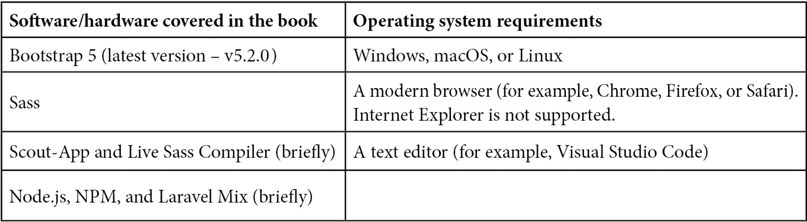

# 前言

Bootstrap 是世界上最受欢迎的前端 UI 工具包之一，它提供了使用组件、实用工具、JavaScript 插件等构建响应式网站的易于使用和现成的解决方案。您可以使用 Sass 定制 Bootstrap 5，以实现独特的外观布局，脱颖而出。学习如何定制 Bootstrap 5 使开发者能够创建出独特且不似 Bootstrap 的东西。

# 本书面向对象

本书旨在为熟悉 HTML 并已有一定 Bootstrap 版本 4 或 5 使用经验的 UI 设计师和开发者编写。这包括使用 Bootstrap 的前端和后端开发者，他们可能不知道如何编写 CSS，但对 HTML 了解足够。

默认 Bootstrap 文件的经验用户通过学习定制和其他高级功能，也可以从这本书中受益。

本书不会教授如何使用默认 Bootstrap 5 组件编写用户界面的基础知识。相反，本书是关于以各种方式定制 Bootstrap 5。

# 本书涵盖内容

*第一章*，*为什么要定制 Bootstrap 以及如何定制*，探讨了为什么我们想要定制 Bootstrap 5，可以定制什么（最重要的定制部分是什么），以及如何进行定制。

*第二章*，*使用和编译 Sass*，介绍了 Sass 是什么，我们将了解其特性和优势，如何使用它，如何将其编译成常规 CSS，以及 Bootstrap 5 使用的 Sass 功能。

*第三章*，*下载和探索 Bootstrap 5 Sass 文件*，展示了如何下载 Bootstrap 5，然后更详细地探讨了 Bootstrap 5 Sass 文件和 Sass 变量，包括它们的结构。

*第四章*，*Bootstrap 5 全局选项和颜色*，深入探讨了如何单独导入 Bootstrap 5 Sass 部分文件，如何更改全局选项，以及如何定制颜色。

*第五章*，*定制各种 Bootstrap 5 元素*，探讨了如何定制 Bootstrap 5 元素的视觉样式：布局、内容、表单、组件、辅助工具和实用工具。

*第六章*，*理解和使用 Bootstrap 5 实用 API*，探讨了如何使用实用 API 生成和添加新的简单和复杂实用工具，以及如何覆盖、修改和删除现有的实用工具。

*第七章*，*使用默认 Bootstrap 5 元素创建网站*，更详细地探讨了我们将要创建的网站，包括页面设置的描述、全局模块的描述以及页面类型的描述。

*第八章*，*使用 Bootstrap 5 变量、实用 API 和 Sass 定制网站*，展示了如何通过设置一些全局选项、定义自己的颜色、更改各种 Bootstrap 5 元素的样式以及使用实用 API 来定制我们的网站。

**第九章**，**使用 JavaScript 增强网站交互功能**，通过添加不同的交互功能，使用基于 JavaScript 的 Bootstrap 5 组件以及自定义 JavaScript 来改进我们的网站感觉。

**第十章**，**使用 Bootstrap 5 与高级 Sass 和 CSS 功能**，探讨了与 Bootstrap 5 相关的 Sass 和 CSS 高级功能，包括如何使用 Sass 混入、函数和扩展，如何使用 CSS 自定义属性，以及如何使用 RFS 插件。

**第十一章**，**使用 Bootstrap 5 与高级 JavaScript 功能**，探讨了可以与 Bootstrap 5 交互组件一起使用的 JavaScript 高级功能，包括初始化、选项、方法和事件。

**第十二章**，**优化 Bootstrap 5 CSS 和 JavaScript 代码**，深入探讨了如何通过指定我们使用的组件和删除未使用的辅助工具和实用程序来优化编译后的 CSS，以及如何使用模块打包器来优化 JavaScript 并最小化编译后的 CSS 和打包的 JavaScript。

# 为了充分利用本书

您需要有一些使用 Bootstrap 5（或可能是 Bootstrap 4）创建用户界面的经验。这意味着您应该知道如何使用 HTML 和所有正确的 Bootstrap 5 类和属性来创建各种 Bootstrap 5 组件，或者至少了解这一切是如何工作的。



**如果您使用的是本书的数字版，我们建议您自己输入代码或从本书的 GitHub 仓库（下一节中有一个链接）获取代码。这样做将帮助您避免与代码复制和粘贴相关的任何潜在错误。**

# 下载示例代码文件

您可以从 GitHub 下载本书的示例代码文件，网址为[`github.com/PacktPublishing/The-Missing-Bootstrap-5-Guide`](https://github.com/PacktPublishing/The-Missing-Bootstrap-5-Guide)。如果代码有更新，它将在 GitHub 仓库中更新。

我们还提供了一些来自我们丰富的图书和视频目录的代码包，可在[`github.com/PacktPublishing/`](https://github.com/PacktPublishing/)找到。查看它们！

# 下载彩色图像

我们还提供了一份包含本书中使用的截图和图表彩色图像的 PDF 文件。您可以从这里下载：[`packt.link/yXP75`](https://packt.link/yXP75)。

# 使用的约定

本书使用了多种文本约定。

`文本中的代码`: 表示文本中的代码单词、数据库表名、文件夹名、文件名、文件扩展名、路径名、虚拟 URL、用户输入和 Twitter 昵称。以下是一个示例：“我们首先导入一些配置文件，这样我们就可以使用`$spacer`变量作为其他变量的值，我们将在之后立即设置这些变量。”

代码块设置如下：

```js
// Required
```

```js
@import "../bootstrap/scss/functions";
```

```js
@import "../bootstrap/scss/variables";
```

```js
@import "../bootstrap/scss/maps";
```

```js
@import "../bootstrap/scss/mixins";
```

```js
@import "../bootstrap/scss/root";
```

当我们希望您注意代码块中的特定部分时，相关的行或项目将以粗体显示：

```js
// Modified variables
```

```js
$breadcrumb-bg: $gray-300;
```

```js
$breadcrumb-border-radius: $spacer;
```

```js
$breadcrumb-padding-y: $spacer;
```

```js
$breadcrumb-padding-x: $spacer;
```

```js
$breadcrumb-item-padding-x: $spacer;
```

```js
$breadcrumb-divider: quote("·");
```

任何命令行输入或输出都应如下所示：

```js
npm install bootstrap
```

**粗体**：表示新术语、重要单词或您在屏幕上看到的单词。例如，菜单或对话框中的单词以**粗体**显示。以下是一个示例：“页面标题全局模块用于所有页面，除了**主页**和**产品**页面。”

小贴士或重要注意事项

它看起来像这样。

# 联系我们

我们始终欢迎读者的反馈。

发送邮件至 `customercare@packtpub.com` 并在邮件主题中提及书名。

**勘误**：尽管我们已经尽最大努力确保内容的准确性，但错误仍然可能发生。如果您在这本书中发现了错误，我们将非常感激您向我们报告。请访问 [www.packtpub.com/support/errata](http://www.packtpub.com/support/errata) 并填写表格。

发送邮件至 `copyright@packt.com` 并附上材料的链接。

**如果您有兴趣成为作者**：如果您在某个领域有专业知识，并且您有兴趣撰写或为书籍做出贡献，请访问 [authors.packtpub.com.](http://authors.packtpub.com.)

# 分享您的想法

一旦您阅读了《缺失的 Bootstrap 5 指南》，我们非常想听听您的想法！请点击此处直接进入此书的亚马逊评论页面并分享您的反馈。

您的评论对我们和科技社区都非常重要，并将帮助我们确保我们提供高质量的内容。
