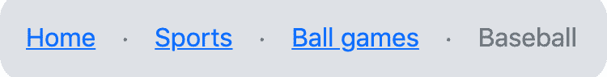
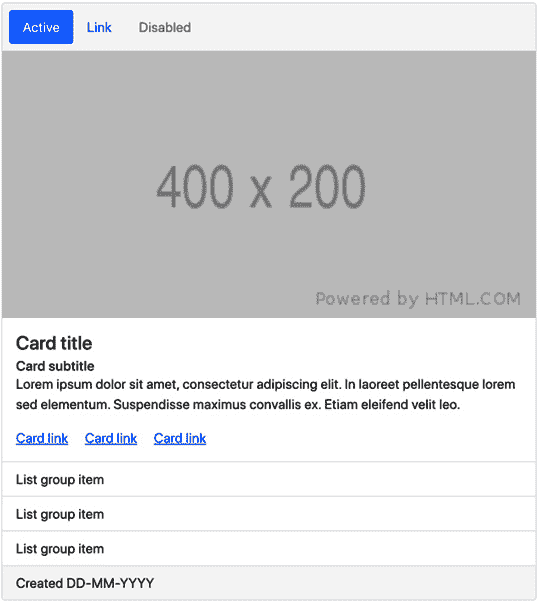
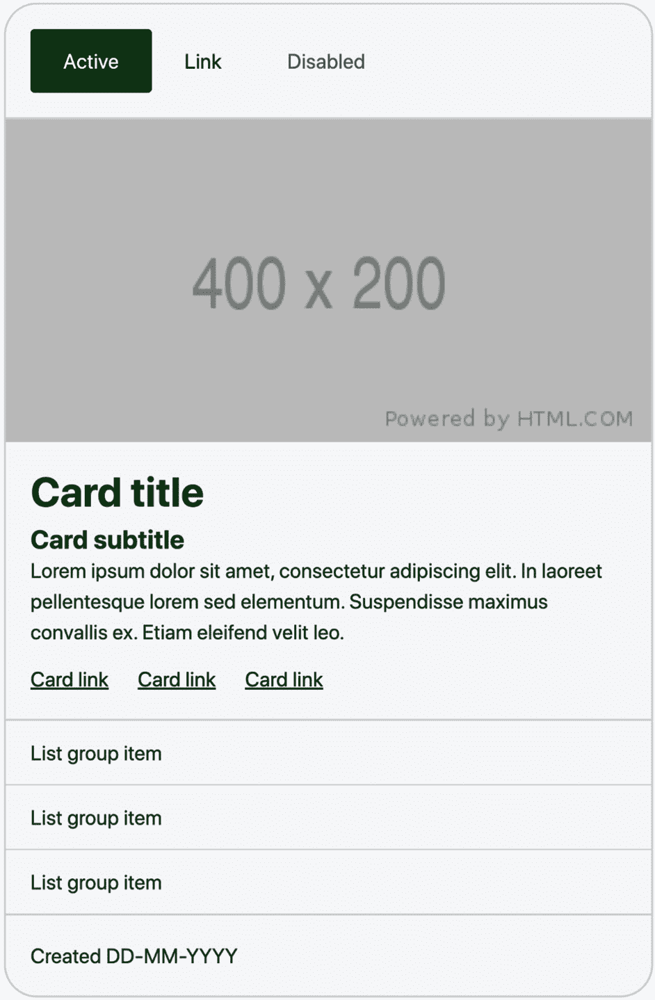
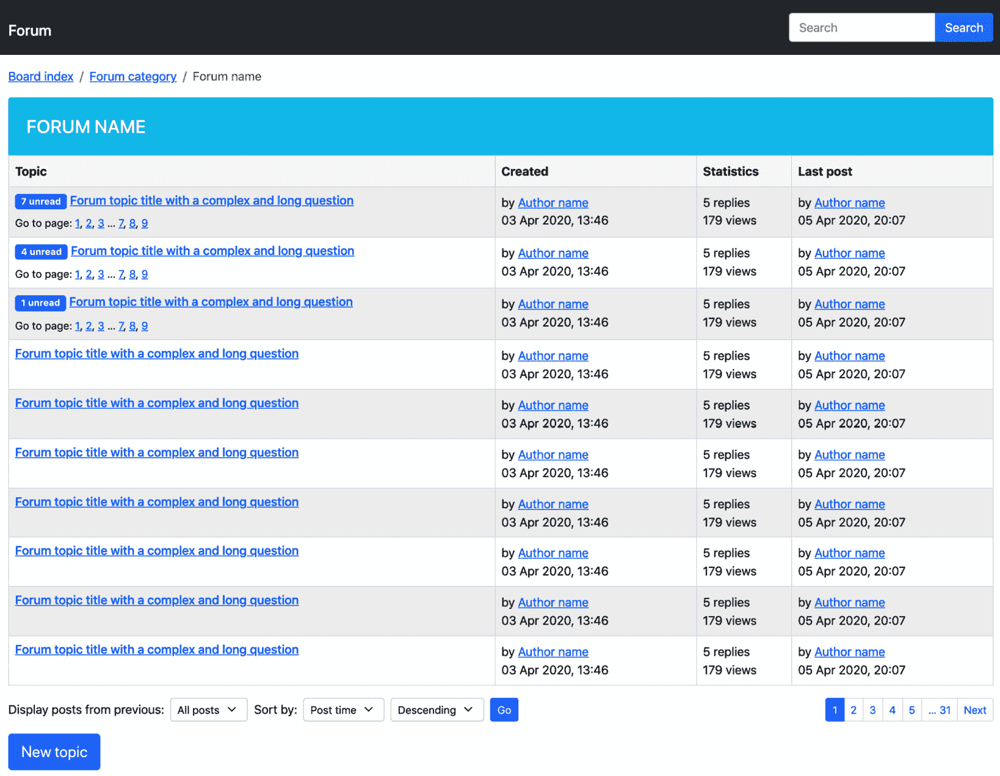
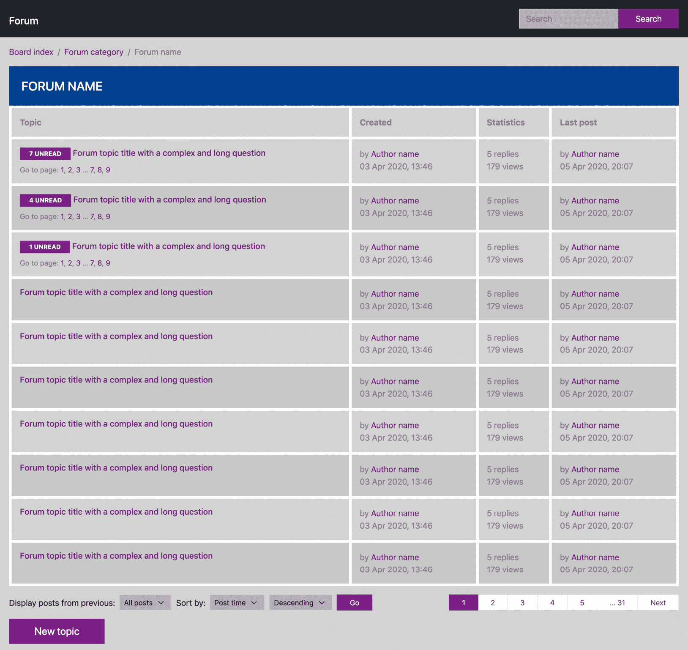
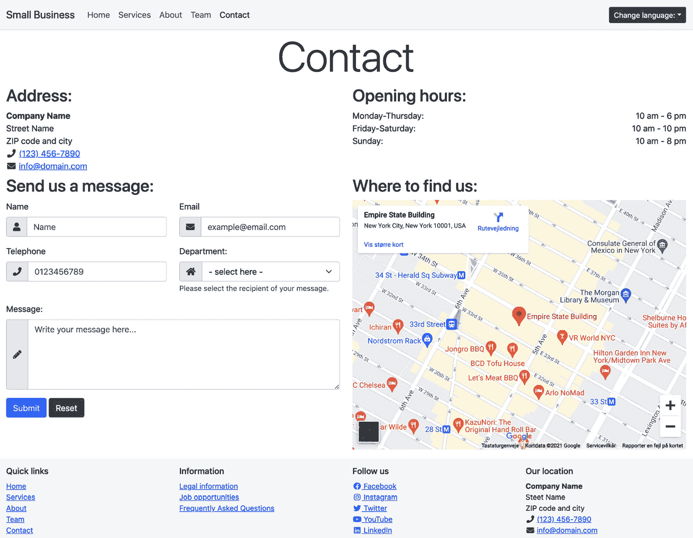
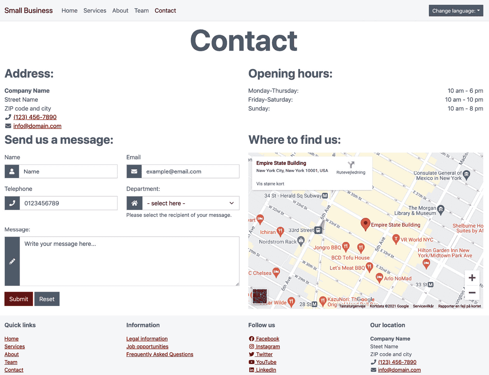
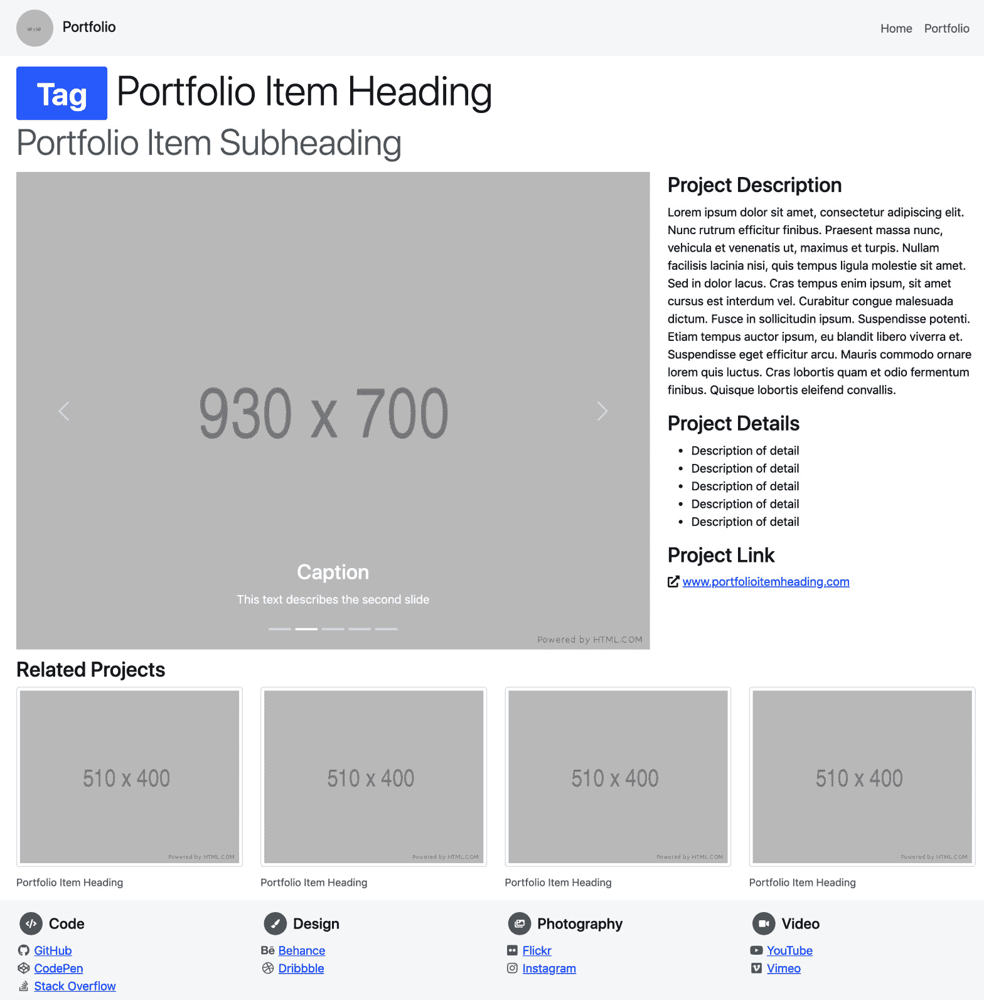
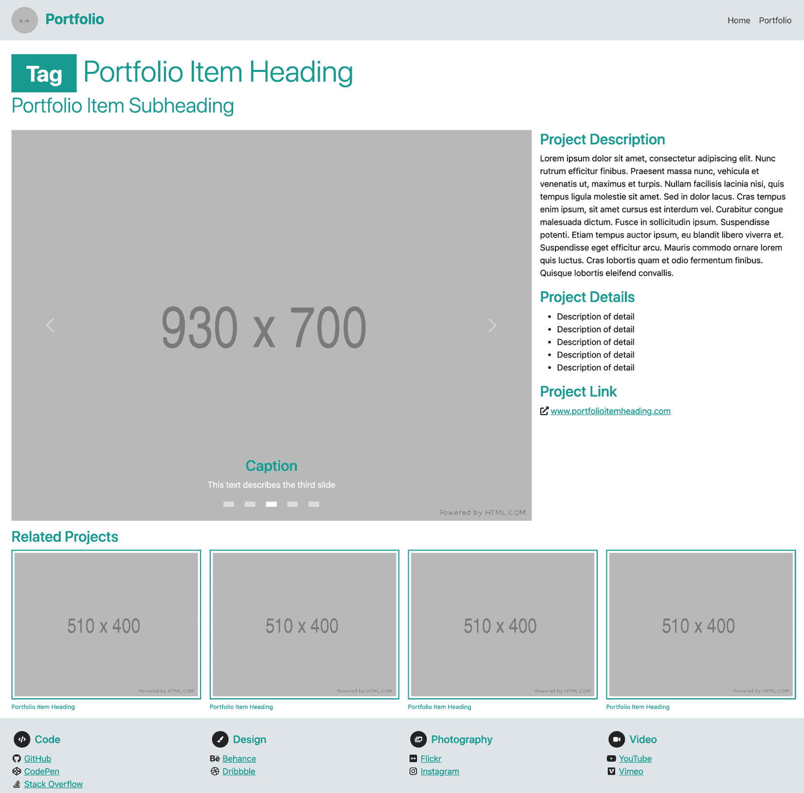

# 第一章：*第一章*: 为什么以及如何自定义 Bootstrap

Bootstrap 是一个开源的前端框架，用于快速设计、开发和自定义响应式、移动优先的网站。它具有灵活的网格系统，丰富的预构建可访问和交互式组件，以及许多有用的辅助工具和实用程序。

**Bootstrap** 为其所有组件提供了预定义的 CSS 样式。这些样式涵盖了从字体和颜色到大小和间距，以及断点、网格系统的选项等。Bootstrap 5 可以直接使用默认样式，但也以不同的方式进行了自定义。

在本章中，您将学习何时想要自定义 Bootstrap，可以自定义什么（以及最重要的自定义部分），以及如何进行自定义。在开始自定义 Bootstrap 之前了解这些内容很重要，因为这将使您更好地准备自定义正确的元素并选择正确的自定义方法。

在本章中，我们将涵盖以下主要主题：

+   我们应该在何时自定义 Bootstrap

+   可以自定义哪些元素？

+   我们如何自定义 Bootstrap 5

+   使用三种不同方法自定义的组件示例

+   使用自定义版本的 Bootstrap 5 的用户界面示例

Bootstrap 版本

本书以 Bootstrap 的最新版本 *v5.2.0* 为编写目标，本书中一般称为 Bootstrap 5。本书中描述的一些功能和技巧也可能适用于 Bootstrap 4，但可能不适用于 Bootstrap 3。

# 技术要求

+   用于预览示例的代码编辑器和浏览器

您可以在 GitHub 上找到本章的代码文件，网址为 [`github.com/PacktPublishing/The-Missing-Bootstrap-5-Guide`](https://github.com/PacktPublishing/The-Missing-Bootstrap-5-Guide)

# 我们应该在何时自定义 Bootstrap

当 Bootstrap 与预编译样式表一起使用时，它包含了所有与 Bootstrap 相关的默认颜色、字体、间距等。当您在自己的项目中使用这些样式时，除非您更改这些样式，否则项目看起来不可避免地会像 Bootstrap。如果您正在创建个人项目或内部使用项目，这可能不是问题。但如果你有特定的品牌指南，你的客户或用户通过这些指南来识别你，你可能需要更改这些样式以匹配你的品牌风格。由于 Bootstrap 在互联网上非常流行和广泛使用，有些人可能会识别默认的 Bootstrap 样式，除非您更改它们。这可能会对用户体验产生负面影响，因此对于专业用途，强烈建议自定义默认的 Bootstrap 样式。

# 可以自定义哪些元素？

Bootstrap 5 可以以多种方式轻松自定义。您可以在所有组件中自定义各种选项，如排版、颜色、间距、尺寸、边框半径、阴影等，还可以单独自定义所有不同的组件。您还可以以许多不同的方式自定义辅助工具和实用工具。无疑，最重要的自定义元素是调色板和排版，以确保它们与您的品牌相匹配。然后，其他方面可以进一步自定义，以符合您当前的品牌指南，或者只是将您的用户界面与使用默认 Bootstrap 样式的所有网站区分开来。

JavaScript 行为也可以自定义

您通常想自定义 Bootstrap 的样式，如前所述；然而，启用 JavaScript 的组件的行为也可以从默认值更改。虽然这对您的品牌感知并不重要，但它可能也是您需要考虑更改的内容。

# 我们如何自定义 Bootstrap 5

Bootstrap 5 可以使用三种不同的方法进行自定义：

+   直接编辑编译后的 Bootstrap **CSS**

+   用您自己的自定义样式覆盖 Bootstrap **CSS**

+   使用 **Sass** 自定义默认样式

现在我们将简要介绍这些方法。

Sass 是什么？

**Syntactically Awesome Style Sheets** (**Sass**) 是一种预处理器脚本语言，它被解释并编译成 **层叠样式表** (**CSS**)。Sass 通过变量、嵌套、部分、函数等扩展了 CSS 的默认功能。我们将在 *第二章*，*使用和编译 Sass* 中了解更多关于 Sass 的内容。

## 方法 1 – 直接编辑编译后的 Bootstrap CSS

您可以直接编辑编译后的 Bootstrap CSS 来实现所需的样式。这可能会相当复杂，具体取决于您想更改的内容，但最重要的是，这将使更新 Bootstrap 变得困难，因为如果您想更新到它的较新版本，您需要重新做出所有更改。这种方法不推荐使用。

## 方法 2 – 用您自己的自定义样式覆盖 Bootstrap CSS

您可以选择简单地用自己的自定义样式覆盖 Bootstrap CSS，但这会增加总 CSS 代码的大小，如果您想更改默认样式的许多方面，可能需要做很多工作。当更新到 Bootstrap 5 的新版本时，这种方法比上述第一种方法更容易维护，但如果 Bootstrap 5 中添加了新的组件或实用工具，这些将需要根据您的设计需求手动覆盖。如果您只需要更改调色板或出于某种原因无法使用 Sass 编译器来处理 Bootstrap 的原始源代码，这种方法可能适合您。然而，对于这本书，我们将学习如何使用 Sass 来自定义 Bootstrap 5。

## 方法 3 – 使用 Sass 自定义默认样式

如果您想要最大程度的控制和可能性，您应该使用 Sass 定制 Bootstrap。这需要一个 Sass 编译器，一些 Sass 语言的了解，以及 Bootstrap Sass 文件的知识。所有这些内容都将在接下来的两章中进行解释和演示。

使用 Sass 的一些优点是可以更改全局设置，只需在一个地方修改使用的颜色调色板和字体排印，并且可以轻松地定制组件。此外，它的工作方式也更加容易和快捷，而且编译后的文件大小可以优化以反映实际使用的元素和功能。出于这些原因，这是推荐用于定制 Bootstrap 5 的方法。

现在我们已经了解了我们可以定制 Bootstrap 的各种方法，让我们看看一个示例组件，它使用前面提到的三种不同方法之一进行定制。

# 使用三种不同方法定制的组件示例

在本节中，我们将看到如何使用上一节中解释的三个不同方法获得相同的视觉样式。我们将定制看起来像这样的 Bootstrap 默认 **面包屑** 组件：


图 1.1 – 默认的面包屑组件

我们将添加灰色背景色，所有角落的圆角，以及所有边框的填充。我们还将增加面包屑项的水平填充，并更改分隔符。定制版本的面包屑组件将看起来像这样：



图 1.2 – 定制的面包屑组件

无论您使用哪种方法来定制样式，此组件的 HTML 都大致相同。HTML 如下所示：

```js
<nav aria-label="Breadcrumb">
```

```js
  <ol class="breadcrumb">
```

```js
    <li class="breadcrumb-item"><a href="#">Home</a></li>
```

```js
    <li class="breadcrumb-item"><a href="#">Sports</a></li>
```

```js
    <li class="breadcrumb-item"><a href="#">Ball games</a>
```

```js
    </li>
```

```js
    <li class="breadcrumb-item active" 
```

```js
      aria-current="page">Baseball</li>
```

```js
  </ol>
```

```js
</nav>
```

前两种方法使用纯 CSS，不需要进一步解释。最后一个示例基于 Sass，如果您不熟悉 Sass，可能不太容易理解。然而，它包含在本章中，以展示使用这三种方法实现相同样式所需的代码差异。在下一章中，我将给出 Sass 的一般介绍以及 Bootstrap 如何使用 Sass。

## 方法 1 – 直接编辑编译后的 Bootstrap CSS

在以下内容中，我们看到的是编译和未压缩的 Bootstrap CSS 文件（`bootstrap.css` – 行 4494-4525）中找到的面包屑组件 CSS 的略微编辑版本。我们需要对这段代码进行修改以获得我们想要的特定样式，新属性用 `+` 符号突出显示，属性更改用 `*` 符号突出显示：

part-1/chapter-1/customization-methods/editing-css/css/bootstrap.css

```js
.breadcrumb {
```

```js
  --bs-breadcrumb-padding-x: 0;
```

```js
  --bs-breadcrumb-padding-y: 0;
```

```js
  --bs-breadcrumb-margin-bottom: 1rem;
```

```js
  --bs-breadcrumb-bg: ;
```

```js
  --bs-breadcrumb-border-radius: ;
```

```js
  --bs-breadcrumb-divider-color: #6c757d;
```

```js
  --bs-breadcrumb-item-padding-x: 0.5rem;
```

```js
  --bs-breadcrumb-item-active-color: #6c757d;
```

```js
  display: flex;
```

```js
  flex-wrap: wrap;
```

```js
  padding: var(--bs-breadcrumb-padding-y) 
```

```js
           var(--bs-breadcrumb-padding-x);
```

```js
  margin-bottom: var(--bs-breadcrumb-margin-bottom);
```

```js
  font-size: var(--bs-breadcrumb-font-size);
```

```js
  list-style: none;
```

```js
* background-color: var(--bs-gray-300);
```

```js
* border-radius: 1rem;
```

```js
+ padding: 1rem;
```

```js
}
```

```js
.breadcrumb-item + .breadcrumb-item {
```

```js
* padding-left: 1rem;
```

```js
}
```

```js
.breadcrumb-item + .breadcrumb-item::before {
```

```js
  float: left;
```

```js
* padding-right: 1rem;
```

```js
  color: var(--bs-breadcrumb-divider-color);
```

```js
* content: var(--bs-breadcrumb-divider, "·");
```

```js
}
```

```js
.breadcrumb-item.active {
```

```js
  color: var(--bs-breadcrumb-item-active-color);
```

```js
}
```

面包屑组件的分隔符是通过 `::before` 伪元素和 `content` 属性添加的，如前所述。我们将更改 `--bs-breadcrumb-divider` CSS 自定义属性之后的回退值，因为 Bootstrap 没有定义它。或者，我们可以在 HTML 中定义 CSS 自定义属性来更改分隔符，如下所示：

```js
<nav aria-label="Breadcrumb" 
```

```js
  style="--bs-breadcrumb-divider: '·';">
```

还可以直接将我们的新分隔符作为 `content` 属性的值添加，如下所示：

```js
content: '·';
```

我们将在*第十章*“使用高级 Sass 和 CSS 功能的 Bootstrap 5”中学习更多关于如何使用 CSS 自定义属性的内容。

## 方法 2 – 使用您自己的自定义样式覆盖 Bootstrap CSS

在这里，我们看到我们需要添加到页面中的自定义 CSS，以覆盖之前示例中显示的相同属性值：

part-1/chapter-1/customization-methods/overwriting-css/css/style.css

```js
.breadcrumb {
```

```js
  background-color: var(--bs-gray-300);
```

```js
  border-radius: 1rem;
```

```js
  padding: 1rem;
```

```js
}
```

```js
.breadcrumb-item + .breadcrumb-item {
```

```js
  padding-left: 1rem;
```

```js
}
```

```js
.breadcrumb-item + .breadcrumb-item::before {
```

```js
  padding-right: 1rem;
```

```js
  content: '·';
```

```js
}
```

如果您将此示例与上一个示例进行比较，您将看到我们正在添加/覆盖与之前添加/更改的完全相同的属性/值。

为了使这可行，请记住在 HTML 文件的 `<head>` 中在 Bootstrap 样式表之后引用您的样式表，如下所示：

part-1/chapter-1/customization-methods/overwriting-css/index.xhtml

```js
<link rel="stylesheet" href="../../../../bootstrap/dist/css/bootstrap.min.css">
```

```js
<link rel="stylesheet" href="css/style.css">
```

## 方法 3 – 使用 Sass 自定义默认样式

现在，我们将看到自定义 Bootstrap 的推荐方法，即使用新的 Bootstrap 变量的值编译 Sass 样式。这将给我们带来我们想要的视觉输出。

我们首先导入一些配置文件，以便我们可以使用 `$spacer` 变量作为其他变量的值，我们将立即设置这些变量。

在设置这些变量之后，我们将按照默认顺序导入一些其他必要的 Bootstrap 文件，最后，我们将导入面包屑组件。由于我们只关注此示例中需要包含的绝对必要的文件，因此我们无法使用生成的样式表中的其他 Bootstrap 组件、实用工具等： 

part-1/chapter-1/customization-methods/using-sass/scss/bootstrap.scss

```js
// Required
```

```js
@import "../../../../../bootstrap/scss/functions";
```

```js
@import "../../../../../bootstrap/scss/variables";
```

```js
@import "../../../../../bootstrap/scss/maps";
```

```js
@import "../../../../../bootstrap/scss/mixins";
```

```js
@import "../../../../../bootstrap/scss/root";
```

```js
// Modified variables
```

```js
$breadcrumb-bg: $gray-300;
```

```js
$breadcrumb-border-radius: $spacer;
```

```js
$breadcrumb-padding-y: $spacer;
```

```js
$breadcrumb-padding-x: $spacer;
```

```js
$breadcrumb-item-padding-x: $spacer;
```

```js
$breadcrumb-divider: quote("·");
```

```js
// Optional Bootstrap CSS
```

```js
@import "../../../../../bootstrap/scss/reboot";
```

```js
@import "../../../../../bootstrap/scss/breadcrumb";
```

此 Sass 需要由预处理器编译，我们将在下一章学习如何进行此操作。

如果我们将三种不同方法的代码进行比较，我们可以看到方法 3 是最简单且最容易理解的。我们只需声明一些易于理解的变量的值，而无需使用任何 CSS 选择器来完成此操作。这也可以用于 Bootstrap 的未来版本。方法 1 需要您每次想要使用 Bootstrap 5 的新版本时再次编辑编译后的 Bootstrap CSS，而方法 2，如果类名或 HTML 结构发生变化，代码可能需要为 Bootstrap 的未来版本进行更改。

# 使用 Bootstrap 5 定制版本的用户界面示例

在本节中，我们将看到四个使用 Bootstrap 5 定制版本的用户界面示例。对于每个示例，我们首先将看到使用默认 Bootstrap 5 样式的用户界面截图，然后是使用定制版本的 Bootstrap 5 的用户界面截图。随后将列出所进行的定制。我们将从一个简单的 UI 元素示例开始，以便更好地看到实际的变化，然后查看三个不同的全页示例。所有截图以及完整的定制示例都可以在本书的配套代码中找到，位于以下文件夹：`part-1/chapter-1/example-user-interfaces/`。我建议你在浏览这些示例和定制列表时查看这些内容，以便更好地理解实际的变化。

## 卡片组件

以下第一个示例，是一个 Bootstrap 5 的 `card` 组件。在组件内部，我们使用了 `nav` 和 `list group` 组件：



图 1.3 – 使用默认 Bootstrap 5 样式的卡片组件



图 1.4 – 使用 Bootstrap 5 定制版本的卡片组件

在此示例中，对以下 Bootstrap 5 进行了定制：

+   修改了全局设置，包括主要颜色、基本字体大小、标题和字体粗细

+   修改了卡片组件的颜色、背景颜色、字体大小、填充、边距、边框宽度和边框半径

+   修改了导航组件的填充

+   修改了列表组组件的颜色、背景颜色和填充

## 论坛

以下第二个示例，是从一个 *在线论坛* 模板中提取的常见论坛 UI。它使用了表格和各种 Bootstrap 5 组件，包括按钮、面包屑、徽章、下拉菜单和分页。



图 1.5 – 使用默认 Bootstrap 5 样式的论坛 UI



图 1.6 – 使用 Bootstrap 5 定制版本的论坛 UI

在此示例中，对以下 Bootstrap 5 进行了定制：

+   修改了全局设置，包括主要颜色、信息颜色和正文背景颜色

+   移除了链接的下划线

+   移除了所有边框半径

+   修改了输入元素的后台颜色

+   修改了表格的颜色、填充和边框

+   修改了按钮的水平填充

+   修改了分页的水平填充

+   修改了徽章的填充并添加了文本转换

## 联系页面

以下第三个例子，是一个从*小型企业网站*模板中提取的联系页面。它包含各种 Bootstrap 5 表单元素，包括输入组、文本输入、下拉菜单、文本区域和按钮。它还使用比例辅助类嵌入具有正确宽高比的 Google Maps 地图。



图 1.7 – 使用默认 Bootstrap 5 样式的联系页面 UI



图 1.8 – 使用定制版 Bootstrap 5 的联系页面 UI

在本例中，已对以下 Bootstrap 5 进行了进一步定制：

+   更改了主要和正文文本的全局设置

+   移除了按钮、下拉菜单、选择元素和输入元素上的边框半径

+   更改了输入组附加组件的颜色

+   将“4x3”比例辅助器更改为“3x2”

+   更改了标题的字体粗细和边距

## 投资组合

以下第四个也是最后一个例子，是一个从*投资组合*模板中提取的投资组合项目页面。它包含一个轮播图、图像缩略图和多种类型的排版。



图 1.9 – 使用默认 Bootstrap 5 样式的投资组合项目 UI



图 1.10 – 使用定制版 Bootstrap 5 的投资组合项目 UI

在本例中，已对以下 Bootstrap 5 进行了定制：

+   更改了主要和浅色全局设置

+   使用 Bootstrap 5 颜色函数生成主要颜色的较暗变体

+   使用全局选项禁用了所有元素的边框半径

+   增加了`xxl`断点的容器最大宽度

+   减少了网格间距宽度

+   更改了标题和低亮度的颜色

+   更改了用于小文本的字体大小

+   更改了导航栏的颜色和字体大小

+   更改了轮播图的指示器

+   更改了图像缩略图的边框

+   更改了图注的颜色和字体大小

## 本书中的更多定制

前面的四个例子仅展示了不同定制化的视觉影响以及变化的简要描述。在*第三章*，“下载和探索 Bootstrap 5 Sass 文件”，我们将学习制作类似变化所需的代码。稍后，在本书的*第二部分*中，我们将创建一个完整的网站项目的完全定制示例。

# 摘要

在本章中，我们学习了何时应考虑定制 Bootstrap，我们可以定制哪些元素，以及如何进行定制。我们还看到了四个不同的 Bootstrap 5 定制示例。我们现在更好地准备了对正确的元素进行定制并选择正确的定制方法。

在下一章中，你将学习 Sass。你将了解它的特性和优势，如何使用它，以及最后但同样重要的是，如何将其编译成浏览器可以解析的常规 CSS。
