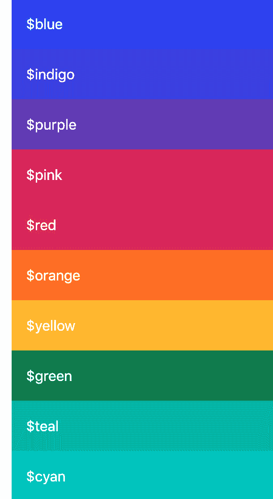

# 第四章：*第四章*：Bootstrap 5 全局选项和颜色

在本章中，我们将开始自定义 Bootstrap 5。在介绍一些关于代码示例的重要信息之后，我们将学习如何更改全局选项，然后如何自定义颜色。

更改全局选项和自定义颜色将对 Bootstrap 5 的许多元素产生影响，因此了解这类自定义很有用，因为它们可以为您节省大量时间。

在本章中，我们将讨论以下主题：

+   单独导入 Bootstrap 5 文件

+   更改全局选项

+   自定义颜色

# 技术要求

+   为了预览示例，您需要一个代码编辑器和浏览器。

+   您还需要一个 Sass 编译器来编译 Sass 文件到 CSS。请参阅*第二章*，*使用和编译 Sass*，了解不同的方法。

您可以在 GitHub 上找到本章的代码文件，链接为[`github.com/PacktPublishing/The-Missing-Bootstrap-5-Guide`](https://github.com/PacktPublishing/The-Missing-Bootstrap-5-Guide)。

# 关于代码示例

在本章中，我将提供从 Bootstrap 5 Sass 文件中摘取的代码示例。我将包括文件名和行号，这样您就可以更容易地找到特定的代码。

我对 Bootstrap 5 的代码进行了以下修改，以便您更好地了解：

+   原始 Bootstrap 5 源代码中的注释已被省略

+   在某些情况下，删除了变量名和其值之间的多余空格，但并非全部，以适应本书的布局并保持大多数内容在一行内

保留了空行，这样在 Bootstrap 5 源代码中更容易找到代码示例。

# 单独导入 Bootstrap 5 文件

在上一章中，我们看到了如何导入默认的 Bootstrap 5。当更改全局选项或覆盖任何默认变量（且不需要任何函数）时，这种方式导入 Bootstrap 5 是足够的。然而，为了有更细粒度的控制并能够以更高级的方式自定义 Bootstrap 5，我们需要单独导入 Bootstrap 5 的部分（其中一些需要按正确的顺序），并在 Bootstrap 5 部分之间适当的位置添加我们的自定义代码。

以下是单个 Bootstrap 5 部分的完整列表，以及放置我们自己的自定义代码的注释如下：

style.scss

```js
// Required
```

```js
@import "../../../../../bootstrap/scss/functions";
```

```js
// Default variable overrides
```

```js
// Required
```

```js
@import "../../../../../bootstrap/scss/variables";
```

```js
// Variable value using existing variable
```

```js
// Required
```

```js
@import "../../../../../bootstrap/scss/maps";
```

```js
@import "../../../../../bootstrap/scss/mixins";
```

```js
@import "../../../../../bootstrap/scss/root";
```

```js
// Optional Bootstrap CSS
```

```js
@import "../../../../../bootstrap/scss/reboot";
```

```js
@import "../../../../../bootstrap/scss/type";
```

```js
@import "../../../../../bootstrap/scss/images";
```

```js
@import "../../../../../bootstrap/scss/containers";
```

```js
@import "../../../../../bootstrap/scss/grid";
```

```js
@import "../../../../../bootstrap/scss/tables";
```

```js
@import "../../../../../bootstrap/scss/forms";
```

```js
@import "../../../../../bootstrap/scss/buttons";
```

```js
@import "../../../../../bootstrap/scss/transitions";
```

```js
@import "../../../../../bootstrap/scss/dropdown";
```

```js
@import "../../../../../bootstrap/scss/button-group";
```

```js
@import "../../../../../bootstrap/scss/nav";
```

```js
@import "../../../../../bootstrap/scss/navbar";
```

```js
@import "../../../../../bootstrap/scss/card";
```

```js
@import "../../../../../bootstrap/scss/accordion";
```

```js
@import "../../../../../bootstrap/scss/breadcrumb";
```

```js
@import "../../../../../bootstrap/scss/pagination";
```

```js
@import "../../../../../bootstrap/scss/badge";
```

```js
@import "../../../../../bootstrap/scss/alert";
```

```js
@import "../../../../../bootstrap/scss/progress";
```

```js
@import "../../../../../bootstrap/scss/list-group";
```

```js
@import "../../../../../bootstrap/scss/close";
```

```js
@import "../../../../../bootstrap/scss/toasts";
```

```js
@import "../../../../../bootstrap/scss/modal";
```

```js
@import "../../../../../bootstrap/scss/tooltip";
```

```js
@import "../../../../../bootstrap/scss/popover";
```

```js
@import "../../../../../bootstrap/scss/carousel";
```

```js
@import "../../../../../bootstrap/scss/spinners";
```

```js
@import "../../../../../bootstrap/scss/offcanvas";
```

```js
@import "../../../../../bootstrap/scss/placeholders";
```

```js
// Helpers
```

```js
@import "../../../../../bootstrap/scss/helpers";
```

```js
// Utilities
```

```js
@import "../../../../../bootstrap/scss/utilities";
```

```js
// Utilities API
```

```js
@import "../../../../../bootstrap/scss/utilities/api";
```

实用 API 和自定义样式

当我们想要使用实用 API 并包含我们自己的自定义样式时，前面的列表将略有扩展。我们将在*第六章**，理解和使用 Bootstrap 5 实用 API*，以及*第八章**，使用 Bootstrap 5 变量、实用 API 和 Sass 自定义网站*中分别看到如何做到这一点。

在那些需要我们单独导入 Bootstrap 5 部分的自定义示例中，我已经减少了在 `// Optional Bootstrap CSS` 注释下分组的长列表 Bootstrap 5 导入。这样做是为了使代码示例不会占用太多空间。以下是缩短后的列表：

style.scss

```js
// Optional Bootstrap CSS
```

```js
@import "../../../../../bootstrap/scss/reboot";
```

```js
@import "../../../../../bootstrap/scss/type";
```

```js
@import "../../../../../bootstrap/scss/images";
```

```js
// The long list of imports have been reduced here.
```

在本书的后面部分，我们还将看到如何通过仅包含我们需要的精确 Bootstrap 5 Sass 部分文件来优化我们的 CSS 代码。

现在我们已经了解了这些代码示例的更改，我们将开始自定义 Bootstrap 5。

# 修改全局选项

Bootstrap 5 提供了一套变量，用于启用或禁用样式和行为的不同全局选项。这些变量中的大多数可以在 `_variables.scss` 文件中找到，位于第 `337` 行至 `352` 行，除了 `$spacer` 变量，它位于第 `374` 行。

这里概述了不同可用的选项。它们按在 `_variables.scss` 文件中出现的顺序列出：

+   光标

+   圆角（border-radius）

+   阴影（box-shadow）

+   渐变

+   过渡效果

+   减速运动

+   平滑滚动

+   网格类

+   容器类

+   CSS 网格

+   按钮指针

+   响应式字体大小（RFS）

+   验证图标

+   负边距

+   废弃信息

+   重要工具

+   空格

我们现在将逐一介绍每个选项，并查看它们的变量名、默认值、定义位置、外观或功能，以及如何更改它们。对于每个选项，`part-1/chapter-4/options/` 文件夹中都会有代码示例，每个示例的 Sass 文件内容将在以下部分展示。

## 光标

`$enable-caret`

`true`

`_variables.scss`，第 `337` 行

此选项使下拉组件的切换按钮上的伪元素中放置的光标启用。

这里你可以看到启用或禁用此选项将呈现的样子：


图 4.1 – 启用光标选项的下拉按钮（默认）


图 4.2 – 禁用光标选项的下拉按钮（已更改）

要禁用光标选项，请使用以下 Sass 代码：

part-1/chapter-4/options/caret/scss/style.scss

```js
$enable-caret: false;
```

```js
@import "../../../../../bootstrap/scss/bootstrap.scss";
```

## 圆角

`$enable-rounded`

`true`

`_variables.scss`，第 `338` 行

此选项在各个组件上启用预定义的边框半径样式。

这里你可以看到启用或禁用此选项将呈现的几个不同示例：


图 4.3 – 启用圆角选项的按钮（默认）


图 4.4 – 禁用圆角选项的按钮（已更改）


图 4.5 – 启用圆角选项的文本输入（默认）


图 4.6 – 禁用圆角选项的文本输入（已更改）


图 4.7 – 启用圆角选项的警报组件（默认）


图 4.8 – 禁用圆角选项的警报组件（已更改）

要禁用圆角选项，请使用以下 Sass 代码：

part-1/chapter-4/options/rounded/scss/style.scss

```js
$enable-rounded: false;
```

```js
@import "../../../../../bootstrap/scss/bootstrap.scss";
```

## 阴影

`$enable-shadows`

`false`

`_variables.scss`，行 `339`

此选项在各个组件上启用预定义的装饰性 box-shadow 样式。

这里你可以看到启用或禁用此选项将呈现的几个不同示例：


图 4.9 – 禁用阴影选项的图像缩略图（默认）


图 4.10 – 启用阴影选项的图像缩略图（已更改）


图 4.11 – 禁用阴影选项的 Select 组件（默认）


图 4.12 – 启用阴影选项的 Select 组件（已更改）


图 4.13 – 禁用阴影选项的进度组件（默认）


图 4.14 – 启用阴影选项的进度组件（已更改）

要启用阴影选项，请使用以下 Sass 代码：

part-1/chapter-4/options/shadows/scss/style.scss

```js
$enable-shadows: true;
```

```js
@import "../../../../../bootstrap/scss/bootstrap.scss";
```

## 渐变

`$enable-gradients`

`false`

`_variables.scss`，行 `340`

此选项通过背景图像样式在各个组件上启用预定义的渐变。这种视觉效果非常微妙，可能难以看到。然而，以下 CSS 将被用于大多数兼容组件，以在背景颜色之上创建渐变效果：

```js
background-image: linear-gradient(180deg,
```

```js
  rgba(255,255,255,0.15), rgba(255,255,255,0));
```

在 `carousel` 组件上，将使用以下 CSS 代替：

```js
.carousel-control-prev {
```

```js
  background-image: linear-gradient(90deg,
```

```js
    rgba(0,0,0,0.25), rgba(0,0,0,0.001));
```

```js
}
```

```js
.carousel-control-next {
```

```js
  background-image: linear-gradient(270deg,
```

```js
    rgba(0,0,0,0.25), rgba(0,0,0,0.001));
```

```js
}
```

这里你可以看到启用或禁用此选项将呈现的几个不同示例：


图 4.15 – 禁用渐变选项的警报组件（默认）


图 4.16 – 启用渐变选项的警报组件（已更改）


图 4.17 – 禁用渐变选项的按钮（默认）


图 4.18 – 启用渐变选项的按钮（已更改）


图 4.19 – 禁用渐变选项的轮播组件（默认）


图 4.20 – 启用渐变选项的轮播组件（已更改）

要启用渐变选项，请使用以下 Sass 代码：

part-1/chapter-4/options/gradients/scss/style.scss

```js
$enable-gradients: true;
```

```js
@import "../../../../../bootstrap/scss/bootstrap.scss";
```

## 过渡

`$enable-transitions`

`true`

`_variables.scss`，第 `341` 行

此选项在各个组件上启用预定义的过渡效果。

在印刷品中无法展示示例，但过渡效果应用于手风琴、轮播图、模态框、进度条、浮动标签等。

要禁用过渡选项，请使用以下 Sass 代码：

part-1/chapter-4/options/transitions/scss/style.scss

```js
$enable-transitions: false;
```

```js
@import "../../../../../bootstrap/scss/bootstrap.scss";
```

## 减少运动

`$enable-reduced-motion`

`true`

`_variables.scss`，第 `342` 行

此选项启用 `prefers-reduced-motion` 媒体查询，根据用户的偏好移除或更改某些动画和过渡效果。

此选项适用于进度条和旋转器组件，要看到效果，您需要在计算机上更改一些设置。

要禁用减少运动选项，请使用以下 Sass 代码：

part-1/chapter-4/options/reduced-motion/scss/style.scss

```js
$enable-reduced-motion: false;
```

```js
@import "../../../../../bootstrap/scss/bootstrap.scss";
```

## 平滑滚动

`$enable-smooth-scroll`

`true`

`_variables.scss`，第 `343` 行

此选项全局启用平滑滚动行为，但不会影响偏好减少运动的用户。

要禁用平滑滚动选项，请使用以下 Sass 代码：

part-1/chapter-4/options/smooth-scroll/scss/style.scss

```js
$enable-smooth-scroll: false;
```

```js
@import "../../../../../bootstrap/scss/bootstrap.scss";
```

## 网格类

`$enable-grid-classes`

`true`

`_variables.scss`，第 `344` 行

此选项启用用于网格系统的 CSS 类的生成。这包括 `.row`、`.col` 和其他相关类。

要禁用网格类选项，请使用以下 Sass 代码：

part-1/chapter-4/options/grid-classes/scss/style.scss

```js
$enable-grid-classes: false;
```

```js
@import "../../../../../bootstrap/scss/bootstrap.scss";
```

## 容器类

`$enable-container-classes`

`true`

`_variables.scss`，第 `345` 行

此选项启用用于布局容器的 CSS 类的生成。这包括 `.container`、`.container-fluid` 和其他相关类。

要禁用容器类选项，请使用以下 Sass 代码：

part-1/chapter-4/options/container-classes/scss/style.scss

```js
$enable-container-classes: false;
```

```js
@import "../../../../../bootstrap/scss/bootstrap.scss";
```

## CSS 网格

`$enable-cssgrid`

`false`

`_variables.scss`，第 `346` 行

此选项用于启用基于 CSS 网格的独立网格系统。

如果您想启用此功能，您应该使用前面提到的网格类选项禁用默认网格系统。

要启用 CSS 网格选项，请使用以下 Sass 代码：

part-1/chapter-4/options/css-grid/scss/style.scss

```js
$enable-grid-classes: false;
```

```js
$enable-cssgrid: true;
```

```js
@import "../../../../../bootstrap/scss/bootstrap.scss";
```

## 按钮指针

`$enable-button-pointers`

`true`

`_variables.scss` 行 `347`

此选项为非禁用按钮元素和按钮组件（具有 `.btn` 类）添加指针光标。

在这里，您可以查看启用或禁用此选项将呈现的样子：


图 4.21 – 启用按钮指针选项的按钮（默认）


图 4.22 – 禁用按钮指针选项的按钮（已更改）

要禁用按钮指针选项，请使用以下 Sass 代码：

part-1/chapter-4/options/button-pointers/scss/style.scss

```js
$enable-button-pointers: false;
```

```js
@import "../../../../../bootstrap/scss/bootstrap.scss";
```

## 响应式字体大小

`$enable-rfs`

`true`

`_variables.scss` 行 `348`

此选项全局启用 RFS。您将在*第十章*“使用 Bootstrap 5 与高级 Sass 和 CSS 功能”中了解更多关于 RFS 以及如何使用它的信息。

要禁用 RFS 选项，请使用以下 Sass 代码：

part-1/chapter-4/options/responsive-font-sizes/scss/style.scss

```js
$enable-rfs: false;
```

```js
@import "../../../../../bootstrap/scss/bootstrap.scss";
```

## 验证图标

`$enable-validation-icons`

`true`

`_variables.scss` 行 `349`

此选项启用文本输入和某些自定义表单中的背景图像图标以用于验证状态。

在这里，您可以查看启用或禁用此选项将呈现的样子：


图 4.23 – 启用验证图标选项的默认有效文本输入


图 4.24 – 禁用验证图标选项的默认有效文本输入（已更改）


图 4.25 – 启用验证图标选项的默认无效文本输入


图 4.26 – 禁用验证图标选项的无效文本输入（已更改）

要禁用验证图标选项，请使用以下 Sass 代码：

part-1/chapter-4/options/validation-icons/scss/style.scss

```js
$enable-validation-icons: false;
```

```js
@import "../../../../../bootstrap/scss/bootstrap.scss";
```

## 负边距

`$enable-negative-margins`

`false`

`_variables.scss` 行 `350`

此选项启用生成负边距实用工具。

要启用负边距选项，请使用以下 Sass 代码：

part-1/chapter-4/options/negative-margins/scss/style.scss

```js
$enable-negative-margins: true;
```

```js
@import "../../../../../bootstrap/scss/bootstrap.scss";
```

## 弃用消息

`$enable-deprecation-messages`

`true`

`_variables.scss` 行 `351`

此选项启用 Sass 警告消息以显示已弃用的混入或函数。目前没有混入或函数被弃用，因此使用 Bootstrap 5 的此版本时，您不会遇到此警告消息。

要禁用弃用消息选项，请使用以下 Sass 代码：

part-1/chapter-4/options/deprecation-messages/scss/style.scss

```js
$enable-deprecation-messages: false;
```

```js
@import "../../../../../bootstrap/scss/bootstrap.scss";
```

此选项的代码示例有一个没有内容的 HTML 文件，因为此选项将只显示 Sass 警告消息，针对任何未来的已弃用混合或函数。

## 重要实用工具

`$enable-important-utilities`

`true`

`_variables.scss`，第 `352` 行

此选项启用实用类中的 `!important` 后缀。因此，此选项控制实用类 CSS 声明的值是否会在末尾添加 `!important` 并从而覆盖元素的所有先前样式。

以下是一个示例，展示了差异：

```js
// Important utilities enabled
```

```js
.text-center {
```

```js
  text-align: text-center !important;
```

```js
}
```

```js
// Important utilities disabled
```

```js
.text-center {
```

```js
  text-align: text-center;
```

```js
}
```

要禁用重要实用工具选项，请使用以下 Sass 代码：

part-1/chapter-4/options/important-utilities/scss/style.scss

```js
$enable-important-utilities: false;
```

```js
@import "../../../../../bootstrap/scss/bootstrap.scss";
```

## 间距

`$spacer`

`1rem`

`_variables.scss`，第 `374` 行

此变量指定了 `_variables.scss` 文件中许多其他组件变量（以及一些其他地方）使用的默认间距值。它还用于程序化生成间距实用工具。

在这里，您可以查看将此变量更改为 `2rem` 的示例：


图 4.27 – 设置为 1rem（默认）的间距警报组件


图 4.28 – 设置为 2rem（已更改）的间距警报组件


图 4.29 – 设置为 1rem（默认）的间距卡组件


图 4.30 – 设置为 2rem（已更改）的间距卡组件


图 4.31 – 设置为 1rem（默认）的间距实用工具


图 4.32 – 设置为 2rem（已更改）的间距实用工具

要将此变量的值更改为 `2rem`，请使用以下 Sass 代码：

part-1/chapter-4/options/spacer/scss/style.scss

```js
$spacer: 2rem;
```

```js
@import "../../../../../bootstrap/scss/bootstrap.scss";
```

现在我们已经了解了如何更改 Bootstrap 5 的全局选项，我们将继续学习如何自定义颜色。

# 自定义颜色

Bootstrap 5 拥有一个高级颜色系统，为所有元素提供正确的样式。这个颜色系统基于颜色变量，可以通过不同的方式自定义以匹配您的品牌或设计。

在本节中，我们将介绍以下主题：

+   颜色变量的概述

+   生成颜色类

+   向主题颜色添加颜色

+   从主题颜色中移除颜色

## 颜色变量的概述

`_variables.scss` 文件中的第一个许多变量是颜色变量。它们可以在第 `9`-`321` 行找到。

颜色系统按以下方式排序和分组：

+   灰色

+   常规颜色

+   颜色的色调和阴影

+   主题颜色

在这些组中的每一个，首先将单个颜色分配给不同的变量，然后这些变量被分配到 Sass 映射的键中，将这些相关颜色分组在一起。Sass 映射用于轻松遍历颜色列表。您可以在 Sass 映射中添加、删除或修改值，这将反映在许多组件中。我们将在本节后面看到一些示例。

但首先，我们将回顾之前列出的不同颜色组，并了解更多关于它们的颜色值、变量和 Sass 映射。

### 灰色

首先，我们有九种灰色色调和阴影，加上白色和黑色。行号、变量名称和默认值如下：

bootstrap/scss/_variables.scss

```js
 9 $white:    #fff !default;
```

```js
10 $gray-100: #f8f9fa !default;
```

```js
11 $gray-200: #e9ecef !default;
```

```js
12 $gray-300: #dee2e6 !default;
```

```js
13 $gray-400: #ced4da !default;
```

```js
14 $gray-500: #adb5bd !default;
```

```js
15 $gray-600: #6c757d !default;
```

```js
16 $gray-700: #495057 !default;
```

```js
17 $gray-800: #343a40 !default;
```

```js
18 $gray-900: #212529 !default;
```

```js
19 $black:    #000 !default;
```

这些颜色值代表以下实际颜色：


图 4.33 – 灰色加白色和黑色

这些变量（不包括 `$white` 和 `$black`）随后被分组到 `$grays` Sass 映射中：

bootstrap/scss/_variables.scss

```js
24 $grays: (
```

```js
25   "100": $gray-100,
```

```js
26   "200": $gray-200,
```

```js
27   "300": $gray-300,
```

```js
28   "400": $gray-400,
```

```js
29   "500": $gray-500,
```

```js
30   "600": $gray-600,
```

```js
31   "700": $gray-700,
```

```js
32   "800": $gray-800,
```

```js
33   "900": $gray-900
```

```js
34 ) !default;
```

### 常规颜色

然后，我们有 10 种不同的常规颜色。行号、变量名称和默认值如下：

bootstrap/scss/_variables.scss

```js
39 $blue:    #0d6efd !default;
```

```js
40 $indigo:  #6610f2 !default;
```

```js
41 $purple:  #6f42c1 !default;
```

```js
42 $pink:    #d63384 !default;
```

```js
43 $red:     #dc3545 !default;
```

```js
44 $orange:  #fd7e14 !default;
```

```js
45 $yellow:  #ffc107 !default;
```

```js
46 $green:   #198754 !default;
```

```js
47 $teal:    #20c997 !default;
```

```js
48 $cyan:    #0dcaf0 !default;
```

这些颜色值代表以下实际颜色：



图 4.34 – 常规颜色

然后，这 10 个常规颜色变量加上 `$black`、`$white`、`$gray-600` 和 `$gray-800` 被分组到 `$colors` Sass 映射中：

bootstrap/scss/_variables.scss

```js
52 $colors: (
```

```js
53   "blue":       $blue,
```

```js
54   "indigo":     $indigo,
```

```js
55   "purple":     $purple,
```

```js
56   "pink":       $pink,
```

```js
57   "red":        $red,
```

```js
58   "orange":     $orange,
```

```js
59   "yellow":     $yellow,
```

```js
60   "green":      $green,
```

```js
61   "teal":       $teal,
```

```js
62   "cyan":       $cyan,
```

```js
63   "black":      $black,
```

```js
64   "white":      $white,
```

```js
65   "gray":       $gray-600,
```

```js
66   "gray-dark":  $gray-800
```

```js
67 ) !default;
```

### 颜色色调和阴影

在常规颜色之后，我们有一个长列表的常规颜色色调和阴影的单独颜色变量，接着是一个 Sass 映射列表，将这些颜色分组在一起。

使用自定义颜色函数生成常规颜色的单独色调和阴影，以调色（变亮）或阴影（变暗）颜色（参见下一源代码）。Bootstrap 5 中内置的自定义颜色函数使用 Sass 的 `mix()` 颜色函数来创建所需的颜色。

例如，我们将查看蓝色色调和阴影。行号、变量名称和默认值如下：

bootstrap/scss/_variables.scss

```js
79 $blue-100: tint-color($blue, 80%) !default;
```

```js
80 $blue-200: tint-color($blue, 60%) !default;
```

```js
81 $blue-300: tint-color($blue, 40%) !default;
```

```js
82 $blue-400: tint-color($blue, 20%) !default;
```

```js
83 $blue-500: $blue !default;
```

```js
84 $blue-600: shade-color($blue, 20%) !default;
```

```js
85 $blue-700: shade-color($blue, 40%) !default;
```

```js
86 $blue-800: shade-color($blue, 60%) !default;
```

```js
87 $blue-900: shade-color($blue, 80%) !default;
```

在前面的代码中，您可以看到中间值 `$blue-500` 被分配给 `$blue` 颜色。比这更亮的值被调色，比这更暗的值使用自定义颜色函数进行阴影处理。

此列表之后是其他颜色（靛蓝、紫色、粉红色、红色、橙色、黄色、绿色、蓝绿色和青色）的类似列表，从第 179 行开始，我们有这些颜色的 Sass 映射。在蓝色颜色的情况下，Sass 映射看起来如下：

bootstrap/scss/_variables.scss

```js
179 $blues: (
```

```js
180   "blue-100": $blue-100,
```

```js
181   "blue-200": $blue-200,
```

```js
182   "blue-300": $blue-300,
```

```js
183   "blue-400": $blue-400,
```

```js
184   "blue-500": $blue-500,
```

```js
185   "blue-600": $blue-600,
```

```js
186   "blue-700": $blue-700,
```

```js
187   "blue-800": $blue-800,
```

```js
188   "blue-900": $blue-900
```

```js
189 ) !default;
```

### 主题颜色

最后，我们从灰色和常规颜色组中选择了颜色，现在它们被分配到八个不同的主题颜色变量中。这些通常也被称为*上下文颜色*。行号、变量名称和默认值如下：

bootstrap/scss/_variables.scss

```js
301 $primary:       $blue !default;
```

```js
302 $secondary:     $gray-600 !default;
```

```js
303 $success:       $green !default;
```

```js
304 $info:          $cyan !default;
```

```js
305 $warning:       $yellow !default;
```

```js
306 $danger:        $red !default;
```

```js
307 $light:         $gray-100 !default;
```

```js
308 $dark:          $gray-900 !default;
```

这些颜色值代表以下实际颜色：


图 4.35 – 主题颜色

这些颜色随后被分组到 `$theme-colors` Sass 映射中：

bootstrap/scss/_variables.scss

```js
312 $theme-colors: (
```

```js
313   "primary":    $primary,
```

```js
314   "secondary":  $secondary,
```

```js
315   "success":    $success,
```

```js
316   "info":       $info,
```

```js
317   "warning":    $warning,
```

```js
318   "danger":     $danger,
```

```js
319   "light":      $light,
```

```js
320   "dark":       $dark
```

```js
321 ) !default;
```

注意到 `$theme-colors` Sass 映射包含特定的主题颜色变量。没有更多，也没有更少。`$grays` Sass 映射没有包含 `$white` 和 `$black` 颜色变量，而 `$colors` Sass 映射也包括了 `$black`、`$white`、`$gray-600` 和 `$gray-800` 颜色变量。这只是为了告诉您这种差异存在。

我们现在完成了所有可用颜色变量和 Sass 映射的概述。现在让我们看看如何将这些用于不同的目的。

## 生成颜色类

如果需要，您可以使用内置的 `@each` 规则轻松生成更多颜色类。然后，您可以遍历 Sass 映射中的键/值对，并定义要使用的类前缀。

这是遍历 Sass 映射的 `@each` 规则的语法：

```js
@each $key, $value in $map {
```

```js
  .class-prefix-#{$key} {
```

```js
    css-property: $value;
```

```js
  }
```

```js
}
```

如您所见，键被分配到 `@each` 表达式中的第一个变量名称，值被分配到第二个。然后使用 `$key` 与所选类前缀一起使用，而 `$value` 用于设置 CSS 属性的值。

我们现在将看到如何使用 `@each` 规则生成不同的颜色类组。

在导入所需文件后放置的自定义 Sass 代码

在大多数剩余的代码示例中，我们的自定义 Sass 代码放置在导入所需文件（包括 `_variables.scss` 文件）之后，并在导入可选的 Bootstrap 文件之前。当我们想要将现有变量作为另一个变量的值时，这是必要的，这种情况是我们想要根据现有的颜色变量生成颜色类。

### 灰色

从 `$grays` Sass 映射中生成背景颜色类，您需要使用以下 Sass 代码：

part-1/chapter-4/colors/grays/scss/style.scss

```js
// Required
```

```js
@import "../../../../../bootstrap/scss/functions";
```

```js
@import "../../../../../bootstrap/scss/variables";
```

```js
// Create background color classes from the "$grays" color map
```

```js
@each $color, $value in $grays {
```

```js
  .bg-gray-#{$color} {
```

```js
    background-color: $value;
```

```js
  }
```

```js
}
```

```js
// Required
```

```js
@import "../../../../../bootstrap/scss/maps";
```

```js
@import "../../../../../bootstrap/scss/mixins";
```

```js
@import "../../../../../bootstrap/scss/root";
```

```js
// Optional Bootstrap CSS
```

```js
@import "../../../../../bootstrap/scss/reboot";
```

```js
@import "../../../../../bootstrap/scss/type";
```

```js
@import "../../../../../bootstrap/scss/images";
```

```js
// The long list of imports have been reduced here.
```

```js
// Helpers
```

```js
@import "../../../../../bootstrap/scss/helpers";
```

```js
// Utilities
```

```js
@import "../../../../../bootstrap/scss/utilities";
```

```js
// Utilities API
```

```js
@import "../../../../../bootstrap/scss/utilities/api";
```

当您编译此代码时，您将得到常规的 Bootstrap CSS 以及以下背景颜色类：

part-1/chapter-4/colors/grays/css/style.css

```js
.bg-gray-100 { background-color: #f8f9fa; }
```

```js
.bg-gray-200 { background-color: #e9ecef; }
```

```js
.bg-gray-300 { background-color: #dee2e6; }
```

```js
.bg-gray-400 { background-color: #ced4da; }
```

```js
.bg-gray-500 { background-color: #adb5bd; }
```

```js
.bg-gray-600 { background-color: #6c757d; }
```

```js
.bg-gray-700 { background-color: #495057; }
```

```js
.bg-gray-800 { background-color: #343a40; }
```

```js
.bg-gray-900 { background-color: #212529; }
```

此代码可以使用以下 HTML 进行测试：

part-1/chapter-4/colors/grays/index.xhtml

```js
<div class="bg-gray-100">.bg-gray-100</div>
```

```js
<div class="bg-gray-200">.bg-gray-200</div>
```

```js
<div class="bg-gray-300">.bg-gray-300</div>
```

```js
<div class="bg-gray-400">.bg-gray-400</div>
```

```js
<div class="bg-gray-500">.bg-gray-500</div>
```

```js
<div class="bg-gray-600">.bg-gray-600</div>
```

```js
<div class="bg-gray-700">.bg-gray-700</div>
```

```js
<div class="bg-gray-800">.bg-gray-800</div>
```

```js
<div class="bg-gray-900">.bg-gray-900</div>
```

### 常规颜色

从 `$colors` Sass 映射中生成背景颜色类，您需要使用以下 Sass 代码：

part-1/chapter-4/colors/regular-colors/scss/style.scss

```js
// Required
```

```js
@import "../../../../../bootstrap/scss/functions";
```

```js
@import "../../../../../bootstrap/scss/variables";
```

```js
// Create background color classes from the "$grays" color map
```

```js
@each $color, $value in $colors {
```

```js
  .bg-#{$color} {
```

```js
    background-color: $value;
```

```js
  }
```

```js
}
```

```js
// Required
```

```js
@import "../../../../../bootstrap/scss/maps";
```

```js
@import "../../../../../bootstrap/scss/mixins";
```

```js
@import "../../../../../bootstrap/scss/root";
```

```js
// Optional Bootstrap CSS
```

```js
@import "../../../../../bootstrap/scss/reboot";
```

```js
@import "../../../../../bootstrap/scss/type";
```

```js
@import "../../../../../bootstrap/scss/images";
```

```js
// The long list of imports have been reduced here.
```

```js
// Helpers
```

```js
@import "../../../../../bootstrap/scss/helpers";
```

```js
// Utilities
```

```js
@import "../../../../../bootstrap/scss/utilities";
```

```js
// Utilities API
```

```js
@import "../../../../../bootstrap/scss/utilities/api";
```

当您编译此代码时，您将得到常规的 Bootstrap CSS 以及以下背景颜色类：

part-1/chapter-4/colors/regular-colors/css/style.css

```js
.bg-blue { background-color: #0d6efd; }
```

```js
.bg-indigo { background-color: #6610f2; }
```

```js
.bg-purple { background-color: #6f42c1; }
```

```js
.bg-pink { background-color: #d63384; }
```

```js
.bg-red { background-color: #dc3545; }
```

```js
.bg-orange { background-color: #fd7e14; }
```

```js
.bg-yellow { background-color: #ffc107; }
```

```js
.bg-green { background-color: #198754; }
```

```js
.bg-teal { background-color: #20c997; }
```

```js
.bg-cyan { background-color: #0dcaf0; }
```

```js
.bg-dark { background-color: #000; }
```

```js
.bg-white { background-color: #fff; }
```

```js
.bg-gray { background-color: #6c757d; }
```

```js
.bg-gray-dark { background-color: #343a40; }
```

此代码可以使用以下 HTML 进行测试：

part-1/chapter-4/colors/regular-colors/index.xhtml

```js
<div class="bg-blue">.bg-blue</div>
```

```js
<div class="bg-indigo">.bg-indigo</div>
```

```js
<div class="bg-purple">.bg-purple</div>
```

```js
<div class="bg-pink">.bg-pink</div>
```

```js
<div class="bg-red">.bg-red</div>
```

```js
<div class="bg-orange">.bg-orange</div>
```

```js
<div class="bg-yellow">.bg-yellow</div>
```

```js
<div class="bg-green">.bg-green</div>
```

```js
<div class="bg-teal">.bg-teal</div>
```

```js
<div class="bg-cyan">.bg-cyan</div>
```

```js
<div class="bg-dark">.bg-dark</div>
```

```js
<div class="bg-white">.bg-white</div>
```

```js
<div class="bg-gray">.bg-gray</div>
```

```js
<div class="bg-gray-dark">.bg-gray-dark</div>
```

### 蓝色的色调和阴影

要从 `$blues` Sass 映射生成背景颜色类，您需要使用以下 Sass 代码：

part-1/chapter-4/colors/tints-and-shades/scss/style.scss

```js
// Required
```

```js
@import "../../../../../bootstrap/scss/functions";
```

```js
@import "../../../../../bootstrap/scss/variables";
```

```js
// Create background color classes from the "$grays" color 
```

```js
// map
```

```js
@each $color, $value in $blues {
```

```js
  .bg-#{$color} {
```

```js
    background-color: $value;
```

```js
  }
```

```js
}
```

```js
// Required
```

```js
@import "../../../../../bootstrap/scss/maps";
```

```js
@import "../../../../../bootstrap/scss/mixins";
```

```js
@import "../../../../../bootstrap/scss/root";
```

```js
// Optional Bootstrap CSS
```

```js
@import "../../../../../bootstrap/scss/reboot";
```

```js
@import "../../../../../bootstrap/scss/type";
```

```js
@import "../../../../../bootstrap/scss/images";
```

```js
// The long list of imports have been reduced here.
```

```js
// Helpers
```

```js
@import "../../../../../bootstrap/scss/helpers";
```

```js
// Utilities
```

```js
@import "../../../../../bootstrap/scss/utilities";
```

```js
// Utilities API
```

```js
@import "../../../../../bootstrap/scss/utilities/api";
```

当您编译此代码时，您将得到常规的 Bootstrap CSS 以及以下背景颜色类：

part-1/chapter-4/colors/tints-and-shades/css/style.css

```js
.bg-blue-100 { background-color: #cfe2ff; }
```

```js
.bg-blue-200 { background-color: #9ec5fe; }
```

```js
.bg-blue-300 { background-color: #6ea8fe; }
```

```js
.bg-blue-400 { background-color: #3d8bfd; }
```

```js
.bg-blue-500 { background-color: #0d6efd; }
```

```js
.bg-blue-600 { background-color: #0a58ca; }
```

```js
.bg-blue-700 { background-color: #084298; }
```

```js
.bg-blue-800 { background-color: #052c65; }
```

```js
.bg-blue-900 { background-color: #031633; }
```

以下 HTML 可以用于测试此代码：

part-1/chapter-4/colors/tints-and-shades/index.xhtml

```js
<div class="bg-blue-100">.bg-blue-100</div>
```

```js
<div class="bg-blue-200">.bg-blue-200</div>
```

```js
<div class="bg-blue-300">.bg-blue-300</div>
```

```js
<div class="bg-blue-400">.bg-blue-400</div>
```

```js
<div class="bg-blue-500">.bg-blue-500</div>
```

```js
<div class="bg-blue-600">.bg-blue-600</div>
```

```js
<div class="bg-blue-700">.bg-blue-700</div>
```

```js
<div class="bg-blue-800">.bg-blue-800</div>
```

```js
<div class="bg-blue-900">.bg-blue-900</div>
```

### 混合颜色

您还可以创建一个新的自定义 Sass 映射，其中指定了混合颜色作为颜色变量或其他有效的颜色值，并使用以下 Sass 代码基于此生成颜色类：

part-1/chapter-4/colors/mixed-colors/scss/style.scss

```js
// Required
```

```js
@import "../../../../../bootstrap/scss/functions";
```

```js
@import "../../../../../bootstrap/scss/variables";
```

```js
// Create a new "$mixed-colors" map
```

```js
$mixed-colors: (
```

```js
  "blue": $blue,
```

```js
  "green": green,
```

```js
  "red": #f00,
```

```js
  "primary": $primary
```

```js
);
```

```js
// Create color classes from the "$mixed-colors" map
```

```js
@each $color, $value in $mixed-colors {
```

```js
  .bg-#{$color} {
```

```js
    background-color: $value;
```

```js
  }
```

```js
}
```

```js
// Required
```

```js
@import "../../../../../bootstrap/scss/maps";
```

```js
@import "../../../../../bootstrap/scss/mixins";
```

```js
@import "../../../../../bootstrap/scss/root";
```

```js
// Optional Bootstrap CSS
```

```js
@import "../../../../../bootstrap/scss/reboot";
```

```js
@import "../../../../../bootstrap/scss/type";
```

```js
@import "../../../../../bootstrap/scss/images";
```

```js
// The long list of imports have been reduced here.
```

```js
// Helpers
```

```js
@import "../../../../../bootstrap/scss/helpers";
```

```js
// Utilities
```

```js
@import "../../../../../bootstrap/scss/utilities";
```

```js
// Utilities API
```

```js
@import "../../../../../bootstrap/scss/utilities/api";
```

当您编译此代码时，您将得到常规的 Bootstrap CSS 以及以下背景颜色类：

part-1/chapter-4/colors/mixed-colors/css/style.css

```js
.bg-blue { background-color: #0d6efd; }
```

```js
.bg-green { background-color: green; }
```

```js
.bg-red { background-color: #f00; }
```

```js
.bg-primary { background-color: #0d6efd; }
```

以下 HTML 可以用于测试此代码：

part-1/chapter-4/colors/mixed-colors/index.xhtml

```js
<div class="bg-blue">.bg-blue</div>
```

```js
<div class="bg-green">.bg-green</div>
```

```js
<div class="bg-red">.bg-red</div>
```

```js
<div class="bg-primary">.bg-primary</div>
```

## 向主题颜色添加颜色

Bootstrap 5 有八种主题颜色，这些颜色用于组件变化、辅助工具、实用工具等。您可以向 `$theme-colors` Sass 映射中添加更多颜色，该映射用于生成这些不同的变体。为此，我们首先创建一个新的 Sass 映射，其中包含新的键名和相应的值（可以是现有的颜色变量或任何其他有效的颜色值）：

```js
// Create your own color map
```

```js
$custom-colors: (
```

```js
  "tertiary": $indigo,
```

```js
  "quaternary": $purple,
```

```js
  "quinary": $pink,
```

```js
  "senary": $orange,
```

```js
  "septenary": $teal
```

```js
);
```

然后，我们将使用 Sass 中的 `sass:map` 模块的 `map-merge()` 函数将此 `$custom-colors` Sass 映射与现有的 `$theme-colors` Sass 映射合并。我们将要合并的两个映射作为参数传递，返回值将存储在 `$theme-colors` 变量中。这将覆盖默认的 `$theme-colors` 变量，该变量包含默认的主题颜色，从而增加我们可用的主题颜色列表。合并这两个映射的代码如下：

```js
// Merge "$theme-colors" map and "$custom-colors" map
```

```js
$theme-colors: map-merge($theme-colors, $custom-colors);
```

用于此场景的完整 Sass 代码如下：

part-1/chapter-4/colors/add-to-theme-colors/scss/style.scss

```js
// Required
```

```js
@import "../../../../../bootstrap/scss/functions";
```

```js
@import "../../../../../bootstrap/scss/variables";
```

```js
// Create your own color map
```

```js
$custom-colors: (
```

```js
  "tertiary": $indigo,
```

```js
  "quaternary": $purple,
```

```js
  "quinary": $pink,
```

```js
  "senary": $orange,
```

```js
  "septenary": $teal
```

```js
);
```

```js
// Merge "$theme-colors" map and "$custom-colors" map
```

```js
$theme-colors: map-merge($theme-colors, $custom-colors);
```

```js
// Required
```

```js
@import "../../../../../bootstrap/scss/maps";
```

```js
@import "../../../../../bootstrap/scss/mixins";
```

```js
@import "../../../../../bootstrap/scss/root";
```

```js
// Optional Bootstrap CSS
```

```js
@import "../../../../../bootstrap/scss/reboot";
```

```js
@import "../../../../../bootstrap/scss/type";
```

```js
@import "../../../../../bootstrap/scss/images";
```

```js
// The long list of imports have been reduced here.
```

```js
// Helpers
```

```js
@import "../../../../../bootstrap/scss/helpers";
```

```js
// Utilities
```

```js
@import "../../../../../bootstrap/scss/utilities";
```

```js
// Utilities API
```

```js
@import "../../../../../bootstrap/scss/utilities/api";
```

现在，我们将看到所有这些主题颜色看起来如何，以及一些新主题颜色在各个组件和实用工具中如何生效的示例：


图 4.36 – 所有颜色作为背景颜色实用工具显示


图 4.37 – 所有颜色作为文本颜色实用工具显示


图 4.38 – 带有新三级颜色的警告组件


图 4.39 – 带有新四级颜色的按钮组件


图 4.40 – 带有新五级颜色的列表组组件


图 4.41 – 带有新六进制颜色拉伸链接辅助类的实用类


图 4.42 – 带有新七进制颜色的边框实用类

本例的完整代码可以在 `part-1/chapter-4/colors/add-to-theme-colors` 文件夹中找到。

## 从主题颜色中移除颜色

要从主题颜色中移除颜色，我们可以使用 Sass 的 `sass:map` 模块中内置的 `map-remove()` 函数。作为此函数的参数，我们传入我们想要从中移除键/值对的映射，然后是我们要移除的键/值对的键。返回值将存储在 `$theme-colors` 变量中。这将然后覆盖默认的 `$theme-colors` 变量，该变量包含默认的主题颜色，因此，我们的可用主题颜色列表将减少。

从 `$theme-colors` 映射中移除主题颜色的代码如下：

part-1/chapter-4/colors/remove-from-theme-colors/scss/style.scss

```js
// Required
```

```js
@import "../../../../../bootstrap/scss/functions";
```

```js
@import "../../../../../bootstrap/scss/variables";
```

```js
// Remove from "$theme-colors" map
```

```js
$theme-colors: map-remove($theme-colors, "info", "light", 
```

```js
                          "dark");
```

```js
// Required
```

```js
@import "../../../../../bootstrap/scss/maps";
```

```js
@import "../../../../../bootstrap/scss/mixins";
```

```js
@import "../../../../../bootstrap/scss/root";
```

```js
// Optional Bootstrap CSS
```

```js
@import "../../../../../bootstrap/scss/reboot";
```

```js
@import "../../../../../bootstrap/scss/type";
```

```js
@import "../../../../../bootstrap/scss/images";
```

```js
// The long list of imports have been reduced here.
```

```js
// Helpers
```

```js
@import "../../../../../bootstrap/scss/helpers";
```

```js
// Utilities
```

```js
@import "../../../../../bootstrap/scss/utilities";
```

```js
// Utilities API
```

```js
@import "../../../../../bootstrap/scss/utilities/api";
```

编译此代码后，我们将无法为任何组件变体、辅助类或工具使用 `info`、`light` 和 `dark` 颜色。

本例的完整代码可以在 `part-1/chapter-4/colors/remove-from-theme-colors` 文件夹中找到。

## 定义自定义颜色调色板

为了完成关于 Bootstrap 5 中颜色的这一部分，我们将学习如何定义一个自定义颜色调色板。这相当简单。首先，我们定义我们想要更改的主题颜色变量的自定义颜色值，然后我们导入 Bootstrap 5 所需的文件，最后，我们从 `$theme-colors` 映射中移除任何不需要的主题颜色。这样做很重要，因为我们首先想要定义自己的颜色值给颜色变量，然后想要修改位于 `_variables.scss` 文件中的 `$theme-colors` 映射。

在我们的例子中，我们想要更改 `$primary`、`$success`、`$info`、`$warning` 和 `$danger` 主题颜色变量的颜色值，并移除 `$secondary` 主题颜色。

必需的主题颜色键

一些主题颜色键是必需的，不能移除，否则会导致错误，因为它们被其他组件的 Sass 代码所使用。这包括 `primary`、`success` 和 `danger` 键。您可以替换这些键的值，但不能移除这些键本身。`secondary` 键不是必需的，因此可以移除而不会导致后续出现任何错误。

接下来，您将看到实现此目的所需的代码。请注意，我们必须在导入 Bootstrap 5 所需的文件之前指定主题颜色变量的自定义值：

part-1/chapter-4/colors/custom-color-palette/scss/style.scss

```js
// Required
```

```js
@import "../../../../../bootstrap/scss/functions";
```

```js
// Define color palette
```

```js
$primary:       #264653;
```

```js
$success:       #2A9D8F;
```

```js
$info:          #E9C46A;
```

```js
$warning:       #F4A261;
```

```js
$danger:        #E76F51;
```

```js
// Required
```

```js
@import "../../../../../bootstrap/scss/variables";
```

```js
// Remove "secondary" from "$theme-colors" map
```

```js
$theme-colors: map-remove($theme-colors, "secondary");
```

```js
// Required
```

```js
@import "../../../../../bootstrap/scss/maps";
```

```js
@import "../../../../../bootstrap/scss/mixins";
```

```js
@import "../../../../../bootstrap/scss/root";
```

```js
// Optional Bootstrap CSS
```

```js
@import "../../../../../bootstrap/scss/reboot";
```

```js
@import "../../../../../bootstrap/scss/type";
```

```js
@import "../../../../../bootstrap/scss/images";
```

```js
// The long list of imports have been reduced here.
```

```js
// Helpers
```

```js
@import "../../../../../bootstrap/scss/helpers";
```

```js
// Utilities
```

```js
@import "../../../../../bootstrap/scss/utilities";
```

```js
// Utilities API
```

```js
@import "../../../../../bootstrap/scss/utilities/api";
```

编译此代码后，Bootstrap 5 将现在使用以下颜色调色板：


图 4.43 – 我们自定义的颜色调色板以背景颜色实用工具的形式显示


图 4.44 – 我们自定义的颜色调色板以文本颜色实用工具的形式显示

本例的完整代码可以在`part-1/chapter-4/colors/custom-color-palette`文件夹中找到。

# 摘要

在本章中，我们学习了有关 Bootstrap 5 的全局选项以及如何更改它们。我们还学习了如何自定义 Bootstrap 5 的颜色，包括如何生成颜色类以及如何添加和移除用作主题颜色的颜色。

在下一章中，我们将学习如何自定义 Bootstrap 5 的各种元素。
