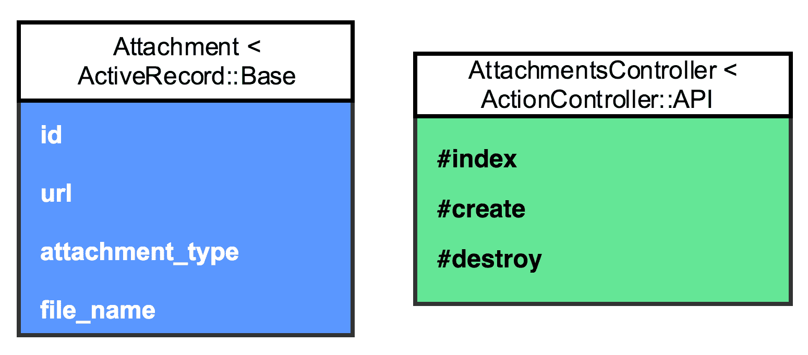
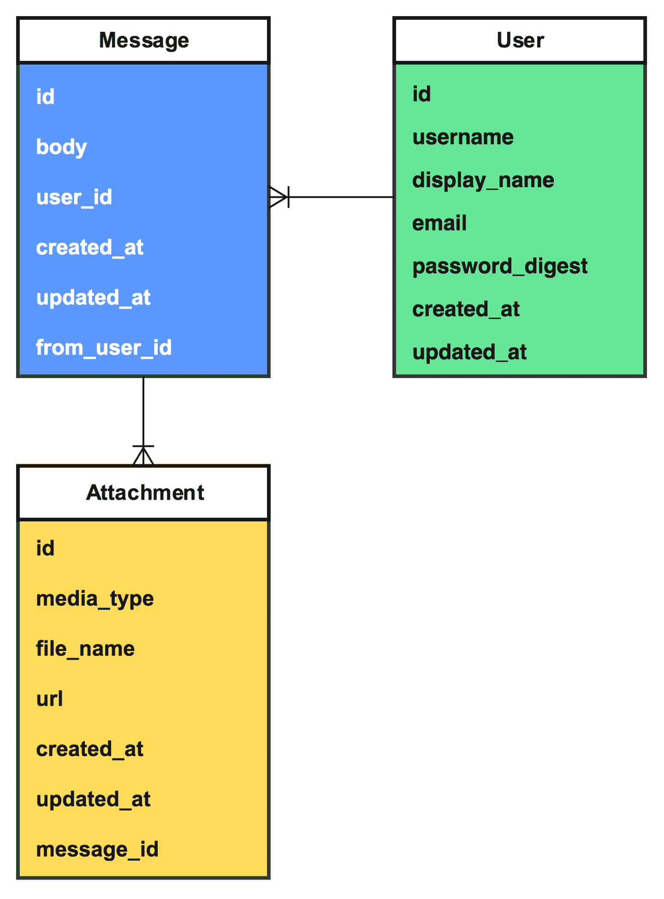
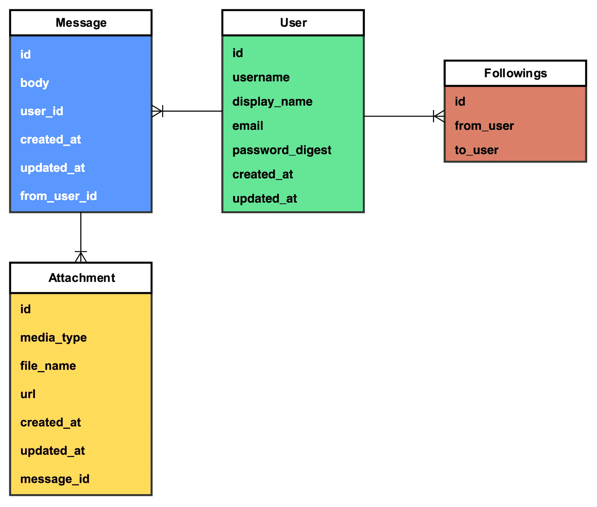
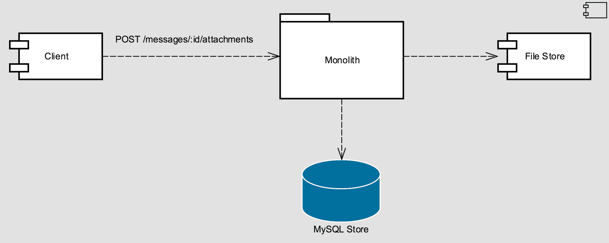
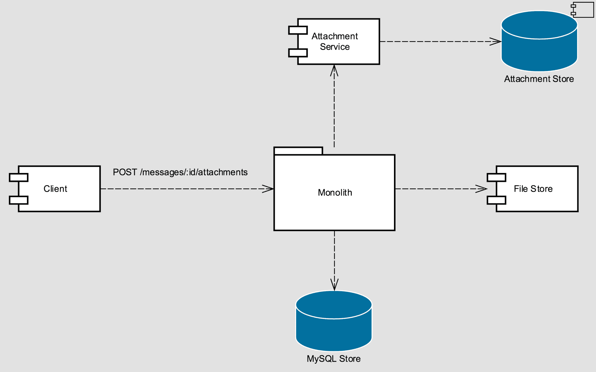
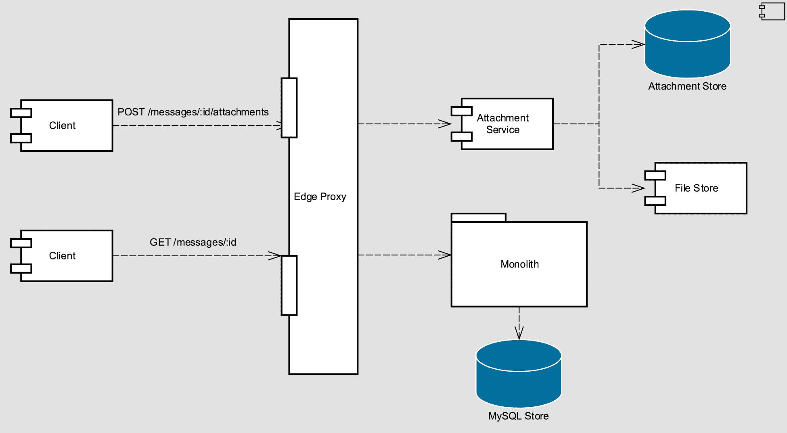

# 第一章：打破单体架构

在本章中，我们将涵盖以下食谱：

+   组织团队以拥抱微服务

+   按业务能力分解

+   识别边界上下文

+   生产环境中的数据迁移

+   重构单体架构

+   将单体架构演进为服务

+   逐步完善测试套件

+   使用 Docker 进行本地开发

+   将请求路由到服务

# 简介

微服务中最困难的事情之一就是开始。许多团队发现自己正在将功能构建到一个不断增长、难以管理的单体代码库中，并且不知道如何开始将其拆分成更易于管理的、可独立部署的服务。本章中的食谱将解释如何从单体过渡到微服务。许多食谱将完全不涉及任何代码；相反，它们将专注于架构设计和如何最佳地构建团队以在微服务上工作。

你将学习如何从单一的大型代码库开始逐步过渡到微服务套件。你还将了解在开始使用这种新的架构风格开发功能时如何应对一些初始挑战。

# 组织你的团队

康威定律告诉我们，组织将产生结构与其沟通结构相匹配的设计。这通常意味着工程团队的组织结构将对它产生的软件设计结构产生深远的影响。当一个新创业公司开始构建软件时，团队规模很小——有时可能只有一到两名工程师。在这种配置下，工程师负责一切，包括前端和后端系统，以及运维。单体架构非常适合这种组织结构，允许工程师在任何给定时间都能在系统中的任何部分工作，而无需在代码库之间移动。

当团队规模扩大，你开始考虑微服务的优势时，你可以考虑采用一种通常被称为**康威逆向行动**的技术。这种技术建议通过演进团队和组织结构来鼓励出现你希望看到的架构风格。对于微服务而言，这通常意味着将工程师组织成小团队，你最终希望他们负责少量相关的服务。提前为这种结构做好准备可以激励工程师通过限制团队内部的沟通和决策开销来构建服务。简单来说，当添加功能作为服务的成本大于添加到单体架构的成本时，单体架构将继续存在。以这种方式组织团队可以降低开发服务的成本。

本食谱针对那些在公司中具有影响力以实施组织结构变革的管理者和其他领导者。

# 如何做到这一点…

重组团队永远不是一项简单的工作，有许多非显而易见因素需要考虑。如个性、个人优势和劣势以及过去的历史等因素超出了本食谱的范围，但在做出任何改变时都应该仔细考虑。本食谱中的步骤提供了一种将团队从围绕单体代码库组织转变为针对微服务优化的一种可能方式，但并非每个组织都有一劳永逸的食谱。

如果你认为这些步骤适用，请以此为指导，否则请以此作为灵感，并鼓励思考和讨论：

1.  与你组织中的其他利益相关者合作，制定产品路线图。你可能会对你的组织在短期内将面临哪些挑战的信息有限，但尽你所能。在路线图上对短期项目非常详细，而对长期项目非常概括是完全自然的。

1.  使用产品路线图，尝试确定你需要的技术能力，以帮助你向用户提供价值。例如，你可能正在计划开发一个高度依赖搜索的功能。你也可能有多个依赖内容上传和管理的功能。这意味着搜索和上传是你知道需要投资的两个技术能力。

1.  随着你看到模式开始显现，尝试确定你应用程序的主要功能区域，注意你预计每个区域将投入多少工作量。将更高的优先级分配给你预计在短期内和中期内需要大量投资的那些功能区域。

1.  创建新的团队，理想情况下由四到六名工程师组成，负责你应用程序中的一个功能区域。从你预计在接下来的一个季度左右需要最多工作的功能区域开始。这些团队可以专注于后端服务，也可以是包括移动和网页工程师的跨职能团队。拥有跨职能团队的优点是，团队可以自主地交付应用程序的整个垂直组件。服务工程师与使用他们服务的工程师的组合也将促进更多的信息共享，并希望产生同理心。

# 讨论

使用这种方法，你应该最终拥有小型、团结和专注于你应用程序核心区域的小团队。团队的本质是，团队内部的个人应该开始看到创建单独管理和部署的代码库的好处，他们可以在没有与其他团队协调更改和部署的昂贵开销的情况下自主工作。

为了帮助说明这些步骤，想象一下你的组织正在开发一个图片消息应用。该应用允许用户用智能手机拍照并发送照片，以及一条消息，给他们的联系人列表中的朋友。他们的朋友也可以向他们发送带消息的照片。这个虚构产品的路线图可能包括添加对短视频、照片滤镜和对表情符号的支持的需求。你现在知道，记录、上传和播放视频的能力、应用照片滤镜的能力以及发送富文本的能力将对你的组织非常重要。此外，根据经验，你知道用户需要注册、登录并维护朋友列表。

使用前面的例子，你可能会决定将工程师组织成一个媒体团队，负责上传、处理和播放、滤镜以及存储和交付，一个消息团队，负责发送带有相关文本的图片或视频消息，以及一个用户团队，负责提供可靠的认证、注册、入职和社交功能。

# 按业务能力分解

在产品开发的早期阶段，单体架构最适合以最快、最简单的方式向用户提供功能。这是合适的，因为在产品开发的这个阶段，你还没有扩展团队、代码库或服务客户流量的奢侈问题。遵循良好的设计实践，你将应用程序的关注点分离成易于阅读的、模块化的代码模式。这样做允许工程师独立地工作在不同的代码部分，并限制了在合并分支到主分支和部署代码时需要解决复杂的合并冲突的可能性。

微服务要求你比你在单体中遵循的良好设计实践更进一步。为了围绕微服务组织你的小型、自主团队，你应该首先考虑确定你的应用程序提供的核心业务能力。业务能力是商学院的一个术语，描述了你的组织创造价值的不同方式。例如，你的内部订单管理负责处理客户订单。如果你有一个允许用户提交用户生成内容（如照片）的社交应用，你的照片上传系统提供了一个业务能力。

在考虑系统设计时，业务能力与面向对象设计（OOD）中的**单一职责原则（SRP**）密切相关。微服务本质上是将 SRP 扩展到代码库。考虑这一点将帮助你设计适当规模的微服务。服务应该有一个主要任务，并且应该很好地完成它。这可能包括存储和提供图像、传递消息或创建和验证用户账户。

# 如何做到这一点...

通过业务能力分解你的单体应用是一个过程。这些步骤可以并行执行，以应对你识别出的每个新服务的需求，但你可能想从一个服务开始，并将你学到的经验应用到后续的工作中：

1.  识别一个目前由你的单体应用提供的业务能力。这将是我们第一个服务的目标。理想情况下，这个业务能力是你之前在食谱中工作的路线图上有所关注的，并且可以分配给你的一个新创建的团队。让我们以我们的虚构照片消息服务为例，并假设我们将从上传和显示媒体的能力作为我们第一个识别的业务能力。这个功能目前作为你的**Ruby on Rails**单体应用中的一个单一模型和控制器实现：



1.  在前面的屏幕截图中，**AttachmentsController**有四个方法（在 Ruby on Rails 术语中称为**actions**），它们大致对应于你想要在**Attachment**资源上执行的**创建、检索、更新、删除**（**CRUD**）操作。我们并不严格需要它，因此将省略更新操作。这非常适合 RESTful 服务，因此你可以设计、实现和部署一个具有以下 API 的微服务：

```js
POST /attachments
GET /attachments/:id
DELETE /attachments/:id
```

1.  随着新微服务的部署（迁移数据将在后面的食谱中讨论），你现在可以开始修改客户端代码路径以使用新服务。你可以通过替换**AttachmentsController**动作方法中的代码来开始，使其向我们的新微服务发送 HTTP 请求。关于如何做到这一点，将在本章后面的**将单体应用演进为服务**食谱中介绍。

# 识别边界上下文

当设计微服务时，一个常见的困惑点是服务应该有多大或多小。这种困惑可能导致工程师专注于诸如特定服务中的代码行数等问题。代码行数是衡量软件的一个糟糕指标；更多地关注服务所扮演的角色，无论是从它提供的业务能力还是它帮助管理的领域对象来看，都更有用。我们希望设计与其他服务耦合度低的服务，因为这样可以限制我们在产品中引入新功能或对现有功能进行更改时需要更改的内容。我们还想给服务赋予单一责任。

当分解单体应用时，在决定要提取哪些服务时查看数据模型通常很有用。在我们的虚构图片消息应用中，我们可以想象以下数据模型：



我们有一个消息表、一个用户表和一个附件表。**消息**实体与**用户**实体有一个一对多的关系；每个用户可以有多个来自或针对他们的消息，每条消息也可以有多个附件。随着应用程序的发展和我们添加更多功能，会发生什么？前面的数据模型没有包含关于社交图谱的任何内容。让我们假设我们想让用户能够关注其他用户。我们将定义以下内容为一个非对称关系，仅仅因为用户 1 关注用户 2，并不意味着用户 2 也关注用户 1。

有许多方式来建模这种关系；我们将关注其中最简单的一种，即邻接表。看看下面的图：



我们现在有一个实体，**关注者**，用来表示两个用户之间的关注关系。这在我们的单体应用中运行得很好，但在微服务中引入了挑战。如果我们构建两个新的服务，一个处理附件，另一个处理社交图谱（两个不同的职责），我们现在有两个用户定义。这种模型的重复通常是必要的。另一种选择是让多个服务访问和更新同一个模型，这非常脆弱，并且可能导致代码不可靠。

这就是边界上下文可以发挥作用的地方。边界上下文是**领域驱动设计**（**DDD**）中的一个术语，它定义了系统中的一个特定模型有意义的区域。在前面的例子中，社交图谱服务将有一个**用户**模型，其边界上下文将是用户的社会图谱（足够简单）。媒体服务将有一个**用户**模型，其边界上下文将是照片和视频。识别这些边界上下文很重要，尤其是在解构单体应用时——你经常会发现，随着单体代码库的增长，之前讨论的业务能力（上传和查看照片和视频，以及用户关系）可能会最终共享同一个庞大而臃肿的**用户**模型，然后就需要解开这个模型。这可能是一个棘手但启发性和重要的过程。

# 如何实现...

决定如何在系统中定义边界上下文可以是一项有益的工作。这个过程本身鼓励团队就系统中的模型和各个系统之间必须发生的各种交互进行许多有趣的讨论：

1.  在一个团队能够开始定义其工作的边界上下文之前，它首先应该开始列出其工作的系统部分所拥有的模型。例如，媒体团队显然拥有**附件**模型，但它还需要了解用户和消息的信息。**附件**模型可能完全在媒体团队服务的上下文中维护，但其他部分将需要有一个定义良好的边界上下文，以便在必要时与其他团队进行沟通。

1.  一旦一个团队确定了可能共享的模型，与使用类似模型或相同模型的其它团队进行讨论是个好主意。

1.  在这些讨论中，明确模型的边界，并决定是否共享模型实现（在微服务世界中这需要服务之间的调用）或者各自发展并维护独立的模型实现。如果选择开发独立的模型实现，那么明确模型应用的边界上下文就变得非常重要。

1.  团队应该明确记录关于团队、应用程序的特定部分或特定代码库的模型边界，这些部分或代码库应该使用该模型。

# 生产环境中的数据迁移

单体代码库通常使用主关系型数据库进行持久化。现代 Web 框架通常包含**对象关系映射**（**ORM**），这允许你使用与数据库中的表对应的类来定义你的领域对象。这些模型类的实例对应于表中的行。随着单体代码库的增长，添加额外的数据存储，如文档或键值存储，并不罕见。

微服务不应与单体连接到相同数据库共享访问权限。这样做在尝试协调数据迁移，如模式更改时，不可避免地会导致问题。即使是模式无关的存储，当你在某个代码库中更改数据写入方式，但在另一个代码库中不更改数据读取方式时，也会引起问题。出于这些和其他原因，最好让微服务完全管理它们用于持久化的数据存储。

当从单体过渡到微服务时，制定数据迁移策略非常重要。过于频繁地，一个团队会提取微服务的代码，而留下数据，给自己未来的痛苦埋下伏笔。除了管理迁移的困难之外，单体关系型数据库的故障现在将对服务产生级联影响，导致难以调试的生产事件。

管理大规模数据迁移的一种流行技术是设置双重写入。当你的新服务部署后，你将有两个写入路径——一个是从原始单体代码库到其数据库，另一个是从你的新服务到其自己的数据存储。确保写入同时发送到这两个代码路径。现在你将从新服务投入生产的那一刻开始复制数据，这样你就可以使用脚本或类似的离线任务回填旧数据。一旦数据开始写入两个数据存储，你现在可以修改所有各种读取路径。无论代码在哪里直接查询单体数据库，都将其替换为对新服务的调用。一旦所有读取路径都已修改，删除任何仍然写入旧位置的写入路径。现在你可以删除旧数据（你备份了吗？）。

# 如何做到这一点...

将数据从单体数据库迁移到由新服务前端的新存储，而不影响可用性或一致性，在向微服务过渡时是一个困难但常见的任务。使用我们虚构的图片消息应用，我们可以想象一个场景，其中我们想要创建一个新的微服务来处理媒体上传。在这个场景中，我们会遵循一个常见的双重写入模式：

1.  在编写用于处理媒体上传的新服务之前，我们假设单体架构看起来像以下图示，其中 HTTP 请求由单体处理，它可能将 multipart/form-encoded 的内容体作为二进制对象读取，并将文件存储在分布式文件存储中（例如亚马逊的 S3 服务）。然后，文件的相关元数据被写入一个名为**附件**的数据库表，如图所示：



1.  编写新服务后，你现在有两个写入路径。在单体中的写入路径中，调用你的服务以复制单体数据库以及由你的新服务前端的数据存储中的数据。你现在正在复制新数据，可以编写脚本回填旧数据。你的架构现在看起来像这样：



1.  在你的**客户端**和**单体**代码中找到所有读取路径，并将它们更新为使用你的新服务。所有读取现在都将发送到你的服务，这将能够提供一致的结果。

1.  在你的**客户端**和**单体**代码中找到所有写入路径，并将它们更新为使用你的新服务。所有读取和写入现在都将发送到你的服务，你可以安全地删除旧数据和相关代码路径。你的最终架构应该看起来像以下这样（我们将在后面的章节中讨论边缘代理）：



使用这种方法，你将能够安全地将数据从单体数据库迁移到为新的微服务创建的新存储中，而无需停机。跳过这一步是很重要的；否则，你将无法真正实现微服务架构的好处（尽管，可以说，你将体验到所有弊端！）。

# 重构单体架构

在向微服务过渡时，一个常见的错误是忽略单体，只是作为服务构建新功能。这通常发生在团队觉得单体已经失控，代码难以控制，最好是宣布破产并让它腐烂的时候。这特别诱人，因为构建没有遗留负担的绿色代码的想法听起来比重构脆弱的遗留代码要好得多。

抵制放弃单体架构的诱惑。为了通过业务能力成功地将单体架构分解，并开始将其演进为一组结构良好、单一职责的微服务，你需要确保你的单体代码库处于良好状态，并且结构良好、经过充分测试。否则，你将面临新服务的激增，这些服务无法干净地建模你的领域（因为它们与单体中的功能重叠），并且你将继续在与单体中存在的任何代码打交道时遇到麻烦。你的用户不会满意，而且随着技术债务的负担变得难以承受，你团队的精力很可能会开始下降。

相反，采取持续、积极的步骤，使用良好的、稳固的设计原则来重构你的单体架构。已经有许多关于重构的书籍（我推荐马丁·福勒的《重构》和迈克尔·费瑟斯的《与遗留代码有效工作》），但最重要的是要知道，重构永远不是全有或全无的努力。很少有产品团队或公司有耐心或奢侈的时间等待工程团队停止世界并花费时间使代码更容易更改，而尝试这样做的工程团队很少会成功。重构必须是一个持续、稳定的过程。

无论你的团队如何安排工作，确保你为重构预留了适当的时间。一个指导原则是，每次你打算进行更改时，首先使更改变得容易进行，然后再进行更改。你的目标是使单体代码更容易工作、更容易理解，并且更不易破碎。你还应该能够开发出一个健壮的测试套件，这将非常有用。

当你的单体应用处于更好的状态时，你可以开始连续缩小单体应用，同时提取服务。大多数单体代码库的另一个方面是服务于通过浏览器提供的动态生成的视图和静态资源。如果你的单体应用负责这项工作，考虑将你的 Web 应用程序组件移动到一个单独提供的 JavaScript 应用程序中。这将允许你从多个方向缩小单体应用。

# 如何操作...

任何代码库的重构都是一个过程。对于单体应用，有一些技术可以非常有效。在这个例子中，我们将记录可以采取的步骤，使 Ruby on Rails 代码库的重构变得容易：

1.  使用前面菜谱中描述的技术，在你的应用程序中识别业务能力和边界上下文。让我们专注于上传图片和视频的能力。

1.  在`controllers`、`models`和`views`旁边创建一个名为`app/services`的目录。这个目录将包含你所有的服务对象。服务对象是许多 Rails 应用程序中用来将概念服务分解为一个 Ruby 对象的模式，该对象不继承任何 Ruby on Rails 功能。这将使将封装在服务对象中的功能移动到单独的微服务变得更容易。你的服务对象的结构没有一种固定的方式。我更喜欢让每个对象代表一个服务，并将我希望该服务负责的操作移动到该服务对象作为方法。

1.  在`app/services`目录下创建一个名为`attachments_service.rb`的新文件，并给它以下定义：

```js
class AttachmentsService

  def upload
    # ... 
  end

  def delete!
    # ...
  end

end
```

1.  查看`app/controllers/attachments_controller.rb`文件中`AttachmentsController#create`方法的源代码，它目前负责创建`Attachment`实例并将文件数据上传到附件存储，在这个例子中是一个 Amazon S3 存储桶。这是我们需要转移到新创建的服务对象的功能：

```js
# POST /messages/:message_id/attachments
def create
  message = Message.find_by!(params[:message_id], user_id: 
  current_user.id)
  file = StorageBucket.files.create(
    key:  params[:file][:name],
    body: StringIO.new(Base64.decode64(params[:file][:data]),
    'rb'),
    public: true
  )
  attachment = Attachment.new(attachment_params.merge!(message: 
  message))
  attachment.url = file.public_url
  attachment.file_name = params[:file][:name]
```

```js
  attachment.save
  json_response({ url: attachment.url }, :created)
end
```

1.  在`app/services/attachments_service.rb`文件中打开新创建的服务对象，并将上传文件的责任转移到`AttachmentsService#upload`方法：

```js
class AttachmentsService

  def upload(message_id, user_id, file_name, data, media_type)
    message = Message.find_by!(message_id, user_id: user_id)
    file = StorageBucket.files.create(
      key:  file_name,
      body: StringIO.new(Base64.decode64(data), 'rb'),
      public: true
    )
    Attachment.create(
      media_type: media_type,
      file_name:  file_name,
      url:        file.public_url,
      message:    message
    )
  end

  def delete!
  end
end
```

1.  现在将`app/controllers/attachments_controller.rb`中的`AttachmentsController#create`方法上传，以使用新创建的`AttachmentsService#upload`方法：

```js
# POST /messages/:message_id/attachments
def create
  service = AttachmentService.new
  attachment = service.upload(params[:message_id], current_user.id, 
   params[:file][:name], params[:file][:data], 
   params[:media_type])
  json_response({ url: attachment.url }, :created)
end
```

1.  对`AttachmentsController#destroy`方法中的代码重复此过程，将责任转移到新的服务对象。当你完成时，`AttachmentsController`中的代码不应直接与`Attachments`模型交互；相反，它应该通过`AttachmentsService`服务对象进行交互。

现在，你已经将附件管理的责任隔离到单个服务类中。这个类应该封装所有最终将转移到新附件服务中的业务逻辑。

# 将单体应用演化成服务

从单体应用过渡到服务时最复杂的方面之一可能是请求路由。在后面的菜谱和章节中，我们将探讨将你的服务暴露给互联网的话题，以便移动和 Web 客户端应用可以直接与它们通信。然而，目前，让你的单体应用充当路由器可以作为有用的中间步骤。

当你将单体应用拆分成小型、可维护的微服务时，你可以用对服务的调用替换单体应用中的代码路径。根据你用来构建单体应用的编程语言或框架，这些代码段可以被称为控制器操作、视图或其他。我们将继续假设你的单体应用是用流行的 Ruby on Rails 框架构建的；在这种情况下，我们将查看控制器操作。我们还将假设你已经开始了重构单体应用，并已根据前一个菜谱创建了零个或多个服务对象。

在进行这项工作时，遵循最佳实践非常重要。在后面的章节中，我们将介绍电路断路器等概念，这些概念在服务间通信时变得很重要。目前，请注意，从你的单体应用到服务的 HTTP 调用可能会失败，你应该考虑如何最好地处理这种情况。

# 如何实现...

1.  打开我们在前一个菜谱中创建的服务对象。我们将修改服务对象，使其能够调用一个负责管理附件的外部微服务。为了简化，我们将使用 Ruby 标准库中提供的 HTTP 客户端。服务对象应在`app/services/attachments_service.rb`文件中：

```js
class AttachmentsService

  BASE_URI = "http://attachment-service.yourorg.example.com/"

  def upload(message_id, user_id, file_name, data, media_type)
    body = {
      user_id: user_id,
      file_name: file_name,
      data: StringIO.new(Base64.decode64(params[:file]
      [:data]), 'rb'),
      message: message_id,
      media_type: media_type
    }.to_json
    uri = URI("#{BASE_URI}attachment")
    headers = { "Content-Type" => "application/json" }
    Net::HTTP.post(uri, body, headers)
  end

end
```

1.  打开位于`pichat/app/controllers/`的`attachments_controller.rb`文件，查看以下创建操作。由于前一章中进行的重构工作，我们只需要进行少量更改，使控制器与我们的新服务对象一起工作：

```js
class AttachmentsController < ApplicationController
  # POST /messages/:message_id/attachments
  def create
    service = AttachmentService.new
    response = service.upload(params[:message_id], current_user.id,
     params[:file][:name], params[:file][:data], 
     params[:media_type])
    json_response(response.body, response.code)
  end
  # ...
end
```

# 测试套件的演进

在一开始就拥有良好的测试套件将极大地帮助你从单体应用过渡到微服务。每次你从单体代码库中移除功能时，你的测试都需要更新。用使外部网络调用到你的服务的测试替换 Rails 应用中的单元和功能测试可能很有诱惑力，但这种方法有许多缺点。进行外部调用的测试可能会因为间歇性网络连接问题而失败，并且经过一段时间后运行时间会非常长。

而不是进行外部网络调用，你应该修改你的单体测试以模拟微服务。使用钩子来表示对微服务的调用的测试将更加健壮，并且运行速度更快。只要你的微服务满足你开发的 API 合同，测试将可靠地指示你的单体代码库的健康状况。对微服务进行向后不兼容的更改是另一个将在后续食谱中讨论的话题。

# 准备工作

我们将在测试中使用 `webmock` 钩子来模拟外部 HTTP 请求，因此请更新你的单体 gemfile，在测试组中包含 `webmock` 钩子：

```js
group :test do
  # ...
  gem 'webmock'
end
```

你还应该更新 `spec/spec_helper.rb` 以禁用外部网络请求。这将确保你在编写其余的测试代码时保持诚实：

```js
require 'webmock/rspec'
WebMock.disable_net_connect!(allow_localhost: false)
```

# 如何操作...

现在你已经将 `webmock` 包含到你的项目中，你可以在你的规格说明中开始模拟 HTTP 请求。再次打开 `specs/spec_helper.rb` 并添加以下内容：

```js
stub_request(:post, "attachment-service.yourorg.example.com").
  with(body: {media_type: 1}, headers: {"Content-Type" => /image\/.+/}).
  to_return(body: { foo: bar })
```

# 使用 Docker 进行本地开发

正如我们所讨论的，微服务解决了一组特定的问题，但同时也引入了一些新的挑战。你的团队中的工程师可能会遇到的一个挑战是进行本地开发。对于单体来说，需要管理的移动部件较少——通常，你只需在你的工作站上运行数据库和应用程序服务器就可以完成工作。然而，当你开始创建新的微服务时，情况变得更加复杂。

容器是管理这种复杂性的好方法。Docker 是一个流行的开源软件容器化平台。Docker 允许你指定如何将你的应用程序作为容器运行——一个轻量级的标准化单元，用于部署。关于 Docker 有大量的书籍和在线文档，所以我们不会在这里过多详细说明，只需知道容器封装了运行你的应用程序所需的所有信息。如前所述，单体应用程序通常至少需要一个应用程序服务器和一个数据库服务器——这些将各自运行在自己的容器中。

**Docker Compose** 是一个用于运行多容器应用程序的工具。Compose 允许你在 YAML 配置文件中定义你的应用程序容器。使用此文件中的信息，你可以构建并运行你的应用程序。Compose 将在单独的容器中管理配置文件中定义的所有各种服务，允许你在工作站上运行复杂的系统进行本地开发。

# 准备工作

在你能够按照本食谱中的步骤操作之前，你需要安装所需的软件：

1.  安装 Docker。从 Docker 网站下载安装包（[`www.docker.com/docker-mac`](https://www.docker.com/docker-mac)）并按照说明操作。

1.  在 macOS X 上执行以下命令行来安装 `docker-compose`：

```js
brew install docker-compose
```

在 Ubuntu Linux 上，你可以执行以下命令行：

```js
apt-get install docker-compose
```

安装这两个包后，您就可以按照本菜谱中的步骤进行了。

# 如何操作...

1.  在您的 Rails 应用程序的根目录下，创建一个名为 `Dockerfile` 的单个文件，内容如下：

```js
 FROM ruby:2.3.3
 RUN apt-get update -qq && apt-get install -y build-essential 
 libpq-dev nodejs
  RUN mkdir /pichat
  WORKDIR /pichat
  ADD Gemfile /pichat/Gemfile
  ADD Gemfile.lock /pichat/Gemfile.lock
  RUN bundle install
  ADD . /pichat
```

1.  创建一个名为 `docker-compose.yml` 的文件，内容如下：

```js
version: '3'
services:
 db:
 image: mysql:5.6.34
 ports:
 - "3306:3306"
 environment:
 MYSQL_ROOT_PASSWORD: root

 app:
 build: .
 environment:
 RAILS_ENV: development
 command: bundle exec rails s -p 3000 -b '0.0.0.0'
 volumes:
 - .:/pichat ports:
 - "3000:3000"
 depends_on:
 - db
```

1.  通过运行 `docker-compose up app` 命令来启动您的应用程序。您应该在浏览器中输入 `http://localhost:3000/` 来访问您的单体应用。您可以使用这种方法来编写新的服务。

# 将请求路由到服务

在之前的菜谱中，我们关注的是让您的单体应用将请求路由到服务。这项技术是一个良好的开始，因为它不需要客户端更改即可工作。您的客户端仍然向您的单体应用发送请求，而您的单体应用通过其控制器操作将请求封装到您的微服务中。然而，在某个时候，为了真正从微服务架构中受益，您可能希望从关键路径中移除单体应用，并允许您的客户端直接向您的微服务发送请求。工程师直接将他们组织的第一个微服务暴露给互联网并不罕见，通常使用不同的主机名。然而，随着您开发更多服务，您需要一定程度的监控、安全和可靠性方面的统一性，这开始变得难以管理。

面向互联网的系统面临许多挑战。它们需要能够处理许多安全关注、速率限制、流量周期性峰值等问题。为每个公开暴露到公共互联网的服务执行此操作将变得非常昂贵，而且会很快。相反，您应该考虑拥有一个单一的前端服务，该服务支持将公共互联网的请求路由到内部服务。一个好的前端服务应该支持常见的功能，例如动态路径重写、负载减轻和身份验证。幸运的是，有许多优秀的开源前端服务解决方案。在本菜谱中，我们将使用 Netflix 的一个名为 **Zuul** 的项目。

# 如何操作...

1.  创建一个新的名为 `Edge Proxy` 的 Spring Boot 服务，主类名为 `EdgeProxyApplication`。

1.  Spring Cloud 包含一个内置的 Zuul 代理。通过在您的 `EdgeProxyApplication` 类中添加 `@EnableZuulProxy` 注解来启用它：

```js
package com.packtpub.microservices;

import org.springframework.boot.SpringApplication;
import org.springframework.boot.autoconfigure.SpringBootApplication;
import org.springframework.cloud.netflix.zuul.EnableZuulProxy;

@EnableZuulProxy
@SpringBootApplication
public class EdgeProxyApplication {

  public static void main(String[] args) {
    SpringApplication.run(EdgeProxyApplication.class, args);
  }

}
```

1.  在 `src/main/resources/` 目录下创建一个名为 `application.properties` 的文件，内容如下：

```js
zuul.routes.media.url=http://localhost:8090
ribbon.eureka.enabled=false
server.port=8080
```

在前面的代码中，它告诉 `zuul` 将 `/media` 路由到运行在端口 `8090` 的服务。我们将在后续章节中讨论服务发现时详细介绍 `eureka` 选项，现在只需确保它设置为 `false`。

到目前为止，您的服务应该能够代理请求到相应的服务。您刚刚迈出了构建微服务架构的最大一步。恭喜您！
