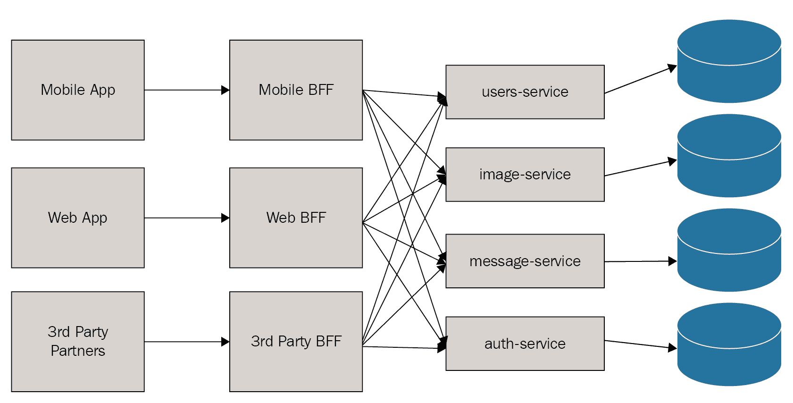

# 第四章：客户端模式

本章将涵盖以下食谱：

+   使用依赖未来建模并发

+   后端为前端

+   与 HTTP 和 JSON 保持一致的 RPC

+   使用 gRPC

+   使用 Thrift

# 简介

当构建面向服务的架构时，很容易陷入思考如何以最通用的方式表示由特定服务控制的数据实体和行为。事实是，我们很少以通用的方式使用服务——我们通常结合多个服务的调用，并使用响应来创建一个新的、聚合的响应体。我们经常以类似于我们过去从数据库中聚合数据的方式调用服务，因此我们必须考虑我们系统中不同类型之间的关系以及如何最好地建模数据依赖。

我们还希望使客户端开发变得简单。在设计通用 API 时，很容易陷入思考正确做事的方式（如果你曾经听到有人批评 API 设计不是 RESTful 的，这可能会听起来很熟悉），而不是思考简单做事的方式。如果客户端需要调用数十次才能获取所需的数据，那么服务就没有什么用处。在设计涉及微服务的系统时，从客户端的角度考虑数据聚合是至关重要的。

客户端不仅要考虑他们正在调用的服务，而且通常还必须考虑他们想要配置以调用的那些服务的实例。在微服务架构中，这些通常会有很多更复杂的环境。

在本章中，我们将讨论建模依赖服务调用以及从各种服务中聚合响应以创建特定客户端 API 的技术。我们还将讨论管理不同的微服务环境以及使 RPC 与 JSON 和 HTTP 保持一致，以及 gRPC 和 Thrift 二进制协议。

# 使用依赖未来建模并发

在之前的配方中，我们了解到可以使用异步方法来执行由单独线程处理的服务调用。这是至关重要的，因为如果网络 I/O 操作阻塞，将严重限制我们的服务能够处理请求数量的多少。如果服务在网络上阻塞，它将只能处理相对较少的请求，这要求我们投入更多资源进行横向扩展。在我们使用的示例中，消息服务需要调用社交图服务以获取两个用户的信息，即消息的发送者和接收者，并在允许发送消息之前确保这两个用户相互关注。我们修改了请求方法，使其返回包装响应的`CompletableFuture`实例，然后在验证消息的发送者和接收者是否具有对称关注关系之前等待所有结果完成。当你在执行多个不依赖的请求（你不需要一个请求的响应来执行后续请求）时，这种模型运行良好。在这种情况下，当我们有依赖的服务调用时，我们需要一种更好的方式来建模这种依赖。

在我们的`pichat`应用程序中，我们需要渲染一个屏幕，列出我们关注的用户的信息。为了做到这一点，我们需要调用社交图服务以获取用户列表，然后调用用户服务以获取每个用户的详细信息，如显示名称和头像。这个用例涉及到执行依赖的服务调用。我们需要一种有效的方式来建模这种服务调用，同时仍然以允许它们在单独的执行线程中运行的方式调度异步操作。

在本配方中，我们将通过使用`CompletableFuture`的组合以及 Java 8 流来演示如何建模依赖的服务调用。我们将创建一个示例客户端应用程序，该应用程序调用社交服务以获取当前登录用户关注的用户列表，然后调用用户服务以获取每个用户的详细信息。

# 如何实现...

为了建模依赖的异步服务调用，我们将利用 Java 8 的两个特性。流对于数据处理很有用，因此我们将在示例中使用它们从关注列表中提取用户名并将函数映射到每个元素。Java 8 的`CompletableFuture`可以组合，这允许我们自然地表达未来之间的依赖关系。

在本配方中，我们将创建一个简单的客户端应用程序，该应用程序调用社交服务以获取当前用户关注的用户列表。对于返回的每个用户，应用程序将从用户服务获取用户详细信息。我们将构建这个示例作为命令行应用程序，以便于演示，但它也可以是另一个微服务、Web 或移动客户端。

为了构建一个具有 Spring Boot 应用程序所有功能的命令行应用程序，我们将稍微作弊一下，只实现`CommandLineRunner`并在`run()`方法中调用`System.exit(0);`。

在我们开始构建我们的应用程序之前，我们将概述我们假设的社会服务和用户服务服务的响应。我们可以通过在本地 Web 服务器上托管适当的 JSON 响应来模拟这些服务。我们将分别使用端口`8000`和`8001`来表示社会服务和用户服务。社会服务有一个端点`/followings/:username`，它返回一个包含指定用户关注者列表的 JSON 对象。JSON 响应将类似于以下片段：

```js
{
  "username": "paulosman",
  "followings": [
    "johnsmith",
    "janesmith",
    "petersmith"
  ]
}
```

用户服务有一个名为`/users/:username`的端点，它将返回一个包含用户详细信息（包括用户名、全名和头像 URL）的 JSON 表示：

```js
{
  "username": "paulosman",
  "full_name": "Paul Osman",
  "avatar_url": "http://foo.com/pic.jpg"
}
```

现在我们有了我们的服务和我们已经概述了从每个服务期望的响应，让我们继续构建我们的客户端应用程序，按照以下步骤进行：

1.  创建一个名为`UserDetailsClient`的新 Java/Gradle 应用程序，并具有以下`build.gradle`文件：

```js
group 'com.packtpub.microservices'
version '1.0-SNAPSHOT'

buildscript {
    repositories {
        mavenCentral()
    }
    dependencies {
        classpath group: 'org.springframework.boot', name: 'spring-boot-gradle
        -plugin', version: '1.5.9.RELEASE'
    }
}

apply plugin: 'java'
apply plugin: 'org.springframework.boot'

sourceCompatibility = 1.8

repositories {
    mavenCentral()
}

dependencies {
    testCompile group: 'junit', name: 'junit', version: '4.12'
    compile group: 'org.springframework.boot', 
    name: 'spring-boot-starter-web'
}
```

1.  在`com.packtpub.microservices.ch04.user.models`包中创建一个名为`UserDetails`的新类。我们将使用这个类来模拟用户服务响应：

```js
package com.packtpub.microservices.ch04.user.models;

import com.fasterxml.jackson.annotation.JsonProperty;

public class UserDetails {
    private String username;

    @JsonProperty("display_name")
    private String displayName;

    @JsonProperty("avatar_url")
    private String avatarUrl;

    public UserDetails() {}

    public UserDetails(String username, String displayName, 
    String avatarUrl) {
        this.username = username;
        this.displayName = displayName;
        this.avatarUrl = avatarUrl;
    }

    public String getUsername() {
        return username;
    }

    public void setUsername(String username) {
        this.username = username;
    }

    public String getDisplayName() {
        return displayName;
    }

    public void setDisplayName(String displayName) {
        this.displayName = displayName;
    }

    public String getAvatarUrl() {
        return avatarUrl;
    }

    public void setAvatarUrl(String avatarUrl) {
        this.avatarUrl = avatarUrl;
    }

    public String toString() {
        return String.format("[UserDetails: %s, %s, %s]", username, 
        displayName, avatarUrl);
    }
}
```

1.  在`com.packtpub.microservices.ch04.user.models`包中创建另一个名为`Followings`的类。这将用于模拟社会服务的响应：

```js
package com.packtpub.microservices.ch04.user.models;

import java.util.List;

public class Followings {
    private String username;
    private List<String> followings;

    public Followings() {}

    public Followings(String username, List<String> followings) {
        this.username = username;
        this.followings = followings;
    }

    public String getUsername() {
        return username;
    }

    public void setUsername(String username) {
        this.username = username;
    }

    public List<String> getFollowings() {
        return followings;
    }

    public void setFollowings(List<String> followings) {
        this.followings = followings;
    }

    public String toString() {
        return String.format("[Followings for username: %s - %s]", 
        username, followings);
    }
}
```

1.  为调用我们的社会服务创建一个服务表示。不出所料，我们将把它命名为`SocialService`并将其放在`com.packtpub.microservices.ch04.user.services`包中：

```js
package com.packtpub.microservices.ch04.user.services;

import com.packtpub.microservices.models.Followings;
import org.springframework.boot.web.client.RestTemplateBuilder;
import org.springframework.scheduling.annotation.Async;
import org.springframework.stereotype.Service;
import org.springframework.web.client.RestTemplate;

import java.util.concurrent.CompletableFuture;

@Service
public class SocialService {

    private final RestTemplate restTemplate;

    public SocialService(RestTemplateBuilder restTemplateBuilder) {
        this.restTemplate = restTemplateBuilder.build();
    }

    @Async
    public CompletableFuture<Followings> 
    getFollowings(String username) {
        String url = String.format("http://localhost:8000/followings/
        %s", username);
        Followings followings = restTemplate.getForObject(url, 
        Followings.class);
        return CompletableFuture.completedFuture(followings);
    }
}
```

1.  为我们的用户服务创建一个服务表示。相应地，我们将把这个类命名为`UserService`并放在同一个包中：

```js
package com.packtpub.microservices.services;

import com.packtpub.microservices.models.Followings;
import com.packtpub.microservices.models.UserDetails;
import org.springframework.boot.web.client.RestTemplateBuilder;
import org.springframework.scheduling.annotation.Async;
import org.springframework.stereotype.Service;
import org.springframework.web.client.RestTemplate;

import java.util.concurrent.CompletableFuture;

@Service
public class UserService {
    private final RestTemplate restTemplate;

    public UserService(RestTemplateBuilder restTemplateBuilder) {
        this.restTemplate = restTemplateBuilder.build();
    }

    @Async
    public CompletableFuture<UserDetails> 
    getUserDetails(String username) {
        String url = String.format("http://localhost:8001/users/
        %s", username);
        UserDetails userDetails = restTemplate.getForObject(url, 
        UserDetails.class);
        return CompletableFuture.completedFuture(userDetails);
    }
}
```

1.  我们现在有了用于模拟我们服务响应的类，以及表示我们将要调用的服务的服务对象。现在是时候通过创建我们的主类来将这些所有内容结合起来，这个主类将以依赖的方式调用这两个服务，使用未来的组合性来模拟依赖关系。创建一个名为`UserDetailsClient`的新类，如下所示：

```js
package com.packtpub.microservices.ch04.user;

import com.packtpub.microservices.models.Followings;
import com.packtpub.microservices.models.UserDetails;
import com.packtpub.microservices.services.SocialService;
import com.packtpub.microservices.services.UserService;
import org.springframework.beans.factory.annotation.Autowired;
import org.springframework.boot.CommandLineRunner;
import org.springframework.boot.SpringApplication;
import org.springframework.boot.autoconfigure.SpringBootApplication;

import java.util.List;
import java.util.concurrent.CompletableFuture;
import java.util.concurrent.Future;
import java.util.stream.Collectors;

@SpringBootApplication
public class UserDetailsClient implements CommandLineRunner {

    public UserDetailsClient() {}

    @Autowired
    private SocialService socialService;

    @Autowired
    private UserService userService;

    public CompletableFuture<List<UserDetails>> 
    getFollowingDetails(String username) {
        return socialService.getFollowings(username).thenApply(f ->
                f.getFollowings().stream().map(u ->userService.
                getUserDetails(u)).map(CompletableFuture::join).
                collect(Collectors.toList()));
    }

    public static void main(String[] args) {
        SpringApplication.run(UserDetailsClient.class, args);
    }

    @Override
    public void run(String... args) throws Exception {
        Future<List<UserDetails>> users = getFollowingDetails
        ("paulosman");
        System.out.println(users.get());
        System.out.println("Heyo");
        System.exit(0);
    }
}
```

魔法实际上发生在以下方法中：

```js
CompletableFuture<List<UserDetails>> getFollowingDetails(String username) 
{
  return socialService.getFollowings(username).thenApply(
    f -> f.getFollowings().stream().map(u ->
      userService.getUserDetails(u)).map(
        CompletableFuture::join).collect(Collectors.toList()));
}
```

回想一下，`SocialService`中的`getFollowings`方法返回`CompletableFuture<Followings>`。`CompletableFuture`有一个名为`thenApply`的方法，它接受未来的最终结果（`Followings`）并将其应用于 Lambda 表达式。在这种情况下，我们正在使用`Followings`并通过 Java 8 Stream API 对由社会服务返回的用户名列表调用`map`。`map`将每个用户名应用于一个函数，该函数在`UserService`上调用`getUserDetails`。`CompletableFuture::join`方法用于将`List<Future<T>>`转换为`Future<List<T>>`，这在执行这些类型的依赖服务调用时是一个常见操作。最后，我们收集结果并将它们作为列表返回。

# 前端后端

当软件从桌面和基于 Web 的应用程序转向移动应用程序时，分布式架构变得更加普遍。这成为许多组织构建平台而不是仅仅构建产品的焦点。这种方法对 API 的重视程度更高，这些 API 可以暴露给客户以及第三方合作伙伴。随着 API 成为任何基于 Web 应用程序的既定事实，尝试在用于向第三方合作伙伴提供功能的同一 API 上构建客户端应用程序（移动或 JavaScript）变得流行。这种想法是，如果你公开了一个设计良好、通用目的的 API，你将拥有构建任何类型应用程序所需的一切。一般架构看起来是这样的：


这种方法的缺陷在于它假设你的第一方（移动和 Web）和第三方（合作伙伴）应用程序的需求始终会保持一致，而这很少是事实。更常见的情况是，你希望在第三方集成中鼓励某些类型的功能，在第一方客户端中鼓励另一组功能。此外，你希望对第一方客户端的变化更加宽容（甚至鼓励）——你的客户端应用程序将不断发展，并不断改变它们的 API 需求。最后，你无法预见到第三方合作伙伴将如何使用你的 API 的所有可能用例，因此通用设计是有益的，但你将能够预见到你的移动和 Web 应用程序的需求，而在 API 设计中过于通用可能会经常阻碍你的产品需求。一个很好的例子是将服务器端网站重写为单页 JavaScript 应用程序。使用通用 API，这类项目可能导致需要数十个`XMLHttpRequests`才能渲染单个页面视图。

**Backend For Frontend**（**BFF**）是一种涉及为不同类别的客户端应用程序创建单独、**定制 API**的架构模式。在你的架构中，而不是一个单一的 API 层，可以根据你想要支持多少类别客户端应用程序来开发单独的 BFF 层。你如何分类客户端完全取决于你业务的需求。你可能会决定为所有移动客户端使用单个 BFF 层，或者你可能将它们分为 iOS BFF 和 Android BFF。同样，你可能会选择为你的 Web 应用程序和第三方合作伙伴（曾经是单一 API 的主要驱动因素）使用单独的 BFF 层：



在这个系统中，每个客户端类别都会向其自己的 BFF 层发出请求，然后可以聚合对下游服务的调用并构建一个统一、定制的 API。

# 如何做到这一点...

为了设计和构建一个 bff 层，我们首先应该设计 API。实际上，我们已经完成了这个步骤。在前面的菜谱中，我们展示了如何使用`CompletableFuture`异步地向我们的系统、社交服务发送请求，然后对于每个返回的用户，异步地向用户详情服务发送请求以获取某些用户配置信息。这对于我们的移动应用来说是一个很好的 bff 层用例。想象一下，我们的移动应用有一个屏幕，显示用户关注的用户列表，包括他们的头像、用户名和显示名。由于社交图信息（用户关注的用户列表）和用户配置信息（头像、用户名和显示名）是两个独立服务的责任，要求我们的移动客户端聚合对这些服务的调用以渲染关注页面是相当繁琐的。相反，我们可以创建一个移动 bff 层来处理这种聚合，并向客户端返回方便的响应。我们的请求端点如下：

```js
GET /users/:user_id/following
```

我们期望得到的响应体应该如下所示：

```js
{
  "username": "paulosman",
  "followings": [
    {
      "username": "friendlyuser",
      "display_name": "Friendly User",
      "avatar_url": "http://example.com/pic.jpg"
    },
    {
      ...
    }
  ]
}
```

如我们所见，bff 将返回一个包含我们渲染移动应用中关注屏幕所需所有信息的响应：

1.  创建一个名为`bff-mobile`的新 Gradle/Java 项目，并包含以下`build.gradle`文件：

```js
group 'com.packtpub.microservices'
version '1.0-SNAPSHOT'

buildscript {
    repositories {
        mavenCentral()
    }
    dependencies {
        classpath group: 'org.springframework.boot', 
        name: 'spring-boot-gradle-plugin', 
        version: '1.5.9.RELEASE'
    }
}

apply plugin: 'java'
apply plugin: 'org.springframework.boot'

sourceCompatibility = 1.8

repositories {
    mavenCentral()
}

dependencies {
    testCompile group: 'junit', name: 'junit', version: '4.12'
    compile group: 'org.springframework.boot', 
    name: 'spring-boot-starter-web'
}
```

1.  创建一个名为`com.packtpub.microservices.mobilebff`的新包和一个名为`Main`的新类：

```js
package com.packtpub.microservices.ch04.mobilebff;

import org.springframework.boot.SpringApplication;
import org.springframework.boot.autoconfigure.SpringBootApplication;

@SpringBootApplication
public class Main {
    public static void main(String[] args) {
        SpringApplication.run(Main.class, args);
    }
}
```

1.  创建一个名为`com.packtpub.microservices.ch04.mobilebff.models`的新包和一个名为`User`的新类：

```js
package com.packtpub.microservices.ch04.mobilebff.models;

import com.fasterxml.jackson.annotation.JsonProperty;

public class User {
    private String username;

    @JsonProperty("display_name")
    private String displayName;

    @JsonProperty("avatar_url")
    private String avatarUrl;

    public User() {}

    public User(String username, String displayName, 
    String avatarUrl) {
        this.username = username;
        this.displayName = displayName;
        this.avatarUrl = avatarUrl;
    }

    public String getUsername() {
        return username;
    }

    public void setUsername(String username) {
        this.username = username;
    }

    public String getDisplayName() {
        return displayName;
    }

    public void setDisplayName(String displayName) {
        this.displayName = displayName;
    }

    public String getAvatarUrl() {
        return avatarUrl;
    }

    public void setAvatarUrl(String avatarUrl) {
        this.avatarUrl = avatarUrl;
    }

    public String toString() {
        return String.format(
                "[User username:%s, displayName:%s, avatarUrl:%s]",
                username, displayName, avatarUrl);
    }
}
```

1.  创建另一个模型，称为`Followings`：

```js
package com.packtpub.microservices.ch04.mobilebff.models;

import java.util.List;

public class Followings {
    private String username;

    private List<String> followings;

    public Followings() {}

    public Followings(String username, List<String> followings) {
        this.username = username;
        this.followings = followings;
    }

    public String getUsername() {
        return username;
    }

    public void setUsername(String username) {
        this.username = username;
    }

    public List<String> getFollowings() {
        return followings;
    }

    public void setFollowings(List<String> followings) {
        this.followings = followings;
    }
}
```

1.  我们将要创建的最后一个模型称为`HydratedFollowings`。这个模型与`Followings`模型类似，但不同之处在于它不将用户列表存储为字符串，而是包含一个`User`对象的列表：

```js
package com.packtpub.microservices.ch04.mobilebff.models;

import java.util.List;

public class HydratedFollowings {
    private String username;

    private List<User> followings;

    public HydratedFollowings() {}

    public HydratedFollowings(String username, List<User> 
    followings) {
        this.username = username;
        this.followings = followings;
    }

    public String getUsername() {
        return username;
    }

    public void setUsername(String username) {
        this.username = username;
    }

    public List<User> getFollowings() {
        return followings;
    }

    public void setFollowings(List<User> followings) {
        this.followings = followings;
    }
}
```

1.  创建服务客户端。创建一个名为`com.packtpub.microservices.ch04.mobilebff.services`的包和一个名为`SocialGraphService`的新类：

```js
package com.packtpub.microservices.ch04.mobilebff.services;

import com.packtpub.microservices.ch04.mobilebff.models.Followings;
import org.springframework.boot.web.client.RestTemplateBuilder;
import org.springframework.scheduling.annotation.Async;
import org.springframework.stereotype.Service;
import org.springframework.web.client.RestTemplate;

import java.util.concurrent.CompletableFuture;

@Service
public class SocialGraphService {

    private final RestTemplate restTemplate;

    public SocialGraphService(RestTemplateBuilder 
    restTemplateBuilder) {
        this.restTemplate = restTemplateBuilder.build();
    }

    @Async
    public CompletableFuture<Followings> 
    getFollowing(String username) {
        String url = String.format("http://localhost:4567/followings/
        %s", username);
        Followings followings = restTemplate.getForObject(url, 
        Followings.class);
        return CompletableFuture.completedFuture(followings);
    }
}
```

1.  创建一个新的类，称为`UsersService`，它将作为我们的用户服务的客户端：

```js
package com.packtpub.microservices.ch04.mobilebff.services;

import com.packtpub.microservices.ch04.mobilebff.models.User;
import org.springframework.boot.web.client.RestTemplateBuilder;
import org.springframework.scheduling.annotation.Async;
import org.springframework.stereotype.Service;
import org.springframework.web.client.RestTemplate;

import java.util.concurrent.CompletableFuture;

@Service
public class UsersService {

    private final RestTemplate restTemplate;

    public UsersService(RestTemplateBuilder restTemplateBuilder) {
        this.restTemplate = restTemplateBuilder.build();
    }

    @Async
    public CompletableFuture<User> getUserDetails(String username) {
        String url = String.format("http://localhost:4568/users/
        %s", username);
        User user = restTemplate.getForObject(url, User.class);
        return CompletableFuture.completedFuture(user);
    }
}
```

1.  让我们通过创建我们的控制器来整合所有内容，该控制器公开了端点。如果你完成了前面的菜谱，这段代码看起来会很熟悉，因为我们正在使用完全相同的模式来模拟依赖的异步服务调用。创建一个名为`com.packtpub.microservices.ch04.mobilebff.controllers`的包和一个名为`UsersController`的新类：

```js
package com.packtpub.microservices.ch04.mobilebff.controllers;

import com.packtpub.microservices.ch04.mobilebff.models.HydratedFollowings;
import com.packtpub.microservices.ch04.mobilebff.models.User;
import com.packtpub.microservices.ch04.mobilebff.services.SocialGraphService;
import com.packtpub.microservices.ch04.mobilebff.services.UsersService;
import org.springframework.beans.factory.annotation.Autowired;
import org.springframework.web.bind.annotation.*;

import java.util.List;
import java.util.concurrent.CompletableFuture;
import java.util.concurrent.ExecutionException;
import java.util.stream.Collectors;

@RestController
public class UsersController {

    @Autowired
    private SocialGraphService socialGraphService;

    @Autowired
    private UsersService userService;

    @RequestMapping(path = "/users/{username}/followings", 
    method = RequestMethod.GET)
    public HydratedFollowings getFollowings(@PathVariable String username) 
    throws ExecutionException, InterruptedException {
        CompletableFuture<List<User>> users = socialGraphService.getFollowing
        (username).thenApply(f -> f.getFollowings().stream().map(
                        u -> userService.getUserDetails(u)).map(
                                CompletableFuture::join).collect(Collectors.toList()));
        return new HydratedFollowings(username, users.get());
    }
}
```

1.  就这样！运行应用程序，并对`/users/username/followings`执行`GET`请求。你应该会得到一个包含用户用户名和用户关注的每个用户的详细信息的完整填充的 JSON 响应。

# 与 HTTP 和 JSON 一致的 RPC

当构建多个微服务时，服务之间的一致性和约定开始产生实际影响。当微服务架构中出现问题时，你可能会花费大量时间调试许多服务——能够对特定服务接口的性质做出某些假设可以节省大量时间和精力。拥有一致的 RPC 方式还可以让你将某些关注点编码到库中，这些库可以在服务之间轻松共享。例如，身份验证、如何解释头信息、响应体中包含哪些信息以及如何请求分页响应等问题可以通过一致的方法变得简单。此外，应该尽可能使错误报告的方式保持一致。

由于微服务架构通常由不同团队使用不同的编程语言编写，因此任何旨在实现一致 RPC 语义的努力都必须在尽可能多的语言中实现，可能作为库。这可能很麻烦，但为了确保客户端在与各种服务交流时可以假设的一致性，这种努力是非常值得的。

在这个配方中，我们将专注于使用 Spring Boot 编写的 Java 服务。我们将编写一个自定义序列化器，以一致的方式呈现资源和资源集合，包括分页信息。然后，我们将修改我们的消息服务以使用我们新的序列化器。

# 如何做到这一点...

在这个配方中，我们将创建一个包装类来表示带有分页信息的资源集合。我们还将使用`jackson`库中的`JsonRootName`注解来使单个资源表示保持一致。以下代码应添加到之前配方中介绍的消息服务中：

1.  创建一个名为`ResourceCollection`的新类。这个类将是一个普通的 POJO，包含表示页码、项目列表和可以用来访问集合中下一页的 URL 的字段：

```js
package com.packtpub.microservices.ch04.message.models;

import com.fasterxml.jackson.annotation.JsonProperty;
import com.fasterxml.jackson.annotation.JsonRootName;

import java.util.List;

@JsonRootName("result")
public class ResourceCollection<T> {

    private int page;

    @JsonProperty("next_url")
    private String nextUrl;

    private List<T> items;

    public ResourceCollection(List<T> items, int page, String nextUrl) {
        this.items = items;
        this.page = page;
        this.nextUrl = nextUrl;
    }

    public int getPage() {
        return page;
    }

    public void setPage(int pageNumber) {
        this.page = page;
    }

    public String getNextUrl() {
        return nextUrl;
    }

    public void setNextUrl(String nextUrl) {
        this.nextUrl = nextUrl;
    }

    public List<T> getItems() {
        return items;
    }

    public void setItems(List<T> items) {
        this.items = items;
    }
}
```

1.  创建或修改`Message`模型。在这里，我们使用`JsonRootName`注解将`Message`表示包装在一个包含`item`键的单个 JSON 对象中。为了保持一致的表示，我们应该将这些添加到我们服务公开的所有作为资源的模型中：

```js
package com.packtpub.microservices.ch04.message.models;

import com.fasterxml.jackson.annotation.JsonRootName;

@JsonRootName("item")
public class Message {
    private String id;
    private String toUser;
    private String fromUser;
    private String body;

    public Message(String id, String toUser, String fromUser, String body) {
        this.id = id;
        this.toUser = toUser;
        this.fromUser = fromUser;
        this.body = body;
    }

    public String getId() {
        return id;
    }

    public void setId(String id) {
        this.id = id;
    }

    public String getToUser() {
        return toUser;
    }

    public void setToUser(String toUser) {
        this.toUser = toUser;
    }

    public String getFromUser() {
        return fromUser;
    }

    public void setFromUser(String fromUser) {
        this.fromUser = fromUser;
    }

    public String getBody() {
        return body;
    }

    public void setBody(String body) {
        this.body = body;
    }
}
```

1.  以下控制器返回一条消息列表和一条特定消息。我们使用之前创建的`ResourceCollection`类来包装消息列表：

```js
package com.packtpub.microservices.ch04.message.controllers;

import com.packtpub.microservices.ch04.message.models.Message;
import com.packtpub.microservices.ch04.message.models.ResourceCollection;
import org.springframework.web.bind.annotation.*;

import javax.servlet.http.HttpServletRequest;
import java.util.List;
import java.util.stream.Collectors;
import java.util.stream.Stream;

@RestController
public class MessageController {

    @RequestMapping(value = "/messages", method = RequestMethod.GET)
    public ResourceCollection<Message> messages(@RequestParam(name="page", required=false, defaultValue="1") int page,
                                       HttpServletRequest request) {
        List<Message> messages = Stream.of(
                new Message("1234","paul", "veronica", "hello!"),
                new Message("5678","meghann", "paul", "hello!")
        ).collect(Collectors.toList());

        String nextUrl = String.format("%s?page=%d", request.getRequestURI(), page + 1);

        return new ResourceCollection<>(messages, page, nextUrl);
    }

    @RequestMapping(value = "/messages/{id}", method = RequestMethod.GET)
    public Message message(@PathVariable("id") String id) {
        return new Message(id, "paul", "veronica", "hi dad");
    }
}
```

1.  如果你通过向`/messages`发送请求来测试请求项目集合，现在应该返回以下 JSON：

```js
{
    "result": {
        "page": 1,
        "items": [
            {
                "id": "1234",
                "toUser": "paul",
                "fromUser": "veronica",
                "body": "hello!"
            },
            {
                "id": "5678",
                "toUser": "meghann",
                "fromUser": "paul",
                "body": "hello!"
            }
        ],
        "next_url": "/messages?page=2"
    }
}
```

1.  对于单个资源，应返回以下 JSON：

```js
{
    "item": {
        "id": "123",
        "toUser": "paul",
        "fromUser": "veronica",
        "body": "hi dad"
    }
}
```

对于如何表示资源或资源列表有一定的标准化可以极大地简化在微服务架构中与服务的协作。然而，使用 JSON 和 HTTP 进行这一操作涉及相当多的手动工作，这可以被抽象化。在接下来的菜谱中，我们将探讨使用 Thrift 和 gRPC，这两种是 HTTP/JSON RPC 的替代方案。

# 使用 Thrift

JSON 和 HTTP 是简单直接的数据传输和定义解决方案，应该能满足许多微服务架构的需求。然而，如果您需要类型安全和通常更好的性能，那么查看二进制解决方案（如 Thrift 或 gRPC）可能是有价值的。

**Apache Thrift** 是 Facebook 发明的一种**接口定义语言（IDL**）和二进制传输协议。它允许您通过定义服务公开的结构（在大多数语言中类似于对象）和异常来指定 API。在 IDL 中定义的 Thrift 接口用于在支持的语言中生成代码，然后用于管理 RPC 调用。支持的语言包括 C、C++、Python、Ruby 和 Java。

二进制协议（如 Thrift）的好处主要是性能提升和类型安全。根据所使用的 JSON 库，序列化和反序列化大型 JSON 负载可能相当昂贵，而且 JSON 没有客户端在处理响应时可以使用的任何类型系统。此外，由于 Thrift 包含一个可以用于在支持的任何语言中生成代码的 IDL，因此很容易让 Thrift 处理客户端和服务器代码的生成，从而减少需要手动完成的工作量。

由于 Apache Thrift 不使用 HTTP 作为传输层，因此导出 Thrift 接口的服务将启动自己的 Thrift 服务器。在这个菜谱中，我们将定义我们的消息服务的 IDL，并使用 Thrift 生成处理程序代码。然后，我们将创建处理启动服务、监听指定端口等的服务器样板代码。

# 如何做到这一点...

1.  创建一个新的 Gradle/Java 项目，包含以下`build.gradle`文件：

```js
group 'com.packtpub.microservices'
version '1.0-SNAPSHOT'

buildscript {
    repositories {
        maven {
            url "https://plugins.gradle.org/m2/"
        }
    }
    dependencies {
        classpath "gradle.plugin.org.jruyi.gradle:thrift-gradle-plugin:0.4.0"
    }
}

apply plugin: 'java'
apply plugin: 'org.jruyi.thrift'
apply plugin: 'application'

mainClassName = 'com.packtpub.microservices.ch04.MessageServiceServer'

compileThrift {
    recurse true

    generator 'html'
    generator 'java', 'private-members'
}

sourceCompatibility = 1.8

repositories {
    mavenCentral()
}

dependencies {
    compile group: 'org.apache.thrift', name: 'libthrift', version: '0.11.0'
    testCompile group: 'junit', name: 'junit', version: '4.12'
}
```

1.  创建一个名为`src/main/thrift`的目录和一个名为`service.thrift`的文件。这是我们服务的 IDL 文件。我们将定义一个`MessageException`异常、实际的`Message`对象和一个`MessageService`接口。有关 Thrift IDL 文件的特定语法信息，Thrift 项目网站有很好的文档（[`thrift.apache.org/docs/idl`](https://thrift.apache.org/docs/idl)）。为了简化，我们将在我们的服务中定义一个单一的方法，该方法返回特定用户的消息列表：

```js
namespace java com.packtpub.microservices.ch04.thrift

exception MessageException {
    1: i32 code,
    2: string description
}

struct Message {
    1: i32 id,
    2: string from_user,
    3: string to_user,
    4: string body
}

service MessageService {
    list<Message> inbox(1: string username) throws (1:MessageException e)
}
```

1.  运行组装的 Gradle 任务将生成前面 IDL 的代码。现在我们将创建 `MessageService` 类的实现。这将扩展前面 IDL 中的自动生成的接口。为了简单起见，我们的 `MessageService` 实现将不会连接到任何数据库，而是将使用在构造函数中构建的静态、硬编码的收件箱表示：

```js
package com.packtpub.microservices.ch04.thrift;

import com.packtpub.microservices.ch04.thrift.Message;
import com.packtpub.microservices.ch04.thrift.MessageException;
import com.packtpub.microservices.ch04.thrift.MessageService;
import org.apache.thrift.TException;

import java.util.HashMap;
import java.util.List;
import java.util.Map;
import java.util.stream.Collectors;
import java.util.stream.Stream;

public class MessageServiceImpl implements MessageService.Iface {

    private Map<String, List<Message>> messagesRepository;

    MessageServiceImpl() {
        // populate our mock repository with some sample messages
        messagesRepository = new HashMap<>();
        messagesRepository.put("usertwo", Stream.of(
            new Message(1234, "userone", "usertwo", "hi"),
            new Message(5678, "userthree", "usertwo", "hi")
        ).collect(Collectors.toList()));
        messagesRepository.put("userone", Stream.of(
            new Message(1122, "usertwo", "userone", "hi"),
            new Message(2233, "userthree", "userone", "hi")
        ).collect(Collectors.toList()));
    }

    @Override
    public List<Message> inbox(String username) throws TException {
        if (!messagesRepository.containsKey(username))
            throw new MessageException(100, "Inbox is empty");
        return messagesRepository.get(username);
    }
}
```

1.  创建服务器。创建一个名为 `MessageServiceServer` 的新类，如下所示：

```js
package com.packtpub.microservices.ch04.thrift;

import com.packtpub.microservices.ch04.thrift.MessageService;
import org.apache.thrift.server.TServer;
import org.apache.thrift.server.TSimpleServer;
import org.apache.thrift.transport.TServerSocket;
import org.apache.thrift.transport.TServerTransport;
import org.apache.thrift.transport.TTransportException;

public class MessageServiceServer {

    private TSimpleServer server;

    private void start() throws TTransportException {

        TServerTransport serverTransport = new TServerSocket(9999);
        server = new TSimpleServer(new TServer.Args(serverTransport)
                .processor(new MessageService.Processor<>(new MessageServiceImpl())));
        server.serve();
    }

    private void stop() {
        if (server != null && server.isServing())
            server.stop();
    }

    public static void main(String[] args) {
        MessageServiceServer service = new MessageServiceServer();
        try {
            if (args[1].equals("start"))
                service.start();
            else if (args[2].equals("stop"))
                service.stop();
        } catch (TTransportException e) {
            e.printStackTrace();
        }
    }
}
```

您的服务现在已构建并使用 Apache Thrift 进行 RPC。作为一个进一步的练习，您可以尝试使用相同的 IDL 生成客户端代码，该代码可用于调用此服务。

# 使用 gRPC

**gRPC** 是一个最初由 Google 发明的 RPC 框架。与 Thrift 不同，gRPC 利用现有的技术，特别是 **协议缓冲区** 用于其 IDL 和 HTTP/2 用于其传输层。完成上一个配方后，gRPC 的某些方面将与 Thrift 的某些方面相似。而不是使用 Thrift IDL，类型和服务是在一个 `.proto` 文件中定义的。然后可以使用协议缓冲区的编译器使用该 `.proto` 文件生成代码。

# 如何做到这一点...

1.  创建一个具有以下 `build.gradle` 文件的新的 Gradle/Java 项目。值得注意的是，我们正在安装和配置 `protobuf` Gradle 插件，这将允许我们使用 Gradle 从 `protobuf` 文件生成代码，并且我们正在列出所需的 `protobuf` 库作为依赖项。最后，我们必须告诉我们的 IDE 去哪里查找生成的类：

```js
group 'com.packtpub.microservices'
version '1.0-SNAPSHOT'

buildscript {
    repositories {
        mavenCentral()
    }
    dependencies {
        classpath 'com.google.protobuf:protobuf-gradle-plugin:0.8.3'
    }
}

apply plugin: 'java'
apply plugin: 'com.google.protobuf'
apply plugin: 'application'

mainClassName = 'com.packtpub.microservices.ch04.grpc.MessageServer'

sourceCompatibility = 1.8

repositories {
    mavenCentral()
}

def grpcVersion = '1.10.0'

dependencies {
    compile group: 'com.google.api.grpc', name: 'proto-google-common-protos', version: '1.0.0'
    compile group: 'io.grpc', name: 'grpc-netty', version: grpcVersion
    compile group: 'io.grpc', name: 'grpc-protobuf', version: grpcVersion
    compile group: 'io.grpc', name: 'grpc-stub', version: grpcVersion
    testCompile group: 'junit', name: 'junit', version: '4.12'
}

protobuf {
    protoc {
        artifact = 'com.google.protobuf:protoc:3.5.1-1'
    }
    plugins {
        grpc {
            artifact = "io.grpc:protoc-gen-grpc-java:${grpcVersion}"
        }
    }
    generateProtoTasks {
        all()*.plugins {
            grpc {}
        }
    }
}

// Inform IDEs like IntelliJ IDEA, Eclipse or NetBeans about the generated code.
sourceSets {
    main {
        java {
            srcDirs 'build/generated/source/proto/main/grpc'
            srcDirs 'build/generated/source/proto/main/java'
        }
    }
}
```

1.  创建一个名为 `src/main/proto` 的新目录和一个名为 `message_service.proto` 的新文件。这将是我们的服务 `protobuf` 定义。像上一个配方一样，我们将保持简单，只公开一个返回指定用户消息列表的方法：

```js
option java_package = "com.packtpub.microservices.ch04.grpc";

message Username {
    required string username = 1;
}

message Message {
    required string id = 1;
    required string from_user = 2;
    required string to_user = 3;
    required string body = 4;
}

message InboxReply {
    repeated Message messages = 1;
}

service MessageService {
    rpc inbox(Username) returns (InboxReply) {}
}
```

1.  实现实际的服务。为了做到这一点，我们需要创建一个名为 `MessageServer` 的新类，其中包含启动和停止我们服务器所需的所有必要模板代码。我们还将创建一个名为 `MessageService` 的内部类，它扩展了由前一个 IDL 生成的 `MessageServiceGrpc.MessageServiceImplBase` 类：

```js
package com.packtpub.microservices.ch04.grpc;

import io.grpc.Server;
import io.grpc.ServerBuilder;
import io.grpc.stub.StreamObserver;

import java.io.IOException;

public class MessageServer {

    private final int port;
    private final Server server;

    private MessageServer(int port) throws IOException {
        this(ServerBuilder.forPort(port), port);
    }

    private MessageServer(ServerBuilder<?> serverBuilder, int port) {
        this.port = port;
        this.server = serverBuilder.addService(new MessageService()).build();
    }

    public void start() throws IOException {
        server.start();
        Runtime.getRuntime().addShutdownHook(new Thread() {
            @Override
            public void run() {
                // Use stderr here since the logger may has been reset by its JVM shutdown hook.
                System.err.println("*** shutting down gRPC server since JVM is shutting down");
                MessageServer.this.stop();
                System.err.println("*** server shut down");
            }
        });
    }

    public void stop() {
        if (server != null) {
            server.shutdown();
        }
    }

    private void blockUntilShutdown() throws InterruptedException {
        if (server != null) {
            server.awaitTermination();
        }
    }

    private static class MessageService extends MessageServiceGrpc.MessageServiceImplBase {
        public void inbox(MessageServiceOuterClass.Username request,
                          StreamObserver<MessageServiceOuterClass.InboxReply> responseObserver) {
            MessageServiceOuterClass.InboxReply reply = MessageServiceOuterClass.InboxReply.newBuilder().addMessages(
                MessageServiceOuterClass.Message.newBuilder()
                    .setId("1234")
                    .setFromUser("Paul")
                    .setToUser("Veronica")
                    .setBody("hi")
            ).addMessages(
                MessageServiceOuterClass.Message.newBuilder()
                    .setId("5678")
                    .setFromUser("FooBarUser")
                    .setToUser("Veronica")
                    .setBody("Hello again")
            ).build();
            responseObserver.onNext(reply);
            responseObserver.onCompleted();
        }
    }

    public static void main(String[] args) throws Exception {
        MessageServer server = new MessageServer(8989);
        server.start();
        server.blockUntilShutdown();
    }
}
```
