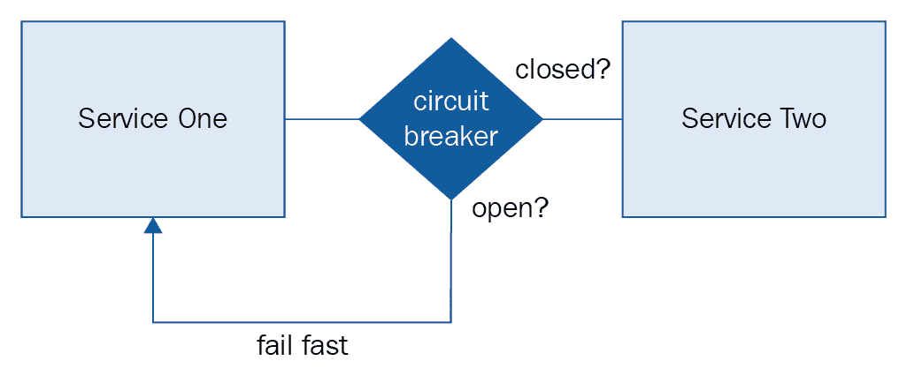

# 第五章：可靠性模式

在本章中，我们将介绍以下食谱：

+   使用断路器实现背压

+   使用指数退避重试请求

+   通过缓存提高性能

+   使用 CDN 作为服务的前端

+   优雅地降低用户体验

+   使用控制游戏日测试你的故障场景

+   引入自动化混沌

# 简介

可靠性正在成为分布式系统领域越来越受欢迎的话题。**站点可靠性工程师**（**SRE**）或**混沌工程师**的职位广告变得越来越常见，随着越来越多的组织转向云原生技术，系统故障总是现实，这一点变得越来越不容忽视。网络将经历拥塞，交换机、其他硬件组件将失败，系统中的各种潜在故障模式将在生产中让我们感到惊讶。完全防止故障是不可能的，因此我们应该尝试设计我们的系统，使其尽可能能够容忍故障。

微服务为设计可靠性提供了有趣和有用的机会。因为微服务鼓励我们将系统分解为封装单一职责的服务，我们可以使用许多有用的可靠性模式来隔离故障，当故障发生时。微服务架构在规划可靠性时也提出了许多挑战。对网络请求的依赖增加、异构配置、多个数据存储和连接池以及不同的技术栈都导致了一个本质上更复杂的环境，其中可能出现不同的故障模式。

无论是在处理微服务架构还是单体代码库，我们都发现自己从根本上对系统在某种故障状态下的行为感到惊讶[1]（你可以点击此链接获取更多信息：[`www.youtube.com/watch?v=tZ2wj2pxO6Q`](https://www.youtube.com/watch?v=tZ2wj2pxO6Q)）。从一开始就在我们的系统中构建弹性，使我们能够优化在这些情况下的反应。在本章中，我们将讨论在设计构建微服务时可以使用的许多有用的可靠性模式，以准备和减少预期和意外的系统故障的影响。

# 使用断路器

分布式系统中的故障可能难以调试。一个症状（延迟激增或高错误率）可能出现在根本原因（慢速数据库查询、垃圾回收周期导致服务减慢请求处理）很远的地方。有时，整个系统完全中断可能是系统一小部分故障的结果，尤其是在系统组件难以处理负载增加时。

在可能的情况下，我们希望防止系统一部分的故障级联到其他部分，导致广泛且难以调试的生产问题。此外，如果故障是暂时的，我们希望系统在故障结束后能够自我修复。如果特定服务因为负载的暂时激增而出现问题，我们应该设计我们的系统，使其防止对不健康服务的请求，在再次开始发送流量之前，给服务恢复的时间。

断路器在房屋中用于防止过度使用电力加热内部电线并烧毁房屋。如果断路器检测到过度使用且无法处理从其吸取的电流量，则电路会被跳闸。经过一段时间后，电路可以再次关闭，使系统正常工作。

这种相同的方法可以转化为软件，并应用于微服务架构。当一个服务调用另一个服务时，我们应该将 RPC 调用封装在断路器中。如果请求连续失败，表明服务不健康，断路器将被打开，防止进一步的请求尝试。调用服务可以“快速失败”并决定如何处理故障模式。在可配置的时间段后，我们可以允许另一个请求通过，如果它成功，则再次关闭断路器，使系统恢复正常操作。您可以查看以下相关的流程图：



大多数流行编程语言都有实现断路器的库。Netflix 开发的 Hystrix 容错库，在之前的菜谱中使用，就是这样的库之一。一些框架，如 Twitter 的 Finagle，会自动将 RPC 封装在断路器中，跟踪故障并自动管理断路器的状态。开源服务网格软件，如 **Conduit** 和 **Linkerd**，也会自动将断路器添加到 RPC 中。在本菜谱中，我们将介绍一个名为 `resilience4j` 的库，并使用其断路器实现来允许在达到故障阈值时，一个服务到另一个服务的调用快速失败。为了使示例更具体，我们将修改一个消息服务，该服务调用社交图谱服务以确定两个用户是否相互关注，并将 RPC 调用封装在断路器中。

# 如何操作...

为了演示在断路器中包装服务调用，我们将创建一个版本的`pichat`消息服务，该服务公开发送和检索消息的端点。要从发送者向接收者发送消息，这两个用户必须存在好友关系。好友关系由社交图服务处理。为了简单起见，我们将使用 Ruby 编写一个简单的模拟社交图服务，就像我们在之前的食谱中所做的那样。模拟服务将公开一个端点，列出指定用户的友谊。以下是 Ruby 中模拟社交图服务的源代码：

```js
require 'sinatra'
require 'json'

get '/friendships/:username' do
  content_type :json
  {
    'username': params[:username],
    'friendships': [
      'pichat:users:johndoe',
      'pichat:users:janesmith',
      'pichat:users:anotheruser'
    ]
  }.to_json
end
```

在我们的模拟服务中，我们使用`pichat:users:username`格式的字符串来识别系统中的用户。这些是伪 URI，它们唯一地标识了系统中的用户。现在，只需知道这些是用于识别系统中用户的唯一字符串。

我们的模拟社交图服务公开以下单个端点：

```js
GET /friendships/paulosman
```

前一个端点返回一个 JSON 响应体，表示请求用户拥有的好友关系：

```js
{
  "username": "fdsa",
  "friendships": [
    "pichat:users:foobar",
    "pichat:users:asomefdsa"
  ]
}
```

当我们的模拟社交图服务在本地主机上运行，端口`4567`（Ruby Sinatra 应用程序的默认端口）时，我们就可以开始编写我们的消息服务了。与之前的食谱一样，我们将使用 Java 和 Spring Boot 框架。我们还将使用`resilience4j`断路器库来包装从消息服务到社交图服务的调用。首先，我们将开发我们的消息服务代码，然后我们将添加`resilience4j`断路器库来为我们的服务添加一层弹性，如下面的步骤所示：

1.  创建一个新的 Gradle Java 项目，并将以下代码添加到`build.gradle`文件中：

```js
group 'com.packtpub.microservices'
version '1.0-SNAPSHOT'

buildscript {
    repositories {
        mavenCentral()
    }
    dependencies {
        classpath group: 'org.springframework.boot', name: 'spring-boot-gradle-plugin', version: '1.5.9.RELEASE'
    }
}

apply plugin: 'java'
apply plugin: 'org.springframework.boot'

sourceCompatibility = 1.8

repositories {
    mavenCentral()
}

dependencies {
    testCompile group: 'junit', name: 'junit', version: '4.12'
    compile group: 'org.springframework.boot', name: 'spring-boot-starter-web'
}
```

1.  我们的消息服务代码将有两个 bean 被自动注入到我们的控制器中。第一个是一个内存中的消息存储库（在现实世界的例子中，这将被替换为一个更持久的持久层），第二个是用于社交图服务的客户端。在我们创建这些之前，让我们创建一些支持对象。创建一个新的包名为`com.packtpub.microservices.ch05.message.exceptions`，并创建一个新的类名为`MessageNotFoundException`。这将用于表示消息无法找到，这将导致我们的服务返回`404`响应，如下所示：

```js
package com.packtpub.microservices.ch05.exceptions;

import org.springframework.http.HttpStatus;
import org.springframework.web.bind.annotation.ResponseStatus;

@ResponseStatus(HttpStatus.NOT_FOUND)
public class MessageNotFoundException extends Exception {
    public MessageNotFoundException(String message) { super(message); }
}
```

1.  在异常包中创建另一个类名为`MessageSendForbiddenException`。这将用于表示由于发送者和接收者不是朋友，无法发送消息。我们的服务将返回`403`禁止响应，如下所示：

```js
package com.packtpub.microservices.ch05.message.exceptions;

import org.springframework.http.HttpStatus;
import org.springframework.web.bind.annotation.ResponseStatus;

@ResponseStatus(HttpStatus.FORBIDDEN)
public class MessageSendForbiddenException extends Exception {
    public MessageSendForbiddenException(String message) { super(message); }
}
```

1.  创建`SocialGraphClient`类。创建一个新的包名为`com.packtpub.microservices.ch05.message.clients`，并创建一个新的类名为`SocialGraphClient`，如下所示：

```js
package com.packtpub.microservices.ch05.message.clients;

import com.packtpub.microservices.ch05.models.Friendships;
import org.springframework.web.client.RestTemplate;

import java.util.List;

public class SocialGraphClient {
    private String baseUrl;

    public SocialGraphClient(String baseUrl) {
        this.baseUrl = baseUrl;
    }

    public List<String> getFriendships(String username) {
        String requestUrl = baseUrl + "/friendships/" + username;
        RestTemplate template = new RestTemplate();
        UserFriendships friendships = template.getForObject(requestUrl, UserFriendships.class);
        return friendships.getFriendships();
    }
}
```

1.  让我们创建我们的模型。我们需要一个模型来表示特定用户拥有的`UserFriendships`，以及一个模型来表示`Messages`。创建一个新的包`com.packtpub.microservices.ch05.models`和一个名为`Friendships`的新类，如下所示：

```js
package com.packtpub.microservices.ch05.models;

import java.util.List;

public class Friendships {
    private String username;
    private List<String> friendships;

    public Friendships() {
        this.friendships = new ArrayList<>();
    }

    public Friendships(String username) {
        this.username = username;
        this.friendships = new ArrayList<>();
    }

    public Friendships(String username, List<String> friendships) {
        this.username = username;
        this.friendships = friendships;
    }

    public String getUsername() {
        return username;
    }

    public void setUsername(String username) {
        this.username = username;
    }

    public List<String> getFriendships() {
        return friendships;
    }

    public void setFriendships(List<String> friendships) {
        this.friendships = friendships;
    }
}
```

1.  在同一包中创建一个新的类，名为`Message`，如下所示：

```js
package com.packtpub.microservices.ch05.message.models;

import com.fasterxml.jackson.annotation.JsonProperty;

public class Message {
    private String id;
    private String sender;
    private String recipient;
    private String body;
    @JsonProperty("attachment_uri")
    private String attachmentUri;

    public Message() {}

    public Message(String sender, String recipient, String body, String attachmentUri) {
        this.sender = sender;
        this.recipient = recipient;
        this.body = body;
        this.attachmentUri = attachmentUri;
    }

    public Message(String id, String sender, String recipient, String body, String attachmentUri) {
        this.id = id;
        this.sender = sender;
        this.recipient = recipient;
        this.body = body;
        this.attachmentUri = attachmentUri;
    }

    public String getId() {
        return id;
    }

    public String getSender() {
        return sender;
    }

    public void setSender(String sender) {
        this.sender = sender;
    }

    public String getRecipient() {
        return recipient;
    }

    public void setRecipient(String recipient) {
        this.recipient = recipient;
    }

    public String getBody() {
        return body;
    }

    public void setBody(String body) {
        this.body = body;
    }

    public String getAttachmentUri() {
        return attachmentUri;
    }

    public void setAttachmentUri(String attachmentUri) {
        this.attachmentUri = attachmentUri;
    }
}
```

1.  在创建了我们的模型之后，我们现在可以继续我们的内存消息存储库。这个类简单地使用`HashMap`通过`UUID`键存储消息。这些消息是不可持久的，并且不会在服务重启后存活，因此这不是生产服务推荐的技术。该类有两个方法：`saved`，它生成 UUID 并将消息存储在映射中，以及`get`，它尝试从映射中检索消息。如果没有找到消息，将抛出异常，如下所示：

```js
package com.packtpub.microservices.ch05.message;

import com.packtpub.microservices.ch05.message.exceptions.MessageNotFoundException;
import com.packtpub.microservices.ch05.message.models.Message;

import java.util.HashMap;
import java.util.Map;
import java.util.UUID;

public class MessageRepository {

    private Map<String, Message> messages;

    public MessageRepository() {
        messages = new HashMap<>();
    }

    public Message save(Message message) {
        UUID uuid = UUID.randomUUID();
        Message saved = new Message(uuid.toString(), message.getSender(), message.getRecipient(),
                message.getBody(), message.getAttachmentUri());
        messages.put(uuid.toString(), saved);
        return saved;
    }

    public Message get(String id) throws MessageNotFoundException {
        if (messages.containsKey(id)) {
            Message message = messages.get(id);
            return message;
        } else {
            throw new MessageNotFoundException("Message " + id + " could not be found");
        }
    }
}
```

1.  我们的服务有一个用于消息的单个控制器。该控制器有两个端点，一个允许调用者通过 ID 检索消息（如果消息未找到，则返回`404`响应），另一个尝试发送消息（如果消息的发送者和接收者不是好友，则返回`403`响应）：

```js
package com.packtpub.microservices.ch05.message;

import com.packtpub.microservices.ch05.message.clients.SocialGraphClient;
import com.packtpub.microservices.ch05.message.exceptions.MessageNotFoundException;
import com.packtpub.microservices.ch05.message.exceptions.MessageSendForbiddenException;
import com.packtpub.microservices.ch05.message.models.Message;
import org.springframework.beans.factory.annotation.Autowired;
import org.springframework.http.ResponseEntity;
import org.springframework.web.bind.annotation.*;
import org.springframework.web.servlet.support.ServletUriComponentsBuilder;

import java.net.URI;
import java.util.List;

@RestController
public class MessageController {

    @Autowired
    private MessageRepository messagesStore;

    @Autowired
    private SocialGraphClient socialGraphClient;

    @RequestMapping(path = "/messages/{id}", method = RequestMethod.GET, produces = "application/json")
    public Message get(@PathVariable("id") String id) throws MessageNotFoundException {
        return messagesStore.get(id);
    }

    @RequestMapping(path = "/messages", method = RequestMethod.POST, produces = "application/json")
    public ResponseEntity<Message> send(@RequestBody Message message) throws MessageSendForbiddenException {

        List<String> friendships = socialGraphClient.getFriendships(message.getSender());
        if (!friendships.contains(message.getRecipient())) {
            throw new MessageSendForbiddenException("Must be friends to send message");
        }

        Message saved = messagesStore.save(message);
        URI location = ServletUriComponentsBuilder
                .fromCurrentRequest().path("/{id}")
                .buildAndExpand(saved.getId()).toUri();
        return ResponseEntity.created(location).build();
    }
}
```

1.  创建一个`Application`类，它简单地运行我们的应用程序并创建必要的 bean，这些 bean 将被连接到我们的控制器，如下所示：

```js
package com.packtpub.microservices.ch05.message;

import com.packtpub.microservices.ch05.message.clients.SocialGraphClient;
import org.springframework.boot.SpringApplication;
import org.springframework.boot.autoconfigure.SpringBootApplication;
import org.springframework.context.annotation.Bean;

@SpringBootApplication
public class Application {
    @Bean
    public MessageRepository messageRepository() {
        return new MessageRepository();
    }

    @Bean
    public SocialGraphClient socialGraphClient() {
        return new SocialGraphClient("http://localhost:4567");
    }

```

```js
    public static void main(String[] args) {
        SpringApplication.run(Main.class, args);
    }
}
```

此服务运行正常，并满足我们的主要要求：如果发送者和接收者不是好友，则无法发送消息，但它容易受到我们描述的所有问题的困扰。如果社交图服务出现问题，消息服务将依赖于`RestTemplate`客户端的超时，这将影响消息服务能够处理请求数量。此外，如果社交图服务过载并开始返回`503`（一个表示服务暂时不可用的 HTTP 状态码），消息服务没有机制允许社交图服务恢复。现在让我们介绍`resilience4j`断路器库，并将对社交图服务的调用封装起来：

1.  打开`build.gradle`并添加`resilience4j`断路器库到依赖项列表，如下所示：

```js
...
dependencies {
    testCompile group: 'junit', name: 'junit', version: '4.12'
 compile group: 'io.github.resilience4j', name: 'resilience4j-circuitbreaker', version: '0.11.0'
    compile group: 'org.springframework.boot', name: 'spring-boot-starter-web'
}
...
```

1.  修改`SocialGraphClient`以在调用社交图客户端时使用`CircuitBreaker`。如果`SocialGraphClient`返回失败，我们将返回一个空的`Friendships`实例，这将导致我们的服务对用户请求以`403`禁止（默认关闭）的方式响应。在这里我们将使用默认的断路器配置，但你应该查阅`resilience4j`的文档，其中包含大量关于配置断路器以满足你服务特定需求的信息。看看以下代码：

```js
package com.packtpub.microservices.ch05.clients;

import com.packtpub.microservices.ch05.models.Friendships;
import io.github.resilience4j.circuitbreaker.CircuitBreaker;
import io.github.resilience4j.circuitbreaker.CircuitBreakerRegistry;
import io.vavr.CheckedFunction0;
import io.vavr.control.Try;
import org.springframework.web.client.RestTemplate;

import java.util.List;

public class SocialGraphClient {
    private String baseUrl;

 private CircuitBreaker circuitBreaker;

    public SocialGraphClient(String baseUrl) {
        this.baseUrl = baseUrl;
        this.circuitBreaker = CircuitBreaker.ofDefaults("socialGraphClient");
    }

    public List<String> getFriendships(String username) {

        CheckedFunction0<Friendships> decoratedSupplier = CircuitBreaker.decorateCheckedSupplier(circuitBreaker, () -> {
            String requestUrl = baseUrl + "/friendships/" + username;
            RestTemplate template = new RestTemplate();
            return template.getForObject(requestUrl, Friendships.class);
        });

        Try<Friendships> result = Try.of(decoratedSupplier); 
 return result.getOrElse(new Friendships(username)).getFriendships();    }
}
```

现在我们将服务中的危险网络调用包装在断路器中，防止社交图服务中的故障级联到消息服务。在社交图服务出现暂时性故障的情况下，消息服务最终会快速失败，并给社交图服务恢复的时间。你可以通过强制模拟社交图服务返回错误代码来测试这一点——这是一个留给读者作为有趣练习的任务！

# 使用指数退避重试请求

分布式系统中的故障是不可避免的。我们不想完全防止故障，而是要设计能够自我修复的系统。为了实现这一点，当客户端启动重试时，必须有一个良好的策略。服务可能会暂时不可用或遇到需要值班工程师手动响应的问题。在任何一种情况下，客户端都应该能够排队并重试请求，以获得最佳的成功机会。

在出现错误时无限重试不是一个有效的策略。想象一下，一个服务开始经历高于正常水平的失败率，甚至可能高达 100%的请求失败。如果客户端持续不断地排队重试而不放弃，你最终会遇到暴风群问题——客户端无限期地重试请求。随着失败时间的推移，更多的客户端将遇到故障，导致更多的重试。你将遇到以下图表所示的交通模式，这与你在拒绝服务攻击期间看到的图表相似。最终结果将是相同的——由于服务过载而导致的级联故障，以及合法流量的流失。你的应用程序将变得不可用，而失败的服务将更难隔离和修复：


防止暴风群（thundering herds）的解决方案是添加一个指数增加重试间隔的退避算法，并在一定数量的失败后放弃。这种方法被称为有界指数退避。在重试之间添加一个指数增加的睡眠函数实现了我们目标的一半——客户端将减缓他们的重试尝试，分散负载。不幸的是，客户端的重试仍然会聚集，导致你的服务在一段时间内被许多并发请求猛烈打击。我们策略的第二部分通过向我们的睡眠函数添加随机值或抖动来解决这个问题，以分散重试。总结来说，我们的重试策略有以下三个要求：

+   重试必须使用指数退避来间隔

+   重试必须通过添加抖动进行随机化

+   重试必须在特定时间后终止

大多数 HTTP 库都将支持满足这些要求的重试策略。在本食谱中，我们将查看由 Google 编写的 Java HTTP `client`库。

# 如何做到这一点...

1.  为了演示使用指数退避和抖动，我们将创建一个简单的 Ruby 服务示例，它只有一个简单的任务：返回一个表示失败的 HTTP 状态码。在之前的菜谱中，我们使用了 `sinatra` Ruby 库来完成这个任务，所以我们将继续使用这个，一个简单地返回每个请求的 `503` HTTP 状态码的服务，如下所示：

```js
require 'sinatra'

get '/' do
  halt 503
end
```

1.  使用 Google HTTP `client` 库创建一个 HTTP 客户端。首先，创建一个新的 Gradle Java 项目，包含以下 `build.gradle` 文件，该文件导入必要的库和插件，如下所示：

```js
group 'com.packtpub.microservices'
version '1.0-SNAPSHOT'

apply plugin: 'java'
apply plugin: 'application'

mainClassName = 'com.packtpub.microservices.ch05.retryclient.Main'

sourceCompatibility = 1.8

repositories {
    mavenCentral()
}

dependencies {
    compile group: 'com.google.http-client', name: 'google-http-client', version: '1.23.0'
    testCompile group: 'junit', name: 'junit', version: '4.12'
}
```

1.  创建一个名为 `com.packtpub.microservices.ch05.retryclient` 的新包。创建一个名为 `Main` 的新类。在 `Main` 类中，我们只是创建一个 HTTP 请求并执行它。如果请求成功，我们将打印其状态码和一条友好的消息。如果成功失败，我们仍然会打印其状态码，但会附带一条表示出错的短信。我们 HTTP 客户端的第一个版本将不会尝试任何重试。此代码的目的是编写尽可能简单的客户端，而不是展示 Google HTTP `client` 库的功能，但我鼓励你查阅项目的文档以了解更多信息。让我们看一下以下代码：

```js
package com.packtpub.microservices.ch05.retryclient;

import com.google.api.client.http.*;
import com.google.api.client.http.javanet.NetHttpTransport;
import com.google.api.client.util.ExponentialBackOff;

import java.io.IOException;

public class Main {

    static final HttpTransport transport = new NetHttpTransport();

    public static void main(String[] args) {
        HttpRequestFactory factory = transport.createRequestFactory();
        GenericUrl url = new GenericUrl("http://localhost:4567/");

        try {
            HttpRequest request = factory.buildGetRequest(url);
            HttpResponse response = request.execute();
            System.out.println("Got a successful response: " + response.getStatusCode());
        } catch (HttpResponseException e) {
            System.out.println("Got an unsuccessful response: " + e.getStatusCode());
        } catch (IOException e) {
            e.printStackTrace();
        }
    }
}
```

1.  如果你使用你的 IDE 运行前面的代码，或者从命令行运行 `./gradlew run`，你会看到代码尝试进行单个 HTTP 请求，从我们的 Ruby 服务中收到 `503`，然后放弃。现在让我们使用一个可配置的退避策略，它具有随机化因子以添加抖动，如下所示：

```js
package com.packtpub.microservices.ch05.retryclient;

import com.google.api.client.http.*;
import com.google.api.client.http.javanet.NetHttpTransport;
import com.google.api.client.util.ExponentialBackOff;

import java.io.IOException;

public class Main {

    static final HttpTransport transport = new NetHttpTransport();

    public static void main(String[] args) {
        HttpRequestFactory factory = transport.createRequestFactory();
        GenericUrl url = new GenericUrl("http://localhost:4567/");

        try {
            HttpRequest request = factory.buildGetRequest(url);
            ExponentialBackOff backoff = new ExponentialBackOff.Builder()
 .setInitialIntervalMillis(500)
 .setMaxElapsedTimeMillis(10000)
 .setMaxIntervalMillis(6000)
 .setMultiplier(1.5)
 .setRandomizationFactor(0.5)
 .build(); 
 request.setUnsuccessfulResponseHandler(
 new HttpBackOffUnsuccessfulResponseHandler(backoff));
            HttpResponse response = request.execute();
            System.out.println("Got a successful response: " + response.getStatusCode());
        } catch (HttpResponseException e) {
            System.out.println("Got an unsuccessful response: " + e.getStatusCode());
        } catch (IOException e) {
            e.printStackTrace();
        }
    }
}
```

1.  如果你现在运行程序并查看你的 Ruby 服务的日志，你会看到代码会尝试多次进行请求，在重试之间增加睡眠时间，最终在约 10 秒后放弃。在现实世界的设置中，这可能会给服务足够的时间可能恢复，同时不会产生一群暴风雨般的用户，从而消除任何修复的可能性。

# 通过缓存提高性能

微服务应该设计成这样，即单个服务通常是唯一读取或写入特定数据存储的东西。在这个模型中，服务对其提供的业务能力中涉及的领域模型拥有完全的所有权。清晰的边界使得考虑系统中数据的生命周期变得更加容易。我们系统中的某些模型会频繁更改，但许多模型会被读取得比写入得多。在这些情况下，我们可以使用缓存来存储不经常更改的数据，从而在每次请求对象时节省我们向数据库发送请求。数据库查询通常比缓存查找更昂贵，因此尽可能使用缓存是理想的。

除了帮助提高性能外，一个有效的缓存层还可以帮助提高服务的可靠性。无法保证数据库的 100% 可用性，因此，在数据库故障的情况下，服务可以回退到提供缓存数据。在大多数情况下，对于用户来说，即使数据是旧的并且可能过时，也比完全收不到数据要好。拥有一个缓存层允许您配置您的服务，使其作为另一个可用数据源来为您的服务用户提供服务。

在这个菜谱中，我们将创建一个简单的示例服务，该服务提供有关应用程序用户的信息。它将有两个端点，第一个端点将接受 POST 请求并将正确格式化的用户持久化到数据库中。第二个端点将通过指定的 ID 获取用户表示。ID 存储为 UUID，这比自增 ID 更好，原因很多，我们将在后面的章节中详细说明。我们将从基本服务开始，然后添加缓存，以便我们可以看到具体需要哪些步骤。在这个菜谱中，我们将使用 Redis，这是一个流行的开源内存数据结构存储库，特别适用于存储键值对。

# 如何做到这一点...

1.  创建一个名为 caching-user-service 的 Gradle Java 项目，并使用以下 `build.gradle` 文件。请注意，我们正在添加对 **Java Persistence API** （**JPA**）和 Java MySQL `client` 库的依赖项：

```js
group 'com.packtpub.microservices.ch05'
version '1.0-SNAPSHOT'

buildscript {
    repositories {
        mavenCentral()
    }
    dependencies {
        classpath("org.springframework.boot:spring-boot-gradle-plugin:2.0.0.RELEASE")
    }
}

apply plugin: 'java'
apply plugin: 'org.springframework.boot'

sourceCompatibility = 1.8

repositories {
    mavenCentral()
}

dependencies {
    compile group: 'org.springframework.boot', name: 'spring-boot-starter-web', version: '2.0.0.RELEASE'
```

```js
    compile group: 'org.springframework.boot', name: 'spring-boot-starter-data-jpa', version: '2.0.0.RELEASE'
    compile group: 'mysql', name: 'mysql-connector-java', version: '6.0.6'
    testCompile group: 'junit', name: 'junit', version: '4.12'
}
```

1.  创建 `Main` 类。像往常一样，这是我们的应用程序的主要入口点，相当简单：

```js
package com.packtpub.microservices.ch05.userservice;

import org.springframework.boot.SpringApplication;
import org.springframework.boot.autoconfigure.SpringBootApplication;

@SpringBootApplication
public class Main {
    public static void main(String[] args) {
        SpringApplication.run(Main.class, args);
    }
}
```

1.  在 `com.packtpub.microservices.ch05.userservice.models` 包中创建一个 `User` 类。这将成为我们的实体表示，并包含将存储在数据库中并最终存储在我们的 Redis 缓存中的字段：

```js
package com.packtpub.microservices.ch05.userservice.models;

import com.fasterxml.jackson.annotation.JsonProperty;
import org.hibernate.annotations.GenericGenerator;

import javax.persistence.Column;
import javax.persistence.Entity;
import javax.persistence.GeneratedValue;
import javax.persistence.Id;

@Entity
public class User {

    @Id
    @GeneratedValue(generator = "uuid")
    @GenericGenerator(name = "uuid", strategy = "uuid2")
    private String id;

    private String username;

    @JsonProperty("full_name")
    private String fullName;

    private String email;

    public User() {}

    public String getId() {
        return id;
    }

    public void setId(String id) {
        this.id = id;
    }

    public String getUsername() {
        return username;
    }

    public void setUsername(String username) {
        this.username = username;
    }

    public String getFullName() {
        return fullName;
    }

    public void setFullName(String fullName) {
        this.fullName = fullName;
    }

    public String getEmail() {
        return email;
    }

    public void setEmail(String email) {
        this.email = email;
    }
}
```

1.  要将我们的 `User` 实体连接到 MySQL 数据库，创建一个 `UserRepository` 接口，该接口扩展了由 `springframework` 数据包定义的 `CrudRepository` 接口，如下所示：

```js
package com.packtpub.microservices.ch05.userservice.db;

import com.packtpub.microservices.ch05.userservice.models.User;
import org.springframework.data.repository.CrudRepository;

public interface UserRepository extends CrudRepository<User, String> {}
```

1.  创建 `UserController` 类。这是一个 `RestController`，它将某些端点映射到之前讨论的功能，即创建和检索用户记录。这里的一切都应该很熟悉。值得注意的是，`findById` 方法返回 `Optional<T>`，因此我们使用 `map` 和 `orElseGet` 来返回一个包含用户响应体的 `200 OK HTTP` 响应或一个 `404` 状态，如下面的代码所示：

```js
package com.packtpub.microservices.ch05.userservice.controllers;

import com.packtpub.microservices.ch05.userservice.db.UserRepository;
import com.packtpub.microservices.ch05.userservice.models.User;
import org.springframework.beans.factory.annotation.Autowired;
import org.springframework.http.HttpStatus;
import org.springframework.http.ResponseEntity;
import org.springframework.web.bind.annotation.*;

import java.util.Optional;

@RestController
public class UserController {

    @Autowired
    private UserRepository userRepository;

    @RequestMapping(path = "/users", method = RequestMethod.POST, produces = "application/json")
    public User create(@RequestBody User user) {
        User savedUser = userRepository.save(user);
        return savedUser;
    }

    @RequestMapping(path = "/users/{id}", method = RequestMethod.GET, produces = "application/json")
    public ResponseEntity<User> getById(@PathVariable("id") String id) {
        Optional<User> user = userRepository.findById(id);

        return user.map(u -> new ResponseEntity<>(u, HttpStatus.OK)).orElseGet(
                () -> new ResponseEntity<>(HttpStatus.NOT_FOUND));
    }
}
```

1.  将以下 `application.properties` 文件添加到 `src/main/resources` 目录。它包含连接到本地 MySQL 实例所需的必要配置。假设您已经安装了 MySQL 并在本地运行它。您还应该创建一个名为 `users` 的数据库，一个名为 `userservice` 的用户，密码为 `password`。请注意，我们将 `ddl-auto` 设置为 `create`，这对于开发来说是一个好习惯，但不应该用于生产：

```js
spring.jpa.hibernate.ddl-auto=create
spring.datasource.url=jdbc:mysql://localhost:3306/users?serverTimezone=UTC&&&useSSL=false
spring.datasource.username=userservice
spring.datasource.password=password
```

1.  让我们添加一些缓存！我们首先需要再次打开`application.properties`文件，并为在端口`6379`（默认端口）上本地运行的`redis`实例添加一些配置，如下所示：

```js
spring.jpa.hibernate.ddl-auto=create
spring.datasource.url=jdbc:mysql://localhost:3306/users?serverTimezone=UTC&&&useSSL=false
spring.datasource.username=userservice
spring.datasource.password=password
spring.cache.type=redis
spring.redis.host=localhost
spring.redis.port=6379
```

1.  在我们的应用程序配置为使用 MySQL 作为主数据源和 Redis 作为缓存后，我们现在可以覆盖`CrudRepository<T, ID>`接口中的方法，并添加注释来指示它进行缓存。我们希望在每次使用`User`对象调用`save`方法时都写入缓存，并在每次使用有效的用户 ID 字符串调用`findById`时都从缓存中读取：

```js
package com.packtpub.microservices.ch05.userservice.db;

import com.packtpub.microservices.ch05.userservice.models.User;
import org.springframework.cache.annotation.CachePut;
import org.springframework.cache.annotation.Cacheable;
import org.springframework.data.repository.CrudRepository;
import org.springframework.stereotype.Repository;

import java.util.Optional;

@Repository
public interface UserRepository extends CrudRepository<User, String> {
    @Override
    @Cacheable(value = "users", key = "#id")
 Optional<User> findById(String id);

    @Override
    @CachePut(value = "users", key = "#user.id")
 User save(User user);
}
```

1.  就这样！您可以通过运行服务、创建用户、验证用户是否同时在 MySQL 数据库和 Redis 缓存中，然后从数据库中删除用户来测试这一点。对`users/ID`端点的请求仍然会返回用户记录。在完成此服务之前，您需要确保如果用户被删除，缓存将被无效化。任何修改用户的其他端点都应该使缓存无效化或重写缓存。这留给读者作为练习！

# 使用 CDN 作为服务的前端

**内容分发网络**（**CDN**）通过全球分布的代理服务器网络交付内容，从而提高性能和可用性。当用户（通常通过他们的移动设备）通过 CDN 对您的 API 进行请求时，他们将根据他们的地理位置与许多**存在点**（**PoPs**）之一建立网络连接。无需为每个请求往返到源数据中心，内容可以在 CDN 的边缘进行缓存，这大大减少了用户的响应时间，并减少了不必要的、昂贵的流量到源。

如果您计划拥有全球用户基础，CDN（内容分发网络）是必需的。如果您的应用程序 API 的每个请求都必须完整往返到单个源，那么您将为那些物理上远离您托管应用程序数据中心的世界各地的用户创造一个次优体验。即使您在多个数据中心托管您的应用程序，您也永远无法使用 CDN 为尽可能多的用户提供与不使用 CDN 时一样高性能的体验。

除了性能之外，CDN 还可以提高您应用程序的可用性。正如我们在前面的菜谱中讨论的那样，您系统中的许多实体被读取的频率远高于它们被写入的频率。在这些情况下，您可以配置您的 CDN 将服务的数据包缓存一定的时间（通常由 TTL 或生存时间指定）。从您的服务缓存响应可以减少发送到源头的流量，使其更难耗尽容量（计算、存储或网络）。此外，如果您的服务开始出现高延迟，或完全或部分故障，您可以配置 CDN 在服务故障时提供缓存响应而不是继续向故障服务发送流量。这至少允许您在服务中断的情况下向用户提供内容。

一些 CDN 提供商具有 API，允许您自动使资源无效。在这些情况下，您可以配置您的微服务以使资源无效，就像您使用基于 Redis 或 Memcached 的缓存那样，如前一个菜谱中所述。

市面上有许多不同的 CDN 提供商。其中一些大型提供商包括**Akamai**和**Edgecast**。亚马逊网络服务提供了一种称为 CloudFront 的 CDN 服务，可以配置为向 AWS 中的源服务器或 S3 存储桶中托管的静态资源发送请求。CDN 市场中更受开发者欢迎的提供之一来自一家名为**Fastly**的公司。Fastly 是使用开源的 Web 应用程序加速器**Varnish**构建的。

作为提供商，Fastly 允许您上传自己的**Varnish 配置语言**（**VCL**）文件，从而有效地允许您根据请求的任何方面（传入的标题、路径段、查询字符串参数等）创建缓存规则。此外，Fastly 提供了一种**快速清除 API**，允许您根据 URI 使资源无效。

在本菜谱中，我们将介绍创建 CDN 提供商账户并开始通过 CDN 提供服务的基本步骤。我们将使用一个假设的服务，该服务通过主机名`api.pichat.me`对公众互联网开放。该服务通过检查传入请求的 Authorization 头中的有效 OAuth2 令牌值来验证请求。

# 如何做到这一点...

1.  在本例中，我们将使用 Fastly 作为 CDN 提供商创建一个账户。截至本文撰写时，注册 URL 为`https://www.fastly.com/signup`。

1.  Fastly 会要求您创建一个服务。为您的服务输入一个名称，以及应用程序运行的源服务器的域名（`api.pichat.me`）和主机名。

1.  使用您的域名 DNS 提供商，为`api.pichat.me`创建一个 CNAME，将您的域名指向 Fastly 的服务器。阅读更新的文档以了解要使用的主机名。

1.  一旦设置好并创建了你的服务，对你的主机名的请求现在将通过 Fastly CDN 进行。阅读 Fastly 文档 ([`docs.fastly.com/guides/basic-setup/`](https://docs.fastly.com/guides/basic-setup/)) 以了解如何为你的服务自定义 VCL 和其他设置。

# 优雅地降级用户体验

我们现在已经明白，一定程度的失败是不可避免的。在一个足够复杂的系统中，有时总会发生一些故障。通过使用本章中的技术，我们可以尝试减少这些故障中任何一个影响客户的可能性。尽管我们尽力防止其发生，但在应用程序的生命周期中，某种类型的故障可能会在某个时刻影响客户体验。然而，面对系统故障，用户可能会表现出令人惊讶的同情心，只要用户体验能够优雅地降级。

考虑以下场景：你正在使用一个允许你浏览产品目录并查找销售该产品的本地商店的应用程序，同时提供诸如地址、电话号码和营业时间等重要信息。假设提供本地商店信息的那个服务变得不可用。这显然以一种不太理想的方式影响了用户体验，但应用程序可以以多种方式处理这种故障。最糟糕的方式可能是允许故障级联并使产品目录崩溃。稍微好一点的方式可能是允许用户继续搜索产品，但当用户去查找销售该产品的本地商店时，他们通过某种信息框被告知本地商店信息目前不可用。这很令人沮丧，但至少他们还可以查看产品信息，如价格、型号和颜色。更好的方式是认识到该服务未运行，并有一些信息横幅通知用户本地商店信息暂时不可用。有了这些信息，我们可以通知用户情况，让他们决定是否仍然想继续搜索产品。这种体验不是最优的，但我们避免了不必要的用户沮丧。

# 通过 Gameday 练习验证容错性

本章包含了一些食谱，可以帮助你创建更可靠、更具弹性的微服务架构。每个食谱都记录了一种预测和应对某种故障场景的模式或技术。我们构建弹性系统时的目标是尽可能减少对用户的影响来容忍故障。在构建分布式系统时，预测和为故障设计是至关重要的，但如果没有验证我们的系统是否以我们预期的方式处理故障，我们做的就不仅仅是希望，而希望绝对不是一种策略！

在构建系统时，单元测试和功能测试是我们信心构建工具包的必要部分。然而，这些工具本身并不足够。单元测试和功能测试通过隔离依赖项来工作，例如，好的单元测试不依赖于网络条件，而功能测试不涉及在生产级流量条件下进行测试，而是专注于在各种理想条件下软件组件协同工作。为了对系统的容错性有更大的信心，有必要观察它在生产环境中对失败的响应。

Gameday 练习是构建系统弹性信心的另一种有用工具。这些练习涉及在生产环境中强制某些故障场景，以验证我们对容错性的假设是否符合现实。约翰·奥尔斯帕在论文《生产中的故障注入》中详细描述了这种做法。如果我们接受完全避免失败是不可能的，那么强制失败并观察我们的系统如何响应它作为计划内的练习是有意义的。当整个团队都在现场并准备采取行动时，让系统首次失败比在凌晨 3 点系统警报唤醒值班工程师时更好。

计划 Gameday 练习提供了大量价值。工程师们应该聚在一起，头脑风暴他们服务可能遇到的各类故障场景。然后应安排工作以尝试减少或消除这些场景的影响（即，在数据库故障的情况下，回滚到缓存）。每个 Gameday 练习都应该有一个规划文档，描述正在测试的系统、各种故障场景，包括将采取的步骤来模拟故障、围绕系统应该如何响应故障的期望，以及预期对用户（如果有）的影响。随着 Gameday 练习的进行，团队应逐一处理每个场景，记录观察结果——重要的是要确保我们期望看到的指标正在发出，我们期望触发的警报确实触发了，并且故障以我们期望的方式得到处理。在观察到差异时，记录任何期望与现实之间的差异。这些观察结果应成为计划中的工作，以弥合理想世界与现实世界之间的差距。

与逐步审查代码不同，这个配方将演示一个过程和模板，可以用来运行 Gameday 练习。以下不是进行 Gameday 练习的唯一方法，但应该作为您组织的一个良好起点。

# 前置条件

总是有些先决条件你应该在尝试运行游戏日练习之前确保满足。具体来说，你的团队应该习惯于使用必要的指标和警报来对代码进行仪表化，以便在生产环境中提供一定程度的可观察性。你的团队应该有在理解良好且经过实践的事故响应流程中工作的经验，这包括定期进行回顾，以便在生产事件中不断改进。

最后，你的组织应该习惯于公开讨论故障和意外的生产事件，并致力于鼓励持续改进的过程。这些先决条件应该表明，你的团队有必要的组织支持和心理安全感来执行这些类型的弹性练习。

# 如何做...

1.  游戏日练习的第一步是选择一个将要测试的系统。当你刚开始进行游戏日时，选择一个理解良好、之前已经失败并且对用户影响有限的系统是明智的。

1.  一旦选择了服务，召集负责其开发和运营的团队，并开始头脑风暴不同的故障场景。如果有一个数据存储，考虑如果由于硬件故障突然不可用会发生什么。也许数据库可以被手动关闭。如果数据库以不安全的方式终止会发生什么？服务运行在某种集群配置中，那么如果从负载均衡器中移除一个节点会发生什么？当所有节点都失败并被从负载均衡池中移除时会发生什么？另一个需要测试的领域是意外的延迟。在分布式系统中，足够高的延迟与服务不可用难以区分，因此这里可能存在许多有趣的错误。召集团队讨论所有这些场景（以及其他场景）可以是一种了解系统的极好方式。记录下你计划测试的所有场景。

1.  安排一个时间和房间进行游戏日实验（如果你是远程团队，安排所有人一起进行视频通话）。邀请负责被测试服务的团队、客户支持团队的代表以及任何对实验感兴趣的利益相关者。

1.  使用模板，例如这里包含的模板，详细规划实验的进行方式。在预定时间当天，首先概述正在测试的系统。这是一个确保每个人都对系统工作方式有统一看法的好机会。然后逐个场景进行，将实际操作分配给团队中的某个人。

1.  记录实验期间的观察结果，详细说明系统对故障注入的反应。

1.  如果实验中观察到的结果与预期不同，安排后续任务，以工单的形式让团队纠正差异。

# Gameday 练习的模板

以下模板可用于计划和执行 Gameday 练习。

**系统:** 消息服务

****系统概述:****

对待测试系统的详细描述（可能包括图表）。记录请求如何路由到系统、与之交互的一些主要系统、它使用的数据存储及其一般配置，以及它依赖的任何下游服务是个好主意。

**仪表板:**

在 Gameday 练习进行期间，查看重要仪表板的链接。

**测试场景:**

**场景:** 由于节点被终止，数据库变得不可用。

**方法:**

使用 AWS CLI 工具手动关闭数据库 EC2 节点（包括实际命令）。

**预期:**

列出你期望服务如何反应。包括关于预期指标变化、应触发的警报、系统行为和用户影响等详细信息。

**观察:**

记录实际测试过程中的观察结果。

**后续行动项目:**

为实验结果导致的任何后续工作创建工单。

# 引入自动化混沌

运行手动 Gameday 练习是引入故障注入实践的好方法。在生产环境中强制故障有助于增强对系统弹性的信心，并识别改进的机会。Gameday 帮助团队更好地理解他们的系统在面对多种故障场景时的行为。随着团队进行更多练习，它将开始积累执行常见任务（如在网络中引入延迟或增加 CPU 使用率）的工具。工具有助于自动化日常任务，提高 Gameday 练习的效率。有各种开源和商业工具旨在自动化混沌工程，团队可以立即利用这些工具。

Gameday 练习是计划并安排的。一些组织更进一步，引入持续故障注入作为确保系统能够顺利处理常见故障场景的一种方式。2011 年初，Netflix 宣布创建了 Simian Army——一套旨在将常见故障注入生产环境的工具集。Simian Army 中最著名的成员之一，Chaos Monkey，会随机关闭生产环境中的节点。Simian Army 工具已经开源，可供您的组织使用。它们可以计划作为 Gameday 练习的一部分运行，或者设置为特定的时间表（即周一至周五，上午 9 点至下午 5 点，当值工程师通常在办公室时）。

在这个领域的先驱者，PagerDuty，自 2013 年以来一直在进行“故障周五”。每周五，工程师们聚在一起攻击特定的服务。随着时间的推移，工程师们开始在他们的聊天机器人中构建命令以执行常见功能，例如将节点从其他网络流量中隔离出来，甚至添加了一个“轮盘”命令，该命令可以随机选择主机进行重启。

已开发托管商业服务以帮助自动化混沌工程。Gremlin 是一个托管产品，旨在通过提供对安装在您环境中节点上的代理执行的“攻击”库来帮助团队运行 Gameday 练习。Gremlin 提供了一个 API 和一个 Web 界面，允许用户配置旨在激增资源使用（CPU、内存、磁盘）的攻击，通过终止进程或重启主机来模拟随机故障，并模拟常见的网络条件，如延迟和**网络时间协议**（**NTP**）漂移。拥有像 Gremlin 这样的产品可以降低开始进行故障注入所需的前期工作量。

另一个开源工具是混沌工具包，这是一个 CLI 工具，旨在使设计和运行实验更容易。在本配方中，我们将安装混沌工具包，并使用它来对一个假设的用户服务执行简单实验。用户服务将是我们在本章早期“通过缓存提高性能”配方中编写的同一个服务。

# 如何操作...

1.  混沌工具包是用 Python 编写的，可以使用`pip`进行安装。我们需要一个有效的 Python3 环境。本配方将假设您正在使用 Homebrew 在 macOS X 上安装它。首先，安装`pyenv`——一个支持管理多个 Python 开发环境的实用工具，如下所示：

```js
$ brew install pyenv
```

1.  通过执行以下命令行来安装 Python3：

```js
$ pyenv install 3.4.2
$ pyenv global 3.4.2
```

1.  使用新安装的 Python3 环境，执行以下命令行来安装混沌工具包：

```js
 $ pip install -U chaostoolkit
```

1.  混沌工具包使用 JSON 文件来描述实验。每个实验都应该有一个标题、描述，以及可选的一些用于对实验进行分类的标签。`steady-state-hypothesis`部分描述了服务在正常条件下的预期行为。在我们的情况下，我们假设如果找到用户，服务将返回`200`，如果没有找到用户，则返回`404`：

```js
{
  "title": "Kill MySQL process",
  "description": "The user service uses a MySQL database to store user information. This experiment will test how the service behaves when the database is unavailable.",
  "tags": [
    "database", "mysql"
  ],
  "steady-state-hypothesis": {
    "title": "Service responds when MySQL is running",
    "probes": [
      {
        "type": "probe",
        "name": "service-is-running",
        "tolerance": [200, 404],
        "provider": {
          "type": "http",
          "url": "http://localhost:8080/users/12345"
        }
      }
    ]
  },
  "method": [
    {
      "name": "kill-mysql-process",
      "type": "action",
      "provider": {
        "type": "process",
        "path": "/usr/local/bin/mysql.server",
        "arguments": ["stop"],
        "timeout": 10
      }
    }
  ]
}
```

1.  运行以下实验：

```js
$ chaos run
```

1.  如果成功，输出应表明当 MySQL 不可用时，服务响应良好。然而，在其当前状态下，实验将使 MySQL 停止，这并不理想。现在你有一些东西要修复，这留给读者作为练习，并且你可以重新运行你的实验。恭喜！你刚刚运行了你的第一个自动化混沌实验。
