# 第十一章：OpenAPI（Swagger）规范

OpenAPI 规范，最著名的是其前身 Swagger，是一个 JSON 模式，可用于构建一组 RESTful API 的 JSON 或 YAML 定义。OpenAPI 本身是与语言无关的，这意味着底层 API 可以使用开发人员喜欢的任何语言、任何工具或框架来构建。OpenAPI 文档的唯一关注点是描述 API 端点的输入和输出等内容。在这方面，OpenAPI 文档充当了一个文档工具，使开发人员能够轻松地以广泛已知、理解和支持的格式描述其公共 API。

然而，OpenAPI 文档不仅仅局限于文档。已开发了许多工具，这些工具能够使用 OpenAPI 文档自动生成客户端项目、服务器存根、用于直观检查 OpenAPI 文档的 API 资源管理器 UI，甚至服务器生成器。开发人员可以在[`swagger.io`](https://swagger.io)找到 Swagger Editor、Codegen 和 UI 等工具。

虽然存在一些工具可以生成 OpenAPI 文档，但许多开发人员将这些文档保存为单独的 JSON 或 YAML 文件。他们可以使用 OpenAPI 引用机制将文档分解成更小的部分。在 Nest.js 中，开发人员可以使用单独的模块来为他们的应用程序生成 OpenAPI 文档。Nest.js 将使用您在控制器中提供的装饰器来生成有关项目中 API 的尽可能多的信息，而不是手动编写 OpenAPI 文档。当然，它不会一步到位。为此，Nest.js swagger 模块提供了额外的装饰器，您可以使用它们来填补空白。

在本章中，我们将探讨使用 Nest.js Swagger 模块生成 swagger 版本 2 文档。我们将从配置 Nest.js Swagger 模块开始。我们将设置我们的博客示例应用程序以使用 Swagger UI 公开 swagger 文档，并开始探索 Nest.js 装饰器如何影响 swagger 文档。我们还将探索 swagger 模块提供的新装饰器。在本章结束时，您将完全了解 Nest.js 如何生成 swagger 文档。在开始之前，请确保在项目中运行`npm install @nestjs/swagger`以查看工作示例，记住您可以克隆本书的附带 Git 存储库：

`git clone https://github.com/backstopmedia/nest-book-example.git`

# 文档设置

每个 swagger 文档都可以包含一组基本属性，例如应用程序的标题。可以使用`DocumentBuilder`类上找到的各种公共方法来配置此信息。这些方法都返回文档实例，允许您链式调用尽可能多的方法。在调用`build`方法之前，请确保完成配置。一旦调用了`build`方法，文档设置将不再可修改。

```js
const swaggerOptions = new DocumentBuilder()
    .setTitle('Blog Application')
    .setDescription('APIs for the example blog application.')
    .setVersion('1.0.0')
    .setTermsOfService('http://swagger.io/terms/')
    .setContactEmail('admin@example.com')
    .setLicense('Apache 2.0', 'http://www.apache.org/licenses/LICENSE-2.0.html')
    .build();

```

这些方法用于配置 swagger 文档的`info`部分。Swagger 规范要求提供`title`和`version`字段，但 Nest.js 将这些值默认为一个空字符串和`"1.0.0"`，分别。如果您的项目有服务条款和许可证，您可以使用`setTermsOfService`和`setLicense`在应用程序中提供这些资源的 URL。

Swagger 文档还可以包含服务器信息。用户、开发人员和 UI 可以使用此信息来了解如何访问文档中描述的 API。

```js
const swaggerOptions = new DocumentBuilder()
    .setHost('localhost:3000')
    .setBasePath('/')
    .setSchemes('http')
    .build();

```

`setHost`应仅包含访问 API 的服务器和端口。如果在应用程序中使用`setGlobalPrefix`为 Nest.js 应用程序配置基本路径，则使用`setBasePath`在 swagger 文档中设置相同的值。swagger 规范使用`schemes`数组来描述 API 使用的传输协议。虽然 swagger 规范支持`ws`和`wss`协议以及多个值，但 Nest.js 将该值限制为`http`或`https`。还可以添加元数据和外部文档，以向 swagger 文档的用户提供有关 API 工作方式的其他详细信息。

```js
const swaggerOptions = new DocumentBuilder()
    .setExternalDoc('For more information', 'http://swagger.io')
    .addTag('blog', 'application purpose')
    .addTag('nestjs', 'framework')
    .build();

```

使用`setExternalDoc`的第一个参数描述外部文档，第二个参数是文档的 URL。可以使用`addTag`向文档添加无数个标签。唯一的要求是`addTag`的第一个参数必须是唯一的。第二个参数应描述标签。最后一个文档设置是用户如何与 API 进行身份验证。

## 记录身份验证

swagger 规范支持三种类型的身份验证：基本、API 密钥和 Oauth2。Nest.js 提供了两种不同的方法，可以用于自动配置 swagger 文档的身份验证信息，并且可以覆盖一些设置。请记住，这描述了用户如何对您的应用程序进行身份验证。

```js
const swaggerOptions = new DocumentBuilder()
    .addBearerAuth('Authorization', 'header', 'apiKey')
    .build();

```

如果您的应用程序使用`basic`身份验证，用户名和密码作为 base64 编码的字符串，或 JSON web 令牌（JWT），您将使用`addBearerAuth`配置方法。上面的示例使用 Nest.js 的默认值，如果没有传递参数，Nest.js 将使用这些默认值，并确定 API 使用类似 JWT 的 API 密钥在授权标头中。第一个参数应包含应提供身份验证密钥的密钥/标头。如果用户将使用应用程序密钥访问 API，则应使用相同的配置。应用程序密钥通常由公共 API 提供商（如 Google Maps）使用，以限制对 API 的访问并将 API 调用与特定的计费账户关联起来。

```js
const swaggerOptions = new DocumentBuilder()
    .addBearerAuth('token', 'query', 'apiKey')
    .addBearerAuth('appId', 'query', 'apiKey')
    .build();

```

此示例描述了调用需要身份验证的 API 时必须包含的两个查询参数。第二个参数描述了身份验证密钥应该放在哪里，可以是标头、查询或正文参数。第三个参数是身份验证的类型。使用`addBearerAuth`时，使用`apiKey`或`basic`。除了基本和 API 密钥身份验证外，swagger 还支持记录 Oauth2 身份验证流程。

```js
const swaggerOptions = new DocumentBuilder()
    .addOAuth2('password', 'https://example.com/oauth/authorize', 'https://example.com/oauth/token', {
      read: 'Grants read access',
      write: 'Grants write access',
      admin: 'Grants delete access'
    })
    .build();

```

`addOAuth2`方法的第一个参数是 API 用于身份验证的 OAuth2 流。在此示例中，我们使用`password`流来指示用户应向 API 发送用户名和密码。您还可以使用`implicit`、`application`和`accessCode`流。第二个和第三个参数是用户将授权访问 API 和请求刷新令牌的 URL。最后一个参数是应用程序中可用的所有范围及其描述的对象。

对于博客应用程序，我们将保持配置简单，并将配置存储在`shared/config`目录中的新文件中。有一个中心位置将使我们只需编写一次配置并多次实现。

```js
export const swaggerOptions = new DocumentBuilder()
    .setTitle('Blog Application')
    .setDescription('APIs for the example blog application.')
    .setVersion('1.0.0')
    .setHost('localhost:3000')
    .setBasePath('/')
    .setSchemes('http')
    .setExternalDoc('For more information', 'http://swagger.io')
    .addTag('blog', 'application purpose')
    .addTag('nestjs', 'framework')
    .addBearerAuth('Authorization', 'header', 'apiKey')
    .build();

```

我们的第一个实现将使用配置和 Nest.js swagger 模块在我们的应用程序中生成两个新的端点：一个用于提供 swagger UI 应用程序，另一个用于提供原始 JSON 格式的 swagger 文档。

# Swagger UI

swagger 模块与大多数其他 Nest.js 模块不同。它不是被导入到应用程序的主要 app 模块中，而是在应用程序的主要引导中进行配置。

```js
async function bootstrap() {
    const app = await NestFactory.create(AppModule);

    const document = SwaggerModule.createDocument(app, swaggerOptions);
    SwaggerModule.setup('/swagger', app, document);

    await app.listen(process.env.PORT || 3000);
}

```

在声明 Nest 应用程序并在调用`listen`方法之前，我们使用上一节配置的 swagger 文档选项和`SwaggerModule.createDocument`来创建 swagger 文档。Swagger 模块将检查应用程序中的所有控制器，并使用装饰器在内存中构建 swagger 文档。

一旦我们创建了 swagger 文档，我们设置并指示 swagger 模块在指定路径上提供 swagger UI，`SwaggerModule.setup('/swagger', app, document)`。在幕后，swagger 模块使用`swagger-ui-express` NodeJS 模块将 swagger 文档转换为完整的 Web UI 应用程序。

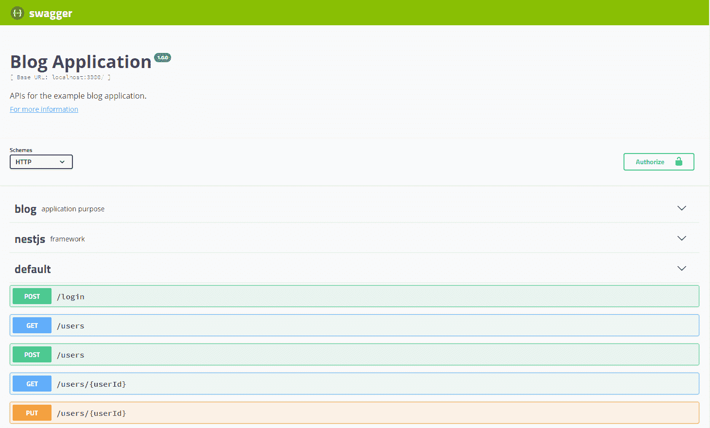

上图显示了一个使用我们示例博客应用程序的基本 Swagger UI 应用程序。用于生成 UI 的 JSON 也可以通过将我们为 UI 配置的路径添加`-json`来获得。在我们的示例中，访问`/swagger-json`将返回 swagger 文档。这可以与 Swagger Codegen 等代码生成器一起使用。有关 Swagger UI 和 Swagger Codegen 的更多信息，请参阅[`swagger.io`](https://swagger.io)。

如果您跟着本书创建了博客应用程序，您可能会发现 Swagger UI 生成的信息不包含应用程序中 API 的很多信息。由于 swagger 文档是使用 Typescript 装饰器元数据构建的，您可能需要修改您的类型或使用 Nest.js swagger 模块中找到的其他装饰器。

# API 输入装饰器

Nest.js swagger 模块可以使用`@Body`、`@Param`、`@Query`和`@Headers`装饰器生成 swagger 文档。然而，根据您编写 API 控制器的方式，swagger 文档可能包含的信息很少。swagger 模块将使用与装饰参数相关联的类型来描述 swagger 文档中 API 期望的参数。为了描述这一点，我们将修改评论 PUT API，使用所有四个装饰器，并通过查看 swagger UI 应用程序来展示这对 swagger 文档的影响。

```js
@Controller('entries/:entryId')
export class CommentController {
    @Put('comments/:commentId')
    public async update(
        @Body() body: UpdateCommentRequest,
        @Param('commentId') comment: string,
        @Query('testQuery') testQuery: string,
        @Headers('testHeader') testHeader: string
    ) {
    }
}

```

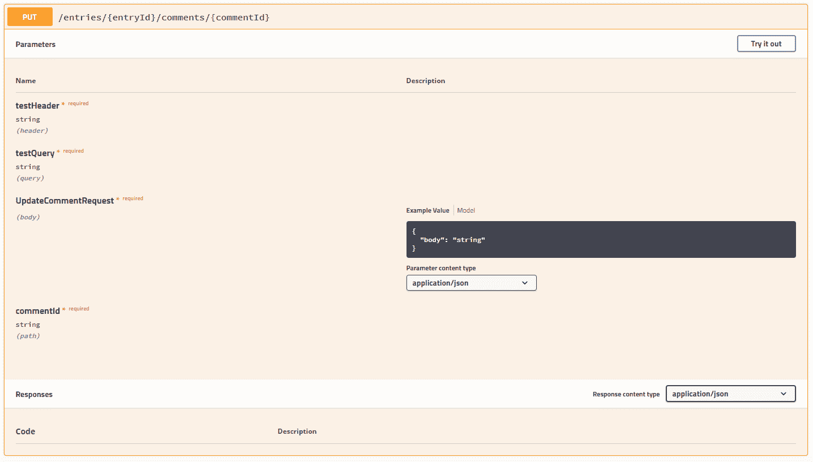

从示例中，我们可以看到这个 API 卡的标题使用`@Controller`和`@Put`装饰器的组合来构建 API 的路径。参数部分使用`@Body`、`@Param`、`@Query`和`@Headers`查询参数构建。我们提供给装饰参数的类型在 Swagger UI 中被用作对用户的提示，说明参数中期望的内容。

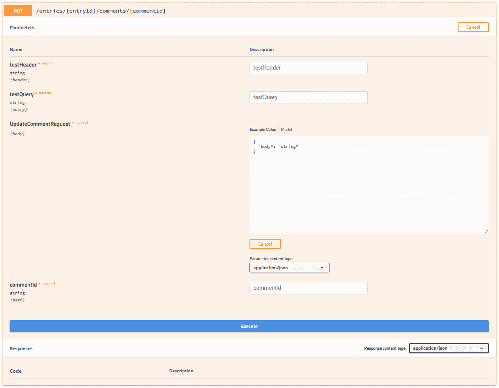

点击 API 卡标题中的**试一试**按钮会将卡片变成一组输入。这允许用户填写 API 的必需和可选参数，并执行 API 调用。我们将在稍后讨论 API 卡的其余部分。现在，让我们更详细地审查基本参数装饰器。

## @Body

您可能已经注意到在我们的示例中，我们用`@Body`装饰的参数的类型是`UpdateCommentRequest`。您的应用程序可能已经有这个类，也可能没有。如果没有，让我们现在编写它。

```js
export class UpdateCommentRequest {
    @ApiModelPropertyOptional()
    public body: string;
}

```

请求类非常基础，使用了 Nest.js swagger 模块中我们将要介绍的第一个装饰器`@ApiModelPropertyOptional`。这个装饰器通知 swagger 模块，请求类的`body`属性是一个可选属性，可以在调用 API 时包含在请求体中。这个装饰器实际上是`@ApiModelProperty`装饰器的快捷方式。我们可以将我们的请求类写成：

```js
export class UpdateCommentRequest {
    @ApiModelProperty({ required: false })
    public body: string;
}

```

然而，如果属性是可选的，请使用`@ApiModelPropertyOptional`装饰器来节省一些输入。这两个装饰器都可以接受传递给装饰器的对象中的几个附加属性，进一步定义请求体的数据模型。

+   **description**：一个字符串，可用于描述模型属性应包含的内容或其用途。

+   **required**：一个布尔值，指示模型属性是否是必需的。这仅适用于`@ApiModelProperty`装饰器。

+   **type**：Nest.js swagger 模块将使用与模型属性关联的类型，或者您可以将**type**作为任何字符串或类值传递。如果使用**isArray**属性，则还应使用**type**属性。此属性还可用于传递 swagger 规范中定义的任何数据类型。

+   **isArray**：一个布尔值，指示模型属性是否应该接受一组值。如果模型确实接受一组值，请确保在装饰器或 Nest.js swagger 模块中包含此值，以便知道将模型属性表示为数组。

+   **collectionFormat**：映射到 swagger 规范的**collectionFormat**设置。这用于描述模型属性数组值的格式应该如何格式化。对于请求体，可能不应该使用此属性。可能的值包括：

+   **csv**：逗号分隔的值`foo,bar`

+   **ssv**：空格分隔的值`foo bar`

+   **tsv**：制表符分隔的值`foo\tbar`

+   **pipes**：管道分隔的值`foo|bar`

+   **multi**：对应于多个参数实例，而不是单个实例的多个值 foo=bar&foo=baz。这仅适用于“query”或“formData”中的参数。

+   **default**：在 swagger 文档中用于模型属性的默认值。此值还将用于 Swagger UI 中提供的示例。此值的类型取决于模型属性的类型，但可以是字符串、数字，甚至是对象。

+   **enum**：如果您的模型属性类型是枚举，使用此属性将相同的枚举传递给装饰器，以便 Nest.js swagger 模块可以将这些枚举值注入到 swagger 文档中。

+   **format**：如果使用 swagger 规范中描述的数据类型的**type**属性，则可能还需要传递该数据类型的格式。例如，接受具有多个精度点、小数点后的值的字段，**type**将是`integer`，但**format**可能是`float`或`double`。

+   **multipleOf**：表示传递给模型属性的值应使用模运算符具有零余数的数字。仅当装饰器中的模型属性类型为`number`或装饰器提供的**type**为`integer`时，才可以设置此属性。

+   **maximum**：表示传递给模型属性的值应小于或等于给定值才有效的数字。仅当装饰器中的模型属性类型为`number`或装饰器提供的**type**为`integer`时，才可以设置此属性。此属性不应与**exclusiveMaximum**一起使用。

+   **exclusiveMaximum**：表示传递给模型属性的值应小于给定值才有效的数字。仅当装饰器中的模型属性类型为`number`或装饰器提供的**type**为`integer`时，才可以设置此属性。此属性不应与**maximum**一起使用。

+   **minimum**：表示传递给模型属性的值应大于或等于给定值才有效的数字。仅当装饰器中的模型属性类型为`number`或装饰器提供的**type**为`integer`时，才可以设置此属性。此属性不应与**exclusiveMinimum**一起使用。

+   **exclusiveMinimum**：表示传递给模型属性的值应小于给定值才有效的数字。仅当装饰器中的模型属性类型为`number`或装饰器提供的**type**为`integer`时，才可以设置此属性。此属性不应与**minimum**一起使用。

+   **maxLength**：一个数字，表示模型属性中传递的值应该是字符长度少于或等于给定值才能有效。如果在装饰器中设置此属性，则必须是模型属性类型为`string`或装饰器提供的**type**为`string`。

+   **minLength**：一个数字，表示模型属性中传递的值应该是字符长度大于或等于给定值才能有效。如果在装饰器中设置此属性，则必须是模型属性类型为`string`或装饰器提供的**type**为`string`。

+   **pattern**：包含 JavaScript 兼容正则表达式的字符串。模型属性中传递的值应与正则表达式匹配才能有效。如果在装饰器中设置此属性，则必须是模型属性类型为`string`或装饰器提供的**type**为`string`。

+   **maxItems**：一个数字，表示模型属性中传递的值应该是数组长度少于或等于给定值才能有效。如果在装饰器中设置此属性，则必须同时提供值为`true`的**isArray**。

+   **minItems**：一个数字，表示模型属性中传递的值应该是数组长度大于或等于给定值才能有效。如果在装饰器中设置此属性，则必须同时提供值为`true`的**isArray**。

+   **uniqueItems**：一个数字，表示模型属性中传递的值应包含一组唯一的数组值。如果在装饰器中设置此属性，则必须同时提供值为`true`的**isArray**。

+   **maxProperties**：一个数字，表示模型属性中传递的值应该包含少于或等于给定值的属性数量才能有效。如果模型属性类型是类或对象，则在装饰器中设置此属性才有效。

+   **minProperties**：一个数字，表示模型属性中传递的值应该包含的属性数量大于或等于给定值才能有效。如果模型属性类型是类或对象，则在装饰器中设置此属性才有效。

+   **readOnly**：一个布尔值，表示模型属性**可能**在 API 响应体中发送，但不应该在请求体中提供。如果您将使用相同的数据模型类来表示 API 的请求和响应体，请使用此选项。

+   **xml**：包含表示模型属性格式的 XML 的字符串。仅当模型属性将包含 XML 时使用。

+   **example**：在 Swagger 文档中放置的示例值。此值还将用于 Swagger UI 中提供的示例，并优先于**default**装饰器属性值。

已使用`@Body`装饰器装饰的属性应始终具有类类型。Typescript 接口无法被装饰，也不提供与带装饰器的类相同的元数据。如果在您的应用程序中，任何一个 API 具有带有`@Body`装饰器和接口类型的属性，则 Nest.js swagger 模块将无法正确创建 Swagger 文档。实际上，Swagger UI 很可能根本不会显示请求体参数。

## @Param

在我们的示例中，`@Param`装饰器包含一个字符串值，指示控制器方法的`comment`参数使用哪个 URL 参数。当 Nest.js swagger 模块遇到提供的字符串的装饰器时，它能够确定 URL 参数的名称，并将其与方法参数提供的类型一起包含在 swagger 文档中。但是，我们也可以在不向`@Param`装饰器传递字符串的情况下编写控制器方法，以获取包含所有 URL 参数的对象。如果这样做，Nest.js 只能在我们将类用作`comment`参数的类型或在控制器方法上使用 Nest.js swagger 模块提供的`@ApiImplicitParam`装饰器时，才能确定 URL 参数的名称和类型。让我们创建一个新类来描述我们的 URL 参数，并看看它如何影响 swagger UI。

```js
export class UpdateCommentParams {
    @ApiModelProperty()
    public entryId: string;

    @ApiModelProperty()
    public commentId: string;
}

```

在`UpdateCommentParams`类中，我们创建了一个属性，并使用了`@ApiModelProperty`装饰器，这样 Nest.js swagger 模块就知道在 swagger 文档中包含属性及其类型。不要尝试将`entryId`拆分成自己的类并扩展它，因为 Nest.js swagger 模块将无法捕捉扩展类的属性。在类中使用的属性名称与`@Controller`和`@Put`装饰器中使用的名称匹配也很重要。我们可以修改我们的评论以使用新的类。

```js
@Put('comments/:commentId')
public async update(
    @Body() body: UpdateCommentRequest,
    @Param() params: UpdateCommentParams,
    @Query('testQuery') testQuery: string,
    @Headers('testHeader') testHeader: string
) {
}

```

我们已更改控制器，以便所有路径参数作为对象提供给控制器方法的`params`参数。

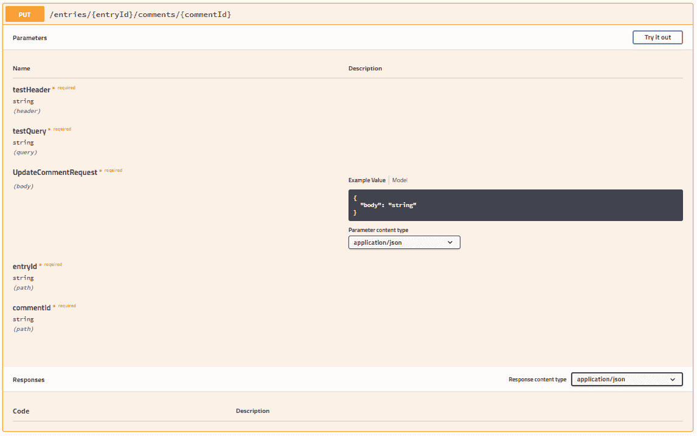

swagger UI 已更新，显示评论 put API 需要两个必需的 URL 参数：`entryId`和`commentId`。如果您将编写使用单个参数在方法控制器中包含所有 URL 参数的 API，您应该期望 Nest.js swagger 模块通知您 URL 参数的首选方法。将类用作 URL 参数的类型不仅通知 Nest.js swagger 模块 URL 参数，还通过提供类型检查和代码自动完成来帮助编写应用程序。

然而，如果您不想创建一个新类来用作 URL 参数的类型，可以使用接口，或者一个或多个 URL 参数在 Nest.js 守卫、中间件或自定义装饰器中，而不在控制器方法中。您仍然可以使用`@ApiImplicitParam`装饰器通知 Nest.js swagger 模块有关 URL 参数。

```js
@Put('comments/:commentId')
@ApiImplicitParam({ name: 'entryId' })
public async update(
    @Body() body: UpdateCommentRequest,
    @Param('commentId') comment: string,
    @Query('testQuery') testQuery: string,
    @Headers('testHeader') testHeader: string
) {
}

```

如果需要路径参数才能到达控制器方法，但控制器方法并未专门使用该参数，Nest.js swagger 模块将不会在 swagger 文档中包含它，除非控制器方法使用了`@ApiImplicitParam`装饰器进行装饰。对于每个必要到达控制器方法的路径参数，使用装饰器一次，但它在控制器本身中并未使用。

```js
@Put('comments/:commentId')
@ApiImplicitParam({ name: 'entryId' })
@ApiImplicitParam({ name: 'commentId' })
public async update(
    @Body() body: UpdateCommentRequest,
    @Query('testQuery') testQuery: string,
    @Headers('testHeader') testHeader: string
) {
}

```

例如，上述控制器作为评论控制器的一部分，需要两个路径参数：`entryId`和`commentId`。由于控制器在方法参数中不包含任何`@Param`装饰器，因此使用`@ApiImplicitParam`来描述两个路径参数。

`@ApiImplicitParam`装饰器可以在传递给装饰器的对象中接受几个附加属性，进一步定义 swagger 文档中的 URL 参数。

+   **name**：包含 URL 参数名称的字符串。这个装饰器属性是唯一必需的。

+   **description**：一个字符串，可用于描述 URL 参数应包含什么或用于什么。

+   **required**：一个布尔值，指示 URL 参数是否是必需的。

+   **type**：包含 swagger 规范中定义的类型之一的字符串。不应使用类和对象。

## @Query

在我们的示例中，`@Query`装饰器包含一个字符串值，指示控制器方法的`testQuery`参数使用哪个查询参数。当 Nest.js swagger 模块遇到提供的字符串的装饰器时，它能够确定查询参数的名称，并将其与方法参数提供的类型一起包含在 swagger 文档中。但是，我们也可以编写控制器方法，而不传递字符串给`@Query`装饰器，以获得包含所有查询参数的对象。如果这样做，Nest.js 只能确定查询参数的名称和类型，如果我们使用类作为`testQuery`参数的类型或在控制器方法上使用 Nest.js swagger 模块提供的`@ApiImplicitQuery`装饰器。让我们创建一个新类来描述我们的查询参数，并看看它如何影响 Swagger UI。

```js
export class UpdateCommentQuery {
    @ApiModelPropertyOptional()
    public testQueryA: string;

    @ApiModelPropertyOptional()
    public testQueryB: string;
}

```

在`UpdateCommentQuery`类中，我们创建了两个属性，并使用`@ApiModelPropertyOptional`装饰器，以便 Nest.js swagger 模块知道在 swagger 文档中包含这些属性及其类型。我们可以更改我们的评论并将控制器方法更改为使用新类。

```js
@Put('comments/:commentId')
public async update(
    @Body() body: UpdateCommentRequest,
    @Param('commentId') comment: string,
    @Query() queryParameters: UpdateCommentQuery,
    @Headers('testHeader') testHeader: string
) {
}

```

我们已更改控制器，以便所有查询参数作为对象提供给控制器方法的`queryParameters`参数。

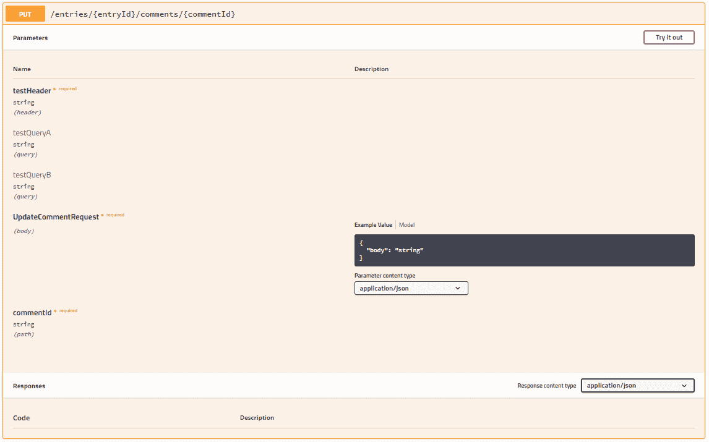

Swagger UI 已更新以显示注释，并且`put` API 接受两个可选的查询参数：`testQueryA`和`testQueryB`。如果您将编写将在方法控制器中使用单个参数来保存所有查询参数的 API，那么这应该是您首选的方法，以通知 Nest.js swagger 模块您期望作为查询参数的内容。将类用作查询参数的类型不仅通知 Nest.js swagger 模块查询参数，还通过提供类型检查和代码自动完成来帮助编写应用程序。

但是，如果您不希望创建一个新类来用作查询参数的类型，可以使用接口，或者查询参数在 Nest.js 守卫或中间件中使用自定义装饰器，而不是在控制器方法中使用。您仍然可以使用`@ApiImplicitQuery`装饰器通知 Nest.js swagger 模块有关查询参数。

```js
@Put('comments/:commentId')
@ApiImplicitQuery({ name: 'testQueryA' })
@ApiImplicitQuery({ name: 'testQueryB' })
public async update(
    @Param('commentId') comment: string,
    @Body() body: UpdateCommentRequest,
    @Query() testQuery: any,
    @Headers('testHeader') testHeader: string
) {
}

```

如果需要查询参数才能到达控制器方法，但控制器方法没有专门使用查询参数，则 Nest.js swagger 模块将不会在 swagger 文档中包含它，除非控制器方法使用`@ApiImplicitQuery`装饰器进行装饰。对于每个必要到达控制器方法但在控制器本身中未使用的查询参数，使用装饰器一次。

```js
@Put('comments/:commentId')
@ApiImplicitQuery({ name: 'testQueryA' })
@ApiImplicitQuery({ name: 'testQueryB' })
public async update(
    @Param('commentId') comment: string,
    @Body() body: UpdateCommentRequest,
    @Headers('testHeader') testHeader: string
) {
}

```

例如，上述控制器需要两个查询参数：`testQueryA`和`testQueryB`。由于控制器在方法参数中不包含任何`@Query`装饰器，因此使用`@ApiImplicitQuery`来描述两个查询参数。

`@ApiImplicitQuery`装饰器可以在传递给装饰器的对象中接受几个额外的属性，这些属性将进一步定义 swagger 文档中的查询参数。

+   **name**：包含查询参数名称的字符串。这个装饰器属性是唯一必需的。

+   **description**：一个字符串，用于描述查询参数应包含什么或用于什么目的。

+   **required**：一个布尔值，指示查询参数是否是必需的。

+   **type**：包含 swagger 规范中定义的类型之一的字符串。不应使用类和对象。

+   **isArray**：一个布尔值，指示模型属性是否应该采用值数组。如果模型确实采用值数组，请确保在装饰器中包含此值，否则 Nest.js swagger 模块将不知道将模型属性表示为数组。

+   **collectionFormat**：映射到 swagger 规范**collectionFormat**设置。这用于描述如何格式化模型属性数组值。可能的值有：

+   **csv**：逗号分隔的值 `foo,bar`

+   **ssv**：空格分隔的值 `foo bar`

+   **tsv**：制表符分隔的值 `foo\tbar`

+   **pipes**：管道分隔的值 `foo|bar`

+   **multi**：对应于多个参数实例，而不是单个实例的多个值 foo=bar&foo=baz。这仅对“query”或“formData”中的参数有效。

## @Headers

在我们的示例中，`@Headers`装饰器包含一个字符串值，指示控制器方法的`testHeader`参数使用哪个请求头值。当 Nest.js swagger 模块遇到提供的字符串的装饰器时，它能够确定请求头的名称，并将其与方法参数提供的类型一起包含在 swagger 文档中。然而，我们也可以编写控制器方法，而不向`@Headers`装饰器传递字符串，以获得包含所有请求头的对象。如果我们这样做，Nest.js 只能确定请求头的名称和类型，如果我们使用类作为`testHeader`参数的类型，或者在控制器方法上使用 Nest.js swagger 模块提供的`@ApiImplicitHeader`装饰器。让我们创建一个新类来描述我们的查询参数，并看看它如何影响 swagger UI。

```js
export class UpdateCommentHeaders {
    @ApiModelPropertyOptional()
    public testHeaderA: string;

    @ApiModelPropertyOptional()
    public testHeaderB: string;
}

```

在`UpdateCommentHeaders`类中，我们创建了两个属性，并使用`@ApiModelPropertyOptional`装饰器，以便 Nest.js swagger 模块知道在 swagger 文档中包含这些属性及其类型。我们可以更改我们的评论`put`控制器方法以使用新类。

```js
@Put('comments/:commentId')
public async update(
    @Body() body: UpdateCommentRequest,
    @Param('commentId') comment: string,
    @Query('testQuery') testQuery: string,
    @Headers() headers: UpdateCommentHeaders
) {
}

```

我们已更改控制器，以便将控制器方法期望的所有请求参数作为对象提供给控制器方法的`queryParameters`参数。

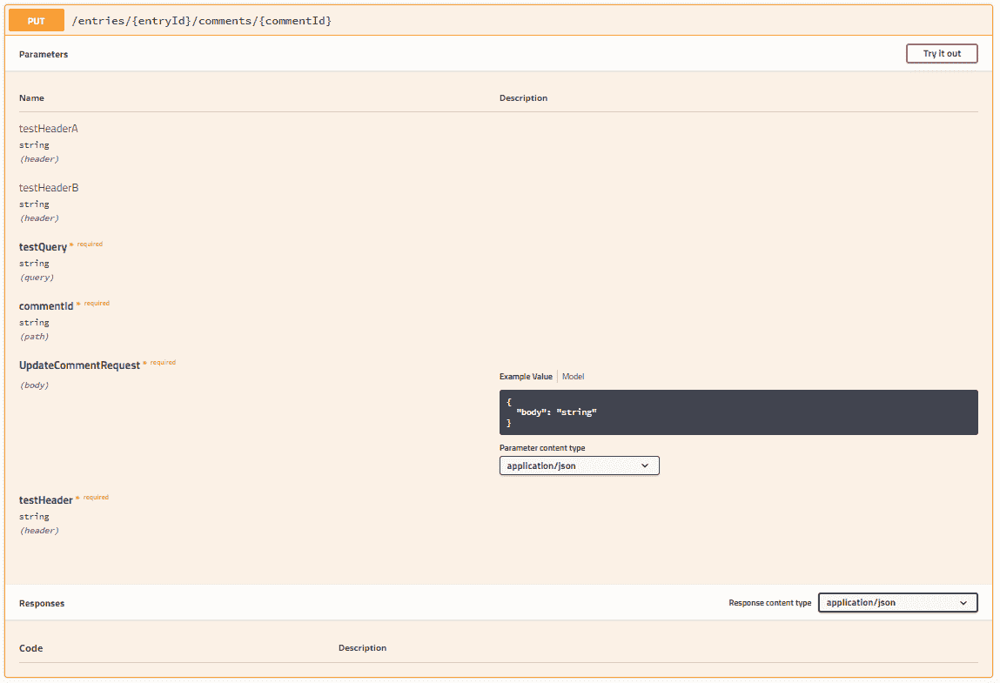

swagger UI 已更新，显示评论`put` API 需要两个头部：`testHeaderA`和`testHeaderB`。如果您将编写使用单个参数在方法控制器中保存所有预期头部的 API，这应该是通知 Nest.js swagger 模块您期望的首选方法。使用类作为预期头部的类型不仅通知 Nest.js swagger 模块头部，还通过提供类型检查和代码自动完成来帮助编写应用程序。

然而，如果您不希望创建一个新类作为预期头部的类型，您可以使用接口，或者头部用于 Nest.js 守卫、中间件或自定义装饰器，而不是在控制器方法中使用。您仍然可以使用`@ApiImplicitHeader`或`@ApiImplicitHeaders`装饰器通知 Nest.js swagger 模块有关查询参数。

```js
@Put('comments/:commentId')
@ApiImplicitHeader({ name: 'testHeader' })
public async update(
    @Body() body: UpdateCommentRequest,
    @Param('commentId') comment: string,
    @Query('testQuery') testQuery: string,
    @Headers() headers: any
) {
}

```

如果需要一个头部才能到达控制器方法，但控制器方法没有专门使用头部。除非控制器方法使用`@ApiImplicitHeader`或`@ApiImplicitHeaders`装饰器进行装饰，否则 Nest.js swagger 模块不会将其包含在 swagger 文档中。对于每个头部使用一次`@ApiImplicitHeader`装饰器，或者一次使用`@ApiImplicitHeaders`装饰器来描述所有头部是必要的。这是为了到达控制器方法，但它在控制器本身中没有使用。

```js
@Put('comments/:commentId')
@ApiImplicitHeader({ name: 'testHeaderA' })
@ApiImplicitHeader({ name: 'testHeaderB' })
public async update(
    @Body() body: UpdateCommentRequest,
    @Param('commentId') comment: string,
    @Query('testQuery') testQuery: string,
) {
}

@Put('comments/:commentId')
@ApiImplicitHeader([
    { name: 'testHeaderA' },
    { name: 'testHeaderB' }
])
public async update(
    @Body() body: UpdateCommentRequest,
    @Param('commentId') comment: string,
    @Query('testQuery') testQuery: string,
) {
}

```

例如，上述控制器需要两个头部：`testHeaderA`和`testHeaderB`。由于控制器方法在方法参数中不包含`@Headers`装饰器，因此使用`@ApiImplicitHeader`和`@ApiImplicitHeaders`来描述两个头部。

`@ApiImplicitHeader`和`@ApiImplicitHeaders`装饰器可以在对象或对象数组中接受几个额外的属性，分别传递给装饰器，以进一步定义 swagger 文档中的查询参数。

+   **name**：包含标头名称的字符串。这个装饰器属性是唯一必需的。

+   **description**：一个字符串，可用于描述标头应包含什么或用于什么。

+   **required**：一个布尔值，指示标头是否是必需的。

**注意：**`@ApiImplicitHeaders`装饰器只是使用`@ApiImplicitHeader`装饰器的快捷方式多次。如果需要描述多个标头，请使用`@ApiImplicitHeaders`。此外，您不应该使用这些标头来描述身份验证机制。有其他装饰器可以用于此目的。

## 身份验证

很可能您在某个时候需要在应用程序中设置某种形式的身份验证。博客示例应用程序使用`用户名`和`密码`组合来验证用户，并提供 JSON Web 令牌以允许用户访问 API。无论您决定如何设置身份验证，有一点是肯定的：您将需要查询参数或标头来维护身份验证状态，并且您很可能会使用 Nest.js 中间件或守卫来检查用户的身份验证状态。您这样做是因为在每个控制器方法中编写该代码会创建大量的代码重复，并且会使每个控制器方法变得复杂。

如果您的应用程序需要身份验证，请确保使用`addOAuth2`或`addBearerAuth`方法正确配置文档设置。如果您不确定这些方法的作用，请参考**文档设置**部分。

除了为 swagger 文档设置身份验证方案之外，您还应该在控制器类或控制器方法上使用`ApiBearerAuth`和/或`ApiOAuth2Auth`装饰器。当用于整个控制器类时，这些装饰器会通知 Nest.js swagger 模块所有控制器方法都需要身份验证。如果不是所有控制器方法都需要身份验证，则需要装饰那些需要的单个控制器方法。

```js
@Put('comments/:commentId')
@ApiBearerAuth()
public async update(
    @Body() body: UpdateCommentRequest,
    @Param('commentId') comment: string,
    @Query('testQuery') testQuery: string,
    @Headers('testHeader') testHeader: string
) {
}

```

此示例描述了一个需要持有者令牌才能使用 API 的单个控制器方法 API。

```js
@Put('comments/:commentId')
@ApiOAuth2Auth(['test'])
public async update(
    @Body() body: UpdateCommentRequest,
    @Param('commentId') comment: string,
    @Query('testQuery') testQuery: string,
    @Headers('testHeader') testHeader: string
) {
}

```

此示例描述了一个需要特定 OAuth2 角色集才能使用 API 的单个控制器方法 API。`@ApiOAuth2Auth`装饰器接受用户应具有的所有角色的数组，以便访问 API。

这些装饰器与`ApiBearerAuth`和`ApiOAuth2Auth`文档设置一起使用，以构建用户可以输入其凭据（API 密钥或 Oauth 密钥）并选择其角色（如果使用 OAuth2）的表单，位于 swagger UI 内。然后，当用户执行特定 API 时，这些值将传递到适当的位置，即作为查询参数或标头值。

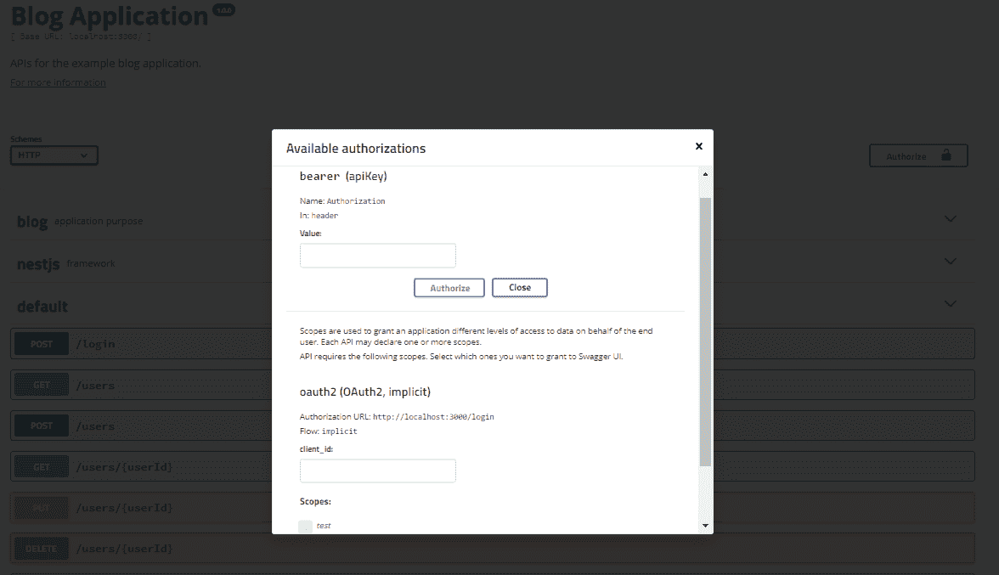

单击 swagger UI 页面顶部的**授权**按钮将打开授权表单。对于持有者令牌，请登录应用程序并将返回的授权令牌复制到 swagger UI 授权中提供的空间中。令牌应该是`Bearer <TOKEN VALUE>`的形式。对于 OAuth2 身份验证，请输入您的凭据并选择您要请求的角色。单击**授权**按钮将保存凭据，以便在 swagger UI 中执行 API 时使用。

# API 请求和响应装饰器

到目前为止，我们主要关注装饰控制器，以便 Nest.js swagger 模块可以构建包含我们的 API 期望或可能使用的所有输入的 swagger 文档。Nest.js swagger 模块还包含可以用于描述 API 如何响应以及它期望接收和发送的内容格式的装饰器。这些装饰器有助于在查看 swagger 文档或使用 swagger UI 时形成特定 API 如何工作的完整图像。

我们在示例博客应用中涵盖的所有 API 都遵循接受 JSON 形式输入的典型模式。然而，应用程序可能需要接受不同的输入类型，通常称为 MIME 类型。例如，我们可以允许我们示例博客应用的用户上传头像图像。图像不能轻松地表示为 JSON，因此我们需要构建一个接受`image/png`输入 MIME 类型的 API。我们可以通过使用`@ApiConsumes`装饰器确保这些信息存在于我们应用程序的 swagger 文档中。

```js
@Put('comments/:commentId')
@ApiConsumes('image/png')
public async update(
    @Body() body: UpdateCommentRequest,
    @Param('commentId') comment: string,
    @Query('testQuery') testQuery: string,
    @Headers('testHeader') testHeader: string
) {
}

```

在这个例子中，我们使用了`@ApiConsumes`装饰器来告知 Nest.js swagger 模块，评论`put` API 预期接收一个 png 图像。

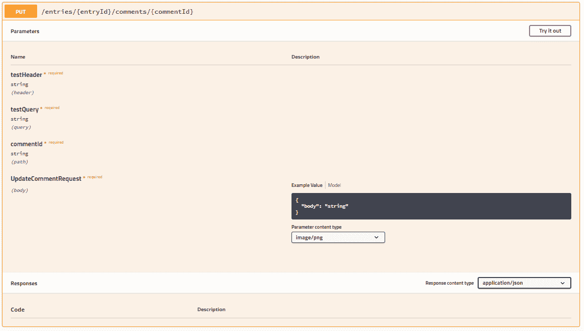

Swagger UI 现在显示**参数内容类型**下拉菜单为`image/png`。`@ApiConsumes`装饰器可以接受任意数量的 MIME 类型作为参数。装饰器中的多个值将导致**参数内容类型**下拉菜单包含多个值，第一个值始终是默认值。如果控制器专门用于处理特定的 MIME 类型，比如`application/json`，则可以将`@ApiConsumes`装饰器放在控制器类上，而不是每个单独的控制器方法上。然而，如果您的 API 将消耗 JSON，可以不使用装饰器，Nest.js swagger 模块将默认 API 为`application/json`。

除了消耗各种 MIME 数据类型外，API 还可以响应各种 MIME 数据类型。例如，我们虚构的头像上传 API 可能会将图像存储在数据库或云存储提供商中。这样的存储位置可能不直接对用户可访问，因此可以创建一个 API 来查找并返回任何用户的头像图像。我们可以使用`@ApiProduces`装饰器来告知 Nest.js swagger 模块，API 使用`image/png` MIME 类型返回数据。

```js
@Put('comments/:commentId')
@ApiProduces('image/png')
public async update(
    @Body() body: UpdateCommentRequest,
    @Param('commentId') comment: string,
    @Query('testQuery') testQuery: string,
    @Headers('testHeader') testHeader: string
) {
}

```

在这个例子中，我们使用了`@ApiProduces`装饰器来告知 Nest.js swagger 模块，评论`put` API 预期返回一个 png 图像。

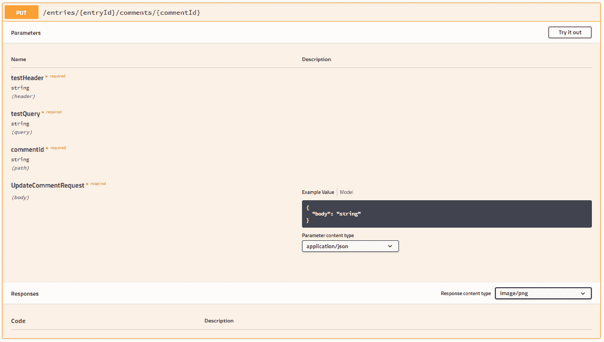

Swagger UI 现在显示**响应内容类型**下拉菜单为`image/png`。`@ApiProduces`装饰器可以接受任意数量的 MIME 类型作为参数。装饰器中的多个值将导致**响应内容类型**下拉菜单包含多个值，第一个值始终是默认值。如果控制器专门用于处理特定的 MIME 类型，比如`application/json`，则可以将`@ApiConsumes`装饰器放在控制器类上，而不是每个单独的控制器方法上。然而，如果您的 API 将消耗 JSON，可以不使用装饰器，Nest.js swagger 模块将默认 API 为`application/json`。

请求和响应的 MIME 类型信息在很大程度上可以告知 Swagger 文档的最终使用方式，以及如何使用 API 以及 API 的工作原理。然而，我们并没有完全记录 API 可能会响应的所有内容。例如，API 响应体中包含哪些数据值，以及可能返回的 HTTP 状态码是什么？可以使用`@ApiResponse`装饰器提供这样的信息。

`@ApiResponse`装饰器可以放在单个控制器方法上，也可以放在控制器类上。Nest.js swagger 模块将收集控制器类级别的装饰器数据，并将其与控制器方法的装饰器数据配对，以生成每个单独 API 可能产生的可能响应列表。

```js
@Controller('entries/:entryId')
@ApiResponse({
    status: 500,
    description: 'An unknown internal server error occurred'
})
export class CommentController {
    @Put('comments/:commentId')
    @ApiResponse({
        status: 200,
        description: 'The comment was successfully updated',
        type: UpdateCommentResponse
    })
    public async update(
        @Body() body: UpdateCommentRequest,
        @Param('commentId') comment: string,
        @Query('testQuery') testQuery: string,
        @Headers('testHeader') testHeader: string
    ) {
    }
}

```

在这个例子中，我们装饰了评论控制器，以便所有的 API 都包含一个用于内部服务器错误的通用响应。更新控制器方法已被装饰，以便状态码为`200`的响应表示评论已成功更新。类型是另一个数据模型，用于向 Nest.js swagger 模块提供有关响应体中各个属性的信息。

```js
export class UpdateCommentResponse {
  @ApiModelPropertyOptional()
  public success?: boolean;
}

```

`UpdateCommentResponse`数据模型包含一个可选属性`success`，可以进一步向 UI 传达评论已成功更新的信息。

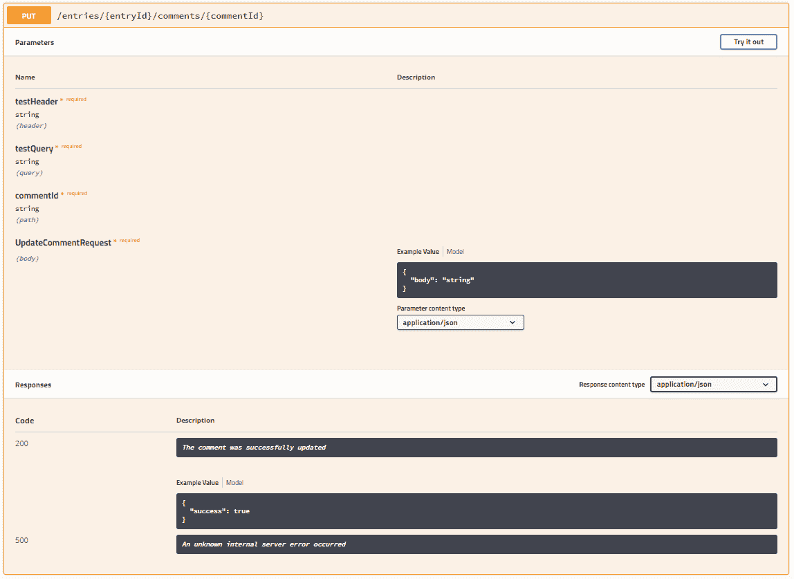

现在 swagger UI 在 API 卡的**响应**部分列出了两种可能的响应。使用`@ApiResponse`装饰器来告知用户关于使用 API 时可能需要处理的不同成功和错误场景。`@ApiResponse`装饰器可以在传递给它的对象中接受其他属性。

+   **status**：包含 API 将响应的 HTTP 状态码的数字。这个装饰器属性是唯一必需的。

+   **description**：一个字符串，可用于描述响应表示什么或者用户在遇到响应时应该如何反应。

+   **type**：使用数据模型类中 swagger 规范定义的任何数据类型，来告知用户可以在响应体中期望什么。如果使用了**isArray**属性，它表示响应将是一个包含提供类型的值的数组。

+   **isArray**：一个布尔值，指示响应体是否包含一系列值。如果响应体将包含一系列值，请确保在装饰器中包含此值，否则 Nest.js swagger 模块将不知道如何表示响应体为一系列值。

# API 元数据装饰器

如果你在任何 Nest.js 项目中工作，并且正确地使用我们到目前为止介绍的装饰器装饰所有的控制器和控制器方法，Nest.js swagger 模块生成的 swagger 文档将包含用户理解和使用 API 所需的每一个技术细节。在本章中，我们将介绍的最后两个装饰器只是为 swagger 文档提供更多的元数据。swagger UI 将使用这些元数据来生成更清晰的 UI，但功能不会改变。

我们将要介绍的第一个装饰器是`@ApiOperation`。不要将这个装饰器与`@Put`之类的 HTTP 方法装饰器混淆。这个装饰器用于为单个控制器方法提供**标题**、**描述**和称为**operationId**的唯一标识符。

```js
@Put('comments/:commentId')
@ApiOperation({
    title: 'Comment Update',
    description: 'Updates a specific comment with new content',
    operationId: 'commentUpdate'
})
public async update(
    @Body() body: UpdateCommentRequest,
    @Param('commentId') comment: string,
    @Query('testQuery') testQuery: string,
    @Headers('testHeader') testHeader: string
) {
}

```

在这个例子中，我们提供了一个简短的**标题**和一个更长的**评论放置 API 的描述**。**标题**应该保持简短，少于 240 个字符，并用于填充 swagger 规范的`summary`部分。虽然例子中的**描述**很短，但在你自己的项目中使用详细的描述。这应该传达用户为什么会使用 API 或者通过使用 API 可以实现什么。**operationId**必须根据 swagger 文档保持唯一。该值可以在各种 swagger 代码生成项目中用来引用特定的 API。

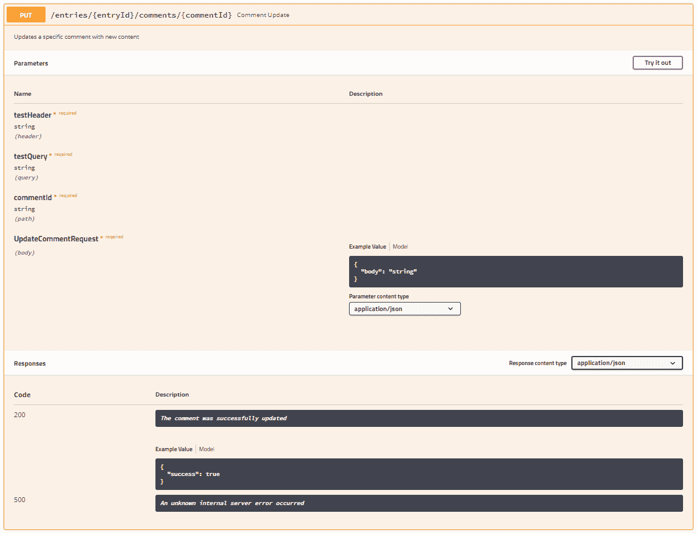

在 swagger UI 中，我们可以看到我们传递给`@ApiOperation`装饰器的值，以及它们如何用来填充 API 卡的附加细节。**标题**放在 API 路径旁的标题中。**描述**是标题后面 API 卡中的第一部分信息。我们可以看到，使用长**标题**和**描述**会对 API 卡标题产生负面影响，但在 API 卡正文中效果非常好。

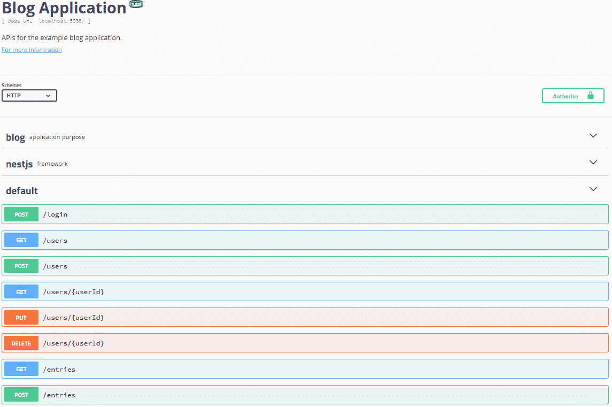

从整体上看 Swagger UI 应用程序，我们可以看到示例博客应用程序的所有 API 都被分组在一起。虽然这样可以工作，但更好的是根据它们执行的操作或资源（评论、条目或关键字）对 API 进行分组。这就是`@ApiUseTags`装饰器的用途。

`@ApiUseTags`装饰器可以放置在控制器类或单个控制器方法上，并且可以接受任意数量的字符串参数。这些值将被放置在 swagger 文档中的每个单独 API 中。

```js
@Controller('entries/:entryId')
@ApiUseTags('comments')
export class CommentController {

}

```

在这个例子中，我们装饰了评论控制器类，以便所有控制器方法都被赋予`comments`标签。

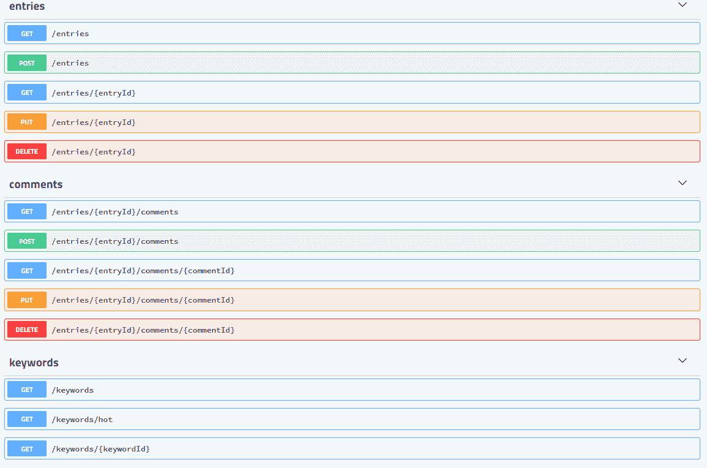

Swagger UI 现在使用标签对 API 进行分组。这确保了类似的 API 被分组，并在每个组之间提供一些间距，以产生更美观的 UI。这些组也是可展开和可折叠的，让用户有隐藏他们可能不感兴趣的 API 的选项。

# 保存 swagger 文档

我们已经介绍了 Nest.js swagger 模块中所有可用的装饰器，以及 Nest.js 中已有的装饰器，以生成 swagger 文档并公开 swagger UI。当您的 API 主要由开发人员在其自己的项目中使用，或者在本地开发服务器或分期环境中测试 API 时，这非常有效。对于主要用于特定前端应用程序的 API，您可能不希望公开 swagger UI 供一般公众使用。在这种情况下，您仍然可以生成 swagger 文档以供存储，并在您自己或您团队的其他项目中使用。

为了实现这一点，我们将编写一个新的 Typescript 文件，可以作为构建链的一部分执行。我们将使用`fs-extras` NodeJS 模块，使文件写入磁盘变得更简单。

```js
import * as fs from 'fs-extra';

async function writeDoc() {
    const app = await NestFactory.create(AppModule);
    const document = SwaggerModule.createDocument(app, swaggerOptions);

    fs.ensureDirSync(path.join(process.cwd(), 'dist'));
    fs.writeJsonSync(path.join(process.cwd(), 'dist', 'api-doc.json'), document, { spaces: 2 });
}

writeDoc();

```

您可以将此文件放在项目的根目录或源目录中，并使用 NPM 脚本条目来执行它，或者使用 NodeJS 运行它。示例代码将使用 Nest.js swagger 模块构建 swagger 文档，并使用`fs-extras`将文档写入`dist`目录作为 JSON 文件。

# 总结

在本章中，我们介绍了 Nest.js swagger 模块如何利用您在应用程序中使用的现有装饰器来创建 swagger v2 规范文档。我们还介绍了 Nest.js swagger 模块提供的所有额外装饰器，以增强 swagger 文档中的信息。我们还设置了示例博客应用程序以公开 swagger UI。

使用 Nest.js swagger 模块不仅可以记录应用程序的控制器，还可以为测试应用程序提供 UI。如果您完全记录了应用程序，Swagger UI 可以是一个很好的替代 UI，或者提供一个简单的测试区域，您或您的用户可以使用，而不必在应用程序的真实 UI 中观察网络调用。Swagger UI 也可以是 Postman 等工具的很好替代品。

如果您不希望使用 Swagger UI 或在生产环境中公开您的 swagger 文档，记住您可以始终将文件写入磁盘作为应用程序的单独构建作业。这允许您以多种方式存储和使用文档，尤其是使用 Swagger Codegen。

下一章将带您了解命令查询责任分离（CQRS）。
