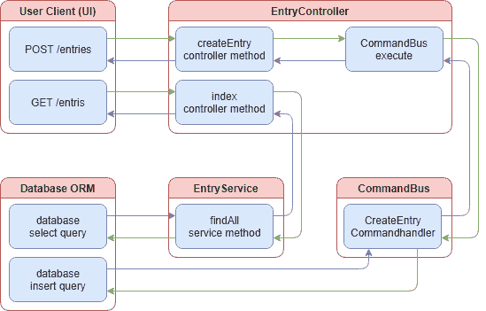
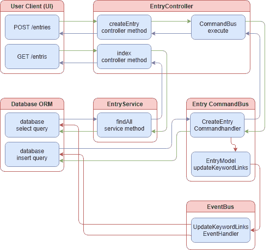
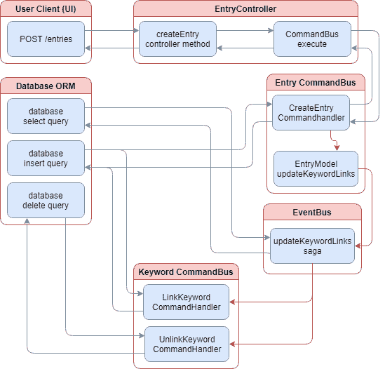

# 第十二章：命令查询职责分离（CQRS）

在本书的这一部分，我们已经努力使用 CRUD 模式构建了一个简单的博客应用程序：创建、检索、更新和删除。我们已经非常好地确保服务处理我们的业务逻辑，而我们的控制器只是这些服务的网关。控制器负责验证请求，然后将请求传递给服务进行处理。在这样一个小型应用程序中，CRUD 非常有效。

但是当我们处理可能具有独特和复杂业务逻辑的大型应用程序时会发生什么？或者也许我们希望在后台启动一些逻辑，以便 UI 能够调用 API 而无需等待所有业务逻辑完成。这些是 CQRS 有意义的领域。CQRS 可以用于隔离和分解复杂的业务逻辑，同步或异步地启动该业务逻辑，并组合这些隔离的部分来解决新的业务问题。

Nest.js 通过提供两个单独的流来实现 CQRS 的命令方面：一个命令总线和一个事件总线，还有一些 sagas 的糖。在本章中，我们将解决向博客条目添加关键字元数据的问题。我们当然可以使用 CRUD 模式来做到这一点，但是让 UI 进行多个 API 调用来存储博客条目及其所有关键字，甚至让我们的博客条目模块执行这一操作，都会使 UI 和我们的应用程序的业务逻辑变得复杂。

相反，我们将转换博客条目模块以使用 CQRS 命令，并使用命令`总线`来执行所有数据持久化，将其从博客条目模块中的服务中移除。我们将为我们的关键字创建一个新的实体和模块。关键字实体将维护最后更新的时间戳和所有关联条目的引用。将创建两个新的 API：一个提供“热门关键字”的列表，另一个提供与关键字关联的所有条目的列表。

为了确保 UI 不会遭受任何性能损失，所有关键字实体操作将以异步方式进行。关键字将以字符串形式存储在博客条目实体上，以便 UI 可以快速引用而无需查询数据库中的关键字表。在开始之前，请确保在项目中运行了`npm install @nestjs/cqrs`。要查看一个工作示例，记住你可以克隆本书的附带 Git 存储库：

`git clone https://github.com/backstopmedia/nest-book-example.git`

# 入口模块命令

为了使围绕入口模型的业务逻辑更容易扩展，我们首先需要将模块服务中更新数据库的方法提取为单独的命令。让我们首先将博客条目的`create`方法转换为 Nest.js CQRS 风格的命令。

```js
export class CreateEntryCommand implements ICommand {
    constructor(
        public readonly title: string,
        public readonly content: string,
        public readonly userId: number
    ) {}
}

```

我们的命令是一个简单的对象，实现了`ICommand`接口。`ICommand`接口在 Nest.js 内部用于指示对象是一个命令。这个文件通常在我们模块的子目录中创建，模式类似于`commands/impl/`。现在我们已经完成了一个示例，让我们完成评论模块的其余命令。

```js
export class UpdateEntryCommand implements ICommand {
    constructor(
        public readonly id: number,
        public readonly title: string,
        public readonly content: string
    ) {}
}

export class DeleteEntryCommand implements ICommand {
    constructor(
        public readonly id: number
    ) {}
}

```

注意更新和删除命令的一些区别？对于更新命令，我们需要知道正在更新的数据库模型。同样，对于删除命令，我们只需要知道要删除的数据库模型的 id。在这两种情况下，拥有`userId`是没有意义的，因为博客条目永远不会移动到另一个用户，并且`userId`对博客条目的删除没有影响。

## 命令处理程序

现在我们有了用于数据库写操作的命令，我们需要一些命令处理程序。每个命令应该以一对一的方式有一个相应的处理程序。命令处理程序很像我们当前的博客条目服务。它将负责所有数据库操作。通常，命令处理程序放在模块的子目录中，类似于`commands/handlers`。

```js
@CommandHandler(CreateEntryCommand)
export class CreateEntryCommandHandler implements ICommandHandler<CreateEntryCommand> {
    constructor(
        @Inject('EntryRepository') private readonly entryRepository: typeof Entry,
        @Inject('SequelizeInstance') private readonly sequelizeInstance
    ) { }

    async execute(command: CreateEntryCommand, resolve: () => void) {
    }
}

```

命令处理程序是简单的类，具有一个名为`execute`的方法，负责处理命令。实现`ICommandHandler<CreateEntryCommand>`接口有助于确保我们正确编写命令处理程序。在我们的示例中，Nest.js 使用`@CommandHandler`注解来知道这个类是用来处理我们的新`CreateEntryCommand`命令的。

由于命令处理程序将成为模块服务的替代品，因此命令处理程序还需要访问我们的数据库。这可能会有所不同，取决于您使用的 ORM 以及应用程序的配置方式。实际上，我们的命令处理程序目前并没有做任何事情。事实上，使用它会破坏应用程序，因为我们还没有实现`execute`方法的细节。

```js
async execute(command: CreateEntryCommand, resolve: () => void) {
    await this.sequelizeInstance.transaction(async transaction => {
        return await this.entryRepository.create<Entry>(command, {
            returning: true,
            transaction
        });
    });

    resolve();
}

```

如果您正在跟随示例项目，您可能会注意到我们的`execute`方法几乎与博客条目服务的`create`方法相似。实际上，命令处理程序的几乎所有代码都是直接从博客条目服务复制而来的。最大的区别是我们不返回一个值。相反，所有命令处理程序的`execute`方法都将回调方法作为它们的第二个参数。

Nest.js 允许我们对提供给`execute`方法的回调执行几种不同的操作。在我们的示例中，我们使用 ORM 来创建和保存新的博客条目。一旦事务解决，我们调用`resolve`回调来让 Nest.js 知道我们的命令已经执行完毕。如果这看起来很熟悉，那是因为在幕后，Nest.js 正在将我们的`execute`包装在一个 Promise 中，并将 promise 自己的`resolve`回调作为我们的`execute`方法的第二个参数传递进去。

请注意，我们的命令处理程序没有传递`reject`回调。Nest.js 在调用命令处理程序时不执行任何类型的错误处理。由于我们的命令处理程序正在调用 ORM 将数据存储在数据库中，很可能会抛出异常。如果我们当前的命令处理程序发生这种情况，根据使用的 NodeJS 版本，控制台可能会记录`UnhandledPromiseRejectionWarning`警告，并且 UI 将一直等待 API 返回直到超时。为了防止这种情况，我们应该将命令处理程序逻辑包装在`try...catch`块中。

```js
async execute(command: CreateEntryCommand, resolve: () => void) {
    try {
        await this.sequelizeInstance.transaction(async transaction => {
            return await this.entryRepository.create<Entry>(command, {
                returning: true,
                transaction
            });
        });
    } catch (error) {

    } finally {
        resolve();
    }
}

```

请注意，我们在`finally`块中调用`resolve`回调。这是为了确保无论结果如何，命令处理程序都将完成执行，API 都将完成处理。但是当我们的 ORM 抛出异常时会发生什么呢？博客条目没有保存到数据库中，但由于 API 控制器不知道发生了错误，它将向 UI 返回一个 200 的 HTTP 状态。为了防止这种情况，我们可以捕获错误并将其作为参数传递给`resolve`方法。这可能会违反 CQRS 模式，但是让 UI 知道发生了错误要比假设博客条目已保存更好。

```js
async execute(command: CreateEntryCommand, resolve: (error?: Error) => void) {
    let caught: Error;

    try {
        await this.sequelizeInstance.transaction(async transaction => {
            return await this.entryRepository.create<Entry>(command, {
                returning: true,
                transaction
            });
        });
    } catch (error) {
        caught = error
    } finally {
        resolve(caught);
    }
}

```

**注意：** Nest.js 没有规定回调方法必须在何时被调用。我们可以在`execute`方法的开头调用回调。Nest.js 会将处理返回给控制器，因此 UI 会立即更新，并在之后处理`execute`方法的其余部分。

让我们通过创建命令来处理更新和删除数据库中的博客条目，完成将我们的博客条目模块转换为 CQRS。

```js
@CommandHandler(UpdateEntryCommand)
export class UpdateEntryCommandHandler implements ICommandHandler<UpdateEntryCommand> {
    constructor(
        @Inject('EntryRepository') private readonly entryRepository: typeof Entry,
        @Inject('SequelizeInstance') private readonly sequelizeInstance: Sequelize,
        private readonly databaseUtilitiesService: DatabaseUtilitiesService
    ) { }

    async execute(command: UpdateEntryCommand, resolve: (error?: Error) => void) {
        let caught: Error;

        try {
            await this.sequelizeInstance.transaction(async transaction => {
                let entry = await this.entryRepository.findById<Entry>(command.id, { transaction });
                if (!entry) throw new Error('The blog entry was not found.');

                entry = this.databaseUtilitiesService.assign(
                    entry,
                    {
                        ...command,
                        id: undefined
                    }
                );
                return await entry.save({
                    returning: true,
                    transaction,
                });
            });
        } catch (error) {
            caught = error
        } finally {
            resolve(caught);
        }
    }
}

```

我们的`UpdateEntryCommand`命令的命令处理程序需要对博客条目服务中的内容进行一些更改。由于我们的命令包含了要更新的博客条目的所有数据，包括`id`，我们需要剥离`id`并将命令中的其余值应用到实体中，然后将其保存回数据库。就像我们上一个命令处理程序一样，我们使用`try...catch`来处理错误，并将任何抛出的异常作为参数传递回`resolve`回调函数。

```js
@CommandHandler(DeleteEntryCommand)
export class DeleteEntryCommandHandler implements ICommandHandler<DeleteEntryCommand> {
    constructor(
        @Inject('EntryRepository') private readonly entryRepository: typeof Entry,
        @Inject('SequelizeInstance') private readonly sequelizeInstance: Sequelize
    ) { }

    async execute(command: DeleteEntryCommand, resolve: (error?: Error) => void) {
        let caught: Error;

        try {
            await this.sequelizeInstance.transaction(async transaction => {
                return await this.entryRepository.destroy({
                    where: { id: command.id },
                    transaction,
                });
            });
        } catch (error) {
            caught = error
        } finally {
            resolve(caught);
        }

        resolve();
    }
}

```

我们的`DeleteEntryCommand`的命令处理程序基本上是博客条目服务中`delete`方法的副本。我们现在有了三个新的命令及其相应的处理程序。剩下的就是将它们连接起来并开始使用它们。在我们这样做之前，我们必须决定在哪里调用这些新命令。

## 调用命令处理程序

文档和 NodeJS 应用程序中关于关注点分离的一般共识可能会指示我们从博客条目服务中调用我们的命令。这样做会使控制器像现在这样简单，但不会简化服务。或者，我们将采取的方法是减少服务的复杂性，使其严格用于数据检索，并从控制器中调用我们的命令。无论采取哪种路线，利用新命令的第一步是注入 Nest.js 的`CommandBus`。

**注意：**您计划在哪里使用您的命令，无论是控制器还是服务，对于实现都没有影响。请随意尝试。

```js
@Controller()
export class EntryController {
    constructor(
        private readonly entryService: EntryService,
        private readonly commandBus: CommandBus
    ) { }

    @Post('entries')
    public async create(@User() user: IUser, @Body() body: any, @Res() res) {
        if (!body || (body && Object.keys(body).length === 0)) return res.status(HttpStatus.BAD_REQUEST).send('Missing some information.');

        const error = await this.commandBus.execute(new CreateEntryCommand(
            body.title,
            body.content,
            user.id
        ));

        if (error) {
            return res.status(HttpStatus.INTERNAL_SERVER_ERROR).send(result);
        } else {
            return res.set('location', `/entries/${result.id}`).status(HttpStatus.CREATED).send();
        }
    }

```

上面的例子包含了两个关键更改。首先，我们已经将`commandBus`添加到构造函数中。Nest.js 会为我们注入一个`CommandBus`的实例到这个变量中。最后一个更改是`create`控制器方法。我们不再调用博客条目服务中的`create`方法，而是使用命令总线创建和执行一个新的`CreateEntryCommand`。博客条目控制器的其余实现细节几乎与`create`方法的模式相同。

```js
@Controller()
export class EntryController {
    constructor(
        private readonly entryService: EntryService,
        private readonly commandBus: CommandBus
    ) { }

    @Get('entries')
    public async index(@User() user: IUser, @Res() res) {
        const entries = await this.entryService.findAll();
        return res.status(HttpStatus.OK).json(entries);
    }

    @Post('entries')
    public async create(@User() user: IUser, @Body() body: any, @Res() res) {
        if (!body || (body && Object.keys(body).length === 0)) return res.status(HttpStatus.BAD_REQUEST).send('Missing some information.');

        const error = await this.commandBus.execute(new CreateEntryCommand(
            body.title,
            body.content,
            user.id
        ));

        if (error) {
            return res.status(HttpStatus.INTERNAL_SERVER_ERROR).send(result);
        } else {
            return res.set('location', `/entries/${result.id}`).status(HttpStatus.CREATED).send();
        }
    }

    @Get('entries/:entryId')
    public async show(@User() user: IUser, @Entry() entry: IEntry, @Res() res) {
        return res.status(HttpStatus.OK).json(entry);
    }

    @Put('entries/:entryId')
    public async update(@User() user: IUser, @Entry() entry: IEntry, @Param('entryId') entryId: number, @Body() body: any, @Res() res) {
        if (user.id !== entry.userId) return res.status(HttpStatus.NOT_FOUND).send('Unable to find the entry.');
        const error = await this.commandBus.execute(new UpdateEntryCommand(
            entryId,
            body.title,
            body.content,
            user.id
        ));

        if (error) {
            return res.status(HttpStatus.INTERNAL_SERVER_ERROR).send(error);
        } else {
            return res.status(HttpStatus.OK).send();
        }
    }

    @Delete('entries/:entryId')
    public async delete(@User() user: IUser, @Entry() entry: IEntry, @Param('entryId') entryId: number, @Res() res) {
        if (user.id !== entry.userId) return res.status(HttpStatus.NOT_FOUND).send('Unable to find the entry.');
        const error = await this.commandBus.execute(new DeleteEntryCommand(entryId));

        if (error) {
            return res.status(HttpStatus.INTERNAL_SERVER_ERROR).send(error);
        } else {
            return res.status(HttpStatus.OK).send();
        }
    }
}

```

从这个例子中可以看出，控制器已经更新，所以博客条目服务只用于检索，所有修改方法现在都在命令总线上分发命令。我们需要配置的最后一件事是博客条目模块。为了使这更容易，让我们首先设置一个 Typescript barrel 来将所有处理程序导出为一个单一变量。

```js
export const entryCommandHandlers = [
    CreateEntryCommandHandler,
    UpdateEntryCommandHandler,
    DeleteEntryCommandHandler
];

```

将 barrel 导入到博客条目模块中，并将模块连接到命令总线。

```js
@Module({
    imports: [CQRSModule, EntryModule],
    controllers: [CommentController],
    components: [commentProvider, CommentService, ...CommentCommandHandlers],
    exports: [CommentService]
})
export class EntryModule implements NestModule, OnModuleInit {
    public constructor(
        private readonly moduleRef: ModuleRef,
        private readonly commandBus: CommandBus
    ) {}

    public onModuleInit() {
        this.commandBus.setModuleRef(this.moduleRef);
        this.commandBus.register(CommentCommandHandlers);
    }
}

```

为了将我们的模块连接到命令总线，我们将`CQRSModule`导入到我们的模块定义中，并将`ModuleRef`和`CommandBus`注入到模块类构造函数中。模块类还需要实现`OnModuleInit`接口。最后，在`onModuleInit`生命周期钩子中发生了魔术。Nest.js 将在实例化我们的模块类后立即执行此方法。在方法内部，我们使用`setModuleRef`和`register`将博客条目命令处理程序注册到为该模块创建的命令总线中。

**注意：**如果您跟随并在控制器中实现了命令的调用，您可以从评论服务中删除`create`、`update`和`delete`方法。



上面的图表提供了入口控制器的命令和查询方面如何被划分的可视化表示。当用户发送请求到`create`控制器方法时，处理是通过 CQRS 命令总线执行的，但仍然使用 ORM 来更新数据库。当用户希望检索所有条目时，入口控制器使用`EntryService`，然后使用 ORM 来查询数据库。所有命令（CQRS 中的`C`）现在都通过命令总线处理，而所有查询（CQRS 中的`Q`）仍然通过入口服务处理。

# 将关键字与事件链接起来

现在我们已经展示了在 Nest.js CQRS 中创建命令并使用命令总线的基础知识，我们需要解决存储与博客条目关联的关键字。关键字可以在创建博客条目时添加，并在以后删除。我们可以为关键字创建一个新实体，并使条目实体维护与关键字实体的一对多关系。然而，这将需要我们的数据库查找从更多的表中拉取更多的数据，并且发送回 UI 的响应将变得更大。相反，让我们从只将关键字作为 JSON 字符串存储在博客条目实体上开始。为此，我们需要更新博客条目实体并添加一个新字段。

```js
@Table(tableOptions)
export class Entry extends Model<Entry> {

    @Column({
        type: DataType.TEXT,
        allowNull: true,

    })
    public keywords: string;

}

```

新数据库列的 ORM 定义将取决于您正在使用的 ORM 和数据库服务器。在这里，我们使用`TEXT`数据类型。这种数据类型在许多不同的数据库服务器中得到广泛支持，并提供了存储数据量的大限制。例如，Microsoft SQL Server 将此字段限制为最多 2³⁰-1 个字符，而 Postgres 则不施加限制。由于我们正在使用具有迁移功能的 ORM，因此我们还需要创建迁移脚本。如果您不确定如何操作，请参考 TypeORM 或 Sequelize 章节。

```js
export async function up(sequelize) {
    // language=PostgreSQL
    await sequelize.query(`
        ALTER TABLE entries ADD COLUMN keywords TEXT;
    `);

    console.log('*keywords column added to entries table*');
}

export async function down(sequelize) {
    // language=PostgreSQL
    await sequelize.query(`
        ALTER TABLE entries DROP COLUMN keywords;
    `);
}

```

如果您一直在跟进，您的条目数据库表现在应该有一个关键字列。测试博客条目控制器中的`index` API 现在应返回带有关键字值的对象。我们仍然需要更新博客条目命令、命令处理程序和控制器，以处理新的和更新的博客条目的关键字。

```js
@Controller()
export class EntryController {

    @Post('entries')
    public async create(@User() user: IUser, @Body() body: any, @Res() res) {
        if (!body || (body && Object.keys(body).length === 0)) return res.status(HttpStatus.BAD_REQUEST).send('Missing some information.');

        const error = await this.commandBus.execute(new CreateEntryCommand(
            body.title,
            body.content,
            body.keywords,
            user.id
        ));

        if (error) {
            return res.status(HttpStatus.INTERNAL_SERVER_ERROR).send(result);
        } else {
            return res.set('location', `/entries/${result.id}`).status(HttpStatus.CREATED).send();
        }
    }

    @Put('entries/:entryId')
    public async update(@User() user: IUser, @Entry() entry: IEntry, @Param('entryId') entryId: number, @Body() body: any, @Res() res) {
        if (user.id !== entry.userId) return res.status(HttpStatus.NOT_FOUND).send('Unable to find the entry.');
        const error = await this.commandBus.execute(new UpdateEntryCommand(
            entryId,
            body.title,
            body.content,
            body.keywords,
            user.id
        ));

        if (error) {
            return res.status(HttpStatus.INTERNAL_SERVER_ERROR).send(error);
        } else {
            return res.status(HttpStatus.OK).send();
        }
    }
}

```

博客条目控制器将接受关键字作为字符串数组。这将有助于保持 UI 简单，并防止 UI 执行任意字符串解析。

```js
export class CreateEntryCommand implements ICommand, IEntry {
    constructor(
        public readonly title: string,
        public readonly content: string,
        public readonly keywords: string[],
        public readonly userId: number
    ) {}
}

export class UpdateEntryCommand implements ICommand, IEntry {
    constructor(
        public readonly id: number,
        public readonly title: string,
        public readonly content: string,
        public readonly keywords: string[],
        public readonly userId: number
    ) {}
}

```

`CreateEntryCommand`和`UpdateEntryCommand`命令已更新以接受新属性`keywords`。我们保持字符串数组类型，以便将命令的处理转移到命令处理程序。

```js
@CommandHandler(CreateEntryCommand)
export class CreateEntryCommandHandler implements ICommandHandler<CreateEntryCommand> {

    async execute(command: CreateEntryCommand, resolve: (error?: Error) => void) {
        let caught: Error;

        try {
            await this.sequelizeInstance.transaction(async transaction => {
                return await this.EntryRepository.create<Entry>({
                    ...command,
                    keywords: JSON.stringify(command.keywords)
                }, {
                    returning: true,
                    transaction
                });
            });
        } catch (error) {
            caught = error;
        } finally {
            resolve(caught);
        }
    }
}

@CommandHandler(UpdateEntryCommand)
export class UpdateEntryCommandHandler implements ICommandHandler<UpdateEntryCommand> {

    async execute(command: UpdateEntryCommand, resolve: (error?: Error) => void) {
        let caught: Error;

        try {
            await this.sequelizeInstance.transaction(async transaction => {
                let comment = await this.EntryRepository.findById<Entry>(command.id, { transaction });
                if (!comment) throw new Error('The comment was not found.');

                comment = this.databaseUtilitiesService.assign(
                    comment,
                    {
                        ...command,
                        id: undefined,
                        keywords: JSON.stringify(command.keywords)
                    }
                );
                return await comment.save({
                    returning: true,
                    transaction,
                });
            });
        } catch (error) {
            caught = error;
        } finally {
            resolve(caught);
        }
    }
}

```

`CreateEntryCommandHandler`和`UpdateEntryCommandHandler`命令处理程序已更新为将关键字字符串数组转换为 JSON 字符串。关键字还需要单独存储在自己的表中，其中包含它们适用于的博客条目列表和最后更新日期。为此，我们需要创建一个新的 Nest.js 模块和实体。我们稍后将回来添加更多功能。首先，创建新实体。

```js
const tableOptions: IDefineOptions = { timestamp: true, tableName: 'keywords' } as IDefineOptions;

@DefaultScope({
    include: [() => Entry]
})
@Table(tableOptions)
export class Keyword extends Model<Keyword> {
    @PrimaryKey
    @AutoIncrement
    @Column(DataType.BIGINT)
    public id: number;

    @Column({
        type: DataType.STRING,
        allowNull: false,
        validate: {
            isUnique: async (value: string, next: any): Promise<any> => {
                const isExist = await Keyword.findOne({ where: { keyword: value } });
                if (isExist) {
                    const error = new Error('The keyword already exists.');
                    next(error);
                }
                next();
            },
        },
    })
    public keyword: string;

    @CreatedAt
    public createdAt: Date;

    @UpdatedAt
    public updatedAt: Date;

    @DeletedAt
    public deletedAt: Date;

    @BelongsToMany(() => Entry, () => KeywordEntry)
    public entries: Entry[];

    @BeforeValidate
    public static validateData(entry: Entry, options: any) {
        if (!options.transaction) throw new Error('Missing transaction.');
    }
}

```

`BelongsToMany`装饰器用于将关键字连接到许多不同的博客条目。由于我们使用字符串列来保持查找速度，因此我们不会在博客条目表中放置`BelongsToMany`列。`() => KeywordEntry`参数告诉 ORM 我们将使用`KeywordEntry`实体来存储关联。我们还需要创建实体。

```js
const tableOptions: IDefineOptions = { timestamp: true, tableName: 'keywords_entries', deletedAt: false, updatedAt: false } as IDefineOptions;

@Table(tableOptions)
export class KeywordEntry extends Model<KeywordEntry> {
    @ForeignKey(() => Keyword)
    @Column({
        type: DataType.BIGINT,
        allowNull: false
    })
    public keywordId: number;

    @ForeignKey(() => Entry)
    @Column({
        type: DataType.BIGINT,
        allowNull: false
    })
    public entryId: number;

    @CreatedAt
    public createdAt: Date;
}

```

我们的 ORM 将使用`@ForeignKey`装饰器将此数据库表中的条目链接到`keywords`和`entries`表。我们还添加了一个`createdAt`列，以帮助我们找到最新链接到博客条目的关键字。我们将使用此功能创建我们的“热门关键字”列表。接下来，创建迁移脚本以将新表添加到数据库中。

```js
export async function up(sequelize) {
    // language=PostgreSQL
    await sequelize.query(`
        CREATE TABLE "keywords" (
            "id" SERIAL UNIQUE PRIMARY KEY NOT NULL,
            "keyword" VARCHAR(30) UNIQUE NOT NULL,
            "createdAt" TIMESTAMP NOT NULL,
            "updatedAt" TIMESTAMP NOT NULL,
            "deletedAt" TIMESTAMP
        );
        CREATE TABLE "keywords_entries" (
            "keywordId" INTEGER NOT NULL
                CONSTRAINT "keywords_entries_keywordId_fkey"
                REFERENCES keywords
                ON UPDATE CASCADE ON DELETE CASCADE,
            "entryId" INTEGER NOT NULL
                CONSTRAINT "keywords_entries_entryId_fkey"
                REFERENCES entries
                ON UPDATE CASCADE ON DELETE CASCADE,
            "createdAt" TIMESTAMP NOT NULL,
            UNIQUE("keywordId", "entryId")
        );
  `);

    console.log('*Table keywords created!*');
}

export async function down(sequelize) {
    // language=PostgreSQL
    await sequelize.query(`DROP TABLE keywords_entries`);
    await sequelize.query(`DROP TABLE keywords`);
}

```

我们的迁移脚本在`keywords_entries`表中包括一个唯一约束，以确保我们不会将相同的关键字和博客条目链接超过一次。`entryId`列定义的`ON DELETE CASCADE`部分将确保当我们删除博客条目时，关键字链接也将被删除。这意味着我们不必创建任何代码来处理删除博客条目时取消关键字的链接。请务必将新的数据库实体添加到数据库提供程序中。

```js
export const databaseProvider = {
    provide: 'SequelizeInstance',
    useFactory: async () => {
        let config;
        switch (process.env.NODE_ENV) {
            case 'prod':
            case 'production':
            case 'dev':
            case 'development':
            default:
                config = databaseConfig.development;
        }

        const sequelize = new Sequelize(config);
        sequelize.addModels([User, Entry, Comment, Keyword, KeywordEntry]);
        /* await sequelize.sync(); */
        return sequelize;
    },
};

```

最后，创建关键字提供程序和模块。

```js
export const keywordProvider = {
    provide: 'KeywordRepository',
    useValue: Keyword,
};

export const keywordEntryProvider = {
    provide: 'KeywordEntryRepository',
    useValue: KeywordEntry
};

@Module({
    imports: [],
    controllers: [],
    components: [keywordProvider, keywordEntryProvider],
    exports: []
})
export class KeywordModule {}

```

现在我们有了一个可工作的关键字模块，我们可以开始考虑如何构建存储关键字的应用程序逻辑。为了保持在 CQRS 模式内，我们可以在关键字模块中创建新的命令和命令处理程序。然而，Nest.js 对命令总线的所有实例都施加了模块隔离。这意味着命令处理程序必须在执行命令的同一模块中注册。例如，如果我们尝试从博客条目控制器执行关键字命令，Nest.js 将抛出异常，指示没有为该命令注册处理程序。这就是 Nest.js CQRS 中的事件发挥作用的地方。事件总线不是隔离的。事实上，事件总线允许从任何模块执行事件，无论是否为它们注册了处理程序。

## 关键事件

事件可以被视为具有一些不同之处的命令。除了不是模块范围之外，它们还是异步的，通常由模型或实体分发，并且每个事件可以有任意数量的事件处理程序。这使它们非常适合处理在创建和更新博客条目时对关键字数据库表进行后台更新。

在我们开始编写代码之前，让我们考虑一下我们希望应用程序如何工作。当创建新的博客条目时，应用程序需要通知关键字模块，博客条目已与关键字关联。我们应该让关键字模块决定关键字是否是新的，需要创建，还是已经存在，只需要更新。相同的逻辑应该适用于对博客条目的更新，但是如果我们不尝试确定哪些关键字是新的，哪些已被删除，我们可以使我们的博客条目更新过程更简单。为了支持这两种情况，我们应该创建一个通用事件来更新博客条目的所有关键字链接。

现在我们对我们要完成的逻辑有了基本的理解，我们可以构建事件类。就像命令一样，CQRS 事件功能需要事件的基本类。事件文件通常在我们模块的子目录中创建，模式类似于`events/impl/`。

```js
export class UpdateKeywordLinksEvent implements IEvent {
    constructor(
        public readonly entryId: number,
        public readonly keywords: string[]
    ) { }
}

```

事件类应该看起来与我们在本章前面编写的命令类非常相似。不同之处在于事件类实现了`IEvent`接口，让 Nest.js 知道这些类的实例是 CQRS 事件。我们还需要为这些事件设置处理程序。就像命令处理程序一样，我们的事件处理程序将负责所有数据库操作。通常，事件处理程序放在模块的子目录中，类似于`events/handlers`。

```js
@EventsHandler(UpdateKeywordLinksEvent)
export class UpdateKeywordLinksEventHandler implements IEventHandler<UpdateKeywordLinksEvent> {
    constructor(
        @Inject('KeywordRepository') private readonly keywordRepository: typeof Keyword,
        @Inject('SequelizeInstance') private readonly sequelizeInstance: Sequelize,
    ) { }

    async handle(event: UpdateKeywordLinksEvent) {
    }
}

```

事件处理程序是简单的类，只有一个方法`handle`，负责处理事件。实现`IEventHandler<UpdateKeywordLinksEvent>`接口有助于确保我们正确编写事件处理程序。在我们的示例中，Nest.js 使用`@EventsHandler`注解来知道这个类是用来处理我们的新`UpdateKeywordLinksEvent`事件的。

我们的事件处理程序与命令处理程序相比的一个关键区别是，事件处理程序不会作为第二个参数得到一个回调方法。Nest.js 将异步调用`handle`方法。它不会等待它完成，也不会尝试捕获任何返回值，也不会捕获或处理调用`handle`方法可能导致的任何错误。这并不是说我们不应该仍然使用`try...catch`来防止任何错误导致与 NodeJS 的问题。

对于更新链接事件处理程序，我们应该将逻辑拆分成单独的方法，以使类更容易阅读和管理。让我们编写`handle`方法，使其循环遍历所有关键字，并确保关键字存在，并且博客条目与关键字关联。最后，我们应该确保博客条目不与事件`keywords`数组中不存在的任何关键字关联。

```js
@EventsHandler(UpdateKeywordLinksEvent)
export class UpdateKeywordLinksEventHandler implements IEventHandler<UpdateKeywordLinksEvent> {
    constructor(
        @Inject('KeywordRepository') private readonly keywordRepository: typeof Keyword,
        @Inject('SequelizeInstance') private readonly sequelizeInstance: Sequelize,
    ) { }

    async handle(event: UpdateKeywordLinksEvent) {
        try {
            await this.sequelizeInstance.transaction(async transaction => {
                let newKeywords: string[] = [];
                let removedKeywords: Keyword[] = [];

                const keywordEntities = await this.keywordRepository.findAll({
                    include: [{ model: Entry, where: { id: event.entryId }}],
                    transaction
                });

                keywordEntities.forEach(keywordEntity => {
                    if (event.keywords.indexOf(keywordEntity.keyword) === -1) {
                        removedKeywords.push(keywordEntity);
                    }
                });

                event.keywords.forEach(keyword => {
                    if (keywordEntities.findIndex(keywordEntity => keywordEntity.keyword === keyword) === -1) {
                        newKeywords.push(keyword)
                    }
                });

                await Promise.all(
                    newKeywords.map(
                        keyword => this.ensureKeywordLinkExists(transaction, keyword, event.entryId)
                    )
                );
                await Promise.all(
                    removedKeywords.map(
                        keyword => keyword.$remove('entries', event.entryId, { transaction })
                    )
                );
            });
        } catch (error) {
            console.log(error);
        }
    }

    async ensureKeywordLinkExists(transaction: Transaction, keyword: string, entryId: number) {
        const keywordEntity = await this.ensureKeywordExists(transaction, keyword);
        await keywordEntity.$add('entries', entryId, { transaction });
    }

    async ensureKeywordExists(transaction: Transaction, keyword: string): Promise<Keyword> {
        const result = await this.keywordRepository.findOrCreate<Keyword>({
            where: { keyword },
            transaction
        });
        return result[0];
    }
}

```

事件处理程序逻辑从查找博客条目当前链接到的所有关键字开始。我们循环遍历这些关键字，并提取出不在新关键字数组中的任何关键字。为了找到所有新关键字，我们循环遍历事件中的关键字数组，找到不在`keywordEntities`数组中的关键字。新关键字通过`ensureKeywordLinkExists`方法进行处理。`ensureKeywordLinkExists`使用`ensureKeywordExists`来在关键字数据库表中创建或查找关键字，并将博客条目添加到关键字条目数组中。`$add`和`$remove`方法由`sequelize-typescript`提供，用于快速添加和删除博客条目，而无需查询博客条目。所有处理都使用事务来确保任何错误都将取消所有数据库更新。如果发生错误，数据库将变得不同步，但由于我们处理的是元数据，这并不是什么大问题。我们记录错误，以便应用管理员知道他们需要重新同步元数据。

即使我们只有一个事件处理程序，我们仍然应该创建一个 Typescript barrel 来将其导出为数组。这将确保以后添加新事件是一个简单的过程。

```js
export const keywordEventHandlers = [
    UpdateKeywordLinksEventHandler,
    RemoveKeywordLinksEventHandler
];

```

在关键字模块中导入 barrel 并连接事件总线。

```js
@Module({
    imports: [CQRSModule],
    controllers: [],
    components: [keywordProvider, ...keywordEventHandlers],
    exports: []
})
export class KeywordModule implements OnModuleInit {
    public constructor(
        private readonly moduleRef: ModuleRef,
        private readonly eventBus: EventBus
    ) {}

    public onModuleInit() {
        this.eventBus.setModuleRef(this.moduleRef);
        this.eventBus.register(keywordEventHandlers);
    }
}

```

在模块中，导入`CQRSModule`并将`ModuleRef`和`EventBus`添加为构造函数参数。实现`OnModuleInit`接口并创建`onModuleInit`方法。在`onModuleInit`方法中，我们使用`setModuleRef`将事件总线的模块引用设置为当前模块，并使用`register`注册所有事件处理程序。记得也将事件处理程序添加到`components`数组中，否则 Nest.js 将无法实例化事件处理程序。现在，我们已经编写并链接了关键字模块中的事件和事件处理程序，我们准备开始调用事件以存储和更新数据库中的关键字链接。

## 调用事件处理程序

事件处理程序是从数据模型中调用的。数据模型通常是表示存储在数据库中的数据的简单类。Nest.js 对数据模型的唯一规定是它们必须扩展`AggregateRoot`抽象类。根据您使用的 ORM 以及其配置方式，您可能能够重用现有的数据模型来实现此目的，也可能不能。由于我们的示例使用 Sequelize，`sequelize-typescript`包要求我们的数据模型扩展`Model`类。在 Typescript 中，类只能扩展另一个类。我们需要为调用我们的事件处理程序创建一个单独的数据模型。

```js
export class EntryModel extends AggregateRoot {
  constructor(private readonly id: number) {
    super();
  }

  updateKeywordLinks(keywords: string[]) {
    this.apply(new UpdateKeywordLinksEvent(this.id, keywords));
  }
}

```

我们在博客条目模块中创建我们的数据模型，因为我们将在创建和更新博客条目时调用我们的事件。数据模型包含一个名为`updateKeywordLinks`的方法，用于在创建或更新博客条目时刷新博客条目关键字链接。如果需要新的事件，我们将向模型添加更多方法来处理调用这些事件。`updateKeywordLinks`方法实例化了我们创建的事件，并调用了`AggregateRoot`抽象类中的`apply`方法来应用事件实例。

对于命令，我们直接使用命令总线来`execute`我们的命令。对于事件，我们采取了一种不太直接的方法，使用`EventPublisher`将我们的数据模型链接到事件总线，然后调用我们在数据模型中创建的方法来`apply`事件。让我们更新`CreateEntryCommandHandler`以更好地了解发生了什么。

```js
@CommandHandler(CreateEntryCommand)
export class CreateEntryCommandHandler implements ICommandHandler<CreateEntryCommand> {
    constructor(
        @Inject('EntryRepository') private readonly EntryRepository: typeof Entry,
        @Inject('SequelizeInstance') private readonly sequelizeInstance: Sequelize,
        private readonly eventPublisher: EventPublisher
    ) { }

    async execute(command: CreateEntryCommand, resolve: (error?: Error) => void) {
        let caught: Error;

        try {
            const entry = await this.sequelizeInstance.transaction(async transaction => {
                return await this.EntryRepository.create<Entry>({
                    ...command,
                    keywords: JSON.stringify(command.keywords)
                }, {
                    returning: true,
                    transaction
                });
            });

            const entryModel = this.eventPublisher.mergeObjectContext(new EntryModel(entry.id));
            entryModel.updateKeywordLinks(command.keywords);
            entryModel.commit();
        } catch (error) {
            caught = error;
        } finally {
            resolve(caught);
        }
    }
}

```

命令处理程序构造函数已更新为注入 Nest.js 的`EventPublisher`的实例。`EventPublisher`有两个我们关心的方法：`mergeClassContext`和`mergeObjectContext`。这两种方法都可以用来实现相同的结果，只是方式不同。在我们的例子中，我们使用`mergeObjectContext`将我们的数据模型的新实例与事件总线合并。这为数据模型实例提供了一个`publish`方法，该方法在抽象的`AggregateRoot`类中用于在事件总线上`publish`新事件。

事件永远不会立即分发。当我们调用`updateKeywordLinks`时，创建的事件将被放入队列中。当我们在我们的数据模型上调用`commit`方法时，事件队列将被刷新。如果您发现您的事件处理程序没有触发，请确保您已经在您的数据模型上调用了`commit`方法。

我们可以使用事件发布者的`mergeClassContext`方法来实现相同的功能。

```js
const Model = this.eventPublisher.mergeClassContext(EntryModel);
const entryModel = new Model(entry.id);
entryModel.updateKeywordLinks(command.keywords);
entryModel.commit();

```

`UpdateEntryCommandHandler`命令处理程序也需要进行相同的更新，以便在更新博客条目时更新关键词链接。

```js
@CommandHandler(UpdateEntryCommand)
export class UpdateEntryCommandHandler implements ICommandHandler<UpdateEntryCommand> {
    constructor(
        @Inject('EntryRepository') private readonly EntryRepository: typeof Entry,
        @Inject('SequelizeInstance') private readonly sequelizeInstance: Sequelize,
        private readonly databaseUtilitiesService: DatabaseUtilitiesService,
        private readonly eventPublisher: EventPublisher
    ) { }

    async execute(command: UpdateEntryCommand, resolve: (error?: Error) => void) {
        let caught: Error;

        try {
            await this.sequelizeInstance.transaction(async transaction => {
                let entry = await this.EntryRepository.findById<Entry>(command.id, { transaction });
                if (!entry) throw new Error('The comment was not found.');

                entry = this.databaseUtilitiesService.assign(
                    entry,
                    {
                        ...command,
                        id: undefined,
                        keywords: JSON.stringify(command.keywords)
                    }
                );
                return await entry.save({
                    returning: true,
                    transaction,
                });
            });

            const entryModel = this.eventPublisher.mergeObjectContext(new EntryModel(command.id));
            entryModel.updateKeywordLinks(command.keywords);
            entryModel.commit();
        } catch (error) {
            caught = error;
        } finally {
            resolve(caught);
        }
    }
}

```

如果您在自己的项目中跟随了这些步骤，现在您应该能够创建或更新一个博客条目，使用新的或现有的关键词，并且在数据库中看到关键词链接被创建、更新和删除。当然，我们可以通过添加一个新的 API 来返回所有关键词和它们链接到的博客条目，使这些更改更容易查看。



上图提供了一个视觉表示，说明了条目命令处理程序如何工作以保持关键词的更新。请注意控制流的单向性。命令处理程序使用条目模型调用事件，然后忘记它。这是 Nest.js CQRS 中事件总线的异步性质。

# 检索关键词 API

我们需要在关键词模块中创建一个新的控制器和服务，以支持检索关键词。我们希望允许 UI 列出所有关键词，获取特定关键词，并获取“热门关键词”的列表。让我们先创建服务。

```js
@Injectable()
export class KeywordService implements IKeywordService {
    constructor(@Inject('KeywordRepository') private readonly keywordRepository: typeof Keyword,
                @Inject('KeywordEntryRepository') private readonly keywordEntryRepository: typeof KeywordEntry) { }

    public async findAll(search?: string, limit?: number): Promise<Array<Keyword>> {
        let options: IFindOptions<Keyword> = {};

        if (search) {
            if (!limit || limit < 1 || limit === NaN) {
                limit = 10;
            }

            options = {
                where: {
                    keyword: {
                        [Op.like]: `%${search}%`
                    }
                },
                limit
            }
        }

        return await this.keywordRepository.findAll<Keyword>(options);
    }

    public async findById(id: number): Promise<Keyword | null> {
        return await this.keywordRepository.findById<Keyword>(id);
    }

    public async findHotLinks(): Promise<Array<Keyword>> {
        // Find the latest 5 keyword links
        const latest5 = await this.keywordEntryRepository.findAll<KeywordEntry>({
            attributes: {
                exclude: ['entryId', 'createdAt']
            },
            group: ['keywordId'],
            order: [[fn('max', col('createdAt')), 'DESC']],
            limit: 5
        } as IFindOptions<any>);

        // Find the 5 keywords with the most links
        const biggest5 = await this.keywordEntryRepository.findAll<KeywordEntry>({
            attributes: {
                exclude: ['entryId', 'createdAt']
            },
            group: 'keywordId',
            order: [[fn('count', 'entryId'), 'DESC']],
            limit: 5,
            where: {
                keywordId: {
                    // Filter out keywords that already exist in the latest5
                    [Op.notIn]: latest5.map(keywordEntry => keywordEntry.keywordId)
                }
            }
        } as IFindOptions<any>);

        // Load the keyword table data
        const result = await Promise.all(
            [...latest5, ...biggest5].map(keywordEntry => this.findById(keywordEntry.keywordId))
        );

        return result;
    }
}

```

`findAll`方法接受一个可选的搜索字符串和限制，可以用来过滤关键词。UI 可以使用这个来支持关键词搜索自动完成。如果在搜索时未指定限制，服务将自动将结果限制为 10 个项目。`findById`方法将支持加载单个关键词的所有信息，包括关联的条目。这些方法相对基本，并模仿其他模块的服务中的方法。然而，`findHotLinks`方法稍微复杂一些。

`findHotLinks`方法负责返回最近使用的关键词和具有最多链接的博客条目的关键词。为了做到这一点，我们需要将 ORM 提供程序与连接表`KeywordEntry`数据模型结合起来。连接表包含关键词和博客条目之间的实际链接，以及它们加入的日期。对于`latest5`，我们按最大的`createdAt`日期对列表进行排序，以获取最新的关键词列表。`biggest5`按`entryId`的计数进行排序，以产生一个包含最多链接的博客条目的关键词列表。在这两个列表中，我们按`keywordId`进行分组，以产生一个唯一关键词的列表，并将结果限制为前五个。为了确保我们不产生重叠的列表，`biggest5`还包含一个 where 子句，以不包括已经包含在`latest5`列表中的任何关键词。

一旦我们有了这两个列表，我们就可以重用服务的`findById`方法来加载所有找到的关键词的完整数据记录。然后返回这个列表，其中具有最新链接的关键词首先按最新到最旧的顺序排列，然后是具有最多链接的关键词，按最多到最少的顺序排列。现在剩下的就是创建一个控制器，这样 UI 就可以利用我们的新查询方法。

**注意：**请注意`as IFindOptions<any>`。这是为了解决`sequelize-typescript`引起的 linting 错误而需要的。您的应用程序可能需要或不需要这个。

```js
@Controller()
export class KeywordController {
    constructor(
        private readonly keywordService: KeywordService
    ) { }

    @Get('keywords')
    public async index(@Query('search') search: string, @Query('limit') limit: string, @Res() res) {
        const keywords = await this.keywordService.findAll(search, Number(limit));
        return res.status(HttpStatus.OK).json(keywords);
    }

    @Get('keywords/hot')
    public async hot(@Res() res) {
        const keywords = await this.keywordService.findHotLinks();
        return res.status(HttpStatus.OK).json(keywords);
    }

    @Get('keywords/:keywordId')
    public async show(@Param('keywordId') keywordId: string, @Res() res) {
        const keyword = await this.keywordService.findById(Number(keywordId));
        return res.status(HttpStatus.OK).json(keyword);
    }
}

```

控制器包含三种方法，对应于服务中的三种查询方法。在所有三种方法中，我们调用服务中的适当方法，并将结果作为 JSON 返回。请注意，`hot`方法在`show`方法之前列出。如果更改此顺序，调用`/keywords/hot` API 将导致执行`show`方法。由于 Nest.js 运行在 ExpressJS 之上，我们声明控制器方法的顺序很重要。ExpressJS 将始终执行与 UI 请求的路径匹配的第一个路由控制器。

我们现在有一个应用程序，它使用 Nest.js CQRS 来拆分业务逻辑，并以异步方式实现其中的一部分。该应用程序能够对博客条目的创建和更新做出反应，以改变关键字元数据。所有这些都是通过事件的使用变得可能的。但是还有另一种方法可以实现相同的目标，即使用传奇而不是我们创建的事件处理程序。

# 使用传奇链接关键字

传奇可以被视为返回命令的特殊事件处理程序。传奇通过利用 RxJS 来接收和对事件总线发布的所有事件做出反应。使用`UpdateKeywordLinksEvent`事件处理程序，我们可以将工作逻辑上分为两个单独的命令：一个用于创建关键字链接，一个用于删除它们。由于传奇返回命令，因此传奇和命令必须在同一个模块中创建。否则，命令模块作用域将成为一个问题，当我们的传奇尝试返回在不同模块中找到的命令时，Nest.js 将抛出异常。要开始，我们需要设置将替换我们的单一事件处理程序的命令和命令处理程序。

## 关键词传奇命令

仅仅因为我们使用传奇来执行我们的新命令并不会改变我们编写这些命令和命令处理程序的方式。我们将在关键字模块中将`UpdateKeywordLinksEvent`拆分为两个单独的命令。

```js
export class LinkKeywordEntryCommand implements ICommand {
    constructor(
        public readonly keyword: string,
        public readonly entryId: number
    ) { }
}

export class UnlinkKeywordEntryCommand implements ICommand {
    constructor(
        public readonly keyword: string,
        public readonly entryId: number
    ) { }
}

```

命令有两个属性：`keyword`和`entryId`。命令采用简单的`keyword`字符串，因为命令处理程序不应假设关键字已经存在于数据库中。`entryId`已知存在，因为它是`UpdateKeywordLinksEvent`事件的参数。

```js
@CommandHandler(LinkKeywordEntryCommand)
export class LinkKeywordEntryCommandHandler implements ICommandHandler<LinkKeywordEntryCommand> {
    constructor(
        @Inject('KeywordRepository') private readonly keywordRepository: typeof Keyword,
        @Inject('SequelizeInstance') private readonly sequelizeInstance: Sequelize
    ) { }

    async execute(command: LinkKeywordEntryCommand, resolve: (error?: Error) => void) {
        let caught: Error;

        try {
            await this.sequelizeInstance.transaction(async transaction => {
                const keyword = await this.keywordRepository.findOrCreate({
                    where: {
                        keyword: command.keyword
                    },
                    transaction
                });

                await keyword[0].$add('entries', command.entryId, { transaction });
            });
        } catch (error) {
            caught = error;
        } finally {
            resolve(caught);
        }
    }
}

```

`LinkKeywordEntryCommandHandler`命令处理程序负责确保关键字存在于数据库中，然后使用`sequelize-typescript`提供的`$add`方法，通过其 id 将博客条目链接到关键字。

```js
@CommandHandler(UnlinkKeywordEntryCommand)
export class UnlinkKeywordEntryCommandHandler implements ICommandHandler<UnlinkKeywordEntryCommand> {
    constructor(
        @Inject('KeywordRepository') private readonly keywordRepository: typeof Keyword,
        @Inject('SequelizeInstance') private readonly sequelizeInstance: Sequelize
    ) { }

    async execute(command: UnlinkKeywordEntryCommand, resolve: (error?: Error) => void) {
        let caught: Error;

        try {
            await this.sequelizeInstance.transaction(async transaction => {
                const keyword = await this.keywordRepository.findOrCreate<Keyword>({
                    where: {
                        keyword: command.keyword
                    },
                    transaction
                });

                await keyword[0].$remove('entries', command.entryId, { transaction });
            });
        } catch (error) {
            caught = error;
        } finally {
            resolve(caught);
        }
    }
}

```

`UnlinkKeywordEntryCommandHandler`命令处理程序负责确保关键字存在于数据库中，然后使用`sequelize-typescript`提供的`$remove`方法，通过其 id 删除博客条目与关键字的链接。这些命令比`UpdateKeywordLinksEventHandler`事件处理程序简单得多。它们有一个单一的目的，即链接或取消链接关键字和博客条目。确定要链接和取消链接的关键字的繁重工作是由传奇保留的。不要忘记在关键字模块中连接命令处理程序。

```js
export const keywordCommandHandlers = [
    LinkKeywordEntryCommandHandler,
    UnlinkKeywordEntryCommandHandler
];

@Module({
    imports: [CQRSModule],
    controllers: [KeywordController],
    components: [keywordProvider, keywordEntryProvider, ...keywordEventHandlers, KeywordService, ...keywordCommandHandlers],
    exports: []
})
export class KeywordModule implements OnModuleInit {
    public constructor(
        private readonly moduleRef: ModuleRef,
        private readonly eventBus: EventBus,
        private readonly commandBus: CommandBus
    ) {}

    public onModuleInit() {
        this.commandBus.setModuleRef(this.moduleRef);
        this.commandBus.register(keywordCommandHandlers);
        this.eventBus.setModuleRef(this.moduleRef);
        this.eventBus.register(keywordEventHandlers);
    }
}

```

就像条目模块一样，我们创建了一个 Typescript 桶来将命令处理程序导出为数组。这将被导入到模块定义中，并使用`register`方法注册到命令总线。

## 关键词传奇

传奇始终以组件类内的公共方法编写，以允许依赖注入。通常，您会为希望在其中实现传奇的每个模块创建一个单独的传奇类，但在拆分复杂的业务逻辑时，创建多个类是有意义的。对于更新关键字传奇，我们将需要一个接受`UpdateKeywordLinksEvent`事件并输出多个`LinkKeywordEntryCommand`和`UnlinkKeywordEntryCommand`命令的单一传奇方法。

```js
@Injectable()
export class KeywordSagas {
    constructor(
        @Inject('KeywordRepository') private readonly keywordRepository: typeof Keyword,
        @Inject('SequelizeInstance') private readonly sequelizeInstance: Sequelize,
    ) { }

    public updateKeywordLinks(events$: EventObservable<any>) {
        return events$.ofType(UpdateKeywordLinksEvent).pipe(
            mergeMap(event =>
                merge( // From the rxjs package
                    this.getUnlinkCommands(event),
                    this.getLinkCommands(event)
                )
            )
        );
    }
}

```

`KeywordSagas`类包含一个单独的 saga `updateKeywordLinks`，并使用依赖注入来获取关键字存储库和 Sequelize 实例的引用。传递给`updateKeywordLinks` saga 的参数由 Nest.js CQRS 事件总线提供。`EventObservable`是 Nest.js CQRS 提供的一个特殊 observable，其中包含`ofType`方法。我们使用这个方法来过滤`events$` observable，这样我们的 saga 只会处理`UpdateKeywordLinksEvent`事件。如果忘记使用`ofType`方法，你的 saga 将对应用程序中发布的每个事件都触发。

我们 saga 的剩余部分严格是 RxJS 功能。你可以自由使用任何 RxJS 操作符，只要 saga 发出一个或多个 CQRS 命令。对于我们的 saga，我们将使用`mergeMap`来展平命令的内部 observable 流。不要在这里使用`switchMap`，否则由于`switchMap`在外部 observable 多次触发时会被取消，命令可能会丢失，因为内部 observable 是两个不同 observable 流的合并：`this.getUnlinkCommands(event)`是一个`UnlinkKeywordEntryCommand`命令流，`this.getLinkCommands(event)`是一个`LinkKeywordEntryCommand`命令流。

```js
private getUnlinkCommands(event: UpdateKeywordLinksEvent) {
    return from(this.keywordRepository.findAll({
        include: [{ model: Entry, where: { id: event.entryId }}]
    })).pipe(
        // Filter keywordEntities so only those being removed are left
        map(keywordEntities =>
            keywordEntities.filter(keywordEntity => event.keywords.indexOf(keywordEntity.keyword) === -1)
        ),
        // Create new commands for each keywordEntity
        map(keywordEntities => keywordEntities.map(keywordEntity => new UnlinkKeywordEntryCommand(keywordEntity.keyword, event.entryId))),
        switchMap(commands => Observable.of(...commands))
    );
}

private getLinkCommands(event: UpdateKeywordLinksEvent) {
    return from(this.keywordRepository.findAll({
        include: [{ model: Entry, where: { id: event.entryId }}]
    })).pipe(
        // Filter keywordEntities so only those being add are left
        map(keywordEntities =>
            event.keywords.filter(keyword => keywordEntities.findIndex(keywordEntity => keywordEntity.keyword === keyword) === -1)
        ),
        // Create new commands for each keyword
        map(keywords => keywords.map(keyword => new LinkKeywordEntryCommand(keyword, event.entryId))),
        switchMap(commands => Observable.of(...commands))
    );
}

```

`getUnlinkCommands`和`getLinkCommands`方法首先获取现有关键字博客条目链接的列表。我们使用`Observable.fromPromise`，因为我们需要从这些方法返回一个 observable。两个命令之间的区别在于过滤的方式。在`getUnlinkCommands`中，我们需要过滤现有关键字博客条目链接的列表，以找到那些不在事件的关键字数组中的链接。我们在`getLinkCommands`中颠倒逻辑，并过滤事件中的关键字列表，以找到那些尚未链接到博客条目的关键字。最后，我们将数组映射到命令，并使用`switchMap(commands => Observable.of(...commands))`，这样我们的 observable 流会发出所有命令，而不是一组命令。由于唯一的区别是过滤，我们可以清理一下，这样就不会频繁查询数据库。

```js
public updateKeywordLinks(events$: EventObservable<any>) {
    return events$.ofType(UpdateKeywordLinksEvent).pipe(
        mergeMap(event => this.compileKeywordLinkCommands(event))
    );
}

private compileKeywordLinkCommands(event: UpdateKeywordLinksEvent) {
    return from(this.keywordRepository.findAll({
        include: [{ model: Entry, where: { id: event.entryId }}]
    })).pipe(
        switchMap(keywordEntities =>
            of(
                ...this.getUnlinkCommands(event, keywordEntities),
                ...this.getLinkCommands(event, keywordEntities)
            )
        )
    );
}

private getUnlinkCommands(event: UpdateKeywordLinksEvent, keywordEntities: Keyword[]) {
    return keywordEntities
        .filter(keywordEntity => event.keywords.indexOf(keywordEntity.keyword) === -1)
        .map(keywordEntity => new UnlinkKeywordEntryCommand(keywordEntity.keyword, event.entryId));
}

private getLinkCommands(event: UpdateKeywordLinksEvent, keywordEntities: Keyword[]) {
    return event.keywords
        .filter(keyword => keywordEntities.findIndex(keywordEntity => keywordEntity.keyword === keyword) === -1)
        .map(keyword => new LinkKeywordEntryCommand(keyword, event.entryId));
}

```

现在我们的 saga 只查询数据库中现有的关键字博客条目链接一次，`getUnlinkCommands`和`getLinkCommands`方法已经大大简化。这些方法现在接受事件和现有关键字博客条目链接列表，并返回需要执行的命令数组。检索现有关键字博客条目链接的繁重工作已经转移到`compileKeywordLinkCommands`方法。这个方法使用`switchMap`将数据库中的结果投影到`getUnlinkCommands`和`getLinkCommands`中。仍然使用`Observable.of`来逐个发出命令数组。现在，创建和更新博客条目将通过 saga 和关键字命令处理所有关键字链接和取消链接。



上图提供了一个视觉表示，展示了我们的新 sagas 如何将数据库更新的处理交还给关键字模块中的命令总线。一旦执行更新关键字链接的事件，saga 会查询数据库以确定要链接和取消链接的关键字，最后返回适当的命令。请记住，命令处理程序包含一个回调方法，因此它并不是显式地异步的。然而，由于它们是从事件总线调用的，任何响应都不会传递回 sage 或入口命令总线。

# 总结

CQRS 不仅仅是一个 Nest.js 的包。它是一种设计和布局应用程序的模式。它要求你将数据的命令、创建和更新与数据的查询以及应用程序的方面分开。对于小型应用程序，CQRS 可能会增加许多不必要的复杂性，因此并非适用于每个应用程序。对于中型和大型应用程序，CQRS 可以帮助将复杂的业务逻辑分解为更易管理的部分。

Nest.js 提供了两种实现 CQRS 模式的方法，即命令总线和事件总线，以及一些 saga 形式的糖。命令总线将命令执行隔离到每个模块，这意味着命令只能在注册它的同一模块中执行。命令处理程序并不总是异步的，并且限制了应用程序的其他部分对变化的反应。因此，Nest.js 提供了事件总线。事件总线不局限于单个模块，并提供了一种让同一应用程序的不同模块对其他模块发布的事件做出反应的方式。事实上，事件可以有任意数量的处理程序，使业务逻辑可以轻松扩展而无需更改现有代码。

Saga 是对模块内部事件做出反应的一种不同方式。Saga 是一个简单的函数，它监听事件总线上的事件，并通过返回要执行的命令来做出反应。虽然看似简单，但 saga 允许您利用 RxJS 的强大功能来确定应用程序对事件做出反应的方式。就像我们在示例应用程序中所做的那样，saga 并不局限于仅返回一个或一种类型的命令。

下次当您发现自己在编写复杂的代码来执行一些基于用户与应用程序交互的业务逻辑时，请考虑尝试使用 CQRS 模式。模式的复杂性可能会被应用程序业务逻辑的复杂性或最终复杂性所抵消。

在下一章中，我们将研究两种不同类型项目的架构：一个服务器应用程序，以及一个使用`Angular universal`与 Nest.js 和 Angular 6 的应用程序。
