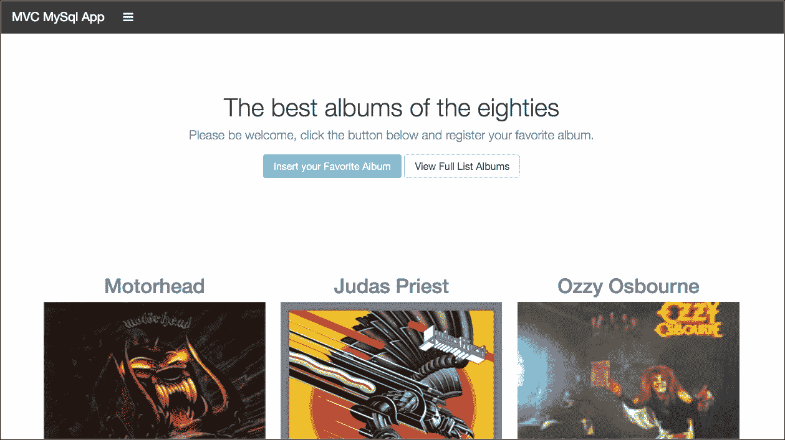
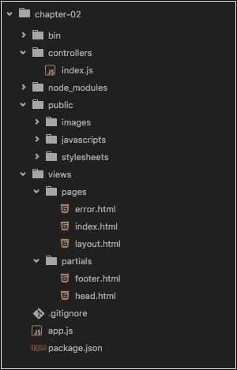
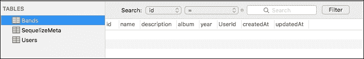
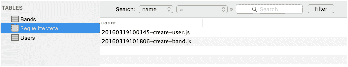
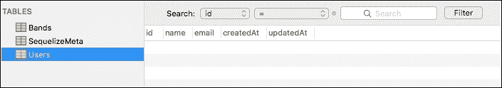
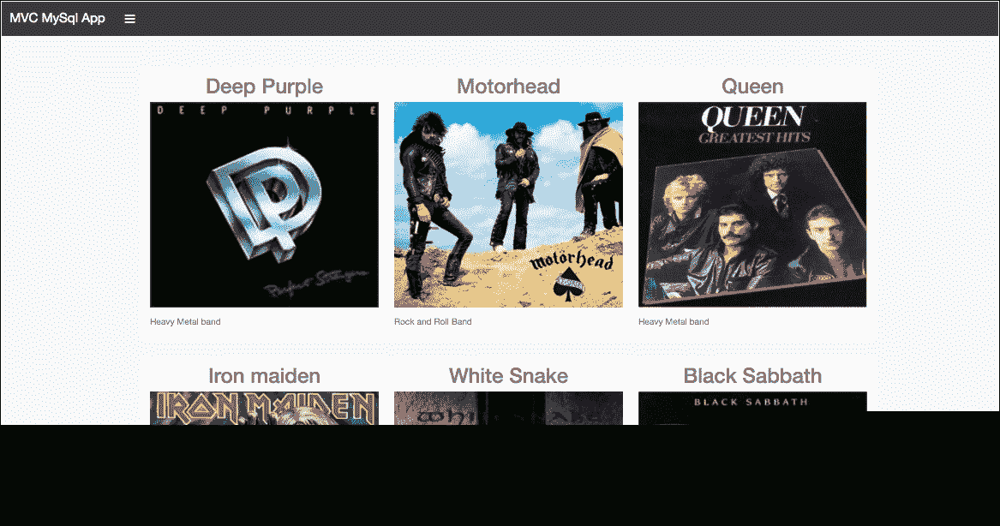
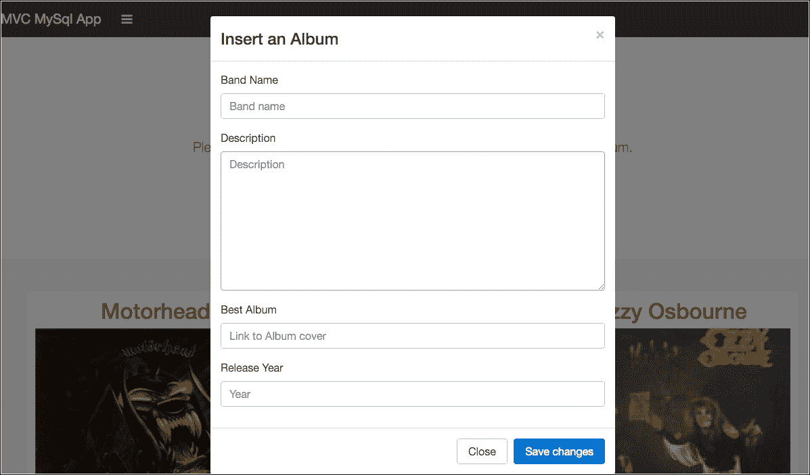
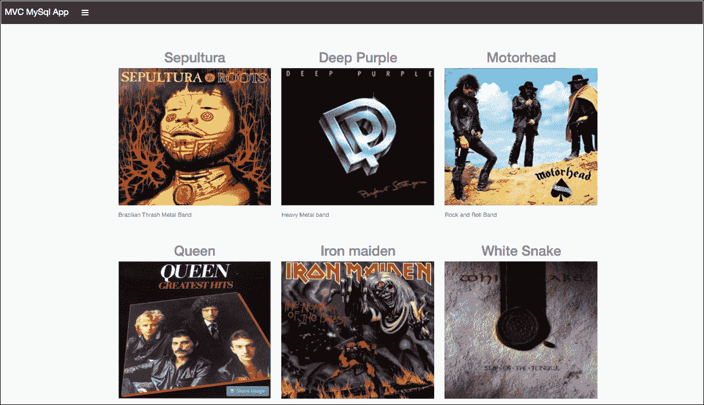

# 第二章：使用 MySQL 数据库构建基本网站

在本章中，我们将介绍使用关系数据库的 Node.js 应用程序的一些基本概念，本例中为 Mysql。

让我们看一下 MongoDB 的**对象文档映射器**（**ODM**）和**sequelize**和 Mysql 使用的**对象关系映射器**（**ORM**）之间的一些区别。为此，我们将创建一个简单的应用程序，并使用我们可用的资源**sequelize**，这是一个用于创建模型和映射数据库的强大中间件。

我们还将使用另一个名为 Swig 的引擎模板，并演示如何手动添加模板引擎。

在本章中，我们将涵盖：

+   如何使用 Swig 模板引擎

+   将默认路由从 express 生成器更改为 MVC 方法

+   安装 Squelize-CLI

+   如何使用 Sequelize 模型的 ORM

+   使用数据库迁移脚本

+   处理 MySQL 数据库关系

# 我们正在构建的内容

在本章末尾，我们将创建以下示例应用程序。本章假设您已经在计算机上安装并运行了 Mysql 数据库。



示例应用程序

# 创建基线应用程序

第一步是创建另一个目录，因为我将所有章节都放在 git 控制下，我将使用与第一章相同的根文件夹，*在 Node.js 中使用 MVC 设计模式构建类似 Twitter 的应用程序*。

1.  创建一个名为`chapter-02`的文件夹。

1.  在此文件夹中打开您的终端/ shell 并键入 express 命令：

```js
 express --git

```

请注意，这次我们只使用了`--git`标志，我们将使用另一个模板引擎，但将手动安装它。

# 安装 Swig 模板引擎

要做的第一步是将默认的 express 模板引擎更改为**Swig**，这是一个非常简单、灵活和稳定的模板引擎，还为我们提供了一个非常类似于 AngularJS 的语法，只需使用双大括号`{{ variableName }}`表示表达式。

### 提示

有关**Swig**的更多信息，请访问官方网站：[`github.com/paularmstrong/swig`](https://github.com/paularmstrong/swig)。

1.  打开`package.json`文件并用以下代码替换`jade`行：

```js
 "swig": "¹.4.2",

```

1.  在项目文件夹中打开终端/ shell 并键入：

```js
 npm install

```

1.  在我们继续之前，让我们对`app.js`进行一些调整，我们需要添加`Swig`模块。打开`app.js`并在`var bodyParser = require('body-parser');`行之后添加以下代码：

```js
      var swig = require('swig');

```

1.  用以下代码替换默认的`jade`模板引擎行：

```js
      var swig = new swig.Swig(); 
      app.engine('html', swig.renderFile); 
      app.set('view engine', 'html'); 

```

# 重构 views 文件夹

与之前一样，让我们将`views`文件夹更改为以下新结构：

`views`

+   `pages/`

+   `partials/`

1.  从`views`文件夹中删除默认的`jade`文件。

1.  在`pages`文件夹中创建一个名为`layout.html`的文件并放入以下代码：

```js
      <!DOCTYPE html> 
      <html> 
      <head> 
      </head> 
      <body> 
           
           
      </body> 
      </html> 

```

1.  在`views/pages`文件夹中创建一个`index.html`并放入以下代码：

```js
       
       
       
      <h1>{{ title }}</h1> 
          Welcome to {{ title }} 
       

```

1.  在`views/pages`文件夹中创建一个`error.html`页面并放入以下代码：

```js
       
       
       
      <div class="container"> 
          <h1>{{ message }}</h1> 
          <h2>{{ error.status }}</h2> 
          <pre>{{ error.stack }}</pre> 
       </div> 
       

```

1.  我们需要在`app.js`上调整`views`路径，并在`var app = express();`函数之后用以下代码替换代码：

```js
      // view engine setup 
      app.set('views', path.join(__dirname, 'views/pages'));

```

此时，我们已经完成了启动 MVC 应用程序的第一步。在上一章中，我们基本上使用了 express 命令创建的原始结构，但在本例中，我们将完全使用 MVC 模式，即 Model，View，Controller。

# 创建一个 controllers 文件夹

1.  在根项目文件夹内创建一个名为`controllers`的文件夹。

1.  在`controllers`文件夹中创建一个`index.js`并放入以下代码：

```js
      // Index controller 
      exports.show = function(req, res) { 
      // Show index content 
          res.render('index', { 
              title: 'Express' 
          }); 
      }; 

```

1.  编辑`app.js`文件，并用以下代码替换原始的`index`路由`app.use('/', routes);`：

```js
      app.get('/', index.show); 

```

1.  将控制器路径添加到`app.js`文件中`var swig = require('swig');`声明之后，用以下代码替换原始代码：

```js
      // Inject index controller 
      var index = require('./controllers/index'); 

```

1.  现在是时候检查一切是否如预期般进行了：我们将运行应用程序并检查结果。在您的终端/ shell 中键入以下命令：

```js
 npm start

```

检查以下网址：`http://localhost:3000`，您将看到 express 框架的欢迎消息。

## 删除默认路由文件夹

让我们删除默认的`routes`文件夹：

1.  删除`routes`文件夹及其内容。

1.  从`app.js`中删除`user route`，在索引控制器行之后。

# 为头部和页脚添加部分文件

现在让我们添加头部和页脚文件：

1.  在`views/partials`文件夹中创建一个名为`head.html`的新文件，并放入以下代码：

```js
      <meta charset="utf-8"> 
      <title>{{ title }}</title> 
      <link rel='stylesheet' href='https://cdnjs.cloudflare.com/ajax/libs
       /twitter-bootstrap/4.0.0-alpha.2/css/bootstrap.min.css'> 
      <link rel="stylesheet" href="/stylesheets/style.css"> 

```

1.  在`views/partials`文件夹中创建一个名为`footer.html`的文件，并放入以下代码：

```js
      <script src='https://cdnjs.cloudflare.com/ajax/libs/jquery/2.2.1
       /jquery.min.js'></script> 
      <script src='https://cdnjs.cloudflare.com/ajax/libs/twitter-bootstrap
       /4.0.0-alpha.2/js/bootstrap.min.js'></script> 

```

1.  现在，是时候使用`include`标签将部分文件添加到`layout.html`页面了。打开`layout.html`并添加以下代码：

```js
      <!DOCTYPE html> 
      <html> 
      <head> 
           
      </head> 
      <body> 
            
            

           
      </body> 
      </html> 

```

最后，我们准备继续我们的项目。这次，我们的目录结构将如下截图所示：



文件结构

# 安装和配置 Sequelize-cli

**Sequelize-cli**是一个非常有用的命令行界面，用于创建模型、配置和迁移文件到数据库。它与 Sequelize 中间件集成，并与许多关系数据库（如 PostgreSQL、MySQL、MSSQL、Sqlite）一起运行。

### 提示

您可以在以下网址找到有关 Sequelize 中间件实现的更多信息：[`docs.sequelizejs.com/en/latest/`](http://docs.sequelizejs.com/en/latest/)，以及**Sequelize-Cli**的完整文档：[`github.com/sequelize/cli`](https://github.com/sequelize/cli)。

1.  打开终端/Shell 并键入：

```js
 npm install -g sequelize-cli

```

1.  使用以下命令安装`sequelize`：

```js
 npm install sequelize -save

```

### 提示

记住我们总是使用`-save`标志将模块添加到我们的`package.json`文件中。

1.  在根文件夹上创建一个名为`.sequelizerc`的文件，并放入以下代码：

```js
      var path = require('path'); 
      module.exports = { 
        'config': path.resolve('./config', 'config.json'), 
        'migrations-path': path.resolve('./config', 'migrations'), 
        'models-path': path.resolve('./', 'models'), 
        'seeders-path': path.resolve('./config', 'seeders') 
      } 

```

1.  在终端/Shell 上，键入以下命令：

```js
sequelize init

```

1.  在`init`命令之后，终端将显示以下输出消息：

```js
 Sequelize [Node: 6.3.0, CLI: 2.3.1, ORM: 3.19.3] 

      Using gulpfile /usr/local/lib/node_modules/sequelize
      -cli/lib/gulpfile.js 
      Starting 'init:config'... 
      Created "config/config.json" 
      Finished 'init:config' after 4.05 ms 
      Successfully created migrations folder at "/chapter-02/config
      /migrations". 
      Finished 'init:migrations' after 1.42 ms 
      Successfully created seeders folder at "/chapter-02/config
      /seeders". 
      Finished 'init:seeders' after 712 μs 
      Successfully created models folder at "/chapter-02/models". 
      Loaded configuration file "config/config.json". 
      Using environment "development". 
      Finished 'init:models' after 18 msStarting 'init'...

```

此命令还创建了用于存储应用程序模式的 models 目录，一个配置文件，以及用于保存程序和迁移脚本的文件夹。现在不要担心这个，我们将在下一节中查看迁移。

# 使用数据库凭据编辑 config.js 文件

正如我们所看到的，`sequelize`命令创建了许多文件，包括数据库配置文件。该文件具有应用程序数据库的示例配置。

1.  打开`config/config.json`并编辑`development`标签，使用我们的数据库详细信息，如以下突出显示的代码：

```js
      { 
        "development": { 
        "username": "root", 
            "password": "", 
            "database": "mvc_mysql_app", 
            "host": "127.0.0.1", 
            "port": "3306", 
            "dialect": "mysql" 
        }, 
        "test": { 
            "username": "root", 
            "password": null, 
            "database": "database_test", 
            "host": "127.0.0.1", 
            "dialect": "mysql" 
        }, 
        "production": { 
            "username": "root", 
            "password": null, 
            "database": "database_production", 
            "host": "127.0.0.1", 
            "dialect": "mysql" 
        } 
      } 

```

### 提示

请注意，我正在使用没有密码的 root 用户连接我的数据库，如果您使用不同的用户或使用不同的密码，请用您自己的凭据替换上述代码。

# 创建用户模式

借助`Sequelize-cli`，我们将为应用程序用户创建一个简单的模式：

在根项目文件夹中打开终端/Shell，并键入以下命令：

```js
 sequelize model:create --name User --attributes "name:string,
      email:string"

```

您将在终端窗口上看到以下输出：

```js
Sequelize [Node: 6.3.0, CLI: 2.3.1, ORM: 3.19.3]
Loaded configuration file "config/config.json".
Using environment "development".
Using gulpfile /usr/local/lib/node_modules/sequelize-
      cli/lib/gulpfile.js
Starting 'model:create'...
Finished 'model:create' after 13 ms

```

让我们检查`models/User.js`中的用户模型文件，这里使用`define()`函数添加`sequelize`以创建用户模式：

```js
      'use strict'; 
      module.exports = function(sequelize, DataTypes) { 
        var User = sequelize.define('User', { 
          name: DataTypes.STRING, 
          email: DataTypes.STRING 
        },
       { 
          classMethods: { 
           associate: function(models) { 
              // associations can be defined here 
           } 
        } 
       }); 
       return User; 
       }; 

```

请注意，此命令在`models`文件夹中创建了`User.js`文件，并且还创建了一个包含哈希和要在数据库中执行的操作名称的迁移文件在`migrations`文件夹中。

该文件包含创建数据库中用户表所需的样板。

```js
      'use strict'; 
       module.exports = { 
        up: function(queryInterface, Sequelize) { 
          return queryInterface.createTable('Users', { 
            id: { 
              allowNull: false, 
              autoIncrement: true, 
              primaryKey: true, 
              type: Sequelize.INTEGER 
            }, 
            name: { 
                type: Sequelize.STRING 
            }, 
            email: { 
              type: Sequelize.STRING 
            }, 
            createdAt: { 
              allowNull: false, 
              type: Sequelize.DATE 
            }, 
            updatedAt: { 
               allowNull: false, 
               type: Sequelize.DATE 
            } 
          }); 
        }, 
        down: function(queryInterface, Sequelize) { 
            return queryInterface.dropTable('Users'); 
        } 
      }; 

```

# 创建乐队模式

让我们创建一个模式，将在数据库中存储用户在系统中创建的每个乐队的数据。

1.  打开终端/Shell 并键入以下命令：

```js
 sequelize model:create --name Band --attributes "name:string,
       description:string, album:string, year:string, UserId:integer"

```

1.  与上一步一样，创建了两个文件，一个用于迁移数据，另一个用作乐队模型，如下所示的代码：

```js
      'use strict'; 
      module.exports = function(sequelize, DataTypes) { 
        var Band = sequelize.define('Band', { 
          name: DataTypes.STRING, 
          description: DataTypes.STRING, 
          album: DataTypes.STRING, 
          year: DataTypes.STRING, 
          UserId: DataTypes.INTEGER 
        }, { 
          classMethods: { 
             associate: function(models) { 
              // associations can be defined here 
          } 
        } 
      }); 
      return Band; 
      }; 

```

## 在乐队和用户模型之间创建关联

在使用方案迁移脚本之前的最后一步，我们需要创建用户模型和乐队模型之间的关联。我们将使用以下关联：

| **模型** | **关联** |
| --- | --- |
| `Band.js` | `Band.belongsTo(models.User);` |
| `User.js` | `User.hasMany(models.Band);` |

### 提示

您可以在以下链接找到有关关联的更多信息：[`docs.sequelizejs.com/en/latest/docs/associations/`](http://docs.sequelizejs.com/en/latest/docs/associations/)。

1.  打开`User.js`模型并添加以下突出显示的代码：

```js
      'use strict'; 
       module.exports = function(sequelize, DataTypes) { 
         var User = sequelize.define('User', { 
           name: DataTypes.STRING, 
           email: DataTypes.STRING 
         }, { 
           classMethods: { 
             associate: function(models) { 
              // associations can be defined here 
              User.hasMany(models.Band); 
            } 
          } 
         }); 
       return User; 
      }; 

```

1.  打开`Band.js`模型并添加以下突出显示的代码：

```js
      'use strict'; 
       module.exports = function(sequelize, DataTypes) { 
         var Band = sequelize.define('Band', { 
           name: DataTypes.STRING, 
           description: DataTypes.STRING, 
           album: DataTypes.STRING, 
           year: DataTypes.STRING, 
           UserId: DataTypes.INTEGER 
         }, { 
           classMethods: { 
              associate: function(models) { 
              // associations can be defined here 
        Band.belongsTo(models.User); 
         } 
        } 
       }); 
       return Band; 
      }; 

```

# 在 Mysql 上创建数据库

在尝试访问 Mysql 控制台之前，请确保它正在运行。要检查：

1.  打开终端/ shell 并使用以下命令登录您的 Mysql：

```js
 mysql -u root

```

1.  请记住，如果您使用不同的用户名或密码，请使用以下命令并将`youruser`和`yourpassword`替换为您自己的凭据：

```js
 mysql -u youruser -p yourpassword

```

1.  现在让我们创建我们的数据库，输入以下命令：

```js
 CREATE DATABASE mvc_mysql_app;

```

1.  命令执行后的结果将是以下行：

```js
 Query OK, 1 row affected (0,04 sec)

```

这证实了操作是成功的，我们准备继续前进。

## 使用数据库迁移在 Mysql 上插入数据

现在是将模式迁移到数据库的时候了。再次使用`sequelize-cli`进行此迁移。在继续之前，我们需要手动安装一个 Mysql 模块。

1.  打开终端/ shell 并输入以下命令：

```js
 npm install

```

### 提示

请注意，`Sequelize`接口取决于应用程序中使用的每种类型数据库的各个模块，我们的情况下是使用 Mysql

1.  打开您的终端/ shell 并输入以下命令：

```js
 sequelize db:migrate

```

1.  这将是上述操作的结果，您终端的输出：

```js
Sequelize [Node: 6.3.0, CLI: 2.3.1, ORM: 3.19.3, mysql: ².10.2]
Loaded configuration file "config/config.json".
Using environment "development".
Using gulpfile /usr/local/lib/node_modules/sequelize-
      cli/lib/gulpfile.js
Starting 'db:migrate'...
Finished 'db:migrate' after 438 ms
== 20160319100145-create-user: migrating =======
== 20160319100145-create-user: migrated (0.339s)
== 20160319101806-create-band: migrating =======
== 20160319101806-create-band: migrated (0.148s)

```

# 检查数据库表

我们可以使用自己的 Mysql 控制台来查看表是否成功创建。但是我将使用另一个具有图形界面的功能，它极大地简化了工作，因为它允许更快速、更轻松地显示，并且可以快速对基础数据进行操作。

由于我正在使用 Mac OSX，我将使用一个名为**Sequel Pro**的应用程序，这是一个免费且轻量级的应用程序，用于管理 Mysql 数据库。

### 提示

您可以在以下链接找到有关**Sequel Pro**的更多信息：[`www.sequelpro.com/`](http://www.sequelpro.com/)。

前面的命令：`sequelize db:migrate`创建了表，如我们在以下图中所见：

1.  这张图片显示了左侧选择的乐队表，右侧显示了我们在乐队模式上设置的属性的内容：

乐队表

1.  这张图片显示了左侧选择的`SequelizeMeta`表，右侧显示了`config/migrations`文件夹中生成的`Sequelize`文件的内容：

迁移文件

1.  这张图片显示了左侧选择的用户表，右侧显示了我们在用户模式上设置的属性的内容：

用户表

`SquelizeMeta`表以与我们在迁移文件夹中的迁移文件相同的方式保存迁移文件。

现在我们已经为数据库中的数据插入创建了必要的文件，我们准备继续创建应用程序的其他文件。

# 创建应用程序控制器

下一步是为模型 User 和 Band 创建控件：

1.  在`controllers`文件夹中，创建一个名为`User.js`的新文件并添加以下代码：

```js
      var models = require('../models/index'); 
      var User = require('../models/user'); 

      // Create Users 
      exports.create = function(req, res) { 
          // create a new instance of the Users model with request body 
          models.User.create({ 
            name: req.body.name, 
              email: req.body.email 
          }).then(function(user) { 
              res.json(user); 
          }); 
       }; 

       // List Users 
       exports.list = function(req, res) { 
           // List all users 
           models.User.findAll({}).then(function(users) { 
               res.json(users); 
          }); 
      }; 

```

### 提示

请注意，文件的第一行导入了`index`模型；这个文件是创建所有控件的基础，它是用于映射其他模型的`sequelize`。

1.  在`controllers`文件夹中为 Band 控制器做同样的事情；创建一个名为`Band.js`的文件并添加以下代码：

```js
      var models = require('../models/index'); 
      var Band = require('../models/band'); 

      // Create Band 
      exports.create = function(req, res) { 
          // create a new instance of the Bands model with request body 
          models.Band.create(req.body).then(function(band) { 
              //res.json(band); 
              res.redirect('/bands'); 
          }); 
      }; 

      // List Bands 
      exports.list = function(req, res) { 
          // List all bands and sort by Date 
          models.Band.findAll({ 
            // Order: lastest created 
              order: 'createdAt DESC' 
          }).then(function(bands) { 
               //res.json(bands); 
              // Render result 
               res.render('list', { 
                  title: 'List bands', 
                  bands: bands 
               }); 
           });  
      }; 

      // Get by band id 
      exports.byId = function(req, res) { 
          models.Band.find({ 
             where: { 
               id: req.params.id 
            } 
          }).then(function(band) { 
              res.json(band); 
          }); 
       } 
       // Update by id 
       exports.update = function (req, res) { 
           models.Band.find({ 
           where: { 
              id: req.params.id 
           } 
        }).then(function(band) { 
             if(band){ 
               band.updateAttributes({ 
                  name: req.body.name, 
                  description: req.body.description, 
                  album: req.body.album, 
                  year: req.body.year, 
                  UserId: req.body.user_id 
               }).then(function(band) { 
                  res.send(band); 
              }); 
            } 
          }); 
      } 

      // Delete by id 
      exports.delete = function (req, res) { 
          models.Band.destroy({ 
            where: { 
               id: req.params.id 
            } 
          }).then(function(band) { 
              res.json(band); 
          }); 
      } 

```

1.  现在让我们重构`index.js`控制器并添加以下代码：

```js
      // List Sample Bands 
      exports.show = function(req, res) { 
         // List all comments and sort by Date 
         var topBands = [ 
              { 
                  name: 'Motorhead', 
                  description: 'Rock and Roll Band', 
                  album: 'http://s2.vagalume.com/motorhead/discografia
                  /orgasmatron-W320.jpg', year:'1986', 
              }, 
              { 
                  name: 'Judas Priest', 
                  description: 'Heavy Metal band', 
                  album: 'http://s2.vagalume.com/judas-priest/discografia
                   /screaming-for-vengeance-W320.jpg', year:'1982', 
              }, 
              { 
                  name: 'Ozzy Osbourne', 
                  description: 'Heavy Metal Band', 
                  album: 'http://s2.vagalume.com/ozzy-osbourne/discografia
                  /diary-of-a-madman-W320.jpg', year:'1981', 
              } 
         ]; 
           res.render('index', { 
               title: 'The best albums of the eighties', 
               callToAction: 'Please be welcome, click the button below 
               and register your favorite album.', bands: topBands 
           }); 
      }; 

```

请注意，使用前面的代码，我们只是创建了一个简单的列表，以在主屏幕上显示一些专辑。

# 创建应用程序模板/视图

现在让我们创建应用程序视图：

1.  在`views/pages`文件夹中，创建一个名为`band-list.html`的新文件并添加以下代码：

```js
       
       
       
      <div class="album text-muted"> 
      <div class="container"> 
      <div class="row"> 
                   
      <div class="card col-lg-4"> 
      <h2 class="text-lg-center">{{ band.name }}</h2> 
                           
        
                           
                           
        
                           
       <p class ="card-text">{{ band.description }}</p> 
       </div> 
                    
       </div> 
       </div> 
       </div> 
        

```

1.  打开`views/pages/index.html`并添加以下代码：

```js
       
       
        
      <section class="jumbotron text-xs-center"> 
      <div class="container"> 
        <h1 class="jumbotron-heading">{{ title }}</h1> 
        <p class="lead text-muted">{{ callToAction }}</p> 
        <p> 
        <a href="/bands" class="btn btn-secondary">
          View Full List Albums</a> 
        </p> 
      </div> 
      </section> 
      <div class="album text-muted"> 
        <div class="container"> 
          <div class="row"> 
                   
          <div class="card col-lg-4"> 
            <h2 class="text-lg-center">{{ band.name }}</h2> 
                           
             
                       
                       
             
                       
            <p class="card-text">{{ band.description }}</p> 
          </div> 
                   
          </div> 
        </div> 
      </div> 
       

```

1.  打开`views/pages/layou.html`并添加以下突出显示的代码：

```js
      <!DOCTYPE html> 
      <html> 
      <head> 
           
      </head> 
      <body>
 <div class="navbar-collapse inverse collapse" id="navbar-header"
       aria-expanded="false" style="height: 0px;"> 
      <div class="container-fluid"> 
      <div class="about"> 
        <h4>About</h4> 
        <p class="text-muted">Add some information about the album below,
           the author, or any other background context. Make it a few
           sentences long so folks can pick up some informative tidbits.
           Then, link them off to some social networking sites or contact
           information.
         </p> 
      </div> 
      <div class="social"> 
      <h4>Contact</h4> 
      <ul class="list-unstyled"> 
        <li><a href="#">Follow on Twitter</a></li> 
        <li><a href="#">Like on Facebook</a></li> 
        <li><a href="#">Email me</a></li> 
      </ul> 
      </div> 
      </div> 
      </div> 
      <div class="navbar navbar-static-top navbar-dark bg-inverse"> 
      <div class="container-fluid"> 
        <button class="navbar-toggler collapsed" type="button"
          data-toggle="collapse" data-target="#navbar-header"
          aria-expanded="false"> 
        </button> 
        <a href="/" class="navbar-brand">MVC MySql App</a> 
      </div> 
      </div> 

               
               
      <footer class="text-muted"> 
      <div class="container"> 
        <p class="pull-xs-right"> 
        <a href="#">Back to top</a>  
        </p> 
        <p>Sample Page using Album example from © Bootstrap!</p> 
        <p>New to Bootstrap? <a href="http://v4-alpha.getbootstrap.
            com/getting-started/introduction/">Visit the homepage
        </a>.</p> 
      </div> 
      </footer>
            
      </body> 
      </html> 

```

# 为应用程序添加样式

我们还将在`public/stylesheet`文件中添加一些 CSS 行来为我们的示例应用程序设置样式。

打开`public/stylesheets/style.css`并添加以下代码：

```js
  body { 
    min-height: 75rem; /* Can be removed; just added for demo purposes */ 
  } 
  .navbar { 
    margin-bottom: 0; 
  } 
  .navbar-collapse .container-fluid { 
    padding: 2rem 2.5rem; 
    border-bottom: 1px solid #55595c; 
  } 
  .navbar-collapse h4 { 
    color: #818a91; 
  } 
  .navbar-collapse .text-muted { 
    color: #818a91; 
  } 
  .about { 
    float: left; 
    max-width: 30rem; 
    margin-right: 3rem; 
  } 
  .social a { 
  font-weight: 500; 
    color: #eceeef; 
  } 
  .social a:hover { 
    color: #fff; 
  } 
  .jumbotron { 
    padding-top: 6rem; 
    padding-bottom: 6rem; 
    margin-bottom: 0; 
    background-color: #fff; 
  } 
  .jumbotron p:last-child { 
    margin-bottom: 0; 
  } 
  .jumbotron-heading { 
    font-weight: 300; 
  } 
  .jumbotron .container { 
    max-width: 45rem; 
  } 
  .album { 
    min-height: 50rem; /* Can be removed; just added for demo purposes */ 
    padding-top: 3rem; 
    padding-bottom: 3rem; 
    background-color: #f7f7f7; 
  } 
  .card { 
    float: left; 
    width: 33.333%; 
    padding: .75rem; 
    margin-bottom: 2rem; 
    border: 0; 
  } 
  .card > img { 
    margin-bottom: .75rem; 
  } 
  .card-text { 
    font-size: 85%; 
  } 
  footer { 
    padding-top: 3rem; 
    padding-bottom: 3rem; 
  } 
  footer p { 
    margin-bottom: .25rem; 
  } 

```

# 添加路由和应用程序控制器

我们将编辑`app.js`文件以向`band-list.html`视图添加路由，以及它们各自的控制器：

1.  打开`app.js`并在索引控制器导入后添加以下行：

```js
      // Inject band controller 
      var bands = require('./controllers/band'); 
      // Inject user controller 
      var users = require('./controllers/user'); 

```

1.  在索引路由`app.get('/', index.show);`后添加以下代码：

```js
      // Defining route to list and post 
      app.get('/bands', bands.list); 
      // Get band by ID 
      app.get('/band/:id', bands.byId); 
      // Create band 
      app.post('/bands', bands.create); 
      // Update 
      app.put('/band/:id', bands.update); 
      // Delete by id 
      app.delete('/band/:id', bands.delete); 
      // Defining route to list and post users 
      app.get('/users', users.list); 
      app.post('/users', users.create); 

```

此时，我们几乎完成了应用程序的所有工作； 让我们在浏览器上检查结果。

1.  打开您的终端/ shell，并键入以下命令：

```js
 npm start 

```

1.  打开浏览器并转到此 URL：`http://localhost:3000/`

结果将是以下截图：


主屏幕的索引模板

如果我们检查`http://localhost:3000/bands`上的 Band 路由，我们将看到一个空屏幕，`http://localhost:3000/users`也是一样，但在这里我们找到了一个空的**JSON**数组。

让我们为 Band 的路由添加一些内容。

# 添加数据库内容

让我们在数据库中添加一些内容：

1.  创建一个名为`mvc_mysql_app.sql`的新文件，并放入以下代码：

```js
      # Dump of table Bands 
      # ------------------------------------------------------------ 

      DROP TABLE IF EXISTS `Bands`; 

      CREATE TABLE `Bands` ( 
        `id` int(11) NOT NULL AUTO_INCREMENT, 
        `name` varchar(255) DEFAULT NULL, 
        `description` varchar(255) DEFAULT NULL, 
        `album` varchar(255) DEFAULT NULL, 
        `year` varchar(255) DEFAULT NULL, 
        `UserId` int(11) DEFAULT NULL, 
        `createdAt` datetime NOT NULL, 
        `updatedAt` datetime NOT NULL, 
        PRIMARY KEY (`id`) 
      ) ENGINE=InnoDB DEFAULT CHARSET=utf8; 

      LOCK TABLES `Bands` WRITE; 
      /*!40000 ALTER TABLE `Bands` DISABLE KEYS */; 

      INSERT INTO `Bands` (`id`, `name`, `description`, `album`, `year`,
      `UserId`, `createdAt`, `updatedAt`) 
      VALUES 
         (2,'Motorhead','Rock and Roll Band','http://s2.vagalume.com/
          motorhead/discografia/ace-of-spades-W320.jpg','1979',NULL,
          '2016-03-13 21:50:25','2016-03-12 21:50:25'), 
         (4,'Black Sabbath','Heavy Metal Band','http://s2.vagalume.com/
          black-sabbath/discografia/heaven-and-hell W320.jpg','1980',
          NULL,'2016-03-12 22:11:00','2016-03-12 23:08:30'), 
         (6,'Deep Purple','Heavy Metal band','http://s2.vagalume.com
          /deep-purple/discografia/perfect-strangersW320.jpg',
           '1988',NULL,'2016-03-13 23:09:59','2016-03-12 23:10:29'), 
         (7,'White Snake','Heavy Metal band','http://s2.vagalume.com/
           whitesnake/discografia/slip-of-the-tongueW320.jpg','1989',
            NULL,'2016-03-13 01:58:56','2016-03-13 01:58:56'),
         (8,'Iron maiden','Heavy Metal band','http://s2.vagalume.com/
            iron-maiden/discografia/the-number-of-the-beastW320.jpg',
            '1982',NULL,'2016-03-13 02:01:24','2016-03-13 02:01:24'),
         (9,'Queen','Heavy Metal band','http://s2.vagalume.com/queen
            /discografia/greatest-hits-vol-1-W320.jpg','1981',NULL,
            '2016-03-13 02:01:25','2016-03-13 02:01:25'); 

       /*!40000 ALTER TABLE `Bands` ENABLE KEYS */; 
       UNLOCK TABLES; 

       /*!40111 SET SQL_NOTES=@OLD_SQL_NOTES */; 
       /*!40101 SET SQL_MODE=@OLD_SQL_MODE */; 
       /*!40014 SET FOREIGN_KEY_CHECKS=@OLD_FOREIGN_KEY_CHECKS */; 
       /*!40101 SET CHARACTER_SET_CLIENT=@OLD_CHARACTER_SET_CLIENT */; 
       /*!40101 SET CHARACTER_SET_RESULTS=@OLD_CHARACTER_SET_RESULTS */; 
       /*!40101 SET COLLATION_CONNECTION=@OLD_COLLATION_CONNECTION */; 

```

1.  打开**Sequel Pro**，单击**文件 > 导入 >**，然后选择 SQL 文件`mvc_mysql_app.sql`。

1.  返回浏览器并刷新`http://localhost:3000/bands`页面； 您将看到以下结果：

Band-list.html

# 创建一个乐队表单

现在我们将使用模态功能 bootstrap 创建乐队创建表单：

1.  打开`views/pages/index.html`文件，并在文件末尾添加以下代码：

```js
      <div class="modal fade" id="createBand" tabindex="-1" role="dialog" 
         aria-labelledby="myModalLabel" aria-hidden="true"> 
      <div class="modal-dialog" role="document"> 
      <div class="modal-content"> 
        <form action="/bands" method="post"> 
          <div class="modal-header"> 
            <button type="button" class="close" data-dismiss="modal" 
             aria-label="Close"> 
            <span aria-hidden="true">&times;</span> 
            </button> 
              <h4 class="modal-title" id="myModalLabel">Insert an
               Album</h4> 
          </div> 
          <div class="modal-body"> 
          <fieldset class="form-group"> 
          <label  for="inputname">Band Name</label> 
          <input type="text" id="inputname" name="name" 
           class="form-control" placeholder="Band name" required=""> 
         </fieldset> 
         <fieldset class="form-group"> 
         <label  for="inputdescription">Description</label> 
         <textarea id="nputdescription" name="description" rows="8"
           cols="40" class="form-control" placeholder="Description"
           required="">
         </textarea> 
         </fieldset> 
         <fieldset class="form-group">  
         <label  for="inputalbum">Best Album</label> 
         <input type="text" id="inputalbum" name="album" rows="8" cols="40"  
          class="form-control" placeholder="Link to Album cover">
           </textarea> 
         </fieldset> 
       <fieldset class="form-group"> 
         <label  for="inputyear">Release Year</label> 
         <input type="text" id="inputyear" name="year" rows="8" cols="40" 
          class="form-control" placeholder="Year" required=""></textarea> 
       </fieldset> 

      </div> 
        <div class="modal-footer"> 
          <button type="button" class="btn btn-secondary" 
            data-dismiss="modal">Close</button> 
          <button type="submit" class="btn btn-primary">Save 
            changes</button> 
       </div> 
      </form> 
      </div> 
      </div> 
      </div> 

```

1.  重新启动应用程序，打开您的终端/ shell，并键入以下命令：

```js
 npm start

```

1.  单击**插入专辑**按钮，您可以在模型窗口内看到乐队表单，如下图所示：

模态屏幕

## 插入新乐队

现在让我们检查表单的行为：

1.  使用以下数据填写表单：

+   名称：**Sepultura**

+   描述：**巴西垃圾金属乐队**

+   最佳专辑：**https://s2.vagalume.com/sepultura/discografia/roots-W320.jpg**

+   年份：**1996**

1.  单击**保存更改**按钮。

表单处理后，您将被重定向到`band-list.html`，并显示新记录，如下图所示：



带有新记录的 Band-list.html 屏幕

`Band.js`控制器上的`create()`函数通过表单`POST`激活，并且`Band.js`控制器中的以下代码用于保存数据并重定向用户：

```js
      // Create Band 
      exports.create = function(req, res) { 
          // create a new instance of the Bands model with request body 
          models.Band.create(req.body).then(function(band) { 
              //res.json(band); 
              res.redirect('/bands'); 
          }); 
      }; 

```

# ODM（mongoose）和 ORM（sequelize）之间的主要区别

两个数据库映射器之间的主要区别是 Sequelize 使用 promises 而 Mongoose 不使用。 Promises 易于处理异步事件。 更明确地说，让我们看一下以下代码来比较这两个中间件：

1.  从上一章的`passport.js`文件中提取的代码块：

```js
      User.findOne({ 'local.email' :  email }, function(err, user) { 
                          // if errors 
                          if (err) 
                          return done(err); 
                          // check email 
                          if (user) { 
                              return done(null, false, 
                               req.flash('signupMessage', 'Wohh! the email
                                is already taken.')); 
                               } else { 
                              // create the user 
                              var newUser = new User(); 
                              // Get user name from req.body 
                              newUser.local.name = req.body.name; 
                              newUser.local.email = email; 
                              newUser.local.password = 
                                newUser.generateHash(password); 
                              // save data 
                              newUser.save(function(err) { 
                                  if (err) 
                                  throw err; 
                                  return done(null, newUser); 
                              }); 
                           } 
               }); 

```

1.  现在使用`sequelize` promises 函数的相同代码块：

```js
      User.findOne({ where: { localemail: email }}) 
          .then(function(user) { 

         if (user) 
             return done(null, false, req.flash('loginMessage', 'That
              email
               is already taken.')); 
          if(req.user) { 

              var user = req.user; 
              user.localemail = email; 
              user.localpassword = User.generateHash(password); 
              user.save() 
                  .then (function() { 
                      done(null, user); 
                  }) 
                  .catch(function (err) { 
                      done(null, false, req.flash('loginMessage',
                       err));}); 
                  }); 
          } else { 
              // create the user 
              var newUser = User.build ({ 
                  localemail: email, 
                  localpassword: User.generateHash(password) 
              }); 
              // store the newUser to the database 
              newUser.save() 
                  .then(function() { 
                      done (null, newUser); 
                  }) 
                  .catch(function(err) { 
                      done(null, false, req.flash('loginMessage',
                       err));}); 
                  } 
              }) 
          .catch(function (e) { 
               done(null, false, req.flash('loginMessage',e.name + " " + 
                   e.message));                  
         }) 

```

请注意，使用`then()`函数处理所有返回。

# 总结

在本章中，我们探索了`sequelize-CLI`命令行的所有功能，以在关系数据库中创建表的映射。 我们看到了如何使用`sequelize model feature create()`交互式地创建模型，还看到了如何将模式文件迁移到数据库。

我们使用标准模板引擎启动了应用程序，并了解了如何重构引擎模板并使用另一个资源，即**Swig**模板库。

我们学习了如何使用一些 SQL 命令连接到 MySQL 数据库以及创建表的一些基本命令。

在下一章中，我们将探索使用 Node.js 和其他重要资源来利用和操作图像。
