# 第五章：使用 MongoDB 地理空间查询创建门店定位器应用程序

在本章中，我们将构建一个应用程序，仅使用 express 框架、Google 地图 API 和纯 JavaScript 存储**地理位置**数据的坐标（纬度和经度），并在地图上显示它们。

如今，使用 JavaScript 库是非常常见的，但大多数情况下它们仅用于应用程序的前端，通常使用 JSON 格式的数据消耗端点，并使用 Ajax 更新 UI。但是我们将仅在后端使用 JavaScript，构建一个 MVC 应用程序。

此外，我们将使用 MongoDB 的一个非常强大的功能，即能够在坐标中生成索引，使用诸如`$near`、`$geometry`等操作符，以定位地图中靠近特定位置的某些记录。

在本章中，我们将涵盖以下主题：

+   在 MongoDB 中创建用于存储坐标的模型/架构

+   创建*2d*球体索引

+   处理 Google Maps API

+   处理 HTML5 地理位置 API

+   在模板中混合 Swig 变量和纯 JavaScript

# 我们正在构建什么

在本章中，我们将构建一个门店定位器应用程序和一个简单的添加门店界面。结果如下截图所示：


主屏幕

# 创建基线应用程序

我们将使用与第四章中使用的`express-generator`相同的版本，*不要拍照，创造它-为摄影师设计的应用程序*。这次，我们不需要任何额外的模块来完成我们的任务：

1.  创建一个名为`chapter05`的文件夹。

1.  在`chapter05`文件夹中打开您的终端/ shell 并输入以下命令：

```js
 yo express

```

### 提示

请注意，我们已经在第四章中安装了`generator-express`。

1.  现在，按照以下顺序填写问题：

+   选择`N`：我们已经创建了一个文件夹

+   选择`MVC`：作为应用程序类型

+   选择`Swig`：作为模板引擎

+   选择`None`：作为 CSS 预处理器

+   选择`MongoDb`：作为数据库

+   选择`Gulp`：用于 LiveReload 和其他功能

### 提示

如果您从未听说过`Gulp`，不要担心；在本书的后面，我们将看到并解释一些构建工具。

## 重构默认结构

正如我们所知，并且正如我们之前所做的，我们需要对我们的应用程序结构进行一些调整，以使其更具可扩展性并遵循我们的 MVC 模式：

1.  在`app/views`文件夹中，创建一个名为`pages`的文件夹。

1.  在`app/views`文件夹中，创建一个名为`partials`的文件夹。

1.  将所有文件从`views`文件夹移动到`pages`文件夹。

### 为页脚和页眉创建部分视图

现在，作为最佳实践，让我们为页脚和页眉创建一些部分文件：

1.  在`app/view/partials/`中创建一个名为`footer.html`的文件。

1.  在`app/view/partials/`中创建一个名为`head.html`的文件。

### 将 Swig 模板设置为使用 HTML 扩展名

正如您所看到的，我们使用了`.html`文件扩展名，与之前的示例不同，我们使用了`.swig`文件扩展名。因此，我们需要更改 express `app.engine`配置文件，以便使用这种类型的扩展名：

1.  从`app/config/`中打开`express.js`文件。

1.  替换以下突出显示的代码行：

```js
      app.engine('html', swig.renderFile); 
      if(env == 'development'){ 
        app.set('view cache', false); 
        swig.setDefaults({ cache: false }); 
      } 
      app.set('views', config.root + '/app/views/pages'); 
      app.set('view engine', 'html'); 

```

这样我们就可以在应用程序模板中使用`.html`文件扩展名。

### 创建部分文件

现在是时候创建部分文件本身了：

1.  从`app/views/partials`中打开`head.html`并添加以下代码：

```js
      <head> 
        <meta charset="UTF-8"> 
        <meta name="viewport" content="width=device-width"> 
        <title>{{ title }}</title> 
        <!--Let browser know website is optimized for mobile--> 
        <meta name="viewport" content="width=device-width, initial-scale=
           1.0"/> 
        <!-- Import Google Material font and icons --> 
        <link href="https://fonts.googleapis.com/icon?family=
          Material+Icons" rel="stylesheet"> 
        <!-- Compiled and minified CSS --> 
        <link rel="stylesheet" href="https://cdnjs.cloudflare.com/ajax
          /libs/materialize/0.97.6/css/materialize.min.css"> 
        <link rel="stylesheet" href="/css/style.css"> 
        <!--Import jQuery before materialize.js--> 
        <script type="text/javascript" src="https://code.jquery.com/
           jquery-2.1.1.min.js"></script> 
        <!-- Compiled and minified JavaScript --> 
        <script src="https://cdnjs.cloudflare.com/ajax/libs/materialize
          /0.97.6/js/materialize.min.js"></script> 
        <!-- Google Maps API to track location  --> 
        <scriptsrc="https://maps.googleapis.com/maps/api/js?key=<YOUR
          API KEY GOES HERE>"></script> 
      </head> 

```

### 提示

请注意，我们已经包含了一个名为`materialize.css`的`CSS`框架和 Google 地图 API 链接：<script src="img/js?key=<YOUR API KEY GOES HERE>"></script>

1.  从`app/views/partials`打开`footer.html`并添加以下代码：

```js
      <footer class="page-footer teal darken-1"> 
      <div class="container"> 
        <div class="row"> 
          <div class="col l6s12"> 
            <h5 class="white-text">Some Text Example</h5> 
            <p class="grey-text text-lighten-4">Lorem ipsum dolor
              sit amet, consecteturadipiscingelit, sed do 
              eiusmodtemporincididuntutlabore et dolore magna aliqua.
              Utenim ad minim veniam, quisnostrud 
              exercitationullamcolaboris nisi utaliquip ex
              eacommodoconsequat. Duisauteirure dolor in reprehenderit
              in voluptatevelitessecillumdoloreeufugiatnullapariatur.</p> 
          </div> 
          <div class="col l3s12"> 
            <h5 class="white-text">Sample Links</h5> 
            <ul> 
              <li><a class="white-text" href="#!">Link 1</a></li> 
              <li><a class="white-text" href="#!">Link 2</a></li> 
              <li><a class="white-text" href="#!">Link 3</a></li> 
              <li><a class="white-text" href="#!">Link 4</a></li> 
            </ul> 
          </div> 
          <div class="col l3s12"> 
            <h5 class="white-text">Sample Links</h5> 
            <ul> 
              <li><a class="white-text" href="#!">Link 1</a></li> 
              <li><a class="white-text" href="#!">Link 2</a></li> 
              <li><a class="white-text" href="#!">Link 3</a></li> 
              <li><a class="white-text" href="#!">Link 4</a></li> 
            </ul> 
          </div> 
        </div>
      </div> 
      <div class="footer-copyright"> 
      <div class="container"> 
        MVC Express App for: <a class="white-text text-darken-2"
        href="#">Node.js 6 Blueprints Book</a>
      </div> 
      </div> 
      </footer> 
      <!-- Live reload for development --> 
         
          <scriptsrc="img/livereload.js"></script> 
         
      <!--InitRsponsiveSidenav Menu  --> 
      <script> 
            (function ($) { 
              $(function () { 
                  $('.button-collapse').sideNav(); 
              }); 
            })(jQuery); 
      </script> 

```

### 创建应用程序模板文件

现在我们将替换`generator`创建的模板文件的内容：

1.  打开`app/views/pages/`中的`index.html`并添加以下代码：

```js
       
      
      <div id="map" style="height: 300px"></div> 
        <div class="section"> 
          <div class="container"> 
          <br> 
            <h1 class="header center teal-text">{{ title }}</h1> 
            <div class="row center"> 
              <h5 class="header col s12 light">Welcome to {{ title }}
              </h5> 
            </div> 
            <div class="row center"> 
              <a href="locations/add" id="download-button"
                class="btn-large waves-effect waves-light teal">
                Add your location
             </a> 
            </div> 
             <br><br> 
          </div> 
        </div> 
         <!-- Tracking current user position --> 
         <scriptsrc="img/getCurrentPosition.js"></script> 
          

```

### 提示

请注意`getCurrentPosition.js`文件添加到`index.html`模板中。在本章的后面，我们将解释这个文件发生了什么。

1.  打开`app/views/pages/`中的`layout.html`并添加以下代码：

```js
      <!doctype html> 
      <html lang="en"> 
       
      <body> 
        <nav class="teal" role="navigation"> 
        <div class="nav-wrapper container"><a id="logo-container"
          href="/" class="brand-logo">Logo</a> 
          <ul class="right hide-on-med-and-down"> 
            <li><a href="/locations">Locations</a></li> 
            <li><a href="/locations/add">Add Location</a></li> 
            <li><a href="/stores">Stores</a></li> 
          </ul> 
          <ul id="nav-mobile" class="side-nav" style="transform:
            translateX(-100%);"> 
            <li><a href="/locations">Locations</a></li> 
            <li><a href="/locations/add">Add Location</a></li> 
            <li><a href="/stores">Stores</a></li> 
          </ul> 
          <a href="#" data-activates="nav-mobile" class="button-
           collapse"><i class="material-icons">menu</i></a> 
        </div> 
      </nav> 
       
       <!-- Footer --> 
        
      </body> 
      </html> 
```

1.  打开`app/views/pages/`中的`error.html`并添加以下代码：

```js
       
       
      <div class="section"> 
        <div class="container"> 
        <br> 
          <h1 class="header center teal-text">{{ message }}</h1> 
          <div class="row center"> 
            <h3 class="header col s12 light">{{ error.status }}</h3> 
          </div> 
          <div class="row center"> 
            <pre>{{ error.stack }}</pre> 
          </div> 
          <br><br> 
        </div> 
      </div> 
       

```

现在我们有了开始应用程序开发所需的基线，但我们需要设置`getCurrentPosition.js`文件。

# 使用 Geolocation HTML5 API

我们可以使用各种资源来获取用户的位置，所以在这个例子中我们使用了**HTML5 API**。我们将使用外部 JavaScript 文件来创建一个显示用户精确位置的地图：

1.  创建一个名为`getCurrentPosition.js`的文件，并将其保存在`public/js`文件夹中。

1.  将以下代码放入`getCurrentPosition.js`中：

```js
      function getCurrentPosition() { 
          // Check boreswer/navigator support 
      if (navigator.geolocation) { 
      var options = { 
        enableHighAccuracy : true, 
        timeout : Infinity, 
        maximumAge : 0 
      }; 
        navigator.geolocation.watchPosition(getUserPosition, trackError,
        options); 
      }
      else { 
        alert('Ops; Geolocation is not supported'); 
      } 
         // Get user position and place a icon on map 
      function getUserPosition(position) { 
            // Check longitude and latitude 
      console.log(position.coords.latitude); 
      console.log(position.coords.longitude); 
            // Create the user' coordinates 
      var googlePos = new google.maps.LatLng(position.coords.latitude,
      position.coords.longitude); 
      var mapOptions = { 
        zoom : 12,
        center :googlePos, 
        mapTypeId :google.maps.MapTypeId.ROADMAP 
      }; 
        // Set a variable to get the HTML div 
        var mapObj = document.getElementById('map'); 
        // Create the map and passing: map div and map options 
        var googleMap = new google.maps.Map(mapObj, mapOptions); 
        // Setup a marker on map with user' location 
        var markerOption = { 
          map :googleMap, 
          position :googlePos, 
          animation :google.maps.Animation.DROP 
        }; 
      // Create a instance with marker on map 
        var googleMarker = new google.maps.Marker(markerOption); 
        // Get the user's complete address information using the Geocoder
        //Google API 
        var geocoder = new google.maps.Geocoder(); 
          geocoder.geocode({ 
             'latLng' : googlePos 
          },
          function(results, status) { 
            if (status == google.maps.GeocoderStatus.OK) { 
              if (results[1]) { 
                var popOpts = { 
                content : results[1].formatted_address, 
                position :googlePos 
                }; 
                // Setup an info window with user information 
                var popup = new google.maps.InfoWindow(popOpts); 
                google.maps.event.addListener(googleMarker,
                'click', function() { 
                   popup.open(googleMap); 
                 }); 
              }
              else { 
                alert('No results found'); 
              } 
            }
            else { 
             alert('Uhh, failed: ' + status); 
            } 
          }); 
        } 
        // Setup a error function 
        function trackError(error) { 
        var err = document.getElementById('map'); 
         switch(error.code) { 
         case error.PERMISSION_DENIED: 
         err.innerHTML = "User denied Geolocation."; 
         break; 
         case error.POSITION_UNAVAILABLE: 
         err.innerHTML = "Information is unavailable."; 
         break; 
         case error.TIMEOUT: 
         err.innerHTML = "Location timed out."; 
         break; 
         case error.UNKNOWN_ERROR: 
         err.innerHTML = "An unknown error."; 
         break; 
        } 
        }
      } 
      getCurrentPosition(); 

```

因此，当我们转到`http://localhost:3000/`时，我们可以在地图上看到我们的地址指出，就像以下屏幕截图中一样：

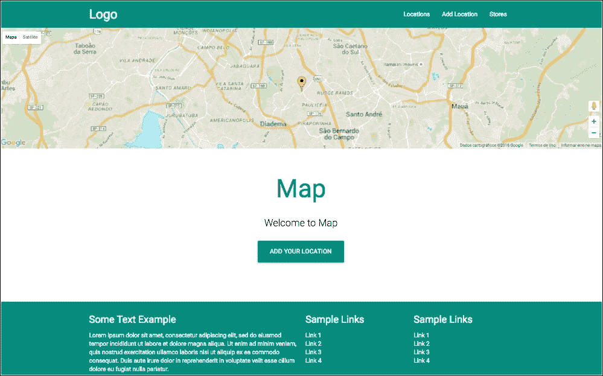

启用地理定位的主屏幕

### 提示

请注意，您的浏览器将请求权限以跟踪您的位置

# 创建应用程序控制器

现在的下一步是创建应用程序控制器：

1.  在`app/controllers/`文件夹中创建一个名为`locations.js`的新文件，并添加以下代码：

```js
      var express = require('express'), 
      router = express.Router(), 
      mongoose = require('mongoose'), 
      Location = mongoose.model('Location'); 
      module.exports = function (app) { 
      app.use('/', router); 
      }; 
      router.get('/locations', function (req, res, next) { 
      Location.find(function (err, item) { 
      if (err) return next(err); 
        res.render('locations', { 
          title: 'Locations', 
          location: item, 
          lat: -23.54312, 
          long: -46.642748 
        }); 
        //res.json(item); 
          }); 
      }); 
      router.get('/locations/add', function (req, res, next) { 
      res.render('add-location', { 
      title: 'Insert Locations' 
          }); 
      }); 
      router.post('/locations', function (req, res, next) { 
          // Fill loc object with request body 
      varloc = {
        title: req.body.title, 
        coordinates: [req.body.long, req.body.lat] 
      }; 
      var locations = new Location(loc); 
      // save the data received 
       locations.save(function(error, item) { 
       if (error) { 
         returnres.status(400).send({ 
         message: error 
         }); 
       } 
        //res.json({message: 'Success', obj: item}); 
         res.render('add-location', { 
         message: 'Upload with Success', 
         obj: item 
              }); 
          }); 
      });  

```

请注意，我们放置了一个固定的位置来居中地图，并创建了 3 条路线：

+   `router.get('/locations',...);`以从 MongoDB 获取所有位置

+   `router.get('/locations/add',...);`以呈现添加位置表单

+   `router.post('/locations',...);`以将新位置添加到 MongoDB

另一个重要的要点是`get(/locations)`上的注释代码：

```js
 //res.status(200).json(stores);.

```

这样我们可以返回一个纯 JSON 对象，而不是使用变量渲染模板。

# 创建模型

现在让我们创建我们的模型来保存位置数据：

在`app/models`文件夹中，创建一个名为`locations.js`的文件，并添加以下代码：

```js
      // Example model 
      var mongoose = require('mongoose'), 
        Schema = mongoose.Schema; 
      varLocationSchema = new Schema({ 
        title: String, 
        coordinates: { 
          type: [Number], 
          index: '2dsphere' 
        },  
        created: { 
          type: Date, 
          default: Date.now 
        } 
      }); 
      mongoose.model('Location', LocationSchema);  

```

重要的是注意前一个代码中坐标属性的数据类型和 2dsphere 的索引。

### 提示

您可以在 MongoDB 的官方文档中阅读有关 2dsphere 的更多信息：[`docs.mongodb.com/manual/core/2dsphere/`](https://docs.mongodb.com/manual/core/2dsphere/)。

# 创建视图模板

现在让我们创建`view`文件。这个文件对我们的应用程序非常重要，因为这是我们将`Swig`变量资源与我们的 JavaScript 代码集成的地方：

1.  创建一个名为`locations.html`的文件，并将其保存在`app/views/pages/`文件夹中。

1.  将以下代码放入`locations.html`文件中：

```js
       
       
      <div class="section"> 
        <div class="container"> 
        <br><br> 
          <h1 class="header center teal-text">{{ title }}</h1> 
          <div class="row center"> 
            <h5 class="header col s12 light">Welcome to 
              {{ title }}
            </h5> 
          </div> 
          <div class="row"> 
            <div class="col s12"> 
            <form action="/nearme" method="POST"> 
              <div class="row"> 
                <div class="col s12" id="map" style="height:600px;
                 width: 100%; margin-bottom: 20px"></div> 
                <br> 
                  <h5 class="grey-text center"> 
                            Find a store near by you 
                   </h5> 
                 <br> 
                 <div class="input-field col s5"> 
                   <input placeholder="Insert Longitude"
                    name="longitude" id="longitude" type="text"
                    class="validate" value="{{long}}">
                   <label for="longitude">Longitude</label> 
                 </div> 
                 <div class="input-field col s5"> 
                 <input placeholder="Insert latitude" name="latitude"
                   id="latitude" type="text" class="validate"
                   value="{{lat}}"> 
                 <label for="latitude">Latitude</label> 
                 </div> 
                 <div class="input-field col s2"> 
                   <select class="browser-default" name="distance"
                    id="distance">
                     <option value="" disabled selected>Distance
                     </option>
                     <option value="2">2 Km</option> 
                     <option value="3">3 km</option> 
                     <option value="9">9 km</option> 
                   </select> 
                 </div> 
               </div> 
               <div class="row"> 
               <button class="btn waves-effect waves-light"
                 type="submit" name="action">SUBMIT</button> 
               </div> 
             </form> 
             <br> 
           </div> 
         </div> 
       </div> 
       </div> 

```

上一个代码非常简单；我们只有一个空的`map` div：

```js
 <div class="col s12" id="map" style="height: 600px; width: 100%;
        margin-bottom: 20px"></div> 

```

我们还有一个简单的表单，使用`POST`方法根据纬度和经度查找最近的位置：

```js
 <form action="/nearme" method="POST">

```

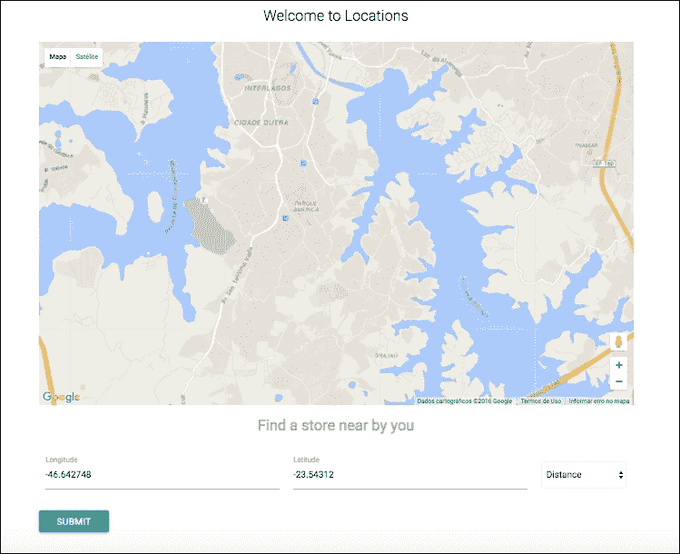

locations.html 的屏幕截图

接下来最重要的代码是：

1.  在`locations.html`文件的末尾添加以下代码：

```js
      <script type="text/javascript"> 
      var loadMap = function() { 
          // Center map with current lat and long (Simulated with fixed
            point for this example) 
         var googlePos = new google.maps.LatLng({{ lat }} , {{ long }}); 
          // Setup map options 
         var mapOptions = { 
           zoom : 12, 
           center :googlePos, 
           mapTypeId :google.maps.MapTypeId.ROADMAP 
         }; 
        // Set a variable to get the HTML div 
        var mapObj = document.getElementById('map'); 
        var googleMap = new google.maps.Map(mapObj, mapOptions); 
         // Create markers array to hold all markers on map 
        var markers = []; 
        // Using the Swig loop to get all data from location variable 
         
            // Setup a lat long object 
          var latLng = new google.maps.LatLng({{ item.coordinates[1] }},
           {{ item.coordinates[0] }}); 
            // Create a marker 
          var marker = new google.maps.Marker({ 
            map :googleMap, 
            position: latLng, 
            animation :google.maps.Animation.DROP 
          }); 
          markers.push(marker); 
            // Setup the info window 
          varinfowindow = new google.maps.InfoWindow(); 
            // Add an event listener to click on each marker and show
               an info window 
          google.maps.event.addListener(marker, 'click', function () { 
          // using the tittle from the Swig looping 
            infowindow.setContent('<p>' + " {{ item.title }} " + '</p>'); 
            infowindow.open(googleMap, this); 
          }); 
           
        }; 
       // load the map function 
       window.onload = loadMap; 
       </script> 
        

```

这段代码片段做了很多事情，包括创建一个新的地图对象：

```js
      varmapObj = document.getElementById('map'); 
      vargoogleMap = new google.maps.Map(mapObj, mapOptions); 

```

它还添加了来自 MongoDB 并位于位置对象循环内的标记或点：

```js
       
         ... 
      

```

您可以看到上一个代码的每一行都有一个注释；这样很容易理解每一行发生了什么。

1.  让我们创建一个新文件。创建一个名为`add-location.html`的文件，并将其保存在`app/views/pages/`文件夹中。

1.  将以下代码放入`add-location.html`文件中：

```js
       
       
      <div class="section"> 
        <div class="container"> 
        <br><br> 
          <h1 class="header center teal-text">{{ title }}</h1> 
          <div class="row center"> 
            <h5 class="header col s12 light">Welcome to 
             {{ title }}
            </h5> 
          </div> 
          <div class="row"> 
            <div class="col s12"> 
                 
                  <h4 class="center teal-text"> 
                        {{ message }} 
                  </h4> 
                 
                <h5 class="grey-text"> 
                      Insert a new location 
                </h5> 
                <br> 
                <form action="/locations" method="POST"> 
                  <div class="row"> 
                  <div class="input-field col s4"> 
                    <input placeholder="Insert Location Title"
                     name="title" id="title" type="text" class="validate"> 
                    <label for="title">Title</label> 
                    </div> 
                    <div class="input-field col s4"> 
                      <input placeholder="Insert Longitude"
                       name="long" id="long" type="text" class="validate"> 
                      <label for="long">Longitude</label> 
                    </div>  
                    <div class="input-field col s4"> 
                    <input placeholder="Insert lat" name="lat" id="lat" 
                     type="text" class="validate"> 
                    <label for="lat">Latitude</label> 
                    </div> 
                      <br> 
                      <br> 
                    <div class="col s12 center"> 
                    <button class="btn waves-effect waves-light" 
                     type="submit" name="action">SUBMIT</button> 
                    </div> 
                  </div> 
                </form> 
                </div> 
              </div> 
            </div> 
          </div> 
           

```

这是一个简单的表单，用于将一些位置添加到 MongoDB，并且将看起来像以下屏幕截图：

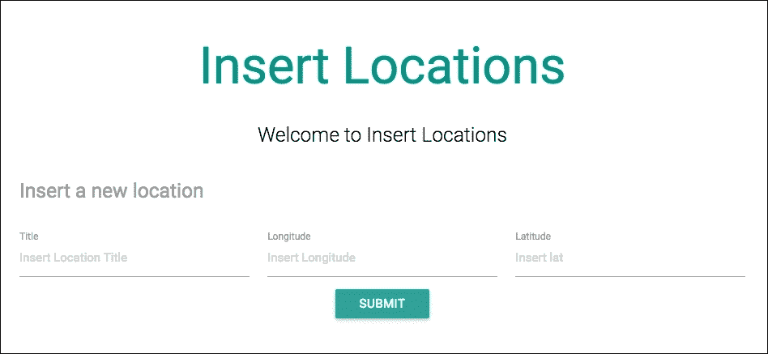

add-location.html 的屏幕截图

# 将位置添加到 MongoDB

现在是我们应用程序的有趣部分。我们需要在我们的应用程序中插入记录；出于教学目的，我们将使用表单（`add-location.html`）逐个插入记录。

该示例展示了如何插入一条记录，您应该对其他记录执行相同的操作。

### 提示

您可以跳过这一步，加载填充数据库的示例文件，但我们建议您按照本书中的步骤进行操作。

在本示例结束时，我们将解释如何使用 RoboMongo 面板一次加载所有记录。

1.  在项目根文件夹打开终端/Shell，并输入以下命令：

```js
gulp

```

### 提示

请注意，在执行上述操作之前，您必须确保您的 MongoDB 已经启动。

1.  转到`http://localhost:3000/locations/add`，并填写以下信息的表单：

### 提示

请注意，您也需要将地图中心设置为您自己的位置，在`locations.js`控制器的纬度和经度属性上：

```js
router.get('/locations', function (req, res, next) {
Location.find(function (err, item) {
...
res.render('locations', {
...
lat: -23.54312,
long: -46.642748
});
});
});

```

标题 = **Republica**

经度 = **-46.642748**

纬度 = **-23.54312**

点击**提交**按钮，您将在地图上方看到一个成功消息。

1.  现在我们将使用 RoboMongo 界面添加接下来的七个位置。复制以下代码：

```js
      db.locations.insert( 
      [{ 
          "title": "Mackenzie", 
          "coordinates": [-46.651659, -23.54807] 
      }, { 
          "title": "Shopping Maia B", 
          "coordinates": [-46.539545, -23.44375] 
      }, { 
          "title": "MorumbiSaraiva", 
          "coordinates": [-46.699053, -23.62376] 
      }, { 
          "title": "Shopping Center Norte", 
          "coordinates": [-46.617417, -23.51575] 
      }, { 
          "title": "Mooca Plaza Shopping", 
          "coordinates": [-46.594408, -23.57983] 
      }, { 
          "title": "Shopping Metro Tucuruvi", 
          "coordinates": [-46.602695, -23.47984] 
      }, { 
          "title": "Market Place", 
          "coordinates": [-46.696713, -23.61645] 
      }] 
      ) 

```

1.  在 RoboMongo 界面上，选择左侧面板上的 maps-api-development 数据库。

1.  将代码粘贴到 RoboMongo 界面中：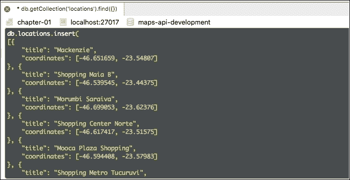

RoboMongo 界面终端的截图

1.  让我们来检查结果：双击左侧菜单上的**locations**集合。

1.  在 RoboMongo 视图的右侧，点击**以表格模式查看结果**；您将看到以下结果：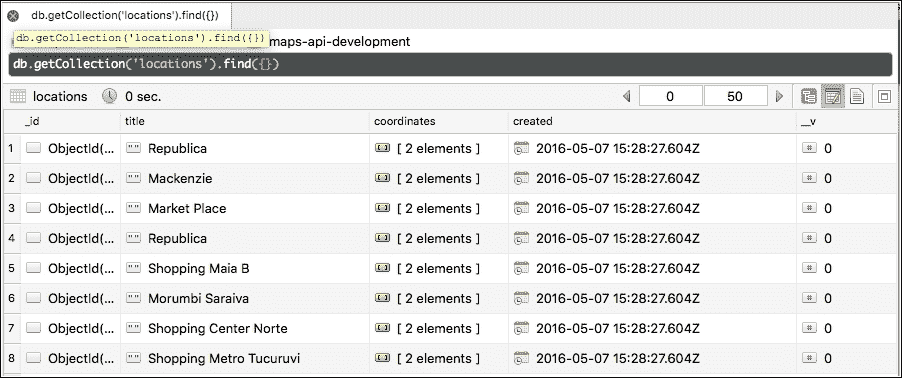

RoboMongo 面板的截图

此时，我们已经在 http://localhost:3000/locations 的地图上有了所有位置，但是附近商店的查找表单仍然无法工作，因此我们需要设置一个 MongoDB 2dsphere 索引。

# 了解 MongoDB 上的地理空间索引

从 MongoDB 的*2.4*版本开始，我们可以使用**GeoJSON**格式进行地理空间搜索。

### 提示

您可以在官方链接处找到有关 GeoJSON 的更多信息：[`geojson.org/`](http://geojson.org/)。

**GeoJSON**是一个用于格式化坐标形状的开源规范。它被广泛使用，并且非常适用于使用地理数据制作应用程序。这种格式非常简单，我们在位置模型中使用了这种格式，正如您所看到的：

```js
var LocationSchema = new Schema({ 
  title: String, 
  coordinates: { 
    type: [Number], 
    index: '2dsphere' 
  }, 
  created: { 
    type: Date, 
    default: Date.now 
  } 
}); 

```

突出显示的代码是用于存储坐标的 GeoJSON 格式。

### 提示

您可以在这里阅读更多关于 MongoDB 上的地理空间查询：[`docs.mongodb.com/manual/reference/operator/query-geospatial/`](https://docs.mongodb.com/manual/reference/operator/query-geospatial/)，以及更多地理空间索引信息：[`docs.mongodb.com/manual/applications/geospatial-indexes/`](https://docs.mongodb.com/manual/applications/geospatial-indexes/)。

## 在 MongoDB 中创建 2dsphere 索引

让我们在 MongoDB 中检查我们的位置集合：

1.  打开你的 RoboMongo，并在左侧面板上选择**maps-api-development**数据库。

1.  双击**locations**集合，您将看到以下数据：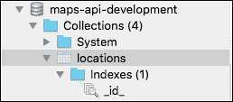

索引之前的位置集合截图

您会注意到我们只有一个带有**id**索引的文件夹；这是 MongoDB 的默认设置。

1.  复制以下代码并粘贴到 RoboMongo 界面中：

```js
db.locations.ensureIndex({ 'coordinates' : '2dsphere'})

```

1.  点击右上角菜单栏中的**播放**按钮。

结果将如下截图所示：

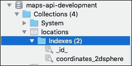

ensure.index()后的截图

请注意，现在我们已经创建了 2dsphere 索引。

# 检查地理位置应用

现在是测试应用程序的时候了。我们已经在我们的数据库中创建了八条记录，已经使用 ensure.index() MongoDB 对所有位置进行了索引，我们已经可以在地图中看到所有点的渲染，就像下面的截图中所看到的那样：

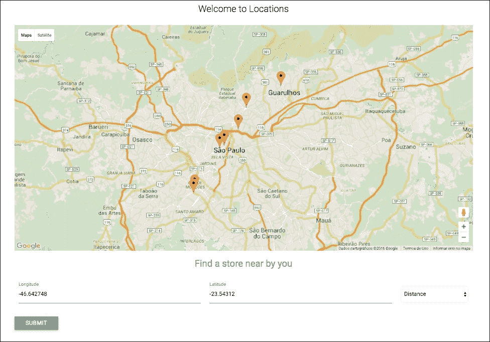

locations.html 的截图

在上一个屏幕截图中，您可能会注意到地图上的点彼此之间相距较远，这能够显示当我们改变距离搜索字段时所显示的点之间的距离差异。

在这个例子中，我们可以在搜索栏中插入任何纬度和经度，但我们只是固定这个字段来说明应用程序的地理定位功能。

当我们首次访问位置路由时，我们会显示数据库中的所有记录，就像我们在上一个屏幕截图中看到的那样。

让我们改变 locations.html 表单上的距离，看看会发生什么；转到 http://localhost:3000/locations，在**距离**字段中选择*2km*，然后点击**提交**按钮。

在 MongoDB 中使用$near 和$geometry 函数进行新查询的结果将如下所示：

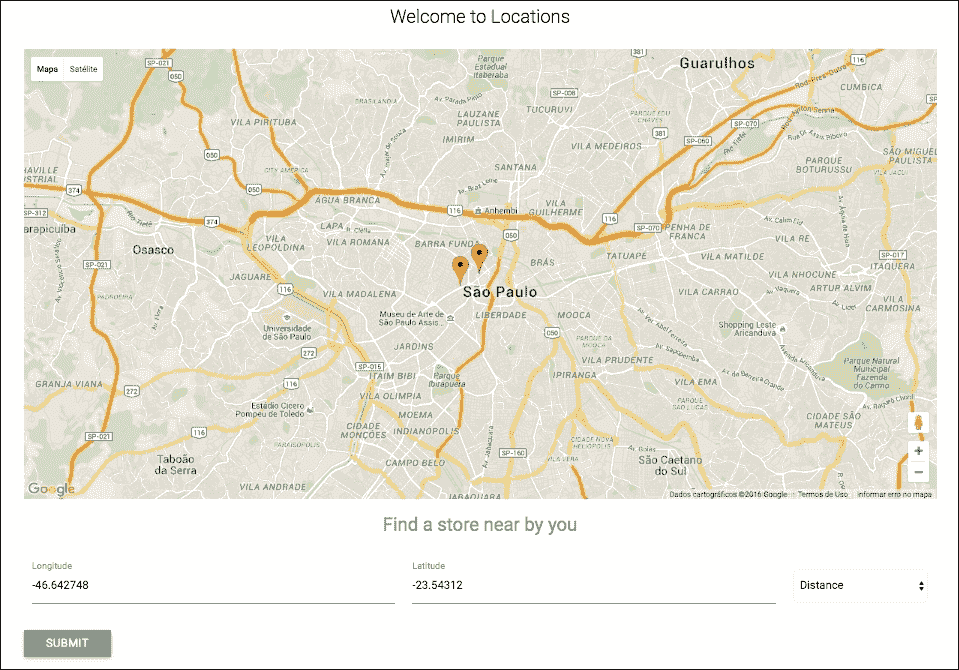

通过 2km 筛选的位置页面的屏幕截图

这对于商店定位应用程序来说是非常有用的信息，但我们无法看到我们正在寻找的最近点在哪里。为了方便查看，我们将在地图上的左侧添加一个点列表，按从最近到最远的顺序列出。

# 按距离排序点

让我们添加一些代码行，使我们的搜索更直观：

1.  在 app/views/pages/locations.html 中添加以下行，在突出显示的代码之间：

```js
 <div class="row">      <div class="col s3"> 
              ... 
 </div> <div class="col s9"> <form action="/nearme" method="POST">           ... 
     </div> 
     </div> 

```

### 提示

请注意，您可以在 Packt Publishing 网站或本书的官方 GitHub 存储库上下载完整的代码。

1.  在循环之后，在 locations.html 的末尾添加以下函数：

```js
      // get all the pan-to-marker class 
      var els = document.querySelectorAll(".pan-to-marker"); 
      // looping over all list elements 
      for (vari = 0, len = els.length; i<len; i++) { 
        els[i].addEventListener("click", function(e){ 
          e.preventDefault(); 
     // Use -1 for index because loop.index from swig starts on 1 
     var attr = this.getAttribute('data-marker-index') -1; 
        // get longitude and latitude of the marker 
       var latitude = markers[attr].getPosition().lat(); 
       var longitude = markers[attr].getPosition().lng(); 
        console.log(latitude, longitude ); 
          // Center map and apply zoom 
           googleMap.setCenter({lat: latitude, lng: longitude}); 
           googleMap.setZoom(18); 
           }); 
      } 

```

现在当我们返回到位置页面时，我们可以看到地图左侧按距离排序的点列表。请参阅下面的屏幕截图：

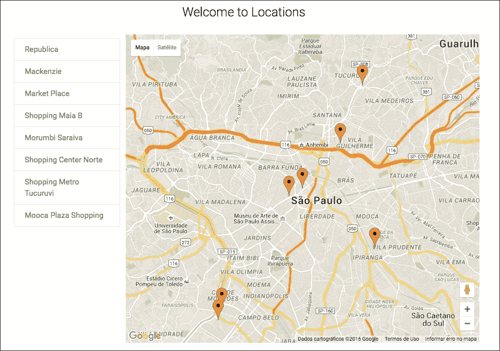

左侧商店列表的屏幕截图

现在我们可以点击左侧面板上的任何商店。我们还可以放大地图，如下面的屏幕截图所示：

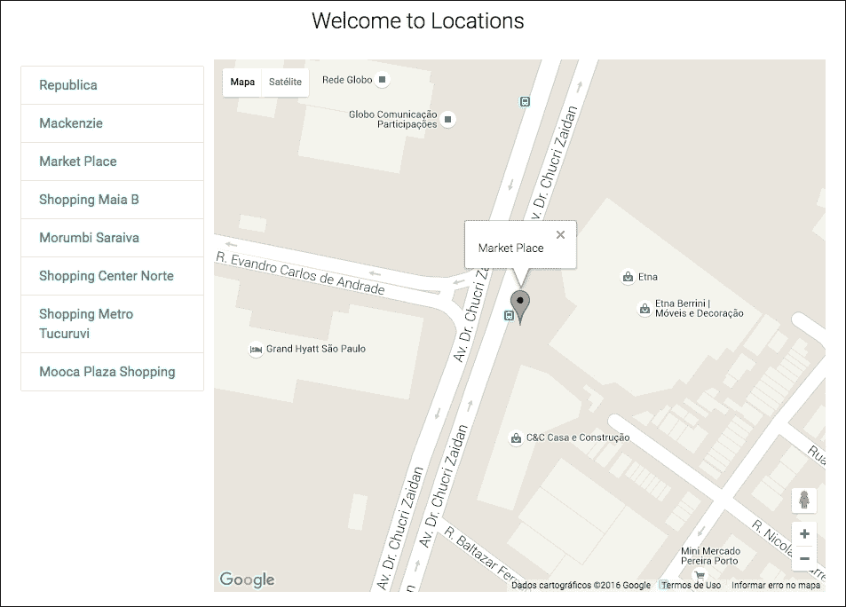

选定商店的 locations.html 屏幕截图

# 摘要

在本章中，我们涵盖了许多与 Google Maps API 和 MongoDB 上的地理空间查询相关的内容，并使用 Node.js 和一些默认的 Express 模块构建了一个完整的商店定位器应用程序。

我们涵盖了诸如 GeoJSON 文件格式以及如何在 MongoDB 上创建地理空间索引等重要内容。

本章结束了涵盖使用不同模板引擎和技术的 MVC 设计模式的五章系列。在下一章中，我们将看到如何使用一些不同的工具来创建和测试 API，构建一个 Node.js API。
