# 第六章：使用 Restful API 和 Loopback.io 构建客户反馈应用程序

如前所述，Node.js 生态系统有各种框架用于开发强大的 Web 应用程序。在之前的章节中，我们使用了最流行的 Express 框架。

在本章中，我们将探索另一个名为 loopback.io 的框架。该框架在很大程度上基于 Express，但它为我们提供了一些更多的功能，可以快速创建 Restful API。

它有一个**命令行界面**（**CLI**），可以在不使用代码的情况下创建 API，还公开了一个用于操作 HTTP 动词的接口，一种嵌入在应用程序中的 Restful 客户端，以及其他一些优势。

我们还将看到如何使用 React.js 库在我们的应用程序前端消耗此 API。

在本章中，我们将涵盖以下主题：

+   安装 LoopBack 框架

+   LoopBack CLI 的基础知识

+   使用命令行创建模型

+   处理数据源和数据库关系

+   创建一个简单的 React.js 应用程序来消耗 API

# 我们正在构建什么

在本章中，我们将构建一个 API 来存储任何类型的产品，例如经典的摩托车模型，并存储用户对该摩托车的评论/反馈。结果将看起来像以下屏幕截图：

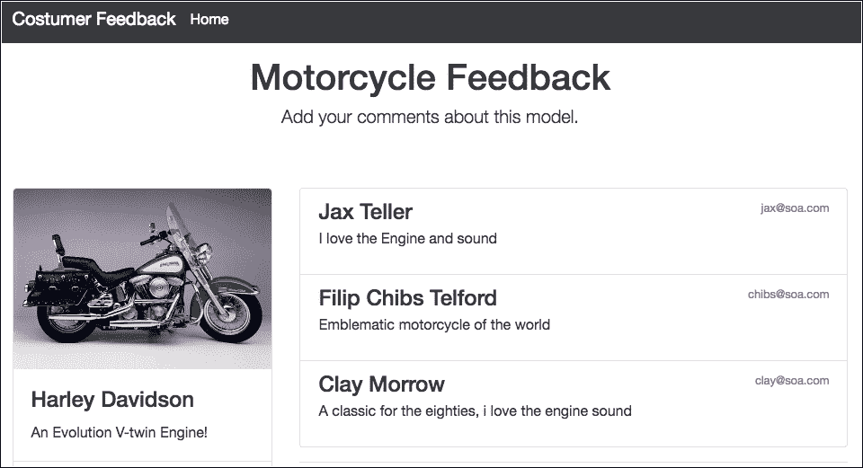

主页的屏幕截图

## 创建基线结构

首先让我们安装 LoopBack 框架：

1.  打开您的终端/Shell 并键入以下命令：

```js
npm install strongloop -g

```

1.  打开您的终端/Shell 并键入以下命令：

```js
slc loopback

```

1.  输入名称：目录选项为 chapter-06。

1.  选择 empty-server（一个没有任何内容的 LoopBack API）

配置模型或数据源）选项。

不要担心输出的结尾，我们将在下一个主题中解释这一点。

结果将是以下文件夹和文件的结构：

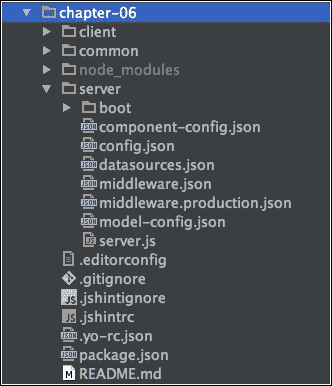

文件夹和文件的屏幕截图

结构非常简单；几乎所有 LoopBack 的配置都在 JSON 文件中，如**component-config.json**，**config.json**，**datasources.json**，以及**server**文件夹中的所有其他文件。

### 提示

您可以通过在终端窗口中键入以下命令来了解有关**slc**命令行的更多信息：slc -help。

# 使用命令行创建模型

此时，我们已经有了开始开发 API 所需的结构。

现在我们将使用命令行来创建应用程序的模型。我们将构建两个模型：一个用于产品/摩托车，另一个用于用户/消费者。

1.  在 chapter-06 文件夹中打开终端/Shell 并键入以下命令：

```js
slc loopback:model

```

1.  填写摩托车模型的以下信息，如下图所示：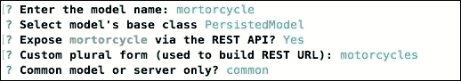

创建摩托车模型后的终端输出的屏幕截图

1.  填写属性名称：

```js
      Property name: image
      ? Property type: string
      ? Required? Yes
      ? Default value[leave blank for none]:

      Property name: make
      ? Property type: string
      ? Required? Yes
      ? Default value[leave blank for none]:

      Property name: description
      ? Property type: string
      ? Required? Yes
      ? Default value[leave blank for none]:

      Property name: model
      ? Property type: string
      ? Required? Yes
      ? Default value[leave blank for none]:

      Property name: category
      ? Property type: string
      ? Required? Yes
      ? Default value[leave blank for none]:

      Property name: year
      ? Property type: string
      ? Required? Yes
      ? Default value[leave blank for none]:
```

1.  让我们创建客户模型。打开终端/Shell 并键入以下命令：

```js
slc loopback:model

```

1.  填写审查模型的信息，如下图所示：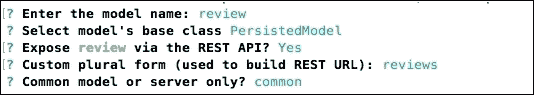

创建模型审查后的终端输出的屏幕截图

1.  填写属性名称：

```js
      Property name: name
      ? Property type: string
      ? Required? Yes
      ? Default value[leave blank for none]:

      Property name: email
      ? Property type: string
      ? Required? Yes
      ? Default value[leave blank for none]:

      Property name: review
      ? Property type: string
      ? Required? Yes
      ? Default value[leave blank for none]:

```

即使使用命令行，我们也可以检查和编辑刚刚创建的模型。

### 提示

这里需要注意的一个重要点是，common 属性创建一个目录并与 client 和 server 文件夹共享。如果使用 server 属性，代码将存储在 server 文件夹中，并且不与 client 文件夹共享。

# 使用命令行创建模型后编辑模型

我们可以直接在 common/models/文件夹中编辑模型。我们为每个创建的模型有两个文件。

第一个是一个带有所有属性的 JSON 文件，如我们在 review.json 文件中所见的代码：

```js
    { 
      "name": "review", 
      "base": "PersistedModel", 
      "idInjection": true, 
      "options": { 
        "validateUpsert": true 
      }, 
      "properties": { 
        "name": { 
        "type": "string", 
        "required": true 
      }, 
      "email": { 
        "type": "string", 
        "required": true 
      }, 
      "review": { 
          "type": "string", 
          "required": true 
      } 
    }, 
      "validations": [], 
      "relations": {}, 
      "acls": [], 
      "methods": {} 
    } 

```

第二个是一个 JavaScript 文件，如我们在 review.js 文件中所见的代码：

```js
    module.exports = function(Review) { 
    }; 

```

JavaScript 文件是您可以配置应用程序方法的地方。您可能会注意到，在创建模型时，其功能是空的；这是因为 LoopBack 框架通过使用 Express 框架来抽象常见的 CRUD 操作，这与我们在上一章中所做的操作相同。

# 通过命令行创建数据源

我们将使用数据库存储客户的反馈，因此我们将使用 LoopBack CLI 创建数据源：

1.  在根项目中打开终端/ shell 并输入以下命令：

```js
slc loopback:datasource

```

1.  使用以下信息填写选项：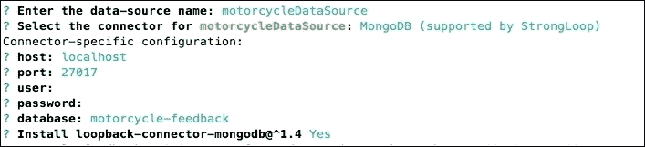

数据源终端输出的屏幕截图

请注意，最终选项是安装 MongoDB 连接器。因此，请不要忘记在 MongoDB 实例上创建数据库：motorcycle-feedback。

### 提示

在本书示例中，我们不使用数据库的用户名和密码，但强烈建议您在生产环境中使用用户名和强密码。

数据源配置可以在 server/datasources.json 文件中找到，如下代码所示：

```js
    { 
      "motorcycleDataSource": { 
        "host": "localhost", 
        "port": 27017, 
        "database": "motorcycle-feedback", 
        "password": "", 
        "name": "motorcycleDataSource", 
        "user": "", 
        "connector": "mongodb" 
      } 
    } 

```

Loopback API 为我们提供了在不同数据库上配置数据源的可能性。

# 将模型连接到数据源

下一步是建立模型和数据源之间的关系，为此我们将手动编辑文件。

请记住，命令行也提供了此功能，使用 slc loopback:relation:，但是在撰写本文时，生成器中存在错误，我们目前无法使用此功能。但是，这并不妨碍我们继续进行应用程序开发，因为命令行工具并非强制使用：

打开 server/model-config.json 并添加以下突出显示的代码：

```js
      { 
        "_meta": { 
          "sources": [ 
            "loopback/common/models", 
            "loopback/server/models", 
            "../common/models", 
            "./models" 
          ], 
          "mixins": [ 
            "loopback/common/mixins", 
            "loopback/server/mixins", 
            "../common/mixins", 
            "./mixins" 
          ] 
        }, 
        "motorcycle": { 
          "dataSource": "motorcycleDataSource", 
          "public": true 
        }, 
        "review": { 
          "dataSource": "motorcycleDataSource", 
          "public": true 
        } 
      } 

```

在这个阶段，通常会使用称为 ARC 工具的可视界面来构建、部署和管理我们的 Node API，但是对于本书的示例，我们不会使用它，因此将所有注意力都集中在代码上。

### 提示

您可以在此链接找到有关 ARC 的更多信息：[`docs.strongloop.com/display/APIS/Using+Arc`](https://docs.strongloop.com/display/APIS/Using+Arc)。

# 使用 API Explorer

LoopBack API Explorer 最好的功能之一是生成一个本地主机 API 端点，允许我们查看和测试 API 生成的所有端点。

此外，它可能值得作为文档，包含所有必要的指令，如 HTTP 动词 GET、POST、UPDATE、DELETE，如果需要发送令牌访问，数据类型和 JSON 格式。

1.  打开终端/ shell 并输入以下命令：

```js
npm start 

```

1.  转到 http://localhost:3000/explorer/#/。结果将是以下屏幕截图：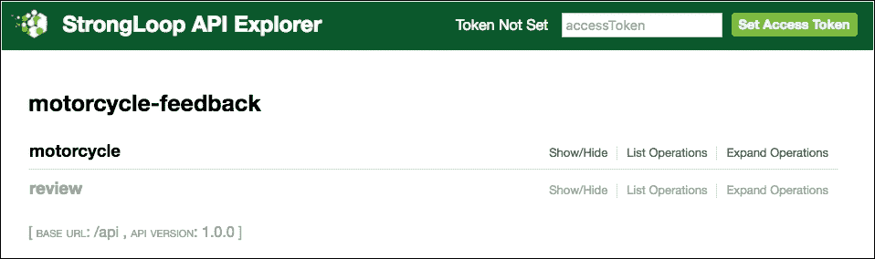

API Explorer 的屏幕截图

可以看到 API 基本 URL 和 API 版本，我们的项目名称和应用程序端点。

1.  当我们点击**review**模型时，我们可以看到所有带有 HTTP 动词的端点，如下图所示：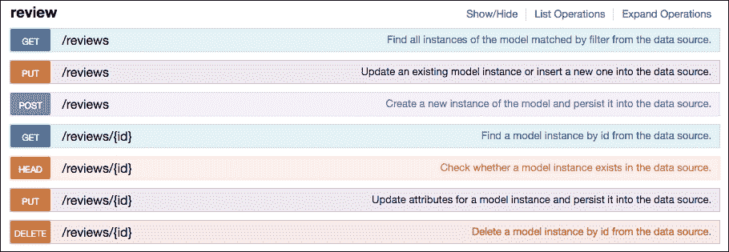

评论端点和 HTTP 动词的屏幕截图

创建的端点如下：

+   http://localhost:3000/api/reviews

+   http://localhost:3000/api/motorcycles

当然，您也可以直接使用浏览器访问它们。

重要的是要注意 GET 和 POST 端点是相同的，区别在于：当我们想要检索内容时，我们使用 GET 方法，当我们想要插入内容时，我们使用 POST 方法，PUT 和 DELETE 也是一样，我们需要在 URL 的末尾传递 ID，如 http://localhost:3000/api/reviews/23214。

我们还可以看到每个端点右侧有一个简要描述其目的的描述。

它还具有一些其他非常有用的端点，如下图所示：

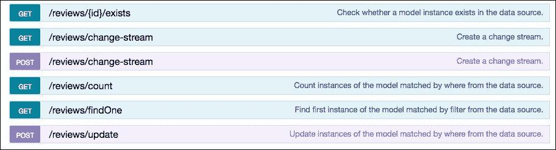

评论端点的附加方法的屏幕截图

## 使用端点插入记录

现在我们将使用 API Explorer 界面向数据库中插入一条记录。我们将插入一个产品，即我们的摩托车：

1.  转到 http://localhost:3000/explorer/#!/motorcycle/motorcycle_create。

1.  将以下内容放入数据值字段中，然后点击“尝试一下”按钮：

```js
      { 
         "make": "Harley Davidson", 
         "image": "images/heritage.jpg", 
         "model": "Heritage Softail", 
         "description": "An Evolution V-twin Engine!", 
         "category": "Cruiser", 
         "year": "1986" 
      } 

```

响应主体将如下截图所示：

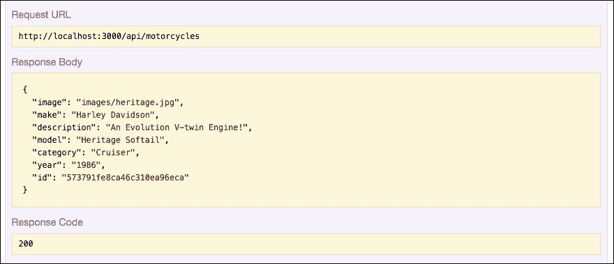

POST 成功的屏幕截图

请注意，我们有一个 HTTP 状态码**200**和一个新创建数据的 ID。

## 使用端点检索记录

现在我们将使用 API Explorer 界面从数据库中检索记录。我们将使用摩托车端点：

1.  转到 http://localhost:3000/explorer/#!/motorcycle/motorcycle_find。

1.  单击“尝试一下”按钮，我们将得到与之前截图相同的结果。

请注意，我们正在使用 API 资源管理器，但我们所有的 API 端点都通过 http://localhost:3000/api/公开。

1.  转到 http://localhost:3000/api/motorcycles，您可以在浏览器上看到以下结果：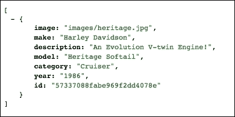

摩托车端点的屏幕截图

### 提示

请注意，我们正在使用一个名为**JSON VIEW**的 Chrome 扩展程序，您可以在这里获取：[`chrome.google.com/webstore/detail/jsonview/chklaanhfefbnpoihckbnefhakgolnmc`](https://chrome.google.com/webstore/detail/jsonview/chklaanhfefbnpoihckbnefhakgolnmc)。

在处理大型 JSON 文件时非常有用。

# 添加数据库关系

现在我们已经配置了端点，我们需要在应用程序模型之间创建关系。

我们的反馈将被插入到特定类型的产品中，例如我们的摩托车示例，然后每个摩托车型号都可以接收各种反馈。让我们看看如何通过直接编辑源代码来创建模型之间的关系有多简单：

1.  打开 common/models/motorcycle.json 并添加以下突出显示的代码：

```js
      { 
          "name": "motorcycle", 
          "base": "PersistedModel", 
          "idInjection": true, 
          "options": { 
              "validateUpsert": true 
          }, 
          "properties": { 
            "image": { 
               "type": "string", 
               "required": true 
            }, 
            "make": { 
              "type": "string", 
              "required": true 
            }, 
            "description": { 
               "type": "string", 
               "required": true 
            }, 
            "model": { 
              "type": "string", 
              "required": true 
            }, 
            "category": { 
              "type": "string", 
              "required": true 
            }, 
            "year": { 
              "type": "string", 
              "required": true 
            } 
          }, 
          "validations": [], 
          "relations": { 
              "review": { 
                "type": "hasMany", 
                "model": "review", 
                "foreignKey": "ObjectId"
 } 
            }, 
            "acls": [], 
            "methods": {} 
      }

```

1.  重新启动应用程序，打开终端窗口，然后输入以下命令：

```js
npm start

```

1.  转到 http://localhost:3000/explorer。

我们可以看到 LoopBack 已经为这种关系创建了新的端点，如下图所示：

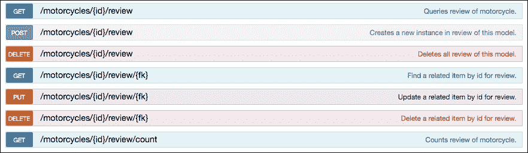

新端点创建的屏幕截图

现在我们可以使用以下方式获取与摩托车模型相关的所有反馈：

http://localhost:3000/api/motorcycles/<id>/review。

我们还可以通过简单地将评论 ID 添加到以下 URL 中来获取一个评论：

http://localhost:3000/api/motorcycles/<id>/review/<id>。

# 处理 LoopBack 引导文件

在使用 LoopBack 框架的应用程序中，引导文件非常重要。这些文件在应用程序执行时启动，并可以执行各种任务。

该应用程序已经具备了所有需要的端点。因此，让我们看看如何创建一个引导文件，并使用 LoopBack 框架的另一个功能来将我们的模型迁移到数据库。

在这个例子中，我们将看到如何使用 automigrate 函数在启动应用程序时向数据库中插入一些内容：

### 提示

您可以在[`apidocs.strongloop.com/`](http://apidocs.strongloop.com/)上阅读更多关于 LoopBack API 的信息。

在 server/boot 中，创建一个名为 create-sample-models.js 的新文件，并将以下内容放入其中：

```js
      module.exports = function(app) { 
          // automigrate for models, every time the app will running,
           db will be replaced with this data. 
         app.dataSources.motorcycleDataSource.automigrate('motorcycle',
          function(err) { 
          if (err) throw err; 
          // Simple function to create content 
            app.models.Motorcycle.create( 
              [ 
                { 
                  "make": "Harley Davidson", 
                  "image": "images/heritage.jpg", 
                  "model": "Heritage Softail", 
                  "description": "An Evolution V-twin Engine!", 
                  "category": "Cruiser", 
                  "year": "1986", 
                  "id": "57337088fabe969f2dd4078e" 
                } 
              ], function(err, motorcycles) { 
                  if (err) throw err; 
                 // Show a success msg on terminal 
                   console.log('Created Motorcycle Model: \n',
                    motorcycles); 
                  }); 
                }); 
                app.dataSources.motorcycleDataSource.automigrate
                 ('review', function(err) { 
                if (err) throw err; 
                // Simple function to create content 
                app.models.Review.create( 
                  [ 
                    { 
                      "name": "Jax Teller", 
                      "email": "jax@soa.com", 
                      "id": "57337b82e630a9152ed6554d", 
                      "review": "I love the Engine and sound", 
                      "ObjectId": "57337088fabe969f2dd4078e" 
                    }, 
                    { 
                      "name": "Filip Chibs Telford", 
                      "email": "chibs@soa.com", 
                      "review": "Emblematic motorcycle of the world", 
                      "id": "5733845b00f4a48b2edd54cd", 
                      "ObjectId": "57337088fabe969f2dd4078e" 
                    }, 
                    { 
                      "name": "Clay Morrow", 
                      "email": "clay@soa.com", 
                      "review": "A classic for the eighties, i love
                        the engine sound", 
                      "id": "5733845b00f4a48b2edd54ef", 
                      "ObjectId": "57337088fabe969f2dd4078e" 
                    } 
                  ], function(err, reviews) { 
                  if (err) throw err; 
                  // Show a success msg on terminal 
                   console.log('Created Review Model: \n', reviews); 
                  }); 
                }); 
              };  

```

上面的代码非常简单；我们只是使用模型的对象属性创建对象。现在，每次应用程序启动时，我们都会向数据库发送一条摩托车记录和三条摩托车反馈。

这一步完成了我们的 API。尽管这是一个非常琐碎的例子，但我们探索了 LoopBack 框架的几个强大功能。

此外，我们还可以使用 ARC 编辑器。正如前面提到的，只需使用图形界面就可以创建模型和迁移。它还非常有用，比如部署和其他用途。

# 使用 API

现在我们将探讨如何使用此 API。我们已经看到 API 包含在：localhost:3000/api/，我们的根路径只有一些关于 API 的信息，我们可以通过访问 localhost:3000 来查看：

```js
{
 started: "2016-05-15T15:20:24.779Z",
 uptime: 7.017
}

```

让我们更改 root.js 和 middleware.json 文件，并使用一些客户端库与 API 进行交互。

## 将 HTML 内容添加到客户端

1.  将 server/boot 中的 root.js 文件更改为 _root.js。

1.  打开 server/文件夹中的 middleware.json，并添加以下突出显示的代码：

```js
      { 
        "initial:before": { 
        "loopback#favicon": {} 
      }, 
        "initial": { 
          ... 
          }, 
          "helmet#xssFilter": {}, 
          "helmet#frameguard": { 
           ... 
          }, 
           "helmet#hsts": { 
            ... 
           }, 
           "helmet#hidePoweredBy": {}, 
          "helmet#ieNoOpen": {}, 
          "helmet#noSniff": {}, 
          "helmet#noCache": { 
            ... 
           } 
        }, 
        "session": {}, 
        "auth": {}, 
        "parse": {}, 
        "routes": { 
         ... 
          } 
        }, 
        "files": { 
           "loopback#static": { 
              "params": "$!../client" 
           } 
        }, 
        "final": { 
          "loopback#urlNotFound": {} 
        }, 
         "final:after": { 
            "loopback#errorHandler": {} 
        } 
      } 

```

1.  在 client 文件夹中创建一个名为 index.html 的新文件，并将其保存在 client 文件夹中。

现在我们配置应用程序以映射客户端文件夹并使其公开访问。这与我们为 Express 框架设置静态路由时非常相似。我们可以以其他方式设置应用程序的路由，但在此示例中，让我们保持这种方式。

## 添加 Bootstrap 框架和 React 库

现在让我们将依赖项添加到我们的 HTML 文件中；我们将使用 Bootstrap 和 React.js。

请注意，突出显示的文件是从**内容传送网络**（**CDN**）提供的，但如果您愿意，您可以将这些文件存储在 client 文件夹或用于 CSS 和 JavaScript 的子目录中：

1.  打开新创建的 index.html 文件，并添加以下代码：

```js
      <!DOCTYPE html> 
      <html> 
      <head><title>Motorcycle Customer feedback</title></head> 
      <link rel='stylesheet' href='https://cdnjs.cloudflare.com/
       ajax/lib/twitter-bootstrap/4.0.0-alpha/css/bootstrap.min.css'> 
      <style> 
        body { 
          padding-top: 5rem; 
        } 
        .starter-template { 
          padding: 3rem 1.5rem; 
          text-align: center; 
        } 
      </style> 
        <body> 
          <nav class="navbar navbar-fixed-top navbar-dark bg-inverse"> 
          <div class="container"> 
            <a class="navbar-brand" href="#">Custumer Feedback</a> 
            <ul class="nav navbar-nav"> 
              <li class="nav-item active"> 
                <a class="nav-link" href="#">Home <span class="sr-only">
                 (current)</span></a> 
              </li> 
            </ul> 
          </div> 
          </nav> 
          <div class="container"> 
            <!-- This element's contents will be replaced with 
              your component. --> 
          <div id="title"> 
            <div class="starter-template"> 
              <h1>Motorcycle Feedback</h1> 
              <p class="lead">Add your comments about this model.</p> 
            </div> 
          </div> 
          <div class="row"> 
            <div class="col-lg-4"> 
              <div id="motorcycle"></div> 
            </div> 
            <div class="col-lg-8"> 
              <div id="content"></div> 
            </div> 
          </div> 
        </div> 
          <!-- Scripts at bottom --> 
          <script src='https://cdnjs.cloudflare.com/ajax/libs
            /jquery/2.2.1/jquery.min.js'></script> 
          <script src='https://cdnjs.cloudflare.com/ajax/libs
           /twitter-bootstrap/4.0.0-alpha/js/bootstrap.min.js'></script> 
          <script src="https://cdnjs.cloudflare.com/ajax/libs/
           babel-core/5.8.24/browser.js"></script> 
          <script src="https://cdnjs.cloudflare.com/ajax/libs
            /react/15.0.1/react.js"></script> 
          <script src="https://cdnjs.cloudflare.com/ajax/libs/react
            /15.0.1/react-dom.js"></script> 
          <script type="text/babel" src="img/reviews.js"> </script> 
          <script type="text/babel" src="img/motorcycles.js"> </script> 
      </body> 
      </html> 

```

如您所见，在上一个代码中，我们添加了两个文件，类型为 script text/babel。这些文件将是我们使用 React.js 库构建的应用程序组件。

### 提示

您可以在这里找到有关 React.js 的更多信息：[`facebook.github.io/react/`](https://facebook.github.io/react/)。

1.  在 client 文件夹中，创建一个名为 images 的新文件夹。

您可以将摩托车示例图像复制并粘贴到此文件夹中。此外，您可以在 Packt Publishing 网站和书籍的官方 GitHub 存储库中下载所有示例代码。

# 创建 React 组件

类似于 jQuery 小部件和 AgularJS 指令，有 React.js，这是一个非常有用的库，用于创建界面组件。但是，它不像 AngularJS 或 Ember.js 那样是一个完整的框架。

思考 React.js 的方式是通过思考界面组件：一切都是一个组件，一个组件可能由一个或多个组件组成。

请参阅以下图：

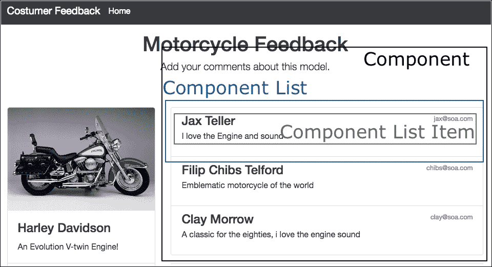

模拟 React.js 组件的屏幕截图

让我们逐个创建组件，以便更好地理解：

1.  在 client 文件夹中，创建一个名为 js 的新文件夹。

1.  在 js 文件夹中，创建一个名为 review.js 的新文件，并添加以下内容：

```js
      var Review = React.createClass({ 

               render: function() { 
                     return ( 
                         <div className="list-group-item"> 
                           <small className="text-muted pull-right">
                              {this.props.email}
                           </small> 
                           <h4 className="list-group-item-heading"> 
                                 {this.props.name} 
                           </h4> 
                           <p className="list-group-item-text">
                             {this.props.review}
                           </p> 
                         </div> 
                     ); 
                 } 
               });

```

这是列表项组件。

1.  现在让我们添加 ReviewBox。在上一个代码之后添加以下代码：

```js
     var ReviewBox = React.createClass({ 
           loadReviewsFromServer: function() { 
                 $.ajax({ 
                       url: this.props.api, 
                       type: 'GET', 
                       dataType: 'json', 
                       cache: false, 
                       success: function(data) { 
                             console.log(data); 
                             this.setState({data: data}); 
                       }.bind(this), 
                       error: function(xhr, status, err) { 
                             console.error(this.props.api, status,
                               err.toString()); 
                       }.bind(this) 
                 }); 
           }, 
           handleReviewSubmit: function(review) { 
                 var reviews = this.state.data; 
                 // Don' use Date.now() on production, this is here
                    just for the example. 
                 review.id = Date.now().toString(); 
                 var newReviews = reviews.concat([review]); 
                  this.setState({data: newReviews}); 
                 console.log(review); 
                 $.ajax({ 
                       url: this.props.api, 
                       dataType: 'json', 
                       type: 'POST', 
                      data: review, 
                       success: function(data) { 
                             console.log(data); 
                       }.bind(this), 
                       error: function(xhr, status, err) { 
                             this.setState({data: reviews}); 
                             console.error(this.props.api, status,
                               err.toString()); 
                       }.bind(this) 
                 }); 
           }, 
           getInitialState: function() { 
                 return { 
                       data: [] 
                 }; 
           }, 
           componentDidMount: function() { 
                 this.loadReviewsFromServer(); 
           }, 
           render: function() { 
                 return ( 
                       <div> 
                             <ReviewList data={this.state.data} /> 
                             <ReviewForm onReviewSubmit=
                              {this.handleReviewSubmit} /> 
                       </div> 
                  ); 
          } 
     });

```

这是 ReviewBox 组件及其两个接收组件；一个是 ReviewList 组件，另一个是 ReviewForm 组件。请注意，我们使用 jQuery 的$.get()函数从 localhost:3000/api/reviews 获取评论，使用 GET 方法。

此外，我们有一个名为 handleReviewSubmit()的函数，用于处理表单提交操作到相同的端点：localhost:3000/api/reviews，使用 POST 方法。

我们有 getInitialState()函数来设置一个数据数组，它在 componentDidMount()函数上等待一个 promise 函数：

1.  现在让我们将 ReviewList 组件添加到 reviews.js 中。在上一个代码之后添加以下代码：

```js
      var ReviewList = React.createClass({ 
             render: function() { 
               var reviewNodes = this.props.data.map(function(review)
               { 
                 return ( 
                     <Review name={review.name} review={review.review}
                       email={review.email} key={review.id}> </Review> 
                 ); 
               }); 
               return ( 
                   <div className="list-group"> 
                           {reviewNodes} 
                   </div> 
               ); 
             } 
      });

```

1.  现在我们添加 ReviewForm 组件。在上一个代码之后添加以下代码：

```js
      var ReviewForm = React.createClass({ 
          getInitialState: function() { 
               return {name: '', email: '', review: '', model: ''}; 
          }, 
          handleAuthorChange: function(e) { 
              this.setState({name: e.target.value}); 
          }, 
          handleEmailChange: function(e) { 
               this.setState({email: e.target.value}); 
          }, 
          handleTextChange: function(e) { 
               this.setState({review: e.target.value}); 
          }, 
          handleSubmit: function(e) { 
               e.preventDefault(); 
               var name = this.state.name.trim(); 
               var email = this.state.email.trim(); 
               var review = this.state.review.trim(); 
               var model = '57337088fabe969f2dd4078e';
                if (!review || !name) { 
                    return; 
                }
                this.props.onReviewSubmit({name: name, email:email,
                  model:model, review: review}); 
                this.setState({name: '', email: '', review: '',
                  model: ''}); 
           }, 
           render: function() { 
               return ( 
                 <div> 
                   <hr/> 
                     <form onSubmit={this.handleSubmit}> 
                       <div className="row"> 
                         <div className="col-lg-6"> 
                           <fieldset className="form-group"> 
                             <label for="InputName">Name</label> 
                             <input type="review" className=
                               "form-control" id="InputName"
                                placeholder="Name" value=
                                {this.state.name} 
                              onChange={this.handleAuthorChange} /> 
                            </fieldset> 
                          </div> 
                          <div className="col-lg-6"> 
                            <fieldset className="form-group"> 
                              <label for="InputEmail">Email</label> 
                              <input type="review" className="form-control"
                                id="InputEmail" placeholder="Email" value=
                                {this.state.email} 
                              onChange={this.handleEmailChange}/> 
                            </fieldset> 
                          </div> 
                        </div> 
                        <fieldset className="form-group"> 
                        <label for="TextareaFeedback">Feedback</label> 
                        <textarea className="form-control"
                         id="TextareaFeedback" rows="3" value=
                         {this.state.review} onChange=
                         {this.handleTextChange} /> 
                        </fieldset> 

                        <button type="submit" className=
                          "btn btn-primary" value="Post">
                             Submit
                        </button> 
                     </form> 
                 </div> 
                 ); 
            } 
      });

```

1.  最后，我们只需要创建一个 React 方法来呈现所有内容。在上一个代码之后添加以下代码：

```js
      ReactDOM.render( 
         <ReviewBox api="/api/reviews"/>,
           document.getElementById('content') 
      ); 

```

此前的代码片段将在<div id="content"></div>中呈现 ReviewBox 组件；简要类比 CSS 类，我们有以下组件结构：

+   ReviewBox

+   ReviewList

+   回顾

+   ReviewForm

因此，ReviewBox 组件的 render()方法呈现两个组件：

```js
      render: function() { 
         return ( 
            <div> 
              <ReviewList data={this.state.data} /> 
              <ReviewForm onCommentSubmit={this.handleReviewSubmit} /> 
            </div> 
        ); 
      } 

```

现在我们对摩托车组件做同样的操作：

1.  在 common/js 文件夹中创建一个名为 motorcycle.js 的新文件，并添加以下代码：

```js
      // create a interface component for motorcycle item 
      var Motorcycle = React.createClass({ 
        render: function() { 
            return ( 
              <div className="card"> 
                 
                <div className="card-block"> 
                  <h4 className="card-title">{this.props.make}</h4> 
                  <p className="card-text">{this.props.description}</p> 
                </div> 
                <ul className="list-group list-group-flush"> 
                  <li className="list-group-item"><strong>Model:
                    </strong> {this.props.model}</li> 
                  <li className="list-group-item"><strong>Category:
                    </strong> {this.props.category}</li> 
                  <li className="list-group-item"><strong>Year:
                    </strong> {this.props.year}</li> 
                </ul> 
              </div> 
            ); 
        } 
      });

```

1.  让我们添加 MotorcycleBox 组件。在上一行之后添加以下代码：

```js
      // create a motorcycle box component 
      var MotorcycleBox = React.createClass({ 
         loadMotorcyclesFromServer: function() { 
             $.ajax({ 
               url: this.props.api, 
               type: 'GET', 
               dataType: 'json', 
               cache: false, 
               success: function(data) { 
                 console.log(data); 
                 this.setState({data: data}); 
               }
               .bind(this), 
               error: function(xhr, status, err) { 
                 console.error(this.props.api, status,
                 err.toString()); 
               }
               .bind(this) 
             }); 
         }, 
         getInitialState: function() { 
             return { 
               data: [] 
             }; 
         }, 
         componentDidMount: function() { 
             this.loadMotorcyclesFromServer(); 
         }, 
         render: function() { 
           return ( 
             <div> 
              <MotorcycleList data={this.state.data} /> 
            </div> 
          ); 
        }
      });

```

1.  让我们创建一个 motorcycleList 组件。在上一行之后添加以下代码：

```js
      // create a motorcycle list component 
      var MotorcycleList = React.createClass({ 
        render: function() { 
          var motorcycleNodes = this.props.data.map(function(motorcycle)
          { 
            console.log(motorcycle); 
            return ( 
              <Motorcycle image={motorcycle.image} make=
                {motorcycle.make} model={motorcycle.model} description=
                {motorcycle.description} category={motorcycle.category}
                year={motorcycle.year} key={motorcycle.id}>
              </Motorcycle> 
            ); 
          }); 
          return ( 
            <div className="motorcycles"> 
              {motorcycleNodes} 
            </div> 
          ); 
        }
      }); 

```

请注意，我们创建了一个列表来渲染数据库中的所有摩托车型号。如果您想要在此集合中添加或渲染更多项目，这是推荐的做法。对于我们的示例，我们只有一个。

最后的方法是 render()函数来渲染 MotorcycleBox 组件

1.  在上一行之后添加以下行：

```js
      ReactDOM.render( 
         <MotorcycleBox api="/api/motorcycles"/>, 
           document.getElementById('motorcycle') 
      ); 

```

此渲染方法告诉在 HTML 摩托车 div 标签内渲染 MotorcycleBox 组件：<div id="motorcycle"></div>。

# 创建新的反馈

现在是时候使用我们构建的应用程序创建新的反馈了：

1.  打开终端/Shell 并输入以下命令：

```js
npm start

```

1.  转到 http://localhost:3000/，填写以下数据并点击**提交**按钮：

+   姓名：**约翰·多**

+   电子邮件：**john@doe.com**

+   反馈：**很棒的红白经典摩托车！**

结果会立即显示在屏幕上，如下截图所示。

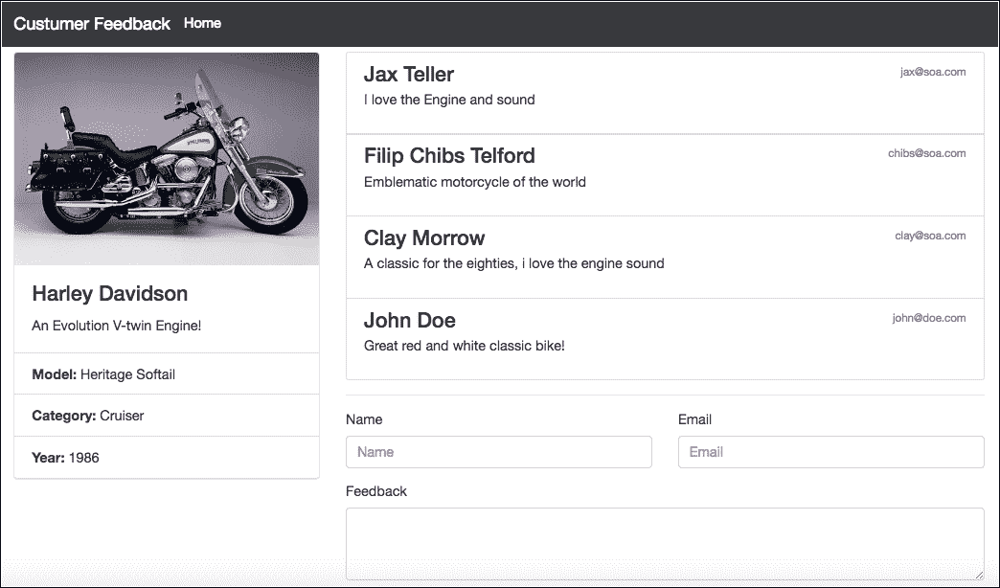

新创建的反馈的屏幕截图

## 简单检查端点

让我们对我们的 API 进行简单的检查。前面的图像显示了特定型号摩托车的四条反馈；我们可以看到在图像中出现了评论的计数，但我们的 API 有一个端点显示这些数据。

转到 http://localhost:3000/api/reviews/count，我们可以看到以下结果：

```js
      { 
         count: 4 
      } 

```

## 禁用远程 LoopBack 端点

默认情况下，LoopBack 创建了许多额外的端点，而不仅仅是传统的 CRUD 操作。我们之前看到了这一点，包括前面的例子。但有时，我们不需要通过 API 资源公开所有端点。

让我们看看如何使用几行代码来减少端点的数量：

1.  打开 common/models/review.js 并添加以下突出显示的代码行：

```js
      module.exports = function(Review) { 
         // Disable endpoint / methods 
         Review.disableRemoteMethod("count", true); 
         Review.disableRemoteMethod("exists", true); 
         Review.disableRemoteMethod("findOne", true); 
         Review.disableRemoteMethod('createChangeStream', true); 
         Review.disableRemoteMethod("updateAll", true); 
      }; 

```

1.  重新启动应用程序，打开您的终端/Shell，并输入以下命令：

```js
npm start

```

1.  转到 http://localhost:3000/explorer/，点击**review**模型。

结果将如下图所示，只有 CRUD 端点：

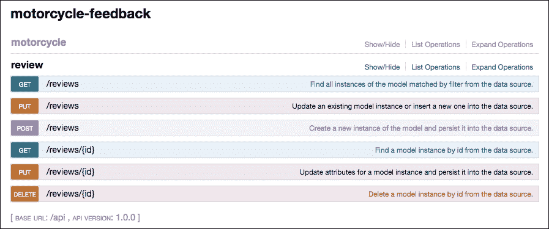

评论端点的屏幕截图

### 提示

您可以在以下链接找到有关隐藏和显示端点的更多信息：[`docs.strongloop.com/display/public/LB/Exposing+models+over+REST#ExposingmodelsoverREST-Hidingendpointsforrelatedmodels`](https://docs.strongloop.com/display/public/LB/Exposing+models+over+REST#ExposingmodelsoverREST-Hidingendpointsforrelatedmodels)。

# 摘要

在本章中，我们讨论了使用 LoopBack 框架创建健壮 API 的过程，并涉及了关于 Web 应用作为数据库、模型之间关系和数据源的一些非常重要的点。

我们还看到了 Express 和 Loopback 之间的一些相似之处，并学会了如何使用 API 资源的 Web 界面。

我们使用 React.js 库构建了一个交互式界面，并接近了 React.js 的主要概念，即组件的创建。

在下一章中，我们将看到如何使用 Node.js 的一些非常有用的资源构建实时应用程序。
