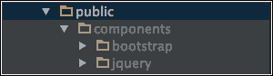
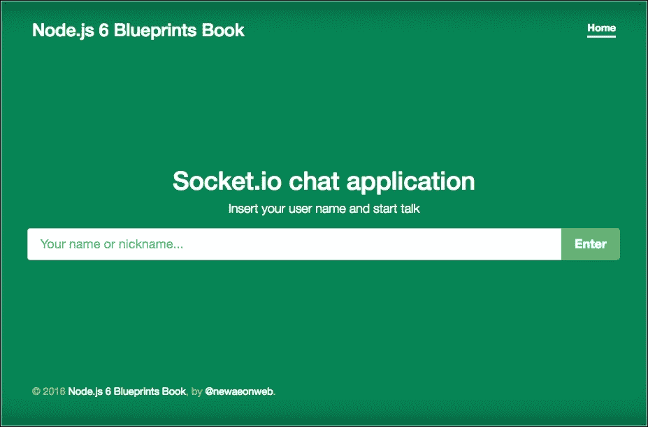
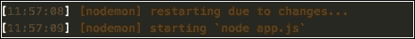
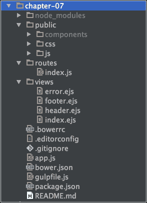
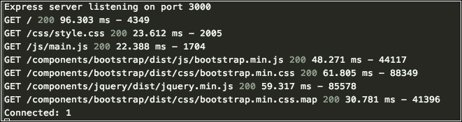
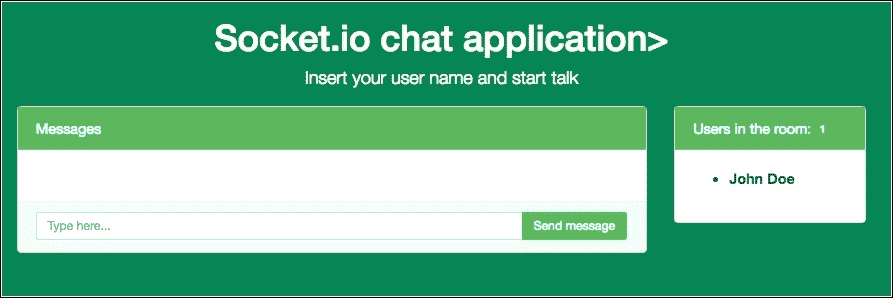
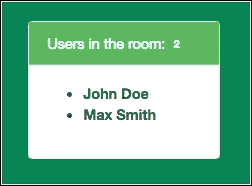
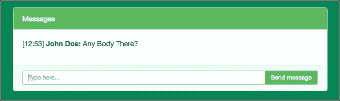
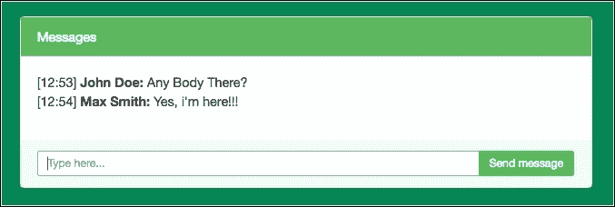

# 第七章：使用 Socket.io 构建实时聊天应用程序

一段时间以前，当 Node.js 应用程序出现时，我们有了许多新的可能性，使用 Node.js 资源和诸如 Socket.io 之类的东西来构建实时应用程序（正如该网站所说，Socket.io 实现了基于事件的双向实时通信。它在每个平台、设备或浏览器上都能工作，同时注重可靠性和速度）。

Socket.io 允许我们在客户端和服务器之间发出事件，以及其他可能性。

在本章中，我们将涵盖以下主题：

+   安装 Socket.io

+   Socket.io 事件的基础知识

+   创建一个 Express 聊天应用程序

+   处理客户端的 jQuery

+   如何在开发中使用 Gulp.js 和 LiveReload 插件

# 我们正在构建什么

在本章中，我们将使用 Node.js、Socket.io 和 jQuery 构建一个实时聊天应用程序：


主屏幕的屏幕截图

# 从 package.json 文件开始

在本章中，我们采用了一种不同的方式来启动我们的应用程序；正如我们在之前的章节中看到的，让我们逐步构建一个 Node.js 应用程序，而不使用命令行。

让我们创建带有应用程序依赖项的 package.json 文件：

1.  创建一个名为 chapter-07 的文件夹。

1.  在 chapter-07 中创建一个名为 package.json 的文件，并添加以下代码：

```js
      {
        "name": "chapter-07", 
        "description": "Build a real time chat application with
          Node.js and Socket.io", 
        "version": "0.0.1", 
        "private": true, 
        "scripts": { 
          "start": "node app.js" 
        }, 
        "dependencies": { 
          "body-parser": "¹.13.3", 
          "cookie-parser": "¹.3.3", 
          "ejs": "².3.1", 
          "express": "⁴.13.3", 
          "morgan": "¹.6.1", 
          "serve-favicon": "².3.0", 
          "socket.io": "¹.4.6" 
        }, 
        "devDependencies": { 
          "gulp": "³.9.0", 
          "gulp-nodemon": "².0.2", 
          "gulp-livereload": "³.8.0", 
          "gulp-plumber": "¹.0.0" 
        } 
      }

```

请注意，我们正在使用与 Express 框架推荐的模块依赖相同的模块依赖。此外，我们添加了名为 Gulp.js 的任务运行器。在本章的后面，我们将更多地解释有关**Gulp**的内容。

1.  打开终端/Shell 并输入以下命令：

```js
npm install

```

1.  创建一个名为 public 的文件夹。

1.  创建一个名为 routes 的文件夹。

1.  创建一个名为 views 的文件夹。

在这个阶段，你的文件夹必须具有以下结构：

```js
chapter-01
   node_modules
   public
   routes
   views
   package.json

```

# 添加配置文件

点文件在所有 Web 应用程序中都很常见；这些文件负责各种任务，包括版本控制和文本编辑器配置的配置，以及许多其他任务。

让我们为 Bower 包管理器添加我们的第一个配置文件（更多信息：[`bower.io/`](http://bower.io/)）：

1.  创建一个名为.bowerrc 的文件，并添加以下代码：

```js
      { 
        "directory": "public/components", 
        "json": "bower.json" 
      } 

```

这个文件告诉 Bower 在 public/components 中安装所有应用程序组件；否则，它们将被安装在根应用程序文件夹中。

1.  创建一个名为.editorconfig 的文件，并添加以下代码：

```js
      # http://editorconfig.org 
      root = true 
      [*] 
      indent_style = tab 
      indent_size = 4 
      end_of_line = lf 
      charset = utf-8 
      trim_trailing_whitespace = true 
      insert_final_newline = true

```

这个文件标准化了整个应用程序的代码缩进类型。有许多编辑器支持这个文件，并为每个应用程序应用它们的定义。

下一个配置文件是 gitignore。正如它的名字所示，它用于告诉版本控制应忽略哪些应用程序文件。

1.  创建一个名为.gitignore 的文件，并添加以下代码：

```js
      node_modules/ 
      public/components 
      .sass-cache 
      npm-debug.log 

```

# 添加任务管理器文件

任务管理器在我们的应用程序中执行特定的任务。在第九章中，*使用 Node.js 和 NPM 构建前端流程*，我们将深入探讨它们在 Node.js 应用程序中的利用，但现在我们专注于文件本身：

1.  创建一个名为 bower.json 的文件，并添加以下代码行：

```js
      { 
        "name": "chapter-07", 
        "version": "0.0.1", 
        "ignore": [ 
          "**/.*", 
          "node_modules", 
          "components" 
        ] 
      } 

```

这是非常简单的代码，但这个文件和服务器端的 package.json 一样重要。Bower 将是前端任务管理器。在本章中，我们将看到如何使用它。接下来是 Gulp 文件。

### 提示

您可以在官方网站上找到有关 Gulp 文件的更多信息：[`gulpjs.com/`](http://gulpjs.com/)

1.  创建一个名为 gulpfile.js 的文件，并添加以下代码（代码已经完全注释，是不言自明的）：

```js
      var gulp = require('gulp'), 
        // Nodemon is Node.js module to reload the application when
          any file change. 
       nodemon = require('gulp-nodemon'), 
       plumber = require('gulp-plumber'), 
       // Live reload is browser plugin to synchronize the
         application after the server side changes 
         livereload = require('gulp-livereload'); 
           gulp.task('develop', function () { 
             livereload.listen(); 
             nodemon({ 
               script: 'app.js', 
               ext: 'js ejs', 
               stdout: false 
             }).on('readable', function () { 
             this.stdout.on('data', function (chunk) { 
               if (/^Express server listening on port/.test(chunk))
               { 
                 livereload.changed(__dirname); 
               } 
             }); 
             this.stdout.pipe(process.stdout); 
             this.stderr.pipe(process.stderr); 
           }); 
         }); 
         // We can name it all gulp tasks, we have an alias as develop
          to call default task, on high scale applications we can have
          many tasks with or without alias. 
         gulp.task('default', [ 
           'develop' 
         ]);

```

最后一个文件是 README.md 文件。通常，这个文件被 GitHub、Bitbucket 和 NPM 用来存储关于项目的重要信息，比如安装过程、依赖关系和代码示例等。

1.  创建一个名为 README.md 的文件，并添加以下代码：

```js
      # Node.js chat application with Socket.io 

```

非常简单但非常有用的文件。这个 Markdown 文件将被呈现为一个带有这个字符串作为标题的 HTML 文件。

### 提示

你可以在这个链接中阅读更多关于 Markdown 文件的信息：[`daringfireball.net/projects/markdown/`](https://daringfireball.net/projects/markdown/)

# 创建 app.js 文件

正如我们在前几章中已经看到的，所有 Node.js 应用程序的基础是我们设置所有依赖项并实例化应用程序的文件。在这种情况下，我们使用 app.js 文件，但你可以使用任何名称。

创建一个名为 app.js 的文件，并添加以下代码：

```js
      // Node dependencies 
      var express = require('express'); 
      var path = require('path'); 
      var favicon = require('serve-favicon'); 
      var logger = require('morgan'); 
      var cookieParser = require('cookie-parser'); 
      var bodyParser = require('body-parser'); 
      // Setup application routes 
      var routes = require('./routes/index'); 
      // Create a Express application 
      var app = express(); 
      // Defining the env variable process for development 
      var env = process.env.NODE_ENV || 'development'; 
        app.locals.ENV = env; 
        app.locals.ENV_DEVELOPMENT = env == 'development'; 
      // Setup view engine to use EJS (Embedded JavaScript) 
        app.set('views', path.join(__dirname, 'views')); 
        app.set('view engine', 'ejs'); 
      // uncommented this line to use a favicon in your application 
      // app.use(favicon(__dirname + '/public/img/favicon.ico')); 
        app.use(logger('dev')); 
        app.use(bodyParser.json()); 
        app.use(bodyParser.urlencoded({ 
          extended: true 
        })); 
        app.use(cookieParser()); 
        app.use(express.static(path.join(__dirname, 'public'))); 
      // Setup all routes to listen on routes file (this came from
         routes variable) 
        app.use('/', routes); 
      // Setup a  404 error handler 
        app.use(function(req, res, next) { 
          var err = new Error('Not Found'); 
          err.status = 404; 
          next(err); 
        }); 
      // Print the error stacktrace 
        if (app.get('env') === 'development') { 
          app.use(function(err, req, res, next) { 
            res.status(err.status || 500); 
            res.render('error', { 
              message: err.message, 
              error: err, 
              title: 'error' 
            }); 
          }); 
        } 
      // No stacktraces on production 
        app.use(function(err, req, res, next) { 
          res.status(err.status || 500); 
          res.render('error', { 
            message: err.message, 
            error: {}, 
            title: 'error' 
          }); 
        }); 
        module.exports = app; 
        // Exports all the application configuration 
          app.set('port', process.env.PORT || 3000); 
       // Setup the server port and give a user message 
       var server = app.listen(app.get('port'), function() { 
         console.log('Express server listening on port ' +
           server.address().port); 
       }); 

```

上面的代码已经被完全注释了。你需要理解前面的代码发生了什么的所有信息都在注释行中；在这里，我们几乎和前面的例子中有相同的配置。

# 创建路由文件

现在让我们创建路由文件。

在 routes 文件夹中，创建一个名为 index.js 的新文件，并添加以下代码：

```js
    // Import Express and Router 
      var express = require('express'); 
      var router = express.Router(); 
    // Get 
      router.get('/', function(req, res) { 
        res.render('index', { 
          title: 'Socket.io chat application', 
          lead: 'Insert your user name and start talk' 
        }); 
      }); 
      module.exports = router;

```

因为我们正在构建一个简单的聊天应用程序，所以我们只有一个路由。

# 创建应用程序视图

我们的下一步是构建应用程序视图文件，所以我们将在视图目录中使用.ejs 扩展名创建新文件。

1.  创建一个名为 error.ejs 的新文件，并添加以下代码：

```js
      <% include header %> 
         <div class="container"> 
           <h1><%- error.status %></h1> 
           <h4><%- message %></h4> 
          <p><%- error.stack %></p> 
        </div> 
      <% include footer %> 

```

1.  创建一个名为 footer.ejs 的文件，并添加以下代码行：

```js
      <script src="img/socket.io-1.4.5.js"></script> 
      <script src="img/main.js"></script> 
      </body> 
      </html> 

```

请注意，我们已经从**内容交付网络**（**CDN**）中包含了 Socket.io 客户端文件。不要担心 footer.ejs 末尾的 main.js 文件；我们将在下面创建这个文件。

1.  创建一个名为 header.ejs 的文件，并添加以下代码行：

```js
      <!doctype html> 
      <html lang="en"> 
      <head> 
        <meta charset="UTF-8"> 
        <title><%- title %></title> 
        <meta name="viewport" content="width=device-width,
          initial-scale=1"> 
         <link rel="stylesheet" href="/css/style.css"> 
       </head> 
       <body> 
         <div class="site-wrapper"> 
           <div class="site-wrapper-inner"> 
             <div class="cover-container"> 
               <div class="masthead clearfix"> 
                 <div class="inner"> 
                   <h3 class="masthead-brand">
                     Node.js 6 Blueprints Book</h3>
                   <nav class="nav nav-masthead"> 
                     <a  class="active"  href="/">Home</a> 
                   </nav> 
                 </div> 
               </div>

```

1.  创建一个名为 index.ejs 的文件，并添加以下代码行：

```js
      <% include header %> 
        <div class="inner cover" id="app"> 
          <h1 class="cover-heading"><%- title %>></h1> 
          <p class="lead"><%- lead %></p> 
          <div class="chat-wrapper"> 
            <div id="user-form" class="row"> 
              <div class="col-md-12"> 
                <form> 
                  <div class="input-group input-group-lg"> 
                    <input id="username" class="form-control"
                      type="text" placeholder="Your name or
                      nickname..."> 
                    <span class="input-group-btn"> 
                      <input type="submit" class="btn btn-success
                      btn-lg" value="Enter"> 
                    </span> 
                  </div> 
                </form> 
              </div> 
            </div> 
            <div id="message-area" class="row" style="display:none"> 
              <div class="col-xs-9"> 
                <div class="card card-inverse"> 
                  <div class="card-header card-success"> 
                      Messages 
                  </div> 
                  <div class="card-block" id="chat-block"> 
                    <ul id="chat" class="list-unstyled"> 
                    </ul> 
                  </div> 
                  <div class="card-footer"> 
                    <form id="message-form" autocomplete="off"> 
                      <div class="input-group input-group-sm"> 
                        <input id="message" class="form-control
                         input-sm" type="text" placeholder="Type here...|">
                        <span class="input-group-btn"> 
                        <input type="submit" class="btn btn-success
                         btn-sm" value="Send message"> 
                      </span> 
                      </div> 
                    </form> 
                  </div> 
                </div> 
              </div> 
              <div class="col-xs-3"> 
                <div class="card card-inverse"> 
                  <div class="card-header card-success"
                    id="online-users-header"> 
                    <span class="card-title">Users in the rooom:</span> 
                  </div> 
                  <div class="card-block" id="online-users-block"> 
                    <ul id="users"></ul> 
                  </div> 
                </div> 
              </div> 
            </div> 
          </div>
        </div> 
        <div class="mastfoot"> 
          <div class="inner"> 
            <p>&copy; 2016 <a href="$">Node.js 6 Blueprints Book</a>,
             by <a href="https://twitter.com/newaeonweb">@newaeonweb
             </a>
            </p> 
          </div> 
        </div> 
      </div>
      </div> 
      </div> 
      <% include footer %> 

```

请注意，我们正在使用关于**Bootstrap 4**的一个示例中的 HTML 标记。你可以在这里看到更多示例：[`v4-alpha.getbootstrap.com/examples/`](http://v4-alpha.getbootstrap.com/examples/)。

# 使用 Bower 安装前端组件

正如我们在前面的例子中所看到的，我们使用 CDN 来提供 CSS 文件和一些 JavaScript 文件用于示例应用程序。在这一步中，我们将介绍一个广泛使用的依赖管理工具，称为**Bower**，用于处理诸如 Twitter Bootstrap 之类的前端框架：

1.  打开你的终端/Shell 并输入以下命令：

```js
npm install bower -g

```

前面的命令在你的机器上全局安装了 Bower。

1.  在根项目文件夹中，输入以下命令：

```js
bower install bootstrap#v4.0.0-alpha

```

前面的命令将在 public/components 文件夹中安装 Bootstrap，正如我们在下面的图片中所看到的：



组件文件夹的屏幕截图

请注意，前面的命令也会添加 jQuery，因为 Bootstrap 依赖于 jQuery 库。让我们在 header.ejs 和 footer.ejs 中添加链接：

1.  打开 views/header.ejs 并添加以下代码：

```js
      <link rel="stylesheet" href="components/bootstrap/dist/css
        /bootstrap.min.css">

```

1.  打开 footer.ejs 并添加以下代码：

```js
      <script src="img/jquery.min.js"></script> 
      <script src="img/bootstrap.min.js">
      </script> 

```

## 添加一些 CSS

现在让我们插入一些 CSS 代码来美化我们的示例页面：

1.  在 public/css 中创建一个名为 style.css 的新文件。

1.  将以下代码添加到 style.css 中：

```js
      a, 
      a:focus, 
      a:hover { 
        color: #fff; 
      } 
      html, 
      body { 
        height: 100%; 
        background-color: #068555; 
      } 
      body { 
        color: #fff; 
      } 
      /* Extra markup and styles for table-esque vertical and
       horizontal centering */ 
      .site-wrapper { 
        display: table; 
        width: 100%; 
        height: 100%; /* For at least Firefox */ 
        min-height: 100%; 
        -webkit-box-shadow: inset 0 0 5rem rgba(0,0,0,.5); 
          box-shadow: inset 0 0 5rem rgba(0,0,0,.5);
      } 
      .site-wrapper-inner { 
        display: table-cell; 
        vertical-align: top; 
      } 
      .cover-container { 
        margin-right: auto; 
        margin-left: auto; 
      } 
      .inner { 
        padding: 2rem; 
      } 
      .card { 
        color: #414141; 
      } 
      .card-block { 
        background-color: #fff; 
      } 
      .masthead { 
        margin-bottom: 2rem; 
      } 
      .masthead-brand { 
        margin-bottom: 0; 
      } 
      .nav-masthead a { 
        padding: .25rem 0; 
        font-weight: bold; 
        color: rgba(255,255,255,.5); 
        background-color: transparent; 
        border-bottom: .25rem solid transparent; 
      } 
      .nav-masthead a:hover, 
      .nav-masthead a:focus { 
        text-decoration: none; 
        border-bottom-color: rgba(255,255,255,.25); 
      } 
      .nav-masthead a + a { 
        margin-left: 1rem; 
      } 
      .nav-masthead .active { 
        color: #fff; 
        border-bottom-color: #fff; 
      } 
      #users { 
        display: block; 
      } 
      @media (min-width: 48em) { 
        .masthead-brand { 
          float: left; 
        } 
        .nav-masthead { 
          float: right; 
        } 
      } 
      .cover { 
        padding: 0 1.5rem; 
      } 
      .cover-heading, .lead { 
        text-align: center; 
      } 
      .cover .btn-lg { 
        padding: .75rem 1.25rem; 
        font-weight: bold; 
      } 
      .mastfoot { 
        color: rgba(255,255,255,.5); 
      } 
      @media (min-width: 40em) { 
        /* Pull out the header and footer */ 
        .masthead { 
          position: fixed; 
          top: 0; 
        } 
        .mastfoot { 
          position: fixed; 
          bottom: 0; 
        } 
        /* Start the vertical centering */ 
        .site-wrapper-inner { 
          vertical-align: middle; 
        } 
        /* Handle the widths */ 
        .masthead, 
        .mastfoot, 
        .cover-container { 
          width: 100%;
        /* Must be percentage or pixels for horizontal alignment */ 
        } 
      } 
      @media (min-width: 62em) { 
        .masthead, 
        .mastfoot, 
        .cover-container { 
          width: 62rem; 
        } 
      }

```

我们对样式表进行了一些修改，以获得我们想要的书籍示例结果。

在这个阶段，我们有了主屏幕。

1.  打开你的终端/Shell 并输入以下命令：

```js
gulp 

```

1.  转到 http://localhost:3000/，你将看到以下结果：

主屏幕的屏幕截图

## 添加实时重新加载插件

如前所述，我们将使用 livereload 插件。这个插件负责在我们更改应用程序文件时更新浏览器。现在让我们看看如何在我们的示例中实现它：

1.  请记住，我们在本章的开头创建了 gulpfile.js 文件，所以我们已经根据以下行配置了 livereload 任务：

```js
      gulp.task('develop', function () { 
        livereload.listen(); 
        nodemon({ 
          script: 'app.js', 
          // map every file with .js, .ejs, extension and relaunch
            the application 
          ext: 'js ejs', 
          stdout: false 
        })
        .on('readable', function () { 
          this.stdout.on('data', function (chunk) { 
            if (/^Express server listening on port/.test(chunk)) { 
              livereload.changed(__dirname); 
            } 
          }); 
          this.stdout.pipe(process.stdout); 
          this.stderr.pipe(process.stderr); 
        }); 
      });

```

### 提示

你可以在这里阅读更多关于 gulp-livereload 插件的信息：[`github.com/vohof/gulp-livereload`](https://github.com/vohof/gulp-livereload)。

1.  打开 views/header.ejs 并在样式表链接之后添加以下代码：

```js
      <% if (ENV_DEVELOPMENT) { %> 
        <script src="img/livereload.js"></script> 
      <% } %>

```

这些代码告诉应用程序在使用开发环境时注入 livereload 插件。

1.  现在每次更改文件时，我们可以在终端上看到以下消息：

终端屏幕截图，带有 livereload 消息

1.  但请记住，我们配置了 livereload 任务仅映射.js 和.ejs 文件，正如我们在以下代码的突出显示行中所看到的：

```js
      livereload.listen(); 
      nodemon({ 
        script: 'app.js', 
        ext: 'js ejs', 
        stdout: false 
      })

```

要映射其他文件格式，必须将文件扩展名添加到该行。

## 检查应用程序文件夹结构

一切就绪后，我们现在需要检查应用程序的目录结构。这次，您的应用程序应该看起来像以下的屏幕截图：



应用程序结构的屏幕截图

### 提示

请记住，您可以在 Packt Publishing 网站（[www.packtpub.com](http://www.packtpub.com)）以及 GitHub 上的官方书籍存储库上下载本书的示例代码。

# 创建 Socket.io 事件

现在是时候在我们的服务器上创建 socket.io 事件问题了。socket.io 允许您发送和接收任何类型的数据事件：

打开根文件夹中的 app.js，并在文件末尾添加以下代码：

```js
    // Starting with socket.io 
    var io = require('socket.io').listen(server); 
    // Create an Array to hold users 
    var userList = []; 
    // Create an Array to hold connections 
    var connections = []; 
    // Start connection listener 
    io.sockets.on('connection', function (socket) { 
      connections.push(socket); 
      console.log("Connected:", connections.length ); 
      // Setup Disconnect user 
      socket.on('disconnect', function (data) { 
        if (socket.username) { 
          userList.splice(userList.indexOf(socket.username), 1); 
          updateUsernames(); 
        } 
        connections.splice(connections.indexOf(socket), 1); 
        console.log("Disconnected:" , connections.length ); 
      }); 
      // Setup new messages 
      socket.on('send message', function (data) { 
        io.sockets.emit('new message', { msg: data, user:
         socket.username }); 
      }); 
      // New User 
      socket.on('new user', function (data, callback) { 
        callback(!!data); 
        socket.username = data; 
        userList.push(socket.username); 
        updateUsernames(); 
      }); 
      function updateUsernames() { 
        io.sockets.emit('get userList', userList); 
      } 
    });

```

## 在客户端添加 socket.io 行为

如前所述，socket.io 在先前的代码中使用事件，在那里我们配置了我们的服务器来发送和接收事件。现在我们设置我们的客户端来接收和发送事件。在这一步中，我们将使用 jQuery 库来协助完成这项任务，因为我们已经在项目中使用了该库：

1.  在 public/js 文件夹中，创建一个名为 main.js 的新文件。

1.  将以下代码放入 main.js 文件中：

```js
      (function() { 
         // Grab all HTML elements into variables 
         var socket = io.connect(); 
         var $messageForm = $('#message-form'); 
         var $message = $('#message'); 
         var $chat = $('#chat'); 
         var $messageArea = $('#message-area'); 
         var $userForm = $('#user-form'); 
         var $users = $('#users'); 
         var $onlineUsersHeader = $('#online-users-header'); 
         var $username = $('#username'); 
         // Form submit to send messages 
         $messageForm.submit(function(e) { 
           e.preventDefault(); 
           socket.emit('send message', $message.val()); 
           $message.val(''); 
         }); 
        // When a new message is sent, print username and time to
          interface 
       socket.on('new message', function(data) { 
         var currentHours = new Date().getHours() > 9 ? new
          Date().getHours() : ('0' + new Date().getHours()) 
         var currentMinutes = new Date().getMinutes() > 9 ? new
          Date().getMinutes() : ('0' + new Date().getMinutes()) 
           data.msg ? ( 
             $chat.append(`<li>[${currentHours}:${currentMinutes}]
               <strong> ${data.user}: </strong>${data.msg}</li>`) )
             : alert('Blank message not allow!'); 
           }); 
          // Form submit to username 
          $userForm.submit(function(e) { 
            e.preventDefault(); 
            socket.emit('new user', $username.val(), function(data) { 
              data ? ( 
                $userForm.hide(), 
                $messageArea.show() 
              ) : alert('Ohps. What's your name!') 
            }); 
            $username.val(''); 
          }); 
          // get all users connected on localhost:3000 and print a list 
          socket.on('get userList', function(data) { 
            var html = ''; 
            for (i = 0; i < data.length; i++) { 
              html += `<li class="list-item"><strong>${data[i]}
              </strong></li>`; 
            } 
            $onlineUsersHeader.html(`<span class="card-title">
              Users in the room: </span><span class="label label-
              success">${data.length}</span>`); 
            $users.html(html); 
          }); 
        })(); 

```

让我们运行应用程序，看看终端上会发生什么。

1.  在根项目上打开终端/ shell，并输入以下命令：

```js
gulp

```

您的终端输出将如下所示：



应用程序运行时的输出终端屏幕截图

在这里，我们可以看到我们只有一个连接。但是，如果我们在新的浏览器窗口中打开 http://localhost:3000/，甚至在另一个浏览器中打开，我们可以看到两个连接，依此类推。

# 启动聊天应用程序

现在我们可以同时在两个窗口中使用我们的应用程序：

1.  打开您的终端/ shell，并输入以下命令：

```js
gulp

```

1.  转到 http://localhost:3000/，输入名称**John Doe**，您将看到以下结果：

John Doe 用户的屏幕截图

我们可以看到只有一个用户，现在让我们用相同的 socket 打开另一个连接。使用一个新窗口或另一个浏览器。

1.  转到 http://localhost:3000/，并输入名称**Max Smith**。您应该在右侧面板上看到以下结果：

用户面板的屏幕截图

现在我们有两个用户。让我们开始交谈...

1.  在**John Doe**屏幕上，输入此消息：**有人在吗？**

检查**Max Smith**屏幕，您将看到**John**的消息出现，就像下面的图片中所示的那样：



Max Smith 屏幕聊天的屏幕截图

1.  返回到 John Doe 屏幕并检查消息并回答它，就像我们在下面的图片中所做的那样：

John Doe 屏幕聊天的屏幕截图

# 总结

在本章中，我们讨论了一些关于 Node.js 实时应用程序的非常重要的概念，使用了 Node.js 和 Socket.io。

我们已经看到如何使用几行 jQuery 在用户之间实时交换消息。此外，我们还讨论了一些在现代 Web 应用程序开发中非常重要的主题，如使用 Bower 进行前端依赖项和使用 livereload 插件的 Gulp 任务管理器。

请记住，所有这些工具都可以通过 Node Package Manager（NPM）在 Node.js 生态系统中获得。

在下一章中，我们将看到如何使用完全基于 Node.js 构建的内容管理系统（CMS）来构建博客应用程序。
