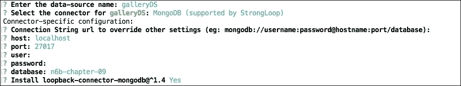
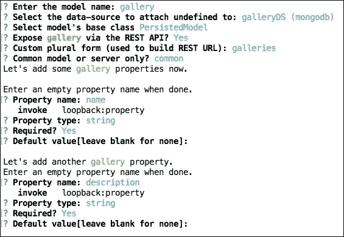
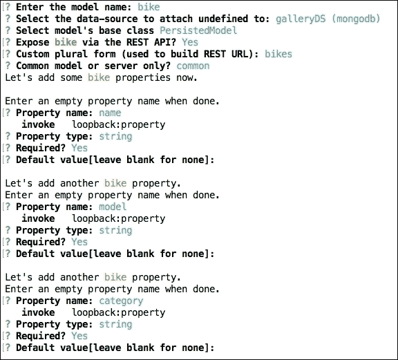
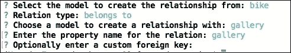
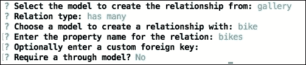
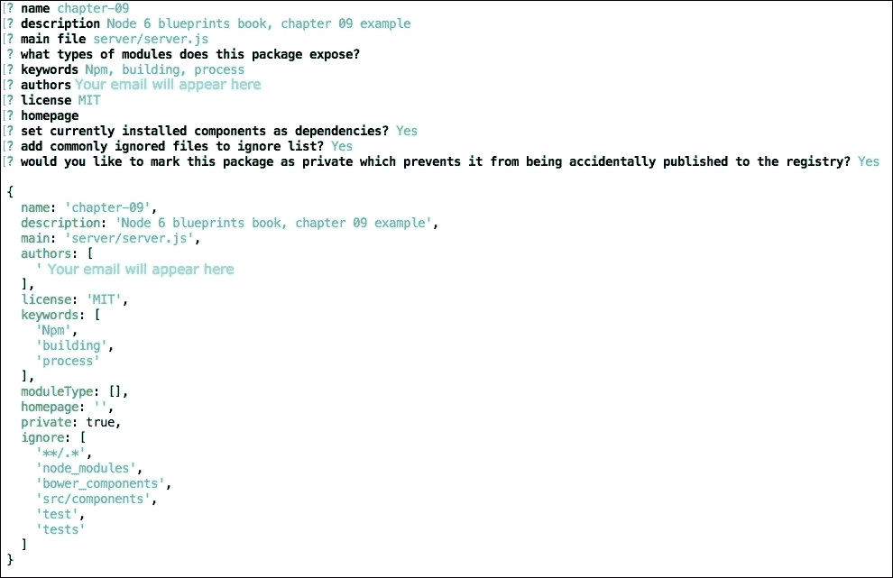
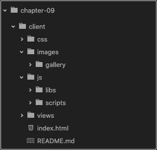
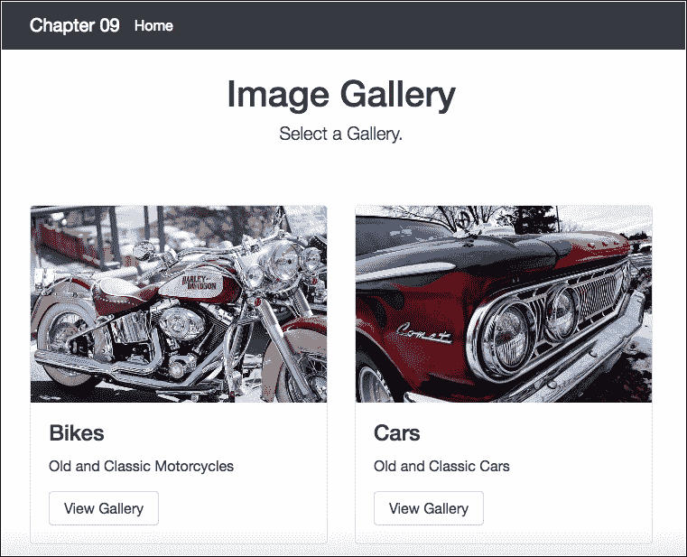
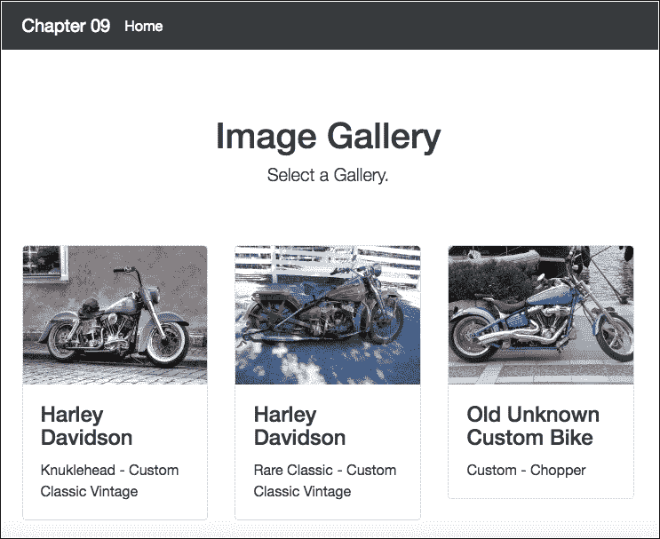

# 第九章：使用 Node.js 和 NPM 构建前端流程

正如我们在之前的章节中提到的，我们可以使用 Node Package Manager（NPM）的工具来替换 Gulp 和**Grunt**任务管理器，这是处理前端依赖关系的最流行的工具。我们可以结合使用这两种工具，但在本章中我们将只探索 NPM 和一些命令，这些命令将帮助我们创建我们的应用程序。

我们将创建构建任务来 lint、连接和压缩 Javascript 文件，优化图像，编译 SASS 样式表，并通过命令行将应用程序部署到云端服务器。此外，对于这个示例，我们将使用 Loopback.io 框架来创建具有 MongoDB 作为数据库的应用程序示例。

在本章中，我们将涵盖：

+   如何仅使用 Loopback.io CLI 创建应用程序

+   如何安装 eslint、imagemin 和 browserify

+   如何创建任务来 lint 错误、连接 JS 文件和优化图像

+   如何处理 SASS 导入和编译

+   如何使用 Heroku 工具包将应用程序部署到 Heroku

# 我们正在构建什么

在本章中，我们将构建一个简单的画廊应用程序，与第四章非常相似，但这次我们将使用 Loopback.io 框架的 Restful API。我们将看到如何使用 NPM 命令行创建构建任务，最终结果将与以下截图非常相似：


主屏幕

# 创建基线应用程序

尽管我们已经使用了 Loopback 框架，我们强烈建议您再次安装它，以确保您的机器上有最新版本：

```js
 npm install -g loopback

```

在这个示例中，我们不会对生成的代码进行太多更改，因为我们的重点是创建构建任务，但我们将使用 Loopback 框架的一些有趣特性，使用命令行：

1.  打开终端/ shell，并输入以下命令：

```js
 slc loopback

```

1.  将应用程序命名为 chapter-09。

1.  选择 empty-server（一个没有配置模型或数据源的空 LoopBack API），然后按 Enter。

现在我们已经创建了应用程序脚手架。不用担心终端输出建议的下一个命令，因为我们将在本书的后面讨论这些命令。

### 提示

您可以在此链接阅读有关**Loopback CLI**的更多信息：[`docs.strongloop.com/display/public/LB/Command-line+reference`](https://docs.strongloop.com/display/public/LB/Command-line+reference)。

## 向项目添加数据源

在我们像在第六章中所做的那样创建模型之前，这次我们将首先添加数据源。这是因为我们使用命令行来创建整个项目。这意味着我们不手动编辑任何文件。

当我们使用命令行时，一个好的做法是先创建数据源，而不是应用程序模型。这个过程可以防止需要手动编辑文件来连接模型和数据源应用程序：

1.  在终端/ shell 中，转到 chapter-09 文件夹，并输入以下命令：

```js
 slc loopback:datasource

```

1.  按照以下截图中显示的问题进行填写：

数据源设置

默认情况下，如果我们在本地使用 MongoDB，就不需要设置用户名和密码。现在不用担心这个问题，但以后我们会看到如何更改配置以部署应用程序。如果你愿意，你也可以在本地环境中添加用户名和密码。

## 创建应用程序模型

现在让我们创建应用程序模型；对于这个示例，我们使用了两个模型：

1.  在 chapter-09 文件夹中打开终端/ shell，并输入以下命令：

```js
 slc loopback:model

```

使用模型名称 gallery。

1.  按照以下截图中显示的问题填写：

画廊模型设置

在第二个属性之后，**按**Enter**完成模型创建。

1.  在 chapter-09 文件夹中打开终端/Shell，并输入以下命令：

```js
 slc loopback:model

```

使用模型名称自行车。

1.  按照以下截图中显示的问题填写：

自行车模型设置

在第三个属性之后，**按**Enter**完成模型创建。

### 提示

您可以在此链接找到有关模型创建的更多信息：[`docs.strongloop.com/display/public/LB/Model+generator`](https://docs.strongloop.com/display/public/LB/Model+generator)。

现在不要担心模型之间的关系，我们将在下一步中看到，只使用命令行。

## 在应用程序模型之间添加关系

让我们定义模型之间的关系；我们将使用两种类型的关系，即：

+   **hasmany**：一个画廊可以有很多辆自行车

+   **belongsTo**：一辆自行车可以有一个画廊

请记住，我们只是试图做一些有用的事情，而不是复杂的事情，以说明使用 NPM 的构建过程，请按照以下步骤进行：

1.  在 chapter-09 文件夹中打开终端/Shell，并输入以下命令：

```js
slc loopback:relation

```

1.  选择自行车模型，并按照以下问题填写：

自行车模型关系

1.  选择画廊模型，并使用以下信息填写问题：

画廊模型关系

所以让我们检查一下是否一切都写得正确。

1.  打开 common/models/gallery.json 文件，您将看到以下突出显示的代码：

```js
    { 
      "name": "gallery", 
      "plural": "galleries", 
      "base": "PersistedModel", 
      "idInjection": true, 
      "options": { 
        "validateUpsert": true 
      }, 
      "properties": { 
          ... 
      }, 
      "validations": [], 
      "relations": { 
        "bikes": { 
          "type": "hasMany", 
          "model": "bike", 
          "foreignKey": ""
} 
      }, 
      "acls": [], 
      "methods": {} 
    } 

```

1.  打开 common/models/bike.json 文件，您将看到以下突出显示的代码：

```js
    { 
      "name": "bike", 
      "base": "PersistedModel", 
      "idInjection": true, 
      "options": { 
        "validateUpsert": true 
      }, 
      "properties": { 
        ... 
      }, 
      "validations": [], 
      "relations": { 
        "gallery": { 
          "type": "belongsTo", 
          "model": "gallery", 
          "foreignKey": "" 
        } 
      }, 
      "acls": [], 
      "methods": {} 
    } 

```

### 提示

您可以在此链接找到有关**关系生成器**的更多信息：[`docs.strongloop.com/display/public/LB/Relation+generator`](https://docs.strongloop.com/display/public/LB/Relation+generator)。

只使用三个命令，我们就成功创建了示例应用程序的基础。下一步是在 client 文件夹中创建一个静态网站。

## 设置静态站点

就像我们在第六章中所做的那样，*使用 Restful API 和 Loopback.io 构建客户反馈应用程序*，让我们将 client 文件夹设置为静态站点：

1.  将 server/boot/root.js 文件重命名为 server/boot/_root.js。

1.  将以下突出显示的行添加到 server/middleware.json 中：

```js
      { 
        "initial:before": { 
          "loopback#favicon": {} 
      }, 
        "initial": { 
          "compression": {}, 
          "cors": { 
            "params": { 
              "origin": true, 
              "credentials": true, 
              "maxAge": 86400 
            } 
          }, 
          "helmet#xssFilter": {}, 
          "helmet#frameguard": { 
            "params": [ 
              "deny" 
            ] 
          }, 
          "helmet#hsts": { 
            "params": { 
              "maxAge": 0, 
              "includeSubdomains": true 
            } 
          }, 
          "helmet#hidePoweredBy": {}, 
          "helmet#ieNoOpen": {}, 
          "helmet#noSniff": {}, 
          "helmet#noCache": { 
            "enabled": false 
          } 
        }, 
        "session": {}, 
        "auth": {}, 
        "parse": {}, 
        "routes": { 
          "loopback#rest": { 
            "paths": [ 
              "${restApiRoot}" 
            ] 
          } 
        }, 
        "files": { 
          "loopback#static": { 
            "params": "$!../client" 
          } 
        }, 
        "final": { 
          "loopback#urlNotFound": {} 
        }, 
        "final:after": { 
          "loopback#errorHandler": {} 
        } 
      }

```

1.  在./client 文件夹中，创建一个名为 index.html 的新文件，并添加以下内容：

```js
      <!DOCTYPE html> 
      <html> 
        <head><title>Bikes Gallery</title></head> 
        <body> 
          <h1>Hello Node 6 Blueprints!</h1> 
        </body> 
      </html> 

```

现在是时候检查之前的更改，并在浏览器中查看最终结果了。

1.  打开终端/Shell 并输入以下命令：

```js
 npm start

```

1.  打开您喜欢的浏览器，转到 http://localhost:3000/。

您应该会看到**Hello Node 6 Blueprints!**消息。

我们还在 http://localhost:3000/api/bikes 和 http://localhost:3000/api/galleries 上有 Restful API。

现在我们将看到如何重组一些目录，以准备使用 NPM 构建任务在云中部署应用程序。

# 重构应用程序文件夹

我们的重构过程包括两个步骤。

首先，让我们为应用程序源文件创建一个目录，例如 JavaScript、SCSS 和图像文件。

在第二步中，我们将在 client 文件夹中创建一些目录来接收我们的脚本。

让我们为图像、库、脚本和 SCSS 文件创建源文件夹。

## 创建图像文件夹

在这个文件夹中，我们将在使用 imagemin-cli 进行优化技术处理之前存储图像。

1.  在根项目内，创建一个名为 src 的文件夹。

1.  在 src 文件夹中，创建一个名为 images 的文件夹。

1.  在图像文件夹中，创建一个名为 gallery 的文件夹。

1.  从 Packt 网站([www.packtpub.com](http://www.packtpub.com))或 GitHub 上的官方书籍存储库下载第九章的示例图像文件，然后将图像粘贴到 gallery 文件夹中。

### 提示

您可以在此链接了解更多有关 imagemin cli 的信息：[`github.com/imagemin/imagemin-cli`](https://github.com/imagemin/imagemin-cli)。

## 创建 libraries 文件夹

libraries 文件夹将存储一些 jQuery 插件。在 src 文件夹内，创建一个名为 libs 的文件夹。

## 创建 scripts 文件夹

由于我们使用了 jQuery 和一些插件，我们需要编写一些代码来使用 jQuery 库；我们将使用这个文件夹来做到这一点：

1.  在 src 文件夹内，创建一个名为 scripts 的文件夹。

1.  在 src/scripts 文件夹内，创建一个名为 gallery.js 的文件，并添加以下代码：

```js
      (function (){ 
          'use-strict' 
         //jQuery fancybox activation 
         $('.fancybox').fancybox({ 
              padding : 0, 
             openEffect  : 'elastic' 
         }); 
      })(); 

```

在这个例子中，我们只使用了一个插件，但在大型应用程序中，使用多个插件是非常常见的；在这种情况下，我们会为每个功能有一个文件。

然后，为了提高应用程序的性能，我们建议将所有脚本合并成一个文件。

## 创建 SASS 文件夹

SASS 文件夹将存储 scss 文件。我们正在使用 Bootstrap 框架，对于这个例子，我们将使用 SASS 分离版本来设置 Bootstrap 框架；现在不用担心这个，因为在本章后面我们会看到如何获取这些文件：

1.  在 src 文件夹内，创建一个名为 scss 的文件夹。

1.  在 scss 文件夹内，创建一个名为 vendor 的文件夹。

## 安装 Bower

正如我们在之前的章节中看到的，我们将使用 Bower 来管理前端依赖关系：

1.  打开终端/Shell 并输入以下命令：

```js
npm install bower -g

```

1.  创建一个名为.bowerrc 的文件并将其保存在根文件夹中。

1.  将以下内容添加到.bowerrc 文件中：

```js
      { 
        "directory": "src/components", 
        "json": "bower.json" 
      }

```

1.  打开终端/Shell 并输入以下命令：

```js
 bower init

```

1.  按照以下截图中显示的问题填写：

设置 Bower.json

## 安装应用程序依赖关系

在这个例子中，我们只使用了一个 jQuery 插件加上 Bootstrap 框架，所以让我们首先使用 Bower CLI 来安装 Bootstrap：

1.  打开终端/Shell 并输入以下命令：

```js
bower install bootstrap#v4.0.0-alpha --save

```

只需打开 src/components 文件夹查看 Bootstrap 和 jQuery 文件夹。

1.  现在我们将在图像库中安装 jQuery fancybox 插件。打开终端/Shell 并输入以下命令：

```js
 bower install fancybox --save

```

因此，此时 src 文件夹将具有以下结构：

+   components/

+   bootstrap/

+   fancybox/

+   jquery/

## 创建 scss 文件夹结构

现在让我们设置 scss 文件夹来编译 bootstrap.scss 文件：

1.  打开 src/components/bootstrap 文件夹并复制 SCSS 文件夹中的所有内容。

1.  将内容粘贴到 src/scss/vendor 文件夹内。

1.  在 src/文件夹内创建一个名为 main.scss 的文件，并添加以下内容：

```js
      // Project Style 

      // Import Botstrap 
      @import "vendor/bootstrap"; 

      // 
      body { 
        padding-top: 5rem; 
      } 
      .starter-template { 
        padding: 3rem 1.5rem; 
        text-align: center; 
        @include clearfix 
      } 

```

许多开发人员不会以这种方式使用 Bootstrap 框架，有些人只会在项目中使用 bootstrap.css 或 bootstrap.min.css 文件。这没问题，但是当我们以这种方式使用框架时，我们可以在我们自己的样式表中使用所有框架的资源，因此我们可以在我们的样式表中使用所有的 mixin 和变量。

例如，突出显示的代码来自 Bootstrap mixins，我们可以将其应用到我们自己的样式表中：

```js
      .starter-template { 
        padding: 3rem 1.5rem; 
        text-align: center; 
        @include clearfix 
      } 

```

### 提示

您可以在此链接了解更多有关 SASS 的信息：[`sass-lang.com/`](http://sass-lang.com/)。

# 重构客户端文件夹

客户端文件夹将具有一个非常基本的结构，用于存储 CSS、JavaScript 和图像文件。

在这个例子中，我们将使用最新的稳定版本的 AngularJS 来创建我们应用程序的页面：

1.  在客户端文件夹内，创建以下文件夹：

+   css/

+   images/gallery/

+   js/

+   js/libs/

+   js/scripts/

+   views/

创建所有这些文件夹后，客户端目录将如下截图所示：



客户端文件夹结构

## 添加应用程序视图

现在是时候创建应用程序视图文件夹来存储所有应用程序模板了：

1.  在 client/src 文件夹中，创建一个名为 home.html 的新文件，并添加以下代码：

```js
      <div class="col-md-6" ng-repeat="item in vm.listProducts"> 
        <div class="card" > 
           
          <div class="card-block"> 
            <h4 class="card-title">{{ item.name }}</h4> 
            <p class="card-text">{{ item.description }}</p> 
            <a ui-sref="galleries({itemId:item.id})" class="btn 
             btn-secondary">View Gallery</a> 
          </div> 
        </div> 
      </div> 
      </div> 

```

1.  在 client/src 文件夹中，创建一个名为 galleries.html 的新文件，并添加以下代码：

```js
      <div class="row"> 
        <div class="col-md-4" ng-repeat="item in vm.listProducts"> 
          <div class="card" > 
            <a href="{{ item.image }}" class="fancybox" rel="gallery"
             > 
             
            </a> 
            <div class="card-block"> 
              <h4 class="card-title">{{ item.name }}</h4> 
              <p class="card-text">{{ item.model }} - {{ item.category }}
              </p> 
            </div> 
          </div> 
        </div> 
      </div> 

```

1.  打开 client/index.html 文件，并用以下内容替换代码：

```js
      <!DOCTYPE html> 
      <html ng-app="bikesGallery"> 
        <head><title>Bikes Gallery</title></head> 
          <link rel="stylesheet" href="css/main.css"> 
          <link rel="stylesheet" href="components/fancybox/source
           /jquery.fancybox.css"> 
        <body> 
          <nav class="navbar navbar-fixed-top navbar-dark bg-inverse"> 
            <div class="container"> 
              <a class="navbar-brand" href="#">Chapter 09</a> 
                <ul class="nav navbar-nav"> 
                  <li class="nav-item active"><a class="nav-link" href="/">
                   Home <span class="sr-only">(current)</span></a>
                  </li> 
                </ul> 
            </div> 
          </nav> 

        <div class="container"> 
          <div id="title"> 
            <div class="starter-template"> 
              <h1>Image Gallery</h1> 
                <p class="lead">Select a Gallery.</p> 
             </div> 
          </div> 
        <div class="" ui-view> 

      </div> 
      </div> 
      </div> 

      <!-- Scripts at bottom --> 
      <script src='js/libs/jquery.min.js'></script> 
      <script src="img/angular.js"></script> 
      <script src="img/angular-resource.js"></script> 
      <script src="img/angular-ui-router.js"></script> 
      <script src="img/app.js"></script> 
      <script src="img/app.config.js"></script> 
      <script src="img/app.routes.js"></script> 
      <script src="img/services.js"></script> 
      <script src="img/controllers.js"></script> 
      <script src="img/libs.js"></script> 
      <script src="img/scripts.js"></script> 

      </body> 
      </html>

```

## 安装 AngularJS 文件

现在是时候安装 AngularJS 文件并创建应用程序了。在本示例中，我们将在本节后面探索 Loopback 框架的 AngularJS SDK；为此，我们选择使用 AngularJS 来构建我们的前端应用程序：

1.  打开终端/Shell 并输入以下命令：

```js
bower install angularjs#1.5.0 --save

```

1.  打开终端/Shell 并输入以下命令：

```js
bower install angular-resource#1.5.0 --save

```

1.  打开终端/Shell 并输入以下命令：

```js
bower install angular-ui-router --save

```

### 提示

您可以在此链接了解更多关于 AngularJS 的信息：[`docs.angularjs.org/api`](https://docs.angularjs.org/api)。

# 创建 AngularJS 应用程序

最后，我们将创建 AngularJS 应用程序，所以请按照以下步骤进行：

1.  在 client/js 文件夹中，创建一个名为 app.js 的新文件，并添加以下代码：

```js
     (function(){ 
          'use strict'; 

          angular 
          .module('bikesGallery', ['ui.router','lbServices']); 

      })();

```

现在不用担心 lbServices 依赖项；在本章后面，我们将看到如何使用 Loopback 框架构建的 AngularJS SDK 工具来创建此文件。

1.  在 client/js 文件夹中，创建一个名为 app.config.js 的新文件，并添加以下代码：

```js
      (function(){ 
          'use strict'; 

          angular 
           .module('bikesGallery') 
           .config(configure) 
            .run(runBlock); 

          configure.$inject = ['$urlRouterProvider', '$httpProvider', 
                              '$locationProvider']; 

          function configure($urlRouterProvider, $httpProvider, 
                            $locationProvider) { 

            $locationProvider.hashPrefix('!'); 
            // This is required for Browser Sync to work poperly 
            $httpProvider.defaults.withCredentials = true; 
            $httpProvider.defaults.headers.common['X-Requested-With']
              = 'XMLHttpRequest'; 
            $urlRouterProvider 
            .otherwise('/'); 
          } 
          runBlock.$inject = ['$rootScope', '$state', '$stateParams']; 
          function runBlock($rootScope, $state, $stateParams ) { 
            $rootScope.$state = $state; 
            $rootScope.$stateParams = $stateParams; 
          } 
      })();

```

1.  在 client/js 文件夹中，创建一个名为 app.routes.js 的新文件，并添加以下代码：

```js
      (function(){ 
        'use strict'; 

          angular 
           .module('bikesGallery') 
           .config(routes); 

          routes.$inject = ['$stateProvider']; 
          function routes($stateProvider) { 
            $stateProvider 
            .state('home', { 
                url:'/', 
                templateUrl: 'views/home.html', 
                controller: 'HomeController', 
                controllerAs: 'vm' 
            }) 
            .state('galleries', { 
                url:'/galleries/{itemId}/bikes', 
                templateUrl: 'views/galleries.html', 
                controller: 'GalleryController', 
                controllerAs: 'vm' 
            }); 
          } 
      })();

```

1.  在 client/js 文件夹中，创建一个名为 controllers.js 的新文件，并添加以下代码：

```js
      (function(){ 
        'use strict'; 

          angular 
            .module('bikesGallery') 
            .controller('GalleryController', GalleryController) 
            .controller('HomeController', HomeController); 

          HomeController.$inject = ['Gallery']; 
          function HomeController(Gallery) { 
            var vm = this; 
            vm.listProducts = Gallery.find(); 
            //console.log(vm.listProducts); 
          } 

          GalleryController.$inject = ['Gallery', '$stateParams']; 
          function GalleryController(Gallery, $stateParams) { 
            var vm = this; 
            var itemId = $stateParams.itemId; 
            //console.log(itemId); 
            vm.listProducts = Gallery.bikes({ 
              id: itemId 
          }); 
          //console.log(vm.listProducts); 
          } 
      })();

```

## 使用 Loopback 的 AngularJS SDK

我们将使用 Loopback 框架的内置 AngularJS SDK 自动生成所有应用程序服务：

1.  打开终端/Shell 并输入以下命令：

```js
lb-ng ./server/server.js ./client/js/services.js

```

上述命令将在 client/js 文件夹中创建一个名为 services.js 的文件，其中包含 Loopback 框架创建的 Restful API 中的所有方法（创建、读取、更新和删除）以及其他许多方法。

### 提示

您可以通过在终端/Shell 中在根项目文件夹中运行 npm start 命令来检查本地 API。API 将在 http://0.0.0.0:3000/explorer 上可用。

1.  lbServices 部分有以下 CRUD 方法和许多其他方法：

```js
      "create": { 
        url: urlBase + "/galleries", 
        method: "POST" 
      }, 
      "upsert": { 
        url: urlBase + "/galleries", 
        method: "PUT" 
      }, 
      "find": { 
        isArray: true, 
        url: urlBase + "/galleries", 
        method: "GET" 
      }, 
      "deleteById": { 
        url: urlBase + "/galleries/:id", 
        method: "DELETE" 
      },

```

1.  要使用其中一种方法，我们只需要将工厂注入到 Angular 控制器中，如下面突出显示的代码所示：

```js
      GalleryController.$inject = ['Gallery', '$stateParams']; 
      function GalleryController(Gallery, $stateParams) { 
        ... 
      } 

```

然后我们可以在控制器中使用这些方法，就像以下示例中所示的那样：

```js
      Gallery.create(); 
      Gallery.find(); 
      Gallery.upsert({ id: itemId }); 
      Gallery.delete({ id: itemId }); 

```

这是一个简单而非常有用的服务，用于处理我们应用程序中创建的所有模型的所有端点。

应用程序的第一部分已经几乎完成，但我们仍需要添加一些内容，使其更加愉快。

让我们创建一些内容。如前所述，您可以从 Packt 网站 ([www.packtpub.com](http://www.packtpub.com)) 或直接从书的 GitHub 存储库下载整个示例代码。

# 向应用程序添加内容

您可以通过两种方式添加内容，第一种是使用应用程序创建的端点，第二种是使用迁移文件。

在接下来的几行中，我们将展示如何使用第二种选项；这可能是一个简短而有趣的过程，用于创建迁移文件：

1.  在 server/boot/ 文件夹中，创建一个名为 create-sample-models.js 的文件，并添加以下内容以创建一个 **Gallery Model** 的迁移文件：

```js
      module.exports = function(app) { 
        // automigrate for models, everytime the app will running,
         db will be replaced with this data. 

        app.dataSources.galleryDS.automigrate('gallery', function(err)
        { 
          if (err) throw err; 
           // Simple function to create content 
          app.models.Gallery.create( 
            [ 
              { 
                "name":"Bikes", 
                "image": "images/gallery/sample-moto-gallery.jpg", 
                "link": "bikes.html", 
                "description":"Old and Classic Motorcycles", 
                "id":"5755d253b4aa192e41a6be0f" 
              },{ 
                  "name":"Cars", 
                  "image": "images/gallery/sample-car-gallery.jpg", 
                  "link": "cars.html", 
                  "description":"Old and Classic Cars", 
                  "id":"5755d261b4aa192e41a6be10" 
                } 
            ],
            function(err, galleries) { 
              if (err) throw err; 
              // Show a success msg on terminal 
              console.log('Created Motorcycle Gallery Model: \n',
               galleries); 
            }); 
          }); 

```

1.  在 server/boot/ 文件夹中，添加以下内容以创建一个 **Bike Model** 的迁移文件：

```js
      app.dataSources.galleryDS.automigrate('bike', function(err) { 
        if (err) throw err; 
         // Simple function to create content 
        app.models.Bike.create( 
            [ 
                { 
                  "name":"Harley Davidson", 
                  "image": "images/gallery/sample-moto1.jpg", 
                  "model":"Knucklehead", 
                  "category":"Custom Classic Vintage", 
                  "id":"5755d3afb4aa192e41a6be11", 
                  "galleryId":"5755d253b4aa192e41a6be0f" 
                },{ 
                    "name":"Harley Davidson", 
                    "image": "images/gallery/sample-moto2.jpg", 
                    "model":"Rare Classic", 
                    "category":"Custom Classic Vintage", 
                    "id":"5755d3e8b4aa192e41a6be12", 
                    "galleryId":"5755d253b4aa192e41a6be0f" 
                },{ 
                    "name":"Old Unknown Custom Bike", 
                    "image": "images/gallery/sample-moto3.jpg", 
                    "model":"Custom", 
                    "category":"Chopper", 
                    "id":"5755d431b4aa192e41a6be13", 
                    "galleryId":"5755d253b4aa192e41a6be0f" 
                },{ 
                    "name":"Shadow Macchit", 
                    "image": "images/gallery/sample-car1.jpg", 
                    "model":"Classic", 
                    "category":"Old Vintage", 
                    "id":"5755d43eb4aa192e41a6be14", 
                    "galleryId":"5755d261b4aa192e41a6be10" 
                },{ 
                    "name":"Buicks", 
                    "image": "images/gallery/sample-car2.jpg", 
                    "model":"Classic", 
                    "category":"Classic", 
                    "id":"5755d476b4aa192e41a6be15", 
                    "galleryId":"5755d261b4aa192e41a6be10" 
                },{ 
                    "name":"Ford", 
                    "image": "images/gallery/sample-car3.jpg", 
                    "model":"Corsa", 
                    "category":"Hatch", 
                    "id":"5755d485b4aa192e41a6be16", 
                    "galleryId":"5755d261b4aa192e41a6be10" 
                } 

               ], function(err, bikes) { 
                    if (err) throw err; 
                     // Show a success msg on terminal 
                    console.log('Created Bike Model: \n', bikes); 
                 }); 
               }); 
      };

```

### 提示

不要忘记在第一次部署到 **Heroku** 后删除此文件。

# 创建构建任务

现在是时候只使用 NPM 来创建我们的任务了。

在开始之前，重要的是要记住 NPM 有两个特殊的命令，可以直接调用，即 start 和 test。因此，我们将使用 run 命令来运行我们创建的所有其他任务。

我们在本节的目标是：

+   从源目录复制一些文件到客户端目录

+   验证 JavaScript 文件中的错误

+   从 src/scss 编译 SASS 文件并将其保存在 client/css 文件夹中

+   优化从 src/images/gallery 到 client/images/gallery 的图像

+   将 JavaScript 文件从 src/scripts 连接到 client/js/scripts

## 安装依赖项

为了完成这些任务，我们需要安装一些命令行界面（CLI）工具：

1.  打开终端/Shell 并输入以下命令：

```js
 npm install copy-cli --save-dev
 npm install -g eslint
 npm install eslint --save-dev
 npm install -g node-sass
 npm install browserify --save-dev
 npm intall -g imagemin-cli
 npm install -g imagemin

```

在本示例中，我们的目的是展示如何使用构建工具，因此我们不会深入研究每个工具。

但在我们继续之前，让我们设置 JavaScript 验证器 eslint。

### 提示

您可以在此链接阅读有关 eslint 的更多信息：[`eslint.org/`](http://eslint.org/)。

1.  在根项目内，创建一个名为.eslintrc.json 的文件并添加以下代码：

```js
      { 
        "env": { 
          "browser": true 
        }, 
        "globals": { 
          "angular": 1, 
          "module": 1, 
          "exports": 1 
        }, 
        "extends": "eslint:recommended", 
        "rules": { 
          "linebreak-style": [ 
            "error", 
            "unix" 
          ], 
          "no-mixed-spaces-and-tabs": 0, 
          "quotes": 0, 
          "semi": 0, 
          "comma-dangle": 1, 
          "no-console": 0 
        } 
      } 

```

### 提示

您可以在此链接阅读有关 Eslint 规则的更多信息：[`eslint.org/docs/rules/`](http://eslint.org/docs/rules/)。

## 创建复制任务

我们将在将其插入到我们的 package.json 文件之前创建每个任务；这样更容易理解每个过程。

复制任务将如下所示：

+   复制 jQuery 文件

+   复制 AngularJS 主库

+   复制 AngularJS 资源库

+   复制 AngularJS ui-router 库

因此，我们需要将这些文件（jQuery 和 AngularJS）从源文件夹复制到客户端文件夹：

```js
"copy-jquery": "copy ./src/components/jquery/dist/jquery.js > 
  ./client/js/libs/jquery.js", 
"copy-angular": "copy ./src/components/angular/angular.js > 
  ./client/js/libs/angular.js", 
"copy-angular-resource": "copy ./src/components/angular-resource/angular-resource.js > 
  ./client/js/libs/angular-resource.js", 
"copy-angular-ui-router": "copy ./src/components/angular-ui-router/release/angular-ui-router.js > 
  ./client/js/libs/angular-ui-router.js", 

```

最后的复制任务将执行所有其他复制任务：

```js
"copy-angular-files": "npm run copy-angular && npm run copy-angular-resource && npm run copy-angular-ui-router", 

```

目前不用担心运行复制任务；在本章后面，我们将在部署之前逐个执行它们。

## 创建 SASS 任务

SASS 任务将非常简单，我们只需编译 scss 文件并将它们插入到 client/css 文件夹中：

```js
"build-css": "node-sass --include-path scss src/scss/main.scss   client/css/main.css", 

```

## 创建 linting 任务

我们将使用.eslintrc.json 配置应用于 client/js 文件夹中的所有 JavaScript 文件：

```js
"lint-js": "eslint client/js/*.js --no-ignore", 

```

## 创建图像优化任务

在任何 Web 应用程序中，另一个重要的任务是优化所有图像文件，出于性能原因：

```js
"imagemin": "imagemin src/images/gallery/* --o client/images/gallery", 

```

## 创建连接任务

concat 任务将连接 libs 和 scripts 中的所有脚本文件：

```js
"concat-js-plugins": "browserify src/libs/*.js -o client/js/libs/libs.js", 
"concat-js-scripts": "browserify src/scripts/*.js -o client/js/scripts/scripts.js", 

```

最后的 concat 任务执行所有其他 concat 任务：

```js
"prepare-js": "npm run concat-js-plugins && npm run concat-js-scripts" 

```

## 创建构建任务

构建任务只是在单个任务中执行之前的每个步骤：

```js
"build": "npm run lint-js && npm run copy-angular-files && npm run build-css && npm run prepare-js && npm run imagemin" 

```

现在让我们将所有任务添加到 package.json 文件中。打开 package.json 文件并添加以下突出显示的代码：

```js
  { 
    "name": "chapter-09", 
    "version": "1.0.0", 
    "main": "server/server.js", 
    "scripts": { 
      "start": "node .", 
      "pretest": "eslint .", 
      "posttest": "nsp check", 
      "copy-jquery": "copy ./src/components/jquery/dist/jquery.js > 
        ./client/js/libs/jquery.js", 
      "copy-angular": "copy ./src/components/angular/angular.js >
        ./client/js/libs/angular.js", 
      "copy-angular-resource": "copy ./src/components/angular-resource
      /angular-resource.js >
        ./client/js/libs/angular-resource.js", 
      "copy-angular-ui-router": "copy ./src/components/angular-ui-router
      /release/angular-ui-router.js >
        ./client/js/libs/angular-ui-router.js", 
      "copy-angular-files": "npm run copy-angular && npm run copy-angular-
      resource && npm run copy-angular-ui-router", 
      "build-css": "node-sass --include-path scss src/scss/main.scss 
      client/css/main.css", "lint-js": "eslint client/js/*.js --no-ignore",
      "imagemin": "imagemin src/images/gallery/* --o client/images/gallery", 
      "concat-angular-js": "browserify ./src/libs/angular.js ./src/libs/
      angular-resource.js ./src/libs/angular-ui-router.js > client/js
      /libs/libs.js", "concat-js-plugins": "browserify src/libs/*.js -o 
      client/js/libs/libs.js", "concat-js-scripts": "browserify 
      src/scripts/*.js -o client/js/scripts/scripts.js", "prepare-js": 
      "npm run concat-js-plugins && npm run concat-js-scripts", "build":
      "npm run lint-js && npm run copy-angular-files && npm run build-css && 
      npm run prepare-js && npm run imagemin" 
    }, 
    "dependencies": { 
         ... 
    }, 
    "devDependencies": { 
         ... 
    }, 
    "repository": { 
         ... 
    }, 
    "license": "MIT", 
    "description": "chapter-09", 
    "engines": { 
      "node": "5.0.x" 
    } 
  } 

```

# 使用单独命令的任务

正如我们之前提到的，我们可以单独执行我们创建的每个任务。

例如，要优化图像文件，我们只需运行 imagemin 任务。只需打开终端/Shell 并输入以下命令：

```js
 npm run imagemin

```

终端上的输出将如下所示：

```js
 8 images minified

```

我们可以为每个任务执行相同的操作。

# 部署到 Heroku 云

部署我们的应用程序的第一步是在**Heroku 云服务**上创建一个免费帐户：

1.  转到[`signup.heroku.com/`](https://signup.heroku.com/)并创建一个免费帐户。

1.  在[`toolbelt.heroku.com/`](https://toolbelt.heroku.com/)上为您的平台下载**Heroku 工具包**。

1.  按照您的平台进行安装过程。

现在您必须在您的机器上安装 Heroku 工具包，以进行测试。

1.  打开终端/Shell 并输入以下命令：

```js
 heroku --help

```

终端输出列出了使用**Heroku CLI**的所有可能操作。

### 提示

本书假设您的机器上已经安装了 git 源代码控制；如果您还没有安装，请查看此页面：[`git-scm.com/downloads`](https://git-scm.com/downloads)。

## 创建 Heroku 应用程序

现在我们将创建一个应用程序并将其发送到您新创建的 Heroku 帐户：

1.  创建一个名为.Procfile 的文件并将其保存在根项目文件夹中。

1.  将以下代码粘贴到.Procfile 文件中：

```js
      web: slc run 

```

1.  打开终端/Shell 并输入以下命令：

```js
 git init

```

上一个命令初始化了一个 git 存储库。

1.  git add 命令将所有文件添加到版本跟踪：

```js
 git add

```

1.  git commit 命令将所有文件发送到本地机器上的版本控制。

```js
 git commit -m "initial commit"

```

现在是时候登录您的 Heroku 帐户并将所有项目文件发送到 Heroku git 源代码控制。

1.  打开终端/ shell 并输入以下命令：

```js
 heroku login

```

输入您的用户名和密码。

1.  打开终端/ shell 并输入以下命令：

```js
heroku apps:create --buildpack https://github.com/strongloop
     /strongloop-buildpacks.git

```

上一个命令将使用 strongloop-buildpacks 来配置和部署 Loopback 应用程序。

## 创建一个 deploy.sh 文件

最后，我们将使用.sh 文件创建我们的部署任务：

1.  在根文件夹中创建一个名为 bin 的文件夹。

1.  在 bin 文件夹内，创建一个名为 deploy.sh 的文件。

1.  将以下代码添加到 bin/deploy.sh 文件的末尾：

```js
      #!/bin/bash 

      set -o errexit # Exit on error 

      npm run build # Generate the bundled Javascript and CSS 

      git push heroku master # Deploy to Heroku 

```

1.  在 package.json 文件的所有任务的末尾添加以下代码行：

```js
      "scripts": {
        ... 
        "deploy": "./bin/deploy.sh" 
      }
```

现在，每当您进行一次提交并输入 npm run deploy 命令进行一次更改时，引擎将启动 deploy.sh 文件并将所有已提交的更改上传到 Heroku 云服务。

1.  打开终端/ shell 并输入以下命令：

```js
 npm run deploy

```

1.  如果您遇到权限错误，请执行以下操作。在 bin 文件夹内打开终端/ shell，并输入以下命令：

```js
 chmod 755 deploy.sh

```

默认情况下，Heroku 云服务将为您的应用程序创建一个 URL，就像这样：

https://some-name-1234.herokuapp.com/。

在终端输出的末尾，您将看到类似以下行的内容：

```js
remote: -----> Discovering process types
remote:        Procfile declares types -> web
remote:
remote: -----> Compressing...
remote:        Done: 79.7M
remote: -----> Launching...
remote:        Released v13
remote:        https://yourURL-some-23873.herokuapp.com/
                   deployed to Heroku
remote:
remote: Verifying deploy... done.
To https://git.heroku.com/yourURL-some-23873.git

```

最终结果将是我们的示例应用程序部署到 Heroku 云服务。

只需转到 https://yourURL-some-23873.herokuapp.com/，您将看到以下结果：



Heroku 云服务上的应用程序

当您单击“自行车查看画廊”按钮时，您将看到自行车画廊，如下所示：



自行车画廊

此外，当您单击每辆自行车时，您将看到 fancybox 插件在起作用。

# 总结

在本章中，我们将更深入地探索 Loopback 框架及其命令行界面。

我们还看到了如何使用 Loopback AngularJS SDK 配置 AngularJS 应用程序，为应用程序的每个端点创建所有服务。

然后，我们使用 NPM 作为单一的构建工具来探索这些设施。

我们还介绍了如何在 Heroku 上创建和设置帐户，以及如何通过集成 Loopback、Git 和 Heroku 工具包来自动部署我们的应用程序。

在下一章中，我们将看到如何使用容器的概念来运行 Node.js 应用程序。
