# 第十章：使用持续集成和 Docker 创建和部署

在本章中，我们将探索使用 Node.js 应用程序的持续交付开发过程。

在之前的章节中，我们看到了许多使用 Node.js 和 Express、Loopback 等框架开发应用程序的方法，包括使用不同的数据库，如 MongoDB 和 MySql，以及一些用于用户身份验证、会话、cookie 等的中间件。

在第九章中，*使用 Node.js 和 NPM 构建前端流程*，我们看到了如何使用命令行部署应用程序，以及如何使用几个命令直接将项目上传到云端。

在本章中，我们将看到如何将一些更多的工具集成到我们的开发环境中，以处理单元测试和自动部署，如何设置环境变量来保护我们的数据库凭据，并且如何使用 Docker 容器的概念创建一个完整的应用程序。

在本章中，我们将涵盖以下主题：

+   如何处理 CI 解决方案

+   如何测试 Node.js 应用程序

+   如何配置 MongoDB 云实例和环境变量

+   如何在构建和测试过程中集成 GitHub、Heroku 和 Codeship

+   如何创建 Docker 镜像以及如何使用 Docker 容器

# 我们正在构建什么

在本章中，我们将使用 Express 框架构建一个应用程序，使用了在之前章节中已经使用过的一些技术，比如使用 Passport 中间件进行用户会话和用户身份验证，使用电子邮件和密码。我们还将使用 MongoDB、Mongoose 和 Swig 模板。

结果将如下截图所示：

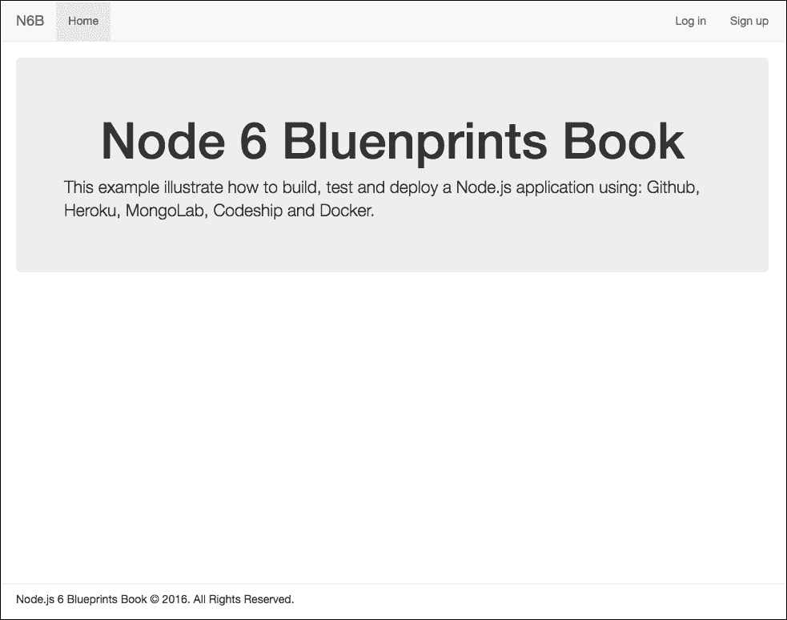

主屏幕截图

# 持续集成的含义

**持续集成**（**CI**）的工作流程通常包括四个步骤。我们将用图表和简要描述来说明所有四个阶段。

以下图表显示了 CI 解决方案的工作原理：

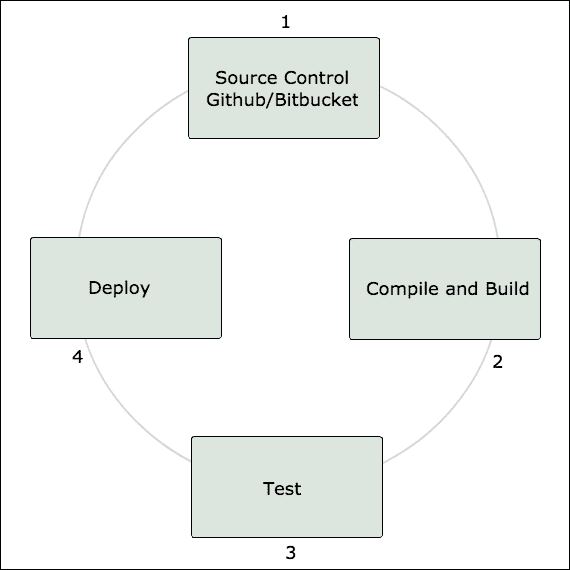

持续集成过程

1.  将代码提交到存储库。

1.  CI 界面构建应用程序。

1.  执行测试。

1.  如果所有测试都成功，代码将被部署。

# 创建基线应用程序

让我们开始构建应用程序。首先，我们将创建一个应用程序文件夹，并添加一些根文件，比如.gitignore、package.json、.env 等等。

## 添加根文件

1.  创建一个名为 chapter-10 的文件夹。

1.  在 chapter-10 文件夹中，创建一个名为 package.json 的新文件，并添加以下代码：

```js
      { 
        "name": "chapter-10", 
        "version": "1.0.0", 
        "main": "server.js", 
        "description": "Create an app for the cloud with Docker", 
        "scripts": { 
          "build": "npm-run-all build-*", 
          "build-css": "node-sass public/css/main.scss >
           public/css/main.css", 
          "postinstall": "npm run build", 
          "start": "node server.js", 
          "test": "mocha", 
          "watch": "npm-run-all --parallel watch:*", 
          "watch:css": "nodemon -e scss -w public/css -x npm run
           build:css" 
        }, 
        "dependencies": { 
          "async": "¹.5.2", 
          "bcrypt-nodejs": "⁰.0.3", 
          "body-parser": "¹.15.1", 
          "compression": "¹.6.2", 
          "dotenv": "².0.0", 
          "express": "⁴.13.4", 
          "express-flash": "0.0.2", 
          "express-handlebars": "³.0.0", 
          "express-session": "¹.2.1", 
          "express-validator": "².20.4", 
          "method-override": "².3.5", 
          "mongoose": "⁴.4.8", 
          "morgan": "¹.7.0", 
          "node-sass": "³.6.0", 
          "nodemon": "¹.9.1", 
          "npm-run-all": "¹.8.0", 
          "passport": "⁰.3.2", 
          "passport-local": "¹.0.0", 
          "swig": "¹.4.2" 
        }, 
        "devDependencies": 
          "mocha": "².4.5", 
          "supertest": "¹.2.0" 
        }, 
        "engines": { 
          "node": "6.1.0" 
        } 
      }

```

### 提示

请注意，在 devDependencies 中，我们将使用一些模块来为我们的应用程序编写测试。我们将在本书的后面看到如何做到这一点。

1.  创建一个名为.env 的文件，并添加以下代码：

```js
      SESSION_SECRET='<SESSION_SECRET>' 
      #MONGODB='<>' 
      MONGODB='<MONGODB>' 

```

不要担心之前的代码；我们将在本章后面使用环境变量在**Heroku**和**Codeship**上替换这段代码，并且我们还将配置此文件以使用 Docker 容器。

### 提示

出于安全原因，如果您正在进行商业项目，请不要将您的凭据上传到开源存储库；即使您有一个私人存储库，也建议您在生产中使用环境变量。

1.  创建一个名为 Profile 的文件，并添加以下代码：

```js
      web: node server.js 

```

正如我们在之前的章节中所看到的，这个文件负责使我们的应用程序在 Heroku 上运行。即使它不是强制性的，将它包含进来也是一个良好的做法。

另外，由于我们正在使用 git 源代码控制，将.gitignore 文件包含进来是一个良好的做法。

1.  创建一个名为.gitignore 的文件，并添加以下代码：

```js
      lib-cov 
      *.seed 
      *.log 
      *.csv 
      *.dat 
      *.out 
      *.pid 
      *.gz 
      *.swp 

      pids 
      logs 
      results 
      tmp 
      coverage 

      # API keys 
      .env 

      # Dependency directory 
      node_modules 
      bower_components 
      npm-debug.log 

      # Editors 
      .idea 
      *.iml 

      # OS metadata 
      .DS_Store 
      Thumbs.db 

```

注意，目前我们将.env 文件保留在 gitignore 文件之外；在本书的后面，我们将取消跟踪此文件。

## 创建 config 文件夹和文件

通常，所有 Node.js 应用程序都使用一个名为 Config 的文件夹，用于存储所有应用程序配置文件。所以让我们创建一个。

1.  在项目根目录下，创建一个名为 config 的新文件夹。

1.  创建一个名为 passport.js 的文件，并添加以下代码：

```js
      // load passport module 
      var passport = require('passport'); 
      var LocalStrategy = require('passport-local').Strategy; 
      // load up the user model 
      var User = require('../models/User'); 

      passport.serializeUser(function(user, done) { 
        // serialize the user for the session 
        done(null, user.id); 
      }); 

      passport.deserializeUser(function(id, done) { 
        // deserialize the user 
        User.findById(id, function(err, user) { 
          done(err, user); 
        }); 
      }); 

      // using local strategy 
      passport.use(new LocalStrategy({ usernameField: 'email' }, 
       function(email, password, done) { 

        User.findOne({ email: email }, function(err, user) { 
          if (!user) { 
            // check errors and bring the messages 
            return done(null, false, { msg: 'The email: ' + email +
             ' is already taken. '}); 
          } 
          user.comparePassword(password, function(err, isMatch) { 
            if (!isMatch) { 
              // check errors and bring the messages 
              return done(null, false, { msg:'Invalid email or
              password'});   
            } 
            return done(null, user); 
          }); 
        }); 
      }));

```

前面的代码将使用**Flask**中间件来处理用户身份验证的错误消息，就像我们在第一章中看到的那样，*使用 MVC 设计模式构建类似 Twitter 的应用程序*。

## 创建控制器文件夹和文件

由于我们正在构建一个简单的应用程序，我们只会有两个控制器，一个用于用户，另一个用于主页：

1.  在根项目文件夹内，创建一个名为 controllers 的新文件夹。

1.  创建一个名为 home.js 的文件，并添加以下代码：

```js
      // Render Home Page 
      exports.index = function(req, res) { 
        res.render('home', { 
          title: 'Home' 
        }); 
      };

```

现在让我们添加所有与用户相关的功能，比如登录、注册、授权、账户和登出。我们将在之前的每个功能后添加一个功能。

### 添加模块和身份验证中间件

在 controllers 文件夹内，创建一个名为 user.js 的新文件，并添加以下代码：

```js
  // import modules 
  var async = require('async'); 
  var crypto = require('crypto'); 
  var passport = require('passport'); 
  var User = require('../models/User'); 

  // authorization middleware 
  exports.ensureAuthenticated = function(req, res, next) { 
    if (req.isAuthenticated()) { 
      next(); 
    } else { 
      res.redirect('/login'); 
    } 
  }; 

  // logout 
  exports.logout = function(req, res) { 
    req.logout(); 
    res.redirect('/'); 
  };

```

### 添加登录的 GET 和 POST 方法

在 controllers/user.js 文件中添加以下代码，就在之前的代码后面：

```js
    // login GET 
    exports.loginGet = function(req, res) { 
      if (req.user) { 
        return res.redirect('/'); 
      } 
      res.render('login', { 
        title: 'Log in' 
      }); 
    }; 

    // login POST 
    exports.loginPost = function(req, res, next) { 
      // validate login form fields 
      req.assert('email', 'Email is not valid').isEmail(); 
      req.assert('email', 'Empty email not allowed').notEmpty(); 
      req.assert('password', 'Empty password not allowed').notEmpty(); 
      req.sanitize('email').normalizeEmail({ remove_dots: false }); 

      var errors = req.validationErrors(); 
      if (errors) { 
        // Show errors messages for form validation 
        req.flash('error', errors); 
        return res.redirect('/login'); 
      } 

      passport.authenticate('local', function(err, user, info) { 
        if (!user) { 
          req.flash('error', info); 
          return res.redirect('/login') 
        } 
        req.logIn(user, function(err) { 
          res.redirect('/'); 
        }); 
      })(req, res, next); 
    }; 

```

### 添加注册的 GET 和 POST 方法

在 controllers/user.js 文件中添加以下代码，就在之前的代码后面：

```js
    // signup GET 
    exports.signupGet = function(req, res) { 
      if (req.user) { 
        return res.redirect('/'); 
      } 
      res.render('signup', { 
        title: 'Sign up' 
      }); 
    }; 

    // signup POST 
    exports.signupPost = function(req, res, next) { 
      // validate sign up form fields 
      req.assert('name', 'Empty name not allowed').notEmpty(); 
      req.assert('email', 'Email is not valid').isEmail(); 
      req.assert('email', 'Empty email is not allowed').notEmpty(); 
      req.assert('password', 'Password must be at least 4 characters 
        long').len(4); 
      req.sanitize('email').normalizeEmail({ remove_dots: false }); 

      var errors = req.validationErrors(); 

      if (errors) { 
        // Show errors messages for form validation 
        req.flash('error', errors); 
        return res.redirect('/signup'); 
      } 

      // Verify user email 
      User.findOne({ email: req.body.email }, function(err, user) { 
        if (user) { 
          // if used, show message and redirect 
          req.flash('error', { msg: 'The email is already taken.' }); 
          return res.redirect('/signup'); 
        } 
        // create an instance of user model with form data 
        user = new User({ 
          name: req.body.name, 
          email: req.body.email, 
          password: req.body.password 
        }); 
        // save user 
        user.save(function(err) { 
          req.logIn(user, function(err) { 
            res.redirect('/'); 
          }); 
        }); 
      }); 
    }; 

```

### 添加账户的 GET 和 UPDATE 方法

在 controllers/user.js 文件中添加以下代码，就在之前的代码后面：

```js
    // profile account page 
    exports.accountGet = function(req, res) { 
      res.render('profile', { 
        title: 'My Account' 
      }); 
    }; 

    // update profile and change password 
    exports.accountPut = function(req, res, next) { 
      // validate sign up form fields 
      if ('password' in req.body) { 
        req.assert('password', 'Password must be at least 4 characters
        long').len(4); 
        req.assert('confirm', 'Passwords must match') 
         .equals(req.body.password); 
      }
      else { 
        req.assert('email', 'Email is not valid').isEmail(); 
        req.assert('email', 'Empty email is not allowed').notEmpty(); 
        req.sanitize('email').normalizeEmail({ remove_dots: false }); 
      } 
      var errors = req.validationErrors(); 

      if (errors) { 
        // Show errors messages for form validation 
        req.flash('error', errors); 
        return res.redirect('/pages'); 
      } 

      User.findById(req.user.id, function(err, user) { 
        // if form field password change 
        if ('password' in req.body) { 
          user.password = req.body.password; 
        }
        else { 
          user.email = req.body.email; 
          user.name = req.body.name; 
        } 
        // save user data 
        user.save(function(err) { 
          // if password field change 
          if ('password' in req.body) { 
            req.flash('success', { msg: 'Password changed.' }); 
          } else if (err && err.code === 11000) { 
            req.flash('error', { msg: 'The email is already taken.' }); 
          } else { 
            req.flash('success', { msg: 'Profile updated.' }); 
          } 
          res.redirect('/account'); 
        }); 
      }); 
    };

```

### 添加账户的 DELETE 方法

在 controllers/user.js 文件中添加以下代码，就在之前的代码后面：

```js
    // profile DELETE 
    exports.accountDelete = function(req, res, next) { 
      User.remove({ _id: req.user.id }, function(err) { 
        req.logout(); 
        req.flash('info', { msg: 'Account deleted.' }); 
        res.redirect('/'); 
       }); 
    };

```

现在我们已经完成了应用程序控制器。

## 创建模型文件夹和文件

1.  在根项目文件夹内，创建一个名为 models 的文件夹。

1.  创建一个名为 User.js 的新文件，并添加以下代码：

```js
      // import modules 
      var crypto = require('crypto'); 
      var bcrypt = require('bcrypt-nodejs'); 
      var mongoose = require('mongoose'); 

      // using virtual attributes 
      var schemaOptions = { 
        timestamps: true, 
        toJSON: { 
          virtuals: true 
        } 
      }; 

      // create User schema 
      var userSchema = new mongoose.Schema({ 
        name: String, 
        email: { type: String, unique: true}, 
        password: String, 
        picture: String 
      }, schemaOptions); 

      // encrypt password 
      userSchema.pre('save', function(next) { 
        var user = this; 
        if (!user.isModified('password')) { return next(); } 
        bcrypt.genSalt(10, function(err, salt) { 
          bcrypt.hash(user.password, salt, null, function(err, hash) { 
            user.password = hash; 
            next(); 
          }); 
        }); 
      }); 
      // Checking equal password 
      userSchema.methods.comparePassword = function(password, cb) { 
        bcrypt.compare(password, this.password, function(err, isMatch) { 
          cb(err, isMatch); 
        }); 
      }; 
      // using virtual attributes 
      userSchema.virtual('gravatar').get(function() { 
        if (!this.get('email')) { 
          return 'https://gravatar.com/avatar/?s=200&d=retro'; 
        } 
        var md5 =
        crypto.createHash('md5').update(this.get('email')).digest('hex'); 
        return 'https://gravatar.com/avatar/' + md5 + '?s=200&d=retro'; 
      }); 

      var User = mongoose.model('User', userSchema); 

      module.exports = User;

```

## 创建 public 文件夹和文件

在这个例子中，我们使用了 Bootstrap 框架的 SASS 版本，就像我们在上一章中所做的那样。但是这一次，我们将把源文件存储在不同的位置，即 public/css 文件夹内。让我们创建文件夹和文件：

1.  在根项目内，创建一个名为 public 的文件夹。

1.  在 public 文件夹内，创建一个名为 css 的文件夹，在 css 文件夹内创建一个名为 vendor 的文件夹，在 vendor 文件夹内创建一个名为 bootstrap 的文件夹。

1.  转到[`github.com/twbs/bootstrap-sass/tree/master/assets/stylesheets/bootstrap`](https://github.com/twbs/bootstrap-sass/tree/master/assets/stylesheets/bootstrap)，复制所有内容，并粘贴到 public/css/vendor/bootstrap 文件夹内。

1.  在 public/css/vendor 文件夹内，创建一个名为 _bootstrap.scss 的新文件，并添加以下代码：

```js
      /*! 
      * Bootstrap v3.3.6 (http://getbootstrap.com) 
      * Copyright 2011-2015 Twitter, Inc. 
      * Licensed under MIT (https://github.com/twbs/bootstrap/blob/
        master/LICENSE) 
      */ 

      // Core variables and mixins 
      @import "bootstrap/variables"; 
      @import "bootstrap/mixins"; 

      // Reset and dependencies 
      @import "bootstrap/normalize"; 
      @import "bootstrap/print"; 
      @import "bootstrap/glyphicons"; 

      // Core CSS 
      @import "bootstrap/scaffolding"; 
      @import "bootstrap/type"; 
      @import "bootstrap/code"; 
      @import "bootstrap/grid"; 
      @import "bootstrap/tables"; 
      @import "bootstrap/forms"; 
      @import "bootstrap/buttons"; 

      // Components 
      @import "bootstrap/component-animations";
      @import "bootstrap/dropdowns"; 
      @import "bootstrap/button-groups"; 
      @import "bootstrap/input-groups"; 
      @import "bootstrap/navs"; 
      @import "bootstrap/navbar"; 
      @import "bootstrap/breadcrumbs"; 
      @import "bootstrap/pagination"; 
      @import "bootstrap/pager"; 
      @import "bootstrap/labels"; 
      @import "bootstrap/badges"; 
      @import "bootstrap/jumbotron"; 
      @import "bootstrap/thumbnails"; 
      @import "bootstrap/alerts"; 
      @import "bootstrap/progress-bars"; 
      @import "bootstrap/media"; 
      @import "bootstrap/list-group"; 
      @import "bootstrap/panels"; 
      @import "bootstrap/responsive-embed"; 
      @import "bootstrap/wells"; 
      @import "bootstrap/close"; 

      // Components w/ JavaScript 
      @import "bootstrap/modals"; 
      @import "bootstrap/tooltip"; 
      @import "bootstrap/popovers"; 
      @import "bootstrap/carousel"; 

      // Utility classes 
      @import "bootstrap/utilities"; 
      @import "bootstrap/responsive-utilities";

```

### 创建自定义样式表

在 public/css/文件夹内，创建一个名为 main.scss 的新文件，并添加以下代码：

```js
    // import bootstrap 
    @import "vendor/bootstrap"; 

    // Structure 
    html { 
      position: relative; 
      min-height: 100%; 
    } 

    body { 
      margin-bottom: 44px; 
    } 

    footer { 
      position: absolute; 
      width: 100%; 
      height: 44px; 
      padding: 10px 30px; 
      bottom: 0; 
      background-color: #fff; 
      border-top: 1px solid #e0e0e0; 
    } 

    .login-container { 
      max-width: 555px; 
    } 

    // Warning 
    .alert { 
      border-width: 0 0 0 3px; 
    } 

    // Panels 
    .panel { 
      border: solid 1px rgba(160, 160, 160, 0.3); 
      box-shadow: 0 1px 4px 0 rgba(0, 0, 0, 0.1); 
    } 

    .panel-heading + .panel-body { 
      padding-top: 0; 
    } 

    .panel-body { 
      h1, h2, h3, h4, h5, h6 { 
        margin-top: 0; 
      } 
    } 

    .panel-title { 
      font-size: 18px; 
      color: #424242; 
    } 

    // Form 
    textarea { 
      resize: none; 
    } 

    .form-control { 
      height: auto; 
      padding: 8px 12px; 
      border: 2px solid #ebebeb; 
      border-radius: 0; 
      box-shadow: inset 0 1px 2px rgba(150, 160, 175, 0.1), inset 0 1px
      15px rgba(150, 160, 175, 0.05); 
    } 

    .form-group > label { 
      text-transform: uppercase; 
      font-size: 13px; 
    } 

```

现在不用担心 node-sass 的构建过程；我们已经在本章开头的 package.json 文件中设置了一个 NPM 任务。

### 创建字体文件夹并添加字体文件

由于我们正在使用 Bootstrap 框架，我们需要一个文件夹来存放所有的 Bootstrap 字体文件，让我们创建一个：

1.  在 public 文件夹内，创建一个名为 fonts 的新文件夹。

1.  转到[`github.com/twbs/bootstrap-sass/tree/master/assets/fonts/bootstrap`](https://github.com/twbs/bootstrap-sass/tree/master/assets/fonts/bootstrap)，复制所有内容，并粘贴到 public/fonts 文件夹内。

### 创建 JavaScript 文件夹和文件

由于我们正在使用 Bootstrap 框架，我们需要一个文件夹来存放所有的 Bootstrap 字体文件，让我们创建一个：

1.  在 public 文件夹内，创建一个名为 js 的新文件夹。

1.  在 js 文件夹内，创建一个名为 lib 的新文件夹。

1.  在 js/lib 内创建一个名为 bootstrap.js 的新文件。

1.  转到[`github.com/twbs/bootstrap-sass/blob/master/assets/javascripts/bootstrap.js`](https://github.com/twbs/bootstrap-sass/blob/master/assets/javascripts/bootstrap.js)，复制所有内容，并粘贴到 public/js/lib/bootstrap.js 文件中。

1.  在 js/lib 内，创建一个名为 jquery.js 的新文件。

1.  转到[`cdnjs.cloudflare.com/ajax/libs/jquery/2.1.4/jquery.js`](https://cdnjs.cloudflare.com/ajax/libs/jquery/2.1.4/jquery.js)，复制所有内容，并粘贴到 public/js/lib/jquery.js 文件中。

## 创建视图文件夹和文件

现在我们将创建一个与第一章中非常相似的文件夹结构，*使用 MVC 设计模式构建类似 Twitter 的应用程序*；views 文件夹将具有以下目录：

```js
/ layouts
/ pages
/ partials

```

### 添加 layouts 文件夹和文件

在 views/layouts 文件夹内，创建一个名为 main.html 的新文件，并添加以下代码：

```js
    <!DOCTYPE html> 
    <html> 
      <head> 
        <meta charset="utf-8" /> 
        <meta http-equiv="x-ua-compatible" content="ie=edge"> 
        <meta name="viewport" content="width=device-width, initial-
         scale=1">
        <title>Chapter-10</title> 
          <title>{{title}}</title> 
            <link rel="stylesheet" href="/css/main.css"> 
      </head> 
      <body> 
         
           
           
         
          <script src="img/jquery.js"></script> 
          <script src="img/bootstrap.js"></script> 
          <script src="img/main.js"></script> 
      </body> 
    </html>

```

### 添加 pages 文件夹和文件

现在是时候创建应用程序模板文件了：

1.  在 views/pages 文件夹内，创建一个名为 home.html 的文件，并添加以下代码：

```js
       

       
        <div class="container"> 
           
            <div role="alert" class="alert alert-success"> 
               
                <div>{{ item.msg }}</div> 
               
            </div> 
           
           
            <div role="alert" class="alert alert-danger"> 
               
                <div>{{ item.msg }}</div> 
               
            </div> 
           
           
            <div role="alert" class="alert alert-info"> 
               
                <div>{{ item.msg }}</div> 
               
            </div> 
           
          <div class="app"> 
            <div class="jumbotron"> 
              <h1 class="text-center">Node 6 Bluenprints Book</h1> 
                <p>This example illustrate how to build, test and deploy
                   a Node.js application using: Github, Heroku, MOngolab,
                   Codeship and Docker.
                </p> 
            </div> 
          </div> 
        </div> 
      

```

1.  在 views/pages 文件夹内，创建一个名为 login.html 的文件，并添加以下代码：

```js
       

       
        <div class="login-container container"> 
          <div class="panel"> 
            <div class="panel-body"> 
               
                <div role="alert" class="alert alert-danger"> 
                   
                    <div>{{ item.msg }}</div> 
                   
                </div> 
               
              <form method="POST"> 
                <legend>Welcome to login</legend> 
                <div class="form-group"> 
                  <label for="email">Email</label> 
                  <input type="email" name="email" id="email" 
                    placeholder="Email" class="form-control" autofocus> 
                </div> 
                <div class="form-group"> 
                  <label for="password">Password</label> 
                  <input type="password" name="password" id="password"
                   placeholder="Password" class="form-control"> 
                </div> 
                <button type="submit" class="btn btn-primary btn-block">
                  Sign in</button> 
              </form> 
            </div> 
          </div> 
          <p class="text-center">Don't have an account? <a href="/signup">
            <strong>Sign up</strong></a>, it's free.</p> 
        </div> 
      

```

1.  在 views/pages 文件夹内，创建一个名为 profile.html 的文件，并添加以下代码：

```js
       

       
        <div class="container"> 
          <div class="panel"> 
            <div class="panel-body"> 
               
                <div role="alert" class="alert alert-success"> 
                   
                    <div>{{ item.msg }}</div> 
                   
                </div> 
               
               
                <div role="alert" class="alert alert-danger"> 
                   
                    <div>{{ item.msg }}</div> 
                   
                </div> 
               
              <form method="POST" action="/account?_method=PUT"> 
                <legend>Account Details</legend> 
                <div class="form-group"> 
                    <label for="email">Email</label> 
                    <input type="email" name="email" id="email"
                      class="form-control" value="{{user.email}}"> 
                </div> 
                <div class="form-group"> 
                    <label for="name">Name</label> 
                    <input type="text" name="name" id="name" class="form-
                      control" value="{{user.name}}"> 
                </div> 
                  <br> 
                <div class="form-group"> 
                    <button type="submit" class="btn btn-primary">
                      Update Profile</button> 
                </div> 
              </form> 
            </div> 
          </div> 
          <div class="panel"> 
            <div class="panel-body"> 
              <form method="POST" action="/account?_method=PUT"> 
                <legend>Change Password</legend> 
                <div class="form-group"> 
                  <label for="password">New Password</label> 
                    <input type="password" name="password" id="password"
                      class="form-control"> 
                </div> 
                <div class="form-group"> 
                  <label for="confirm">Confirm Password</label> 
                    <input type="password" name="confirm" id="confirm"
                      class="form-control"> 
                </div> 
                <div class="form-group"> 
                    <button type="submit" class="btn btn-success">
                      Change Password</button> 
                </div> 
              </form> 
            </div> 
          </div> 
          <div class="panel"> 
            <div class="panel-body"> 
              <form method="POST" action="/account?_method=DELETE"> 
                <legend>Delete My Account</legend> 
                <div class="form-group"> 
                  <p class="text-muted">It is irreversible action.</p> 
                    <button type="submit" class="btn btn-danger">
                      Delete</button> 
                  </div> 
              </form> 
            </div> 
          </div> 
        </div> 
      
```

1.  在 views/pages 文件夹内，创建一个名为 signup.html 的文件，并添加以下代码：

```js
       

       
      <div class="login-container container"> 
        <div class="panel"> 
          <div class="panel-body"> 
             
              <div role="alert" class="alert alert-danger"> 
                 
                  <div>{{ item.msg }}</div> 
                 
              </div> 
             
            <form method="POST"> 
              <legend>Create an account</legend> 
              <div class="form-group"> 
                <label for="name">Name</label> 
                <input type="text" name="name" id="name" 
                  placeholder="Name"
                  class="form-control" autofocus> 
              </div> 
              <div class="form-group"> 
                <label for="email">Email</label> 
                <input type="email" name="email" id="email"
                  placeholder="Email" class="form-control"> 
              </div> 
              <div class="form-group"> 
                <label for="password">Password</label> 
                <input type="password" name="password" id="password" 
                  placeholder="Password" class="form-control"> 
              </div> 
              <button type="submit" class="btn btn-primary btn-block">
                Sign up</button> 
            </form> 
          </div> 
        </div> 
        <p class="text-center"> Already have an account? <a href="/login">
          <strong>Sign in</strong></a></p> 
      </div> 
      

```

### 添加 partial 文件夹和文件

与上一章一样，我们使用了 partial views 的概念，因此让我们创建 views 文件：

1.  在 views/partials 文件夹内，创建一个名为 footer.html 的新文件，并添加以下代码：

```js
      <footer> 
        <div class="container"> 
          <p>Node.js 6 Blueprints Book © 2016\. All Rights Reserved.</p> 
        </div> 
      </footer>

```

1.  在 views/partials 文件夹内，创建一个名为 header.html 的新文件，并添加以下代码：

```js
      <nav class="navbar navbar-default navbar-static-top"> 
        <div class="container"> 
          <div class="navbar-header"> 
            <button type="button" data-toggle="collapse"
              data-target="#navbar" class="navbar-toggle collapsed"> 
              <span class="sr-only">Toggle navigation</span> 
              <span class="icon-bar"></span> 
              <span class="icon-bar"></span> 
              <span class="icon-bar"></span> 
            </button> 
            <a href="/" class="navbar-brand">N6B</a> 
          </div> 
          <div id="navbar" class="navbar-collapse collapse"> 
            <ul class="nav navbar-nav"> 
              <li class="active">
              <a href="/">Home</a></li> 
            </ul> 
          <ul class="nav navbar-nav navbar-right"> 
           
            <li class="dropdown"> 
              <a href="#" data-toggle="dropdown"
                class="navbar-avatar dropdown-toggle"> 
                 
                   
                 
                   
                 
                 
                  {{user.name}} 
                 
                  {{user.email}} 
                 
                <i class="caret"></i> 
              </a> 
              <ul class="dropdown-menu"> 
                <li><a href="/account">My Account</a></li> 
                <li class="divider"></li> 
                <li><a href="/logout">Logout</a></li> 
              </ul> 
            </li> 
           
            <li class="active">
              <a href="/login">Log in</a></li> 
            <li class="active">
              <a href="/signup">Sign up</a></li> 
           
          </ul> 
          </div> 
        </div> 
      </nav>

```

到目前为止，我们的应用程序几乎已经准备好部署了，但在继续之前，我们需要创建测试文件夹和文件。

### 创建测试文件夹和测试文件

要在 Node.js 应用程序上运行测试，我们需要包含一些依赖/模块来帮助我们编写这些测试。幸运的是，在 Node 生态系统中，我们有许多模块可供使用。

接下来，我们将描述如何使用**Supertest**模块和**Mocha**测试运行器为 HTTP 服务器编写测试。我们将需要的模块插入到我们的 package.json 文件中：

```js
"devDependencies": { 
    "mocha": "².4.5", 
    "supertest": "¹.2.0" 
  } 

```

| **模块** | **描述** | **更多信息** |
| --- | --- | --- |
| **Mocha** | 测试框架 | [`mochajs.org`](https://mochajs.org) |
| **Supertest** | 用于测试 HTTP 服务器 | [`www.npmjs.com/package/supertest`](https://www.npmjs.com/package/supertest) |

Web 应用程序的测试是一个非常复杂的主题，值得深入研究，但我们将看到如何编写单元测试以及如何在 Node.js 应用程序中使用 Mocha 运行测试：

1.  在根项目文件夹内，创建一个名为 test 的新文件夹。

1.  在 test/文件夹内，创建一个名为 app-test.js 的新文件，并添加以下代码：

```js
      // import modules 
      var request = require('supertest'); 
      var server = require('../server'); 

      // Test 01 
      describe('GET /', function() { 
        it('should render ok', function(done) { 
          request(server) 
          .get('/') 
          // expected result 
          .expect(200, done); 
        }); 
      }); 

      // Test 02 
      describe('GET /bikes', function() { 
        it('should not found', function(done) { 
          request(server) 
          .get('/bikes') 
          // expected result 
         .expect(404, done); 
       }); 
     }); 

```

测试用例非常简单：

+   *测试 01：*

检查根 URL，并期望获得 HTTP 状态码 200。

+   *测试 02：*

期望获得 HTTP 状态码 404。

现在让我们看看如何执行这些测试。

### 提示

请注意，您必须在计算机上运行 MongoDB。

1.  用以下信息替换根项目文件夹中的.env 文件：

```js
      SESSION_SECRET="3454321234" 
      MONGODB="localhost" 

```

请注意，稍后在本书中，我们将把此文件恢复为其原始状态。

1.  在根项目文件夹中打开终端/ shell，并输入以下命令：

```js
npm install

```

1.  现在输入以下命令：

```js
npm test

```

您应该在终端输出中看到以下结果：

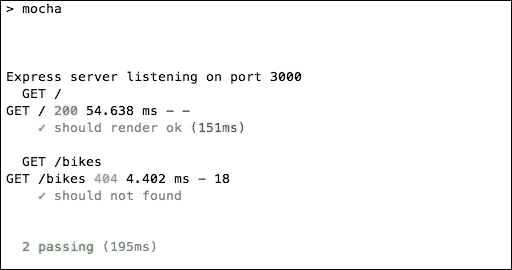

测试后的终端输出

请注意，两个测试都通过了，左侧的测试描述旁边有一个绿色的勾号图标。

# 运行应用程序

现在是时候检查应用程序了：

1.  打开终端并输入以下命令：

```js
 npm start

```

1.  转到 http://localhost:3000/signup 并使用以下信息创建一个新帐户：

**姓名**：John Doe

**电子邮件**：john@doe.com

**密码**：123456

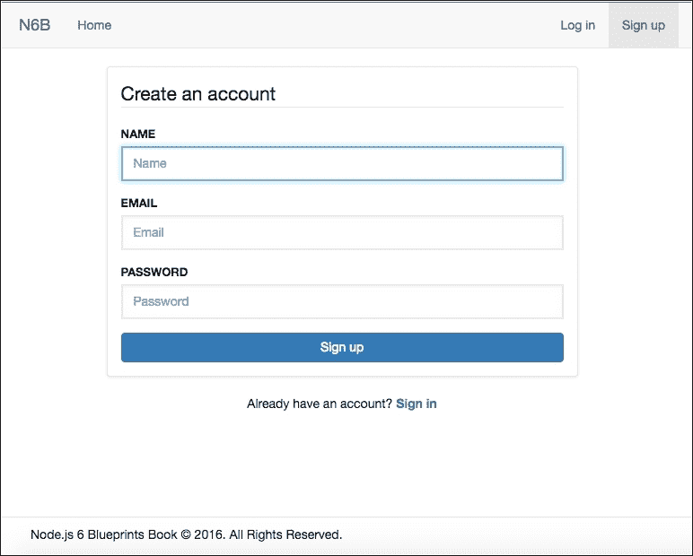

注册页面

注册流程后，转到 http://localhost:3000/account 并查看以下屏幕截图，其中包含用户信息：

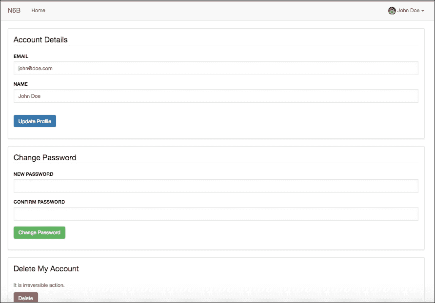

帐户信息

# 创建一个 GitHub 或 Bitbucket 免费帐户

您可以选择使用哪种服务，因为 GitHub 和 Bitbucket 都可以做同样的事情：托管公共和私有代码存储库，用于协作软件开发。

两者的功能都类似，都使用 git 作为源代码控制。我们将看到如何使用 GitHub，但 Bitbucket 的过程非常相似。

### 提示

您可以在此链接找到有关 Bitbucket 的更多信息：[`bitbucket.org/`](https://bitbucket.org/)。

## 创建 GitHub 免费账户

让我们创建一个 GitHub 账户：

1.  前往[`github.com/join`](https://github.com/join)，填写表格，然后点击**创建账户**按钮。

1.  选择**免费无限公共存储库**复选框，然后点击**继续**按钮。

1.  在第三步，您必须回答三个问题或选择跳过此步骤；点击**提交**按钮。从这里，您可以阅读指南或开始一个项目。

### 提示

请注意，您需要在开始项目之前验证您的电子邮件。

1.  点击**开始项目**按钮，并填写存储库名称，记住您可以在 GitHub 上使用这个名称，但您需要为 Heroku 和 Codeship 过程选择另一个名称。之后，您将看到以下截图：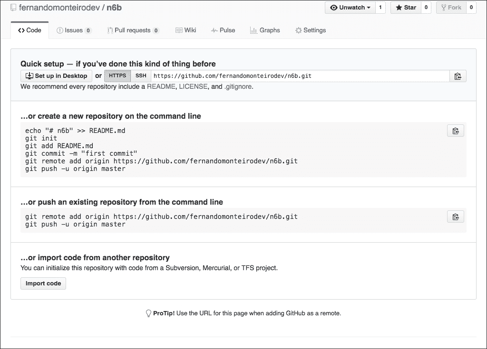

GitHub 项目

在本章的后面，我们将看到如何初始化本地 GIT 存储库以及如何将源代码推送到 GitHub 存储库。

# 创建 Heroku 免费账户

在上一章中，我们使用 Heroku 工具包命令直接将应用程序部署到 Heroku。这一次，您可以使用我们在第九章中创建的相同账户，*使用 Node.js 和 NPM 构建前端流程*，或者在[`www.heroku.com/`](https://www.heroku.com/)创建一个新账户。

# 创建 MongoLab 免费沙盒账户

MongoLab 是使用 MongoDB 作为服务所需的云服务。它提供了一个免费的有限账户作为沙盒，所以我们可以用它来部署我们的项目：

1.  继续到**注册**页面；之后，您将收到来自 MongoLab 的两封电子邮件，一封是欢迎消息，另一封是验证您的账户的链接，如果您还没有账户。

验证您的账户后，登录到仪表板时，您将看到以下截图：

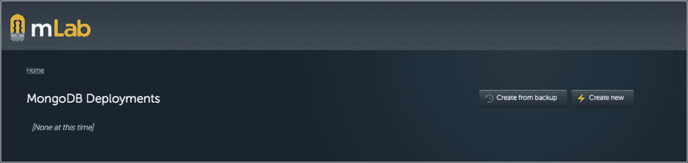

MongoLab 欢迎界面

1.  点击**创建新**按钮。

1.  选择**单节点**选项卡。

1.  从标准行面板中，选择**沙盒**的第一个复选框。

1.  向下滚动到页面底部，插入数据库名称**nb6**，然后点击**创建新的 mongodb 部署**按钮。

在这五个步骤结束时，您应该看到以下屏幕：

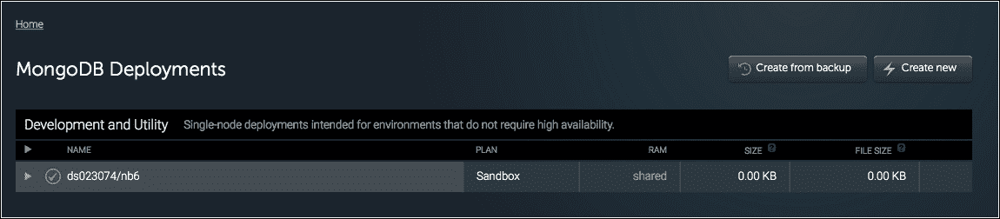

在 MongoLab 创建的数据库

## 为数据库创建用户名和密码

现在是时候创建用户名和密码来保护我们在云上的数据库了：

1.  点击数据库名称。

您将看到以下警告，建议您创建用户名和密码：

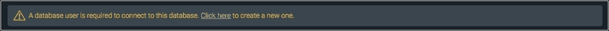

数据库警告：没有用户和密码

1.  点击警告消息内的**点击这里**链接。

1.  插入以下信息：

```js
      database username: nb6 
      database password: node6 

```

1.  点击**创建用户**按钮。

## 获取连接字符串

现在我们在 MongoLab 云服务上运行了一个 MongoDB 实例。这是我们将在本章后面使用的连接字符串：

```js
    mongodb://<user>:<password>@ds023074.mlab.com:23074/nb6 

```

### 提示

您必须用自己的用户名和密码替换以前的代码。

# 初始化 git 存储库并推送到 GitHub

此时，我们将创建本地 git 存储库，然后将其上传到我们刚在 GitHub 上创建的账户：

1.  在根应用程序文件夹中打开终端/Shell，然后输入以下命令：

```js
 git init

```

1.  通过在终端/Shell 中输入以下命令，将远程存储库添加到项目中：

```js
 git remote add origin https://github.com/<your github account 
       name>/n6b.git

```

您必须在以前的代码中使用自己的 github 用户名。

1.  通过在终端/Shell 中键入以下命令将所有项目文件添加到源代码控制：

```js
 git add .

```

1.  通过在终端/Shell 中键入以下命令提交项目更改：

```js
 git commit -m "initial commit"

```

最后一个命令是将所有文件上传到我们之前创建的 GitHub 存储库。

1.  在终端/Shell 中键入以下命令：

```js
 git push -u origin master

```

# 使用 Heroku 仪表板创建 Heroku 应用程序

这次，我们将看到另一种使用 Heroku 云服务创建项目的方法：

1.  转到[`dashboard.heroku.com/apps`](https://dashboard.heroku.com/apps)。

1.  在 Heroku 仪表板上，单击**新建**按钮，然后单击创建**新应用**链接。

1.  在应用程序输入名称字段中输入以下名称：chapter-10-yourname

1.  点击**创建应用**按钮。

## 将 Heroku 应用程序链接到您的 git 存储库

现在我们需要设置我们的 Heroku 帐户以链接到我们的 github 帐户。所以让我们按照以下步骤进行：

1.  在 Heroku 仪表板上，点击 chapter-10-yourname 项目名称。

1.  点击**设置**选项卡，向下滚动页面到**域**，并复制 Heroku 域 URL：

chapter-10-yourname.herokuapp.com

### 提示

请注意，我们不能为所有应用程序使用相同的名称，因此您需要在 chapter-10 之后提供您的名称。

稍后我们将使用应用程序名称来配置 Codeship 部署管道，所以不要忘记它。

## 向 Heroku 添加环境变量

现在我们需要创建一些环境变量，以便在我们的公共 github 存储库中保护我们的数据库字符串安全：

1.  在 Heroku 仪表板上，点击 chapter-10-yourname 项目名称。

1.  点击**设置**选项卡。

1.  在**设置**选项卡中，单击**显示配置变量**按钮。

1.  添加您自己的变量，如以下屏幕截图所示。在左侧添加变量名称，在右侧添加值：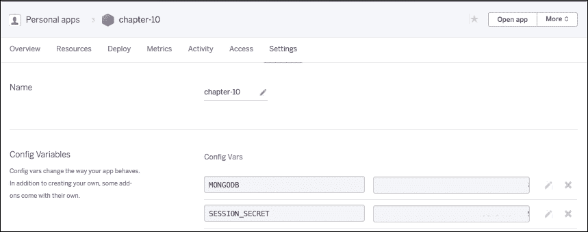

Heroku 环境变量

### 提示

请注意，您必须在 Codeship 配置项目上重复此过程。

# 创建 Codeship 免费帐户

Codeship 是一个用于持续集成（CI）工具的云服务。创建帐户非常简单：

1.  转到[`codeship.com/sessions/new`](https://codeship.com/sessions/new)，并使用右上角的**注册**按钮。您可以使用 GitHub 或 Bitbucket 帐户；只需点击您偏好的按钮。由于我们使用 GitHub，我们将选择 GitHub。

1.  单击**授权应用程序**按钮。

您应该会看到以下屏幕：

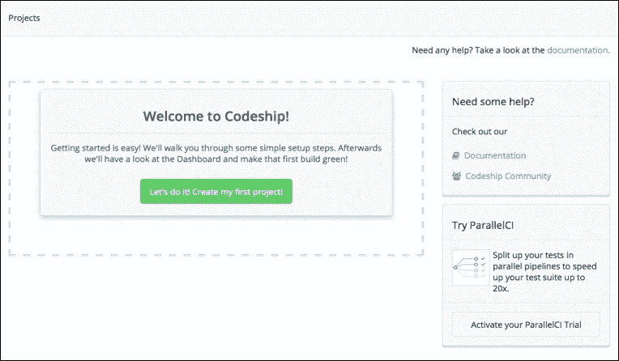

Codeship 仪表板

下一步是单击您托管代码的位置。在这种情况下，我们将单击****GitHub****图标，因此我们将看到以下屏幕：

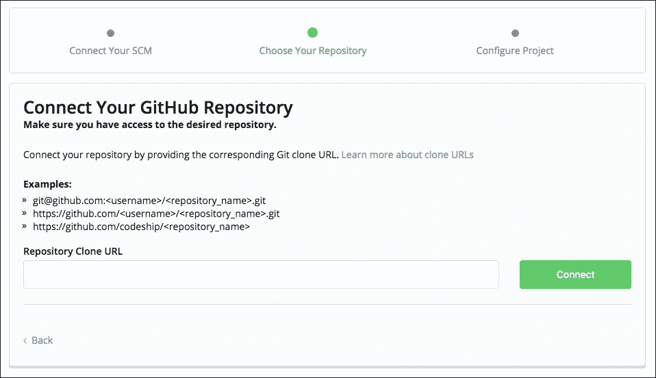

Codeship 配置的第二步

1.  复制并粘贴 GitHub 存储库 URL（https://github.com/<yourusername>/n6b.git），该 URL 是在 GitHub 设置过程中创建的，并将其粘贴到**存储库克隆 URL**输入中，如前图所示。

1.  点击**连接**按钮。

现在我们已经使用三种工具（GitHub、Codeship 和 Heroku）设置了开发环境。下一步是创建设置和测试命令，并将管道部署添加到 Codeship 仪表板。

## 向 Codeship 添加环境变量

现在让我们像我们在 Heroku 仪表板中所做的那样，向 Codeship 添加相同的变量：

1.  转到[`codeship.com/projects/`](https://codeship.com/projects/)，并选择 chapter-10-yourname 项目。

1.  点击右上角的**项目设置**链接，如图所示：

Codeship 仪表板中的项目设置菜单

1.  点击**环境变量**链接。

1.  添加会话和 MongoDB 变量和值，就像我们之前对 Heroku 环境变量的配置所做的那样，并点击**保存配置**按钮。

## 在 Codeship 项目配置中创建设置和测试命令

现在我们回到 codeship 控制面板，并为我们的应用程序配置测试和部署命令：

1.  将以下代码粘贴到设置命令文本区域：

```js
      # By default we use the Node.js version set in your package.json
        or the latest 
      # version from the 0.10 release 
      # 
      # You can use nvm to install any Node.js (or io.js) version you require. 
      # nvm install 4.0 
      # nvm install 0.10 
      npm install 
      npm run build 

```

1.  将以下代码粘贴到测试命令文本区域：

```js
 npm test

```

1.  点击**保存并转到仪表板**按钮。

## 在 Heroku 上创建部署管道

好了，我们几乎到了；现在我们需要创建一个管道，将构建与我们在 Heroku 上的部署环境集成起来：

1.  点击右上角的**项目设置**链接，然后点击**部署**链接，如图所示：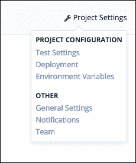

1.  在**输入分支名称**输入框中，输入以下名称：master。

1.  点击**保存** **Pipeline 设置**按钮。

1.  在**添加新的部署管道**选项卡中，选择**Heroku**横幅。

现在我们将按照这里显示的输入字段填写：

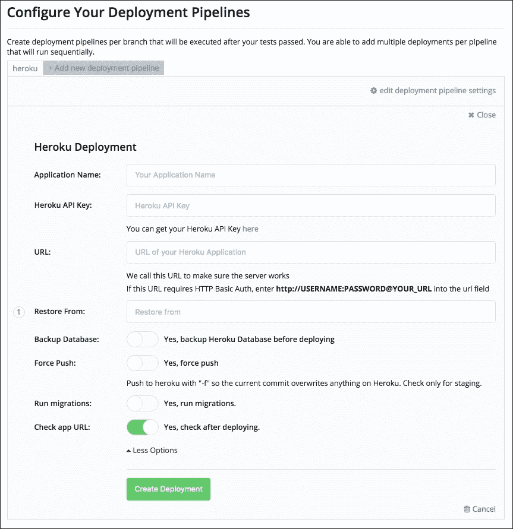

Codeship Heroku 部署配置面板

## 将 Heroku API 密钥添加到 Codeship

为了提供前面截图中所需的信息，我们需要按照以下步骤进行：

1.  打开一个新的浏览器窗口，转到 Heroku 仪表板[`id.heroku.com/login`](https://id.heroku.com/login)。

1.  点击右上角的**图片**，然后点击**账户设置**。

1.  向下滚动页面以获取 API 密钥，并点击**显示 API 密钥**，如图所示：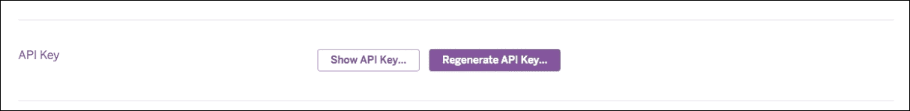

显示 API 密钥 Heroku 仪表板

1.  输入密码并复制 API 密钥。

1.  返回 Codeship 浏览器窗口，并将密钥粘贴到**Heroku API 密钥**输入字段中。

1.  命名您的应用程序：n6b-your-own-name。

1.  添加应用程序 URL：http://chapter-10-your-own-name.herokuapp.com/。

1.  点击**保存部署**按钮。

这一步完成了我们的持续集成。每当我们修改代码并将更改发送到 GitHub 或 Bitbucket 时，Codeship 将运行我们在本章前面创建 Node.js 应用程序时设置的代码和测试。

在测试结束时，如果一切正常，我们的代码将被发送到 Heroku，并且将在 http://chapter-10-yourname.herokuapp.com/上可用。

### 在 Codeship 仪表板上检查测试和部署步骤

在这一点上，我们已经有了设置测试和部署所需的命令，但是我们需要检查一切是否正确配置：

1.  转到[`codeship.com/sessions/new`](https://codeship.com/sessions/new)。

1.  登录到您的账户。

1.  在左上角，点击**选择项目**链接。

1.  点击 n6b-your-own-name 项目名称，您将看到所有带有**成功**、**运行**或**失败**标志的提交。

当我们点击其中一个时，我们可以看到以下带有逐步过程的截图：


Codeship 构建步骤

在这里我们有一个成功的构建，因为我们可以看到每个步骤右侧的绿色勾号图标。

请注意，如果测试过程在任何时候失败，代码将不会发送到生产服务器，即 Heroku。

# 安装 Docker 并设置应用程序

在我们继续之前，我们需要了解 Docker 是什么以及容器的概念。

### 提示

您可以在此链接阅读有关容器的更多信息：[`www.docker.com/what-docker#/VM`](https://www.docker.com/what-docker#/VM)。

简单来说，Docker 创建微型机器（即操作系统）在一个隔离的盒子内运行您的应用程序，无论您的平台是 Windows、Linux 还是 OSX。让我们看看官方 Docker 网站上说了什么：

> *"Docker 容器将软件包装在一个完整的文件系统中，其中包含运行所需的一切：代码、运行时、系统工具、系统库 - 任何可以安装在服务器上的东西。"*

所以让我们在你的机器上安装 Docker。Windows 机器需要特别注意，但你可以在以下链接找到相关信息：[`docs.docker.com/engine/installation/windows/`](https://docs.docker.com/engine/installation/windows/)。转到[`docs.docker.com/`](https://docs.docker.com/)并按照你的平台的说明进行操作。

## 检查 Docker 版本

现在是时候检查你的机器上安装的 Docker 版本了：

打开终端/Shell 并输入以下命令来检查每个部分的版本：

```js
 docker --version
 docker-compose --version
 docker-machine --version

```

## 创建一个 Docker 文件

为了将我们的应用程序 docker 化到一个容器中，我们需要创建两个文件，一个 Dockerfile 和一个 docker-compose.yml 文件，以将我们的应用程序容器与 MongoDb 数据库链接起来：

1.  在根文件夹内，创建一个名为 Dockerfile 的新文件，并添加以下代码：

```js
      FROM node:argon 

      # Create app directory 
      RUN mkdir -p /usr/src/app 
      WORKDIR /usr/src/app 

      # Install app dependencies 
      COPY package.json /usr/src/app/ 
      RUN npm install 

      ENV PORT 3000 
      ENV DB_PORT_27017_TCP_ADDR db 

      # Bundle app source 
      COPY . /usr/src/app 

      EXPOSE 3000 
      CMD [ "npm", "start" ] 

```

请注意，行 ENV DB_PORT_27017_TCP_ADDR 指示了 MongoDB 的 Docker 容器端口；这是一个环境变量。

1.  在根文件夹内，创建一个名为 docker-compose.yml 的新文件，并添加以下代码：

```js
      app: 
        build: . 
        ports: 
          - "3000:3000" 
        links: 
          - db 

      db: 
        image: mongo 
        ports: 
          - "27017:27017" 

```

db 行已设置为 ENV DB_PORT_27017_TCP_ADDR db 名称。

在我们继续之前，让我们检查一些有用的 Docker 命令：

| **命令** | **描述** |
| --- | --- |
| docker ps -a | 列出所有容器 |
| docker images | 列出所有镜像 |
| docker rm containername | 删除特定容器 |
| docker rm $(docker ps -a -q) | 删除所有容器 |
| docker rmi imagename | 删除特定镜像 |
| docker rmi $(docker images -q) | 删除所有镜像 |
| docker run containername | 运行一个容器 |
| docker stop containername | 停止一个容器 |
| docker stop $(docker ps -a -q) | 停止所有容器 |

我们有更多的命令，但在本章的过程中我们会看到其他命令。

## 创建一个 Docker 镜像

在这一点上，我们已经有了设置测试和部署所需的命令，但是我们需要检查一切是否正确配置：

1.  为你的项目创建 Docker 镜像：

```js
 docker build -t <your docker user name>/<projectname> .

```

在终端的输出末尾，我们可以看到类似于这样的消息：**成功构建 c3bbc61f92a6**。现在让我们检查已经创建的镜像。

1.  通过打开终端/Shell 并输入以下命令来检查图像：

```js
 docker images

```

## 准备和运行 Docker 镜像

现在让我们测试我们的 Docker 镜像。在我们继续之前，我们需要对我们的应用程序进行一些小改动：

1.  打开根文件夹中的 server.js 文件，并替换以下代码：

```js
      mongoose.connect('mongodb://' + (process.env.DB_PORT_27017_TCP_ADDR
      || process.env.MONGODB) + '/<database name>'); 

```

1.  现在打开.env 文件，并用以下行替换代码：

```js
      SESSION_SECRET=
       'ae37a4318f1218302e16e1516e4144df8a273798b151ca06062c142bbfcc23bc' 

      MONGODB='localhost:27017' 

```

### 提示

步骤 1 和步骤 2 使用本地凭据，与我们为部署所做的不同。因此，在配置 Heroku 和 Codeship 的环境变量后，从 GitHub 跟踪中删除.env 文件，但在本地机器上保留具有本地凭据的文件。

现在是时候从 Docker hub 获取一个 MongoDB 镜像了。

1.  打开终端/Shell 并输入以下命令：

```js
 docker pull mongo

```

上一个命令将获取一个新的 MongoDB 镜像。你可以使用相同的命令从 Docker hub 获取任何镜像。

### 提示

你可以在这个链接上找到更多的图像：[`hub.docker.com/explore/`](https://hub.docker.com/explore/)。

1.  用以下命令启动一个新的名为 db 的 MongoDB 容器：

```js
 docker run -d --name db mongo

```

1.  现在我们需要将一个容器链接到另一个；输入以下命令：

```js
docker run -p 3000:3000 --link db:db <your docker user name>
        /<projectname>

```

1.  转到 http://localhost:3000，你将看到你的应用程序正在运行。它看起来和在你的机器上一样。

## 将项目图像上传到您的 Docker hub 帐户

现在，是时候将你的图像上传到 Docker hub，并让其他用户可以使用了。

### 提示

你可以在这个链接上阅读更多关于**Docker hub**的信息：[`docs.docker.com/docker-hub/`](https://docs.docker.com/docker-hub/)。

1.  转到[`cloud.docker.com/`](https://cloud.docker.com/)并创建一个免费帐户。

1.  确认你的电子邮件地址后，转到[`cloud.docker.com`](https://cloud.docker.com)登录菜单。你将看到以下仪表板：

Docker hub 仪表板

当您点击**存储库**按钮时，您会发现它是空的。现在让我们将我们的 Docker 图像推送到 Docker hub。

1.  打开终端/Shell 并输入以下命令：

```js
 docker login

```

输入您的凭据，这些是您在注册过程中创建的。

1.  要将项目上传到 Docker hub，请在终端/Shell 上运行以下命令：

```js
 docker push <your docker user name>/<projectname>

```

1.  返回到[`cloud.docker.com/_/repository/list`](https://cloud.docker.com/_/repository/list)，刷新页面，您将看到您的存储库已发布在 Docker hub 上。

Docker 是一个强大的工具，必须进一步探索，但从本章开始，我们已经有足够的知识来使用 Docker 容器构建 Node.js 应用程序与 MongoDB，这意味着您可以在任何机器上使用我们创建的容器。无论您使用什么平台，您只需要安装 Docker 并将图像拉到您的机器上。

您可以获取任何图像，并在命令行上开始使用它。

# 总结

到本章结束时，您应该能够使用我们目前可用的所有最现代化的技术和工具来构建和部署应用程序，从而创建令人惊叹的 Web 应用程序。

我们已经探索了构建应用程序所需的所有资源，使用持续交付和持续集成，结合 Git 源代码控制，GitHub，Codeship，Heroku 和 Docker。我们还看到了如何在 Heroku 云服务的生产环境和 Codeship 的测试和持续集成中使用环境变量。
